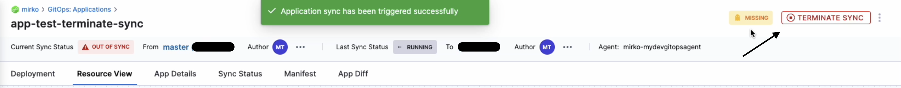

import Tabs from '@theme/Tabs';
import TabItem from '@theme/TabItem';

<DocsButton icon = "fa-solid fa-square-rss" text="Subscribe via RSS" link="https://developer.harness.io/release-notes/continuous-delivery/rss.xml" />

These release notes describe recent changes to Harness Continuous Delivery & GitOps (NextGen SaaS). For release notes for Harness Self-Managed Enterprise Edition, go to [Self-Managed Enterprise Edition release notes](/release-notes/self-managed-enterprise-edition). For FirstGen release notes, go to [Harness SaaS Release Notes (FirstGen)](/docs/first-gen/firstgen-release-notes/harness-saa-s-release-notes).

:::info About Harness Release Notes

- **Progressive deployment:** Harness deploys changes to Harness SaaS clusters on a progressive basis. This means that the features described in these release notes may not be immediately available in your cluster. To identify the cluster that hosts your account, go to your **Account Overview** page in Harness. In the new UI, go to **Account Settings**, **Account Details**, **General**, **Account Details**, and then **Platform Service Versions**.
- **Security advisories:** Harness publishes security advisories for every release. Go to the [Harness Trust Center](https://trust.harness.io/?itemUid=c41ff7d5-98e7-4d79-9594-fd8ef93a2838&source=documents_card) to request access to the security advisories.

:::

<details>
<summary>Upcoming RBAC enhancements for Harness customers using Policy as Code</summary>

import RbacForOpa from '/release-notes/shared/rbac-enhancements-for-opa-users.md'

<RbacForOpa />

</details>

<details>
<summary>Deprecation notices</summary>

#### Helm 2

import Helmdep from '/release-notes/shared/helm-2-deprecation-notice.md'

<Helmdep />

#### Kustomize

import Kustomizedep from '/release-notes/shared/kustomize-3-4-5-deprecation-notice.md'

<Kustomizedep />

</details>

## July 2024

### Version 1.48.8

#### New features and enhancements

- The Verify step was not appearing in Continuous Deployment (CD) for SMP version 1.19.10. This was because the Verify step was initially part of the Service Reliability Management (SRM) module. Users who did not have the SRM module enabled could not see the Verify step. Now, as Continuous Verification (CV) has been moved to CD, this step will be available for all users who have CD enabled. (CDS-98542, ZD-65452)

- In the GitOps Application page, a new button to terminate an ongoing Application Sync has been introduced. This feature is helpful for long-running or stuck sync situations. The button is visible on the top right of the screen, replacing the Sync button when a sync is ongoing. (CDS-97563)



#### Early access

- When deploying to Amazon's EKS, a new option to manually configure the connection to the cluster is available. Previously, you could only connect through an AWS Connector. Now, you can provide the cluster endpoint and optionally provide a CA cert. This feature is behind the feature flag `CDS_AWS_EKS_CLUSTER_MANUAL_CONFIGURATION`. Contact [Harness support](mailto:support@harness.io) to enable it. (CDS-91561)

#### Fixed issues

- In a few cases, skipped stages/steps in Pipeline executions were being displayed in blue instead of grey. The issue is fixed now. (PIPE-20138, ZD-65966)
- Stage/Step popover was hidden behind the Navigation UI. The issue is fixed now. (PIPE-20028, ZD-65628)
- When we rerun a pipeline with multi-env deployment stages or stages in a Matrix, the rerun would skip over the stages that were skipped the last time, without re-evaluating the Execution Condition. This is fixed now; the Executional Condition is re-evaluated for previously skipped stages in Matrix during re-run, and if the condition is now true, they are executed. Note, this is only in the case where the execution failed midway within a Matrix or Multi-Env deployment in the pipeline, and we need to rerun the pipeline from that Matrix. (PIPE-19746, ZD-64970)
- When you scroll to the bottom of the Pipeline Page and click on the last pipeline on the page, if your default view is YAML, the YAML in the Pipeline Studio was previously opening in a scrollable view. This issue has now been fixed. (CDS-98674, ZD65768,66530)
- Scrolling was not working when the cursor was inside the script step. The issue is fixed now. (CDS-98607)
- Previously, when trying to edit an existing Values YAML Manifest in the overrides section, users had to click a pencil icon on the far right. After clicking this pencil icon, another pencil icon, which was mostly hidden, appeared on top of the LOCATION section. This caused confusion as users were not seeing the second pencil icon. This issue has now been fixed. (CDS-98565, ZD-65892)
- GitOps instances on Harness service were out of sync with applications that did not have project mappings but were part of the agent. The issue is fixed now. (CDS-96719, ZD-63203)
- Incorrect unmarshalling of Terraform configuration to a JSON object for the API request caused backend validations to fail, resulting in a 500 response code. The issue is fixed now by adding more validation and null checks in the backend. (CDS-96374, ZD-62737)
- In certain cases, the execution order and failure handling in pipelines were inconsistent. For example, if the last stage in a failed, the deployment continued instead of stopping. Additionally, steps within a step group sometimes executed even if previous steps had failed, causing confusion about the conditional execution logic and maximum concurrent executions not being honored. The issue is fixed now and StepGroup combinations will now be marked as skipped if one of the steps in the StepGroup fails and rollback happens during Pipeline Execution. (PIPE-19763, ZD-65041)

### Version 1.45.5

#### New features and enhancements

- **Bi-Directional Sync Health Status for Git Sync**

We have introduced a Git Sync status page for Harness NG. Once you have synced your Harness entities with your Git repository, you can view bidirectional activity between Harness and your repository using the Bi-Directional Sync Health Status feature. For each entitiy, you can see file path, commit message, status of the last sync as well as the payload. Refer to Harness [Git Sync health Page](/docs/platform/git-experience/git-sync-health-page) for more information. (PIPE-16865)

- **HTTP support HTTPS Authentication for Terraform and Terragrunt Modules**

You can now fetch modules for Terraform and Terragrunt via HTTPS authentication using GitHub, Bitbucket, and GitLab connectors(CDS-95361)

- **API to get execution details along with input yaml that was passed during the execution**

You can fetch a lite version of execution details along with input yaml that was passed during the execution with help of an API.(PIPE-19713)

- Go version has been updated to `1.22.3` for the GitOps Service and GitOps Agent. (CDS-97613)

- ArgoCD version packaged with harness gitops agent has been upgraded to `v2.10.10`. (CDS-97420)


#### Behavior changes

- Previously, when the verify step failed, and an action was taken based on the failure strategy or manual intervention, the title was always shown as **Manual Intervention**. (CDS-97985, ZD-65113)

   Now, the title is updated to reflect the nature of the intervention:
   - **Intervention** is displayed when the action is performed through the CV failure strategy configuration.

   - **Manual Intervention** is displayed when the action is performed through manual intervention.

#### Fixed issues

- The left stage/steps was overlapping with the pipeline UI. The issue is fixed now. (PIPE-20028, ZD-65628)
- The trigger was getting invoked without an artifact push. The issue is fixed now. (PIPE-19806)
- Changes made to files in Git repository were not reflected in Harness. The issue is fixed now and it is ensured webhooks events are now correctly triggered, enabling accurate bididrectional synchronization. (PIPE-19654, ZD-64687)
- When a Template was selected and added to a Pipeline, the UI options was not allowing the user to select **Always use Stable Template**, although this was possible through the YAML by removing the template version. This issue has now been fixed and the Template can be set to **Stable version** in the calling Pipeline. (PIPE-16496, ZD-60750)
- Extra border was appearing on the settings page during extensive scrolling. The issue is fixed now. (CDS-98494, ZD-65368)
- While clicking on the **View References** button while deleting a Secret was not properly redirecting the user. The issue is fixed now. (CDS-98487)
- Discrepancy was observed in text box size between HTTP step and HTTP step template. The issue is fixed now by adding conditional width for pipeline input form and template. (CDS-98094, ZD-65420)
- When updating the **File Usage** in File Store, an error was being thrown that the file usage could not be updated, even though it was being updated properly. The issue is fixed now. (CDS-98077, ZD-65347,65353)
- Even though clusters were selected and listed under a specific environment, the Gitops Sync task was getting an error **Following clusters were skipped either because clusters were not linked to the environment or not present in Harness GitOps**. The issue is fixed now. (CDS-98022)
- Azure App deployments were not working as expected due to recent log changes by Azure. Azure now provides logs for multiple containers, which affected the integration. The issue is fixed now and includes log pattern recognition that mark the pipeline success based on matching specific patterns in the logs. (CDS-98000, ZD-65289)
- The license trends graph for the SI model was previously inaccurate due to the queries grouping services based on projects. As per the correct definition, all services should be grouped in a single bucket irrespective of the organization or project. The issue is fixed now and the queries have been updated to accurately reflect the current license count on the license trend graph for the SI model. (CDS-97966)
- Git Experience for Overrides was not working. Previously, the UI tried to always fetch the overrides from the default branch failing the get call from the UI. The issue is fixed now. (CDS-97874)
- In Custom template, service and Infrastructure is optional and if Infrastructure is fixed and from UI side and if there is no value present it was getting set to undefined that was leading to the removal of  **infrastructureDefinitions** key and if there is no key it will throw an error. The issue is fixed now. (CDS-97815,ZD-64148,64652)
- Changes to add `metricThresholds` to NewRelic health monitors are causing Terraform to hang while waiting for an updated response. Despite the hang during the first execution, subsequent executions of the pipeline indicate that the resource was successfully updated. The issue is fixed now by changing the error code. (CDS-97793, ZD-65015)
- When a template YAML contained duplicate keys and was linked to a pipeline, the error message only indicated the presence of duplicate keys without identifying the specific template. The error message has been improved to include the template identifier, enabling users to locate and fix the issue in the relevant template. (CDS-97785, ZD-64989)
- While selecting the Deployment type **AWS SAM** and toggling the CV button it was throwing an error due to no template being chosen. The issue is fixed now. (CDS-97771)
- For Winrm deployment with Command step and auth type as Kerberos if the environment variables contains characters `\b, \v, \c, \f, &` the script execution was failing as we parse the response of script execution to xml string and above characters are illegal xml characters. The issue is fixed and now and these characters will be escaped. This change is behind the FF `CDS_ESCAPE_ENV_VARS_FOR_WINRM_KERBEROS_NG`. (CDS-97690, ZD-55276,58201,66326)
- When using a connector at a project scope, the preflight check fails when the connector reference links to the connector url stored or created at an account level due to an incorrect routing to a `Not Found` page. This was because, scope details were missing from the API. The issue is now fixed.  (CDS-97593, ZD-64673)
- Logs were not being uploaded for shell script step and some other steps in case the step timed out. The issue is fixed and the shell script step now uploads the logs on step timeout. (CDS-97521, ZD-64422)
- The shell script step was not doing a capability check before assigning the tasks to the delegate. The issue is fixed and the shell script step will now have a host capability check. (CDS-97512, ZD-66326,66349)
- The ServiceNow step was not updating the ticket but was showing successful with no logs being shown. The issue is now fixed and console logs and debugging help has been added in the ServiceNow steps. (CDS-97033, ZD-63637)
- When selecting **Use Template** on an Approval Stage, Steps were showing, but Step Group Templates were not. The issue is now fixed, and users will be able to create a step group template with the approval stage type. These templates can be used in approval stages as step entities. (CDS-96930, ZD-63556)

## June 2024

### Version 1.43.5

#### New features and enhancements

- **Infinite Scroll Support Repo listing**

This feature is currently behind the feature flag, `CDS_LIST_REPO_V2`. Please contact [Harness support](mailto:support@harness.io) to enable it.

For a certain connector, you can now search for repositories with support for infinite scroll. Simply enter any keyword to see related repositories listed. If you can't find the repository you're looking for, you can also add it manually.(PIPE-10894)

Refer to following doc for more details on new [repo listing](/docs/platform/git-experience/git-experience-overview/#repo-listing).

#### Breaking changes

- Harness now supports the serial deployment of environment groups. This feature is currently behind the feature flag, `ENV_GROUP_DEPLOYMENTS_IN_SERIAL`. Contact [Harness support](mailto:support@harness.io) to enable it. (CDS-97241, ZD-63912)

#### Fixed issues

- If drift is detected in the services dashboard tile, the **Drift Detected** hover box now displays a detailed error message with the relevant documentation link. (CDS-96911, CDS-96722)
- The project level artifact feed was not working for azure web services deployment and the project information was fetched from the wrong object. This issue is now fixed and the project level feed for artifact collection now works as expected. (CDS-97586)
- Fixed an issue where hovering on variables did not work as expected. (PIPE-14668)
- The GitEx Health page is now updated to include information about GitEx webhook events validation such as event status and status of other related entities. (PIPE-18466)
- When a Template is selected and added to a Pipeline, the UI options don't allow the user to select **Always use Stable Template**, although this was possible through the YAML by removing the template version. This issue is now fixed and the Template can be set to **Stable version** in the calling Pipeline. (PIPE-16496, ZD-60750)


### Version 1.42.4

#### Breaking changes

- Validations have been added to override variable names. Now, a new variable name cannot be saved if it starts or ends with a space. Also, validations have been added for special characters. This is a breaking change for the already saved invalid variable names. Hence, this change is enabled behind the feature flag, `CDS_OVERRIDES_VARIABLE_NAME_VALIDATIONS`. After enabling the feature flag, you can see that the variable names are being validated when creating or updating overrides. (CDS-97386, ZD-62711)


#### Fixed issues

- Validation for the pipelines with templates imported from Git failed. Typically, schema validation is done in the pipeline Get, Create, or Update calls. However, schema validation for pipelines imported from Git (with templates) is done without resolving the templates because it's an expensive operation. Therefore, schema validation in the async validate call to identify any schema errors causing validation failure. Note that the issue only happens with imported pipelines with templates from Git currently. (PIPE-18537, ZD-61841)
- Null Pointer Exception occurred in the Verify step. Added null point checks to avoid this error in the future.  (CDS-97388)
- Pipeline execution showed inconsistencies. This issue is fixed by fixing a retry bug with the delegate's Git client where it did not retry on specific errors. (CDS-96877, ZD-63321)
- Service failed intermittently when fetching the `ECR_ARTIFACT_TASK_NG` artifact. This issue is fixed by optimizing ECR calls by reducing the number of client creation calls and reusing the clients by passing them and eventually using them to make calls instead of creating clients every time. (CDS-96861, ZD-63061)
- The Execution History page broke when numbers were used in the Tags field. This issue is fixed by converting the string holding the number to string type before applying string methods on the variable. (CDS-96636)
- When trying to resolve the expressions in the File Store scripts, Harness encountered a self referencing expression. Due to this condition, the resources associated with two Harness services were exhausted. A code change fixed this issue by preventing such pipeline executions. This item requires Harness Delegate version 24.06.83304. For information about features that require a specific delegate version, go to the [Delegate release notes](/release-notes/delegate). (PIPE-19585, ZD-64579, ZD-64580)


### Version 1.41.6


#### Usability enhancement

- Harness Approval step usability has been enhanced. Earlier, during pipeline execution with the Harness Approval step, the approval actions, Approve and Reject had low visibility in the Executions view. This has been enhanced to match with the Console view where the Approve and Reject actions are available in the top section. You must now provide the Approval inputs upon clicking **Approve or Reject**.


#### Early access
- Harness now lists all pipeline executions including retired and child executions in the Executions page. This feature is behind the feature flag, `PIE_SHOW_ALL_EXECUTIONS_FILTER`. Contact [Harness support](mailto:support@harness.io) to enable it. (PIPE-18492, ZD-64066)

#### Fixed issues
- Updates made to stage variables did not reflect in the pipeline. When adding a new allowedValue in a template, the changes were not getting propagated to the pipeline as it was getting treated as subset. This issue was caused by a change made in the code to allow subsets of values in allowedValues in a nested pipeline/template. Harness is reverting this change, and will support exact allowedValues in pipeline/template during reconciliation. Some customers may face reconciliation errors if they are using subset allowedValues already. (PIPE-19102, ZD-62929)
- Running a pipeline returned an unclear error message, `Invalid request: Cannot create pipeline entity due to Unexpected token (FIELD_NAME), expected END_OBJECT: expected closing END_OBJECT after type information and deserialized value at [Source: (StringReader); line: 13124, column: 1]`. This issue is fixed by providing a meaningful error message for the `getStageExecutionList` flow. (PIPE-16557, ZD-60649)
- Null pointer exception occurred when populating instrumentation data for sending events for telemetry. This issue occurred because some JsonNode objects returned null while called using GET method. This issue is resolved by adding null checks for the JsonNode objects. (PIPE-16452)
- Service steps failed intermittently when fetching the ECR_ARTIFACT_TASK_NG artifact. This issue is fixed by optimizing ECR calls by reducing the number of client creation calls and reusing the clients by passing them and eventually using it to make calls instead of creating clients every time. (CDS-96861, ZD-63061)
- Terraform configuration for a monitored service returned the `500` response code. This issue occurred due to incorrect un-marshalling of Terraform configuration to the JSON object for the API request. This led to backend validations failing and causing the `500` response code. This issue is fixed by adding more validations/null checks in the backend. (CDS-96374, ZD-62737)


## May 2024

### Version 1.39.4

#### Fixed issues

- Fixed an issue where the MS Teams notifications didn't show the event names. Now, the pipeline end event appears as "ended" and the pipeline success event appears as "succeeded" in notifications. (PIPE-18855, ZD-62684)
- For a pipeline with bidirectional sync enabled, the file name change in GitHub was not properly reflected in the Harness UI. This issue is fixed by enhancing the cache handling for files. (PIPE-18828, ZD62791)
- Step group templates did not appear when selecting Use Template on an Approval stage. This issue is fixed. You can now create a step group template with the Approval stage, and use them as step entities in the Approval stage. (CDS-96930, ZD-63556)
- The HTTP step's Request Body field stretched horizontally to fit lengthy expressions. This issue is fixed. (CDS-96839, ZD-63344)
- Fixed an issue where users were unable to save YAML changes when creating a new infrastructure definition. (CDS-96396, ZD-62801, ZD-63997)
- The TerraformCloud Run step did not fail if the Terraform Apply step failed. This issue occurred because we were not checking the status of Terraform Apply after streaming logs. If Apply started, the step passed even if the Apply step did not complete. The step failed only when the Apply step failed to start, but not if it failed midway. This issue is fixed. The TerraformCloud Run step now fails if the Apply step fails midway, allowing users to use appropriate failure strategies. (CDS-96089, ZD-62254, ZD-63371)
- Fixed an issue where runtime expressions and values were not supported for Helm Values files in the Update GitOps Apps step. (CDS-96005)
- The Resource Constraint pop-up didn't show the ongoing execution details in the pipeline execution console view. This issue is fixed. (PIPE-18831, ZD-62825)

### Version 1.38.2

#### Early access

- You can now select a monitored service template from a Verify step during runtime. This feature is currently behind the feature flag, `CV_MONITORED_SERVICE_TEMPLATIZATION`. To enable a feature flag in your Harness account, contact [Harness Support](mailto:support@harness.io). For more details, go to [Templates and templatization in CV](/docs/continuous-delivery/verify/cv-concepts/templates). (CDS-80059)

#### Limitations

- The `$HOME` variable does not resolve to the home path when creating a directory or file path because the value is being used as a string. You cannot pass any value to the `$HOME` variable using expressions in a pipeline level. (CDS-96691, ZD-62711)

#### Fixed issues

- There was a recent change to the expression resolution fallback logic to call the fallback only for customers who has the feature flag, `CDS_DISABLE_FALLBACK_EXPRESSION_ENGINE` set to true. The current value is false for everyone. However, during this change, the fallback was not being called for customers who has set the feature flag to true, causing the expression to fail. This issue is fixed by correctly calling the fallback in case of failures and adding UTs to handle it. (PIPE-19013, ZD-63175, ZD-63194)
- Fixed an issue where pipelines with IDP stages were not generating the correct pipeline execution URL. (PIPE-18322, ZD-60366)
- Custom stages were not displaying wait status for the Approval step. Earlier, the stages were not marked as waiting when the steps went into waiting status. Now, the stage nodeExecution is marked as waiting when the step goes into waiting status. And, the stage is resumed when all the steps under that stage are resumed. (PIPE-15829, ZD-61238)
- Input sets displayed wrong path even when the correct path exist. This issue is fixed. Now, selecting an infrastructure definition from a repository that is different from the parent input set's repository will no longer return an error. (CDS-96589, ZD-62984)
- Unable to send `GitEntityFindInfoDTO` for Docker artifact resources. This issue occurred because the Git metadata was not being passed as a query parameter in API calls. This issue is resolved by making backend changes to resolve the YAML. (CDS-96379)
- The error that appeared when a pipeline was missing a reference to Harness resources like service, environment, etc, appeared only for a small amount of time and didn't allow users to see necessary details. This issue is fixed. The error message now stays until users close it manually. (CDS-96302, ZD-62677)
- Trigger activity history cleared when updating trigger. This issue is fixed by changing the Trigger Activity History retention duration to 6 months instead of 7 days. (CDS-95729, ZD-61782)
- The nav header panel of the Harness UI was not collapsible. The panel is now collapsible and appears when you hover over it. (CDS-95698, ZD-61706, ZD-61707)
- Artifact builds were not loading if its entities were in a different repository. This issue is fixed.(CDS-95196, ZD-60805)
- The fixedValue field is mandatory for backend as well now. Earlier, Harness has validations in place to ensure that fixedValue in the UI is not null. This change is implemented in the backend as well for consistency for API contract from backend as well as UI. (CDS-94414)
- Multiple infrastructure definitions were pointing to the same underlying infrastructure and deployed the same service, and doubled the instance count. This issue is fixed. (CDS-88736)

  You can run the following API to check duplicate instances in your account.

  ```
  curl --location 'https://app.harness.io/gateway/ng/api/instancestats/duplicates?routingId=&lt;accountId&gt;&accountId=&lt;accountId&gt;&orgIdentifier=&lt;orgId&gt;&#39; \
  --header 'Authorization: Bearer <token>'
  ```
  
  You can refer to `instanceKey` to identify the duplicate instance. For example, for Kubernetes, the format is `K8sInstanceInfoDTO_<podName>_<namespace>_<imageName>`.

### Version 1.37.6

#### Fixed issues

- Fixed an issue where users were not able to configure **Job Parameters** for a Jenkins job. (CDS-95864, ZD-61927)
- The **Feed** field in the Artifact Details page for Azure artifacts threw a null pointer exception error. This issue occurred due to the presence of a whitespace in the Azure project name due to which Harness was not able to parse the URL as an URI object. This issue is fixed by encoding the URL to convert the whitespace in the project name to `%20` as per the UTF-8 standard to avoid the null pointer exception. (CDS-95752, ZD-61696)

### Version 1.36.5

#### Early access

- We have introduced a Patch step for Kubernetes deployments to make changes to specific resources or workloads in a Kubernetes cluster without affecting other fields. This step helps Spinnaker users migrate to Harness. Spinnaker has a stage type called Kubernetes Patch. This feature provides parity with that. This feature is currently behind the feature flag, `CDS_K8S_PATCH_STEP_NG`. Contact [Harness support](mailto:support@harness.io) to enable it. This feature also requires Harness Delegate version 24.04.82804 or later. For more information, go to [Kubernetes Patch step](https://developer.harness.io/docs/continuous-delivery/deploy-srv-diff-platforms/kubernetes/cd-k8s-ref/kubernetes-patch-step/.) (CDS-86983)

#### Fixed issues

- Fixed an issue where the new Nav in the Harness NextGen UI was unable to hide the **Launch FirstGen** button. (CDS-95845, ZD-61778)
- Fixed an issue where the expressions field did not render properly. Harness now supports multi-line text fields for expressions. (CDS-95843)
- Queries in `harness-prod2-cvng.verificationJobInstances` were scanning too many documents and raising the CPU utilization. This issue is fixed by adding more `verificationJobInstances` indexes. (CDS-95840)
- Fixed an issue where the drop-down capability for the **Region** field in the AWS Serverless Lambda **Infrastructure Details** page was missing. (CDS-95726)
- Unable to add tags to pipelines in Terraform. This issue is fixed by updating the tags description in the pipeline CRUD API Terraform docs to highlight that the value passed in tags should match the value passed in YAML. (PIPE-18705, ZD-62221, ZD-62415, ZD-63124)

## April 2024

### Version 1.35.4

#### Fixed issues

- The fetch tag to fetch the repository for the Artifactory repository type expired after 90000 milliseconds. This timeout occurred because the fetch task has a hardcoded timeout limit of 90000 milliseconds. This issue is fixed now. Earlier, while fetching the repositories for Artifactory, to fetch the package type Harness made API calls to each repository to get the package type. With this change, if the API response has package type, we avoid the extra API call. (CDS-95485, ZD-60868)

### Version 1.34.2

#### Early access

- You can now store Terraform Plan files on Harness Delegate temporarily. This feature is behind the feature flag, `CDS_STORE_TERRAFORM_PLAN_FILE_LOCALLY_ON_DELEGATE`. Contact [Harness Support](mailto:support@harness.io) to enable this feature. This feature requires Harness Delegate version 24.04.82705 or later. For more information, go to [Store Terraform Plan on Harness Delegate](https://developer.harness.io/docs/continuous-delivery/cd-infrastructure/terraform-infra/run-a-terraform-plan-with-the-terraform-plan-step/#store-terraform-plan-on-harness-delegate). (CDS-85209)

#### Fixed issues

- The create trigger API response was updated to a new version without notice. This issue is fixed by updating the field `stagesToExecuteV2` back to `stagesToExecute` in the create trigger API response. (CDS-95526, ZD-61419)
- The expression, `<+lastPublished.tag>` did not fetch the latest artifact version for Nexus3 repository. Nexus3 artifact sources with `<+lastPublishedTag>`were relying on lexical ordering instead of the order of tags causing this issue. This issue is fixed by honoring the order of tags. (CDS-95312, ZD-61173)
- User profile appears at the new navigation in the Harness UI allowing users to create keys at an organization and project level. This issue is fixed by removing the project and org identifiers from the API payload when creating API keys. (CDS-95250, ZD-61325)
- Fixed an issue where the snapshot build was failing due to erroneous changes in Continuous Verification (CV). The GRPC registration from IDP, IACM, and CV services now include server interceptor class bindings from the application itself. (CDS-95241)
- Queries in `harness-prod2-cvng.verificationJobInstances` scanned 35K+ documents but returned none. This issue is fixed by adding more query indexes for `VerificationJobInstances`. (CDS-95219)
- Harness CV has reclassified the `javax.ws.rs.NotFoundException` from error to warning. (CDS-95136)
- Fixed an issue where notification for the Verify step failure was having unresolved variable in error details. (CDS-94886, ZD-60617)
- Fields from multiple manifest other than the primary manifest appeared in the pipeline when using multiple Helm charts. This issue is fixed. Now, only fields of the primary manifest appear in the run pipeline form. If primary manifest is not selected in pipeline, then Harness will prompt you to select the primary manifest in the run pipeline form. (CDS-94460, ZD-59994)
- Fixed an issue where infrastructure did not appear as a runtime input for chained pipelines in the run pipeline form. (CDS-94272)
- New Relic verification did not work as expected. The last null entry was leading to an error when decoding the response object. A code enhancement to ignore any null entry fixed this issue. (CDS-94113, ZD-59612)
- Fixed an issue where service inputs did not appear in template inputs for nested templates where the service was fixed inside the nested template. (CDS-92836)
- IDP and other new modules did not appear in the default module list. This issue is fixed. If a feature flag is turned on for a module, it will now appear in the module selector in the new navigation experience. (CDS-85185, ZD-59478)
- The Retry Step Group failure strategy option appeared for steps. This option should appear only when selecting failure strategy for a step group. This issue is fixed. We also have the failure strategy, Proceed with Default Values, applicable for limited scenarios. This option will now appear in the failure strategy list wherever applicable. (PIPE-16868, ZD-61102)

### Version 1.33.5

#### Breaking changes

- The RepoName, FilePath, and ConnectorRef parameters are marked as required in the Git import APIs for pipelines, templates, input sets, services, environments, infrastructure definitions, and service overrides. These parameters were optional before but made mandatory now as the APIs require these to work. (CDS-94245)

#### New features and enhancements

- Harness will enable Overrides (V2) in your accounts and migrate your existing Overrides (V1) to the new V2 experience on 20 April, 2024. Contact [Harness Support](mailto:support@harness.io) for queries or assistance regarding the migration.
  
#### Fixed issues

- Fixed an issue where the Nexus 2 artifactory registry drop-down listed duplicate group IDs. (CDS-94376, ZD-60041)
- Terraform deployment failed when using AWS connectors (IRSA credential type with assume cross account role) in Terraform steps. This issue occurred when the Terraform Apply step was trying to assume a different role from the AWS backend configuration. The default duration for assuming the role in the `aws-java-sdk` is 15 minutes. When the Terraform Apply step exceeded 15 minutes, the Terraform output threw an error. This issue is resolved by introducing a new Harness variable, `HARNESS_AWS_ASSUME_ROLE_DURATION`. In Terraform steps, you can now set the environment variable value to override the default duration to assume AWS roles. This item requires Harness Delegate version 01.04.82700. For information about features that require a specific delegate version, go to the [Delegate release notes](/release-notes/delegate). (CDS-94355, ZD-60095)
- Unable to load the AWS resources during an Amazon ECS Blue Green deployment. The API call for fetching elastic load balancer call was not being made in the stage causing this issue. This issue is fixed now. (CDS-94084, ZD-59734)
- The dashboard widget in the Deployments Dashboard showed a mismatch in the executions count. This issue is fixed by synching the missing data for dashboards. (CDB-1599, ZD-60164)
- Fixed an issue where Harness was unable to integrate Google Cloud Operations with Continuous Verification (CV) for service monitoring. This item requires Harness Delegate version 01.04.82700. For information about features that require a specific delegate version, go to the [Delegate release notes](/release-notes/delegate). (CDS-93479)
- Fixed an issue where users were unable to create Zendesk tickets for the Platform module. (CDS-95061, ZD-60650, ZD-60734)
- Continuous Verification (CV) telemetry failed if any one of the publish data failed. This occurred because all telemetry information is present in the same try catch block. This issue is fixed by separating telemetry publish events in different try catch blocks. (CDS-94962)
- Fixed an UI issue where breadcrumbs in the Pipeline Studio pages overlapped. (CDS-93678)
- Updated the behavior of the Scale step to publish all workload pods as new pods after step run as the Scale step is used to scale pods as well as change traffic on the pod itself. (CDS-91534, ZD-54319)

### Version 1.31.4

#### Early access

- Harness has introduced a **Mark as Failure** button on the Pipeline Execution Details page to send a Failure interrupt to all currently executing stages of the pipeline, triggering their Failure Strategies. This functionality is behind the `FF CDS_MARK_PIPELINE_AS_FAILURE`. Contact [Harness Support](mailto:support@harness.io) to enable this feature. For more details, go to [Mark pipeline as failed](/docs/platform/pipelines/failure-handling/mark-as-failed-pipeline/).(CDS-72037)

#### Fixed issues

- For SSH and WinRM deployments, the delegate selectors specified for connectors in Azure and AWS infrastructure configurations weren't adhered. The fix for this issue is made available behind the feature flag, `CDS_SSH_WinRM_USE_CONNECTOR_AND_SM_DELEGATE_SELECTORS`. Contact [Harness Support](mailto:support@harness.io) to enable this fix. (CDS-92717, ZD-58399)
- Harness applications were slow when running pipelines using the `iam-roles` API. This issue is fixed by calling the API on demand to avoid slowing down the initial load of the applications. (CDS-94281, ZD-60078)
- Pipeline execution feature usage were not displayed properly in the feature usage dashboard when filtered by organization. This issue is fixed.  (CDS-93831)
- Fixed an issue where Harness was unable to find Nexus artifacts' tag version. The artifact Ids were set to `<+input>` internally even though Harness UI supplied the fixed value from APIs causing this issue. Tags are now being listed properly. (CDS-93810, ZD-59568)
- The Nexus 3 artifact triggers returned a null pointer exception. This issue occurred because the Nexus 3 artifact source group Id was empty. This issue is fixed. (CDS-93472, ZD-59186)
- The Command Script step with secret environment variables failed during rollback because the step was unable to fetch the secrets. This issue is fixed. (CDS-93264, ZD-59173)
- The logs explorer for a Kubernetes deployment displayed an error, `Execution Mode not found for Facilitator Type RESOURCE_RESTRAINT`. This is not an error but an information. This issue is fixed by changing the log to info with an added message, `This must be a custom Facilitator Type`. (CDS-94001)
- Users were able to see templates belonging to a specific organization in another organization. This issue occurred because Harness was fetching all templates of all organizations in one account. This issue is fixed by adding a filter to the existing query to display all templates of the organization where the project exists. (CDS-93721)

## March 2024

### Version 1.30.7

#### Early access

- Harness has updated the logic for inheriting permissions from containerized step groups to steps. Currently, this feature is behind the feature flag `CDS_CONTAINER_STEP_GROUP_RUN_AS_USER_AND_PRIVILEGED_FIX`. Contact [Harness Support](mailto:support@harness.io) to enable the feature. (CDS-79356)
  
  The new logic follows these steps:
  1. Use the Run Step configuration.
  2. If there isn't a Run Step configuration, use the Step Group configuration.
   
  For more information, go to [Permissions inheritance logic from containerized step groups to steps](/kb/continuous-delivery/articles/configuration-inheritance-stepgroup-step/). 

- You can create a multi-phase workflow that progressively deploys your new instances to a new ASG incrementally using the ASG Phased Deploy step when creating a Canary deployment. For more information, go to [Canary phased deployment](/docs/continuous-delivery/deploy-srv-diff-platforms/aws/asg-tutorial/#canary-phased-deployment). 

#### Limitations

- Pipelines won't run if the default value of variables start with `*`. You can use `*` within `" "` as a workaround. (CDS-92820)

#### Fixed issues

- Harness UI is throwing 404 errors in random pages. This issue is fixed by adding redirects that will help the URLs work in both old and new Harness Nav. (CDS-94036, ZD-59462)
- The Git cache was getting reset during every webhook event. This bug resulted in cache misses causing increased load time for remote entities. This issue is fixed. (CDS-93603, ZD-59392)
- Saving a chained pipeline with a templatized child pipeline in a new branch returns an error. This issue is fixed by setting the child pipeline's required info in the Git context so that the template can be retrieved from the current branch. (CDS-92772, ZD-58383)
- Harness listed all environments or infrastructures when trying to select environment and infrastructure based on specific custom deployments. This issue is fixed by removing the version label was absent in the infrastructure listing API. Filtering is now done based on deployment template identifier. (CDS-91800, ZD-57907)
- User data related to some churned Harness accounts were not being deleted even after 90 days after service termination. This issue is fixed by creating an annotation based framework that allows Harness to cleanup data of expired Harness accounts. (CDS-90914) 
- Setting up a monitored service using cloud metrics from the Google Cloud Operations health source is unable to list dashboards to build query. This item requires Harness Delegate version 24.03.82600. For information about features that require a specific delegate version, go to the [Delegate release notes](/release-notes/delegate).(CDS-92355)
- The wrapper for matrix nodes appeared successful even if the matrix nodes were skipped. This issue is resolved by adding a check to see the status of a strategy node's children. If all child nodes are skipped, the strategy node will be skipped now. (CDS-92727)
- Marking failure strategy for a step with in a stage as ignore failure did not work. The stage status was not shown as success of the step in the stage failed. This issue is fixed. Now, `IgnoreFailed` status is considered as Success for sending the stage notifications. (CDS-92057, ZD-58259)
- Stage and pipeline are not marked as ResourceWaiting even if the stage is waiting on the resources. This issue is fixed by creating a `ResourceWaitingStepStatusUpdateHandler` logic that will mark the stage and pipeline as `ResourceWaiting`. When the step resumes, the existing `handleStepResponseInternal` logic marks the stage and pipeline as running. (CDS-87769)
- In the Serverless Prepare Rollback image, the `serverless print` command is used to resolve all Serverless variables and fetch custom stack name, if provided in the Serverless YAML. Earlier, even if the `serverless print` command failed, Harness did not fail the step, and considered the stack name as `<serviceNameInYaml> - <stageNameSpecifiedInHarnessInfra>`. This issue is fixed by updating the Serverless Prepare Rollback step image version to`harnessdev/serverless-preparerollback:3.30.1-2.0.0`. With this new image, Harness will fail the step if the `serverless print` command failed. (CDS-87684)
  
  The following changes are implemented as part of this new image: 
  1. The `serverless print` command would not fail due to plugins being specified in the Serverless YAML. With this new image, Harness does an NPM install (on package.json) before running the `serverless print` command. Make sure that the plugins are specified in the package.json to install them before running the `serverless print` command. Now, if your plugins are specified in the package.json at the same level where your Serverless YAML lies, your plugins would be installed, and correct stack name from Serverless YAML would be fetched. 
  2. If the `serverless print` command still fails, Harness will fail the step and will not assume the default stack name, `<serviceNameInYaml> - <stageNameSpecifiedInHarnessInfra>`.
  3. Harness will consider the default stack name when stack name is not specified in Serverless YAML, and when the `serverless print` is successful.
- Fixed an issue where [Bitbucket connectors with API access enabled](https://developer.harness.io/docs/platform/connectors/code-repositories/ref-source-repo-provider/bitbucket-connector-settings-reference/#enable-api-access) sometimes became unresponsive. This item requires Harness Delegate version 24.03.82600. For information about features that require a specific delegate version, go to the [Delegate release notes](/release-notes/delegate). (CDS-93298, ZD-56619, ZD-58844, ZD-59381)

### Version 1.29.6

#### Early access

- You can select a different infrastructure when propagating an environment from a previous stage. For more information, go to [CD documentation](/docs/continuous-delivery/x-platform-cd-features/environments/create-environments#select-a-different-infrastructure-when-propagating-environment-from-a-previous-stage). (CDS-85143)
- A **Metrics** tab is added to the individual service dashboard to provide details of the selected service's deployments, failure rate, deployment frequency, active service instances, the underlying environment and infrastructure for the service instance, and a summary of instances over a selected period. Currently, this feature is behind the feature flag `CDC_SERVICE_DASHBOARD_REVAMP_NG`. Contact [Harness Support](mailto:support@harness.io) to enable the feature. For more information, go to [Individual service dashboards](/docs/continuous-delivery/monitor-deployments/monitor-cd-deployments/#individual-service-dashboards). (CDS-88414)
- Harness now displays the execution context for each step in the Execution Details page along with the inputs and outputs of the step. This enhancement helps debug pipeline executions. Currently, this feature is behind the feature flag `CDS_SAVE_EXECUTION_EXPRESSIONS`. Contact [Harness Support](mailto:support@harness.io) to enable the feature. (CDS-91921)
- Harness has now decoupled pipeline execute and pipeline abort permissions. For every pipeline, Harness permits two type of users, one can execute the pipeline and the other abort the pipeline. These two users can overlap if required. Currently, this feature is behind the feature flag `CDS_PIPELINE_ABORT_RBAC_PERMISSION`. Contact [Harness Support](mailto:support@harness.io) to enable the feature. For more information, go to [Permissions required to abort pipeline](https://developer.harness.io/docs/platform/pipelines/failure-handling/abort-pipeline/#required-permissions). (CDS-86459)

  :::note 
  Enabling this feature flag can take several days because it requires migrating your existing users to this permissions structure.
  :::
  
#### Fixed issues

- Adding the Fetch Linked Apps step in a PR pipeline failed with the error, `Failed to parse yaml file`. This issue is fixed by improving the error response for the Fetch Linked Apps step. (CDS-93056)
- The path validation process for Google Cloud Storage is optimized for faster and efficient validation. Instead of searching the entire storage, Harness now verifies the provided path directly. (CDS-92796, ZD-58789, ZD-59199)
- Rolling back the current version of a service from the Services page did not show to which old version of the service did it roll back to. This issue is fixed by displaying the rollback version on the Rollback pop-up window. (CDS-92461)
- Fixed an issue where Harness was not able to reconcile and refresh pipelines when its services were in a different, dynamically linked repository. (CDS-92169)
- Fixed an issue where a Git branch was being populated in YAML when switching the version of a remote stage template linked to a remote pipeline in the same repository and branch. (CDS-92675, ZD-58750)
- The secret passed from a parent pipeline to a child pipeline was not getting resolved because the expression functor token for the child pipeline is different from that of the parent pipeline. This issue is fixed. (CDS-92434, ZD-58526)
- Users were incorrectly prompted about unsaved changes when viewing variables with default values in Pipeline Studio and Input Sets page. This issue is resolved. (CDS-89117, ZD-57388, ZD-57603)
- When a certain version of a template in use was deleted, the pipeline referring the template threw and error, and did not let the users select an alternate version of the template. As a workaround, users were recommended to edit the YAML directly. Now, this issue is fixed and users can select an alternate version of the template from the pipeline itself. (CDS-87809, ZD-55910)
- The `ap-south-2` region is now supported for use with AWS Secrets Manager. (CDS-92541, ZD-58686)

### Version 1.28.11

#### Fixed issues

- The account level environment broke the GitOps pipeline due to a bug in the account and org level service and environment in the Sync and Update GitOps Apps steps. This issue is fixed. (CDS-92546, CDS-92569)
- The Git primary artifact commits version list didn't appear in the Run Pipeline page. This issue was caused by a recent code change that led to creation of a delegate task that fetched Git fetch files. This issue is fixed by removing the delegate task, and thereby reducing the load time for fetching Git entities. (CDS-92546, ZD-58687) 
- Delegate got disconnected when running the Merge step. Delegate selectors were not getting selected based on the priority: Step > Step Group > Stage > Pipeline > Connector. Instead, the Merge steps merged delegate selector with the connector selector. This issue is fixed now. The delegate selectors will now be selected based on the delegate selector priority. For more information, go to [Delegate selector priority](/docs/platform/delegates/manage-delegates/select-delegates-with-selectors/#delegate-selector-priority). (CDS-92001, ZD-57874, ZD-58694)
- Unable to load the pipeline execution logs for chained pipeline executions aged more than 30 days. When fetching child pipeline graphs during parent pipeline execution, Harness fetched the node execution of the parent stage from the database. Node executions have a TTL of 30 days and are deleted from the database after that. Hence, for executions older than 30 days, child graphs won't show up in the pipeline. This issue is fixed by storing the child pipeline execution details in the layout node map of the pipeline stage. This avoids fetching node executions while building the child pipeline graph. (CDS-91367, ZD-57769)
- Fixed an issue where users were unable to search services by ID in service list. (CDS-89587)
- Continuous Verification for Google Cloud Operations logged error for the `resourceName` field. This issue is fixed by changing the identifier in the request body from `projectId` to `resourceName` for data collection tasks as mentioned in the Google API [documentation](https://cloud.google.com/logging/docs/reference/v2/rest/v2/entries/list). This item requires Harness Delegate version 24.03.82502. For information about features that require a specific delegate version, go to the [Delegate release notes](/release-notes/delegate). (CDS-89441)  
- Scaling down Autoscaling Groups (ASG) rolling deployment was causing downtime.  This issue is fixed by updating the AWS Java SDK for ASG utilized in deployments from version 1.12.261 to 1.12.654. Also, Harness has improved the instance refresh operation parameters. Now, for ASG rolling deployments, the default values for the minimum healthy percentage and maximum healthy percentage parameters during instance refresh operations are set to 90% and 110% respectively. This change mitigates downtime during service deployment. (CDS-91335, ZD-57686)

### Version 1.27.11

#### Fixed issues
- Adding config files or manifests in a Custom stage, the environment step threw an error, `UnsupportedOperationException: Not inside service step or one of it's children`. (CDS-92218, ZD-58321)

  This issue occurred because there was no option to add services to the Custom stage. This issue is fixed. 
- For Slack and Microsoft Teams, if webhook URLs were provided as secret expressions like `<+secrets.getValue("account.slackUrl")>`, the Harness approval notifications didn't work. (CDS-92077, ZD-58153)
  
  This issue is fixed. For more information regarding approval notifications, go to [Harness approval notifications to approvers](https://developer.harness.io/docs/platform/approvals/adding-harness-approval-stages/#approval-notifications-to-approvers).
- Creating a Terraform service override returned the error, `ServiceOverride already exists`. (CDS-92071, ZD-58189)
  
  The user created a secret without USER_PASSWORD in the Terraform script. During validation, an `InvalidRequestException` was thrown, and Terraform tried to create the overridden entity again causing the error. 

  This issue is fixed. Now, the referred entities in overrides will be validated before creating the override. 
- Fixed inconsistent date format in the Harness UI. (CDS-91975, ZD-58220)
  
  The timestamps in Step and Stage pop-up in the Execution page appeared in a different format compared to the format used in Step Details and Step Logs panes. Now, Harness uses the same format throughout the UI.
- During pipeline execution, nodes from CD details page did not appear consistently before starting the Verify step even if the Node from CD checkbox was selected. (CDS-91960)
  
  This issue is fixed. Readable messages are now displayed before the Verify step starts.
- The Amazon Autoscaling Groups (ASG) deployment failed due to load balancer failure. (CDS-91888)
  
  This issue occurred for old ASGs where the target groups health check failed. Target groups health check was not performed when updating the old ASGs as well as during the instance refresh. This issue is now fixed. 
- Updated the Canary deployment Scale step behavior to publish all workload pods as new pods after the step is run. The Scale step is now used to scale pods as well as change traffic on the pods. (CDS-91534, ZD-54319)
- The **Deploy environments and infrastructure in parallel** checkbox was missing for filtered list when using multi-environments. (CDS-91472)
  
  This issue is fixed by adding this option for filtered lists.
- The Include Infrastructure Selector option was missing in the SSH step template. (CDS-91396, ZD-57775)
  
  This issue is fixed by adding the Include Infrastructure Selector field in the Shell Script step and step group templates (for CD deployments) and other templates based on the deployment type.
- Dynamic provisioner inputs did not appear on the infra entity card when it was set as runtime input. (CDS-90757)
  
  This issue is fixed.
- The `orgIdentifier` and `projectIdentifier` fields were absent in the service YAML if the service was created inside a pipeline or template. (CDS-88749)
  
  This issue is fixed. Now, org and project identifiers will be added to service when it is created within a pipeline or template.
- The Pipeline Studio view was disabled when switching from Pipeline Studio to YAML view after partially filling a stage or step until the errors in the pipeline were fixed. (CDS-85556)
  
  This issue is fixed by allowing users to return to the Pipeline Studio view if the pipeline is unmodified in the YAML view. Users can also discard the changes made in the YAML view to force switch the Pipeline Studio view.

## February 2024

### Version 1.26.11

#### Fixed issues
- A Command step with looping strategy for a Custom Deployment Template displayed a null pointer exception when the runOnDelegate option was disabled. (CDS-91458)
  
  This issue is fixed by adding a meaningful error message.
- The Subscriptions card under the CD Activity & Usage page's Trend tab was not loading properly. (CDS-91344)
  
  The date API call got cancelled when its component was being mounted causing this issue. This issue is fixed by making the date API call only after the component was mounted. 

  The error handling is also improved by displaying a proper error message as part of the failed API response. On instances where a proper message is not present, `Something went wrong` message appears by default.

- Artifactory and Git connectors did not honor Secrets Manager selector. (CDS-91300, ZD-57541)

  These connectors did not check the connectivity to the Secrets Manager. Hence, the secrets were not getting resolved on the delegate. This issue is fixed. Now, the connection test also checks if the Secrets Manager is accessible. 
  
  This fix is behind the feature flag, `CDS_SERVICE_AND_INFRA_STEP_DELEGATE_SELECTOR_PRECEDENCE`. To enable this fix, contact [Harness Support](mailto:support@harness.io). 
- Users were unable to create custom queries that are nor part of the APM metrics as a heath source for monitored services. (CDS-91181, ZD-57562)
  
  This issue is fixed by making the service instance field configurable for users.

  This item requires Harness Delegate version 24.02.82402. For information about features that require a specific delegate version, go to the [Delegate release notes](/release-notes/delegate).

- Harness did not display dynamically provisioned infrastructure inputs when the input field was set as runtime. (CDS-90757)
  
  This issue is fixed. The provisioner runtime input field now appears in the infrastructure input card.
- Service variable description did not appear for template input sets and deployment input sets during pipeline execution. (CDS-89650, ZD-57312, ZD-58330)
  
  This issue is fixed.
- Log verification step failed due to a parsing error. (CDS-89622)
  
  This issue occurred because the string-to-time conversion function in the ANTLR based DSL language did not accept epoch time as a valid input. This issue is now fixed. 
- The CD Activity & Usage page's Trend tab was not working properly for some accounts. (CDS-89394)
  
  This issue occurred due to a `SocketTimeoutException: Read timed out` exception when calculating reports per day or month. The queries timed out, and the fallback to generate the data also timed out. 

  This issue is fixed by redefining the functions to calculate license usage for a given date instead of a date range. The heavy SELECT queries are now moved to the secondary time series database (TSDB). This fixed the timeout issues in the license trends query. 
- Helm manifest runtime inputs for chart versions appear as runtime input in the pipeline execution page, even if the chart version was already provided as a fixed value. (CDS-89158)
  
  This issue is fixed. 
- The Continue button in the Services section for remote services was enabled even when the selected service was not available. (CDS-85658)
  
  This issue is fixed by adding form validation to the service field when: 
  * Service does not exist in the selected branch for remote services.
  * Service does not exist.

### Version 1.25.5

#### Fixed issues
- ECS services got deleted after the first or second deployment in the ECS Blue Green deployment. (CDS-91499, ZD-57892)

  The issue is fixed by adding a condition for active service status.
- The chained pipeline's input section in the Harness UI did not have the option to fetch manifests from the Git store for runtime config fields. (CDS-91387, ZD-57687)

  This issue is fixed now and you should be able to set the defaults correctly.
- Codeblocks embedded in the Support AI replies were not rendering correctly. (CDS-91364)

  This issue is fixed now.
- Moving a stage in the Step Details panel moved the step details panel for other stages as well.(CDS-91351)

  The steps graph in the Execution View is now updated to auto-reset its position when a different stage is selected.
  
- Single-service, multi-environment, multi-cluster deployments done using a GitOps PR pipeline rejected some of the clusters. (CDS-90942)

  The issue is fixed now.
- Template settings were not visible in the new Organisation and Account settings navigation page. (CDS-89746, ZD-57373)

  In the new navigation page, the Settings cards for specific modules were previously hidden when the corresponding module's license was absent. The issue is fixed. The Organization and Account navigation page is now modified to display all Settings cards regardless of the license status.
- Logs were not appearing for a rejected Approval step in the console view. (CDS-89267)
  
  The issue is fixed now.
- Unsaved changes were appearing in the Input Set pages and Pipeline Studio for variables with default values. (CDS-89117, ZD-57388, ZD-57603)

  The issue is fixed now.
- The Harness Approval step allowed the Variable Name field in the Approval Inputs page be blank. (CDS-88673)
  
  This issue is fixed by enforcing proper validation for the Variable Name field.
- The Pipeline Details tab did not show the Harness Approval Execution step if the Include Stage Execution Details field is unchecked in the Harness Approval step. (CDS-88133)

  The issue is fixed now.
- Unable to select the TLS certificate and key in an HTTPS step. (CDS-88543, ZD-55531)

  For TLS connections, you can now select the secrets related to a valid TLS certificate and key in the HTTP step. This feature is currently behind the feature flag, `CDS_HTTP_STEP_NG_CERTIFICATE`. To enable the feature, contact [Harness Support](mailto:support@harness.io).  

### Version 1.24.7

#### New Features and Enhancements
- We've introduced a new expression that explicitly provides the trigger name used to initiate the execution. You can now utilize `<+pipeline.triggeredBy.triggerDisplayName>` to access this information. (CDS-87696)
- We enhanced the resolution of the working directory. Now you can determine the working directory based on environment variables. This includes variables provided in shell script steps through input variables, as well as those from the host's environment variables. (CDS-87446)
- If a feature flag is turned on for a module it will now appear in the module selector for the new navigation experience. (CDS-85185)

#### Behavior Changes
- In the blue/green stage scale down step, we used to scale down deployments, statefulsets, daemonsets, deploymentConfig and delete HPA, and PDB resources. During scale down, we updated the field `replicas` to 0. In Kubernetes, if HPA is configured it is not mandatory to define replicas. 
So when another deployment happens and we apply the same old deployments manifest it does not update the replicas field and it remains set to 0. 
This results in no deployment even though the pipeline is successful. This issue has not been resolved. Instead, we scale down only DaemonSets and delete deployment, deploymentConfig, HPA, PDB, and statefulset resources. (CDS-88999, ZD-56645)

#### Fixed Issues
- The Input Set Page breaks while editing the input set when the service input fields have been updated. Now the page will render with the input set YAML. (CDS-91095, ZD-57487)
- Fixed an issue where a Targeted Hosts field was not populated in the case of execution input.  (CDS-91071)
- Fixed an issue where the pipeline failed to execute when remote infrastructure was used with a multi-environment deployment. (CDS-90985, ZD-57420)
- Fixed an issue where users couldnt switch versions for account-level templates. (CDS-89602, ZD-57282, ZD-57296, ZD-57320)
- The CDK Deploy step was not handling the null output map when the provided image was not created from the Harness aws-cdk-plugin base image: https://hub.docker.com/r/harness/aws-cdk-plugin/tags. This issue has been resolved, the null output map is handled. (CDS-89569)
- In a few places in the UI, expressions when entered, were not rendered in a consistent colour. This has now been fixed to be consistent.(CDS-89391)
- Fixed an issue with the Edit File Store flow UI. (CDS-89094)
- The email step body used to render the field's HTML content. Now it will render raw HTML. (CDS-88842, ZD-56452)
- Earlier, the input sets that have nested components (such as templates) hosted on GitHub were taking a long time to fetch. Now this time has been significantly reduced. (CDS-88426, ZD-56180)
- Initially, the Jenkins build step didn't support logs for more than 5 hours. Therefore for builds taking longer than 5 hours, console logs were not streamed and consequently not saved. Now, the support for the console logs has been extended to 1d for the Jenkins build step. However, the log length limit is 5k, meaning only the last 5k logs will be streamed and saved. (CDS-88262)
- In Artifact Triggers, the modifications to the secret in the connector were not recognized. With this update, changes to the secret in the connector will now be detected, so that users don't have to manually disable and re-enable the trigger. (CDS-86775, ZD-55126)


### Version 1.23.5

#### Fixed Issues
- Issue while selecting VPC if the name is empty. VPC name is optional in the AWS console but the id is always there, but if the name is empty it is not getting selected. The issue is fixed now and instead of `vpc.name` it will get displayed as `vpc.id:vpc.name`. (CDS-89297)
- Application logs used to get printed in TAS deployment logs, the issue is fixed by introducing a new environment variable `DISABLE_CF_APP_LOG_STREAMING` and when its set to true it will redact all application logs, providing users with more flexibility in managing log visibility. (CDS-89172, ZD-56849)
- Parent pipeline has a chained pipeline stage and both the parent and child pipelines are in different organizations. While running the parent pipeline, the user group selection for the child approver user group displays parent pipeline organizations. The issue has now been fixed, and users should be able to select the correct user group(s) of the child pipeline that belong to a different or the same organization. (CDS-89001, ZD-55502)
- When service was selected from **Projects** > **Service** > **Select Service** it used to open the configuration tab and when service was selected from **Deployments** > **Services** > **Select Service** it used to open the summary tab. The issue for this different behavior is now fixed and now via both ways, users will be taken to the service's summary tab. (CDS-88692, ZD-56528)
- Jenkins `jobParameter` was getting added to the pipeline even if it was not a runtime input in the template. The issue is fixed now and `jobParameter` will not be added automatically. (CDS-88380, ZD-55212)
- Wrong target groups were getting attached when multiple load balancers were used with the same load balancer name. The issue is fixed now. (CDS-88229, ZD-55701)
- When the service is marked as runtime in a child pipeline and then configured from the chained pipeline inputs tab, the service input fields are left as runtime. The Trigger Input panel and Input-set form do not properly prompt for service input. This issue has been resolved. (CDS-87983, ZD-55917)
- Issue with missing expressions and inconsistent suggestion placement during code scripting. The issue is fixed now in code editors like Shell Script to render a tooltip to view the complete suggestion value. (CDS-85027)
- Improved the error messaging for the AWS SAM step when an incorrect expression or reference led to no image being found. (CDS-84058)
- Selecting the secondary splunk query page would auto submit rather than letting you modify the second query. You will now be able to modify the second query without submitting automatically. (CDS-89153)

### Version 1.21.6 <!--  February 2, 2024 -->

#### Hotfix

- Fixed an issue with infrastructure definition to reconcile inconsistencies. (CDS-89314)

#### Hotfix version 81614

- Recent changes to enable Harness to evaluate delegate selector expressions at stage runtime caused pipelines to fail. (CDS-85692, ZD-54495)

  Harness has fixed this issue by reverting the changes.

## January 2024

### Version 1.22.3

#### New features and enhancements
- Trigger with empty pipelineIdentifier is being saved in DB (CDS-88191)
  - Previously, A trigger with an empty pipelineIdentifier will never work, but we still saved it in the DB.
  - A validation enhancement has been implemented, ensuring that the pipeline identifier cannot be empty in the trigger YAML during trigger creation or updates.

- Remove application details from NewRelic if it is empty (CDS-88190)
  - When user is configuring NewRelic health sources, if Performance metric pack is unchecked, ``Application details`` will not be available. In this case, from frontend applicationId details are removed in the service request which will be sent during create/update.

- Stage Selection component is being moved to Pipeline Input tab from Configuration Tab (CDS-72890)
   - When configuring Triggers, the Stage Selection component has been moved to Pipeline Input tab from Configuration Tab.

- Show accountId in Switch Account screen(CDS-88728)
  - Enhanced the Switch Account experience to show more data i.e ``AccountId``.

#### Fixed Issues
- UI displays an error for deployments that are awaiting manual approval. (CDS-88625, ZD-56498, ZD-56500)
  - Previously, deployments would display an error when they were waiting for manual approval. 
  - A conditional was updated to handle the null check for the approval message, fixing the issue.

- Add support to fetch primary manifest identifier when there's one helm manifest (CDS-88469)
  - Previous Behavior: The expression ``<+manifestConfig.primaryManifestId>`` was used to resolve for the case of multiple helm charts configured in service.
  - The similar expression can be used to leverage single helm chart configured in service to use helm expression. See our [docs](https://developer.harness.io/docs/continuous-delivery/deploy-srv-diff-platforms/helm/deploy-helm-charts/#helm-chart-expression) for more info.

- Receiving Unauthorized errors in between steady state checks, intermittently (CDS-88446, ZD-56104)
  - Issue occurred when using GCP and a GCP access token.
  - It occurred when the access token expiration overlapped with steady state check (watch) API calls.
  - The issue is fixed now. 

- Only ten Harness Delegate connections to application servers are successful. (CDS-88377, ZD-56296)
  - On the back end, delegates can only perform connectivity tests for up to 10 hosts per batch.
  - Implemented a UI restriction to align with this backend limitation. 

- Only ten Harness Delegate connections to application servers are successful. (CDS-88377, ZD-56296)
  - On the back end, delegates can only perform connectivity tests for up to 10 hosts per batch.
  - Implemented a UI restriction to align with this backend limitation.

- K8s Async Steps - Invalid task type exception has been thrown when task parameter is not provided (CDS-87708)
  - Invalid task type and Null Pointer Exceptions were thrown instead of marking the Step as Skipped.
  - The step will now be correctly marked as Skipped, fixing the issue.

- Github release trigger not working as expected because UI didn't show the Conditions (CDS-87647, ZD-55832)
  - There were inconsistencies in webhook trigger payload conditions in YAML and Visual views with the event type.
  - This has been fixed. Visual and YAML views will show consistent behavior between them.

- Support use of # for branch names (CDS-87468, ZD-55625)
  - Previously, certain special characters were not supported by GET calls.
  - From now on branches that have special characters such as '&' and '#' will be supported by GET pipeline calls for Remote entities.

- ServiceNow approval conditions dropdown gives invalid values (CDS-86809)
  - Previously, an approval conditions dropdown menu was auto-populating with an invalid [object Object] value or other invalid values.
  - The issue is fixed now.
 
- Unable to select a new pipeline version. (CDS-87809, ZD-55910)
  - We found an error in the flow where a version of an in-use Template is deleted. When that happened, the referring Pipeline or Template threw an error and did not let you select an alternate version of the Template.   
  - We'd earlier suggested editing the YAML directly to work around the issue. 
The bug has now been fixed, and you should be able to select an alternate version of the Template from referring Pipelines/Templates now.


### Version 1.21.5

#### New features and enhancements

- Grouping and Collapsible Support for Overrides(CDS-82376)
  - Overrides are now grouped by information in their configurations.
  - They are now collapsible, and thusly, are easier to search through.

#### Behaviour change

- Delegate selectors are not getting honored for any of the plugin steps.(CDS-85489)
  - Previous behavior: Until now, there was uncertainty in the assignment of plugin steps to delegates. If a step was set to use a specific delegate (D1), it may or may not have actually used that delegate. Consequently, the pipeline could run successfully, even if the step ended up on a different delegate (D2). After the upcoming fix, the plugin step will consistently be directed to the configured delegate (D1). However, if D1 faces challenges such as lacking capabilities, permissions, or network policy issues to run the task, the current pipeline will begin to fail.
  - If pipelines start to fail due to delegate issues after this update, make sure your delegate selectors are set properly.

#### Fixed Issues

- Making edits to more than one variable simultaneously only applied the changes to the last variable in the list(CDS-88198, ZD-56156)
  - Previous Behavior: Making edits to more than one variable simultaneously only applied the changes to the last variable in the list.
  - The issue only occurred in Template Studio for pipeline templates, not for stage or step group templates. The issue is fixed now.

- Http step with mtls not working(CDS-87547,ZD-55531)
  - Previously, Some customers reported an error trying to use the HTTP Step with MTLS. This was caused due to an exception during the delegate capability check for HTTP step; we will now additionally validate the delegate to fix the problem.

- Pipeline was failing with delegate error(CDS-87440,ZD-55387)
  - Expected behavior: Users can fetch JSON format in the delegate using curl command and the same should work in UI
  - Previous Behavior: The JSON format was fetched using curl in the delegate but the same was not working in the UI.
  - The issue is fixed now.To address intermittent capability check failures for an internal URL, the HTTP step's connectivity check timeouts have been increased from 15 seconds to 30 seconds. Users can expect improved reliability in scenarios where intermittent failures were previously encountered.

- Harness bidirectional sync webhook feature not working(CDS-85694,ZD-54338)
  - Previous behavior:- The problem involved the failure of the API when the source or target commit ID was NULL. Furthermore, unrelated PUSH webhook events from Github, triggered during create or branch operations, were incorrectly marked as errors in the UI
  - These events are unrelated to bidirectional GitExperience processing and will now be disregarded instead of being flagged as failures.

- WimRM connector changed to SSH connector when the template was added to the pipeline. (CDS-85388)
  - Previous Behavior: If a stage template was created with a WinRM connector and then used in a pipeline, the template inputs would display the SSH connector attribute instead of WinRM connector. 
  - This issue is fixed now. The type of connector selected will remain consistent throughout the platform.

- Template Issue not being displayed in the pipeline(CDS-84490,ZD-53823,54260)
  - Previous Issue: There was an intermittent issue of Template Inputs not being displayed in the Pipeline Editor
  - This issue is now fixed.
  
### Version 1.20.9


#### Fixed Issues

- Branch selector dropdown not populating in Harness code repo: issue arises when entity is absent, resulting in 'no entity found' page. (CDS-87788)
  - Previous behavior: When attempting to access an entity stored in the Harness code repository and encountering a "no entity found" page, the Branch selector dropdown was not populated with the branches of the Harness code repository.
  - This issue is now resolved. The API calls are made correctly and branches are now populated.
- Users are not able to click hyperlinks in Harness approval message. (CDS-87675, ZD-55826)
  - Previous behavior: If the user has a message with an HTTP URL, the HTTPS URL is not a clickable URL in the message displayed in the Approval step.
  - The issue is fixed by adding logic to render clickable links within the text. If any URLs or hyperlinks are present in the approval message they are converted to clickable links. 
- Issues while pulling tags of images in Github Container Registry when they have ``/`` inside the artifact name. (CDS-87457)
  - Previous behavior: While configuring the artifact source, if the name of the image contained a ``/``, then the image versions could not be pulled. This has been fixed. Image versions are now retrieved.
  - The issue was resolved by replacing ``/`` in the package name to ``%2F``. Without this change, the REST API was failing to list the tags.
- Issue with template inputs not showing up (CDS-84490)
  - Previously, there was an issue where template inputs were not showing up in the Pipeline Editor due to an API issue.
  - Fixing this caused another, worse more common error where the platform would get stuck in an infinite API call loop.
  - The template input fix has been **reverted** fixing the inifinite API call loop issue.

### Version 1.19.6

#### Behavior change

- There is a change in the permissions associated with [Overrides V2](/docs/continuous-delivery/x-platform-cd-features/overrides-v2):
  - Previously: for service-specific, service, and infrastructure-specific overrides, the environment Create and Edit permissions were required.
  - Now: the environment Create and Edit permissions are not required. Only the service Create and Edit permissions are required.
  - Here is the comprehensive list of permissions required across different types:
    - Service and infrastructure-specific: New, edit, clone, and delete actions:
      - Service permission: `Create/Edit`
    - Infrastructure-specific: New, edit, clone, and delete actions:
      - Environment permission: `Create/Edit`
    - Service-specific:  New, edit, clone, and delete actions:
      - Service permission: `Create/Edit`
    - Global Environment: New, edit, clone, and delete actions:
      - Environment permission: `Create/Edit`

- This is a change in behavior of Rerun execution, when a Matrix is involved. (PIPE-14601)

  When you select **Rerun from Last Failed Stage**, the run automatically starts from the last failed stage. If there are failed stages in a Matrix/Loop, the execution begins from only the failed stages (skipping the successful ones), and moves on to any others that havent run yet.

  When you select **Rerun from Specified Stage**, Harness assumes that you don't want to start from the failed stage. You could start from any stage that ran fully or partially earlier. Harness displays all the stages ran so far, both Success or Failed. If you select a Matrix stage, Harness runs all the stages in the Matrix, based on the axes as provided. If the stage setup changed, Harness picks the newest configuration and runs that. Earlier, only the failed stages ran. Now, Harness runs all of them.


#### New features and enhancements

- Triggers now map payload attributes with pipeline inputs.	(CDS-87039)
  - There are cases where you want to use input sets in a trigger, but provide a different value for the input set (override the default). 
  - When a trigger is configured to use input sets, you can now pass input value overrides in the trigger's `inputYaml` field.
     
    <DocImage path={require('./static/78b4f649d9c4a9d0d858499e9508e846095f643d22b5f64dae60d6a30037b8cd.png')} width="60%" height="60%" title="Click to view full size image" />  
  
  - The values provided in the trigger's `inputYaml` field take precedence over any values provided by the input sets. This lets you override the input set values and use, for example, trigger payloads for specific inputs to the pipeline.

#### Fixed issues

- The Shell Script step was terminating when running on VM via SSH. (CDS-87415, ZD-55629, ZD-55690)
  - Fixed a Shell Script step issue with SSH where it was failing for newer delegate versions with the error: `Error while reading variables to process Script Output. Avoid exiting from script early: 2: No such file`.
  - Recent modification made directoryPath an optionally computed field which defaults to the user-provided working directory.
  - To address this, the fix involves incorporating logic that ensures the presence of a backslash is in the directoryPath if it's absent.
- Service phase fails to parse a variable value. (CDS-87290)
  - There was an issue in the service phase of the stage execution where it fails to render a string variable, and throws the error `Invalid yaml: Malformed numeric value '00:00:00.100' at [Source: (StringReader); line: 36, column: 30]`. This was because variables with time format with milliseconds were being sent without quotes.
  - Now, string variables with values such as `00:00:00.100` (time in milliseconds) are supported in Service variables.
- Kubernetes Apply step started failing after upgrading to the current Harness Delegate type (immutable). (CDS-87011)
  - When using the `--dependency-update` flag with a Helm chart and Kubernetes Apply step, Harness didn't ignore the unrelated to Helm template output lines.
  - Harness was trying to interpret some of the Helm template output as a manifest. This resulted in a failure during the step.
  - This issue has been resolved. Now Harness will ignore anything unrelated to the manifest output when using the Kubernetes Apply step with the `--dependency-update` flag.
- Container Step execution is failing with a delegate connectivity failure. (CDS-87005, ZD-54820)
  - Pipelines run for extended periods of time (~20 hrs) resulted in the loss of connectivity to delegates.
  - This issue has now been fixed. If the step's **Timeout** setting is not set, the default delegate task timeout will be 12 hours.
- The Run step was missing from the CD stage when used in the Provision Infrastructure section of **Environment**. (CDS-86994	ZD-55259)
  - Step request was sending the wrong payload to API. This is now fixed.
- Subsequent Google Cloud Function Gen 1 deployments not happening if the first deploy fails.	(CDS-86746, ZD-55115)
  - Function update was failing because the function state was not stable before deployment and Harness was waiting for it to a achieve stable state.
  - Fixed the rollback logic for deployment of Google Cloud Function.
- Unclear error message coming from Azure during Helm deployment. (CDS-85972)
  - A Helm deployment to AKS was failing with an Azure permission error.
  - For AKS Kubernetes cluster RBAC permission issues, Harness will print out additional hints regarding the Harness connector in question.
- Harness service showing incorrect Helm chart version deployed in Harness UI. (CDS-85856, ZD-54508)
  - The Harness service instance dashboard did not reflect the correct Helm chart version when instances were scaled up/down. The perpetual task did not not contain the updated Helm chart information which results in a mismatch of the Helm chart version value for the Kubernetes deployment.
  - Fixed this issue by updating the `instanceSyncPerpetualTaskInfo` collection in Mongo every time the Helm chart information is updated.
- Logs not present for the Copy command. (CDS-85662, ZD-54190)
  - The call of 
`saveExecutionLog("Command finished with status " + response.getStatus(), response.getStatus());`
on class `ScriptSshExecutor.java` made the log stream terminate.
  - Now we are closing the log stream consistently SSH executions.
- Unable to enter matrix details in stage template. (CDS-85375)
  - When editing the looping strategy setting in a stage template, the strategy editor disappeared arbitrarily. It should only get hidden when the entire strategy YAML is removed.
  - This issue has been resolved to ensure the editor remains visible as long as the strategy type (matrix, repeat, etc.) is present in the YAML.


## Previous releases

<details>
<summary>2023 releases</summary>

#### December 2023, Version 1.17.8

##### Fixed issues

- Run step missing from CD stage if used in the provision infrastructure section of **Environment**. (CDS-86994, ZD-55259)
- Deploy CDK Error. (CDS-86930, ZD-55227)
  - This was caused by user error, but it describes an important configuration consideration. The user used a common image (`https://gallery.ecr.aws/amazonlinux/amazonlinux`) for the step that did not include the AWS CDK requirements. This resulted in a CDK error. 
  - The image used in CDK steps should be created based on the Harness `aws-cdk-plugin` image available at `https://hub.docker.com/r/harness/aws-cdk-plugin`, documented [here](https://developer.harness.io/docs/continuous-delivery/cd-infrastructure/aws-cdk/#docker-image-registry-connector-and-image-for-all-steps). The Harness image contains the Harness logic around the AWS CDK. You can a custom image built from `harness/aws-cdk-plugin:1.0.0` by adding support for different programming languages. See the tags at `https://hub.docker.com/r/harness/aws-cdk-plugin`tags.
- Null AWS ASG name in logs for blue green Traffic Shift step. (CDS-86744)
  - Harness has fixed the logs for the ASG blue green Traffic Shift step. It no longer displays null ASG names.
- Deleting a template navigated the user to the deleted templates details page. (CDS-86640, ZD-55063)
  - Now a generic message is displayed when the template has been deleted.
- Git Experience org policies not enforced. (CDS-86541, ZD-54808).
  - Now when the Enforce Git Experience setting is enabled Harness selects the remote store type and the inline store option (storing the pipeline in Harness) is disabled.
- Helm deployment fails to fetch the manifest when using native AWS connector for ECR. (CDS-86418, ZD-54707)
  - The OCI Helm ECR store configuration feature did not work when IRSA and IAM were configured in the AWS connector. This resulted in null pointer exception, failing the deployment.
  - The OCI Helm ECR store now supports IRSA and IAM configured in the AWS connector.
- Pipeline failure at service phase. (CDS-85942, ZD-54701)
  - Harness has improved error handling when users are not passing the manifest Id in the service input. This is required when file and folder paths are used as a runtime input.
- A deployment was failing with Terraform errors.	(CDS-85684)
  - The Terraform tasks working directory was created based on account, org, project and provisioner identifier. This might cause issues if two steps with same account, org, project, and provisioner identifier are running simultaneously on the same delegate.
  - Now, every Terraform step execution will run in a unique working directory.
- Harness asking for chart version for multiple manifest files instead of the primary manifest.	(CDS-85660, ZD-54364).
  - Now Harness follows this process:
    - Call service API to returns the whole service yaml.
    - Use service YAML to create an FQN of with the primary manifest that the user selected.
    - Return the list of chart versions corresponding to primary manifest.
- UI was removing explicit null values in YAML. (CDS-83555)
  - For the Shell Script step and Shell Script step template, users can now make the **Execution Target** setting a runtime input.
- The console view for Deployment Verification (CV) not showing errors.	(CDS-81291, ZD-52005)
  - A discrepancy existed in the information displayed between the pipeline view and console view of the Verify step in a deployment. The console view displayed `No analysis` while the pipeline view displayed a more verbose output.
  - This issue is now fixed. If an error occurs, the message is displayed at the top of the view.
- Error connecting to Git Sync service. (CDS-81261, ZD-51238)
  - The pipeline had 66 remote templates for which the template request made a single GRPC request. This delayed the response from the Git side and timed out the thread.
  - Now Harness makes GRPC requests in batches of 20 to get remote templates.
- Creating the Terraform resource `harness_platform_file_store_file` without content crashes.	(CDS-77833)
  - Now Harness provides an empty file when content is null.
- Changes in input set fixed value for Environment caused Save button to be disabled. (CDS-74710)
  - Now, in the input set, an `Unsaved changes` link appears when users make changes.

#### December 2023, Version 1.16.6

##### Fixed issues

- A null pointer exception was thrown during ASG rolling deployment. (CDS-86426)
  - An NPE was thrown when the ASG deployments was missing the launch template part of the base ASG (the ASG used as a template when creating new ASGs).
  - Harness provides a better error message targeting the problem. The issue has been resolved.
- During pipeline execution, the console view wasn't showing steps inside of the step group. (CDS-86129, ZD-54757)
  - Logs for steps which were inside a step group are now be visible in console view also.
- Templates not deleted even after removing references. (CDS-85828, ZD-54300, ZD-54616)
  - The error was related to the reference calculation during the movement of pipelines from inline to remote.
  - This issue has been fixed now, and the template references are updated accurately.
- Helm binary path is not added to system path by default on immutable delegate image. (CDS-85763)
  - Harness has added Helm v3.12.0 into the `env` path for delegates. Customers will no longer need to use the full path to access this version it Shell Script steps.
- Harness bidirectional sync webhook feature displaying push events as errors. (CDS-85694, ZD-54338) Unrelated PUSH webhook events from Github produced on create/delete branch operation were being displayed as errors. These are irrelevant events for bidirectional Git Experience processing. Harness will ignore these events instead of showing them as failed.
- Deployment failing with Terraform error on infra provisioners. (CDS-85684) Terraform tasks working directory was created based on account, org, project, and provisioner identifier.
  - This combination might cause issues if two steps with same account, org, project, and provisioner identifier are running simultaneously on same delegate.
  - With this change every Terraform step execution will run in a unique working directory.
- Console logs missing from CloudFormation steps. (CDS-84962, ZD-53810, ZD-53865) There was an issue where CloudFormation steps were not updating the console longs when there are multiple steps with a similar prefix. This issue is now fixed.

#### December 2023, 81820

##### Early access features

- AIDA:tm: replaces Coveo for support case deflection (CDS-85267)

  AIDA replaces Coveo in proactively assisting you with content recommendations when you are entering a subject for your ticket in the **Submit a ticket** form.

  This feature is behind the feature flag `CDS_AIDA_SUPPORT_DEFLECTION`. To enable the feature, contact [Harness Support](mailto:support@harness.io).

- Update the green services in an ECS Blue Green deployment (CDS-82763)

  If green services exist in your Blue Green deployment, you can configure Harness to update those services instead of deleting them and then re-creating them with a new manifest and artifact. Updating existing green services is beneficial because new containers come up before old ones go down. For more information, go to [Update green services](/docs/continuous-delivery/deploy-srv-diff-platforms/aws/ecs/ecs-deployment-tutorial/#update-green-services).

  Additionally, before beginning the deployment, Harness validates the blue and green services based on the target group and tags them appropriately. If the validation fails, Harness aborts the deployment. For more information, go to [ECS blue/green service validations](/docs/continuous-delivery/deploy-srv-diff-platforms/aws/ecs/ecs-deployment-tutorial/#ecs-blue-green-service-validation).

  This feature is behind the feature flag `CDS_ECS_BG_VALIDATION`. To enable the feature, contact [Harness Support](mailto:support@harness.io).

  This item requires Harness Delegate version 23.11.81803. For information about features that require a specific delegate version, go to the [Delegate release notes](/release-notes/delegate).

##### New features and enhancements

- The Go template binary has been upgraded from version 0.4.4, which used Go version 1.20, to version 0.4.5, which uses Go version 1.21.4. (CDS-83173, ZD-50403)

##### Fixed issues

- When you set **Default Store Type For Entities- Pipelines/InputSets/Templates** to **Remote**, the creation of environments and services failed. (CDS-85691, ZD-54497)

  This issue has been fixed.

- The header of the listing page for input sets displays a Git branch in the page header. Harness allowed you to change that branch, giving you the impression that, when you selected a branch, the list would refresh and show the input sets on the branch you selected. However, no matter which branch you selected, the list of input sets would not change. You also could not use any of the input sets after changing to a different branch.

  The reason for the input set list not changing is that the page header is designed to show the branch on which the pipeline is stored. The page lists all the input sets that have been configured regardless of the branch you select. (CDS-85365, ZD-54302)

  This issue has been fixed. Harness no longer allows you to change the branch displayed in the header.

- Harness did not support expressions to identify manifest Ids provided as runtime inputs. Consequently, you could not reference Helm chart metadata in your deployments. The issue occurred when you used multiple Helm chart manifests. (CDS-84663)

  This issue has been fixed. You can now access Helm chart metadata before deployment by using the expression `<+manifests.MANIFEST_ID.helm.fieldName>`. In the expression, replace `MANIFEST_ID` and `fieldName` with the appropriate values. If you use multiple Helm charts, the primary manifest is used as runtime input.

- If shell script execution fails with an exception such as a step timeout, the delegate logs include the message Exception in script execution. This message does not help attempts to determine the root cause. (CDS-85024, ZD-54110)

  This issue has been fixed. The delegate logs now include a more meaningful message.

  This item requires Harness Delegate version 23.11.81803. For information about features that require a specific delegate version, go to the [Delegate release notes](/release-notes/delegate).

- The Jenkins step failed when attempting to resolve secrets in expressions used in its job parameters, and the following message was displayed: `Error occurred while starting Jenkins task java.lang.IllegalArgumentException: Illegal character in query at index` (CDS-84747, ZD-53836)

  The issue has been resolved.

  This item requires Harness Delegate version 23.11.81803. For information about features that require a specific delegate version, go to the [Delegate release notes](/release-notes/delegate).

- Harness printed logs from the Delete Stack step in the reverse order. (CDS-84744, ZD-53865)

  This issue has been fixed.

  This item requires Harness Delegate version 23.11.81803. For information about features that require a specific delegate version, go to the [Delegate release notes](/release-notes/delegate).

- When streaming log messages from PowerShell scripts, Harness streamed only those console logs that had INFO and ERROR severity levels. (CDS-84570, ZD-53860)

  This issue has been fixed. Now, Harness forwards console logs that have INFO, WARNING, DEBUG, and ERROR severity levels.

  This item requires Harness Delegate version 23.11.81803. For information about features that require a specific delegate version, go to the [Delegate release notes](/release-notes/delegate).

- If instance refresh during an ASG deployment took too much time and timed out, a rollback was triggered. If the instance refresh was still in progress when the rollback was triggered, the rollback failed. (CDS-83821)

  This issue has been fixed.

  This item requires Harness Delegate version 23.11.81803. For information about features that require a specific delegate version, go to the [Delegate release notes](/release-notes/delegate).

- For Rancher-based Kubernetes or Native Helm deployments and instance sync, Harness uses Rancher's `generateKubeconfig` API action. A new kubeconfig token is created on the Rancher cluster each time this API is hit. This led to an accumulation of kubeconfig tokens over time on the Rancher cluster. (CDS-83055, ZD-52924)

  This issue has been fixed. Harness now cleans up the kubeconfig token it creates during deployment or instance sync executions.

  To receive this fix, upgrade your delegate to the latest delegate version.

  This item requires Harness Delegate version 23.11.81803. For information about features that require a specific delegate version, go to the [Delegate release notes](/release-notes/delegate).

#### December 2023, Version 81709

##### New features and enhancements

- Configure bidirectional sync for Git Experience at all scopes (CDS-83878)

  Earlier, you could configure bidirectional sync for Harness Git Experience by configuring webhooks only at the account scope. Now, you can also configure such webhooks at the organization and project scopes.

- Send freeze window notifications when a freeze window is enabled (CDS-82272, ZD-52835)

  You can now use the **Freeze window is enabled** setting (`OnEnableFreezeWindow` in YAML) to send notifications when a freeze window is enabled. This setting is in contrast to the existing **Freeze window is enabled and active** setting (`FreezeWindowEnabled` in YAML), which sends notifications at the start time of a freeze window that is enabled.

  For information about how to send freeze window notifications when a freeze window is enabled, go to [Freeze deployments](/docs/continuous-delivery/manage-deployments/deployment-freeze).

##### Fixed issues

- When creating a Kubernetes Apply step template in Template Studio, if you click **+ Add Manifest**, the page breaks and the following message is displayed: "Something went wrong". At that point, you cannot go back to the previous page; you can only close the browser tab. (CDS-85013, ZD-54137)

  This issue has been fixed.

- When a pipeline is stored in Git, expressions for selecting connectors do not work. When you attempt to select a manifest version that relies on such an expression to be resolved, the following message is displayed: "Invalid format of YAML payload: HTTP Error Status (400 - Invalid Format) received. Invalid request: Error while retrieving pipeline [pipeline_name]: Invalid request: Principal cannot be null" (CDS-84568, ZD-53864)

  This issue has been fixed.

- Harness did not evaluate expressions that begin with `<+pipeline.stage>` when they were used in ASG infrastructure. Therefore, you could not use those expressions to identify, for example, the region or the base ASG name. (CDS-84389)

  This issue has been fixed, and such expressions are evaluated correctly.

- The polling interval of 15 sec for a running Verify step did not give you enough time to review event details or perform an action on an event, such as ignore an error. (CDS-83975, ZD-53492)

  This issue has been fixed. The polling interval has been increased to 90 seconds and is expected to give you enough time to review events or act on them.

- Earlier, if a Helm chart was invalid for any reason (for example, if it had an invalid folder structure or invalid YAML file) and Harness could not render the chart with the `helm template` command, the execution failed and the reason for failure was not always clear. (CDS-83828)

  Harness has improved the error handling in this scenario. If the Helm chart is invalid, Harness prints a warning about being unable to render it and continues to execute, relying on the `helm install` and `helm deploy` commands to throw an exception instead.

- The Continuous Integration step library listed step categories in the following order: Security Tests, Artifacts, Builds, and Security. This order was inappropriate for CI stages and required you to scroll to find CI steps. (CDS-79655)

  This issue has been fixed. The order of step categories is now Builds, Artifacts, Security, and then Security Tests.


#### November 2023, Version 81612

<!-- November 27 -->

##### New features and enhancements

- If you use Kubernetes version 1.16 or later, you can enable the steady state check for Native Helm jobs from Default Settings at any organizational scope (account, organization, or project) in Harness. (CDS-81574)

  To enable the setting, at the desired scope, go to **Default Settings** > **Continuous Delivery**, and then turn on the **Enable Native Helm steady state for jobs** toggle.

  This enhancement eliminates the need for you to contact Harness Support to enable the feature flag `CDS_HELM_STEADY_STATE_CHECK_1_16` and gives you direct control of the setting.

  Accounts for which Harness had enabled this feature flag will have this setting turned on by default.

  This item requires Harness Delegate version 23.11.81601. For information about features that require a specific delegate version, go to the [Delegate release notes](/release-notes/delegate).

##### Fixed issues

- The Identify Service Instance field in the Add New Health Source dialog does not show the plus (`+`) icon when you are using a template to configure a Splunk health source. Consequently, you could not select the service instance after the records were fetched. (CDS-84608, ZD-53584)

  This issue has been fixed.

- If you selected the _Expression_ value type for a stage or pipeline variable and manually entered the runtime input expression (expressions that begin with `<+input>`, which you typically specify by using the _Runtime input_ value type), Harness appended white spaces to the expression when saving the value to YAML. The issue caused the Run Pipeline dialog to not show the input variable. (CDS-83279, ZD-53153)

  This issue has been fixed. When you manually enter a runtime input expression of the form described earlier, Harness does not append white spaces.

- When the width of the dialog in which you enter values for stage variables reduces (for example, when the console view is open), the names of the variables in the dialog get truncated. The issue makes it hard for you to understand what inputs are being requested. (CDS-83225, ZD-53024)

  Given that such truncation is sometimes unavoidable, Harness has introduced the following changes in the dialog:

  - Increased the size of the dialog.
  - Replaced the description of the variable (in the Description column) with an icon. The icon makes more efficient use of available space and displays the variable's description when you hover over it.

- A stage fails to execute in the following scenario:

  - You configure the stage to execute only if a JEXL condition provided at runtime evaluates to true.
  - You create an input set that does not provide the stage with a JEXL condition for evaluation.

  When stage execution fails, the following error is displayed: "Error evaluating expression [\<+OnPipelineSuccess> && (\<+input>)]: Expression evaluation failed" (CDS-82350, ZD-52689)

  This issue has been fixed.

- Harness used Datadog log indexes when running the Verify step but not when fetching sample data in the health source configuration dialog. (CDS-83934, ZD-53433)

  This issue has been fixed.

  This item requires Harness Delegate version 23.11.81601. For information about features that require a specific delegate version, go to the [Delegate release notes](/release-notes/delegate).

- If the default capacity for the ASG deployment is zero or Null and you choose to create the same number of ASG instances as those that were previously deployed by the pipeline (the **Same as already running Instances** setting), Harness created zero instances. The deployment timed out after waiting for health checks. (CDS-83818)

  This issue has been fixed. Now, if the default capacity is zero or Null, Harness sets the default capacity to match that in Harness FirstGen, which is as follows:

  - For the first deployment:
    - minimum = 0
    - desired = 6
    - maximum =10
  - For other deployments:
    - minimum = 0
    - desired = 1
    - maximum = 1

  This item requires Harness Delegate version 23.11.81601. For information about features that require a specific delegate version, go to the [Delegate release notes](/release-notes/delegate).

- Starting with Delegate version 23.08.79713, the custom script for fetching remote manifests did not support absolute paths as the folder path. (CDS-83443, ZD-52872)

  This issue has been fixed.

  This item requires Harness Delegate version 23.11.81601. For information about features that require a specific delegate version, go to the [Delegate release notes](/release-notes/delegate).

- The Helm connector's test to check connectivity to an OCI Helm repository in AWS ECR failed with an "Invalid request: Invalid oci url..." error even though the URL to the repository conformed with the formats described in [Connect to an Artifact repository](/docs/platform/connectors/artifact-repositories/connect-to-an-artifact-repo). The delegate was configured to use a proxy server and the Anonymous authentication type. However, manually fetching Helm charts from the delegate were successful. (CDS-82779, ZD-52343)

  This issue has now been resolved. The OCI Helm connector now works with the Anonymous authentication type when a proxy server is configured on the delegate.
  This item requires Harness Delegate version 23.11.81601. For information about features that require a specific delegate version, go to the [Delegate release notes](/release-notes/delegate).

- After fetching tags from Google Artifact Registry, Harness sorted them lexically and not on the timestamp. (CDS-82778)

  This issue has been fixed. Harness now sorts the tags on the timestamp.

  This item requires Harness Delegate version 23.11.81601. For information about features that require a specific delegate version, go to the [Delegate release notes](/release-notes/delegate).

- Pipeline executions for WinRM deployments failed intermittently when the deployment was performed by Harness Delegate with version 23.11.81015. Certain processes managed by the Windows Remote Management service (namely, `winrshost.exe` with its child process `conhost.exe`) were orphaned and continued to run on the target host. (CDS-82777, ZD-52759, ZD-53411, ZD-53460, ZD-53683)

  This issue has been fixed.

  This item requires Harness Delegate version 23.11.81601. For information about features that require a specific delegate version, go to the [Delegate release notes](/release-notes/delegate).

- Certain Docker registries fail authentication when using the `/v2` endpoint, which is used for health checks in Docker connectors. (CDS-82616, ZD-52513)

  This issue has been fixed. Harness now falls back to using the `/v2/` endpoint if the `/v2` endpoint fails.

  This item requires Harness Delegate version 23.11.81601. For information about features that require a specific delegate version, go to the [Delegate release notes](/release-notes/delegate).

- Harness did not stop Terraform tasks after you canceled pipeline execution, even if you cancelled execution before the task started to run actual Terraform commands. (CDS-82222, ZD-52603)

  This issue has been resolved.

  This item requires Harness Delegate version 23.11.81601. For information about features that require a specific delegate version, go to the [Delegate release notes](/release-notes/delegate).

- Currently, the on-premises version of Atlassian BitBucket does not fire push event webhooks when you first push to a new branch. This is inconsistent with other Git providers and also causes Harness's BitBucket triggers for on-premises repositories to behave inconsistently. (CDS-82110, ZD-52270)

  As a workaround for this inconsistency, Harness has made the trigger's workflow capture branch hook events for on-premises BitBucket and convert them, on a best-effort basis, to a push hook. This change has the effect of making Harness's triggers for on-premises BitBucket to fire on the first push to a new branch. This change is behind the feature flag `CDS_NG_CONVERT_BRANCH_TO_PUSH_WEBHOOK_BITBUCKET_ON_PREM`. To enable this change in behavior, contact [Harness Support](mailto:support@harness.io).

  This item requires Harness Delegate version 23.11.81601. For information about features that require a specific delegate version, go to the [Delegate release notes](/release-notes/delegate).

#### November 2023, Version 81502

<!-- November 20 -->

##### New features and enhancements

- Elimination of an unnecessary prompt when another user updates a pipeline (CDS-83893)

  With this release, if another user updates a pipeline and you do not have unsaved changes for that pipeline, Harness applies that user's changes and updates your view of the pipeline without showing you a prompt.

- New version of the Harness App for ServiceNow

  Harness App version 1.0.2 is now available in the ServiceNow Store. The app enables search functionality in ServiceNow template lists in Harness, and it is certified with the latest ServiceNow release, _Vancouver_. To use the search functionality, upgrade to this new version from the [ServiceNow Store](https://store.servicenow.com/sn_appstore_store.do#!/store/application/de154a1e1b75851044cbdb58b04bcb11/1.0.2?referer=%2Fstore%2Fsearch%3Fq%3Dharness%252520ci%252520cd%26listingtype%3Dcertified_apps%25253Ballintegrations%26release%3D34b29d231b5d2d1060690d43604bcbc0%25253Ba6e22be51be01990b9c2113b234bcbde&sl=sh).

##### Fixed issues

- Pipelines stopped working because they did not recognize the specified input sets. Even though all the required fields were populated with information contained in the input sets, Harness displayed a message next to each of those fields to indicate that the field was required. (CDS-83557, ZD-53398, ZD-53413)

  This issue has been fixed. You can now run the pipeline with runtime inputs.

- AWS SAM Build and AWS SAM Deploy steps fail if the image that you specify for the `--build-image` command option uses an expression or Bash variable. (CDS-83465)

  This issue has been fixed. Harness now passes necessary environment variables during runtime, so any expression that is created within the containerized step group is resolved correctly.

- If you opened the step drawer when creating a step template in **Account Resources** > **Templates**, the step drawer did not list some Continuous Integration steps, such as the Run step. (CDS-83442, ZD-53103)

  This issue has been fixed.

- You could not switch to the _Expression_ value type when specifying an artifact's repository. When you selected the Expression value type, Harness displayed the following generic message: "Something went wrong. The error has been reported and we are looking into it with high priority. Please refresh your browser to continue." (CDS-83367)

  This issue has been fixed.

- When verifying the artifact in a service step, Harness considered only the delegate selectors specified in the connector of the artifact source. Harness ignored the precedence rules described in [Delegate selector priority](https://developer.harness.io/docs/platform/delegates/manage-delegates/select-delegates-with-selectors/#delegate-selector-priority). (CDS-82232)

  This issue has been fixed. Now, Harness gives priority to stage-level and pipeline-level delegate selectors as described in the documentation. This fix is behind the feature flag `CDS_SERVICE_AND_INFRA_STEP_DELEGATE_SELECTOR_PRECEDENCE`. Contact [Harness Support](mailto:support@harness.io) to enable the fix.

- When you delete the value of an input field in the service overrides section of a pipeline, the values in dependent fields are cleared, but the value you attempted to delete is not cleared. For example, if you attempt to clear the Artifact Directory field, the Artifact Path field is cleared, but the value in the Artifact Directory field is not cleared. The value gets cleared only on the second attempt. (CDS-80149)

  This issue has been fixed.

#### November 2023, Version 81401

<!-- November 15 -->

##### New features and enhancements

- Harness has introduced stage-level timeouts for the following stage types: (CDS-81225)

  - Deploy
  - Build
  - Approval
  - Security Test
  - Pipeline
  - Custom Stage

  This item requires Harness Delegate version 23.10.81010. For information about features that require a specific delegate version, go to the [Delegate release notes](/release-notes/delegate).

##### Fixed issues

- The config file expressions `${configFile.getAsBase64("<filename>")}` and `${configFile.getAsString("<filename>")}` are valid only in Harness FirstGen but were also being evaluated in Harness NextGen. When Harness NextGen evaluated these expressions, the message `Cannot evaluate expression` and the expression it attempted to evaluate were displayed. (CDS-83157)

  This issue has been fixed. Those expressions are no longer evaluated in Harness NextGen.

- Harness has released a new image, `harnessdev/serverless-package:3.30.1-1.1.0`, for the Serverless Package step. The package, available on Docker Hub, supports IRSA and assumes an IAM role for downloading artifacts from Amazon S3. (CDS-82788)

  The AWS connector specified in your artifact step for S3 or ECR requires certain information to be available in the newly released image. Harness adds the required information to the image by using the following environment variables:

  - `PLUGIN_ARTIFACT_AWS_ACCESS_KEY`: AWS access key, if credentials are specified manually.
  - `PLUGIN_ARTIFACT_AWS_SECRET_KEY`: Secret key, if credentials are specified manually.
  - `PLUGIN_ARTIFACT_AWS_ROLE_ARN`: Cross-account role, if specified.
  - `PLUGIN_ARTIFACT_AWS_STS_EXTERNAL_ID`: STS external ID, if specified.
  - `PLUGIN_ARTIFACT_AWS_REGION`: AWS region of the artifact, if specified in the artifact.

  You can override these environment variables in the serverless package.

  By default, the image uses manually provided credentials, but it requires `PLUGIN_ARTIFACT_AWS_ACCESS_KEY` and `PLUGIN_ARTIFACT_AWS_SECRET_KEY` to be present. If these environment variables are not present, Harness uses an IAM role associated with the service account in the step group configuration for the EKS cluster.

  The image uses `PLUGIN_ARTIFACT_AWS_ROLE_ARN` and `PLUGIN_ARTIFACT_AWS_STS_EXTERNAL_ID` to assume the other role. The base role for assuming this role is determined based on whether the image uses manually provided credentials or an IAM role.

- A previous release simplified the format of the log base key for the Download Logs feature for pipelines. The simplified format was deployed behind the feature flag `PIE_SIMPLIFY_LOG_BASE_KEY`. However, the Harness user interface was not updated to accept this new format. After you enabled the feature flag, attempts to download logs failed with the following message: `cannot list files for prefix`.

  This issue has been fixed.

- If you manually entered and saved multiple ASG load balancers in the YAML configuration of an existing ASG Blue Green Deploy step, the load balancer configuration worked as expected. However, the ASG load balancer configurations did not propagate to the user interface, which set up the ASG load balancer fields to expect runtime input.

  This issue has been fixed. You can now configure multiple ASG load balancer for existing ASG Blue Green Deploy steps. (CDS-82364)

- Earlier, environment values were not picked up correctly from other stages. (CDS-81970, ZD-52311)

  This issue has been fixed.

- Email notifications from the Harness Approval step did not respect newline characters included in the approval message. (CDS-81957, ZD-50115)

  This issue has been fixed. You can now enter multiline text in the approval message field. Harness renders newline characters appropriately.

- Previously, the saved filters dropdown field was limited to displaying only the first 100 filters, which was also the maximum number of filters retrieved. (CDS-81492, ZD-52030)

  This issue has been fixed. Harness has introduced infinite scrolling in the dropdown field, thereby allowing it to retrieve the entire list of available filters.

- Custom health sources are not displayed for stages that deploy multiple services or multiple environments. (CDS-81214, ZD-51901)

  This behavior is by design. To improve the user experience, for stages that deploy multiple services or multiple environments, a new message is displayed at the bottom of the verify step. The message describes why custom health sources are not shown.

- Harness generated multiple requests for each remote child pipeline. (CDS-80831, ZD-51082, ZD-51764)

  This issue has been fixed. Now, Harness generates only unique requests for child pipelines.

- Harness does not display large console logs correctly. The logs end abruptly. (CDS-80666, ZD-51442)

  This issue has been fixed. You can now scroll through large logs and also use the Scroll to Bottom button.

- Fetching a repository and attempting to read a file that did not exist on the file system resulted in an exception, and Harness failed to handle that exception appropriately. The console logs displayed the following message: "Exception in processing GitFetchFilesTask. Reason: Unable to checkout file: _file-path_." (CDS-82631)

  This issue has been fixed.

  This item requires Harness Delegate version 23.11.81405. For information about features that require a specific delegate version, go to the [Delegate release notes](/release-notes/delegate).

- When using the Generic repository format to fetch artifacts from Artifactory, if you used an artifact filter and a non-Regex value for the artifact path, an issue occurred. The issue caused the metadata URL in the service outcome to be incorrect; the URL did not include the repository name. (CDS-82579)

  This issue is fixed.

  This item requires Harness Delegate version 23.11.81405. For information about features that require a specific delegate version, go to the [Delegate release notes](/release-notes/delegate).

- HorizontalPodAutoscaler (HPA) and PodDisruptionBudget (PDB) could not be used in Kubernetes deployments if they contained fields that are not supported by the Kubernetes schema. (CDS-82370)

  This issue has been fixed by the addition of support for such fields.

  This item requires Harness Delegate version 23.11.81405. For information about features that require a specific delegate version, go to the [Delegate release notes](/release-notes/delegate).

- Harness did not honor the working directories specified in script units in the Command steps used in WinRM deployments. Instead, Harness used the default directory configured for the user profile on the target VM. (CDS-82105)

  This issue has been fixed. Harness now uses the working directory that you specify in script units. However, the fix has been deployed behind the feature flag `CDS_PRESERVE_WINRM_WORKING_DIR_FOR_COMMAND_UNITS`. Contact [Harness Support](mailto:support@harness.io) to enable the fix.

  This item requires Harness Delegate version 23.11.81405. For information about features that require a specific delegate version, go to the [Delegate release notes](/release-notes/delegate).

- The services dashboard did not correctly show primary and canary instances in a Kubernetes deployment. (CDS-81869, ZD-52262, ZD-52930)

  The issue occurred because Harness treated the canary instances and primary instances as one set of instances. Consequently, during the canary deployment, Harness also updated the primary instances with current deployment details. This was not correct because primary deployment hadn't begun yet. This issue affected post-production rollbacks.

  This issue has been resolved. Now, Harness splits the canary instances and primary instances into two groups and updates each group with the deployment details that are relevant to them.

  This item requires Harness Delegate version 23.11.81405. For information about features that require a specific delegate version, go to the [Delegate release notes](/release-notes/delegate).

- If connectivity issues between Harness and the Git provider cause a file that existed in the repository to not be found on the file system after performing a fetch, the Update Release Repo step creates a new file. (CDS-80902, ZD-51818)

  This issue has been fixed. If Harness experiences a connectivity issue with a Git provider when executing a step, it fails the step after a few retries.

  This item requires Harness Delegate version 23.11.81405. For information about features that require a specific delegate version, go to the [Delegate release notes](/release-notes/delegate).

- Secrets that are referenced in a service variable are displayed on the secret's **References** tab but secrets that are referenced in an environments service overrides are not. (CDS-80615)

  This issue has been fixed.

  This item requires Harness Delegate version 23.11.81405. For information about features that require a specific delegate version, go to the [Delegate release notes](/release-notes/delegate).

- When the Update Release Repo step failed on the delegate, the error message was not propagated to the Harness user interface, and you had to search the delegate logs to determine the cause of the issue.

  This issue has been fixed. The error message is now propagated from the delegate to the Harness user interface. (CDS-79094)

  This item requires Harness Delegate version 23.11.81405. For information about features that require a specific delegate version, go to the [Delegate release notes](/release-notes/delegate).

#### November 2023, Version 81308

<!-- November 3 -->

##### New features and enhancements

- Availability of deployment step group templates in custom stages (CDS-81265)

  When opened in the context of a custom stage, the **Templates** side panel in Pipeline Studio lists step group templates created from deployment stages. The **Type** dropdown field in the panel also includes entries for filtering step groups created from custom and deployment stages.

- Improved user experience when viewing errors in the console view (CDS-77809)

  You can now increase the height of the error panel in the pipeline console. This change improves the readability of error messages and suggestions.

- Resolved expressions for runtime inputs in custom dashboards (CDS-77013)

  For runtime inputs, custom dashboards now show resolved trigger expressions instead of the expressions themselves.

##### Fixed issues

- In Pipeline Studio, if you perform CRUD operations on stage variables in the Variables side panel when the stage's Overview tab is open, those operations do not reflect on the Overview Tab. For example, the Overview tab continues to show stage variables that you delete in the side panel. (CDS-79739, CDS-82435)

  This issue has been resolved.

- When you defined runtime inputs for fields for list items in the AWS ASG blue/green deployment step, the deployment dashboard did not show deployment details. (CDS-82383, ZD-51101)

  This issue has been fixed.

- The GitOps Sync step intermittently failed to check the sync status of the application. (CDS-82230, ZD-52553)

  This issue was caused by there being no difference between the timestamp of the start of the sync step and the actual timestamp returned by the GitOps Sync API.

  This issue has been fixed by the introduction of a small delay so that the timestamps do not match.

- A TAS pipeline requires a Tanzu Command step or at least one (but no more than one) App Setup step or at least one (but no more than one) Rolling Deploy step. However, when attempts to save a TAS pipeline that does not include any of those steps fail, the message displayed is "Only one App Setup or Rolling Deploy is supported". (CDS-82120, ZD-52445)

  The message is misleading because it applies only to pipelines that have more than one App Setup or Rolling Deploy steps.

  This issue has been fixed. The error message has been improved and lists the steps that a TAS pipeline requires.

- Earlier, when you selected one or more pipeline stages to execute, and those stages did not have runtime inputs, Harness validated all the stages in the pipeline. Harness confined validation to the stages you selected only if the stages had runtime inputs. (CDS-81914)

  The issue of validating all the stages when the selected stages do not have runtime inputs is now fixed.

- Earlier, even though a freeze window was enabled and active and you had configured the **Freeze window is enabled and active** notification setting (`FreezeWindowEnabled` in YAML), Harness users did not receive a _Freeze Active_ notification. The issue occurred if you enabled the freeze window when its start time was in the past (meaning that the freeze window became active as soon as you enabled it). This issue did not occur if the freeze windows start time was in the future. (CDS-81891, ZD-52835)

  This issue has been fixed. Now, a _Freeze Active_ notification is sent if you make changes to a freeze window that is enabled and active, provided that the **Freeze window is enabled and active** setting is configured.

- Expressions that reference secrets (for example, `<+secrets.getValue("secret")>`) in the input variable sections of custom artifact sources did not resolve. (CDS-81724, ZD-52184)

  This issue has been fixed.

- Previously, the saved filters dropdown field was limited to displaying only the first 100 filters, which was also the maximum number of filters retrieved. (CDS-81492, ZD-52030)

  This issue has been fixed. Harness has introduced infinite scrolling in the dropdown field, thereby allowing it to retrieve the entire list of available filters.

- A discrepancy existed in the information displayed between the pipeline view and console view of the Verify step in a deployment: the console view displayed No analysis while the pipeline view displayed a more verbose output. (CDS-81291, ZD-52005)

  This issue is now fixed. If an error occurs, the message is displayed at the top of the view.

#### October 2023, Version 81205

<!-- October 27 -->

##### New features and enhancements

- More intuitive tag creation (CDS-78994)

  Tag creation is now more intuitive in the Harness user interface. When you enter text in a tag field, a create button appears, and you can select that button or press Enter to create the tag.

- JGit library upgrade (CDS-80715, ZD-51149)

  Eclipse JGit libraries have been upgraded to version 6.6.1.202309021850-r.

  This item requires Harness Delegate version 23.10.81202. For information about features that require a specific delegate version, go to the [Delegate release notes](/release-notes/delegate).

##### Early access features

This release does not include early access features.

##### Fixed issues

- The Edit Health Source dialog did not display the value that you had selected in the Service Instance Identifier field earlier. The value appeared in the field only after you clicked Fetch Records a few times. The issue was caused by a delay in the API call used to fetch the options. (CDS-81971, ZD-50452)

  This issue has been fixed. With this fix, the field becomes unavailable until the API call completes, and it displays a placeholder value that indicates the choice that you had made earlier.

- Container step groups that included a step with a looping strategy failed with the `IllegalStateException: Duplicate key <requestID>` exception. (CDS-81889, ZD-52104)

  This issue has been fixed.

- Template Studio did not save the delegate selector setting to the template if it was marked as a runtime input. (CDS-81633, ZD-52018, ZD-52366, ZD-52504)

  This issue has been fixed.

- Earlier, the `terraform import` command for service overrides V2 returned the YAML property in the JSON format. (CDS-81550)

  Now, the command returns the property in the YAML format. This change does not affect existing Terraform flows as our `terraform apply` commands can handle both JSON and YAML formats.

- The pipeline selection component in the pipeline chaining user interface did not display all of the available pipelines. (CDS-81304)

  This issue has been fixed.

- The Plugin step inside a containerized step group was failing with a null pointer exception. (CDS-81253, ZD-51972, ZD-52202)

  This issue has been fixed.

- When creating a new template, the **Save as New Template** menu item did not include the changes that you made, which meant that the new template did not differ from the one you started with. This issue was observed in Git Experience (remote) templates. (CDS-80744)

  The issue has been fixed.

- If a Policy step was used in a matrix strategy, Harness used the Policy step's payload to create the stage name instead of showing the actual name of the step. (CDS-80743, ZD-51672)

  This issue has been fixed.

- Harness did not export the `samTemplateFile` property for AWS SAM deployments. Consequently, you could not use expressions such as `<+manifests.MANIFEST_ID.samTemplateFile>` and `<+manifests.MANIFEST_ID.spec>` to dynamically insert the SAM template file name into the SAM Deploy step, even though the expression `<+manifests.MANIFEST_ID>` resolved for you. (CDS-80624, ZD-51597)

  This issue has been fixed. Harness has released two new images, `harnessdev/sam-build:1.82.0-1.1.0` and `harnessdev/sam-deploy:1.82.0-1.1.0`, which support the use of the `PLUGIN_SAM_TEMPLATE_FILE_PATH` environment variable to get the values passed in the `samTemplateFile` of the SAM service.

  The expression you need to reference the SAM template file name can now be copied from the output section of the service step.

  Alternatively, you can use the following expression: `<+pipeline.stages.STAGE_ID.spec.manifests.MANIFEST_ID.samTemplateFile>.`

  For more information about building expressions, go to [Use Harness expressions](/docs/platform/variables-and-expressions/harness-variables).

- Triggering a Jenkins job through an HTTP POST request resulted in an exception named `IllegalArgumentException`. Consequently, the Jenkins build step failed. The exception was caused by incorrect encoding of the Jenkins job parameters in the URL. (CDS-81070, ZD-51879, ZD-52069)

  The earliest Harness Delegate version to experience this issue is 23.09.80508. The issue has been fixed in delegate versions 23.10.80515, 23.10.80809, and 23.10.81010. For information about features that require a specific delegate version, go to the [Delegate release notes](/release-notes/delegate).

- When saving secret files, Harness FirstGen and Harness NextGen encode the file content with the ISO_8859_1 character set. However, while Harness FirstGen correctly decodes the file content referenced by the `configFile.getAsBase64()` functor, Harness NextGen uses UTF-8. The issue caused additional padding bytes to be included in the P12 config file and authorization errors with GCP Pub/Sub in Harness NextGen. (CDS-81032, ZD-51928)

  This issue has been fixed. Now, Harness NextGen uses the ISO_8859_1 character set while decoding secrets from the secret store and subsequently uses Base64 encoding.

  This item requires Harness Delegate version 23.10.81001. For information about features that require a specific delegate version, go to the [Delegate release notes](/release-notes/delegate).

- Harness did not handle appropriately the failure status codes returned by the GitLab API for the Merge PR step. (CDS-80927)

  This issue has been fixed.

  This item requires Harness Delegate version 23.10.81202. For information about features that require a specific delegate version, go to the [Delegate release notes](/release-notes/delegate).

- The Tags field in the pipeline filter is now optional. This change allows you to filter either by tag name or a combination of tag name and value. (CDS-78992)

  This item requires Harness Delegate version 23.10.81202. For information about features that require a specific delegate version, go to the [Delegate release notes](/release-notes/delegate).

#### October 2023, Version 81106

<!-- October 20 -->

##### New features and enhancements

- User interface improvements on the secrets listing page (CDS-80747)

  The column widths and text truncation on the secrets listing page have been adjusted to make longer secret names more readable.

- Input and output variables for Tanzu deployments (CDS-79461)

  You can now add input and ouput variables to the Tanzu Command step and step template to facilitate Tanzu deployments.

##### Early access features

This release does not include early access features.

##### Fixed issues

- The Submit button that you use to add an OCI Helm manifest source to a service configuration does not work if Harness cannot fetch the chart version. (CDS-81657, ZD-52068, ZD-52156)

  This issue has been fixed.

- Post-production rollback did not work if the deployed stage used a service that was propagated from an earlier stage, and that earlier stage was skipped in the original execution. (CDS-81036, ZD-51663)

  This issue has been fixed.

- Providing the host value as a runtime input in the Secure Shell step results in the following error: `Invalid request: Cannot create infrastructure config due to Couldn't convert jsonString to object`. Specifying a variable that resolves to the host value at runtime also throws an error, but one that involves the exception `ClassCastException`. (CDS-81002, ZD-51793)

  This issue has been fixed.

- The **Limit Memory** and **Limit CPU** fields in the Container step support expression inputs, but the Harness user interface throws an error when you attempt to save the step with an expression in those fields. (CDS-80926, ZD-51774, ZD-52143)

  This issue has been fixed.

- Earlier, when the log query failed for Datadog Cloud logs, the service instance list was empty. Consequently, you could not add multiple queries. (CDS-80046, ZD-51139, ZD-52067)

  This issue has been fixed. Now, if no options are listed or the option that you searched for is not available, you can enter the value manually.

- The strategy step was getting skipped during a post-production rollback. (CDS-79820, ZD-50920)

  This issue has been resolved. The step gets executed based on the step condition.

- The Container step did not consider the delegate connector specified in the infrastructure of the step. This led to the wrong delegate getting assigned to execute the container task, and the pipeline failed. (CDS-78547, ZD-49498)

  This issue has been fixed.

- The confirmation dialog for post-production rollback in Harness NextGen did not show complete information about the pipeline, the current artifact, and the previously used artifact to which the deployment will be rolled back. (This information is available in the corresponding dialog in Harness FirstGen.) (CDS-74449)

  This issue has been fixed. The confirmation dialog now displays complete information about the artifact version to which the deployment will be rolled back.

- When a step fails, you expect pipeline execution to stall. However, failed steps are sometimes marked as being successful, and pipeline execution continues. This behavior is observed when the step's failure strategy is set to wait for manual intervention, and a user selects **Mark as Success** in response to the step's failure. This behavior is by design. For more information, go to [Failure strategy settings](/docs/platform/pipelines/failure-handling/define-a-failure-strategy-on-stages-and-steps). (CDS-72904, ZD-46414, ZD-47050, ZD-47743)

  The issue in this situation was that you were not informed about what failure strategy was applied and by whom (the failure strategy might have been selected by a user before the specified timeout or by Harness after the specified timeout). To fix this issue, Harness has added the following step interrupt fields to the step details:

  - **Failure Strategy Applied**. Shows which failure strategy was applied.
  - **Applied By**. Shows one of the following values to inform you about the source of the action:
    - **Failure Strategy _timestamp_**. Indicates that Harness applied the configured failure strategy automatically.
    - **email address _timestamp_**. Indicates that a user intervened and selected the failure strategy.
    - **Post Timeout Action _timestamp_**. Indicates that Harness applied the post-timeout action because no user intervened within the allotted time.

#### October 2023, Version 81008

<!-- October 18 -->

##### New features and enhancements

- Ability to exclude services or environments from deployment freeze window (CDS-79505)

  Now, when configuring a coverage rule for a deployment freeze window, if you choose to include all services or all environments, Harness gives you the option to exclude specific services or environments, respectively. This functionality is the same as the options provided for excluding organizations and projects, and it reduces your effort when the entities you want to include outnumber those you want to exclude.

  For more information, go to [Define freeze window coverage and schedule](/docs/continuous-delivery/manage-deployments/deployment-freeze/#define-freeze-window-coverage-and-schedule).

- Additional information for pipeline events (CDS-78150)

  The following pipeline events now include the name, pipeline tag, and failure message:

  - PIPELINE_FAILED
  - STAGE_FAILED
  - STEP_FAILED

  The following pipeline events now include the name and pipeline tag:

  - PIPELINE_SUCCESS
  - STAGE_SUCCESS

- Improvements to the user experience with forms (CDS-74220, ZD-47456, ZD-50077)

  The following improvements have been made to forms to enhance your user experience:

  - Initial empty state: forms opened for the first time are empty. This allows you to begin your input process with a clean slate.

  - Runtime inputs: fields that you intentionally leave empty are manually converted to runtime inputs. You can modify and set values for these fields during runtime.

  - Retained input set values: when you run a pipeline using the form, your experience will be seamless. The form loads with the same values as the previous input set without any unwanted clearing or mutation.

##### Early access features

- Option to clean the target directory prior to deploying an Azure Web App (CDS-76724)

  You can now clean the target directory before deploying an Azure Web App. For more information, go to [Azure Web Apps deployments](/docs/continuous-delivery/deploy-srv-diff-platforms/azure/azure-web-apps-tutorial).

##### Fixed issues

- In a chained pipeline setup, the various user interface elements associated with child pipeline execution runs show inconsistent information. The discrepancies pertain to who or what executed the pipeline, and are as follows:

  - The pop-up window that appears when you hover over the icon for the most recent execution in the **Recent Executions** column displays the name of the user who executed the pipeline.
  - The list of all pipelines and the list of executions for the child pipeline display the name of the parent pipeline. (CDS-80772, ZD-51698)

  This issue has been fixed. The pop-up window that appears in the **Recent Executions** column now displays a link to the parent pipeline's execution.

- The `pipelines/execution/{planExecutionId}/notes` API call did not have the `PIPELINE_EXECUTE` permission, so you could not update notes even if you had the permissions to execute the pipeline.

  This issue has been fixed. The API for updating execution notes now has the `PIPELINE_EXECUTE` permissions. (CDS-80634)

- If you updated a service by using Pipeline Studio or by using the upsert API, and the deployment included service v1, the audit trail did not record the update. (CDS-80496, ZD-51390)

  This issue has been fixed.

- Earlier, manually created queries overrode existing queries, which were consequently lost. (CDS-80342, ZD-51302)

  This issue has been fixed. Now, manually configured queries are appended to existing queries.

- The migration of service overrides generated an invalid YAML object and failed with the error `Invalid request: "Override spec is empty in request."` (CDS-80081)

  This issue has been fixed.

- The yellow icon that indicates that a stage, step, or step group includes conditional execution settings persists even after you reset the conditional execution settings (for example, by changing the value type, in succession, from **Fixed value**, to **Runtime input**, and to **Fixed value** again, and then clicking **Apply Changes**). However, removing the associated YAML block cleared the icon. (CDS-79991, ZD-51026)

  This issue has been fixed, and the yellow icon no longer persists after you reset the conditional execution settings.

  In addition to fixing this issue, Harness has made it easier for you to reset the conditional execution configuration. The Conditional Execution section now includes a delete button that works in the same way as the delete button in the other advanced strategy sections (Looping Strategy and Failure Strategy). The delete button becomes available only when conditional execution settings exist.

- JEXL functions were not supported in HTTP output variables. (CDS-79811, ZD-50712)

  This issue has been fixed.

- The names of environments were truncated to enable the Total Deployments section of the Services page. This was done to accommodate multiple environment names. (CDS-79757)

  This issue has been fixed.

- If you disabled basic authentication for an Azure web app, the deployment failed with the error `Invalid request: Connector not found for identifier : [defaultParam] with scope: [PROJECT]`. The issue was caused by Azure removing support for basic authentication in favor of Azure AD. (CDS-79360, ZD-50598)

  This issue has been fixed. Deployments will succeed with basic authentication disabled. (CDS-79096 50585)

- Earlier, if you had permissions to view only a specific pipeline, the pipeline listing page did not show you any pipelines. (CDS-77854, ZD-49725, ZD-49988 )

  This issue has been fixed. Now, the pipeline listing page shows you only those pipelines for which you have view permissions.

  :::note
  This fix does not change the behavior of RBAC. If you have permissions to view a project along with permissions to view a specific pipeline, the pipeline listing page continues to show you all pipelines in the project.
  :::

- Pipelines that were previously successful when using remote Terraform variable definitions in the JSON file format failed in recent execution runs. (CDS-80582, ZD-51483, ZD-51858)

  This issue has been fixed.

  This item requires Harness Delegate version 23.10.81010. For information about features that require a specific delegate version, go to the [Delegate release notes](/release-notes/delegate).

- When the OCI Helm connector was configured with a URL that contained a path (somehost.io/path1/path2) and not just the host name (somehost.io), attempts to fetch chart versions failed. (CDS-79786, ZD-50862, ZD-51081)

  This issue has been fixed. Chart versions are fetched even with a path in the connector URL.

  This item requires Harness Delegate version 23.10.81010. For information about features that require a specific delegate version, go to the [Delegate release notes](/release-notes/delegate).

- The Merge PR step fails with GitLab connectors. (CDS-79772)

  This issue has been fixed.

  This item requires Harness Delegate version 23.10.81010. For information about features that require a specific delegate version, go to the [Delegate release notes](/release-notes/delegate).

- Execution failure logs associated with an exception named `DuplicateKeyException` included the name of the Harness production server. (CDS-79514, ZD-50804)

  This issue has been fixed.

  This item requires Harness Delegate version 23.10.81010. For information about features that require a specific delegate version, go to the [Delegate release notes](/release-notes/delegate).

- Harness now supports the deployment of ECS services whose count is the same as the running instances in a blue-green strategy (CDS-79412)

  This item requires Harness Delegate version 23.10.80808. For information about features that require a specific delegate version, go to the [Delegate release notes](/release-notes/delegate).

- If a pipeline that includes the Terragrunt Apply step fails, the Terragrunt working directory is not removed from the file system. Consequently, the delegate container's disk usage gradually increases. The issue occurs when the working directory includes symbolic links. (CDS-79020, ZD-50532)

  This issue has been fixed.

  This item requires Harness Delegate version 23.10.81010. For information about features that require a specific delegate version, go to the [Delegate release notes](/release-notes/delegate).

- If a step in a WinRM deployment fails, Harness does not clean up temporary files created on the remote host. (CDS-78304, ZD-49543)

  This issue has been fixed.

  This item requires Harness Delegate version 23.10.81010. For information about features that require a specific delegate version, go to the [Delegate release notes](/release-notes/delegate).

#### October 2023, Version 80909

<!-- October 9 -->

##### New features and enhancements

- You can now provide detailed feedback in the Harness AIDA chat in CD. (CDS-79769)

  <DocImage path={require('./static/73123e6efdd7d7dbc7c67b4a7df71bd42b1b20c8ba4cf409f87de0749da8dc92.png')} width="40%" height="40%" title="Click to view full size image" />

- For generic (non-Docker) artifacts available in Artifactory, you can use an expression to specify the path to the artifact. This filter works in the same way as the artifact filter in Harness FirstGen, and it is useful when you want to fetch artifacts from multiple paths. (CDS-78181)

  This item requires Harness Delegate version 23.10.80808. For information about features that require a specific delegate version, go to the [Delegate release notes](/release-notes/delegate).

##### Early access features

This release does not include Early Access features.

##### Fixed issues

- Fixed an issue when migrating service overrides from v1 to v2. The migration generated an invalid YAML object and failed with the error `Invalid request: Override spec is empty in request`. (CDS-80081)

- Fixed a search issue where searching by service showed no results, even when choosing a deployment. (CDS-79822, ZD-51091)

- The step condition was skipped during [post deployment rollback](/docs/continuous-delivery/manage-deployments/rollback-deployments). This has been resolved and the step will be executed based on the step condition. (CDS-79820, ZD-50920)

<!--

This was already documented in 808xx relnotes, see https://harness.atlassian.net/browse/CDS-79578?focusedCommentId=583226

 Fixed an issue where using empty config files for a service in an SSH/WinRM deployment caused the pipeline to fail with a Null Pointer Exception.  (CDS-79578, ZD-50811)

-->

- We have updated the internal Jenkins library to support long Ids for the [Jenkins build step](/docs/continuous-delivery/x-platform-cd-features/cd-steps/builds/run-jenkins-jobs-in-cd-pipelines). Previously, the Ids supported were limited to int bounds. (CDS-79499, ZD-50718, ZD-50888).

- Fixed an issue where an incorrect file path in a connector was passed and some pipeline executions failed with the error `Invalid request: Connector not found for identifier : [defaultParam] with scope: [PROJECT]`. (CDS-79360, ZD-50598)

- Editing Harness expressions in settings was failing on FireFox. Users can now edit expressions in Firefox. (CDS-79162)

- The UI for running pipelines has been improved to better distinguish between a **Runtime Input** (which you specify in **Run Pipeline**) and an **Execution Time Input** (which you specify during the pipeline execution).

  - Many runtime inputs can be configured as execution time inputs. The **Pipeline Execution** UI also provides popover text with useful information about any required execution time inputs. (CDS-77710)

    

- Fixed pipeline execution issue with **Retry Intervals** setting in failure strategies. (CDS-76542)

  - A user could not abort a pipeline execution or mark a stage as failed during the retry interval.

- Fixed an issue causing script values in the run pipeline form to appear editable when they are not runtime inputs. (CDS-76331)

- Fixed dashboard refresh issue where selecting a filter prolonged query times. With this fix, dashboards no longer refresh automatically when a user changes the filter. (CDB-1198, ZD-50972)


#### September 2023, 80811

<!-- September 28 -->

##### New features and enhancements

- There was no way in Pipeline Studio to add step group variables when creating a step group template. This section has now been added. (CDS-78683)

- This release improves the UI feedback when executing an Approval step. Previously, the pipeline execution log console could appear stuck at the Approval step even after the pipeline processed the step successfully. This release includes a back-end optimization to ensure that the Pipeline Execution UI processes and displays log messages for Approval steps in real time. (CDS-76996, ZD-48401)

##### Early access features

This release does not include Early Access features.

##### Fixed issues

- Fixed an issue where the Container step did not consider the delegate connector specified in the infrastructure of the step. This led to the wrong delegate getting assigned to execute the container task, causing the pipeline to fail. (CDS-78547, ZD-49498)

- Fixed an issue where using empty config files for a service in an SSH/WinRM deployment caused the pipeline to fail with a Null Pointer Exception. (CDS-79578, ZD-50811)

- When applying a pipeline filter that includes one or more services, the Pipelines page did not show pipelines that matched the services included in the filter. (CDS-79569, ZD-50830)

- Fixed an issue where users could not select allowed variable values in **Re-run Pipeline** from a failed stage. (CDS-79260)

- Fixed an issue where **Abort** was not available when a pipeline or stage status was **Queued** during a pipeline execution. (CDS-79073)

<!--

https://harness.atlassian.net/browse/CDS-79071?focusedCommentId=579969

 Fixed an issue where email notifications sent for approvals did not preserve line breaks specified in the UI. With this fix, approval emails will be formatted correctly. (CDS-79071, ZD-50115)

-->

- Fixed two UI issues related to the **Run Pipeline** > **Services** field. (CDS-79063, ZD-50516)

  - When multiple services were selected, and a user updated the list, the **Variable** field disappeared.

  - When a user tried to add more services, only the most recently selected services included the **Variable** field.

- Previously, the delegate selector was available in the Configure Container step YAML only. This option is now available as an advanced option in the **Configure Container** step UI. (CDS-78948, ZD-50674)

- Fixed an issue observed when using a custom artifact and a script variable in the URL. Pipeline executions resulted in the following error: `Invalid request: Env. variable [version] value found to be null`. To fix this issue, runtime expressions are now supported for script input variables. (CDS-78855, ZD-50263)

- Fixed an issue where the pipeline would fail to evaluate a custom webhook trigger payload correctly when Git Experience was enabled. With this fix, you can now use an expression to specify the branch when setting up custom triggers for remote pipelines. (CDS-78611)

- For some customers, the CG deployment data was not appearing in the NG Dashboard. This issue has been fixed. (CDS-77373, ZD-49366)

- The **Expression** auto-suggest dropdown did not include expressions related to the status of a node. This dropdown now includes status variables for pipelines, stages, steps, and step groups. (CDS-70304, ZD-44953, ZD-45054)

  Examples of new variables in this dropdown include:

  - `<+pipeline.status>`
  - `<+pipeline.stages.stage1.status>`

- Harness CD now supports auto-scaling of green services in the ECS Blue Green Swap Target step. (CDS-79414)

  This item requires Harness Delegate version 23.09.80811. For information about features that require a specific delegate version, go to the [Delegate release notes](/release-notes/delegate).

- The output of the Kubernetes Dry Run step did not generate a valid Kubernetes manifest due to masking of the secrets values (CDS-78507).

  Harness was masking all the secrets values using the character set `***` for both stringData and data fields in Secrets Resources. Since the data field supports only Base64 encoded values, this resulted in an invalid manifest. With this fix, Harness uses a valid value to mask these data fields (`Kioq`, the Base64 value of `***`).

  This item requires Harness Delegate version 23.09.80811. For information about features that require a specific delegate version, go to the Delegate release notes.

- Resolved an issue when copying config files from BitBucket repositories if a folder path was specified instead of a file path. (CDS-78344, ZD-49489)

  This item requires Harness Delegate version 23.09.80811. For information about features that require a specific delegate version, go to the [Delegate release notes](/release-notes/delegate).

- Fixed an issue with Artifactory artifact fetches in the pipeline, when the artifact path was in a nested directory and also a regex. (CDS-78278, ZD-50030)

  This item requires Harness Delegate version 23.09.80811. For information about features that require a specific delegate version, go to the [Delegate release notes](/release-notes/delegate).

- Fixed an issue where ShellScript WinRM deployments would not honor the configured timeout. For example, the step would time out by default in 30 minutes even when the configured timeout was 1 day. Now the WinRM session timeout will be set to 30 minutes or the timeout configured for the step (if more than 30 minutes). (CDS-78219, ZD-48180, ZD-49871)

  This item requires Harness Delegate version 23.09.80811. For information about features that require a specific delegate version, go to the [Delegate release notes](/release-notes/delegate).

- In certain scenarios for ECS Blue Green deployments, the Green application was not rolling back. We have added functionality to handle this scenario. We now consistently roll back the Green service in ECS Blue Green deployments. (CDS-76795, ZD-49005, ZD-49919)

  This item requires Harness Delegate version 23.09.80811. For information about features that require a specific delegate version, go to the [Delegate release notes](/release-notes/delegate).

- The Kustomize 3.5.4 binary is now removed from the immutable delegate and all Kustomize tasks are routed via Kubectl binary. (CDS-58893, ZD-48553)

  This item requires Harness Delegate version 23.09.80811. For information about features that require a specific delegate version, go to the [Delegate release notes](/release-notes/delegate).

##### Hotfixes

- This release includes hotfix 0.362.29 NG UI, which removes the **Allow Overrides** option from the account setting **Continuous Deployment** > **Enable Service Override V2**. Removing this option prevents an indeterminate state when migrating to [service overrides V2](/docs/continuous-delivery/x-platform-cd-features/overrides-v2/). (CDS-79127)

#### September 2023, 80711

<!-- September 19 -->

##### New features and enhancements

This release does not have new features.

##### Early access features

- Added support for Post Prod Rollback for Native Helm deployment types. For these Services, a Rollback to the previous version can be triggered from the Services Dashboard. For more information, go to [Rollback Deployments](/docs/continuous-delivery/manage-deployments/rollback-deployments).

- The Services Dashboard includes new support for Helm Chart deployments. (CDS-73310)

  :::note Important Notes

  - This information appears only for services that were deployed using Helm charts.
  - Currently, this feature is behind the Feature Flag `CDC_SERVICE_DASHBOARD_REVAMP_NG`. Contact [Harness Support](mailto:support@harness.io) to enable the feature.
    :::

  This dashboard includes the following enhancements:

  - Tiles in the service overview (**Environments** tab) now show the Helm chart versions (if any) deployed in each environment.

    <DocImage path={require('./static/cds-73310-environments-and-groups-tiles-callouts.png')} width="40%" height="40%" title="Click to view full size image" />

  - The Environment and Artifacts tables now show Helm chart information about each instance.
  - The **Chart Versions** tab shows tiles for each Helm chart used to deploy the service (and a tile for any non-Helm deployments). Each tile shows the instances/artifact, environment, and latest time for each deployment.

    <DocImage path={require('./static/cds-77310-chart-tab-panels.png')} width="75%" height="75%" title="Click to view full size image" />

  - The Pipeline Executions table for the service now shows the Helm chart version in the drilldown information for that execution.

##### Fixed issues

- Previously, the delegate selector was available in the Container step YAML only. This option is now available as an advanced option in the Container step UI. (CDS-78948, ZD-50674)

  

- Users can now see the conditional execution icon when the referenced stage or step template has conditional executions configured as runtime inputs only. (CDS-78795)

- Fixed a UI issue in the Pipeline Executions list page related to expanding Executions to view their details. If a new execution was started and displayed on the page, all the displayed executions moved down a line but the expanded execution stayed in the same relative position on the screen (3rd from the top, 4th from the top etc.).

  With the fix, the correct Execution stays expanded even if new ones get added to the list page. The caveat here is that if the execution Id of the expanded execution changes (e.g. it is rerun), the state is reset on the list page. (CDS-78674, ZD-49928)

- Fixed an RBAC issue where a user was part of a User Group configured to approve a step but could not approve or reject it. The root cause was that the User Group selected for a pipeline approval also required View permission on User Groups. With this fix, the User Group does not require View permission for a member of that group to approve a pipeline execution. (CDS-78573, ZD-50139)

- Fixed an issue related to reconciliation of templates that included the CloudFormation steps. The Specify Capabilities setting in the step was not validated correctly in the reconciliation, leading to repeated messages to reconcile. With this fix, the reconcile message does not come up erroneously. (CDS-78359, ZD-50240)

- Fixed a Pipeline Execution UI issue where durations of less than 1s were displayed incorrectly. (CDS-78324)

<!--
https://harness.atlassian.net/browse/CDS-78305?focusedCommentId=573244

I documented this as a Fixed Issue in the 805 release notes. Did this get pushed to 807?
-->

- Fixed a UI issue observed when retrying a pipeline execution: the wrong Execution Id was displayed because the UI was evaluating the sequenceId based on the root executionId. With this fix, the Execution Id is based on the back-end data for the current pipeline execution. (CDS-78305)

<!--
https://harness.atlassian.net/browse/CDS-77793?focusedCommentId=573257

This ticket is showing up in the 807xx release notes list but I already documented this is in the 80504 relnotes. Ill move this from  Fixed Issues to Hotfixes  in 80504 release notes, this will show up when I publish the  807 release notes.
-->

- Fixed an issue resolving secrets via `<+secrets.getValue("my_secret")>` used in container-based step groups in a Deploy stage. (CDS-77793, ZD-49391, ZD-49763, ZD-49838, ZD-50014)

- Fixed an issue where step templates used in stage templates were being resolved into steps automatically. With this fix, the **New Variable** button in Template Studio (similar to Pipeline Studio) is disabled for any referenced child template. However, **New Variable** is not disabled for creating, updating, or deleting pipeline variables in a pipeline template or stage variables in a stage template. (CDS-77739, ZD-49520, ZD-49737)

- Users can now open remote pipelines imported from Git even when there are errors in the YAML. (CDS-77505, ZD-49446, ZD-50346)

- Previously, you could not re-run a pipeline from a stage that failed as part of a looping strategy. With this fix, **Re-run from Last Failed Stage** pre-selects the last stage that failed as part of a looping strategy. This behavior applies even if the stage failed with a conditional execution set to Always execute this stage. (CDS-77463)

- Previously, only key-value maps were supported as payloads for webhooks. Now, arrays are supported as well. (CDS-77413, ZD-49460)

- Fixed an issue observed when trying to create a Container (CD) step from a template based on a Run (CI) step. With this fix, you can create a Container step from any compatible step templates. (CDS-76756, ZD-48569)

- Fixed an issue with the **File Store** UI screens, where changes made to the configuration were not getting displayed immediately. Users needed to refresh the screen to see it. With the fix, the screen is updated correctly. (CDS-76547, ZD-50495)

- Fixed an issue where the Kubernetes connector in a Container step doesn't respect the pipeline-level delegate selector tags. With this fix, the connector selects delegates specified in the pipeline rather than the connector, which is the correct behavior.

  This fix is behind the feature flag `CD_CONTAINER_STEP_DELEGATE_SELECTOR`. Contact [Harness Support](mailto:support@harness.io) to enable the feature flag. (CDS-76105, ZD-48542)

<!--

- Fixed an issue observed where a Deploy step and subsequent steps proceeded as intended but the pipeline execution appeared stuck in the UI. This was due to a back-end issue where the log processor would miss `lastUpdatedAt` updates if a node had already processed. With this fix, the processor updates `lastUpdatedAt` before it checks if the node has already been processed. (CDS-76521)

-->

- You can now view policy-related updates in the Pipeline Execution console view. (CDS-75213, ZD-46498)

- Fixed an issue observed in the Pipeline Run form when rerunning pipelines stored in Git. Even when a user changed the branch name in the form, subsequent reruns of the pipeline still used the YAML from the Git branch of the first run. With the fix, you can now switch branches and it works as expected. (CDS-74577)

<!--
TBD

https://harness.atlassian.net/browse/CDS-77505

-->

#### September 2023, Harness version 80504, Harness Continuous Verification version 1.0.8

<!-- September 11 -->

##### New features and enhancements

This release does not have new features.

##### Early access features

This release does not include early access features.

<!--

TBD commenting out until I hear back from RG https://harness.atlassian.net/browse/CDS-77450?focusedCommentId=568839

- Added support for Post Prod Rollback for ASG deployment types. For these Services, a Rollback to the previous version can be triggered from the Services Dashboard. For more information, go to [Rollback Deployments](https://developer.harness.io/docs/continuous-delivery/manage-deployments/rollback-deployments).

-->

##### Fixed issues

- Fixed a UI issue observed where the wrong **Execution Id** was displayed when retrying a pipeline execution. The wrong **Execution Id** was displayed because the UI was evaluating the `sequenceId` based on the root `executionId`. With this fix, the **Execution Id** is based on the backend data for the current pipeline execution. (CDS-78305)

- When users reran a remote pipeline with a new branch selected, the pipeline would execute with the previous branch selected. With this fix, the pipeline always runs with the current branch selected in **Run Pipeline**. (CDS-77826)

- The following Node.js v20 images are now available on Docker Hub. (CDS-77801)

  - [harnessdev/serverless-preparerollback:3.30.1-1.0.1](https://hub.docker.com/layers/harnessdev/serverless-preparerollback/3.30.1-1.0.1/images/sha256-30994cb1fef9b206babecbe61b10144591db51cddec2e5386a0ab228d542b32f?context=explore)
  - [harnessdev/serverless-deploy:3.30.1-1.0.1](https://hub.docker.com/layers/harnessdev/serverless-deploy/3.30.1-1.0.1/images/sha256-f1ec1e56cb22403e492d8aa9c4f719cd466aea1a06a438d36818ac607e7acff0?context=explore)
  - [harnessdev/serverless-package:3.30.1-1.0.1](https://hub.docker.com/layers/harnessdev/serverless-package/3.30.1-1.0.1/images/sha256-1448b1566186023df78cc79b529c06256e327890b5018ed05632775a7c5c4992?context=explore)
  - [harnessdev/serverless-rollback:3.30.1-1.0.1](https://hub.docker.com/layers/harnessdev/serverless-rollback/3.30.1-1.0.1/images/sha256-c023e84a4a7450c4978535569b03e8909a7e6daa9c2fa0ad4ff70a6ee52e02e7?context=explore)

- When using the OCI Helm connector with anonymous credentials, Harness would incorrectly derive the source port from the OCI repository and the connection validation would fail. With this fix, Harness does not add default port 443 if no port is provided in the URL itself. (CDS-77298)

- Fixed an issue where users could not specify runtime inputs for some advanced settings (such as Looping Strategy) in step groups and step group templates. With this fix, runtime inputs are supported for all advanced step group settings. (CDS-77246, ZD-49339, ZD-49427)

- Fixed a UI issue when running a pipeline with an input set that allows multiple choices (checkboxes) for a field. Previously, if no checkboxes were selected for a field, the pipeline set the value to an empty string. This could cause the pipeline execution to fail. With this fix, the pipeline sets field to undefined if no checkboxes are selected. (CDS-77221)

- Fixed an issue where users could not save modified input sets from from the YAML view. (CDS-77117, ZD-49265)

- Fixed a UI issue observed when retrying a pipeline execution: the wrong **Execution Id** was displayed because the UI was evaluating the `sequenceId` based on the root `executionId`. With this fix, the **Execution Id** is based on the back-end data for the current pipeline execution. (CDS-76697)

- Fixed an issue observed when deploying Artifactory artifacts, where the pipeline execution would save the generic artifact metadata incorrectly. Note that this fix applies to new pipeline executions only. (CDS-76302, ZD-48430)

- Fixed an issue in the **Run Pipeline** UI when running chained pipelines. Previously, **Pipeline Variables** was in a new container, which implied that **Pipeline Variables** was a new stage. (CDS-74138)

  

  With this fix, **Pipeline Variables** is indented under the same container to make it clear that these are inputs from the child pipeline.

  

  <!-- https://harness.atlassian.net/browse/CDS-74138?focusedCommentId=567699 -->

- API call logs summary now includes details such as response, size, duration, HTTP verb, and response code. (OIP-767)

- Fixed an issue that resulted in Null Pointer Exceptions when running a pipeline manually with a `<+trigger.connectorRef>` expression. This expression gets its data from the trigger payload. With this fix, the pipeline correctly handles the case where the trigger payload is null. (CDS-77736, ZD-49685, ZD-49720, ZD-49722)

  This item requires Harness Delegate version 23.09.80505. For information about features that require a specific delegate version, go to the [Delegate release notes](/release-notes/delegate).

- Fixed an intermittent issue where Helm deployment pipelines would report the Helm repository as not found. (CDS-76919)

This item requires Harness Delegate version 23.09.80505. For information about features that require a specific delegate version, go to the [Delegate release notes](/release-notes/delegate).

<!-- Adding per this comment: https://harness.atlassian.net/browse/CDS-75488?focusedCommentId=567310 -->

- Due to intermittent issues with the `cf` CLI, the Tanzu Application Services (TAS) Rolling deployment step failed to create the application. (CDS-75250)

  Now, before performing a rolling deployment, the TAS Rolling deployment step first verifies that the application exists. If the application does not exist, it deploys the application using a Basic deployment strategy. If the application exists, it performs a rolling upgrade.

- Previously, when configuring Datadog metrics for continuous verification, you could save the configuration without specifying a **Service Instance Identifier**. (OIP-833)

  This issue has been resolved. Now, validation checks are implemented that require you to provide a **Service Instance Identifier** when enabling continuous verification for Datadog metrics.

##### Hotfixes

- Fixed an issue resolving secrets via `<+secrets.getValue("my_secret")>` used in container-based step groups in a Deploy stage. (CDS-77793, ZD-49391, ZD-49763, ZD-49838, ZD-50014)


#### August 2023, Version 80406

<!-- August 31 -->

##### New features and enhancements

This release does not have new features.

##### Early access features

This release does not include early access features.

##### Fixed issues

- The control data start time stamp was missing in the API response, despite the presence of control data for the throughput metric when the overall analysis indicated "no analysis." (OIP-762)

  This issue has been resolved. The control data time stamp is now included in the API response, even if the overall analysis status is "no analysis".

- Fixed an issue where users could not specify runtime inputs for some advanced settings (such as the looping strategy) in step groups and step group templates. With this fix, runtime inputs are supported for all advanced step group settings. (CDS-77246, ZD-49339, ZD-49427)

- Fixed a UI issue that caused some edit buttons to not appear. (CDS-76977)

- Fixed an issue where adding a second Artifact Source to an AWS ASG service replaces (rather than adding to) the existing Artifact Source. (CDS-76843, ZD-49050)

- Fixed an issue where the K8s Apply step did not correctly evaluate expressions for the **Command Type** field. (CDS-76632)

- Fixed an issue where the reconciliation for input set templates did not check for differences in old vs. new YAML for a given input set. The issue occurred because there was no flag to monitor for changes in YAML strings. (CDS-76533).

  This fix introduces a new `yamlDiffPresent` boolean in `InputSetYamlDiffDTO` and its relevant unit tests. The purpose of this flag is similar to validYAML, which determines whether the current YAML is valid or not.

- Fixed a UI issue where fields in Add Stage did not reposition correctly when the window size was decreased (CDS-76431).

- Fixed an issue where characters could get arranged incorrectly when updating an expression within a string value. For example, updating the expression in `test/var/<+expression.name>/login` might result in `test/var/<+expression.name`**/>**`login`. This fix ensures that expressions within strings are updated correctly. (CDS-76354, ZD-48515)

- Fixed an issue where users could not save a Manual Approval step as a template when `autoApprove : action` is set to `APPROVE` or `REJECT`. (CDS-76350)

- Added an information banner and documnetation link to the **Synchronization Barrier** step. The referenced content highlights best practices when synchronizing deployments using barriers. (CDS-76291, ZD-48636)

- Fixed an issue where the Kubernetes connector in a container step doesn't respect the delegate selector tags set at pipeline level. With this fix, the connector selects delegates specified in the pipeline rather than the connector, which is the correct behavior. (CDS-76105, ZD-48542)

  This fix is behind the feature flag `CD_CONTAINER_STEP_DELEGATE_SELECTOR`. Contact [Harness Support](mailto:support@harness.io) to enable the feature flag.

  <!-- https://harness.atlassian.net/browse/CDS-76105?focusedCommentId=568984 -->

- Fixed a UI issue where the **Environment** tab in a Deploy stage did not display new custom variables after they were created. (CDS-76068)

- Removed the **Reconcile** option for individual input sets on the **Input Sets** page. (CDS-75845)

- Implemented a fix to ensure that user-entered values are always populated on the **Inputs** tab when running or rerunning a pipeline. (CDS-75593, ZD-48181)

- Fixed a filtering issue on the **Pipeline Executions** page. (CDS-75224)

  If the service received empty arrays for fields in a filter, it added the fields to the filtering criteria with empty values, thereby not returning accurate results.

  The fix handles empty arrays, and saved filters return only fields that have values.

- Added the following tooltip for the Build stage: `CI Stage can be skipped with New Artifact/Manifest Trigger using selective stage configuration`. (CDS-75080, ZD-47902, ZD-49804)

- Added a tooltip to the Build stage: `CI Stage can be skipped with New Artifact/Manifest Trigger using selective stage configuration.` (CDS-74137)

- Fixed a filtering issue when using pipeline tags in the **Pipelines** and **Pipeline Executions** pages. (CDS-73807, ZD-47148)

  When a user uses pipeline tags to filter pipelines or executions, the following behavior will now be observed:

  - When a user enters only a string in the filter tags, all pipelines/executions with a tag key or value matching that string will be returned.

  - When a user enters a `key:value` pair in the filter rags, all pipelines/executions with a tag pair matching `key:value` will be returned.

  - When a user enters `"":value` pair in the filter tags, all the pipelines/executions with a tag pair matching `"":value` will be returned.

  - When a user enters a `key:""` pair in the filter tags, all the pipelines/executions with a tag pair matching `key:""` will be returned.

- Fixed an issue on the Pipeline Executions page where the Services filter didn't list all services. (CDS-73277)

- Improved the error message shown in the UI if the entity type of a new version of a template is different: `Failed to save the template \<NAME> because an existing template of different type has the same identifier` (CDS-73243)

#### August 2023, Version 80307

<!-- August 22 -->

##### New features and enhancements

This release does not have new features.

##### Early access features

- Added support for Post Prod Rollback for ASG deployment types. For these Services, a Rollback to the previous version can be triggered from the Services Dashboard. For more information, go to [Rollback Deployments](https://developer.harness.io/docs/continuous-delivery/manage-deployments/rollback-deployments).

##### Fixed issues

- Fixed a FirstGen-to-NextGen migration issue where the migrator did not filter out duplicate keys when extracting variables. With this fix, the migrator allows unique keys only. (CDS-76576)

- Fixed an issue when trying to run pipelines with stages that were other pipelines in different projects. (CDS-76425, ZD-48708)

- Fixed an issue found in some custom deployments, where the Fetch Instance Script could not access template variables defined in the infrastructure. (CDS-76353, ZD-48671)

- Fixed an issue that could occur when setting up an Azure Web App deployment. The Visual Editor would add a `spec: webApp` element to the pipeline definition. This resulted in an invalid pipeline YAML and required you to delete the element before you could save the pipeline. (CDS-76289, ZD-48649)

- Fixed an issue that caused the UI to crash when the input value of a component was changed from runtime to expression. (CDS-76216)

- Fixed an issue with the Terraform Rollback step. The step did not inherit the backend configuration from the Terraform Apply step with the same provisioner Id, and you couldn't configure the backend configuration in the UI. This behavior was related to an issue where the rollback could fail when back-end configurations were not saved for the next run. (CDS-76071, ZD-48374)

- Fixed an edge-case issue where, if the number of instances went down to zero and came back up after a duration of 1 day, they were not displayed in the custom dashboard. With this fix, they will start syncing back again once their count is greater than zero. (CDS-75585, ZD-47848)

- Fixed a UI issue in the **Pipeline Executions** page. Steps with a looping strategy include a **Show All** button for viewing all nodes in that step. However, this was not working as expected when pipeline stages were used. With this fix, clicking **Show All** now displays all nodes. (CDS-75558, ZD-48298)

- Fixed a FirstGen-to-NextGen migration issue where the migrator mapped the incorrect status to a Jira Approval step. This could cause a pipeline execution to stop without proceeding. With this fix, the migrator maps the status correctly. (CDS-75426)

- Fixed an issue with the **Repository Name** filter in the **Builds** page. Some users could not filter on builds that pulled their source code from a specific repository. If you experienced this issue, you will need to delete any saved filters that use the **Repository Name** filter and create them again. (CDS-75281, ZD-47876, ZD-48201)

- Fixed an issue where logs were not visible after a shell script step got expired. With this fix, the pipeline will now publish expire events to close the log stream correctly after expiring a step. (CDS-73695, ZD-47049)

<!--
- Fixed an AWS autoscaling issue when migrating from Harness FirstGen to Harness NextGen. Previously, all migrated services and pipelines used Spot ElastiGroup instead of AWS ASG. With this fix, the migrated entity is based on the workflow used in the last successful pipeline execution. (CDS-75190)


- Added a tooltip for CI Stage to let users know that `CI Stage can be skipped with New Artifact/Manifest Trigger using selective stage configuration.` (CDS-74137)

-->

- Fixed an issue where a Post-Retry manual intervention timeout did not work as expected. A Post-Retry action was set to manual intervention, but after timing out the step did not go into the manual step. With this fix, the post-retry manual intervention timeout is now honored. (CDS-73618, ZD-48904, ZD-47798)

- Fixed a UI issue where the **Clear Filters** button didn't work when previewing templates in the **Templates** > **Stage Templates** window. (CDS-73587)

- Fixed a UI issue with validating UI fields when defining a template for a Github Package Registry artifact. (CDS-73520)

- Fixed the error message that gets displayed when a build does not find a specified package. The previous error message was `No tags found with given image path`. The new error message is `No tags found for the Package Name`.(CDS-73559)

- Fixed a UI issue with validating UI fields when defining a template for a Github Package Registry artifact. (CDS-73520)

- Fixed an issue where a pipeline execution reported an invalid `artifactPath` when trying to deploy Artifactory artifacts. This was due to an issue with the regex used to populate the pull-down artifact menu. With this fix, you can specify recursive wildcards in the directory path for Artifactory. For example, you can specify `MainPath/*/*` as the directory path for the pipeline and the Service step will download the selected artifact. (CDS-72245, ZD-46236)

- Fixed a delegate issue where the Custom Remote Store did not clone a repo larger than 25Mb if provided in the execution script. With this fix, the Custom Remote Store now has a \<=25Mb size validation on manifest files (not the entire repo). (CDS-75900)

  This item requires Harness Delegate version 23.08.80308. For information about features that require a specific delegate version, go to the [Delegate release notes](/release-notes/delegate).

- Introduced a validation to ensure that only repos that are allowed on the basis of `repoAllowList` can be set for a Pipeline, InputSets, and Templates while using the [Edit Git details](/docs/platform/git-experience/configure-git-experience-for-harness-entities/#edit-git-details-for-a-pipeline) feature. (CDS-75828)

  This item requires Harness Delegate version 23.08.80308. For information about features that require a specific delegate version, go to the [Delegate release notes](/release-notes/delegate).

- Fixed a delegate issue where exceptions happened due to k8s kubectl connection-refused errors. With this fix, these exceptions are now classified as connectivity errors. This gives you proper control to implement failure strategies based on errors of type Connectivity. (CDS-75777, ZD-48380)

  This item requires Harness Delegate version 23.08.80308. For information about features that require a specific delegate version, go to the [Delegate release notes](/release-notes/delegate).

- Fixed a delegate issue observed in Blue Green deployments of ASG services, where a repeat deployment incorrectly could result in a scaling down of instances to 0. (CDS-75560)

  This item requires Harness Delegate version 23.08.80308. For information about features that require a specific delegate version, go to the [Delegate release notes](/release-notes/delegate).

- Fixed a delegate issue observed in pipeline executions with service overrides. If an encrypted config file was deleted, a log message would show the path to the deleted file. (CDS-75153, ZD-47557)

  This item requires Harness Delegate version 23.08.80308. For information about features that require a specific delegate version, go to the [Delegate release notes](/release-notes/delegate).

- Fixed a delegate issue where a `<+configFile.getAsBase64(content)>` expression would get parsed incorrectly if it contained multiple lines. (CDS-73424)

  This item requires Harness Delegate version 23.08.80308. For information about features that require a specific delegate version, go to the [Delegate release notes](/release-notes/delegate).

- Fixed a UI issue where pipelines, input sets, and executions were ordered incorrectly due to case-sensitive sorting of the element list. With this release, the UI now uses case-insensitive sorting when it lists pipelines, input sets, and pipeline executions. (CDS-73216)

  This item requires Harness Delegate version 23.08.80308. For information about features that require a specific delegate version, go to the [Delegate release notes](/release-notes/delegate).

- Fixed a delegate-selector issue in Jira, ServiceNow and Bamboo build steps. When a delegate selector was added at the step/stage/pipeline level, it did not override the selector coming from the connector. This meant that both the delegate selectors were getting checked during the step execution. With this fix, if any selector is at the step/stage/pipeline level, it overrides the selector coming from the connector. This is the default behavior in every other step type. (CDS-71025)

  This item requires Harness Delegate version 23.08.80308. For information about features that require a specific delegate version, go to the [Delegate release notes](/release-notes/delegate).

- Fixed an issue where Azure webhook triggers did not work as expected because the delegate could not parse repository URLs in the format `https://{ORG}@dev.azure.com/{ORG}/{PROJECT}/_git/{REPO}`. With this fix, the delegate can parse these URLs and Azure webhook triggers work as expected. (CDS-59023)

  This item requires Harness Delegate version 23.08.80308. For information about features that require a specific delegate version, go to the [Delegate release notes](/release-notes/delegate).

#### August 2023, Version 80208

<!-- August 10 -->

##### What's new

- Harness has introduced restrictions on the depth of nesting in execution pipelines to enhance system stability. Now, a node execution will not be allowed if it exceeds 25 levels of nesting. The 25th level refers to the node being the 25th child starting from the root node `pipeline`. (CDS-75249)

  This limitation is configurable, allowing Harness to increase the nesting limit if required to accommodate more complex pipelines.

  To determine the optimal limit, we considered scenarios with 5 nested stepGroups with a looping matrix and step group running in parallel at each possible node. As a result, we have set the limit to 25, ensuring that it should not affect any practical pipelines we have encountered so far. (Currently the most complex pipeline in our production clusters has a maximum nesting of 16 levels.)

  This change is vital to prevent potential issues that could arise due to a large number of recursively spawned children, leading to CPU spikes and POD restarts within our system. By implementing this restriction, we aim to maintain system performance and stability for all our customers.

##### Early access

This release does not have Early Access features.

##### Fixed issues

- Fixed an issue that caused the UI to crash when the input value of a component was changed from runtime to expression. (CDS-76216)

- Fixed an issue in the Run step where changing the git branch would cause merge calls to fail. (CDS-75716)

- When a Pipeline was executed using a trigger, the details did not appear in the **Executed By** column in the **Executions List** page. This has now been fixed and the trigger details are now displayed. (CDS-75025, ZD-47890)

* Harness account admins can now enable force-deleting of File Store files that are referenced in Harness. For more information, go to [Force Delete](/docs/platform/references/entity-deletion-reference/#force-delete). (CDS-74888).

* Fixed an intermittent issue where account-level templates could not access their referenced templates. Now, the reference links point to the correct resources. (CDS-74811)

- Fixed a UI issue in **Pipeline** and **Execution** pages where a search term would persist even after switching to a different project. (CDS-74788)

- Fixed an issue where the Harness Approval step would always fail if the step had automatic approvals set up with approver inputs. To fix this, the check for approver inputs has been removed. (CDS-74648)

- Fixed an issue where manifest extraction script was being rendered in service step itself before K8s steps. We're now rendering serviceOverrideVariables expressions later in the step itself so that the overridden value is used. (CDS-74335, ZD-47503)

- Fixed a UI issue where the **Cloud Formation Create Stack** page did not persist user inputs when converting dropdown values. For example, trying to change the **Region** field to an expression would result in an error screen with the message `Something went wrong, this error has been reported`. This was due to an error when creating a values array for the dropdown menu. The issue has been fixed to ensure that the conversion is in sync with the UI and the dropdown values are persisted. (CDS-73426, ZD-47608)

#### August 2023, Version 80120

<!-- August 4 -->

##### What's new

- Upgraded the Helm binary from version 3.8 to 3.12. (CDS-58931)

  This item requires Harness Delegate version 23.08.80104. For information about features that require a specific delegate version, go to the [Delegate release notes](/release-notes/delegate).

- Upgraded go-template binary to version 0.4.3, which uses Go version 1.20. (CDS-58919)

  This item requires Harness Delegate version 23.08.80104. For information about features that require a specific delegate version, go to the [Delegate release notes](/release-notes/delegate).

- Removed Helm version 3.1 from delegates with an immutable image type (image tag `yy.mm.xxxxx`). (CDS-58892, ZD-47520, ZD-48553)

  This item requires Harness Delegate version 23.08.80104. For information about features that require a specific delegate version, go to the [Delegate release notes](/release-notes/delegate).

##### Early access

- You can now migrate Services with Helm charts from Helm repository-stored Artifacts from CG to NG. This will help in migrations. This feature is behind the feature flag `CDS_HELM_MULTIPLE_MANIFEST_SUPPORT_NG`. (CDS-73894)

- You can now configure multiple Helm charts in the manifests. This provides feature parity with Harness FirstGen. Helm charts can now be configured from Helm Repository as Artifacts that allow the users to select the Helm chart for deployment. The UI also now differentiates between manifests and overrides in service. This feature is behind the feature flag `CDS_HELM_MULTIPLE_MANIFEST_SUPPORT_NG`. (CDS-70209)

##### Fixed issues

- The **Prod Listener Rule ARN** and **Stage Listener Rule ARN** parameters, which are required in an ASG Blue Green deploy step, were incorrectly marked as optional in the **ASG Blue Green Deploy Step** UI. Since they are required for a successful deployment, they've been changed to required fields. (CDS-75117)

- When a Pipeline was executed using a trigger, the details did not appear in the **Executed By** column on the Executions List page. This has now been fixed, and the Trigger details are now displayed. (CDS-75025, ZD-47890)

- Previously, there was no way to force delete resources from the Harness file store. This has now been enabled. (CDS-74878)

- Fixed an issue where, when a stage (say, s2) is created with a propagated service from a previous stage (say, s1), saving s2 as a template was not allowed due to the service reference. However, no error message was displayed. The issue is now fixed, and the error message is displayed correctly. (CDS-74759)

- Fixed an issue with incorrect execution of a container step when the failure strategy was set to **Always execute** and the previous step had failed (but was ignored). (CDS-74567, ZD-47648)

- Fixed an issue where Command steps could not resolve Service Overrides for variables of type Secret (for example, `export testsvc="<+secrets.getValue(account.examplesecret)>"`. (CDS-74338, ZD-47280)

- When a user marked a running stage in the pipeline as failed, the build also marked the parallel queued stages as failed. This was incorrect behavior because the queued stages should continue to run if they are configured to do so.

  This issue has now been fixed. If a running stage is marked failed by the user, and there are parallel queued stages waiting, the stages are not marked as failed and run the way they are configured. (CDS-73857, ZD-47087)

<!-- from delegate relnotes https://harness.atlassian.net/wiki/spaces/PD/pages/21453603119/Delegate+NG+Release+SAAS+July+26th+2023+for+801xx-+Build -->

- Fixed an issue where users could not use the Blue Green Stage Scale Down step with a manifest kind that was not present in the Kind list used by Harness. Now, the Blue Green Stage Scale Down Step will not fail for unknown manifest kinds. (CDS-74259, ZD-47431)

  This item requires Harness Delegate version 23.08.80104. For information about features that require a specific delegate version, go to the [Delegate release notes](/release-notes/delegate).

- Fixed an issue that resulted in failures when deploying a Tanzu service with a `vars.yaml` file. (CDS-74163, ZD-47412)

  You can now provide routes as variables in your TAS manifest, as follows:

  Sample TAS manifest:

  ```yaml
  applications:
  - name: ((NAME))
      memory: 500M
      instances: 1
      routes: ((ROUTES))
  ```

  Sample vars manifest:

  ```yaml
  NAME: harness_<+service.name>_app
  ROUTES:
    - route: route1.apps.tas-harness.com
    - route: route2.apps.tas-harness.com
  ```

  This item requires Harness Delegate version 23.08.80104. For information about features that require a specific delegate version, go to the [Delegate release notes](/release-notes/delegate).

- Fixed an issue where the Terraform Plan step would exit with code 0 even when there was a change as per the generated plan. This would happen when using the **Export JSON representation of Terraform Plan** option. Now, the step exits with the correct code (2) based on the `terraform plan` command. (CDS-74144, ZD-47379)

  This item requires Harness Delegate version 23.08.80104. For information about features that require a specific delegate version, go to the [Delegate release notes](/release-notes/delegate).

- Fixed an issue where command execution logs were incomplete even though the pipeline ran successfully. This issue was observed when using Command steps in SSH or WinRM deployments. (CDS-74042, ZD-46904)

This item requires Harness Delegate version 23.08.80104. For information about features that require a specific delegate version, go to the [Delegate release notes](/release-notes/delegate).

- Fixed a Nexus Artifact issue where a fetch would time out when a single group contained more than 50 artifacts. (CDS-73884, ZD-45052, ZD-47206)

  This item requires Harness Delegate version 23.08.80104. For information about features that require a specific delegate version, go to the [Delegate release notes](/release-notes/delegate).

- Fixed an issue where the Override Image Connector did not properly configure the image path in the container step. This issue has been resolved. The Override Image Connector now correctly configures the image path, including the host name. (CDS-73727, ZD-43089, ZD-46916, ZD-47578, ZD-47716)

  This item requires Harness Delegate version 23.08.80104. For information about features that require a specific delegate version, go to the [Delegate release notes](/release-notes/delegate).

- Fixed an issue where WinRM deployments would not honor the configured timeout. For example, the step would time out by default in 30 minutes even when the configured timeout was 1 day. Now, the WinRM session timeout is set to the higher of the default and configured timeouts. (CDS-73641, ZD-46904, ZD-48180)

  This item requires Harness Delegate version 23.08.80104. For information about features that require a specific delegate version, go to the [Delegate release notes](/release-notes/delegate).

- Fixed an issue where Helm deployment steps timed out after the initial installation/upgrade phase, preventing the execution of a Helm rollback step. (CDS-73264, ZD-46163)

  This item requires Harness Delegate version 23.08.80104. For information about features that require a specific delegate version, go to the [Delegate release notes](/release-notes/delegate).

- Previously, when a fixed value was specified to a pipeline build, the Service step used pattern matching to verify the value. Now, the Service step verifies the value by using an exact match. (CDS-72911)

  For example, suppose the **Jenkins Build** field is set to 1. Previously, the check would pass even if build 1 was absent and build 41 was present. With this fix, the check passes only if build 1 is present.

  This item requires Harness Delegate version 23.08.80104. For information about features that require a specific delegate version, go to the [Delegate release notes](/release-notes/delegate).

- The `kubectl` command now includes retry logic to handle connectivity issues. (CDS-72869)

  This item requires Harness Delegate version 23.08.80104. For information about features that require a specific delegate version, go to the [Delegate release notes](/release-notes/delegate).

- Fixed an issue in Artifactory deployments where the **Artifact Path** pull-down menu would populate even when the Artifactory connector failed to process a regular expression. Now, when a regex is supplied to an artifact tag in the pipeline for a service, the **Artifact Path** menu populates correctly based on the regex. (CDS-72737, ZD-46236)

  This item requires Harness Delegate version 23.08.80104. For information about features that require a specific delegate version, go to the [Delegate release notes](/release-notes/delegate).


#### July 2023, Version 80018

##### Deprecation notice

<!-- import Helmdep from '/release-notes/shared/helm-2-deprecation-notice.md' -->

<Helmdep />

##### What's new

- You can now edit Git details after the pipeline is configured and saved. This can be very useful in Git Experience workflows. For example, this enables you to move your YAML configs from one location to another in your Git configs repositories. (CDS-66621)

  The following Git settings can be modified through the Harness UI:

  - Git connector
  - Repository
  - YAML path

##### Early access

This release does not include early access features.

##### Fixed issues

- Fixed an error-handling issue with Native Helm deployment failures. Previously, the pipeline printed only the last line of the error message in the console and ignored previous error lines, which resulted in a partial explanation. The pipeline now prints all lines in the error message, which provides a better understanding. (CDS-74348)

- Fixed an issue when configuring ECS blue/green deployments: trying to specify expressions for certain fields would cause the page to crash with an error (`Something went wrong...`). (CDS-74156, ZD-47387)

- Fixed a UI issue causing the stage dropdown options in the **Tests** tab of the execution page to scroll unexpectedly when an execution is in progress. (CDS-74026)

- Fixed a UI issue in the **File Store** page where clicking on an entity link redirected to the Services page. With this fix, an entity link now points to the details page for the referenced entity. (CDS-73834, ZD-46193)

- Fixed a UI issue to ensure that the pipeline execution UI shows the correct icons for container steps. (CDS-73725, ZD-47103)

- Fixed a Helm chart deployment issue where specifying the chart version in the manifest as a runtime input resulted in the error, `Failed to query chart versions. Response code [404]`. The OCI Helm connector now fetches the chart version correctly. (CDS-73714, ZD-47063)

- Harness does not currently support using expressions in failure strategies, so this support has been removed from the UI. Harness has a roadmap item to simplify YAML definitions, which will support using expressions in failure strategies. (CDS-73614)

- Fixed an issue with the `/ng/api/environmentsV2` endpoint. Previously, the endpoint would ignore overrides in YAML payloads when posting a request to create an environment. This endpoint now supports overrides in YAML environment definitions, as shown in the following example. (CDS-73496)

  ```yaml
  environment:
    name: coola
    identifier: coola
    tags: {}
    type: Production
    orgIdentifier: default
    projectIdentifier: H
    overrides:
      manifests:
        - manifest:
            identifier: sdda
            type: Values
            spec:
              store:
                type: Harness
                spec:
                  files:
                    - account:/s
  ```

- Fixed an issue where using selective stage execution in the advanced settings of a pipeline would cause the pipeline build to fail. This was due to incorrect index handling when processing `<+pipeline>` variables in shell scripts, which would result in index-array-out-of-bounds errors. (CDS-72840)

- Fixed an issue where, in some cases, removing a file reference from a service did not clear the file reference. In addition, enabling **Force Delete** did not allow users to remove the file. This fix ensures the intended behavior: when a file, secret, or template is removed from a service configuration, any references between the service and the referenced object are also removed. (CDS-72350, ZD-46133)

- Fixed an issue that would cause `<+artifact.imagePullSecret>` to be resolved as null when setting up an AWS connector in IRSA mode. The delegate creates sync tasks for fetching ImagePull secrets for ECR. The delegate was creating the sync task incorrectly, as it only looked at account-level delegates, causing the capability check to fail. Now, the delegate creates the relevant tasks correctly. (CDS-72334, ZD-46266)

- Fixed an API issue where a request to update the input sets of a pipeline when importing the pipeline from Git did not update the `lastUpdateAt` field. (CDS-72098)

- Fixed an issue where Jira and ServiceNow approvals didn't fail fast if a connector provided was an incorrect type or not present. The pipeline would repeatedly request details of the Jira/ServiceNow ticket and keep failing with the same error (connector not found or incorrect connector). (CDS-69683)

  With this fix, the pipeline fails at the very beginning of the step execution if the connector type is incorrect or not present. This avoids repeated polling and delayed failure.

- Error messages from health source providers are now included in API responses for improved user experience and debugging efficiency. (OIP-657)

#### July 2023, Version 79916

##### Deprecation notice

<Helmdep />

##### What's new

- Retrieve the current status of the looping strategy for stages and steps during execution. (CDS-69780)

  New built-in Harness expressions provide the current execution status of the looping strategy for nodes (stages/steps) using a matrix or repeat strategy.

  The statuses of the nodes (stages/steps) using a looping strategy are `RUNNING`, `FAILED`, `SUCCESS`.

  The list of expressions include:

  - `<+strategy.currentstatus>`
  - `<+strategy.node.strategy_node_identifier.currentstatus>`
  - `<+strategy.node.get("strategy_node_identifier").currentstatus>`
  - `<+strategy.identifierpostfix>`
  - `<+step.identifierpostfix>`
  - `<+stage.identifierpostfix>`
  - `<+stepgroup.identifierpostfix>`
  - `<+strategy.node.strategy_node_identifier.identifierpostfix>`
  - `<+strategy.node.strategy_node_identifier.*>`

  For information on using the expressions, go to [Use Harness expressions](/docs/platform/variables-and-expressions/harness-variables).

- Support for expressions in remote Terraform Var files hosted on Github and S3. (CDS-68612, ZD-43917, ZD-45714)

  This feature requires the latest Delegate version, 23.07.79904, to display console logs during execution correctly.

##### Early access

- Digest support added for Nexus 3, Github, and Artifactory [artifact sources](/docs/continuous-delivery/x-platform-cd-features/services/artifact-sources). (CDS-71711)

  The **Artifact Details** page has a new, optional **Digest** setting where you can specify the digest/SHA for a container image artifact.

  Specifying an image by digest, rather than just tag, is useful when you want to ensure that the image you deploy for a service is fixed and immutable. If an image with the specified tag/digest combination does not exist in the artifact registry, the pipeline execution fails.

##### Fixed issues

- The **Helm Deploy** step timed out during the Helm steady state check and Helm rollback failed to initialize. (CDS-73264)

  This is now fixed and the rollback does execute. Please make sure your Harness Delegate(s) are on delegate version 23.08.80104 to use these changes.

- The `<+configFile.getAsBase64()>` expression not resolving correctly when the content had new lines. (CDS-73424)

  The issue occurred with newline characters while encoding config files. This is fixed and Harness now replaces newline characters with unicode.

  This item requires Harness Delegate version 23.07.79904. For information about features that require a specific delegate version, go to the [Delegate release notes](/release-notes/delegate).

- The sort order on the pipelines list page was incorrect. (CDS-73216)

  Now, Harness supports case-insensitive sorting for pipelines, input sets, and pipeline executions.

  This item requires Harness Delegate version 23.07.79904. For information about features that require a specific delegate version, go to the [Delegate release notes](/release-notes/delegate).

- Artifactory artifact source **Artifact Name** regex value was not working correctly. (CDS-73150)

  Harness has added support for regex values for generic type Artifactory artifacts.

  This item requires Harness Delegate version 23.07.79904. For information about features that require a specific delegate version, go to the [Delegate release notes](/release-notes/delegate).

- Cron triggers artifact setting failed when modified regex did not match any build. (CDS-72589, ZD-46323)

  Harness initially modifies the regex to see if it matches any build. The trigger was failing if it did not match. Now, if the regex does not match any build, Harness will use the original regex.

  This item requires Harness Delegate version 23.07.79904. For information about features that require a specific delegate version, go to the [Delegate release notes](/release-notes/delegate).

- Deserialization of `isGitDefaultBranch` in `ScmGitMetadata` was failing in platform service. (CDS-73805)

  There was an issue when deserializing the `isGitDefaultBranch` value when fetching Git metadata. This has now been fixed.

- Error while trying to access a stage template. (CDS-73138, ZD-46636)

  Opening the template inputs UI drawer inside the template studio was breaking the page. This happened only for the specific template use case involving setup groups. This is now resolved.

- Red and green colors implemented in some areas need to be consistent to avoid contrast issues. (CDS-73054)

  Improved the UI on the **Account Overview** page to distinguish the red and green metrics on the dashboard.

- Background step with matrix was failing to find the entry point. (CDS-73034, ZD-46534)

  A user was unable to use matrix expressions when the object list in the matrix exactly matched the combination of background tasks. This issue has now been fixed.

- Template YAML is not changing after changes in the UI. (CDS-72942, ZD-46501)

  There was an issue with editing and saving account-level templates in the YAML builder. This issue has now been fixed.

- The Harness File Store's **Referenced by** setting was not showing any results.(CDS-72250, ZD-46193)

  The **Referenced by** setting was not working correctly for files in the Harness File Store when they are used in pipeline steps like the Command step. This issue has now been fixed.

- Users were unable to edit service configuration files. (CDS-72246)

  Users were unable to edit and update manifests and values.yaml files hosted on Harness. This issue has now been fixed.

- Chained pipelines runtime error with Barrier step. (CDS-72063, ZD-45997)

  When using the pipeline chaining feature, there was an runtime error when the chained pipeline had a Barrier step. This issue has now been fixed.

- The Harness Approvals auto-reject filter was only using **Created At** field. (CDS-72058, ZD-45810)

  The auto-reject feature in Harness Approval steps did not consider the execution time.

  Executions of the pipelines waiting on Harness Approval steps were rejected without considering the time modality of the executions.

  For example, let's say there are 3 executions of the same pipeline (A, B, C, in the order in which their respective approval step started). These executions are waiting on a Harness Approval step with auto-reject enabled. When approving the execution B, only execution A was expected to get rejected, and not C. The issue was that C was also getting rejected.

  This behavior has been fixed. Now, auto-reject only rejects previous executions waiting on a Harness Approval step. The start time of the Harness Approval step is used to decide which executions to reject.

- Status and count mismatch in matrix wrapper. (CDS-72030)

  In the stage status count displayed for matrices in the pipeline execution details page, the Ignore Failed strategy will now be counted as a success. The count behavior will not change for Aborted status. Instead, it will continue to show in the failure count as before.

- A Jenkins job URL containing a space is displayed with invalid formatting in the **Output** tab of Jenkins step execution. (CDS-71362, ZD-45614)

  For Jenkins step **Output**, we are replacing spaces in the Jenkins URL with `%20`.

- The **Proceed With Default Values** information was showing on UI incorrectly. (CDS-71168)
  We have introduced a modification to disallow the configuration of **Proceed With Default Values** as the post-retry action.

  The **Proceed With Default Values** action is only applicable for input timeout errors. This action allows the pipeline execution to continue with default values when users are unable to provide execution-time input within the specified time limit.

  With this change, users will no longer be able to set **Proceed With Default Values** as the post-retry action, ensuring that the action is only valid for handling input timeout errors scenarios.

- The **Services** dashboard information was missing or incorrect for the latest deployment. (CDS-70856, ZD-45388)

  There was an issue in the **Services** dashboard when step group names had special characters in them. The issue led to incorrectly displaying names. This issue has now been fixed by sanitizing the names.

- Rerun of triggered pipeline threw an error. (CDS-69387)

  There was an issue when rerunning a pipeline removed runtime inputs during the rerun. This issue has now been fixed.

- Host detection was incorrect for Canary verification when there were no common nodes among the pre-deployment and post-deployment nodes. (OIP-613)

  This issue has been resolved. Now, during Canary verification, the hosts are detected correctly even when there are no common nodes among the pre-deployment and post-deployment nodes.

- When the verification type was set to **Auto**, and Harness CV applied Canary analysis during verification, the test data representation inaccurately showed the analysis type as **Rolling** for all verification tasks. (OIP-608)

  This issue has been resolved. Now, when the verification type is set to **Auto**, the analysis type displayed during verification reflects the selection made by the majority of the verification tasks.

#### July, 2023, Hotfix version 79922

##### Fixed issues

- Some users experienced unrelated errors in the pipeline YAML view, causing problems when attempting to save the pipeline and disabling the toggle to switch to the visual view. (OIP-668)

  This issue has been resolved. Users can save the pipelines and toggle to the visual view without interruptions.

#### July 2023, Version 79811

##### What's new

- Template Library: Reference specific versions of a template on a different branch from the pipeline (CDS-69774)

  While using Harness Git Experience for pipelines and templates, you can now link templates from specific branches.

  Previously, templates were picked either from the same branch as the pipeline, if both pipelines and templates were present in the same repository, or from the default branch of the repository, if templates were stored in a different repository than the pipeline.

  The default logic will continue to be used if no branch is specified when selecting the template, but if a specific branch is picked while selecting the template then templates are always picked from the specified branch only.

##### Early access

This release does not include any early access features.

##### Fixed issues

- An error appears when trying to access a stage template. (CDS-73138, ZD-46636)

  This issue is fixed. Opening the Template Inputs drawer in Template Studio was causing the error. This issue occurred only in template setups involving setup groups.

- Fixed an issue where pipeline YAMLs didn't get updated when the optional fields in a step were removed. (CDS-72807)
- Fixed environment links to properly redirect to the **Summary** or **Configuration** page. (CDS-72463, ZD-46260)
- An error occurred when running a Terragrunt pipeline: `Invalid request: Oops, something went wrong on our end. Please contact Harness Support`. (CDS-72226, ZD-46120)

  The Terraform and Terragrunt steps' **Secret Manager** settings were listing all available connectors instead of listing supported connectors.

  This issue is fixed. The **Secret Manager** setting lists only supported connectors now.

- Harness has added an access control check to the `/v2/{planExecutionId}` API to prevent users from anonymously accessing the plan execution Id using the API. (CDS-72155)
- Step templates within step groups created under stage templates were not executing properly. (CDS-72124, ZD-45924, ZD-46151)

  A code enhancement fixed this issue.

- The pipeline build failed due to reformatting of the script. (CDS-72093, ZD-45874)

  The three hyphens (`---`) used as a YAML document separator were replaced by `---\n`. This formatting made the YAML invalid.

  Harness no longer adds the new line in the YAML, and honors the separator when processing the YAML.

- Fixed an issue in the Shell Script step's **SSH/WinRM Connection Attribute** setting to correctly ask for SSH or WinRM credentials at the template/runtime/input set view based on the values entered in the step. (CDS-72021, ZD-45926)
- In the stage status count displayed for Matrices in the Pipeline Execution Details page, the count of stages which ignored failures were counted in failed stages. (CDS-72030)

  This issue is fixed. The `IgnoreFailed` stages are now counted in successful stages.

- Fixed an issue where a change in the Artifact Details **Image Path** did not trigger a corresponding change in the **Tag** setting. (CDS-71215)
- The **Repository Name** setting in the pipeline list page filter was not working properly. (CDS-70784, ZD-45350)

  This issue is fixed. If there are any saved filters that use **Repository Name**, you must delete and create the filter again.


#### June 2023, Version 79714

##### What's new

- JSON support for expressions. (CDS-73057)

  Harness has introduced support for writing expressions by using any JSON parser tool. You can now obtain an execution JSON for all stages or individual steps of your pipeline.

  To access the JSON, you must enable the **Enable JSON Support for expressions** setting first. Go to **Account Settings > Account Resources > Pipeline > Enable JSON Support for expressions**, and then set the value to `true`. Enabling this setting allows you to reference JSON parsers within expressions. This setting is turned off by default.

  For more details, go to [Writing expressions using any JSON parser tool](/docs/platform/variables-and-expressions/expression-v2/).

- Added tooltip and banner to provide more information about webhook payloads. (CDS-53874)

  <DocImage path={require('./static/payload-input.png')} width="60%" height="60%" title="Click to view full size image" />

##### Early access

import Earlyaccess from '/release-notes/shared/cd-79700-early-access.md'

<Earlyaccess />

##### Fixed issues

- Step templates in a step group created within a stage template were not getting executed properly. (CDS-72124, ZD-45924, ZD-46151)

  The nested step groups were not executing `nextNode` when the parent step group was a child of the parallel node. For example, consider a step group SG1 that was a child of a parallel node, and had two child step groups SG21 and SG22. SG21 was not starting its next node, SG22 during pipeline execution. Instead, SG21 sent status to the parent SG1, and SG1 finished execution without executing SG22.

  Harness has added support to nested step groups to resolve this issue.

- Fixed an issue where the Container step was failing when emptyDir volume was being used. (CDS-72119, ZD-45892)
- Fixed an issue where a multi-environment deploy stage was not executing while propagating from a previous stage when using the **Deploy to Filtered List** option with the `<service.tags>` parameter. (CDS-71887)
- Unable to choose stages during pipeline execution. (CDS-71712, ZD-45762)

  This issue is fixed by adding an error icon that will be displayed when the stage selection dropdown is disabled due to an API error. Error details will be available if you hover over the error icon.

- Unable to view the account-level deployment stage templates. (CDS-71230, ZD-45557)

  Previously, when you provided incomplete YAML during template creation, the templates got saved without proper stage types. The templates were filtered out and were not visible in the API response when used during pipeline creation.

  Harness has implemented changes to restrict the creation of templates with incomplete YAML, ensuring that templates are saved with the necessary stage types. You are now required to provide complete YAML during template creation to ensure proper visibility and usage.

- The execution view displayed host name instead of step name when the **Run on Delegate** option in [Repeat looping strategy](/docs/platform/pipelines/looping-strategies/looping-strategies-matrix-repeat-and-parallelism) was enabled for a Command step for SSH or WinRM deployment. (CDS-70780)

  This issue is fixed as part of a code enhancement. Harness does not allow saving, creating, or editing Command steps with Repeat looping strategy when the **Run on Delegate** option is selected, and displays an error message: `Command Step contains a combination of looping strategy and run on delegate options enabled, please select only one.`

- Running a [Terraform Plan](/docs/continuous-delivery/cd-infrastructure/terraform-infra/run-a-terraform-plan-with-the-terraform-plan-step/) step created a plan secret in Vault, but didn't delete the secret. (CDS-70770, ZD-45312)

  Clearing secrets from Vault was dependent on exporting the JsonPlan or human-readable options.

  This issue is fixed. Now, the encrypted plan stored on Vault is cleared regardless of the export options.

- When a pipeline is retried from a stage, and there's a step that passed after multiple retries, Harness was not copying the status of the step correctly in the retries. Instead, the status of the first step that failed was copied. This made the stage appear as failed in retry. (CDS-72101, ZD-46049)

  This issue is fixed, and all the retries for the step are now copied correctly in the status.

import Fixedissues from '/release-notes/shared/cd-79700-fixed-issues.md'

<Fixedissues />

#### June 2023, Version 79606

##### What's new

- Harness variables now have a **Required** setting. (CDS-69710)

  A **Required** setting is now added to both the API, Harness Manager, and YAML variable settings.

  <DocImage path={require('./static/0bf162c7149b298e69fb52a15588e994357d3b0cf283c9146b6a0f0dac0deccd.png')} width="60%" height="60%" title="Click to view full size image" />

  When enabled, a variable with no value returns an error at pipeline runtime.

  <DocImage path={require('./static/153beccc9216340c35b3e2ca53ad81a35ec15e8b4621cd0402f0adc8372acc45.png')} width="60%" height="60%" title="Click to view full size image" />

  The **Required** options is also enforced when the variable is defined in a template and the template is included in a pipeline.

  This feature is supported for pipeline, stage, service, and environment variables.

- Select a Git branch when executing a pipeline that uses Git Experience. (CDS-68007, ZD-42205, ZD-42453)

  For pipelines that use Harness Git Experience (also called **remote pipelines**), you can select what Git branch to use when running the pipeline.

  <DocImage path={require('./static/47ce888b8bd290e2d68db294eae373c08dc6185f1e66f6aad00b65f136dda1df.png')} width="60%" height="60%" title="Click to view full size image" />

##### Early access

- Scheduled automatic approvals have been added to manual approval steps. (CDS-69415)

  This functionality is behind a feature flag, `CDS_AUTO_APPROVAL`.

  You can configure a manual approval step to automatically approve at a specific date and time.

  <DocImage path={require('./static/058d3e80cc8f95965e51010541d0c28f77865e484f8a84beea205b49172c658d.png')} width="60%" height="60%" title="Click to view full size image" />

  For more details, go to [Automatic Approvals](/docs/continuous-delivery/x-platform-cd-features/cd-steps/approvals/using-harness-approval-steps-in-cd-stages/#automatic-approvals).

##### Fixed issues

- A deleted template in the template library cannot be recreated. (CDS-71335, ZD-45591)

  The template list page was not showing the last template. Trying to create a new template with the same identifier and version label resulted in an error saying that the template already existed.

  The issue is now fixed.

- Unable to fetch templates from different repositories when the feature flag `PIE_NG_BATCH_GET_TEMPLATES` is enabled. (CDS-71267)

  When the feature flag `PIE_NG_BATCH_GET_TEMPLATES` was enabled and Harness was performing a fetch for all the repositories associated with a given SCM connector, Harness was only fetching the connector once instead of every related repository. This resulted in a file not found error.

  Now Harness performs a fetch for every repository for a given connector.

- Rollback steps were not running on Approval step rejection. (CDS-71032, ZD-45472)

  When **Rollback** was selected as the failure strategy for an Approval step, the steps in the stage **Rollback** section were not running.

  Rollback steps are now correctly supported.

- Pipeline shows success, but many stages haven't started running. (CDS-70850, ZD-45392)

  Previously, when you attempted to rerun the execution of the aborted stage that used a matrix looping strategy, the aborted matrix stages would execute, but all subsequent stages would be skipped. This resulted in the pipeline execution being finished without running all stages.

  Now, when resuming execution from an aborted matrix stage, the stages after the aborted stage are executed correctly.

- Unable to save a pipeline that uses a step group template. (CDS-70762)

  There was an error that prevented the saving of pipelines that used a step group template. This error has been fixed.

- Tag value did not clear when the **Regex** option is selected in the artifact details. (CDS-70487)

  When setting up artifact repositories, artifacts can be specified by name or regex. The **Tag** setting was not being cleared when this selection changed from **Name** to **Regex** or vice versa. This bug has now been fixed.

- Selecting stages for trigger execution shows all stages. (CDS-70419)

  When setting up triggers for selective stage execution, the trigger displayed all of the stages, and not just the selected stages. This issue has now been fixed.

- Improved usability by adding an underline on the **Save Changes** button. (CDS-70328)

  The button now has an underline to help users know it is clickable.

- Jenkins step marking voluntary settings as mandatory. (CDS-70071, ZD-44924)

  User were unable to save empty values for job parameters in the Jenkins step due to validations present in the UI. This has been fixed now and the incorrect validations have been removed.

- Provisioners can't be set as runtime inputs or expressions in stage templates.(CDS-69913)

  The provisioner setting could not be set as a runtime input or expression in stage templates. This has been fixed and **Provisioners** can now be set as a runtime input or expression.

- Fixed an issue where Harness asked users to enter SSH credentials in the **SSH Connection Attribute** field in the **Run Pipeline** page for a template created to capture WinRM credentials. (CDS-72071, ZD-45926)

#### June 2023, Hotfix version 79518

##### Fixed issues

- Pipeline executions failed with the exception, `RecasterException: Class for value is not found for - io.harness.cdng.service.steps.ServiceStepV3Parameters; Cause: ClassNotFoundException: io.harness.cdng.service.steps.ServiceStepV3Parameters`. (CDS-71866, ZD-45867, ZD-45868)

  This issue only applied to pipelines that were started before the latest version of Harness was deployed to the prod-2 cluster.

  This issue is fixed.

#### June 2023, Version 79516

##### What's new

- Added expressions to retrieve the current execution status of the [looping strategy](/docs/platform/pipelines/looping-strategies/looping-strategies-matrix-repeat-and-parallelism) for nodes (stages/steps) using a matrix or repeat strategy. (CDS-69780)

  The statuses of the nodes (stages/steps) using a looping strategy are `RUNNING`, `FAILED`, `SUCCESS`.

  Harness has introduced the following expressions to retrieve the current status of the node (stage/step) using a looping strategy:

  - `<+strategy.currentStatus>`: Retrieves the current status of the node with the maximum depth.
  - `<+strategy.node.[strategyNodeIdentifier].currentStatus>`: Retrieves the current status of the node with a specific stage/step identifier, `strategyNodeIdentifier`. For example, `echo <+strategy.node.cs1.currentStatus>`.
  - `<+strategy.node.get("[strategyNodeIdentifier]").currentStatus>`: Retrieves the current status of the node with a specific stage/step identifier, `strategyNodeIdentifier`. For example, `echo <+strategy.node.get("ShellScript_1").currentStatus>`.

- If any entities referenced in a pipeline are updated, a warning now appears in Pipeline Studio saying that reconciliation is needed. Previously, this warning appeared only when you manually tried to reconcile. (CDS-69672)
- The Harness Approval step now supports scheduled automatic approvals. (CDS-69415)

  For more information, go to [Harness Approval steps in CD stages](/docs/continuous-delivery/x-platform-cd-features/cd-steps/approvals/using-harness-approval-steps-in-cd-stages/).

- Edit Git details for pipelines stored using Harness Git Experience. (CDS-69130)

  You can now edit the Git metadata in the pipelines and input sets you use in your Git-synced Harness pipelines.

  You can edit the Harness Git connector, repository, and path to the YAML file.

  To edit the Git details, select **Edit Git Metadata** in the pipelines and input sets listing pages.

  <DocImage path={require('./static/d3ae175d36c932027045989f3c6d5b8b35ff3f50d7dec64195f1e1a264b4f577.png')} width="60%" height="60%" title="Click to view full size image" />

  <DocImage path={require('./static/87cae6dd20947c866629d225293d41ad83be7848061537e28efd2def8e14ea48.png')} width="60%" height="60%" title="Click to view full size image" />

- Support has been added to view long expressions in YAML view. (CDS-59017)

  Previously, in the YAML view, suggestions for long expressions ended with an ellipsis, and the entire expression didn't appear properly.

  The suggestions widget is now updated with a read more icon. You can select the icon or use Ctrl + Space to view the complete expression string. The read more icon appears only for the active suggestion item. You can use the Up and Down arrow keys to switch between different suggestion items.

- Send emails to non-Harness users. (CDS-58625, ZD-42496)

  To send emails to non-Harness users, you must configure your own SMTP server and enable the **Enable Emails to be sent to non-Harness Users** default setting. This setting is available at Account, Org, and Project levels.

  For more information on how to send emails to non-Harness users, go to [Email step reference](/docs/continuous-delivery/x-platform-cd-features/cd-steps/utilities/email_step/).

  Harness Delegate version 23.06.79503 is required for this feature.

- Use labels for matrix naming strategy. (CDS-68030)

  To use the matrix labels naming strategy, do the following:

  1. In Harness, select **Account Settings**.
  2. Select **Account Resources**, and then select **Pipeline**.
  3. Set **Enable Matrix Labels By Name** to `true`.
  4. Select **Save**.

  This option is available at the project, org, and account level.

##### Early access

- Scale down the last successful stage environment created by using a Blue Green Deployment strategy. (CDS-68527)

  This functionality helps you efficiently manage your resources. The scale down step can be configured within the same stage or a different stage, based on your requirement.

  During scale down, the `HorizontalPodAutoscaler` and `PodDisruptionBudget` resources are removed, and the Deployments, StatefulSets, DaemonSets, and Deployment Configs resources are scaled down. Make sure that the infrastructure definition of these resources and the Blue Green service are the same. This is necessary as Harness identifies resources from the release history, which is mapped to a release name. If you configure a different infrastructure definition, it might lead to scaling down important resources.

  Harness Delegate version 23.06.79503 is required for this feature.

- Kubernetes deployments support `HorizontalPodAutoscaler` and `PodDisruptionBudget` for Blue Green and Canary execution strategies. (CDS-59011)

  This functionality is behind a feature flag, `CDS_SUPPORT_HPA_AND_PDB_NG`.

  Harness Delegate version 23.06.79503 is required for this feature.

##### Fixed issues

- Links to org or account level service or environment in a pipeline were redirecting to the project level entities. (CDS-70607)

  This issue is fixed by adding correct links to org and account level services and environments in the pipeline Deployments page.

- Unable to trigger pipelines using custom webhook triggers because the latest enhancement to custom webhook triggers requires a unique token for authentication. (CDS-70320, ZD-45022)

  This issue was caused by introducing a new API for custom webhook triggers, `/v3`, that generates a token for authenticating webhook triggers. You can see the token when you copy the trigger cURL command in Harness. This issues is fixed by allowing users to continue to use the previous API, `v2`, when the feature flag `SPG_DISABLE_CUSTOM_WEBHOOK_V3_URL` is enabled.

- Fixed an issue to honor default values in runtime inputs when trying to reconcile. (CDS-70075, ZD-44892)
- The `lastYamlToMerge` parameter in the [pipeline execution with input set API](https://apidocs.harness.io/tag/Pipeline-Execute#operation/postPipelineExecuteWithInputSetList) didn't display any values. (CDS-70048, ZD-44855)

  To execute a pipeline with Input Set references, there is an optional field, `lastYamlToMerge` in the API request body. The values set for the `lastYamlToMerge` field were not acknowledged.

  This issue is fixed by acknowledging and properly overriding the `lastYamlToMerge` value. For more details, go to [Execute a pipeline with input set references](https://apidocs.harness.io/tag/Pipeline-Execute#operation/postPipelineExecuteWithInputSetList).

- Support has been added to poll the get approval API to fetch and update the ticket status field for JIRA and ServiceNow approvals. (CDS-69770)
- When Git-backend entities are referenced in a trigger, the inputs are validated before firing the trigger. (CDS-69727, ZD-44713)
- Fixed an issue preventing pipelines from running due to YAML updates made when moving step groups in Pipeline Studio. (CDS-69622, ZD-44481)
- Unable to make a variable for a pipeline mandatory. (CDS-69597, ZD-44438, ZD-45217)

  This issue is fixed by adding required fields for variables. Validation is added to throw error if any required variable field is empty. Harness no longer allow empty values for variables that are marked as required in the YAML.

  By default, the required field for any newly created variable in the YAML is set to `false`. Also, if the `required` field is missing in the YAML, it is considered as `false`.

- Fixed an issue where deployment freeze notifications were not being sent when a freeze window was activated. (CDS-69455)
- The expression, `<+artifacts.primary.identifier>` was not working properly for Google Cloud Storage deployments. (CDS-68993, ZD-44217)

  This issue is fixed. You can now see the identifier of the source selected as primary when using the expression `<+artifacts.primary.identifier>`. This functionality is behind the feature flag, `CDS_ARTIFACTS_PRIMARY_IDENTIFIER`.

- Fixed an issue where the SSH and WinRM rollback were not skipped even if there were no successful previous deployments. (CDS-68583)
- Fixed an issue where optional fields in a JIRA Update step were saved as key-value pairs. (CDS-58174)
- SSH pipelines with GCR artifacts ran without populating the required runtime inputs. (CDS-55689)

  Fixed this issue by adding proper validations to GCR artifacts used for SSH pipelines.

- The expressions corresponding to objects like list, maps, and so on were incorrectly converted to string type using the Java `String.valueOf` method resulting in incorrect formatting. (CDS-71619)

  For example, the expression `<+pipeline.variables>` corresponding to the following object types are incorrectly converted to:

  - Map: `{key1=val1, key2=val2}`
  - List: `["a", "b", "c"]` (with spaces)

  This issue is fixed and the output values for expressions are returned as JSON objects. Now, the expression in the above example for a map object returns `{"key1":"val1","key2": "val2"}`, and a list object returns `["a","b","c"]` (without spaces).

- Pipeline execution triggered using a webhook trigger failed with the error, `Error while retrieving template with identifier [%s] and versionLabel [%s], templateIdentifier, versionLabel`. (CDS-70552, ZD-45178)

  This issue is fixed. The error message has been improved to display the cause of pipeline execution failure.

##### Harness Manager delegate fixed issues

The fixed issues below are available with version 23.06.79503 and do not require a new delegate version. For Harness Delegate version-specific fixed issues, go to [Delegate release notes](/release-notes/delegate).

- Fixed an issue where the `eventPayload` expressions were not resolving when rerunning a failed pipeline that was previously fired by using a trigger. (CDS-70559)

- Certificate issues in Harness Delegate version 23.05.79307. (CDS-70410, ZD-45105, ZD-45110, ZD-45128)

  The HTTP step was failing due to absence of the `certificate` value in the step. In previous delegate versions, the delegate would bypass the absence of this field. However, in delegate version 23.05.79307, this field was incorrectly set as mandatory for HTTP step execution for validations against servers that had self-signed certificates. This issue is fixed.

- Bamboo triggers were not working properly. (CDS-69605)

  Adding the Bamboo build to the delegate response resolved this issue.

- The pipeline execution error message for YAML related errors was unclear. (CDS-69576)

  Improved error message handling for YAML processing failures. The error message now display files that contain errors and points to the problematic part of the file.

- Input values needed in steps or stages for execution failed with the error: `Cannot update execution status for the PlanExecution [execution Id] with RUNNING`. (CDS-69342, ZD-44344)

  This error occurred when converting YAML to JSON. A code enhancement fixed this issue. With this enhancement, quotes inside the field YAML are escaped, resulting in valid YAML.

- Fixed an issue where strings were interpreted as scientific notations. (CDS-69063, ZD-44206)
- Fixed an issue where error logs were removed to stop error flooding into GCP logs when Git authentication fails. (CDS-68760)
- A force delete option appeared when deleting a template referenced by another template. This deleted the referenced template, but the remaining versions were no longer visible on the UI. (CDS-68683)

  Added additional test coverage for some workflows to resolve this issue.

- Spot Elastigroup deployments failed to fetch instance health and expired. (CDS-56451, ZD-41436)

  Harness improved the handling mechanism for the Spot `instanceHealthiness` API to fix this issue.

#### June 2023, Version 79411

##### What's New

- Step group templates can now be used in custom and deploy stages. (CDS-68210, ZD-43059)

  The same step group template can be used in a **Custom** or **Deploy** stage type.

  <DocImage path={require('./static/64a3aee31250b15c98b4978994ca1ff14e720b2d739c8feec72fdee12d6220a7.png')} width="60%" height="60%" title="Click to view full size image" />

  The same step group template can be used in both **Custom** or **Deploy** stage types if the step group does not contain steps that are specific to the **Deploy** stage type.

- New default Git connector for Git Experience (CDS-66921)

  You can now set the default Git connector for Git Experience pipelines and input sets. The default Git connector will be selected whenever you create or import operations with the Git Experience entities. The default connector can be changed at any time and another connector can be used when needed.

  You can select the default connector in your project, org, or account **Default Settings**:

  <DocImage path={require('./static/abb924b38a23ab57c26b3703d7c38e096eb60005625a6dfcd42793d503553a6e.png')} width="60%" height="60%" title="Click to view full size image" />

- Approval step notifications. (CDS-31886, ZD-43905)

  Notifications are sent once a Harness [Approval step](/docs/category/approvals) is approved or rejected. Harness sends the approval details along with the status.

  Notifications are sent to the destinations set up in the user group(s) listed in the Approval step's **Approvers** setting. This includes email, Slack, PagerDuty, and MS Teams.

  

  For information on setting up notifications for user groups, go to [Manage user groups](/docs/platform/role-based-access-control/add-user-groups).

##### Early Access

This release does not include any early access features.

##### Fixed Issues

- Selecting stages in Triggers was resetting to all stages in the YAML editor. (CDS-69725)

  Now Harness avoids sending multiple API calls for merge, and stage selecting works as intended.

  

- Infrastructure provisioning steps were missing for Google Function and AWS Lambda Serverless deployment types. (CDS-69595)

  Now both deployment types include [infrastructure provisioning steps](/docs/category/provision-infrastructure).

- Unable to fetch the resolved service when evaluating the repo format for artifact source templates. (CDS-69485, ZD-45064)

  This issue is fixed. Now the repo format (Generic/Docker) is honoured for the artifact source template in the **Run Pipeline** form.

- The getTriggerDetails API was returning incorrect code (CDS-69329, ZD-44372)

  The [getTriggerDetails](https://apidocs.harness.io/tag/Triggers/#operation/getTriggerDetails) API was returning a 200 status code when it was not able to find a Trigger. Now it returns a 404 status code and appropriate error message.

- Pipelines services listing was limited to 100. (CDS-69273)

  Now the services list is paginated and all services can be viewed.

- CD license utilization data was not reported for some accounts. (CDS-69101)

  [License usage](/docs/continuous-delivery/get-started/service-licensing-for-cd/) was not retrieving the required information because the query to retrieve the license usage exceeded the connection timeout.

  This issue has been resolved. The license usage now retrieves the required information in batches to avoid read timeout.

- Deployment template connector variable expressions were not resolving. (CDS-68880)

  You can access information about the connectors used in a deployment template using connector variable expressions (for example, `<+stage.spec.infrastructure.output.variable.[name]>`).

  <DocImage path={require('./static/0e40fbf0db025ce3330a7b4e7352a8203acb51d5a06653b1b010a279e2f42cc5.png')} width="60%" height="60%" title="Click to view full size image" />

  This issue is fixed.

- Multi-service stage templates could not be saved with fixed values. (CDS-68848, ZD-44569)

  Users were unable to save multi-service pipelines when changing the type from **Runtime** to **Fixed Value**.

  This is now fixed and you can save multiple services as fixed values in stage templates.

- Encrypted config file opens secret text instead of secret file. (CDS-68601)

  Config files should only support encrypted files, so we removed encrypted text for config files in the Harness store.

- The Save button greyed out when variables are added or updated in a service template. (CDS-59320, ZD-43110)

  Users can now use the Save button when variables are added or updated in a service template.


#### May 2023, Version 79306

##### What's New

- Support for the **Enforce Git experience for pipelines and templates** Git experience. (CDS-67885)

  A new Git experience is introduced, **Enforce git experience for pipelines and templates**. Enabling this setting will let you create only remote pipelines and templates. If this setting is enabled, then the `InputSet` will be out of scope as it is controlled by the pipelines.

- Failed steps or stages with failure strategy set as **Ignore Failure** display the status as **Success**. (CDS-67670, ZD-40157)

  When you set the failure strategy to **Ignore Failure**, the failure of the steps or stages are ignored and marked as success instead of failed.

- Added support to provide quartz cron expressions for scheduled triggers. (CDS-59261, CDS-59260)

  The Harness Delegate version 23.05.79307 is required for this feature.

  For more information, go to [Schedule pipeline using triggers](/docs/platform/triggers/schedule-pipelines-using-cron-triggers/).

- Support for creating or updating a variable of type, secret in the Update Release Repo step is now removed. (CDS-58530)

  For example, adding a variable of the type, secret in an environment will no longer create any entry in the `config.js` file via the Update Repo Step.

  Support for all such cases are now ignored by Harness.

- Users can now add input variables of all types when adding an HTTP step from the Harness UI. (CDS-58376)

  For more information, go to [Input variables](/docs/continuous-delivery/x-platform-cd-features/cd-steps/utilities/http-step/#input-variables).

- The **Auto-Reject previous deployments paused in this step on approval** is added to the Approval step. (CDS-58063)

  With this option, you can now reject old executions waiting on approval when a latest step is approved. For more information, go to [Manual Approval steps in CD stages](/docs/continuous-delivery/x-platform-cd-features/cd-steps/approvals/using-harness-approval-steps-in-cd-stages).

- You can add metadata or [JEXL conditions](/docs/platform/triggers/triggers-reference/#jexl-conditions) on artifact triggers just like custom triggers. (CDS-51928)
- The `<+trigger.artifact.build>` expression now resolves with value when you rerun a failed pipeline. (CDS-50585, ZD-42193)

  A new API is now supported in the backend to fetch details from `planExecutionsMetadata` that has information about the tags that were used when a trigger fires a pipeline.

- You can now use the expression, [`<+lastPublished.tag>`](/docs/platform/triggers/trigger-on-a-new-artifact/#using-the-triggerartifactbuild-and-lastpublishedtag-expressions) if you want to deploy the last successfully published artifact version. (CDS-53512)
- Added support for accessing connector attributes for Deployment Templates. (CDS-54247)

  The Harness Delegate version 23.05.79307 is required for this feature.

  The connector attributes for Secret Manager connectors can be accessed in Deployment Templates using the following expressions.

  - [AWS KMS](/docs/platform/secrets/secrets-management/add-an-aws-kms-secrets-manager): `<+infra.variables.AwsKms.spec.credential.type>`
  - [AWS Secrets Manager](/docs/platform/secrets/secrets-management/add-an-aws-secret-manager): `<+infra.variables.AwsSecretsManager.spec.region>`
  - [Azure Key Vault](/docs/platform/secrets/secrets-management/azure-key-vault): `<+infra.variables.AzureKeyVault.spec.vaultName>`
  - [Google KMS](/docs/platform/secrets/secrets-management/add-google-kms-secrets-manager): `<+infra.variables.GcpKms.spec.keyName>`
  - [Google Cloud secret manager](/docs/platform/secrets/secrets-management/add-a-google-cloud-secret-manager): `<+infra.variables.GcpSecMan.spec.credentialsRef.identifier>`
  - [Custom secret manager](/docs/platform/secrets/secrets-management/custom-secret-manager): `<+infra.variables.CustomSecMan.spec.isDefault>`
  - [HashiCorp Vault](/docs/platform/secrets/secrets-management/add-hashicorp-vault): `<+infra.variables.HashiCorp.spec.vaultUrl>`

- A unique custom webhook token is added to the custom webhook URL when triggering a deployment using cURL. (CDS-59511, ZD-34797)

  Previously, custom webhook triggers used insecure URLs that can be formed as long as account, org, project, pipeline, and trigger IDs were known. Now, a unique custom webhook token is generated internally for all custom webhook triggers when they're created. This token cannot be changed.

  Here's a sample cURL command with custom webhook token:

  `curl -X POST -H 'content-type: application/json' -H 'X-Api-Key: sample_api_key' --url 'https://app.harness.io/gateway/pipeline/api/webhook/custom/{customWebhookToken}/v3?accountIdentifier=<your_account_Id>&orgIdentifier=default&projectIdentifier=CD_Docs&pipelineIdentifier=Custom&triggerIdentifier=Custom' -d '{"sample_key": "sample_value"}'`

- Git polling tasks for triggers are executed on the same delegate selector used in the Git connector. (CDS-58115)

  Previously, triggers used the round robin algorithm to select any available delegate within a project or account. Now, the delegate-based trigger polling selects the same delegate you used in the connectors for triggers.

  The Harness Delegate version 23.05.79307 is required for this feature.

##### Early Access

- Trigger all artifacts and manifests using **On New Artifact** and **On New Manifest** triggers respectively. (CDS-68262, ZD-43588, ZD-43726)

  This functionality is behind a feature flag, `TRIGGER_FOR_ALL_ARTIFACTS`.

  Earlier, you could trigger only the last pushed artifact or manifest using triggers. You can now trigger all collected artifacts and manifests of perpetual tasks in one single execution using the **On New Artifact** or **On New Manifest** trigger options.

##### Fixed Issues

- Unable to save multiple services when changing the input type from runtime input to fixed inside a template stage or a pipeline. (CDS-68848, ZD-44569)

  You can now change the input type of multiple services from runtime input to fixed.

- The Harness UI displayed incorrect default value for conditional execution. (CDS-68600)

  When you create a new pipeline, if you don't have any default value for conditional execution, the Harness UI showed that the **Execute this step if the stage execution is successful thus far** is selected, but the YAML view didn't reflect the same.

  This issue is fixed. If no options are selected, then the default strategy will be applied from the backend at runtime.

- When a delegate selector was added at the step, stage, or pipeline level in a Jenkins step, it did not override the delegate selectors from the Jenkins connector. (CDS_68312, ZD-43710)

  This issue is fixed. Any selector at a step, stage, or pipeline level overrides the selectors from the Jenkins connector.

- Helm charts were not being listed in a Helm service. (CDS-68193, ZD-43655)

  This issue is fixed by adding a Helm version query parameter in the API call to fetch charts dependent on the user's Helm version.

- Made code enhancements to not disable triggers if validation fails during runtime. (CDS-68168, ZD-43588)

  Triggers were automatically disabled if Harness failed to fetch templates when validating a pipeline trigger. This was the expected behavior as Harness disables the trigger if pipeline validation fails.

  Triggers are not disabled now even if pipeline validation fails.

- The Terraform Plan step failed when an account level secret manager was selected and the feature flag, `CDS_NOT_ALLOW_READ_ONLY_SECRET_MANAGER_TERRAFORM_TERRAGRUNT_PLAN` was enabled. (CDS-68140)

  This issue is now fixed.

- Unable to create a Physical Data Center (PDC) connector if the hostname definitions has more than 1000 characters. (CDS-68136)

  Extended character length support is now provided for the PDC connector hostname definitions to accommodate lengthy host and connector names.

- Fixed an issue where tabular data was not showing up properly in service dashboards for empty artifacts. (CDS-68100)
- Adding a pipeline tag to a branch affects all branches. (CDS-67983, ZD-43144)

  Pipeline tags are now picked from the pipeline data in Harness whenever available. This prevents tags from changing branches if pipelines are saved remotely.

- Improved the **Run Pipeline** page error message by adding FQN expressions to suggest the variable name whenever the evaluation fails. (CDS-67559)
- The error message displayed when the getTemplate or merge API call failed was unclear. (CDS-67500)

  The error message now displays **Pipeline Run Failed For Repo: xx, And Branch: xx**.

- Fixed the following issues in the Sync step. (CDS-59624)

  - Sync step error for account level agents.
  - Unable to close log streams.
  - Random values in the expressions are considered as false values.

- Instance sync was not implemented for Azure Kubernetes Service (AKS). (CDS-59544)

  Performance improvements on AKS infrastructure type instance sync improved. The service instance data from the cluster now appears on the service dashboard faster.

- The Harness UI hid the Interrupts button for chained pipelines for multi-service and multi-environment cases. (CDS-59374)

  Previously, the parent pipeline's **planExecutionId**, **projectId**, and **orgId** were passed in the child pipeline, and hence, the interrupt functionality for chained pipeline was not working. This issue is fixed by passing the the correct **planExecutionId**, **projectId**, and **orgId** for the child pipeline. There is no need to hide these buttons anymore.

- Harness displays an error message when the ASG configuration or ASG launch template is missing from the ASG deployment config file. (CDS-59154)
- Rollback step logs were empty when the ASG deployment is rolled back due to errors. (CDS-59152)

  This issue is fixed by adding descriptive error messages for the ASG Blue Green deployment Rollback step.

- Fixed an issue where the delegate select field is empty in the UI even if a delegate is present in the YAML. (CDS-58188)
- Fixed an issue where the expressions of tags were not rendered properly. This issue is fixed in the Harness Delegate version 23.05.79307. (CDS-68703, ZD-43797)
- Executions were failing with `Canary failed: [Canary Deployment failed - NoSuchMethodError: org.yaml.snakeyaml.constructor.SafeConstructor: method 'void <init>()' not found ]` error message. (CDS-68293, ZD-43753, ZD-43769)

  The Fabric8 library used by Harness is upgraded from version 5.x to 6.x. Harness was explicitly using snake.yaml version 2.x due to vulnerabilities present in the 1.x version.

  Harness' usages of Fabric8 library were throwing the above mentioned because Fabric8 library version 5.12.1 uses the old snake.yaml library version 1.x.

  Customers who were using the following were affected:

  - FirstGen Kubernetes deployments that contain Istio's VirtualService/DestinationRule objects.
  - FirstGen Traffic Split step.
  - FirstGen Native Helm deployments with Kubernetes cluster version 1.16 or earlier.
  - NextGen Kubernetes deployments that contain Istio's VirtualService/DestinationRule objects.
  - NextGen Native Helm deployments with Kubernetes cluster version 1.16 or earlier.

  This issue is fixed in the Harness Delegate version 23.05.79307. This change does not create any behavioral changes.

- The access denied exception was saving the OAuth secret in the Harness Source Code Manager (SCM) user profile. (CDS-68144)

  This issue is fixed in the Harness Delegate version 23.05.79307 by passing the context correctly from the SCM service to the Git service.

- Pipelines with multi-level templates displayed Java errors because a secret was referenced by another secret. (CDS-68094)

  This issue is fixed in the Harness Delegate version 23.05.79307 by improving the error messages.

- Fixed an issue in the the Harness Delegate version 23.05.79307 by eliminating NPE during ASG pipeline execution. (CDS-59383)
- The Canary Delete step during rollback skipped deleting Canary resources if the forward Canary Delete step expired.(CDS-58704)

  Canary Delete step rely on the Harness release history when Canary Deployment step expires. Harness release history wasn't getting updated, and wasn't made available for the Canary Delete step during rollback because the Watch API call request wasn't getting interrupted properly.

  This issue was fixed in the Harness Delegate version 23.05.79307. Now the Canary Delete step is properly deleting canary workloads when the forward Canary Deployment step expires.

- Fixed an issue by adding support for retrying `sockettimeoutExceptions` as they can occur due to intermittent issues during a Kubernetes deployment. (CDS-57688)

#### May 2023, Version 79214

##### What's new

- Trigger artifact and manifest expressions (`<+trigger.artifact.build>` or `<+trigger.manifest.version>`) are now resolved when you rerun a pipeline that was activated by a trigger. (CDS-58192, CDS-50585)

  Here is a sample resolved YAML:

  ```
  {
    "status": "SUCCESS",
    "data": {
        "planExecutionId": "PimcPiwlQ56A2AhWogEM7A",
        "executionYaml": "pipeline:\n  identifier: \"asda\"\n  name: \"asda\"\n  projectIdentifier: \"test\"\n  orgIdentifier: \"default\"\n  tags: {}\n  stages:\n  - stage:\n      identifier: \"sda\"\n      type: \"Deployment\"\n      name: \"sda\"\n      description: \"\"\n      spec:\n        serviceConfig:\n          serviceRef: \"ads\"\n          serviceDefinition:\n            type: \"Kubernetes\"\n            spec:\n              variables: []\n              artifacts:\n                primary:\n                  type: \"DockerRegistry\"\n                  spec:\n                    connectorRef: \"Test\"\n                    imagePath: \"library/nginx\"\n                    tag: \"<+trigger.artifact.build>\"\n              manifests: []\n        infrastructure:\n          environmentRef: \"wew\"\n          infrastructureDefinition:\n            type: \"KubernetesDirect\"\n            spec:\n              connectorRef: \"ad\"\n              namespace: \"asd\"\n              releaseName: \"release-<+INFRA_KEY>\"\n          allowSimultaneousDeployments: false\n        execution:\n          steps:\n          - step:\n              identifier: \"sad\"\n              type: \"ShellScript\"\n              name: \"sad\"\n              spec:\n                shell: \"Bash\"\n                onDelegate: true\n                source:\n                  type: \"Inline\"\n                  spec:\n                    script: \"echo \\\"test\\\"\"\n                environmentVariables: []\n                outputVariables: []\n                executionTarget: {}\n              timeout: \"10m\"\n          rollbackSteps: []\n      tags: {}\n      failureStrategies:\n      - onFailure:\n          errors:\n          - \"AllErrors\"\n          action:\n            type: \"StageRollback\"\n",
        "inputYaml": "pipeline:\n  identifier: \"asda\"\n  stages:\n  - stage:\n      identifier: \"sda\"\n      type: \"Deployment\"\n      spec:\n        serviceConfig:\n          serviceDefinition:\n            type: \"Kubernetes\"\n            spec:\n              artifacts:\n                primary:\n                  type: \"DockerRegistry\"\n                  spec:\n                    tag: \"<+trigger.artifact.build>\"\n",
        "resolvedYaml" "pipeline:\n  identifier: \"asda\"\n  stages:\n  - stage:\n      identifier: \"sda\"\n      type: \"Deployment\"\n      spec:\n        serviceConfig:\n          serviceDefinition:\n            type: \"Kubernetes\"\n            spec:\n              artifacts:\n                primary:\n                  type: \"DockerRegistry\"\n                  spec:\n                    tag: \"1.23-perl"\n",
        "triggerPayload": {
            "type": "ARTIFACT",
            "headers": {},
            "sourcetype": "CUSTOM_REPO",
            "artifactdata": {
                "build": "1.23-perl"
            },
            "version": 0
        }
    },
    "metaData": null,
    "correlationId": "1ad40479-c6ff-47e4-9722-db11c0a3ab06"
  }
  ```

- When you abort a pipeline execution, you will now see a helpful warning text that explains the impact to the state of your service. (CDS-67000)

  `Warning: Abort command will not clean up any resources created during execution so far. Please mark the stage as failed if you would like to clean up and revert back to the old state.`

- You can now merge templates with identical identifiers. (CDS-47301)

  A warning pops up when you create a new template with already existing identifiers in the same scope. You can choose to merge the new template with the existing template by selecting the **Save as new version of existing template** button in the warning.

- When you run a pipeline, you can leave the pipeline, stage, service, and environment variable values empty in the **Run Pipeline** form. These fields are not validated in the UI any longer. (CDS-64656, ZD-43232)

  

##### Early access

- You can set webhook triggers to run specific pipeline stages using the [Allow selective stage(s) executions?](/docs/platform/pipelines/run-specific-stage-in-pipeline/) option. (CDS-56775, CDS-56774)

  This functionality is behind the feature flag, `CDS_NG_TRIGGER_SELECTIVE_STAGE_EXECUTION`.

  To run a particular stage of the pipeline:

  1. Select the stage, then select **Advanced Options**.
  2. In **Stage Execution Settings>** **Allow selective stages(s) executions?**, select **Yes**. This setting is selected by default.

     

  3. When you create a trigger, in **Configuration**, select the stages you want to execute.

     

  Here is a sample trigger YAML:

  ```
  trigger:
  name: stage3Trigger
  identifier: stage3Trigger
  enabled: true
  description: ""
  tags: {}
  stagesToExecute:
    - stage3
  orgIdentifier: NgTriggersOrg
  projectIdentifier: viniciusTest
  pipelineIdentifier: ThreeStagesPipeline
  source:
    type: Webhook
    spec:
      type: Custom
      spec:
        payloadConditions: []
        headerConditions: []
  inputYaml: |
    pipeline:
      identifier: ThreeStagesPipeline
      stages:
        - stage:
            identifier: stage3
            type: Custom
            variables:
              - name: stage3var
                type: String
                value: stage3Var

  ```

- You can add Tanzu Application Service (TAS) [config files](/docs/continuous-delivery/deploy-srv-diff-platforms/tanzu/add-config-files) from GitHub. (CDS-56452)

  This feature is currently behind the feature flag, `CDS_GIT_CONFIG_FILES`. For TAS deployment types, you can reference service config files from GitHub.

##### Fixed issues

- Usernames that were provided as secrets were not being decrypted for Github packages artifacts. (CDS-59187)

  When a Github connector was created with a username and password/token, if the username was a secret then its value was not decrypted.

  We now decrypt the username when provided as a secret.

- The Harness UI crashed when editing a service in the YAML view. (CDS-59077)

  The UI crashed when entering a key without a value in the service YAML. This issue is fixed.

- Resolved an issue where the service tab was loading for a long time when the **Deploy multiple services** option was enabled when service was added as an expression. (CDS-58334)
- Unable to save pipeline input sets even if the user had the Pipeline Editor permission. (CDS-67985)

  Users with Pipeline Editor permission can now save input sets.

- Unable to resolve number variables in a service, environment, or an Update step of a GitOps pipeline. (CDS-58531)

  This issue is fixed.

- Repository format is now supported for Artifactory artifact source templates. (CDS-59092)

  <DocImage path={require('./static/61a6e0b480e05303bfc5926bec326c1555eff5ae087014c0b6a7e00a1fa94ec2.png')} width="60%" height="60%" title="Click to view full size image" />

- Tanzu rolling rollback was deleting the application instead of rolling back to previous state. (CDS-59089)

  The Rolling Rollback step in a Tanzu rolling deployment strategy was deleting the Tanzu application instead of rolling back to the previous version.

  We now provide more coverage to ensure multiple failure scenarios are covered in application failure and rollback for Tanzu rolling deployments.

- Unable to fetch the bucket list for the Helm chart manifest type using a Google Cloud Storage (GCS) connector if set as a runtime input. (CDS-58722)

  This issue is fixed.

- Webhook triggers were not working for GitLab connectors with SSH auth type and API tokens. (CDS-58471)

  Added support for SSH URL in triggers.

- Resolved an issue that converted runtime fields with default values to fixed values when viewing the template-linked parts of a pipeline like steps, stage, and so on. (CDS-67999, ZD-42765)
- Bamboo artifact and connector fixes. (CDS-58632)

  Minor bug fixes for the Bamboo artifact source connector.

- The Security Testing Orchestration (STO) module was present in the Harness CD Community Edition (CE). (CDS-59269)

  Added support to hide the STO module from CE.

- Resolved an issue where the Jira Create and Jira Update steps were failing when multi-select fields were added. (CDS-58928, ZD-42795)
- Resolved an issue where users were not able to save the updated CloudFormation create stack step template. (CDS-59018)
- Resolved an issue where lengthy names used for service or environment names or IDs were bleeding out of the UI. (CDS-54281)
- Fixed minor bugs to improve consistency between connection test and steps when using a Kubernetes connector with client-key authentication. (CDS-54137)
- The Cloudformation step in a Deployment Template at an account level was unable to return IAM roles. (CDS-59019)

  This was happening due to the validation of projectId and orgId query parameters. This issue is fixed. The Cloudformation step in a deployment template at an account level now returns IAM roles properly.

- Previous service input values were removed when additional services were selected for a multi-service input set. (CDS-59341, ZD-43262)

  Service inputs in the run pipeline form and input sets are retained now.

- The **Verify Connection** error message for WinRM credential connection test was unclear. (CDS-59108)

  The error handling is now improved to provide a more meaningful error message when the connection to the target host fails.

- Fixed an issue where users were unable to select **Subscription Id** in the **Azure Infrastructure details** section when creating a new environment and infrastructure at an org level. (CDS-58749, ZD-42608)


#### April 2023, Version 79111

##### What's new

- SHA support for Artifactory (CDS-58629), ECR (CDS-58304), GCR (CDS-56531), Nexus 3 Docker (CDS-56530), ACR (CDS-56529), Github Packages (CDS-41930)

  SHA values and labels for the artifact are now visible in the Harness service **Output** section of a pipeline execution.

  <DocImage path={require('./static/726cd79347c2dabba5bd47f2264f91b0b2618f872663c90048453719e87ff634.png')} width="60%" height="60%" title="Click to view full size image" />

  Labels are visible if the artifact manifest supports `schemaVersion1`.

  Labels can be referenced using the expression: `<+pipeline.stages.[stage Id].spec.artifacts.primary.label.get("labelKey")>`.

  Since manifests can support two schema versions, `schemaVersion1` and `schemaVersion2`, there could be SHA values for each schema version.

  Here are the expressions for referencing each version:

  - SHA value of `schemaVersion1`: `<+pipeline.stages.[stage Id].spec.artifacts.primary.metadata.SHA>`.
  - SHA value of `schemaVersion2`: `<+pipeline.stages.[stage Id].spec.artifacts.primary.metadata.SHAV2>`.

- New Harness expression for revision number. (CDS-57826)

  You can now use the expression `<+kubernetes.release.revision>` in values.yaml, OpenShift Params, and Kustomize Patches. This will help you to:

  - Reference the current Harness release number as part of your manifest.
  - Reference versioned ConfigMaps and Secrets in custom resources and fields unknown by Harness.

  **Important:** Users must update their delegate to version 1.0.79100 to use this expression.

- Deployment freeze supports quarterly recurrence. (CDS-57792)

  You can now configure a deployment freeze with a recurrence of `n` months, where `n` can be between `2` to `11`.

- You can now use any path to [Helm charts within the Helm repository](/docs/continuous-delivery/deploy-srv-diff-platforms/helm/deploy-helm-charts). (CDS-57667, ZD-41758)

  You can now specify a path to Helm charts within the Helm repository and Harness will fetch the Helm chart and its subordinate charts within that folder.

  <DocImage path={require('./static/70e9b1aa646408c07a6fef1ca8b6e0dfa2eef53e5f7eea3e88ac28b5a4d3e1c4.png')} width="60%" height="60%" title="Click to view full size image" />

  When you deploy, the logs will include all subcharts, like this:

  ```sh
  Successfully fetched following files:
  - Chart.yaml
  - values.yaml
  - charts/first-child/Chart.yaml
  - charts/first-child/values.yaml
  - charts/first-child/templates/deployment.yaml
  - charts/shared-lib/Chart.yaml
  - charts/shared-lib/templates/_service.yaml
  - charts/shared-lib/templates/_helpers.tpl
  - charts/shared-lib/templates/_deployment.yaml
  - templates/_helpers.tpl
  - README.md
  ```

  **Important:** This change impacts existing Helm services in Harness. To use this feature, you will need to update the path to your subordinate chart(s) using `charts/`.

- You can now see which deployment freeze failed a pipeline in the pipeline's execution history. (CDS-53781)

  We have added support to identify the associated freeze window that failed a pipeline execution. You can hover over the status of the pipeline in its execution history and the associated freeze window details are shown.

  <DocImage path={require('./static/eca1e7dd02fa705e9158c78f44ab49676270e4a477cc260e817c06da91bdf631.png')} width="60%" height="60%" title="Click to view full size image" />

- Bamboo is now supported in On Artifact triggers. (CDS-51742)

  You can now use artifacts in Bamboo to initiate Triggers for your pipelines.

  <DocImage path={require('./static/d5512549a2cb085680c609e42aef000fec60a5dc8ac6f20ee48ec31282f6f61e.png')} width="30%" height="30%" title="Click to view full size image" />

##### Early access

- Protecting secrets used in webhook-based triggers that use secret decryption on delegates (CDS-58488, ZD-42117)

  Github triggers that use a secret for authentication will now use the same delegate selectors saved in the secret's Harness secret manager.

- Harness now supports variable expressions in plain text config files. (CDS-58399)

  This functionality is behind a feature flag, `CDS_NG_CONFIG_FILE_EXPRESSION`.

  Variable expression support includes service, environment, pipeline, and stage variables. Any Harness expression is supported.

  Variable expressions are not supported for encrypted text config files because expressions impact the encoded secret.

- Config files can now be pulled from Github. (CDS-56652, CDS-68530)

  This functionality is behind a feature flag, `CDS_GIT_CONFIG_FILES`.

  For Harness services using the Tanzu deployment type, config files can be configured using Github, in addition to the Harness file store. Support for other deployment types in coming soon.

##### Fixed issues

- The **Allow simultaneous deployments on the same infrastructure** setting was not being preserved when switching to YAML view for Azure deployment types. (CDS-59044)

  The setting is now preserved when switching modeling methods.

- Template inputs was throwing a 400 error. (CDS-58726)

  Template inputs are now refreshed consistently to avoid this error.

- White spaces and special characters (except for `_` and `$`) were causing errors in the **Artifact** and **Manifest Name** identifiers. (CDS-58678, ZD-42015)

  **Important:** white spaces and special characters (except for `_` and `$`) are prevented automatically in **Artifact** and **Manifest Name** identifiers. If you are using **Artifact** and **Manifest Name** identifiers with white spaces and special characters, you will need to update them.

- For declarative rollback, the manifest outcome was not being passed in the Kubernetes Delete step. (CDS-58591)

  We have improved the behavior of declarative rollback with the Kubernetes Delete step and the manifest outcome is now passed to the step.

- Not clear that file store UI has more content at the bottom of the file. (CDS-58551)

  This has been fixed.

- Users were able to edit the **Freeze Windows>** **Schedule** tab when a freeze window was active. (CDS-58507)

  The **Schedule** tab is not editable anymore when a freeze window is active. It is also uneditable for users with read-only permissions.

- ECR artifact source deployment was failing in Tanzu. (CDS-58459)

  This is fixed and now Tanzu Application Service deployments using ECR as the artifact source are working as expected.

- Harness was evaluating commented lines in manifests causing rendering failures for OpenShift Params, Kustomize patches, etc. (CDS-58445)

  Expressions in comments were causing rendering of manifests failures. Harness now can retain their comments and Harness will evaluate the values.yaml as-is.

- The wrong Command step is being deleted. (CDS-58311)

  This is fixed and now the correct Command steps are always deleted.

- When using the Fetch Linked Apps step with the sync option unselected, the configs were not cleared from the YAML. (CDS-58151)

  Minor bug fix with resolving inputs in Fetch Linked Apps step.

- Read-only Secret Manager was allowed for TerraForm plans. (CDS-57772, ZD-40401)

  Harness stores TerraForm plans in secrets in the Secret Manager you have set up in your Harness account. Now Harness won't allow the use of a secret manager for a Terraform plan if the secret manager is read-only.

- Incorrect FQN paths were used in dropdowns for multi service deployments. (CDS-56752, ZD-40553)

  When listing values in the pipeline run form when using multi services, the incorrect FQNs were used. This is now fixed the correct FQNs are used.

- Improve Infrastructure API Design. (CDS-55827)

  Perviously, our infrastructure APIs (create/update) required YAML as input, but the API also accepted some of the fields as part of request body directly (name/identifier/envRef etc.). Harness expected some of the fields to be present in both places (YAML as well as the request body).

  Now Harness accepts everything as part of the YAML, making the YAML sufficient to create an infrastructure. Harness now reads all the required fields from the YAML or, if missing, reads them from the request body.

  **Note:** The API will still fail if fields have different values in the YAML and request body.

- Pipeline links in templates were opening pipeline with unsaved changes. (CDS-55066)

  Entity link references were opening up in the same tab. With this fix, links now open in new tabs.

- Expressions for stage templates were showing FQN (stage.spec.serviceVariables.var1) instead of local name (serviceVariables.var1). (CDS-54791)

  This minor bug fix enforces the use of the local value.

- In the Jenkins step, the **Job Parameter** setting was disappearing when selecting the **Expression** type for the setting. (CDS-54325)

  You can now only select **Fixed values** or **Runtime input** in **Job Parameter** in the Jenkins step.

- Harness manager Pipeline Studio was showing all infrastructures when **Runtime input** was selected. (CDS-51784)

  Pipeline Studio has been fixed and shows the correct information.

- Changed the hint text for the **Specify Environment** and **Connector** fields to `-Select-` as part of UI standardization. (CDS-43840)

  The hint texts for the **Specify Environment** and **Connector** fields for selecting runtime inputs during pipeline execution were `- Select Environment -` and `Select Connector` respectively, which were not aligning with the style of the text displayed in the rest of the UI. The hint text is now changed to `- Select -` to maintain consistency with the hint texts in the rest of the UI.

#### April 2023, Version 79015

##### What's new

- The **Manage Services** tab has been removed from the services dashboard page. (CDS-57974)

  Harness has consolidated the **Dashboard** and **Manage Services** tabs into one **Services** page. Now, service [CRUD operations](/docs/platform/role-based-access-control/add-manage-roles) apply to a single Services page only.

- The [Shell Script step](/docs/continuous-delivery/x-platform-cd-features/cd-steps/utilities/shell-script-step) input and output variables are now optional. (CDS-57766, CDS-56448)

  Input and output variables were mandatory, but now you can choose whether to fill in values. This allows you more flexibility when modeling your pipeline.
  Here's an example where the script declares two variables but one is set as a runtime input and one is empty.

  

- Tanzu Application Services (TAS) deployments now support additional artifact sources: Azure Artifacts, Bamboo, and GCS. (CDS-57681)

  TAS deployments now support Artifactory, Nexus, Bamboo, Amazon S3, Google Container Registry (GCR), Google Cloud Storage (GCS), Google Artifact Registry, AWS Elastic Container Registry (ECR), Azure Container Registry (ACR), Azure Artifacts, GitHub Package Registry, custom registries, and any Docker Registry such as DockerHub.

  

- The **Retry** timeout failure strategy is now supported in [TAS steps](/docs/continuous-delivery/deploy-srv-diff-platforms/tanzu/tanzu-app-services-quickstart) App Setup, App Resize, and Swap Routes. (CDS-55117)

  If you set the [failure strategy](/docs/platform/pipelines/failure-handling/define-a-failure-strategy-on-stages-and-steps) on these Tanzu Application Services (TAS) steps, you can now select **Retry** for **Timeout Failures**.

  <DocImage path={require('./static/e467e7de04d6d257e1871fad7181b65a39b7712b68826b84b7c79d849b411f04.png')} width="60%" height="60%" title="Click to view full size image" />

- View the freeze windows that impact a pipeline from the **Pipeline Executions** page. (CDS-53781)

  You can now select **Associated Freeze Window Details** from the more options setting () on the **Pipeline Executions** page. Selecting this option will take you to the related freeze windows that apply to the pipeline execution.

- Helm Chart Version fetch is added to **Manifest Details** form. (CDS-53220)

  You can now select the Helm Chart name in the **Manifest Details** form of the service and get the list of chart versions.

  

  This only works for HTTP Helm or Git-based Helm Charts.

- Harness recommends that you use the `kubelogin` auth plugin to authenticate the Google Kubernetes Engine cluster with Kubernetes version 1.22 or later. (CDS-52514)

  The open source community requires that all provider-specific codes that currently exist in the OSS codebase must be removed starting from version 1.26. You can now use client-go credential plugins to authenticate Kubernetes cluster logins. Auth Provider is deprecated for Kubernetes version 1.22 or later, and completely unsupported for versions 1.26 or later. For Harness Azure cloud providers connecting to AKS with Kubernetes version 1.22 or later, we recommend using the `kubelogin` auth plugin for authentication.

  The Harness Google Cloud cloud provider (connecting to GKE) supports two authentication types. For each authentication type, the following dependencies must be installed on your Harness Delegate. It they are missing, Harness will follow the old auth provider format.

  - `SERVICE_PRINCIPAL_SECRET`: Add `kubelogin` binary.
  - `SERVICE_PRINCIPAL_CERT`: Requires additional dependency on Azure CLI. Therefore, we use the old auth provider to authenticate AKS cloud provider.

- You can now trigger a pipeline when there are changes to an artifact in Bamboo. (CDS-51742)

  [On new artifact](/docs/platform/triggers/trigger-on-a-new-artifact/) triggers are a simple way to automate deployments for new builds. On new artifact triggers simply listen to a Bamboo registry where one or more artifacts in your pipeline are hosted. Every time a new image is pushed to your Bamboo account, a CD pipeline is triggered that deploys the image automatically.

  <DocImage path={require('./static/6a9869b8714c6ef7316fcdc98fd5bda65f0758f5ed84a4991c4d7f3007dc5372.png')} width="60%" height="60%" title="Click to view full size image" />

- ACR in Azure GovCloud is supported in the Docker Registry connector. (CDS-57777)

  You can now use `.io` and `.us` domains.

  

- You can now manually add service or environment input values as expressions to the YAML. These values also appear when viewing the pipeline with a linked template. (CDS-58404)

##### Early access

- ServiceNow custom table support. (CDS-55046)

  This functionality is behind a feature flag, `CDS_SERVICENOW_TICKET_TYPE_V2`.

  Custom table support is now available in Harness' ServiceNow integration.

  Harness recommends that you only use a table extending task, or extend tables that indirectly extend the task. You can specify any custom table in Harness.

<details>
<summary>What is a table extending task?</summary>

In ServiceNow, a table extending task is a task that involves creating a new table by extending an existing table. When a table is extended, a new child table is created that inherits all the fields, relationships, and other attributes of the parent table. The child table can then be customized further to meet the specific needs of the organization.

</details>

Itil roles are not mandatory for using these steps. When using the normal flow for custom tables, you should have sufficient permissions on the custom table, such as basic CRUD permissions, permissions to update desired fields, etc.

When using template flow, your user role is required along with cross scope privileges to the custom table.

The store app is only certified to be used with Incident, Problem, Change Request, and Change Task tables by the ServiceNow certification team.

The custom table being used should allow access to this table via web services.

- Harness will remove comments when evaluating commented lines in manifests to avoid rendering failures. (CDS-57721, ZD-41676)

  Expressions in comments were causing issues for some customers as Harness was trying to evaluate the expressions and this was causing failures.

  Harness will remove comments from values.yaml files to prevent expressions in comments from being evaluated and causing failures.

##### Fixed issues

- RBAC was enforced for [environment groups](/docs/continuous-delivery/get-started/services-and-environments-overview/) based on environment group identifiers. (CDS-45758)

  Previously, you would see an error when trying to view environment groups if you had access to view only certain environment groups. Now, you can view those environment groups to which you have View access.

- The Jenkins step was not exporting `GIT_SHA` variable as an output. (CDS-58256, ZD-42196)

  The Jenkins was only exporting the following five variables, which you could select in the step's **Output** tab:

  

  Now the Jenkins step will also export the `GIT_SHA` expression.

- The GitOps Fetch Linked Apps step was returning a null value. (CDS-58150)

  The GitOps Fetch Linked Apps step output was not set correctly, leading to a null value for the step. This has been fixed and the step now returns the linked apps correctly.

- The [Container step](/docs/continuous-delivery/x-platform-cd-features/cd-steps/utilities/container-step) was not using the JEXL expression [Conditional Execution](/docs/platform/pipelines/step-skip-condition-settings) logic correctly. (CDS-58081)

  The JEXL condition was not being evaluated and when the expression evaluated to `false` the step would still execute. This is now fixed and the JEXL expression is used correctly.

- The [Deployment Template](/docs/continuous-delivery/deploy-srv-diff-platforms/custom/custom-deployment-tutorial/)'s **Referenced By** setting was throwing an error. (CDS-58073)

  The search filters in the template is fixed now. The **Referenced By** setting now shows the pipelines that are using the template.

- The GitOps Clusters step was missing null checks. (CDS-58049)

  The Gitops Clusters step is added automatically during pipeline runtime when the stage **GitOps** option is selected. For example, in [PR pipeline](/docs/continuous-delivery/gitops/applicationsets/harness-git-ops-application-set-tutorial).

  <DocImage path={require('./static/73cdc440ba09f067a25838780163b73f1afb34dc16e3fb4c625b6a84d0c295cf.png')} width="60%" height="60%" title="Click to view full size image" />

  DeployToAll is a Boolean field in the step that can have true, false, or null values. The DeployToAll value was not set correctly when re-running pipelines because null checks were not present in all places where DeployToAll was referred to. This is now fixed.

- The Services dashboard was displaying deleted instances for project-level agents. (CDS-58041)

  The instance deletion did not happen due to an incorrect condition. This condition now picks up the instances for deletion.

- Users were unable to delete a [V1 environments](/docs/continuous-delivery/get-started/upgrading/upgrade-cd-v2). (CDS-57943, ZD-41828)

  User can now delete V2 and V1 environments.

- Missing task type support resulted in com.esotericsoftware.kryo.KryoException: Encountered unregistered class ID: 873575 error. (CDS-57912)
  Harness has added the unsupported task type.
- Execution logs were not available once a step timed out. (CDS-56745)

  This issue was introduced at implementation and has been fixed.

- Nexus 3 artifact **Tag** and **Repository** values were not updated when switching the repository type. (CDS-56640)

  When switching the repository format from Raw to Docker or any other supported formats, the **Tag** and **Repository** input fields were not cleared. This is fixed and the fields are cleared.

- Schema validation for step group templates was not working. (CDS-56492)

  Validation is now working. The entityType in template schema needed to be passed.

- Docker artifact label expressions were not resolved in SSH or WinRm Command step scripts. (CDS-54744)

  You can now copy custom artifact output labels which have a '.' or a '-' in the output label and use that in an expression without encountering any errors during expression evaluation.

- Editing SSH credentials in the Infrastructure Definition was failing. (CDS-54519)

  This is fixed. Editing the SSH Credentials is now working as expected.

- Infrastructure runtime input was not visible in template inputs section. (CDS-54511)

  Support has been added to make the resolved pipeline YAML available to template inputs so that dependent fields can be rendered.

- Pipeline name edits were lost when a template input was changed in a pipeline template. (CDS-54332)

  Pipeline template inputs such as pipeline name, if changed, are no longer getting reset when changing template inputs.

- Data was not cleared in ACR artifact source template. (CDS-54212)

  In the ACR artifact source template, the form details were not getting cleared when the connector was changed. This issue has been fixed now.

- Users were unable to create or edit the runtime input default values when configuring services, environments, templates, and pipelines. (CDS-53919, ZD-39998, ZD-40031, ZD-41197, ZD-41889)

  This issue is fixed. Harness now supports adding and editing runtime input default values when configuring services, environments, templates, and pipelines.

- Nexus connectors not filtered in artifact source for versions 2 and 3. (CDS-53879)

  When selecting a Nexus 3 connector in the Nexus artifact source, Harness was showing both version 2 and 3 connectors even if you had specified the version during the connector creation.

  This is fixed and the connectors are now filtered by version.

- Unclear error message in Triggers webhook registration. (CDS-53600)

  Harness improved the error handling for webhook registration failures. Users will now receive guidance. For example:

  

- Incorrect error message when environment is set as an expression but no expression is provided. (CDS-53491)
  We have added schema validation for empty identifiers for envGroupRef, environmentRef, and infrastructure identifiers. Now the correct error messages will appear.
- Implemented code changes to ensure correct behavior and fixed the following issues:
  - RepoName will now be rendered in Manifest Details section while adding manifest itself irrespective of whether connector is an expression or runtime input. (CDS-53309, ZD-39859)
  - Configuring Bitbucket connector as an expression or runtime input should be an option to provide the repository name. (CDS-51247, ZD-38985)
- The trigger YAML **Edit** button was taking users back to the visual editor. (CDS-50426)

  The trigger page was not maintaining the user preference of view type (Visual/YAML). Now the user's trigger view type preference is stored in local storage so that user need not to chose the view type every time.

- The Amazon Elastic Container Registry (ECR) **Artifact Details>** **Image Path** was not listing the image location. (CDS-54545)

  This issue is fixed by modifying the **Region** drop-down to display all available regions and image path in the artifact section.


#### March 2023, Version 78914

##### What's new

- Harness supports manually adding service or environment [runtime inputs](/docs/platform/variables-and-expressions/runtime-inputs/) in the pipeline YAML. (CDS-54249)

  You can now manually add service or environment runtime input expressions in the pipeline YAML. The values added to the YAML are reflected on the Harness UI.

  Here's an example of the YAML:

  ```yaml
  ---
  service:
    serviceRef: CDS54249
    serviceInputs:
      serviceDefinition:
        type: Kubernetes
        spec:
          manifests:
            - manifest:
                identifier: foo
                type: K8sManifest
                spec:
                  store:
                    type: Github
                    spec:
                      connectorRef: <+input>
                      repoName: <+input>
                      branch: <+input>
          artifacts:
            primary:
              primaryArtifactRef: <+input>
              sources: <+input>
  ```

- The [Jira Update](/docs/continuous-delivery/x-platform-cd-features/cd-steps/ticketing-systems/update-jira-issues-in-cd-stages/) step now supports modifying the issue type. (CDS-54027)

  When you update a Jira issue using the Jira Update step, you can now modify the issue type by selecting the desired one from the drop-down list. For example, you can change a Story issue type to a Task.

  

  The Issue Key is used to automatically fetch additional (optional) fields in the Jira Update step.

  

- You can now select specific services and environments at an account or organization level when creating a deployment freeze window. (CDS-54222, CDS-53783)

  When creating a deployment freeze window, select specific services and environments at an account or organization level using the **Add Rule** option in the **Coverage** tab.

  

  - At the account level freeze window, you can access account level services and environments only.
  - At the organization level freeze window, you can access account and organization level services and environments.
  - At the project level freeze window, you can access account, organization, and project level services and environments.

  For more information, go to [freeze deployments](/docs/continuous-delivery/manage-deployments/deployment-freeze/).

- A **RouteMapping** step is enabled for [Tanzu Application Services (TAS) deployments](/docs/continuous-delivery/deploy-srv-diff-platforms/tanzu/tanzu-app-services-quickstart) to enable map and unmap routes. (CDS-50535)

  In the **Execution** tab of the TAS pipeline, you can now add a **Route Mapping** step for any execution strategy to configure route mapping or unmapping.

  

  The parameters of the **Route Mapping** step are:

  - **Name** - Deployment step name. For example, Map Route or Unmap Route.
  - **Timeout** - How long you want the Harness Delegate to wait for the TAS cloud to respond to API requests before timing out and initiating the failure strategy.
  - **Mapping Type** - Select **Map Route** or **UnMap Route** to map or unmap routes respectively.
  - **App Name** - Enter the application name.
  - **Routes** - Enter the routes you want to map or unmap to this deployment.

  

- You can now see what pipelines are using an Infrastructure Definition. (CDS-46777)

  The **Referenced By** tab in the **Environments** page now includes the pipelines that are using the infrastructure definitions in the environment. **Referenced By** now shows all pipelines that use the environment and each infrastructure definition individually.

  

- You won't be able to delete the infrastructure used in a pipeline or template any longer. This feature is introduced to avoid deleting the entities in use unknowingly. (CDS-42182)

##### Early access

This release does not include any early access features.

##### Fixed issues

- The **Jira Create** step failed with an error when **Description** was added for unsupported fields. (CDS-57662)

  This issue is fixed by removing the **Description** field for unsupported fields.

- When creating a template with container steps, the template YAML placed the `connectorRef` at an incorrect path resulting in an error when running the pipeline. (CDS-56526)

  This issue is fixed. The template YAML now places the `connectorRef` at the correct path, and the pipeline runs successfully.

- Harness was unable to propagate the output variables of parallel container steps. (CDS-56421)

  This issue is fixed now.

- Pipeline execution failed with a forbidden error when waiting for steady state. (CDS-55096, ZD-40763)

  This issue is fixed by updating the Kubernetes API usage. The `readNamespacedJob` API operation that is used by `kubectl` to read namespace Jobs is now used to check the steady state of jobs. The check determines if the Job has reached its desired state, meaning all the pods associated with the Job have completed successfully or have failed the maximum number of times specified in the Job's configuration. This provides consistency across the permissions that are required to check the job status.

- The Google Artifact Image **Version** drop-down options were not visible in the **Google Artifact Registry Repository** template dialog. (CDS-55094)

  This issue is fixed. Google Artifact Image version options are now visible for Google Artifact Registry (GAR) artifact source template.

- The OCI Helm connector connection test failed for the Helm repository URL with port number `public.ecr.aws:443` and anonymous credentials. (CDS-54066)

  This issue is fixed. We now support the following URL types for the OCI Helm connector.

  - URL without the `oci://` prefix. For example, `public.ecr.aws`.
  - URL with the `oci://` prefix. For example, `oci://public.ecr.aws`.
  - URL with port number. For example, `public.ecr.aws:443`.
  - URL with the `oci://` prefix and port number. For example, `oci://public.ecr.aws:443`.

- Users were able to save a [Kubernetes Apply step](/docs/continuous-delivery/deploy-srv-diff-platforms/kubernetes/cd-k8s-ref/kubernetes-apply-step) template with empty manifest file paths. (CDS-53961)

  This issue is fixed. You can no longer configure empty file paths in the Apply step template.

- Users were unable to create or edit the runtime input default values when configuring services, environments, templates, and pipelines. (CDS-53919, ZD-39998, ZD-40031, ZD-41197, ZD-41889)

  This issue is fixed. Harness now supports adding and editing runtime input default values when configuring services, environments, templates, and pipelines.

- The error message for webhook trigger registration failure was unclear. (CDS-53600)

  This issue is fixed by improving the error handling for webhook trigger registration. The error message now conveys a proper error summary.

- An `IllegalArgumentException` appeared when service variable expressions were references in environments. (CDS-53490)

  You should not reference environment variables in service settings because the environment settings are resolved after the service settings during pipeline execution. Harness has now improved the error handling mechanism for such scenarios.

- Selecting the edit button on the YAML section of the **Triggers** page took users back to the visual section of the page. (CDS-50426)

  The **Triggers** page was not maintaining the user preference for the view type (Visual/YAML). This issue is fixed.

- Pipeline execution failed with the following errors when an artifact was configured as runtime input. This was because the artifact source configuration had a `.` in it. (CDS-56646)

  `Invalid request: Unable to locate path`
  `serviceDefinition.spec.artifacts.primary.sources.output.zip.spec.repository within service yaml`

  This issue is fixed. New validations such as restricting the identifiers from having dots, spaces, and hyphens have been added now. This validation applies to all existing and new artifact identifiers on the Harness platform.

#### March 2023, Version 78817

##### What's new

- [Azure Repo](/docs/platform/connectors/code-repositories/connect-to-a-azure-repo) is now supported as a manifest repo for Amazon Elastic Container Service (ECS) and Serverless.com Framework Lambda deployments. (CDS-54961)

  When creating Amazon ECS or Serverless.com Framework Lambda deployment pipelines, you can now use Azure Repo as a manifest repo in the service definition.

- Harness now supports template input APIs. (CDS-55694)

  You can now use the `/templateInputs/[templateIdentifier]` API to get template inputs using the `getTemplateInputSetYaml` query parameter when creating a [pipeline template](/docs/platform/templates/create-pipeline-template).

  Here is a sample template:

  ```yaml
  template:
  name: my_template
  identifier: eqweqw
  versionLabel: v1
  type: StepGroup
  projectIdentifier: projtest
  orgIdentifier: default
  tags: {}
  spec:
    stageType: Deployment
    steps:
      - step:
          name: my_template
          identifier: my_template
          template:
            templateRef: account.same_name
            versionLabel: v1
    delegateSelectors: <+input>
  ```

- Harness supports filtering Docker artifact tags based on regex. (CDS-53644)

  You can now filter Docker artifact tags based on regex when using runtime inputs during pipeline execution.

  

- You can now provide an already created task definition ARN during ECS service configuration in Harness. (CDS-50112)

  The task definition ARN points to an existing task created and available in the AWS cluster with the required definition. The task definition will be fetched using the task ARN provided and added to the ECS service configuration provided in the Harness ECS service **Service Definition**.

  During deployment, the required task is deployed with the desired count provided in the **Service Definition**.

  Go to [ECS deployment tutorial](/docs/continuous-delivery/deploy-srv-diff-platforms/aws/ecs/ecs-deployment-tutorial) for more information.

- You can now view the ServiceNow Active Directory Federation Services (ADFS) and Jira Personal Access Token (PAT) in the **Credentials** section of the **Connectors** page. (CDS-55670)

  

##### Early access

This release does not include any early access features.

##### Fixed issues

- The API call to create a global freeze window succeeded but the UI did not reflect the change. (CDS-55092)

  If a global freeze window was inactive during the API call, it was updated and marked as disabled.

  This issue is fixed. Changes are made to check the current or upcoming window to mark them as disabled during the API call.

- The commit Ids were not displayed properly when the feature flag, `OPTIMIZED_FETCH_FILE` was disabled. (CDS-55062)

  Now you can see the commit Ids properly.

- Docker triggers were not working properly when regex support for tags were enabled. (CDS-54993)

  The support for filtering Docker artifact tags based on regex caused a problem for Docker triggers when the regex was set to `\*`. The Docker triggers were not firing because `\*` is a wrong regex value and will not filter any builds.

  This issue is now fixed by ignoring the regex value, `\*` in triggers.

- Helm deployment failed if there was no Helm chart values.yaml file in the root `charts/` directory. (CDS-54930, ZD-39802)

  Harness failed to fetch files with a no file found error when deploying Helm charts without any default values.yaml file. This issue is fixed.

- The Google Container Registry (GCR) fetch API failed with with a `404` or `400` error. (CDS-54925)

  Running a cURL command for the API returned an error due to the presence of an OCI image header. This issue is fixed. The fetch APIs for Docker labels and manifest APIs on GCR now support OCI headers.

- The **Job/Folder Name** selection field in the Jenkins connector displayed an additional drop-down list along with the first drop-down list if the jobs had child jobs associated with them. (CDS-54882, ZD-41097)

  This issues is fixed. Now, when you select a job that has child jobs, the child job options with input fields appear below the parent job.

- Trying to save a project-level Git template using a project-level Git connector at an account or organization-level returned the wrong error message: `OrgIdentifier cannot be empty for ORG scope`. (CDS-54668, ZD-40660)

  The error message is now updated to convey the error properly.

- Harness verified if an image existed in Artifactory when fetching tags or versions of the image. (CDS-54644, ZD-40769)

  This verification is no longer needed because image verification is done automatically when fetching tags.

- Unable to resolve pipeline variables for Jenkins artifacts when used as runtime expressions. (CDS-54523)

  This issue is fixed by resolving the connector Id during runtime to fetch the correct artifact path.

- When creating triggers, automatic suggestions did not appear for the expressions field in the **Pipeline Input** tab. (CDS-54500)

  This issue is fixed.

- The CD Container step was not working because Harness added an invalid character in the default step name. (CDS-54733, CDS-54386, ZD-40724, ZD-40938, ZD-41170)
  The [Container step](/docs/continuous-delivery/x-platform-cd-features/cd-steps/utilities/container-step) lets you run any Docker container in your Kubernetes cluster as part of your continuous deployment (CD) stage. Harness orchestrates the container in your cluster as part of your Harness deployment.
  When creating a Container step, Harness appended the step name with an `_` character. This led to an invalid container name because the step name is used to name the container.
  Now, the `_` is no longer added to the container name.
- Dragging and dropping the steps of one stage to another stage generated a service propagation modal. (CDS-54340)

  This issues is fixed.

- Service inputs were retained when the service was set as an expression. (CDS-54336)

  When a setting is set as an expression, any fixed value inputs should be replaced with `<+input>`. This replacement was not happening. This issue is now fixed.

- Automatic suggestions did not appear for the expressions during infra provisioning in Pipeline Studio. (CDS-54266)

  

  This issue is fixed. Automatic suggestions now appear and you can use them when creating pipelines and templates.

- The **Version** drop-down list for a service displayed an invalid error message when the parent **Version** field in the **Artifact Details** page was left empty. (CDS-54202)

  This issues is now fixed. The error message for the **Version** drop-down list now conveys the error properly.

- Harness was unable to fetch Docker images even if the service account had proper permissions. (CDS-54085, ZD-39980, ZD-40582)

  The tag list is limited to 1000 tags causing tag fetch failure if the tag provided was unavailable in the list. This issue is fixed now by using manifest APIs. These APIs help fetch Docker tags.

- The **Apply** step for a Helm manifest type returned an error if the file path started with a forward slash. (CDS-54073)

  This issue is now fixed by supporting file paths with or without forward slashes as a leading character.

- The error message displayed for a failed OpenShift CLI (OC) process was unclear. (CDS-54052)

  This issue is fixed. The error messages for OpenShift deployments now displays proper error summary.

- The pipeline execution for a Helm subchart failed and displayed an unclear error message if the subchart in a Helm chart manifest had an invalid value (for example, a whitespace) in its name. (CDS-54040)

  The error message displayed during pipeline execution failure now conveys a proper error summary.

- Unable to deploy workloads when using Harness local store for native Helm deployments. (CDS-53937)

  This issue is fixed by adding support for using Harness local store with native Helm deployments.

- Unable to delete a Kustomize patch entry once it was added. (CDS-53749)

  A delete button is now added to allow users to delete values YAML, OpenShift parameters, and Kustomize patches that are no longer needed. File paths are validated to ensure that paths with empty strings are not saved.

- Unable to filter environments by using the search bar in the **Create or Select Existing Environment** dialog. (CDS-53713)

  This issue is now fixed.

- The **Environments** section under the **Template Inputs** tab appeared empty if infrastructure inputs were not required when deploying to all infrastructures. (CDS-53712)

  If infrastructure inputs are not required when deploying to all infrastructure in an environment, the message is now displayed under the **Environments** section.

- YAML validation succeeded even when whitespaces were added in the command flags of a Helm chart. (CDS-53708)

  This issue is fixed. Command flags no longer accept empty values.

- The service information of a stage disappeared when swapping two stages if the stage was propagated from the other stage. (CDS-53331)

  The service details of stages appear properly now when you swap service propagated stages.

- Unable to view the Continuous Delivery (CD) module even if the account has an active CD license. (PLG-2047)

  This issue is fixed.

- (**Customer impact**) The decalarative rollback feature in Kubernetes deployments with canary or blue green deployment strategies could share the same ConfigMap or Secret. (CDS-54023)

  If the declarative rollback feature was enabled, Harness did not do resource versioning for the ConfigMap and Secret because the main purpose of the versioning in Harness was to be able to do `kubectl` rollout for a managed workload to a previous version that would point to a different version of the resource. Harness was re-applying the full manifest of the previous version. Hence, all resource including the ConfigMap and Secret were reverted to a previous version. With canary and blue green deployment strategies, each canary workload or workload of different colors must point to a different version of the ConfigMap or Secret. Without versioning, it will point to the same resource revision.

  This issue is fixed now. The declarative rollback feature now creates a copy of the ConfigMap and Secret resources for canary deployment, and a copy of these resources for each color for blue green deployments.

- The error message displayed when running a pipeline with Amazon Machine Image (AMI) artifacts as a runtime input displayed an unclear error message. (CDS-54204)

  When you try to select a **Version** without selecting the **Region** when selecting an AMI service during pipeline execution, an unclear error message was displayed. This issue is fixed.

- The Project Overview dashboard was the default CD module landing page. (CDS-54123)

  When a user opens a CD module, they are now redirected to:

  - **Get Started** page for a project without any pipelines.
  - **Deployments** page for all other cases.

#### March 2023, Version 78712

##### What's new

- The [Jira Update](/docs/continuous-delivery/x-platform-cd-features/cd-steps/ticketing-systems/update-jira-issues-in-cd-stages/) step now supports updating the issue type. (CDS-53876)

  When you update a Jira issue using the Jira Update step, you can now update the issue type. For example, if the issue you are updating is a Story, you can update it to a Task.

  To update an issue type, add a new field named `Issue Type` and mention the new type in its **Value**.

<Tabs>
  <TabItem value="YAML" label="YAML" default>

```yaml
- step:
  type: JiraUpdate
  name: Jira Update_1
  identifier: JiraUpdate_1
  spec:
    connectorRef: fcdx
    issueKey: <+execution.steps.JiraCreate_1.issue.key>
    transitionTo:
      transitionName: ""
      status: Done
    fields:
      - name: Description
        value: Improve feature X.
      - name: Issue Type
        value: Task
```

</TabItem>
  <TabItem value="Pipeline Studio" label="Pipeline Studio">


</TabItem>
</Tabs>

- You can now use a Personal Access Token (PAT) in a Jira connector. (CDS-52847)

  A Jira connector connects Harness with your Jira account for creating and updating issues during a pipeline execution.

  Along with the username and password for authentication, the Jira connector now supports a PAT.

  The PAT is added to Harness as a Harness secret, and selected in the Jira connector.

<Tabs>
  <TabItem value="YAML" label="YAML" default>

```yaml
connector:
  name: jiraPat
  identifier: jiraPat
  description: ""
  orgIdentifier: default
  projectIdentifier: myproject
  type: Jira
  spec:
    jiraUrl: https://jira.dev.example.io/
    delegateSelectors:
      - test
    auth:
      type: PersonalAccessToken
      spec:
        patRef: pat
```

</TabItem>
  <TabItem value="Pipeline Studio" label="Pipeline Studio">


</TabItem>
</Tabs>

- The **Resize Strategy** field in the **Canary App Setup** step of a [Tanzu Application Services (TAS, formerly PCF) deployment](/docs/continuous-delivery/deploy-srv-diff-platforms/tanzu/tanzu-app-services-quickstart) can be added as runtime input when using the canary deployment strategy. (CDS-53201)

  

##### Early access

- Large repositories are now supported for [Azure Repo](/docs/platform/connectors/code-repositories/connect-to-a-azure-repo). This functionality is behind a feature flag, `OPTIMIZED_GIT_FETCH_FILES`.

  Harness performs a `git clone` to fetch files. When fetching very large repositories, the network connection may time out. Enable the feature flag, `OPTIMIZED_GIT_FETCH_FILES` to fetch very large repositories from Azure Repo. When this feature flag is enabled, Harness will use provider-specific APIs to improve performance.

##### Fixed issues

- The [Harness GitOps](/docs/continuous-delivery/gitops/get-started/harness-git-ops-basics) execution summary was stopping the page from loading correctly when the environment Id and name were different. (CDS-54950)

  Now the environment Id is managed and resolved to the name, and the page does not crash.

- When saving a template in template studio, unsaved changes were displayed even though the template had been saved. (CDS-54842)

  A force page reload did not occur during the template update. This issue is fixed. Now a force reload occurs, and only the saved changes appear in the page.

- Harness was unable to resolve any settings using expressions in the Jenkins artifact resource. (CDS-54670)

  [Harness integrates with Jenkins](/docs/continuous-delivery/x-platform-cd-features/cd-steps/builds/run-jenkins-jobs-in-cd-pipelines) to run Jenkins jobs and dynamically capture inputs and outputs from the jobs.

  When an expression was used in the Jenkins connector, Harness was unable to resolve the expression because the frontend was not sending the pipeline Id to the runtime API call in the backend correctly.

  This issue is fixed and expression can be resolve correctly.

- The default **Timeout** value for certain steps is too long and can lead to failure identification taking too long. (CDS-54607)

  The default **Timeout** value was 1 day (`1D`) for certain steps. It has now been changed to 10 minutes (`10m`).

  This impacts the following step types:

  - ServiceNow Create
  - ServiceNow Update
  - ServiceNow Import Set
  - Jira Create
  - Jira Update
  - Email

- Variables of type Number were not supporting expressions when set as runtime inputs. (CDS-54554)

  Harness was not accepting expressions in Number type variables when they were used as runtime inputs.

  You can now use expressions for Number variables without any issue.

- Expressions used in runtime inputs for the Jenkins connector were not getting resolved. (CDS-54523)

  Jenkins artifacts were not working with the Jenkins connector when the connector name was set as a runtime input.

  Now the connector Identifier is resolved correctly for runtime inputs, and the correct settings such as artifact path, can be fetched.

- Expressions used in runtime inputs for the AWS connector with ECR artifacts were not getting resolved. (CDS-54520)

  ECR artifacts were not working with the AWS connector when the connector name was set as a runtime input.

  Now the connector Identifier is resolved correctly for runtime inputs, and the correct settings such as artifact path, can be fetched.

- The **File Path** setting in the AWS S3 artifact source were showing artifacts in reverse historical order (oldest to latest). (CDS-54267)

  The file paths were being sorted in ascending order of last modified.

  The file paths are now sorted in descending order of last modified. The **File Path** setting in the AWS S3 artifact source now displays artifacts from latest to oldest.

- The artifactory **Artifact Details** settings were not updated when a new repository was selected. (CDS-54087)

  When you select a new repository, the settings are now cleared, and you can select new values for the new repository.

- The Artifactory **Artifact Details** settings had the **Repository** URL as mandatory, but it was optional in the pipeline **Service** tab. (CDS-54025)

  Now the **Repository** URL can be set as a fixed value or runtime input in the **Service** tab and it is treated as mandatory when you run the pipeline.

- When selecting a **Custom Remote** source for a Helm chart, the Helm command **Pull**, **Fetch**, **Add**, and **Update** flags were shown. (CDS-53927)

  Harness does not support these flags when Custom Remote Store is used.

  They are removed from the **Custom Remote** source for a Helm chart (Kubernetes and Native Helm).

  | Before                                                                                 | Now                                                                                   |
  | -------------------------------------------------------------------------------------- | ------------------------------------------------------------------------------------- |
  |  |  |

- Users are unable to fetch Google Artifact Registry (GAR) artifacts with package names that use `/`. (CDS-53908)

  We now support GAR artifact sources that use package names containing `/`.

- When updating a trigger that uses Nexus 3 artifact types NuGet and Maven, the older YAML were retained. (CDS-53893)

  Now when switching from NuGet and Maven, the updated values are used.

- Helm steady state check for Kubernetes version 1.16+ was not working properly with manifests fetched using a Custom Remote store. (CDS-53867)

  Harness uses Helm steady state check (`helm status`) to verify that a deployment is successful. This check was not working with Kubernetes version 1.16+ for manifests fetched via the Custom Remote store because we were not supporting the Custom Remote store.

  We have now added the Custom Remote and Harness File Store stores to the Helm supported store types list.

- The tooltip for the Nexus 2 and Nexus 3 artifact **Tag** setting wasn't clear. (CDS-53865)

  It wasn't clear that the **Tag** setting referred to the tag for the package selected in **Package**. The tooltip has been updated to clarify.

- The inline and remote options for the Create Template modal were not visible because of page length. (CDS-53779)

  The page length was obscuring the remote and inline options and users had to scroll to view the two options.

  The height of the modal is adjusted, and the options are now visible without scrolling.

- The Harness Approval step was not splitting expression values when commas were used. (CDS-53778)

  For example, in the Harness Approval step, the **User Groups** setting can be defined as a expression of two pipeline variables:

  ```
  (<+pipeline.variables.group1> + "," + <+pipeline.variables.group2>).split(",")
  ```

  

  In this example, `group1` has the value `_project_all_users,testUserGroup`
  and `group2` has the value `org._organization_all_users,account._account_all_users`
  referring to various user groups identifiers.

  When using the `split(",")` method, commas were not supported. Now commas are supported.

  :::note

  Ensure that no spaces are used in the variable values.

  :::

- Error messages for Kubernetes dry run failures needed improvement. (CDS-53379)

  By default, Harness Kubernetes deployment steps perform a dry run. The error messages for related failures are improved to detect what resource failed and what binary version was used.

  

- The Azure connector **Test** page was missing a **Back** button. (CDS-53014)

  A **Back** button has been added so users can go back and make any changes.

- The HTTP step error message needed improvement. (CDS-52537)

  Previously only assertion logs were present. Now all logs are added on the Harness Delegate.

  The error message for the step is now improved with more comprehensive logs.

- The **Update All** button on the pipeline YAML reconcile screen was adding unnecessary changes to the YAML of each field. (CDS-46496, ZD-38974)

  The Git diff in the YAML reconcile screen was performing unnecessary changes like adding quotes to each string value, shifting YAML indentation, converting multiline strings to single line using the newline character, etc.

  Now you can see the correct Git diff in the Harness YAML. The diff consist of necessary changes only, such as the addition and removal of fields.

- Fixed an issue where the **Trigger** name and **Status** fields in the **Trigger** page were overlapping. (CDS-53106)

#### March 2023, Version 78619

##### What's new

- The YAML schema for the Jira connector has been migrated to a new version that encapsulates the authentication details in a new `auth` object with type `UsernamePassword`. This migration enables Harness to support different authentication types in the Jira connector. (CDS-52846)

The first of the following two YAML snippets shows the new `auth` object and the new `username` and `passwordRef` fields nested within it. The second YAML snippet shows you the previous YAML specification for purposes of comparison.

```
connector:
  name: jira
  identifier: jira
  description: ""
  orgIdentifier: default
  projectIdentifier: <pid>
  type: Jira
  spec:
    serviceNowUrl: https://jiraUrl.atlassian.net/
    username: harnessqa
    passwordRef: HarnessQA
    auth:
      type: UsernamePassword
      spec:
        username: harnessqa
        passwordRef: HarnessQA
    delegateSelectors:
      - harnessci-platform-ng-prod
```

```
connector:
  name: jira
  identifier: jira
  description: ""
  orgIdentifier: default
  projectIdentifier: <pid>
  type: Jira
  spec:
    serviceNowUrl: https://jiraUrl.atlassian.net/
    username: harnessqa
    passwordRef: HarnessQA
    delegateSelectors:
      - harnessci-platform-ng-prod
```

Any new Jira connectors that you create must include the new `auth` object, and you must use its nested `username` and `passwordRef` fields for authentication.

The new fields override the previously used `username` and `passwordRef` authentication fields. The older fields are now deprecated.

These changes are backward incompatible. Therefore, you must also update the Terraform Provider for creating a Jira connector to the latest version (version 0.14.12) so that these new fields are provided. You also need to provide these new fields in API calls that create or update a Jira connector.

- The default Helm version is manifests is Helm version 3 now. (CDS-52961)
- You can leverage Drone SCM service to fetch manifest files from Azure DevOps repositories. (CDS-53176, CDS-53850)

  This feature is currently behind a feature flag, `OPTIMIZED_GIT_FETCH_FILES`. You can now use Azure Repo store for Kubernetes and Native Helm deployments by enabling this feature flag.

##### Fixed issues

- The **Default Settings** category is selected when a user selects the **GitOps** category. (CDS-53975)

  The **Default Settings** and **GitOps** categories should not both be selected when the **GitOps** category is selected.

  The UI is now fixed so that only the **GitOps** category is selected.

- Users are unable to fetch Google Artifact Registry (GAR) artifacts with package names that use `/`. (CDS-53908)

  We now support GAR artifact sources that use package names containing `/`.

- The [HTTP step](/docs/continuous-delivery/x-platform-cd-features/cd-steps/utilities/http-step/) isn't sending the request body. (CDS-53792, ZD-40378)

  When the HTTP request body contained unresolved expressions (both invalid expressions and runtime inputs), the HTTP step was not sending the request body.
  The HTTP step now supports sending unresolved Harness expressions in the request body.

- Empty Kubernetes [values YAML](/docs/continuous-delivery/deploy-srv-diff-platforms/kubernetes/cd-kubernetes-category/add-and-override-values-yaml-files/) file paths are displayed. (CDS-53623)

  When you add a Kubernetes manifest you have the option to add a values YAML file. In cases where users did not add a values YAML file, the Harness UI was showing an empty path.

  Now, if there are empty values for values YAML **File Path**, these values YAML settings are omitted from the service UI.

- The **Manual Intervention** tab was not displayed for the ServiceNow Create or Update steps. (CDS-53467, CD-50877, ZD-38687)

  The **Manual Intervention** tab is used to select a failure strategy when the acceptance criteria in a ServiceNow [Create](/docs/continuous-delivery/x-platform-cd-features/cd-steps/ticketing-systems/create-service-now-tickets-in-cd-stages) or [Update](/docs/continuous-delivery/x-platform-cd-features/cd-steps/ticketing-systems/create-service-now-tickets-in-cd-stages) step is not met.

  The **Manual Intervention** tab was not visible, but this has been fixed and the tab now displays during pipeline execution.

  

- The error message for unsupported connector types in the Kubernetes **Infrastructure Definition** was not clear. (CDS-53458)

  The **Infrastructure Definition** in Kubernetes deployments must use a connector that supports Kubernetes.

  When a user selected an incorrect Harness connector type, the error message was not clear why.

  Now the error message has been improved.

  

- The environment's **Service Overrides** were not operating additively. (CDS-53373)

  You can override specific service options using the [Service Overrides settings](/docs/continuous-delivery/get-started/services-and-environments-overview#service-overrides) in an environment. Whenever a specific service is used with the environment, the environment's **Service Overrides** settings override the service's setting.

  

  For values YAML files, the override operation is additive. If the **Service Overrides** settings contain values YAML settings that are not in the service, then they are added to the service values YAML file.

  The override was not operating additively. It was completely overriding the service settings. This has been fixed. The override operation is now performing additively.

  :::note

  Config files are a black box that can contain multiple formats and content, such as YAML, JSON, plain text, etc. Consequently, they cannot be overridden like Values YAML files. Variables cannot be partially overridden either. They are completely replaced.

  :::

- The HTTP response codes and body details were not being displayed in the [HTTP step](/docs/continuous-delivery/x-platform-cd-features/cd-steps/utilities/http-step/) execution. (CDS-53363)

  When an HTTP step was executed with authentication or authorization errors, the HTTP response codes (401, 403) were not displayed in the execution details.

  Now the HTTP response codes for authentication or authorization errors are displayed.

- The [deployment freeze](/docs/continuous-delivery/manage-deployments/deployment-freeze/) time range validation was throwing a 500 error. (CDS-53359)

  Time range validation was performed only when the status of freeze window was enabled. This was causing an error because disabled freeze windows were allowed invalid duration settings.

  Now Harness validates for both enabled and disabled freeze windows.

- A reused [webhook trigger](/docs/platform/triggers/trigger-deployments-using-custom-triggers/) identifier results in a reused last activation time. (CDS-53107)

  When a webhook trigger is deleted and then a new trigger is created with same identifier, the last activation time displayed for the new trigger is incorrect.

  The trigger event history for the first trigger was not deleted. This resulted in showing the stale information when a new trigger with the same identifier was used.

  Now, once a trigger delete succeeds, the event history for the trigger is deleted as well. This cleans up all the information related to the deleted trigger.

- Empty string inputs caused errors when a runtime input was expecting an object. (CDS-53078)

  Now Harness allows empty strings in this case. This applies to inputs in services, environments, service overrides, and infrastructures.

- Kubernetes API calls were ignoring the proxy username and password. (CDS-48646)

  You can access Kubernetes in proxy mode by providing the location and credentials directly to the HTTP client.

  Harness was not handling the proxy use case.

  Now Harness handles the use case by adding the username and password to the HTTP client.

- Fixed an issue where saving a pipeline was failing when the template input variable of type, number following regex. (CDS-53715)
- The **Helm Command Flags** option is missing from the Helm **Manifest Details** page when Harness File Store is selected. (CDS-53377)

  When adding a Helm chart manifest type for a Native Helm deployment, selecting Harness file store as the manifest source type didn't display Helm Command Flag options. This issue is fixed.

- When creating manifest, config, and script file types in the Harness File Store, the first two files were saved as the same type even though the user selected three different file types during file creation. (CDS-53329)

  This issue is fixed.

- The child elements were getting overlapped with the tabs when scrolling the **Template Inputs** tab in the template **Details** page. (CDS-52933)

  This issue is fixed.

- Fixed an issue where the trigger authentication error message was unclear. (CDS-51560)


#### February 2023, Version 78507

##### What's new

- The **Infrastructure Section** step in a pipeline execution is now renamed to **Infrastructure**. (CDS-52440)

##### Early access

This release does not include early access features.

##### Fixed issues

- The Kubernetes [Scale step](/docs/continuous-delivery/deploy-srv-diff-platforms/kubernetes/kubernetes-executions/scale-kubernetes-replicas/) fails when the Kubernetes resource `kind` starts with lowercase. (CDS-53382)

  The Scale step wasn't properly handling the case of the Kubernetes resources declared in the manifest. For example, `Deployment` was treated as a valid input but `deployment` was not.

  The steady state check performed by Harness is based on the resource `kind`. The resource `kind` is used to detect if a resource is a managed workload and a steady state check can be performed. Harness was using a hard match for the resource `kind` that required the `kind` to be input in the exact same case as defined in the code.

  This issue has been resolved. You can now input the resource `kind` in lowercase in the Scale step (for example, `deployment` or `statefulSet`).

- The Tanzu Application Service (TAS) App Resize step needs to show a warning when configured with **Desired Instances Old Version** equal to `0`. (CDS-53361)

  

  The App Resize step is used in Blue Green deployments. When the **Desired Instances - Old Version** setting is set to `0`, it can cause downtime issues because the old instances are downsized before the new instances are scaled up.

  A warning message will now appear when the value of **Desired Instances - Old Version** is set to `0`. The message highlights the impact. The value `0` can still be set as it is a valid scenario.

- The Nexus version selected for an artifact source can be overridden in the artifact connector. (CDS-53308)

  When you create the artifact source for a service, you could choose Nexus 3 or 2, but when you create the Harness connector you could also select Nexus 3 or 2. Consequently, you could create a Nexus 2 artifact source with a Nexus 3 connector.

  Now the **Nexus Version** setting in the connector is automatically populated with the Nexus version selected for the artifact source. Also, the **Nexus Version** is disabled so a conflicting version cannot be selected.

- The Harness UI does not support 128 character variable names as expected. (CDS-53174)

  Harness has added support for 128-character variable names.

- Harness was inconsistent when displaying manifest files stored in the Harness File Store. (CDS-53118)

  Harness was filtering [File Store](/docs/continuous-delivery/x-platform-cd-features/services/add-inline-manifests-using-file-store) files based on the manifest type for some types (Kubernetes values YAML, Helm chart, etc.), but for other types Harness was showing all files.

  Now Harness is showing the correct file types for the manifest type selected by users. For example, in Kubernetes values YAML, Helm chart values YAML, Kustomize files, Kustomize patches files, OpenShift params files, OpenShift template files.

- Invalid characters in [Shell Script step](/docs/continuous-delivery/x-platform-cd-features/cd-steps/utilities/shell-script-step/) output variables were allowed. (CDS-52946, ZD-39734)

  Harness now shows a warning when executing the Shell Script step that tells users if any exported variables are using invalid characters or empty values. For example, bash does not support hyphenated variables but users might add hyphens to their exported variables.

  

  The error message also adds warnings for variables that resolve to empty values.

- Prevent errors by making **Infrastructure Type** immutable. (CDS-52937)

  The **Infrastructure Type** settings could be changed in a saved environment infrastructure. Changing the type can cause misconfiguration or misalignment when the infrastructure is used in a pipeline.

  The **Infrastructure Type** is now immutable once the **Infrastructure Definition** is saved. When a user tries to change it, an error message appears.

  

- ECR artifact **Tag** setting is not sorting artifacts by most recent version. (CDS-52878, ZD-39709)

  Harness was fetching build metadata for ECR using the AWS `listImages` API (SDK). That API returns the artifacts in no particular order.

  Now, to get the changes in a sorted order, Harness uses the AWS API `describeImages`. This API lists the build metadata along with the timestamp. Harness then uses the timestamp to sort based on latest tag pushed to ECR.

- Trigger name and identifier validation is in UI but not YAML. (CDS-52175)

  Now the trigger YAML name value is validated with the pattern `^[a-zA-Z_][-0-9a-zA-Z_\\s]{0,127}$` and the identifier is validated the pattern `^[a-zA-Z_][0-9a-zA-Z_]{0,127}$`.

- A NullPointerException appears when the temporary file (`tmp`) cannot be created during Shell Script step execution. (CDS-51521)

  The Shell Script step creates a `tmp` file when running its script. If the `tmp` file cannot be created, Harness needs to log the cause returned by the host.

  Exception handling has been improved to correctly display the cause of this issue in execution logs.

- Missing support for expressions with single environment and single infrastructure in **Run Pipeline**. (CDS-51145, ZD-37561)

  Now expressions are supported for the single environment and single infrastructure use case in **Run Pipeline**. You can now use expressions to pass in values at pipeline runtime.

- Trigger **Payload Conditions** do not have a **Does Not Contain** operator. (CDS-50427)

  Triggers now have an option to filter conditions using a **Does Not Contain** operator.

- Harness should not allow a minimum interval less than 5 minutes for [cron triggers](/docs/platform/triggers/schedule-pipelines-using-cron-triggers/). (CDS-50422)

  A cron trigger interval less than 5 minutes can interfere with pipeline processing.

  Harness now enforces a minimum interval of 5 minutes for the cron trigger **Run every** setting. This is enforced in the Pipeline Studio, YAML, and API.

  

  **User action required:** Any existing cron triggers with a **Run every** interval less than 5 minutes must be updated with an interval that is greater than or equal to 5 mins. Cron triggers with a **Run every** interval less than 5 minutes will receive a warning message and cannot be saved.

- Triggers are throwing errors when the pipeline YAML changes. (CDS-50144)

  When a user changed a pipeline setting from a fixed value to a runtime input, the pipeline was failing with the error `Invalid request: IllegalArgumentException: Cannot create enum from <+input> value`.

  This scenario was the result of a lack of YAML validation.

  Now, the trigger YAML is validated to see whether the required runtime inputs are passed.

- Approval steps are missing the execution history data when using the [Include stage execution details in approval](/docs/platform/approvals/adding-harness-approval-stages/#option-include-stage-execution-details-in-approval) option. (CDS-47455)

  The **Include stage execution details in approval** option provides approvers with the execution history for the pipeline. This can help approvers make their decision.

  The execution history was not being displayed when the **Include stage execution details in approval** option was enabled.

  This issue has been fixed and now the execution history is displayed when the **Include stage execution details in approval** option is enabled.

#### February 2023, Version 78421

##### What's new

This release does not include new features.

##### Early access

- Kubernetes Dry Run step added. (CDS-43839)

  You can now add the Dry Run step for Kubernetes and Native Helm deployments.

  This functionality is behind a feature flag: `K8S_DRY_RUN_NG`.

  

  The Dry Run step fetches the Kubernetes manifests or Helm charts in a stage and performs a dry run of those resources. This is the same as running a `kubectl apply --filename=manifests.yaml --dry-run`.

  You can use the Dry Run step to check your manifests before deployment. You can follow the step with an [Approval](/docs/category/approvals/) step to ensure the manifests are valid before deployment.

  You can reference the resolved manifest from the Dry Run step in subsequent steps using a Harness variable expression.

  ```
  <+pipeline.stages.[Stage_Id].spec.execution.steps.[Step_Id].k8s.ManifestDryRun>
  ```

  For example, if the stage Id is `Deploy` and the Dry Run step Id is `Dry_Run` the expression would be:

  ```
  <+pipeline.stages.Deploy.spec.execution.steps.Dry_Run.k8s.ManifestDryRun>
  ```

  For more information, go to [Perform a Kubernetes dry run](/docs/continuous-delivery/deploy-srv-diff-platforms/kubernetes/kubernetes-executions/k8s-dry-run).

##### Fixed issues

- Settings in **Run Pipeline** were being reset when settings were selected for the second stage. (CDS-47362)

  The **Run Pipeline** settings were getting reset when a user selected a new environment in another stage. We were updating all the settings with older values for services or environments. This caused the completed settings values to be cleared. This has been fixed.

- Improve the error message for when regex is used for the Artifactory connector. (CDS-48340)

  We have enhanced error handling when fetching artifacts from Artifactory. Now we tell users to use **Runtime input**.

  

- The error message that appeared when Azure WebApps infrastructure connector as a runtime input is improved. (CDS-49026)

  The new error message is `Azure connector is required to fetch this field. Alternatively, you can make this field a runtime input`.

- **Environment** is not highlighted in the navigation when **Environment Groups** is selected. (CDS-49922)

  The route URLs for environments and environment groups under the CD module are updated. When you select **Environment Groups**, the navigation now highlights **Environments**.

  **User action:** If any bookmarks have been stored with the older URLs, they will need to be updated. Simply navigate to **Environment Groups** and bookmark the page.

- The stage template YAML should be validated if it has both `service` and `services` nodes together. (CDS-50122)

  Added schema validation to ensure that the YAML contains only one of `service`, `services`, or `serviceConfig`.

  

- Variable values are not visible in pipeline **Input** and **Output** tabs for the GitOps **Update Release Repo** and **Merge PR** steps. (CDS-50152)

  The values of variables should be visible in the pipeline's **Input** and **Output** tabs for the GitOps **Update Release Repo** and **Merge PR** steps. Now, when you click on the steps in an executed pipeline, their **Input** and **Output** tabs display all the variable values.

  

- Added an **Anonymous** credential option in [OCI Helm Registry connector](/docs/platform/connectors/artifact-repositories/connect-to-an-artifact-repo/). (CDS-50173, ZD-38625)

  The OCI Helm Registry connector supported anonymous credentials but there was no UI option. This issue has been resolved. The OCI Helm Registry now has an **Anonymous** option. This enables you to connect to public OCI registries from Azure, AWS, JFrog, etc., and deploy Helm charts from these registries.

- The warning message should be different when the pipeline executor is not allowed to approve/reject a pipeline. (CDS-50503)

  The error message is improved to explain why the user is not able to execute the pipeline.

  

- When an existing Azure Artifacts feed is updated to one that doesnt contain any package type, the UI is not refreshing the **Package Type** field. (CDS-50708)

  We now refresh the **Package Type** field when a new type is selected and have added validation.

  

- A runtime input in the **Tags** setting in the SSH AWS infrastructure page is not respected when no value is selected in **Run Pipeline**. (CDS-50781)

  When **Runtime input** is selected for **Tags** in the SSH AWS infrastructure and no value is selected in **Run Pipeline**, the **Tags** value is set to an empty string in the pipeline YAML. This is now fixed and an empty object is added instead.

- ServiceNow [Import Set step](/docs/continuous-delivery/x-platform-cd-features/cd-steps/ticketing-systems/servicenow-import-set) not showing error message when the staging list call fails. (CDS-50874)

  We now show a detailed error message when the API fails to select the ServiceNow connector.

- The **Clear All** option in the filter on the **Deployments** page is not working for the **Deployment Type** option. (CDS-50924)

  Now the **Deployment Type** filter is cleared when selecting the **Clear All** button.

  

- The [Email step](/docs/continuous-delivery/x-platform-cd-features/cd-steps/utilities/email_step/) is sending an error even though the email is sent. (CDS-50952)

  In the **Email** step, when there is an invalid address in the **to** setting and a valid email in the **cc** setting, mail is sent to the cc address, but the step is marked as failed. This has been fixed. The Email step is marked as success if emails are sent to the cc address.

- The Custom Approval step doesn't show logs and output variables. (CDS-51347,ZD-39060)

  Custom approvals did not show console logs for every shell script execution. This was happening due to closing the associated log stream when the shell script execution succeeds or fails. Hence, only the first trial was logged on the console.

  This issue has been resolved. Custom approvals now have shell script execution logs associated with each retry of execution made even when the custom approval is in a waiting state. This will help users to know the shell script output associated with each retry and understand why an approval is in a particular state.

- Users cannot manually type if the Helm chart **Version** dropdown loading fails. (CDS-51559)

  Users can now manually enter a Helm chart version if Harness is unable to fetch versions from the chart repo.

- Deployed service logs don't show fetch details for a Jenkins artifact source. (CDS-51566)

  The logs were missing this information but now Harness captures the type, job name, path, and build for Jenkins.

  

- Users are unable to save the Verify step in a stage template. (CDS-51695, ZD-38467)

  In addition, the error message does not explain why users are unable to save the Verify step in a stage template.

  We have added a fail check as a temporary solution until the API is enhanced for templates.

- The dashboard UI is cramped at the top. (CDS-51781)

  The environments header section was cramped when the environment request DTO had a description but there was no description in the environment YAML. This is now fixed.

- An error appears when overriding a variable with a secret/number using an [environment override](/docs/continuous-delivery/get-started/services-and-environments-overview/#service-overrides). (CDS-51783)

  This is now fixed and both secrets and numbers can be used to override service variables using environment overrides.

- In the **Delegates Setup** section of a GitLab connector, the delegate selection radio buttons were not working. (CDS-51793)

  Now users can select the option to use any available delegate or select a delegate using tags.

  

- For org level environment CRUD, the resource group is not honored. (CDS-51824)

  RBAC permissions specific to environment resource identifiers were not being honored. Harness was not calling the ACL when switching to the **Environments** tab in an org. This has been fixed and the RBAC is verified when the **Environments** tab is selected.

- When special characters are used for a trigger **Name** field, the info message looks different from the actual name entered. (CDS-52105)

  This issue was happening because users were allowed to use restricted special characters for the trigger **Name** field. We have updated the validation for the **Name** field so now users will not be able to use restricted special characters.

- There is a [Shell Script step](/docs/continuous-delivery/x-platform-cd-features/cd-steps/utilities/shell-script-step/) discrepancy when adding multiple steps. (CDS-52120)

  The template case was missing for calculating the step count using of the default step name. Now a template case for calculating correct step count of the default name is added.

- The Kubernetes [Apply step](/docs/continuous-delivery/deploy-srv-diff-platforms/kubernetes/kubernetes-executions/deploy-manifests-using-apply-step) does not work with inline values overrides. (CDS-52167)

  Overriding inline values using the Harness file store was not working. We have incorporated a new method to handle this use case and it is working.

- The Azure connector was connecting to the US endpoint for Azure instead of the US Government Azure endpoint. (CDS-52251, ZD-39474)

  This is now resolved. The Azure Government environment and network support is fully functional.

#### February 2023, Version 78321

##### What's new

- Active Directory Federation Services (ADFS) is now supported for ServiceNow authentication. (CDS-49406, CDS-49229)

  Any API call Harness makes to ServiceNow requires an authentication token. Previously, Harness supported username and password authentication only. Now we support ADFS authentication.

  

- NPM/Maven/NuGet repository format support for Nexus artifacts with Tanzu Application Services (TAS). (CDS-50551)
  You can now use NPM/Maven/NuGet repository formats for Nexus artifacts in TAS Harness services.

  

##### Fixed issues

- Harness UI is no longer trying to populate the **Chart Version** setting for OCI Helm charts when using the AWS ECR repository. (CDS-49513)

  Harness does not support automatically listing chart versions when using OCI with Helm. The Harness UI was trying to populate the **Helm Chart Version** setting by fetching the versions from the OCI registry. This resulted in an error:

  

  This has been fixed and now the UI will not try to populate the **Chart Version** setting. You must enter the version manually.

- Improving validations for pipeline templates. (CDS-48962, ZD-38804, ZD-39478)

  Previously, if a pipeline used a step or stage template and an input setting or reference in a template changed the pipeline YAML, the pipeline could not be deployed.

  

  Now, the pipeline can be deployed and input validation is performed during execution.

- Users can no longer change **Deployment Type** for services. (CDS-48299)

  Previously, you could change the **Deployment Type** for an existing Harness service. It's very unlikely that you would ever need to change deployment types. For example, changing from **Kubernetes** to **Serverless**. Changing **Deployment Type** can cause issues as you will lose the previous **Deployment Type** settings.

  Harness has removed the ability to change **Deployment Type** to prevent any issues.

  

- The **Update** button for templates/pipelines is now hidden when there are no child entities. (CDS-47324)

  Harness now hides the **Update** button when there no child entities to resolve. This removes redundancy as you can use the **Save** button to save the template/pipeline when there are no child entities to resolve.

- No pagination on the trigger listing page. (CDS-52024)

  Added pagination support on the trigger listing page.

- Users are able to select the **Loading** option when using the Azure Container Registry as an artifact source. (CDS-50599)

  User were able to select the **Loading** option for the **Subscription Id** setting. This is now fixed and users can only select an actual Azure subscription Id. The **Loading** option cannot be selected.

  

- Iterator was leading to high CPU usage on the Harness manager. (CDS-50507)

  Unregisted the iterator handler. It no longer runs on the Harness manager.

- Account level stage templates **Service** and **Environment** settings are expecting fixed values even when **Runtime Input** is selected. (CDS-50487)

  This is now fixed and the **Runtime Input** selection is respected.

- Null pointer exception occurred when checking the secret file used by a secret in the Command step (in SSH deployments). (CDS-50388)

  We have added null pointer checks for the decrypted value secret.

- Jira connector Id reference is not retained when creating a Jira Approval step. (CDS-50338)

  Now the Id value for the connector reference (`connectorRef`) is retained when saving the Jira Approval step.

- An incorrect error code is displayed when a template is not found. (CDS-50337)

  The templates REST GET call was throwing a 400 Bad Request with error code `INVALID_REQUEST`. We have updated this error code to `RESOURCE_NOT_FOUND_EXCEPTION`. This is in line with best practices.

- Unable to see the Harness file store at the projects level. (CDS-50139)

  The [Harness file store](/docs/continuous-delivery/x-platform-cd-features/services/add-inline-manifests-using-file-store) is a hierarchical file manager in Harness for managing configuration files used in pipelines.

  The file store was not showing up at the projects level. This has been fixed and now you can use the file store in your projects.

  

- Runtime **Tag** setting discrepancy when switching between YAML and Visual views. (CDS-50033)

  When a user set the **Tag** setting in the Visual view and then switched to the YAML view, made an edit, and switched back, the value was not preserved. Now users can select tags or enter values from YAML without any discrepancies.

- The PagerDuty notifications are not showing start and end dates for pipeline/stage execution. (CDS-49852)

  The PagerDuty template was using the wrong placeholder for [PagerDuty notifications](/docs/continuous-delivery/x-platform-cd-features/cd-steps/notify-users-of-pipeline-events/#pagerduty-notifications). The template is now modified to use the correct placeholder name.

- The deployment freeze recurrence time should be greater than the start time. (CDS-49840)

  Harness was letting users set a recurrence time in the past. We have added a check to prevent users from creating a freeze window with a recurrence time that is before than the current time.

- An empty trigger name is not disabling the **Continue** button. (CDS-49631)

  When the trigger **Name** was empty a validation error appeared but the **Continue** button could still be clicked.

  Now, when the trigger **Name** is empty a validation error appears and the **Continue** button is disabled.

- The **Infrastructure** setting is retained in the UI when the environment is marked as **Runtime Input**. (CDS-49236)

  Now the **Runtime Input** setting is maintained and the **Infrastructure** setting is a runtime input.

- Different artifacts with the same build Id are not considered in services listed in the **Environments** dashboard. (CDS-49189)

  Earlier, only the build Id was used to group instances in the **Environments** dashboard. When a user deployed a service with the same build Id but different artifact paths, either of the artifact paths would be present in the hover over the build Id in **Artifacts**.

  Now we group services based on their display name (artifact path + build Id) so that there are different entries for different artifacts even if they have the same build Id.

  | First artifact                                                                             | Second artifact                                                                            |
  | ------------------------------------------------------------------------------------------ | ------------------------------------------------------------------------------------------ |
  |  |  |

- The Jira searchUser API call was failing with the error `INVALID_IDENTIFIER_REF`. (CDS-49181)

  Now Harness passes the connector reference in the payload when calling the searchUser API.

- The pipeline variable was not resolved in the **Image Path** setting for a Docker artifact source until the pipeline was saved. (CDS-48981)

  If you use a pipeline variable in the **Image Path** setting for a Docker artifact source, and then switch the setting to **Fixed Value**, Harness cannot resolve the artifact path until pipeline is saved.

  No code changes were made but an improved error message was added.

  

- Dangling service references prevented the deletion of other resources. (CDS-48890)

  When an org/project was deleted, the references to services within that org/project were not cleaned up. As a result, there were dangling references preventing the deletion of other resources.

  This is now fixed and the service references are cleaned up when you delete the org/project.

- Updating a Harness file store file does not take users to the file already selected. (CDS-48618)

  When you updated a selected file in the file store and clicked **Save**, Harness was not returning you to the file, but the full file list.
  This is now fixed and you are returned to the file.

- The Kubernetes namespace in **Infrastructure** cannot contain capital letters, but they were allowed in Harness YAML. (CDS-48514)

  Added schema validation for Kubernetes infrastructure **Namespace** setting to match Kubernetes requirements (`[a-z0-9]([-a-z0-9]*[a-z0-9])`).

- Deployment freeze was missing a check on timezone and accepting the wrong value in YAML. (CDS-48311)

  Now there is a check to validate if the timezone entered in the freeze window is correct.

- After fixing runtime input settings in the pipeline **Run** form YAML, users cannot run the pipeline. (CDS-48009)

  The pipeline **Run** form accepts Visual and YAML entry. When you entered runtime input values in the YAML the **Run** button was disabled.

  Now you can submit runtime input values as Visual or YAML entries and run the pipeline.

- Connector settings do not display in the **Run** pipeline form. (CDS-46632)

  When users selected an environment and infrastructure, cleared the selected environment, and then reselected the same environment and infrastructure, connector settings did not display in the **Run** pipeline form.

  Now, the connector settings appear when you reselect the environment and infrastructure.

#### January 2023, Version 78214

##### What's new

- YAML schema validation for environments. (CDS-48947)

  We have added YAML schema validation to environment entities. Similar validation already exists for our pipeline YAML, but environments are separate entities.
  If you try to save invalid YAML you will get an error like this:

  ```bash
  Invalid yaml: $.environment.overrides.manifests[0].manifest.spec: is missing but it is required.
  ```

- Improved error message when API calls fail while listing Helm **Chart Version** in **Run Pipeline**. (CDS-48436)

  If **Chart Version** is a runtime input, when you run the pipeline you are required to select a version from the **Chart Version** dropdown. If the Harness API is unable to fetch any versions, an improved error message is displayed.

  

  Hover over the error message to see the full message.

##### Early access

- Convert imperative Kubernetes rollback to declarative rollback. (CDS-2993, ZD-26855, ZD-27690, ZD-36563, ZD-36670)

  This functionality is behind a feature flag: `CDP_USE_K8S_DECLARATIVE_ROLLBACK_NG`.

  Harness applies Kubernetes manifest using `kubectl apply`, which is a declarative way of creating Kubernetes objects. But when rolling back, we perform `kubectl rollout undo workloadType/workloadName --to-revision=\<REVISION_NUMBER>`, which is an imperative way of rolling back. Using imperative and declarative commands together is not recommended and can cause issues.

In some instances, the workload spec was not updated properly when `rollout undo` was performed. Subsequent deployments then refered to an invalid spec of the workload and caused Kubernetes issues like [kubectl rollout undo should warn about undefined behaviour with kubectl apply](https://github.com/kubernetes/kubernetes/issues/94698).

**What is the fix?**

We had to redesign our release history to store all rendered manifests in secrets, just like Helm does. While rolling back, we are now reapplying the last successful release's manifests. This solves this issue.

**What is the impact on customers?** - Enabling declarative rollback disables versioning (even if the **Skip Versioning** checkbox is left unchecked), since versioning was introduced with the imperative rollback design. However, versioning is not needed anymore with declarative rollback. - The delegate's service account needs the permission to create, update, and read secrets in the defined infrastructure namespace. Typically, customers' delegates already have these permissions, but if cluster roles are strictly scoped, this could cause failures.

##### Fixed issues

- Multiline message support for Jira Create and Update step Description settings. (CDS-49666)
  Multiline text support was added to the Description setting in Jira Create and Jira Update Steps.

  | Before                                                                                     | Now                                                                                        |
  | ------------------------------------------------------------------------------------------ | ------------------------------------------------------------------------------------------ |
  |  |  |

- Fixing a service referencing a template causes a save error. (CDS-49817)
  When making the service a runtime input within the template and providing this as a fixed value when using the template, it fails to save.

  The sources were being added as an empty string when no runtime inputs were present.

- RBAC for environment was not enforced. (CDS-49732, ZD-38326)

  When using stage templates in pipelines there was a case where the access check for the environment was skipped and users still need to have access to all the connectors/secrets used in the service and the infrastructure.

  Now, Harness does not check nested permissions for templates. For example, if a template has a connector/service/environment inside it, Harness wont check for their nested access permissions during pre-execution validation. Instead, we rely on individual steps to do the RBAC during actual execution.

- When using a Helm Chart from the Harness File Store and a values YAML file from a Git or custom provider, only 2 values are getting applied when more values files are passed. (CDS-49251)

  Resolved the problem where the user was unable to use specified values when defining a service of type:
  K8sManifest:
  spec:
  StoreType: Harness

  ValuesManifest:
  spec:
  StoreType: Git

  ValuesManifest:
  spec:
  StoreType: Custom
  All the value files were not being fetched. To prevent this, we have added a condition to address this use case.

- OpenShift Parameters setting does not support Harness File Store. (CDS-49249)

  Enabled the Harness File Store for **OpenShift Parameters**.

- When creating an OpenShift template with the Harness File Store, a default param file with an empty string is created. (CDS-49248)

  We have now set the default value of param paths as an empty array that will ensure an empty value is not set for param paths if no value is provided.

- In the **Kustomize Folder Path**, the **Add** button is not required as there can be only one folder. (CDS-49245)

  The **Kustomize Folder Path** now only accepts one folder path. The **Add** button was removed.

- Different artifacts with the same buildId are not considered in services listed in the Environments dashboard. (CDS-49189)

  Earlier, only buildId was used to group instances in the Environments dashboard. When a user deployed a service with the same buildId but different artifact paths, either of the artifact paths would be present in the hover over buildId.
  Now we perform grouping on displayName (artifact path + buildId) so that there are different entries for different artifacts even if they have the same buildId.

  | First artifact                                                                             | Second artifact                                                                            |
  | ------------------------------------------------------------------------------------------ | ------------------------------------------------------------------------------------------ |
  |  |  |

- Nexus3 artifact source using the Maven **Repository Format** cannot filter the builds by **Classifier** and **Extension**. (CDS-49020)

  In a Nexus Maven repository, users can now filter the builds by **Classifier** and **Extension**.

  

- The confirmation dialog for closing a pipeline has misleading **Discard** button. (CDS-49000, ZD-38518)

  The **Discard** button is removed and the text is now:

  - **Confirm** to leave the page.
  - **Cancel** to stay on the page.

- API calls fetching information about ACR repository if connectorRef is expression or runtime input. (CDS-48988)

  Harness was trying to fetch ACR repository information when the connector reference is an expression or runtime input. We have now removed the unnecessary API calls.

- Deleted org or project services not cleaned up. (CDS-48890)

  When an org or project was deleted, the references to services within that org or project were not cleaned up. As a result, dangling references prevented the deletion of other resources. The service references are now cleaned up.

- Deselecting a field sets **Tag** to **Regex** but **Value** is selected. (CDS-48576)

  Clearing the value of **Tag** changes the type from **Value** to **Regex** due to the form reinitializing when values changes. This is now fixed and the **Value** setting is maintained.

- Service Logs not showing fetch details for AWS Elastic Container Registry and Google Artifact Registry artifacts. (CDS-48483)

  Console logs were missing information about the image, artifactName, tag, artifactPath, and URL. This metadata is now shown on the console logs.

- Account-level templates can be saved with org or project user group. (CDS-44557)

  The Harness Approval step did not validate the user group scope against the parent scope used to create the step.

  For example, a template containing Harness Approval steps with user groups at a project scope can be saved at an account level.

  Now it's invalid to have higher scope entities (for example, user groups at project level) referenced in lower scope entities (for example, a template at the account level).

  Validation has been added in Harness Approval steps to validate the scopes of the user groups against the scope in which the Approval step is created. The step is invalid if the user groups in the step have a higher scope than the scope where the Approval step is created.

- Approval step Slack and email notifications using identifiers instead of names. (CDS-29134)

  Harness Approval notifications using Slack and email were sending identifiers instead of readable names.

  For example, for the org, project, or triggered by information, identifiers are sent instead of names.

  This issue has been resolved. The notification now contains names, emails, etc., instead of identifiers. The email of the user triggering the Approval step displays and the org and project names display.

  Email example:

  

  Slack example:

  

#### January 2023, Version 78105

##### What's new

- A [failure strategy](/docs/platform/pipelines/failure-handling/define-a-failure-strategy-on-stages-and-steps) is now mandatory for all Deploy stages. (CDS-48951)

  

  A failure strategy is now a mandatory setting in the **Deploy** stage. Previously, a failure strategy was mandatory, but the check happened when the pipeline ran.

  A failure strategy is also required for the **Deploy** stage in [stage templates](/docs/platform/templates/add-a-stage-template). With this release, all Deploy stages, including in stage templates, without failure strategies are considered invalid.

  No action required by users.

- UI enhancements for remote templates created in non-default or feature branches. (CDS-48308)

  If a remote template is created in a non-default or feature branch, Harness fetches the template details from the created branch and displays them on the template studio/listing page. You no longer need to manually select the correct branch.

  No action required by users.

- Absolute paths for Native Helm charts [Custom Remote Manifest](/docs/continuous-delivery/deploy-srv-diff-platforms/kubernetes/cd-kubernetes-category/add-a-custom-remote-script-and-manifests) are now supported. (CDS-47647, RN-37501)

  Previously, Harness CD looked for a path relative to the Harness working directory, which is a temporary directory that Harness creates. Now, you can specify an absolute path in **Extracted Manifest File Location** by starting with a forward slash `/`. For example: `/tmp/myChart1/custom-remote-test-repo/helm/todolist/`.

  

  No action required by users.

##### Fixed issues

- [RBAC](/docs/platform/role-based-access-control/rbac-in-harness) for environment was not enforced. (CDS-49732, RN-38326)

  In stage templates in pipelines, access checks for the environment were skipped. Harness now performs an RBAC check.

- [Deployment freeze](/docs/continuous-delivery/manage-deployments/deployment-freeze) notification was not working for **Does not repeat** in **Recurrence**. (CDS-49667)

  

  The notification for deployment freeze was not working due to a null pointer exception in the case of **Does not repeat** in **Recurrence**. Added a null check to fix this issue.

- Incorrect validation error message on the **Step Parameters** tab of the **Manual Approval** dialog. (CDS-49404)

  If the number entered in the **Number of approvers that are required at this step** field contained a decimal point, an incorrect validation error message, **Minimum count cannot be less than one** appeared.

  

  The error message has been corrected.

- The [OpenShift](/docs/continuous-delivery/deploy-srv-diff-platforms/kubernetes/cd-kubernetes-category/add-a-custom-remote-script-and-manifests) template path on the runtime screen is populated as a string instead of a list. (CDS-49256)

  The text was updated to list component so that the path is stored in the form of an array.

- Unable to change the branch for a remote template in the template studio. (CDS-49159)

  Harness was not allowing a branch change for read only mode in the template studio. You can now switch branches in the template studio.

  

- ECS and Serverless Git task logs are not shown properly. (CDS-49117)

  The log stream closes when the status is successful. To ensure that each method can determine whether to close or not, a boolean attribute was added to closeLogStream so that each class that implements and uses this function determines whether it wants to close or not.

- Error when adding a template to a pipeline. (CDS-48924)

  Harness Manager used to show an error when `*` was used as the default value in the **Configure Options** modal for any setting. The component has been updated to support `*` as a value to resolve the issue.

- Unclear error message on values YAML parse failure. (CDS-48881)

  Improved error message in case of parse failure. When the values YAML had secrets/certs that were not correctly encoded, we would see an error message that was not very clear. We have improved the error message to hint at the underlying cause.

- Unable to add tags to an environment .(CDS-48647)

  Empty strings of tags were being removed. This has been fixed now.

- Gaps in instance stats if there is any exception while fetching the last snapshot. (CDS-48637)

  Now Harness catches the exception while fetching the last snapshot and skips publishing in this iteration.

- When a user configures a manifest detail and adds a file, they cannot delete that file. They can only move things around. (CDS-48591)

  Removed the validation from values.yaml as it is an optional field.

  

- Triggers failing with the feature flag `NG_DEPLOYMENT_FREEZE_OVERRIDE` enabled while checking permission in RBAC. (CDS-48529)

  Deployment freeze has RBAC permissions for Harness users. A check for these permissions were passed as null and threw an NPE when the permission was null. Added a null check to send false in case the permission is null.

- Poor error message if an ACR connector reference is a runtime input for the subscriptionId field. (CDS-48519)

  Added a better error message when the connectorRef is empty and not resolvable in Azure artifact sources APIs.

- The **Submit** button is disabled after creating a Github connector, but works fine when only selecting a connector. (CDS-48497)

  Under Service V2, when adding a manifest to a service and creating a new connector from the **Select Connector** screen, we were able to see the newly created connector selected in the manifest modal but the **Continue** button was disabled. The **Continue** button is now enabled in this use case.

  

- [Input Sets](/docs/platform/pipelines/input-sets) not working with a stage template. (CDS-48475)

  This was an issue with running pipelines using input sets specifically containing artifact sources with no runtime inputs. In this case, users were seeing the error message "Exception in resolving template refs". When run manually without input sets the executions went through fine. This was happening because an extra field was being set in the input set. Now we have added handling for that field and executions work as expected.

- Artifactory with `tagRegex: <+input>` fails to fetch imagePath. (CDS-48438)

  Updated the FQN path to pass tagRegex if the tagRegex field is runtime.

  

- Fields on the **Advanced **tab in the **Template input** section appear crowded. (CDS-48423)

  The width was set relative to the parent component. This caused the width to compress even further on smaller width sections like the template selection screen. This has been fixed by setting the width to a standard 400px.

- Template always shows an unsaved changes message even after repeated save attempts. (CDS-48422)

  Now you can save a [stage template](/docs/platform/templates/add-a-stage-template/) with service and environments as runtime inputs and can eventually update them to [multi-services and multi-environments](/docs/continuous-delivery/x-platform-cd-features/advanced/multiserv-multienv) as well.

  

- Improve error messaging in case of Terraform plugin error. (CDS-48414)

  Improved the error summary formatting.

- Azure Artifacts Connector URL validation is missing. (CDS-48407)

  The server URL is now validated.

- Terraform Apply **Delegate Selector** selection does not retain its value. (CDS-48375)

  Users can see existing [delegate selectors](/docs/first-gen/firstgen-platform/account/manage-delegates/select-delegates-for-specific-tasks-with-selectors/) in the step's **Advanced** section in case of [Terraform Apply](/docs/continuous-delivery/cd-infrastructure/terraform-infra/run-a-terraform-plan-with-the-terraform-apply-step) and [Terraform Rollback](/docs/continuous-delivery/cd-infrastructure/terraform-infra/rollback-provisioned-infra-with-the-terraform-rollback-step).

- Service Logs don't show fetch details for a Docker Artifact. (CDS-48358)

  Console logs from the service step were missing information about the tag, imagePath, and other metadata fields. These fields are now shown in the console logs.

- Azure Artifact drop-downs in the project-level stage template fails. (CDS-48319)

  List drop-downs are now fixed in the Azure Artifact Source when you create the artifact source in the stage template.

- For Azure Artifacts, the **Project** drop-down field shows an error when trying to load in a project-level stage template. (CDS-48318)

  The **Projects** drop-down field has been fixed.

- Artifact source template: Tags does not have a **Configure** option. (CDS-48310)

  **Configure** option is not visible for the **Tags** setting. This issue has been fixed and you can see the **Configure** option.

  

- The **Jira Description** field doesn't scale for long text. (CDS-48228)

  The description field now uses a textarea component to provide a better user experience.

- Unable to select a Primary Artifact in the pipeline input form. (CDS-48065)

  Multiple Artifact Source is only available with [service V2](/docs/continuous-delivery/get-started/services-and-environments-overview). With this fix, the UI only allows the multiple artifact option with service V2. As this UI check was not present earlier, some users had multiple artifact sources with service V1. Users with existing configurations must fix this.

- [Custom Remote Manifest](/docs/continuous-delivery/deploy-srv-diff-platforms/kubernetes/cd-kubernetes-category/add-a-custom-remote-script-and-manifests): error message needs to be improved when Chart.yaml is given instead of a directory. (CDS-48038)

  Error improvement is done around custom manifest Helm chart path using Helm deployment.

- [Deployment freeze](/docs/continuous-delivery/manage-deployments/deployment-freeze): When the freeze window schedule time frame is prior to the current time, the API returns success but the UI is still disabled. (CDS-47760)

  When users created freeze window schedule time frames that are in the past, the freeze window was marked as expired right after creation, which is correct, but the global freeze (`Freeze disabled on all deployments for this [Account/Organization/Project]`) was getting enabled. Now we throw an exception when the new freeze window created is already expired.

- The [Deployment Template](/docs/continuous-delivery/deploy-srv-diff-platforms/custom/custom-deployment-tutorial) **Details** screen goes blank when changing the template version in **Version Label**. (CDS-47641)

  A blank template **Details** screen is shown when the version of a linked template is changed from **stable** to **Always use stable version**. This happens only for pipeline templates. This issue has been fixed. Now you can change the **Version Label** and there is no issue.

- [multi-services and multi-environments](/docs/continuous-delivery/x-platform-cd-features/advanced/multiserv-multienv): getting NPE when trying to run a pipeline with propagate services from previous stage (CDS-47626)

  We don't support [propagating a service](/docs/continuous-delivery/x-platform-cd-features/services/propagate-and-override-cd-services) from previous stage in case of multi-service deployments. Now, the **Propagate from** option only appears in a stage if there are preceding single service stages to propagate from.

- When adding a connector, the **Details** dialog is unclear. (CDS-47282)

  The UI was improved so that it now includes a delegate selector title and an icon with details for the Kubernetes connector.

- ACR connector: connector reference when passed as expression is not getting resolved (CDS-46816)

  Created new endpoints for fetching subscription Ids, registries, repositories for ACR artifacts. These new endpoints receive the pipeline Id and input YAML data, which allows for expression rendering for the ACR parameters using variables declared in the pipeline.

- ServiceNow import sets logging issues. (CDS-43958)

  Descriptive console logs have been added in the ServiceNow Import Set step for various scenarios. This will further help in debugging or monitoring the step from the console tab.

- Getting "Connector Not Found Error" when you save a pipeline using the Physical DataCenter connector even when the connector exists. (CDS-43812)

  Fixed the check for the Physical DataCenter connector. The Physical DataCenter connector is supported in [SSH](/docs/continuous-delivery/deploy-srv-diff-platforms/traditional/ssh-ng) and [WinRm](/docs/continuous-delivery/deploy-srv-diff-platforms/traditional/win-rm-tutorial) deployments.

- Approval Slack notification sending names instead of identifier in the approval notification. (CDS-29134)

  Harness approval notifications via Slack and email currently send identifiers instead of readable names. For example, for details regarding organization and project, and triggered by metadata, identifiers are sent instead of names. This issue has been resolved. The notification now contains names, emails, etc., instead of identifiers. For users triggering the approval step, email is displayed. For organization and projects, names are displayed.

</details>

<details>
<summary>2022 releases</summary>

#### December 22, 2022, version 77908

##### What's new

- The [Deployment Templates](/docs/continuous-delivery/deploy-srv-diff-platforms/custom/custom-deployment-tutorial) **Execution** tab now supports all steps in the Command category. (CDS-48030)

Earlier, only the Utilities steps were supported. Now you can add any CD step.

- Support for absolute paths in a [Custom Remote Manifest](/docs/continuous-delivery/deploy-srv-diff-platforms/kubernetes/cd-kubernetes-category/add-a-custom-remote-script-and-manifests) for Helm Charts. (CDS-47647, ZD-37501)

Previously, we were only looking for a path relative to the Harness working directory (a temporary directory created by Harness). Now, you can specify an absolute path in **Extracted Manifest File Location** by starting with a forward slash `/`.

Example: `/tmp/myChart1/custom-remote-test-repo/helm/todolist/`.

- The **Referenced By** tab was added to [Environments](/docs/continuous-delivery/get-started/services-and-environments-overview). (CDS-39989)

You can see which pipeline uses any Environment in the Environment's **Referenced By** tab.

##### Fixed issues

- ECS Tests failing with Delegate not found error. (CDS-48522)

Fixed the field alignment issues for artifacts.

- File Store File browser concatenates filenames and doesnt scale to the size of the window. (CDS-48162)

Fixed by adding hover text for files.

- Tempaltes Inline/Remote cropped in the UI. (CDS-48153)

The Template modal functions fine now.

- Custom Artifact Trigger not working. (CDS-48134)

We were not configuring the timeout field and timeout value was set as null from the UI, which was causing the issue. Added the check for the timeout value and set the default as 10 minutes.

- Google Artifact Registry Artifacts: Better error msg when the connector does not have access to a project. (CDS-48102)

Error message was improved when the project and connector are incorrectly provided. The execution fails with the appropriate error message.

- Creating a Shell Script next to another Shell Script overwrites the first script. (CDS-48044)

The default name and ID are longer provided. Therefore, duplicate IDs are not allowed for steps. This solves this issue.

- The **Infrastructure** field in **Input Sets** shows [object object]. (CDS-47992)

Marking an infrastructure runtime in an input set implies that the infrastructure is an execution-time input and that is not supported currently. This option was removed from the UI.

- Filtering infrastructures does not work with a **MatchAll** selection. (CDS-47981)

The filtering infra feature did not match all the infrastructures as expected. The matching logic had an issue. The issue has been resolved. The feature now matches entities when `all` tags are selected.

- GCR Artifact throws a null pointer on a tag when the image path is wrong. (CDS-47980)

An NPE was fixed when the imagePath is incorrect and the tags dropdown is called.

- When a user defines 1 artifact source and fixes the values, we still prompt for an artifact source in the pipeline run form. (CDS-47908)

Now the primary artifact is preselected when a single artifact source is added.

- A subtask can't be created in JIRA. The parent key or ID is missing. (CDS-47905, ZD-37640)

The Harness Jira integration didn't support adding or updating the parent of Jira issues. Due to this, the creation of a subtask was not possible since we require a parent for creating a Jira subtask. This is because the parent's field type "issuelink" was not supported.

Resolution:

    * The **issuelin** field type is supported now.
    * The Jira Create step can now be used to create issues with existing issues as their parent.
    * The Jira Update step can be used to update the parent of a specific issue.
    * A subtask can be created using a Jira Create step.
    * A parent can be provided by simply typing the parent issue key, such as "TJI-47890", in the Parent field.

- Input sets do not respect environment variable overrides. (CDS-47879, ZD-37675, ZD-38078)

Service override input values were being cleared on the loading of the input set or when applied in a pipeline. This has been fixed now and the user can now run the pipeline with the input set directly from the **Input Set** page.

- \*_Ne_ dropdown is hidden under the modal for the file store. (CDS-47817)

Now when the browser zooms to 100%, the **New** button in the file store displays the options list.

- Fix popup issues in execution strategy. (CDS-47792)

Fixed an issue with display popovers on the execution strategy for SSh/WinRM deployment types.

- Cluster details mismatch in service instances. (CDS-47776)

Cluster details are not uniquely returned for tbe active service instances popover. This fix adds a filter for infra/cluster ID, pipeline ID, service ID, build ID, and env ID.

- Incorrect field label and tooltip. (CDS-47758)

When creating a reference secret using AzureKeyVault secret manager, the field label and the tooltip were incorrect. This label and tooltip have been corrected.

- Unclear logs from the **Update GitOps Configuration files** step. (CDS-47640)

When multiple clusters are used, variables were being repeated without any separation.The logs were enhanced to increase readability.

- Error when using Template API. (CDS-47488)

A 500 internal server error occurred when git details details are passed as empty while creating a template at the project level with the new API. This is fixed.

- Kubernetes and Native Helm service Helm command flags: `-version` flag is missing from the dropdown. (CDS-47388)

Added the version command flag.

- Runtime inputs for Artifactory Artifact are not resolved. (CDS-47344)

When a repository is configured as runtime for Artifactory, the repository format is set as empty, which causes the issue. We have added the check that if the repository format is empty then we will read it from serviceRef.

- A default failure strategy is not added for the Deploy stage in a pipeline when an execution strategy is not selected. (CDS-47310)

The call to fetch the default failure strategies for a Deploy stage was happening after 20 seconds of clicking the **New Stage** button. This timeout has now been removed and the call is made immediately after clicking the **New Stage** button. This fills in the default failure strategies for the stage immediately as well.

- Expressions from Git stored files are not resolved. (CDS-46726)

A test was added to verify.

- The approval stage is adding to the deployment count of services when it is added after the deployment stage. (CDS-46707)

Deployments shown on the **Services** dashboard are fetched from service_infra_info table in timescaleDB. Since the dashboard shows the deployments for all services, we were not filtering based on service identifier, but that table contains approval and other data also. To allow only service deployments, we added a condition that service_id should not be null.

- Deployment freeze does not work for the condition combination: Add specific org with exclude project and specific environment. (CDS-46702)

Deployment freeze will consider parent scopes when evaluating whether to block deployment.

- Docker expressions: The following expressions were not working. (CDS-46656)

Added expression support for the following:

```
<+artifact.displayName>
<+artifact.buildNo>
<+artifact.metadata.image>
<+artifact.metadata.tag>
<+artifact.metadata.regisrtyUrl>
<+artifact.metadata.repositoryName>
```

- Custom artifact trigger: secret support in script for curl command. (CDS-46113, ZD-37343)

Currently we don't support secrets in perpetual tasks, and triggers create a perpetual task. Because of the limitation, customers were unable to use secrets in a trigger. Added support to resolve the secrets for custom triggers.

- Error improvement for Helm upgrade when there are no releases in a Deployed state. (CDS-41706)

Going forward, when Helm upgrade or rollback fails with "No deployed releases", we offer a better hint and explanation on how to fix it.

- No error for an empty service name when the service is updated from inside a pipeline/stage template. (CDS-41510)

Now the "service required" message appears when the service name is empty, and the user is not allowed to submit the form unless service name is added.

Getting NPE when using `useFromStage` in YAML. (CDS-41036)

When there is `useFromStage` chaining in a pipeline (which is an unsupported use-case), an informative error message now appears instead of Null Pointer Exception.

- Remove **Skip Dry Run** from Kubernetes steps that are not using it. (CDS-17385)

Removed **Skip Dry Run** from unnecessary steps.

#### December 13, 2022, version 77808

##### What's new

- ServiceNow Connector YAML has changed to include authentication details (CDS-46672, CDS-45969)

  The update is minor and requires no changes by users.

- Harness Serverless Lambda and ECS support now supports AWS S3 (CDS-46204, CDS-45642)

  You can now use AWS S3 for your Serverless YAML and ECS configuration files (Task Definition, Service Definition, Scaling Policy, and Scalable Target JSON/YAML files).

- The `<+rollbackArtifact...>` expression is now available (CDS-46321)

  For example, if you used a publicly available Docker Hub NGINX image as the Artifact Source for a Service, then when the Service is rolled back, the \<+rollbackArtifact.meta.image> expression output would be something like this: registry.hub.docker.com/library/nginx:stable-perl.

  The variables available in rollbackArtifact depends on the artifact and infrastructure type used in the deployment. They can be seen in Output tab of Infrastructure section of a CD stage.

##### Fixed issues

- Run pipeline YAML retaining the values of previously selected service (CDS-47675)

  Now the YAML is updated after changing the service. If the selected service has some Runtime Inputs, the serviceInputs field is set properly, and if the selected service does not have any runtime inputs, the serviceInputs field in the YAML is removed.

- Azure Repos Connector cannot enable API access for Azure Repos Connector (CDS-47385)

  Customer had a custom domain URL and the Connector was failing when parsing this case. This is now fixed and custom domain URLs are parsed correctly.

- Unable to create new Secret Manager Connector in Terraform Plan step (CDS-47367)

  Now you can add a new Harness Secret Manager Connector when configuring your Terraform Plan step.

  For more information, go to Plan Terraform Provisioning with the Terraform Plan Step.

- Service logs didn't show fetch details for GCR artifacts (CDS-47319)

  The logs on the service step was did not show additional information such as image path and tag. The logs now capture the Type, Image Path and Tag information for GCR.

- Default Failure Strategy is not getting added for Deploy Stage in pipeline when execution strategy is not selected (CDS-47310)

  The call to fetch the default Failure Strategies for a Deploy Stage was only happening after 20s of clicking the new stage button. This timeout has now been removed and the call is made immediately after clicking new stage button. This fills in the default failure strategies for the stage immediately.

  For more information, see Define a Failure Strategy on Stages and Steps.

- Improved error message for when Azure ACR Connector Subscription dropdown is set to Runtime Input (CDS-46815)

  Azure Artifacts sources use the term "SubscriptionId". The string when a Subscription Id is not provided is now changed to "Subscription Id is required" from "Invalid Request: envId must be provided".

- Environment information is not available in MultiService MultiInfra (CDS-46794)

  The Executions view did not show the service and environment information in case of GitOps-enabled stages. This has now been resolved and we can now see service and environments (comma-separated) for GitOps enabled stages.

  For more information, see Use multiple Services and multiple Environments in a deployment and Harness GitOps ApplicationSet and PR Pipeline Tutorial.

- Custom Artifact Source with no value in Timeout field caused nullpointerexception (CDS-46658) Now Timeout default is 10m if Timeout is null.

  For more information, go to Add a Custom Artifact Source for CD.

#### December 7, 2022, version 77716

##### What's new

Helm steady state checks with Kubernetes version >= 1.16 (CDS-40269)

Harness will automatically perform steady state checks with Helm deployments using Kubernetes version >= 1.16.

This feature was previously behind the HELM_STEADY_STATE_CHECK_1_16 feature flag and is now GA.

##### Early access

Nexus 3 is now supported for Azure Web App artifacts (CDS-46372)

For more information, see Azure Web Apps deployment tutorial.

This functionality is behind a feature flag: AZURE_WEB_APP_NG_NEXUS_PACKAGE.

##### Fixed issues

- "YAML paths could not be parsed" error on running pipelines (CDS-47244)

  A single Service (Multi Service toggle not enabled) deploying to multiple Environments (Deploy to Multi Environment toggle not enabled) was giving an exception during pipeline execution. We have fixed the bug in the code and added automation test cases to prevent in the future.

- Rename "Active Service Instances" on Service Dashboard to "Running Service Instances (Current)" (CDS-47074)

  We have changed the title of these cards from "Active Service Instances" and "Active Deployments" to "Running Service Instances (Current)" and "Recent Deployments" respectively, as the previous ones were creating confusion.

- Github Package: package dropdown and version dropdown failing at project level stage template (CDS-46982)

  Pipeline Identifier was not null annotated before. So, at the time of template creation, the API call failed. This is now fixed.

- Need padding added between the Run Pipeline headings tooltip and the All Stages dropdown (CDS-46954)

  Added left margin to tooltip.

- Fetching Artifact path is failing in case of SSH deployments when repository is passed as expression (CDS-46930)

  We now evaluate the repository field and fetch artifact path when repository field is passed as a expression.

- Github Packages: YAML validations for empty connectorRef and PackageName (CDS-46898)

  Check for Empty Package and ConnnectorRef has been added for the YAML validations side.

- Save as Template in Pipeline Studio not working (CDS-46884)

  Fixed an issue with saving the step as a template in pipeline studio.

- Empty values for feed and package can be given in YAML (CDS-46878)

  Checks for Empty Feed and Package from YAML side have been added.

- Service dashboard is not displaying instances in the instances section (CDS-46083)

  Service instances are not shown because of missing cluster, agent Id mapping, and an incorrect collection. After mapping the identifiers and changing the collection name, we are showing the service instances.

#### November 29, 2022, version 77608

##### What's new

- Set Helm Chart Version as Runtime Input and fetch from source on Run Pipeline (CDS-40390)

  Now you can set Helm Chart Version using a Runtime Input when using HTTP Helm, AWS S3, and Google GCS stores. You can view the list of chart versions available at runtime in Run Pipeline, and select the required one.

- You can now copy the FQNs for Service and Environment V2 variables. The Service variables use the format `<+serviceVariables.[variable name]>` and Environment variables use the format `<env.variables.[variable name]>`.

  For more information, see [Use Harness expressions](/docs/platform/variables-and-expressions/harness-variables).

##### Early access

Terraform Backend Configuration file path in the Terraform Apply and Plan steps now supports remote file repos (CDS-39012, ZD-37065)

Terraform Backend Configuration now can be specified in the remote file repository.

For more details, go to Provision with the Terraform Apply Step.

This functionality is behind a feature flag: TERRAFORM_REMOTE_BACKEND_CONFIG.

##### Fixed issues

- Expression evaluation failed for ECR regions (CDS-46728)

  Corrected expression evaluation for Region setting field in ECR artifact details. Now we create a variable and pass it as the region field.

- Artifactory Trigger: repository and artifact/image path dropdown not present in Service and Environment V2 triggers (CDS-46713)

  Added support for repository and artifact/image path dropdown in Artifactory triggers.

- Service UUID displays in the multi-Service pipeline execution (CDS-46643)

  Fixed the matrix labels to show all axis data in a proper format inside the tooltip container.

- Select Services text is misaligned for a multi-Service use case (CDS-46630)

  The service select field was offset to the right. The select field is now properly aligned with the label.

- Multi Service Deployment is failing with manifest not found error (CDS-46585)

  Now manifests are found and we are be able to deploy with deployment freeze enabled.

- Services list does not get updated when a new Service is added unless we do a hard refresh (CDS-46529)

  User can now see the newly added Service in the Service dropdown list inside the pipeline studio without hard reloading the page.

- Allowed values with value true or false was not being rendered in the drop-downs (CDS-46473)

  Users can now utilize true/false boolean values as string variables while adding stage/pipeline variables.

- Usung cluster Id if name doesn't exist in GitOps Environments list (CDS-46460)

  Fixed Cluster setting in GitOps Environments list to use name instead of cluster Id.

- Scrollbar isn't working when Service variable list exceeds 10 (CDS-46451)

  User can now scroll the variable list menu to see all the newly added variables. You can also search the variable from the search box above the menu list.

- Cannot start pipeline when Service Primary Artifact is set to be selected during runtime as a Runtime Input (CDS-46440)

  Fixed the issue when running deployment pipelines with Primary Artifact source as Fixed Value and not containing any Runtime Inputs. Pipeline can now be started.

- Toggling between grid and list view in Manage Service section is zooming the screen making the buttons invisible (CDS-46388)

  The section was zoomed in while toggling to the grid view due to container width overflowing the screen, introducing a horizontal scroll and making buttons hide alongside the scroll. The issue has been resolved by limiting the container width and letting cards be wrapped around.

- Making Environment Group as Runtime Input makes Deploy environments in parallel setting a Runtime Input, leading to pipeline run failure (CDS-46353)

  The Deploy environments in parallel setting (deployToAll flag) was not being set when we selected all environments under an Environment Group. This has been fixed now and we pass in a boolean value for deployToAll.

- In a Service v2 pipeline, when clicking Rerun for a failed execution, we are not remembering the artifact selection of the previous run (CDS-46324)

  User can now see the artifact source setting values preselected in case of a rerun. The values are same as in the previous run.

- Custom Artifact is not listing the version when trying to run a pipeline (CDS-46322)

  We now list the versions to select from a dropdown for Services using a Custom Artifact Source in the pipeline deployment form.

- Jenkins Connector: incorrect connectorRef in service step logs (CDS-46281)

  Improved Jenkins artifact log message in service step.

- Inconsistent checkmark icon styling in the Pipeline studio (CDS-46190)

  Changed the icon of execution to simple tick if step is completed for custom stage and approval stage.

- Infrastructure section step no longer shows detailed output in console logs (CDS-46185, ZD-36476)

  Part of the logs of the infrastructure step were not visible on the UI for certain types of infrastructures including Kubernetes. The issue has been resolved now and logs are visible.

- Creating step template out of ECS Blue Green Create Service step crashes the page (CDS-46135)

  This issue is resolved and now you can create a step template out of the ECS Blue Green Create Service step. You will be asked to provide field values manually because, when creating the step template, stage data and infrastructure data is not present.

- No option is available to add namespace in Infrastructure Definition on Input Set (CDS-46047)

  The Environment and Infrastructure inputs only supported Fixed Value type in the form. There was no support for Expression or Runtime Input support. This functionality has now been added.

- Config Files tooltip does not work and Variables header does not have tooltip anchor (CDS-46039)

  Now tooltip data for Config Files and Variables headers in Service tab can be added.

- Secrets are not resolving for getBuilds API for Custom Artifact (CDS-45952)

  Custom Artifact Source script can use a secret expression. We have added support to resolve secrets referenced in the custom artifact source APIs.

- Shell Script step: Despite of read-only permissions on pipeline, user is able to modify the shell script type dropdown (CDS-45873)

  The option to select Shell Script type was earlier not following the permission access, as it allows users with read-only permission also to edit the type. This was caused by the read-only permission control not being added to this particular type of selection component. Now, we've added the read-only control on the type selection. Now users with read-only permissions will not be able to edit the script types for Shell script.

- Service and Environment V2 variables created inline can't be referenced without a page refresh (CDS-45827)

  Fixed by refetching variables API call on inline edit of Service, Infrastructure, and Environments in pipeline studio.

- Input Sets with Infrastructure Definitions in Service and Environment V2 not working (CDS-45805, ZD-35971, ZD-36091, ZD-36592)

  There was a bug where input sets with Infrastructure Definition could not be saved properly because the Infrastructure Definition was removed after save. This is fixed and users can create Input Sets with Environment and Infrastructure Definition.

- References for Account/Org templates are not deleting when the Org/Proj are deleted (CDS-45764)

  This happened when an Org level template was referring to an Account level template; for example, an Org level stage template using an Account level step template. The deletion of the org results in deletion of the template but did not properly cleanup references, so the account level template would still contain the org level template as a reference. This has been fixed now.

- Artifact triggers need to be updated if a change is made in the relevant repository (CDS-45009)

  Corrected the polling framework for trigger updates. Updating the trigger now updates the polling info.

- Reference by section while linking an account level template does not show up appropriately (CDS-44561)

  References were not getting displayed for Org and Account level templates when viewed inside pipeline studio. This issue has been resolved now.

- When a User Group in a Harness Approval step is given as an invalid expression it should fail but it keeps waiting (CDS-41700)

  A Harness Approval step now fails if no valid User Group is provided. Additionally, console logs are enhanced with a warning related to invalid User Groups given as input. Finally, valid User Groups found in the input are added to Harness Approval details.

- New Environment option should not be displayed for an Account/Org level template (CDS-41356)

  Users were able to follow the process for adding a new Environment but could not do it successfully as we currently don't support Environment creation at Account/Org level. The Environment creation button is now removed. Also, the field was Fixed Value instead of being a Runtime Input. The field is now defaulted to Runtime Input when we are in the scope of the account or org.

#### November 11, 2022, version 77433

##### What's new

- Helm steady state checks with Kubernetes version >= 1.16 (CDS-40269)

  Harness will automatically perform steady state checks with Helm deployments using Kubernetes version >= 1.16.

  This feature was previously behind the HELM_STEADY_STATE_CHECK_1_16 feature flag and is now GA.

- Support for the Command step is added Deployment Template deployment types (CDS-45189)

  Now you can use the Command step in a Deployment Template pipeline. Using this step you can download/copy the artifact, copy the config files, or run scripts on the instances output by the Fetch Instances step.

  The Command step will always run on the Delegate, hence you need to enable the Run On Delegate option.

  The Command step should always be run after the the Fetch Instances step.

  See Use the Command step to download, copy, or run scripts.

##### Enhancements

Fetch Instance output now available as file (CDS-45662)

Fetch instance output for Deployment Templates in NG is now available as a file instead of the environment variable.

The script in your Deployment Template queries the server and receives a JSON array containing the target hosts.

Previously, it saved in the environment variable $INSTANCE_OUTPUT_PATH.

Now, it is saved as a file like this > $INSTANCE_OUTPUT_PATH:
/opt/harness-delegate/client-tools/kubectl/v1.19.2/kubectl get pods --namespace=harness-delegate-ng -o json > $INSTANCE_OUTPUT_PATH

For more information, go to Custom deployments using Deployment Templates tutorial.

##### Fixed issues

- The Jenkins Step's Treat unstable Job status as success is not behaving as expected (CDS-45828, ZD-36339)

  We were not honoring Treat unstable Job status as success. We have corrected the behavior and the fix is available with the latest Delegate.

- GitOps Service is not publishing the Agent pods/instances to Harness Manager (CDS-45741)

  We were not passing the Agent Id while publishing the instances. After passing the Agent Id, the Harness Manager shows the Agent instances.

- Docker Registry Connector fails connection test on Harbor with Delegate version 77021 (CDS-44746)

  We have updated the Docker Registry Connector validation check APIs. For connectivity checks for Docker connectors hosted on Harbor, we use the ping ALI and for all other Docker registries we will continue to use /v2 endpoint as per Docker Registry API spec.

#### November 6, 2022, version 77317

##### Enhancements

Expression support for Environments V2 (CDS-44750).

Currently, there are two versions of Services and Environments, v1 and v2. Services and Environments v1 is being replaced by Services and Environments v2.

Environments v2 now support variable expressions you can use to reference the Environment and Infrastructure Definition used at runtime in the CD stage.

For details on Services and Environments v2, go to Services and Environments Overview.

For details on Environment and Infrastructure Definition expressions, go to [Use Harness expressions](/docs/platform/variables-and-expressions/harness-variables).

 <DocVideo src="https://www.loom.com/embed/a16ac5354fba461abe934e04583c65c5" width="100%" height="600" />

##### Fixed issues

- Improve Azure Web App properties (CDS-44054)

  Previously, if Application Settings or Connection Strings were removed from Harness Service then they wouldnt be removed from the deployed Azure Web App.

  Now Harness keeps track of Harness-added settings and will remove these settings from slot configuration when they are deleted from the Harness Service configuration.

- Increase polling interval in executions to 20s from 5s to avoid reaching database limit (CDS-45655)

- Secret referencing failing in Custom Artifact Source (CDS-45677, ZD-36222)

  Secrets were not resolving in case of Service V2 because ExpressionFunctorToken was not set in Delegate request.

- Service V2 with Service V1 Stage is causing Pipeline Studio to crash (CDS-45653)

- \<+infra.name> not resolving in V2 Service and Environment (CDS-45492)

  \<+infra.name> expression is now supported.

- Template Library not taking Service Variables as input in the expression (CDS-45471)

  With new service entity, if the manifest property was made a runtime input and its value was provided when running a pipeline in the form of an expression like \<+serviceVariables.variableName>, the property would resolve to "null". However, if the manifest property was set to the same expression, directly in the service configuration, it would work as expected. This issue has been resolved now, with variable resolving in both cases.

- Azure Artifacts VersionRegex filtering not honored (CDS-45433)

  Initially we were fetching all the builds without filtering. We now support filtering via versionRegex.

- Jira Create issue call not working with user type fields for Jira server (CDS-45402)

  Creating an issue on Jira server with user type fields was creating an error.

- Intermittent failures in GitOps Merge PR step (CDS-45397)

  MergePR Github API was throwing an error: "Base branch was modified. Review and try the merge again". But our API was returning the error as a key not found in JSON object. This change is to fix that and return the appropriate error to the user.

- Primary Artifact reference setting wrong runtime value in Run Pipeline form (CDS-45262)

- GitOps Environment name doesn't resolve if all clusters are selected in pipeline (CDS-45156)

  With introduction of multi-service and multi-infrastructure feature the Gitops enabled use was missed due to lack of automation. The change corrects the feature and we'll be adding automation around this scenario to prevent this in the future.

- Azure Connector test always passing with incorrect credentials (CDS-45131)

  Fixed the test connection API call for the Azure artifacts Connector.

- Service V2: when a user adds duplicate variables by mistake and saves the object saves but the page crashes (CDS-44970)

  Null check is added to prevent page crash.

- Inappropriate error message displayed while selecting "Bucket Name" for various regions while adding the artifact source (CDS-44495)

  When you give incorrect region, the list bucket call fails. The message has been handled and appropriate message is thrown.

- Implement dropdown for Artifact Path in Amazon S3 Artifact Source (CDS-43675)

  We have made the changes to fetch S3 filePaths in the dropdown while creating the artifact source.

- Clear tags on AWS/Azure Infrastructure if dependent fields are changed (CDS-43179)

  Cleaned tags when dependency fields have been updated.

- Cleanup step is not getting executed for Kerberos (CDS-42609)

  Status logging is added to Cleanup step for WinRM deployments. Now the output in UI marks the step as completed properly.

- When number of Approvers in Harness Approval are given an expression it fails with Not able to detect Int (CDS-41699)

  Bug resolved by converting the values (in the format 1.0, 2.0, etc.) received from parameter framework in case of expressions to integer. If we get double values like 23.4, they are still rejected. Now, we can give expressions evaluating to integers as input to minCount field in Harness Approval.

- Approvals: JEXL expression doesn't support pipeline variables and expressions (CDS-25476)

  With this ticket, pipeline expressions (`<+pipeline...`) as well as other common expressions are now supported for Approvals in JEXL criteria. Previously users could give expressions related to the ticket only.

#### October 21, 2022, version 77221

##### What's new

This release does not include new features.

##### Fixed issues

- The environment name doesn't resolve if all clusters are selected in a pipeline. (CDS-45156)

  This issue has been resolved.

- The items on the Template > Step Template page are overlapping. (CDS-45003)

  This issue has been resolved.

- The Nexus fields do not render when the Nexus artifact source is selected as the primary artifact. (CDS-44950)

  This issue has been resolved.

- A new artifact trigger cannot be created because an input set is required. (CDS-44883)

  To resolve this issue, the Git Sync condition was updated to the new URL-based parameter along with the backward-compatible condition.

- When using multiple GitOps clusters, variables are not being populated for all of the clusters. (CDS-44834)

  This issue has been resolved.

- When creating an S3 artifact, a Null Pointer Exception shows if both the bucket name and the file path are empty. (CDS-44660)

  An appropriate error now appears in this situation.

- When editing a secret, the Verify Connection screen closes prematurely. (CDS-43874)

  This issue has been fixed.

- The `<artifact.metadata.url>` is null for the Nexus3 artifact Docker repository format. (CDS-43863)

  The URL was added to the metadata so it can now be accessed using `<artifact.metadata.url>`.

- A drop-down selector for the image path in an ECR artifact source is not available. (CDS-43673)

  A drop-down selector is available now.

- Pipeline variables are not being translated in HTTP step assertions and output variables. (CDS-43200)

  Previously, only HTTP response expressions could be used in an HTTP step assertion. Now, users can use pipeline and other expressions in assertions and use them with HTTP response expressions.

- Instance sync does not work with Jenkins artifacts when a service is updated. (CDS-43144)

  Previously, from the delegate task, the last successful build was fetched, but the build was not verified. The build is now verified, which resolves this issue.

- The UI crashes when the artifact name is null. (CDS-44598)

  The validation of the artifact name was missing, which allowed the user to submit the artifact without a name. This caused the null checks to fail and the UI to crash.

  Validations for the artifact name and an extra null check were added to prevent this issue.

- The ECS Harness file store console view does not show fetch manifests. (CDS-44196)

  This issue has been fixed.

#### October 18, 2022, version 77116

##### What's new

You can now send Approval Step notifications to the Users in the User Group(s) listed in the step. (CDS-43667, ZD-32444)

Manual Approval email notifications configured for a User Group now send the approval emails to all Users of the User Group without having the need to specify a group email.

You still need to add a notification email address to the User Group, but all Users in that group will also receive the notification at their own email addresses.

##### Early access

ECS Run Task support (CDS-43132)

In addition to deploying tasks as part of your standard ECS deployment, you can use the ECS Run Task step to run individual tasks separately as a step in your ECS stage. The ECS Run Task step is available in all ECS strategy types. An example of when you run a task separately is a one-time or periodic batch job that does not need to keep running or restart when it finishes.

Feature Flags: ECS_NG

For more information, go to the ECS tutorial ECS Run Task section.

##### Fixed issues

- Clicking on Environment Group tab takes the user to the previous project (CDS-44518)

  The link updated the component only on permission change whereas it should have updated on account, org, project change as well. This happened because of the dependencies for the link not updating. This has been resolved now.

- ECS Blue Green TargetGroupArnKey Fix (CDS-44490)

- ECS Harness Store Service Definition fix (CDS-44427)

  Fetched task definition instead of service definition for the Harness File Store.

- Service V2 List Bucket for S3 is failing (CDS-44362)

  Added support for Service V2.

- Reverting changes related to recaster field (CDS-44346)

  Rolled back the changes related to recaster alias as it was creating hard dependency between services.

- Using variable `<+service.name>` in "image path" artifact name caused a failure when trying to obtain the tag list (CDS-44246)

  Earlier `<service.name>` and similar service expressions were not resolved when fetching tags for artifact. This is now fixed.

- Service and Environment V2 Flag enabled and disabled for a customer and they can no longer edit artifact triggers and save (CDS-44233).

  This issue was happening in edit flow as "EventConditions" were getting added to "Pipeline" artifact and manifest data. This issue has been resolved. The edit flow of "Artifact" and "Manifest" in triggers now works as expected.

- Service and Environment V2 impact OPA policies configured on the Infrastructure Definition properties (CDS-44213)

  Supporting "infrastructure" key in pipeline YAML expansion for OPA policies for new Service and Environments (referred by the Pipeline).

- File Store issue: When clicking out of the form of file creation it creates the object but does not show it in the dropdown (CDS-44146)

  Added additional criteria to return files with undefined file usage.

- S3 Artifact: NPE if bucketname is \<+input> and empty value given at runtime (CDS-44072)

  Fixed the NPE. If bucketName or filePath/Regex is null or empty, the Pipeline will throw appropriate exception.

- S3 Artifact: YAML validation for bucketName and file path (CDS-44071)

  Now we don't allow the bucketName to be an empty string.

- S3 Artifact: Region as \<+input>, Bucket name dropdown gives error (CDS-44067)

  After this change, we will stop making bucket list API call, if region or connectorRef are runtime inputs.

- Artifactory Connector: No drop down for Repository and Artifact path (CDS-43898)

  APIs added for repository and artifact path.

- Null Pointer exception when executing Pipeline with Custom Artifact (GitOps) (CDS-43841)

  To support backward compatibility, we were only validating that the script is null but UI is sending empty string because of that we were creating delegate task and getting NPE. We have added the validation for empty string as well.

- Total inputs count in the templates is not appropriate when the Service/Environment changes are enabled (CDS-43002)

  Updated the UI to not show template inputs count.

#### October 7, 2022, version 77025

##### What's new

The ability to provision resources in a CD stage's deployment infrastructure using the CloudFormation Create Stack step is now GA. Previously, it was behind the CLOUDFORMATION_NG feature flag.

##### Fixed issues

- Template variables issue (CDS-44066, ZD-34808)

  Added a fix to add/update template variables from variables panels.

- Cannot Fetch files for Paths (CDS-44008)

  There was a default of an empty string that was being set. Now the default is the value passed through the service manifest.

- NPE when using Custom Remote Manifest Feature (CDS-43999)

- UI Breaking with old custom artifact YAML (CDS-43970)

  Check added for old YAML support.

- Not able to add Artifact for WinRM deployments (CDS-43963)

- Unable to clear Ticket Status field in Jira Update step (CDS-43935)

  Added clear button in status field.

- WinRM credentials layout inconsistent (CDS-43892)

- Hosts in PDC Connector details hard to read (CDS-43891)

- Changes related to recaster alias are not compatible in Connectors (CDS-43848)

- Null Pointer exception when executing Pipeline with custom artifact (GitOps) (CDS-43841)

  To support Backward compatibility, we were only validating that the script is null but UI is sending empty string because of that we were creating delegate task and getting NPE. We have added the validation for empty string as well.

- ServiceNow Change Window details not showing up on get approvals API (CDS-43787)

  API GET `approvals/{approvalID}` was not giving change Window Spec details.

  It was missing from wrapper classes returning the persistent entity.

  This issue has been resolved. API GET `approvals/{approvalID}` now returns change Window Spec details.

- Remove validation for artifact Path in Nexus3 (CDS-43778)

  To support backward compatibility for Nexus Docker YAML, we didn't remove the older field "artifactPath" but didn't marked the field as not mandatory which was root cause of the issue. Removing the annotation `NotNull` from field resolved the issue.

- No Variable to expose Connector Name. We only expose ref but the ref might not be the name (CDS-43757)

  Expression to get the connector name is available now. Please use "\<+infra.connector.name>" in the pipeline.

- Infra Secrets are not getting resolved in Shell Script (CDS-43714)

  The secrets variable were not getting resolved in shell script. It was not added in the map of variables. It is now added in the map to generate autosuggestion.

- Artifactory Connector configured in a project scope isnt working with the service V2, only Account level artifactory connector with same creds is. (CDS-43430, ZD-34745)

  We have fixed the issue with the error message not clear when Delegates were down. The error going forward will clearly show this going forward.

- Active service count and versions contradict license view (CDS-43350, ZD-34558)

  The old Connectors Delegate Selector has a Delegate that is no longer available. Hence it would never delete the old instances. Once the connector is deleted, we have written a migration to cleanup all instances of deleted connectors. This would cleanup instances for old connector and prevent it from looking for running instances (as it still points to same cluster/namespace).

- Stage Template not being listed when creating a new pipeline (CDS-43091, ZD-34422)

  The template list screen did not display the account level templates created inline when Git experience is enabled. There was a criteria in the query which was filtering out inline templates. This issue has been resolved. The template list screen now displays the account level templates created inline when Git experience is enabled.

- When wrong action passed to Harness Approval API error appear: '\{"code":400,"message":"Unable to process JSON"}%' (CDS-42662)

  The API (https://apidocs.harness.io/tag/Approvals#operation/addHarnessApprovalActivity) did not provide details of JSON processing errors. Also, for incorrect values in the Harness Approval Action (https://apidocs.harness.io/tag/Approvals#operation/addHarnessApprovalActivity!ct=application/json&path=action&t=request), the appropriate details were not showing.

  This has been because of inappropriate error handling for enum and also error details not bubbling up correctly for JsonProcessingException. This issue has been resolved. The error details are shown up correctly.

- Getting NPE in tag field (CDS-42637)

  This is a fix for improving the error message when imagepath is a null value.

#### September 29, 2022, version 76921

##### What's new

- For Native Helm deployments, you can enable the new Ignore Release History Failed Status option to have Harness ignore when the Helm release is in a failed state. (CDS-43785)

  By default, if the latest Helm release failed, Harness does not proceed with the install/upgrade and throws an error. Enable the Ignore Release History Failed Status option to have Harness ignore these errors and proceed with install/upgrade.

#### Fixed issues

- Shell Script Step Output Variables are not getting set if the characters are long (CDS-43606)

  We had a 10kB limit on the exported environment variable length. We have now increased the limit to 200kB.

- The Name in Infrastructure could be removed (CDS-43527)

  The validation for Name did not prevent a submit with an empty Name.

- Helm Deployment isn't happening when the latest release is in failed state (CDS-43493, ZD-34752)

  You can now ignoring failures in helm history command and continue with installing/upgrading by enabling the Ignore Release History Failed Status option.

- Added Infrastructure host Connection Type to Azure, replacing Use Public DNS with the following options: Hostname (default), Private IP, Public IP (CDS-43301)

- \<+artifact> variables are not working in both SSH and WinRM pipelines (CDS-43293)

  We were not adding the metadata to artifact outcome. The expression now works. The URL can now be fetched using \<+artifact.metadata.url>.

- Option to select file or text is present when username/SSH Key is selected as authentication while creating an SSH credential (CDS-43266)

  Only files type secrets should be available when username/SSH Key is selected.

- CD Pipelines that use Propagate from Service are broken when Service and Environments v2 is enabled (CDS-43254)

  Services in the older Pipeline were being identified as new Services if they were being propagated. This has been fixed by correctly by identifying the older Services.

- For Kerberos authentication, Delegate capability check is missing (CDS-42924)

  Added new capability check which includes credentials when making connection with WinRM machine.

- Connector test succeeds but Connector fails to load images (CDS-42410, ZD-33295)

  For the Capability check for Docker registry connector, we now use endpoint /v2 to validate. As per Docker documentation, /v2 is the only endpoint needed to validate the accessibility for Docker registry version 2. To handle the scenario we are appending /v2 to Connector the URL if it doesn't exist.

- The \<+artifact.primary.identifier> expression not resolving to primary artifact identifier (CDS-42195)

- Service Dashboard: Primary artifact details is not showing up under Active Service Instances section, only tags details displayed (CDS-42172)

  Added artifact details, such as artifact path and tag/version on hover of the existing artifact versions.

- In Artifactory Connector, API call to list repositories is triggered every we click on drop-down (CDS-41492)

  Caching is now done for the API call.

- Terraform Apply Provisioner Identifier setting not accepting numeric values (CDS-36661)
  Updated Provisioner Id to be standard, matching other steps.

#### September 22, 2022, version 76817

##### What's New

N/A

##### Early Access

N/A

##### Enhancements

N/A

##### Fixed Issues

- Delete Resource Step is getting failed even when the resource is present (CDS-43269).

  For the Rolling and Canary deployments, deletion of the resource step was failing when the resource was present. This issue has been fixed.

- S3 Artifact Source Bug - connectorRef is null in the execution logs (CDS-43195).

  The variables were not being published correctly in the execution logs for the Service step. This issue has been fixed. The data is now getting populated into the variables.

- Template inputs are inconsistently displayed in the right draw while switching versions (CDS-43180).

  The functionality for the version drop-down menu associated with the template selector was inconsistent. This issue has been fixed.

- Output variable in a shell script under custom stage is throwing exception (CDS-43107).

  The error message has been enhanced to provide guidance when the shell script executing not he remote host encounters FileNotFoundException.

- Cannot create a Step template from the pipeline or template studio in old git Exp enabled projects (CDS-43082, ZD-34448, ZD-34525).

  A template could not be created for Organization or Account due to incorrect validation function. This issue has been fixed.

- Regions should be used from API call for Google artifact registry (CDS-42886).

  Regions have been added for API calls associated with the Google artifact registry.

- An error message displayed to indicate that the Canary deployment step had failed even though the step was successful. (CDS-42427).

  This issue has been fixed.

- Throw error while saving pipeline if step group with command step has Matrix or parallelism looping strategy (CDS-42313).

  This issue has been fixed. If the steps are part of a step group with command type, Matrix and Parallelism looping strategies are now unavailable.

- Not able to copy path from service variable (CDS-42007).

  The copy button was disabled for ServiceV2 because support for Variable is not available. However, this issue has been fixed for ServiceV1.

- Jira Approval State not validating issue type (CDS-41532, ZD-33249).

  The issueType in Approval was optional in the UI. It was not stored in the YAML manifest or validated. Now, the issueType is stored in the YAML manifest and it is validated. The issueType continues to be an optional field and previous versions of the software with older Approvals that did not have this feature will continue to function.

- Specify infra definition field disappears when user removes previously selected infra (CDS-42448).

  This scenario applies to a pipeline with an infrastructure definition that includes a runtime input. If you selected the infrastructure definition with the runtime inputs, and then tried to deselect that infrastructure definition, the entire infra structure definition field disappeared. However, the runtime input fields for that infrastructure definition stayed on the panel.

  This issue has been fixed.

#### September 14, 2022, version 76708

##### What's New

Shell Script Output Variables now allow the Secret type (CDS-41263, ZD-33761)

You can select String or Secret for your output variable.

When you select Secret and reference the output variable later in the Pipeline, Harness will automatically sanitize the resolved secret value in the logs.

See Using Shell Scripts in CD Stages.

##### Fixed issues

- Service Dashboard: On updating the Service dashboard we were not refreshing the complete page and Service last update time was not getting updated (CDS-40897) Added serviceHeader api refresh on save and update activity.

- Clicking on selected file in Harness store opens on account level (CDS-42038)

  Artifact path dropdown doesn't show list of artifacts in pipeline with template where artifact path is runtime param (CDS-42445) Yaml Path for templates was not handled

- Even if password is invalid you can create it in YAML (CDS-42522)

- Increasing error in Setup usages thread related to git-sync (CDS-42769) Seeing entitySetupUsages Redis topic being accumulated and consumers were not able to consume references as fast as it was being produced. On debugging we found that on each execution with a Service step, we were producing unnecessary setup usages which was causing Redis stream to accumulate. We have fixed this by not producing setup usages on service step execution.

- Map clusters API/UI does not show linked clusters (CDS-42790, ZD-34237) This bug was due to incorrect mapping of clusters to GitOps clusters. The issue was that scoping wasn't accounted for.

- While running stage added from template UI crashes (CDS-42852) Parallel stages were not handled.

#### September 7, 2022, version 76619

##### What's new

- Support for Gov Cloud for AWS Connectors in NG (CDS-42414).

  AWS Government Cloud is now supported.

- Support Jira 'user assignment' fields when using Jira integration (CDS-37792).

  Fields that manage users and issue links are now supported by Harness.

##### Early access

N/A

##### Enhancements

N/A

##### Fixed issues

- GitSync pipelines are shown as inline in new pipelines listing view (CDS-42643).

  If old gitsync is enabled, the git details are now shown in the pipeline list.

- Creation Tomcat director doesn't work (CDS-42481).

  The mkdir command for tomcat is now working and the response from the Delegate has been improved.

- Connector test succeeds but connector fails to load images (CDS-42410) (Zendesk Ticket ID 33295).

  Although the connector's connectivity test is successful, the Docker connector was unable to pull images, causing pipelines to fail. This issue has been fixed. For the capability check associated with a Docker registry connector, we now use endpoint '/v2' for validation. This endpoint is now appended to the connector URL, if it doesn't already exist.

- Unable to fetch image tags - null connector even though connector was selected (CDS-42450).

  This issue has been fixed.

  With an AWS connector, when the user wanted to test the image path by toggling the tag to fixed input from runtime, a null connector message was presented. This issue has been fixed.

- Failed to retrieve [null] from Google Container Registry (CDS-42344).

  The Tags API call will now occur if imagePath is expression. When the value of the expression changes, new tags are fetched according to the value when pipelines are run.

- UI issues while creating account level pipeline template (CDS-42291).

  Expressions for environment and infrastructure are not supported at project level, therefore they have been removed from the project, org, and account level.

- Canary Delete says failed even though it executed in the cluster (CDS-42427).

  This issue has been fixed.

- Pipeline deploys to same instance twice (CDS-42272). This issue has been fixed.

- If execute on delegate is used in Command step it throws illegal group reference error during execution (CDS-42003).

  This issue has been fixed.

- Observing Null pointer when shell script executes on remote host and credentials are provided using Username Password (CDS-41963) (Zendesk Ticket Numbers 33642, 34370).

  Previously, a Null Pointer was received when executing shell script on a remote host by using Username/Password. This issue was specific to authentication type, and it has been resolved.

- Service details not displayed in UI where as YAML shows them when the service environment feature flag is enabled (CDS-41374).

  This issue has been fixed.

- CI Trigger configuration broken webpage (CDS-41322) (Zendesk Ticket ID 33057).

This issue has been fixed by preventing the deletion of referenced templates.

- K8s task fails to write manifest file to path (CDS-35685). For a GitHub or GitLab connector, manifest files fail with the Paths execution. This issue has been fixed. The manifests are processed correctly for K8s tasks.

#### August 31, 2022, version 76515

##### What's new

N/A

##### Early access

N/A

##### Enhancements

N/A

##### Fixed issues

- Null pointer exception when running pipeline (CDS-42420) (Zendesk Ticket Ids, 33839, 33986).

  This issue has been fixed.

- Getting "Delegate not available" error even when there are delegates (CDS-42394).

  The error message received by validateHosts API was misleading. This issue has been fixed.

- Template option "Always use the stable version" displays as "-1" (CDS-42299).

  The Template option displayed with '-1' instead of 'Always use the stable version' in the Template selection drawer. This issue has been fixed.

- When clicking an execution for following pipeline, js throws error (CDS-42258).

  The nested stepGroup data now parses recursively to render the graph.

- Error 'org.springframework.data.mongodb.InvalidMongoDbApiUsageException' (CDS-42234).

  This problem occurs when spring-data-mongodb:2.2.7.RELEASE library is being used. When creating a query with multiple 'and' operators, it interprets the construct as being invalid. This issue has been fixed.

- Error 'io.harness.exception. runtime.NoInstancesException' (CDS-42233).

  This was not a genuine exception. The exception was being used to determine whether to delete an entity or not. This has been updated to a warning log.

- Terraform Var File config doesn't let you highlight the File Path text in the Var File modal (CDS-42226).
  The Terraform Var File Path inputs did not allow selecting the content of the input field. Instead, the input field was dragged if you tried to select the content. You could select the content only by double clicking on it. This issue has been resolved. Now, you can select the content in the input field without causing the dragging effect.

- step template fails at Stop Service step (CDS-42204).

  Incorrect Tomcat path was provided in the Execution Strategies view. This issue has been fixed.

- Command Step - Output variables are not available to other command units and or steps (CDS-42202).

  This issue has been fixed.

- On choosing runtime value for File/Folder Path, js throws an error (CDS-42189).

  A missing runtime check on the tooltip caused the error. This issue has been fixed.

- NPE when looping strategy input is invalid (CDS-42175).

  This issue has been fixed and an error with explanation displays.

- Cannot construct Google default token source: could not find default credentials (CDS-42134).

  This issue has been fixed.

- Handle parallel stages (CDS-42133) (Zendesk Ticket ID 33839).

  Handling parallel and series stage combination for EXPORT_TF_PLAN_JSON_NG has been fixed.

- Jenkins Integration Not working in Account templates (CDS-42128) (Zendesk Ticket ID 33782).

  OrgIdentifier and ProjectIdentifier were required fields in the API. In Account template, project and organization identifier were not provided in the API, thereby causing a validation error. The validation was removed and the issue has been fixed.

- Service override bugs (CDS-42112).

  This issue has been fixed.

- Shell script: on Edit of shell script step from 'execute on target host" to 'on delegate' option we should remove the execution Target data from yaml (CDS-41988).

  The yaml should be visible when On delegate is selected and executionTarget field should not be present. This issue has been fixed.

- Logs for script command units are not appearing if executed on delegate (CDS-41824).

  This issue has been fixed.

- Support IN and NOT IN options for approval and rejection criteria for SNOW and JIRA steps all the time (CDS-41742).

  This issue has been fixed.

- First letter in artifact name is truncated when shown in list (CDS-41491).

The artifact directory was not handled correctly when a period (.) was specified. The period (.) will not be processed correctly.

- Pipeline dashboard - When pipeline is aborted then we are showing it failed in the execution graph (CDS-41000).

The count for aborted and expired executions has been added to the pipeline execution. This issue has been fixed.

- Git sync disabled (CDS-40870).

  The tests were updated.

- Jenkins job parameters can't be runtime inputs (CDS-40643).

  The Jenkins job parameters are now being accepted during runtime.

- Service dashboard: Primary artifact details are not showing up under Active Service Instances section. Only tag details are displayed (CDS-39968).

  An artifact path was added in response to getActiveServiceDeployments and getActiveServiceInstances API.

- Active Service Instances needs some cleanup (CDS-38676) (Zendesk Ticket IDs 30391, 31418).

  Instances belong to the deleted environments were not being deleted. This issue has been fixed.

#### August 25, 2022, version 76425

##### What's new

N/A

##### Early access

N/A

##### Enhancements

- Serverless Expression Change for Sidecars (CDS-40812). For information on serverless, see Serverless Tutorial.

  You can select multiple artifacts for serverless. Previously, you could only select a single artifact for a sidecar.

- help panels according to module (CDS-41725).

  The CD module has new help panels that provide tailored information that is relevant for the tasks being performed in each screen or dialog.

##### Fixed issues

- Add license check in template (CDS-42059).

  A license check is performed and a message is displayed to show the option to enroll in the enterprise plan when there is a choice to create a pipeline from a template, add a step template, or access a side menu with templates.

- Skipped step not clickable (CDS-41920).

  When a step is skipped, it was not clickable. This issue has been fixed.

- Long version label overflows (CDS-41907).

  When label text is lengthy, it is now designed to display properly when you hover over it.

  When an invalid Delegate Selector was provided and Test Connection was clicked, a NullPointerException error displayed. This issue has been fixed by addressing the cause for the error.

- Access control and windows service plan issues (CDS-41886).

  Access control and Windows service plan issues have been resolved.

- InfraDefinition not rendering (CDS-41870).

  The structure of the YAML file for the runtime flow was invalid. This issue has been fixed.

- Infrastructure Mapping and Instances entities are not unique per account, org and project but per entire database (CDS-41821).

  Infrastructure Mapping is now unique for each account, organization, and project.

- Step templates show up with a blank page (CDS-41790).

  When you chose to create a new Step template, the entire page was occupied by the Step template. This issue has been fixed.

- Handle traffic shift for basic deployment (CDS-41760).

  Basic deployments are not handled for traffic shift anymore. This issue has been fixed.

- Can't Pull Service Usage Data. Throwing a 500 Error (CDS-41738).

  When using the free version of Harness to create pipelines, the HTTP status code 500 displayed or an error message displayed indicating invalid request. This issue has been fixed.

- Terraform Apply after TF Plan should use inherit commitID but uses branch (CDS-41714).

  This issue has been fixed.

- Kustomize yaml folder path should be an optional field (CDS-41701).

  The folder path for the Kustomize yaml is now optional.

- Rolling & Canary strategy should use start and end depending on UI selection for percentage/count (CDS-41685).

  This issue has been resolved.

- The yaml snippets for Rolling and Canary strategies generated during pipeline creation were not using maxConcurrency=1 (CDS-41684).

  This issue has been resolved.

- Update the YAML path to support runtime view for all infrastructures with env V2 (CDS-41683).

  The YAML path has been updated to support runtime view for all infrastructures with env V2.

- Files and Patterns text-box alignment issue (CDS-41650).

  The textbox and delete icon will remain in one line (aligned to each other). Column title texts and field error texts were updated.

- Step template form has shrunk (CDS-41607).

  The template step now displays full width on the screen.

- Reducing zoom in pipeline doesn't expand services until you resize (CDS-41572).

  Nodes are now collapsed to scale properly when a zoom action is performed.

- Jira Approval state not validating issue type (CDS-41532).

  The issue type in Approval was always optional and required only to display the drop-down values in the UI. This was not stored in the YAML and not validated. This issue has been fixed by storing this information in the yaml file and validating the issue type provided by users.

- Mouse-up on left side of clone pipeline popup edit box closes window and puts you in edit (CDS-41392).

  This issue has been fixed.

- Project Dashboards not showing latest deployments (CDS-41367) (Zendesk Ticket ID: 31794).

  Deployment dates for UTC time were incorrect. This issue has been fixed.

- Failure rate is 100% but I see successful executions (CDS-38940).

  This issue has been fixed. Now, executions with the status IGNOREFAILED are displayed with SUCCESS status and a tooltip with information.

#### August 18, 2022, version 76321

##### What's new

The Kustomize manifest has been updated with details for the Harness File Store (CDS-41025)

Update the base path and the relative path for File Store in the Kustomize manifest. See Add Inline Manifests Using File Store

##### Early access

N/A

##### Enhancements

N/A

##### Fixed issues

- ImagePath expressions not resolved for older service and environments (CDS-41612)

  When ImagePath is used as an expression, and manifests were absent for Service and Environment, the image tags did not load when a Pipeline was run. This issue has been fixed. Manifests are generated for Service and Environment.

- Execution history help panel (CDS-41346)

  The help panel for execution history will display on the right side.

- Multiple artifact sources not working when defining the source variable in stage.variables (CDS-41231)

  When there are parallel stages and imagePath was the expressions, tags could not be fetched. This issue has been fixed.

- Harness approval UI is constantly loading even in case of failed state/ (CDS-41196)

  The user interface for Harness approval was loading continuously despite a failed state. This issue has been fixed.

- Unable to choose a stage when creating account level template (CDS-41193)

  When you are creating an Account-level template, you can now select a stage.

- Allowing different types of stage templates with same identifier as different versions (CDS-40077)

  Stage templates with the same identifier could be assigned with different version numbers. This issue has been fixed.

#### August 8th, 2022, version 76128

##### What's new

N/A

##### Early access

Support for large repos for Kustomize manifests (CDS-40651) NG_OPTIMIZE_FETCH_FILES_KUSTOMIZE

Fetching Kustomize manifests in now optimized for large repos. Enabling the NG_OPTIMIZE_FETCH_FILES_KUSTOMIZE feature flag renders a checkbox, Optimized Kustomize Manifest Collection, in the

Advanced section of Manifest details. Selecting this checkbox renders the input for entering Kustomize YAML Folder path.

##### Enhancements

Serverless Lambda supports Amazon S3 artifact sources (CDS-39449)

When Serverless Lambda is chosen as the deployment type, you can add Amazon S3 as a primary or sidecar artifact, or both.

##### Fixed issues

- Triggers breaking page (CDS-41133)

  Additional safety checks added to Triggers page.

- Port not passed in YAML for WinRm credential set to 0 (CDS-40955)

  You can now save WinRm Credentials without adding a port. Harness will save to the default NTLM and Kerberos port.

- Environments group and route not working (CDS-40858)

  Added wait on API response.

- Service Dashboard: when Pipeline is rejected, last 30 days service deployment graph data increases the active count number (CDS-40563)

  Counting approved/rejected pipeline execution as failed now.

- Service Dashboard: active service instance details: When autoscaling, pipeline name is showing as "AUTO_SCALED" and pointing to invalid link (CDS-40562)

  Setting pipeline executionId tp the same id of previous instances instead of setting it to "AUTO_SCALED".

- Execution strategy option is not displayed in pipeline template (CDS-40559)

- Artifact cannot be selected in Trigger creation (CDS-40499)

  Handled all the possible scenarios and modified the error message correctly for each scenario to help user to gain insight into the underlying cause.

- RBAC for Environment groups did not allow users to execute pipeline (CDS-40440)

  This was because of missing environment group access permission. The issue has been resolved. Users can be assigned add environment group access permission.

- NPE displayed for ServiceNow update with template (CDS-40433)

  Regression caused NPE.

- UI is showing the clusterId instead of clusterName in the Select Cluster dialog box (CDS-40393)

  Fixed for long cluster names

- Runtime input is not working for workload field in Scale step (CDS-40198)

  Path error fixed.

- Environment bugs in templates (CDS-40188)

  Infra as runtime was not being honored when environment was runtime.

- The type for "Canary Deployment" is mentioned as "K8sRollingDeploy" (CDS-40177)

  The variable name was set wrong.

- Apply step values.yaml override crashes on configuration (CDS-40140)

  Deployment type for this step is corrected.

- Harness read-only RBAC does not extend to GitOps pages (CDS-40065)

  Added Gitops view permissions to default Account Viewer role.

- CloudFormation runtime screen form validation improved (CDS-40040)

  Added validation to runtime inputs when executing a pipeline.

- Infrastructure selection is flaky in run pipeline form (CDS-39946)

  Infra was not getting updated on change of Environment because the value of Environment was being memoized and the dependencies not being updated.

- Opening rollback step opens deployment step from UI (CDS-39753)

  Fixed step iteration logic for update/save step based on `Steps/RollbackSteps` state allowing same identifiers.

- Templates: Clicking on Reconcile getting Invalid request: Template with the Identifier pipstg and versionLabel 1 does not exist or has been deleted (CDS-38936)

  Added scope info to get yaml diff of an updated template.

- Approval step start time and end time are same even when the step ran for 2m (CDS-38899)

  Fixed the start and end time for Approval steps.

- Manifest modal width inconsistent (CDS-37913)

  Select Manifest modal now has the same width when moving from Select a Manifest Reference to Configure Manifest Runtime Inputs.

#### August 1, 2022, version 76030

##### What's new

N/A

##### Early access

N/A

##### Enhancements

N/A

##### Fixed issues

- NPE in PlanCreatorUtils.supportsField for Variables framework (CDS-40473)

  Fixed the variable creation logic when Approval step inputs not present in the step.

- Harness File store bugs (CDS-40185)

  Fixed a label and params path issue.

- Default value is getting rendered at the UI (CDS-40136, ZD-32332)

  The default setting of Service variables was not handled correctly.

- UI bug when passing Service as runtime input (CDS-40120)

  The issue was happening with NG_SVC_ENV_REDESIGN FF on and v1 service. Removed feature flag check for v1 service step.

- Harness File Store crash on switching type (CDS-40116)

  No longer crashes.

- Custom variables added to the pipeline template don't appear in the corresponding pipeline variables section (CDS-40084)

  Fixed a bug where variables of pipeline templates were not getting displayed in pipeline studio's variables panel.

- NPE io.harness.pms.sdk.core.plan.creation.creators.PlanCreatorService (CDS-40076)

  Fixed the variable creation logic when Approval step inputs not present in the step.

- Dropdown Box Has Multiple Scrollbars (CDS-40066, ZD-32530)

  Removed double scrollbars from tag list.

- Service Dashboard: Primary artifact details is not showing up under total deployments section, only tags details is displayed (CDS-39967)

  The pipeline executions under total deployments was not having image details. Added image details to pipeline executions under total deployments.

- UI issues with Environment Filters (CDS-39948)

  Loading a previously saved filter and adding values when there is already a filter applied is not crashing the UI page now. On clicking filters icon, the saved filter field is repopulated. When a filter is saved with some fields empty (Eg. env name), UI no longer sends it as a list of null elements [null].

- Unable to switch to a different infra definition (CDS-39831)

  Now Pipeline retains to infra definition when switching to a new infra def in environment tab

- Unwanted scroll in variables panel (CDS-39817)

  Issue fixed by removing redundant class variableBorderBottom.

- Jira Update: On edit and saving without any change prompts for confirmation modal (CDS-39803)

  Under pipeline Stage, Jira update component, when the stage was opened for editing and without any edit if the user tried to close the right drawer, then a confirmation modal to apply changes appeared even when no change had been made. This issue has been resolved. The drawer will not prompt now for any message when the content has not been edited.

- Default values of step not updated in step template (CDS-39784)

  Fixed a bug where default values of step were not being used while creating a step template.

- Unable to store tfplan to vault when running multiple Parallel TerraForm Plan steps in a stage (CDS-39771)

  Supporting multiple Terraform Plan steps in one Stage by making tfPan name more unique when stored in Secret Manager

- Error Handling in Pipeline throwing NullPointerException (CDS-39718)

  When feature flag EXPORT_TF_PLAN_JSON_NG is enabled user will be able to execute parallel stages with terraform job in it.

- Creating/editing Jira step failing silently with no error/feedback (CDS-39695)

  Now shows the user if there are any unsupported fields while creating a Jira Create step. These changes are not related to showing the user field.

- Custom Approvals: When script is aborted then we show it as expired in the step details (CDS-39561)

  Changing status from Expired to Aborted.

- When no Approval criteria is provided then pipeline execution fails with right error message but console view keeps loading (CDS-39560)

  Added UI side validation for approval criteria and also added support to show error message in approval tabs.

- Failed Deployment Dashboard doesn't show recent deployments (CDS-37906, ZD-30968, ZD-31794, ZD-31848)

  There was conflict between number of failed deployments shown under Executions and recent failed deployments. It was because number of deployments under Executions were grouped under UTC and recent failed deployments are shown in user timezone. Added UTC time along with user timezone for recent failed deployments.

- ServiceNow CURD BE issues (CDS-37529)

  Fixed an issue where users could not Create/Update tickets of Change tasks using ServiceNow templates. We are now using sys Id to generate URLs.

- NPE on trying to save a empty pipeline template at account level (CDS-37329)

  We are introducing schema validation for templates. When users create a new template of any type, we will do a validation before saving the template to ensure that provided YAML schema is correct. If there are errors, they will be highlighted and the users can use the YAML editor to fix the issues. The schema validation for existing templates will happen only when the templates are being edited.

- In preview template YAML option, the horizontal scroll in not working with two finger scroll (CDS-36841)

  Support added for horizontal scroll in template yaml preview pop up.

- Message not clear when "auth" field is missing from body of Create Connector call (CDS-33795)
  While creating a Docker Connector, if auth field is missing then no proper message is displayed. Fixed by adding proper error message.

#### July 18th, 2022, version 75921

##### What's new

n/a

##### Early access

n/a

##### Enhancements

n/a

##### Fixed issues

- Rollback was not getting triggered for all K8s steps if a deployment strategy was defined (CDS-39745)

- Not able to connect inline Azure connector (CDS-39701)

  Azure Connector was missing. It is now added.

- Mandatory error message displayed when trying to add stage template (CDS-39685)

  Sanitization added before saving templates to avoid sending null values that fail schema validation.

- Unable to approve a Harness Approval (CDS-39678)

  Approval button was not working. This has been fixed.

- NPE in plan creation for old environments in V2 setup (CDS-39639)

- Updating template to new version removed project identifier (CDS-39620, ZD-32283)

  We fixed a bug where Pipeline metadata was getting wiped out when a linked Pipeline template is changed or removed.

- Custom Approval: When Script timeout and retry interval fields are provided with invalid value an error message is logged and page keep loading (CDS-39562)

- Default Values not working for Pipeline template with CI stage (CDS-39423, ZD-32154, ZD-32233, ZD-32276, ZD-32332)

  Pipeline variables were not showing up in an Input Set and Run Pipeline settings when a Pipeline template was used in a Pipeline.

- Resource Groups value cleared when used in templates while switching from YAML to Visual editor (CDS-39382, ZD-32141)

- Azure Connector with AKS: HARNESS_KUBE_CONFIG_PATH not present (CDS-39357, ZD-31996)

  Introduced HARNESS_KUBE_CONFIG_PATH environment variable for Azure infra.

- CloudFormation (CDS-39288)

  If CloudFormation template contain expressions like $\{AWS::StackName} we were trying to handle them as Harness expressions. After the fix we are ignoring them.

- Location content in the Artifact section of Deploy stage should be wrapped (CDS-39114)
  Wrapped the Location text so it will not overflow. On hover we can see the whole text.

- `<+service.name>` expression in the Artifact path was causing the fetch tags capability to error out and fail (CDS-39106)

  You can now add Service and Environment expressions in image path setting.

- Azure Infrastructure: Clusters API call gets cancelled and does not load the cluster list (CDS-39028, ZD-32141)

  Changed implementation and fixed the API calls getting cancelled.

- Deployment type error is not highlighted in UI (only displays on hover in error summary) (CDS-38869)

- Active Service Instances: Old instances were not being deleted as the delete query did not have proper filters (CDS-38676, ZD-30391, ZD-31418)

  This has been resolved now.

#### July 11, 2022, version 75829

##### What's new

- AWS Connector Assume IAM Role on Delegate and Use IRSA credentials support for Serverless Lambda (CDS-38924)

  You can now use the Assume IAM Role on Delegate and Use IRSA credentials options when setting up an AWS Connector for Serverless Lambda deployments.

  For more information, refer to AWS Connector Settings Reference.

- Allow AWS ECR artifact for Serverless Lambda (CDS-38857)

  You can now use artifacts from an AWS ECR registry for Serverless Lambda deployments.

  For more information, refer to Serverless Lambda Deployment Tutorial.

##### Early access

The Feature Flag name changed for the Kubernetes pruning feature (CDS-39364)

Deleting Orphaned Resources During K8s Deployment feature is now behind the FF PRUNE_KUBERNETES_RESOURCES_NG.

For more information, refer to Prune Kubernetes Resources.

##### Fixed issues

- Zoom buttons are not visible when Pipeline templates are out of sync (CDS-39371)

  When an executed Pipeline had out of sync templates, the Pipeline Visual Studio's Zoom buttons disappeared.

- New Connector button action not redirecting to create Connector page (CDS-39334)

  Adding a new Git Connector from the new Service screen lead to the Manifest Details page instead of create Connector page.

- When a ServiceNow step Ticket Type was changed, the Template section was disabled (CDS-39223)

- DuplicateKeyException: E11000 duplicate key error collection during CD scale test (CDS-39219)

  A DuplicateKeyException appeared due to a race condition.

- Cloning a Pipeline based on a Template caused the new Pipeline to not load (CDS-39174)

  Fixed a bug in fetching the resolved Template Pipeline.

- The Diff screen that appears when updating a Template reference is hard to use (CDS-39159)

  Increased the size of YAML diff dialog to use the entire screen.

- Variable not auto-completing on JEXL expression (CDS-39078)

  Variables now autocomplete in HTTP steps.

- Azure Infrastructure - when selecting account-level Connector Azure subscription, the Azure resource group and clusters were not fetched correctly (CDS-38994)

- SSH Connection Attribute value was not being retained in UI (CDS-38944)

- Templates Update All Synced Entities option not working (CDS-38935)

  When account/org-level nested Templates are linked to a Pipeline and the Template inputs provided in the Pipeline go out of sync with Templates, there is an option in the Pipeline to reconcile the conflicts. The option was not working. It has been fixed.

- Invalid Infrastructure Definition was allowed to saved (CDS-38903)

- Unable to change Input to Expression in Account Stage Template (CDS-38840, ZD-31653, ZD-32014)

  Added support for expressions in Service and Environment for account/org-level Stage and Pipeline templates.

- Added Template access in Pipeline Executor role by default (CDS-38486)

- Users were able to override RBAC permissions from Template error inspection window (CDS-38447, ZD-30717)

  Added RBAC checks on update and update all flows to prevent update if user doesn't have permissions to update Pipeline/Templates.

- No error displays for Templates when version label is not provided for a Git-enabled Project (CDS-38415)

- Expose ArtifactSummary implementation classes in Swagger (CDS-38299)

- Jira Approval summary when used as runtime input in a template not working (CDS-38221)

  When Issue type/Project is changed the dependent fields are now fetched based on the type selected. If marked as Expression or Runtime, dependent field is not be available.

- Retry Failed Pipeline modal does not show dropdown to select Stages (CDS-37130)

- Total Deployments and the breakdown between prod and non-prod Environments wasn't adding up (CDS-36450)

- Variables section for Jira and ServiceNow steps were showing Name and Timeout twice (CDS-36319)

- Service Definition wass not displayed in Variables section for a Pipeline (CDS-36165)

- Select All was not disabled in the Delete Template modal when there was an empty list (CDS-36121)

- The hover over card on the Deployments graph for a specific day wasn't clickable. It now routes the user to the Deployments listing page to see the list of Pipeline executions for that day (CDS-33717)

</details>
