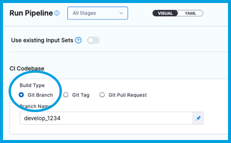

import Tabs from '@theme/Tabs';
import TabItem from '@theme/TabItem';

<DocsButton icon = "fa-solid fa-square-rss" text="Subscribe via RSS" link="https://developer.harness.io/release-notes/continuous-integration/rss.xml" />

These release notes describe recent changes to Harness Continuous Integration.

:::info About Harness Release Notes

- **Progressive deployment:** Harness deploys changes to Harness SaaS clusters on a progressive basis. This means that the features described in these release notes may not be immediately available in your cluster. To identify the cluster that hosts your account, go to your **Account Overview** page in Harness. In the new UI, go to **Account Settings**, **Account Details**, **General**, **Account Details**, and then **Platform Service Versions**.
- **Security advisories:** Harness publishes security advisories for every release. Go to the [Harness Trust Center](https://trust.harness.io/?itemUid=c41ff7d5-98e7-4d79-9594-fd8ef93a2838&source=documents_card) to request access to the security advisories.
- **More release notes:** Go to [Harness Release Notes](/release-notes) to explore all Harness release notes, including module, delegate, Self-Managed Enterprise Edition, and FirstGen release notes.

:::

## September 2024

### Version 1.47

<!-- 2024-09-17 -->

#### Fixed issues

- Resolved an inconsistency between the **Run** and **Plugin** step configuration in the CI module. Previously, users could set key-value pairs in the **Run** step but not in the **Plugin** step. The fix enables the "Optional Configuration --> Settings" field in the Plugin step to accept value as runtime input with default values and allowed values (CI-14038, ZD-69099)

### Version 1.46

<!-- 2024-09-09 -->

#### New features and enhancements

- Added support for setting Topology Spread Constraints to Kubernetes build pods. A new property, `podSpecOverlay`, has been introduced in the Kubernetes infrastructure properties within the CI stage, allowing users to apply additional settings to the build pod. Currently, this field supports specifying `topologySpreadConstraint`, with plans to extend support for additional configurations in the future. (CI-14033)

- Added the ability to exclude connectors from the preflight check. This can be configured in the connector YAML by setting the property `ignoreTestConnection` to `true`. If the user sets this flag as `true` along with the feature flag `CI_IGNORE_TEST_CONNECTION` enabled, no matter the configuration, the connection test will always be marked as **Successful**. The feature is gated behind the feature flag `CI_IGNORE_TEST_CONNECTION`. (CI-13806, ZD-65275,65643)

### Version 1.45

<!-- 2024-09-02 -->

#### Early Access feature

- Added support for automatic setup of Build Intelligence for builds running in Harness Cloud. Customers can set the stage property `buildIntelligence` to 'true' in order to use this feature. Once enabled, Harness CI will automatically optimize Run and Test steps that are running Bazel or Gradle commands, to reduce build time. `CI_ENABLE_BUILD_CACHE_HOSTED_VM` feature flag is needed to use this feature (CI-12969)

#### New features and enhancements

- Cache Intelligence was enhanced with support for C# . Customers using C# applications can now leverage automatic dependencies caching with Cache Intelligence. (CI-12672)

#### Fixed issues

- Fixed an issue where time savings due to Harness CI intelligence feature, didn't populate properly when used in the parallel CI stages. (CI-13993)

- Due to Docker rate limiting, `CI_ENABLE_BASE_IMAGE_DOCKER_CONNECTOR` feature flag must be enabled whenever a base image connector is used (CI-13924)

- Bitbucket has an issue in their API; it does not support the slash character ( / ) [https://jira.atlassian.com/browse/BCLOUD-20223](https://jira.atlassian.com/browse/BCLOUD-20223)
This can be worked around by using query parameters in the Bitbucket api `https://api.bitbucket.org/2.0/repositories/smjth/originalrepo/?at=qq/ww` (CI-13826)

- The contrast of the select repository and other areas of the UI was very low in the dark theme. The contrast has been improved for a better UI experience. (CI-13530)

## August 2024

### Version 1.44

<!-- 2024-08-26 -->

#### New features and enhancements

- Added a new setting in the account default settings under CI named ‘Upload Logs Via Harness’, allowing customers to route CI step execution logs through Harness’ log service instead uploading them directly from the build environment. This was previously behind a feature flag, but is now available for all users. (CI-13647)

#### Fixed issues

- For SMP customers, the 'getting started' flow for CI has been removed from the side navigation. (CI-13821)

- Fixed an issue with 'Build and Push' step where a faiure occured when the registry URL in the Doceker connector had a port configured. This issue occurred because everything after the first ':' was being considered as the tag of the image, leading to an invalid Fully Qualified Name (FQN) and causing the Initialize step to fail in the Kubernetes flow. The fix ensures that the FQN is properly considered when the registry endpoint includes a port number. (CI-13770, ZD-66772)


### Version 1.43

<!-- 2024-08-19 -->

#### Fixed issues

- Resolved an issue where artifacts did not appear in the artifacts tab of the CI stage when using the 'build and push' steps with Buildx instead of Kaniko. (CI-13576, ZD-63222,65912)

- Corrected the visibility of the `NodeSelector` field label in the CI stage infrastructure tab when using Kubernetes infrastructure. The reference for the node selector string has been fixed to ensure the label is properly populated. (CI-13867)

- Runtime-input options were not showing for environment variables in run-step while using it as template. Corrected by adding a check to see if the step is a template to allow for its proper usage. (CI-13640, ZD-67460)

### Version 1.42

<!-- 2024-08-12 -->

#### Fixed issues

- Fixed an issue where pipeline failures at the initialization step resulted in the entire pod YAML, including environment variables with secrets, being logged as an error. The log level has been changed to debug to prevent sensitive data exposure, and a new log has been added to capture essential details without including the full object. (CI-13785)

### Version 1.41

<!-- 2024-08-05 -->

#### New features and enhancements

- Harness Intelligence features optimize your 'Build' stages by reducing execution time through advanced caching caapbilities and Test Intelligence. With this release, we've added stage savings data to stage summary of 'Build' stages where saving is observed, as well as further insight into the optimization on the step level. To learn more, visit [Intelligence Savings Documentation](../docs/continuous-integration/get-started/harness-ci-intelligence#intelligence-savings) (CI-13252)

#### Fixed issues

- Implemented server-side sorting by duration for unit test results in the Tests tab. (CI-13115,11642, ZD-59178)

- Removed the CI onboarding flow for new projects on SMP environments, where users were previously directed to a 'Get Started' page that could fail due to `clientSecret` setup for Stripe. Now, customers will be directed to the Overview page instead. Upcoming releases will include changes to completely remove the Get Started option from the side navigation for SMP customers, ensuring it is no longer visible. (CI-13687)

- Fixed an issue where external endpoints were used for internal communication with logs service, causing token authentication failures and 401 errors. The issue was resolved by ensuring internal communication for the services. (CI-13686)

<!-- The following item will be added back in when the current discussion is resolved. 

- Validated the `CI_PR_MERGE_STRATEGY_BRANCH` flag to enable the **Merge Commit Strategy** for codebase clone, addressing previous issues with the GitHub API. Additionally, a stage variable `PR_MERGE_STRATEGY_BRANCH` has been validated. Both the **Merge Commit** and **Source Branch** strategies now function as expected. (CI-13625, ZD-67476)
-->
- Improved error message for anonymous base image connector option in the 'Build and Push' steps. (CI-13562)

- Fixed an issue where pipelines were getting queued when running concurrently. The fix ensures that the flush API log lines are sanitized to be less than 4MB, avoiding grpc `ResourceExhausted` failures. (CI-12879, ZD-64595)


## July 2024

### Version 1.39

<!-- 2024-07-29 -->

#### Early Access feature

This release introduces several highly requested features and improvements to enhance the Git clone operations within Harness, in both the Git Clone step and the native Clone Codebase functionality. With this release, we’re adding support for:

- Git LFS - Allows users to clone repositories with large file storage (LFS) efficiently.

- Fetch Tags - Enables fetching of tags during the clone operation.

- Sparse Checkout - Enables cloning specific subdirectories.

- Clone Submodules - Adds options for including and recursively cloning Git submodules.

- Clone Path Customization - Exposes the clone path in the codebase section, allowing users to specify a custom clone directory.

- Additional Pre-Fetch Command - Ability to specify any additional Git commands to run before fetching the code.

For more information, please refer to the [documentation](../docs/continuous-integration/use-ci/codebase-configuration/git-clone-step). (CI-12952, CI-13239)

This feature is behind the feature flag `CI_GIT_CLONE_ENHANCED`.

#### Fixed issues

- Fixed an issue where the Harness Build URL could exceed 255 characters if the projectId, orgId, or PipelineId identifiers were too long. Changes have been made to remove stageExecId from the Build URL to reduce the URL length in the case of non-matrix stages. (CI-13402, ZD-66211)

- Fixed an issue where SSH account-level Git connectors were failing during the connection test and status checks due to using an incorrect port. (CI-13578, ZD-67248,67266)

- Fixed an issue where the **Docker build and push** steps using Docker Layer Caching (DLC) might fail while downloading the cache if the feature flag `CI_DLC_SIGNED_URL` is turned on. (CI-13508, ZD-66950)

### Version 1.38

<!-- 2024-07-22 -->

#### Fixed issues

- Fixed issues where the Git status update was not being sent to PRs and the PR link in the execution pipeline was incorrect, redirecting back to the same execution link. The PR link redirect was not working for the input expression `<+trigger.payload.pull_req.number>`, so support for this expression has been added. (CI-11759)

- Fixed an issue where customers could not change the Build configuration from Runtime Input to an expression when setting up the CI Build stage. This fix allows customers to set an expression for the Build configuration of the CodeBase, enabling uniform build names across multiple child pipelines. Customers can now set the Build Type to a fixed value from Runtime Input and then set the branch/tag/pr as an expression, related to chained pipelines. (CI-13268, ZD-66080)

- Fixed an issue where the plugin image path was incorrect when the registry endpoint had a port configured. This issue occurred because everything after : was being considered as the tag of the image, leading to an invalid Fully Qualified Name (FQN) and causing the Initialize step to fail in the Kubernetes flow. The fix ensures that the FQN is properly considered when the registry endpoint includes a port number. (CI-13455, ZD-66772)

- Removed OIDC token logging from error messages to prevent potential exposure of sensitive information. (CI-13515)

### Version 1.37

<!-- 2024-07-16 -->

#### Fixed issues

- Fixed an issue where the `Build and Push to GCR` step was failing. Buildx plugin version has been upgraded. (CI-13422)

- Upgraded Kaniko version to fix an issue where the `Build and Push to ECR` step did not preserve permissions via chmod. (CI-13200, ZD-65907)

- Fixed an issue where logging for **engine:main** experienced a race condition. Initially, when a **SIGTERM** signal was received, one thread would begin closing the logger while another thread continued uploading logs to **engine:main**, leading to a race condition. This caused incorrect logging of pod eviction during successful executions. The threads have been synchronized to ensure log uploads complete before the logger is closed, accurately recording pod evictions only during errors. (CI-13175, ZD-65545)

This is behind the feature flag: `CI_ENGINE_LOG_UPLOAD_CONCURRENCY`.

- Fixed an issue where, if the base image connector is overridden, the Docker build step does not work. With this fix, Docker-related images now properly gain privilege if the default connector is overridden. `buildx` images are now located [here]  (https://hub.docker.com/search?q=plugins%2Fbuildx). These images are added to the auto-privilege mode. Without this privilege, the image does not run. (CI-12583)

### Version 1.36

<!-- 2024-07-09 -->

#### Fixed issues

- Fixed an issue where the status in Bitbucket showed the build as in progress even though the build succeeded in Harness CI. (CI-13151, ZD-65593)
- CI - Getting Started Page Visibility: Resolved an issue where the "Getting Started" page for CI was not visible to users without account-level edit permissions. (CI-12510)

### Version 1.35

<!-- 2024-07-01 -->

#### Early Access feature

- When you include a step that uses a private Docker registry, the step now uses the URI specified in the Docker connector. This means that you no longer need to specify the Fully Qualified Name in the Image field. This change applies to the following steps: **Plugin**, **Background**, **Run**, **Run Tests**, and **Test Intelligence**. (CI-10500, ZD-64406, ZD-64735, ZD-65011, ZD-66227)

  This is an [early access feature](/docs/continuous-integration/ci-supported-platforms#harness-ci-early-access-features) behind the feature flag `CI_REMOVE_FQN_DEPENDENCY`. Contact [Harness Support](mailto:support@harness.io) to enable this feature.

#### Fixed issues

- Fixed an issue where the status in Bitbucket showed the build as in progress even when the build succeeded in Harness CI. (CI-13151, ZD-65593)
- Improved the error message that gets displayed when an incompatible Docker version causes the pipeline to fail. (CI-12612, ZD-63466)
- Implemented a fix to ensure that all account-level secret references use the correct format (`<+secrets.getValue("account.MY_SECRET_ID")>`) in all build infrastructures. With this fix, pipelines will fail if account-level secrets are not referenced correctly. (CI-12595, ZD-63260)

## June 2024

### Version 1.34

<!-- 2024-06-24 -->

#### Fixed issues

- Added a fix to support merge events for Bitbucket Server PR builds with refs as `refs/heads/targetBranch`. (CI-12710, ZD-57511, ZD-65148)
- Fixed an issue where pipelines with Docker Layer Caching enabled would fail with the error `Failed to get link with status 400`. (CI-13070)


### Version 1.33

<!-- 2024-06-18 -->

#### New features

- Added support for AWS connectors to assume external roles to STS (Security Token Service) credentials for cache plugins. (CI-12851)

#### Fixed issues

- Fixed an issue where default values were not populated when entering runtime inputs for environment variables in a Run step. (CI-12906, ZD-64897)
- Fixed a UI issue where the Codebase icon (right menu) showed the status as not valid, even when the provider was chosen as Harness code repo and the repository was selected. (CI-12750)
- Fixed an issue where the YAML editor allowed saving invalid environment variables in a Run step. (CI-12730)
- Fixed an issue where certain keywords in a script could cause the step to fail with an "Invalid step" error. (CI-12708, ZD-63932)
- Fixed an issue where the Docker LABEL set in a Build and Push step does not override the LABEL configured in the Dockerfile. With this fix, you can now use buildx rather than kaniko to build your container images. You must run buildx on k8s with Privileged mode enabled. This fix is behind the feature flag CI_USE_BUILDX_ON_K8. Contact Harness Support to enable this fix. (CI-12548, ZD-63222)

### Version 1.32

#### Fixed issues

- CI builds were running slowly in some cases. This release includes the following fixes to address this issue. (CI-10042, ZD-52559)

  - Added extra resources for running `addon`. This feature is behind the feature flag `CI_EXTRA_ADDON_RESOURCE`. Contact [Harness Support](mailto:support@harness.io) to enable the feature.

  - Updated LE to addon communication to retry every 300ms 30 times, for a total of 9 seconds.

  - Disabled resource consumption logs for addon. 

- Fixed an issue where pipelines failed intermittently due to delegate selection and task distribution problems when multiple delegates are configured with the same selector tag. (CI-12788, ZD-64246)
- Running `unittest` in a Run step resulted in the error `sh: unittest not found in some cases`. With this fix, pipelines now run `python unittest -m` which supports more image types. (CI-12795)
- In some cases, the **Image Pull Policy** setting didn't work as intended when running builds in Docker and VM build infrastructures. (CI-11703) 

### Version 1.30

#### New features and enhancements

- Enabled Secure Connect support for Mac and Windows build infrastructures. (CI-12596)

- Added baseCommitSha in codebase for GitLab PR builds. (CI-12179, ZD-62144)

#### Fixed issues

- Fixed an issue where pipelines fail intermittently due to delegate selection and task distribution problems when multiple delegates are configured with the same selector tag. (CI-12788, ZD-64246)

- Fixed an issue where running a pipeline in debug throws an error saying it is not allowed to be run in this pipeline. (CI-12094, ZD-61519)

- Fixed a user test that was failing intermittently due to a port-availability issue. (CI-12596)


## May 2024


### Version 1.29

<!-- 2024-05-28 -->

#### New features and enhancements

- [Harness Cache Intelligence](/docs/continuous-integration/use-ci/caching-ci-data/cache-intelligence) and [Harness-managed Docker layer caching](/docs/continuous-integration/use-ci/caching-ci-data/docker-layer-caching) are available for Harness CI Cloud build infrastructure. For other build infrastructures, these features are available in [early access](/release-notes/early-access). 

- You can now specify the image pull policy in the Pipeline Editor when running builds in Kubernetes. To configure image pull policy go to **Infrastructure** > **Advanced** > **Image Pull Policy**. (CI-12512, ZD-62987)

#### Early access features

- You can use [Harness Cache Intelligence](/docs/continuous-integration/use-ci/caching-ci-data/cache-intelligence) and [Harness-managed Docker layer caching](/docs/continuous-integration/use-ci/caching-ci-data/docker-layer-caching) with self-managed build infrastructures. These are [early access features](/release-notes/early-access) behind the feature flags `CI_ENABLE_DLC_SELF_HOSTED` and `CI_ENABLE_CACHE_INTEL_SELF_HOSTED`. Contact [Harness Support](mailto:support@harness.io) to enable the features. (CI-11953) 

- Use the new [**Test Intelligence** step](/docs/continuous-integration/use-ci/run-tests/tests-v2) to easily speed up unit testing of Python, Ruby, and Java applications. Test Intelligence accelerates test cycles with smart selection of unit tests, executing only tests impacted by code changes without compromising quality. With this complete step redesign, it is now optimized for ease of use, and Test Intelligence effortlessly integrates into the regular test commands — so no tweaks required from the user. These is an [early access features](/release-notes/early-access) behind the feature flag `CIE_ENABLE_RUNTEST_V2`.

#### Fixed issues

- Fixed an issue where cloning a codebase results in an error `/var/run/docker.sock: socket: too many open files`. (CI-12505, ZD-63043)

- Fixed an issue where running a pipeline in debug throws an error saying it is not allowed to be run in this pipeline. (CI-12094, ZD-61519)

- Fixed an issue where, if the base image connector is overridden, the Docker build step does not work. With this fix, Docker-related images now properly gain privilege if the default connector is overridden. `buildx` images are now located [here](https://hub.docker.com/search?q=plugins%2Fbuildx). These images are added to the auto-privilege mode. Without this privilege, the image does not run. (CI-12583)

<!-- Version ?.??.? -->

<!-- #### New features and enhancements -->

<!-- [Harness Cache Intelligence](/docs/continuous-integration/use-ci/caching-ci-data/cache-intelligence) and [Harness-managed Docker layer caching](/docs/continuous-integration/use-ci/caching-ci-data/docker-layer-caching) are available for Harness CI Cloud build infrastructure. For other build infrastructures, these features are available in [early access](/release-notes/early-access). -->

<!-- #### Early access features --->

<!-- * You can use [Harness Cache Intelligence](/docs/continuous-integration/use-ci/caching-ci-data/cache-intelligence) and [Harness-managed Docker layer caching](/docs/continuous-integration/use-ci/caching-ci-data/docker-layer-caching) with self-managed build infrastructures. These are [early access features](/release-notes/early-access) behind the feature flags `CI_ENABLE_DLC_SELF_HOSTED` and `CI_ENABLE_CACHE_INTEL_SELF_HOSTED`. Contact [Harness Support](mailto:support@harness.io) to enable the features. (CI-11953) -->
<!-- * Use the new [**Test Intelligence** step](/docs/continuous-integration/use-ci/run-tests/tests-v2) for unit testing with Test Intelligence. Currently, this step supports Python, Ruby, and Java. This step will eventually fully replace the deprecated **Run Tests** step. -->

<!-- #### Deprecations and removals -->

<!-- Harness is beginning to deprecate the **Run Tests** step in favor of the new [**Test Intelligence** step](/docs/continuous-integration/use-ci/run-tests/tests-v2) (also known as the **Test** step). Until removal, you can configure the **Run Tests** step in the YAML Editor, and it is backwards compatible. However, Harness recommends adopting the new **Test** step as soon as possible to take advantage of improved functionality and avoid service disruptions when the **Run Tests** step is removed. -->

### Version 1.28.2

<!-- 21 May 2024 -->

#### New features

<!-- 

- This release adds support for CI resource classes, which you can use to allocate the build machines you want to use in Harness Cloud. (CI-10509)

-->

- Added support for proxies via Secure Connect for GitHub App connectors. (CI-12130, ZD-61883)
  
  This item requires Harness Delegate version 24.05.83001. For information about Harness Delegate features that require a specific delegate version, go to the [Delegate release notes](/release-notes/delegate).

#### Fixed issues

- Added a validation to Git Clone steps to ensure that the step has a Git connector and repository selected before applying changes. (CI-12477)

- Harness Code explicit git clones are now supported on Kubernetes build infrastructures. (CI-11952, ZD-60998)

- Fixed an issue where the CI **Getting Started** page sent multiple requests to fetch Harness Code repositories. This occurred whenever the page was updated or the Git connector was updated. With this fix, the Getting Started page sends one request only when it needs to fetch the list of repositories. (CI-10770)


### Version 1.27.4

<!-- 16 May 2024 -->

#### Early access feature

- This release adds support for selecting [resource classes](/docs/continuous-integration/get-started/ci-subscription-mgmt/#harness-cloud-billing-and-build-credits) in Harness Cloud, which you can use to select specific infrastructure resources. This is an [early access feature](/docs/continuous-integration/ci-supported-platforms/#harness-ci-early-access-features) behind the feature flag `CI_ENABLE_RESOURCE_CLASSES`. Contact [Harness Support](mailto:support@harness.io) to enable the feature. (CI-10509)

#### Fixed issues 

- Added support for proxies via Secure Connect for Github App connectors. (CI-12130, ZD-61883)

  This item requires Harness Delegate version 24.05.83001. For information about Harness Delegate features that require a specific delegate version, go to the [Delegate release notes](/release-notes/delegate). 

- Harness Code explicit git clones are now supported on Kubernetes build infrastructures. (CI-11952, ZD-60998)

- Fixed a UI issue where the Pipeline Execution UI didn't update the stage selector correctly if the pipeline used a parallelism or matrix strategy. As a result, users could not see artifacts properly. (CI-12047)


### Version 1.26.3

<!-- 07 May 2024 -->

#### Early access feature

- This release includes new default settings that enable you to configure S3-compatible caching in self-hosted build infrastructures. You can configure the endpoint URL, region, bucket name, access key, and secret key. These options are behind the feature flags `CI_ENABLE_DLC_SELF_HOSTED` (for Docker layer caching) and `CI_ENABLE_CACHE_INTEL_SELF_HOSTED` (for Cache Intelligence). Contact [Harness Support](mailto:support@harness.io) to enable them. (CI-11953)

#### Fixed issues

- Fixed a dynamic resizing issue that could cut off the list of steps when viewing the [build details page](/docs/continuous-integration/use-ci/viewing-builds) on a macOS machine. (CI-7952)

- Fixed an issue where pod cleanups could be missed due to duplicate data. (CI-11995)

- Introduced a new internal flag that trims commit messages and `pr_title` environment variables at the time of pod creation. This fixes an issue where builds would fail with the error `rpc error: code = ResourceExhausted desc = trying to send message larger than max`. If you experience this error and need to enable this flag in your environment, contact [Harness Support](mailto:support@harness.io). (CI-11709, ZD-59521)


## April 2024


### Version 1.25.0

<!-- 29 April 2024 -->

#### Fixed issues

* The built-in clone codebase step now works on Windows platforms for LFS-enabled Git repos. (CI-12038)
* Fixed an issue where pod cleanup could be missed due to duplicate data. (CI-11995)

### Version 1.24.2

<!-- 23 Apr 2024 -->

#### New features and enhancements

In [TI for Ruby](/docs/continuous-integration/use-ci/run-tests/tests-v1/ti-for-ruby), test globs starting with `/` are correctly treated as absolute paths. (CI-11819, ZD-57661, ZD-61493)

:::warning

If you currently use a Ruby test glob pattern starting with `/`, you must either replace the leading slash or add `**` accordingly.

:::

#### Early access features

You can enable type selection for [output variables in Run steps](/docs/continuous-integration/use-ci/run-step-settings#output-variables). If you select the **Secret** type, Harness treats the output variable value as a secret and applies [secrets masking](/docs/platform/secrets/add-use-text-secrets#secrets-in-outputs) where applicable. This is an [early access feature](/release-notes/early-access) behind the feature flags `CI_ENABLE_OUTPUT_SECRETS` and `CI_SKIP_NON_EXPRESSION_EVALUATION`. Contact [Harness Support](mailto:support@harness.io) to enable the feature.

<DocImage path={require('/docs/continuous-integration/use-ci/static/run-step-output-var-type.png')} width="60%" height="60%" title="Click to view full size image" />

#### Fixed issues

* Increased the default machine size for the [Harness CI Cloud macOS platform](/docs/continuous-integration/use-ci/set-up-build-infrastructure/use-harness-cloud-build-infrastructure). The default size was inadvertently decreased during a prior upgrade to Sonoma, and some users experienced `No space left on device` errors as a result. (CI-11620, ZD-59225)
* Incorporated improvements to address some inconsistencies with [test splitting](/docs/continuous-integration/use-ci/run-tests/speed-up-ci-test-pipelines-using-parallelism). (CI-11773, ZD-60054)

### Version 1.23.1

<!-- 16 Apr 2024 -->

#### Early access features

If you need to allow empty environment variables in your CI pipelines, you can enable the feature flag `CI_USE_LESS_STRICT_EVALUATION_FOR_MAP_VARS` by contacting [Harness Support](mailto:support@harness.io). (CI-11882, CI-11305, CI-11672, ZD-57626)

This feature flag addresses specific use cases that require handling empty environment variables in CI pipelines, such as:

* Variables related to [looping strategies](/docs/platform/pipelines/looping-strategies/looping-strategies-matrix-repeat-and-parallelism) sometimes incorrectly resolving to `null` when included in environment variable [expressions](/docs/platform/variables-and-expressions/harness-variables).
* Potentially empty output variables populating environment variables in child stages.
* [Bitrise Workflow Steps](/docs/continuous-integration/use-ci/use-drone-plugins/ci-bitrise-plugin) requiring empty environment variables.

For more information about CI early access features, go to [What's supported for Harness CI](/docs/continuous-integration/ci-supported-platforms).

#### Fixed issues

* Builds triggered by Bitbucket Server push events now have correct date information in the build history. This issue occurred due to missing date information in the `commits` object returned by the Bitbucket Server API. This change requires Harness Delegate version 24.04.82707 or later. For information about features that require a specific delegate version, go to the [Delegate release notes](/release-notes/delegate). (CI-11556, ZD-58798)
* Fixed an issue where references to deleted/nonexistent secrets sometimes caused pipelines to timeout at the initialize step without any logs. (CI-11891, ZD-60575)
* Added a fix to trim long environment variables, such as the commit message and PR title, during pod creation in stage initialization. This is currently an opt-in fix for affected customers. If you're using a Kubernetes cluster build infrastructure and experiencing initialization timeout with an error message like `rpc error: code = ResourceExhausted desc = trying to send message larger than max`, contact [Harness Support](mailto:support@harness.io) to enable this fix in your account. (CI-11709, ZD-59521)

### Version 1.21.3

<!-- 03 Apr 2024 -->

#### New features and enhancements

* All CI steps send status updates to the Harness Manager directly by HTTP rather than through a delegate. This feature was previously released in beta under the feature flag `CI_LE_STATUS_REST_ENABLED`, and it is now enabled globally. (CI-11770)
* BitBucket Cloud limits the key size for sending status updates to PRs, and this can cause incorrect [status updates in PRs](/docs/continuous-integration/use-ci/codebase-configuration/scm-status-checks) due to some statuses failing to send. Previously, you could enable the feature flag `CI_BITBUCKET_STATUS_KEY_HASH` if you encountered this issue with BitBucket Cloud. **Now, the fix enabled by this feature flag is generally available and enabled by default.** Note that adjustments made prior to general availability of this fix might cause some issues with BitBucket PR status updates. You might need to adjust your BitBucket settings if you notice Harness SCM status updates reporting to incorrect PR IDs. (CI-11770)

#### Fixed issues

When manually running pipelines, the **Branch Name** no longer unintentionally changes to `main` after you input another branch name. This issue occurred due to a backend API call that could sometimes take a long time to respond. (CI-11721, ZD-59730)

## March 2024

### Version 1.20.2

<!-- 26 Mar 2024 -->

#### Fixed issues

Fixed an issue with fallback handling when [splitting tests](/docs/continuous-integration/use-ci/run-tests/speed-up-ci-test-pipelines-using-parallelism) by `testcase_timing`, `testsuite_timing`, or `class_timing`. (CI-11651)

### Correction

<!-- 22 Mar 24 -->

A prior release note announced that you could set plugin runtime flags as environment variables for [Build and Push steps](/docs/continuous-integration/use-ci/build-and-upload-artifacts/build-and-upload-an-artifact).

This announcement incorrectly implied that the feature applied to all build infrastructures.

**Correction:** Currently, this feature applies to Kubernetes cluster build infrastructure only. Other build infrastructures can set a limited subset of drone-docker runtime flags as stage variables. The prior release notes and supporting documentation have been updated to reflect this correction.

### Version 1.18.2

<!-- Mar 18, 2024 -->

#### New features and enhancements

In [TI for Ruby](/docs/continuous-integration/use-ci/run-tests/tests-v1/ti-for-ruby), the default test globs pattern is now `**/spec/**/*_spec.rb`. Now, by default, TI detects `spec` directories anywhere in the stage workspace. You can use the Test Globs setting to override the default test globs pattern if you want change this behavior, for example to limit it to directories at the root level or at a certain path. (CI-11272, ZD-57661)

#### Early access features

To use [delegate selectors](/docs/platform/delegates/manage-delegates/select-delegates-with-selectors) with [self-managed VM build infrastructure](/docs/category/set-up-vm-build-infrastructures), contact [Harness Support](mailto:support@harness.io) to enable the feature flag `CI_ENABLE_VM_DELEGATE_SELECTOR` in your account. (CI-11545)

#### Fixed issues

Fixed an issue where the Get Started wizard failed to generate some pipeline YAML. (CI-11323)

### Version 1.17.5

<!-- Mar 13, 2024 -->

#### New features and enhancements

* Increased the timeout limit for stage initialization to 30 minutes when using Harness Cloud build infrastructure. (CI-11071)
* You can enable separators for GCS and AWS cache keys to prevent pulling incorrect caches from cloned pipelines. (CI-11185, ZD-57012, ZD-57319)
   * When you clone a pipeline that has [Save/Restore Cache steps](/docs/continuous-integration/use-ci/caching-ci-data/share-ci-data-across-steps-and-stages/#use-caching-to-reduce-build-time), cache keys generated by the cloned pipeline use the original pipeline's cache key as a prefix. For example, if the original pipeline's cache key is `some-cache-key`, the cloned pipeline's cache key is `some-cache-key2`. This causes problems when the Restore Cache step in the original pipeline looks for caches with the matching cache key prefix and pulls the caches for both pipelines.
   * To prevent this issue, Harness can add separators (`/`) to your AWS/GCS cache keys to prevent accidental prefix matching from cloned pipelines. This feature is disabled by default. To enable the separator, add this [stage variable](/docs/platform/pipelines/add-a-stage/#stage-variables): `PLUGIN_ENABLE_SEPARATOR: true`.
   * If you don't enable the separator, make sure your cloned pipelines [generate unique cache keys](/docs/continuous-integration/use-ci/caching-ci-data/saving-cache#key) to avoid the prefix matching issue.

#### Fixed issues

* The project URL format is now validated when creating [Azure Repos connectors](/docs/platform/connectors/code-repositories/connect-to-a-azure-repo). Previously, invalid project URLs passed the field validation but failed the connection test with a nonspecific error message. (CI-11186)
* Added null handling for empty runtime input for the [Post-Command in a Run Tests step](/docs/continuous-integration/use-ci/run-tests/tests-v1/ti-for-java-kotlin-scala/#pre-command-post-command-and-shell). Previously, if you configured Post-Command as [runtime input](/docs/platform/variables-and-expressions/runtime-inputs/#runtime-inputs) and left the field blank at runtime, it would fail the pipeline by supplying `null` as the Post-Command, rather than an empty field. (CI-11365, ZD-58254)
* When [viewing builds](/docs/continuous-integration/use-ci/viewing-builds), the running status is now correctly updated for Background steps that are inside step groups. (CI-10239)
* Resolved an issue where expressions could unexpectedly/incorrectly resolve as `null` if those expressions were supplied as environment variables in steps that were in step group templates or other looping strategies. (CI-11305, ZD-57626)
* When creating step group templates, you can now configure the **Run as User** setting for steps that allow this setting. Previously, this setting wasn't shown when creating step group templates. (CI-11332, ZD-58044)
* Pipelines that include test splitting on multiple sequential, parallel, or looped steps now fetch historical test data from the most-recent finished build. Previously, such pipelines would sometimes try to fetch "historical" test data from an earlier test step in the current build, rather than fetching this data from a previous completed build. (CI-11108, ZD-56810)
* GitLab connectors using the SSH connection type no longer fail if the GitLab project name starts with a number. (CI-11392, ZD-58162)
* When using self-signed certificates with Kubernetes delegates, Harness now sanitizes the secret's name so that pod creation doesn't fail due to Kubernetes detecting invalid characters in the secret's name. (CI-11188)
* A version of CI was briefly released that contained a bug in the Harness `plancreator` service that caused multiple pipeline failures. That version was rolled back and the issue has been fixed in this version. (CI-11497, ZD-58699, ZD-58745)

## February 2024

## Deprecation notice: app.harness Docker registry

[Harness images](/docs/continuous-integration/use-ci/set-up-build-infrastructure/harness-ci) are available on Docker Hub and the [Harness project on GCR](https://console.cloud.google.com/gcr/images/gcr-prod/global/harness). In a continuation of this effort, and to improve stability when pulling Harness-required images, Harness is deprecating the Harness-hosted `app.harness` Docker registry effective 15 February 2024.

You will be impacted by this deprecation if:

* Your built-in Harness Docker connector (`account.harnessImage`) is configured to the `app.harness` Docker registry. To avoid errors when the deprecation takes place, [configure the built-in Docker connector to use credentialed access to Docker Hub or the Harness project on GCR](/docs/platform/connectors/artifact-repositories/connect-to-harness-container-image-registry-using-docker-connector/#configure-harness-to-always-use-credentials-to-pull-harness-images).
* You [pull Harness images from a private registry](/docs/platform/connectors/artifact-repositories/connect-to-harness-container-image-registry-using-docker-connector/#pull-harness-images-from-a-private-registry), and you are currently pulling the latest images from the `app.harness` Docker registry. To avoid errors when the deprecation takes place, make sure you are pulling images from the [Harness project on GCR](https://console.cloud.google.com/gcr/images/gcr-prod/global/harness).
* You have other Docker connectors configured to the `app.harness` Docker registry. Edit these connectors to use `https://registry.hub.docker.com` instead.

Contact [Harness Support](mailto:support@harness.io) if you have any questions.

### Version 1.13.1

<!-- Feb 20, 2024 -->

#### New features and enhancements

* The error message text for the `no eligible delegates present` error now includes additional potential causes. This change requires Harness Delegate version 24.02.82302 or later. For information about features that require a specific delegate version, go to the [Delegate release notes](/release-notes/delegate). (CI-10933, ZD-55977)
* Harness CI no longer stores clone tokens for public GitHub repositories as environment variables, because a token isn't needed to clone public repos. This change requires Harness Delegate version 24.02.82302 or later. For information about features that require a specific delegate version, go to the [Delegate release notes](/release-notes/delegate). (CI-10938)
* Added some helper text that was missing when creating pipelines through the projects section. (CI-11233)
* The Harness Community team has developed a new plugin to help you automate more processes in your CI pipelines:
   * The [GCP OIDC Token plugin](/docs/continuous-integration/secure-ci/gcp-oidc-token-plugin) generates a Google Cloud access token from your OIDC token and then stores the GCP token in an output variable that you can use in subsequent pipeline steps to control Google Cloud Services through API (cURL) or the gcloud CLI.

#### Fixed issues

* Fixed an issue where pipelines could fail when triggered by BitBucket PRs with more than 25 commits. This error was due to an infinite loop situation that could occur when there was pagination in the BitBucket List PR Commits API payload. This change requires Harness Delegate version 24.02.82302 or later. For information about features that require a specific delegate version, go to the [Delegate release notes](/release-notes/delegate). (CI-11220, ZD-57421)
* Fixed an issue where the YAML for build stage [input sets](/docs/platform/pipelines/input-sets) could have an invalid default value for [codebase advanced settings](/docs/continuous-integration/use-ci/codebase-configuration/create-and-configure-a-codebase#edit-the-default-codebase-configuration). (CI-11291)
* Addressed a security vulnerability in some CI APIs. (CI-11244, ZD-57445)
* Applied optimizations to address caching errors. (CI-11173, ZD-57173)

### Version 1.12.4

<!-- Feb 13, 2024 -->

#### New features and enhancements

* With Kubernetes cluster build infrastructure, [Build and Push steps](/docs/continuous-integration/use-ci/build-and-upload-artifacts/build-and-upload-an-artifact) support all kaniko runtime flags. You can specify these flags as environment variables in the Build and Push step settings. Currently, this is only supported for Kubernetes cluster build infrastructure. Other build infrastructures can set a limited subset of drone-docker runtime flags as stage variables. (CI-10165, CI-11031)
* To address security vulnerabilities, Reactor-netty libraries have been updated to the latest version in [Harness CI images](/docs/continuous-integration/use-ci/set-up-build-infrastructure/harness-ci). (CI-10929, ZD-52222, ZD-55562)
* The Harness Community team has developed two new plugins to help you automate more processes in your CI pipelines:
   * The [Helm Push plugin](/docs/continuous-integration/use-ci/build-and-upload-artifacts/upload-artifacts/upload-helm-chart) streamlines packaging and distribution of Helm charts to container registries.
   * The [Image Migration plugin](/docs/continuous-integration/use-ci/build-and-upload-artifacts/migrate-images) facilitates copying images across container registries.

#### Fixed issues

* Addressed an issue where pod deletion didn't trim excess whitespace in namespace names, which could prevent pod cleanup. This change requires Harness Delegate version 24.02.82302 or later. For information about features that require a specific delegate version, go to the [Delegate release notes](/release-notes/delegate). (CI-10636, ZD-54688)
* Removed excessive, unnecessary health check messages in logs. (CI-11102)
* Added validations to address a runtime error that could occur in the Build and Push to ACR step. (CI-10793, ZD-55412)
* Harness now automatically truncates long pipeline and stage names in [PR build status messages](/docs/continuous-integration/use-ci/codebase-configuration/scm-status-checks), because status updates fail to post if the message exceeds the SCM provider's character limit for such messages. If a pipeline or stage name is truncated, the truncated portion is replaced by ellipses (`...`). (CI-11132, ZD-56864)

### Version 1.11.4

<!-- Feb 06, 2024 -->

#### New features and enhancements

* The Harness Cloud macOS image was updated to the latest version of macOS Sonoma, which includes an Xcode upgrade to 15.2 (default) and 15.1. This version of Sonoma is not compatible with earlier Xcode versions. If your pipelines rely on a specific Xcode version, you must update your pipelines accordingly for the new version. For complete image specifications and information about specifying Xcode versions, go to [Use Harness Cloud build infrastructure](/docs/continuous-integration/use-ci/set-up-build-infrastructure/use-harness-cloud-build-infrastructure).
* To support Docker images without a shell, the [Command field in Run steps](/docs/continuous-integration/use-ci/run-step-settings/#shell-and-command) is now optional. (CI-10115, CI-10676)
* Upgraded Go to the latest version in the CI manager and CI-related plugins, such as `drone-kaniko`. (CI-10800)
* Upgraded kaniko executor to version 1.19.2 in the [drone-kaniko plugin](https://github.com/drone/drone-kaniko/releases), which is used by [Build and Push steps](/docs/continuous-integration/use-ci/build-and-upload-artifacts/build-and-upload-an-artifact), to support Dockerignore with special characters. (CI-10908, ZD-55930)

   If you encounter errors in Build and Push steps following this upgrade, you can manually [pin an old plugin version](/docs/continuous-integration/use-ci/set-up-build-infrastructure/harness-ci/#specify-the-harness-ci-images-used-in-your-pipelines), for example:

   ```
   {
    "field": "buildAndPushDockerRegistryTag",
    "value": "plugins/kaniko:1.8.3
   },
   ```

#### Fixed issues

Modified CSS to address flickering UI elements. (CI-11038, ZD-56510)
<!-- Only logging added. Underlying issue not yet addressed. (CI-10975, ZD-56280, ZD-56961) -->
<!-- Regression, rolled back code, probably hotfixed before (CI-11044, ZD-56204, ZD-56526) -->

## January 2024

### Version 1.10.2

<!-- Jan 30, 2024 -->

#### Fixed issues

* [PR status updates](/docs/continuous-integration/use-ci/codebase-configuration/scm-status-checks) now send correctly when using a [GitHub App in a GitHub connector](/docs/platform/connectors/code-repositories/git-hub-app-support) with a secret (instead of plain text) for the **Application ID**. (CI-11025, ZD-56177)
* The Run Tests step now respects the Test Globs setting in [TI for Ruby](/docs/continuous-integration/use-ci/run-tests/tests-v1/ti-for-ruby). (CI-10907, ZD-55937)
* Added a missing field validation for **Repository Name** when using [Harness Code Repository](/docs/code-repository/code-supported) as the pipeline's [default codebase](/docs/continuous-integration/use-ci/codebase-configuration/create-and-configure-a-codebase/#configure-the-default-codebase). (CI-11042)
* Corrected the capitalization of `GitHub` in the **GitHub Action plugin** step in the step library. (CI-7325)
* Improved the error message that appears when there is a connectivity problem between the delegate and runner in a [local runner build infrastructure](/docs/continuous-integration/use-ci/set-up-build-infrastructure/define-a-docker-build-infrastructure). (CI-10827)

### Version 1.9.4

<!-- Jan 23, 2024 -->

#### New features and enhancements

* Free plans require credit card validation to use [Harness Cloud](/docs/continuous-integration/use-ci/set-up-build-infrastructure/use-harness-cloud-build-infrastructure). If you don't want to provide a credit card, you can use [local runner build infrastructure](/docs/continuous-integration/use-ci/set-up-build-infrastructure/define-a-docker-build-infrastructure).
* The [codebase expressions](/docs/continuous-integration/use-ci/codebase-configuration/built-in-cie-codebase-variables-reference) `<+codebase.sourceBranch>` and `<+codebase.targetBranch>` are now always `null` for branch and tag builds. These expressions are primarily for differentiating the target and source branches for PR builds. For branch and tag builds, use `<+codebase.branch>` and `<+codebase.tag>`. (CI-10743, ZD-55284)

#### Early access features

[Secure connect for Harness Cloud](/docs/continuous-integration/secure-ci/secure-connect) facilitates private networking with Harness Cloud runners. (CI-8922)

#### Fixed issues

Added indexing to handle a `IncorrectResultSizeDataAccessException` error that rarely occurred in builds with [matrix looping strategies](/docs/platform/pipelines/looping-strategies/looping-strategies-matrix-repeat-and-parallelism) if some non-unique values were assigned. (CI-10884, ZD-55815)

### Version 1.8.2

<!-- Jan 15, 2024 -->

#### New features and enhancements

To help identify pods that aren't cleaned up after a build, pod deletion logs now include the cluster endpoint targeted for deletion and the pod identifier, namespace, and API endpoint response for pods that can't be located for deletion. (CI-10636, ZD-54688)

#### Fixed issues

* Fixed a `NullPointerException` error that occurred if you provided no `args` when configuring [Test Intelligence for Ruby](/docs/continuous-integration/use-ci/run-tests/tests-v1/ti-for-ruby). (CI-10847, ZD-55658)
* Fixed an issue where pod creation failed in Kubernetes cluster build infrastructures if the pod volume mount key exceeded 63 characters. This change requires Harness Delegate version 24.01.82108 or later. For information about features that require a specific delegate version, go to the [Delegate release notes](/release-notes/delegate). (CI-10789, ZD-55265)

### Version 1.6.3

<!-- Jan 05, 2024 -->

#### New features and enhancements

* The Get Started workflow can now auto-generate starter pipelines from [Harness Code repositories](/docs/code-repository). (CI-10780)
* Enhanced log retention for custom approval steps. (CI-10273, ZD-53345, ZD-53410)

#### Deprecations

Documentation for the previously-deprecated Service Dependency step has been removed. The Service Dependency step was deprecated in February 2023 in favor of the [Background step](/docs/continuous-integration/use-ci/manage-dependencies/background-step-settings).

## Previous releases

### 2023 releases

<details>
<summary>2023 releases</summary>

#### December 2023

##### Version 1.5.1

<!-- Dec 20, 2023 -->

###### New features and enhancements

- This release introduces a new versioning convention for CI manager.
- [Test Intelligence for Ruby](/docs/continuous-integration/use-ci/run-tests/tests-v1/ti-for-ruby) is now generally available.

###### Fixed issues

- Fixed an issue where builds failed in a Kubernetes cluster build infrastructure because certificates from the key chain weren't considered when fetching the entrypoint for the [S3 Upload and Publish plugin](/docs/continuous-integration/use-ci/build-and-upload-artifacts/upload-artifacts/upload-artifacts-to-s3#use-the-s3-upload-and-publish-plugin). (CI-10258, ZD-53311)
- Improved error messaging related to addon disconnects. (CI-8877)
- Fixed an issue with SCM service logging. (CI-8872)

##### Version 7006

<!-- Dec 18, 2023 -->

###### Fixed issues

If you configured an optional step setting (such as **Limit Memory**, **Limit CPU**, or **Timeout**) to accept runtime input (`<+input>`), and then provided no value for that setting at runtime, the pipeline could fail due to invalid `null` input. This has been fixed, and the effected settings can how handle empty (`null`) runtime input. (CI-10514, ZD-54217)

##### Version 6902

<!-- Dec 06, 2023 -->

###### Fixed issues

Improved the error message that appears if the Kubernetes cluster connector ID is `null` when running a pipeline that uses a Kubernetes cluster build infrastructure. (CI-8166)

##### Version 6801

<!-- Dec 01, 2023 -->

This release includes backend changes only.

#### November 2023

##### Version 6704

<!-- Nov 29, 2023 -->

###### Hotfix

Fixed an issue related to cache saving with Cache Intelligence.

##### Version 6703

<!-- Nov 22, 2023 -->

###### Fixed issues

- Fixed a thread safety issue that caused errors like `IncorrectResultsSizeDataAccessException` and `returned non unique result`. (CI-10061, ZD-52625)
- Fixed a proxy issue related to [downloading logs](/docs/platform/pipelines/executions-and-logs/download-logs). (CI-9657, ZD-50664)
- Fixed an issue in the Get Started workflow where the account or organization name could be omitted from the repo URL in a GitHub connector created during the workflow.

##### Version 6603

<!-- Nov 21, 2023 -->

###### Hotfix

Fixed an issue related to build queue limits. (CI-10326, ZD-53701)

##### Version 6601

<!-- Nov 16, 2023 -->

###### Fixed issues

- Fixed an issue where time savings wasn't reported if Test Intelligence selected no tests. (CI-10196)
- The Get Started workflow can generate pipeline identifiers from repository names. To avoid failures due to invalid characters in pipeline identifiers, periods (`.`) in repository names are now replaced by underscores (`_`) in pipeline identifiers. (CI-10156, ZD-52954)
- A previous release simplified the format of the log base key used to [download logs](/docs/platform/pipelines/executions-and-logs/download-logs) for pipelines, and this release includes additional simplifications to support a new regex pattern. The simplified format is behind the feature flag `PIE_SIMPLIFY_LOG_BASE_KEY`. (CI-10085)

##### Version 6501

<!-- Nov 6, 2023 -->

###### New features and enhancements

**Build and Push to GAR (CI-9926)**

This release includes a new [Build and Push to GAR step](/docs/continuous-integration/use-ci/build-and-upload-artifacts/build-and-push/build-and-push-to-gar) offering first-class support for build and pushing artifacts to Google Artifact Registry (GAR). Previously, you could use Run steps to build and push to GAR. This new step combines the build and push steps into one streamlined step.

If using this step with Harness Cloud build infrastructure, you can also leverage the new [OIDC connectivity mode](/docs/platform/connectors/cloud-providers/ref-cloud-providers/gcs-connector-settings-reference#use-openid-connect-oidc) in your GCP connector.

Due to the [GCR deprecation](https://cloud.google.com/artifact-registry/docs/transition/transition-from-gcr), the **Build and Push to GCR** step will be deprecated in favor of the new **Build and Push to GAR** step.

**Harness Cloud Windows image update (CI-9750)**

The Harness Cloud Windows image has been upgraded to Windows Server 2022. This includes major and minor version upgrades for many components. For a complete list of component versions, go to the [Harness Cloud image specifications](/docs/continuous-integration/use-ci/set-up-build-infrastructure/use-harness-cloud-build-infrastructure/#platforms-and-image-specifications).

:::warning

If you have pipelines running on Harness Cloud that rely on specific component versions, you might need to [lock versions or install additional tools](/docs/continuous-integration/use-ci/set-up-build-infrastructure/use-harness-cloud-build-infrastructure/#lock-versions-or-install-additional-tools) to prevent your pipeline from failing due to image changes.

:::

###### Early access features

**Delegate selectors for codebase tasks (CI-9980)**

:::note

Currently, delegate selectors for CI codebase tasks is behind the feature flag `CI_CODEBASE_SELECTOR`. Contact [Harness Support](mailto:support@harness.io) to enable the feature.

:::

Without this feature flag enabled, delegate selectors aren't applied to delegate-related CI codebase tasks.

With this feature flag enabled, Harness uses your [delegate selectors](/docs/platform/delegates/manage-delegates/select-delegates-with-selectors) for delegate-related codebase tasks. Delegate selection for these tasks takes precedence in order of [pipeline selectors](/docs/platform/delegates/manage-delegates/select-delegates-with-selectors/#pipeline-delegate-selector) over [connector selectors](/docs/platform/delegates/manage-delegates/select-delegates-with-selectors/#infrastructure-connector).

###### Fixed issues

- When you add a [Build stage](/docs/continuous-integration/use-ci/set-up-build-infrastructure/ci-stage-settings) to a pipeline, the **Infrastructure** tab is selected by default, rather than the **Execution** tab. (CI-9624)
- To address potential performance issues, resource consumption logs are now disabled for the `ci-addon` service, and the communication retry internal between the Lite Engine and the `ci-addon` service is now nine seconds. <!-- additional hotfix change behind FF CI_EXTRA_ADDON_RESOURCE --> (CI-10042, ZD-52559)
- Added a validation to check that codebase configuration details (connector, repo, and so on) are provided if at least one stage in pipeline has [**Clone Codebase** enabled](/docs/continuous-integration/use-ci/codebase-configuration/create-and-configure-a-codebase#configure-the-default-codebase). (CI-10055)

#### October 2023

##### Version 6404

<!-- October 30, 2023 -->

###### New features and enhancements

- The Harness AI Development Assistant (AIDA:tm:) for CI is now generally available. AIDA for CI provides error analysis and remediation for failed pipelines. Harness bases these recommendations on the step logs and the context of the failed step. For more information, go to [Troubleshooting with AIDA](/docs/continuous-integration/troubleshoot-ci/aida).
- When you [configure a Kubernetes build farm to use self-signed certificates](/docs/continuous-integration/use-ci/set-up-build-infrastructure/k8s-build-infrastructure/configure-a-kubernetes-build-farm-to-use-self-signed-certificates/), you can now use `DESTINATION_CA_PATH` instead of `CI_MOUNT_VOLUMES` and `ADDITIONAL_CERTS_PATH`. (CI-9707)
  - For `DESTINATION_CA_PATH`, provide a comma-separated list of paths in the build pod where you want the certs to be mounted, and mount your certificate files to `opt/harness-delegate/ca-bundle`.
  - Both CI build pods and the SCM client on the delegate support this method.
  - You can use either method (`DESTINATION_CA_PATH` or both `CI_MOUNT_VOLUMES` and `ADDITIONAL_CERTS_PATH`). If you specify both, `DESTINATION_CA_PATH` takes precedence. If Harness can't resolve `DESTINATION_CA_PATH`, it falls back to `CI_MOUNT_VOLUMES` and `ADDITIONAL_CERTS_PATH`.
  - This item requires Harness Delegate version 23.10.81202. For information about features that require a specific delegate version, go to the [Delegate release notes](/release-notes/delegate).
- The individual log line limit is now 25KB. Log lines longer than 25BK are truncated. (CI-9927, ZD-52005, ZD-52079, ZD-52134, ZD-52356)
- Upgraded built-in steps to support Windows 2022. (CI-9755)

###### Fixed issues

- Addressed a NPE issue related to node plan creation. (CI-9890, ZD-51607)
- Fixed an issue where a [clone depth](/docs/continuous-integration/use-ci/codebase-configuration/create-and-configure-a-codebase#depth) of `0` wasn't respected in stages that use a [VM build infrastructure](/docs/category/set-up-vm-build-infrastructures). (CI-8711)
- Fixed an issue where the **Step** dropdown menu on the [**Tests** tab](https://developer.harness.io/docs/continuous-integration/use-ci/viewing-builds#tests-tab) sometimes showed step IDs instead of step names. Now, it always shows step names. (CI-6654)
- Revised the error message that is shown when a pipeline fails due to lack of eligible delegates. This item requires Harness Delegate version 23.10.81202. For information about features that require a specific delegate version, go to the [Delegate release notes](/release-notes/delegate). (CI-9743)
- Optimized delegate logging related to the CI task handler to consume less space. This item requires Harness Delegate version 23.10.81202. For information about features that require a specific delegate version, go to the [Delegate release notes](/release-notes/delegate). (CI-9771)

##### Version 6304

<!-- October 24, 2023 -->

###### Fixed issues

- To address issues with long cache times, [Cache Intelligence](/docs/continuous-integration/use-ci/caching-ci-data/cache-intelligence) now uses Zstd archive format. (CI-9815, ZD-51474)
- Long test and class names on the [Tests tab](/docs/continuous-integration/use-ci/viewing-builds#tests-tab) no longer push the **Copy** icon out of the visible area. (CI-9500)

##### Version 6203

<!-- October 18, 2023 -->

###### New features and enhancements

You can now [enable test splitting for Test Intelligence](/docs/continuous-integration/use-ci/run-tests/tests-v1/ti-test-splitting) in the Visual editor as well as the YAML editor. (CI-9618)

###### Fixed issues

- Fixed an issue where Background step logs weren't correctly called for steps running in parallel. (CI-9801)
- Corrected the rendering of the **Stack Trace** field when inspecting failed tests from the [Tests tab](/docs/continuous-integration/use-ci/run-tests/viewing-tests) on the [Build details page](/docs/continuous-integration/use-ci/viewing-builds). (CI-9765, ZD-51231)
- Fixed an issue with extra whitespace in step templates when these were used with a Kubernetes cluster build infrastructure. (CI-9723, ZD-49843)
- Fixed an issue where the network driver wasn't available in the Harness Docker Runner for Windows. (CI-9848)
- Fixed an issue that could occur when cloning multiple repos in a stage that used a Windows platform for the build infrastructure. (CI-9128)
- Fixed an issue where some [code repo connectors](/docs/platform/connectors/code-repositories/connect-to-code-repo) didn't send the [build status](/docs/continuous-integration/use-ci/codebase-configuration/scm-status-checks) back to the SCM provider. This happened due to an issue in the Harness Delegate, and it occurred only for code repo connectors that [connected through a Harness Delegate](/docs/platform/connectors/code-repositories/ref-source-repo-provider/git-hub-connector-settings-reference#connectivity-mode-settings). Connectors connecting through the Harness Platform weren't impacted. This item requires Harness Delegate version 23.10.81010. For information about features that require a specific delegate version, go to the [Delegate release notes](/release-notes/delegate). (CI-9835, ZD-51754, ZD-51758, ZD-51763)
- When a [code repo connector](/docs/platform/connectors/code-repositories/connect-to-code-repo) encounters a cert error, the error message shown in the Harness UI is now more informative. This item requires Harness Delegate version 23.10.81010. For information about features that require a specific delegate version, go to the [Delegate release notes](/release-notes/delegate). (CI-8509)

##### Version 6100

<!-- October 09, 2023 -->

###### New features and enhancements

When you [enable Test Intelligence for Scala or Kotlin](/docs/continuous-integration/use-ci/run-tests/tests-v1/ti-for-java-kotlin-scala), the **Packages** and **Test Annotations** fields are now available in the Visual editor. (CI-9589)

###### Fixed issues

- Fixed an issue with identifiers assigned to steps in [matrix looping strategies](/docs/platform/pipelines/looping-strategies/looping-strategies-matrix-repeat-and-parallelism) that occurred if your account was configured to use **Matrix Labels by Name** _and_ the pipeline contained nested matrix strategies. This issue produced a Null Pointer Exception error. (CI-9680)
- In Kubernetes cluster build infrastructures, non-existent or unresolvable secrets are now handled in the same way as they are in VM and Harness Cloud build infrastructures. (CI-9677, ZD-50868, ZD-50901)
<!-- CI-9747: Not for RN. CI-9688: In Hotfix 5802. -->

#### September 2023

##### Version 5902

<!-- September 29, 2023 -->

###### New features and enhancements

[Test Intelligence](/docs/continuous-integration/use-ci/run-tests/ti-overview) now supports manual branch builds (the **Git Branch** build type). This is in addition to existing support for manual PR builds, as well as PR and push webhook triggers. When you [enable Test Intelligence](/docs/continuous-integration/use-ci/run-tests/ti-overview), you can use a manual branch build to generate the initial call graph and for subsequent pipeline runs. (CI-8932)

<!--  -->

<DocImage path={require('./static/ci-8932.png')} />

###### Early access features

When [Troubleshooting with AIDA](/docs/continuous-integration/troubleshoot-ci/aida), stage-level error analysis is available for failed stages without steps. If a stage has steps, step-level error analysis occurs instead. The Harness AI Development Assistant (AIDA:tm:) for CI is a beta feature that is behind the feature flag `CI_AI_ENHANCED_REMEDIATIONS`. (CI-9102)

###### Fixed issues

- To avoid conflicts with user-provided loggers for .NET builds, Harness installs and injects the default logger only if a logger is not specified in the [Run Tests step's Build Arguments](/docs/continuous-integration/use-ci/run-tests/ti-overview). (CI-9240)
- Fixed an issue with UI rendering of error messages related to Test Intelligence call graph visualizations. (CI-9198)
- Fixed two issues related to [runtime input](/docs/platform/variables-and-expressions/runtime-inputs#runtime-inputs) (`<+input>`) with [Cache Intelligence](/docs/continuous-integration/use-ci/caching-ci-data/cache-intelligence). (CI-9177)
  - Previously, if you used runtime input for [custom cache paths](/docs/continuous-integration/use-ci/caching-ci-data/cache-intelligence#customize-cache-paths), Harness wouldn't prompt for your input and, instead, ran the pipeline with an empty path. Now, Harness correctly prompts you for this input when you run the pipeline.
  - Previously, if you used runtime input for [custom cache keys](/docs/continuous-integration/use-ci/caching-ci-data/cache-intelligence#customize-cache-keys), you couldn't save the pipeline due to an improper schema validation error. This is fixed.
- If a step used [runtime input for conditional execution settings](/docs/platform/pipelines/step-skip-condition-settings/#conditional-executions-as-runtime-input), but no runtime input was provided at pipeline runtime, then the pipeline passed the literal string `<+input>` instead of an empty object. This is fixed. <!-- not delegate dependent --> (CI-9428, ZD-50027)
- Fixed an issue where build pods weren't cleaned up if Harness selected an invalid delegate for the cleanup task. This could happen if you used [delegate selectors](/docs/platform/delegates/manage-delegates/select-delegates-with-selectors) based on [delegate tags](/docs/platform/delegates/manage-delegates/select-delegates-with-selectors#delegate-tags), and multiple delegates had the same tags, but some of those delegates didn't have access to the cluster. Now Harness checks the selected delegate's connectivity to the cluster before assigning a task to that delegate. This item requires Harness Delegate version 23.09.80804. For information about features that require a specific delegate version, go to the [Delegate release notes](/release-notes/delegate). <!-- The CI change was in 5801 but required delegate 807xx, which there was none, so the delegate portion is in 808xx --> (CI-8831, ZD-47647)

##### Version 5803

<!-- sept 28 2023 -->

###### Hotfix

Addressed an issue related to [Cache Intelligence in parallel stages](/docs/continuous-integration/use-ci/caching-ci-data/cache-intelligence#cache-intelligence-in-parallel-stages).

##### Version 5802

<!-- sept 22 2023 -->

###### Hotfix

Fixed an issue where build pods weren't cleaned up after the build finished. This was due to the cleanup task targeting pods to cleanup by pod IP address. In scenarios where a pod creation request fails, there is no pod IP available for the cleanup task to target. Now, the cleanup task can use pod names or IP addresses. (CI-9699, CI-9688, ZD-51016, ZD-51035, ZD-51064)

##### Version 5801

<!-- September 19, 2023 -->

###### New features and enhancements

You can now use the [Upload Artifacts to S3 step](/docs/continuous-integration/use-ci/build-and-upload-artifacts/upload-artifacts/upload-artifacts-to-s3) with buckets with [disabled ACLs](https://docs.aws.amazon.com/AmazonS3/latest/userguide/about-object-ownership.html). (CI-8371, ZD-45677)

###### Fixed issues

- Fixed an issue where step-level [matrix looping strategies](/docs/platform/pipelines/looping-strategies/looping-strategies-matrix-repeat-and-parallelism) failed due to a mismatch in step identifiers. (CI-9325, ZD-49594, ZD-50209)
- When adding [Environment Variables for Run steps](/docs/continuous-integration/use-ci/run-step-settings#environment-variables), the Visual Editor now allows empty values. This matches existing functionality in the YAML editor where you can use empty quotes to specify an empty value, such as `VAR_NAME: ''`. (CI-9148)
- Fixed two issues in the Get Started workflow: (CI-9147)
  - Removed a redundant field validation for **Branch**, which is not required if you deselect **Store in Git**.
  - **Pipeline Name** is no longer ignored. Previously, pipelines were named `Build REPO_NAME`, regardless of what you entered in **Pipeline Name**.

##### Version 5602

<!-- September 12, 2023 -->

###### Fixed issues

- Pipelines failed due to a 409 error that occurs if multiple [BuildKit](https://docs.docker.com/build/buildkit) instances attempt to create the same file in a GCP bucket, such as with the [Save Cache to GCS step](/docs/continuous-integration/use-ci/caching-ci-data/save-cache-in-gcs). Now, such errors are ignored when exporting a cache. At the point in a pipeline when a cache is saved, the image is already built and pushed, and errors, such as this 409 error, should not prevent saving the cache. (CI-9323, ZD-49698)
- Removed the `DRONE_WORKSPACE` [environment variable](/docs/continuous-integration/troubleshoot-ci/ci-env-var) from the local runner build infrastructure because it overwrote the working directory. This variable is equivalent to the `HARNESS_WORKSPACE` environment variable, which doesn't incorrectly overwrite the working directory. (CI-9303)
- Upgraded `io.netty:netty*` to version `4.1.94.final` to address vulnerabilities. This item requires Harness Delegate version 23.09.80505. For information about features that require a specific delegate version, go to the [Delegate release notes](/release-notes/delegate). (CI-8971, ZD-48488)

##### Version 5504

<!-- September 07, 2023 -->

###### Fixed issues

[Git event webhook triggers](/docs/platform/triggers/triggering-pipelines) based on GitHub Issue comments failed if the [GitHub connector](/docs/platform/connectors/code-repositories/ref-source-repo-provider/git-hub-connector-settings-reference) connected through the Harness Platform and the account had no delegates. Despite the connector not requiring a delegate, the trigger still failed. This has been fixed. (CI-9150)

#### August 2023

##### Version 5408

<!-- August 26, 2023 -->

###### New features and enhancements

- You can use GitHub connectors with [GitHub App authentication](/docs/platform/connectors/code-repositories/ref-source-repo-provider/git-hub-connector-settings-reference#credentials-settings) in the [Git Clone step](/docs/continuous-integration/use-ci/codebase-configuration/clone-and-process-multiple-codebases-in-the-same-pipeline). (CI-8367)
- Improved support for `DRONE_` [environment variables](/docs/continuous-integration/troubleshoot-ci/ci-env-var) in CI pipelines. This improves compatibility for [plugins](/docs/continuous-integration/use-ci/use-drone-plugins/explore-ci-plugins) and makes it easier to migrate from standalone Drone to Harness CI. (CI-7600)

###### Early access features

* GitHub App authentication for GitHub connectors. (CI-8577)
   * This feature requires Harness Delegate version 23.08.80308 or later. For information about features and fixes requiring a specific delegate version, go to the [delegate release notes](/release-notes/delegate).
   * With this feature flag enabled, you can use a GitHub App as the [primary authentication method for a GitHub connector](/docs/platform/connectors/code-repositories/ref-source-repo-provider/git-hub-connector-settings-reference#credentials-settings).

###### Fixed issues

- Improved the way [Test Intelligence](/docs/continuous-integration/use-ci/run-tests/ti-overview) handles tests that call more tests. Previously, this rarely caused inaccurate renderings in the call graph visualization for Java-based tests. (CI-9053)
- Fixed an issue where, if you selected runtime input for the codebase connector and repository name in a pipeline template, these settings reverted to fixed values after saving any other change to the template. (CI-8885, ZD-47680, ZD-47744)
- You can now use [expressions](/docs/platform/variables-and-expressions/harness-variables), such as those for [matrix strategies](/docs/platform/pipelines/looping-strategies/looping-strategies-matrix-repeat-and-parallelism#matrix-strategies), in [build infrastructure `platform` settings](/docs/continuous-integration/use-ci/set-up-build-infrastructure/ci-stage-settings#infrastructure) when working in the YAML editor. (CI-6830)
- Removed unnecessary wait time at the end of the initialize step, saving approximately 30 seconds. This fix requires Harness Delegate version 803xx or later. For information about features and fixes requiring a specific delegate version, go to the [delegate release notes](/release-notes/delegate). (CI-9122)
- Fixed an issue where some secrets were not masked as expected in logs. (CI-8134)
- [Webhook triggers](/docs/platform/triggers/triggering-pipelines/) now reattempt calls to SCM APIs if the connection was reset or there was a server-side error. This fixes an issue where intermittent outages in connections to SCM APIs failed to trigger builds. (CI-8904, ZD-47605)
- Filtering the [build list](/docs/continuous-integration/use-ci/viewing-builds) by **Build Type: Branch** now correctly excludes PR builds. (CI-9322, ZD-48837, ZD-49619)

##### Version 5301

<!-- August 10, 2023 -->

###### New features and enhancements

Improved the consistency of [built-in codebase expression](/docs/continuous-integration/use-ci/codebase-configuration/built-in-cie-codebase-variables-reference) values across build types. You can now expect similar values for these expressions regardless of build type. For example, `<+codebase.commitRef>` now provides a consistent reference for the build, such as `refs/heads/BRANCH_NAME` for a branch build or `refs/tags/TAG_NAME` for a tag build. (CI-7689)

###### Early access features

* Enable and configure Cache Intelligence in the Visual editor. (CI-8917)
   * The Cache Intelligence visual editor fields are behind the feature flag `CI_CACHE_INTELLIGENCE`.
   * You can enable and configure [Cache Intelligence](/docs/continuous-integration/use-ci/caching-ci-data/cache-intelligence) in the Pipeline Studio's Visual editor. Previously, you could only enable Cache Intelligence through the YAML editor. For more information, go to the [Cache Intelligence](/docs/continuous-integration/use-ci/caching-ci-data/cache-intelligence) documentation. This enhancement only applies to Harness Cloud build infrastructure.

<!-- this change added the key and paths fields to the UI -->

###### Fixed issues

The **Copy** button is now available when editing input sets in the YAML editor. (CI-8199)

##### Version 5200

<!-- August 07, 2023 -->

###### Fixed issues

- Fixed an issue that caused [Cache Intelligence](/docs/continuous-integration/use-ci/caching-ci-data/cache-intelligence) to be incompatible with Maven 3.9. (CI-8891)
- Fixed pagination for [license usage](/docs/continuous-integration/get-started/ci-subscription-mgmt#license-usage) tables. (CI-8857)
- If a build started by a [PR webhook](/docs/platform/triggers/triggering-pipelines) fails, you can manually rerun the build. However, previously, the manual rerun could also fail due to a missing `DRONE_COMMIT_REF` environment variable. Now, this has been fixed, and the expected variable is included in case of manual reruns. (CI-8794, ZD-47417)
- Fixed an issue with handling of new line characters in [GitHub App private key files](/docs/platform/connectors/code-repositories/git-hub-app-support) generated on Windows machines. This fix requires Harness Delegate version 23.08.80104 or later. For information about features and fixes requiring a specific delegate version, go to the [delegate release notes](/release-notes/delegate). (CI-8708)

#### July 2023

##### Version 5106

<!-- July 28, 2023 -->

###### New features and enhancements

* Eliminate unnecessary connection tests for GitHub connectors. (CI-7902, ZD-43391)
   * Harness regularly runs automatic connection tests for your GitHub connectors. Previously, Harness would continue to run these tests even if the tests were failing repeatedly. Now, if the connection test fails due to an authorization issues with GitHub credentials, Harness stops checking the connector until you update the connectors's credentials. This eliminates unnecessary testing that could cause LDAP user accounts in AD to become locked, due to excessive failed access attempts, if a connector's personal access token was associated with a specific user's account.
   * To restart the connection tests, you must edit the [GitHub connector settings](/docs/platform/connectors/code-repositories/ref-source-repo-provider/git-hub-connector-settings-reference) to add new credentials or trigger a connection test with existing, reinstated credentials. Updating the connector settings triggers a connection test, and, if this connection test succeeds, Harness resumes regular testing.
* Build status links on Azure Repos PRs. (CI-8356, ZD-45085)
   * Builds triggered by PRs in Azure Repos now include a **Details** link in the PR that you can follow to the [Build details page](/docs/continuous-integration/use-ci/viewing-builds) in Harness.
* Upload artifacts to Sonatype Nexus.
   * You can use the **Nexus Publish** Drone plugin to [upload artifacts to Sonatype Nexus](/docs/continuous-integration/use-ci/build-and-upload-artifacts/upload-artifacts/upload-artifacts-to-sonatype-nexus).

###### Early access features

* Enable Cache Intelligence in the Visual editor. (CI-8571)
   * The **Enable Cache Intelligence** UI field is behind the feature flag `CI_CACHE_INTELLIGENCE`.
   * You can enable [Cache Intelligence](/docs/continuous-integration/use-ci/caching-ci-data/cache-intelligence) in the Pipeline Studio's Visual editor. Previously, you could only enable Cache Intelligence through the YAML editor. For more information, go to the [Cache Intelligence](/docs/continuous-integration/use-ci/caching-ci-data/cache-intelligence) documentation. This enhancement only applies to Harness Cloud build infrastructure.

###### Fixed issues

- Fixed an issue where the active developer count was not reported for builds triggered by cron jobs, custom webhooks, and other triggers. (CI-8502, ZD-46409)
- Fixed an issue where step details for other steps were shown when using [AIDA](/docs/continuous-integration/troubleshoot-ci/aida) to troubleshoot a pipeline with multiple failed steps. (CI-8735)

##### Version 5003

<!-- July 18, 2023 -->

###### Early access features

The `CI_LE_STATUS_REST_ENABLED` feature has been rolled back to early access and disabled by default due to a discovered instability that caused the [CD Container step](/docs/continuous-delivery/x-platform-cd-features/cd-steps/utilities/container-step) to fail. This feature causes CI steps to send status updates to the Harness Manager directly by HTTP, rather than through a delegate.

This feature flag is now disabled by default and must be re-enabled if your CI-to-Harness-Manager communications need to support client connections with additional certificates. (CI-8338)

###### Fixed issues

- [Test Intelligence](/docs/continuous-integration/use-ci/run-tests/ti-overview) now reads packages from files for all changed files, instead of relying on the file path to determine the package. This fixes an issue where tests were missed due to the test package not following the order of folders, because Test Intelligence previously determined the package from the class path. (CI-8692)
- The `CI_LE_STATUS_REST_ENABLED` feature has been rolled back to early access due to a discovered instability that caused the [CD Container step](/docs/continuous-delivery/x-platform-cd-features/cd-steps/utilities/container-step) to fail. This feature causes CI steps to send status updates to the Harness Manager directly by HTTP, rather than through a delegate. This feature flag is now disabled by default and must be re-enabled if your CI-to-Harness-Manager communications need to support client connections with additional certificates. (CI-8338)

##### Version 4901

<!-- July 06, 2023 -->

###### Fixed issues

- Applied scrolling to long remediation messages when [troubleshooting with AIDA](/docs/continuous-integration/troubleshoot-ci/aida). (CI-8599)
- The [Builds page](/docs/continuous-integration/use-ci/viewing-builds) now shows the correct user's avatar for manual builds. For scheduled builds, it now shows the schedule trigger name, instead of the latest commit author's name. (CI-8531, ZD-46409)
- If you chose to [run a specific stage](/docs/platform/pipelines/run-specific-stage-in-pipeline/) in a pipeline that had multiple stage types (such as UAT, Build/CI, CD, and so on), and you bypassed a Build stage, then the pipeline could fail due to a backend value being set to an empty string, rather than an object. This is fixed so that this backend value is always an object, even when empty. (CI-8418, ZD-45768)

#### June 2023

##### Version 4301

<!-- June 28, 2023 -->

###### Fixed issues

- Fixed an issue where Artifactory connector credentials weren't correctly passed to [Upload Artifacts to JFrog Artifactory steps](/docs/continuous-integration/use-ci/build-and-upload-artifacts/upload-artifacts/upload-artifacts-to-jfrog) in nested [step groups](/docs/platform/pipelines/use-step-groups). (CI-8351, ZD-45611)
- BitBucket Cloud limits the key size for sending status updates to PRs, and this can cause incorrect status updates in PRs due to some statuses failing to send. If you encounter this issue with BitBucket Cloud, contact [Harness Support](mailto:support@harness.io) to troubleshoot this issue by enabling a feature flag, `CI_BITBUCKET_STATUS_KEY_HASH`. (CI-8302, ZD-45441)
- Artifacts produced by **Build and push** steps inside a [matrix looping strategy](/docs/platform/pipelines/looping-strategies/looping-strategies-matrix-repeat-and-parallelism) now appear on the **Artifacts** tab on the [Build details page](/docs/continuous-integration/use-ci/viewing-builds). (CI-7970)
- When configuring a [Background step](/docs/continuous-integration/use-ci/manage-dependencies/background-step-settings), the **Entry Point** field is now located under **Additional Configuration** if the stage uses the Harness Cloud, local runner, or self-managed AWS/GCP/Azure VM build infrastructure. (CI-6993)
- When creating a step template, the labels for **Configure Run Tests step** and **Configure Run step** have been shorted to **Run Tests** and **Run** respectively. This change follows labeling conventions used elsewhere in Harness CI. (CI-4771)

##### Versions 4206

<!-- June 22, 2023 -->

###### Hotfix

Addressed regressions that caused existing pipelines to fail.

##### Versions 4205

<!-- June 22, 2023 -->

###### Hotfix

Addressed regressions that caused existing pipelines to fail.

##### Version 4204

<!-- June 19, 2023 -->

###### What's new

The Harness Cloud Linux amd64 image has new major and minor versions for multiple components. Major version upgrades are described below. For a complete list of component versions, go to the [Harness Cloud image specifications](/docs/continuous-integration/use-ci/set-up-build-infrastructure/use-harness-cloud-build-infrastructure/#platforms-and-image-specifications). (CI-7537)

| Component | Previous version | Current version |
| --------  | ---------------- | --------------- |
| Homebrew | 3.6.3 | 4.0.17 |
| Miniconda | 4.12.0 | 23.3.1 |
| Lerna | 5.5.2 | 6.6.2 |
| Bazel | 5.3.1 | 6.1.2 |
| Docker-Moby Client | 20.10.18 | 23.0.6 |
| Docker-Moby Server | 20.10.18 | 23.0.6 |
| Heroku | 7.63.4 | 8.1.3 |
| Kustomize | 4.5.7 | 5.0.2 |
| Google Cloud SDK | 403.0.0 | 428.0.0 |
| Netlify CLI | 12.0.0 | 15.0.2 |
| ORAS CLI | 0.15.0 | 1.0.0 |
| Vercel CLI | 28.4.4 | 29.1.1 |
| Google Chrome | 106.0.5249.61 | 113.0.5672.92 |
| ChromeDriver | 106.0.5249.21 | 113.0.5672.63 |
| Chromium | 106.0.5235.0 | 113.0.5672.0 |
| Microsoft Edge | 105.0.1343.53 | 113.0.1174.35 |
| Microsoft Edge WebDriver | 105.0.1343.53 | 113.0.1774.35 |
| Android Command Line Tools | 7.0 | 9.0 |
| Android Emulator | 31.3.11 | 32.1.12 |
| Android SDK Platform-Tools | 33.0.3 | 34.0.1 |

:::warning

If you have pipelines running on Harness Cloud that rely on specific component versions, you might need to [lock versions or install additional tools](/docs/continuous-integration/use-ci/set-up-build-infrastructure/use-harness-cloud-build-infrastructure/#lock-versions-or-install-additional-tools) to prevent your pipeline from failing due to image changes.

:::

###### Early access features

* Output variables automatically become environment variables (CI-7817, ZD-39203)
  * Output variables from steps can be available as environment variables for other steps in the same Build (`CI`) stage. This functionality is behind a feature flag, `CI_OUTPUT_VARIABLES_AS_ENV`.
  * This means that, if you have a Build stage with three steps, an output variable produced from step one is automatically available as an environment variable for steps two and three. In other steps in the same stage, you can refer to the output variable by its key without additional identification. For example, an output variable called `MY_VAR` can be referenced later as simply `$MY_VAR`. Without this feature flag enabled, you must use an [expression](/docs/platform/variables-and-expressions/runtime-inputs/#expressions) to reference where the variable originated, such as `<+steps.stepID.output.outputVariables.MY_VAR>`.
  * For more information on this feature, go to the documentation on [Output variables](/docs/continuous-integration/use-ci/run-step-settings#output-variables).
* Remote debugging enhancements (CI-8135, CI-8048)
  * **Re-run in Debug Mode** now supports Python and PowerShell Core (`pwsh`). You can also now use debug mode for local runner build infrastructures. The remote debugging functionality is behind a feature flag, `CI_REMOTE_DEBUG`. For more information, go to [Debug with SSH](/docs/continuous-integration/troubleshoot-ci/debug-mode).

###### Fixed issues

- Improved error messages for [Run steps](/docs/continuous-integration/use-ci/run-step-settings) using [AWS connectors](/docs/platform/connectors/cloud-providers/add-aws-connector) with invalid credentials in [VM build infrastructures](/docs/category/set-up-vm-build-infrastructures). (CI-7942, ZD-44039)
- Fixed an issue where the active developer count was not reported for builds triggered manually. (CI-8025)
- Fixed an issue related to logs for Background steps. (CI-7615, ZD-44501)

##### Version 4006

<!-- June 12, 2023 -->

###### Fixed issues

Fixed an issue where Git status updates failed if the Azure repository/project name had white space. Harness now decodes white spaces in URLs so the Git status update request can succeed. The [Harness Delegate version 23.06.79503 or later](/release-notes/delegate) is required for this fix. (CI-8105, ZD-44679)

##### Version 3904

<!-- June 05, 2023 -->

###### Hotfix

This hotfix does not include customer-facing changes.

##### Version 3903

<!-- June 01, 2023 -->

###### Fixed issues

- Previously, in situations where a build pod wasn't created, an error occurred when the cleanup event couldn't find details of a pod to cleanup. Now, handling has been added to avoid this error. (CI-8065)
- Fixed an issue where running multiple [Build and Push to Docker steps](/docs/continuous-integration/use-ci/build-and-upload-artifacts/build-and-push/build-and-push-to-docker-registry) in [parallel](/docs/platform/pipelines/looping-strategies/looping-strategies-matrix-repeat-and-parallelism) could result in multiple copies of the same image being pushed to the Docker repository. While the image names were different, the underlying image was the same. (CI-8039)
- Fixed an issue where passing an empty runtime input value for the **Dockerfile** setting in a [Build and Push to Docker step](/docs/continuous-integration/use-ci/build-and-upload-artifacts/build-and-push/build-and-push-to-docker-registry) didn't resolve properly. (CI-7912, ZD-43490)

#### May 2023

##### Version 3805

<!-- May 23, 2023 -->

Starting in May 2023, CI release notes use the CI Manager version number, rather than the Harness Delegate version number.

###### New features and enhancements

Added support for showing artifacts on the **Artifacts** tab in Harness Cloud and VMs. (CI-7218)

Previously, this was supported only for Kubernetes builds. The artifacts are visible on the execution **Artifact** tab and the artifact details are visible on the step output window.

###### Early access features

Harness CI now supports remote debugging. This feature was initially released in January 2023 and subsequently reverted for further development. Debug mode is available if all of the following conditions are met:

- You have the feature flag `CI_REMOTE_DEBUG` enabled. Contact [Harness Support](mailto:support@harness.io) to enable this feature.
- The build infrastructure uses a Linux-based OS.
- The build fails at a **Run** step with a Bash or Shell script in a **Build** (`CI`) stage.
- The build runs in Harness Cloud, on a virtual machine, or in Kubernetes.

You can re-run builds in debug mode through the **Builds**, **Execution**, and **Execution History** pages of the Harness UI. For more information, go to the [debug mode](/docs/continuous-integration/troubleshoot-ci/debug-mode) documentation.

###### Fixed issues

- Fixed the [license usage](/docs/continuous-integration/get-started/ci-subscription-mgmt) sort function. (CI-7945)
- [Cache Intelligence](/docs/continuous-integration/use-ci/caching-ci-data/cache-intelligence) now supports caching subdirectory builds. (CI-7853)
- In step templates for **Run**, **Run Tests**, and **Background** steps, the `connectorRef` and `image` settings are now optional because these settings are not required for all build infrastructures. Validations are triggered when you use these templates in a pipeline that requires these settings. (CI-7845)
- Previously, test splitting wouldn't work with step-level parallelism on a Kubernetes cluster build infrastructure due to the way certain environment variables were read. This is fixed. (CI-7800, CI-7803, ZD-43259, ZD-43272)
- If you run a pipeline that uses a Kubernetes cluster build infrastructure and step templates with empty `connectorRef` and `image` values, the resulting error message is more accurate and informative. (CI-7785)
- When manually running a pipeline, you can chose to run specific stages, rather than the entire pipeline. Previously, if you chose to run only stages with **Clone Codebase** disabled, you were blocked by a field validation error requiring you to populate the **Git Branch** and **Repository** fields, which weren't visible. This has been fixed so that you are only asked to provide codebase information if **Clone Codebase** is enabled for at least one of the selected stages. (CI-7559, CI-7934 ZD-41974, ZD-43980, ZD-44041)
- If the GitLab SCM URL is of the form of anything other than `https://<domain>/project/repo.git`, then the API access fails for the connector. To fix this, a new field called `apiUrl` was added to the connector YAML. You can specify the new field to be used for all API requests. (CI-7838)

##### Version 3506

<!-- May 04, 2023 -->

Starting with this release, CI release notes use the CI Manager version number, rather than the Harness Delegate version number.

###### New features and enhancements

- The CI Getting Started workflow now saves the pipeline remotely (in your Git repository) by default. Previously, the pipeline was stored inline (in Harness) unless you manually selected remote storage. The Getting Started workflow also automatically creates two [input sets](/docs/platform/pipelines/input-sets) for [Git event triggers](/docs/platform/triggers/triggering-pipelines): one for a PR trigger and one for a Push trigger. (CI-7602)
- You can now reference [output variables produced by Plugin steps](/docs/continuous-integration/use-ci/use-drone-plugins/plugin-step-settings-reference#output-variables) in pipelines that use Kubernetes cluster build infrastructures. This is an addition to previously-existing support for Harness Cloud and self-managed AWS/GCP/Azure VM build infrastructures. (CI-7491)
- [Local runner](/docs/continuous-integration/use-ci/set-up-build-infrastructure/define-a-docker-build-infrastructure) and [Kubernetes cluster](/docs/continuous-integration/use-ci/set-up-build-infrastructure/k8s-build-infrastructure/set-up-a-kubernetes-cluster-build-infrastructure) build infrastructures now support pipeline- and stage-level [delegate selectors](/docs/platform/delegates/manage-delegates/select-delegates-with-selectors). You can use pipeline and stage-level delegate selectors to override the platform or connector delegate. This level of delegate selection isn't supported for Harness Cloud or self-managed AWS/GCP/Azure VM build infrastructures. (CI-6237)

###### Fixed issues

Fixed an issue where the [SSL Verify setting](/docs/continuous-integration/use-ci/codebase-configuration/clone-and-process-multiple-codebases-in-the-same-pipeline#ssl-verify) in the **Git Clone** step always treated the value as false. (CI-7721, ZD-42483)

#### April 2023

##### Platform version 79111

<!-- April 22, 2023 -->

###### New features and enhancements

- The CI Getting Started workflow leads you through creating an SCM connector and a pipeline. This workflow has been improved to generate a pipeline based on the repository you select. (CI-7603)
- The **Run as User** setting is now available for [Run steps](/docs/continuous-integration/use-ci/run-step-settings), [Run Tests steps](/docs/continuous-integration/use-ci/run-tests/ti-overview), and [Plugin steps](/docs/continuous-integration/use-ci/use-drone-plugins/run-a-drone-plugin-in-ci) in stages that use [Harness Cloud build infrastructure](/docs/continuous-integration/use-ci/set-up-build-infrastructure/use-harness-cloud-build-infrastructure). This setting allows you to specify a user ID to use for processes running in containerized steps. (CI-7493)
- Added validations for pipelines that use the [Harness Cloud](/docs/continuous-integration/use-ci/set-up-build-infrastructure/use-harness-cloud-build-infrastructure) macOS build infrastructure, which doesn't support containerized steps. The new validations produce an error message if any applicable steps, such as [Run steps](/docs/continuous-integration/use-ci/run-step-settings), have the **Image** and either **Container Registry** or **Connector** fields populated. (CI-7221)

###### Fixed issues

- Build statuses are now updated as expected in BitBucket if the [BitBucket connector's Authentication settings](/docs/platform/connectors/code-repositories/ref-source-repo-provider/bitbucket-connector-settings-reference/#authentication) use a text secret for the **Username**. (CI-7576, ZD-41969)
- Fixed an issue where looping strategies were not working for some steps. (CI-7499, ZD-41659)
- When you [create a step template](/docs/continuous-delivery/x-platform-cd-features/templates/create-a-remote-step-template) for a [Run step](/docs/continuous-integration/use-ci/run-step-settings), the **Container Registry** and **Image** fields are now optional because these fields are not required for all build infrastructures. (CI-7594, ZD-42131, ZD-43027)
- Fixed an issue where [GCP connectors](/docs/platform/connectors/cloud-providers/connect-to-google-cloud-platform-gcp/) that inherit credentials from a Delegate were erroneously reporting failed connection tests. (CI-7538)

##### Platform version 79015

<!-- April 10, 2023 -->

###### New features and enhancements

- Your CI pipelines can automatically update Jira issues when builds and deployments occur. For more information, go to [Explore plugins](/docs/continuous-integration/use-ci/use-drone-plugins/explore-ci-plugins). (CI-7222)
- The following early access features are now generally available. These were enabled by default for all users, but they were behind features flags until they were deemed stable. (CI-6537)
  - `CI_LE_STATUS_REST_ENABLED`: All CI steps send status updates to the Harness Manager directly by HTTP rather than through a Delegate. **This feature was rolled back to early access in June 2023.**
  - `CI_DISABLE_GIT_SAFEDIR`: To facilitate `git config` operations, [Run](/docs/continuous-integration/use-ci/run-step-settings) and [Run Tests](/docs/continuous-integration/use-ci/run-tests/ti-overview) steps automatically run a [Git safe.directory](https://git-scm.com/docs/git-config#Documentation/git-config.txt-safedirectory) script.

###### Fixed issues

- You can now successfully use [references to secrets in non-Harness Secret Managers](/docs/platform/secrets/secrets-management/reference-existing-secret-manager-secrets) in CI pipelines. Previously, these references failed because CI handles secrets as environment variables and some characters in these types of secret references aren't supported for environment variables. Now, CI automatically replaces unsupported characters with supported ones so it can process these references as environment variables. (CI-7443, ZD-41124)
- In the Get Started wizard, selecting **Learn more about Harness CI** now only scrolls the body of the screen, rather than the entire UI. (CI-7522)
- When creating a [stage template](/docs/platform/templates/add-a-stage-template), the UI no longer crashes if you select the [expression input type](/docs/platform/variables-and-expressions/runtime-inputs) for the **Shell** field in a **Run** step. (CI-7510)
- Fixed a minor UI issue where selecting the **Commits** tab on the [Build details page](/docs/continuous-integration/use-ci/viewing-builds) caused the navigation menu to expand. (CI-6274)

#### March 2023

##### Platform version 78914

<!-- March 31, 2023 -->

###### New features and enhancements

- When you [use a GitHub App in a GitHub connector](/docs/platform/connectors/code-repositories/git-hub-app-support), you can now use encrypted text secrets for the **Installation ID** and **Application ID**. (CI-7380)
- Added a [codebase expression](/docs/continuous-integration/use-ci/codebase-configuration/built-in-cie-codebase-variables-reference) for commit messages: `<+codebase.commitMessage>`. (CI-7222)

###### Fixed issues

Fixed an issue related to secrets resolution in the [GitHub Action plugin step](/docs/continuous-integration/use-ci/use-drone-plugins/ci-github-action-step). (CI-6969, CI-7300)

##### Platform version 78817

<!-- March 24, 2023 -->

###### New features and enhancements

- [Cache Intelligence](/docs/continuous-integration/use-ci/caching-ci-data/cache-intelligence) is now generally available. With Cache Intelligence, Harness automatically caches and restores common dependencies. You don't need to bring your own storage because Harness stores the cache in the Harness-managed environment, Harness Cloud. (CI-7127)
- [Harness Cloud](/docs/continuous-integration/use-ci/set-up-build-infrastructure/use-harness-cloud-build-infrastructure) build infrastructure now supports **Run as User** for [Plugin](/docs/continuous-integration/use-ci/use-drone-plugins/plugin-step-settings-reference) and [Run](/docs/continuous-integration/use-ci/run-step-settings) steps that are running on containers. (CI-7320)

###### Fixed issues

- You can now use [variable expressions](/docs/platform/variables-and-expressions/runtime-inputs) for the **Shell** and **Image Pull Policy** settings. Previously, selecting the **Expression** input type for **Shell** caused a UI-breaking error, and providing an expression for **Image Pull Policy** caused a field validation error. (CI-7071, ZD-40277)
- If a CI pipeline fails at the **Initialize** step due to an [Azure Repos connector](/docs/platform/connectors/code-repositories/connect-to-a-azure-repo) having an on-premises **Azure Repos Project URL**, the error message clearly describes the root cause. This failure occurs because CI doesn't support Azure DevOps Server Repositories (also known as _on-premises Azure Repos_). (CI-6322)
- If you configure a [code repo connector](/docs/category/code-repo-connectors) where the **URL Type** is **Account**, the **Connection Test** now shows the full test repo URL, which is the URL used to test the connection, rather than the account URL. (CI-4398)
- Attempting to manually clone a PR through a Git connector that doesn't have API access enabled now returns an error message indicating that the connector doesn't have the required API access. (CI-7192)
- The deprecated Harness images warning banner no longer appears when there are no deprecated images in use. (CI-7335)

##### Platform version 78712

<!-- March 15, 2023 -->

###### New features and enhancements

- The [Base Image Connector setting](/docs/continuous-integration/use-ci/build-and-upload-artifacts/build-and-push/build-and-push-to-ecr-step-settings#base-image-connector) for the **Build and Push to ECR** step now supports all Docker-compliant registries. Previously, this setting only supported Docker Hub registries. (CI-7153, CI-7091, ZD-40319)
- You can now call pipeline-level variables in steps as environment variables. This is an extension of existing functionality that allows you to call stage-level variables in steps as environment variables. (CI-6709, ZD-39203)
- When configuring [SCM connectors](/docs/category/code-repo-connectors):
  - Failed connection tests now return more detailed error messages. (CI-7089)
  - The placeholder text in the **Repository URL** field shows a complete repo URL example. (CI-5750)

###### Fixed issues

- When configuring [local build infrastructure](/docs/continuous-integration/use-ci/set-up-build-infrastructure/define-a-docker-build-infrastructure), it was not possible to select the Windows operating system. This issue has been resolved and the Windows OS is available again. (CI-7111, ZD-40311)
- Builds no longer fail if steps in different step groups have the same `identifier`. Additionally, to prevent steps in step groups from producing artifacts with identical artifact IDs, when steps in step groups produce artifacts, the resulting artifact IDs now use a unique identifier that reflects the step's presence in a step group. (CI-7115)
- If a pipeline's [codebase clone depth](/docs/continuous-integration/use-ci/codebase-configuration/create-and-configure-a-codebase) was set to `0`, manually triggered builds would override this setting and clone at a depth of 50 instead. This issue did not occur for depth settings other than `0`, and it did not occur for non-manual triggers. Now, manually triggered builds won't override the depth setting when it is set to `0`. (CI-7083, ZD-40306)
- When manually triggering a build, the default repository is populated for on-prem Git connectors. (CI-6814)
- If you change a stage's build infrastructure after adding steps to the stage, field validations for step settings are now triggered as expected when building and saving pipelines. This is important for settings that are unavailable or optional with some build infrastructures but required for others. (CI-6209)
- Fixed an issue where builds triggered by issue comments had the incorrect PR status or link for some SCM providers. (CI-6978)
- Fixed several issues related to error messages on the [Build details page](/docs/continuous-integration/use-ci/viewing-builds#build-details):
  - If the Docker runner was down for a build using local build infrastructure, the error message now contains the correct wording corresponding with the local build infrastructure, rather than wording relevant to a Kubernetes build infrastructure. (CI-6854)
  - An `unsupported image` warning banner incorrectly appeared for builds that did not use Kubernetes build infrastructure. (CI-7098, ZD-40428)
  - The `unsupported image` warning banner no longer pushes the bottom of the log region outside the scrollable area. (CI-7098, ZD-40428)
- Unresolved stage-level and pipeline-level environment variables generated exception errors in cases where those variables were expected to receive a value at a later point in the pipeline. These variables now supplement a default (`null`) value if no initial value is available. (CI-7125)

#### February 2023

##### Platform version 78507

<!-- February 23, 2023 -->

###### New features and enhancements

In addition to fixed values and runtime inputs, you can now use [expressions](/docs/platform/variables-and-expressions/runtime-inputs#expressions) for the **Repository Name** in your pipelines' input sets, triggers, and codebase configuration settings. This is useful for pipelines that you use with multiple repositories. (CI-6657, ZD-38657)


###### Fixed issues

Modifying a step template's **Step Parameters** no longer removes failure strategies from the template's **Advanced** settings. (CI-6801, ZD-39108)

##### Platform version 78421

<!-- February 15, 2023 -->

###### New features and enhancements

- Microsoft Windows (amd64) is now a supported [Harness Cloud](/docs/continuous-integration/use-ci/set-up-build-infrastructure/use-harness-cloud-build-infrastructure) build infrastructure option. (CI-5455)
- **Python** is now available as a built-in **Shell** option for [Run steps](/docs/continuous-integration/use-ci/run-step-settings). (CI-6692)
- [Run steps](/docs/continuous-integration/use-ci/run-step-settings) can now reference images in GCR through [GCP connectors](/docs/platform/connectors/cloud-providers/connect-to-google-cloud-platform-gcp) that use inherited credentials. (CI-5758, ZD-38986)
  - GCP connectors are authenticated through either a GCP service account key or by inheriting credentials from the Harness Delegate running in GCP. This change improves how you can use GCP connectors with inherited credentials in your pipelines.
  - Previously, if you wanted a Run step to call an image in GRC, the GCP connector attached to your Run step had to use service account key authentication. Now, the GCP connector can use either authentication method.
- Use [Background steps](/docs/continuous-integration/use-ci/manage-dependencies/background-step-settings) to configure service dependencies. (CI-5580)
  - The Background step allows for better control and configuration of services than the now-deprecated Configure Service Dependency step.
  - Pipelines with Configure Service Dependency steps remain backwards compatible, but this step is not available for new pipelines.
  - Replace Configure Service Dependency steps with Background steps to take advantage of the more robust control and configuration option.
- [Pipeline execution status links](/docs/continuous-integration/use-ci/viewing-builds) in Git pull requests now direct you to the associated stage within the pipeline, rather than the pipeline as a whole. (CI-6813)
- Improved handling of Azure repo URLs in [Git webhook pipeline triggers](/docs/platform/triggers/triggering-pipelines). (CI-5720)

###### Deprecations

The Configure Service Dependency step is deprecated in favor of the [Background step](/docs/continuous-integration/use-ci/manage-dependencies/background-step-settings), which allows for better control and configuration of services. Pipelines with Configure Service Dependency steps remain backwards compatible, but this step is not available for new pipelines. Replace Configure Service Dependency steps with Background steps to take advantage of the more robust control and configuration options. (CI-5580)

###### Fixed issues

- With the feature flag `NEW_LEFT_NAV_BAR` enabled, you can view build details at the project level without drilling down into individual modules. When viewing build details from the project level, the **Commits** tab produced a `404` error. This is fixed. (CI-6817)
- Expressions used in pipeline codebase properties unexpectedly resolved to `null`, which caused builds to fail due to missing variable input. These expressions now resolve to their expected values. (CI-6679, ZD-38122, ZD-38241, ZD-38698, ZD-39088)

  

- The CI Getting Started workflow leads you through creating an SCM connector and a pipeline. Previously, exiting the Getting Started workflow before creating a pipeline resulted in incomplete connector configuration, and attempting to use the incomplete connector in a pipeline produced the following error: `Invalid argument(s): Both plain text and secret value cannot be null for the field`. If you encounter this error, replace the pipeline's SCM connector with a new one. (CI-6443)

##### Platform version 78321

<!-- February 06, 2023 -->

###### New features and enhancements

- Linux ARM is now supported in [Harness Cloud](/docs/continuous-integration/use-ci/set-up-build-infrastructure/use-harness-cloud-build-infrastructure) build infrastructures. (CI-5787)
- The Harness UI now shows a detailed warning when a CI build uses unsupported versions of any CI build images. (CI-6721)

###### Fixed issues

- Improved the error message that appears in the UI when a Git test connection fails. (CI-6889)
- Fixed an issue where feature flags would sometimes not work with CI due to a backwards-compatibility issue. (CI-6687)
- Fixed an issue where the Commits tab would show a 404 error in the CD build UI. (CI-6632)

#### January 2023

##### Platform version 78215

<!-- January 17, 2023 -->

###### New features and enhancements

- You can run GitHub Actions and Bitrise Workflow Steps in your CI pipelines that use Harness Cloud build infrastructure: (CI-6479)
  - Use the **Actions** step to run GitHub Actions.
  - Use the **Bitrise** step to run Bitrise Workflow Steps.
- _The remote debugging feature announced in this release was reverted due to a security concern._ (CI-6350)
- You can now specify hostnames instead of IPs in Kubernetes build infrastructures. This enables your pipelines to communicate with external services using hostnames. (CI-5996, ZD-36578)

  - The following YAML example shows how to set up aliases for your cluster in the CI stage's `infrastructure` settings.

  ```yaml
  infrastructure:
    type: KubernetesDirect
    spec:
      connectorRef: account.test
      namespace: harness-delegate
    hostNames:
      - abc.com
      - xyz.com
  ```

##### Platform version 78105

<!-- January 10, 2023 -->

###### Fixed issues

- Fixed an issue in the onboarding UI. In some cases, the web UI did not connect with the specified git account immediately after OAuth setup. (CI-6518)
- You can now use codebase fields as expressions. Previously, when the codebase repository name was defined by `<+pipeline.name>`, the built-in variables `<+codebase.branch>` and `<+codebase.commitSha>` returned null. (CI-6478, ZD-38122, ZD-38241)
- Fixed an issue that prevented Azure connectors from connecting to repos with URLs that contained spaces or `%20`. (CI-6465)
- Fixed an issue where CI reported an upload to an S3 as successful even if the upload failed. (CI-6420, ZD-37931)
- Fixed an issue in the onboarding UI where the **Select Your Repository** progress bar was incorrect. (CI-6335)
- Fixed an issue where a build did not run when a user selected **Run** in the **Pipeline Editor** UI. To run the build, the user needed to go to the YAML editor, save, and then run. (CI-6239)
- Added a log entry when a CI step skips a directory when uploading to an S3 bucket. (CI-6205)

</details>

### 2022 releases

<details>
<summary>2022 releases</summary>

#### December 2022

##### Platform version 77908

<!-- December 22, 2022 -->

###### New features and enhancements

- Customers on the free plan can now run 5 stages per day on the CI hosted infrastructure. Contact Harness Sales to upgrade your plan. (CI-6430)
- The onboarding experience for new users has been enhanced. You can now create a sample "Hello-world" pipeline even without a repository selected/created. (CI-6348)

##### Platform version 77808

<!-- December 13, 2022 -->

###### Fixed issues

- Recently, Harness added a new background step to allow CI users to easily set service dependencies instead of using the stage setting for service dependencies. However, since the feature flag stage still relies on the stage service dependencies, this capability was added back to the UI with this fix. (CI-6308)
- An unnecessary view appeared momentarily in the new CI Get Started flow. This issue has been fixed. (CI-6103)
- Previously, users were unable to apply changes after updating the Language field in the Configure Run Tests Step because the Build Tool and Arguments fields were required. The Build Tool and Arguments can now be set dynamically using inputs, allowing users to add and edit the Configure Run Tests Step and save it as a template. (CI-4868)

#### November 2022

##### Platform version 77608

<!-- November 29, 2022 -->

###### New features and enhancements

- New Subscription ID field. An Azure subscription ID is now required in the Build and Push ACR step to enable the display of artifacts uploaded by the steps on the Artifacts tab. (CI-6032)
- New background step to define service dependencies. A new background step has been added to define the service dependency in CI. The previous stage settings of service dependency are now deprecated. The new background step allows for better control and configuration of services.(CI-5580)

###### Deprecations

- The AWS Code Commit Git connector has been deprecated. Going forward, use the generic Git connector to integrate with AWS Code Commit. (CI-5665)
- The option to create service dependency has been deprecated. Going forward, use the background step. (CI-5580)

##### Platform version 77433

<!-- November 11, 2022 -->

###### New features and enhancements

The number of parallel step executions with matrix are now limited on the free plan. (CI-6061)

###### Fixed issues

When building and pushing an image to ACR using a built-in step, the artifact didn't appear on the Artifacts tab. This issue has been fixed, and the artifact now appears on the Artifacts tab. (CI-5727)

##### Platform version 77317

<!-- November 6, 2022 -->

###### New features and enhancements

The Custom Git Connector now supports connection via the Harness Platform, in addition to the ability to connect through the Harness Delegate. Connecting through Harness Secrets Manager is required to use the generic git connector on the Harness Cloud build infrastructure hosted by Harness. (CI-5666)

###### Fixed issues

- Fixed an issue where retrying a failed pipeline crashed for PR codebase type. (CI-5974)
- Fixed an issue where Windows PowerShell commands didn't start on a new line. (CI-5961)
- Fixed an issue where, when creating a connector for an API authentication Personal Access Token, the All tab didn't appear. (CI-5960)
- Empty trigger data for non-CI pipelines didn't show a message. A static message now appears for CD manual executions. (CI-5879)
- Fixed an issue where a file artifact URL didn't show for File artifact types. A colon (:) was shown instead of the file artifact URL. (CI-5872)
- Fixed an issue where you couldn't run the Google Cloud Function Drone plugin. The issue occured because unexpected `_uuid` elements were being added to the settings. To resolve this issue, the `_uuid` attribute was removed from the nested setting attribute in the Plugin step.(CI-5869)
- Fixed an intermittent issue in which a hosted build couldn't fetch a code repo due to an internal exception. (CI-5622)

#### October 2022

##### Platform version 77221

<!-- October 21, 2022 -->

###### Fixed issues

- Fixed an intermittent issue in which a hosted build could not fetch a code repo due to an internal exception. (CI-5622)
- Improved the validation error message that appears when user tries to include an unsupported character in a step name. (CI-5693)

##### Platform version 77116

<!-- October 18, 2022 -->

###### New features and enhancements

The Infrastructure tab in Build stages has been updated to show only supported options when a Hosted build infrastructure is selected. (CI-5737)

###### Fixed issues

- Fixed an issue in which tags for a Build and Push Artifact step would resolve to NULL because the tag string had a dash (`-`) rather than an underscore (`_`). (CI-5305)
- Fixed an issue where the PR build status would not get updated in GitHub consistently. (CI-5411, ZD-33910, ZD-34304, ZD-34547, ZD-35359)
- Fixed an issue where artifacts would not get listed in the Artifacts tab. (CI-5736)
- Fixed a UI issue where the Repo Name width was incorrect when specifying a runtime input. (CI-5744)

##### Platform version 77025

<!-- October 07, 2022 -->

###### New features and enhancements

- Run step logs now show the commands that the step will run before it runs them. This functionality is limited to Kubernetes build infrastructures. (CI-5557)
- You can now select Kotlin and Scala as languages in the Run Tests step when setting up Test Intelligence. You can also select sbt as a build tool for Scala. (CI-5653, CI-3333)

###### Early access features

This release includes a new Docker delegate that you can install and run directly on a host. This feature is behind a Feature Flag `CI_DOCKER_INFRASTRUCTURE`. (CI-5680)

###### Fixed issues

- Improved alignment of the Repository Name field in the Build Stage setup wizard. (CI-5509)
- Fixed a back-end issue to ensure that a Bitbucket Connector with API enabled updates the status in Bitbucket as intended. (CI-5625)
- When configuring a Service Dependency in an AWS or other cloud infrastructure, the UI should not show Kubernetes-only settings (Run as user, Privileged, and Resource Limits). (CI-5628)
- Previously added the Actor UUID in Sender for PR Comment webhook event for Bitbucket. Including this information in the other webhooks events as well. Now that the UUID is added, CI Manager can use this. (CI-5657)
- Fixed an issue that could cause CI builds to stall if the build process could not access the binary `/usr/local/bin/split_tests`. (CI-5664)
- Reverted a previous code change to ensure that a build on a VM infrastructures deletes the VM if the build gets aborted. (CI-5691)

#### September 2022

##### Platform version 76921

<!-- September 29, 2022 -->

###### New features and enhancements

CI pipelines now support workflows that can run with some runtime inputs undefined. Previously a pipeline would fail if any runtime input was undefined for any field such as an environment variable, label, build argument, or port binding. (CI-5116 , ZD-33893, ZD-34255)

###### Fixed issues

- Fixed a UI issue when adding a new build stage to a new pipeline: when the user enters a name in the Repository Name field, the UI should show the repo URL getting generated under the field. (CI-5579)
- Fixed a back-end pipeline issue in which the namespace field that was undefined in an infrastructure definition might be undetected and result in a Null Pointer Exception. (CI-4788)

##### Platform version 76817

<!-- September 22, 2022 -->

###### Fixed issues

- Fixed a UI issue to ensure that a hint appears in a Git Clone step if there is a connectivity issue with the Delegate. (CI-4518)
- Fixed an issue in which CRUD events were not getting processed and acknowledged. (CI-5556)
- Fixed an issue where an update to a Matrix looping strategy did not persist in the UI after saving a step. (CI-5523)
- Added back-end validation to ensure that a user cannot create a Bitbucket connector with different usernames for standard and API Authentication access. (CI-5504, ZD-34241)
- Improved handling of GitHub registration requests and responses, which prevents trigger webhook creation failures in hosted build infrastructures. (CI-5251)
- Added logic to prevent a Null Pointer Exception if a user adds a AWS_ACCESS_KEY_ID variable with no value to a pipeline. (CI-4884)
- Fixed an issue in the Run Tests step that could cause a manual build to fail if a Git branch was not specified. (CI-4581, ZD-34734)

##### Platform version 76708

<!-- September 14, 2022 -->

###### Fixed issues

- Added UI validation to ensure the Limit Memory and Limit CPU fields have the required formats. Previously, incorrect values for these fields were flagged during a build, which would cause the build to fail. (CI-5463)
- Added a force-kill flag to ensure that CI pods are deleted during a build cleanup. This ensures that pods get cleaned up even if they are in an Unknown or Not-Ready state. (CI-5377)
- Changed the "exit x" button that appears when creating a connector to make it more visible. (CI-5323)
- Added a validation to ensure that a user provides a repo name when setting up a trigger with an account-level Git connector. Without this validation, the UI would allow users to click Save without a repo name but the trigger would not get created. (CI-5315)
- Improved the error message that appears when a connection test fails because an account-level resource is trying to use a project-level secret. (CI-4705)
- Fixed an issue in the Run Tests step that could cause a manual build to fail if a Git branch was not specified. (CI-4581)

##### Platform version 76619

<!-- September 07, 2022 -->

###### Fixed issues

Improved the Harness UI to make it easier to search for a specific test on the Tests tab. (CI-3777)

#### August 2022

##### Platform version 76515

<!-- August 31, 2022 -->

###### Fixed issues

- Added a validation to ensure that the Bitbucket Account URL has the correct syntax when setting up a connector. (CI-5235)
- Fixed an issue where some users did not see existing Git connectors when setting up a pipeline in a hosted build infrastructure. (CI-5309)
- Fixed the Overview page refresh rate to ensure that the page fully loads with each refresh. (CI-5322)
- Added the feature flag CI_TI_DASHBOARDS_ENABLED back after it was deleted previously. (CI-4324)

##### Platform version 76426

<!-- August 25, 2022 -->

###### New features and enhancements

- This release includes a new Git Clone step that clones a repo separate from the repo specified in the Codebase object. This step supports all the config options supported for Codebase objects. (CI-4692)
- You can now use a hosted delegate for Docker, Artifactory, AWS, GCP, BitBucket, GitLab, and Azure connectors. (CI-4828, CI-5241)

###### Fixed issues

- Bitbucket behavior on Self-Managed Platforms is improved when downloading large repos using the OPTIMIZED_GIT_FETCH_FILES feature. (CI-5019)
- Fixed an issue that could result in an NPE when fetching trigger status and updating webhook registration status when processing older triggers. (CI-5242)
- Fixed an issue where Restore from GCS didn't work if a step was in a step group. (CI-5298)

##### Platform version 76319

<!-- August 18, 2022 -->

###### New features and enhancements

You can now run connection tests for AWS, GCP, and Azure connectors. By default, executeOnDelegate field is true so that existing connectors remain backward-compatible. (CI-4980)

###### Fixed issues

- Fixed issue: Author ID is not getting populated from Bitbucket webhook trigger. (CI-5183)
- Added target_url parameter in gitlab status update API. (CI-5130)
- Refactored cache saving to remove unnecessary logs ("gc storage credentials from api-key err=unexpected end of JSON input") (CI-4933, ZD-32349, ZD-32627)

##### Platform version 76128

<!-- August 08, 2022 -->

###### New features and enhancements

This release introduces validations for Custom Webhook events. The event handler now provides appropriate error messages if an event has incorrect values. (CI-4300, ZD-30121)

###### Fixed issues

- Added validation for PR build numbers. (CI-3726)
- The CI build graph was not styled consistently with other graphs in the UI. This is now fixed. (CI-3957)
- Fixed issue: Git provider url placeholders were incorrect. (CI-3991)
- Fixed Issue: Active Committers should not count cron and manual execution. (CI-4881)
- You will now see the "CI Codebase" input form only if the selected stage has "cloneCodebase" set as true (in case of a selective stage execution) or at least one stage in the pipeline has "cloneCodebase" set as true (in case of complete pipeline execution). (CI-4894)
- Steps inside Step Groups are now being renamed to \<step*group_id>*\<step_id>. (CI-5002)
- Fixed JFrog Artifactory Artifact publishing so that build/ and libs/ folders are not included in the artifactory path target. (CI-5023, ZD-32723)
- Parallelism fix: For classnames, testsuites, and testcases, you need to provide a file that includes these values. The test splitter will use these values rather than the glob result. (CI-5049)
- Fixed an intermittent issue where an OAuth error message would appear when new users tried to set up a hosted build. (CI-5060)
- Fixed Issue: Active Committers should not count cron and manual execution. (CI-4841)
- This release introduces validations for Custom Webhook events. The event handler now provides appropriate error messages if an event has incorrect values. (CI-4300)
- Logs were creating issues with multiple stages (CI, CD) and stage names which are prefixes of one another. (CI-5038, ZD-32651)

##### Platform version 76030

<!-- August 02, 2022 -->

###### New features and enhancements

Users can now use Azure Repos connectors in pipeline codebase configuration and triggers. (CI-4825)

###### Fixed issues

- Fixed issue: OAuth failure messages appear incorrectly. (CI-4971)
- Fixed issue: If a user has resources in region other than us-east-1, ECR step was failing for VM's. With this fix, a missing env variable is added which fixes it. (CI-4945, ZD-32398)
- OSX CI builds were failing randomly in case multiple builds are running in parallel. Issue was builds were executing on the incorrect vms. This issue has been resolved. The OSX VM builds now works correctly in runner 1.0.0-rc.7 or above tag. (CI-4935)
- Fix to ensure that pushing to ECR works as intended. Build and Push step when set up with IAM role now works as intended during build pipeline execution step. (CI-4921, ZD-30346, ZD-32243, ZD-32333, ZD-32398, ZD-33155)
- Fixed an issue where Harness Bitbucket hook did not publish the build status back to the Bitbucket repository. (CI-4898, ZD-32133)
- UI fix: When a user switches between Stages, the selected tab is persistent between the previous and the current stage. (CI-4882)
- Fixed an issue where the CI pipeline could not schedule pod due to memory allocation. (CI-4880, ZD-32118)

#### July 2022

##### Platform version 75921

<!-- July 18, 2022 -->

###### Fixed issues

- OAuth updates to support trial user logins. (CI-4918)
- Improved log messages for kaniko build errors. (CI-4513)

##### Platform version 75829

<!-- July 11, 2022 -->

###### New features and enhancements

The Build stage UI now shows a VM icon. (CI-4630)

###### Fixed issues

- Fixed an issue where Test Intelligence failed with the error, `no account ID in query params`. (CI-4792)
- Active Committers doesn't count cron and manual executions. (CI-4841)
- The Start Provisioning button only appears if a previously-provisioned delegate is unavailable. (CI-4761)

</details>
