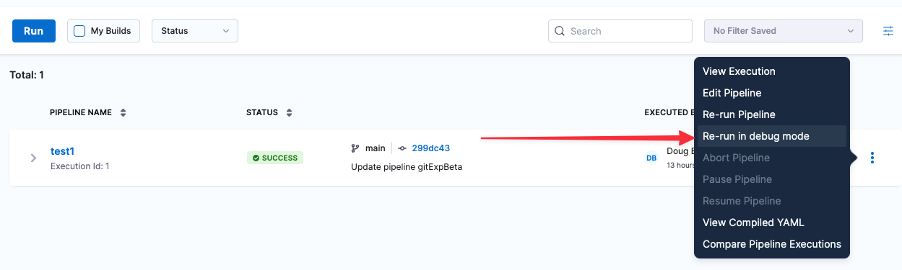

Harness Continuous Integration is updated regularly in Harness SaaS. Review the notes below for details about recent changes.

:::note
Harness deploys updates progressively to different Harness SaaS clusters. You can identify the cluster hosting your account in your Account Overview page. The features and fixes in the release notes may not be available in your cluster immediately.

Additionally, the release notes below are only for NextGen SaaS. FirstGen SaaS release notes are available [here](/docs/first-gen/firstgen-release-notes/harness-saa-s-release-notes) and Self-Managed Enterprise Edition release notes are available [here](/release-notes/self-managed-enterprise-edition).
:::

## January 17, 2023, version 78215

### What's new

* This release includes two new CI steps for integrating your Harness CI pipelines with GitHub Actions and Bitrise. The following steps are available in Harness Cloud build infrastructures only. 
   - An Actions step to run GitHub Actions.
   - A Bitrise step to run Bitrise steps and workflows. (CI-6479)
* Harness CI now supports remote debugging of remote builds in Harness Cloud, Kubernetes, and VMs in AWS, Azure, and other cloud platforms. If a build fails at a Run step, you can rerun the build in debug mode. This option is available in the **Builds**, **Execution**, and **Execution History** pages of the Harness UI. (CI-6350) 
   
   

* You can now specify hostnames instead of IPs in Kubernetes build infrastructures. This enables your pipelines to communicate with external services using hostnames. The following Harness YAML snippet shows how to set up aliases for your cluster in the CI stage **Infrastructure** section. (CI-5996, ZD-36578)

##### Defining hostnames to use in a Kubernetes build infrastructure

``` yaml 
infrastructure:
    type: KubernetesDirect
    spec:
      connectorRef: account.test
      namespace: harness-delegate
    hostNames:
      - abc.com
      - xyz.com
```

### Early access features

This release does not include early access features.

### Fixed issues

This release does not include fixed issues.

## January 10, 2023, version 78105

### What's new

No new features are available in this release.

### Early access features

No early access features are available for this release.

### Fixed issues

* Fixed an issue in the onboarding UI. In some cases, the web UI did not connect with the specified git account immediately after OAuth setup. (CI-6518)

* You can now use codebase fields as expressions. Previously, when the codebase repository name was defined by `<+pipeline.name>`, the built-in variables `<+codebase.branch>` and `<+codebase.commitSha>` returned null. (CI-6478, ZD-38122, ZD-38241)

* Fixed an issue that prevented Azure connectors from connecting to repos with URLs that contained spaces or `%20`. (CI-6465)

* Fixed an issue where CI reported an upload to an S3 as successful even if the upload failed. (CI-6420, ZD-37931)

* Fixed an issue in the onboarding UI where the **Select Your Repository** progress bar was incorrect. (CI-6335)

* Fixed an issue where a build did not run when a user selected **Run** in the **Pipeline Editor** UI. To run the build, the user needed to go to the YAML editor, save, and then run. (CI-6239)

* Added a log entry when a CI step skips a directory when uploading to an S3 bucket. (CI-6205)


## December 22, 2022, version 77908

### What's new

* Customers on the free plan can now run 5 stages per day on the CI hosted infrastructure. Contact Harness Sales to upgrade your plan. (CI-6430)

* The onboarding experience for new users has been enhanced. You can now create a sample "Hello-world" pipeline even without a repository selected/created.  (CI-6348)

### Early access features

No early access features are available for this release.

### Fixed issues

No fixed issues are available for this release. 

## December 13, 2022, version 77808

### What's new

No new features are available for this release.

### Early access features

No early access features are available for this release.

### Fixed issues

- Recently, Harness added a new background step to allow CI users to easily set service dependencies instead of using the stage setting for service dependencies. However, since the feature flag stage still relies on the stage service dependencies, this capability was added back to the UI with this fix. (CI-6308)
- An unnecessary view appeared momentarily in the new CI Get Started flow. This issue has been fixed. (CI-6103)
- Previously, users were unable to apply changes after updating the Language field in the Configure Run Tests Step because the Build Tool and Arguments fields were required. The Build Tool and Arguments can now be set dynamically using inputs, allowing users to add and edit the Configure Run Tests Step and save it as a template. (CI-4868)

## December 7, 2022, version 77716

### What's new

No new features are available in this release.

### Early access features

No early access features are available in this release.

### Fixed issues

No fixed issues are available in this release.

## November 29, 2022, version 77608

### What's new

- New Subscription ID field. (CI-6032)
  An Azure subscription ID is now required in the Build and Push ACR step to enable the display of artifacts uploaded by the steps on the Artifacts tab.

- New background step to define the service dependency. (CI-5580)
  A new background step has been added to define the service dependency in CI. The previous stage settings of service dependency are now deprecated. The new background step allows for better control and configuration of services.

### Early access features

No early access features are available in this release.

### Deprecated features

- AWS Code Commit (CI-5665)
  The AWS Code Commit Git connector has been deprecated. Going forward, use the generic Git connector to integrate with AWS Code Commit.

- Service dependency stage settings. (CI-5580)
  The option to create service dependency has been deprecated. Going forward, use the background step.

### Fixed issues

No fixed issues are available in this release.

## November 11, 2022, version 77433

### What's new

No new features are available in this release.

### Early access features

No early access features are available in this release.

###

Fixed issues
When building and pushing an image to ACR using a built-in step, the artifact does not appear on the Artifacts tab. (CI-5727)

This issue has been fixed. The artifact now appears on the Artifacts tab.

### Miscellaneous updates

The number of parallel step executions with matrix are now limited on the free plan. (CI-6061)

## November 6, 2022, version 77317

### What's new

The Custom Git Connector now supports connection via the Harness Platform, in addition to the ability to connect through the Harness Delegate. Connecting through Harness Secrets Manager is required to use the generic git connector on the Harness Cloud build infrastructure hosted by Harness. (CI-5666)

### Early access features

No early access features are available in this release.

### Fixed issues

- Retrying a failed pipeline crashes for PR codebase type. (CI-5974)
  This issue has been fixed.

- Windows PowerShell commands do not start on a new line. (CI-5961)
  Commands now start on a new line.

- When creating a connector for an API authentication Personal Access Token, the All tab does not display. (CI-5960)
  This issue has been fixed.
- Empty trigger data for non-CI pipelines does not show a message. (CI-5879)
  A static message now appears for CD manual executions.

- A file artifact URL does not show for artifact type File. (CI-5872)
  A colon (:) appears instead of the file artifact URL.
  This issue has been fixed.

- Unable to run the Google Cloud Function Drone plugin (CI-5869)
  The issue occurs because unexpected \_uuid elements were being added to the settings.
  To resolve this issue, the \_uuid attribute was removed from the nested setting attribute in the CI plugin step type.

- Intermittent issue in which a hosted build cannot fetch a code repo due to an internal exception. (CI-5622)
  This issue has been fixed.

## October 21, 2022, version 77221

### What's new

NA

### Early access features

NA

### Fixed issues

- Fixed an intermittent issue in which a hosted build could not fetch a code repo due to an internal exception. (CI-5622)
- Improved the validation error message that appears when user tries to include an unsupported character in a step name. (CI-5693)

## October 18, 2022, version 77116

### What's new

The Infrastructure tab in Build steps has been updated to show only supported options when a Hosted build infrastructure is selected. (CI-5737)

### Early access features

NA

### Fixed issues

- Fixed an issue in which tags for a Build and Push Artifact step would resolve to NULL because the tag string had a dash (-) rather than an underscore (\_). (CI-5305)
- Fixed an issue where the PR build status would not get updated in GitHub consistently. (CI-5411, ZD-33910, ZD-34304, ZD-34547, ZD-35359)
- Fixed an issue where artifacts would not get listed in the Artifacts tab. (CI-5736)
- Fixed a UI issue where the Repo Name width was incorrect when specifying a runtime input. (CI-5744)

## October 7, 2022, version 77025

### What's new

- Run Step logs now show the commands that the step will run before it runs them. This functionality is limited to Kubernetes build infrastructures. (CI-5557)
- You can now select Kotlin and Scala as languages in the Run Tests step when setting up Test Intelligence. You can also select sbt as a build tool for Scala. (CI-5653, CI-3333)

### Early access features

This release includes a new Docker delegate that you can install and run directly on a host. This feature is behind a Feature Flag CI_DOCKER_INFRASTRUCTURE. (CI-5680)

### Fixed issues

- UI fix: Improved alignment of the Repository Name field in the Build Stage setup wizard. (CI-5509)
  Fixed a back-end issue to ensure that a Bitbucket Connector with API enabled updates the status in Bitbucket as intended. (CI-5625)

- UI fix: When configuring a Service Dependency in an AWS or other cloud infrastructure, the UI should not show Kubernetes-only settings (Run as user, Privileged, and Resource Limits). CI-5628
  Previously added the Actor UUID in Sender for PR Comment webhook event for Bitbucket. Including this information in the other webhooks events as well. Now that the UUID is added, CI Manager can use this. (CI-5657)

- Fixed an issue that could cause CI builds to stall if the build process could not access the binary /usr/local/bin/split_tests. (CI-5664)
  Reverted a previous code change to ensure that a build on a VM infrastructures deletes the VM if the build gets aborted. (CI-5691)

## September 22, 2022, version 76817

### What's new

N/A

### Early access features

N/A

### Fixed issues

- Fixed a UI issue to ensure that a hint appears in a Git Clone step if there is a connectivity issue with the Delegate. (CI-4518)
- Fixed an issue in which CRUD events were not getting processed and acknowledged. (CI-5556)
- Fixed an issue where an update to a Matrix looping strategy did not persist in the UI after saving a step. (CI-5523)
- Added back-end validation to ensure that a user cannot create a Bitbucket connector with different usernames for standard and API Authentication access. (CI-5504, ZD-34241)
- Improved handling of GitHub registration requests and responses, which prevents trigger webhook creation failures in hosted build infrastructures. (CI-5251)
- Added logic to prevent a Null Pointer Exception if a user adds a AWS_ACCESS_KEY_ID variable with no value to a pipeline. (CI-4884)
- Fixed an issue in the Run Tests step that could cause a manual build to fail if a Git branch was not specified. (CI-4581, ZD-34734)

## September 14, 2022, version 76708

### What's new

N/A

### Early access features

N/A

### Fixed issues

- Added UI validation to ensure the Limit Memory and Limit CPU fields have the required formats. Previously, incorrect values for these fields were flagged during a build, which would cause the build to fail. (CI-5463)
- Added a force-kill flag to ensure that CI pods are deleted during a build cleanup. This ensures that pods get cleaned up even if they are in an Unknown or Not-Ready state. (CI-5377)
- Changed the “exit x” button that appears when creating a connector to make it more visible. (CI-5323)
- Added a validation to ensure that a user provides a repo name when setting up a trigger with an account-level Git connector. Without this validation, the UI would allow users to click Save without a repo name but the trigger would not get created. (CI-5315)
- Improved the error message that appears when a connection test fails because an account-level resource is trying to use a project-level secret. (CI-4705)
- Fixed an issue in the Run Tests step that could cause a manual build to fail if a Git branch was not specified. (CI-4581)

## September 7, 2022, version 76619

### What's new

N/A

### Early access features

N/A

### Fixed issues

Improved the Harness UI to make it easier to search for a specific test under the 'Tests" tab. (CI-3777)

## August 31, 2022, version 76515

### What's new

N/A

### Early access features

N/A

### Fixed issues

- Added a validation to ensure that the Bitbucket Account URL has the correct syntax when setting up a connector. (CI-5235)
- Fixed an issue where some users did not see existing Git connectors when setting up a pipeline in a hosted build infrastructure. (CI-5309)
- Fixed the Overview page refresh rate to ensure that the page fully loads with each refresh. (CI-5322)
- Added the feature flag CI_TI_DASHBOARDS_ENABLED back after it was deleted previously. (CI-4324)

## August 25, 2022, version 76426

### What's new

- This release includes a new Git Clone step that clones a repo separate from the repo specified in the Codebase object. This step supports all the config options supported for Codebase objects. (CI-4692)

- You can now use a hosted delegate for Docker, Artifactory, AWS, GCP, BitBucket, GitLab, and Azure connectors. (CI-4828, CI-5241)

## Early access features

N/A

### Fixed issues

- Bitbucket behavior on Self-Managed Platforms is improved when downloading large repos using the OPTIMIZED_GIT_FETCH_FILES feature. (CI-5019)
- Fixed an issue that could result in an NPE when fetching trigger status and updating webhook registration status when processing older triggers. (CI-5242)
- Fixed an issue where Restore from GCS didn't work if a step was in a step group. (CI-5298)

## August 18, 2022, version 76319

### What's new

You can now run connection tests for AWS, GCP, and Azure connectors. By default, executeOnDelegate field is true so that existing connectors remain backward-compatible. (CI-4980)

### Early access features

N/A

### Fixed issues

- Fixed issue: Author ID is not getting populated from Bitbucket webhook trigger. (CI-5183)
- Added target_url parameter in gitlab status update API. (CI-5130)
- Refactored cache saving to remove unnecessary logs ("gc storage credentials from api-key err=unexpected end of JSON input") (CI-4933, ZD-32349, ZD-32627)

## August 8, 2022, version 76128

### What's new

This release introduces validations for Custom Webhook events. The event handler now provides appropriate error messages if an event has incorrect values. (CI-4300, ZD-30121)

### Early access features

N/A

### Fixed issues

- Added validation for PR build numbers. (CI-3726)
- The CI build graph was not styled consistently with other graphs in the UI. This is now fixed. (CI-3957)
- Fixed issue: Git provider url placeholders were incorrect. (CI-3991)
- Fixed Issue: Active Committers should not count cron and manual execution. (CI-4881)
- You will now see the "CI Codebase" input form only if the selected stage has "cloneCodebase" set as true (in case of a selective stage execution) or at least one stage in the pipeline has "cloneCodebase" set as true (in case of complete pipeline execution). (CI-4894)
- Steps inside Step Groups are now being renamed to <step*group_id>*<step_id>. (CI-5002)
- Fixed JFrog Artifactory Artifact publishing so that build/ and libs/ folders are not included in the artifactory path target. (CI-5023, ZD-32723)
- Parallelism fix: For classnames, testsuites, and testcases, you need to provide a file that includes these values. The test splitter will use these values rather than the glob result. (CI-5049)
- Fixed an intermittent issue where an OAuth error message would appear when new users tried to set up a hosted build. (CI-5060)
- Fixed Issue: Active Committers should not count cron and manual execution. (CI-4841)
- This release introduces validations for Custom Webhook events. The event handler now provides appropriate error messages if an event has incorrect values. (CI-4300)
- Logs were creating issues with multiple stages (CI, CD) and stage names which are prefixes of one another. (CI-5038, ZD-32651)

## August 2, 2022, version 76030

### What's new

Users can now use Azure Repos connectors in pipeline codebase configuration and triggers. (CI-4825)

### Early access features

N/A

### Fixed issues

- Fixed issue: OAuth failure messages appear incorrectly. (CI-4971)
- Fixed issue: If a user has resources in region other than us-east-1, ECR step was failing for VM's. With this fix, a missing env variable is added which fixes it. (CI-4945, ZD-32398)
- OSX CI builds were failing randomly in case multiple builds are running in parallel. Issue was builds were executing on the incorrect vms. This issue has been resolved. The OSX VM builds now works correctly in runner 1.0.0-rc.7 or above tag. (CI-4935)
- Fix to ensure that pushing to ECR works as intended. Build and Push step when set up with IAM role now works as intended during build pipeline execution step. (CI-4921, ZD-30346, ZD-32243, ZD-32333, ZD-32398, ZD-33155)
- Fixed an issue where Harness Bitbucket hook did not publish the build status back to the Bitbucket repository. (CI-4898, ZD-32133)
- UI fix: When a user switches between Stages, the selected tab is persitent between the previous and the current stage. (CI-4882)
- Fixed an issue where the CI pipeline could not schedule pod due to memory allocation. (CI-4880, ZD-32118)

## July 18, 2022, version 75921

### What's new

n/a

### Early access features

n/a

### Fixed issues

- OAuth updates to support trial user logins. (CI-4918)
- Improved log messages for kaniko build errors. (CI-4513)

## July 11, 2022, version 75829

### What's new

The Build UI now shows a new VM icon. (CI-4630)

### Early access features

n/a

### Fixed issues

- TI pipeline is failing with error: "no account ID in query params" (CI-4792)
- Active Committers should not count cron and manual execution. (CI-4841)
- Users will see "Start Provisioning" button now only if previously provisioned delegate is unavailable. (CI-4761)
