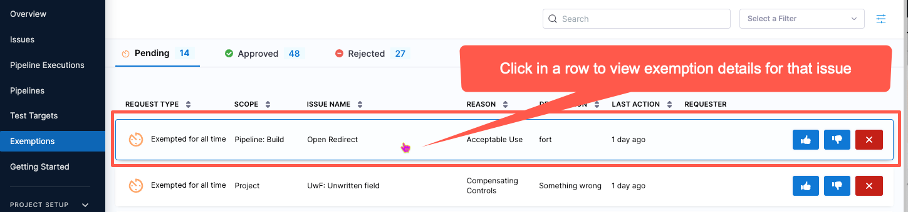
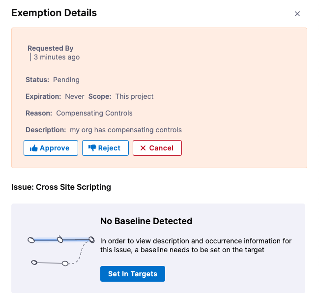
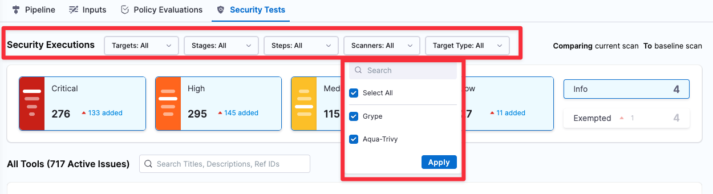

These are some of the [early access (beta) features](/docs/platform/get-started/release-status) that are available in Harness NextGen SaaS. Early access features can be released for the Harness Platform, delegate, or individual modules.

This list does not include all beta features, and features can be removed from this page once promoted to general availability (GA).

Early access features are behind feature flags. You can contact [Harness Support](mailto:support@harness.io) to enable a feature you're interested in.

:::info About Harness Release Notes

* **Progressive deployment:** Harness deploys changes to Harness SaaS clusters on a progressive basis. This means that the features described in these release notes may not be immediately available in your cluster. To identify the cluster that hosts your account, go to your **Account Overview** page in Harness. In the new UI, go to **Account Settings**, **Account Details**, **General**, **Account Details**, and then **Platform Service Versions**.
* **Security advisories:** Harness publishes security advisories for every release. Go to the [Harness Trust Center](https://trust.harness.io/?itemUid=c41ff7d5-98e7-4d79-9594-fd8ef93a2838&source=documents_card) to request access to the security advisories.
* **More release notes:** Go to [Harness Release Notes](/release-notes) to explore all Harness release notes, including module, delegate, Self-Managed Enterprise Edition, and FirstGen release notes.

:::

## Platform early access features

The following early access (beta) features are available for the Harness Platform.

### Allowlist verification for delegate registration

* **Release date:** January 2024
* **Release version:** 1.19.6
* **Issue number:** PL-42471
* **Feature flag:** `PL_ENFORCE_DELEGATE_REGISTRATION_ALLOWLIST`
* **How to enable:** Contact [Harness Support](mailto:support@harness.io)

With this feature flag enabled, delegates with an immutable image type can register only if their IP/CIDR address is included in the allowed list received by Harness Manager. The IP address/CIDR must be that of the delegate or the last proxy between the delegate and Harness Manager in the case of a proxy.

Harness Manager verifies registration requests by matching the IP address against an approved list and allows or denies registration accordingly. For more information, go to [Add and manage IP allowlists](https://developer.harness.io/docs/platform/security/add-manage-ip-allowlist/).

### Grant public access to Harness pipeline executions

* **Release date:** January 2024
* **Release version:** 1.20.9
* **Issue number:** PL-43499
* **Feature flag:** `PL_ALLOW_TO_SET_PUBLIC_ACCESS`
* **How to enable:** Contact [Harness Support](mailto:support@harness.io)

You can now grant public access to Harness pipelines. New settings on the Authentication page and in pipeline **Advanced Options** allow you to grant public access to pipeline executions.

### AIDA:tm: recommends docs when creating support tickets

* **Release date:** December 2023
* **Release version:** 81820
* **Issue number:** CDS-85267

AIDA replaces Coveo to provide content recommendations when you enter a subject in the **Submit a ticket** form.

### SCIM user provisioning enhancements

* **Release date:** March 2023
* **Release version:** 78712
* **Issue number:** PL-31498, PL-31497, PL-31496
* **Feature flag:** `PL_NEW_SCIM_STANDARDS`
* **How to enable:** Contact [Harness Support](mailto:support@harness.io)

Harness populates `givenName` and `familyName` for users via SCIM and returns the same when a GET, CREATE, or UPDATE request is made.

The response of a CRUD operation on a user or user group contains the following meta fields as per the SCIM 2.0 standards:

- createdAt
- lastUpdated
- version
- resourceType

**Update (version 78817, March 2023):** Any CRUD operation on a user now returns the details of the user groups that the user is part of. You can use this to verify what groups a given user belongs to.

### Delete users provisioned in Harness through SCIM

* **Release date:** February 2023
* **Issue number:** PL-23577
* **Feature flag:** `PL_USER_DELETION_V2`
* **How to enable:** Contact [Harness Support](mailto:support@harness.io)

You can delete a user provisioned in Harness through SCIM in NextGen and retain the user in FirstGen.

### Create remote templates and save them in a Git repo

* **Release date:** October 2022. This feature was released for early access in 2022. Early access features from past releases might have been promoted to GA since their original release.
* **Issue number:** PL-28573
* **Feature flag:** `NG_TEMPLATE_GITX`
* **How to enable:** Contact [Harness Support](mailto:support@harness.io)

You can create remote templates in Harness and save them in your Git repo. For more information, go to [Create a remote step template](/docs/platform/templates/create-a-remote-step-template), [Create a remote stage template](/docs/platform/templates/create-a-remote-stage-template), and [Create a remote pipeline template](/docs/platform/templates/create-a-remote-pipeline-template).

### Use expressions to reference secrets in Vaults

* **Release date:** October 2022. This feature was released for early access in 2022. Early access features from past releases might have been promoted to GA since their original release.
* **Issue number:** PL-28352
* **Feature flag:** Yes
* **How to enable:** Contact [Harness Support](mailto:support@harness.io)

You can use expressions to reference pre-existing secrets in Vault using a fully-qualified path. For more information, go to [HashiCorp Vault Secrets](/docs/platform/secrets/secrets-management/reference-existing-secret-manager-secrets#option-hashicorp-vault-secrets).

### Toggle email notifications for user invites

* **Release date:** October 2022. This feature was released for early access in 2022. Early access features from past releases might have been promoted to GA since their original release.
* **Issue number:** PL-26218, ZD-32152, ZD-35287
* **Feature flag:** `AUTO_ACCEPT_SAML_ACCOUNT_INVITES` or `PL_NO_EMAIL_FOR_SAML_ACCOUNT_INVITES`
* **How to enable:** Contact [Harness Support](mailto:support@harness.io)

Harness sends email notification for user invites when the feature flag `AUTO_ACCEPT_SAML_ACCOUNT_INVITES` is enabled.

Harness doesn't send emails for user invites when the feature flag `PL_NO_EMAIL_FOR_SAML_ACCOUNT_INVITES` is enabled.

## Delegate early access features

The following early access (beta) features are available for the Harness Delegate.

### Delegate task capacity check

* **Release date:** July 2023
* **Release version:** 79904
* **Issue number:** PL-39351
* **Feature flag:** `DELEGATE_TASK_CAPACITY_CHECK`
* **How to enable:** Contact [Harness Support](mailto:support@harness.io)

Harness added the ability to acquire only the configured maximum number of tasks. This allows Harness Manager to use the task capacity to determine whether to assign a task to the delegate or queue it. 

Delegate task capacity is only supported for CD tasks executed as child processes of a delegate (for example, it does not work for CI builds or CD Container step tasks that spin up new pods).

You can configure the maximum number of tasks using the Env variable `DELEGATE_TASK_CAPACITY`. For example, if you set `DELEGATE_TASK_CAPACITY` to a value of 2 and execute 6 tasks in parallel, Harness Manager executes only 2 tasks at a time. If you don't configure `DELEGATE_TASK_CAPACITY`, Harness Manager executes all 6 tasks in parallel. When this feature flag is enabled, the task is broadcast every minute in Harness Manager until it expires.

### Capture delegate agent metrics for delegates shipped on immutable image types

* **Release date:** May 2023
* **Release version:** 79307
* **Issue number:** PL-37908, PL-38538
* **Feature flag:** `DELEGATE_ENABLE_DYNAMIC_HANDLING_OF_REQUEST`
* **How to enable:** Contact [Harness Support](mailto:support@harness.io)

Harness can capture delegate agent metrics for delegates shipped on immutable image types. The following delegate agent metrics are available with this feature flag enabled:

* `task_completed`: The number of tasks completed.
* `task_failed`: The number of failed tasks.
* `task_rejected`: The number of tasks rejected because of a high load on the delegate.
* `delegate_connected`: Indicates whether the delegate is connected. Values are 0 (disconnected) and 1 (connected).
* `resource_consumption_above_threshold`: Delegate cpu/memory is above a threshold (defaults to 80%). Provide `DELEGATE_RESOURCE_THRESHOLD` as the env variable in the delegate YAML to configure the threshold.

## CE early access features

For information about CE early access features, go to the [Chaos Engineering release notes](/release-notes/chaos-engineering).

## CCM early access features

For information about early access (beta) features for Harness Cloud Cost Management, go to [CCM feature flags](/docs/cloud-cost-management/whats-supported#ccm-feature-flags) and the [CCM release notes](./cloud-cost-management).

## Continuous Delivery & GitOps early access features

For information about early access (beta) features for Harness Continuous Delivery and GitOps, go to [Active CD feature flags](/docs/continuous-delivery/cd-integrations/#active-cd-feature-flags) and the [CD and GitOps release notes](./continuous-delivery).

<!-- ## CET early access features

No early access (beta) features are available for the Harness Continuous Error Tracking module. -->

## CI early access features

For information about early access (beta) features for Harness Continuous Integration, go to [CI early access features](/docs/continuous-integration/ci-supported-platforms/#harness-ci-early-access-features) and the [CI release notes](./continuous-integration).

<!-- ## FF early access features

The following early access (beta) features are available for the Harness Feature Flags module. -->

<!-- ## IACM early access features

No early access (beta) features are available for Harness Infrastructure as Code Management. -->

## IDP early access features

For information about early access (beta) features for Harness Internal Developer Portal, go to the [IDP release notes](/release-notes/internal-developer-portal).

<!-- ## Code early access features

No early access (beta) features are available for Harness Code Repository. -->

## SEI early access features

For information about early access (beta) features for Harness Software Engineering Insights, go to [Active SEI feature flags](/docs/software-engineering-insights/sei-supported-platforms/#active-sei-feature-flags) and the [SEI release notes](/release-notes/software-engineering-insights).

<!-- ## SSCA early access features

No early access (beta) features are available for the Harness Software Supply Chain Assurance module. -->

## STO early access features

The following early access (beta) feature is available for the Harness Security Testing Orchestration module.

#### Default Setting: Users can approve their own exemptions
* **Release date:** July 2024
* **Release version:** [Version 1.102.2](/release-notes/security-testing-orchestration#version-11022)
* **Issue number:** STO-7675
* **Feature flags:** `STO_EXEMPTION_SETTING`
* **How to enable:** Contact [Harness Support](mailto:support@harness.io)

## SRM early access features

For information about early access (beta) features for Harness Service Reliability Management, go to [SRM early access features](/docs/service-reliability-management/srm-whats-supported/#srm-early-access-features) and the [SRM release notes](./service-reliability-management).

## Features promoted to GA

These features were released as early access (beta) features, and they have since been promoted to GA. This list is not exhaustive, and features are removed from this list after they have been stable in GA for some time.

### Platform features promoted to GA

#### AIDA support automatically available

* **GA date:** Late 2023
* **Early access release date:** October 2023
* **Early access release version:** 81008
* **Issue number:** PL-41700
* **Feature flag:** `PL_AI_SUPPORT_CHATBOT`

AIDA's support chat feature is now always available without requiring you to enable the feature in **Settings**.

#### Harness AI Development Assistant (AIDA:tm:)

* **GA date:** Late 2023
* **Early access release date:** June 2023

The Harness platform leverages Harness AI Development Assistant (AIDA) to revolutionize software delivery processes. By combining AI capabilities with robust DevOps tools, features, and practices, the Harness platform streamlines and accelerates the software delivery lifecycle, and it empowers teams to deliver high-quality applications quickly and efficiently. Its AI-driven predictive analytics, continuous verification, and advanced release orchestration capabilities empower teams to drive innovation, improve efficiency, and ultimately deliver exceptional user experiences.

Following are some key benefits of Harness AIDA:

- Auto-recognition of failures in pipelines: The root cause analysis (RCA) option generates recommendations for step failures in pipelines. Harness bases these recommendations on the step logs and the context of the failed step. For more information, go to [Troubleshooting with AIDA](/docs/continuous-integration/troubleshoot-ci/aida).

- Asset governance: The asset governance feature assists you in drafting rules that are based on your requirements and aligned with your governance goals. Harness AIDA governance support also offers detailed descriptions of built-in rules. When you are creating policies, this feature facilitates informed decision-making by clarifying the purpose, scope, and implications of each rule. For more information, go to [Asset governance with AIDA](/docs/category/harness-aida-for-asset-governance).

- Security: Harness AI identifies security vulnerabilities, describes them, and suggests remediation. For more information, go to [Remediations with AIDA](/docs/security-testing-orchestration/remediations/ai-based-remediations).

Review the following information for details about data privacy and terms of use:

- [AIDA Terms](https://www.harness.io/legal/aida-terms)
- [AIDA Privacy](https://www.harness.io/legal/aida-privacy)

**Update (October 2023):** AIDA for CI is now generally available. For more information, go to [Troubleshooting with AIDA](/docs/continuous-integration/troubleshoot-ci/aida).

**Update (November 2023):** AIDA for STO is now generally available. For more information, go to [Use AI to fix security issues](/docs/security-testing-orchestration/remediations/ai-based-remediations).

**Update (January 2024):** Most AIDA functionalities are generally available. For more information, go to the [AIDA overview](/docs/platform/harness-aida/aida-overview).

#### Google Cloud Secret Manager

* **GA date:** Early 2023
* **Early access release date:** November 2022
* **Issue number:** PL-28978, SPG-153

You can now create secrets using the Google Cloud Secret Manager in Harness. For more information, go to [Add a Google Cloud Secret Manager](/docs/platform/secrets/secrets-management/add-a-google-cloud-secret-manager)

#### Customize navigation

* **GA date:** Early 2023
* **Early access release date:** November 2022
* **Issue number:** SPG-153

You can select modules and configure your own navigation in Harness.

Also, Projects is a new option in the left navigation. Click Projects to view the project-specific overview, pipeline, connector, and other details.

#### Optimized performance for remote pipelines

* **GA date:** Early 2023
* **Early access release date:** November 2022
* **Issue number:** PL-29459

You can get optimized performance on remote pipelines if you are on delegate version 772xx or higher. If you are on an older delegate version, you can upgrade your delegate for optimized performance.

#### Create a Harness Custom Secret Manager in NextGen

* **GA date:** Late 2022/Early 2023
* **Early access release date:** September 2022
* **Issue number:** PL-25545
* **Feature flag:** `CUSTOM_SECRET_MANAGER_NG`

You can onboard any secret manager with Harness and reference their secrets in Harness. For more information, go to [Add a custom secret manager](/docs/platform/secrets/secrets-management/custom-secret-manager).

### Delegate features promoted to GA

#### GitHub App authentication for GitHub connectors

* **GA date:** December 2023
* **Early access release date:** August 2023
* **Early access release version:** Delegate version 80303 and CI version 5408
* **Issue number:** CI-8577
* **Feature flag:** `CDS_GITHUB_APP_AUTHENTICATION`

You can use a GitHub App as the [primary authentication method for a GitHub connector](/docs/platform/connectors/code-repositories/ref-source-repo-provider/git-hub-connector-settings-reference#credentials-settings).

### CE features promoted to GA

For information about CE early access features, go to the [Chaos Engineering release notes](/release-notes/chaos-engineering).

### CCM features promoted to GA

For information about early access (beta) features for Harness Cloud Cost Management, go to [CCM feature flags](/docs/cloud-cost-management/whats-supported#ccm-feature-flags) and the [CCM release notes](./cloud-cost-management).

### CD & GitOps features promoted to GA

For information about early access (beta) features for Harness Continuous Delivery and GitOps, go to [Active CD feature flags](/docs/continuous-delivery/cd-integrations/#active-cd-feature-flags) and the [CD and GitOps release notes](./continuous-delivery).

<!-- ### CET features promoted to GA

No information available. -->

### CI features promoted to GA

For information about early access (beta) features for Harness Continuous Integration, go to [CI early access features](/docs/continuous-integration/ci-supported-platforms/#harness-ci-early-access-features) and the [CI release notes](./continuous-integration).

### FF features promoted to GA

#### Beta version of an Apex SDK for Feature Flags

* **GA date:** Late 2022/Early 2023
* **Early access release date:** October 20, 2022

Harness released a beta version of an Apex SDK for Feature Flags. For more information and to access this SDK, see the [Apex SDK reference guide](/docs/feature-flags/use-ff/ff-sdks/server-sdks/apex-sdk-reference) and the [GitHub repository](https://github.com/harness/ff-apex-server-sdk).

<!-- ### IACM features promoted to GA

No information available. -->

### IDP early access features

For information about early access (beta) features for Harness Internal Developer Portal, go to the [IDP release notes](/release-notes/internal-developer-portal).

<!-- ### Code features promoted to GA

No information available. -->

### SEI early access features

For information about early access (beta) features for Harness Software Engineering Insights, go to [Active SEI feature flags](/docs/software-engineering-insights/sei-supported-platforms/#active-sei-feature-flags) and the [SEI release notes](/release-notes/software-engineering-insights).

<!-- ### SSCA features promoted to GA

No information available. -->

### STO features promoted to GA

#### SonarQube branch scanning

* **Release date:** July 2024
* **Early access release date:** February 2024
* **Early access Release version:** [Version 1.83.1](../release-notes/security-testing-orchestration.md#version-1831)
* **Feature flags:** `STO_SONARQUBE_BRANCHING`

You an use SonarQube to perform Branch Scanning in Harness STO.

#### Built-in SAST scanners

* **Release date:** June 2024
* **Early access release date:** April 2024
* **Early access Release version:** UI update 1.15.0
* **Feature flag:** `STO_ONE_CLICK_SAST`

STO includes a built-in SAST step that adds a preconfigured Semgrep step that's ready to run as soon as you add it.

#### Built-in scanners

* **Release date:** June 2024
* **Early access release date:** March 2024
* **Early access Release version:** 1.88.2
* **Feature flag:** `STO_ONE_CLICK`

STO includes a set of built-in steps for adding scans to your pipelines quickly and with minimal configuration. The scanners used in these steps are free to STO users and are ready to run as soon as you add them to your pipeline. 

#### Wiz integration

* **Release date:** June 2024
* **Early access release date:** March 2024
* **Early access Release version:** 1.88.2
* **Feature flag:** `STO_STEP_PALETTE_WIZ`

You can include [Wiz](/docs/security-testing-orchestration/sto-techref-category/wiz/artifact-scans-with-wiz) vulnerability scans in your Harness pipelines. Wiz is a cloud security platform that scans IaC templates, container images, and directories/repositories before deployment. Wiz can detect security misconfigurations, vulnerabilities, and exposed secrets.

#### Default regular expressions for target baselines

* **Release date:** June 2024
* **Early access release date:** March 2024
* **Early access Release version:** 1.86.1
* **Feature flag:** `STO_BASELINE_DEFAULTING`

You can specify default baselines for specific target types: code repositories, container images, application instances, and configurations. STO includes a set of predefined defaults for repository and container image targets. The default baseline for repositories is `master` or `main`. The default for images is `latest` or the most recently scanned Semantic Version number if it can be detected.

#### STO Jira integration

* **Release date:** June 2024
* **Early access release date:** March 2023
* **Early access Release version:** 1.34.0
* **Feature flag:** `STO_JIRA_INTEGRATION`

STO includes a Jira integration that enables you to create Jira tickets for issues detected during an STO build. For more information, go to [Create Jira tickets for detected issues](/docs/security-testing-orchestration/jira-integrations).

#### Auto-detect option for targets and variants

* **Release date:** March 2024
* **Early access release date:** February 2024
* **Early access Release version:** 1.85.0
* **Feature flag:** `STO_AUTO_TARGET_NAME_VARIANT`

Security Tests steps with configurable UIs, such as [**Aqua Trivy**](/docs/security-testing-orchestration/sto-techref-category/trivy/aqua-trivy-scanner-reference#detect-target-and-variant), [**Semgrep**](/docs/security-testing-orchestration/sto-techref-category/semgrep/semgrep-scanner-reference#target-and-variant-detection), and [**ZAP**](/docs/security-testing-orchestration/sto-techref-category/zap/zap-scanner-reference#target-and-variant-detection), now include an auto-detect option for targets and variants. This option eliminates the need to specify the target variant manually.

#### Open Source Vulnerabilities (OSV) scanner integration

* **GA date:** March 2024
* **Early access release date:** February 2024
* **Early access Release version:** 1.85.0
* **Feature flag:** `STO_STEP_PALETTE_OSV`

You can now scan your code repositories using [Open Source Vulnerabilities (OSV)](https://google.github.io/osv-scanner/), a tool that finds existing vulnerabilities that affect your project's dependencies. OSV SAST supports a [variety of languages and lockfiles](https://google.github.io/osv-scanner/supported-languages-and-lockfiles). 

#### Anchore Enterprise integration

* **GA date:** March 2024
* **Early access release date:** November 2023
* **Early access Release version:** 1.73.1
* **Feature flag:** `STO_STEP_PALETTE_ANCORE_ENTERPRISE`

You can specify a time limit when you request an exemption. The **Exemptions** table includes a **Time Remaining** column that shows when each exemption is scheduled to expire. The table is sorted by this column by default so that soonest-to-expire exemptions are listed first.

#### Time limits for exemptions

* **GA date:** March 2024
* **Early access release date:** October 2023
* **Early access Release version:** 1.72.0
* **Feature flag:** `STO_TIMEBOUND_EXEMPTIONS`

You can specify a time limit when you request an exemption. The **Exemptions** table includes a **Time Remaining** column that shows when each exemption is scheduled to expire. The table is sorted by this column by default so that soonest-to-expire exemptions are listed first.

### Write OPA policies based on STO scan results

* **Release date:** November 2023
* **Issue number:** STO-6738
* **Feature flag:** `STO_DATA_OPA`
* **How to enable:** Contact [Harness Support](mailto:support@harness.io)

You can now write and apply OPA policies against all results from a scan. This greatly extends the range of policies that you can use to stop pipelines. This release also includes a set of [Security Tests policy samples](/docs/security-testing-orchestration/policies/create-opa-policies#security-tests-policy-samples) that you can use to write policies based on severity, issue title, reference ID, CVE age, and number of occurrences.

#### Aqua Security integration

* **GA date:** November 2023
* **Early access release date:** November 2023
* **Early access Release version:** 1.74.1
* **Feature flag:** `STO_STEP_PALETTE_AQUASEC`
* **How to enable:** Contact [Harness Support](mailto:support@harness.io)

You can now scan your repositories and other components used in your code with [Anchore Enterprise](/docs/security-testing-orchestration/sto-techref-category/anchore-enterprise-scanner-reference), a scanner that provides visibility into supply chain security risks.  (STO-6382)

#### UI enhancements for working with exemptions

* **GA date:** November 2023
* **Early access release date:** October 2023
* **Early access Release version:** 1.69.3
* **Feature flag:** `STO_EXEMPTION_DETAILS`

This feature includes the following UI enhancements for working with exemptions:

- You can click on a row in the **Exemptions** table to view details for the issue associated with that exemption.

   

- For best results in STO, you should [specify a baseline for every target](/docs/security-testing-orchestration/get-started/key-concepts/targets-and-baselines). To encourage this, the **Exemption Details** pane hides details for an issue if there is no baseline detected. To specify the baseline, select **Set in Targets**.

   

#### Security Tests filters

* **GA date:** November 2023
* **Early access release date:** August 2023
* **Early access Release version:** 1.64.1
* **Feature flag:** `STO_DROPDOWN_FILTERS`

The **Security Tests** tab includes a set of pull-down menus so you can filter the issues lists by Target, Target Type, Step, Stage, and Scanner.

#### Harness AI Development Assistant (AIDA:tm:) for STO

* **GA date:** November 2023
* **Early access release date:** June 2023
* **Early access release version:** 1.58.3
* **Issue numbers:** STO-5882, STO-6593, STO-6181, PL-39723
* **Feature flag:** `STO_AI_ENHANCED_REMEDIATIONS`

import Intro from '/docs/security-testing-orchestration/use-sto/shared/sto-aida-overview-partial.md';

<Intro />

**Update (Version 1.60.0):** Reference Identifiers selected for AIDA enhancement in a Security Issue are now remembered, upon generation, and shown when revisited in the UI. (STO-6032)

**Update (Version 1.61.1):** Fixed an issue that broke the capability to customize the code snippet for AIDA-augmented remediations in the Security Tests module. (STO-6181)

**Update (Version 1.72.1):** You can now provide feedback about the AIDA-generated remediation step for a selected issue. (STO-6593)

<!-- EULA RQMT REMOVED -- You are now required to sign an end-user license agreement to access the Harness AI Development Assistant (AIDA) in the account and project scopes. You need to do this even if you could previously use AIDA without signing a EULA. This change was originally introduced in the 80505 platform release. The EULA is displayed when you enable AIDA at the account scope (**Account Settings** > **Account Resources** > **Default Settings** > **Harness AI Developer Assistant**). Each account user must sign the EULA only once, and the setting is inherited at the project scope. (PL-39723) -->

#### Improved UI for configuring scan steps

* **GA date:** November 2023
* **Early access release date:** March 2023
* **Early access Release version:** 1.38.3

This feature includes a set of Security steps with an improved UI for configuring scans. Each step shows only the settings that apply to the specific scan. Note the following:

- This release includes new steps for the following scanners: Aqua Trivy, Bandit, Black Duck, Checkmarx, Grype, Mend, Prisma Cloud, Snyk, SonarQube, and ZAP.
- Docker-in-Docker is no longer required for these steps *unless* you're scanning a container image in a Kubernetes build infrastructure. For more information, go to [Docker-in-Docker requirements for STO](/docs/security-testing-orchestration/sto-techref-category/security-step-settings-reference#configuring-docker-in-docker-dind-for-your-pipeline).
- Support is currently limited to Kubernetes and Harness Cloud AMD64 build infrastructures only.

#### CodeQL integration

* **GA date:** September 2023
* **Early access release date:** July 2023
* **Early access Release version:** 1.60.0
* **Feature flag:** `STO_STEP_PALETTE_CODEQL`

You can scan your code repositories using [CodeQL](/docs/security-testing-orchestration/sto-techref-category/codeql-scanner-reference), an analysis engine used by developers to automate security checks, and by security researchers to perform variant analysis.

#### Semgrep integration

* **GA date:** September 2023
* **Early access release date:** July 2023
* **Early access Release version:** 1.60.0
* **Feature flag:** `STO_STEP_PALETTE_SEMGREP`

You can scan container images and repositories using [Semgrep](/docs/security-testing-orchestration/sto-techref-category/semgrep/semgrep-scanner-reference), a scanner that detects security vulnerabilities and other issues in open-source projects.

#### Use regex to define dynamic target baselines

* **GA date:** August 2023
* **Early access release date:** July 2023
* **Early access Release version:** 1.61.1
* **Feature flag:** `STO_BASELINE_REGEX`

You can now define dynamic target baselines using regular expressions. Dynamic baselines more accurately reflect the current "root" element in the context of a real-world software development life cycle. Dynamic baselines also make it easier to track the introduction and remediation of specific vulnerabilities.

For more information about this feature, go to [Set up target baselines](/docs/security-testing-orchestration/use-sto/set-up-sto-pipelines/set-up-baselines).

#### Scanner templates for Burp integration

* **GA date:** August 2023
* **Early access release date:** July 2023
* **Early access Release version:** 1.60.0
* **Feature flag:** `STO_STEP_PALETTE_BURP_ENTERPRISE`

The [Burp integration](/docs/security-testing-orchestration/sto-techref-category/burp-scanner-reference) now supports scanner templates, which make it much easier to set up a scan step.

#### Fossa integration

* **GA date:** August 2023
* **Early access release date:** July 2023
* **Early access Release version:** 1.60.0
* **Feature flag:** `STO_STEP_PALETTE_FOSSA`

You can scan container images and repositories using [Fossa](/docs/security-testing-orchestration/sto-techref-category/fossa-scanner-reference), a scanner that detects security vulnerabilities and other issues in open-source projects.

<!-- ### SRM features promoted to GA

No information available. -->
