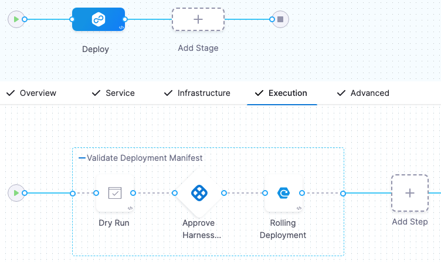

<DocsButton icon = "fa-solid fa-square-rss" text="Subscribe via RSS" link="/release-notes/early-access/rss.xml" />

Review the notes below to learn about the early access (aka beta) features in Harness NextGen SaaS across all Harness modules and the Harness Platform. Early access features require a feature flag. For FirstGen release notes, go to [Harness SaaS Release Notes (FirstGen)](/docs/first-gen/firstgen-release-notes/harness-saa-s-release-notes). Additionally, Harness publishes security advisories for every release. Go to the [Harness Trust Center](https://trust.harness.io/?itemUid=c41ff7d5-98e7-4d79-9594-fd8ef93a2838&source=documents_card) to request access to the security advisories.

:::info note
Harness deploys changes to Harness SaaS clusters on a progressive basis. This means that the features described in these release notes may not be immediately available in your cluster. To identify the cluster that hosts your account, go to the **Account Overview** page.
:::

## Latest - July 28, 2023

### Continuous Integration, version 5106

**Enable Cache Intelligence in the Visual editor. (CI-8571)**

The **Enable Cache Intelligence** UI field is behind the feature flag `CI_CACHE_INTELLIGENCE`. Contact [Harness Support](mailto:support@harness.io) to enable the feature.

You can enable [Cache Intelligence](/docs/continuous-integration/use-ci/caching-ci-data/cache-intelligence) in the Pipeline Studio's Visual editor. Previously, you could only enable Cache Intelligence through the YAML editor. For more information, go to the [Cache Intelligence](/docs/continuous-integration/use-ci/caching-ci-data/cache-intelligence) documentation. This enhancement only applies to the Harness Cloud build infrastructure.

## July 18, 2023

### Continuous Delivery, version 79916

- Digest support added for Nexus 3, Github, and Artifactory [artifact sources](/docs/continuous-delivery/x-platform-cd-features/services/artifact-sources). (CDS-71711)

  This feature is behind the feature flag `CD_NG_DOCKER_ARTIFACT_DIGEST`.

  The **Artifact Details** page has a new, optional **Digest** setting where you can specify the digest/SHA for a container image artifact.

  Specifying an image by digest, rather than just tag, is useful when you want to ensure that the image you deploy for a service is fixed and immutable. If an image with the specified tag/digest combination does not exist in the artifact registry, the pipeline execution fails.

### Harness Delegate, version 79904

- Harness added the ability to acquire only the configured maximum number of tasks. This allows Harness Manager to use the task capacity to determine whether to assign a task to the delegate or queue it. You can configure the maximum number of tasks using the Env variable `DELEGATE_TASK_CAPACITY`. For example, if you set `DELEGATE_TASK_CAPACITY` to a value of 2 and execute 6 tasks in parallel, Harness Manager executes only 2 tasks at a time. If you don't configure `DELEGATE_TASK_CAPACITY`, Harness Manager executes all 6 tasks in parallel. (PL-39351)

   This functionality is behind a feature flag, `DELEGATE_TASK_CAPACITY_CHECK`. When the feature flag is enabled, the task is broadcast every minute in Harness Manager until it expires.

## July 12, 2023

### Continuous Integration, version 5003

The `CI_LE_STATUS_REST_ENABLED` feature has been rolled back to early access and disabled by default due to a discovered instability that caused the [CD Container step](/docs/continuous-delivery/x-platform-cd-features/executions/cd-general-steps/container-step/) to fail. This feature causes CI steps to send status updates to the [Harness Manager](/docs/getting-started/harness-platform-architecture#harness-platform-components) directly by HTTP, rather than through a delegate.

This feature flag is now disabled by default and must be re-enabled if your CI-to-Harness-Manager communications need to support client connections with additional certificates. (CI-8338)

### Security Testing Orchestration, version 1.61.1

You can now define dynamic target baselines using regular expressions. Dynamic baselines more accurately reflect the current "root" element in the context of a real-world software development life cycle. Dynamic baselines also make it easier to track the introduction and remediation of specific vulnerabilities.

This feature is behind the Feature Flag `STO_BASELINE_REGEX`. For more information, go to [Set up target baselines](/docs/security-testing-orchestration/use-sto/set-up-sto-pipelines/set-up-baselines).

## Previous releases

<details>
<summary>2023 releases</summary>

#### June 28, 2023

##### Continuous Delivery, version 79714

import Earlyaccess from '/release-notes/shared/cd-79700-early-access.md'

<Earlyaccess />

#### June 21, 2023

##### Harness launches Harness AI Development Assistant as a beta feature

The Harness platform leverages Harness AI Development Assistant (AIDA) to revolutionize software delivery processes. By combining AI capabilities with robust DevOps tools, features, and practices, the Harness platform streamlines and accelerates the software development lifecycle, and it empowers teams to deliver high-quality applications quickly and efficiently. Its AI-driven predictive analytics, continuous verification, and advanced release orchestration capabilities empowers teams to drive innovation, improve efficiency, and ultimately deliver exceptional user experiences.

Following are some key benefits of Harness AIDA:

- Auto-recognition of failures in pipelines: The root cause analysis (RCA) option generates recommendations for step failures in pipelines. Harness bases these recommendations on the step logs and the context of the failed step.
  For more information, go to [Troubleshooting with AIDA](http://developer.harness.io/docs/continuous-integration/troubleshoot-ci/aida).

- Asset governance: The asset governance feature assists you in drafting rules that are based on your requirements and aligned with your governance goals. Harness AIDA governance support also offers detailed descriptions of built-in rules. When you are creating policies, this feature facilitates informed decision-making by clarifying the purpose, scope, and implications of each rule.
  For more information, go to [Asset governance with AIDA](https://developer.harness.io/docs/category/harness-aida-for-asset-governance).
  
- Security: Harness AI identifies security vulnerabilities, describes them, and suggests remediation.
  For more information, go to [Remediations with AIDA](https://developer.harness.io/docs/security-testing-orchestration/use-sto/view-and-troubleshoot-vulnerabilities/ai-based-remediations).

Review the following information for details about data privacy and terms of use:

- [AIDA Terms](https://www.harness.io/legal/aida-terms)
- [AIDA Privacy](https://www.harness.io/legal/aida-privacy)

#### June 19, 2023

##### Continuous Integration, version 4204

###### Output variables automatically become environment variables (CI-7817, ZD-39203)

This functionality is behind a feature flag, `CI_OUTPUT_VARIABLES_AS_ENV`.

With this feature flag enabled, output variables from steps are automatically available as environment variables for other steps in the same Build (`CI`) stage. This means that, if you have a Build stage with three steps, an output variable produced from step one is automatically available as an environment variable for steps two and three.

In other steps in the same stage, you can refer to the output variable by its key without additional identification. For example, an output variable called `MY_VAR` can be referenced later as simply `$MY_VAR`. Without this feature flag enabled, you must use an [expression](/docs/platform/references/runtime-inputs/#expressions) to reference where the variable originated, such as `<+steps.stepID.output.outputVariables.MY_VAR>`.

For more information on this feature, go to the documentation on [Output variables](/docs/continuous-integration/use-ci/run-ci-scripts/run-step-settings#output-variables).

###### Remote debugging enhancements (CI-8135, CI-8048)

**Re-run in Debug Mode** now supports Python and PowerShell Core (`pwsh`). You can also now use debug mode for local runner build infrastructures. The remote debugging functionality is behind a feature flag, `CI_REMOTE_DEBUG`. For more information, go to [Debug with SSH](/docs/continuous-integration/use-ci/debug-mode).

##### Continuous Delivery, version 79606

- Scheduled automatic approvals have been added to manual approval steps. (CDS-69415)
  
  This functionality is behind a feature flag, `CDS_AUTO_APPROVAL`.

  You can configure a manual approval step to automatically approve at a specific date and time.

  <docimage path={require('./static/058d3e80cc8f95965e51010541d0c28f77865e484f8a84beea205b49172c658d.png')} width="60%" height="60%" title="Click to view full size image" />    

  For more details, go to [Automatic Approvals](https://developer.harness.io/docs/continuous-delivery/x-platform-cd-features/cd-steps/approvals/using-harness-approval-steps-in-cd-stages/#automatic-approvals).

#### June 09, 2023

##### Cloud Cost Management, version 79701

**Propagate force cool down** (CCM-12338)
  
  You can now propagate force cool down from primary rule to dependent rules.

  Earlier, when stopping a rule from the UI, you had to stop its dependant rules one by one. With this enhancement, you can propagate the stop operation to dependant rules as well. 
  
  Propagating cool down to dependant rules is optional. You can stop the primary rule with or without propagating cool down to dependant rules.

##### Continuous Delivery, version 79516

<!--- Scale down the last successful stage environment created by using a Blue Green Deployment strategy. (CDS-68527)
  
  This functionality is behind a feature flag, `CDS_BG_STAGE_SCALE_DOWN_STEP_NG`. 

  This functionality helps you efficiently manage your resources. The scale down step can be configured within the same stage or different stage based on your requirement.

  During scale down, the `HorizontalPodAutoscaler` and `PodDisruptionBudget` resources are removed, and the Deployments, StatefulSets, DaemonSets and Deployment Configs resources are scaled down. Make sure that the infrastructure definition of these resources and the Blue Green deployment are the same. This is necessary as Harness identifies resources from the release history, which is mapped to a release name. If you configure a different infrastructure definition, it might lead to scaling down important resources.

  Harness Delegate version 79503 is required for this feature.-->

- Kubernetes deployments support `HorizontalPodAutoscaler` and `PodDisruptionBudget` for Blue Green and Canary execution strategies. (CDS-59011)

  This functionality is behind a feature flag, `CDS_SUPPORT_HPA_AND_PDB_NG`. 
  
  Harness Delegate version 79503 is required for this feature.

#### May 23, 2023, version 79306

##### Continuous Delivery

- Trigger all artifacts and manifests using **On New Artifact** and **On New Manifest** triggers respectively. (CDS-68262, ZD-43588, ZD-43726)
  
  This functionality is behind a feature flag, `TRIGGER_FOR_ALL_ARTIFACTS`. 

  Earlier, you could trigger only the last pushed artifact or manifest using triggers. You can now trigger all collected artifacts and manifests of perpetual tasks in one single execution using the **On New Artifact** or **On New Manifest** trigger options. 

##### Continuous Integration

Harness CI now supports remote debugging. This feature was initially released in January 2023 and subsequently reverted for further development. Debug mode is available if all of the following conditions are met:

* You have the feature flag `CI_REMOTE_DEBUG` enabled. Contact [Harness Support](mailto:support@harness.io) to enable this feature.
* The build infrastructure uses a Linux-based OS.
* The build fails at a **Run** step with a Bash or Shell script in a **Build** (`CI`) stage.
* The build runs in Harness Cloud, on a virtual machine, or in Kubernetes.

You can re-run builds in debug mode through the **Builds**, **Execution**, and **Execution History** pages of the Harness UI. For more information, go to the [debug mode](/docs/continuous-integration/troubleshoot-ci/debug-mode) documentation.

##### Harness Delegate, version 79307

- New delegate metrics are available. This functionality is behind a feature flag, `DELEGATE_ENABLE_DYNAMIC_HANDLING_OF_REQUEST`. (PL-37908, PL-38538)

   Harness captures delegate agent metrics for delegates shipped on immutable image types. The following new delegate agent metrics are available with the feature flag:
  
   | **Metric name** | **Description** |
   | :-- | :-- |
   | `task_completed` | The number of tasks completed. |
   | `task_failed` | The number of failed tasks. |
   | `task_rejected` | The number of tasks rejected because of a high load on the delegate. |
   | `delegate_connected` | Indicates whether the delegate is connected. Values are 0 (disconnected) and 1 (connected). |
   | `resource_consumption_above_threshold` | Delegate cpu/memory is above a threshold (defaults to 80%). Provide `DELEGATE_RESOURCE_THRESHOLD` as the env variable in the delegate YAML to configure the threshold. |

   Enable the feature flag, `DELEGATE_ENABLE_DYNAMIC_HANDLING_OF_REQUEST` to use the new delegate agent metrics. When this feature flag is enabled, Harness will capture the metrics. For more information, go to [Configure delegate metrics](/docs/platform/delegates/manage-delegates/delegate-metrics/).

#### May 04, 2023, version 79214

##### Continuous Delivery

- You can set webhook triggers to run specific pipeline stages using the [Allow selective stage(s) executions?](https://developer.harness.io/docs/platform/pipelines/run-specific-stage-in-pipeline/) option. (CDS-56775, CDS-56774)

  This functionality is behind the feature flag, `CDS_NG_TRIGGER_SELECTIVE_STAGE_EXECUTION`. 
  
  To run a particular stage of the pipeline: 
  1. Select the stage, then select **Advanced Options**.
  2. In **Stage Execution Settings>** **Allow selective stages(s) executions?**, select **Yes**. This setting is selected by default.
     
     
  3. When you create a trigger, in **Configuration**, select the stages you want to execute.
     
     
  
  Here is a sample trigger YAML: 
  
  ```
  trigger:
  name: stage3Trigger
  identifier: stage3Trigger
  enabled: true
  description: ""
  tags: {}
  stagesToExecute:
    - stage3
  orgIdentifier: NgTriggersOrg
  projectIdentifier: viniciusTest
  pipelineIdentifier: ThreeStagesPipeline
  source:
    type: Webhook
    spec:
      type: Custom
      spec:
        payloadConditions: []
        headerConditions: []
  inputYaml: |
    pipeline:
      identifier: ThreeStagesPipeline
      stages:
        - stage:
            identifier: stage3
            type: Custom
            variables:
              - name: stage3var
                type: String
                value: stage3Var

  ```
- You can add Tanzu Application Service (TAS) [config files](/docs/continuous-delivery/deploy-srv-diff-platforms/tanzu/add-config-files) from GitHub. (CDS-56452)

  This feature is currently behind the feature flag, `CDS_GIT_CONFIG_FILES`. For TAS deployment types, you can reference service config files from GitHub.

#### April 21, 2023, version 79111

##### Continuous Delivery

- Protecting secrets used in webhook-based triggers that use secret decryption on delegates (CDS-58488, ZD-42117)
  
  This functionality is behind a feature flag, `CDS_NG_TRIGGER_AUTHENTICATION_WITH_DELEGATE_SELECTOR`.
  
  Github triggers that use a secret for authentication will now use the same delegate selectors saved in the secret's Harness secret manager.
- Harness now supports variable expressions in the plain text config files. (CDS-58399)
  
  This functionality is behind a feature flag, `CDS_NG_CONFIG_FILE_EXPRESSION`.
  
  Variable expression support includes service, environment, pipeline, and stage variables. Any Harness expression is supported.
  
  Variable expressions are not supported for encrypted text config files because expressions impact the encoded secret.
- Config files can now be pulled from Github. (CDS-56652)
  
  This functionality is behind a feature flag, `CDS_GIT_CONFIG_FILES`.

  For Harness services using the Tanzu deployment type, config files can be configured using Github, in addition to the Harness file store. Support for other deployment types in coming soon.

#### April 10, 2023, version 79015

##### Continuous Delivery

- [AWS Lambda](/docs/continuous-delivery/deploy-srv-diff-platforms/aws/aws-lambda-deployments)
  
  This functionality is behind a feature flag, `CDS_AWS_NATIVE_LAMBDA`.
  
  Harness supports the deployment of AWS Lambda functions. 

- ServiceNow custom table support. (CDS-55046)
  
  This functionality is behind a feature flag, `CDS_SERVICENOW_TICKET_TYPE_V2`.
  
  Custom table support is now available in Harness' ServiceNow integration. 
  
  Harness recommends that you only use a table extending task, or extend tables that indirectly extend the task. You can specify any custom table in Harness.

  <details>
  <summary>What is a table extending task?</summary>
  
  In ServiceNow, a table extending task is a task that involves creating a new table by extending an existing table. When a table is extended, a new child table is created that inherits all the fields, relationships, and other attributes of the parent table. The child table can then be customized further to meet the specific needs of the organization.
  
  </details>
  
  Itil roles are not mandatory for using these steps. When using the normal flow for custom tables, you should have sufficient permissions on the custom table, such as basic CRUD permissions, permissions to update desired fields, etc.
  
  When using template flow, your user role is required along with cross scope privileges to the custom table. 
  
  The store app is only certified to be used with Incident, Problem, Change Request, and Change Task tables by the ServiceNow certification team.
  
  The custom table being used should allow access to this table via web services.
- Harness will remove comments when evaluating commented lines in manifests to avoid rendering failures. (CDS-57721, ZD-41676)
  
  This functionality is behind a feature flag, `CDS_REMOVE_COMMENTS_FROM_VALUES_YAML`.
  
  Expressions in comments were causing issues for some customers as Harness was trying to evaluate the expressions and this was causing failures.
  
  Harness will remove comments from values.yaml files to prevent expressions in comments from being evaluated and causing failures.

#### March 24, 2023, version 78817

##### Harness Platform

- By enabling the feature flag,`PL_NEW_SCIM_STANDARDS`, any CRUD operation on a user now returns the details of the user groups that the user is part of. (PL-31496)

  You can use this to verify what groups a given user belongs to.

#### March 15, 2023, version 78712

##### Continuous Delivery

- Large repositories are now supported for [Azure Repo](https://developer.harness.io/docs/platform/Connectors/Code-Repositories/connect-to-a-azure-repo). This functionality is behind a feature flag, `OPTIMIZED_GIT_FETCH_FILES`.

  Harness performs a `git clone` to fetch files. When fetching very large repositories, the network connection may time out. Enable the feature flag, `OPTIMIZED_GIT_FETCH_FILES` to fetch very large repositories from Azure Repo. When this feature flag is enabled, Harness will use provider-specific APIs to improve performance.

##### Harness Platform

- Harness now populates `givenName` and `familyName` for users via SCIM and returns the same when a GET, CREATE, or UPDATE request is made. (PL-31498)

  This is behind the feature flag `PL_NEW_SCIM_STANDARDS`.

- The response of a CRUD operation on a user or user group now contains the following meta fields as per the SCIM 2.0 standards:

  - createdAt

  - lastUpdated

  - version

  - resourceType (PL-31497)
  
    This is behind the feature flag `PL_NEW_SCIM_STANDARDS`.


#### March 2, 2023

##### Security Testing Orchestration

- Improved UI for configuring scan steps (STO-4867)
  
  This release includes a set of Security steps with an improved UI for configuring scans. Each step shows only the settings that apply to the specific scan. 

  Note the following:

  - This release includes new steps for the following scanners: Aqua Trivy, Bandit, Black Duck, Checkmarx, Grype, Mend, Prisma Cloud, Snyk, SonarQube, and ZAP.  
  - Docker-in-Docker is no longer required for these steps *unless* you're scanning a container image. If you're scanning a repository or running instance, you don't need to set up a Background step running DinD.    
  - These steps are currently available in Security stages only. 
  - Support is currently limited to Kubernetes and Harness Cloud AMD64 build infrastructures only.
  - For descriptions of all available UI settings, go to [Security step UI settings reference](/docs/security-testing-orchestration/sto-techref-category/security-step-ui-settings-reference).
 

<details><summary>Security step configuration UI </summary>


  
</details>


- This release includes a Jira integration that enables you to create Jira tickets for issues detected during an STO build. For more information, go to [Create Jira tickets for detected issues](/docs/security-testing-orchestration/use-sto/view-and-troubleshoot-vulnerabilities/jira-integrations). (STO-5467)

#### February 15, 2023

##### Continuous Delivery

- Kubernetes Dry Run step added. (CDS-43839)
  
  You can now add the Dry Run step for Kubernetes and Native Helm deployments.

  This functionality is behind a feature flag: `K8S_DRY_RUN_NG`.

  

  The Dry Run step fetches the Kubernetes manifests or Helm charts in a stage and performs a dry run of those resources. This is the same as running a `kubectl apply --filename=manifests.yaml --dry-run`.
  
  You can use the Dry Run step to check your manifests before deployment. You can follow the step with an [Approval](https://developer.harness.io/docs/category/approvals/) step to ensure the manifests are valid before deployment.
  
  You can reference the resolved manifest from the Dry Run step in subsequent steps using a Harness variable expression.
  ```
  <+pipeline.stages.[Stage_Id].spec.execution.steps.[Step_Id].k8s.ManifestDryRun>
  ```

  For example, if the stage Id is `Deploy` and the Dry Run step Id is `Dry_Run` the expression would be:

  ```
  <+pipeline.stages.Deploy.spec.execution.steps.Dry_Run.k8s.ManifestDryRun>
  ```
  For more information, go to [Perform a Kubernetes dry run](https://developer.harness.io/docs/continuous-delivery/cd-execution/kubernetes-executions/k8s-dry-run/).

#### February 6, 2023

##### Harness Platform

- You can delete a user provisioned in Harness through SCIM in NextGen and retain the user in FirstGen by enabling the feature flag `PL_USER_DELETION_V2`. (PL-23577)

#### January 12, 2023

##### Continuous Delivery

- Convert imperative Kubernetes rollback to declarative rollback. (CDS-2993, ZD-26855, ZD-27690, ZD-36563, ZD-36670)

  This functionality is behind a feature flag: `CDP_USE_K8S_DECLARATIVE_ROLLBACK_NG`.
  
  Harness applies Kubernetes manifest  using `kubectl apply`, which is a declarative way of creating Kubernetes objects. But when rolling back, we perform `kubectl rollout undo workloadType/workloadName --to-revision=<REVISION_NUMBER>`, which is an imperative way of rolling back. Using imperative and declarative commands together is not recommended and can cause issues.

 In some instances, the workload spec was not updated properly when `rollout undo` was performed. Subsequent deployments then refered to an invalid spec of the workload and caused Kubernetes issues like [kubectl rollout undo should warn about undefined behaviour with kubectl apply](https://github.com/kubernetes/kubernetes/issues/94698).
  
  **What is the fix?**
  
  We had to redesign our release history to store all rendered manifests in secrets, just like Helm does. While rolling back, we are now reapplying the last successful release's manifests. This solves this issue.

  **What is the impact on customers?**
    - Enabling declarative rollback disables versioning (even if the **Skip Versioning** checkbox is left unchecked), since versioning was introduced with the imperative rollback design. However, versioning is not needed anymore with declarative rollback.
    - The delegate's service account needs the permission to create, update, and read secrets in the defined infrastructure namespace. Typically, customers' delegates already have these permissions, but if cluster roles are strictly scoped, this could cause failures. For information on cluster roles for the delegate, go to [Install Harness Delegate on Kubernetes](https://developer.harness.io/tutorials/platform/install-delegate/).

</details>

<details>
<summary>2022 releases</summary>

#### December 13, 2022

##### Service Reliability Management

Continuous Verification (CV) fails if the data for configured deployment strategy is not available (SRM-12731)

Harness was automatically applying an alternate deployment strategy even if the required data for the deployment configured in the Verify step was not available.

Now, Harness does not automatically apply an alternate deployment strategy if the required data is not available. Instead, Harness fails the CV. Harness automatically applies an alternate deployment strategy only if you choose the Auto option in the Continuous Verification Type dropdown list when configuring the Verify step.

This feature is behind the feature flag SRM_LOG_HOST_SAMPLING_ENABLE.

#### December 7, 2022

##### Continuous Delivery

Nexus 3 is now supported for Azure Web App artifacts. (CDS-46372)

For more information, see [Azure Web Apps deployment tutorial](https://developer.harness.io/docs/continuous-delivery/onboard-cd/cd-quickstarts/azure-web-apps-tutorial/)

This functionality is behind a feature flag: AZURE_WEB_APP_NG_NEXUS_PACKAGE

#### November 29, 2022

##### Continuous Delivery

Terraform Backend Configuration file path in the Terraform Apply step now supports remote file repos. (CDS-39012, ZD-37065)

Terraform Backend Configuration now can be specified in the remote file repository.

For more details, go to [Provision with the Terraform Apply Step](https://developer.harness.io/docs/continuous-delivery/cd-infrastructure/terraform-infra/run-a-terraform-plan-with-the-terraform-apply-step/).

This functionality is behind a feature flag: TERRAFORM_REMOTE_BACKEND_CONFIG.

#### November 11, 2022

##### Harness Platform

You can now create secrets using the Google Cloud Secret Manager in Harness. (PL-28978)

- For more information, see [Add a Google Cloud Secret Manager](https://developer.harness.io/docs/platform/security/add-a-google-cloud-secret-manager/)

- You can now select modules and configure your own navigation in Harness. (SPG-153)

Also, Projects is a new option in the left navigation. Click Projects to view the project-specific overview, pipeline, connector, and other details.

#### November 6, 2022

##### Harness Platform

You can now get optimized performance on remote pipelines by enabling the feature flag USE_GET_FILE_V2_GIT_CALL if you are on delegate version 772xx or higher. (PL-29459)

If you are on an older delegate version, you can upgrade your delegate for optimized performance.

#### October 20, 2022

##### Feature Flags

We've released a beta version of an Apex SDK for Feature Flags.

For more information and to access this SDK, see the [Apex SDK reference guide](https://developer.harness.io/docs/feature-flags/ff-sdks/server-sdks/apex-sdk-reference/) and the [GitHub repository](https://github.com/harness/ff-apex-server-sdk).

#### October 18, 2022

##### Continuous Delivery

ECS Run Task support

In addition to deploying tasks as part of your standard ECS deployment, you can use the ECS Run Task step to run individual tasks separately as a step in your ECS stage. The ECS Run Task step is available in all ECS strategy types. An example of when you run a task separately is a one-time or periodic batch job that does not need to keep running or restart when it finishes.

This functionality is behind feature flags: NG_SVC_ENV_REDESIGN and ECS_NG

For more information, go to the [ECS tutorial's run task step](https://developer.harness.io/docs/continuous-delivery/onboard-cd/cd-quickstarts/ecs-deployment-tutorial/).

#### October 7, 2022

##### Continuous Delivery

- ECS deployments: deploy artifacts to your Amazon Elastic Container Service (ECS) clusters using a Rolling, Canary, and Blue Green strategies.

Enable Feature Flags NG_SVC_ENV_REDESIGN and ECS_NG.

For more information, go to the [ECS deployment tutorial](https://developer.harness.io/docs/continuous-delivery/onboard-cd/cd-quickstarts/ecs-deployment-tutorial/).

- Traditional deployments using SSH or WinRM: deploy your artifacts to hosts located in Microsoft Azure, AWS, or any platform-agnostic Physical Data Center (PDC).

These deployments are called Traditional because they use Secure Shell and PowerShell scripts and a traditional runtime environment as opposed to containers and orchestration mechanisms, like Kubernetes.

Enable Feature Flags NG_SVC_ENV_REDESIGN, SSH_NG, and PIPELINE_MATRIX.

For more information, go to [Secure Shell (SSH) deployment tutorial](https://developer.harness.io/docs/continuous-delivery/deploy-srv-diff-platforms/traditional/ssh-ng) and [WinRM deployment tutorial](https://developer.harness.io/docs/continuous-delivery/deploy-srv-diff-platforms/traditional/win-rm-tutorial).

- Custom deployments using Deployment templates: In some cases, you might be using a platform that does not have first class support in Harness, such as OpenStack, WebLogic, WebSphere, Google Cloud functions, etc. We call these non-native deployments. For non-native deployments, Harness provides a custom deployment option using Deployment Templates.

Enable Feature Flags NG_SVC_ENV_REDESIGN and NG_DEPLOYMENT_TEMPLATE.

For more information, go to the [Custom deployments using deployment templates tutorial](/docs/continuous-delivery/deploy-srv-diff-platforms/custom-deployment-tutorial).

##### Harness Platform

- You can now create remote Templates in Harness and save it in your Git repo by enabling the feature flag NG_TEMPLATE_GITX. (PL-28573)

For more information, see [Create a remote step template](https://developer.harness.io/docs/platform/Templates/create-a-remote-step-template), [Create a remote stage template](https://developer.harness.io/docs/platform/Templates/create-a-remote-stage-template), and [Create a remote pipeline template](https://developer.harness.io/docs/platform/Templates/create-a-remote-pipeline-template).

- You can now use expressions to reference pre-existing secrets in Vault using a fully-qualified path. (PL-28352)

For more information, see [HashiCorp Vault Secrets](https://developer.harness.io/docs/platform/Secrets/Secrets-Management/reference-existing-secret-manager-secrets#option-hashicorp-vault-secrets).

- Harness will now send email notification for user invites when the feature flag AUTO_ACCEPT_SAML_ACCOUNT_INVITES is enabled. (PL-26218, ZD-32152,35287)

Harness will not send any emails for user invites when the feature flag PL_NO_EMAIL_FOR_SAML_ACCOUNT_INVITES is enabled.

##### Continuous Integration

This release includes a new Docker delegate that you can install directly on a host. This feature is behind the Feature Flag CI_DOCKER_INFRASTRUCTURE. (CI-5680)

#### September 7, 2022

##### Harness Platform

You can now create a Harness Custom Secret Manager in Next Gen. (PL-25545)

You can onboard any secret manager with Harness and reference their secrets in Harness using a Shell Script.

This is behind the feature flag CUSTOM_SECRET_MANAGER_NG.

See [Add a custom secret manager](https://developer.harness.io/docs/platform/Secrets/Secrets-Management/custom-secret-manager).

#### July 7, 2022

##### Harness Platform

Simplified Git Experience

Harness Git Experience lets you store configurations for your resources like Pipelines, Input Sets in Git. You can choose Git as the source of truth and use your Git credentials to access and modify your configurations.

With Harness Git Experience, you can select the repository and branch from where you want to execute your Pipelines, hence simplifying your Pipeline execution by seamless access to your Harness resources and their configurations stored in Git.

For more information, refer to [Harness Git Experience Overview](https://developer.harness.io/docs/platform/git-experience/git-experience-overview/).

This functionality is behind a feature flag: NG_GIT_EXPERIENCE

</details>
