import HarnessApiData from '../src/components/HarnessApiData/index.tsx';

<DocsButton icon = "fa-solid fa-square-rss" text="Subscribe via RSS" link="https://developer.harness.io/release-notes/feature-management-experimentation/rss.xml" />

These release notes describe recent changes to Harness Feature Management & Experimentation (FME).

#### Last updated: August 1, 2025

## August 2025

### [New Feature] Support for feature flag prerequisites
----
#### 2025-08-01

The following SDKs now support feature flag prerequisites. This feature allows you to define dependency relationships between flags, ensuring a given flag is only evaluated if its prerequisite flag returns one of the specified treatments. 

Prerequisites are evaluated before allowlists and targeting rules, helping you implement complex rollout strategies and conditional flag logic. If any prerequisite is not met, the flag is not evaluated and its `defaultTreatment` is served.

#### Related documentation

- [Java SDK](/docs/feature-management-experimentation/sdks-and-infrastructure/server-side-sdks/java-sdk#feature-flag-prerequisites)
- [React SDK](/docs/feature-management-experimentation/sdks-and-infrastructure/client-side-sdks/react-sdk#feature-flag-prerequisites)
- [Angular SDK](/docs/feature-management-experimentation/sdks-and-infrastructure/client-side-sdks/angular-utilities#feature-flag-prerequisites)
- [Browser SDK](/docs/feature-management-experimentation/sdks-and-infrastructure/client-side-sdks/browser-sdk#feature-flag-prerequisites)
- [JavaScript SDK](/docs/feature-management-experimentation/sdks-and-infrastructure/client-side-sdks/javascript-sdk#feature-flag-prerequisites)
- [React Native SDK](/docs/feature-management-experimentation/sdks-and-infrastructure/client-side-sdks/react-native-sdk#feature-flag-prerequisites)
- [Redux SDK](/docs/feature-management-experimentation/sdks-and-infrastructure/client-side-sdks/redux-sdk#feature-flag-prerequisites)
- [Browser Suite](/docs/feature-management-experimentation/sdks-and-infrastructure/client-side-suites/browser-suite#feature-flag-prerequisites)
- [iOS SDK](/docs/feature-management-experimentation/sdks-and-infrastructure/client-side-sdks/ios-sdk#feature-flag-prerequisites)
- [Android SDK](/docs/feature-management-experimentation/sdks-and-infrastructure/client-side-sdks/android-sdk#feature-flag-prerequisites)
- [iOS Suite](/docs/feature-management-experimentation/sdks-and-infrastructure/client-side-suites/ios-suite#feature-flag-prerequisites)
- [Android Suite](/docs/feature-management-experimentation/sdks-and-infrastructure/client-side-suites/android-suite#feature-flag-prerequisites)
- [.NET SDK](/docs/feature-management-experimentation/sdks-and-infrastructure/server-side-sdks/net-sdk#feature-flag-prerequisites())
- [Node.js SDK](/docs/feature-management-experimentation/sdks-and-infrastructure/server-side-sdks/nodejs-sdk#feature-flag-prerequisites)

## July 2025

### [New Enhancement] Dimensional Analysis
----
#### 2025-07-25

You can now break down your experiment results by dimensions such as browser, device type, or region on the new experiment and metrics dashboards in Harness FME. While this capability was previously available on the Metrics impact tab, it’s now also available on the Experiments metric details dashboard, making it easier to uncover how different users respond to a treatment. This can reveal hidden patterns or regressions that might not be visible in the aggregate view of the **Current impact snapshot by treatment** chart.

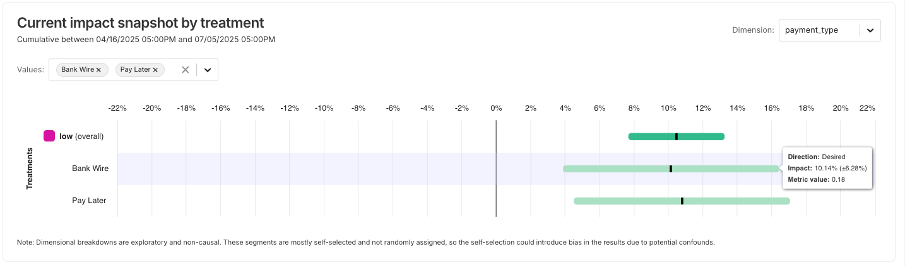

Select a dimension group from the dropdown menu to view the direction, impact, and metric value for each segment compared against the control group's performance. For example, your experiment may show an overall positive result, but drilling down into specific dimensions (like state, payment type, or browser) might reveal that certain groups experienced negative or neutral impact. 

This gives you a more nuanced understanding of your results and another tool for refining your hypothesis or identifying follow-up experiments. 

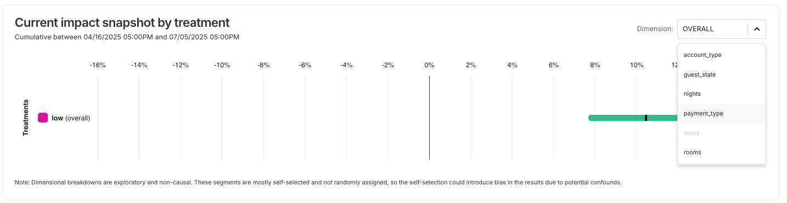

This is especially helpful for identifying how specific segments are impacted by changes, so you can make more informed experiment decisions based on deeper insights.

#### Related documentation

- [Metric details and trends](/docs/feature-management-experimentation/experimentation/experiment-results/viewing-experiment-results/#use-ai-summarize)
- [Analyzing experiment results](/docs/feature-management-experimentation/experimentation/experiment-results/analyzing-experiment-results/#current-impact-snapshot-by-treatment)
- [Dimensional analysis](/docs/feature-management-experimentation/experimentation/experiment-results/analyzing-experiment-results/dimensional-analysis)

### [New Feature] AI Summarize button for metrics and experiments
----
#### 2025-07-14

Harness FME now includes an AI Summarize button on the Experiments Dashboard and Metric Details Dashboard. This feature uses AI to summarize your overall experiment results as well as how individual metrics on that experiment are performing over time, providing a more holistic view of performance and outcomes.

These summaries help teams quickly interpret statistical results (both at the metric level and the experiment level) without needing to dig into raw data or graphs.

AI summaries are especially helpful for product managers and non-technical stakeholders who want fast, accurate takeaways about the effectiveness of feature flags or treatments.

#### Related documentation

- [Viewing experiment results](/docs/feature-management-experimentation/experimentation/experiment-results/viewing-experiment-results/#use-ai-summarize)

## June 2025

### [New Feature] Support for rule-based segments
----
#### 2025-06-18

You can now define rule-based segments in Harness FME. These dynamic segments allow you to group users based on custom attribute conditions (such as location, plan type, or usage behavior) instead of maintaining static user ID lists. Rule-based segments are evaluated in real time during flag evaluation, helping you target users more flexibly and reduce manual maintenance.

This feature is especially useful when working with large user segments, as they help improve maintainability and reduce performance overhead compared to managing long lists of individual user IDs.

#### Related documentation

- [Create a segment](/docs/feature-management-experimentation/feature-management/segments/)
- [Target segments](/docs/feature-management-experimentation/feature-management/target-segments/)
- [Android SDK](/docs/feature-management-experimentation/sdks-and-infrastructure/client-side-sdks/android-sdk)
- [Browser SDK](/docs/feature-management-experimentation/sdks-and-infrastructure/client-side-sdks/browser-sdk)
- [Browser Suite](/docs/feature-management-experimentation/sdks-and-infrastructure/client-side-suites/browser-suite)
- [iOS SDK](/docs/feature-management-experimentation/sdks-and-infrastructure/client-side-sdks/ios-sdk)
- [JavaScript SDK](/docs/feature-management-experimentation/sdks-and-infrastructure/client-side-sdks/javascript-sdk)
- [React SDK](/docs/feature-management-experimentation/sdks-and-infrastructure/client-side-sdks/react-sdk)
- [Redux SDK](/docs/feature-management-experimentation/sdks-and-infrastructure/client-side-sdks/redux-sdk)
- [Java SDK](/docs/feature-management-experimentation/sdks-and-infrastructure/server-side-sdks/java-sdk)
- [.NET SDK](/docs/feature-management-experimentation/sdks-and-infrastructure/server-side-sdks/net-sdk)
- [NodeJS SDK](/docs/feature-management-experimentation/sdks-and-infrastructure/server-side-sdks/nodejs-sdk)
- [Python SDK](/docs/feature-management-experimentation/sdks-and-infrastructure/server-side-sdks/python-sdk)
- [Ruby SDK](/docs/feature-management-experimentation/sdks-and-infrastructure/server-side-sdks/ruby-sdk)
- [React Native SDK](/docs/feature-management-experimentation/sdks-and-infrastructure/client-side-sdks/react-native-sdk)

### [New Feature] Experiment Tags
----
#### 2025-06-16

You can now add tags to experiments in Harness FME, making it easier to organize, search, and manage your experiments at scale. Use tags to label experiments by team, purpose, status, or any other internal convention, just like you already do with flags, metrics, and segments.

This is especially helpful for organizations with multiple teams running experiments in the same project, where clear organization and discoverability are key.

#### Related documentation

- [Tags](/docs/feature-management-experimentation/management-and-administration/tags/)
- [Experimentation Overview](/docs/feature-management-experimentation/experimentation/overview)
- [Experiments Setup](/docs/feature-management-experimentation/experimentation/setup/)

### [New Feature] Control cache expiration for client-side SDKs
----
#### 2025-06-05

The following SDKs now allow you to configure how long the rollout cache for feature flags and segment memberships persist: Browser, iOS, and Android. By default, the cache expires after 10 days. 

This update introduces new configuration options for overriding that default and for explicitly clearing the cache on SDK initialization.

#### Related documentation
- [Browser SDK](/docs/feature-management-experimentation/sdks-and-infrastructure/client-side-sdks/browser-sdk#configuring-localstorage-cache-for-the-sdk)
- [Browser SDK Suite](/docs/feature-management-experimentation/sdks-and-infrastructure/client-side-suites/browser-suite#configuring-localstorage-cache-for-the-suite)
- [iOS SDK](/docs/feature-management-experimentation/sdks-and-infrastructure/client-side-sdks/ios-sdk#configure-cache-behavior)
- [iOS SDK Suite](/docs/feature-management-experimentation/sdks-and-infrastructure/client-side-suites/ios-suite#configure-cache-behavior)
- [Android SDK](/docs/feature-management-experimentation/sdks-and-infrastructure/client-side-sdks/android-sdk#configure-cache-behavior)
- [Android SDK Suite](/docs/feature-management-experimentation/sdks-and-infrastructure/client-side-suites/android-suite#configure-cache-behavior)

## April 2025
### [New Feature] Experiments Dashboard
----
#### 2025-04-30

Harness Feature Management & Experimentation now offers a new Experiments Dashboard designed to simplify the creation and analysis of experiments.

The new Experiments Dashboard improves the experiment setup process, supports concurrent analysis of multiple treatments, and introduces an intuitive metric table layout for reviewing experiment results.

Key enhancements include:

* A dedicated experiment creation workflow with smart defaults to streamline setup.
* A redesigned results dashboard for easier interpretation of metrics and impact trends.
* Support for analyzing multiple treatments in a single view.
* Decoupling of experiments from feature flag lifecycle management, enabling faster flag cleanup and reducing technical debt.

This release makes it easier for teams to run experiments without requiring deep technical expertise, while providing advanced users with greater visibility and flexibility during analysis.

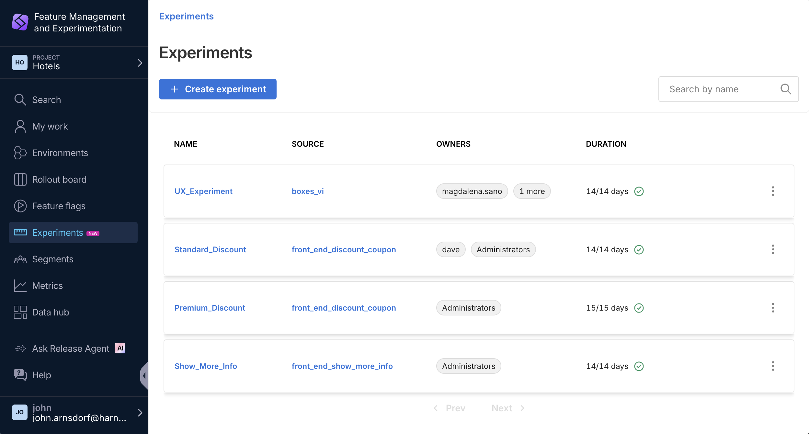
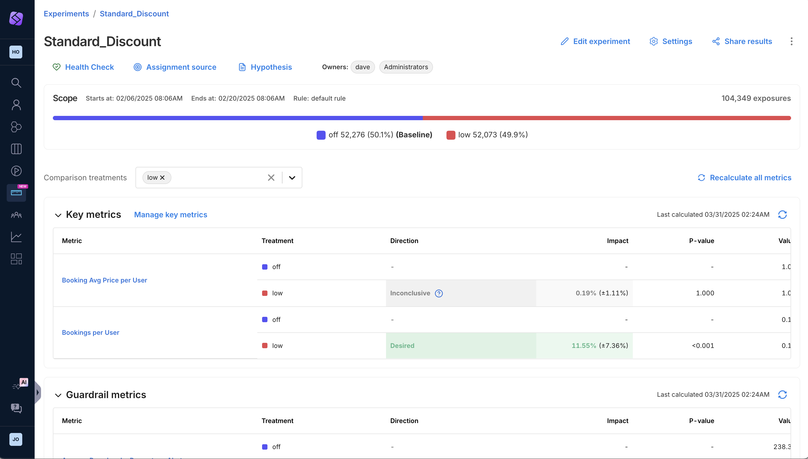
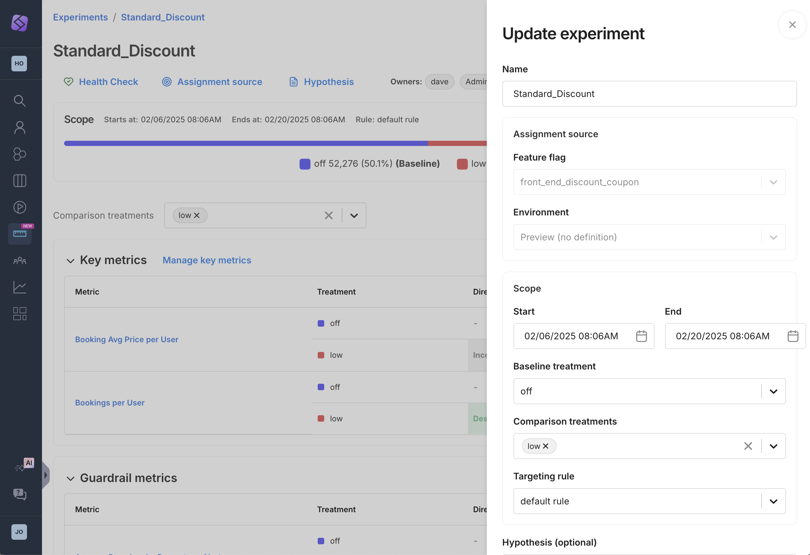
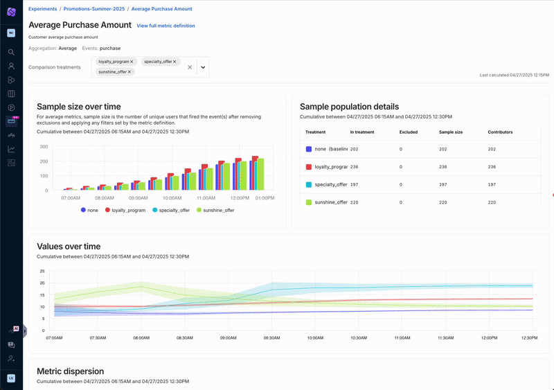

#### Related documentation
- [Experiments](/docs/feature-management-experimentation/experimentation/overview)
- [Experiment health check](/docs/feature-management-experimentation/experimentation/experiment-results/analyzing-experiment-results/health-check)

### [New Feature] Centralized control for React SDK flag update behavior
----
#### 2025-04-16

You can now configure how your React application responds to SDK lifecycle events using new props on the `<SplitFactoryProvider>` component. This allows you to set default reactivity behavior for all components in the application, reducing the need to configure each hook individually. 

This is especially useful for use cases like suppressing UI updates during onboarding flows or session transactions. For example, setting `updateOnSdkUpdate={false}` at the root level (i.e., the `<SplitFactoryProvider>` component) disables updates of the `useSplitTreatments` hook triggered by flag changes until re-enabled.

The following options are supported:

- `updateOnSdkReady`
- `updateOnSdkReadyFromCache`
- `updateOnSdkTimedout`
- `updateOnSdkUpdate`

These settings apply to all nested hooks and components unless explicitly overridden.

For example:

```javascript
const App = () => (
  <SplitFactoryProvider 
    config={sdkConfig} 
    updateOnSdkUpdate={false} // Disables SDK_UPDATE-triggered re-renders for all child components
  >
    <MyApp />
  </SplitFactoryProvider>
);
```

#### Related documentation
- [React SDK](/docs/feature-management-experimentation/sdks-and-infrastructure/client-side-sdks/react-sdk#subscribe-to-events)

### [New Feature] Append impression properties
----
#### 2025-04-10
The following SDKs now allow you to append properties to impressions for each `getTreatment` call: Browser, iOS, JavaScript, Node.js, React, and Redux. This provides additional context for in-product troubleshooting within Live tail or downstream external analysis.
#### Related documentation
- [Browser SDK](/docs/feature-management-experimentation/sdks-and-infrastructure/client-side-sdks/browser-sdk#append-properties-to-impressions)
- [Browser SDK Suite](/docs/feature-management-experimentation/sdks-and-infrastructure/client-side-suites/browser-suite#append-properties-to-impressions)
- [iOS SDK](/docs/feature-management-experimentation/sdks-and-infrastructure/client-side-sdks/ios-sdk#append-properties-to-impressions)
- [iOS SDK Suite](/docs/feature-management-experimentation/sdks-and-infrastructure/client-side-suites/ios-suite#append-properties-to-impressions)
- [Java SDK](/docs/feature-management-experimentation/sdks-and-infrastructure/server-side-sdks/java-sdk#append-properties-to-impressions)
- [JavaScript SDK](/docs/feature-management-experimentation/sdks-and-infrastructure/client-side-sdks/javascript-sdk#append-properties-to-impressions)
- [Node.js SDK](/docs/feature-management-experimentation/sdks-and-infrastructure/server-side-sdks/nodejs-sdk#append-properties-to-impressions)
- [React SDK](/docs/feature-management-experimentation/sdks-and-infrastructure/client-side-sdks/react-sdk#append-properties-to-impressions)
- [Redux SDK](/docs/feature-management-experimentation/sdks-and-infrastructure/client-side-sdks/redux-sdk#append-properties-to-impressions)

## March 2025
### [New Feature] Feature flag impression toggle
----
#### 2025-03-26
The feature flag impression toggle allows you more control over your generated impression volume, by switching flag impression tracking on/off per feature flag per environment.

This feature allows you to streamline impressions sent to third party integrations, but  does not impact FME Monthly Tracked Keys nor billing.

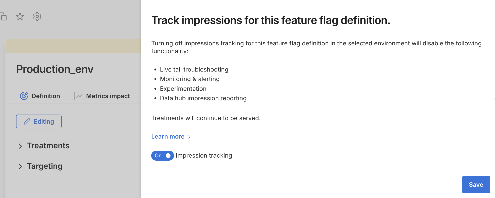

#### Related documentation
- [Tracking impressions](/docs/feature-management-experimentation/feature-management/impressions/#tracking-impressions)

### [New Feature] AI settings
----
#### 2025-03-19
The new AI settings page in Admin settings provides a toggle to enable/disable Release Agent and manage whether Release Agent has permissions to process experimentation data for experiment summarization and Q&A. This provides enhanced control over data privacy for AI features.

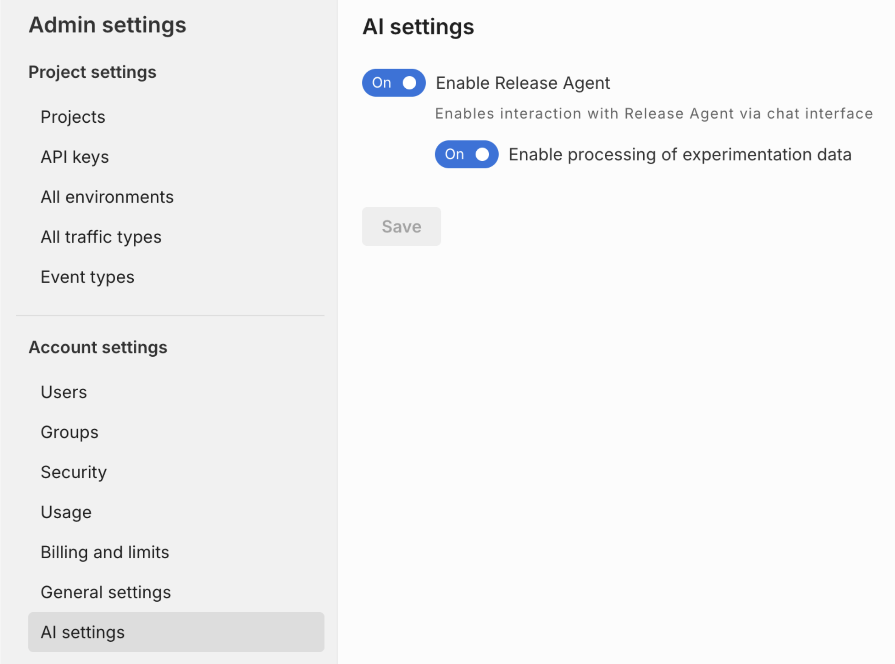

Your data is protected by the [Harness privacy policy](https://www.harness.io/legal/privacy) and the [OpenAI Enterprise privacy policy](https://openai.com/enterprise-privacy/). For more information go to [AI Release Agent](https://help.split.io/hc/en-us/articles/21188803158157-AI-Release-Agent#privacy).

#### Related documentation
- [AI Release Agent](https://help.split.io/hc/en-us/articles/21188803158157-Switch-AI-assistant)

## February 2025
### [New SDK] Elixir SDK
----
#### 2025-02-28
#### Elixir SDK General Availability
The [Elixir Thin Client SDK](/docs/feature-management-experimentation/sdks-and-infrastructure/server-side-sdks/elixir-thin-client-sdk/) enables developers to integrate Harness FME feature flagging and event tracking directly into their Elixir applications. Leveraging [Split Daemon (splitd)](/docs/feature-management-experimentation/sdks-and-infrastructure/optional-infra/split-daemon-splitd), this lightweight SDK provides highly performant first-class FME support within Elixir.

Thanks are due to the team at [Cars.com](https://www.cars.com/) for the initial implementation, which they contributed to the FME user community. The Harness engineering team then finalized the work, making it generally available as a Harness-supported FME SDK.

###### FME Thin Client SDK + Splitd Architecture
FME Thin Client SDKs are known for their lightweight footprint and are always paired with Split Daemon (splitd). Splitd performs the storage and compute intensive operations and easily scales to high traffic volumes.

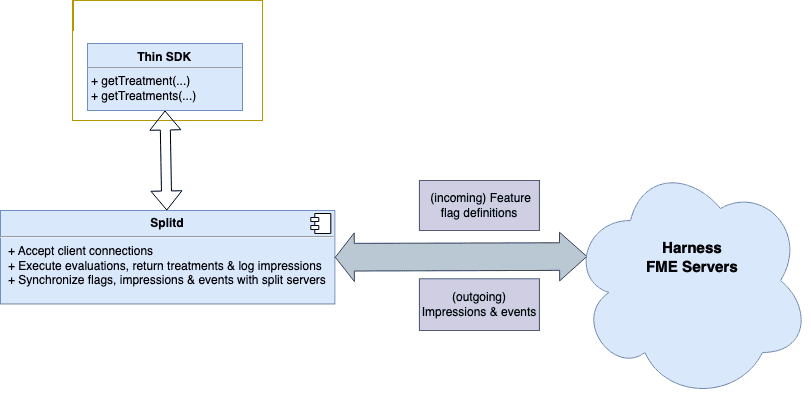

Splitd can be set up locally to the consumer application or be deployed as a sidecar to the consumer application container. See the [Split Daemon (splitd)](/docs/feature-management-experimentation/sdks-and-infrastructure/optional-infra/split-daemon-splitd) documentation for details.

##### Related documentation
* [Elixir Thin-Client SDK](/docs/feature-management-experimentation/sdks-and-infrastructure/server-side-sdks/elixir-thin-client-sdk/)
* [Split Daemon (splitd)](/docs/feature-management-experimentation/sdks-and-infrastructure/optional-infra/split-daemon-splitd)

## January 2025
### [New Feature] Release Agent (AI Chatbot)
----
#### 2025-01-08
##### AI-Generated Summary Now Supports Follow-Up Questions
The "Switch" AI chatbot in Harness Feature Management and Experimentation (FME) has been renamed to "Release Agent" and now supports follow-up questions after you click "Summarize" in metric details.
To see the Metric summary and ask follow-up questions:
1. Drill into a metric tile on a Metrics impact dashboard and click **Summarize**.
2. After viewing the summary, type your follow-up question and click **Continue conversation in Release Agent**.
3. Continue to ask additional follow-up questions if you would like, including suggestions for next steps.

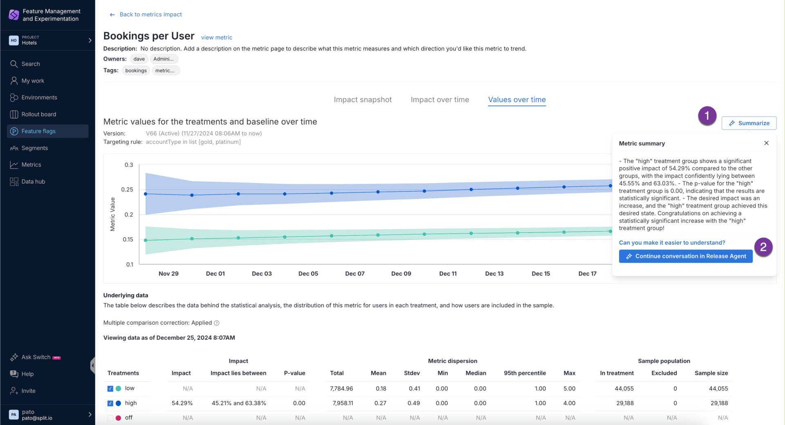

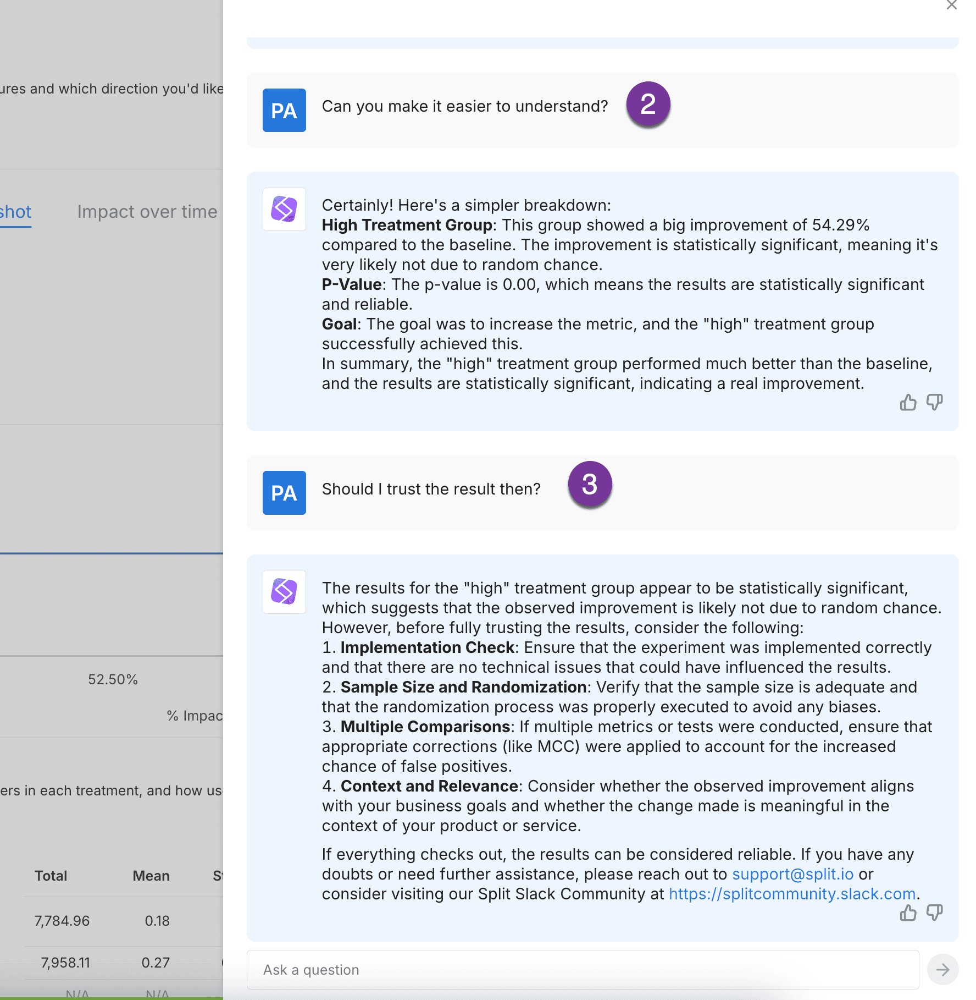

Note: The transition from "Switch" to "Release Agent" will take place gradually. For now, you'll still see **Ask Switch** in the lower left navigation of Harness Feature Management and Experimentation:

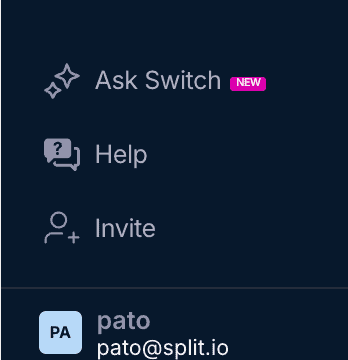

##### Related documentation
- [Metric details and trends](/docs/feature-management-experimentation/experimentation/experiment-results/viewing-experiment-results/metric-details-and-trends/)
- [Switch AI assistant](https://help.split.io/hc/en-us/articles/21188803158157-Switch-AI-assistant)

### [New Feature] Targeting - Large segments
----
#### 2025-01-07
Harness Feature Management and Experimentation (FME) now supports "Large segments" (lists of targeting IDs) that can contain more than 100,000 IDs.
Large segments support multiple use cases where bulk targeting of specific IDs is required:
- Communicating with more than 100,000 specific customers in-app after an incident.
- Targeting any set of users based on attributes not available within the app at runtime.
- Performing large-scale A/B tests on specific user bases, exported from external tools.
Effective immediately, Enterprise tier customers may create and use Large segments containing up to one million (1,000,000) IDs. Significantly higher limits are available by request.

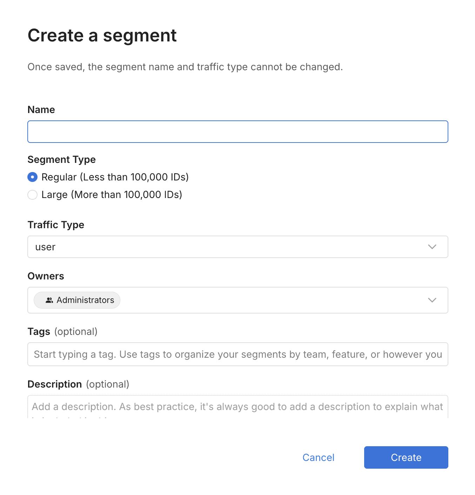
Learn more about Large segments and the ways they differ from Standard segments in the documentation:
- [Create a segment](/docs/feature-management-experimentation/feature-management/segments)
- [Target segments](/docs/feature-management-experimentation/feature-management/target-segments)

Note: The initial release of Large segments is focused on client-side SDK usage only. Server-side SDKs do not yet support Large segments, but soon will. Until they are supported, evaluations of feature flags that target Large segments will return control on server-side SDKs.

##### Admin API Endpoints
After familiarizing yourself with Large segments at the above links, you may find these UI and API equivalent documentation links handy for automating the steps via the Admin API:
###### Steps for creating and populating a Large segment using either UI or API
1. Create a Large segment (just **metadata**, no Environment definition)
- [UI steps](/docs/feature-management-experimentation/feature-management/segments#creating-a-segment) (select Large)
- [API steps](https://docs.split.io/reference/createlargesegment)
2. Create a **definition** for a Large segment in an Environment (no user IDs)
- [UI steps](/docs/feature-management-experimentation/feature-management/segments#adding-user-ids-to-a-segment) (step 3)
- [API steps](https://docs.split.io/reference/createlargesegmentinenvironment)
3. Add **user IDs** to a Large segment (to the definition created in step 2)
- [UI steps](/docs/feature-management-experimentation/feature-management/segments#file-import-for-large-segments)
- [API steps](https://docs.split.io/reference/create-change-request#open-change-request-to-add-members-to-a-large-segment)

###### Adding an approval step via Admin API
To add an approval step for Large segment creation or update when using the Admin API, reference this example:  [Open Change Request to add members to a Large Segment](https://docs.split.io/reference/create-change-request#open-change-request-to-add-members-to-a-large-segment).

## December 2024
### 2024-12-06
#### Targeting
##### Semantic Versioning (SemVer) Attribute Dictionary Support
Split FME now supports SemVer type attributes and suggested values in the attribute dictionary:
- Admins can create SemVer typed attribute names and suggested values.
- Users can see the SemVer attribute names and suggested values when editing targeting rules.
Attribute dictionary support reduces guesswork and manual errors when editing targeting rules.

###### **What you need to know in a nutshell:**
- The [semver](https://semver.org/) standard calls for versions to be formatted as major.minor.patch
- Split FME added [SemVer support on June 6th, 2024](https://www.split.io/releases/2024-06-06/) , eliminating the need to write regular expressions (i.e. regex) to target version ranges or "is a version less than or equal to x.y.z"
- This update adds the benefits of standardized attribute names and suggested values delivered by our Attribute Dictionary.

###### **What SemVer attribute support looks like to an admin**:
Admins can create a custom attribute of type "Semver" and optionally enter suggested values.

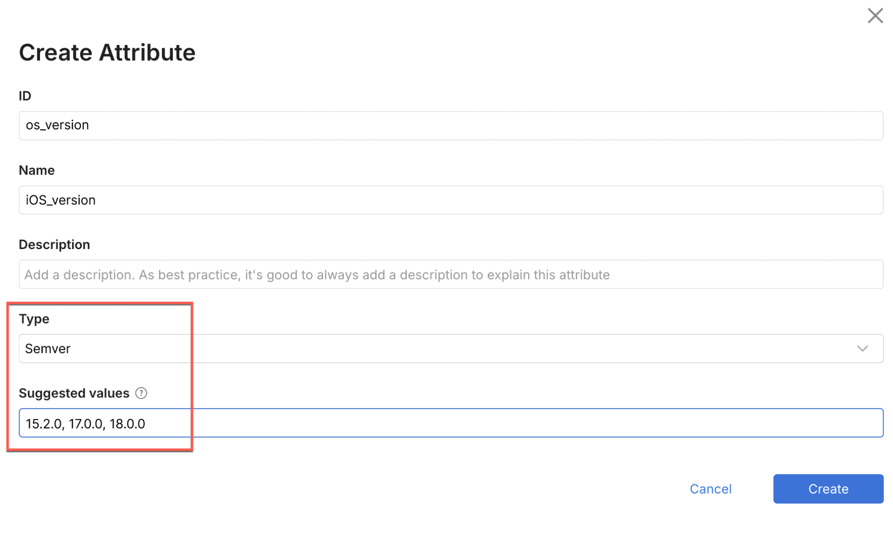

###### **What SemVer attribute support looks like to a user**:
Choose an attribute name from the attribute dictionary, such as "ios_version":

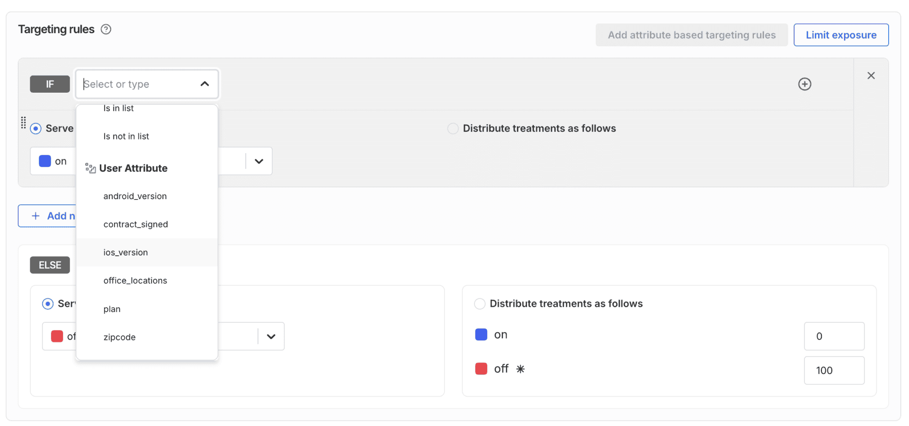

If the chosen attribute is of type SemVer, the appropriate matchers are shown:

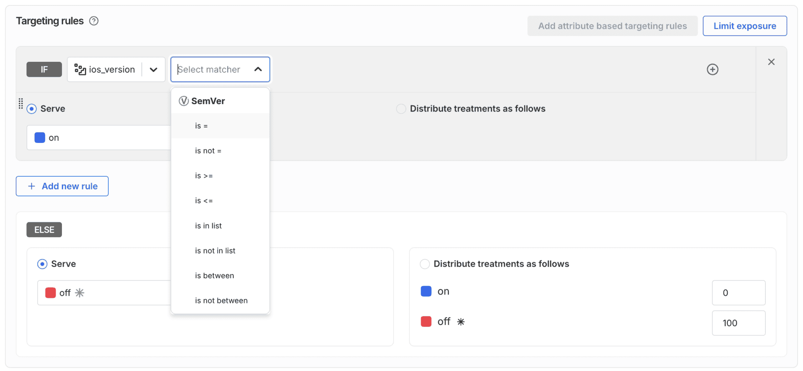

If "is in list" is chosen as the matcher type, suggested values are shown:

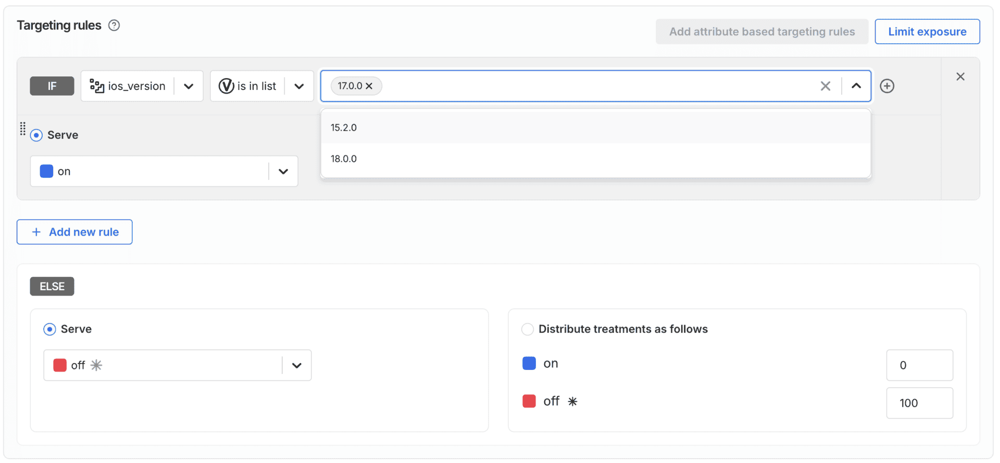

###### **Related Documentation:**
- [Creating individual custom attributes in Admin settings](/docs/feature-management-experimentation/feature-management/target-with-custom-attributes/#creating-individual-custom-attributes-in-admin-settings)
- [Creating multiple custom attributes in Admin Settings](/docs/feature-management-experimentation/feature-management/target-with-custom-attributes/#creating-multiple-custom-attributes-in-admin-settings) (CSV upload)

## November 2024
### 2024-11-27
#### Alerts
##### Guardrail and Key Metric Alerts Now Shown in the Alerts Table
Previously, the Alerts table on the Monitoring tab displayed Metric alerts only. Guardrail Metric alerts and Key Metric alerts generated email notifications to feature flag owners, but were not persisted in the UI.
Now all three types of alerts are shown on each flag's Monitoring tab for any team member to see.  The table has been simplified to display the most valuable fields at a glance, reducing cognitive load. Details less critical for quick triage remain available under an info icon.

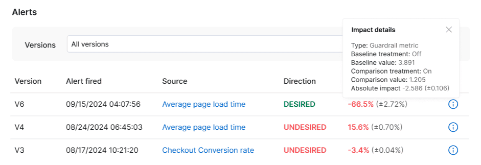

As a refresher, here is quick summary of the three alert types:

* **Metric Alert**
    - **Triggered**: when the relative or absolute impact threshold in an Alert policy is reached
    - **Configured:** at the metric level, by [creating an Alert policy](/docs/feature-management-experimentation/experimentation/metrics/alert-policies/#create-a-metric-alert-policy)
    - **Monitors:** percentage rollouts for all flags which have the same traffic type as the metric
- **Guardrail Metric Alert**
    - **Triggered:** when any statistically significant impact is detected, either desirable or undesirable
    - **Configured:** at the metric level, by [marking a metric's category as "Guardrail"](/docs/feature-management-experimentation/experimentation/metrics/categories/)
    - **Monitors:** percentage rollouts for all flags which have the same traffic type as the metric
- **Key Metric Alert**
    - **Triggered:** when any statistically significant impact is detected, either desirable or undesirable
    - **Configured:** at the feature flag level, by [marking a metric as a "Key metric" for that flag](/docs/feature-management-experimentation/release-monitoring/alerts/automated-alerts-and-notifications/#setting-up-feature-flag-alerting)
    - **Monitors:** percentage rollouts only for flags where the metric is a Key metric

## September 2024

### 2024-09-30
#### Better Together: Split + Harness
##### New Colors, Names for Organization and Workspace
Starting on September 30th, we began a progressive rollout to update the Split UI, bringing it closer to the look of Harness:

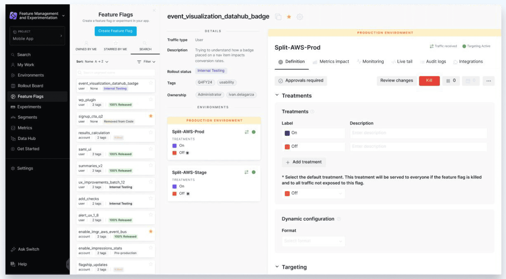

Beyond a change in color scheme, you will also see two changes to **terminology**:
- **Workspaces** will now be known as **Projects** in the UI
- **Organizations** will now be known as **Accounts** in the UI

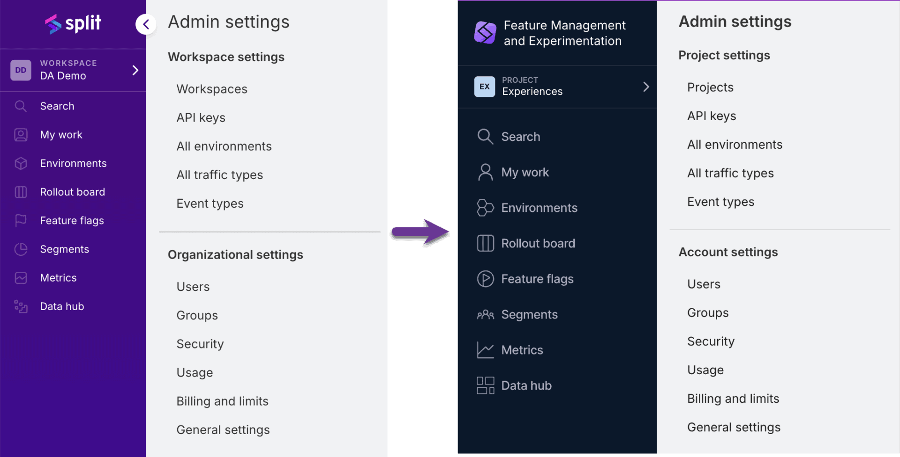

Note: These terminology changes are being made only to labels in the UI at this time. To avoid introducing a breaking change, the [Admin API](https://docs.split.io/reference/introduction) will continue to use the strings ws, workspace, organizationId, and orgId until further notice.

### 2024-09-12
#### Monitoring
##### Traffic Insights and Alerts
The **Alerts** tab has been renamed **Monitoring** and expanded to show real-time traffic insights over time and any alerts fired for the flag on a single page.

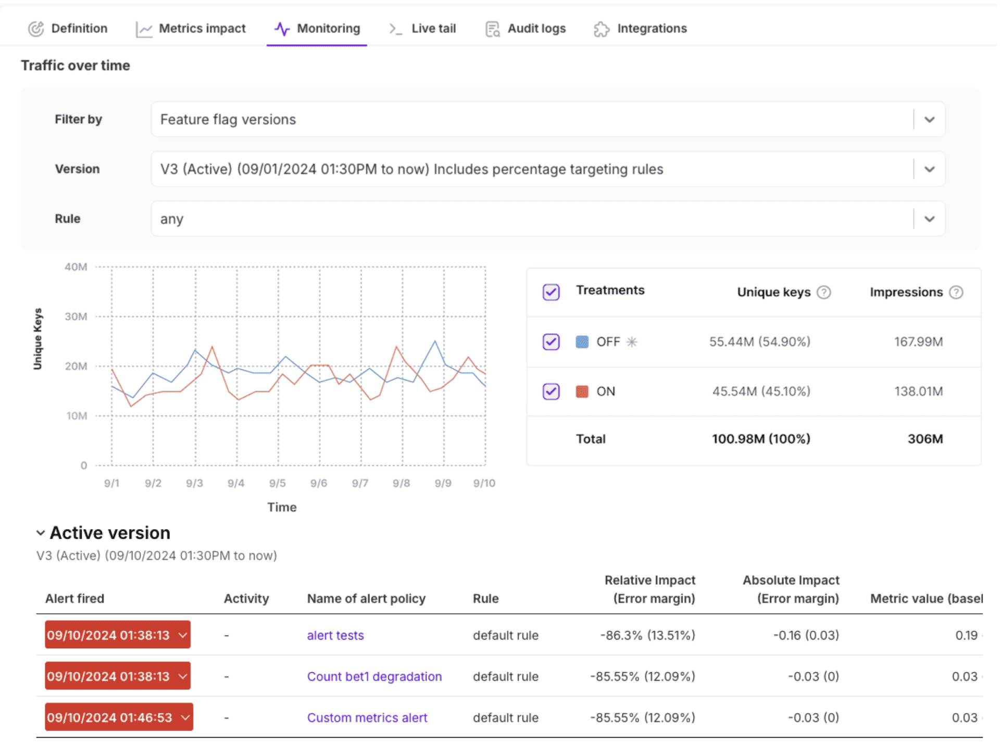

By default, traffic over the **Last 48 hours** is shown, but you may also select the **Last 7 days**, another **Time range**, or a specific **Feature flag version**:

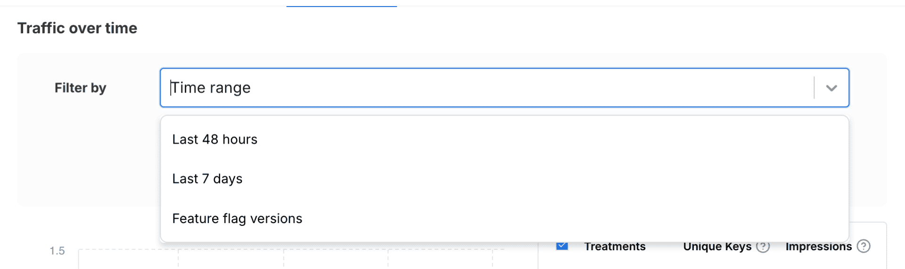

Changes made to flags (i.e., new flag versions) are displayed as vertical bars for context:

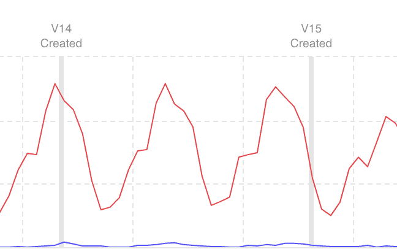

For more information, have a look at the [Monitoring tab docs](https://help.split.io/hc/en-us/articles/30098162579853-Monitoring-tab).

### 2024-09-10
#### Metrics
##### Introducing Supporting Metrics
We’re excited to announce the next step in improving metric categorization for your feature releases and experiments: **Supporting metrics**. This new metric category gives you greater control over metrics monitored per feature flag, helping you focus on what truly matters.

###### **What’s changing?**
On the Metrics impact page, we have replaced “Organizational metrics” with “Supporting metrics.” Now, you can easily select specific additional metrics to track for each release, reducing noise and making it easier to analyze your results.

###### **How do I assign flag-specific metrics?**
Key metrics and Supporting metrics are specific to individual feature flags, and can be managed on a flag’s Metrics impact tab. Under each category, click “Add metric” to initiate the process of assigning metrics to the category. Once metrics are added, you can wait until the next scheduled calculation or manually “Recalculate metrics” to see results.

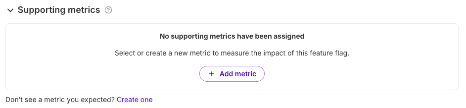

###### **How do I ensure my important metrics are still monitored for every flag?**
In June, Split introduced [Guardrail metrics](/docs/feature-management-experimentation/release-monitoring/metrics/categories/) to improve your ability to define which metrics should be monitored for every flag. Guardrail metrics include automated alerting, meaning flag owners will be notified as their releases or experiments impact these metrics. 

Since Organizational metrics will no longer be available, **we recommend adding important metrics to the new Guardrail metrics category ASAP** to ensure they continue to be protected and limit any disruption of analyzing metric results. 

Guardrail metrics can be assigned in the metric definition:


The combination of Key metrics, Guardrail metrics, and Supporting metrics will reduce noise and increase sensitivity while ensuring important metrics are monitored for every feature release or experiment. We welcome your feedback as we continue to improve our metric results!

### 2024-09-04
#### Monitoring
##### Guardrail Metric Alerts
Flag owners will now automatically receive alerts on any guardrail metric without manual configuration.

Alerts are sent to flag owners whenever a guardrail metric moves significantly in the desired or undesired direction. This feature is designed to help you make safe and accurate release decisions in a timely manner.

As a reminder, Guardrail Metrics ([released 2024-06-14](#guardrail-metrics)) ensure that an organization’s most crucial metrics are protected and monitored throughout every feature release and experiment by making their calculation automatic and mandatory for all flags that use the same traffic type as the metric.

Metrics are set as guardrail metrics for your workspace on the Metric definition page. View the docs [here](/docs/feature-management-experimentation/release-monitoring/metrics/categories/).

## June 2024
### 2024-06-14
#### Monitoring
##### Guardrail Metrics
Users can now categorize their organization’s most important metrics as  “guardrails”. [Guardrail metrics](/docs/feature-management-experimentation/release-monitoring/metrics/categories/) are those your organization wants to protect during a feature release or experiment. Metrics are set as guardrail metrics for your workspace on the Metric definition page.

### 2024-06-06
#### SDK Enhancements
##### Semantic Versioning Targeting
Using the latest Split SDKs, users can more easily define targeting rules for new features based on app, OS, and other versions using attribute-based targeting. The SDK then automatically serves the appropriate treatment to users without needing additional code configurations. Split’s native [Semantic Versioning Targeting](/docs/feature-management-experimentation/feature-management/target-with-custom-attributes/#semver-attributes) removes the additional complexities and manual work that comes with targeting different application versions, allowing users to seamlessly deliver different experiences.

## May 2024
### 2024-05-31
#### Usability Enhancements
##### Left Navigation Enhancements
Left-hand navigation within the application has been optimized. With this change, we've narrowed the navigation bar, migrated the search function to a modal dialog, and moved account settings to the bottom of the page. This makes frequently used actions (e.g. workspace switching) more readily accessible within the UI. 

### 2024-05-03
#### SDK Enhancements
##### Split Suite, iOS SDK
Users can automatically capture event data in Split using their [iOS SDK](/docs/feature-management-experimentation/sdks-and-infrastructure/client-side-sdks/ios-sdk) without needing additional agents, integrations, or track calls. This eliminates the manual process of sending events to Split, allowing users to quickly set up metrics and alert policies.
#### Monitoring
##### Out-of-the-Box Metrics
Split automatically creates metrics for any events being auto-captured by the Split Suite and RUM Agents ([Web](/docs/feature-management-experimentation/sdks-and-infrastructure/client-side-agents/browser-rum-agent#automatic-metric-creation), [Android](/docs/feature-management-experimentation/sdks-and-infrastructure/client-side-agents/android-rum-agent#automatic-metric-creation), [iOS](/docs/feature-management-experimentation/sdks-and-infrastructure/client-side-agents/ios-rum-agent#automatic-metric-creation)). This reduces the manual effort of creating metrics and allows users to easily calculate their engineering and performance metrics.

## April 2024
### 2024-04-16
#### Usability Enhancements
##### Switch Updates 
Users can now use Switch, Split’s in-app AI assistant, to easily summarize their experimentation results. Simply click on any metric card and hit the summarize button for a full analysis of your data. Please note, that this is a Generative AI feature that leverages end-user/customer data and will only be available to users who have specifically requested it to be enabled via Split’s Support team. 

## February 2024
### 2024-02-16
#### Usability Enhancements 
##### Change Request Management 
To help teams easily coordinate and collaborate on flag updates, we added shareable direct links to change requests. This allows teams to quickly share feature flag updates with key stakeholders and get faster approvals when needed.

### 2024-02-09
#### Usability Enhancements
##### Switch Updates

###### Cancel responses mid-flight
Users can cancel a response from Switch mid-flight. This allows users to move forward quickly in cases where they asked the wrong question or if the response they needed was already on the screen.

###### Copy code snippets
Users can now also copy code snippets directly from Switch, enabling faster time to value.

### 2024-02-08
#### Usability Enhancements 
##### Filtering Improvements 
To help teams quickly find the information they are looking for, Split has improved the filtering experience in these lists: **feature flags**, **segments**, and **metrics**. Users’ most recent search filters will be preserved as users continue to navigate the product. 
#### Feature Experimentation
##### Sequential Testing Update
Users can now reduce the [minimum sample size to 100](/docs/feature-management-experimentation/experimentation/setup/experiment-settings#minimum-sample-size#minimum-sample-size) at the organizational level via the admin setting. This allows users to get statistically significant results, faster.

## January 2024
### 2024-01-16
#### Usability Enhancements
##### Toast Notification Update 
Toast notifications will now appear in the lower right corner of Split’s UI. This increases the visibility of the notification and enables users to easily take additional action within Split.

### 2024-01-09
#### **SDK Enhancements**
##### **Split Suite, Android SDK**
Users can now automatically capture event data in [Split for their Android SDK](/docs/feature-management-experimentation/sdks-and-infrastructure/client-side-suites/android-suite) without needing additional agents, integrations, or track calls. This eliminates the manual process of sending events to Split, allowing users to quickly set up metrics and alert policies.

### 2024-01-02
#### **SDK Enhancements**
##### **Split Suite, Browser SDK**
Users can now automatically capture event data in [Split for their Browser SDK](/docs/feature-management-experimentation/sdks-and-infrastructure/client-side-suites/browser-suite) without needing additional agents, integrations, or track calls. This eliminates the manual process of sending events to Split, allowing users to quickly set up metrics and alert policies.

## 2023 releases

## December 2023
### 2023-12-20
#### SDK Enhancements
##### **RUM Agent iOS**
With [RUM Agent iOS](/docs/feature-management-experimentation/sdks-and-infrastructure/client-side-agents/ios-rum-agent), the iOS SDK will automatically capture event data and send it back to the Split Cloud. Event data will then populate in Split’s Data Hub, similar to impression data. This eliminates the manual process of sending events to Split and enables a quicker setup of metrics and alert policies.


### 2023-12-19
#### SDK Enhancements
##### React SDK Updates
Split’s [React SDK](/docs/feature-management-experimentation/sdks-and-infrastructure/client-side-sdks/react-sdk) hooks can now return the SDK’s readiness status and support update parameters to control when an application will render. These properties now allow users to easily refresh application components with just a few lines of code.

The `useSplitTreatments` hook has been optimized to detect duplicate `getTreatment` calls, improving the performance and UX of the application.

### 2023-12-14
#### Usability Enhancements
##### Dynamic Configurations Update
Dynamic Configuration’s JSON input field now supports text wraps. This allows users to easily view and edit content that contains very long strings like prompts for Large Language Models without needing to scroll horizontally across the screen.

### 2023-12-12
#### Feature Flag Management Console 
##### Flag Sets 
With [Flag Sets](/docs/feature-management-experimentation/feature-management/using-flag-sets-to-boost-sdk-performance/), users can group flags that logically belong together, so that the SDK only retrieves relevant flag definitions when initialized. This reduces SDK latency, memory consumption, and CPU utilization.

### 2023-12-11
#### Monitoring
##### Event Visualization
With [Event Visualization](/docs/feature-management-experimentation/release-monitoring/events/#exploring-events), users are now able to easily view their event data in aggregate directly in Split’s Data Hub without needing an external tool. This enables users to quickly validate if their event data is properly flowing into Split, and see how that event is behaving over time.

### 2023-12-06
#### Monitoring
##### Custom Metrics Event Grouping (OR)
With [Custom Metrics, Event Grouping (OR)](/docs/feature-management-experimentation/release-monitoring/metrics/), users have the flexibility to choose more than one base event and aggregate up to 5 different events together when creating metrics. This allows users to build more complex metrics that fit their needs and combine different inputs into one metric.
##### Event Type Management Enhancements
Users can now create metric definitions without needing to set [event types](/docs/feature-management-experimentation/release-monitoring/metrics/#metric-types) beforehand in the Admin UI, removing bottlenecks between admins and users. 
Event types will be automatically deleted after 150 days of no data being received, eliminating the manual process of cleaning up unused types.

## November 2023
### 2023-11-29
#### Usability Enhancements
##### Keyboard Accessibility
Users can now use tab-based navigation to access Split’s login page, change summary modal (including approval flow from email), and definitions tab. This is supported on the Edge, Firefox, Safari, and Chrome browsers.

### 2023-11-09
#### Usability Enhancements
##### Switch 
[Switch](https://help.split.io/hc/en-us/articles/21188803158157) is an in-app AI assistant designed to streamline the use of the Split product. It offers multilingual support, rapid responses, and knowledge-based assistance by utilizing our public documentation and blogs. Switch makes it easy for all developers to get the help they need, without ever leaving the Split interface.

### 2023-11-02
#### Feature Experimentation
##### Sequential Testing Update
Sequential Testing will now be the default statistical method for all net-new organizations using monitoring and experimentation. 
The minimum sample size for [Sequential Testing](/docs/feature-management-experimentation/experimentation/setup/experiment-settings#minimum-sample-size#minimum-sample-size) has been reduced from 200 to 100. This allows users to get statistically significant results, faster.
##### Dimensional Analysis Update
Users can now create up to [20 dimensions with 20 values per dimension](/docs/feature-management-experimentation/experimentation/experiment-results/analyzing-experiment-results/dimensional-analysis/#configuring-dimensions-and-values). This gives users even more flexibility when doing a deeper analysis of their feature experiments or releases.

## October 2023
### 2023-10-25
#### API Enhancements
####### Different Access Levels for APIs: Roles and Scopes for API Keys 
Define specific [roles](https://docs.split.io/reference/api-keys-overview#admin-api-key-roles) and [scopes](https://docs.split.io/reference/api-keys-overview#admin-api-key-scopes) for Admin API keys. Restrict access to resources at the organizational, workspace, or environment levels. This gives admins more flexibility when granting access to Split’s Public API.

### 2023-10-24
#### SDK Enhancements
##### PHP in-memory (PHP Thin Client SDK) updates 
Split’s PHP in-memory SDK now supports [event tracking via the `track ()` call](/docs/feature-management-experimentation/sdks-and-infrastructure/server-side-sdks/php-thin-client-sdk#tracktrack), getting treatments with [Dynamic Configurations](/docs/feature-management-experimentation/sdks-and-infrastructure/server-side-sdks/php-thin-client-sdk#trackget-treatments-with-configurations), and retrieving information on cached flags via [SDK Manager](/docs/feature-management-experimentation/sdks-and-infrastructure/server-side-sdks/php-thin-client-sdk#trackmanager).

### 2023-10-10
#### Monitoring
##### **Feature Flag Significance Alerting**
With [Feature Flag Significance Alerting](/docs/feature-management-experimentation/release-monitoring/alerts/automated-alerts-and-notifications/#setting-up-feature-flag-alerting), users can now receive notifications when a statistically significant difference has been observed between two treatments on their flag’s key metrics. Feature Flag alerting is enabled automatically for releases with a percentage allocation. This enables users to make fast, accurate release decisions in a timely manner.
##### Out-of-the-Box Metrics, Browser RUM Agent
Split now [automatically creates metrics](/docs/feature-management-experimentation/sdks-and-infrastructure/client-side-agents/browser-rum-agent#automatic-metric-creation) for any events being auto-captured by the Split SDK (Browser RUM Agent). This reduces the manual effort of creating metrics and allows users to easily calculate their engineering and performance metrics.

## September 2023
### 2023-09-18
#### Integrations
##### Split-Segment Integration Update
The `orginalTimestamp` precision has been updated to go from seconds to milliseconds when sending impressions to Segment. This update makes our timestamp field more consistent with the precision Segment uses.

## August 2023
### 2023-08-23
#### Feature Management Console 
##### Feature Flag Editor Enhancements 
The feature flag definitions tab has added two minor UX updates to the editor flow. The treatment section will now automatically collapse once a flag definition has been created/updated. Also, users will be able to view treatment information via the environment cards on the left. These enhancements help the user understand which treatments are available in their environment and guide them to the targeting section.

### 2023-08-15
#### SDK Enhancements
##### **RUM Agents - Web & Android**
- Users can now automatically capture event data in Split for their [Web](/docs/feature-management-experimentation/sdks-and-infrastructure/client-side-agents/browser-rum-agent) and [Android](/docs/feature-management-experimentation/sdks-and-infrastructure/client-side-agents/android-rum-agent) SDKs. This eliminates the manual process of sending events to Split, allowing users to quickly set up metrics and alert policies.
#### Monitoring
##### Custom Analysis Time Frame
- With [Custom Analysis Time Frame](/docs/feature-management-experimentation/release-monitoring/metrics/setup/filtering/#selecting-custom-dates), users can now analyze across date ranges regardless of any changes made to the feature flag definition. This enables better flexibility when analyzing results.

### 2023-08-07
#### SDK Enhancements 
##### **PHP in-memory (PHP Thin Client SDK)**
- Split now supports running PHP [locally](/docs/feature-management-experimentation/sdks-and-infrastructure/server-side-sdks/php-thin-client-sdk) using the [Split Daemon (splitd)](/docs/feature-management-experimentation/sdks-and-infrastructure/optional-infra/split-daemon-splitd) process to store and maintain feature flag data. This eliminates the need to use Redis & the Split Synchronizer while using our PHP SDK and provides a simpler set-up process.

### 2023-08-03
#### Learning and Onboarding
##### Split Arcade
[Split Arcade](https://help.split.io/hc/en-us/articles/7996112174733-Split-Arcade-self-paced-certifications) is an interactive, gamified experience that provides persona-based technical training, tutorials, and best-practice guidance from industry experts. Users gain access to highly engaging content including product explainer videos, clickable product walkthroughs, manipulatable code examples, and more. With knowledge checks along the way, team members earn professional certifications and LinkedIn badges to validate progress.
#### Language Library Enhancements
##### Flutter Plugin
[Split's Flutter Plugin](/docs/feature-management-experimentation/sdks-and-infrastructure/client-side-sdks/flutter-plugin) brings scalable feature flags to any app, website, or experience built with Flutter. Just inject the service into any component and start evaluating flags and tracking events.

### 2023-08-01
#### SDK Enhancements
##### **Instant Feature Flags**
- To reduce the latency of updates and increase the [reliability of SDKs](/docs/feature-management-experimentation/sdks-and-infrastructure/sdk-overview/#streaming-architecture-overview), feature flag update notices delivered via streaming will not require a subsequent network request to fetch the changes. Instead, changes will be contained in the streaming payload itself.

## July 2023
### 2023-07-26
#### Integrations
##### **SDK@Edge, Split-Vercel Integration**
- [Split’s integration with Vercel’s Edge](https://help.split.io/hc/en-us/articles/16469873148173) platform provides teams with the ability to incorporate feature flags and experiments into their Edge application and workstreams. Streamline Split data into the Edge without the extra network requests to retrieve config data.

### 2023-07-24
#### Feature Management Console
##### **Viewer Role**
- Admins can now assign the role, **Viewer**, to users. With the [Viewer role,](https://help.split.io/hc/en-us/articles/16432983870605-Managing-user-permissions) users can now be assigned a role that allows them to view data and objects within the Split application without the ability to make modifications. This will give admins more flexibility and control when assigning roles.

## June 2023
### 2023-06-22
#### Experimentation
##### **Sequential Testing**
- [Sequential Testing](/docs/feature-management-experimentation/experimentation/setup/experiment-settings#minimum-sample-size#using-sequential-testing) is a statistical testing method that allows users to obtain statistical results without the constraint of an experiment review period. This allows users to receive faster experimentation results, so that they make informed decisions about releases, quickly.

### 2023-06-07
#### Monitoring
##### Metric Filtering Multiple Comparison Correction (MCC) Update
When filtering your organizational metrics on the Metrics impact page, [MCC will only be applied once for all organizational metrics](/docs/feature-management-experimentation/experimentation/key-concepts/multiple-comparison-correction/#key-and-organizational-metrics). This will prevent users from seeing different p-values when metric results are filtered.

## May 2023
### 2023-05-24
#### Monitoring
##### Disabled Recalculating Metrics
To help prevent unintentional resets of your data, the [recalculate metric button has been disabled](/docs/feature-management-experimentation/experimentation/experiment-results/viewing-experiment-results/#manually-recalculating-metrics) for feature flags that don't have any data available for calculations or haven't received traffic within Split's data retention period.

### 2023-05-15
#### Usability Enhancements
##### Simplified Feature Flag Configurations
The [feature flag configuration flow](./static/fme/simplified-feature-flag-configurations-1.pdf) on the definition tab has been reimagined with updated terminology and new visual cues. This will enable users to configure flags with a higher degree of confidence for any use case (percentage-based rollout, on/off, etc.).
##### Visual Refresh to the Split User Interface
The entire Split application has gone through a [visual refresh](./static/fme/simplified-feature-flag-configurations-1.pdf). Users will see a modern, forward-looking aesthetic with refined colors tuned for accessibility, visual cues, and more.
##### Terminology Change
To reduce the confusion between "Split", our product, and "split", the feature flag, we are [changing the term "split" to "feature flag"](./static/fme/simplified-feature-flag-configurations-1.pdf) across our application and documentation.

### 2023-05-08
#### Integrations
##### Split's mParticle Integration Update
Customers can now map Split traffic types to [mParticle MPID](/docs/feature-management-experimentation/integrations/mparticle#harness-fme-as-an-event-output) when sending events to Split.

## April 2023
### 2023-04-27
#### Admin API Keys Enhancements
##### Clone API Keys
Users can now [clone API Keys](/docs/feature-management-experimentation/management-and-administration/account-settings/api-keys#cloning-api-keys) with the same access levels and scope as the key that is cloned. This will enable users to securely change/rotate keys on a regular basis while eliminating manual work.
#### SDK Enhancements
##### TLS support
Split now supports TLS encryption for [Split Synchronizer](/docs/feature-management-experimentation/sdks-and-infrastructure/optional-infra/split-synchronizer#cli-configuration-options-and-its-equivalents-in-json--environment-variables) and [Split Proxy](/docs/feature-management-experimentation/sdks-and-infrastructure/optional-infra/split-proxy#cli-configuration-options-and-its-equivalents-in-json-and-environment-variables) endpoints. This will enable developers to further secure their SDK traffic.

### 2023-04-26
#### SDK Enhancements
##### Mobile SDK Cache Encryption
Developers can now encrypt the persistent cache of rollout plans on their [iOS](/docs/feature-management-experimentation/sdks-and-infrastructure/client-side-sdks/ios-sdk#configuration) and [Android](/docs/feature-management-experimentation/sdks-and-infrastructure/client-side-sdks/android-sdk#configuration) SDKs. This will help enhance the security of this data.
##### .NET Customizable Network Proxy
Developers can now [configure specific proxies](/docs/feature-management-experimentation/sdks-and-infrastructure/server-side-sdks/net-sdk/#proxy) using higher precedence than environment variables to perform the server requests for the .NET SDK. This will give developers the flexibility to proxy Split traffic separated from app traffic.

### 2023-04-06
#### Feature Management Console
##### Essential Scheduling
[Essential scheduling](/docs/feature-management-experimentation/feature-management/using-essential-scheduling/) provides the capability to launch a feature on a certain date and time, up to 90 days in advance. This enables users to get all the necessary rollout work done, like getting approvals, long before the release.
##### Simplified Feature Flag Configurations: Split Environment Usability Updates (Release 1)
There are new UI and UX updates to the feature flag editing experience that make the selection of [environments](/docs/feature-management-experimentation/management-and-administration/fme-settings/environments) and the editing of flag details more intuitive and easier. The updates include an environment pick list showcasing feature flag traffic per environment, production environment indicators, and upgraded headers to easily edit flag details.
#### Security
##### SCIM Support
With [SCIM Support](https://help.split.io/hc/en-us/sections/14249918421005-SCIM), IT Admins can now manage Split users and groups using their preferred Identity Provider (IdP) including [Azure Active Directory](https://help.split.io/hc/en-us/articles/12386431119245-SCIM-for-Azure-AD) and [Okta](https://help.split.io/hc/en-us/articles/10488076923021-SCIM-for-Okta). This will help streamline the onboarding/offboarding processes as well as reduce the risk when governing users outside one's security platform.

## March 2023
### 2023-03-24
#### SDK Enhancements
##### SDK Offline Mode from JSON
Developers can now start their [Go](/docs/feature-management-experimentation/sdks-and-infrastructure/server-side-sdks/go-sdk#json) and [Python](/docs/feature-management-experimentation/sdks-and-infrastructure/server-side-sdks/python-sdk#json) SDK instances in `localhost` mode, and easily download SDK data in the form of JSON files with just one command. These files can then mimic test or production environments, helping to improve the testing of applications offline.
### 2023-03-23
#### Feature Management Console
##### Individual Target Key Limit
The [individual target key limit](/docs/feature-management-experimentation/management-and-administration/fme-settings/environments) has been updated to 500. This will enable users to deliver changes to their users faster without any impact on the application load times.
### 2023-03-17
#### Documentation
##### SDK Validation Checklist
The [SDK validation checklist](/docs/feature-management-experimentation/sdks-and-infrastructure/sdk-overview/sdk-validation-checklist) helps users ensure that SDKs are implemented keeping best practices in mind. This checklist defines the general guidelines, checks, and validations that can be useful for developers and software architects to avoid common mistakes or oversights and to ensure optimal performance of the Split SDK.
### 2023-03-08
#### Experimentation
##### Experiment Review Period Notification
Users will now see a section on their **My Work** page that lists [experiments ready for review](https://help.split.io/hc/en-us/articles/360042494691-My-work#experiments-for-review). This will make it easier and faster for users to access their statistical results and encourage them to take informed next steps.
#### Integrations
##### Split's Amplitude Integration Update
[Split's Amplitude Integration](/docs/feature-management-experimentation/integrations/amplitude#in-harness-fme) now supports Amplitude EU instances. This will enable customers using the EU region to properly configure the integration and send Split impressions to Amplitude.
### 2023-03-01
#### Feature Management Console
##### Metric Audit Logs
[Metric Audit Logs](/docs/feature-management-experimentation/management-and-administration/account-settings/audit-logs) will now capture when a metric name is updated and when an alert policy is created, updated, or deleted. This will help increase visibility across teams of all the changes made across Split.### February 2023
### 2023-02-27
#### Monitoring
##### Metric Definition Filters
The [metric definition tab](/docs/feature-management-experimentation/experimentation/experiment-results/viewing-experiment-results/metric-details-and-trends/) has added an additional filter so users can now measure the metric event only if another event was completed beforehand. This will unlock a new way for users to measure the impact of experiments, and interpret their data.
## January 2023
### 2023-01-31
#### SDK Enhancements
##### SDK Offline Mode from JSON
Developers can now start their [Java SDK](/docs/feature-management-experimentation/sdks-and-infrastructure/server-side-sdks/java-sdk#json) instance in `localhost` mode, and easily download SDK data in the form of JSON files with just one command. These files can then mimic test or production environments, helping to improve the testing of applications offline.
### 2023-01-26
#### Monitoring
##### Alerting UX Enhancement
Users will now see a [bell icon](/docs/feature-management-experimentation/experimentation/experiment-results/viewing-experiment-results/#viewing-metrics) within their metric list to easily identify whether or not an alert policy exists for a metric. If the icon is **white**, then no alert policy exists and if the icon is **gray**, then an alert policy exists for the metric. Clicking on the gray icon will take the user directly to the alert policy page for that metric.
### 2023-01-23
#### Monitoring
##### Alerting UX Enhancement
Previously, monitoring alerts were only generated when the sample size in each treatment reached 355. Now, users can receive alerts when the [sample size](/docs/feature-management-experimentation/experimentation/setup/experiment-settings#minimum-sample-size) reaches a minimum of 200. This will allow users to fire alerts earlier, whether or not they have configured a lower sample size in their experiment settings.
### 2023-01-18
#### Monitoring
##### Alerting UX Enhancement
Users can now [manage their alert policy](/docs/feature-management-experimentation/experimentation/experiment-results/viewing-experiment-results/metrics-impact-cards/#actions-you-can-perform) directly from their metric cards on the **Metric impacts** tab. This change will make it simple to find where to manage alerts and/or know if alerts already exist for a metric.

## Previous releases

### 2022 releases

<details>
<summary>Expand for 2022 releases</summary>

#### December 2022
#### 2022-12-22
##### Feature Management Console
###### Usability Updates on the Targeting Rules page
The usability updates on the [Targeting Rules page](/docs/feature-management-experimentation/feature-management/define-feature-flag-treatments-and-targeting/#targeting-rules) include decluttering the tab, reducing confusion on default rule, and default targeting and starting the UI upgrade journey.
#### 2022-12-15
##### Integrations
###### Split-ServiceNow Integrations
The [Split-ServiceNow Integration Beta](/docs/feature-management-experimentation/integrations/servicenow) allows users to send change requests for feature flags and segments to ServiceNow DevOps and receive approvals back. This enables admins to leverage their customized change control process in ServiceNow without leaving the tool with which they're familiar.
#### 2022-12-12
##### Monitoring & Experimentation
###### Metric Card Update
The **Metrics impact** tab now has [redesigned metric cards](/docs/feature-management-experimentation/experimentation/experiment-results/viewing-experiment-results/metrics-impact-cards/) to highlight essential information and improve the clarity of experiment data. New visual cues and layout enable users to quickly understand results at a glance.
#### November 2022
#### 2022-11-30
##### Experimentation
###### Dimensional Analysis
[Dimensional Analysis](/docs/feature-management-experimentation/experimentation/setup/experiment-settings#minimum-sample-size#dimensional-analysis) allows users to leverage event property data across all their sources to develop a set of dimensions. These can then be used to dissect experimentation results at a deeper level, giving you the insights needed to make better-informed future hypotheses and experimentation iterations.
#### 2022-11-16
##### Learning and Onboarding
###### Split Arcade
[Split Arcade](https://arcade.split.io/certifications) has added a new onboarding and training course, **Level 1: Experimentation for Product Managers**. This approachable, functional certification gives product managers a deep dive into how to get started with experimentation, industry best practices, and hands-on training to learn how to easily build experiments in Split.
#### 2022-11-07
##### Feature Management Console
###### Attribute Dictionary Iteration
Admins can now add up to 100 suggested values when creating [custom attributes](/docs/feature-management-experimentation/feature-management/target-with-custom-attributes/#creating-multiple-attributes) using the `string` type. This will give users more flexibility when creating targeting rules.
#### 2022-11-01
##### SDK Enhancements
###### Split Evaluator Update
Users can now calculate flags for [multiple environments](/docs/feature-management-experimentation/sdks-and-infrastructure/optional-infra/split-evaluator#multiple-environments-support) from a single instance of the Evaluator. This will require users to set individual API keys paired with a token for each environment they connect to the evaluator.
#### October 2022
#### 2022-10-26
##### SDK Enhancements
###### Support for watchOS, macOS, and tvOS
Split has extended its iOS SDK capability to now [support watchOS, macOS, and tvOS](/docs/feature-management-experimentation/sdks-and-infrastructure/client-side-sdks/ios-sdk). This brings scalable feature flags to any app, website, or experience built within the Apple ecosystem. Just inject the service into any component and start evaluating flags and tracking events.
#### 2022-10-20
##### Feature Management Console
###### Change Request ID More Accessible
Users can now access the [change request ID](/docs/feature-management-experimentation/management-and-administration/fme-settings/approval-flows#reviewing-a-request) directly from the change summary page. This will eliminate the need to copy the ID from a web browser address bar.
#### 2022-10-14
##### SDK Enhancements
###### Evaluate Without Sending Impressions
Split as added a new impression mode, `NONE`. Which can now enable [all Split SDKS](/docs/feature-management-experimentation/sdks-and-infrastructure/sdk-overview#supported-sdks) to send only unique keys per Split rather than sending all impression data. This will help decrease network traffic from your system to Split, ultimately leading to lower resource consumption.
#### 2022-10-05
##### Learning and Onboarding
###### Split Arcade
[Split Arcade](https://arcade.split.io/certifications) has added three new courses, **Feature Delivery Foundations for Admins & Product Managers**, **Administering Split**, and **Data Flow & Integrations**. These self-serve certification programs will help users level up their Split knowledge and admin capabilities through interactive tutorials, best practices, and knowledge checks along the way.
#### September 2022
#### 2022-09-27
##### UX Enhancements
###### Login Page Update
[Split's Login](https://app.split.io/login) and [Reset Password](https://app.split.io/login/forgot-password) pages have gone through a refreshed visual style update. This will ultimately simplify the login process and reduce the number of errors.
#### 2022-09-14
##### Feature Management Console
###### Rollout Boards Enhancement - Ready to Clean Up View
The [Ready to clean up](https://help.split.io/hc/en-us/articles/4405016480269-Use-the-rollout-board) view will filter the Rollout Board to show splits that have been in their status, 100% released, Removed from code, Ramping, or Killed, for at least 100 days. This will allow users to identify feature flags that can be retired which will help make the code more robust and readable.
#### August 2022
#### 2022-08-19
##### Feature Management Console
###### Create Multiple Attributes
Admins can now create [multiple custom attributes](/docs/feature-management-experimentation/feature-management/target-with-custom-attributes/#creating-multiple-attributes) by uploading them using a CSV file, helping to reduce time and errors.
#### 2022-08-01
##### Feature Management Console
###### Attribute Dictionary
With [Split's Attribute Dictionary](/docs/feature-management-experimentation/feature-management/target-with-custom-attributes/#adding-an-attribute), admins can now easily create custom attributes and suggested values. Users can then select from a list of predefined attributes and values to help decrease development time.
##### SDK Enhancements
###### LogLevel Configurations
LogLevel Configuration gives developers more granularity when choosing what level of logs they want to capture within their [i](/docs/feature-management-experimentation/sdks-and-infrastructure/client-side-sdks/ios-sdk#track)[OS](/docs/feature-management-experimentation/sdks-and-infrastructure/client-side-sdks/ios-sdk#configuration) and [Android](/docs/feature-management-experimentation/sdks-and-infrastructure/client-side-sdks/android-sdk#configuration) SDKs.
#### July 2022
#### 2022-07-29
##### Integrations
**Google Tag Manage**r
The [Google Tag Manager (GTM) integration](/docs/feature-management-experimentation/integrations/google-tag-manager) is an extension of our Google Analytics (GA) integration. With this extension, users can easily define which usage data to track and send over to Split to help make better-informed decisions.
#### 2022-07-26
##### Admin Console
###### **Allow Admins to Skip Approval Flows**
To avoid delays when changes need to occur right away, admins can now [skip approval flows](/docs/feature-management-experimentation/management-and-administration/fme-settings/approval-flows) on selected environments.
#### 2022-07-15
##### Admin API Enhancements
###### Get/Create Split API Enhancements
Our [Get Split](https://docs.split.io/reference/get-split) and [Create Split](https://docs.split.io/reference/create-split) endpoints now include owner IDs. This will facilitate workflows like sending feature flag retirement reminders to flag owners, building custom reports, and more.
#### 2022-07-07
##### SDK Enhancements
###### Client-Side Single Sync
Client-side single sync allows customers to configure their [React](/docs/feature-management-experimentation/sdks-and-infrastructure/client-side-sdks/react-sdk), [JavaScript](/docs/feature-management-experimentation/sdks-and-infrastructure/client-side-sdks/javascript-sdk), [Node.js](/docs/feature-management-experimentation/sdks-and-infrastructure/server-side-sdks/nodejs-sdk), [React Native](/docs/feature-management-experimentation/sdks-and-infrastructure/client-side-sdks/react-native-sdk), [Redux](/docs/feature-management-experimentation/sdks-and-infrastructure/client-side-sdks/redux-sdk), [JavaScript Browser](/docs/feature-management-experimentation/sdks-and-infrastructure/client-side-sdks/browser-sdk), and [Angular](/docs/feature-management-experimentation/sdks-and-infrastructure/client-side-sdks/angular-utilities) SDKs to avoid processing updated or new targeting rules during a session. This enables the user experience to stay consistent while reducing performance impact.
#### June 2022
#### 2022-06-16
##### Integrations
###### Amazon S3 Inbound Integration Update
Split has added functionality to the [S3 Inbound integration](/docs/feature-management-experimentation/integrations/amazon-s3). With this update, all S3 bucket and status folder prefix will have a consolidated status file that includes all files with events that have been uploaded to Split during its latest batch.
#### 2022-06-03
##### Language Library Enhancements
###### Angular Library
[Split's Angular Library](/docs/feature-management-experimentation/sdks-and-infrastructure/client-side-sdks/angular-utilities) brings scalable feature flags to any app, website or experience built with Angular. Just inject the service in any component and start evaluating flags and tracking events!
#### 2022-06-01
##### Experimentation
###### Impact Snapshot
[Impact snapshot](/docs/feature-management-experimentation/experimentation/experiment-results/viewing-experiment-results/metric-details-and-trends/#viewing-impact-snapshot) provides users with an up-to-date, aggregated view of the expected impact over baseline for each treatment and an estimated range for that impact.
###### Deprecation of "Across" Metrics
The creation of new "across" metrics has been deprecated. This deprecation will not impact any usage of the current "across" metrics. Users can still access the same information while using "across" metrics by using "[per traffic type](/docs/feature-management-experimentation/experimentation/metrics/categories/)" metrics and clicking into the metric cards.
##### Management Console
###### Workspace View Permissions
Admins can now control which users, groups, and Admin API keys can see if a certain Workspace exists and access the objects within it (splits, segments, metrics, traffic types, and environments). Use in order to keep sensitive projects private and to minimize cognitive load on users by reducing Workspaces visible to them. Visit the [documentation](https://help.split.io/hc/en-us/articles/360023534451-Workspaces#about-setting-workspace-permissions) to learn more.
##### REST API Enhancements
###### Workspace Management API
Several new additions and enhancements to [Split's Admin API](https://docs.split.io/reference/create-workspace) are now live. These include:
###### New endpoints:
- Create, update, and delete Workspaces
- Create, read, and update Workspace View Permissions
- Create and delete Traffic Type via Admin API
###### Enhancements to existing endpoints:
- List Workspaces by name
- Return API keys when creating new Environments
- Create and update Environment Permissions
#### April 2022
#### 2022-04-20
##### SDK Enhancements
###### User Consent Support
Our [JavaScript](/docs/feature-management-experimentation/sdks-and-infrastructure/client-side-sdks/javascript-sdk#user-consent), [Browser](/docs/feature-management-experimentation/sdks-and-infrastructure/client-side-sdks/browser-sdk#user-consent), [React](/docs/feature-management-experimentation/sdks-and-infrastructure/client-side-sdks/react-sdk#user-consent), and [Redux SDKs](/docs/feature-management-experimentation/sdks-and-infrastructure/client-side-sdks/redux-sdk#user-consent) now allow you to easily disable the tracking of events and impressions until user consent for tracking is explicitly granted or declined.
#### 2022-04-07
##### Integrations
###### Microsoft Azure DevOps Integration Update
Split has added functionality to the [Azure DevOps integration](/docs/feature-management-experimentation/integrations/azure-devops). With this update, users will be able to map their Split workspaces to Azure DevOps projects. In Split, users will now be able to see the Azure DevOps work item assignee, work item status, and action.
#### March 2022
#### 2022-03-18
##### Management Console
###### Rollout Board Enhancement
Within a status column, you now have additional options to customize the sort order of feature cards. By default, cards with pending changes will be listed first to easily see what actions are needed. Visit the [Sorting documentation](https://help.split.io/hc/en-us/articles/4405016480269-Use-the-rollout-board#select-your-sorting-order) to learn more.
#### 2022-03-15
##### Integrations
###### Datadog Integration Update
Split has added functionality to the [Datadog integration](/docs/feature-management-experimentation/integrations/datadog). With this update, account admins will be able to map the integration between a Split environment and a specific Datadog site. Split now supports the integration for any Datadog Site, including one for the EU.
#### January 2022
#### 2022-01-22
##### Management Console
###### Rollout Board Enhancement
Users can now drag and drop feature cards on the Rollout Board to immediately update the status of a feature flag. Visit the [Drag and Drop documentation](https://help.split.io/hc/en-us/articles/4405016480269-Use-the-rollout-board#updating-status-from-the-rollout-board) to learn more.
#### 2022-01-17
##### SDK Enhancements
###### User Consent Support for Mobile
Our [iOS](/docs/feature-management-experimentation/sdks-and-infrastructure/client-side-sdks/ios-sdk#user-consent) and [Android](/docs/feature-management-experimentation/sdks-and-infrastructure/client-side-sdks/android-sdk#configuration) SDKs now allow you to easily disable the tracking of events and impressions until user consent for tracking is explicitly granted or declined.
##### Learning and Onboarding
###### Split Arcade
[Split Arcade](https://arcade.split.io/certifications), our self-serve customer education, and certification platform is now available to our Free (Developer) users! All customers can now gain a deeper understanding of how Split supports the simplest needs for even the most advanced use cases. Free users can now get Split Certified in "Level 1: Feature Flagging Foundations" by registering [here](https://free-arcade.split.io/).
#### 2022-01-06
##### Feature Management Console
###### Admin Audit Logs
[Admin Audit Logs](https://help.split.io/hc/en-us/articles/360051392872-Admin-audit-logs) will now capture any time a dimension is created, updated, or deleted.
</details>

### 2021 releases
<details>
<summary>Expand for 2021 releases</summary>

#### November 2021
#### 2021-11-16
##### Integration
###### Azure DevOps integration
Once configured, you can create feature flags and view flag statuses along with details associated with work items. In Azure DevOps, users can easily set up tasks to define custom rollouts in a pipeline. Visit the [documentation](/docs/feature-management-experimentation/integrations/azure-devops) to learn more.
##### Management Console
###### Rollout Board Enhancement
Users can now use a variety of out-of-box dimensions to refine your search and narrow down to a specific set of features on the Rollout Board. Visit the [Advanced Filtering documentation](https://help.split.io/hc/en-us/articles/4405016480269-Use-the-rollout-board#filters) to learn more.
#### August 2021
#### 2021-08-10
##### Management console
###### Statuses and Rollout board
You can now assign a status to each feature flag upon creation or when updating targeting rules. [Statuses](https://help.split.io/hc/en-us/articles/4405023981197-Use-statuses-in-beta-) indicate a feature's stage in the release process. [Rollout board](https://help.split.io/hc/en-us/articles/4405016480269) visualizes all flags by their assigned status so you can track multiple releases and experiments in one place.
#### 2021-08-04
##### SDK Enhancement
###### React Native SDK
Our new [SDK for React Native](/docs/feature-management-experimentation/sdks-and-infrastructure/client-side-sdks/react-native-sdk) is powered by Split's core TypeScript modules, and is optimized towards mobile lifecycle and use cases. It also uses a pluggable API to keep your bundle leaner by selecting only the features you need, with the ability to add more as we release them.
#### June 2021
#### 2021-06-08
##### Statistics
###### Share results from Metrics
The new [Share results dropdown,](/docs/feature-management-experimentation/experimentation/experiment-results/#share-results) in the Metrics tab, allows you to share results from experiments with your teammates. Select the format that best meets their needs (JSON, PDF, CSV, or via URL). Available to all Experimentation customers.
#### April 2021
#### 2021-04-28
##### Integrations
###### Jira Software Integration Update
A new Jira integration is now available, with which you can connect and view issue and flag details in both Jira and Split. With this bidirectional connection, you can track rollouts for an associated issue in Jira and issues tied to a feature flag in Split.
##### REST API Enhancements
###### Approvals via the Admin API
Engineers can now use Admin API endpoints to approve and reject change requests. This will allow teams to externalize approval processes to 3rd party applications already being leveraged for change management.
#### March 2021
#### 2021-03-30
##### SDK Enhancements
###### Lightweight Browser SDK
Our new JavaScript SDK optimized for browser usage comes with a smaller footprint and offers a pluggable API so you can include the functionality you need while keeping your bundle leaner.
#### February 2021
#### 2021-02-18
##### Statistics
###### Split-level Statistical Settings
Users can now customize statistical settings on a per-split basis. Each environment within each split can be customized to use different experimental settings such as significance threshold, review period, and minimum sample size.
#### 2021-02-16
##### Integrations
###### S3 Data Destination Integration
Split can now send impression data directly to your S3 bucket. From here, impression data can be used to enrich customer data for deeper analysis in a BI or analytics tool.
#### 2021-02-09
##### REST API Enhancements
###### User and Group Management via the Admin API
Engineers can now use Admin API endpoints to manage users and groups within your organization. These endpoints will allow an engineer to programmatically invite and deactivate users, create groups, and assign users to groups.
#### January 2021
#### 2021-01-26
##### Integrations
###### Amplitude Cohort Integration
Users can now send Amplitude cohorts to Split as segments as a one-time, hourly, or daily sync. From here, these segments can be used to target relevant sample populations for feature flags and experiments.
#### 2021-01-21
##### REST API Enhancements
###### Environment Permissions for Admin API Keys
Users can now scope Admin API keys down to one or more environments in a workspace. With a scoped down API key, engineers can now create automation and jobs for their specific needs without needing to worry about accidentally making changes for splits and segments in other environments
</details>

### 2020 releases
<details>
<summary>Expand for 2020 releases</summary>

#### December 2020
#### 2020-12-15
#### Integrations
###### Amazon S3 Integration
Split can now ingest events directly from files stored in your S3 bucket. The files inside the provisioned S3 bucket should be in Parquet format with a specific schema (as defined in our documentation) and should not exceed 100MB in size when compressed.
#### November 2020
#### 2020-11-17
##### Management Console
###### Admin Audit Logs
Split now logs every time an admin creates, changes, or deletes objects such as users, settings, and integrations. Admins can access these logs to see every change that was made and who made them. Admin Audit Logs can be filtered by change type or object; each log also contains a summary of the edit and a diff view of what elements of the object were edited.
##### Integrations
###### Admin Audit Logs Webhook
Split will now publish all admin audit logs changes to any URL provided by an admin user. Customers will now be able to store all admin changes in an internal system for future auditing purposes.
#### October 2020
#### 2020-10-30
##### Statistics
###### Multiple Comparison Correction
You can now apply a statistical correction to control the False Discovery Rate when making multiple comparisons in the same experiment. The significance threshold setting can be adjusted to higher or lower confidence. Using the default significance threshold of 5%, you can be confident that at least 95% of all the changes without meaningful impacts don't incorrectly show as statistically significant. This guarantee applies regardless of how many metrics you have.
#### September 2020
#### 2020-09-08
##### Management Console
###### Data export
A new "Data Exports" tab is located within the Data Hub, where you will be able to create and download (CSV) exports for impressions and events for up to 90 days worth of data. Your organization can run 5 reports per day, and will also be able to access previously generated data exports for up to 7 days after their creation date.
#### August 2020
#### 2020-08-18
##### Statistics
###### Welch's T-Test
Statistical results in Split are now calculated using Welch's T-Test. Unlike the more commonly used Student's T-Test, Welch's T-Test does not assume that the samples have equal variances. This makes the Welch approach more accurate in cases where there is both a difference between the variances of the samples and an unequal rollout plan, e.g. 5% on, 95% off.
#### 2020-08-17
##### SDK Enhancements
###### Filter splits
You can now filter split definitions by name to specify which ones are downloaded to the SDK from a given environment. This is particularly helpful for client side SDKs because it allows you to only select the subset of splits that are used for a specific application.
#### June 2020
#### 2020-06-23
##### Management Console
###### Live tail
The live tail functionality within the Data hub gives you a single place to view and query all of your impressions and your event data. You will be able to filter this data by a variety of dimensions so you can easily find data that is important to you.
#### 2020-06-08
##### Management Console
###### Approval flows environment settings
You can now set controls for each of your environments to require approvals for an environment as well as restrict who can approve changes in a given environment.
#### April 2020
#### 2020-04-23
##### Management Console
###### My Work Landing Page
Upon login users land on the new My Work page to view all your outstanding submissions and approvals in one place as well as any splits, segments, or metrics you own.
###### Approval flows Admin API support
You can now use the Admin API to submit changes for approval.
#### March 2020
#### 2020-03-26
##### Integrations
###### Receive data from Google Analytics
Using Split's JavaScript SDK, easily send the data captured by Google Analytics - sessions, pageviews, performance and customer events -- to Split. Use these metrics to monitor each feature flag for defects and experiment on new features to determine their impact.
###### Send data to Google Analytics
Using Split's JavaScript SDK, easily send impressions and track events to Google Analytics to enrich the data you already capture via Google Analytics.
#### 2020-03-16
##### Integrations
###### mParticle Event Integration
Split can now be used as an event output via our mParticle integration. With this capability, users can send product action, custom, session start, session end, and screen view events from their mParticle account into Split.
#### 2020-03-10
##### Management Console****
###### Approval Flows
In addition to commenting on split and segment changes, now you can approve, reject, or withdraw changes. You'll also get notifications of changes and see approvals in audit logs to track past or present changes.
#### January 2020
#### 2020-01-31
##### Feature Experimentation
###### Recalculate metrics on demand
You can now recalculate your metrics on demand. If you create a metric or modified a metric after the last updated metrics impact calculation, you can now push a recalculation to get the latest results.
#### 2020-01-27
##### SDK Enhancements
###### React SDK
The new React SDK provides components and helper functions to access client and manager functionality, simplifying integration into React web apps.
###### Redux SDK
The new Redux SDK simplifies loading your flags into a Redux store as well as accessing the client and manager functionality, whether you use Redux for SSR or in the frontend. It also has some extra features for react-redux users!
#### 2020-01-20
##### Integrations
###### mParticle Feed Integration
Split now integrates with mParticle as a feed. With this capability, users can export their impression data from their Split account into their mParticle account.
</details>
