<DocsButton icon = "fa-solid fa-square-rss" text="Subscribe via RSS" link="https://developer.harness.io/release-notes/internal-developer-portal/rss.xml" />

Review the notes below for details about recent changes to Harness Internal Developer Portal.

:::info About Harness Release Notes

- **Progressive deployment:** Harness deploys changes to Harness SaaS clusters on a progressive basis. This means that the features described in these release notes may not be immediately available in your cluster. To identify the cluster that hosts your account, go to your **Account Overview** page in Harness. In the new UI, go to **Account Settings**, **Account Details**, **General**, **Account Details**, and then **Platform Service Versions**.
- **Security advisories:** Harness publishes security advisories for every release. Go to the [Harness Trust Center](https://trust.harness.io/?itemUid=c41ff7d5-98e7-4d79-9594-fd8ef93a2838&source=documents_card) to request access to the security advisories.
- **More release notes:** Go to [Harness Release Notes](/release-notes) to explore all Harness release notes, including module, delegate, Self-Managed Enterprise Edition, and FirstGen release notes.

:::

## October 2024

### Version 0.35.0

<!-- October 21, 2024 -->

#### New features and enhancements

- You can now use `mode: Append` in the [Catalog Ingestion API](/docs/internal-developer-portal/catalog/catalog-ingestion/catalog-ingestion-api#5-update-a-single-property-of-a-catalog-entity-without-replacing-existing-values). This feature allows for the ingestion and modification of complex data types in the catalog without overwriting existing values. [IDP-3799]

- You can now [configure runtime inputs](https://developer.harness.io/docs/platform/variables-and-expressions/runtime-input-usage/#configure-execution-inputs) in the [IDP Stage](https://developer.harness.io/docs/internal-developer-portal/flows/idp-stage), enabling users to specify inputs during pipeline execution. [IDP-3781]

- New plugins added to the marketplace.
  - [Harness CCM Backstage Plugin](https://developer.harness.io/docs/internal-developer-portal/plugins/available-plugins/harness-ccm). [IDP-3758]

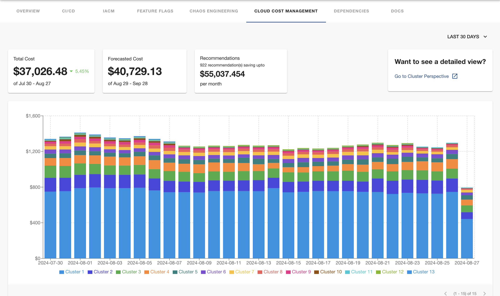

- You can now add [SimpleIcons](https://developer.harness.io/docs/internal-developer-portal/catalog/add-links-docs#icons) in the Links card on Overview page, the list of supported icons are available in **Admin** -> **Layout** -> **Icons**. [IDP-3763]


#### Bug fixes

- Fixed the issue causing Timeout errors on Workflows execution page, even when the Pipeline execution was successful. [IDP-3580]

- Restored the missing GitHub Scaffolder actions, which is included under Workflows Actions by default along with other [built-in Backstage Scaffolder actions.](https://backstage.io/docs/features/software-templates/builtin-actions/)

- Fixed an issue where Account Level Repo URLs for Harness Code were not functional during the registration of a software component. [IDP-3820]

- Fixed the issue with un-supported content types displayed in [Homepage Layout](https://developer.harness.io/docs/internal-developer-portal/layout-and-appearance/home-page-customization). [IDP-3783]

- Fixed the issue with usage of `x-api-key` in [IDP APIs](https://developer.harness.io/docs/internal-developer-portal/api-refernces/public-api) headers, the `x-api-token` should be replaced with `x-api-key`. [IDP-3729]

- Fixed an issue where the TechDocs button appeared greyed out in the About Card when the source was Harness Code. This fix restores full functionality to the button, ensuring users can access TechDocs as expected. [IDP-3725]

- Fixed an issue where the IaCM plugin returned a 401 Unauthorized error, even when the user had proper access. [IDP-3653]


### Version 0.34.0

<!-- October 1, 2024 -->

#### New features and enhancements

- We have added the [new Workflows Homepage](https://developer.harness.io/docs/internal-developer-portal/layout-and-appearance/workflows-page-customization), which helps you to customize the Workflows organization and information associated. This feature is behind the Feature Flag `IDP_ENABLE_WORKFLOWSV2`, contact [harness support](mailto:support@harness.io) to enable it on your account. [IDP-3752] 
- We have upgraded to the new backend system of Backstage in Harness IDP. [IDP-3252]
- Enhanced the API Response for Catalog Ingestion API. [IDP-3672]
- New plugins added to the marketplace.
  - [Sysdig Plugin for Backstage](https://github.com/sysdiglabs/backstage-plugin-sysdig)

#### Bug fixes

- Fixed the issue with `mode: append` to support updates to array values, in Catalog Ingestion API. [IDP-3734]
- Fixed the UI issues with Harness Chaos Engineering Plugin. [IDP-3670]
- Fixed the issue with global GitHub OAuth. [IDP-3655]
- Fixed the issue with Catalog APIs with x-api-key in the header. 

## September 2024

### Version 0.33.0

<!-- September 17, 2024 -->

#### New features and enhancements

- We have upgraded our Backstage core version to v1.28. [IDP-2870]
- [Catalog Ingestion APIs](https://developer.harness.io/docs/internal-developer-portal/catalog/catalog-ingestion/catalog-ingestion-api) received a huge update with lots of new endpoints and use-cases supported. [IDP-3565]
- Add [mkdocstrings](https://mkdocstrings.github.io/) plugin in TechDocs to generate docs from comments in code blocks. [IDP-3570]
- New plugins added to the marketplace.
  - [Argo-CD Plugin for Backstage](https://github.com/RoadieHQ/roadie-backstage-plugins/tree/main/plugins/frontend/backstage-plugin-argo-cd#argo-cd-plugin-for-backstage)

- We have encountered an issue with usage of `ui:widget: password` which reveals the user token in plain text to the user if the field is not used in the first page of the Workflow definition. We have updated our docs with instructions. Please find more context [here](/kb/internal-developer-portal/articles/secrets-issue) if you see the issue.  

#### Bug fixes

- Fixed issue with Jenkins Plugins integration using Delegate. [IDP-3551]
- Fixed `AuthenticationError` issue for templates registered from Harness Code Repo. [IDP-3316]
- Fixed the issue when registering or refreshing IDP workflow would take 10-30 minutes. This now happens instantly.
- Fixed the UI issue when long sidenav in TechDocs sites would cause overlap issues.

## August 2024

### Version 0.32.0

<!-- August 30, 2024 -->

#### New features and enhancements

- You can now create API response based [**Dynamic Workflow Pickers**](https://developer.harness.io/docs/internal-developer-portal/flows/dynamic-picker) for fetching values from a third party APIs and show it to the user. You can use it to provide a pick list of available repositories, projects or integrate with your other data sources. [IDP-3531]
- **IDP Homepage is now customizable!** You can personalize the cards, banners and headers for your homepage. We have also added a new Toolbox card to organize the handy tools that your developers need to see, especially if they are new. Read more about [homepage customization](https://developer.harness.io/docs/internal-developer-portal/layout-and-appearance/home-page-customization). [IDP-2890]
- Harness Code Integration now supports registering components from Account, Org and Project level repositories. Previously this was limited to only project level repositories. [IDP-3390]
- Harness Code is now available in the Direct Push and Create Repo step under IDP pipeline stage. [IDP-3400]
- New plugins added to the marketplace.
  - [JFrog artifactory Plugin](https://github.com/Vity01/backstage-jfrog-artifactory-libs)
  - [Container Image Registry for JFrog Artifactory Plugin](https://janus-idp.io/plugins/jfrog-artifactory/).

#### Bug fixes

- Fixed issue with Jenkins Plugin not working with delegate proxy. [IDP-3511]
- Updated the Schema Validation for Custom Plugin to support fields like `credentials`, `allowedHeaders` and `pathRewrite` under the Backend Proxy definition. [IDP-3391]
- Fixed issue with fetching data for services, created using Git Sync, in the Harness CI/CD Plugin. [IDP-3566]

### Version 0.31.0

<!-- August 16, 2024 -->

#### New features and enhancements

- You can now see an out of the box [**Adoption Dashboard**](/docs/internal-developer-portal/get-started/how-to-track-adoption) under the platform Dashboards showing a quick insight into the adoption of IDP across different areas. Executive Buyers can now subscribe to this and get a weekly/monthly report.
- New plugins added to the marketplace
  - [Harness Chaos Engineering](/docs/internal-developer-portal/plugins/available-plugins/harness-chaos)
  - [Synk](https://github.com/snyk-tech-services/backstage-plugin-snyk/blob/main/README.md)
  - [New Relic](https://github.com/backstage/community-plugins/blob/main/workspaces/newrelic/plugins/newrelic-dashboard/README.md)
- IDP Pipeline steps now support Harness Code as a git provider. [IDP-3232]
- Secrets stored in customer's infrastructure now also supports GitHub and Google OAuth configurations. [IDP-3364]
- [Harness Projects and Orgs Picker](https://developer.harness.io/docs/internal-developer-portal/flows/custom-extensions/) in Workflows now shows up to a maximum of 750 items in the list. Previously the limit was set to 500. [IDP-3331]
- You can now use periods `.` in the `tags` field of Catalog entities. [IDP-3330]

#### Bug fixes

- Issue with enabling OpsGenie plugin has now been resolved. Please see the [new configuration](/docs/internal-developer-portal/plugins/available-plugins/opsgenie/) of the plugin if you are still facing the issue. [IDP-3334]

## July 2024

### Version 0.30.0

<!-- July 31, 2024 -->

- **New Videos:** [Harness IDP Scorecard Checks using Custom Data Source - Deep Dive ](https://youtu.be/23hlHjhhYsQ)

#### New features and enhancements

- You can now use any custom secret manager to manage secrets in Harness IDP. [IDP-3245]
- Added audit trails support for entity `kind` and `type`. [IDP-3274]
- You can now fetch images from private artifactory hub, for developer portal stages. [IDP-3258]
- In [Bitbucket data source](https://developer.harness.io/docs/internal-developer-portal/scorecards/checks-datasources#bitbucket) for [File Exist data point](https://developer.harness.io/docs/internal-developer-portal/scorecards/checks-datasources#url-priority-for-branch-name-field-6), we will use the **default branch** for the repository used in source-location, as the default `branchName`. [IDP-3236]
- New Plugins: Add [gRPC playground plugin](https://github.com/zalopay-oss/backstage-grpc-playground) to enhance [gRPC API](https://developer.harness.io/docs/internal-developer-portal/techdocs/add-api-docs/#grpc-docs) view. [IDP-3199]

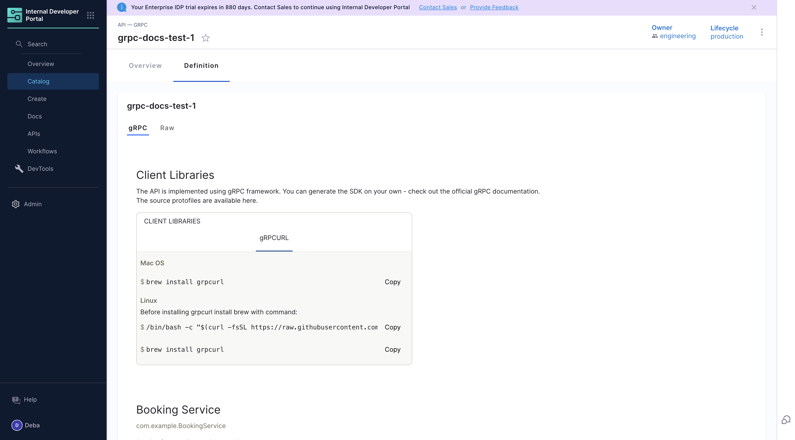

- You can now ingest [user-group](https://developer.harness.io/docs/platform/role-based-access-control/add-user-groups) as an entity YAML in Harness IDP.

- Added support to trigger workflows using Harness Pipelines with [git experience](https://developer.harness.io/docs/platform/git-experience/configure-git-experience-for-harness-entities/) in [`trigger:harness-custom-pipeline`](https://developer.harness.io/docs/internal-developer-portal/flows/custom-actions#1-triggerharness-custom-pipeline) custom action. [IDP-3304].

#### Bug Fixes

- Fixed the issue with GitLab rate-limiting, by configuring the catalog refresh processing interval as per account requirements. [IDP-3279]
- Fixed the issue with [pull and run images from private artifactory storage in your pipelines](https://developer.harness.io/docs/continuous-integration/use-ci/build-and-upload-artifacts/build-and-upload-an-artifact#pull-images), for developer portal stages. [IDP-3258]
- Fixed the issue regarding the use of templates in IDP Stage. [IDP-3121]
- Fixed the issue with "no git integration added banner" showing even when git integration is in place. [IDP-3157]
- Fixed the issue with max projects fetched by [`HarnessProjectPicker`](https://developer.harness.io/docs/internal-developer-portal/flows/custom-extensions#3-harnessprojectpicker) UI Picker [IDP-3331].

### Version 0.29.0

<!-- July 18, 2024 -->

In this release we have done few upgrades and bug-fixes which are dependant on [Delegate Version](https://developer.harness.io/release-notes/delegate), hence if you are using Delegates within IDP (for Plugin configurations or Git integrations), **please ensure your delegate version is upgraded to 24.07.83404 or beyond**

#### New features and enhancements

- You can now create a new Catalog Layout for your Custom Entity Types in the IDP Software Catalog. This extends our Catalog model beyond services, websites and libraries to track different types of applications such as micro-frontends, llm models, SDKs and more! [Read more](https://developer.harness.io/docs/category/layout--appearance) on how to do it. [IDP-3045]

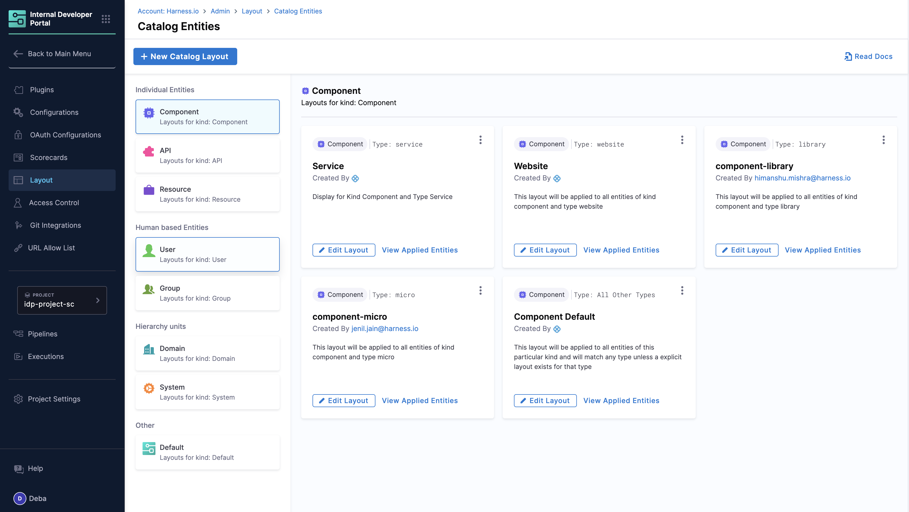

- Added support for JEXL expressions in [catalog-info.yaml](https://developer.harness.io/docs/internal-developer-portal/catalog/yaml-file#support-for-harness-account-variables) and [template.yaml](https://developer.harness.io/docs/internal-developer-portal/flows/service-onboarding-pipelines#support-for-harness-account-variables) (any YAML ingested in IDP). [IDP-2843]

- Added support for [graphviz](https://graphviz.org/) and [plantUML](https://plantuml.com/) in TechDocs. [IDP-3072]

- Custom Plugins

  - You can now add Headers (e.g. Authentication header) when defining your custom plugin’s config. [Docs](https://developer.harness.io/docs/internal-developer-portal/plugins/custom-plugins/add-a-custom-plugin/#configurations)[IDP-3060]
  - Improved Error Handling, with detailed error messages at each step.

- UI Framework enhancements with integration of UI Core. [IDP-3055]

- New Plugins
  - [BugSnag](https://developer.harness.io/docs/internal-developer-portal/plugins/available-plugins/bug-snag) - View and monitor Bugsnag errors. [IDP-3009]
  - [Harness IaCM plugin](https://developer.harness.io/docs/internal-developer-portal/plugins/available-plugins/harness-iacm) - This plugin provides an overview of all the resources provisioned through information on active workspaces in your account. [IDP-3191]

#### Bug Fixes

- TechDocs builds were facing issues with Bitbucket and GitHub App authentication when delegate was used in the connector. This is resolved now, ensure to upgrade the delegate version to 24.07.83404 or beyond for the fix. [IDP-3120]
- UI fix to show the correct count of the selected services in Getting Started. [IDP-3112]
- UI Bug fix showing a group is selected under IDP Admin Access Control while no group was actually selected. [IDP-3081]
- Custom plugins - Fixed wrong status showing for custom plugin’s builds. [IDP-3059]
- Deleting a disabled custom plugin now updates metadata properly. [IDP-3058]
- Added more retries to avoid Connection Timeout errors in IDP Workflow Execution. [IDP-2997]
- Removed banner showing no Git Integration setup while Harness Code was enabled. [IDP-3182]
- Harness CI/CD plugin was fixed to support both old and new Harness URLs along with vanity URLs. [IDP-3156]

## June 2024

### Version 0.28.0

<!-- June 18, 2024 -->

Happy Juneteenth and welcome to the June release of IDP. In this release we have added adoption and scalability features like improvements to the Developer Portal Pipeline stage to enhance the self service onboarding.

- **New Docs and Tutorials:** [How to create Jira Projects and Jira Tickets using IDP](https://developer.harness.io/docs/internal-developer-portal/tutorials/how-to-use-catalog-ingestion-api/), [How to write catalog-info.yaml](https://developer.harness.io/docs/internal-developer-portal/catalog/how-to-create-idp-yaml).

#### New features and enhancements

- Enhanced error handling for Custom Plugin. You can now see the latest build status along with the enablement status of your custom plugin.[IDP-2069]

- Added three new steps in Developer Portal stage for Harness onboarding of new application. [IDP-2783]
  1. Create Organization: Creates a Harness Org for the account you have provided Harness API key.
  2. Create Project: Creates a Harness Project in the org provided.
  3. Create Resource: Takes [Terraform Provider Resource Definition](https://developer.harness.io/docs/platform/automation/terraform/harness-terraform-provider-overview/) as input to create Harness Entities like Pipelines, Connectors etc.

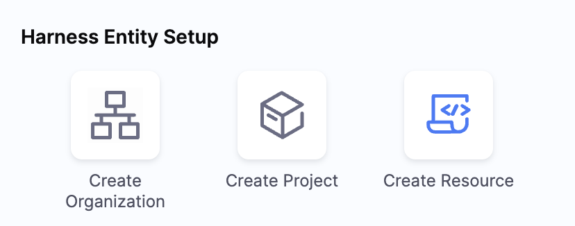

- Added support to show delegate related errors in Scorecards. For example any GitHub related checks if failed due to an issue in GitHub connector setup using delegate then it will show the same error on scorecard evaluation. [IDP-2940]

- We have upgraded the Harness CI/CD plugin to the latest version which includes support for new nav URL in annotations. [IDP-2936]

- Created a new Catalog Info YAML check for Scorecards which can check if an annotation exists or not. [IDP-2609]

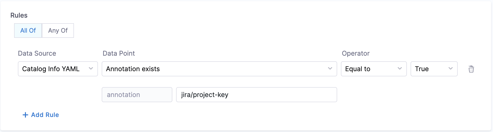

- Added support for view source and TechDocs for Harness Code Integration. [IDP-3030]

- We now have a GET API to fetch all the Custom Catalog Properties. [IDP-2711]

#### Bug Fixes

- Fixed issue with `/` escape character handling in the API body of [Catalog Metadata Ingestion API](https://developer.harness.io/docs/internal-developer-portal/catalog/custom-catalog-properties#catalog-metadata-ingestion-api). [IDP-3000]

- Fixed issue with IDP license utilization reporting. [IDP-2956]

- Fixed the issue with deleted plugins being available on the metadata YAML even after the deletion flow is completed.[IDP-2946]

- Fixed the issue with `trigger:trigger-pipeline-with-webhook` custom action to trigger pipeline even with using already existing webhook instead of creating a new webhook every time. [IDP-2609]

- Fixed the issue with TechDocs remote URL reference. [IDP-3072]

## May 2024

### Version 0.27.0

<!-- May 23, 2024 -->

#### New features and enhancements

- Added the support to JSON stringfy the input values for the custom action [`trigger:trigger-pipeline-with-webhook`](https://developer.harness.io/docs/internal-developer-portal/flows/custom-actions#2-triggertrigger-pipeline-with-webhook) , if the type is object [IDP-2858]

- orgIdentifier is now an optional field in the Create Project Step [IDP-2857]

- Added support for [Harness Code Repository](https://www.harness.io/products/code-repository) as a [git integration](https://developer.harness.io/docs/internal-developer-portal/get-started/setup-git-integration#connector-setup) [IDP-2724]

- We now support private registry configuration for IDP stage. [IDP-2773]

- Added error handling support for Custom Plugins, users can now view the errors in case of issues with the uploaded packages. [IDP-2527]

- Optimized the user and group entity provider to scale-up the user onboarding. [IDP-2814]

- [Catalog Metadata Ingestion API](https://developer.harness.io/docs/internal-developer-portal/catalog/custom-catalog-properties/#request-body) enhancement: `Properties` are mandatory now, At least one `filter` item should be present in the API body. [IDP-2712]

- Added audit support for scorecard re-run event. [IDP-2150]

- We now have a help panel support in the Onboarding Flow to help users with required information on each page.[IDP-2602]

- Added [Delta Mutation](https://backstage.io/docs/features/software-catalog/external-integrations/#provider-mutations) support for Usergroup sync from Harness Platform to IDP, this improves the performance during onboarding at scale. [IDP-2824]

#### Bug Fixes

- Fixed the issue with new nav URL as annotation for Harness CI/CD plugin. [IDP-2721]
- Fixed the issue with selecting both custom and default checks while creating a scorecard.
- Fixed issue with IDPTelemetryPublisher::recordTelemetry to retry on failure as last sent is updated before attempting to send the license data. [IDP-2654]
- Fixed handling custom plugin config if marketplace config are available by default in IDP. [IDP-2800]

### Version 0.26.0

<!-- May 7, 2024 -->

#### New features and enhancements

- We now have an updated [onboarding flow](https://developer.harness.io/docs/internal-developer-portal/get-started/setup-git-integration#getting-started) for new users, to onboard your already existing harness services as well as new services into IDP as part of the getting started with the module. This new onboarding flow is async wherein users could skip it and add a [git-integration](https://developer.harness.io/docs/internal-developer-portal/get-started/setup-git-integration#connector-setup) later under admin section [IDP-2213]

- We have updated the custom action [`trigger:trigger-pipeline-with-webhook`](https://developer.harness.io/docs/internal-developer-portal/flows/custom-actions#2-triggertrigger-pipeline-with-webhook) to trigger workflows based on pipeline [`inputset`](https://developer.harness.io/docs/platform/pipelines/input-sets/#create-input-sets) id. [IDP-2611]

- Added support for [Splunk OnCall Backstage Plugin](https://github.com/backstage/community-plugins/tree/main/workspaces/splunk/plugins/splunk-on-call#splunk-on-call) and [Architecture Decision Records (ADR) Backstage Plugin](https://github.com/backstage/community-plugins/tree/main/workspaces/adr/plugins/adr#architecture-decision-records-adr-plugin). [IDP-2470] [IDP-2594]

- As part of our new infrastructure evolution initiative, we have refactored our present infrastructure to extend support for our customers in EU region.

## April 2024

### Version 0.25.0

<!-- Apr 10, 2024 -->

Welcome to first release of April, and in this release we bring you features like **Catalog Metadata Ingestion APIs**, say goodbye to manual data entry woes. With our new API, effortlessly ingest metadata in scale into the IDP catalog.

- **Blogs:** [Introducing new Catalog Ingestion APIs to make Harness IDP truly yours](https://www.harness.io/blog/introducing-new-catalog-ingestion-apis-to-make-harness-idp-truly-yours)

- **New Docs:** [Get started with IDP](https://developer.harness.io/docs/internal-developer-portal/get-started/), [Harness IDP Overview](https://developer.harness.io/docs/internal-developer-portal/get-started/overview), [Catalog Metadata Ingestion API](https://developer.harness.io/docs/internal-developer-portal/catalog/custom-catalog-properties), [Usage of Catalog Metadata Ingestion APIs](https://developer.harness.io/docs/internal-developer-portal/catalog/ccp-for-workflows), [Custom Dashboards](https://developer.harness.io/docs/internal-developer-portal/dashboard/custom-dashboards)

- **New Videos:** Our team presented a talk on "[Architecting Multi-tenant Backstage Instances in a Shared Kubernetes Cluster](https://youtu.be/TPHsBduIvm0?si=wWp9b5kXXNKDGrX0)" at the recently held [Backstagecon Europe](https://events.linuxfoundation.org/kubecon-cloudnativecon-europe/co-located-events/backstagecon/).

#### New features and enhancements

- We now support a new [git integration](https://developer.harness.io/docs/internal-developer-portal/get-started/setup-git-integration#connector-setup) framework, which will allow users to have multiple connectors, with different host name, for a single git provider at once. For eg., Users can now use connectors for both `github.com` and `github enterprise` to fetch entity yaml from both the sources at the same time. [IDP-2213]

- We have added support for a new Workflow UI Picker, [`EntityFieldPicker`](https://developer.harness.io/docs/internal-developer-portal/flows/custom-extensions#entityfieldpicker) using which users can use the data present in catalog as an input for the workflows. [IDP-2441]

- We have added a new plugin, to support [GitHub Codespaces](https://developer.harness.io/docs/internal-developer-portal/plugins/available-plugins/github-codespaces) integration in the software catalog.[IDP-2469]

- Added support for [MkDocs plugins and extensions](https://backstage.io/docs/features/techdocs/faqs/#what-is-the-mkdocs-techdocs-core-plugin) in the TechDocs. Here's the list of plugins added.[IDP-2540]

  - [mkdocs-glightbox](https://github.com/blueswen/mkdocs-glightbox)
  - [mkdocs-git-authors-plugin](https://github.com/timvink/mkdocs-git-authors-plugin)
  - [mkdocs-git-revision-date-localized-plugin](https://github.com/timvink/mkdocs-git-revision-date-localized-plugin)
  - [mkdocs-video](https://pypi.org/project/mkdocs-video/)
  - [mkdocs-material-extensions](https://pypi.org/project/mkdocs-material-extensions/)
  - [mkdocs-redirects](https://github.com/mkdocs/mkdocs-redirects)
  - [mkdocs-awesome-pages-plugin](https://pypi.org/project/mkdocs-awesome-pages-plugin/2.6.1/)
  - [mkdocs-minify-plugin](https://pypi.org/project/mkdocs-minify-plugin/0.7.1/)

- We have enhanced the [`harness:delete-secret`](https://developer.harness.io/docs/internal-developer-portal/flows/custom-actions#4-harnessdelete-secret) custom action to support deletion of secrets added as runtime inputs. [IDP-2492]

- We now have Audit trails support for all the git integrations. [IDP-2419]

- [Custom Dashboards](https://developer.harness.io/docs/internal-developer-portal/dashboard/custom-dashboards) are now available to use in IDP. We have support for few OOTB dashboards as well. [IDP-1456]

#### Bug Fixes

- Fixed issues, with empty string & null entries for user groups, in access control. [IDP-2509]
- Fixed issues with Entities marked as secret to be visible to owners only. [IDP-2182]

## March 2024

### Version 0.24.0

<!-- Mar 22, 2024 -->

#### New features and enhancements

- We have improved the permission framework, wherein the support user won't be able to view the docs. [IDP-2477]

- User can now provide the repository url to verify for repository read permission with the given host and credentials before saving the git integration, while creating the connectors. [IDP-2213]

- We have added support for [sub-groups](https://docs.gitlab.com/ee/user/group/subgroups/) in the GitLab Datasources. [IDP-2510]

- We now have support for custom properties, to push append or update arbitrary metadata associated with Catalog entities (services, libraries, websites, etc.) and will help users to automate the process of `catalog-info.yaml` creation, we provide an API that users can call from their pipeline or even manually to add or modify properties in the metadata field for any catalog entity(s). [IDP-2228]

#### Bug Fixes

- Fixed the issue for broken API Plugin, now all plugin data would be loading seamlessly for users once configured. [IDP-2461]
- Fixed the issue with plugin icon on plugins page. [IDP-2431]
- Fixed the issue with URL allow list, now host name field is marked mandatory to add the URL. [IDP-2414]

### Version 0.23.0

<!-- Mar 11, 2024 -->

Continuing with the increased adoption of self-service flows, this release we're happy to introduce an intuitive minimalistic UI for the workflows page along with support for output variables on workflows page, to streamline user experiences seamlessly.

- **Blogs:** [Why Harness IDP, powered by Backstage, is Your Gateway to Effortless Developer Portal Excellence](https://www.harness.io/blog/why-harness-idp-powered-by-backstage-is-your-gateway-to-effortless-developer-portal-excellence)

- **New Docs:** [Custom Card Plugin](https://developer.harness.io/docs/internal-developer-portal/catalog/custom-card), [Catalog Entity YAML Examples](https://developer.harness.io/docs/internal-developer-portal/catalog/yaml-file)

- **New Videos:** [Custom Card Plugin](https://youtu.be/Qi1PIWSPves), [Workflow Upgrades](https://youtu.be/aethqdKmZOo)

#### New features and enhancements

- Now we have a [new UI](https://youtu.be/aethqdKmZOo) for the Workflows page, as part of the Backstage Upgrades. [IDP-2355]


- We have added a new custom processor to convert the email-id used under `owner` field in `catalog-info.yaml` to an `user` incase the username is part of the email-id. [IDP-2369]

- We have added a new [Custom Card Plugin](https://developer.harness.io/docs/internal-developer-portal/catalog/custom-card) to help users display the information, stored under the root fields of `catalog-info.yaml`, on a card in the overview tab. [IDP-2352]

- We have added a new [Evaluate expression](https://developer.harness.io/docs/internal-developer-portal/scorecards/checks-datasources#catalog) datapoint under the Catalog datasource to match input values for all the root fields `apiVersion`, `kind`, `metadata`, and `spec` only and the supported values under the root field. [IDP-2111]

- Now you can configure the output of `trigger:harness-custom-pipeline` to display the pipeline [output variables](https://developer.harness.io/docs/platform/variables-and-expressions/harness-variables/#input-and-output-variables), by setting the `showOutputVariables: true` under `inputs`and adding `output` as shown in the example below: [IDP-2328]

```YAML
...
output:
  text:
    - title: Output Variable
      content: |
        Output Variable **test2** is `${{ steps.trigger.output.test2 }}`
    - title: Another Output Variable
      content: |
        Output Variable **test1** with fqnPath is `${{ steps.trigger.output['pipeline.stages.testci.spec.execution.steps.Run_1.output.outputVariables.test1'] }}`
...
```

There are two ways in which you can add the output variable to the template syntax.

1. You can directly mention the output variable name `${{ steps.trigger.output.test2 }}`, here `test2` is the output variable name we created in the pipeline.

2. You can copy the JEXL expression of the output variable and remove the JEXL constructs, `${{ steps.trigger.output['pipeline.stages.testci.spec.execution.steps.Run_1.output.outputVariables.test1'] }}`, here the part `pipeline.stages.testci.spec.execution.steps.Run_1.output.outputVariables.test1` comes from `<+pipeline.stages.testci.spec.execution.steps.Run_1.output.outputVariables.test2>` copied from execution logs.

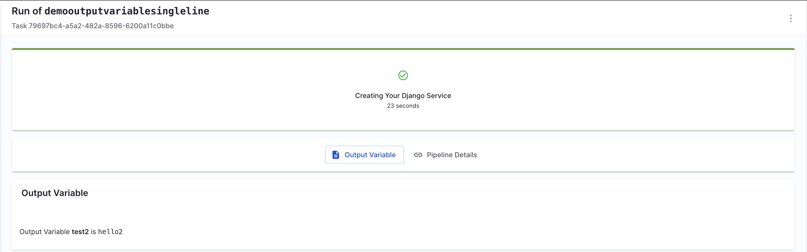

#### Bug Fixes

- Fixed the issue with missing labelSelector annotation resulting in scorecards checks failure message not getting displayed for some k8s related checks. [IDP-2270]

## February 2024

### Version 0.22.0

<!-- Feb 22, 2024 -->

Given the interest of our users to know more about our IDP and what's coming up next, we have released a detailed [roadmap](https://developer.harness.io/roadmap/#idp) for IDP. Also we would further like to hear the feedback of users on our [ideas platform](https://ideas.harness.io/) regarding how they envision their developer portal to be and what improvements they would like to see in our IDP especially the suggestions for Plugins and support for new integrations.

- **New Docs:** [Use Harness IDP for self serviced Harness CI/CD onboarding](https://developer.harness.io/docs/internal-developer-portal/flows/self-service-onboarding-pipeline-tutorial), [How to build Frontend Backstage Plugins](https://developer.harness.io/docs/internal-developer-portal/plugins/build-a-frontend-plugin), [Custom Dashboards](https://developer.harness.io/docs/internal-developer-portal/get-started/custom-dashboards)

- **New Videos:** [Create a New Python Lambda app using Harness IDP in 5 minutes](https://youtu.be/JMjbqAilJHU)

#### New features and enhancements

- We have added support for displaying warning message on connector page, when a connector or secret is deleted. [IDP-2018]
- You can now optionally remove the pipeline url used to orchestrate the workflow, from the workflow execution logs displayed as output while using the custom action [trigger:harness-custom-pipeline](https://developer.harness.io/docs/internal-developer-portal/flows/custom-actions#1-triggerharness-custom-pipeline). For this you need to use the boolean property `hidePipelineURLLog` and set the value as `true`. [IDP-2183]

```YAML
## Example
steps:
- id: trigger
    name: Creating your react app
    action: trigger:harness-custom-pipeline
    input:
    url: "Pipeline URL"
    hidePipelineURLLog: true
    inputset:
        project_name: ${{ parameters.project_name }}
    apikey: ${{ parameters.token }}
```

- The Custom field extension **`HarnessAutoOrgPicker`**, which auto populates org id on project selection, would now pick project field value from the key that is mentioned under `projectPickerRef` as dependencies, if it's name is other than `projectId`. When properties have the project key and are named as `projectId` in that case you don't need to add the dependencies. [IDP-2243]

```YAML
## Example where projectId is mentioned under project_name
apiVersion: scaffolder.backstage.io/v1beta3
kind: Template
metadata:
  name: your-workflow
  ...
spec:
  ...
  parameters:
    - title: Details
       properties:
         project_name:
           title: Project Identifier
           description: Harness Project Identifier
           type: string
           ui:field: HarnessProjectPicker
         orgId:
           title: Org Identifier
           description: Harness org Identifier
           type: string
           ui:field: HarnessAutoOrgPicker
           dependencies:
            projectPickerRef:
              - 'project_name'
```

### Version 0.21.0

<!-- Feb 8, 2024 -->

We are seeing a lot of excitement among our customers around Self Service Workflows to derive value for their developers. This release is especially for you if you are using IDP workflows for user/service onboarding.

- **New Docs:** [API Docs](https://apidocs.harness.io/tag/IP-Allowlist), [How to write IDP templates](https://developer.harness.io/docs/internal-developer-portal/flows/service-onboarding-pipelines#how-to-write-idp-templates), [List of on-hold Plugins](https://developer.harness.io/docs/internal-developer-portal/plugins/on-hold-plugins)
- **New Videos:** [Ignoring Developer Experience is Hurting Your Organization: DX is Critical](https://youtu.be/ka6kHPMGGpc?si=MCcVZdvP2bGCCI3h)

#### New features and enhancements

- The project picker in IDP workflows [`HarnessProjectPicker`](https://developer.harness.io/docs/internal-developer-portal/flows/custom-actions#harness-specific-custom-extensions) now shows the org as well. There is no change in the input/output values. [IDP-2048]

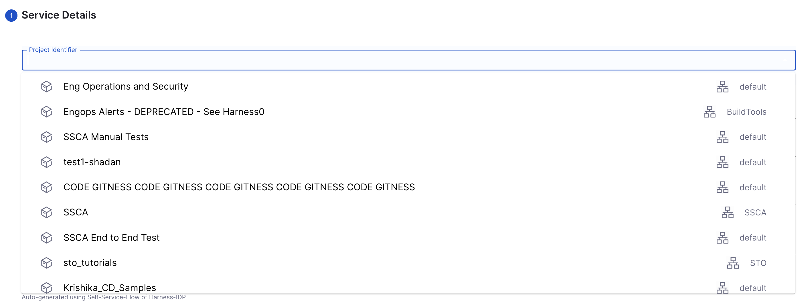

- Added support for a new Custom field extension **`HarnessAutoOrgPicker`**, which auto populates on project selection. So now when you select an project id as an input the org id gets selected automatically if required as an input. [IDP-2099]

```YAML
# Example template.yaml file
apiVersion: scaffolder.backstage.io/v1beta3
kind: Template
metadata:
  name: your-workflow
  ...
spec:
  ...
  parameters:
    - title: Details
       properties:
         projectId:
           title: Project Identifier
           description: Harness Project Identifier
           type: string
           ui:field: HarnessProjectPicker
         orgId:
           title: Org Identifier
           description: Harness org Identifier
           type: string
           ui:field: HarnessAutoOrgPicker
```

In the above example the the `Project Identifier` field once selected auto populates the `Org Identifier` field as shown below.

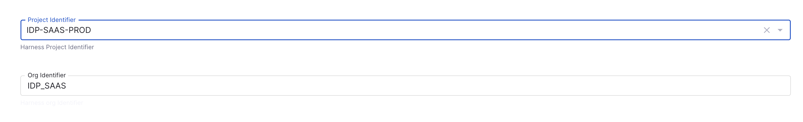

- Two new plugins [Azure Devops](https://developer.harness.io/docs/internal-developer-portal/plugins/available-plugins/azure-devops) [IDP-2078] and [Rootly](https://developer.harness.io/docs/internal-developer-portal/plugins/available-plugins/rootly) [IDP-1693] are available to use now!
- Users can now add email as an input for Slack Notify step in the IDP Stage. When used with `<+pipeline.triggeredBy.email>`, your service onboarding pipeline can now notify the user! [IDP-1943].
- All IDP APIs are now available on our public API docs.[IDP-2113]

#### Bug Fixes

- Added support for word-wrap to ensure words are not broken on screen. [IDP-1972]
- Fixed the string input value to ignore leading slash for file path input value in scorecard checks[IDP-2084].
- Enhanced error handling for steps under developer portal stage. You should now see more meaningful errors [IDP-2105, IDP-2098, IDP-2087, IDP-2086, IDP-1943].

## January 2024

### Version 0.20.0

<!-- Jan 25, 2024 -->

🐣 "Easter Came Early This Year! 🚀 In our latest update, we're egg-cited to unveil the delightful additions of **custom plugins** – features you've eagerly anticipated. Here are some of the Docs and Tutorials to help you get started.

- **Docs:** [Custom Plugins](https://developer.harness.io/docs/category/custom-plugins), [Roadmap](https://developer.harness.io/docs/internal-developer-portal/roadmap/), [Harness IDP vs Self Managed Backstage - In-depth Feature Comparison](https://developer.harness.io/docs/internal-developer-portal/roadmap/harness-vs-backstage)

- **Video Tutorial:** [How to Add Custom Plugins In Harness IDP](https://youtu.be/6ab9xQY7kSE)

#### Early access features

- We have added support for [custom plugins](https://developer.harness.io/docs/internal-developer-portal/plugins/custom-plugins/overview), which enables users to upload their own frontend backstage plugins to Harness IDP. This feature is behind the feature flag `IDP_ENABLE_CUSTOM_PLUGINS`. To enable the feature, please reach out to IDP team or contact [Harness Support](mailto:support@harness.io). [IDP-771]

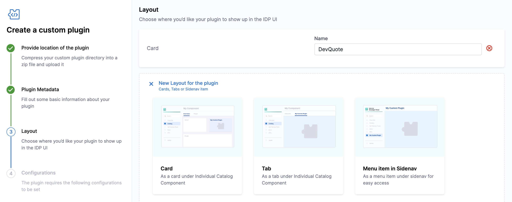
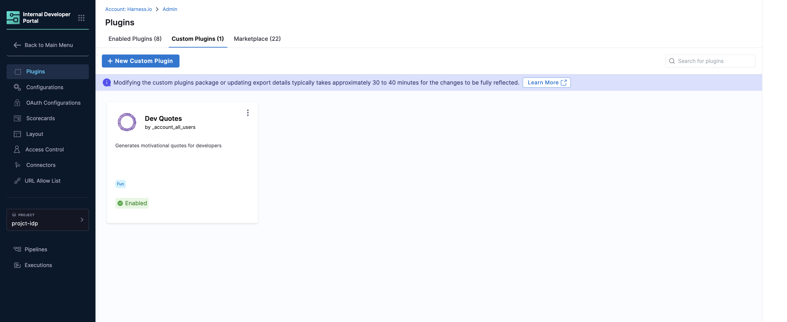

- Added the support to push code to the existing main branch of git providers in the [Create Repo step](https://developer.harness.io/docs/internal-developer-portal/flows/idp-stage#3-create-repo) under [Developer Portal Stage](https://developer.harness.io/docs/internal-developer-portal/flows/idp-stage). To enable the feature, please reach out to IDP team contact [Harness Support](mailto:support@harness.io). [IDP-1944]

#### New features and enhancements

- Added support for Workflow Executions in Audit trails. [IDP-1989]
- Added support for CSV Downloads in Scorecards and Checks overview pages. [IDP-1932]

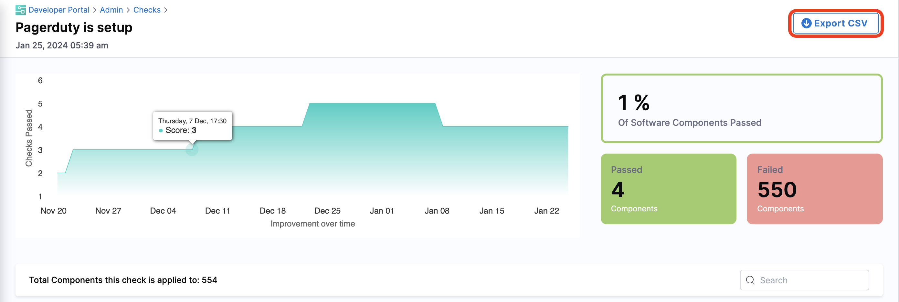

#### Bug Fixes

- Fixed deletion of env variable while adding the new env variable during config updates. [IDP-2031]
- Fixed the incorrect redirect from the getting started page, this now won't allow users to get into IDP overview page without completion of the onboarding steps. [IDP-1993]
- Fixed the Scaffolder Backend Caching issue, this now would allow users to execute workflow templates with all default values without any authentication failure. [IDP-2001]

### Version 0.19.0

<!-- Jan 19, 2024 -->

🎁 In our latest release, we've added improvements to scorecards✨ and the clarity of audit trails 📊 – features you've been eagerly waiting for.

- **Docs:** [Governance](https://developer.harness.io/docs/category/governance), [Rafay Plugins](https://developer.harness.io/docs/internal-developer-portal/plugins/available-plugins/rafay-kubernetes)
- **Tutorial:** [Create a service onboarding pipeline (using IDP Stage)](/docs/internal-developer-portal/tutorials/service-onboarding-with-idp-stage)

#### New features and enhancements

- Added support for [Audit Trails](https://developer.harness.io/docs/internal-developer-portal/governance/audit-trails). [IDP-1280]
- Added support for a new plugin [Rafay Kubernetes Operations Platform](https://developer.harness.io/docs/internal-developer-portal/plugins/available-plugins/rafay-kubernetes). [IDP-1979]
- Added support for connector types in Git based steps under IDP stage, which will allow users to toggle between public and private repositories. [IDP-1982]
- Added support for entities `annotation` and `harnessData` from `catalog-info.yaml` to be added as variable(JEXL format) input in Scorecard Checks. eg., `<+metadata.harnessData.branch>` will fetch the value for the branch in the following YAML as `catalog-info.yaml`. [IDP-1964]

```YAML
...
metadata:
  name: idp-module
  harnessData:
    branch: develop
    path: idp
    priority: P0,P1
  annotations:
    jira/project-key: IDP
...
```

#### Bug Fixes

- Fixed the issue with side Nav items display, when user switches from old to new Nav using "New Navigation Design (Beta)" toggle. [IDP-1964]
- Fixed the issue with scaffolder task missing "created by" with adding a migration that will correct the data eventually. [IDP-1961]
- Fixed the issue with Backstage Permissions Sync Job Bug. [IDP-1980]

### Version 0.18.0

<!-- Jan 11, 2024 -->

🎉 Happy New Year to all our fantastic users! 🎉
Since it's the first release of the year, we've wrapped up some interesting features for you, including a new Devtools Plugin and revamped access control permissions.

- **Docs:** [Configuring Layout of IDP Catalog pages](https://developer.harness.io/docs/internal-developer-portal/layout-and-appearance/catalog) [Role-based access control (RBAC)](https://developer.harness.io/docs/internal-developer-portal/rbac/resources-roles)

- **Videos:** [How to set the Owner of a Software Component](https://youtu.be/pQvqWBrXIhk?si=LqkJBDo63we929L4)

#### New features and enhancements

- Added Support for New [Devtools Plugin](https://github.com/backstage/backstage/blob/master/plugins/devtools/README.md)

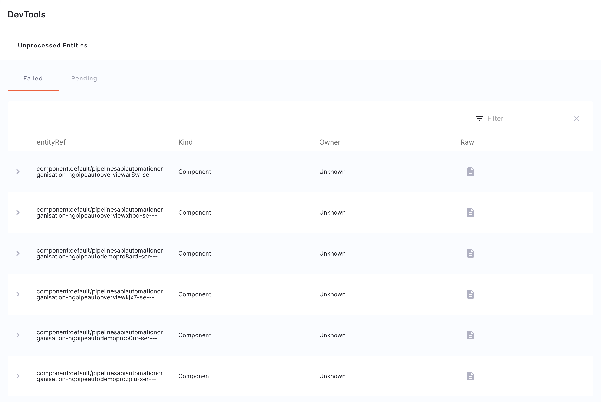

- Added support for [new custom action](https://developer.harness.io/docs/internal-developer-portal/flows/custom-actions#2-triggertrigger-pipeline-with-webhook), that can execute pipeline with custom webhook based triggers.

- Access Control is revamped with new roles (IDP Admin and IDP Platform Engineering) and permissions.

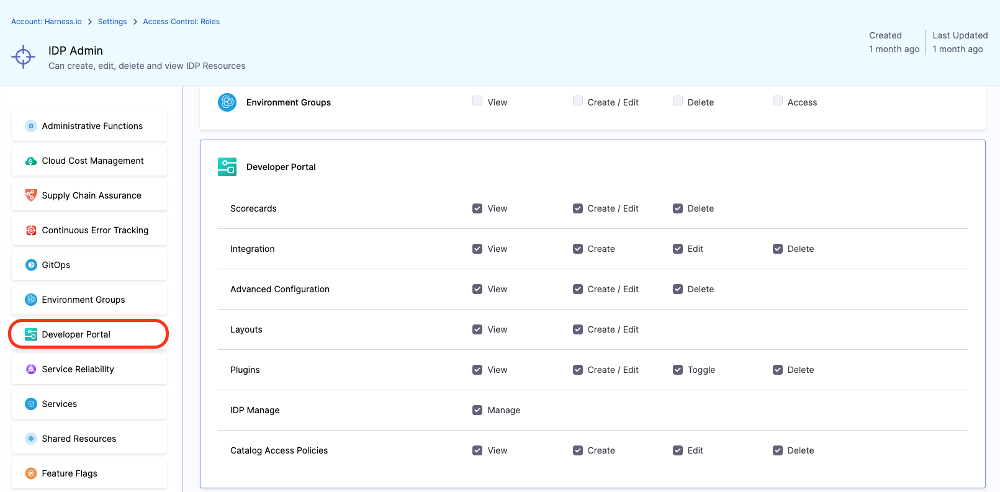

- Added support for persistent platform favorites, which allows users to star their most visited pages and also it gives information on the recently visited pages.

- Enhanced the custom project picker to increase the hard limit of 50.

- Added support for regex in file name input in Scorecards.

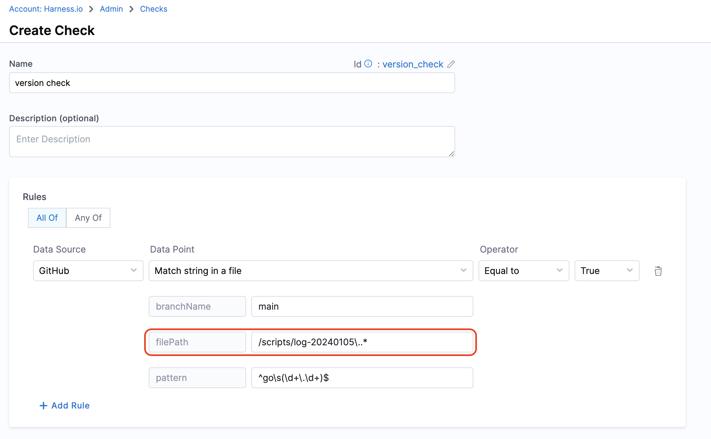

- We now have a new intuitive Plugins Page.

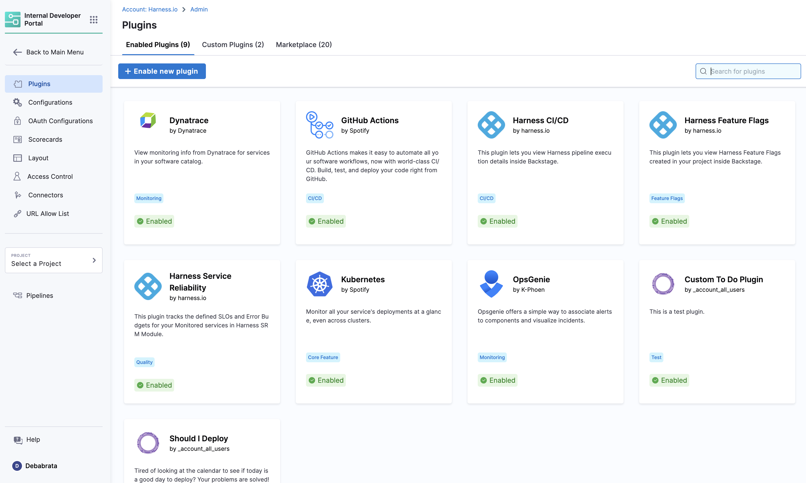

## December 2023

### Version 0.17.0

<!-- Dec 21, 2023 -->

Jingle bells, jingle bells, jingle all the way to Harness IDP's End-of-Year Release! 🛷 As we close the chapter on a year of incredible milestones, we want to express our heartfelt thanks to our amazing customers and prospects. Your support, feedback, and enthusiasm have been the North Star 🌟 guiding us in enhancing and evolving Harness IDP. The debut of our new module and the strides we've made together are testaments to your invaluable collaboration and spirit.

In this release, we're excited to unveil features like the HTTP actions support in the scaffolder-backend 🌐, the innovative Developer Portal stage for seamless self-service flows 🚀, and the integration of OPA/Governance policies to ensure streamlined and secure management 🛡️. Plus, we've squashed some pesky bugs 🐛 to make your experience smoother than ever!

- **Docs:** [Supported Custom Actions](https://developer.harness.io/docs/internal-developer-portal/flows/custom-actions), [Supported OPA Policies in IDP](/docs/internal-developer-portal/scorecards/opa-implementation), [New IDP Stage](https://developer.harness.io/docs/internal-developer-portal/flows/idp-stage)

- **Tutorial:** [Harness Policy As Code for Services using Scorecards](/docs/internal-developer-portal/scorecards/opa-implementation)

#### Early access features

- Added a [new stage](/docs/internal-developer-portal/flows/idp-stage), specifically for IDP, knows as Developer Portal to help with the self service flows (presently this feature is behind a Feature Flag) [IDP-1425]

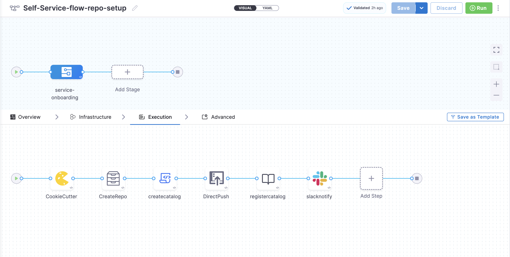

- Added a [Cookiecutter step](https://developer.harness.io/docs/internal-developer-portal/flows/idp-stage#2-cookiecutter) to enable use of cookiecutter based templates in the IDP stage.[IDP-1437]
- Added a [step](https://developer.harness.io/docs/internal-developer-portal/flows/idp-stage#6-register-catalog) to register software components in IDP catalog.[IDP-1438]
- Added a [step](https://developer.harness.io/docs/internal-developer-portal/flows/idp-stage#3-create-repo) to create a repository in your git provider and push contents along with catalog-info.yaml. [IDP-1436]

#### New features and enhancements

- Added support for [http actions](https://roadie.io/backstage/plugins/scaffolder-http-requests/) in the scaffolder-backend. [IDP-1853].
- Added [OPA/Governance policies](/docs/internal-developer-portal/scorecards/opa-implementation) for Backstage entities. [IDP-1514]

#### Bug Fixes

- Fixed support for special character “-”(hyphen) in the URLs.[IDP-1804]
- Fixed URL replace in JIRA Plugin to fetch host details.[IDP-1863]
- Fixed display of Secret deleted error message added on OAuth Page. [IDP-1811]

### Version 0.16.0

<!-- Dec 8, 2023 -->

🌟 "Ho, ho, ho! Santa's elves aren't the only ones delivering gifts this season! 🎅 In our latest release, we're decking the IDP with some shiny new home page and jolly additions to our scorecards.

- **Blogs:** [Harness SRM Plugin - Release Announcement](https://www.harness.io/blog/announcing-the-harness-srm-backstage-plugin)
- **Docs:** [Key Concepts](https://developer.harness.io/docs/internal-developer-portal/key-concepts)
- **Tutorial:** [How to track migrations using Scorecards](/docs/internal-developer-portal/tutorials/how-to-track-migrations)

#### New features and enhancements

- New Plugin support added for [Dynatrace Plugin](https://developer.harness.io/docs/internal-developer-portal/plugins/available-plugins/dynatrace) [IDP-1759]
- New intuitive Homepage with added [Home Plugin](https://backstage.spotify.com/marketplace/spotify/plugin/home/) support [IDP-1694].

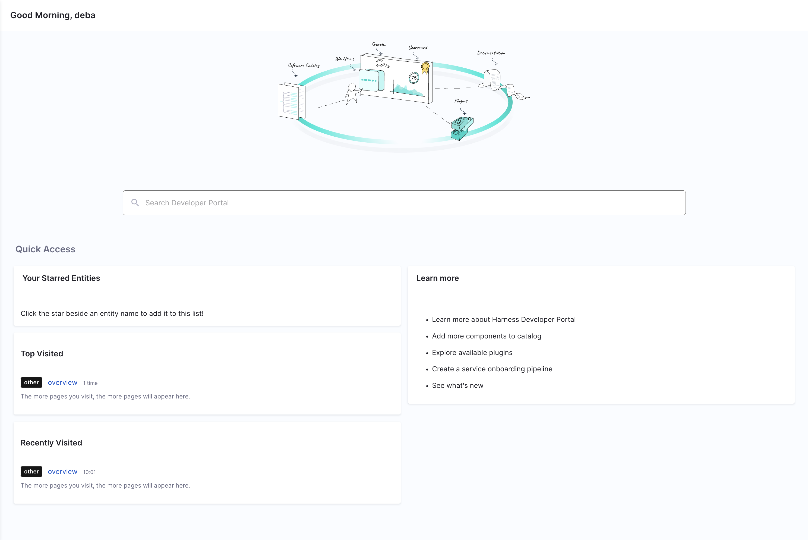

- New Parser for file contents of git providers(GitLab and Bitbucket) to support new data points in git-providers datasource. [IDP-1691]
- New data points added to extract, filter and match file contents in git providers data sources.[IDP-1682]

#### Fixed Issues

- Fixed data non-availability in Bar charts for single-component scorecards.[IDP-1698]

## November 2023

### Version 0.15.0

<!-- Nov 23, 2023 -->

Since last release, we have released some interesting docs and video tutorials to help you get started with Harness IDP:

- **Video Tutorial:** [How to use self-service-onboarding](https://youtu.be/0GoK3SD1rxs?si=1Z28hvZ9nihYtdmL), [How to register your software components in Software Catalog](https://youtu.be/YgtIMDGMzJE?si=wiFzozj8Zo9dEEOF)
- **Tutorial:** [How to add API docs in Harness IDP](https://developer.harness.io/docs/internal-developer-portal/get-started/add-api-docs)
- **Docs:** [Software System Model](/docs/internal-developer-portal/catalog/system-model), [API Spec Reference](https://developer.harness.io/docs/category/api-references)

#### New features and enhancements

- We have added a new overview page for [Scorecards](https://developer.harness.io/docs/internal-developer-portal/features/scorecard#scorecard-overview-page) and [Individual checks](https://developer.harness.io/docs/internal-developer-portal/features/checks-datasources#checks-overview) in the scorecards.[IDP-1480] [IDP-1481]

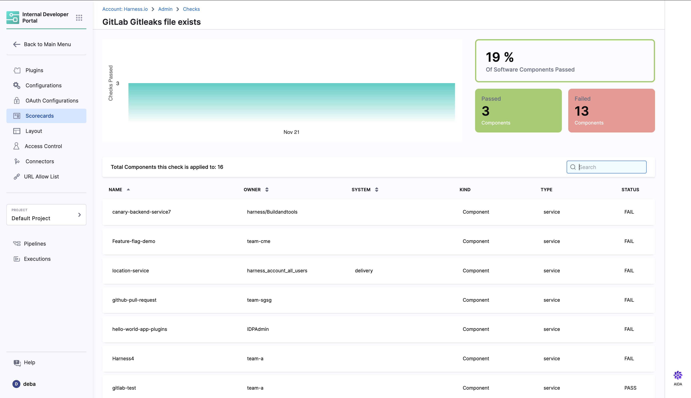
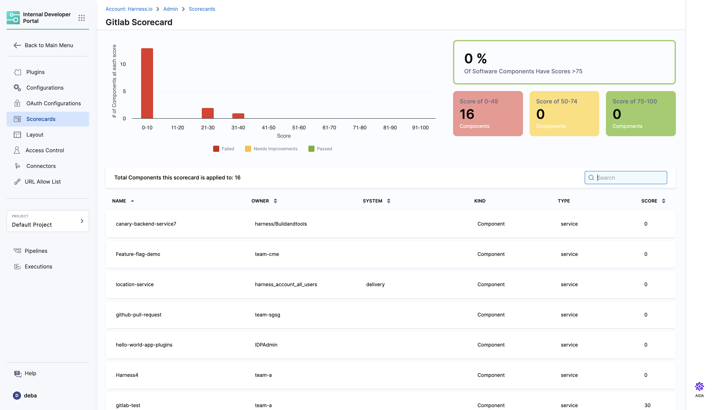

- The new overview pages for Scorecards and Checks have API support added to it.[IDP-1482]
- Added support for two new Plugins [OpsGenie](https://developer.harness.io/docs/internal-developer-portal/plugins/available-plugins/opsgenie) and [Datadog](https://developer.harness.io/docs/internal-developer-portal/plugins/available-plugins/datadog) Plugin.[IDP-1662] [IDP-1351]
- We have released a new [Harness Service Reliability Backstage Plugin](https://developer.harness.io/docs/internal-developer-portal/plugins/available-plugins/harness-srm), that tracks the SLOs and Error Budgets for monitored services in Harness SRM module

#### Fixed Issues

- Improved error scenario Handling in HarnessProcessor, with removal of irrelevant raw error metadata. [IDP-1663]
- Resolved the error related to creation of a new check having the same name as a deleted check. [IDP-1450]

### Version 0.14.0

<!-- Nov 7, 2023 -->

[Backstagecon](https://events.linuxfoundation.org/kubecon-cloudnativecon-north-america/co-located-events/backstagecon/) & Kubecon is round the corner, consider catching up with Harness' team in the event at **Booth B15**. Also here's a [sneak peak](https://www.harness.io/blog/road-to-backstagecon-2023-a-sneak-peek-into-an-exciting-lineup-a-recap-of-2022) of what's happening in this year's edition of the event. Here's some of the content updates:

- **Himanshu's(Product Manager for IDP) Backstagecon Talk:** [What Does Backstage Really Offer?](https://www.youtube.com/watch?v=4FTkeJY2Hcc)
- **Docs:** [Updated Onboarding Guide](/docs/internal-developer-portal/get-started/setup-git-integration/), [Public API](/docs/internal-developer-portal/api-refernces/public-api)
- **Tutorial:** [How to add Links in Software Components](/docs/internal-developer-portal/catalog/software-catalog)

#### New features and enhancements

- We've introduced more explicit error messages when removing secrets to ensure users are fully aware and cautious of this action. [IDP-1520]
- Backstage, powering the IDP platform has been upgraded to v1.17, take a look at the [release notes](https://backstage.io/docs/releases/v1.17.0) to find out the updates in this version.[IDP-1179]

#### Fixed Issues

- Fixed text overflows on the “Create Scorecards” page. [IDP-1417]
- Fixed page navigation for IDP get-started page by adding the exit icon. [IDP-1524]

## October 2023

### Version 0.13.0

<!-- Oct 26, 2023 -->

Post-Limited GA, we've taken your genius tips and mixed them into the Internal Developer Portal. Also, we've fixed a few bugs along the way. Dive in and see what's new! But before that here are some links of recently released tutorials and docs to help you get started with IDP.

- **Blogs:** [Got Monorepos Instead of Microservices? This is How Harness IDP Has Got You Covered](https://www.harness.io/blog/mono-repos-harness-idp)
- **Video Tutorial:** [Scorecards](https://youtu.be/jvLDdWS3rFE?si=EBoE9TXh4HCVNU3i)
- **Tutorial:** [How to register Software Components in Catalog](/docs/internal-developer-portal/get-started/register-a-new-software-component)
- **Docs:** [Scorecards](https://developer.harness.io/docs/internal-developer-portal/features/scorecard) and [Data Sources](https://developer.harness.io/docs/internal-developer-portal/features/checks-datasources)

#### New features and enhancements

- Scorecards now support additional data points for GitHub data source, to support advanced GitHub Security features and GitHub Actions [IDP-1408]

  - Advanced GitHub Security
    - Open Dependabot Pull Requests
    - Code Scanning
    - Security Scanning

  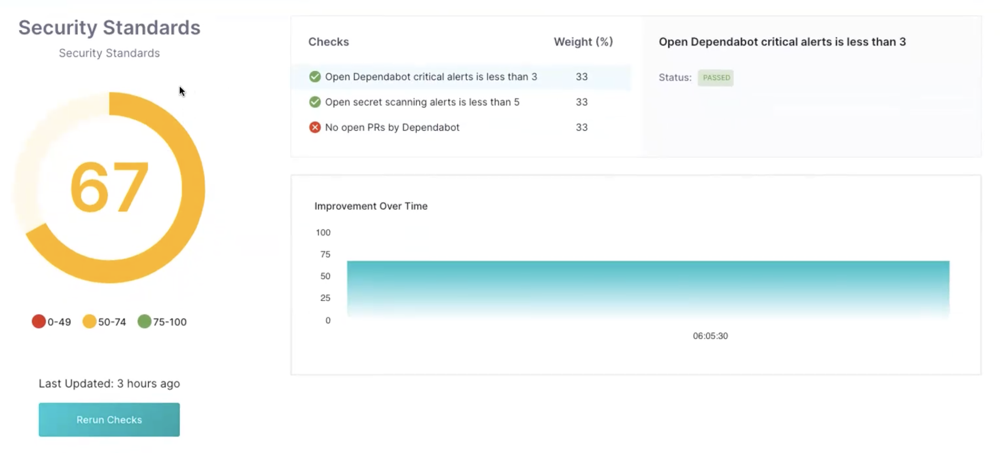

  - GitHub Actions
    - Workflow Count
    - Successful Workflows
    - Time to complete Workflows
  - Other
    - Number of open pull requests by author

- Improved Error message for DSL response to handle multiple input values [IDP-1410]

#### Fixed Issues

- Fixed connector selection issue in the onboarding wizard. [IDP-1363]
- Fixed the Operator for Jira Default Expression as `jira.issuesCount > 5` in Jira Plugin.[IDP-1357]
- Fixed Datapoint identifier mismatch[IDP-1152]

### Version 0.12.0

<!-- Oct 16, 2023 -->

IDP has now graduated from Beta. During [Unscripted](https://www.unscriptedconf.io/) in September, we made a series of announcements. Here are some quick links for your recap.

- [Launch Demo in Keynote](https://youtu.be/6OuK_sl3mLE?feature=shared&t=2065) by Jyoti Bansal and Eric Minick.
- [Platform Engineering Demo](https://youtu.be/c04F98kS96U?feature=shared&t=534) by Alex Valentine.
- [Announcement Blog Post](https://www.harness.io/blog/internal-developer-portal-public-preview) by Himanshu Mishra.

#### New features and enhancements

- Scorecards are now launched for everyone. It contains several data sources and data points within the framework. There are default checks for you to use. You can create custom checks as well. [Read more](https://developer.harness.io/docs/internal-developer-portal/features/scorecard), Watch this [video tutorial](https://youtu.be/jvLDdWS3rFE?feature=shared) to know more.
- Backstage is now upgraded to [v1.16](https://backstage.io/docs/releases/v1.16.0).
- [EntityRelationWarning](https://backstage.io/docs/reference/plugin-catalog.entityrelationwarning) is now available to be used in Layout. You can add this in your layout so that a warning alert is displayed if the entity has relations to other entities, which don't exist in the catalog. See **example**. [IDP-993]

```yaml
contents:
  - component: EntityRelationWarning
```

- New Plugins support available in IDP
  - Grafana - Associate alerts and dashboards to components. Read more [here](https://developer.harness.io/docs/internal-developer-portal/plugins/available-plugins/grafana) [IDP-915]
  - SonarQube - Components to display code quality metrics from SonarCloud and SonarQube. Read more [here](https://developer.harness.io/docs/internal-developer-portal/plugins/available-plugins/sonarqube) [IDP-1249]
- Every plugin page now has a plugin docs available. [IDP-923]

#### Fixed Issues

- Improved Error message when pipeline is configured wrong in IDP Software Templates. [IDP-1230]

## September 2023

### Version 0.8.0

<!-- Sept 25, 2023 -->

#### New features and enhancements

- IDP now includes the [GitHub Catalog Discovery](/docs/internal-developer-portal/plugins/available-plugins/github-catalog-discovery) plugin. You can use this to automatically discover `catalog-info.yaml` files from your GitHub organizations and repositories. [IDP-887]

- The following UI pickers are now available for use in software templates:

  - `HarnessOrgPicker`
  - `HarnessProjectPicker`

  You can use these UI pickers in service onboarding workflows for developers to easily select a Harness project and organization. Take a look at this [example](https://github.com/bhavya-sinha/scaffolder-sample-templates/blob/5f52718ec49cb2c27a87e2fbeae075873701911c/fieldExtension.yaml#L78-L85). [IDP-868]

## July 2023

### Version 0.7.0

<!-- July 27, 2023 -->

#### What's new

- IDP now includes the Confluence search plugin to include results from Confluence spaces. To learn more, go to the [plugin documentation](/docs/internal-developer-portal/plugins/available-plugins/confluence). (IDP-845)
- The `harness:create-secret` and `harness:delete-secret` template actions are now available for use in IDP software templates. You can use these actions to receive a secret from a developer, create a Harness secret, and then use it as a pipeline variable to provide runtime input. For more information, go to the [tutorial](/docs/internal-developer-portal/tutorials/using-secret-as-an-input) (IDP-780)
- The interval at which IDP polls Git repositories associated with the software catalog has increased from 5 minutes to 15 minutes. (IDP-749)

#### Fixed issues

- When you used a delegate to connect to a Git provider, the Docs tab failed to load, and the following message was displayed: `Failed to build the docs page: TAR_BAD_ARCHIVE: Unrecognized archive format`. (IDP-687)

  This issue is now fixed.

- If you used a GitHub connector that used a Github App for API authentication and if the private key was a text secret, the catalog import in IDP failed. The failure was caused by Harness Secrets Manager not storing the specified private key with line breaks, which IDP expects along with proper indentation. (IDP-850, ZD-47845)

  Harness Secrets Manager now formats text secrets properly for text secrets used with IDP.

### Version 0.6.0

<!-- July 12, 2023 -->

#### What's new

- You can now access IDP catalog APIs by using the Harness X-API-Key. For more information, go to [API access](/docs/internal-developer-portal/catalog/software-catalog#api-access). (IDP-768)
- A newer version of the Harness CI/CD plugin has been added with new annotations support. It's now possible to filter pipelines across projects and orgs. For more information, go to the [plugin's readme](https://github.com/harness/backstage-plugins/tree/main/plugins/harness-ci-cd). (IDP-758)
- The Harness Feature Flags [plugin](https://github.com/harness/backstage-plugins/tree/main/plugins/harness-feature-flags) is now available in IDP. (IDP-778)
- The `trigger:harness-custom-pipeline` action on the software template `template.yaml` is now synchronous with pipeline execution. The action keeps running during pipeline execution, and it shows the current status of the pipeline.
- Since the `trigger:harness-custom-pipeline` is now synchronous, you can use the `catalog:register` action in a template and register the newly generated software component's `catalog-info.yaml`.

#### Fixed issues

- Fixed a bug with access control around de-registering a software component. (IDP-757)

## June 2023

### Version 0.5.0

#### What's new

- The Backstage version has been upgraded to [1.14](https://backstage.io/docs/releases/v1.14.0). (IDP-632)
- The following GitHub-based plugins are now available in IDP:
  - [GitHub Actions](https://github.com/backstage/community-plugins/tree/main/workspaces/github-actions/plugins/github-actions#github-actions-plugin)
  - [GitHub Insights](https://github.com/RoadieHQ/roadie-backstage-plugins/tree/main/plugins/frontend/backstage-plugin-github-insights)
  - [GitHub Pull Requests](https://github.com/RoadieHQ/roadie-backstage-plugins/tree/main/plugins/frontend/backstage-plugin-github-pull-requests).
- IDP now includes support for GitHub and Google OAuth applications. You can configure a GitHub or Google OAuth application in the IDP Admin view. These applications are used by the GitHub-based plugins to use the logged-in user's credentials when making API requests. (IDP-676, IDP-661, IDP-647)
- IDP now supports a URL allowlist. If the `catalog-info.yaml` references API definitions that are hosted on a provider other than your Git provider, add the URL to the allowlist. (IDP-648)

#### Fixed issues

- Improvements have been made to reduce the time required for onboarding to the IDP module. (IDP-649)
