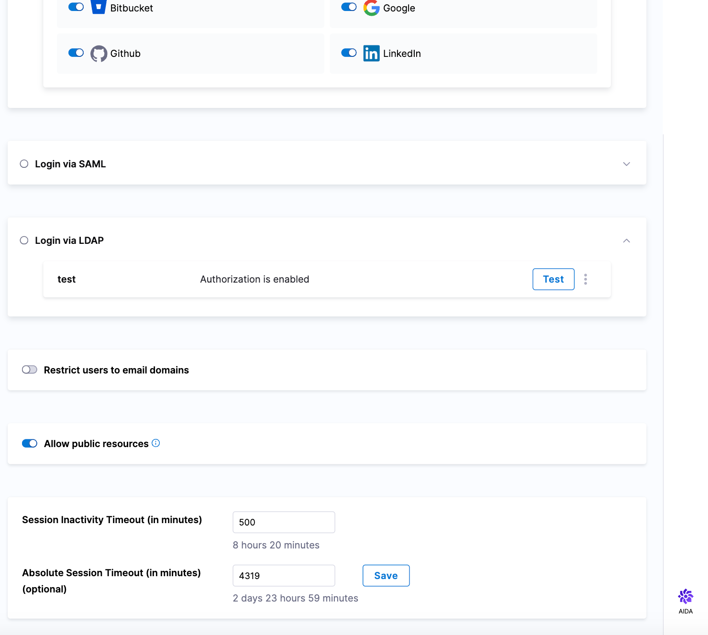
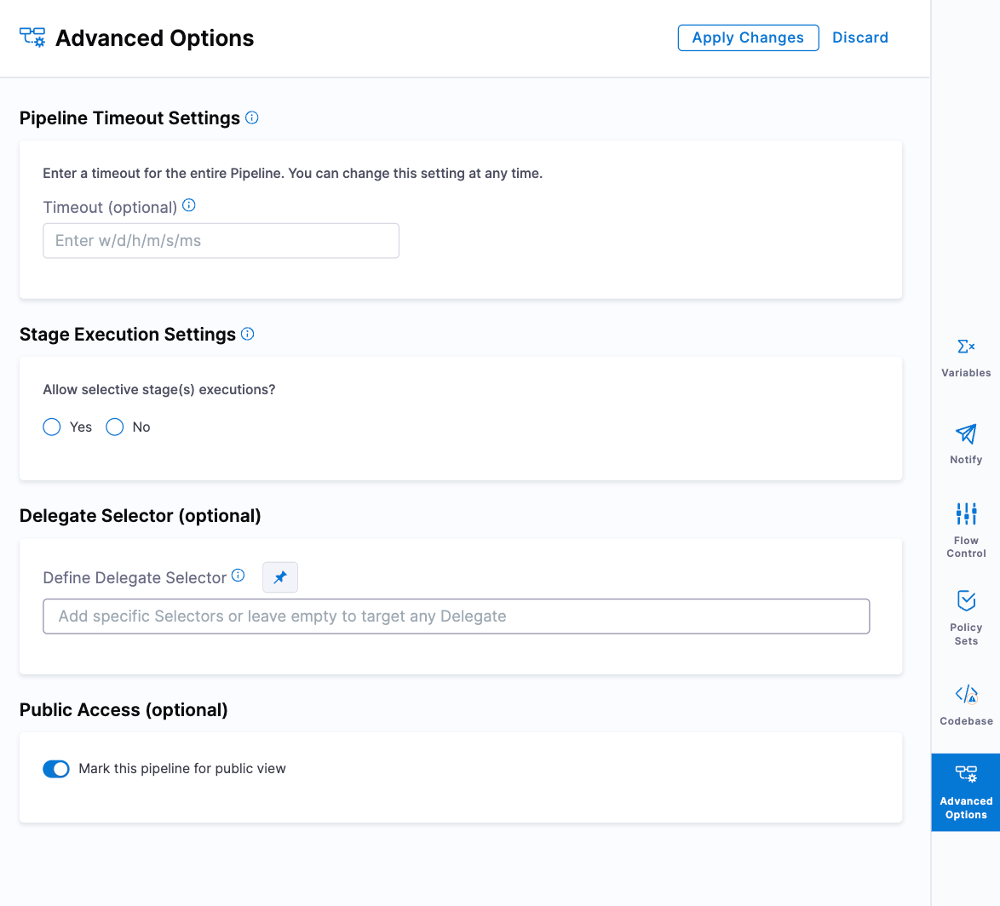
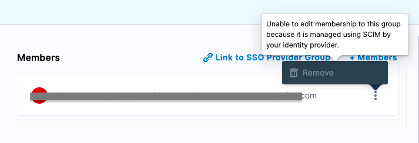
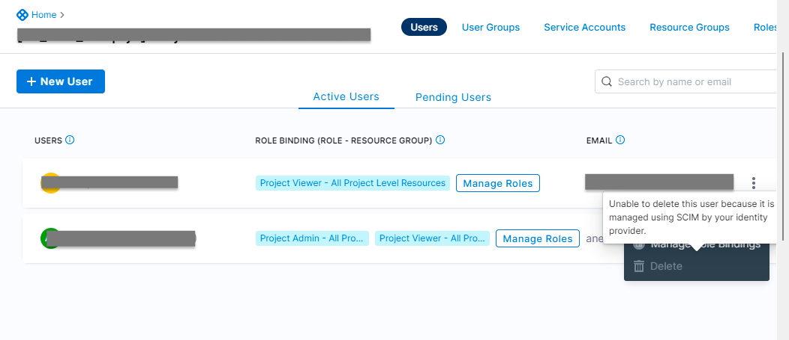
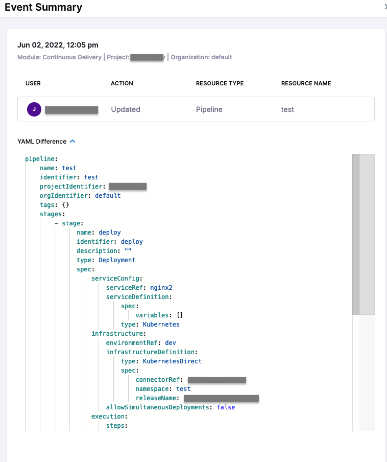
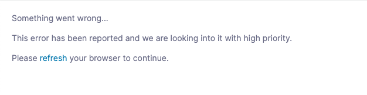

import Tabs from '@theme/Tabs';
import TabItem from '@theme/TabItem';

import delete_project from './static/delete-project.png'

<DocsButton icon = "fa-solid fa-square-rss" text="Subscribe via RSS" link="https://developer.harness.io/release-notes/platform/rss.xml" />

These release notes describe recent changes to Harness Platform.

:::info About Harness Release Notes

* **Progressive deployment:** Harness deploys changes to Harness SaaS clusters on a progressive basis. This means that the features described in these release notes may not be immediately available in your cluster. To identify the cluster that hosts your account, go to your **Account Overview** page in Harness. In the new UI, go to **Account Settings**, **Account Details**, **General**, **Account Details**, and then **Platform Service Versions**.
* **Security advisories:** Harness publishes security advisories for every release. Go to the [Harness Trust Center](https://trust.harness.io/?itemUid=c41ff7d5-98e7-4d79-9594-fd8ef93a2838&source=documents_card) to request access to the security advisories.
* **More release notes:** Go to [Harness Release Notes](/release-notes) to explore all Harness release notes, including module, delegate, Self-Managed Enterprise Edition, and FirstGen release notes.

:::

## Important feature change notice

:::info important
This is a notification for a feature change aimed at enhancing your experience with Harness. Here's what you need to know:

1. Harness uses connectors to external secret managers (e.g. Google Secret Manager or Hashicorp Vault) to resolve/store secrets used by pipelines and elsewhere in the Harness platform. External secret manager connectors require configuration, including a means to authenticate to the external Secret Manager. On **December 11, 2023**, Harness added a restriction that users can **only use Harness Built-in Secret Manager to store authentication credentials** for access to the corresponding Secret Manager.

2. **Continuity Assured**: There is no impact on your existing pipelines. They remain compatible with the way secrets were referenced before this feature change. Note that this includes using an external secret manager other than the Harness Built-in Secret Manager to store the authentication secret.

:::

#### Why did Harness make this change?

Our previous setup allowed configurations where credentials from one secret manager were stored within another, resulting in complexities that could be challenging to navigate. Moreover, these configurations might introduce vulnerabilities, posing potential security risks. For example, in a recent [incident](https://status.harness.io/incidents/w2w7btby70xs), our thread pool designated for secret manager resolution was exhausted.

Moving forward, we've implemented several validations, such as the disabling of self-references. Furthermore, with the introduction of the aforementioned restriction on secret managers, configurations is simpler to comprehend and maintain. This change aims to streamline the process, enhancing clarity and reducing potential security vulnerabilities.

Below is further explanation for each type of secret manager Harness currently supports and the changes associated with it.

1. Harness supports three authentication methods for **AWS Key Management Service (KMS)** and **AWS Secrets Manager**:

   1.  AWS Access Key: Access Key Id, Secrets Access Key, and AWS ARN need to be stored in Harness Built-in Secret Manager.

   2.  [Assume IAM role on delegate](/docs/platform/secrets/secrets-management/add-an-aws-kms-secrets-manager/#option-assume-iam-role-on-delegate): AWS ARN must be stored in Harness Built-in Secret Manager.

   3.  [Assume Role using STS on delegate](/docs/platform/secrets/secrets-management/add-an-aws-kms-secrets-manager/#option-assume-role-using-sts-on-delegate): AWS ARN must be stored in Harness Built-in Secret Manager.

2. Harness supports the following five authentication methods for **Hashicorp Vault**:

   1. AppRole secret IDs must be stored in the Harness Built-in Secret Manager.
   2. Token secret IDs must be stored in the Harness Built-in Secret Manager.
   3. AWS Auth secret IDs must be stored in the Harness Built-in Secret Manager.
   4. Vault Agent: Secret storage is not required in the Harness Built-in Secret Manager.
   5. Kubernetes Auth: Secret storage is not required in the Harness Built-in Secret Manager.

3. Harness supports two authentication methods for **Azure Key Vault**:
   1. With the credentials option, the Azure Authentication key must be stored in the Harness Built-in Secret Manager.
   2. With the credentials of a specific Harness Delegate option, secret storage is not required in Harness Built-in Secret Manager.

4. Harness supports only one authentication method for **GCP Key Management Service**, for which the GCP KMS Credentials file must be stored in the Harness Built-in Secret Manager.

5. Harness supports two authentication methods for **GCP Secrets Manager**:
   1. With the credentials option, the Google Secrets Manager Credentials File must be stored in the Harness Built-in Secret Manager.
   2. With the credentials of a specific Harness Delegate option, secret storage is not required in Harness Built-in Secret Manager.

6. For **Custom Secrets Manager**, if any secret is needed in the template as a variable, then it can only be stored in the Harness Built-in Secret Manager.

## Deprecation notice

The following deprecated API endpoints are longer supported:
- [GET | PUT | POST | DELETE] api/resourcegroup/\{identifier}
- POST api/resourcegroup/filter
- GET api/resourcegroup

## July 2024

### Version 1.48.8<!-- July 23, 2024 -->

#### New features and enhancements

- Upgraded the `io.netty_netty-codec-http` library to address a medium-severity issue. The version has been updated from 4.1.101.Final to 4.1.108.Final. (PL-51350)

- Upgraded the `org.apache.cxf_cxf-core` library from version 3.5.5 to 3.5.8 to address a medium-severity issue CVE-2024-28752. (PL-51348, ZD-66657)

- Reduced delegate liveness probe failure time. Previously, delegates had a 15-minute window to send heartbeats before the liveness probe failed, leading to a delegate restart. This time has now been reduced to 5 minutes to ensure quicker detection and response to heartbeat failures. This item requires Harness Delegate version 24.07.83605. For information about Harness Delegate features that require a specific delegate version, go to the [Delegate release notes](/release-notes/delegate). (PL-52037)

#### Fixed issues

- Clicking a role after scrolling distorted the viewport. The issue with viewport distortion on the Roles page has been fixed. (PL-52063, ZD-65768)

- Tokens could not be created via API from the API docs because the required fields were missing. Added the necessary required fields to the Create a Token page in the API docs, allowing tokens to be successfully created via the API. (PL-51974, ZD-65569)

- The **Cancel** button was not working while creating a connector via YAML. Updated the behavior of the Connectors page YAML editor to match that of other pages. The **Discard** button on the YAML editor page now exits back to the previous page. (PL-42928)

- Legacy delegates were unable to download the SCM binary. This issue has been resolved. (PL-55263, ZD-66357, ZD-66361)

- Users were not being created in Harness FirstGen after being provisioned in NextGen. Updated the user provision field to ensure that users are properly created in Harness FirstGen after being provisioned in NextGen. (PL-52142, ZD-65604)

- Users encountered a `Media not found` error when clicking the **+Dashboard** button and in the **About the Dashboard** dialog. Removed missing Dashboard tutorial videos, resolving the `Media not found` error. (PL-50890)

### Version 1.45.5<!-- July 10, 2024 -->

#### New features and enhancements

- The `terminationGracePeriodSeconds` for delegates has been increased from 10 minutes to one hour. This enhancement allows delegate pods to wait up to an hour before being forcibly terminated during regular scale-downs or upgrades, ensuring smoother transitions and minimizing potential disruptions. (PL-51534, ZD-63917)

- Added support for Harness Secret Manager decryption for notifications. Harness-managed secrets used in notifications are now decrypted using Harness Manager, enhancing security and functionality. (PL-41880)

- Modified the unique index for delegate token names. The default token name in each scope will now be `default_token` instead of `default_token_org/project`. This change applies only to new projects and organizations; existing projects and organizations will retain their current token names. This item requires Harness Delegate version 24.07.83404. For information about Harness Delegate features that require a specific delegate version, go to the [Delegate release notes](/release-notes/delegate). (PL-51151)

#### Fixed issues

- Connectors could be deleted even if they had existing secrets. This issue has been resolved, and now AWS Secret Manager Connectors cannot be deleted if they contain existing secrets. (PL-52067, ZD-65772)

- Resource Scope was deleting projects. Searching for a project and then selecting it would remove all previously selected projects. Improved the project selection process in org scope Resource Groups to match the flow of project selection in account scope Resource Groups. This change resolves the issue and ensures previously selected projects remain intact when new ones are added. (PL-51988, ZD-65620)

- Public access on resources was not functioning correctly when a project had multiple public resource types. Only the first resource type marked as public was registered internally in Access Control. This issue has been resolved. Now, public access is correctly registered for all resource types marked as public within a project, ensuring that every public resource type works as expected. (PL-51797)

- SSH type deployment errors were not providing clear information, and delegate tasks continued beyond the maximum broadcast rounds. The issue has been resolved by failing the delegate task after the maximum broadcast rounds are completed. A correct error message will now be displayed to improve clarity. (PL-51241)

- The **Explore Plans** button failed to redirect to the Plans page. Resolved the button routing issue to ensure the **Explore Plans** button now correctly redirects to the Plans page. (PL-49190, ZD-62009)

- New users accepting an invitation and landing on the Get Started page encountered a 404 error. New users will now be redirected to the correct page upon accepting an invitation. (PL-51173) 

## June 2024

### Version 1.43.5<!-- June 28, 2024 -->

#### New features and enhancements

- Harness has improved the sorting functionality for the User Group List API. Previously, sorting was based exclusively on the `lastModifiedAt` timestamp, managed by Spring, with millisecond precision. This approach assumed that no two entities would share the same `lastModifiedAt` timestamp. Harness has introduced a secondary sort field to act as a tiebreaker. This adjustment ensures a consistent and reliable order across queries, improving the overall stability and accuracy of paginated results. (PL-48886, ZD-61135)

#### Fixed issues

- The CI module on the Subscriptions page didn't display the **Available credits** summary card and **Credits breakdown** table. You can now view the **Available credits** summary card and **Credits breakdown** table when `PL_ENABLE_LICENSE_USAGE_COMPUTE` is disabled. When the flag is enabled, the summary card and table are moved to the Cloud Credits page instead of Subscriptions page. (PL-51838, ZD-65108)

### Version 1.42.4<!-- June 20, 2024 -->

#### New features and enhancements

- `upgrader_enabled` is now set to `true` in the Terraform delegate download section of the UI gen installation file to enable automatic upgrades. (PL-51681)

- Due to a bug, users could be added to SSO linked User Groups from the Harness UI, which should not be allowed. The addition of users to any SSO linked user groups from the Harness UI is now restricted. (PL-51431)

#### Fixed issues

- Performing actions within embedded dashboards now refreshes the user's active session, preventing unexpected logouts. (PL-50534, ZD-62334)

- Kubernetes services were created during the startup of the delegate, causing the IP pool to be exhausted for NAB. The delegate has been updated to prevent the creation of Kubernetes services upon startup, resolving the issue with IP pool exhaustion. This item requires Harness Delegate version 24.06.83304. For information about Harness Delegate features that require a specific delegate version, go to the [Delegate release notes](/release-notes/delegate). (PL-51550)

- Delegates were running out of memory due to frequent connectivity checks. Optimized the connectivity check process to reduce memory usage, preventing the delegate from running out of memory. This item requires Harness Delegate version 24.06.83304. For information about Harness Delegate features that require a specific delegate version, go to the [Delegate release notes](/release-notes/delegate). (PL-51418, ZD-63705)

### Version 1.41.6<!-- June 14, 2024 -->

#### New features and enhancements

- Service Account name and email fields are now exposed in the Role Assignment filter API, enhancing visibility and management. For more information, go to [List Role Assignments by scope filter](https://apidocs.harness.io/tag/Role-Assignments/#operation/getFilteredRoleAssignmentByScopeList). (PL-50613)

- Harness added v1 API support for `template-service`, `ng-manager`, `platform-service`, and `pipeline-service` for Istio >= 0.19.0 version. If you are running Istio >= 1.19.0, add the following override in your `override.yaml` file to enable the support. (PL-50528, ZD-62230, ZD-62846)

   ```yaml
   global:
     istio:
       enableRegexRoutes: true
   ```

#### Fixed issues

- Harness recently made to allow hyphens in the secret identifier. However, the internal validation in the pipeline was not updated, which caused an error when the secret identifier was passed in the pipeline. This issue has been resolved to ensure the internal validation as well for secret identifiers containing a hyphen. (PL-51073)

- Incorrect filters were displayed for the `includeScopes` field in Resource Groups in the Harness UI. While it was possible to add only project-level resources to a Resource Group via API, this option was not available through the UI. An **Include Org-level resources** option is now available in the UI. Users can now uncheck this option to include only project-level resources in a Resource Group, without including Org-level resources, addressing the previously unsupported use case. (PL-50969, ZD-62817)

- Delegate logs were displaying entire bearer tokens when using the IDP connector. Added log sanitization to delegate logs to mask commonly used secret patterns. These patterns can be extended per-use-case by adding them to the `/opt/harness-delegate/sanitize-patterns.txt` file inside the delegate. This item requires Harness Delegate version 24.06.83003. For information about Harness Delegate features that require a specific delegate version, go to the [Delegate release notes](/release-notes/delegate). (PL-47914, PL-50889, ZD-64069)

## May 2024

### Version 1.39.4<!-- May 30, 2024 -->

#### Fixed issues

- Keyboard navigation was not functioning for the **Add Users** list when adding a new member to a user group, and uncontrolled form submission occurred when pressing Enter. Updated the **Add Users** list to support keyboard navigation. Additionally, the form now properly handles uncontrolled submissions when the Enter key is pressed, allowing users to select items using the keyboard without unintended form submissions. (PL-51168, ZD-62169)

- Due to a bug, users could be added to SCIM-provisioned/externally managed user groups from the Harness UI, even though membership edits for externally managed groups were not allowed. The issue has been fixed, and adding users to externally managed user groups via the Harness UI is no longer supported. (PL-50663)

### Version 1.38.2<!--  May 20, 2024 -->

#### Fixed issues

- Invalid user search results were returned when querying from page `2` or higher. Harness updated the search functionality to reset the `pageIndex` to `0` after adding or updating a search query, ensuring accurate search results even when the `pageIndex` is `2` or higher. (PL-50907, ZD-62990)

- Delegate registration was not failing for inactive accounts. Harness added a check during delegate registration to verify account status. Delegates will now fail to register for accounts marked as `DELETED` or `INACTIVE`. This item requires Harness Delegate version 24.05.83001. For information about Harness Delegate features that require a specific delegate version, go to the [Delegate release notes](/release-notes/delegate). (PL-48082)

### Version 1.37.7<!--  May 14, 2024 -->

#### Fixed issues

- An `UUID may not be empty` error occurred when configuring LDAP settings. This was due to the LDAP identifier being sent as an empty string instead of null if it didn't already exist. The issue has been resolved, and the identifier is now correctly sent as null, preventing the error. (PL-50657)

- The `getUserGroupList` API was returning inconsistent results, such as missing groups, due to issues with the sorting functionality based solely on the `lastModifiedAt` timestamp. We've enhanced the sorting mechanism in the User Group List API by introducing a secondary sort field to serve as a tiebreaker. This ensures consistent and reliable ordering across queries, significantly improving the stability and accuracy of paginated results. (PL-48886, ZD-61135)

- Login issues occurred in NextGen when FirstGen delegates were scaled down because the LDAP Authentication task was initially sent to FirstGen Delegates. If a FirstGen delegate wasn't available, the task would expire before being sent to a NextGen delegate. Compounding the issue, the timer at the Gateway was set to expire before the delegate task, leading to failed login attempts. We have implemented a solution that prioritizes sending the LDAP Authentication task to NextGen delegates first if the feature flag `PL_USE_NG_DELEGATE_LDAP_AUTH` is enabled, thereby enhancing the reliability of login processes in NextGen environments. (PL-48541, ZD-60437)

- Pod Disruption Budgets (PDBs) in the Harness namespace caused issues during patching cycles due to incorrectly targeted rules. Harness updated PDB rules for the `cloud-info`, `anomaly-detection`, `gateway`, and `next-gen-ui` services to select the correct pods, ensuring smooth operations during maintenance activities. (PL-49350, ZD-62353)

### Version 1.36.5<!--  May 06, 2024 -->

#### Fixed issues

- When adding users to a User Group, the search string persisted in the input field even after a user was selected. We have updated the User Group Form page to automatically clear the search query once a user is selected, enhancing usability. (PL-49256, ZD-62169)

- Account admins, with permissions to assign roles, could assign any available role to any user, group, or service account, leading to concerns over control and governance. We have introduced a new feature flag, `PL_HIDE_ACCOUNT_LEVEL_MANAGED_ROLE`, which, when enabled, restricts the visibility of account-level Harness-managed roles. This flag is disabled by default to maintain existing permissions structures across all accounts. (PL-43907)

- Delegates with mTLS enabled were able to send a heartbeat to Harness Manager despite being configured with a non-agent endpoint. Resolved this by ensuring the `isNg` flag is correctly propagated when delegates send heartbeats to Harness Manager. This item requires Harness Delegate version 24.04.82901. For information about Harness Delegate features that require a specific delegate version, go to the [Delegate release notes](/release-notes/delegate). (PL-48891, ZD-60974)

- Intermittent socket timeout exceptions occurred in running pipelines due to secret decryption failures, triggering unnecessary re-broadcasts on the delegate side. Resolved the issue of intermittent secret decryption failures within pipelines, ensuring stable and uninterrupted pipeline execution. This item requires Harness Delegate version 24.04.82901. For information about Harness Delegate features that require a specific delegate version, go to the [Delegate release notes](/release-notes/delegate). (PL-47940, ZD-58006)

- Local login was failing for users assigned admin permissions via a user group. The method to verify if a user is an account admin only considered direct user assignments and did not account for user group roles. Revised the validation process to include both user and user group assignments when checking for admin status. Now, to be recognized as an admin, users must have the specific role assignments outlined below; assigning the `_account_admin` role alone is no longer sufficient for admin rights.

   - Role: `_account_admin`.

   - Resource-group: `_all_resources_including_child_scopes`, `_all_account_level_resources`.

   This item requires Harness Delegate version 24.04.82901. For information about Harness Delegate features that require a specific delegate version, go to the [Delegate release notes](/release-notes/delegate).

## April 2024

### Version 1.34.2<!--  April 23, 2024 -->

#### Fixed issues

- The link to Slack on the UI Help section was not functioning. The community link has been updated to ensure it works correctly. (PL-48948, ZD-61203)

- When a new pipeline for approval was created, but the approval email was not being sent, preventing testing of the link within the approval email. Resolved this issue that prevented notifications from being sent to multiple emails configured in a user group for email notifications. (PL-48854, ZD-60366, ZD-61333)

- 2FA reset emails failed to display the QR code properly due to the recent deprecation of Google APIs. The method for generating QR codes has been updated, resolving the issue and ensuring QR codes are now correctly included in 2FA reset emails. This item requires Harness Delegate version 24.04.82804. For information about Harness Delegate features that require a specific delegate version, go to the [Delegate release notes](/release-notes/delegate) (PL-48980, ZD-61314, ZD-61420, ZD-61486)

### Version 1.33.5<!--  April 16, 2024 -->

#### New features and enhancements

- We've added an optional registry mirror configuration for delegate `upgrader`. If you use Docker pull through registry cache (`https://docs.docker.com/docker-hub/mirror/`), you can configure `upgrader` to use an optional registry mirror for your delegate images. For more information, go to [Configure an optional registry mirror for delegate images](/docs/platform/delegates/install-delegates/delegate-upgrades-and-expiration#configure-an-optional-registry-mirror-for-delegate-images). This item requires Harness Delegate version 24.04.82707. For information about Harness Delegate features that require a specific delegate version, go to the [Delegate release notes](/release-notes/delegate). (PL-47920, ZD-59005)

- AWS Secret Manager connectors now support both plain text and encrypted type Access Key Ids. (PL-48420)

- Docker delegate images are no longer pushed to `app.harness.io/registry`. To pull images, use `gcr.io/gcr-prod/harness/delegate:<IMAGE_TAG>`. This item requires Harness Delegate version 24.04.82707. For information about Harness Delegate features that require a specific delegate version, go to the [Delegate release notes](/release-notes/delegate). (PL-46947)

#### Fixed issues

- 2FA reset emails failed to display the QR code properly due to the recent deprecation of Google APIs. The method for generating QR codes has been updated, resolving the issue and ensuring QR codes are now correctly included in 2FA reset emails. This item requires Harness Delegate version 24.04.82707. For information about Harness Delegate features that require a specific delegate version, go to the [Delegate release notes](/release-notes/delegate). (PL-48980, ZD-61314, ZD-61420, ZD-61486)

- Email steps were failing due to the system's inability to find users with emails containing uppercase letters, as Harness converts and stores all emails in lowercase. (PL-48532, ZD-60291)

- Reset password emails were being sent from the FirstGen system for all accounts, causing issues for accounts that are exclusively NextGen. Now, if an account is identified as NextGen only, the reset password emails are dispatched from the NextGen system, rectifying the issue for NextGen only accounts. (PL-38735)

- Slack channel notifications failed due to an error related to explicitly setting the "Host" header as "hooks.slack.com". We have removed the explicit "Host" header setting to support both Slack-specific webhook URLs and regular URLs, resolving the issue in this version. This item requires Harness Delegate version 24.04.82707. For information about Harness Delegate features that require a specific delegate version, go to the [Delegate release notes](/release-notes/delegate). (PL-47914)

- Delegate utilization metrics failed to decrease below a set threshold, even when rejecting all tasks. To solve this, memory-based threshold checks have been removed from the delegate due to functional discrepancies. This item requires Harness Delegate version 24.04.82707. For information about Harness Delegate features that require a specific delegate version, go to the [Delegate release notes](/release-notes/delegate). (PL-48781, ZD-60713)

- In SCIM, creating a new user with special characters in their name failed, preventing the user from being added to Harness and resulting in discrepancies in user group membership between the Identity Provider and Harness. This item requires Harness Delegate version 24.04.82707. For information about Harness Delegate features that require a specific delegate version, go to the [Delegate release notes](/release-notes/delegate).  (PL-47614)

- The audit trail filter did not include an option for the **Token** resource type, hindering the ability to filter for API token updates. Added a **Token** filter option to the audit trail, enabling users to specifically filter for Token & API Key updates through a dropdown menu. (PL-48606)

- Users experienced authentication issues when switching the OAuth type from SAML, leading to incorrect OAuth authentication status displays. Implemented changes to accurately reflect the status (enabled or disabled) of OAuth authentication for users. (PL-48788, ZD-60869)

- The feature flag subscription indicated it was expired, and the license was not updating automatically. Users had to manually pay each invoice after the billing cycle was completed. Users can now view the correct billing due date on their subscription page. Additionally, the system has been updated to automatically charge the credit card on file when an invoice is generated. (PL-48671, ZD-57836)

- The delegate task rejection metric was designed to reflect tasks rejected by a delegate due to system-related reasons (such as lack of resources or exceeding the limit of parallel tasks) but did not include specific details like task type or task ID. Enhanced the task rejection metrics by adding `taskType` and `taskId` labels. This item requires Harness Delegate version 24.04.82707. For information about Harness Delegate features that require a specific delegate version, go to the [Delegate release notes](/release-notes/delegate). (PL-48488)

- Users were being logged out when testing a Git connector with invalid credentials due to the Git client's 401 response being propagated to the UI. Implemented error handling to convert a 401 response from the test connection step to a 400, while preserving the original error message, preventing unintended user logouts. This item requires Harness Delegate version 24.04.82707. For information about Harness Delegate features that require a specific delegate version, go to the [Delegate release notes](/release-notes/delegate). (PL-47753, ZD-58629)

### Version 1.31.4<!--  April 3, 2024 -->

<!-- On RN list, but will not be part of the 1.31.x release per Bharat

#### New features and enhancements

- Harness now automatically revokes delegate tokens that have not been used by any delegate in the last 30 days. (PL-47602)
-->

#### Fixed issues

- Fixed an issue where the **Delegate Selector** dropdown wasn't populating delegates when roles were configured with specific delegates instead of all. (PL-48292, ZD-59504)

- Fixed an issue where the scope was derived from the open URL instead of the WinRM Secret's scope when editing WinRM secrets through a reference component, causing secret edits to fail. Scope details are now picked up from the WinRM secret being edited. (PL-48323)

## March 2024

### Version 1.30.7<!--  March 26, 2024 -->

#### New features and enhancements

- `harness-ingress-controller` arguments are now configurable through overrides. (PL-46366, ZD-55035)

   They can be controlled by the following YAML configuration.

    ```yaml
    nginx:
      controller:
        watchNamespace: ""
        updateStatus: true
        httpPort: 8080
        httpsPort: 8443
        watchIngressWithoutClass: true
        defaultSSLCertificate: ""
        configMap: ""
        defaultBackendService: ""
        publishService: ""
        electionId: ""
        controllerClass: ""
    ```

    - You can provide any extra arguments like this:

       ```yaml
       nginx:
         controller:
           extraCommandArgs:
             - --argument=example-argument
       ```

    - Ingress controller can now be deployed with a `ClusterRole`:

       ```yaml
       nginx:
         clusterRole:
           create: true
       ```

- In the recent update to `ng-manager` version 1.28.0, we have implemented enhancements to the validation mechanism for secret identifiers. We now provide more flexibility and precision in validating secret identifiers, particularly regarding hyphen usage. While previously disallowed, secret identifiers can now contain hyphens. However, there are specific rules governing their usage. Hyphens are now permitted anywhere in the secret identifier, including at the end of the string. The updated validation allows for multiple occurrences of hyphens within the secret identifier. Secret identifiers cannot start with a hyphen, following best practices. This item requires Harness Delegate version 24.03.82600. For information about Harness Delegate features that require a specific delegate version, go to the [Delegate release notes](/release-notes/delegate). (PL-46959)

- 'Secret Identifier' will now allow `-` (hyphen) when provided as user input. For more information, go to [Entity identifier reference](https://developer.harness.io/docs/platform/references/entity-identifier-reference/) (PL-48009)

#### Fixed issues

- The delegate metrics endpoint `/api/metrics` had its content type set as `application/json`, causing scraping issues with certain versions of Prometheus due to content type incompatibility. Attempts to switch to text/plain resulted in a 406 response code. We have revised the endpoint to deliver metrics in `plainText`. You can now specify the desired content format `plainText` or `JSON` by setting the "Accept" header in your request, ensuring broader compatibility with different Prometheus versions. This item requires Harness Delegate version 24.03.82600. For information about Harness Delegate features that require a specific delegate version, go to the [Delegate release notes](/release-notes/delegate). (PL-46976, ZD-57489)

- Actions to create, edit, or delete Streaming Destinations were not being recorded in Audit Trails. This issue has been fixed, and these actions are now correctly captured in Audit Trails. (PL-47910)

### Version 1.29.6<!--  March 18, 2024 -->

#### Fixed issues

- Upgrade attempts from Harness Helm Chart 0.13.4 to 0.14.0 or 0.14.1 resulted in change-data-capture pod failures. We have resolved the initialization issue with the change-data-capture pod, which stemmed from the fileLogging parameters. (PL-47993)

- In the old Git sync flow, the system failed to fetch connector details because the `branch` and `yamlGitRef` attributes were not included in the query process after the method was changed to utilize scope uniqueId and identifier. We have updated the system to account for the `branch` and `yamlGitRef` parameters, ensuring connector details now load correctly. (PL-47942, ZD-58953, ZD-59089)

- The user aggregate API did not support selected view permissions, leading to errors when a user was granted view permission for specific user groups due to the lack of permissions on the `USERGROUP` resource as a whole. We have resolved this issue by allowing users to be granted view permissions for selected user groups. Now, only those user groups specified will be visible to the user. (PL-31279)

- For customers who need to bypass mutual TLS (mTLS) authentication for Current Generation (CG) delegates, even with strict mode enabled on the account, Harness has introduced the feature flag `PL_DISABLE_MTLS_CHECK_ON_CG_DELEGATES`. This update allows specific disabling of mTLS checks for CG delegates, providing greater flexibility in security settings. (PL-47825, ZD-58762, ZD-60565)

### Version 1.28.11<!--  March 13, 2024 -->

#### New features and enhancements

- You can now add multiple emails to User Group notifications. This support allows you to include Harness Users or add emails separated by commas. (PL-46480)

- The UI has been updated to include an HTTP Event Collector (HEC) Auth Token option in the Splunk Connector, allowing users to select HEC-type authentication. (PL-46977)

- Upgraded `org.eclipse.jetty.*` from v9.4.53.v20231009 to 9.4.54.v20240208. (PL-47854)

- The delegate list page now shows the latest delegate version beside the **New Delegate** button. This will help you compare your delegate version with the latest supported delegate version. This item is available with Harness Platform version 1.28.11 and does not require a new delegate version. For information about Harness Delegate features that require a specific delegate version, go to the [Delegate release notes](/release-notes/delegate). (PL-47049)

<!-- Commented out because this item is on the list for 1.30.7 RN with a delegate dependency for version 24.03.82600
- In the recent update to `ng-manager` version 1.28.0, we have implemented enhancements to the validation mechanism for secret identifiers. We now provide more flexibility and precision in validating secret identifiers, particularly regarding hyphen usage. While previously disallowed, secret identifiers can now contain hyphens. However, there are specific rules governing their usage. Hyphens are now permitted anywhere in the secret identifier, including at the end of the string. The updated validation allows for multiple occurrences of hyphens within the secret identifier. Secret identifiers cannot start with a hyphen, following best practices. (PL-46959)
-->

- OPA policy enforcement has been introduced to three new entities, namely Service Accounts, API Keys, and Tokens. For Service Accounts and API Keys, naming convention policies are enforced, while for Tokens, Time-To-Live (TTL) policies are enforced. These enforcement mechanisms are seamlessly integrated into both create and update operations, ensuring adherence to predefined standards during the onSave action. (PL-41877)

- Introduced separate environment variables to manage delegate resource thresholds for CPU and Memory when dynamic handling is enabled. Use `CPU_USAGE_THRESHOLD` for CPU control (default: no limit). Use `MEMORY_USAGE_THRESHOLD` for memory control (default: 80%). If you are using `RESOURCE_USAGE_THRESHOLD` (deprecated), it exclusively controls the memory threshold. This item requires Harness Delegate version 24.03.82502. For information about Harness Delegate features that require a specific delegate version, go to the [Delegate release notes](/release-notes/delegate). (PL-47746)

- OPA policy enforcement has been introduced to three new entities: Service Accounts, API Keys, and Tokens. For Service Accounts and API Keys, naming convention policies are enforced, while for Tokens, Time-To-Live (TTL) policies are enforced. These enforcement mechanisms are seamlessly integrated into both create and update operations, ensuring adherence to predefined standards during the `onSave` action. This item requires Harness Delegate version 24.03.82502. For information about Harness Delegate features that require a specific delegate version, go to the [Delegate release notes](/release-notes/delegate). (PL-46778)

- Support added to enable OPA policy for naming convention enforcement while creating or updating a service account. This item requires Harness Delegate version 24.03.82502. For information about Harness Delegate features that require a specific delegate version, go to the [Delegate release notes](/release-notes/delegate). (PL-46777)

#### Fixed issues

- Delegate logs were unavailable due to the system not automatically switching to app.harness.io as the remote logging service when GCP was blocked by a firewall. The auto-switching mechanism for the remote logging destination is fixed, ensuring accessibility to delegate logs when GCP is blocked by a firewall. This item is available with Harness Platform version 1.28.11 and does not require a new delegate version. For information about Harness Delegate features that require a specific delegate version, go to the [Delegate release notes](/release-notes/delegate). (PL-46958, ZD-57844)

- Perpetual tasks experienced significant delays in reassignment after the current delegate was shut down. We have addressed the issue of prolonged delays in perpetual task reassignment following delegate shutdowns by increasing the frequency of cron jobs that reset the perpetual task state for reassignment. This item is available with Harness Platform version 1.28.11 and does not require a new delegate version. For information about Harness Delegate features that require a specific delegate version, go to the [Delegate release notes](/release-notes/delegate). (PL-47781, ZD-58497, ZD-58522, ZD-58650)

- Fixed the issue that allowed the creation of user Personal Access Tokens (PATs) at the organization and project scope via API, ensuring consistent listing and management in the UI. PATs can only be created at the account scope. (PL-47558)

- Attempts to use the `harness_platform_user` resource to create or delete users resulted in an error. The message "Request failed as you have an older version of an entity, please reload the page and try again" was displayed and the Terraform state went out of sync with Harness. This issue has been fixed. This item requires Harness Delegate version 24.03.82502. For information about Harness Delegate features that require a specific delegate version, go to the [Delegate release notes](/release-notes/delegate). (PL-39870, ZD-47107)

### Version 1.27.10<!--  March 5, 2024 -->

#### New features and enhancements

- Support added to enable OPA policy for TTL enforcement while creating or updating an API Key Token. (PL-46779)

- Invitation emails now include the inviter's username and email address, enhancing clarity for recipients. (PL-47694)

   Additionally, the name of the account to which the user is being added is now specified in the invite, providing better context for the invitation.

#### Fixed issues

- After adding users to an Azure AD group, which then propagated to Harness, not all users were reflected in the "All Account Users" and "Harness Prod Users" user groups. The "Harness Prod Users" group, tied to SCIM, did not automatically include all newly created users in Harness, affecting the Harness STO module go-live. (PL-47669, ZD-55559, ZD-57091, ZD-58412, ZD-58486)

   We have fixed this issue with concurrent updates to user groups during user synchronization through SCIM, ensuring complete sync of all users in user groups from Azure AD to Harness.

## February 2024

### Version 1.26.14<!--  February 27, 2024 -->

#### Fixed issues

- Creating or updating a project with an org identifier absent in the account used to throw error code: 500. (PL-47059, ZD-58093)

   Now, the UI displays the following improved error message if the provided org identifier is absent: `Organisation with identifier "OrgId" does not exist in accountIdentifier: "accountId"`.

- The retry interval for attempting to create or read secrets from HashiCorp Vault was fixed at 1 second after each failure. (PL-46595, ZD-57053)

   The retry interval has now been modified to increase by a factor of 2 times the number of failures. Consequently, after the first failure, the second attempt will occur after a 2-second delay, and the third attempt will be made after a 4-second delay, enhancing the robustness of secret management operations.

   This item requires Harness Delegate version 24.02.82402. For information about Harness Delegate features that require a specific delegate version, go to the [Delegate release notes](/release-notes/delegate).

- When linking an SSO group with over 1,000 users, only 1,000 users were syncing in Harness due to a limitation with LDAP groups syncing. (PL-46492, ZD-56741)

   Implemented LDAP to perform paginated queries by default for large groups, with a fallback to non-paginated calls, ensuring complete user synchronisation.

   This item requires Harness Delegate version 24.02.82402. For information about Harness Delegate features that require a specific delegate version, go to the [Delegate release notes](/release-notes/delegate).

- Pipelines were failing due to errors related to the inability to acquire delegate tasks. (PL-42600, ZD-54025, ZD-54324)

   The logic for calculating CPU and Memory usage has been improved, specifically for scenarios utilizing the dynamic task request handling feature in delegates, enhancing the reliability of task allocation and pipeline execution.

   This item requires Harness Delegate version 24.02.82402. For information about Harness Delegate features that require a specific delegate version, go to the [Delegate release notes](/release-notes/delegate).

### Version 1.25.5 <!--  February 19, 2024 -->

#### New features and enhancements

:::danger Important default delegate YAML update

- Harness has updated the default HPA in the Harness Delegate YAML to use `autoscaling/v2` instead of `autoscaling/v1` which was used in earlier delegate versions. (PL-43686)

   With this update, the delegate default scaling metrics are now 70% of CPU and 70% of memory utilization.

   ```yaml
   ---
   apiVersion: autoscaling/v2
   kind: HorizontalPodAutoscaler
   metadata:
     name: kubernetes-delegate-hpa
     namespace: harness-delegate-ng
     labels:
         harness.io/name: kubernetes-delegate
   spec:
    scaleTargetRef:
      apiVersion: apps/v1
      kind: Deployment
      name: kubernetes-delegate
    minReplicas: 1
    maxReplicas: 1
    metrics:
    - type: Resource
      resource:
        name: cpu
        target:
          type: Utilization
          averageUtilization: 70
    - type: Resource
      resource:
        name: memory
        target:
          type: Utilization
          averageUtilization: 70
   ---
   ```

   Since `autoscaling/v2` has been GA with Kubernetes 1.23 and higher, if you have a Kubernetes version lower than 1.23, you must manually change the `apiVersion` in the `HorizontalPodAutoscaler` of your delegate YAML to `autoscaling/v1`.

   For more information, go to [Configure Harness Delegate autoscaling using replicas for Kubernetes](/docs/platform/delegates/manage-delegates/delegate-metrics/#configure-harness-delegate-autoscaling-using-replicas-for-kubernetes).


   This update only affects new delegate installations. Your existing, running delegates are not affected.

   :::

- Added ability to write delegate logs in JSON format using logstash-logback-encoder library. This can be useful if logs are injected into third party services like DataDog which works better with JSON format. (PL-43525)

  This item is available with Harness Platform version 1.25.5 and does not require a new delegate version. For information about Harness Delegate features that require a specific delegate version, go to the [Delegate release notes](/release-notes/delegate).

- Enhanced the `override-delegate-tag` API documentation to include details on `validForDays` and `validTillNextRelease` parameters. Additionally, the default value for `validForDays` has been updated to 180 days, extending from the previous 30 days. For more information, go to [Override delegate image tag](https://apidocs.harness.io/tag/Delegate-Setup-Resource/#operation/overrideDelegateImageTag) in the API documentation. (PL-46879)

  This item is available with Harness Platform version 1.25.5 and does not require a new delegate version. For information about Harness Delegate features that require a specific delegate version, go to the [Delegate release notes](/release-notes/delegate).

#### Fixed issues

- Errors occurred when creating a connector with an identifier (Account, Organization, or Project Identifier) that did not exist, displaying a generic "something went wrong, please contact Harness Support" message. (PL-46909, ZD-57678)

   The code has been updated to provide accurate error messages and the current status code when the provided identifiers are incorrect or absent, enhancing clarity and user guidance.

- Delegates were restarting in the middle of execution, disrupting ongoing tasks. (PL-46793)

   Implemented a fix to wait for the task response to complete before marking it as expired or failed during the delegate's unregistering process, preventing premature restarts.

   This item is available with Harness Platform version 1.25.5 and does not require a new delegate version. For information about Harness Delegate features that require a specific delegate version, go to the [Delegate release notes](/release-notes/delegate).

- API keys created using the harness_platform_apikey Terraform provider were expiring even when no expiration date was set. (PL-43308)

   You can now view the API key expiration date at the top of the API Key table on the user profile page. Additionally, for API key’s tokens where the expiration was intended to be set as No Expiration, you can see the default expiration date, clarifying the token's validity period.

### Version 1.24.7 <!--  February 12, 2024 -->

#### New features and enhancements

- You can now enable file logging for supported services through override in Harness Self-Managed Enterprise Edition (On-prem) installations. (PL-44211)

   To enable file logging, add the following to your `override.yaml` file in the `global` section:

   ```yaml
   global:
       fileLogging:
           enabled: true
           logFilename: /opt/harness/logs/pod.log #provide log filename
           maxFileSize: 50MB #max single file size, for log archiving
           maxBackupFileCount: 10 #max count of files
           totalFileSizeCap: 1GB

   ```

- Added support for encrypted assertions in the SAML response. (PL-43353)

- Added support for selecting the environment in the manual credentials option while creating an Azure key vault connector. (PL-46485)

#### Fixed issues

- The authentication mechanism of a secret manager couldn't be changed from a non-password-based to a password-based mechanism due to a bug in the secret manager update API. (PL-46657)

   This issue has been fixed, enabling the modification of the authentication mechanism for secret managers to a password-based mechanism.

- Git connectors worked intermittently and failed with a `Please provide valid git repository url Provided repo url is invalid. Invalid request: Couldn't connect to given repo` error message. (PL-43598, ZD-55236)

   This issue has been resolved. Now, if there are multiple connectors whose secrets are stored in a secret manager connector, when you update the connector's secret, Harness updates the PPTs of all the linked connectors, along with the secret manager connector.

   This item is available with Harness Platform version 1.24.7 and does not require a new delegate version. For information about Harness Delegate features that require a specific delegate version, go to the [Delegate release notes](/release-notes/delegate).

- When linking an SSO group with over 1,000 users, only 1,000 users were syncing in Harness due to a limitation with LDAP groups syncing. (PL-46492, ZD-56741)

   Implemented LDAP to perform paginated queries by default for large groups, with a fallback to non-paginated calls, ensuring complete user synchronization.

### Version 1.23.5 <!--  February 05, 2024 -->

#### New features and enhancements

- You can now hide sensitive log information in the Harness UI based on regular expression patterns. (PL-46531, ZD-56849)

   For more information, go to [hide log information using regex patterns](/docs/platform/delegates/manage-delegates/hide-logs-using-regex).

   This item requires Harness Delegate version 24.01.82110 or later. For information about features that require a specific delegate version, go to the [Delegate release notes](/release-notes/delegate).

#### Fixed issues

- The `helm-init-container` images lacked a versioned tag and the pull policy for `waitForInitContainers` was not configurable. This led to the usage of unstable images in some places, which were not updated to the stable image because of the cached image with the same tag and image digest. (PL-46444)

   This has been resolved by adding configuration options for image, resources, and security, which can be controlled at global and service levels in the overrides and the versioned image of `helm-init-container` is now being used. The image pull policy is also set to `Always` as the default.

## January 2024

### Version 1.22.3 <!--  January 29, 2024 -->


#### New features and enhancements

- Removed the unused `org.redisson:redisson` library dependency from the delegate. (PL-42485, ZD-53588, ZD-53760)

- Deletion of SCIM-managed user groups was not allowed. (PL-39439, ZD-53340)

  You can now delete SCIM-managed user groups via the delete API for user groups.

   :::info
   Harness does not currently support the ability to delete SCIM-managed user groups in the UI.
   :::

#### Fixed issues

- `K8S_WATCH` perpetual tasks remained `TASK_ASSIGNED` despite being assigned to non-existent delegates. (PL-43973)

   This issue was fixed by implementing a CronJob to reset perpetual tasks associated with invalid delegates, ensuring proper handling of Kubernetes events.

   This item is available with Harness Platform version 1.22.3 and does not require a new delegate version. For information about Harness Delegate features that require a specific delegate version, go to the [Delegate release notes](/release-notes/delegate).

- Running `terraform apply` for an existing SSO-linked user group resulted in an empty user list. (PL-43763, ZD-55505)

   This issue has been resolved. Now, when the user group payload is SSO-linked, the existing users are maintained as is, and the users list in the payload is ignored.
     - In cases where the existing user group is SSO-linked and needs to be overridden and delinked in the update payload, the existing users will be replaced with the users list provided in the payload.

- The `platform-service` was not publishing the response count metric. (PL-43123)

   This has been resolved, and the `platform-service` will now consistently publish the response count metrics.

### Version 1.21.5 <!--  January 22, 2024 -->

#### Fixed issues

- Tooltips in the left navigation were incorrectly displayed behind the stage execution details panel. Now, tooltips are visible on the Execution page. (PL-43993)
- Fixed the ACL list roles API to correctly display `HarnessManaged`, `CreatedAt`, and `LastModifiedAt` date fields, ensuring accurate role management data in responses. (PL-43952)
- Multi-select dropdowns would reset to the top after each selection. This issue is fixed for all multi-select dropdowns unless explicitly specified by the user. (PL-43925)
- When editing user group data, member data was not added as expected. Now, the user group data related to the user group members is not lost when the user group is updated. (PL-43855, ZD-55944)
- Fixed an issue where searching for user groups containing special characters resulted in a 500 error due to invalid regex patterns in the search term. Now, the `usergroup` list API validates regex patterns and provides a clear error message for invalid search terms. (PL-43761)
- The Azure endpoints were not being set based on the Azure environment selected. This led to Azure connectors working correctly only for Azure public cloud and not for other variants of Azure cloud (like Azure Gov, Azure China, and so on). Now, the correct Azure resource manager endpoint will be chosen based on the environment selected in the connector. (PL-43333, ZD-54717)

### Version 1.20.9 <!--  January 15, 2024 -->

#### New features and enhancements

- Configure an absolute session timeout for your account (PL-43587)

   A new **Absolute Session Timeout (in minutes)** setting is available on the Authentication page. When the **Absolute Session Timeout (in minutes)** is set, users will be logged out of their account after the configured timeout, regardless of any activity.

   The default absolute session timeout is 0, which means that it is not set. You can set this to a maximum of 4320 minutes (3 days). The field automatically converts the minutes you enter to higher units of time, and displays the result under the field. For example, if you enter 1440, the UI shows **1 day** below the field.

    :::info note
    When both the session inactivity timeout and the absolute session timeout are set, the condition that is met first will be honored.
    :::

- You can now toggle between the legacy UI navigation and the new navigation by enabling the feature flag `CDS_NAV_PREFS` for your account. (PL-43772)

#### Early access features

- Grant public access to Harness pipelines (PL-43499)

   You can now grant public access to Harness pipelines. New settings on the Authentication page and in pipeline **Advanced Options** allow you to grant public access to pipeline executions.

   When you activate the **Allow public resources** authentication setting, you can then enable public view for your pipelines by setting the **Mark this pipeline for public view** option in the pipeline's **Advanced Options**.

  

  

   Pipeline executions for pipelines marked for public view will be accessible without the need to authenticate in Harness. You can share pipeline execution URLs, which include console logs for the pipeline steps.

   For more information, go to [Allow public access to pipeline executions](/docs/platform/pipelines/executions-and-logs/allow-public-access-to-executions).

   This is behind the feature flag `PL_ALLOW_TO_SET_PUBLIC_ACCESS`.

- Allowlist verification for delegate registration (PL-42471)

    :::info note
    Currently, allowlist verification for delegate registration is behind the feature flag `PL_ENFORCE_DELEGATE_REGISTRATION_ALLOWLIST`. Contact [Harness Support](mailto:support@harness.io) to enable the feature.
    :::

   Without this feature flag enabled, delegates with an immutable image type can register without allowlist verification. With this feature flag enabled, delegates with an immutable image type can register if their IP/CIDR address is included in the allowed list received by Harness Manager. The IP address/CIDR should be that of the delegate or the last proxy between the delegate and Harness Manager in the case of a proxy.

   Harness Manager verifies registration requests by matching the IP address against an approved list and allows or denies registration accordingly. For more information, go to [Add and manage IP allowlists](https://developer.harness.io/docs/platform/security/add-manage-ip-allowlist/).

   This item requires Harness Delegate version 24.01.82108. For information about features that require a specific delegate version, go to the [Delegate release notes](/release-notes/delegate).

#### Fixed issues

- Intermittent errors occurred when pulling secrets from a Custom Secret Manager. (PL-43193, ZD-54236, ZD-54555, ZD-55919)

   This issue has been resolved by adding a timeout (in seconds) to fetch secrets from a custom provider in the Custom Secret Manager settings. The process interrupts and fails when it takes longer than the configured timeout to fetch the secret. The default value is 20 seconds.

  This item requires Harness Delegate version 24.01.82108. For information about features that require a specific delegate version, go to the [Delegate release notes](/release-notes/delegate).

### Version 1.19.6 <!--  January 8, 2024 -->

#### New features and enhancements

- Upgraded MinIO to `bitnami/minio:2023.10.7-debian-11-r2`. (PL-42019)

#### Early access

##### Allowlist verification for delegate registration (PL-42471)

:::info note

Currently, allowlist verification for delegate registration is behind the feature flag `PL_ENFORCE_DELEGATE_REGISTRATION_ALLOWLIST`. Contact [Harness Support](mailto:support@harness.io) to enable the feature.

:::

   Without this feature flag enabled, delegates with an immutable image type can register without allowlist verification.

   With this feature flag enabled, delegates with an immutable image type can register if their IP/CIDR address is included in the allowed list received by Harness Manager.

   The IP address/CIDR should be that of the delegate or the last proxy between the delegate and Harness Manager in the case of a proxy.

   Harness Manager verifies registration requests by matching the IP address against an approved list and allows or denies registration accordingly. For more information, go to [Add and manage IP allowlists](https://developer.harness.io/docs/platform/security/add-manage-ip-allowlist/).

#### Fixed issues

-  The delegate was rejecting tasks due to an issue where the CPU and memory calculation wasn't showing the latest usage value. This was caused by the dynamic request handling feature that rejects tasks if the CPU and memory usage exceeds a certain threshold. The pods weren't scaled by HPA because the CPU and memory usage within the pods was within the limit. (PL-42600, ZD-54025, ZD-54324)

   Harness improved the  CPU/Memory calculation algorithm, resolving the issue.

   This item is available with Harness Platform version 1.19.6 and does not require a new delegate version. For information about Harness Delegate features that require a specific delegate version, go to the [Delegate release notes](/release-notes/delegate).

- In the **Add new Encrypted Text** dialog, the **Regions** list for Google Secrets Manager integration included unsupported values.(PL-43575, ZD-55268)

   This issue has been resolved and the **Regions** list has been updated with the correct GCP regions.

- When Harness user groups were created during SCIM sync, dots were not converted to underscores in Harness for user group IDs. (PL-43576, ZD-55266)

   This issue has been resolved. Now, SCIM group names that contain dots are converted to underscores in Harness for group identifiers. For example, a SCIM group named "abc.xyz" is created as follows:

   `UserGroupIdentifier: "abc_xyz"`

   `UserGroupName: "abc.xyz"`

- Perpetual tasks weren't assigned after a delegate restart. (PL-43646, ZD-55426, ZD-55572)

   Fixed race condition where a perpetual task was assigned at the same time as the delegate abruptly shutting down due to a pod restart.

   This item is available with Harness Platform version 1.19.6 and does not require a new delegate version. For information about Harness Delegate features that require a specific delegate version, go to the [Delegate release notes](/release-notes/delegate).

### Version 1.17.8 <!--  January 2, 2024 -->

#### New features and enhancements

- Upgraded the `yq` library from version 4.35.2 to 4.40.5. (PL-42548)

#### Fixed issues

- For user groups provisioned from SCIM to Harness, for the corresponding user groups created in Harness, the user group `identifier` is derived from the display name of the user group in the SCIM provider. Harness replaces `.` (dots) and `-` (dashes) with an `_` (underscore). All other special characters (`#`, `?`, `%`, and so on) and spaces are removed. Leading digits`0` through `9` and `$` are also removed. (PL-42535, ZD-53830, ZD-55294)

   All special characters except `.`, `-`, and non-leading `$` and digits `0` through `9` are removed.

   **Example 1:** For a user group in SCIM with the name `Harness.Group?Next#Gen-First`, the user group created in Harness will have the `identifier`: `Harness_GroupNextGen_First`.

   **Example 2:** For a user group in SCIM with the name `123#One.$Two.$Three.123`, the user group created in Harness will have the `identifier`: `One_$Two_$Three_123`.

   The existing behavior of `.` and `-` changed to `_` has been retained.

   The name of the corresponding user group created in Harness will retain the special symbols as present in the user group of the SCIM provider. Example: For a user group in SCIM with the name `Harness.Group?Next#Gen-First`, the user group created in Harness will have the same `name`: `Harness.Group?Next#Gen-First`.

   This item requires Harness Delegate version 23.12.82000. For information about features that require a specific delegate version, go to the [Delegate release notes](/release-notes/delegate).

<!--

- When Harness user groups were created during SCIM sync, dots were not converted to underscores in Harness for user group IDs. (PL-43576, ZD-55266)

   This issue has been resolved. Now, SCIM group names that contain dots are converted to underscores in Harness for group identifiers. For example, a SCIM group named "abc.xyz" is created as follows:

   `UserGroupIdentifier: "abc_xyz"`

   `UserGroupName: "abc.xyz"`
-->

## Previous releases

### 2023 releases

<details>
<summary>2023 releases</summary>

#### December 2023

##### Version 1.16.6

###### New features and enhancements

- Upgraded Janino to version 3.1.11. (PL-43320, ZD-54505)

- Upgraded `ch.qos.logback` from version 1.2.11 to 1.2.13. (PL-43260)

- Upgraded YamlBeans to version 1.17. (PL-42905, ZD-51149, ZD-53760, ZD-53919)

###### Fixed issues

- The role assignment list API was returning incorrect role assignments. This problem occurred because of the use of a regex query to match the scope for role assignments. The issue specifically affected projects or organizations under the same account that had overlapping project or organization identifiers, particularly when the filter INCLUDED_CHILD_SCOPES was used. This issue has been addressed and corrected. (PL-39051)

- Execution links were not available in pipeline failure Slack notifications. (PL-42974, ZD-53195)

   This issue has been resolved. Now, in Slack notifications, the "Node status" keyword, such as "failed," is a hyperlink that provides direct access to the associated node execution URL.

- Added RBAC checks to the delegate list API. Now, only delegates for which users have permission are shown in the list on the Delegates page. (PL-42268, ZD-52174)

  This item is available with Harness Platform version 1.16.6 and does not require a new delegate version. For information about Harness Delegate features that require a specific delegate version, go to the [Delegate release notes](/release-notes/delegate).

##### Version 81820

###### New features and enhancements

- The LDAP configuration wizard now includes a Delegates Setup step, allowing you to select delegates and ensuring that all LDAP delegate tasks go to a particular delegate. (PL-28202)

###### Fixed issues

- There was an issue with the filtering of items that had tags on the delegate list page. This was resolved by adding an implicit tag before filtering the items in the UI. (PL-42743)

   This item requires Harness Delegate version 23.12.81803. For information about features that require a specific delegate version, go to the [Delegate release notes](/release-notes/delegate).

- When the feature flag `PL_NO_EMAIL_FOR_SAML_ACCOUNT_INVITES` is enabled and a new user was added on the Account Access Control: Users page, the following message was displayed: "Invitation sent successfully", even though the user was added to the list. (PL-42860)

   This issue has been resolved, and the UI now displays "User added successfully".

   This item requires Harness Delegate version 23.12.81803. For information about features that require a specific delegate version, go to the [Delegate release notes](/release-notes/delegate).

##### Version 81709

###### Fixed issues

:::danger Breaking change
A `GET` request to the List projects API for projects that weren't available in Harness returned a 400 `RESOURCE_NOT_FOUND_EXCEPTION` response instead of a 404 `ENTITY_NOT_FOUND`. (PL-42417)

The List projects API now returns a 404 `ENTITY_NOT_FOUND` response for projects that aren't found in Harness.

:::

- When a permission was removed from the `permissions.yml` file or marked as inactive, the permission was deleted from managed roles, but not from custom roles. (PL-30826)

   This issue has been resolved. The role matching filter criteria used to remove permissions from both custom and managed roles has been updated.

- The **Name (Z->A, 9->0)** sort option on the Projects page didn't display projects in the correct order. (PL-32066)

  The UI now uses case-insensitive sorting when it lists projects on the Projects page.

- In UAT, with SAML set up but not enabled, when users logged out, Harness redirected to Okta, not `uat.harness.io`. (PL-32445)

   This issue is fixed. The SAML logout URL is now only used when SAML is enabled for an account.

- Harness removed the `delegate-service` from the default delegate YAML init container. (PL-37616)

     This item is available with Harness Platform version 81709 and does not require a new delegate version. For information about Harness Delegate features that require a specific delegate version, go to the [Delegate release notes](/release-notes/delegate).

- The delegate list API returned a 403 error response for users that didn't have view permission for the delegate. (PL-39630)

     The message now specifies that the user is not authorized because view permission is not granted for the delegate.

     This item is available with Harness Platform version 81709 and does not require a new delegate version. For information about Harness Delegate features that require a specific delegate version, go to the [Delegate release notes](/release-notes/delegate).

- The UI didn't allow you to set **Projects** or **Organizations** role permissions for custom resource groups. (PL-39825, ZD-46075, ZD-49912)

   You can now select **Projects** and **Organizations** as resources in custom resource groups.

- When creating projects through APIs, Harness didn't treat the organization identifier as case-insensitive, which resulted in duplicate entries. (PL-40897, ZD-49840)

   This issue is fixed by making the organization identifier in project creation APIs case-insensitive.

- When you deleted a default secret manager, the Harness built-in secret manager would not automatically become the new default manager. (PL-41077)

   This issue has been resolved. Now, when you delete a default secret manager, the Harness built-in secret manager is automatically set as the default.

- Previously, if you had a Reference Text type of secret pre-selected for a SSH secret key, you could only update the key through YAML and not in the UI. The UI only displayed the **File** **Secret type**. Now, the UI has a **Secret type** dropdown in the **Create or Select an Existing Secret** dialog that allows you to choose the **Secret type** (**File** or **Text**). (PL-41507, ZD-47600, ZD-51334)

- When you deleted a default secret manager, the Harness built-in secret manager would not automatically become the new default manager. (PL-42458, PL-42824, ZD-53500, ZD-53662, ZD-54099, ZD-54126)

   This issue has been resolved. Now, when you delete a default secret manager, the Harness built-in secret manager is automatically set as the default for all scopes.

- The **Email (Z->A, 9->0)** sort option on the Access Control: Users page didn't display variables in the correct order. (PL-42825)

     The UI now uses case-insensitive sorting when it lists emails on the Access Control: Users page.

- The **Name (Z->A, 9->0)** sort option on the Account Variables page didn't display variables in the correct order. (PL-42842)

  The UI now uses case-insensitive sorting when it lists variables on the Account Variables page.

- API key descriptions for service accounts didn't display in the UI on the user Profile page or on the Account Access Control Service Accounts page. (PL-42846)

- Harness updated the command under **Create your own YAML from a Kubernetes manifest template** for the **Kubernetes Manifest** option on the New Delegate page. The curl command has been removed and replaced with the `git clone https://github.com/harness/delegate-kubernetes-manifest.git` command. (PL-42850)

     This item is available with Harness Platform version 81709 and does not require a new delegate version. For information about Harness Delegate features that require a specific delegate version, go to the [Delegate release notes](/release-notes/delegate).

- The Kubernetes Manifest YAML on the New Delegate page didn't include the `DELEGATE_TOKEN`. (PL-42858)

    Fixed the generate Kubernetes YAML API for default delegates with a revoked token. The delegate YAML now includes the next active token.

- The AIDA option wasn't visible in the UI on the Account Resources: Delegates page when you selected **Delegate Configurations**. (PL-42896)

   This issue has been resolved by updating the page styling. Harness removed width to prevent page overflow.

- Fixed the replica count on the New Delegate modal. (PL-42912)

- Fixed the Helm default values.yaml link on the New Delegate modal. (PL-42917)

- The IP Allowlist page had a default value of 30 IPs per page. The IP Allowlist page list now has a value of 20 IPs per page. (PL-42934)

- The error message displayed when a user attempted to delete a Harness managed role was unclear. (PL-43032)

    The error message now displays **Cannot delete the role `<roleIdentifier>` as it is managed by Harness**.

#### November 2023

##### Version 81612

###### New features and enhancements

- Upgraded the `org.eclipse.jetty_jetty-http`, `jetty-io`, `jetty-util`, and `jetty-continuation` libraries to 9.4.53.v20231009 to resolve CVE CVE-2023-36478. (PL-42288, PL-42560)

- Added a **Purge Secrets** option to the Azure Key Vault **Details** dialog. This option is selected by default and purges deleted secrets instead of soft deleting them. (PL-41738)

###### Fixed issues

- The UI didn't display the latest version for GSM secrets. (PL-38526)

- Slack Webhook URLs didn't save successfully for user group notifications. (PL-42284, ZD-52494)

- When shutdown is initiated, delegates will continue sending heartbeats until all tasks are completed, ensuring all running tasks return a response before shutting down. (PL-42171)

   This item requires Harness Delegate version 23.11.81601. For information about features that require a specific delegate version, go to the [Delegate release notes](/release-notes/delegate).

- There was an issue with Harness not properly handling delegate reconnects, which affected delegate metrics. During a disconnect, Harness would mark `delegate_connected` as 0, but after a reconnect, it failed to increment the `delegate_connected` to 1. (PL-42431, ZD-52829, ZD-53399, ZD-53878)

   This issue has been resolved, and now Harness increments the `delegate_connected` to 1 during reconnection. As a result, the `io_harness_custom_metric_delegate_connected` and `io_harness_custom_metric_task_failed` metrics are now accurately reported.

   This item requires Harness Delegate version 23.11.81601. For information about features that require a specific delegate version, go to the [Delegate release notes](/release-notes/delegate).

- Fixed the following issues:

   - The delegate Stackdriver logger didn't work if the delegate token was base64-encoded format.
   - When the `DELEGATE_TYPE` was `KUBERNETES` and the delegate wasn't deployed in Kubernetes, the delegate failed to start. (PL-42452)

   This item requires Harness Delegate version 23.11.81601. For information about features that require a specific delegate version, go to the [Delegate release notes](/release-notes/delegate).

##### Version 81502

###### New features and enhancements

- Upgraded `io.netty:netty*` to version 4.1.100.final to address vulnerabilities. (PL-41905, ZD-50403, ZD-52222, ZD-53107)

- Upgraded Redis to 6.2.14-alpine to address potential vulnerabilities. (PL-42228)

- Delegate logs formatting is updated to allow you to view stack traces in their native format. (PL-41467)

###### Fixed issues

- The YAML builder didn't allow you to create secrets when there wasn't an existing secret.

   This issue is fixed. You can now create secrets using YAML even if no previous secret exists. (PL-42148, ZD-52583)

- On the User Group Details page, there was an issue where removing a user (let's say User A) from the user group and immediately adding another user (let's say User B) would result in User A being added back automatically. This was happening because cached data was not being cleaned up properly from the UI. (PL-42341)

    This issue has been fixed. If you first remove User A and then add User B, only User B will show up as the final addition in this two-step process.

- While managing roles, it was not possible to search for resource groups beyond the first 100 initially fetched. Now, the UI allows searching for resource groups that are present beyond the initial page size limit. (PL-42343, ZD-53209)

##### Version 81401

###### New features and enhancements

- Harness has updated our account data deletion period from 90 days to 60 days. (PL-41444)

- It is now mandatory to add a suffix to count type metrics in the latest version of Prometheus, otherwise delegate metrics will not be recorded. Harness updated the delegate metrics count names to include the suffix `_total`. (PL-42354, ZD-52167)

   The following delegate metrics names are updated.

   - `io_harness_custom_metric_task_timeout` is now `io_harness_custom_metric_task_timeout_total`
   - `io_harness_custom_metric_task_completed` is now `io_harness_custom_metric_task_completed_total`
   - `io_harness_custom_metric_task_failed` is now `io_harness_custom_metric_task_failed_total`
   - `io_harness_custom_metric_task_rejected` is now `io_harness_custom_metric_task_rejected_total`

   This item requires Harness Delegate version 23.11.81405. For information about features that require a specific delegate version, go to the [Delegate release notes](/release-notes/delegate).

###### Fixed issues

- Deleted accounts sent delegate API calls to Harness Manager for authentication. (PL-41113)

  Calls from delegates of deleted accounts are no longer authenticated by Harness Manager.

   This item is available with Harness Platform version 81401 and does not require a new delegate version. For information about Harness Delegate features that require a specific delegate version, go to the [Delegate release notes](/release-notes/delegate).

- The project admin role wasn't being assigned to a project created via an account or org scope service account. Now, when a project is created, the project admin role is automatically assigned to the service account. This is also reflected in the audit trails. (PL-41845, ZD-51918)

- The Docker run command on the New Delegate page included an invalid token when there wasn't a default token in the scope. (PL-42324)

   This issue has been resolved. Now, when the `default_token` is not present for a given scope, Harness fetches the oldest active token for the Docker run command.

   This item is available with Harness Platform version 81401 and does not require a new delegate version. For information about Harness Delegate features that require a specific delegate version, go to the [Delegate release notes](/release-notes/delegate).

##### Version 81308

###### New features and enhancements

- You can now view **Runtime Usage** for secrets. (PL-39416)

- You can now add custom certificates to delegates by mounting files under `/opt/harness-delegate/ca-bundle/` or mounting a folder to `/opt/harness-delegate/ca-bundle/`. (PL-39971)

  This item is available with Harness Platform version 81308 and does not require a new delegate version. For information about Harness Delegate features that require a specific delegate version, go to the [Delegate release notes](/release-notes/delegate).

###### Fixed issues

- On the User Groups list page, there was an issue when attempting to quickly add members by selecting the **+** icon, which resulted in inadvertently removing members from the user group. This occurred because the system was using only the data of users visible on the screen (up to a maximum of 6 members) instead of all users in the group. The problem has now been resolved, and all existing users remain in the group while new users can also be added successfully without any issues. (PL-41730, ZD-51725)

- The list delegate groups API (`getDelegateGroupsUsingToken`) now returns a 404 when the delegate token doesn't exist. (PL-41926, ZD-52077)

- When the template variable's value was set to Custom Secret Manager, the secret creation failed because the fixed values were considered missing because they were not part of the API request. (PL-42050, ZD-52243).

   This issue has been resolved.

- In Harness, users are stored with lowercase email addresses. However, if a user with a different case was sent from the Terraform payload, it didn't match with the stored user in Harness. This caused the removal of the existing user (stored in all lowercase) if the same email address was specified in a different case. To fix this issue, Harness converted the email request payload from Terraform to lowercase. This ensures that the user matches correctly in Harness, as the email is always stored in lowercase. (PL-42074)

- Fixed an issue where the latest-supported-version API returned the image tag repo path instead of the image tag. (PL-42168, ZD-52623)

#### October 2023

##### Version 81205

###### New features and enhancements

- You can now configure the delegate logging level by setting the `LOGGING_LEVEL` environment variable. Valid values are `TRACE`, `DEBUG`, `INFO`, `WARN`, `ERROR`, and `OFF`. If an invalid value is specified, the logging level defaults to `DEBUG`. If no value is specified, the logging level defaults to `INFO`. (PL-41644, ZD-51430)

   This item requires Harness Delegate version 23.10.81202. For information about features that require a specific delegate version, go to the [Delegate release notes](/release-notes/delegate).

- To improve security, Harness has introduced a feature that allows you to add domain allowlists for Email, Slack, Microsoft Teams, Webhook, and PagerDuty notification channels at the account level. Earlier, this was only supported for fixed URL domains. Now, support has been added for expression URLs. This item requires Harness Delegate version 23.10.81202. For information about features that require a specific delegate version, go to the [Delegate release notes](/release-notes/delegate). (PL-39481, ZD-43735)

- Upgraded the `grpc-protobuf` library from version 1.50.1 to 1.58.0.
 to resolve CVE-2023-32732. (PL-41147)

- The current [List User Groups by filter API](https://apidocs.harness.io/tag/User-Group/#operation/getBatchUsersGroupList) has a response limit of 10,000 documents. To improve the user experience, we have introduced a new API called Get filtered User Groups (`getFilteredUserGroupsList`) that provides pagination and filter support for fetched user groups with a response limit of 50,000 documents. (PL-41382)

- Upgraded the `org.codehaus.plexus_plexus-utils` library from version 3.0.20 to 4.0.0 to resolve CVE-2022-4244. (PL-41727)

- Upgraded the `yq` library from version 4.35.1 to 4.35.2. (PL-41729)

- Upgraded the `go` library from version 1.21.0 to 1.21.1 to resolve multiple CVEs. (PL-41831)

- Upgraded the `org.eclipse.jetty_jetty-http` library to version 9.4.53.v20231009 to resolve CVE-2023-36478. (PL-41903)

###### Fixed issues

- Fixed an issue where the sort filter was not working for delegates. (PL41184, ZD-50573)

     This item is available with Harness Platform version 81205 and does not require a new delegate version. For information about Harness Delegate features that require a specific delegate version, go to the [Delegate release notes](/release-notes/delegate).

- When viewing the audit trail diff for a role, an empty screen was displayed due to a failure in the YAML diff API. (PL-41230)

   Role audits are updated to show role change details.

- When fetching role assignments for a specific scope, the user group role assignments were not appearing in the response. (PL-41470, ZD-51189)

   This issue has been resolved. Now, if you select **ALL** in the Scope filter while fetching role assignments for a user, all user group role bindings will be displayed across all scopes.

- When listing roles, the referenced by count for each principal type (User, User Group, and Service Account) was showing incorrectly. Now, the issue is fixed, and each principal type's count will show an appropriate count. (PL-42015)

- The issues related to creating role assignments using resource groups and roles have been fixed. The problem was specifically encountered when adding new resources to resource groups or new permissions to roles while creating role assignments. The updates made to the associated resource groups and roles now correctly update the permissions. (PL-42042, ZD-52017)

   The following improvements were made:
   - Role assignment creation now operates as intended.
   - Deletion of resources from resource groups and permissions from roles works as expected.
   - Role assignment recreation functions correctly with updated resource groups and roles.

##### Version 81008

###### New features and enhancements

- The HPA configuration setting is now included in the default Kubernetes delegate YAML file. (PL-36021)

  ```yaml
   ---
   apiVersion: autoscaling/v1
   kind: HorizontalPodAutoscaler
   metadata:
      name: harness-delegate-hpa
      namespace: harness-delegate-ng
      labels:
          harness.io/name: harness-delegate
   spec:
     scaleTargetRef:
       apiVersion: apps/v1
       kind: Deployment
       name: harness-delegate
     minReplicas: 1
     maxReplicas: 1
     targetCPUUtilizationPercentage: 99
   ---
   ```

   This item is available with Harness Platform version 81008 and does not require a new delegate version. For information about Harness Delegate features that require a specific delegate version, go to the [Delegate release notes](/release-notes/delegate).

- You can now reference secret values in JSON files by using XPATH. Support is available for AWS Secret Manager, Azure Key Vault, GCP Secret Manager, and HashiCorp Vault. For more information, go to [Reference existing secret manager secrets](/docs/platform/secrets/secrets-management/reference-existing-secret-manager-secrets/). (PL-41063, ZD-51651)

   This item requires Harness Delegate version 23.10.81010. For information about features that require a specific delegate version, go to the [Delegate release notes](/release-notes/delegate).

- Harness upgraded `com.squareup.okio:okio` from 2.8.0 to 3.4.0 to resolve [CVE-20230-3635](https://www.cve.org/CVERecord?id=CVE-2023-3635). (PL-41601)

   This item is available with Harness Platform version 81008 and does not require a new delegate version. For information about Harness Delegate features that require a specific delegate version, go to the [Delegate release notes](/release-notes/delegate).

###### Fixed issues

- Previously, there was an issue where users who were initially invited through email and later through SCIM were not being added. This issue has now been resolved. Harness has implemented a fix to automatically delete the initial email invite and ensure that SCIM invites are valid even if an email invite was already sent. (PL-41114)

- Fixed an issue where the latest delegate version was not reflected in the [latest supported delegate version API](https://apidocs.harness.io/tag/Delegate-Setup-Resource/#operation/publishedDelegateVersion). (PL-41151)

   This item requires Harness Delegate version 23.10.81010. For information about Harness Delegate features that require a specific delegate version, go to the [Delegate release notes](/release-notes/delegate).

- Fixed an issue that paused renewal for HashiCorp vaults after renewal attempts failed twice. (PL-41577)

##### Version 80909

###### New features and enhancements

- To improve security, Harness has introduced a feature that allows you to add domain allowlists for Email, Slack, Microsoft Teams, Webhook, and PagerDuty notification channels at the account level. This feature enables you to specify fixed URL domains to which notifications can be sent. Expression URLs are not yet supported.

   To add a filter domain to a notification channel, navigate to **Account Settings** > **Account Resources** > **Default Settings** > **Notifications** in the Harness platform and add the fixed URL domain to the corresponding notification setting. When a domain is added to a notification channel's domain allowlist, only recipients whose domains are present in the allowlist will receive notifications from that channel. This applies to both existing and new recipients until their domain is added to the channel's domain allowlist. (PL-39481, ZD-43735)

- The **Session Timeout** field in Authentication Settings is renamed to **Session Inactivity Timeout**. The field now automatically converts the minutes you enter to higher units of time, and displays the result under the field to simplify usage. For example, if you enter 1440, the UI shows **1 day** below the field. (PL-39982, ZD-47238)

- Harness now returns a `Cannot send notification as notification channel is disabled from Account settings.` error in the test notification API when a channel is disabled. (PL-41449)

- Harness previously had a feature flag `DISABLE_HARNESS_SM`, which allowed you to disable the Harness default Secret Manager and showed a **Settings** section on the Account Details page. This setting was migrated to the centralized **Default Settings** under **Resources**. Harness removed the feature flag `DISABLE_HARNESS_SM` as well as the corresponding setting from the Account Details page. (PL-41538)

###### Fixed issues

- Delegate names in Harness NextGen and FirstGen couldn't have the same name. Delegates in Harness NextGen and FirstGen can now have the same name. (PL-41398, ZD-59565)

   This item is available with Harness Platform version 80909 and does not require a new delegate version. For information about Harness Delegate features that require a specific delegate version, go to the [Delegate release notes](/release-notes/delegate).

#### September 2023

##### Version 80811

###### New features and enhancements

- Access control lists (ACLs) have now been optimized by the removal of ACLs that are no longer necessary and by ensuring that redundant ACLs are no longer created for new role assignments. (PL-41154)

- The default interval for synchronizing LDAP groups has been increased from 15 minutes to 1 hour. This value is customizable, so you can set it to a value of your choice. This change does not affect existing LDAP configurations. (PL-40860)

- The Roles page now supports a list view in addition to the existing card view. In addition to the information shown in the card view, the list view shows you which resources are selected for the role. To see the list view, in the top-right corner of the Roles page, select the list view button. (PL-32183)

###### Fixed issues

- The **Assign Roles** dialog listed the built-in Account Viewer role when you were assigning roles to a user group, and it did not provide a way for you to remove that role. You could, however, remove the Account Viewer role when updating the role assignments in the **Manage Role Bindings** dialog. (PL-32413)

  This issue has been fixed. You can now remove the Account Viewer role when assigning roles to a user group.

- OAuth sign-up emails were stored without being converted to lowercase. This caused duplicate emails in Harness with different cases. The issue was fixed by storing OAuth sign-up emails with lowercase. (PL-39331, ZD-47425)

- The password field in the SMTP configuration wizard showed asterisks, which are typically used to mask passwords, even when the SMTP configuration did not use a password. This issue caused confusion about whether a password was in fact in use. (PL-41159)

  This issue has been fixed. If the SMTP configuration does not use a password, the password field does not show asterisks.

- In the connector configuration wizard, if you selected Azure Key Vault or GCP Secret Manager and then selected the **Use the credentials of a specific Harness Delegate (IAM role, service account, etc)** option, the wizard did not show the **Use as Default Secret Manager** checkbox. You could, however, achieve this configuration through the Harness API. (PL-41054)

  This issue has been fixed.

- API requests for creating and updating projects (`POST v1/orgs/{org}/projects` and `POST v1/orgs/{org}/projects/{project}`, respectively) were considered invalid if you specified a value for the `org` parameter both in the body of the request and in the URL path, and the two values did not match. In this scenario, the following message was displayed: `Invalid request: Request is having different org in payload and param` (PL-40668)

  This issue has been fixed by the removal of the parameter from the request body schema. You are now required to provide this parameter only in the URL path.

- When steps timed out for aborted tasks that were previously assigned, the UI displayed an incorrect error message. (PL-41226, ZD-49908, ZD-50652)

  The UI now displays the correct error message.

  This item is available with Harness Platform version 80811 and does not require a new delegate version. For information about Harness Delegate features that require a specific delegate version, go to the [Delegate release notes](/release-notes/delegate).

- Harness Platform release 80504 did not allow you to create empty user groups. (PL-41005, ZD-50411, ZD-50475)

  This issue has been fixed.

  This item requires Harness Delegate version 23.09.80804. For information about features that require a specific delegate version, go to the [Delegate release notes](/release-notes/delegate).

- Harness showed JSON Web Token URLs in Delegate task logs associated with shell script task failures. (PL-39102)

  This issue has been fixed.

  This item requires Harness Delegate version 23.09.80804. For information about features that require a specific delegate version, go to the [Delegate release notes](/release-notes/delegate).

- Harness did not handle the `Unknown Host Exception` error appropriately and, consequently, showed the misleading "Delegates are not available for performing operation" message when you configured LDAP incorrectly (for example, you entered an incorrect host or port number). (PL-28077)

  This issue has been fixed.

  This item requires Harness Delegate version 23.09.80804. For information about features that require a specific delegate version, go to the [Delegate release notes](/release-notes/delegate).

- The UI allowed all users to select the **Copy token** option from the **More Options** (&vellip;) menu. (PL-41155)

  This issue has been resolved. Now, only users with the required permissions to copy tokens are able to select the **Copy token** option.

  This item is available with Harness Platform version 80811 and does not require a new delegate version. For information about Harness Delegate features that require a specific delegate version, go to the [Delegate release notes](/release-notes/delegate).

- Upgraded the Bouncy Castle library to address potential vulnerabilities. (PL-40729, ZD-48823)
  - `org.bouncycastle:bcpg-jdk15on:jar:1.70` to `org.bouncycastle:bcpg-jdk18on:jar:1.76`
  - `org.bouncycastle:bcpkix-jdk15on:jar:1.70` to `org.bouncycastle:bcpkix-jdk18on:jar:1.76`
  - `org.bouncycastle:bcprov-ext-jdk15on:jar:1.70` to `org.bouncycastle:bcprov-ext-jdk18on:jar:1.76`
  - `org.bouncycastle:bcprov-jdk15on:jar:1.70` to `org.bouncycastle:bcprov-jdk18on:jar:1.76`

  This item requires Harness Delegate version 23.09.80804. For information about features that require a specific delegate version, go to the [Delegate release notes](/release-notes/delegate).

- Delegates failed to reauthenticate with the proxy after the initial proxy session expired. (PL-40630, ZD-48981, ZD-49626)

  The following updates to delegate communication with Harness Manager over proxy resolve this issue.
  - Removed `return null` when the delegate receives the required 407 proxy authentication.
  - Added the following variables for the `asyncHttpClient` to authenticate with the proxy.
    - `org.asynchttpclient.AsyncHttpClientConfig.proxy.user`
    - `org.asynchttpclient.AsyncHttpClientConfig.proxy.password`

  This item requires Harness Delegate version 23.09.80804. For information about features that require a specific delegate version, go to the [Delegate release notes](/release-notes/delegate).

- The execution logs from the Initialize step showed SSH keys used in the environment for the Command step. (CDS-79144, ZD-50623)

  This issue has been fixed.

  This item requires Harness Delegate version 23.09.80804. For information about features that require a specific delegate version, go to the [Delegate release notes](/release-notes/delegate).

##### Version 80711

###### New features and enhancements

-  The delegate Helm chart is now included in the delegate proxy configuration. You can pull the Helm chart from `https://\<YOUR_LOADBALANCER_URL>/storage/harness-download/delegate-helm-chart/`. (PL-39190)

- The heartbeat interval that perpetual tasks use to test connectors has been increased from 10 minutes to 30 minutes. This change aims to reduce the number of errors logged due to failed heartbeats. The new heartbeat interval is used with any connectors that you create after this deployment. Tasks associated with existing connectors require migration to the new interval. Harness will migrate such perpetual tasks in all accounts in a phased manner. This activity does not require any action from you or other users of the platform. (PL-39399)

- To enhance security, Harness has added settings to enable and disable Slack, Microsoft Teams, webhook, and PagerDuty notification channels at the account scope. (PL-39921)

  For more information, go to [Notification settings](/docs/platform/notifications/notification-settings).

###### Fixed issues

- Earlier, you could only see a maximum of three tags on the Delegates list page. (PL-38936)

   This issue has been fixed. You can now see all the tags for all delegates.

- The Harness UI fetched only the first 200 organizations when you performed a search for an organization in the **Create Project** dialog (the page size for the API request is 200). If an organization you wanted to specify was not part of this initial set of organizations, the Harness UI did not generate additional API requests, and you were blocked on creating your project. (PL-39198)

  This issue has been fixed. You can now search for and select any organization in your account.

- Updates to the role assignments of a user group in one project caused role assignments to get updated in other projects in the organization. The issue was observed in the following scenario:
    - You used a regex query to update role assignments in a project.
    - Identifiers of other projects in the organization overlapped with that of the project in which you updated role assignments.
    - Identifiers of user groups in those other projects matched the identifier of the user group you updated. (PL-39780, ZD-46314)

- When Harness is configured to use the AppRole ID to fetch an authentication token from HashiCorp Vault, Harness generates a large number of requests for those tokens. The volume of requests causes performance issues. (PL-40754)

  This issue has been fixed. You can now specify whether or not you want to retain the token to reduce the number of requests made. Possible values are `True` and `False`. The default value is `True`.

- If there are no delegate configurations to show on the **Delegate Configurations** tab of your project's **Delegates** page, the Harness UI hides the tab. Any errors associated with retrieving data for that tab are, therefore, also invisible to users. This behavior is expected and by design. However, after the deployment of Harness NextGen UI version 0.356.18, this behavior changed: if there were no delegate configurations to show and the associated API request resulted in an error, the associated error message was displayed on the other two tabs of the project's **Delegates** page, namely, the **Delegates** and **Tokens** tabs.

  For example, if you were not authorized to view delegate configurations, and if there were no delegate configurations to show on the **Delegate Configurations** tab, Harness would display the error `You are not authorized to view delegate configurations. You are missing the following permission: View delegate configurations ...` on the **Delegates** and **Tokens** tabs. (PL-40757, ZD-49023)

  This issue has been fixed.

- The **Create or Select an Existing Connector** dialog did not show any results when you filtered on Nexus connectors. (PL-40904)

  The associated API is now fixed.

- Emails inviting users to a Harness project included a stack trace. The issue was limited to users who had single sign-on enabled on their accounts. (PL-40991, ZD-50038)

  This issue has been fixed.

##### Version 80504

###### New features and enhancements

- When Harness is configured to use the AppRole ID to fetch an authentication token from HashiCorp Vault, Harness generates a large number of requests for those tokens. The volume of requests causes performance issues. (PL-40754)

  This issue has been fixed. You can now specify whether or not you want to retain the token to reduce the number of requests made. Possible values are `True` and `False`. The default value is `True`.

- Go has been upgraded from version 1.20.5 to version 1.21.0. This upgrade remediates CVE-2023-39533. (PL-40734)

<!-- EULA RQMT REMOVED -- You are now required to sign an end-user license agreement to access the Harness AI Development Assistant (AIDA) in the account and project scopes. The EULA is displayed when you enable AIDA at the account scope (**Account Settings** > **Account Resources** > **Default Settings** > **Harness AI Developer Assistant**). Each account user must sign the EULA only once. The setting is inherited at the project scope. (PL-39723) -->

- The delegate expiration policy has been extended from 3 months to 6 months. You now only have to update delegates once every 6 months. (PL-39452)

   This item requires Harness Delegate version 23.09.80505. For information about features that require a specific delegate version, go to the [Delegate release notes](/release-notes/delegate).

- The OWASP Java HTML Sanitizer version is upgraded to 20220608.1. (PL-40807)

- The Mozilla Rhino library has been upgraded from version 1.7R4 to 1.7.14. (PL-40808)

- The Spring Boot library is upgraded to version 2.7.14. (PL-40810)

- If the Email step failed to send a notification, the following message was displayed: "Failed to send the email. Check SMTP configuration." The message did not include any additional information to help you debug the issue. (PL-40007, ZD-47524)

   Now, the message has been enhanced to show the cause of failure. It also identifies the delegate that executed the task.

   This item requires Harness Delegate version 23.09.80505. For information about features that require a specific delegate version, go to the [Delegate release notes](/release-notes/delegate).

###### Fixed issues

- The **Create or Select an Existing Connector** dialog did not show any results when you filtered on Nexus connectors. (PL-40904)

  The associated API is now fixed.

- Fixed an issue where the `ACCOUNT_SECRET` environment variable was overriding the `DELEGATE_TOKEN` value in the delegate's Docker container for delegates with an immutable image type (image tag `yy.mm.xxxxx`). (PL-40728)

- The count of failed streams on the **Failed Streaming** card (on the **Account Audit Trail** page) continued to include problematic destinations even after those destinations were removed. (PL-40641, ZD-49004)

  This issue is now fixed. The error count includes only available destinations.

- A role that you created would not appear when you typed its name on the **Manage Role Bindings** page. Therefore, you could not use the Harness application to bind that role to a user group. The issue was caused by the role assignment API retrieving only the first 100 roles in the ascending order (the page size is 100), and the associated client-side search being limited to those 100 roles. If the role you wanted was not part of this initial set of roles, it did not appear in your search. (PL-40363, ZD-48229)

  This issue is now fixed. A newly introduced server-side search includes roles that are beyond the page size limit.

- If the renewal of a HashiCorp Vault token that is used for token-based authentication fails, Harness attempts to renew the token perpetually. These attempts load the system and seem amplified in scenarios in which the connector or service is no longer in use. (PL-32647)

  To handle such scenarios better, Harness now pauses its attempts to renew a token if two consecutive renewal attempts fail. Harness resumes its renewal attempts when you perform one of the following tasks:
    - You update the associated HashiCorp Vault connector.
    - You test the associated HashiCorp Vault connector manually and the test succeeds.

#### August 2023

##### Version 80406

###### New features and enhancements

- Earlier, in the audit trail, all changes to a user principal's role assignment were logged with the generic Update action type. The record offered no additional information about whether a role assignment was created, updated, or deleted. (PL-39799, ZD-46451)

  Now, role assignment changes are logged with one of the following, more informative action types:
    - Role Assignment Created
    - Role Assignment Updated
    - Role Assignment Deleted

- Earlier, in delegate selection logs, the non-selected error message included all mismatched selectors.

   Now, the non-selected error message includes only selectors mismatched within the scope. (PL-40651)

- You can now create secrets in child scopes using the parent scope in Secret Manager. For example, you can create secrets inside a project using the Secret Manager created at the Org or Account level. (PL-38949)

###### Fixed issues

- In some scenarios, when the delegate tried to send a heartbeat to connect to Harness Manager and MongoDB was down, Harness Manager sent a self_destruct message to stop the delegate. (PL-38122)

  This issue is fixed. Harness Manager no longer sends `self_destruct messages`, the delegate continues to run, and the delegate tries to send a heartbeat again after one minute.

- The Harness user interface did not give you the option to view more than ten resources in a resource group. (PL-40747, ZD-49413)

  This issue is now fixed.

- With an earlier update, delegates tried to create a Kubernetes runner, which created an API client using the Kubernetes config. Shell delegates tried to fetch the local config. GKE configurations with expired credentials resulted in an error. (PL-40631)

  This issue is fixed. Harness catches the exception and continues with delegate startup.

- A few minutes after you linked a Harness user group to a different LDAP group, the change was reverted. That is, the user group gets linked to the previous LDAP group. The behavior persisted even if you deleted the user group, created a new user group with the same name, and then associated it with the second LDAP group. (PL-40558, ZD-48332)

  This issue is now fixed.

- When adding users to a user group, you had to manually select users from the menu; pasting email addresses in the text box did not work. (PL-40559)

  Now, in addition to selecting users from the menu, you can paste users' email addresses in the text box.

- Earlier, when you clicked an expired link in an invitation email, Harness displayed the following message: "We couldn't find an invitation matching the email address you entered. Please search your email for an invitation from Harness or contact your admin." This message was inaccurate. (PL-40597)

  Now, Harness displays the following message when you click a link in an expired invitation: "This invitation URL has expired. Please request for a new invitation from your admin."

- If the Email step failed to send a notification, the following message was displayed: "Failed to send the email. Check SMTP configuration." The message did not include any additional information to help you debug the issue. (PL-40007, ZD-47524)

  Now, the message has been enhanced to show the cause of failure. It also identifies the delegate that executed the task.

- Attempts to use the `harness_platform_user` resource to create or delete users results in an error. The message "Request failed as you have an older version of entity, please reload the page and try again" is displayed and the Terraform state goes out of sync with Harness. (PL-39870, ZD-47107)

  This issue has been fixed.

##### Version 80307

###### New features and enhancements

- To support MongoDB 5.0, the Debezium library has been upgraded to version 1.9. (PL-40491)

- If you use the App Role authentication method in the Hashicorp Vault connector, you can choose to cache the vault token. The token is cached on the Harness Delegate for a time duration equal to the TTL of the vault token, with 1% leeway.

  By default, caching is enabled for all existing connectors. To disable caching, go to the connector's YAML configuration and set the `enableCache` parameter to `false`. Harness UI support to enable and disable caching will be added in a subsequent release. (PL-39821)

  This item requires Harness Delegate version 23.08.80308. For information about features that require a specific delegate version, go to the [Delegate release notes](/release-notes/delegate).

###### Fixed issues

- When you navigated to the Pipelines page, Harness checked for a Continuous Integration license. If you did not have a CI license, you were redirected to the CI Start Trial page because the Pipelines page was once part of the CI module.

  The issue has been resolved by the removal of such a check from the Pipelines page on the Projects tab. This change also resolves similar issues involving a redirect to Start Trial pages for other Harness modules. (PL-40611, ZD-48952)

- If the number of service instances went down to zero and came back up after a duration of 1 day, they were not displayed on custom dashboards.

  This issue is resolved, and custom dashboards now show service instances when the count is greater than zero. (CDS-75585, ZD-47848)

- During a long network outage that impacted the delegate, attempts made by the delegate to reconnect the websocket failed. The issue was caused by the delegate attempting to reconnect the websocket only once, after failing to send five heartbeats in succession. (PL-40547, ZD-48579)

  The issue is now fixed. During long network outages, the delegate attempts to reconnect the websocket every time it fails to send a heartbeat.

    This item requires Harness Delegate version 23.08.80308. For information about features that require a specific delegate version, go to the [Delegate release notes](/release-notes/delegate).

- Updates to the role assignments of a user group in one project caused role assignments to get updated in other projects in the organization. The issue was observed in the following scenario:
    - You used a regex query to update role assignments in a project.
    - Identifiers of other projects in the organization overlapped with that of the project in which you updated role assignments.
    - Identifiers of user groups in those other projects matched the identifier of the user group you updated. (PL-39780, ZD-46314)

  The issue is now fixed.

##### Version 80208

###### New features and enhancements

- Accounts with Free and Community licenses are limited to 100 users. (PL-40260)

- The heartbeat interval that perpetual tasks use to test connectors has been increased from 10 minutes to 30 minutes. This change aims to reduce the number of errors logged due to failed heartbeats. The new heartbeat interval is used with any connectors that you create after this deployment. Tasks associated with existing connectors require migration to the new interval. Harness will migrate such perpetual tasks in all accounts in a phased manner. This activity does not require any action from you or other users of the platform. (PL-39399)

###### Fixed issues

- For the **Audit Trail**, the **YAML Difference** on the **Event Summary** pane didn't include tag information for delegate groups and registers. (PL-40073)

  This issue has been resolved.

  This item is available with Harness Platform version 80208 and does not require a new delegate version. For information about Harness Delegate features that require a specific delegate version, go to the [Delegate release notes](/release-notes/delegate).

- When configuring an RBAC resource group in Harness Manager, if you discarded your changes, the resource group page showed a list of resources that should not be available at the scope that you are in. (PL-40393, ZD-48270)

  This issue has been resolved.

- Previously, the **Select a Project** pane displayed duplicate projects. The issue was caused by Harness Manager allowing users to create projects with the same `projectIdentifier` key in different organizations. (PL-40302, ZD-48700)

  The issue has been resolved by the use of a unique key that combines the project and organization identifiers.

- The Setup Vault step of the Azure Key Vault connector wizard continued to use the previous secret reference even after you changed it. (PL-40269, ZD-48150)

  The issue is now fixed, and the wizard reads the latest value.

- Harness Manager did not show role assignments for a service account at the organization and project scopes if the parent scope (the account scope and organization scope, respectively) had a service account with the same identifier. (PL-40245, ZD-47906)

  The issue is now fixed, and any affected service accounts will be displayed correctly.

- Harness API requests for creating an API key for a service account returned an HTTP 200 OK status code even if the API request did not have a valid service account ID. Consequently, the `harness_platform_apikey` resource for Terraform failed to create the API key at the intended scope. The issue was caused by Harness failing to validate the service account identifier. (PL-40243, ZD-47921)

  The issue is fixed, and service account identifiers are now validated.

- The menu for selecting the page size on the account-level Audit Trail page shows the text `Select` by default instead of showing one of the built-in size options of 10, 20, 50, and 100. Additionally, the page displays 25 items by default instead of using one of the built-in size options. (PL-40144)

  This issue has been resolved.

- If Harness could not create the desired role because it encountered an error condition, the role creation dialog displayed an obscure message instead of a user-friendly message. For example, if you included an invalid character in the name of the role, the role creation dialog displayed the message `failed to fetch: 400` instead of a message that called your attention to the invalid character. (PL-40127, ZD-47805)

  The issue is now fixed, and the dialog shows user-friendly messages.

##### Version 80120

###### New features and enhancements

- The Universal Base Image Minimal used for the Harness user interface (both FirstGen and NextGen) and the Harness NextGen authentication service has been upgraded to ubi8-minimal:8.8. This upgrade was necessitated by version 8.7 (ubi8-minimal:8.7) reaching end of life. (PL-40095)

- Browser tabs did not show informative titles for the Settings, Delegates and FileStore pages. They showed only the generic title "Harness", making it difficult to identify the page you wanted. (PL-39923, ZD-46375)

  This issue has been fixed. Browser tabs showing those pages now have more specific titles.

###### Fixed issues

- The YAML diff editor that shows changes to the YAML configuration associated with an event (**Account Settings** > **Audit Trail** > **Event Summary**) showed an inline diff, making it difficult for you to copy changes. (PL-40265, ZD-45911)

  The diff editor now displays a side-by-side diff from which you can copy the changes you want.

- When you selected a project on the Projects page and then selected Pipelines, you were redirected to the page for getting started with the Continuous Integration module. (PL-40150, ZD-46389)

  This issue is now resolved. Selecting Pipelines when on the Projects page now shows you the pipelines in the selected project.

-  On the Project Connectors page, when you attempt to sort the connectors by when they were last updated, they get sorted by their connectivity status instead. (PL-40013, ZD-47483)

  This issue is resolved, and you can now sort the connectors by when they were last updated.

- Harness NextGen could not support SMTP without authentication because the user name and password fields were required. (PL-39863, ZD-48323)

  This issue has been fixed. The user name and password fields are now optional.

- When editing a WinRM credential that referenced a secret in a different scope, the WinRM Credential wizard showed the referenced secret as undefined. This issue was caused by incorrect scope information being sent in the API request. (PL-39707)

  This issue has been fixed. The API request now includes the correct scope information.

- Instead of displaying an appropriate, RBAC-related message to users who do not have permissions to view the list of delegates, the Account Resources: Delegates page displays a "Failed to fetch: 403 Forbidden" message. (PL-39043)

  This issue has been fixed. Now, in this scenario, the page informs such users that they are not authorized to view the page, and it lists the permissions that they require.

- Earlier, even though you could use the `JAVA_OPTS` environment variable to specify JVM options for the delegate, you could not override the default JVM options that Harness used, namely `-XX:MaxRAMPercentage=70.0` and `-XX:MinRAMPercentage=40.0`. The option to override the defaults was unavailable because the value of JAVA_OPTS was prepended to the default JVM options. (PL-38839)

  This issue has been fixed. The value of JAVA_OPTS is now appended to the default JVM options, thus allowing you to override the default options.

  This item is available with Harness Platform version 80120 and does not require a new delegate version. For information about Harness Delegate features that require a specific delegate version, go to the [Delegate release notes](/release-notes/delegate).

- Delegates showed high CPU usage caused by a large number of threads that perform read operations being generated and abandoned. (PL-39797)

  This issue has been resolved through improved message read performance and an increased read timeout.

  This item requires Harness Delegate version 23.08.80104. For information about features that require a specific delegate version, go to the [Delegate release notes](/release-notes/delegate).

- If the delegates that were eligible to execute a pipeline task (delegates that were within the account-organization-project scope of the pipeline and matched any configured delegate selectors) did not have the required tools or connectivity to execute the task, the task timeout message included delegates that did not meet the eligibility criteria. (PL-39624, ZD-46460, ZD-46513)

  This issue has been fixed. The message displayed on task timeout has been improved for scenarios in which no delegate matches specified selectors and no delegates are found in the account.

  This item requires Harness Delegate version 23.08.80104. For information about features that require a specific delegate version, go to the [Delegate release notes](/release-notes/delegate).

- You were allowed to create resource groups with the same identifier as a built-in resource group. (PL-39503)

  This issue has been fixed. Validation in the API that creates resource groups now checks whether an existing resource group has the same identifier.

  This item requires Harness Delegate version 23.08.80104. For information about features that require a specific delegate version, go to the [Delegate release notes](/release-notes/delegate).

- A new `getAzureKeyVaultClient` API is available to fetch the list of Azure vaults. (PL-28392, ZD-44045)

  This option reduces the time it takes for Harness to reflect a newly-created Azure vault.

  This item requires Harness Delegate version 23.08.80104. For information about features that require a specific delegate version, go to the [Delegate release notes](/release-notes/delegate).

#### July 2023

##### Version 80022

###### New features and enhancements

- Earlier, when an administrator enabled the account-level two-factor authentication (2FA) setting, it affected users in the following manner:
  1. Users who had set that account as their default account received 2FA emails, and the user-level 2FA setting was enabled across all their profiles. The users were not allowed to disable the setting.
  2. Harness allowed users to modify the 2FA setting only when an administrator disabled the account-level setting subsequently. Even then, the user-level 2FA setting remained enabled, and users continued to receive a 2FA challenge until they manually disabled the user-level setting in their profiles. (PL-39507, ZD-46268)

  This behavior has been remediated. When an administrator enables the account-level 2FA setting, Harness sends the users 2FA emails but does not enable the user-level 2FA settings. Users are free to enable or disable the user-level setting in their profiles. When a user attempts to log in to their Harness account, Harness presents them with a 2FA challenge only if one or both of the settings (the account-level setting and the user-level setting) are enabled. If both settings are disabled, Harness does not present a 2FA challenge.

- If you attempt to delete a project or organization that includes resources from other Harness modules, Harness first prompts you to confirm the delete action and then prompts you to enter the name of the project or organization. This two-step procedure gives you an opportunity to consider the impact that your action might have on other modules. (PL-32376, ZD-42691)

- Delegate selection logs now include the `DelegateId`, `DelegateName`, and `hostname`. (PL-37913)
  This item is available with Harness Platform version 80022 and does not require a new delegate version. For information about Harness Delegate features that require a specific delegate version, go to the [Delegate release notes](/release-notes/delegate).

- You can now configure the `create_namespace` Terraform parameter to disable default namespace creation. Set the parameter to `false` in the `main.tf` file to disable namespace creation. (PL-39822, ZD-47021)
  This item is available with Harness Platform version 80022 and does not require a new delegate version. For information about Harness Delegate features that require a specific delegate version, go to the [Delegate release notes](/release-notes/delegate).

###### Fixed issues

- API calls that requested role assignments filtered on user groups or service accounts (that is, API calls that used the `roleassignment/filter` endpoint with `principalTypeFilter` set to USER_GROUPS or SERVICE_ACCOUNTS, respectively) returned an empty body. (PL-39888, ZD-47208)

  This issue is now fixed, and you can use the API to fetch role assignments for user groups and service accounts in any scope.

- If you failed to specify the scope for a resource group that you created with the Harness API, Harness failed to apply a default scope, which it was expected to infer from the API request's query parameters. (The Harness UI, on the other hand, behaves as expected: it sets the default scope of the resource group to the scope that you are in when creating the resource group.) This behavior led to eligible users being unable to perform operations on the resource group. (PL-39271, ZD-45488)

  This issue is now fixed. If you do not specify a scope for the resource group when using the API, Harness sets the default scope correctly, and eligible users should be able to perform operations on the resource group.

- API requests to update a remote template did not update the `lastUpdateAt` field in the template. (CDS-72098)

  This issue is now fixed.

- The user interface of the approval step is inconsistent with the saved contents of the User Groups field. Sometimes, the field omits some of the previously saved user groups but shows the correct count. At other times, it lists all of the previously saved user groups but shows a lower count. (PL-39294, ZD-45548)

   This issue is now fixed.

##### Version 79916

###### New features and enhancements

- The Go library has been upgraded from 1.20.4 to 1.20.5. (PL-39700)

  The upgrade fixes the following CVEs:
  - [CVE-2023-29402](https://nvd.nist.gov/vuln/detail/CVE-2023-29402)
  - [CVE-2023-29405](https://nvd.nist.gov/vuln/detail/CVE-2023-29405)
  - [CVE-2023-29404](https://nvd.nist.gov/vuln/detail/CVE-2023-29404)
  - [CVE-2023-29403](https://nvd.nist.gov/vuln/detail/CVE-2023-29403)

- You can now view delegate logs when validating a connector that uses a delegate to establish connections. (PL-37919)

- Previously, when password-based authentication was used with OAuth, the functionality of auto-accepting invites was not available. Now, when Oauth is enabled for an account, invites are automatically accepted. (PL-31936, ZD-40182)

- User names cannot exceed 256 chars. (PL-21254)

- The List Tokens API now supports listing all the personal access tokens or service account tokens in the account. The API has been enhanced as follows:
1. If you have user management permissions, you can list all the personal access tokens in your account. You can also filter tokens belonging to a user or filter only active tokens.
2. If you have service account management permissions, you can list all the service account tokens in your account. You can also filter tokens for a service account or filter only active tokens. (PL-31870, ZD-40110)

This item requires Harness Delegate version 23.07.79904. For information about features that require a specific delegate version, go to the [Delegate release notes](/release-notes/delegate).

###### Fixed issues

- Previously, regardless of whether your account was on Harness NextGen or Harness FirstGen, Harness sent password reset emails from Harness FirstGen. This approach failed for accounts that are only on Harness NextGen. (PL-38735)

  Now, for accounts that are only on Harness NextGen, Harness sends password reset emails from Harness NextGen.

- You could not create Azure Key Vault connectors in Harness NextGen even when you used the service principal credentials that successfully created Azure Key Vault connectors in Harness FirstGen. After you entered the service principal credentials, the Vault setup window stopped responding. After several minutes, the following message was displayed: None of the active delegates were available to complete the task. ==> : 'Missing capabilities: [https:null.vault.azure.net]' (PL-39783, ZD-46756)

  This issue is now fixed.

  This item requires Harness Delegate version 23.07.79904. For information about features that require a specific delegate version, go to the [Delegate release notes](/release-notes/delegate).

- The AWS connector widget's prefix field did not accept prefixes starting with a slash. Such slashes were stripped off, and this led to undesired behavior. (PL-39194, ZD-45104)

  Prefixes that begin with a slash are now supported.

  This item requires Harness Delegate version 23.07.79904. For information about features that require a specific delegate version, go to the [Delegate release notes](/release-notes/delegate).

- Account-level connectors with resource groups set to **Specified** were not available at the project-level. (PL-38828, ZD-44474).

  This issue is now fixed. The connectors list shows the connectors for which users have resource group permissions set.

  This item requires Harness Delegate version 23.07.79904. For information about features that require a specific delegate version, go to the [Delegate release notes](/release-notes/delegate).

##### Version 79811

###### New features and enhancements

- Harness now allows special characters in usernames. (PL-39564, ZD-46487)

- You can now view delegate logs when validating a connector that uses delegates to establish connections. (PL-37919)

- When creating Azure Key Vault, you can now manually enter the vault name. (PL-32773, ZD-44045)

###### Fixed issues

- It was possible to edit project identifiers. (PL-39609)

  A code enhancement has fixed this issue.

#### June 2023

##### Version 79714

###### New features and enhancements

- There is now a limit of 100 API Tokens per free and community account. (PL-39337)

- When configuring SMTP, you can now select specific delegates in **Delegates Setup**. (PL-39024)

- You can now sort pipelines in the pipelines list by selecting the sortable column headers or the sort dropdown. (PL-31527)

#### Fixed issues

- SAML provider **Name** and **Friendly Name** fields allowed special characters. (PL-39070)

    This issue is fixed by `displayName` and `logoutURL` field validations. The `displayName` only allows alphanumeric characters, `_`, `-`, `.`, and spaces. The `logoutURL` must be a valid HTTPS URL format.

- When creating a service account with the same name in a different scope, an error was thrown. (PL-38885)

  A code enhancement has fixed this issue.

- When **ALL** scope was selected on the **Role binding** page for a specific user, incorrect data was displayed. (PL-38426, ZD-43503)

  A code enhancement has fixed this issue.

- Deletion of vault connectors does not delete the corresponding perpetual tasks. (PL-27621)

  A code enhancement has fixed this issue.

- Account-level connectors with resource groups set to **Specified** were not available at the project-level. (PL-38828)

   This issue is fixed with a code enhancement. The connectors list now shows the connectors for which users have resource group permissions set.

   This item requires Harness Delegate version 23.06.79707. For information about features that require a specific delegate version, go to the [Delegate release notes](/release-notes/delegate).

- The account-level **Session Timeout (in minutes)** allowed values greater than the 4320 minute maximum. (PL-32498)

   This issue has been resolved by adding a code validation. The field no longer accepts values above 4320 minutes.

   This item requires Harness Delegate version 23.06.79707. For information about features that require a specific delegate version, go to the [Delegate release notes](/release-notes/delegate).

##### Version 79606

###### New features and enhancements

- In earlier releases, users were allowed to include the following special characters in the user name field in their profile: colon (`:`), slash (`/`), less than sign (`<`), greater than sign (`>`), equal sign (`=`), and parentheses (`(` and `)`). Support for these special characters allowed malicious users to inject HTML and JavaScript code into deployment-related emails such as approval emails. (PL-39099)

  For enhanced security, Harness no longer allows a user to include these special characters in their name. If an existing user name has any of these special characters, Harness does not include the special characters when adding the name to emails.

- Free and Community accounts are now limited to 100 connectors. (PL-32654)

- The dialog for adding an encrypted text secret now includes an option to test a referenced secret. (PL-31083)

- The dialog that enables you to select a connector did not list connectors in any order. (PL-27568)

  This release adds a menu that you can use to sort the listed connectors in various ways (for example, by name or by date).

- In earlier releases, you could change the Git branch only in Pipeline Studio. (CDS-68007)

  Starting with this release, you can also change the branch in the dialog for running a pipeline. You can also run the pipeline from any branch directly from the pipeline listing page.

###### Fixed issues

- Certain users see the following message when they select the Connectors page for their project: "You are not authorized to view default settings.
You are missing the following permission: "View default settings" in Account scope." (PL-39221, ZD-45360)

  This issue has been fixed by the removal of an account-level permission check that has been deemed unnecessary.

- SCIM PATCH requests for deleting a Harness user return a "user does not exist" message in a successful delete operation. (PL-38868, ZD-44150)

  This issue has been resolved by returning a NULL response in the Patch operation to delete a user.

- In earlier releases, the button for managing role bindings for users, user groups, and service accounts was named +Role. However, given that you can also remove role bindings in the Manage Role Bindings dialog, the button has been renamed to Manage Roles. (PL-28484)

- Improved randomness when there are multiple eligible delegates with no tasks running to avoid selecting the same delegate each time. (PL-39219)

  This item is available with Harness Platform version 79606 and does not require a new delegate version. For information about Harness Delegate features that require a specific delegate version, go to the [Delegate release notes](/release-notes/delegate).

##### Version 79516

###### New features and enhancements

- There is now an additional tab on the **Create or Select Existing Connector** dialog called `All` that lists connectors from all scopes (project, organization, and account). (PL-39029)

- The Go library has been upgraded from version 1.19.8 to 1.20.4. (PL-39026)

- You can now delete externally managed users from the Harness UI. (PL-38974)

  Harness recommends using this action with caution since it may result in data inconsistencies between Harness and the identity provider.

- The Go library for yq has been upgraded from version 1.19.8 to 1.20.4. (PL-38952)

- On your profile, you can now access projects by selecting project cards. (PL-38570)

- Secret references now have a validate button to verify if the path is valid. (PL-31083)

   This item is available with Harness Platform version 79516 and does not require a new delegate version. For information about Harness Delegate features that require a specific delegate version, go to the [Delegate release notes](/release-notes/delegate).

###### Fixed issues

- The user invite API returned an HTTP status code of 200 if the invited user had an invalid TLD. (PL-38938)

  This has been fixed, and the API now returns a status code of 400.

- It was mandatory to enter email addresses even if **Send email to all users in a user group** was checked in **Notification Preferences**. (PL-38910)

  A code enhancement fixed this issue.

- Deprovisioning user accounts from Harness resulted in Okta errors. (PL-38868, ZD-44150)

  A code enhancement fixed this issue.

- An attempt to edit a secret sent repeated requests to the backend if the secret was not found. (PL-32313)

  A code enhancement fixed this issue.

- When SMTP was not configured, password reset did not throw an error. (PL-24542)

  A code enhancement fixed this issue.

- The expressions corresponding to objects like list, maps, and so on were incorrectly converted to string type using the Java String.valueOf method resulting in incorrect formatting. (CDS-71619)

  This issue is fixed and the output values for expressions are returned as JSON objects.

##### Version 79411

###### New features and enhancements

- You can now fetch the list of delegates registered to an account using the Harness API. You can also filter these by scope, tags, status, and version. (PL-37981, ZD-40508,40688)

   This item is available with Harness Platform version 79411 and does not require a new delegate version. For information about Harness Delegate features that require a specific delegate version, go to the [Delegate release notes](/release-notes/delegate).

- You can now use the legacy UI to create delegates. (PL-38937)

   This item is available with Harness Platform version 79411 and does not require a new delegate version. For information about Harness Delegate features that require a specific delegate version, go to the [Delegate release notes](/release-notes/delegate).

- You can now see the total number of secrets in the secrets list and sort them by various columns. (PL-31528)

   This item is available with Harness Platform version 79411 and does not require a new delegate version. For information about Harness Delegate features that require a specific delegate version, go to the [Delegate release notes](/release-notes/delegate).

###### Fixed issues

- Delegate instances that do not shut down gracefully and do not come back online are removed from the UI after three hours. (PL-38755)

   This item is available with Harness Platform version 79411 and does not require a new delegate version. For information about Harness Delegate features that require a specific delegate version, go to the [Delegate release notes](/release-notes/delegate).

- The SSH secret reference gets created even if secret creation fails due to a validation error. (PL-38549, ZD-44073)

  Reference creation now only occurs if the SSH secret is created.

- The error message displayed during pipeline execution when connector permissions are missing is unclear. (PL-32662)

  A code enhancement to display an appropriate error message fixed this issue.

- The creation of SSH or WinRM secrets in a project or organization after disabling Harness' built-in secret manager is not supported. (PL-32562)

  A code enhancement has fixed this issue.

- The comparison of email addresses during sign in is case-sensitive. (PL-32198)

  A code enhancement has fixed this issue.

- The error message displayed when permissions are missing during pipeline execution does not mention the corresponding resource Id. (PL-31350)

  A code enhancement to display the resource Id in the error message fixed this issue.

#### May 2023

##### Version 79306

###### New features and enhancements

- The **Connector Details** page now shows whether a connector is connected via a delegate or via Harness Platform. (PL-32673)

- When steps or stages fail with a **Ignore Failure** strategy, their status is displayed as **Success (Failure Ignored)** instead of **Failed**. (CDS-67670)

- You can now reject old executions waiting on approval when new ones are approved by using the **Auto-Reject previous deployments paused in this step on approval** option in the **Harness Approval** step. (CDS-58063)

- You can now view the most recent delegate task details and their corresponding selection logs for approvals.
The details of the latest delegate task are automatically updated. (CDS-57927)

  You can view task details for the following:
  - ServiceNow
  - Jira
  - Custom Approvals

- A warning now appears if you try to save a template with an existing identifier and an updated version label. This warns you that it will be merged with the existing template (upon confirmation). (CDS-47301)

- The Azure Key Vault secret manager now supports creating secrets with expiration dates. Select **Expires On** to set a secret expiration date. The Harness Delegate version 23.05.79307 is required for this feature. (PL-32708, ZD-42524)

- AuthZ now considers the SAML setting that the user logged in to when multiple SAML settings are present and the user belongs to more than one of them. The user will be removed from any other SAML settings that the same user might have been part of and synced with Harness through previous SAML logins.  (PL-32484)

###### Fixed issues

- The email address is displayed instead of the display name for users created through Okta. (PL-38479, ZD-43201)

  A code enhancement to populate name with the display name fixed the issue.

- The email step in the pipeline succeeds and is not marked as failed, even if email delivery fails. (PL-38440, ZD-43831)

  A code enhancement fixed this issue.

- The **LAST ACTIVITY** column in the **Connector List** page is not updated. (PL-32582, ZD-42966)

  This column has been removed, and the UI no longer displays this.

- The secrets list API return a status code of `200` when permissions are missing. (PL-26474)

  The API now returns a status code of `403` when permissions are missing on secrets.

- Conditional Execution's default value is incorrect in the UI. (CDS-68600)

  A code enhancement to remove the default selection fixed this issue.

- In Service Dashboards, tabular data does not appear for empty artifacts. (CDS-68100)

  A code enhancement fixed this issue.

- Fields in the Run Pipeline view are not aligned correctly. (CDS-67966)

  A code enhancement fixed this issue.

- The pipeline error message does not display the variable name when variable evaluation fails. (CDS-67559)

  A code enhancement to display the variable name in the error message fixed the issue.

- When an entity is not found in the Git experience, there is no detailed error message displayed. (CDS-67500)

  A code enhancement to display the repository and branch name in the error message fixed the issue.

- The interrupt functionality for chained pipelines does not work.  (CDS-59374)

  A code enhancement to pass the required parameters for the child pipeline fixed this issue.

- Custom Secret Manager creation does not consider the delegate selector. (PL-32260)

  In Custom SM configuration, decrypting secrets using the SSH connection to validate delegate selection fixed this issue.
  The Harness Delegate version 23.05.79307 is required for this fix.

- Invites to users fail with an unauthorized error while RBAC setup is still in progress. (PL-32117)

  A polling system ensures that RBAC setup has been completed. The Harness Delegate version 23.05.79307 is required for this fix.

##### Version 79214

###### New features and enhancements

- You will now receive an alert on the default settings page when there are unsaved changes and you leave the page. (PL-32354)

###### Fixed issues

- In **Group Memberships**, the selected scope value does not match the scope of the displayed user groups. (PL-32552)

  A code enhancement to fetch data corresponding to the selected scope has fixed the issue.

- Pagination does not work correctly in the **Group memberships** page.(PL-32551, ZD-42803)

  A code enhancement fixed this issue.

- The option to remove a secret is hidden when it has a long name. (PL-32571)

  A code enhancement fixed this issue.

#### April 2023

##### Version 79111

###### New features and enhancements

- You can now configure session time-out in the UI. (PL-32258)
  In case of inactivity, Harness logs users out of their accounts after the configured session timeout.

- You can now add descriptions to pipeline and stage variables. (PIE-3336)

###### Fixed issues

- The creation of secrets on Custom Secret Manager validates the existence of those secrets. (PL-31715)
  A code enhancement to remove secret validation during Custom Secret Manager creation has fixed the issue.

- The tooltip for **Optional Configuration** in **Run Step** flashes in and out in a loop, making it difficult to read the text.(PL-32462, ZD-42201)
  A code enhancement fixed this issue.

- It is possible to delete an encrypted text or file secret, even if it is referenced by another secret. (PL-31037)
  A code enhancement fixed this issue.

- The cache response metadata gets added to YAML when an input set for a pipeline is edited. (PIE-9487, ZD-42516)
  A code enhancement to validate the input set YAML after integrating input set caching fixed the issue.

- Logs for chained pipelines are not visible. (PIE-9242, ZD-42050)
  A code enhancement fixed this issue.

##### Version 79015

###### New features and enhancements

- You can now navigate to the parent organization by selecting its name on a project details page. (PL-32182, ZD-41785)

- Harness Git Experience now supports GitLab as a code repository. You can now select a Harness connector with any of the following Git providers to save entities in a repository: (PIE-9139)
  * Github
  * Bitbucket
  * AzureRepo
  * Gitlab

- You can now open the modal in the template studio to see all applicable metadata such as a description, tags, connector, and repository name. (PIE-8692)

###### Fixed issues

- Role assignments by **Scope** filter do not populate usernames or email addresses for existing users. (PL-32206)
  A code enhancement fixed this issue.

- When polling, the stage selection flickers on the pipeline execution page. (PIE-9360, ZD-42361)
  A code enhancement fixed this issue.

- During pipeline execution, failure strategies are prompted even when not configured as inputs. (PIE-9277, ZD-41602)
  The pipeline and template studio no longer display the failure strategy runtime panel when failure strategy is not marked as runtime.

#### March 2023

##### Version 78914

###### New features and enhancements

- The favicon now dynamically changes based on pipeline execution status on the dashboard's execution view. (PL-31520)

###### Fixed issues

- JWT log sanitizer throws a null pointer exception when it receives null log messages. (PL-32136)

  A code enhancement to add an empty check before sanitizing a log line for secret and JWT masking has fixed this issue.

- When an author's GitLab profile does not include a public email, the email attribute in the webhook payload appears as `REDACTED`. (PL-31795)

  A code enhancement has fixed this issue.

- When creating Azure Key Vault and HashiCorp Vault connectors, selecting invalid delegate selectors displays an "UNKNOWN ERROR". (PL-30660)

  A code enhancement to display appropriate error message has fixed this issue.

##### Version 78817

###### New features and enhancements

- You can now add specific service accounts to your resource group. (PL-31867)

  By doing this, you can prevent accidental or deliberate misuse of API keys by restricting who can generate them from which service accounts.

- You can now enter usernames as a comma separated string while adding users in **Users(name or email)**. (PL-29630)

###### Early access features

- By enabling the feature flag, `PL_NEW_SCIM_STANDARDS`, any CRUD operation on a user now returns the details of the user groups that the user is part of. (PL-31496)

  You can use this to verify what groups a given user belongs to.

###### Fixed issues

- A failed decryption of secrets managed by the Harness Secret Manager causes the secret value inside values.yaml to be resolved as null. (PL-32043)

  The pipeline execution now fails with an exception if there is a failure in decrypting secrets.

- Despite having an active license, the CD module is not visible. (PLG-2047)

  A code enhancement has fixed this issue.

- SMTP configurations with special characters in the SMTP configuration name throw an `Invalid request` error. This happens because the SMTP configuration name is used to construct the secret name, and secret names should not have any special characters. (PL-31774, ZD-40679)

  This issue has been fixed by replacing special characters in SMTP configuration names with `-` before creating secrets.

- User invites throw an `Invalid request` error when 2FA is enabled in the Account scope. (PL-31276)

  A code enhancement has fixed this issue.

- A Harness account link that doesn't contain `#` but includes an account Id without any routing Id details crashes the gateway with `HTTPHeader too long exception`. This results in an `HTTP 413` response code. (PL-31154)

  Addition of a cluster URL for remote entry files has fixed this issue.

- Connectors are not sorted alphabetically on the **Connectors** page. (PL-27510)

  A code enhancement has fixed this issue.

- Clicking **Retry** does not display the list of pipelines in the **Pipelines** page.  (PIE-8874)

  A code enhancement has fixed this issue.

##### Version 78712

###### New features and enhancements

- The Harness UI now supports editing the email domain when creating a Service Account. Previously, the email domain was auto-generated and there was no option to edit it. (PL-31769)

- You can now migrate only the admin users of FirstGen to NextGen by enabling the feature flag `PL_DO_NOT_MIGRATE_NON_ADMIN_CG_USERS_TO_NG`. Previously, all FirstGen users were migrated to NextGen along with the admins. (PL-31648)

- The [List Role Assignments by scope filter](https://apidocs.harness.io/tag/Role-Assignments/#operation/getFilteredRoleAssignmentByScopeList) API now supports the following filters:

  - Principal Type Filter: Filters role assignments based on principal type.

  - Harness Managed Filter: Filters role assignments based on roles managed by Harness. For example, an Account Administrator.

  - Disabled Filter: Filters disabled role assignments. (PL-31352)

- Filters for audit trails are now listed alphabetically. (PL-31204)

- Template expressions now support `when` conditions. (PIE-8762)

###### Early access features

- Harness now populates `givenName` and `familyName` for users via SCIM and returns the same when a GET, CREATE, or UPDATE request is made. (PL-31498)

  This is behind the feature flag `PL_NEW_SCIM_STANDARDS`.

- The response of a CRUD operation on a user or user group now contains the following meta fields as per the SCIM 2.0 standards:

  - createdAt

  - lastUpdated

  - version

  - resourceType (PL-31497)

    This is behind the feature flag `PL_NEW_SCIM_STANDARDS`.

###### Fixed issues

- The template service APIs do not have trace filters. (PL-31829)

  Template service now includes an open telemetry trace filter and the responses have `X-Harness-Trace-ID` in the header.

- The sorting of updated projects fails since the **CreatedAt** field is null when updates are saved. (PL-31794, ZD-40783)

  A code enhancement has fixed this issue. You can fix this issue in older projects by making a dummy update like adding a comment.

- Harness UI allows creation of inline secrets in a read-only vault secret manager. (PL-31646, ZD-40401)

  A code enhancement has fixed this issue.

- The enterprise HashiCorp vault's namespace feature does not delete secrets. (PL-31456, ZD-39470)

  A code enhancement has fixed this issue.

- User alerts are enabled even when notification preferences are disabled. (PL-31144)

  A code enhancement has fixed this issue.

- Recently added roles are not displayed in the manage role bindings settings. (PL-30560)

  A code enhancement has fixed this issue.

- Secrets and connectors have different YAML views. (PL-27721)

  UI enhancements have fixed this issue.

- A chained pipeline fails to run because the user cannot enter the codebase branch. (PIE-8720, ZD-40821)

  A code enhancement has fixed this issue.

- A pipeline becomes unresponsive when invalid YAML is pasted in the run pipeline form. (PIE-8668)

  The issue has been fixed by adding a check for invalid pipeline YAML when pipeline is added via the YAML pipeline studio.

- The table view on the pipelines list page is reset to page 1 when a pipeline is deleted. (PIE-8572)

  A code enhancement has fixed this issue.

- Pre-flight check does not work with selective stage execution and pipeline YAML validation fails. (PIE-8476)

  Users can now skip or select pre-flight checks and the pipeline runs successfully.

- After pipeline failure, the console view does not show error details. (PIE-8229)

  A code enhancement has fixed this issue.

- The API to retrieve filtered pipeline executions does not return executions that are successful in the UI, but failed in the backend. (PIE-8042)

  A code enhancement has fixed this issue.

###### Important announcement

- The following API endpoints have been deprecated:
  - https://apidocs.harness.io/tag/Harness-Resource-Group#operation/createResourceGroup
  - https://apidocs.harness.io/tag/Harness-Resource-Group#operation/deleteResourceGroup
  - https://apidocs.harness.io/tag/Harness-Resource-Group#operation/getResourceGroup
  - https://apidocs.harness.io/tag/Harness-Resource-Group#operation/getResourceGroupList
  - https://apidocs.harness.io/tag/Harness-Resource-Group#operation/getFilterResourceGroupList
  - https://apidocs.harness.io/tag/Harness-Resource-Group#operation/updateResourceGroup

  The following API endpoints must be used:
  - https://apidocs.harness.io/tag/Harness-Resource-Group#operation/createResourceGroupV2
  - https://apidocs.harness.io/tag/Harness-Resource-Group#operation/deleteResourceGroupV2
  - https://apidocs.harness.io/tag/Harness-Resource-Group#operation/getResourceGroupV2
  - https://apidocs.harness.io/tag/Harness-Resource-Group#operation/getResourceGroupListV2
  - https://apidocs.harness.io/tag/Harness-Resource-Group#operation/getFilterResourceGroupListV2
  - https://apidocs.harness.io/tag/Harness-Resource-Group#operation/updateResourceGroupV2 (PL-31211, ZD-37398)

##### Version 78619

###### New features and enhancements

- Sorting functionality is available on the triggers listing page. (PL-31530)

  You can sort triggers according to the following:
  - Name
  - Creation date

- The [List User Groups API](https://apidocs.harness.io/tag/User-Group/#operation/getUserGroupList) now supports `INCLUDE_CHILD_SCOPE_GROUPS` as an additional filter type value. (PL-31353)

  This filter allows API responses to include child-scoped user groups.

- You can now access your account immediately after resetting your password. (PL-30878)

- You can configure the HashiCorp Vault connector to use AWS Auth authentication without providing `X-Vault-AWS-IAM-Server-ID`. (PL-30628, ZD-36826,39745)

  It is now an optional field.

- In the execution view, failed stages are now sorted before success stages when parallel stages are used. (PIE-2518)

  This makes it easier to choose failed stages.

- The feature flag `FF_ALLOW_OPTIONAL_VARIABLE` now lets you make runtime variables optional in pipelines and stages. (PIE-8209)

###### Fixed issues

- The encryption type for GCP Secrets Manager in the Terraform plan step is incorrect. (PL-31684,ZD-40381)

  The encryption type is correct now.

- The execution of a chained pipeline with triggers fails with the error "User is not authorized". (PL-31594,ZD-39808,39954,40294,40337,40662)

  A code enhancement has fixed this issue.

- There is a conflict between the schema names for `InviteDTO` and `SecretManagerMetadataRequestDTO`, causing an issue with Terraform Provider. (PL-31626)

  Renaming the schema name of `SecretManagerMetatadataRequestDTO` has fixed the issue.

- During search, an incorrect message is displayed in the pipeline chaining selection window if no pipeline matches the selection criteria. (PIE-8526)

  The message now includes information about the scope and repository.

- On the **Input Sets** page, the **Clone** option is disabled. (PIE-8373)

  The option has been removed.

#### February 2023

##### Version 78507

###### New features and enhancements

- The new delegate installation wizard is now generally available. (PL-31305)

  You also have the option to revert to the previous installation method if desired.

- A warning message now appears in the UI when you delete a project or organization. Deletions require confirmation from the user. (PL-31292)

  </img>

  This enhancement prevents the accidental deletion of important projects or organizations and provides an extra layer of caution for users.

- The entities reference page has been improved to provide detailed information about each reference. (PL-31247)

  The following details were added to the existing reference pages:

  - Date or timestamp
  - Name and type of entity
  - Scope of reference

  These enhancements provide comprehensive information about each reference.

- Sorting functionality is available on the project listing page and the project selector dropdown. (PL-27493)
  With this enhancement, you can easily sort and find projects you need and organize them according to your preferences.

- You can now change stages without losing the values you enter in the **Run Pipeline** form. (PIE-4663)

###### Fixed issues

-  HTML injection occurs due to a lack of server-side validation. (PLG-657)

   Server-side validation now occurs.

- The UI does not display an error message when the referred connector in infra does not exist.(PL-30130)

  An enhancement to the error-handling system enables an error message to appear when the connector API fails.

- The warning corresponding to permissions does not display properly in organization settings. (PL-31278)

  An enhancement to the width of the warning fixed the issue.

- Removing the default value from a variable in a service results in the addition of `.nan` as the default value in the YAML. (PIE-8129)

  In the absence of a value, the default value is now removed from the YAML.

##### Version 78421

###### New features and enhancements

- The Redisson client library has been upgraded to version 3.17.7 across all services for enhanced performance and bug resolution. (PL-31136)
  This update will not affect any business operations.

- The [Role Assignment](https://apidocs.harness.io/tag/Role-Assignments/#operation/getFilteredRoleAssignmentByScopeList) API now includes the principal's name and email address in the response.(PL-31064, ZD-36050)

- Harness now supports the integration of GCP Secrets Manager for all users. (PL-31051)

  For more information, see [Add a Google Cloud Secret Manager](/docs/platform/secrets/secrets-management/add-a-google-cloud-secret-manager)

- There is a limit on the number of entities that can be created for **FREE** and **COMMUNITY** users in Harness. (PL-30838)

  Following are the entity creation limits:

  - Project - 100
  - Secrets - 100
  - Variables - 100
  - User groups -100
  - Service accounts - 100

- You can now add policy sets under the **Advanced** section of each step. (PIE-7794)

  In this way, you can validate step outputs generated during pipeline execution without explicitly requesting a payload. Policy sets receive the steps and their outputs as payloads, with a pre-defined schema for every step.

- Accessing the CD module redirects you to one of the following:

  - Get Started: If you don't have any pipelines in your project.

  - Deployment list page: This is the default selection page. (PIE-7625)

###### Fixed issues

- The **Remove** option is disabled for the first user added to a user group through SCIM. A code check prevents the deletion of a user from a user group if the user is externally managed. (PL-31125, ZD-39358)

  

  This issue has now been resolved and users can now remove any user from a user group created through the Harness UI.

- Deletion of externally managed users from organizations and projects is disabled. (PL-31104, ZD-39109,39110)

  

  A code enhancement has fixed this issue.

- Capitalization of user emails in SCIM impacts SAML authentication. (PL-31038)

  A code enhancement has fixed this issue.

- When trying to delete or update an externally managed user group in Harness, the error message is unclear. (PL-30641)

  It has been enhanced to "User is externally managed by your Identity Provider and cannot be deleted via UI / API. To delete the user from Harness, delete it from your Identity Provider."

- The default secret manager does not appear in the **Secrets Manager** list when there are more than 100 secret managers.(PL-29635)

  A code enhancement has fixed this issue. The default secret manager is now displayed if you enter its name in the **Secrets Manager** field.

- Deletion of vault connectors does not delete the corresponding perpetual tasks. (PL-27621)

  A code enhancement has fixed this issue.

- When using Firefox, the YAML Difference is not displayed in the audit trail summary. (PL-25659)

  

  A change in the configuration to load the web workers fixed this issue.

- When the pipeline is not saved in the default branch in Git, the retry pipeline does not work. (PIE-8132)

  A code enhancement has fixed this issue.

- In pipeline execution, the YAML builder does not support read-only operations and throws an error. (PIE-8040)

  A code enhancement has fixed this issue.

- The pipeline execution details page does not have a **View Compiled YAML** option.(PIE-7967)

  This option is now available on the execution page.

- Creating an input set results in an error. (PIE-7849, ZD-39180,39240,39250)

  

  A code enhancement has fixed this issue.

##### Version 78321

###### New features and enhancements

- The pages in app.harness.io autofocus the search input box by default. (PL-30656)

  This results in a seamless search experience.

- Entities in Harness can now have `/` for the Name. (PL-29929)

- [Looping strategies](/docs/platform/pipelines/looping-strategies/looping-strategies-matrix-repeat-and-parallelism), including matrix and parallelism strategies, are no longer behind a feature flag. (PIE-5010)

###### Early access features

- You can delete a user provisioned in Harness through SCIM in NextGen and retain the user in FirstGen by enabling the feature flag `PL_USER_DELETION_V2`. (PL-23577)

###### Fixed issues

- In the SCIM API, the Groups endpoint returns all the user groups associated with an account. The ResourceTypes endpoint also returns incorrect information. (PL-30862)

  A code enhancement has fixed this issue. The Groups endpoint returns only externally managed user groups and the ResourceTypes endpoint returns details as per the schema.

- The user group details page in the project and org scope does not display correctly when opened using the **Open in new tab** option. (PL-30911)

  An enhancement to the code has fixed this issue.

- The email update for SCIM users does not work. (PL-30439)

  A code enhancement to support user metadata updates has fixed this issue.

- Force deletion of a secret used for the creation of a secrets manager throws an incorrect error. (PL-29983)

  This has been fixed by displaying the appropriate error message.

- Pipelines with input sets and triggers chained together do not display input set fields correctly. (PIE-7681)

  An enhancement to the code has fixed this issue.

- If an execution has a matrix strategy, the text on the pipeline execution page overlaps. (PIE-7429)

  An adjustment to the height of the matrix wrapper has fixed this issue.

- API PUT operations for Bitbucket SaaS and on-prem connectors return an incorrect status code when there are no changes. (PIE-6230)

  A modification to the error message to display an appropriate explanation of the error has fixed this issue.

#### January 2023

##### Version 78214

###### New features and enhancements

This release introduces a dedicated release notes page for Harness Delegate &mdash; SaaS. You can find release notes for the NextGen delegate at [Delegate](/release-notes/delegate).

###### Fixed issues

- The Harness APIs return a status code of HTTP 400 instead of HTTP 401 for an invalid or expired token. (PL-30757, ZD-38494,38547)

  An enhancement to the code has fixed this issue.

- The project selector component selects multiple projects with the same project name across different organization IDs.(PL-30663)

  The project selection code has been enhanced to select projects corresponding to specific organization IDs.

- The error message displayed when creating the GitHub connector and selecting **Harness Platform** as the connectivity option is not clear and informative. (PL-29953)

  Modifying the error message to indicate that the secret manager being used is not Harness' built-in secret manager fixed the problem.

##### Version 78105

Delegate version: 23.01.78100

###### Important announcements

**Update repository references to the NextGen Helm delegate**

The location of the repository that contains the NextGen Helm chart is changing. Change your references to the repository location from [https://app.harness.io/storage/harness-download/delegate-helm-chart/](https://app.harness.io/storage/harness-download/delegate-helm-chart/) to [https://app.harness.io/storage/harness-download/harness-helm-charts/](https://app.harness.io/storage/harness-download/harness-helm-charts/). Updates to the chart will not be made to the deprecated repository.

**The following role-assignments are removed for all the existing users across all the accounts:**(PL-28848)

  - **Account Viewer - All Account Level Resources**: This was a role-assignment within the account scope and has been removed for all the users.
  This does not apply in the following scenarios:
    - If an account has enabled the feature flag `ACCOUNT_BASIC_ROLE_ONLY`.
    - If an account does not have the **Account Viewer - All Account Level Resources** role-assignment for the built-in user group `All Account Users`.
- **Organization Viewer - All Organization Level Resources**: This was a role-assignment within the organization scope and has been removed for all the users.
- **Project Viewer - All Project Level Resources**: This was a role-assignment within the project scope and has been removed for all the users.

For more information, see [Built-in user groups](/docs/platform/role-based-access-control/add-user-groups#built-in-user-groups)

###### New features and enhancements

- Secrets and connectors now have a character limit of 128 for the **Name** and **ID** fields. (PL-29887)

- The [Role-Assignments](https://apidocs.harness.io/tag/Role-Assignments/#operation/getFilteredRoleAssignmentByScopeList) API now fetches role assignments by scope.
(PL-29496, ZD-36050)
  This helps you keep a track of the role assignments within a specific scope.

- The repository location of the Helm chart for the NextGen delegate is changing. (DEL-5576)

  The repository is being deprecated. Updates to the chart will not be made to [https://app.harness.io/storage/harness-download/delegate-helm-chart/](https://app.harness.io/storage/harness-download/delegate-helm-chart/) and will not be available from that location. To ensure retrieval of the most recent Helm chart, update your repository references to [https://app.harness.io/storage/harness-download/harness-helm-charts/](https://app.harness.io/storage/harness-download/harness-helm-charts/).

###### Fixed issues

- Inline selection does not display connectors and secrets according to their scope. (PL-30655)

  An enhancement in the pre-select logic has fixed this issue.

- In spite of selecting **Start TLS** in the UI, the SMTP configuration does not support StartTLS. (PL-30574)

  A code enhancement has resolved this issue.

- The Get Resource Group API returns an HTTP 200 response code when an entity is missing. (PL-30236)

  This has been fixed, and the API now returns an HTTP 404 response code if an entity is missing.

- Editing a connector through connector selection does not automatically select it. (PL-28175)

  Enhancing the connector selection component logic to pre-select the connector in the list if it is in edit mode fixed this issue.

- Unauthorized user login to a Harness account displays a white label error. This happens when the account has SAML enabled with restricted email domain access.(PL-15022)

  This has been fixed by displaying appropriate error message.

- The date format in Pipeline Studio is incorrect. (PIE-7040)

  Changing the date format to `DD/MM/YYYY` has fixed this issue.

- Input sets with expression set fields does not support autocomplete. (PIE-6990)

  The addition of pipeline variables context provider to the input set form has fixed this issue.

- A hover over the stage does not display the condition details for skipping the stage. (PIE-6987)

  A correction to the path used to collect the details has fixed this issue.

- Changed how the NextGen Docker delegate is identified in the delegate section log. The Docker delegate is now identified by the delegate ID, which is the concatenation of `delegateName` and `delegateHostName`. This replaces the use of the delegate name (`delegateHostName`), which was usually the `containerId` value. (DEL-5280) 

- Changed the behavior of the delegate dropdown menu. The UI core library was updated to add a parameter that prevents the reset of expanded states when new data loads in a table. This resolved an issue with the dropdown menu collapsing automatically. (DEL-5541)

- Fixed a problem that was causing the `kryo` component to fail. The problem was caused when nested `java.lang.RuntimeException` errors occurred during manager response. (DEL-5609)

</details>

### 2022 releases

<details>
<summary>2022 releases</summary>

#### December 2022

##### Version 77908

Delegate version: 22.12.77802

###### New features and enhancements

-   API support for discovery of SCIM service provider features and schema. (PL-29069)

    Harness now supports the following three HTTP GET API endpoints to facilitate the discovery of SCIM service provider features and schema. These endpoints are defined in SCIM 2.0:

    -   ServiceProviderConfig

    -   ResourceType

    -   Schemas

###### Fixed issues

-   Changed how the delegate handles secrets. Multiline secrets are now detected and masked appropriately. (DEL-5510)

-   Changed the display of delegate version information in Harness Manager to exclude minimum version information for delegates that are not connected. (DEL-5523)

-   The Create Resource Group API returns an HTTP 500 response code when the included scopes are blank. (PL-30195, ZD-37663)

    This has been fixed by adding a null check and throwing a null pointer exception when the included scopes are left blank.

-   Editing a connector through connector selection does not automatically select it. (PL-28175)

    Enhancing the connector selection component logic to pre-select the connector in the list if it is in edit mode fixed this issue.

-   Entering an invalid value for `tenant_id` does not throw any error and allows selection of previously loaded vaults in Azure Key Vault secret manager. (PL-28136)

    Displaying an appropriate error message and setting the vault value to empty when there is an error in fetching vaults has fixed this issue.

-   Searching for email addresses to add users to user groups does not show any results. (PL-27797)

    Changing the filter logic to search using the email address as well as the user name has fixed this issue.

-   The date format in Pipeline Studio is incorrect. (PIE-7040)

    Changing the date format to `DD/MM/YYYY` has fixed this issue.

-   Retrying a failed pipeline does not populate the start pipeline dialog with the input values from the previous execution. (PIE-6780, ZD-37648)

    Resetting the input set form with values from Formik has fixed this issue.

-   If the environment details are blank in the deploy stage settings, clicking the Service tab throws an error. (PIE-6240)

    Adding backward compatibility for the tabs has fixed this issue.

##### Version 77808

###### New features and enhancements

- You can now refer to existing secrets of Azure Key Vault, AWS secret manager, and GCP secret manager. (PL-29915)

  With this enhancement, you need not create secrets in Harness. You can use expressions to reference the secrets already existing in the mentioned secrets managers. For more information, see [Reference Existing Secret Managers Secrets](/docs/first-gen/firstgen-platform/security/secrets-management/reference-existing-secrets/).

- You can now use the Git client to commit changes while creating or updating pipelines using Bitbucket on-prem as the Git provider. (PIE-6423)

  To do this, enable Use Git client for commits in the default settings at the account scope. Harness checks out the code on the delegate and uses the Git client to make the commits to your Git repository.

###### Fixed issues

- Executing a pipeline with multiple states causes issues and results in incomplete execution. (PIE-6893)

  This happens when one of the steps of the pipeline deploys a single service to multiple environments with GitOps.

  An enhancement in the logic has fixed this issue and the pipeline now executes completely.

- When running a preflight check with an empty field in input sets, the error message displays incorrectly. (PIE-5788)

  A correction to the error message has fixed this issue.

##### Version 77716

Delegate: 77800

###### New features and enhancements

- Securing data through JSON Web Token (JWT) masking. (PL-29019, ZD-32004)

  Harness now masks all JWTs in pipelines and delegate logs. This change prevents data leakage risks for the applications running in Harness.

###### Fixed issues

- Provisioning users through SCIM using Okta throws an error. This happens when a user is first staged in Okta and then activated with the Harness app. The GET API for SCIM does not return any result although the user exists in the Harness database. (PL-29702, ZD-36753)

  An enhancement in the fetch logic for the GET API has fixed this issue.

- The DELETE API for Harness entities does not throw an error when the entity identifier is invalid. The API response code is 200 and the data field in the response is False. (PL-27270)

  The API now returns an HTTP 404 response code and an appropriate error message.

- The drag-drop feature for nodes on the create node settings does not work. (PIE-6575)

  Adding event logic for improved handling of drag-and-drop actions on nodes has fixed the issue. You can now drag-drop a node on a new as well as existing node.

- The authorization header in the log streaming request is missing Bearer before the token. This issue causes log streaming to fail. (PIE-6554)

  Changing the signature of the authorization header to Authorization: Bearer `<token>` has fixed this issue.

- Clicking All Events when creating a notification for a pipeline does not select all the events. (PIE-6524)

  Selecting all the pipeline events on clicking All Events has fixed this issue. Now the All Events field also has an additional state indeterminate associated with it. The state indicates if all the pipeline events are neither included nor excluded for notifications.

- The HTML parsing for pipeline logs takes longer than expected and delays the display of the logs. (PIE-6538)

  An enhancement in the parsing technique and the introduction of caching has fixed this issue.

- When creating a pipeline, stage, or step, you are allowed to use the $ sign in the name or identifier even though the $ sign is invalid in those strings. (PIE-6078)

  A modification to the regex to remove the support for the $ sign has fixed this issue.

#### November 2022

##### Version 77608

Delegate: 77431

###### New features and enhancements

**Platform**

- Fix to help you identify Harness in your two-factor authentication app. (PL-29563)

  The default name of the entry for Harness in two-factor authentication (2FA) apps such as Google Authenticator now begins with Harness\_. This change enables you to identify the correct entry, and to therefore use the correct code, for authenticating to Harness. If you configured 2FA for Harness before this change, remove the existing entry and reconfigure 2FA to see the new name.

- Direct use of email addresses in v2 APIs for creating and updating user groups. (PL-29018)

  You can now use email addresses in v2 APIs for creating or updating a user group. It is no longer required to first fetch the email addresses by using user IDs

- You can now create user groups inline when setting up the Approval stage in a pipeline. (PL-28022)

  This is helpful when the user group that needs to be sent notifications does not already exist. The scope of the user group is within the project corresponding to the pipeline.

- The Harness UI now lists the versions of services in your account settings. To see the versions, go to Account Settings > Overview, and then expand Platform Service Versions. (PL-26581)

  Approval messages in Harness approvals can now have expressions in multiple lines. (PIE-6238, ZD-36667,37069)

- Harness service variables now support dots (.). (PIE-4613)

  This is helpful when you have JSON/YAML files where you want to update the keys with some values. You can define variables for those keys in harness with (.) to access the keys. The expression to access a key would be:
  \<+variables.get("example.key")>

- You can now drag the step details section and move it to the desired location. (PIE-3890)

- You need not enter the Tags or Description while importing an entity from Git. (PIE-6171)

  The corresponding information for these fields are fetched from Git.

###### Fixed issues

**Platform**

- Adopted the use of an immutable image for the delegate that is installed by default in newly created accounts. For more information on new delegate features including auto-update, see Delegate
  Overview. (DEL-4888)

- When provisioning users through SCIM, users receive two emails: one from FirstGen and the other from NextGen. (PL-29896)

  This happens when the account has two-factor authentication enabled and the authentication mechanism is SAML with SCIM. This has now been fixed to send a single email to the provisioned users.

- Referencing multiple secrets by using the dynamic secret expression for HashiCorp Vault causes issues. The value of the latest decrypted secret replaces the values of any previously decrypted secret. (PL-29554, ZD-36459)

  This has now been fixed and the secrets have the corresponding decrypted values.

- The list of environment groups does not appear in the runtime input settings. (PIE-6411)

  This has now been fixed and the list of environment groups is available in the runtime input settings.

- When the length of a variable expression is more than 2048 characters in a pipeline, saving the pipeline takes longer than expected. (PIE-6291, ZD-36820)

  Simplifying the regex for the variable value expressions has now fixed this.

- Clicking Run in pipeline studio navigates to the input sets section in Run Pipeline window. This happens even when you have no runtime inputs for a Pipeline.(PIE-6264).

  This has now been fixed. If a pipeline does not need any runtime inputs, clicking on Run starts the pipeline execution.

- Service V2 does not resolve the infrastructure definition parameters passed from the triggers. (PIE-6155, ZD-36720)

  When a trigger invokes a pipeline, the YAML definition of the trigger and the corresponding pipeline with runtime inputs are merged. In YAML files with a single node element, the infrastructure definition is not processed on the triggers and is not passed as a runtime value.

  This has now been fixed. The YAML processing on triggers now takes care of processing the single node elements and propagates the value to the respective pipeline.

- The frequency of polling to fetch the pipeline execution list is 20 seconds. Such a long polling interval means that the data fetched by one poll goes stale before the next poll. (PIE-6151)

  This has now been fixed by increasing the polling frequency to every 5 seconds.

- The Save as New Input Set settings does not close after you save the details. (PIE-5708)

  This issue occurs when you run a pipeline that requires runtime input sets. This has now been fixed and the Save as New Input Set settings close after you save the details.

- Selecting an event as Merge Request, the default selection for Build Type is not correct for GitLab webhook triggers.(PIE-5117)
  This has now been fixed by changing the default selection for Build Type to Git Pull Request for the Merge Request event.

##### Version 77433

Delegate version: 22.11.77431

###### New features and enhancements

**Platform**

- You can now send email notifications to all the members of a user group by selecting the Send email to all users part of the user group option.(PL-29434, ZD-32444)

  For existing user groups, this is the default option.

- The organization filter selection on the project listing page will now persist across user sessions and page navigations.(PL-29292)
  You can now see the versions of the services in Account Overview in Platform Service Versions.(PL-26581)

###### Early access features

- You can now create secrets using the Google Cloud Secret Manager in Harness. (PL-28978)

  For more information, see [Add a Google Cloud Secret Manager](/docs/platform/secrets/secrets-management/add-a-google-cloud-secret-manager/).

- You can now select modules and configure your own navigation in Harness. (SPG-153)

  Also, Projects is a new option in the left navigation. Click Projects to view the project-specific overview, pipeline, connector, and other details.

###### Fixed issues

**Custom Dashboards**

- A bug causing some Dashboards to be displayed incorrectly based on their Feature Flags has been fixed. Dashboards are now correctly shown or hidden by their corresponding Feature Flags. (CDB-390)

- Users previously were able to only clone Dashboards either from the "Out Of The Box" Dashboards, or from folders where they had an EDIT permission assigned. Now, if the user has any folder in which they have the EDIT permission assigned, they can clone any available Dashboard into that folder. (CDB-415)

Dashboard alerts and schedules will now run at the specified time in the users local timezone. (CDB-434)

**Platform**

- Fixed critical vulnerability CVE-2022-42889 in the delegate image.

- Introduced vertical scaling capabilities for non-legacy delegates. The Xmx flag that specifies the maximum memory allocation for the Java process is set to 70% of the container allotment. (DEL-5150)

- Enhanced the information on delegate creation and listing in the delegate installation pages. (DEL-5098)

- When clicking Save in the Default settings, error messages do not appear for the radio buttons and checkboxes. (PL-29489)

  Introducing formik fields and external error message components for the non-formik fields has fixed this issue.

- Harness Audit Logs API is returning an incorrect error for an expired token. (PL-29425, ZD-36045)

  The API response now returns the correct error when the API token is invalid or expired.

- User Invite Auto Accept is not working when Oauth is enabled and the feature flag AUTO_ACCEPT_SAML_ACCOUNT_INVITES is enabled. (PL-28807)

  Removing the SAML condition for Auto Invite Accept has fixed this issue.

- Re-run Pipeline is not working as expected. (PIE-6134)

  This issue has now been fixed by checking if the values of the variables are missing from the variables map.

- When running the pipeline, the primary artifact source is not auto-selected and tags and buckets are not fetched. (PIE-6084)

  This issue has now been fixed.

- When clicking outside the step settings, there is no option to Apply Changes or Cancel. (PIE-4428)

  This issue has now been fixed.

##### Version 77317

###### New features and enhancements

**Platform**

The option to disable Harness Secret Manager is now a part of the core settings in Account Default Settings. (PL-27160)

###### Early access features

**Platform**

You can now get optimized performance on remote pipelines if you are on delegate version 772xx or higher. (PL-29459)

If you are on an older delegate version, you can upgrade your delegate and then enable the feature flag for optimized performance.

###### Fixed issues

**Platform**

- The scope of a newly created connector in the account scope was incorrect. When a user tried to use a connector in the account scope, the project scope was displayed. (PL-29190)

  This has now been fixed to pick the scope information from the connector data.

- On clicking Import Template in Templates, the title of the settings was Import Templates from Git. (PL-29094)

  The title of the settings is now Import Template from Git.

- Users were receiving two 2FA emails when the feature flags AUTO_ACCEPT_SAML_ACCOUNT_INVITES and PL_NO_EMAIL_FOR_SAML_ACCOUNT_INVITES were enabled. (PL-29081)

  This has now been fixed to restrict notifications with 2FA QR code emails to just one.

- Editing secrets in Azure Key Vault with minimum permissions was failing. (PL-29025)

- The Default Settings in the project scope displayed side navigation options for the account scope. (PL-28977)

  Harness now displays the scope-specific side navigation options while on the Default Settings.

- Audit logs were not generated when the authentication mechanism was changed. (PL-28680)

  No audit logs were available when the authentication mechanism was changed from:

  - SAML to LDAP and vice versa

  - User name and password to OAuth and vice versa

  This has now been fixed so that Audit logs are available for changes in the authentication mechanism.

- On creating a connector inline in the Pipeline studio, the connector was not listed in the connectors list and was not selected by default. (PL-27819)

  This has now been fixed so that the connector list refreshes and selects the inline connector by default.

- While editing a connector in the account scope, users were able to select secrets at the organization and project scope. (PL-25825)

  This has now been fixed to display secrets in the parent scope while editing a connector.

- The user was able to delete a Secret Manager in Harness after disabling the Harness Secret Manager. (PL-23148)

  Harness now checks if there is at least one active secret manager before deleting a secret manager while the Harness Secret Manager is disabled.

- On the secret details page, there was no option to delete the secret. (PL-15045)

  This has now been fixed to provide options to edit and delete a secret from the secret details page.

- In the Pipelines, when the commit message was left blank, the Pipeline Execution History threw an exception. (PIE-6017)

  This has now been fixed so that the Pipeline Execution History displays execution details.

- The Run pipeline YAML with K8s Apply step was incorrect when the input set data was undefined. (PIE-5998)

  This has now been fixed to pick the input set data from the parent component. Also, all fields path are now updated at runtime.

- In a Pipeline with input sets, the specified delegates were ignored while merging the input sets. (PIE-5879, ZD-35813)

  This has now been fixed to pick the delegates corresponding to the delegate selectors.

- In Pipeline Triggers, deleting variables from the YAML caused inconsistent behavior. (PIE-5737, ZD-35537)

  This has now been fixed to enable the deletion of variables from the YAML by fetching the base values from the Templates.

- The display of detail information for immutable delegates version 76300 and earlier was changed to indicate that autoUpgrade is OFF. These delegate versions do not include the autoUpgrade feature. (DEL-5096)

#### October 2022

##### Version 77221

Delegate version: 22.10.77221

###### New features and enhancements

**Platform**

- The method that the log streaming task client uses to create threadpools was modified. Threadpools are now created one time in the client's lifetime instead of being created for each task the delegate receives. (DEL-4328)

- You can now import Templates from your Git repo. (PL-28597)

  See [Import a Template From Git](/docs/platform/git-experience/import-a-template-from-git/).

###### Fixed issues

**Platform**

- Users were receiving two 2FA emails when the feature flags AUTO_ACCEPT_SAML_ACCOUNT_INVITES and PL_NO_EMAIL_FOR_SAML_ACCOUNT_INVITES were enabled. (PL-29081)

  This is now fixed by restricting notification with 2FA QR code email to just one.

- Editing secrets in Azure Key Vault with minimum permissions was failing. (PL-29025)

- Some fields were missing in the GET Pipeline CRUD endpoint. (PL-28918)

- The status code for GET API was incorrect when the role assignments were absent. (PL-28779)

- When 2FA was enabled in the Account scope, the user invitation emails did not contain a 2FA token. (PL-28549)

- The conditional skip option in the Pipeline Studio was not displayed consistently across various browsers. (PIE-5712)

  This is fixed by making the skip icon SVG as

##### Version 77116

Delegate version: 22.10.77021

###### New features and enhancements

**Platform**

The functionality of the delegate auto-upgrade components was enhanced. On installation, the AutoUpgrade feature displays a status message of Synchronizing. If the feature does not receive an API call from the upgrade within 90 minutes, the status message changes to OFF. This affects delegates that are installed with the upgrader components.

A loader is now displayed on click of Run Pipeline to indicate that the Pipeline is running. (PIE-5396)

###### Fixed issues

**Platform**

- No precedence was set when the auth mechanism was username and password and the feature flag PL_NO_EMAIL_FOR_SAML_ACCOUNT_INVITES was enabled. (PL-28739)

  This is now fixed by adding a check to ensure the auth mechanism of username and password takes precedence.

- Deleting a Project was not deleting the referenced secrets. (PL-28613)

  This is fixed by deleting the secrets corresponding to a deleted Project.

- The repo name was null in the file path URL for Bitbucket On-Prem account level connector. (PL-28533)

- The hard delete for environment was not working as expected. (PL-28403, ZD-34833,35135)

- The audit trail displayed for vault \_authTokenRef secrets was not correct. (PL-26764, ZD-32596)

  This is fixed by not storing any dummy secret if the feature flag DO_NOT_RENEW_APPROLE_TOKEN is enabled for the vault app role.

- User was not able to edit the barrier name in the Pipeline's flow control section. (PIE-5621)

##### Version 77025

Delegate version: 22.10.77021

##### New features and enhancements

**Platform**

- You can now use a readOnly vault as a default secret manager. (PL-24491)

- The console colors are now updated for better readability. (PIE-4369)

###### Early access features

**Platform**

- You can now create remote Templates in Harness and save it in your Git repo by enabling the feature flag NG_TEMPLATE_GITX. (PL-28573)

  For more information, see:

  [Create a Remote Step Template](/docs/platform/templates/create-a-remote-step-template/)

  [Create a Remote Stage Template](/docs/platform/templates/create-a-remote-stage-template)

  [Create a Remote Pipeline Template](/docs/platform/templates/create-a-remote-pipeline-template)

- You can now use expressions to reference pre-existing secrets in Vault using a fully-qualified path. (PL-28352)

  For more information, go to [Add a HashiCorp Vault secret manager](/docs/platform/secrets/secrets-management/add-hashicorp-vault/).

- Harness will now send email notification for user invites when the feature flag AUTO_ACCEPT_SAML_ACCOUNT_INVITES is enabled. (PL-26218, ZD-32152,35287)

  Harness will not send any emails for user invites when the feature flag PL_NO_EMAIL_FOR_SAML_ACCOUNT_INVITES is enabled.

###### Fixed issues

**Platform**

- Introduced a new method for the Docker delegate to provide proxy configuration. This method provides additional support for scenarios in which delegates running on VMs experience difficulties referencing Kubernetes secrets. (DEL-4813)

- Changed the UI to ensure the correct API was invoked. This corrects a functional problem that involved the Add Delegates list. (DEL-4833)

- User invites were not sent for the configured SMTP. (PL-28208)

  This is now fixed by creating SMTP in Next Gen.

- Incorrect auth mechanism was displayed when switching from LDAP to username password. (PL-27887)

- Incorrect error message was displayed when the Project or Org or Account name did not exist in the APIs. (PL-27587, ZD-33846)

#### September 2022

##### Version 76921

Delegate version: 22.09.76810

###### New features and enhancements

**Platform**

- The method that the log streaming task client uses to create threadpools was modified. Threadpools are now created one time in the client's lifetime instead of being created for each task the Delegate receives. (DEL-4328)

- UI changes were implemented to support enabling or disabling Delegate run-as-root capabilities. (DEL-4836)

- When NG LDAP authorization is 'disabled', all LDAP SSO-linked Harness User Groups don't sync in NG. They sync with the users from LDAP when the LDAP settings have authorization enabled. (PL-27954)

###### Fixed issues

**Platform**

- The INIT_SCRIPT was changed to correct an issue that changed behavior. The issue was triggered with the use of the set -e command. (DEL-4898, ZD-34654)

- The Default value column is not yet available to users, but the column was added to the user interface. (PL-28215)

  Now, the Default value column is removed from the Variables list page since you can't provide a default value.

- The field Variable on the Accounts and Organization pages wasn't consistent with the rest of the pages. (PL-28214)

  The issue is fixed by removing the Validation text in the Variables form and replacing it with a simple text box and a tooltip that specifies 'Only Fixed Values' are supported in Scope Variables.

- The error message displayed by GCP KMS was generic and not useful. (PL-28103)
  Now, the error message displays details such as the error code, reason, etc., that would aid in resolving the issue causing the error.

- When you enter invalid credentials, the Microsoft Azure Vault client authentication exception was logged, but not considered as an error, and proceeded to the next step where the execution failed. (PL-28017)

  Now, this issue is fixed. The exception is logged as an error and doesn't proceed further.

  The error message displayed when a Microsoft Azure Vault encryption failed was generic and not meaningful.

  Now, the error message displays details such as the error code, account ID, secret name, etc., that would aid in resolving the issue causing the error.

##### Version 76817

###### New features and enhancements

**Platform**

- Harness Manager was changed to remove the edit and details UI for Immutable Delegates. These Delegates cannot be changed. (DEL-4756)

- A migration will run to remove the following role bindings directly assigned to users for accounts having ACCOUNT_BASIC_ROLE turned ON (PL-28284):

  - At Account Scope, Account Basic/Account Viewer -All Account Resources.
  - At Organization scope, Organization Viewer - All Organization Resources.
  - At Project Scope, Project Viewer - All Project Resources.

  Harness now has a [built-in user group](/docs/platform/role-based-access-control/add-user-groups#built-in-user-groups) at each scope. These groups have all the users at the respective scope as their members. As a part of this change, Harness will stop assigning any roles to the User Groups by default. Users can assign roles to the built-in User Group at a specific scope, which becomes the default role for all the users in that group. (PL-26145)

###### Fixed issues

**Platform**

- Harness Manager UI was updated to ensure that Delegate version and associated information clarifies the difference between older immutable and legacy Delegates. (DEL-4826)

- There was no limit on the number of visible execution stages shown. (PIE-5320)

  This is fixed by adding a limit of showing 3 executions.

##### Version 76708

###### New features and enhancements

**Custom Dashboards**

You can now use forecasting on your dashboards to help you create data predictions. (CDB-351)

**Platform**

- The versioning scheme for the Immutable Delegate was changed from 1.0.`<build_number>` to year.month.`<buildNumber>`. (DEL-4338)

- Expiration was added for Immutable Delegate images. These images will now expire after three months. (DEL-4377)

- Login Settings is now renamed to Authentication Settings in Audit Trail. (PL-28048)

- You can now view your unsaved changes in the Pipeline Studio by clicking on Unsaved Changes. (PIE-5281)

###### Fixed issues

**Custom Dashboards**

- The Recently Viewed option for sorting dashboards was not functioning correctly. This has been fixed so that the most recently viewed dashboards now appear in the correct order. (CDB-314)

- When using a vanity URL, some dashboards were linking to the Harness URL instead of the vanity one. This has been fixed and your dashboards now link to your correct URL. (CDB-355)

**Platform**

- The Vault Renewal Perpetual Task corresponding to a deleted Vault Secret Manager was not getting deleted. (PL-27952)

- First Gen login Audit Events were being captured in Next Gen Audit Trail. (PL-22435, ZD-26366)

- Create via YAML Builder did not have a cancel option. (PL-20197)

- Git Management options were not displayed for Feature Flags. (PIE-5292)

  This was because it was using a Project level flag that was replaced. This is now fixed by using the replaced flag.

- The links for information on Looping Strategies was redirecting to incorrect docs. (PIE-5266, ZD-34311)

  This is fixed by updating the appropriate doc links.

**Pipelines**

- Git Management option was not available for Feature Flags. (PIE-5292)

- The link to the Looping Strategies doc was not correct. (PIE-5266, ZD-34311)

- Create/edit Triggers for Pipelines with Fixed Values was resulting in errors. (PIE-5242)

  The Pipeline variables were being added to the runtime variables and were getting reset. This is fixed by filtering the Fixed Values.

- Pipelines with multiple parallel stages were not rendered as expected. (PIE-5018, ZD-33844)

- Errors were encountered while executing a Pipeline after saving Input Sets to a new branch. (PIE-4981)
  This is fixed by by disabling the Commit to a new branch option for Input Sets.

###### Important Announcements

**Platform**

Harness now has a [built-in user group](/docs/platform/role-based-access-control/add-user-groups#built-in-user-groups) at each scope. These groups have all the users at the respective scope as their members.

As a part of this change, Harness will stop assigning any roles to the User Groups by default.

Users can assign roles to the built-in user group at a specific scope, which becomes the default role for all the users in that group.

##### Version 76619

###### New features and enhancements

- You can now inherit User Groups created at a higher scope by using Assign Roles. (PL-27237)

  See [Create groups by inheritance](/docs/platform/role-based-access-control/add-user-groups#create-groups-by-inheritance).

- You can now view the past 10 executions of the Pipelines and sort them from the table. You can also go to a specific execution by clicking on it. (PIE-4903)

###### Early access features

- You can now create a Harness Custom Secret Manager in Next Gen. (PL-25545)

  You can onboard any secret manager with Harness and reference their secrets in Harness using a Shell Script.

  This is behind the feature flag CUSTOM_SECRET_MANAGER_NG.

See [Add a Custom Secret Manager](/docs/platform/secrets/secrets-management/custom-secret-manager).

###### Fixed issues

- Fixed the display of an error message in the UI. The error message was not properly displayed when a pipeline selector was added using invalid characters. (DEL-4755)

- The Description of User Groups in Access Control was not wrapped and was resulting in inconsistent UI. (PL-27733, ZD-34043)

- Error was thrown when importing a Pipeline from Git which was already in use. (PL-27598)

  This is fixed now by displaying a confirmation message.

- Pipeline was not being triggered while setting up a trigger for a Bitbucket repo. (PIE-4827, ZD-33190)

  This is fixed by fixing the order of commit hashes being passed from delegate to SCM service.

#### August 2022

##### Version 76515

###### New features and enhancements

- Git Experience in Next Gen is now enhanced and simplified. (PL-26339)

  See [Git Experience](/docs/category/git-experience/).

- You can now switch branches directly from the Pipeline execution history. This will make it easier to switch branches straight from execution history rather than going to the Pipeline studio first and then returning to execution history. (PIE-4985)

###### Fixed issues

- Email notification for approval was not to SCIM groups with "\_" in the group name. (PL-26457)

- Multiple error toasts occurred when there was network failure because the error toast condition was at the component level, hence getting re-rendered every time. (PIE-5019)

- Users without appropriate permissions were able to create Pipeline and add Stage and Steps. (PIE-5008)

  The Add Stage and Add Step options are now hidden for users with View permission.

- The existing Input Sets were not getting updated. (PIE-4855)
  To fix this, Save as Input Set is changed to Save as New Input Set to indicate the correct behavior.

##### Version 76425

###### New features and enhancements

- Now you can add up to 50,000 users in paid plans. The limit remains at 1,500 for free plans and Harness Community Edition accounts. (PL-27300)

  See [Manage users](/docs/platform/role-based-access-control/add-users).

- You can now use an enhanced Git Experience. (PL-26339)

  See [Harness Git Experience Overview](/docs/platform/git-experience/git-experience-overview/).

  Harness will continue to support users who have been using the old Git Experience.

###### Fixed issues

- Error messages were not displayed while creating a HashCorp Vault Connector. (PL-2738)

  This was happening for App Role based login because the value of the namespace was not sent as part of the vault config.

  As a part of this fix, the namespace value is now added.

- Errors were blocking users from creating a secret even after clicking the back button and updating the correct values. (PL-26169)

  This is now fixed by sending the updated data when the back button is clicked.

- Unsaved changes were retained even after clicking Discard in the Pipeline Studio. (PIE-4880)

- The loading indicator was not displayed when filters were applied. (PIE-4829)

  The resource constraint endpoint returned an empty response when the Pipeline Service threw an exception.

  Now the case is handled and the response is returned as expected. (PIE-4727)

##### Version 76319

###### New features and enhancements

- The versioning scheme for immutable Delegates was changed from 1.0.`<build_number>` to year.month.`<buildNumber>`. (DEL-4338)

- ReactDOM unstable_bacthedupdates will now be used for batch updates. (PIE-4555)

###### Fixed issues

- Changed error messaging for NextGen task failures to display a specific error message, if one exists. These errors usually occur when there is no available Delegate to perform a task. (DEL-3933)

- The creation of the HashiCorp Vault Connector was failing. (PL-27140, ZD-32981)

- The alignment of the Import Pipeline option was not correct. (PL-26644)

- The error type was not correct for an empty encrypted file name or Id. (PL-25268)

- Polling was not working at regular intervals. (PIE-4751)

- Triggering a Pipeline was throwing an error. (PIE-4680, ZD-33179,33187)

##### Version 76128

Delegate Version: 22.08.76128

###### New features and enhancements

You will now see a quicker account load when attempting to switch accounts. (PL-21667)

###### Fixed issues

- Fixed an issue with the INSTALL_CLIENT_TOOLS_IN_BACKGROUND environment variable that prevented detection of client tools when download was disabled. (DEL-4246)

- Kubernetes Auth method for Vault connector was not functioning. (PL-26919, ZD-32763)

- Repo details were displayed while running a Pipeline with Input Set. (PL-26706)

- The Input Set error experience did not show the error response that were received from the back end. (PL-26686)

- Kubernetes Auth Endpoint was displayed even if the authentication type was Vault Agent. (PL-26600, ZD-32625)

- Email notifications were not sent for approvals. (PL-26457, ZD-32444)

- Connector status was not displayed correctly. (PL-25666)

- Appropriate error messages were not displayed for AWS Secret Manager. (PL-24942)

- Harness Terraform Provider was displaying incorrect error response when a specific Trigger was not found. (PIE-4632)

- Tags API did not have formik values wrapped with the Pipeline key. (PIE-4631)

- Editing Terraform Var file was throwing an error. (PIE-4618, ZD-32734)

##### Version 76030

Delegate Version: 22.08.76127

###### New features and enhancements

- Role-based Access Control has been added to Custom Dashboards. To access Dashboards, users now must have the View Dashboards permissions. (CDB-227)

- Stream logs' performance has improved. (PIE-4447)

###### Fixed issues

- On Custom Dashboards, the filters for Deployments and CG Deployments have been merged into a single Deployments filter tag. (CDB-259)

- Git Experience was throwing an error for file updates via Bitbucket. (PL-26564, ZD-32559)

- Notification Preference for the SCIM provisioned User Groups was not getting saved. (PL-26324, ZD-32246,32444)

- SAML SSO setup was throwing errors. (PL-26303, ZD-32097)

- Git Experience was throwing an error while updating Azure Connector in a Project. (PL-26216, ZD-32129)

- Deletion of the stage strategy was not working. (PIE-4475)

- Selecting selective stages before running a Pipeline was resulting in errors. (PIE-4437)

- Adding allowed values for the Timeout field as part of Input Sets was throwing an error in Pipelines. (PIE-3831)

#### July 2022

##### Version 75921

###### New features and enhancements

- Resource constraint blocking in approval state (PIE-3195)

  The infrastructure resource constraint now has the Stage scope to unblock the operations of other Pipelines.

###### Fixed issues

- Create File API was not working correctly in Git Experience. (PL-26360)

- Branch listing was failing in Git Experience. (PL-26275)

- Pipelines were executed even if a wrong selector was passed at the Pipeline level. (DEL-4424)

- The Audit Trail for Delegate creation was not captured properly. (DEL-4321, ZD-31813)

##### Version 75829

###### New features and enhancements

- Support for the use of secrets for notifications to be sent via the Delegate (PL-22129)

- You can now add your notification webhook URLs as Encrypted Texts in Harness and reference them for the following notification methods:

  - Slack Notifications
  - PagerDuty Notifications
  - Microsoft Teams Notifications

  For more information, refer to Manage Notifications, Add a Pipeline Notification Strategy.

- Improved error messages in the console view for Pipeline execution. (PIE-3915, ZD-31031)

- Improved console view for stages. (PIE-3886)

- Improved NextGen secret cache to store encryption Details (DEL-4288)

  The Secret cache in NextGen has been revamped to store Encryption details. These details are being fetched from NextGen manager via rest API calls from the FirstGen manager, which increases latency during task queuing. With this cache, we will substantially reduce this latency.

- Hard Delete Delegates and linked entities when their parent Project or Organization is deleted (DEL-4202)

  Delegate entities will be hard deleted on deleting parent Org/Project. Users will be able to recreate these entities with the same identifier.

- Remove OVERRIDE_CONNECTOR_SELECTOR (DEL-4159)

  Added support for scoping a single Delegate to an Environment, Pipeline, or Stage. For CD pipelines, the option to add Delegate selectors at Pipeline, Stage, and Step group levels is introduced along with the existing Step level and Connector level.

- Improved the logic of Delegate token validation to make it more performant. (DEL-3998)

- Removed the io_netty_netty dependency from delegates. (DEL-3798)

###### Fixed issues

- Sanitization of secrets with trailing spaces was not happening correctly. (PL-25784)

- Pipelines with Deploy stage templates are not listed on the Pipelines listing page. (PIE-4298, ZD-29735,32185)

- Empty strategy metadata was being added in the parallel stages. Hence, runtimeId was added in the graph instead of setupId. (PIE-4284)

- Pipeline Cloning was not listing the current project. (PIE-4279)

- The conditional execution icon was not visible on stages in the Execution view. (PIE-4277)

- The execution console view was showing parent matrix nodes. (PIE-4271)

- Triggers were not deleted on the deletion of the Project when the HARD_DELETE_ENTITIES flag was set. (PIE-4234)

- Only the stage variable was getting saved when a user added the Pipeline variable as well as the Stage variable from the variable panel. (PIE-4223)

- Rerun form for an already executed Pipeline rendered input set for the previous execution with stale data. (PIE-4222)

- Builds page was blocking the entire UI. (PIE-4213)

- Overlay InputSet Creation API did not have the correct parameters. (PIE-4210)

- The Input set was not showing the YAML file name correctly. (PIE-4202)

- Pipeline inputs were not displayed. (PIE-4190, ZD-31636)

- Adding a when condition to the step broke the variable view. (PIE-4179)

- Service settings were not displayed correctly in the Pipeline studio. (PIE-4108)

- YAML Editor was not suggesting stage-specific options like Approval, Deployment. (PIE-3703)

- Autocomplete was not displaying the full path of the vars. (PIE-3535)

- The Delegate token name was not saved in the Delegate collection. (DEL-4384)

- The background task was not running when the user had an expired CG license, even if the NG license was active. (DEL-4309, ZD-31137)

- The Docker Delegate troubleshooting screen showed 'kubectl' tips. (DEL-4275)

- The Delegate was performing automatic updates while explicitly disabling the ONE security mechanism that was in place to protect the supply chain. (DEL-4153)

- The GET Tags API was not returning the Delegate name in the list of tags associated with the Delegate. (DEL-4045)

- The Delegate Filter API was not returning an accurate response as per selection for the Status field. (DEL-3427)

- Users were not able to install Harness NG Delegate on Apple Laptop (with M1). (DEL-3252)

</details>
