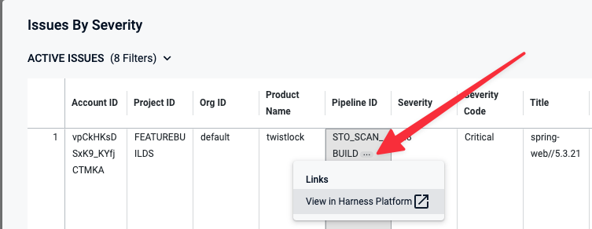

```mdx-code-block
import Tabs from '@theme/Tabs';
import TabItem from '@theme/TabItem';
```

<DocsButton icon = "fa-solid fa-square-rss" text="Subscribe via RSS" link="/release-notes/security-testing-orchestration/rss.xml" />

Review the notes below for details about recent changes to Security Testing Orchestration, NextGen SaaS. For release notes for Harness Self-Managed Enterprise Edition, go to [Self-Managed Enterprise Edition release notes](/release-notes/self-managed-enterprise-edition). Additionally, Harness publishes security advisories for every release. Go to the [Harness Trust Center](https://trust.harness.io/?itemUid=c41ff7d5-98e7-4d79-9594-fd8ef93a2838&source=documents_card) to request access to the security advisories.

:::info note
Harness deploys changes to Harness SaaS clusters on a progressive basis. This means that the features and fixes that these release notes describe may not be immediately available in your cluster. To identify the cluster that hosts your account, go to the **Account Overview** page.
:::


## Latest - August 02, 2023, version 1.62.2

```mdx-code-block
<Tabs>
  <TabItem value="What's new">
```

This release does not include new features. 

```mdx-code-block
  </TabItem>
  <TabItem value="Early access">
```
This release does not include Early Access features.


```mdx-code-block
  </TabItem>
  <TabItem value="Fixed issues">
```

* Fixed an issue that made it difficult to set up proxy details for a Veracode scan. Veracode scans can now handle `https_proxy`, `http_proxy`, and `no_proxy` environment variables as `-D` flags that get passed to Java. (STO-6081, ZD-45891)

```mdx-code-block
  </TabItem>
</Tabs>
```


## Previous releases

<details>
<summary>2023 releases</summary>


#### July 12, 2023, version 1.61.1 

##### What's new

This release does not include new features. 

You can now define dynamic target baselines using regular expressions. Dynamic baselines more accurately reflect the current "root" element in the context of a real-world software development life cycle. Dynamic baselines also make it easier to track the introduction and remediation of specific vulnerabilities.

This feature is behind the Feature Flag `STO_BASELINE_REGEX`. For more information, go to [Set up target baselines](/docs/security-testing-orchestration/use-sto/set-up-sto-pipelines/set-up-baselines).


#### Fixed issues

* Fixed an issue that broke the capability to customize the code snippet for AIDA-augmented remediations in the Security Tests module. (STO-6181)

##### Fossa runner update, July 20, 2023

* Updated a Fossa runner image to fix an issue that caused the step to fail with a 400 client error. (CDS-6120, ZD-46601)


#### July 5, 2023, version 1.60.0

##### What's New

You can now set up your STO scan images and pipelines to run scans as non-root and establish trust for your own proxies using self-signed certificates. This workflow supports any STO-compatible scanner that can run natively without root access. This workflow also supports build environments that use a self-signed proxy server between the Harness Delegate and the Harness Manager.

For information on how to set up this workflow, go to [Configure STO to Download Images from a Private Registry](/docs/security-testing-orchestration/use-sto/set-up-sto-pipelines/download-images-from-private-registry).

##### Early Access

This release does not include new features.

##### Fixed Issues

* Fixed an issue where some Reference Identifiers were not listed in the AIDA **Edit Inputs** form for enhancing a Security Issue's remediation steps. (STO-6102)


#### June 21, 2023, version 1.58.3

##### What's new

This release does not include new features.

##### Early access

Harness AI Development Assistant (AIDA) uses state-of-the-art AI technology to streamline the process of triaging and fixing security vulnerabilities. For every vulnerability detected by STO, Harness AIDA explains the issue precisely and provides detailed advice  — including code changes and package upgrades — on how to fix it. Harness AIDA is based on large, well-trained language models. It learns continuously based on feedback and the latest public knowledge. Optionally, you can regenerate advice with additional context and thereby optimize your results. 

Harness AIDA reduces developer toil by streamlining and simplifying the process of fixing vulnerabilities. It enables developers and security personnel to manage security-issue backlogs and address critical issues promptly. Harness AIDA can dramatically reduce your TTR, speed up your software development lifecycle, and improve the security posture of your applications and services.

For more information, go to [Remediations with AIDA](https://developer.harness.io/docs/security-testing-orchestration/use-sto/view-and-troubleshoot-vulnerabilities/ai-based-remediations).

##### Fixed issues

* A defective Zap runner image was rebuilt to resolve failures in orchestrated Zap scans. (STO-6094, ZD-46330)

* In the **Request Exemption** dialog, you need to provide a reason only when the **Other** exemption reason is selected. (STO-5942)


#### June 8, 2023, version 1.57.4

##### New features

* Added the existing Typescript scanning library to Sonarqube scans so that Typescript is always supported. (STO-6007)
* Added a `product_zip_max_size` setting to Checkmarx scans that enable you to override the maximum size of ZIP files uploaded to the STO pipeline (the default size is 200 MB). To override this setting in a Checkmarx scan step, add the `product_zip_max_size` setting and value (in MB) under **Settings (*optional*)**. (STO-5991)

  


##### Early access features

This release does not incude early-access features. 

##### Fixed issues

* Fixed an issue where STO results were not showing up in output variables when using STO steps inside a step group in a security stage. (STO-6038, ZD-45802)

* Updated the Golang library used in STO code to remediate CVE-2022-21698. (STO-5993) 


#### May 25, 2023, version 1.54.1

##### New features

* This release include new scanner templates, with simplified UIs and workflows, for the following scanners. (STO-5990)

  * [AWS ECR](/docs/security-testing-orchestration/sto-techref-category/aws-ecr-scanner-reference)
  * [AWS Security Hub](/docs/security-testing-orchestration/sto-techref-category/aws-security-hub-scanner-reference)
  * [Brakeman](/docs/security-testing-orchestration/sto-techref-category/brakeman-scanner-reference)
  * [Custom Ingest](/docs/security-testing-orchestration/sto-techref-category/custom-ingest-reference)
  * [Nikto](/docs/security-testing-orchestration/sto-techref-category/nikto-scanner-reference)
  * [Nmap](/docs/security-testing-orchestration/sto-techref-category/nmap-scanner-reference)
  * [OWASP](/docs/security-testing-orchestration/sto-techref-category/owasp-scanner-reference)
  * [Prowler](/docs/security-testing-orchestration/sto-techref-category/prowler-scanner-reference)

* The **Account Settings** > **Subscriptions** page has a new **Activity & Usage** section that shows the number of security scans and user activity over the past 30 days. (STO-4942)

* This release includes a minor UI update. In **Security Tests** > **Details**, the **Exempt** button has been renamed to **Request Exemption** to make the button's purpose more clear. (STO-5928)

##### Early-access features

This release does not incude early-access features. 

##### Fixed issues

* Fixed a UI issue where **Security Tests** would briefly display the message "No issues were found" when the window initially loaded. (STO-5927)

* Fixed an issue in non-Kubernetes builds where a scan would not produce output variables. This meant that failing a pipeline using `fail_on_severity` was not supported on non-Kubernetes builds.  Now, STO can generate output variables and fail pipelines using `fail_on_severity` on all supported build infrastructures. (STO-5483)


#### May 17, 2023, version 1.53.0

##### New features

* Code snippets in Security Issue details are now displayed in the UI with syntax highlighting. (STO-5959)

  

##### Early access

This release does not incude early-access features. 

##### Fixed issues

* Fixed an issue that would sometimes cause long-running scans to fail with a `requests.exceptions.ReadTimeout` exception and scan results to be lost.  (STO-5907)


#### May 10, 2023, version 1.50.3

##### What's new

* You can now ingest ZAP scan results from both JSON and XML reports. For information about the ZAP XML report format, go to [Traditional XML Report](https://www.zaproxy.org/docs/desktop/addons/report-generation/report-traditional-xml/) in the ZAP documentation. (STO-5868)

* The Security Tests tab now renders tables from tool-provided descriptions in the **Issue Details** panel. (STO-5857)

* The UI now uses consistent terminology when referring to exemptions. All references to *ignore* and *ignored* have been updated to *exempt* and *exempted*. (STO-5749)

* The Security Testing Dashboard includes a new **Target Type** filter. (STO-5732)

  

* The **Security Tests** tab now paginates results for scans that detect a lot of issues. You can set the pagination to 20, 50, or 100 issues per page. (STO-5211)

* STO now supports [looping strategies](/docs/platform/pipelines/looping-strategies-matrix-repeat-and-parallelism/) for Security Tests stages. (STO-5726)

* You can now select a high-level reason when you [request an exemption](/docs/security-testing-orchestration/use-sto/stop-builds-based-on-scan-results/exemption-workflows) for a detected issue. The **Request Exemption for Issue** dialog box includes a new **Reason** pull-down menu with a set of common reasons for exempting an issue. (STO-5730)

   


##### Early access

This release does not incude early-access features. 


##### Fixed issues

* Fixed a UI issue to ensure that all input fields related to STO security steps appear the Template Studio view. (STO-5746, ZD-42167)

* Fixed a UI issue where the **Default Project** and **Default Issue Type** drop-downs in the External Tickets settings page always used the account-level Jira connector, even when a different connector was selected on the project- or organization-level settings page. (STO-5756)

* Fixed an issue with Mend scans that caused builds to fail with the log message “Missing valid image". (STO-5867)

* Fixed an issue with Mend scans where the `product_domain` step setting did not get passed to the CLI, causing the scan to point to the default US server. (STO-5708)

* Added a **Privileged** checkbox to the UI for Security steps and scanner templates. This fixes an issue where `privileged` would automatically reset to `true` whenever a user updated the step, which required setting this option back to `false` in the YAML editor.  (STO-5773)

* Implemented fixes to improve UI speed and performance in the Security Testing Dashboard. (STO-5612)
  


#### April 6, 2023, version 1.43.1

##### New features
This release does not include new features.

##### Early access

This release does not include early access features.

##### Fixed issues

* Fixed a UI issue in **External Tickets Settings** for setting up Jira integrations:  **Default Project** and **Default Issue Type** always used the account-level Jira connector, even when a different connector was selected for the current project or organization. (STO-5756)
* Fixed a search issue in **Security Tests**: If a search term included certain special characters, the UI would fail with a JavaScript exception. (STO-5745) 


##### Plugin update - May 3, 2023, version 1.11.1

This update includes the following fixed issues:

* This release updates the Twistlock normalization algorithm. Issues with Moderate severity in Twistlock are now assigned Medium (not High) severity in STO. (STO-5861)

* Fixed a Snyk ingestion issue that caused the scan to scan step to fail if the target name included a space. (STO-5855)


##### Plugin update - April 20, 2023, version 1.10.1

This update includes the following fixed issues: 

* Fixed an issue that caused orchestrated Snyk scans to fail when passing in  `--all-projects` via **Additional CLI flags** or as `tool_args`. This update now reflects the new supported Snyk workflow for specifying target variants: instead of using using `--project-name` to specify variants (old behavior), STO now uses the new `-—target-reference` flag (new behavior). (STO-5821, ZD-42967)
  
  For more information about the use of these flags, see the following topics in the Snyk documentation:

  - [Group projects for monitoring](https://docs.snyk.io/snyk-cli/test-for-vulnerabilities/grouping-projects-by-branch-or-version)
  - [Does the Snyk CLI support monorepos or multiple manifest files?](https://support.snyk.io/hc/en-us/articles/360000910577-Does-the-Snyk-CLI-support-monorepos-or-multiple-manifest-files-)

* Fixed an issue where Snyk scans were processing container vulnerabilities only and ignored application vulnerabilities. STO now processes both container and application scan data from Snyk by default. (STO-5828)

* Fixed an issue that prevented orchestrated Mend scans from running if the [Use version in project names](https://docs.mend.io/en-US/bundle/sca_user_guide/page/using_version_in_product_or_project_names.html) setting was turned off.

#### March 30, 2023, version 1.40.2

##### What's new

* The Snyk integration has been updated. Orchestrated Snyk scans now upload results to the external Snyk portal by default. (STO-5607)

##### Early access 

* This release includes the following enhancements to the [Jira integration](/docs/security-testing-orchestration/use-sto/view-and-troubleshoot-vulnerabilities/jira-integrations):
   * After you create a new ticket, **Issue Details** replaces the **Create Ticket** button with a link to the new ticket and the ticket status. (STO-5518)

     Before:

     

     After:

     

   **External Tickets** now automatically populates the **Default Project Name** and **Default Project Type** menus based on the selected ticket-provider connector. (STO-5492)

##### Fixed issues

* Fixed an issue with SonarQube scans: if a repository had a .gitignore with a specific pattern, all files were ignored during the scan. (STO-5711)
* Fixed an issue with Snyk scans to ensure that **Issue Details** shows all remediation information from the scan results under Remediation. (STO-5663)
* Fixed an issue where, if a scan detected no issues and a later scan detected one or more issues, **Issue Details** would include remediation information from the later scan. (STO-5463)
*  Fixed a UI issue where the **Security Tests** tab was incorrectly showing issue counts and the Ignored status for some issues. This was due to a DB query that caused exemptions scoped to an issue in one project to be applied to the same issue in all projects in the account. (STO-5718)

#### March 23, 2023

##### New features

This release does not include new features.

##### Early access features

This release does not include early access features.

##### Fixed Issues

* Fixed an issue that caused OWASP scans of Go apps to fail with the message `[ERROR] Unexpected exception occurred initializing Golang Mod Analyzer`. (STO-5602)
* Fixed a UI issue in **Issue Details** that caused some redundant fields such as `CWE` to appear. (CI-5365)

#### March 20, 2023

##### What's new

* This release does not include new features

#### Early access

This release does not include early access features.

#### Fixed issues

* The search pull-down widget has been removed from the Security Tests &gt; Overview page. To search for and drill down into specific issues, go to the Security Testing Dashboard. (STO-5592)
* Fixed an issue in **Security Tests** &gt; **Overview** where the **Issue distribution over time** graph was empty for some projects. (STO-5318)

#### March 14, 2023

##### What's new

This release includes a set of new scanner-specific steps (step palettes) for Aqua Trivy, Bandit, SonarQube, and other popular scanners. These steps greatly simplify the process of setting up scans in your pipelines. Previously, the workflow for all scanners was to enter a set of hard-coded key and value strings in a Security step. These new steps have simplified user-friendly UIs that include only the options relevant to the specific scanner, mode, and target.

The following security steps are now generally available:

* [Aqua Trivy](/docs/security-testing-orchestration/sto-techref-category/aqua-trivy-scanner-reference) (STO-5393)
* [Bandit](/docs/security-testing-orchestration/sto-techref-category/bandit-scanner-reference) (STO-5050)
* [Black Duck Hub](/docs/security-testing-orchestration/sto-techref-category/black-duck-hub-scanner-reference) (STO-5052)
* [Checkmarx](/docs/security-testing-orchestration/sto-techref-category/checkmarx-scanner-reference) (STO-5073)
* [Grype](/docs/security-testing-orchestration/sto-techref-category/grype-scanner-reference) (STO-5394)
* [Mend (formerly Whitesource)](/docs/security-testing-orchestration/sto-techref-category/mend-scanner-reference) (STO-5392)
* [Prisma Cloud (formerly Twistlock)](/docs/security-testing-orchestration/sto-techref-category/prisma-cloud-scanner-reference) (STO-5055)
* [Snyk](/docs/security-testing-orchestration/sto-techref-category/snyk-scanner-reference) (STO-5053)
* [SonarQube](/docs/security-testing-orchestration/sto-techref-category/sonarqube-sonar-scanner-reference) (STO-5051)
* [Zed Attack Proxy (ZAP)](/docs/security-testing-orchestration/sto-techref-category/zap-scanner-reference) (STO-5058)

##### Early access 

This release does not include early access features.

##### Fixed issues

This release does not include fixed issues.

#### March 9, 2023

##### What's new

This release does not include new features.

##### Early access 

* The new [Jira integration](/docs/security-testing-orchestration/use-sto/view-and-troubleshoot-vulnerabilities/jira-integrations) has been enhanced. If an issue has an associated Jira ticket, **Issue Details** now shows the ticket status along with the number. (STO-5491)

##### Fixed issues

* Fixed an issue in the Jira integration to ensure that **Create Ticket** now appears in **Issue Details**, even if an issue has an Exemption associated with it. (STO-5526)
* Fixed an issue in the Jira integration that allowed users to try to create tickets against targets with no baseline specified, which is not supported and resulted in a 404 response. (STO-5477)
* Fixed an issue in the Back Duck configuration UI where the in-tool help said that the Image Region setting was required when scanning AWS ECR container images. This field is optional. (STO-5450)

#### March 2, 2023, version v1.32.1

##### What's new

- The Twistlock integration has been upgraded to use version 22.12.582. (STO-5575)
- The Brakeman, Nikto, and Nmap scanner integrations now enable you to customize scans by passing CLI arguments to the scanner via the `tool_args` setting. (STO-5465)
- The Bandit scanner integration now enables you to customize scans by passing CLI arguments to the scanner via the `tool_args` setting. (STO-5415)
- The Mend integration now supports SCA scans. (STO-5242)
- Bandit scan results have been enhanced. When you open the Details pane for a detected issue, the Raw Details JSON now includes links to further information under `_rawIssueCwe : link` and `_rawMoreInfo`. (STO-5422)
- The Security Testing Dashboard includes a new set of filters for drilling down into specific issues by project, creation date, scanner, target, pipeline, severity, and so on. You can drill down to a set of relevant issues and then click on a pie slice, chart element, or other UI element to view details on the relevant issues. (STO-5329)
  
  Note the following:

  - The Security Testing Dashboard requires an Enterprise account.
  - You must click **Refresh** (top right) to apply the filter after you configure it.
  - To view details for an issue from the search results, click the pipeline name or ID and choose **View in Harness Platform**. 

    

  - The **Created Date** menu has several non-working options: `is null`, `is not null`, and `matches a user attribute`. This is a known issue that Harness is working to address.


##### Early access

- Improved UI for configuring scan steps (STO-4867)
  
  This release includes a set of Security steps with an improved UI for configuring scans. Each step shows only the settings that apply to the specific scan. 

  Note the following:

  - This release includes new steps for the following scanners: Aqua Trivy, Bandit, Black Duck, Checkmarx, Grype, Mend, Prisma Cloud, Snyk, SonarQube, and ZAP.  
  - Docker-in-Docker is no longer required for these steps *unless* you're scanning a container image. If you're scanning a repository or running instance, you don't need to set up a Background step running DinD.    
  - These steps are currently available in Security stages only. 
  - Support is currently limited to Kubernetes and Harness Cloud AMD64 build infrastructures only.
  - For descriptions of all available UI settings, go to [Security step UI settings reference](/docs/security-testing-orchestration/sto-techref-category/security-step-ui-settings-reference).
 

<details><summary>Security step configuration UI </summary>


  
</details>


- This release includes a Jira integration that enables you to create Jira tickets for issues detected during an STO build. For more information, go to [Create Jira tickets for detected issues](/docs/security-testing-orchestration/use-sto/view-and-troubleshoot-vulnerabilities/jira-integrations). (STO-5467)

##### Fixed issues

- The ShiftLeft integration now uses the latest CLI, which fixes an issue where orchestrated ShiftLeft scans would fail with an error. (STO-4994)

#### February 24, 2023

##### What's new

This release does not include new features.

##### Fixed issues

* Fixed a race condition allowing for duplicate targets to get created. (STO-5481)

#### February 16, 2023

##### What's new

This release does not include new features.

##### Fixed issues

* Fixed an issue with Prisma Cloud (formerly Twistlock) scans where the step would fail when a twistcli policy encountered a Compliance or Vulnerabilities threshold check that failed. (STO-5559)

#### February 5, 2023

##### What's new

* **Issue Details** now shows the message “No recommendations are available at this time” when the scan tool doesn't return remediation steps for a specific issue. (STO-5380)

##### Fixed issues

This release does not include fixed issues.

#### January 29, 2023

##### What's new

* You can now ingest results from a specific Checkmarx scan. This option is useful for ensuring that a pipeline ingests the scan triggered by a specific event. Add the setting `product_scan_id` = `MY_SCAN_ID` to the Checkmarx step. This overrides the default behavior, which is to ingest results for the most recent scan. (STO-5424)	

* You can now enable debug-level logging for Snyk and Aqua Trivy scans. To do this, add this setting to the scan step: `log_level` = `debug`. (STO-5405)

* Grype scans now support a `tool_args` field. You can use this field to run the plugin with specific command-line arguments. To scan all layers in an image, for example, add this setting to the Grype scan step: `tool_args` = `--scope all-layers`. (STO-5400)

* To make **Issue Details** easier to navigate, Raw Details JSON data is now collapsed by default. (STO-5398)	


##### Fixed issues

* Fixed an issue that caused a scheduled AWS ECR scan to time out or to terminate with a status of Invalid. (STO-5449)	

#### January 15, 2023

##### What's new

* Aqua Trivy scans now support a `tool_args` field. You can use this field to run the plugin with specific command-line arguments. To run an offline scan, for example, specify `tool_args` = `---offline-scan`. (STO-5388)	

##### Fixed issues

* Fixed an issue where, in some situations, the severity and severity code of a detected issue were not updated when new occurrences of the same issue were detected. (STO-4809)	

#### January 8, 2023

##### What's new

* Checkmarx scans now support a `tool_args` field. You can use this field to run the Checkmarx plugin with specific command-line arguments. To run an incremental scan, for example, specify `tool_args` = `-incremental`. (STO-5041)	

* STO now supports orchestrated scans using [Grype](/docs/security-testing-orchestration/sto-techref-category/grype-scanner-reference). (STO-5161)	

##### Fixed issues

This release does not include fixed issues.

#### January 1, 2023

##### New features

* The Issues Details pane has been revised to make it easier to navigate. Raw JSON data now appears at the bottom of each occurrence and is collapsed by default. (STO-4839)	

##### Fixed issues

This release does not include fixed issues.
</details>

<details>
<summary>2022 releases</summary>

#### December 18, 2022			

##### New features

* Remediated issues are no longer included in the issue counts logged near the end of a Security Step run and provided as output variables. (STO-5304)	

*  With this release, you can run a SonarQube scan and specify a collection of SSL certificates rather than a single certificate. This option is useful when you don't know which specific certificate in a collection is required by the server. (STO-5243)	

##### Fixed issues

* Fixed an issue where `product_lookup_type` being set to `byTokens` causes the step to perform a Dataload instead of OrchestratedScan. (STO-5166)	


#### December 11, 2022		

##### New features
	
* STO is now supported on Linux (amd64 and arm64 platforms) in [Harness Cloud](/docs/continuous-integration/use-ci/set-up-build-infrastructure/use-harness-cloud-build-infrastructure). (STO-5314)	

* Instead of using Service Dependencies for Docker-in-Docker configuration, users should use new Background steps. (STO-5268)

##### Fixed issues

This release does not include fixed issues.


#### December 4, 2022			

##### New features

This release does not include new features.

##### Fixed issues

* Fixed an issue that resulted in intermittent failures with OWASP orchestrated scans. (STO-5289)	


#### November 28, 2022			
	

##### New features

This release does not include new features.	

##### Fixed issues

* Fixed an issue where the Security Tests tab on the Pipeline Execution page was periodically reloading in a visually jarring way and losing scroll position. (STO-5208)

* Fixed an issue where the Security Tests tab would show previously-found issues as "remediated" while the scan was in progress.  (STO-4985)	

* Improved the Security Tests UI to highlight new issues found in the current target only vs. issues also found in the baseline, or in the previous scan if no baseline was specified. (STO-5198)	


#### November 6, 2022	

##### New features

* You can now include Run steps in Security Test stages. You can also include Security Tests stages in STO pipelines without a CI license. (STO-5208)

* You can now configure a pipeline to ingest Snyk data from multiple files and paths. For an example of how to set this up, go to [Ingest Scan Results from Snyk](/docs/security-testing-orchestration/use-sto/orchestrate-and-ingest/snyk-scans). (STO-4958)	

##### Fixed issues

* Fixed an issue where the issue counts reported in output variables vs. the Security Tests page were inconsistent for scans of target baselines, or for targets with no specified baseline. (STO-5042)	


#### October 31, 2022

##### What's New

- New output variables – This release includes a new set of output variables you can use to determine the next stage of your pipeline. These variables show the number of new issues detected in the current scan compared to the last scan. If this is the first scan for the target, these variables reflect new issues compared to the baseline. You can use these variables to determine the next stage of your pipeline:
  - NEW_CRITICAL
  - NEW_HIGH
  - NEW_MEDIUM
  - NEW_LOW
  - NEW_UNASSIGNED (Reserved for future use)
  - NEW_TOTAL (STO-4866)
- STO Overview – The STO Overview provides a single, interactive view of all baseline issues detected by all scans in your project. A time series chart shows the daily distribution of issues by severity over the past 30 or 90 days. A daily snapshot shows the sum of all baseline issues based on the latest scan of each baseline. You can also drill down into active, failed, and in-progress baseline scans. (STO-3629)
- STO scans on VMs using Docker delegates – You can now run builds with STO scans using Docker delegates running on Linux VMs in AWS and other cloud platforms. This extends the support for STO scans with Kubernetes delegates.
  For information about setting up a VM build infrastructure, see Set Up Build Infrastructure in the CI docs. (STO-4639)
- Two-step Exemption and Security Review – This release enhances support for a two-step process for requesting and approving security exemptions:
  - Developers can request (but not approve) exemptions to unblock pipeline builds for specific issues.
  - Only SecOps users can approve exemption requests and choose to mute or ignore specific issues. (STO-4479)
- AWS Security Hub – STO now supports scans in AWS Security Hub. (STO-4873)
- AWS ECR – STO now supports scans on AWS Elastic Container Registry (ECR). (STO-4969)

#### August 2, 2022

##### What's New

The STO module launches its first GA product with the following capabilities:

- Pipeline-Driven STO:
  - Standalone STO:
    - Provision to create standalone STO Stages and secure Pipelines (Ex: Pipelines initiated via Gitlab or Github).
  - Orchestrate scanners inside Harness CI Pipeline:
    - Run scanners as an additional stage or steps within a Harness CI Pipeline.
  - Orchestrate scanners inside Harness CD Pipeline:
    - Run scanners as an additional Stage or Steps within a Harness CD Pipeline.
- Developer-first Remediation: Security testing results normalized, deduplicated, and prioritized across all scanners.
- Dedicated Security Exemptions Section: Ability to grant and manage security exemptions by SecOps owners on identified vulnerabilities or issues during security testing. Exemptions can also be made in the STO Pipeline against specific issues.
- Custom Dashboards & Reports: Ability to create custom visualizations and reports based on attributes related to STO and secure pipeline creation (40+ attributes).
- OPA-based Governance Policies: Support for crafting governance policies for STO specific Pipelines and workflows.
- Platform Integration: Audit trails and other Enterprise Platform features like RBAC, Notifications, Pipeline Config-as-Code
  - Default RBAC roles for STO Developer & STO SecOps Personas
  - Notification Channels:
    - Email, Slack, PagerDuty, Microsoft Teams
- Self-Managed Platform (On-premise software)
  - Helm Chart package with bundled Harness CI and CD modules

See Security Testing Orchestration Basics.

##### Enhancements

N/A

##### Fixed issues

N/A
</details>
