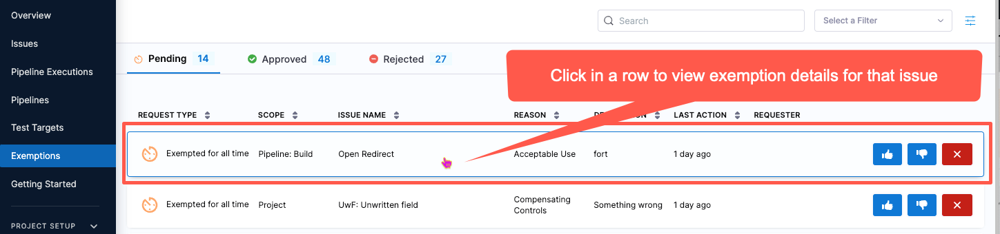
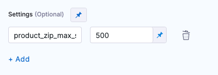

import Tabs from '@theme/Tabs';
import TabItem from '@theme/TabItem';

<DocsButton icon = "fa-solid fa-square-rss" text="Subscribe via RSS" link="https://developer.harness.io/release-notes/security-testing-orchestration/rss.xml" />

These release notes describe recent changes to Harness Security Testing Orchestration (NextGen SaaS).

:::info About Harness Release Notes

* **Progressive deployment:** Harness deploys changes to Harness SaaS clusters on a progressive basis. This means that the features described in these release notes may not be immediately available in your cluster. To identify the cluster that hosts your account, go to your **Account Overview** page in Harness. In the new UI, go to **Account Settings**, **Account Details**, **General**, **Account Details**, and then **Platform Service Versions**.
* **Security advisories:** Harness publishes security advisories for every release. Go to the [Harness Trust Center](https://trust.harness.io/?itemUid=c41ff7d5-98e7-4d79-9594-fd8ef93a2838&source=documents_card) to request access to the security advisories.
* **More release notes:** Go to [Harness Release Notes](/release-notes) to explore all Harness release notes, including module, delegate, Self-Managed Enterprise Edition, and FirstGen release notes.

:::

## September 2024

### Version 1.110.3

<!-- 2024-09-18 -->

#### New features and enhancements

- STO ingestion now works on [MacOS Harness hosted builds](/docs/security-testing-orchestration/sto-techref-category/security-step-settings-reference/#operating-systems-and-architectures-supported-by-sto).
- STO now supports [Secure Connect](/docs/continuous-integration/secure-ci/secure-connect) for Harness Hosted
- The steps Snyk, Wiz, Prisma Cloud, Aqua Security, Aqua Trivy, and Grype can now run without Docker-in-Docker as a dependency.
- Improved the performance of the STO graph "Issue distribution over time"

#### Fixed issue

- Resolved the issue that caused the "Issue distribution over time" graph on the Overview page to time out and fail to load (STO-6037).
- Fixed the problem where exempted issues were occasionally counted incorrectly in the "Issue distribution over time" graph on the Overview page. (STO-6037).
- Resolved the issue that caused the SonarQube step to fail during the upload of scan results (STO-7961).
- Fixed the problem in the Checkmarx Ingestion where the SARIF normalizer failed to handle null values in the output (STO-7997).

### Version 1.108.2

<!-- 2024-09-06 -->

#### New features and enhancements

- The [SonarQube](/docs/security-testing-orchestration/sto-techref-category/sonarqube-sonar-scanner-reference) step will now present the code coverage data in Orchestration, Ingestion, and Extraction scan modes, this can be found as an INFO level issue item in your pipeline executions. (STO-7100)
- The [Burp Suite Enterprise Edition](/docs/security-testing-orchestration/sto-techref-category/burp-scanner-reference) step has been upgraded to use the `scope_v2` API version instead of `scope`. This update is designed to support server version `v2023.3`, while still maintaining backward compatibility with earlier supported versions. (STO-7955)

## August 2024

### Version 1.104.3

<!-- 2024-08-05 -->

#### New features and enhancements

- The [Veracode scan step](/docs/security-testing-orchestration/sto-techref-category/veracode-scanner-reference) in STO now ignores issues mitigated on the Veracode side, so the scan results exclude any mitigated issues.
- The STO dashboard now includes a new graph to view the **Top 5 Vulnerable Targets**, showing code repositories, artifacts, instances, and configurations across the account.
- You can now override the security testing scanner image at the step level. Learn more about [configuring your pipeline to use images from your registry](/docs/security-testing-orchestration/use-sto/set-up-sto-pipelines/download-images-from-private-registry#configure-your-pipeline-to-use-images-from-your-registry).

## July 2024

### Version 1.104.3

<!-- 2024-07-26 -->

#### New features and enhancements
- You can now override the image that runs the STO step directly in the scanner step UI. Expand **Additional Configuration** and then set **Container Registry** and **Image Tag**. (STO-7724)
- The Bandit, Anchor, and Semgrep steps now support [Secure Connect](https://developer.harness.io/docs/continuous-integration/secure-ci/secure-connect/) within STO. (STO-7666)
- The dark theme for AIDA is improved. Its appearance is now consistent with other UI components. (STO-7849)

### Version 1.103.3

<!-- 2024-07-19 -->

#### New features and enhancements
- In the [Checkmarx step](/docs/security-testing-orchestration/sto-techref-category/checkmarx-scanner-reference) under the **Scan Tool**, the fields **Team Name** and **Project Name** are now mandatory for step configuration. Previously, these fields were optional. (STO-7681)
- We now track the number of occurrences for a given issue/scan combination independently of the associated occurrence IDs. Newly created issues will only store up to 1,000 occurrences, with the total number of occurrences being stored separately. Occurrences are stored based on severity, with higher-severity occurrences given priority. (STO-5979)

  These following endpoints now include `numOccurrences` at the issue level, showing the total number of occurrences for the issues:
    - `GET api/v2/issues/{issueId}`
    - `GET api/v2/scans/{scanId}/issue/{issueId}`
    - `GET api/v2/scans/{scanId}/issues`

  Also, the following endpoints now accept an optional payload parameter `numOccurrences`, representing the total number of occurrences associated with the issue:
    - `POST api/v2/issues`
    - `PUT api/v2/issues/{issueId}`

### Version 1.102.2

<!-- 2024-07-11 -->

#### New features and enhancements

- Branch Scanning in [SonarQube](/docs/security-testing-orchestration/sto-techref-category/sonarqube-sonar-scanner-reference#scan-configuration) is now Generally Available(GA), previously behind the `STO_SONARQUBE_BRANCHING` feature flag. Customers can now perform branch scans using the SonarQube step.
- Added a new setting called **Users can approve their own exemptions**. This setting helps control whether users can approve their own exemptions, and it can be easily enabled or disabled based on their preference. Find this setting under **Exemption settings** on the **Default settings** page. This is available in the project, organization and account level settings. (STO-7675). 

:::note 
The setting **Users can approve their own exemptions** is behind the feature flag `STO_EXEMPTION_SETTING`. Contact [Harness Support](mailto:support@harness.io) to enable this setting.
:::

## June 2024

### Version 1.100.2

<!-- 2024-06-27 -->

#### Fixed issue

- Fixed an issue where an Anchore Enterprise step failed when trying to extract scan results in the following edge case. (STO-7754)
  1. An Anchore user scanned an image (for example, `sto-plugin.v1.2.3`). 
  2. An Anchore user then scanned an image with the same digest as `sto-plugin.v1.2.3` but a different name or tag such as `sto-plugin.latest`.  
  3. In this case, the Anchore step could extract results for `sto-plugin.v1.2.3` but any attempts to extract results for `sto-plugin.latest` failed with the error "Unable to find matching image."

### Version 1.99.2

<!-- 2024-06-20 -->

#### Features that are no longer behind feature flags

The following features are now generally available:

- Built-in scans:
  - [SAST](/docs/security-testing-orchestration/sto-techref-category/built-in/sast)
  - [SCA](/docs/security-testing-orchestration/sto-techref-category/built-in/sca)
  - [Secret Detection](/docs/security-testing-orchestration/sto-techref-category/built-in/secrets)
  - [Container](/docs/security-testing-orchestration/sto-techref-category/built-in/containers)
  - [DAST](/docs/security-testing-orchestration/sto-techref-category/built-in/dast)
- [Default baselines based on regular expressions](/docs/security-testing-orchestration/use-sto/set-up-sto-pipelines/set-up-baselines#default-baselines-based-on-regular-expressions)
- [Jira tickets for detected vulnerabilities](/docs/security-testing-orchestration/jira-integrations)
- Wiz support for scanning [artifacts](/docs/security-testing-orchestration/sto-techref-category/wiz/artifact-scans-with-wiz), [code repositories](/docs/security-testing-orchestration/sto-techref-category/wiz/repo-scans-with-wiz), and [IaC repositories](/docs/security-testing-orchestration/sto-techref-category/wiz/iac-scans-with-wiz)

#### New feature

- The Semgrep scan step now supports a set of new **Scan Configuration** settings that enable you to select the set of Semgrep rulesets to include in your scan. (STO-7599)

  The following configurations are supported:

  - **Default** Include the following rulesets: 
    - [auto](https://semgrep.dev/p/bandit)
    - [bandit](https://semgrep.dev/p/bandit)
    - [brakeman](https://semgrep.dev/p/brakeman)
    - [eslint](https://semgrep.dev/p/eslint)
    - [findsecbugs](https://semgrep.dev/p/findsecbugs)
    - [flawfinder](https://semgrep.dev/p/flawfinder)
    - [gosec](https://semgrep.dev/p/gosec)
    - [phps-security-audit](https://semgrep.dev/p/phpcs-security-audit)
    - [security-code-scan](https://semgrep.dev/p/security-code-scan)
  - **No default CLI flags** Run the `semgrep` scanner with no additional CLI flags. This setting is useful if you want to specify a custom set of rulesets in **Additional CLI flags**.
  - **p/default** Run the scan with the [default ruleset](https://semgrep.dev/p/default) configured for the Semgrep scanner.
  - **Auto only** Run the scan with the [recommended rulesets specific to your project](https://semgrep.dev/p/auto).
  - **Auto and Ported security tools** Include the following rulesets: 
    - [auto](https://semgrep.dev/p/auto)
    - [brakeman](https://semgrep.dev/p/brakeman)
    - [eslint](https://semgrep.dev/p/eslint)
    - [findsecbugs](https://semgrep.dev/p/findsecbugs)
    - [flawfinder](https://semgrep.dev/p/flawfinder)
    - [gitleaks](https://semgrep.dev/p/gitleaks)
    - [gosec](https://semgrep.dev/p/gosec)
    - [phps-security-audit](https://semgrep.dev/p/phpcs-security-audit)
    - [security-code-scan](https://semgrep.dev/p/security-code-scan)
  - **Auto and Ported security tools except p/gitleaks**

#### Fixed issues

<!-- - Fixed an Anchore Enterprise issue where the connection between the Anchore step and the SaaS instance would fail with TLS  errors. (STO-7704, ZD-65026) -->

- Audit trails for STO targets and exemptions now display user-friendly resource names instead of IDs. (STO-5717)

### Version 1.98.7

<!-- 2024-06-14 -->

#### New features and enhancements

- Harness STO now supports the Anchore v2 API and Anchore Enterprise Server 5.5.0. This change means that the Anchore v2 API and Anchore Enterprise Server v5.0 or higher are required to run orchestration and extraction scans. (STO-7614)
- You can now run Wiz IaC scans in an **Infrastructure** stage. (STO-7632)

#### Fixed issues

- Fixed an issue where Burp scans failed when trying to ingest base64 data that included zero byte and “Symbol Other” UTF-8 characters. (STO-7714)
- Updates to Burp Enterprise orchestration to resolve multiple issues. (STO-7635, ZD-64154)
  1) Added another API call to resolve a Burp schedule item iD to its corresponding latest Burp scan ID.
  2) Added logic to perform updates on matching Burp sites rather than trying to create a new Burp site with the same name.
  3) Removed default port from being set by runner and will only set port if user specifies in the step.

### Version 1.97

#### New feature

- The STO API is now generally available and publicly documented. For more information, go to [STO](https://apidocs.harness.io/tag/Exemptions) in the Harness API documentation. (STO-5281)

<!--

- The Semgrep scan step now supports a set of new **Scan Configuration** settings that enable you to select the set of Semgrep rulesets to include in your scan. (STO-7599)

  The following configurations are supported:

  - **Default** Include the following rulesets: 
    - [auto](https://semgrep.dev/p/bandit)
    - [bandit](https://semgrep.dev/p/bandit)
    - [brakeman](https://semgrep.dev/p/brakeman)
    - [eslint](https://semgrep.dev/p/eslint)
    - [findsecbugs](https://semgrep.dev/p/findsecbugs)
    - [flawfinder](https://semgrep.dev/p/flawfinder)
    - [gosec](https://semgrep.dev/p/gosec)
    - [phps-security-audit](https://semgrep.dev/p/phpcs-security-audit)
    - [security-code-scan](https://semgrep.dev/p/security-code-scan)
  - **No default CLI flags** Run the `semgrep` scanner with no additional CLI flags. This setting is useful if you want to specify a custom set of rulesets in **Additional CLI flags**.
  - **p/default** Run the scan with the [default ruleset](https://semgrep.dev/p/default) configured for the Semgrep scanner.
  - **Auto only** Run the scan with the [recommended rulesets specific to your project](https://semgrep.dev/p/auto).
  - **Auto and Ported security tools** Include the following rulesets: 
    - [auto](https://semgrep.dev/p/auto)
    - [brakeman](https://semgrep.dev/p/brakeman)
    - [eslint](https://semgrep.dev/p/eslint)
    - [findsecbugs](https://semgrep.dev/p/findsecbugs)
    - [flawfinder](https://semgrep.dev/p/flawfinder)
    - [gitleaks](https://semgrep.dev/p/gitleaks)
    - [gosec](https://semgrep.dev/p/gosec)
    - [phps-security-audit](https://semgrep.dev/p/phpcs-security-audit)
    - [security-code-scan](https://semgrep.dev/p/security-code-scan)
  - **Auto and Ported security tools except p/gitleaks**

-->

#### Fixed issues

- Updates to Burp Enterprise orchestration to resolve multiple issues. (STO-7635, ZD-64154)
  - Added another API call to resolve a Burp schedule item iD to its corresponding latest Burp scan ID.
  - Added logic to perform updates on matching Burp sites rather than trying to create a new Burp site with the same name.
  - Removed default port from being set by runner and will only set port if user specifies in the step.

- Fixed an issue where a updated runner image caused repository scans to fail in some cases. (STO-7634, ZD-64116)

- Implemented a fix to improve data processing times for certain edge cases. (STO-7521, ZD-62602, ZD-62694)

## May 2024

### Version 1.96.2

<!-- 2024-05-22 -->

#### Breaking change

Harness introduced a back-end dashboard change to support features that are currently in development. As a result, you must re-create any custom dashboards cloned from the Security Testing Dashboard before this change was introduced. If the cloned dashboard has scheduling enabled, you must also re-create the schedule. (STO-7199)

#### Fixed issues

- Fixed an issue where running an orchestrated Burp scan resulted in the runtime error `No matching scan configurations`. (STO-7585, ZD-63508)

- Fixed a Jira integration issue that allowed tickets to be created for issues that were not in a target baseline. When the **Ticket Summary** page was viewed from these tickets, they produced a vague error page. This fix prevents the creation of new non-baseline tickets and improves the error messages shown for existing tickets. (STO-7394, ZD-60778)

- Fixed a Jira integration issue where setting the default Jira project and issue type in the **External Tickets** page resulted in duplicated database records and an error response from the ticketing service. (STO-7485)

### Version 1.95.0

<!-- 2024-05-17 -->

#### New features and enhancements

- The default behavior for Semgrep orchestration scans has changed. Semgrep steps now include the following rulesets. (STO-7560)

  - [auto](https://semgrep.dev/p/auto)
  - [bandit](https://semgrep.dev/p/bandit)
  - [brakeman](https://semgrep.dev/p/brakeman)
  - [eslint](https://semgrep.dev/p/eslint)
  - [findsecbugs](https://semgrep.dev/p/findsecbugs)
  - [flawfinder](https://semgrep.dev/p/flawfinder)
  - [gosec](https://semgrep.dev/p/gosec)
  - [phps-security-audit](https://semgrep.dev/p/phpcs-security-audit)
  - [security-code-scan](https://semgrep.dev/p/security-code-scan)

#### Fixed issues

- Fixed a Prisma Cloud step issue where `twistcli` didn't honor step-level variables when running in Harness Cloud. You can set `JOB_NAME` in the [Settings](/docs/security-testing-orchestration/sto-techref-category/prisma-cloud-scanner-reference#settings) field in a Prisma Cloud step, and thereby add a searchable tab in the Prisma Cloud UI. This functionality is now available on Harness Cloud as well as Kubernetes and local build infrastructures. (STO-7508, ZD-61272)

- Fixed an issue where a Wiz step failed when it scanned a package that had policies applied to it but no vulnerabilities. (STO-7573, STO-7575, ZD-63342)

<!-- 

- Fixed an issue where Custom Ingest and Snyk scans were incorrectly reporting all issues as new. Rerunning any affected pipelines will now produce the correct results. (STO-7574, ZD-73374)

-->

- Fixed an issue where **Security Tests** showed all detected issues as new when comparing the current scan against the baseline branch, even when the baseline was correctly specified in **Test Targets**. With this fix, you can simply run an affected pipeline again and produce correct results. (STO-7575, STO-7582, ZD-63551, ZD-73374)

### Version 1.94.4

#### New features 

- You can now use [Plugin steps](/docs/continuous-integration/use-ci/use-drone-plugins/plugin-step-settings-reference/) and [GitHub Action steps](/docs/continuous-integration/use-ci/use-drone-plugins/ci-github-action-step) in Security stages without a CI license. (STO-7442)

- You can now scan code repositories using the [Grype](/docs/security-testing-orchestration/sto-techref-category/grype/grype-scanner-reference) scan step. (STO-7531)

 

#### Fixed issues

- Fixed an issue where the Built-in Grype step would time out when uploading scan results. (STO-7464, ZD-61941)

- Fixed an issue where OPA failed with the error `Unexpected error occurred while evaluating Policies`. With this fix, STO limits the number of occurrences per issue (max 1000) that it sends to OPA. (STO-7562, ZD-63083)

## April 2024
 
### UI update 1.15.0

#### New feature: Built-in SAST scans

This release introduces a new [built-in SAST step](/docs/security-testing-orchestration/sto-techref-category/built-in/sast) that adds a preconfigured [Semgrep step](/docs/security-testing-orchestration/sto-techref-category/semgrep/semgrep-scanner-reference) that's ready to run as soon as you add it. (STO-7180) 

<!--
This step is behind the feature flag `STO_ONE_CLICK_SAST`. Contact [Harness Support](mailto:support@harness.io) to enable it.

-->

<DocImage path={require('/docs/security-testing-orchestration/sto-techref-category/semgrep/static/add-built-in-sast-scanner.png')} width="50%" height="50%" title="Add built-in SAST scan step" /> 

-->

#### New feature: Orchestrated Semgrep scans

Harness STO now supports running [Semgrep scans](/docs/security-testing-orchestration/sto-techref-category/semgrep/semgrep-scanner-reference) in **Orchestration** mode. (STO-7142)

### STO Manager version 1.22.1

<!-- 2024-04-18 -->

#### New features and enhancements

- Harness is in the process of updating the STO UI. The following changes are cosmetic and do not affect the underlying YAML definitions of STO pipelines. Harness expects all of these changes to be deployed in all namespaces by the end of April 2024. 

  - The **Security Tests** stage is now called **Security** when you add a new stage and select the stage type. (STO-7384)

    <DocImage path={require('./static/sto-7384-security-stage-name-update-when-adding-new-stage.png')} width="50%" height="50%" title="Custom Scan step at the end of the list of Security Test steps" />

  - The **Custom Scan** step is used for scanner integrations that do not have their own configuration step. Previously, this step was called **Security**. This step also has a new icon. (STO-7385)

    **Custom Scan** appears at the end of the list of Security Test steps in the Step Library. 

    <DocImage path={require('./static/sto-7385-custom-scan-step-in-step-library.png')} width="50%" height="50%" title="Custom Scan step at the end of the list of Security Test steps" />

- Harness STO now supports ingesting scan results in stages that run on ARM64 build infrastructures. This eliminates the need to cache results from a previous ARM64 stage and then ingest them in a stage on a supported platform. (STO-7236)  

#### Fixed issues

- Fixed a UI issue where the [**Context Name**](/docs/security-testing-orchestration/sto-techref-category/zap/zap-scanner-reference#context-name) field in the ZAP step did not capture the specified file. (STO-7287)

### Version 1.92.1

<!-- 2024-04-10 -->

#### Fixed issues

- Fixed an issue with pull-down filters in STO dashboards: If a pipeline had no issues detected, the pipeline would appear in some filters but not others. This fix ensures consistent behavior: all dashboard filters show only pipelines with detected issues. (STO-7179, ZD-58614)

- Introduced a fix to ensure that Git-triggered pipelines run correctly when the **Repository Name** is specified as a runtime input. (STO-7029, ZD-55622)

### Version 1.90.1

<!-- 2024-04-05 -->

#### New features and enhancements

- OWASP scan steps can now load Java certificates. (STO-7220)
- The Black Duck Hub scan step has been upgraded to use [Synopsis Detect 9.5.0](https://community.synopsys.com/s/question/0D5Uh000008jpd2KAA/synopsys-detect-950-for-black-duck-has-been-released). This is a major feature release with new features, enhancements, and fixed issues. (STO-7353, ZD-60592) 

#### Fixed issues

- Fixed an issue where the **Test Targets** page would display an error for certain projects. (STO-7399)
- Fixed an issue where spidering in a ZAP scan resulted in the error `Unable to find binary in default location`. (STO-7316)
- Fixed an issue where ZAP scans that required authentication resulted in the error `Scanner object has no attribute 'hostname'`. This fix also includes changes to the shared paths where you need to include ZAP scripts in your pipeline. For more information, go to [Important notes](/docs/security-testing-orchestration/sto-techref-category/zap/zap-scanner-reference#important-notes-for-running-zap-scans-in-sto) in the ZAP scanner reference. (STO-7288)
- ZAP is no longer a part of OWASP. The UI and documentation have been updated to remove references to OWASP ZAP. (STO-7296)
- Removed  “Inactive options are coming soon” from the **Request Exemption** dialog box. All options in this dialog box are generally available. (STO-7297)

## March 2024

### Version 189.2

<!-- 2024-03-27 -->

#### Features that are no longer behind feature flags

The following features are now generally available:
- [OPA policies for Security Test results](#new-feature-opa-policies-for-security-test-results)
- [Target and variant auto-detection for scanners with configurable UIs](#new-feature-auto-detect-targets-and-variants)
- [Open Source Vulnerabilities (OSV)](/docs/security-testing-orchestration/sto-techref-category/osv-scanner-reference) scanner integration

#### New features and enhancements

- The AWS Security Hub scan step now supports passing `AWS_SESSION_TOKEN` as an environment variable to support session-based authentication with AWS. You can pass the token as a key-value pair in the [Settings](/docs/security-testing-orchestration/sto-techref-category/aws-security-hub-scanner-reference#settings) field. (STO-6371, ZD-48947)

- Issues tables in **Security Tests** now include a **Target** column. (STO-4918)

- Harness STO now supports ingesting scan results in stages that run on Harness Cloud Windows AMD64 build infrastructures. This eliminates the need to cache results from a previous Windows stage and then ingest them in a Linux stage. (STO-5428)  

#### Fixed issues

- Fixed an issue with database migrations that impacted upgrading Self-Managed Platform from version 0.13.x to 0.14.x. (STO-7309)

- Fixed a UI issue in **Security Tests** when the same issue was detected by multiple scans in the same pipeline. The **Issues** table showed multiple identical rows for that issue, and clicking on an issue selected all of the identical rows. With this fix, the rows are differentiated by **Target**. Clicking on an issue selects only that one issue. (STO-4918)

### Version 1.88.2

<!-- 2024-03-20 -->

#### New feature: built-in scanners

- This release introduces a new set of built-in steps for adding scans to your pipelines quickly and with minimal configuration. The scanners used in these steps are free to STO users and are ready to run as soon as you add them to your pipeline. (STO-6935)

  

<!--
  :::note

  These steps are behind the feature flag `STO_ONE_CLICK`. Contact [Harness Support](mailto:support@harness.io) to enable these steps. 

  :::

-->

  You can add built-in scanners for the following scan types:

    <!-- 
    - [**SAST**](/docs/security-testing-orchestration/sto-techref-category/built-in/sast) Add a Semgrep scan to detect vulnerabilities in your code repositories.

    -->

    - [**Secret Detection**](/docs/security-testing-orchestration/sto-techref-category/built-in/secrets) Add a GitLeaks scan to detect passwords and other secrets in your code repositories.

    - [**SCA**](/docs/security-testing-orchestration/sto-techref-category/built-in/sca) Add an OWASP Dependency Check or OSV scan to detect vulnerabilities in your open-source libraries and packages. 

    - [**Container**](/docs/security-testing-orchestration/sto-techref-category/built-in/containers) Add an Aqua Trivy or Anchor Grype scan to detect vulnerabilities in your container images.

    - [**DAST**](/docs/security-testing-orchestration/sto-techref-category/built-in/dast) Add a Zed Attack Proxy (ZAP) scan to detect vulnerabilities in your application instances.

#### New feature: Wiz scanner integration

You can include [Wiz](/docs/security-testing-orchestration/sto-techref-category/wiz/artifact-scans-with-wiz) vulnerability scans in your Harness pipelines. Wiz is a cloud security platform that scans IaC templates, container images, and directories/repositories before deployment. Wiz can detect security misconfigurations, vulnerabilities, and exposed secrets. (STO-6035)

<!--

Harness currently supports the following: 

1. Orchestrated Wiz scans for container images
2. Ingestion of Wiz scan reports ( JSON/SARIF format ) generated for container images, repositories, and directories
 
This integration is behind the feature flag `STO_STEP_PALETTE_WIZ`. Contact [Harness Support](mailto:support@harness.io) to enable it. 

-->

#### Fixed issues

<!-- 2024-03-20 -->

- Fixed a UI issue that prevented the Exemptions page from loading for some accounts. (STO-7266)

- Implemented a UI fix to ensure that the STO UI correctly renders scanner output formatted in markdown. (STO-6881)

- Improved UI wording in the Exemptions table when an exemption applies to multiple issues. (STO-6700)

### Version 1.87.4

<!-- 2024-03-14 -->

#### New feature: Ingest Aqua Security assurance policy violations

The [Aqua Security step](/docs/security-testing-orchestration/sto-techref-category/aquasec-scanner-reference) can now ingest assurance policy violations. These violations appear as INFO-level issues in **Security Tests**. (STO-7164)

<!--  -->

The Aqua Security step also publishes a new output variable, `EXTERNAL_POLICY_FAILURES`, that captures the number of assurance policy violations detected by the scan. You can use this variable to enforce governance policies if the pipeline detects any assurance policy violations. (STO-6499)

For more information, go to:

- [Workflow description for creating STO governance policies](/docs/security-testing-orchestration/policies/create-opa-policies)
- [Exclude vulnerabilities using STO output variables](/docs/security-testing-orchestration/policies/create-opa-policies#exclude-vulnerabilities-using-sto-output-variables)

#### New feature: AIDA remediations for STO stage failures

- AIDA remediations are now available for STO stage failures. (STO-6966, STO-7254, ZD-56426, ZD-59425)

### Version 1.87.2

<!-- 2024-03-13 -->

#### New enhancement

- The **Pipeline Execution** > **Security Tests** > **Issue Details** pane now includes a link to the scanned target on the Test Targets page. This link is included for all issues. Previously, only the **Exemptions** > **Issues Details** pane included this link. (STO-7114)

#### Fixed issues

- Fixed an issue that prevented the **Exemptions** page from loading in some accounts. (STO-7263, ZD-59507)

- Fixed an issue in the **Test Targets** page that delayed UI updates after each keystroke when a user entered a RegEx baseline. (STO-7242)

### Version 1.86.1

<!-- 2024-03-08 -->

#### Early access feature: default regular expressions for target baselines

You can specify default baselines for specific target types: code repositories, container images, application instances, and configurations. STO includes a set of predefined defaults for repository and container image targets. The default baseline for repositories is `master` or `main`. The default for images is `latest` or the most recently scanned Semantic Version number if it can be detected. (STO-7127)

<!-- 

:::note
Currently, this feature is behind the Feature Flag `STO_BASELINE_DEFAULTING`. Contact [Harness Support](mailto:support@harness.io) to enable the feature.
:::

-->

For more information, go to [Default RegEx baselines by target type](/docs/security-testing-orchestration/use-sto/set-up-sto-pipelines/set-up-baselines#default-regex-baselines-by-target-type).

### Version 1.85.0 

<!-- 2024-03-01 -->

#### New feature: Auto-detect targets and variants

Security Tests steps with configurable UIs, such as [**Aqua Trivy**](/docs/security-testing-orchestration/sto-techref-category/trivy/aqua-trivy-scanner-reference#detect-target-and-variant), [**Semgrep**](/docs/security-testing-orchestration/sto-techref-category/semgrep/semgrep-scanner-reference#target-and-variant-detection), and [**ZAP**](/docs/security-testing-orchestration/sto-techref-category/zap/zap-scanner-reference#target-and-variant-detection), now include an auto-detect option for targets and variants. This option eliminates the need to specify the target variant manually. (STO-6704)

- For container images, the step detects the target and variant using the **Container Image Name** and **Tag**  defined in the step or runtime input. 
- For code repositories, the step detects these values using `git`: 
  - To detect the target, the step runs `git config --get remote.origin.url`. 
  - To detect the variant, the step runs `git rev-parse --abbrev-ref HEAD`. The default assumption is that the `HEAD` branch is the one you want to scan.
- For application instances, the step detects these values as follows: 
  - The target is based on the **Instance Domain** and **Path** defined in the step or runtime input, for example, `https://qa.jpgr.org:3002/login/us`.
  - The variant is the timestamp when the step scanned the instance.

#### New feature: OPA policies for Security Test results

You can now write and enforce [OPA policies](/docs/platform/governance/policy-as-code/harness-governance-overview) against your [security tests](/docs/security-testing-orchestration/dashboards/view-scan-results), and stop your pipelines if a security test has any issues that violate your policies.(STO-6738)

This greatly extends the range of policies that you can use to stop pipelines. Previously, STO only supported OPA policies against [severity output variables](/docs/security-testing-orchestration/get-started/key-concepts/output-variables). 

This release includes a set of security test policy samples, which make it easy to create policies such as:

- A security test cannot include any issues in a list of severities such as Critical or New Critical.

- A security test cannot include any issues for CVEs past a certain age, for example no critical-severity CVEs more than three years old.

- A security test cannot include any issues in a list of titles such as `libsqlite3` or `javascript.express.security.audit`.

- A security test cannot include any more than 75 occurrences of TAR-related issues (issue title matches regex `".*tar.*"`). 

- A security test cannot include any issues in a list of reference IDs such as CWE-78 or CVE-2023-52138.

For more information, go to [Stop pipelines using OPA](/docs/security-testing-orchestration/policies/create-opa-policies).

#### New feature: Open Source Vulnerabilities (OSV) scanner integration

You can scan your code repositories using [Open Source Vulnerabilities (OSV)](https://google.github.io/osv-scanner/), a tool that finds existing vulnerabilities that affect your project's dependencies. (STO-6767)

#### Fixed issues

- STO output variables are now supported within nested step groups. (STO-6973, ZD-56586, ZD-58121)

- Upgraded `twistcli` to version 32.03.123 in the Twistlock scanner image to resolve intermittent 400 response errors. (STO-7223)

- Previously, the ingestion engine assigned a scan type of SAST to all SARIF data by default. As a result, the STO UI would display SARIF scan results as SAST even when they were not. With this fix, the ingestion engine assigns the correct scan type based on the scan results. (STO-7176, ZD-58495)

- Fixed an issue that would cause a pipeline creation or update to fail if a Security Tests stage used a Harness Code repository. (STO-7208)

- Fixed an issue where the Aqua Security normalizer copied top-level scan data across all raw issues, which caused the wrong reference identifiers to be shown across all issues in the same scan. This fix ensures that all new Aqua Security issues have the correct reference identifiers and vulnerability data. (STO-7140)

- With this release, the STO UI shows expiration values for Approved and Expired exemptions only. (STO-6786) 

## February 2024

### Version 1.84.0 

#### Enhancements

<!-- 2024-02-21 -->

- The Issues table in **Issue Details** and the **Exemptions** tables now include popups for issues whose original severities were [overridden by a Snyk security policy](/docs/security-testing-orchestration/sto-techref-category/snyk/snyk-scanner-reference/#show-original-issue-severities-overridden-by-snyk-security-policies). (STO-6927)

  

- This release includes back-end improvements to ensure that dashboards refresh less than five minutes after a database update. (STO-7084, ZD-57533)

- This release introduces a new behavior when the baseline for a target changes. (STO-7105)

  - Previous behavior:
  
    When [**Security Tests**](/docs/security-testing-orchestration/dashboards/view-scan-results) showed scan results, it categorized issues as **Only in \<_target_>:\<_variant_>** and **Remediated** by comparing the scanned variant to the baseline specified at the time the page was loaded.

  - New behavior: 
  
    The baseline for a scan is fixed when STO ingests the results. **Only in \<_target_>:\<_variant_>** and **Remediated** issues are based on the baseline specified at the time of the scan.

   Harness has introduced this behavior to avoid ambiguous or unexpected results when a target baseline changes. This can happen automatically when a pipeline uses [dynamic baselines](/docs/security-testing-orchestration/use-sto/set-up-sto-pipelines/set-up-baselines#specify-dynamic-baselines-using-regular-expressions) based on regular expressions. This new behavior also ensures that the  **Security Tests** UI for a given pipeline execution always uses the same criteria to categorize issues as **Only in \<_target_>:\<_variant_>** and **Remediated**.

### Version 1.83.1 

<!-- 2024-02-07 -->

#### Deprecation notice: SonarQube support for scans in Java 11

[SonarQube has deprecated support for running scans in a Java 11 runtime environment.](https://community.sonarsource.com/t/java-11-is-deprecated-as-a-runtime-env-to-scan-your-projects/96597) It can still scan older Java code, but the scanner must be run in Java 17.  Upgrading the the scanner to Java 17 is incompatible with older SonarQube servers. You might need to upgrade your SonarQube server version because of this change. (STO-6970, ZD-57092)

#### Enhancements

- You can now [configure a Snyk step](/docs/security-testing-orchestration/sto-techref-category/snyk/snyk-scanner-reference/#show-original-issue-severities-overridden-by-snyk-security-policies) to show the original score when a [Snyk Enterprise security policy](https://docs.snyk.io/enterprise-configuration/policies/security-policies) overrode the severity of an issue coming from the `snyk` CLI. You can see this information in **Issue Details**.  (STO-7041)

- Implemented back-end changes to improve performance and scalability when processing scan results. (STO-7037)

#### Fixed issues

- Fixed a UI issue where the Exemptions page would show the incorrect severity of an issue if that severity was overridden after the original scan. (STO-7069)

- The SonarQube integration includes better support for orchestrated branch and pull-request scanning with SonarQube Enterprise. (STO-7122, STO-6840, STO-6857, ZD-58021, ZD-55282, ZD-55592)
  - Previously, the orchestration scan step downloaded results for the main or master branch regardless of the branch specified in the runtime input or the pull request.
  - With this enhancement, the orchestration step always downloads results for the scanned branch or pull request.
  - When **Branch Scan** is selected in the [Scan Configuration](/docs/security-testing-orchestration/sto-techref-category/sonarqube-sonar-scanner-reference#scan-configuration), the step scans the branch or pull request specified in the pipeline execution.
  
:::note

~~**Branch Scan** is behind the feature flag `STO_SONARQUBE_BRANCHING`. Contact [Harness Support](mailto:support@harness.io) to enable this option.~~ 

**Update on July 2024:** SonarQube Branch Scan feature, which was previously available in early access, became generally available GA in [Version 1.102.2](#version-11022)

:::
  <!-- 
  - To configure pull-request scans, go to [SonarQube pull-request scan configuration](/docs/security-testing-orchestration/sto-techref-category/sonarqube-sonar-scanner-reference#sonarqube-pull-request-scan-configuration).

<!-- -->

## January 2024 

<!-- 2024-01-24 -->

### Version 1.81 

#### Fixed issue

Fixed an issue on Self-Managed Enterprise Edition platforms where approving or rejecting an exemption threw a 500 error. (STO-6958)

### Version 1.80.1

<!-- 2024-01-17 -->

#### Feature enhancements

- You can now run STO scans with a [CI Free](https://www.harness.io/pricing?module=ci#) license. In a CI Build step, select **Add step** and then go to **Security** and **Security Tests** in the step library. All STO steps are available. The only limits to this functionality are those imposed by the CI Free license. (STO-6824) 

- The Security Tests UI displays a more helpful, accurate message when no issues match the show/hide filters. (STO-6919)

### January 11 runner update

<!-- 2024-01-11 -->

#### Feature enhancements

- You can now scan .exe and .net files using the OWASP scan step. (STO-6852, ZD-55558)

- OWASP scans now display the package name and version for all issues. (STO-6725)

### Version 1.78

#### Fixed issue

- Version incompatibility between Harness services resulted in STO pipelines failing on the `git clone` step in some specific cases. The issue was resolved via rollback. (STO-6905, ZD-56022)

## December 2023 

### Version 1.77.1

<!-- 2023-12-21 -->

#### New enhancement

This release introduces a behavior change when ingesting SARIF data. Previously, issues with a level of **Error** in SARIF got assigned a severity of **Critical** in STO. These issues now get assigned a severity of **High**. (STO-6845, ZD-55359)

#### Fixed issue

Fixed an issue where the SonarQube step was assigning incorrect values to the Java Binaries setting.  (STO-6808)

### Version 1.76

<!-- 2023-12-03 -->

#### New enhancements

- Added a new setting for Checkmarx scans, which is useful when you want STO to exclude issues detected by Checkmarx but flagged as Not Exploitable. (STO-6712, ZD-53483)

  To enable this setting, go to the **Checkmarx** or **Security** step and add the following key-value pair under Settings:

  `hide_not_exploitable` : `True`

- The expiration time for an exemption now starts when the exemption is approved. (STO-6604)

#### Fixed issue

<!-- 2023-12-14 -->

Fixed an issue where only the first run in a SARIF file was being ingested. This occurred when Snyk was configured with the `--all-projects` flag. (STO-6832, ZD-55065)

## November 2023 

### Version 1.75.1

<!-- 2023-11-26 -->

##### New enhancement 

- Browser windows and tabs have more descriptive titles to improve navigation across the primary STO windows. (STO-4555)
  - STO Overview
  - Test Targets
  - Exemptions
  - STO Getting Started

### Version 1.74.1

<!-- 2023-11-12 -->

#### New features and enhancements

- You can now ingest container-image scan results from [Aqua Security Enterprise](/docs/security-testing-orchestration/sto-techref-category/aquasec-scanner-reference). This integration was previously behind the feature flag `STO_STEP_PALETTE_AQUASEC` but is now generally available. (STO-5661, ZD-41491) 

- The **Exemptions** table now shows the pipeline name in the **Scope** column and not the ID. This keeps the user experience consistent with other areas of the application. (STO-6631)

#### Fixed issues

- Fixed an issue that caused the **Issue Details** pane to show target names from other projects in the same account. (STO-6693)

- Fixed a back-end API linking issue that could cause rendering/linking issues in the **Security Tests** tab. (STO-6586)

### Version 1.73.1

<!-- 2023-11-05 -->

#### Early access feature

You can now scan your repositories and other components used in your code with [Anchore Enterprise](/docs/security-testing-orchestration/sto-techref-category/anchore-enterprise-scanner-reference), a scanner that provides visibility into supply chain security risks. This integration was previously behind the feature flag `STO_STEP_PALETTE_AQUASEC` but is now generally available. (STO-6382)

#### Fixed issues

- Fixed a configuration issue in a back-end service that prevented AIDA from generating remediation steps. (STO-6610) 

- Fixed a UI issue where the module sidebar in the left-side menu would scroll when a user clicked different menus within STO. With this fix, the module sidebar maintains its position when a user clicks different menus. (STO-6219)

- Fixed a UI issue in the **Security Tests** tab where the **Stage** and **Step** pull-down filters showed the `identifier` fields. These filters now show the `name` fields, which are more human-readable. (STO-6629)

## Previous releases

### Jan-Oct 2023 releases

Jan-Oct 2023 releases

#### October 2023

##### Version 1.72.0

<!-- 2023-10-29 -->

###### New features and enhancements

import sto_exemptions_timebound from './static/sto-timebound-exemption.png'
import sto_exemptions_table from './static/sto-exemptions-table.png'

- You can now provide feedback about the [AIDA-generated remediation step](https://developer.harness.io/docs/security-testing-orchestration/use-sto/view-and-troubleshoot-vulnerabilities/ai-based-remediations) for a selected issue. (STO-6593)

  

- The following Early Availability features are now generally available:

  - You can specify a time limit when you request an exemption. (STO-6367, formerly behind feature flag `STO_TIMEBOUND_EXEMPTIONS`)

    

    The **Exemptions** table includes a **Time Remaining** column that shows when each exemption is scheduled to expire. The table is sorted by this column by default so that soonest-to-expire exemptions are listed first.

    

  - You can click on a row in the **Exemptions** table to view details for the issue associated with that exemption. (STO-5056, formerly behind feature flag `STO_EXEMPTION_DETAILS`) 

    For best results in STO, you should [specify a baseline for every target](/docs/security-testing-orchestration/get-started/key-concepts/targets-and-baselines). To encourage this, the **Exemption Details** pane hides details for an issue if there is no baseline detected. To specify the baseline, select **Set in Targets**.

  - The **Security Tests** tab includes a set of **Security Executions** pull-down menus so you can filter the issue lists by Target, Target Type, Step, Stage, and Scanner. (STO-5212, formerly behind feature flag `STO_DROPDOWN_FILTERS`).

    

<!-- EULA RQMT REMOVED -- H4 Early access -- You are now required to sign an end-user license agreement to access the Harness AI Development Assistant (AIDA) in the account and project scopes. You need to do this even if you could previously use AIDA without signing a EULA. This change was originally introduced in the 80505 platform release. The EULA is displayed when you enable AIDA at the account scope (**Account Settings** > **Account Resources** > **Default Settings** > **Harness AI Developer Assistant**). Each account user must sign the EULA only once. The setting is inherited at the project scope. (PL-39723) -->

##### Fixed issues

- Updated the UI terminology to better communicate the relationship between issues in the current scan vs. previous scans. (STO-6613)

  The **Security Test** UI now uses the following labels to describe issues found in the current scan that are common to previous scans:

  - **Common to \<_target_>:\<_variant_>** Issues also found in the last scan of the specified variant.
  - **Common to previous scan** 
    - Issues also found in the last scan (if the scanned target has no baseline), OR
    - Issues also found in the last scan of the baseline (if the scanned variant is the baseline).
  - **Common to previous / baseline scan** Issues also found in the both the last scan of the specified variant AND the last scan of the baseline. 

- Fixed a UI issue in **Security Tests** when all vulnerabilities detected in a scan had exemptions. The tab showed "No Security Issues Found", all issue counts were 0, and no issues appeared in the UI even when the selected filter included exempted issues. (STO-6642)

#### Version 1.71.1

<!-- 2023-10-15 -->

##### Early access

- Updated the exemptions page to bubble up soon-to-expire exemptions to the top of the list. Available in the time bound exemption early access feature available behind the STO_TIMEBOUND_EXEMPTIONS flag. Contact [Harness Support](mailto:support@harness.io) to enable the feature.  (STO-6367)

##### Fixed issues

- The STO dashboard used a marketplace graph which was not available in hosted environments. A new native graph has been chosen so the Security Issues (Overall) graph will be available on all environments. (STO-6613)
- Updated the icon for a false positive exemption to match the other icons (STO-6555)

#### Version 1.70.1

<!-- 2023-10-08 -->

##### New features and enhancements

- Improved the look and feel of the exemptions page, and added information about the severity of the issue associated with exemptions and exemption requests. (STO-6592)

##### Early access

- Added support for Matrix pipelines to the pipeline execution results filters
  
  This fixes an issue in a feature behind the Feature Flag `STO_DROPDOWN_FILTERS`. Contact [Harness Support](mailto:support@harness.io) to enable the feature. (STO-6405)

#### Version 1.69.3

<!-- 2023-10-01 -->

##### Early access

- This release includes the following UI enhancements for working with exemptions. (STO-6078)

  - You can click on a row in the **Exemptions** table to view details for the issue associated with that exemption.

    

  - For best results in STO, you should [specify a baseline for every target](/docs/security-testing-orchestration/get-started/key-concepts/targets-and-baselines). To encourage this, the **Exemption Details** pane hides details for an issue if there is no baseline detected. To specify the baseline, select **Set in Targets**.

    

  These enhancements are behind the Feature Flag `STO_EXEMPTION_DETAILS`. Contact [Harness Support](mailto:support@harness.io) to enable the feature. (STO-5056)

##### Fixed issue

- Occurrences page size longer resets on page update. (STO-6472)

#### September 2023 

##### Version 1.68.0

<!-- 2023-09-10 -->

###### Fixed issues

- Fixed the following UI issues in in **Security Tests**: 

  - Users with view access for Security Issues at the Project level, but not the Account level, could not view issue details. (STO-6421)

  - Some scanners such as Gitleaks would appear with the label **Unknown Scan Tool** rather than the correct product name. (STO-6454, STO-6337)
 
  - Added an **Exclude** field to the SonarQube step and removed the **Include** step. The **Exclude** field corresponds to the `sonar.exclusions` setting, which you can use to [narrow the focus](https://docs.sonarsource.com/sonarqube/latest/project-administration/analysis-scope/#excluding-specific-rules-from-specific-files) of a SonarQube scan. (STO-6441)

##### Version 1.67.2

<!-- 2023-09-03 -->

###### New features and enhancements

- In the STO Overview, **Today's Snapshot** shows new and remediated issue counts if today's issue counts include any newly detected vulnerabilities or new remddiations. (STO-4998) 

###### Fixed issues

- Fixed an issue with setting up SSL certificates in Checkmarx, which caused Java keytools to fail. Upgrading to JDK-11 fixed the issue. (STO-6512)

- Implemented fixes to improve scan times for large jobs using Checkmarx, Snyk, and other scanners. (STO-6408, STO-5676, ZD-49328, ZD-41409, ZD-42436, ZD-49383) 

#### August 2023 

##### Version 1.67.1

<!-- 2023-08-27 -->

###### New features and enhancements

- The target list table in  **Test Targets** is now paginated. You can configure the list to show 10, 20, 50, or 100 targets per page. (STO-4818) 

<!--
- This release includes the following UI enhancements for working with exemptions. (STO-6078)

  - You can click on a row in the **Exemptions** table to view details for that exemption.

    

  - For best results in STO, you should [specify a baseline for every target](/docs/security-testing-orchestration/get-started/key-concepts/targets-and-baselines). To encourage this, the **Exemption Details** pane hides details for an issue if there is no baseline detected. To specify the baseline, select **Set in Targets**.

    

  These enhancements are behind the Feature Flag `FF_STO_EXEMPTION_DETAILS`. Contact [Harness Support](mailto:support@harness.io) to enable the feature. (STO-5056)

-->

##### Fixed issues

- Fixed a pagination issue in the Security Tests page where switching between different pages resulted in a "Failed to get issues" error. The error occurred when switching from a page of issues (such as 21-40) to another issue for which those settings were invalid. (STO-6465)

- Fixed an issue where the Security Tests page would fail with a 500 internal error if the scan detected no issues. (STO-6437, ZD-49803)

- Previously, the Black Duck Hub step ran DOCKER scans only by default. With this release, the scanner runs DETECTOR and SIGNATURE scans by default as well. (STO-6447)

  You can configure this step with supported command-line arguments. For more information, go to [Additional CLI flags](/docs/security-testing-orchestration/sto-techref-category/black-duck-hub-scanner-reference#additional-cli-flags) in the [Black Duck Hub scanner reference](/docs/security-testing-orchestration/sto-techref-category/black-duck-hub-scanner-reference). 

- Fixed a UI issue in the Security Tests tag where the clickable severity tiles &mdash; introduced in version 1.64.1, described [below](#august-09-2023-version-1641) &mdash; had an extra border on the right. (STO-6372)

#### SonarQube runner update

<!-- August 25, 2023  -->

##### Fixed issues

This update to the SonarQube runner includes the following fixed issues:

- Fixed an issue where the SonarQube step would ignore additional path segments in the domain name. If the domain was set to `https://mysonar.com/sonar`, for example, the SonarQube step would ignore the full path and try to communicate with `https://mysonar.com`. (STO-6442)

- Fixed an issue where the SonarQube step could not override some SonarQube scan CLI parameters specified in the **Additional CLI arguments** field. (STO-6443)

#### Version 1.66.1

<!-- 2023-09-20 -->

##### Fixed issues

<!-- 

- Fixed a UI issue in the Security Tests tag where the clickable severity tiles &mdash; introduced in version 1.64.1, described [below](#august-09-2023-version-1641) &mdash; had an extra border on the right. (STO-6372)

-->

- Fixed a UI issue where the module sidebar in the left-side menu would scroll when a user clicked different menus within STO. With this fix, the module sidebar maintains its position when a user clicks different menus. (STO-6219)

- Fixed an issue where users could not select multiple projects in the Security Testing Dashboard or any custom dashboards that use STO components. With this fix, you can select multiple projects from a list of checkboxes. (STO-6228)

   

#### Version 1.64.1

<!-- August 09, 2023 -->

###### New features and enhancements

* Aqua Trivy scans now capture and report on secrets in plain text, in addition to vulnerabilities. (STO-6345)

* The Account Settings > Subscriptions > Security Testing Orchestration UI has been updated to display scan limits more clearly. The UI now shows scan limits based on the number of subscribed security developers. (STO-6096)

* You can now click the severity tiles in the **Security Tests** tab to filter the issues list by severity. (STO-5784)
  

* The issue lists in the the **Security Tests** tab are now paginated. You can configure each list to show 20, 50, or 100 issues per page. This makes the overall page much easier to navigate if the scan results include a lot of issues. (STO-5949, STO-6099)

##### Early access

* The **Security Tests** tab includes a set of pull-down menus so you can filter the issue lists by Target, Target Type, Step, Stage, and Scanner. (STO-5212).
  

   This feature is behind the Feature Flag `STO_DROPDOWN_FILTERS`. Contact [Harness Support](mailto:support@harness.io) to enable the feature. (STO-5056)

##### Fixed issues

* Fixed a UI issue where the **Issue Details** pane rendered long HTML values as markdown. These values are now correctly rendered as HTML. (STO-6339)

#### Version 1.62.2

<!-- August 02, 2023 -->

##### Fixed issues

* Fixed an issue that made it difficult to set up proxy details for a Veracode scan. Veracode scans can now handle `https_proxy`, `http_proxy`, and `no_proxy` environment variables as `-D` flags that get passed to Java. (STO-6081, ZD-45891)

#### July 2023

##### Version 1.61.1 

<!-- July 12, 2023 -->

###### New features and enhancements

You can now define dynamic target baselines using regular expressions. Dynamic baselines more accurately reflect the current "root" element in the context of a real-world software development life cycle. Dynamic baselines also make it easier to track the introduction and remediation of specific vulnerabilities. (STO-5670)

This feature is behind the Feature Flag `STO_BASELINE_REGEX`. For more information, go to [Set up target baselines](/docs/security-testing-orchestration/use-sto/set-up-sto-pipelines/set-up-baselines). 

###### Fixed issues

* Fixed an issue that broke the capability to customize the code snippet for AIDA-augmented remediations in the Security Tests module. (STO-6181)

###### Fossa runner update

<!-- July 20, 2023 -->

* Updated a Fossa runner image to fix an issue that caused the step to fail with a 400 client error. (CDS-6120, ZD-46601)

#### Version 1.60.0

<!-- July 12, 2023 -->

##### New features and enhancements

- You can now set up your STO scan images and pipelines to run scans as non-root and establish trust for your own proxies using self-signed certificates. This workflow supports any STO-compatible scanner that can run natively without root access. This workflow also supports build environments that use a self-signed proxy server between the Harness Delegate and the Harness Manager.

  For information on how to set up this workflow, go to [Configure STO to Download Images from a Private Registry](/docs/security-testing-orchestration/use-sto/set-up-sto-pipelines/download-images-from-private-registry).

- Reference Identifiers selected for AIDA enhancement in a Security Issue are now remembered, upon generation, and shown when revisited in the UI. (STO-6032)

##### Early Access

* The [Burp integration](/docs/security-testing-orchestration/sto-techref-category/burp-scanner-reference) now supports scanner templates, which make it much easier to set up a scan step. 

  This integration is behind the Feature Flag `STO_STEP_PALETTE_BURP_ENTERPRISE`. Contact [Harness Support](mailto:support@harness.io) to enable the feature. (STO-5056)

* You can scan your code repositories using [CodeQL](/docs/security-testing-orchestration/sto-techref-category/codeql-scanner-reference), an analysis engine used by developers to automate security checks, and by security researchers to perform variant analysis. 

 This integration is behind the Feature Flag `STO_STEP_PALETTE_CODEQL`. Contact [Harness Support](mailto:support@harness.io) to enable the feature. (STO-5366)

* You can scan container images and repositories using [Fossa](/docs/security-testing-orchestration/sto-techref-category/fossa-scanner-reference), a scanner that detects security vulnerabilities and other issues in open-source projects. (STO-5111)

 This integration is behind the Feature Flag `STO_STEP_PALETTE_FOSSA`. Contact [Harness Support](mailto:support@harness.io) to enable the feature. 

* You can scan container images and repositories using [Semgrep](/docs/security-testing-orchestration/sto-techref-category/semgrep/semgrep-scanner-reference), a scanner that detects security vulnerabilities and other issues in open-source projects. (STO-5886)
 
 This integration is behind the Feature Flag `STO_STEP_PALETTE_SEMGREP`. Contact [Harness Support](mailto:support@harness.io) to enable the feature. 

##### Fixed Issues

* Fixed an issue where some Reference Identifiers were not listed in the AIDA **Edit Inputs** form for enhancing a Security Issue's remediation steps. (STO-6102)

#### June 2023

##### Version 1.58.3

<!-- June 21, 2023 -->

###### Early access features

Harness AI Development Assistant (AIDA) uses state-of-the-art AI technology to streamline the process of triaging and fixing security vulnerabilities. For every vulnerability detected by STO, Harness AIDA explains the issue precisely and provides detailed advice  — including code changes and package upgrades — on how to fix it. Harness AIDA is based on large, well-trained language models. It learns continuously based on feedback and the latest public knowledge. Optionally, you can regenerate advice with additional context and thereby optimize your results. 

Harness AIDA reduces developer toil by streamlining and simplifying the process of fixing vulnerabilities. It enables developers and security personnel to manage security-issue backlogs and address critical issues promptly. Harness AIDA can dramatically reduce your TTR, speed up your software delivery lifecycle, and improve the security posture of your applications and services. (STO-5882)

For more information, go to [Remediations with AIDA](/docs/security-testing-orchestration/remediations/ai-based-remediations).

###### Fixed issues

* A defective Zap runner image was rebuilt to resolve failures in orchestrated Zap scans. (STO-6094, ZD-46330)

* In the **Request Exemption** dialog, you need to provide a reason only when the **Other** exemption reason is selected. (STO-5942)

##### Version 1.57.4

<!-- June 8, 2023 -->

###### New features

* Added the existing Typescript scanning library to Sonarqube scans so that Typescript is always supported. (STO-6007)
* Added a `product_zip_max_size` setting to Checkmarx scans that enable you to override the maximum size of ZIP files uploaded to the STO pipeline (the default size is 200 MB). To override this setting in a Checkmarx scan step, add the `product_zip_max_size` setting and value (in MB) under **Settings (*optional*)**. (STO-5991)

  

###### Fixed issues

* Fixed an issue where STO results were not showing up in output variables when using STO steps inside a step group in a security stage. (STO-6038, ZD-45802)

* Updated the Golang library used in STO code to remediate CVE-2022-21698. (STO-5993) 

#### May 2023 

##### Version 1.54.1

<!-- May 25, 2023 -->

###### New features

* This release include new scanner templates, with simplified UIs and workflows, for the following scanners. (STO-5990)

  * [AWS ECR](/docs/security-testing-orchestration/sto-techref-category/aws-ecr-scanner-reference)
  * [AWS Security Hub](/docs/security-testing-orchestration/sto-techref-category/aws-security-hub-scanner-reference)
  * [Brakeman](/docs/security-testing-orchestration/sto-techref-category/brakeman-scanner-reference)
  * [Custom Ingest](/docs/security-testing-orchestration/custom-scanning/custom-ingest-reference)
  * [Nikto](/docs/security-testing-orchestration/sto-techref-category/nikto-scanner-reference)
  * [Nmap](/docs/security-testing-orchestration/sto-techref-category/nmap-scanner-reference)
  * [OWASP](/docs/security-testing-orchestration/sto-techref-category/owasp-scanner-reference)
  * [Prowler](/docs/security-testing-orchestration/sto-techref-category/prowler-scanner-reference)

* The **Account Settings** > **Subscriptions** page has a new **Activity & Usage** section that shows the number of security scans and user activity over the past 30 days. (STO-4942)

* This release includes a minor UI update. In **Security Tests** > **Details**, the **Exempt** button has been renamed to **Request Exemption** to make the button's purpose more clear. (STO-5928)

###### Fixed issues

* Fixed a UI issue where **Security Tests** would briefly display the message "No issues were found" when the window initially loaded. (STO-5927)

* Fixed an issue in non-Kubernetes builds where a scan would not produce output variables. This meant that failing a pipeline using `fail_on_severity` was not supported on non-Kubernetes builds.  Now, STO can generate output variables and fail pipelines using `fail_on_severity` on all supported build infrastructures. (STO-5483)

##### Version 1.53.0

<!-- May 17, 2023 -->

###### New features

* Code snippets in Security Issue details are now displayed in the UI with syntax highlighting. (STO-5959)

  

###### Fixed issues

* Fixed an issue that would sometimes cause long-running scans to fail with a `requests.exceptions.ReadTimeout` exception and scan results to be lost.  (STO-5907)

##### Version 1.50.3

<!-- May 10, 2023 -->

###### What's new

* You can now ingest ZAP scan results from both JSON and XML reports. For information about the ZAP XML report format, go to [Traditional XML Report](https://www.zaproxy.org/docs/desktop/addons/report-generation/report-traditional-xml/) in the ZAP documentation. (STO-5868)

* The Security Tests tab now renders tables from tool-provided descriptions in the **Issue Details** panel. (STO-5857)

* The UI now uses consistent terminology when referring to exemptions. All references to *ignore* and *ignored* have been updated to *exempt* and *exempted*. (STO-5749)

* The Security Testing Dashboard includes a new **Target Type** filter. (STO-5732)

  

* The **Security Tests** tab now paginates results for scans that detect a lot of issues. You can set the pagination to 20, 50, or 100 issues per page. (STO-5211)

* STO now supports [looping strategies](/docs/platform/pipelines/looping-strategies/looping-strategies-matrix-repeat-and-parallelism) for Security Tests stages. (STO-5726)

* You can now select a high-level reason when you [request an exemption](/docs/security-testing-orchestration/exemptions/exemption-workflows) for a detected issue. The **Request Exemption for Issue** dialog box includes a new **Reason** pull-down menu with a set of common reasons for exempting an issue. (STO-5730)

   

###### Fixed issues

* Fixed a UI issue to ensure that all input fields related to STO security steps appear the Template Studio view. (STO-5746, ZD-42167)

* Fixed a UI issue where the **Default Project** and **Default Issue Type** drop-downs in the External Tickets settings page always used the account-level Jira connector, even when a different connector was selected on the project- or organization-level settings page. (STO-5756)

* Fixed an issue with Mend scans that caused builds to fail with the log message “Missing valid image". (STO-5867)

* Fixed an issue with Mend scans where the `product_domain` step setting did not get passed to the CLI, causing the scan to point to the default US server. (STO-5708)

* Added a **Privileged** checkbox to the UI for Security steps and scanner templates. This fixes an issue where `privileged` would automatically reset to `true` whenever a user updated the step, which required setting this option back to `false` in the YAML editor.  (STO-5773)

* Implemented fixes to improve UI speed and performance in the Security Testing Dashboard. (STO-5612)

##### Plugin update version 1.11.1

<!-- May 3, 2023 -->

###### Fixed issues

This update includes the following fixed issues:

* This release updates the Twistlock normalization algorithm. Issues with Moderate severity in Twistlock are now assigned Medium (not High) severity in STO. (STO-5861)

* Fixed a Snyk ingestion issue that caused the scan to scan step to fail if the target name included a space. (STO-5855)

#### April 2023

###### Plugin update version 1.10.1

<!-- April 20, 2023 -->

This update includes the following fixed issues: 

* Fixed an issue that caused orchestrated Snyk scans to fail when passing in  `--all-projects` via **Additional CLI flags** or as `tool_args`. This update now reflects the new supported Snyk workflow for specifying target variants: instead of using using `--project-name` to specify variants (old behavior), STO now uses the new `-—target-reference` flag (new behavior). (STO-5821, ZD-42967)
  
  For more information about the use of these flags, see the following topics in the Snyk documentation:

  - [Group projects for monitoring](https://docs.snyk.io/snyk-cli/test-for-vulnerabilities/grouping-projects-by-branch-or-version)
  - [Does the Snyk CLI support monorepos or multiple manifest files?](https://support.snyk.io/hc/en-us/articles/360000910577-Does-the-Snyk-CLI-support-monorepos-or-multiple-manifest-files-)

* Fixed an issue where Snyk scans were processing container vulnerabilities only and ignored application vulnerabilities. STO now processes both container and application scan data from Snyk by default. (STO-5828)

* Fixed an issue that prevented orchestrated Mend scans from running if the [Use version in project names](https://docs.mend.io/en-US/bundle/sca_user_guide/page/using_version_in_product_or_project_names.html) setting was turned off. (STO-5774)

##### Version 1.43.1

<!-- April 6, 2023 -->

###### Fixed issues

* Fixed a UI issue in **External Tickets Settings** for setting up Jira integrations:  **Default Project** and **Default Issue Type** always used the account-level Jira connector, even when a different connector was selected for the current project or organization. (STO-5756)
* Fixed a search issue in **Security Tests**: If a search term included certain special characters, the UI would fail with a JavaScript exception. (STO-5745) 
* The new Sonarqube step in the scanner template didn't pass `project_key` field required for data extraction mode. STO Manager v1.0.79100 now has the logic process this parameter correctly. (STO-5712)
* 

#### March 2023

##### Version 1.40.2

<!-- March 30, 2023 -->

###### What's new

* The Snyk integration has been updated. Orchestrated Snyk scans now upload results to the external Snyk portal by default. (STO-5607)

###### Early access 

* This release includes the following enhancements to the [Jira integration](/docs/security-testing-orchestration/jira-integrations):
   * After you create a new ticket, **Issue Details** replaces the **Create Ticket** button with a link to the new ticket and the ticket status. (STO-5518)

     Before:

     

     After:

     

   **External Tickets** now automatically populates the **Default Project Name** and **Default Project Type** menus based on the selected ticket-provider connector. (STO-5492)

###### Fixed issues

* Fixed an issue with SonarQube scans: if a repository had a .gitignore with a specific pattern, all files were ignored during the scan. (STO-5711)
* Fixed an issue with Snyk scans to ensure that **Issue Details** shows all remediation information from the scan results under Remediation. (STO-5663)
* Fixed an issue where, if a scan detected no issues and a later scan detected one or more issues, **Issue Details** would include remediation information from the later scan. (STO-5463)
*  Fixed a UI issue where the **Security Tests** tab was incorrectly showing issue counts and the Ignored status for some issues. This was due to a DB query that caused exemptions scoped to an issue in one project to be applied to the same issue in all projects in the account. (STO-5718)

##### Version 1.38.3 

<!-- March 23, 2023 -->

###### Fixed Issues

* Fixed an issue that caused OWASP scans of Go apps to fail with the message `[ERROR] Unexpected exception occurred initializing Golang Mod Analyzer`. (STO-5602)
* Fixed a UI issue in **Issue Details** that caused some redundant fields such as `CWE` to appear. (CI-5365)

##### Version 1.37.1 

<!-- March 20, 2023 -->

###### Fixed issues

* The search pull-down widget has been removed from the Security Tests &gt; Overview page. To search for and drill down into specific issues, go to the Security Testing Dashboard. (STO-5592)
* Fixed an issue in **Security Tests** &gt; **Overview** where the **Issue distribution over time** graph was empty for some projects. (STO-5318)

##### Scanner Template GA release

<!-- March 14, 2023 -->

This release includes a set of new scanner-specific steps (step palettes) for Aqua Trivy, Bandit, SonarQube, and other popular scanners. These steps greatly simplify the process of setting up scans in your pipelines. Previously, the workflow for all scanners was to enter a set of hard-coded key and value strings in a Security step. These new steps have simplified user-friendly UIs that include only the options relevant to the specific scanner, mode, and target.

The following security steps are now generally available:

* [Aqua Trivy](/docs/security-testing-orchestration/sto-techref-category/trivy/aqua-trivy-scanner-reference) (STO-5393)
* [Bandit](/docs/security-testing-orchestration/sto-techref-category/bandit-scanner-reference) (STO-5050)
* [Black Duck Hub](/docs/security-testing-orchestration/sto-techref-category/black-duck-hub-scanner-reference) (STO-5052)
* [Checkmarx](/docs/security-testing-orchestration/sto-techref-category/checkmarx-scanner-reference) (STO-5073)
* [Grype](/docs/security-testing-orchestration/sto-techref-category/grype/grype-scanner-reference) (STO-5394)
* [Mend (formerly Whitesource)](/docs/security-testing-orchestration/sto-techref-category/mend-scanner-reference) (STO-5392)
* [Prisma Cloud (formerly Twistlock)](/docs/security-testing-orchestration/sto-techref-category/prisma-cloud-scanner-reference) (STO-5055)
* [Snyk](/docs/security-testing-orchestration/sto-techref-category/snyk/snyk-scanner-reference) (STO-5053)
* [SonarQube](/docs/security-testing-orchestration/sto-techref-category/sonarqube-sonar-scanner-reference) (STO-5051)
* [Zed Attack Proxy (ZAP)](/docs/security-testing-orchestration/sto-techref-category/zap/zap-scanner-reference) (STO-5058)

##### Version 1.34.0 

<!-- March 9, 2023 -->

###### Early access 

* The new [Jira integration](/docs/security-testing-orchestration/jira-integrations) has been enhanced. If an issue has an associated Jira ticket, **Issue Details** now shows the ticket status along with the number. (STO-5491)

###### Fixed issues

* Fixed an issue in the Jira integration to ensure that **Create Ticket** now appears in **Issue Details**, even if an issue has an Exemption associated with it. (STO-5526)
* Fixed an issue in the Jira integration that allowed users to try to create tickets against targets with no baseline specified, which is not supported and resulted in a 404 response. (STO-5477)
* Fixed an issue in the Back Duck configuration UI where the in-tool help said that the Image Region setting was required when scanning AWS ECR container images. This field is optional. (STO-5450)

##### Version v1.32.1

<!-- March 2, 2023 -->

###### What's new

- The Twistlock integration has been upgraded to use version 22.12.582. (STO-5575)
- The Brakeman, Nikto, and Nmap scanner integrations now enable you to customize scans by passing CLI arguments to the scanner via the `tool_args` setting. (STO-5465)
- The Bandit scanner integration now enables you to customize scans by passing CLI arguments to the scanner via the `tool_args` setting. (STO-5415)
- The Mend integration now supports SCA scans. (STO-5242)
- Bandit scan results have been enhanced. When you open the Details pane for a detected issue, the Raw Details JSON now includes links to further information under `_rawIssueCwe : link` and `_rawMoreInfo`. (STO-5422)
- The Security Testing Dashboard includes a new set of filters for drilling down into specific issues by project, creation date, scanner, target, pipeline, severity, and so on. You can drill down to a set of relevant issues and then click on a pie slice, chart element, or other UI element to view details on the relevant issues. (STO-5329)
  
  Note the following:

  - The Security Testing Dashboard requires an Enterprise account.
  - You must click **Refresh** (top right) to apply the filter after you configure it.
  - To view details for an issue from the search results, click the pipeline name or ID and choose **View in Harness Platform**. 

    

  - The **Created Date** menu has several non-working options: `is null`, `is not null`, and `matches a user attribute`. This is a known issue that Harness is working to address.

###### Early access

- Improved UI for configuring scan steps (STO-4867)
  
  This release includes a set of Security steps with an improved UI for configuring scans. Each step shows only the settings that apply to the specific scan. 

  Note the following:

  - This release includes new steps for the following scanners: Aqua Trivy, Bandit, Black Duck, Checkmarx, Grype, Mend, Prisma Cloud, Snyk, SonarQube, and ZAP.  
  - Docker-in-Docker is no longer required for these steps *unless* you're scanning a container image in a Kubernetes build infrastructure. For more information, go to [Docker-in-Docker requirements for STO](/docs/security-testing-orchestration/sto-techref-category/security-step-settings-reference#configuring-docker-in-docker-dind-for-your-pipeline).   
  - These steps are currently available in Security stages only. 
  - Support is currently limited to Kubernetes and Harness Cloud AMD64 build infrastructures only.

Security step configuration UI 

- This release includes a Jira integration that enables you to create Jira tickets for issues detected during an STO build. For more information, go to [Create Jira tickets for detected issues](/docs/security-testing-orchestration/jira-integrations). (STO-5467)

###### Fixed issues

- The ShiftLeft integration now uses the latest CLI, which fixes an issue where orchestrated ShiftLeft scans would fail with an error. (STO-4994)

#### February 2023

##### Version 1.31.4

<!-- February 24, 2023 -->

###### Fixed issue

* Fixed a race condition allowing for duplicate targets to get created. (STO-5481)

##### February 16

###### Fixed issue 

* Fixed an issue with Prisma Cloud (formerly Twistlock) scans where the step would fail when a twistcli policy encountered a Compliance or Vulnerabilities threshold check that failed. (STO-5559)

#### February 5

###### What's new

* **Issue Details** now shows the message “No recommendations are available at this time” when the scan tool doesn't return remediation steps for a specific issue. (STO-5380)

##### Fixed issues

This release does not include fixed issues.

#### January 2023

##### Version 1.25.0

###### What's new

* You can now ingest results from a specific Checkmarx scan. This option is useful for ensuring that a pipeline ingests the scan triggered by a specific event. Add the setting `product_scan_id` = `MY_SCAN_ID` to the Checkmarx step. This overrides the default behavior, which is to ingest results for the most recent scan. (STO-5424)  

* You can now enable debug-level logging for Snyk and Aqua Trivy scans. To do this, add this setting to the scan step: `log_level` = `debug`. (STO-5405)

* Grype scans now support a `tool_args` field. You can use this field to run the plugin with specific command-line arguments. To scan all layers in an image, for example, add this setting to the Grype scan step: `tool_args` = `--scope all-layers`. (STO-5400)

* To make **Issue Details** easier to navigate, Raw Details JSON data is now collapsed by default. (STO-5398) 

##### Fixed issues

* Fixed an issue that caused a scheduled AWS ECR scan to time out or to terminate with a status of Invalid. (STO-5449)  

#### Version 1.24.1

<!-- 2023-01-15 -->

##### What's new

* Aqua Trivy scans now support a `tool_args` field. You can use this field to run the plugin with specific command-line arguments. To run an offline scan, for example, specify `tool_args` = `---offline-scan`. (STO-5388) 

##### Fixed issues

* Fixed an issue where, in some situations, the severity and severity code of a detected issue were not updated when new occurrences of the same issue were detected. (STO-4809)  

#### Version 1.22.0

###### What's new

* Checkmarx scans now support a `tool_args` field. You can use this field to run the Checkmarx plugin with specific command-line arguments. To run an incremental scan, for example, specify `tool_args` = `-incremental`. (STO-5041) 

* STO now supports orchestrated scans using [Grype](/docs/security-testing-orchestration/sto-techref-category/grype/grype-scanner-reference). (STO-5161)  

#### Version 1.21

<!-- 2023-01-01 -->

###### New features

* The Issues Details pane has been revised to make it easier to navigate. Raw JSON data now appears at the bottom of each occurrence and is collapsed by default. (STO-4839)  

##### Fixed issues

This release does not include fixed issues.

### 2022 releases

2022 releases

#### December 18, 2022      

##### New features

* Remediated issues are no longer included in the issue counts logged near the end of a Security Step run and provided as output variables. (STO-5304)  

*  With this release, you can run a SonarQube scan and specify a collection of SSL certificates rather than a single certificate. This option is useful when you don't know which specific certificate in a collection is required by the server. (STO-5243)  

#### Fixed issues

* Fixed an issue where `product_lookup_type` being set to `byTokens` causes the step to perform a Dataload instead of OrchestratedScan. (STO-5166)  

#### December 11, 2022    

##### New features
  
* STO is now supported on Linux (amd64 and arm64 platforms) in [Harness Cloud](/docs/continuous-integration/use-ci/set-up-build-infrastructure/use-harness-cloud-build-infrastructure). (STO-5314)  

* Instead of using Service Dependencies for Docker-in-Docker configuration, users should use new Background steps. (STO-5268)

#### Fixed issues

This release does not include fixed issues.

#### December 4, 2022     

##### New features

This release does not include new features.

#### Fixed issues

* Fixed an issue that resulted in intermittent failures with OWASP orchestrated scans. (STO-5289) 

#### November 28, 2022      
  

##### New features

This release does not include new features. 

#### Fixed issues

* Fixed an issue where the Security Tests tab on the Pipeline Execution page was periodically reloading in a visually jarring way and losing scroll position. (STO-5208)

* Fixed an issue where the Security Tests tab would show previously-found issues as "remediated" while the scan was in progress.  (STO-4985)  

* Improved the Security Tests UI to highlight new issues found in the current target only vs. issues also found in the baseline, or in the previous scan if no baseline was specified. (STO-5198) 

#### November 6, 2022 

##### New features

* You can now include Run steps in Security Test stages. You can also include Security Tests stages in STO pipelines without a CI license. (STO-5208)

* You can now configure a pipeline to ingest Snyk data from multiple files and paths. For an example of how to set this up, go to [Ingest Scan Results from Snyk](/docs/security-testing-orchestration/sto-techref-category/snyk/snyk-code-scanning#snyk-code-scan---ingestion-mode). (STO-4958) 

#### Fixed issues

* Fixed an issue where the issue counts reported in output variables vs. the Security Tests page were inconsistent for scans of target baselines, or for targets with no specified baseline. (STO-5042) 

#### October 31, 2022

##### What's New

- New output variables – This release includes a new set of output variables you can use to determine the next stage of your pipeline. These variables show the number of new issues detected in the current scan compared to the last scan. If this is the first scan for the target, these variables reflect new issues compared to the baseline. You can use these variables to determine the next stage of your pipeline:
  - NEW_CRITICAL
  - NEW_HIGH
  - NEW_MEDIUM
  - NEW_LOW
  - NEW_UNASSIGNED (Reserved for future use)
  - NEW_TOTAL (STO-4866)
- STO Overview – The STO Overview provides a single, interactive view of all baseline issues detected by all scans in your project. A time series chart shows the daily distribution of issues by severity over the past 30 or 90 days. A daily snapshot shows the sum of all baseline issues based on the latest scan of each baseline. You can also drill down into active, failed, and in-progress baseline scans. (STO-3629)
- STO scans on VMs using Docker delegates – You can now run builds with STO scans using Docker delegates running on Linux VMs in AWS and other cloud platforms. This extends the support for STO scans with Kubernetes delegates.
  For information about setting up a VM build infrastructure, see Set Up Build Infrastructure in the CI docs. (STO-4639)
- Two-step Exemption and Security Review – This release enhances support for a two-step process for requesting and approving security exemptions:
  - Developers can request (but not approve) exemptions to unblock pipeline builds for specific issues.
  - Only SecOps users can approve exemption requests and choose to mute or ignore specific issues. (STO-4479)
- AWS Security Hub – STO now supports scans in AWS Security Hub. (STO-4873)
- AWS ECR – STO now supports scans on AWS Elastic Container Registry (ECR). (STO-4969)

#### August 2, 2022

##### What's New

The STO module launches its first GA product with the following capabilities:

- Pipeline-Driven STO:
  - Standalone STO:
    - Provision to create standalone STO Stages and secure Pipelines (Ex: Pipelines initiated via Gitlab or Github).
  - Orchestrate scanners inside Harness CI Pipeline:
    - Run scanners as an additional stage or steps within a Harness CI Pipeline.
  - Orchestrate scanners inside Harness CD Pipeline:
    - Run scanners as an additional Stage or Steps within a Harness CD Pipeline.
- Developer-first Remediation: Security testing results normalized, deduplicated, and prioritized across all scanners.
- Dedicated Security Exemptions Section: Ability to grant and manage security exemptions by SecOps owners on identified vulnerabilities or issues during security testing. Exemptions can also be made in the STO Pipeline against specific issues.
- Custom Dashboards & Reports: Ability to create custom visualizations and reports based on attributes related to STO and secure pipeline creation (40+ attributes).
- OPA-based Governance Policies: Support for crafting governance policies for STO specific Pipelines and workflows.
- Platform Integration: Audit trails and other Enterprise Platform features like RBAC, Notifications, Pipeline Config-as-Code
  - Default RBAC roles for STO Developer & STO SecOps Personas
  - Notification Channels:
    - Email, Slack, PagerDuty, Microsoft Teams
- Self-Managed Platform (On-premise software)
  - Helm Chart package with bundled Harness CI and CD modules

See Security Testing Orchestration Basics.

##### Enhancements

N/A

#### Fixed issues

N/A

