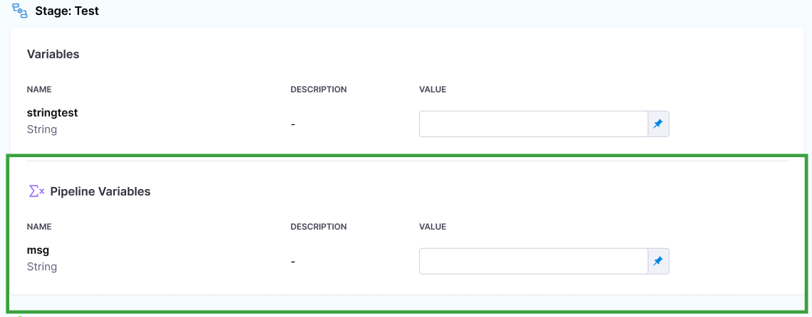
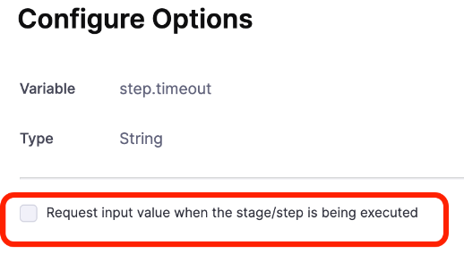
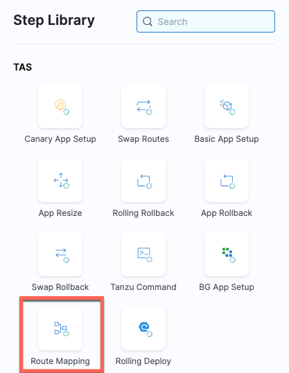
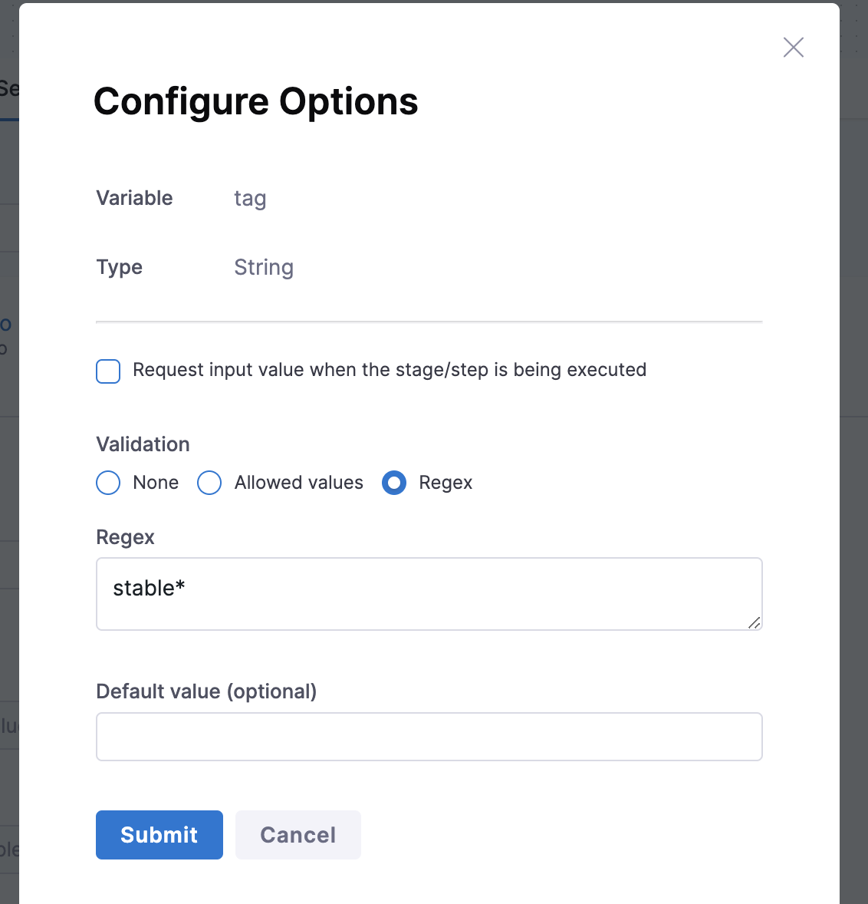
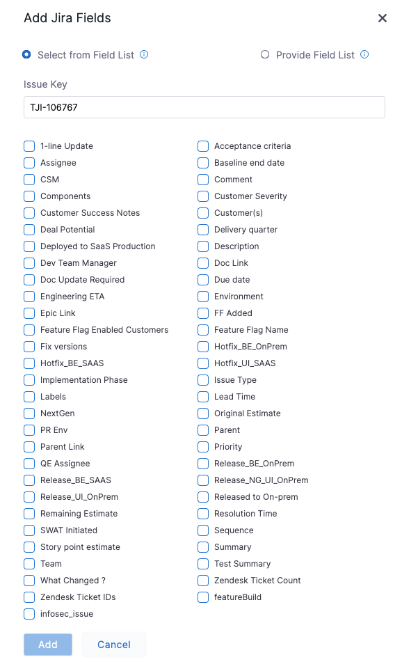
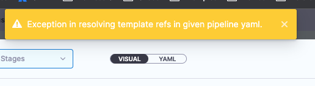
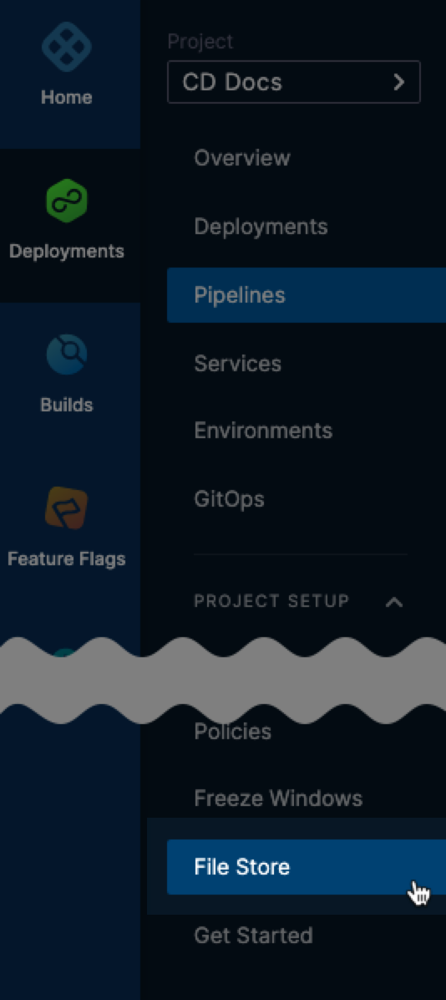

import Tabs from '@theme/Tabs';
import TabItem from '@theme/TabItem';

import delete_project from './static/delete-project.png'

<DocsButton icon = "fa-solid fa-square-rss" text="Subscribe via RSS" link="https://developer.harness.io/release-notes/self-managed-enterprise-edition/rss.xml" />

These release notes describe recent changes to Harness Self-Managed Enterprise Edition, NextGen.

:::info About Harness Release Notes

- **Security advisories:** Harness publishes security advisories for every release. Go to the [Harness Trust Center](https://trust.harness.io/?itemUid=c41ff7d5-98e7-4d79-9594-fd8ef93a2838&source=documents_card) to request access to the security advisories.
- **More release notes:** Go to [Harness Release Notes](/release-notes) to explore all Harness release notes, including module, delegate, FirstGen Self-Managed Enterprise Edition, and FirstGen release notes.

:::

### Breaking change - Ingress

:::danger important upgrade instructions for versions 0.17.x and above

When upgrading to SMP versions 0.17.x and above, the installation may fail if you have any admission webhooks configured for Ingress that do not permit Ingress objects with different names but identical paths. To prevent installation issues, please follow these steps before proceeding with the upgrade:
	
  1.	Run the `update-ingress-objects.sh` script.
	
  2.	The script will prompt you to enter the namespace where Harness is installed.
	
  3.	You will then be asked to provide the version you are upgrading to. For instance, if you are upgrading to Harness 0.21.0, you should input 0.21.0.
	
  4.	The script will automatically update the Ingress objects as needed.

You can find the script in the Harness 0.21.0 release charts at `scripts/update-ingress-objects.sh`, or you can run it directly from this URL: [update-ingress-objects.sh](https://raw.githubusercontent.com/harness/helm-charts/main/src/harness/scripts/update-ingress-objects.sh).

Note: Ensure you have access to the Kubernetes cluster where Harness is running and have the necessary permissions to GET, DELETE, and APPLY Ingress objects.
:::

### Breaking change - Minio

:::danger important upgrade instructions for patch releases 0.15.1, 0.14.6, 0.13.4, and 0.12.1

If you are currently on version 0.12.0, you must follow the applicable upgrade process below to upgrade your version to the latest stable release, 0.12.1.

If you are currently on version 0.13.0, 0.13.1, 0.13.2, or 0.13.3, you must follow the applicable upgrade process below to upgrade your version to the latest stable release, 0.13.4.

If you are currently on version 0.14.3, 0.14.4, 0.14.5, or 0.14.6, you must follow the applicable upgrade process below to latest stable release, 0.15.1.

You can perform your normal upgrade process if you are currently on a version earlier than 0.12.0. Harness recommends that you upgrade to 0.15.1.

**Upgrade version 0.12.1 or 0.13.4 using Helm**

If you use `helm` to upgrade Harness Self-Managed Enterprise Edition, follow the upgrade process below.

1. Set `global.database.minio.mergeLogs` to `true` in your override file.
2. Perform your Harness upgrade.

**All other customers**

If you don't use Helm to upgrade Harness Self-Managed Enterprise Edition, follow the upgrade process below.

1. Exec into your MinIO pod.
2. Run the following command and copy the `MINIO_ROOT_PASSWORD`.

   ```
    env | grep MINIO_ROOT_PASSWORD
   ```

3. Run the following commands.

   ```
   bin/mc alias set minio http://minio:9000
        # Access Key: admin
        # Secret Key: <PASTE_THE_PASSWORD_COPIED_IN_STEP_2>
   ```

   ```
   mkdir /data/backup/
   bin/mc cp --recursive minio/logs /data/backup/
   ```
4. Perform your Harness upgrade.
5. Exec into your MinIO pod after the upgrade has been completed.
6. Run the following command, and then copy the `MINIO_ROOT_PASSWORD`.

   ```
    env | grep MINIO_ROOT_PASSWORD
   ```

7. Run the following commands.

   ```
   bin/mc alias set minio http://minio:9000
        # Access Key: admin
        # Secret Key: <PASTE_THE_PASSWORD_COPIED_IN_STEP_6>
   ```

   ```
   bin/mc cp --recursive /bitnami/minio/data/backup/logs/ minio/logs
   ```

:::


### Breaking change - Looker images

:::danger important changes to looker images

Starting with version 0.17.0, Harness no longer publishes Looker images to the DockerHub public repository. The repository has been transitioned to private.

Looker is required for custom dashboards, a feature not enabled by default in Harness Self-Managed Enterprise Edition. To set up custom dashboards, you must contact [Harness Support](mailto:support@harness.io) to enable the feature.

**For non-air gap packages**

If you require custom dashboards, you can request onboarding. Harness will generate an access token, allowing you to pull the Looker image from DockerHub. Subsequently, Harness will provide you with the Looker license key and DockerHub credentials to update your `override.yaml` file.

You must replace your Looker license after deployment.

Create a new secret and replace `<YOUR_SECRET_NAME>` in the YAML.

```yaml
looker:
    # -- replace looker license at runtime (after deployment)
    # -- reach out to the SMP team
    image:
      imagePullSecrets: [<YOUR_SECRET_NAME>]
```

For more information about creating the secret, go to [Pull an image from a Private Registry](https://kubernetes.io/docs/tasks/configure-pod-container/pull-image-private-registry/#create-a-secret-by-providing-credentials-on-the-command-line) in the Kubernetes documentation.

**For air gap packages**

Harness no longer includes the Looker image in air gap bundles. You can still request onboarding for custom dashboards. Upon request, Harness will generate an access token for pulling the Looker image from DockerHub. Following this, Harness will provide you with the Looker license key and DockerHub credentials.

You must replace your Looker license after deployment.

Harness has implemented updates to the `harness-airgap-images.sh` shell script in the Helm chart repository. These changes facilitate the utilization of the access token for pushing the Looker image to your private repository. Now, the script will inquire whether you wish to install custom dashboards (`ng-dashboard`). If you respond affirmatively, it will then prompt you to provide your DockerHub credentials and image details.

To acquire the necessary `DOCKERHUB_USERNAME` and `DOCKERHUB_PASSWORD`, contact [Harness Support](mailto:support@harness.io). When prompted for the `RELEASE_VERSION`, input the desired version of the Helm chart, such as `0.17.0`.

Upon providing your credentials and the release version, the script will proceed to push the Looker image to your private repository.

:::

### Note for ArgoCD based installations

:::warning important instructions for ArgoCD based deployments and upgrades

If you’re using ArgoCD to deploy Harness with Custom Dashboards (Looker) enabled, you might run into issues during upgrades with the encryption/decryption key. ArgoCD re-generates the Looker encryption key with every upgrade because it uses helm template to inflate resources. To avoid this, you need to ensure the key remains consistent across upgrades.

To fix this issue, follow these steps

  1. Retrieve the Looker secret using this command:

  ```bash
  kubectl get secrets looker-secrets -o yaml -n <namespace>
  ```

  2. Copy the value of lookerMasterKey from the secret and decode it using the following command or any base64 decoder. You’ll need to decode it twice.
  It's required to decode the secret value twice because during creation, first it's encoded by the helm function in the charts and then Kubernetes encodes it again while creating the secret.

  ```bash
  echo "<base64-encoded-lookerMasterKey>" | base64 --decode | base64 --decode
  ```

  3. After decoding, update your ArgoCD values override with the decoded key:

  ```yaml
  platform:
  looker:
    secrets:
      lookerMasterKey: "<your-decoded-key>"
  ```

By doing this, you ensure that the same lookerMasterKey is used during upgrades, avoiding encryption issues.
:::

## October 4, 2024, version 0.21.0

This release includes the following Harness module and component versions.

| **Name** | **Version** |
| :-- | :--: |
| Helm Chart | [0.21.0](https://github.com/harness/helm-charts/releases/tag/harness-0.21.0) |
| Air Gap Bundle | [0.21.0](https://console.cloud.google.com/storage/browser/smp-airgap-bundles/harness-0.21.0) |
| NG Manager | 1.55.8 |
| CI Manager | 1.45.5 |
| Pipeline Service | 1.93.6 |
| Platform Service | 1.37.2 |
| Access Control Service | 1.58.2 |
| Delegate | 24.08.83804 |
| GitOps Service | 1.17.9 |
| Change Data Capture | 1.33.3 |
| STO Core | 1.108.4 |
| Test Intelligence Service | 1.27.1 |
| NG UI | 1.41.4 |
| LE NG | 1.3.1 |
| Looker | 1.1.0 |

#### Alternative air gap bundle download method

Some admins might not have Google account access to download air gap bundles. As an alternative, you can use `gsutil`. For `gsutil` installation instructions, go to [Install gsutil](https://cloud.google.com/storage/docs/gsutil_install) in the Google Cloud documentation.

```
gsutil -m cp \

  "gs://smp-airgap-bundles/harness-0.21.0/ccm_images.tgz" \
  "gs://smp-airgap-bundles/harness-0.21.0/cdng_images.tgz" \
  "gs://smp-airgap-bundles/harness-0.21.0/ce_images.tgz" \
  "gs://smp-airgap-bundles/harness-0.21.0/ci_images.tgz" \
  "gs://smp-airgap-bundles/harness-0.21.0/ff_images.tgz" \
  "gs://smp-airgap-bundles/harness-0.21.0/platform_images.tgz" \
  "gs://smp-airgap-bundles/harness-0.21.0/sto_images.tgz" \
  .
```

### Early access features

#### Continuous Integration

- Added support for automatic setup of Build Intelligence for builds running in Harness Cloud. Customers can set the stage property `buildIntelligence` to `true` in order to use this feature. Once enabled, Harness CI will automatically optimize Run and Test steps that are running Bazel or Gradle commands, to reduce build time. (CI-12969)

### New features and enhancements

#### Continuous Integration

- Cache Intelligence was enhanced with support for C# . Customers using C# applications can now leverage automatic dependencies caching with Cache Intelligence. (CI-12672)

- Added a new setting in the account default settings under CI named `Upload Logs Via Harness`, allowing customers to route CI step execution logs through Harness’ log service instead uploading them directly from the build environment. This was previously behind a feature flag, but is now available for all users. (CI-13647)

#### Harness Platform

- PodDisruptionBudgets can now be created using global and service-level overrides and can be enabled for supported services. (PL-56564, ZD-68426)

  At the global level, for all supported services

  ```yaml
  global:
    pdb:
      create: true
  ```

  At service level, for individual service (eg: ng-manager)
  ```yaml
  platform:
    ng-manager:
      pdb:
        create: true
  ```

  If PDB is enabled globally, it will create PDB for all supported services. If the requirement is to create PDB for specific services, then it needs to be enabled for each service.

  `minAvailable` and `maxUnavailable` can be set to either percentage or absolute value. If both of them are set then `minAvailable` will take precedence.

  ```yaml
  global:
    pdb:
      create: true
      minAvailable: "50%"
      maxUnavailable: "50%" # set either of these two
  ```
  The default value is minAvailable: `50%`

  *Note: PDB support for log-service will be available from the next release.*


- SSCA module has been enabled on Custom Dashboards. This allows users to integrate SSCA functionality within their dashboards. (PL-56177)

- Resolved an issue where notification rules were not executed for delegates with selected tags instead of group names. The notification trigger now correctly matches the entity identifiers against those in the notification rules. (PL-51795)

- Upgraded the Spring Framework libraries to version `6.0.18` to address multiple critical CVEs reported by Prismacloud. (PL-38815, ZD-42531, ZD-44910, ZD-46364, ZD-50403, ZD-52222, ZD-53107, ZD-53760, ZD-55114, ZD-60387, ZD-61129, ZD-62327, ZD-62502, ZD-62674, ZD-62690, ZD-63256, ZD-63383)

- The BouncyCastle library has been upgraded from version `1.76` to `1.78` to address several medium-severity CVEs (CVE-2024-29857, CVE-2024-30171, CVE-2024-30172) and enhance overall system security. (PL-51346)

- Upgraded the `dnsjava` library to version `3.6.0` to address CVE-2024-25638, which involved potential security vulnerabilities in DNS query responses. This item requires Harness Delegate version 24.08.83800. For information about Harness Delegate features that require a specific delegate version, go to the [Delegate release notes](/release-notes/delegate). (PL-55721, ZD-63383, ZD-68810) 

- Upgraded the org.apache.cxf:cxf-core library from version 3.5.8 to 3.5.9 to address a security vulnerability (CVE-2024-32007). This upgrade enhances the security and stability of the application. (PL-55722, ZD-63383)

### Fixed issues

#### Chaos Engineering

- Fixed the error associated with upgrading a chaos infrastructure by providing relevant permissions for the upgrade agent in the execution plane (user host/cluster). (CHAOS-5980)

#### Cloud Cost Management

- Budget Amount Reset: Earlier, navigating between the budget creation steps caused the budget amount settings to reset to defaults. The budget form fields will now retain their values when switching between steps. (CCM-10953)

- Cost Category Name Updates: We have addressed an issue where cost category name updates were not properly reflected in perspective rules, ensuring the correct category names are used in all relevant areas. (CCM-18977)

- Recommendations Slider Action: Previously, using the buffer slider in the CCM "recommendations" view and hitting the back button moved the slider instead of returning to the main recommendations page. Now, the back button no longer includes slider actions. (CCM-11303)

- Budget Percentage Display Issue: Previously, when a budget amount was set to 0, the percentage spend comparison displayed as "Infinity." This has been fixed. (CCM-19171)

#### Continuous Delivery

- Previously, when a Pipeline Execution was aborted due to a Deployment Freeze, the details of the Freeze were not accessible from the Execution Console view. This issue was resolved by adding the details to the Console View. (PIPE-20658)

- Users were unable to move or delete a service-specific override. This issue is resolved. The permissions required to move or delete a service-specific override for global environment and infrastructure is `core_environment_edit`. The permissions required for service-specific override or service and infrastructure is `core_service_edit`. Separate permissions to delete are not required.  (CDS-100204, ZD-68468, ZD-68759)

- The Helm chart deployments failed when the `values` YAML file contained double quotes. This issue is resolved. (CDS-100174, ZD-68747, ZD-68940)

- The service variable that referenced secret text was exposed in plaintext delegate logs when executing CD WinRM deployment. This issue is resolved. The warning logs are updated with debug logs. (CDS-100046, ZD-68713)

- When using a WinRM credential of "type = Kerberos" in a PowerShell script, the output variables were not displayed properly due to a missing identifier. This issue is resolved. (CDS-100036, ZD-68283)

- Service was not loading when the service and environment used a custom template configured as **Always use the stable version**. This issue is resolved. (CDS-100021, ZD-68666)

- Custom stage pipelines did not show the environment in the pipeline execution history. This issue is resolved now.(CDS-99938)

- The error title **Intervention** was displayed when the verification step failed. The title is now updated to **Verification Failure**. (CDS-99671,ZD-65113)

- The placeholder in the health source connector component, which previously displayed `GCP`, has now been updated to `BigQuery`. There is no functionality change with the issue resolution. (CDS-99519)


- The runtime input symbol was getting displayed even when **fixed values** was selected from the templates in the monitored services. This issue has been resolved. (CDS-99518) 

- On the services page, the deployment type icon did not consistently appear. This issue has been resolved. (CDS-99331, ZD-66892)

- GitOps deployments were not tracked for multiple projects because the Harness Gitops instances service was out of sync with applications without project mappings. This issue has been resolved. (CDS-98989, ZD-63203)

- Earlier, deleting the entire expressions from the delegate selector field at the step level was not possible. This issue is resolved. (CDS-96694)

- The Service and environment values saved as input sets of monitored service template in the verify step were not available while running the pipeline. This issue is resolved. (CDS-96581)

- The tooltip for the **Output Alias** (optional) field under **Optional Configuration** was not being displayed. This issue is resolved. (CDS-90919)

- When the Input Set YAML was invalid, the backend response lacked the necessary error message and the `entityValidityDetails` parameter. This issue has been fixed by ensuring that invalid YAML is properly displayed in the YAML view, with the visual view disabled to avoid further errors and improve consistency across entities.(PIPE-20705, PIPE-20536)

- The tooltip for affected components on the status page was broken, and the scheduled maintenance was being displayed too early. These issues have been fixed, ensuring the tooltip works correctly and that the maintenance notification only appears shortly before the maintenance window starts. (CDS-100526)

- Invalid Input Set YAML was not properly displayed in the YAML view. The issue is fixed now. (PIPE-20705)

- The tooltip for affected components on the status page was broken, and the scheduled maintenance was being displayed too early. These issues have been fixed, ensuring the tooltip works correctly and that the maintenance notification only appears shortly before the maintenance window starts. (CDS-100526)

- When switching from 'All Infrastructure' to a specific infrastructure, the selected infrastructure would be dropped. Additionally, the infrastructure section was incorrectly accessible when the environment was set as a runtime input during multiple environment/infrastructure deployments, and there were issues with pagination support where infrastructure was disabled when the environment was a runtime input. These issues have now been resolved, ensuring proper infrastructure selection, access restrictions, and pagination support. (CDS-100178)

- Previously, when using the GitOps Sync Step, even if only a few clusters were selected from the provided environment and a regex was given, the sync would incorrectly sync all apps across all clusters. This issue has been fixed, and now only the apps in the selected clusters will be synced as expected. (CDS-100130)

- Previously, when `agentId` was set as a runtime input, `applicationName` was not set as a runtime input as expected. This issue has now been fixed. (CDS-99821)

- The page number of project and connector list page was not getting reset when applying favourite filter. The issue is fixed now. (CDS-99747)

- The favourite icon on connector details page was not getting higlighted when connector is marked as favourite. The issue is fixed now. (CDS-99742)

- Previously, when accessing remote environments through the grid view, navigation did not land on the correct page, and the Git details were missing on the detail page. This issue has been fixed by updating the query parameters, ensuring that remote environments now navigate to the correct page and display the required Git details. (CDS-99435)

- Previously, the service details call sorted by `lastUpdatedAt` on a fresh load, but the UI displayed `Last modified` in the filter. This caused inconsistency where edited services retained their position, and cloned services appeared last. Once the filter was selected with `Last modified`, the sort switched to `lastModifiedAt`, displaying edited or cloned services at the top. Additionally, in the environment view, the UI showed `Last Updated`, but the sorting parameters were sent as `lastModifiedAt`. The issue is fixed now. (CDS-98986)

- Previously, when attempting to save a CV step without selecting a CV type, the step could not be saved, but no error message or notification was displayed to indicate the missing configuration. This issue has been resolved by adding an error message, `Verification type is required`, to inform users when the CV type is not selected. (CDS-98977)

- When editing the additonal manifest, the manifest type is different. The issue is fixed and now the manifest type will be same as selected and match the sidebar. (CDS-98975)

- Access Control to GitOps Applications can now be managed using Labels. This allows Applications to be automatically added to the required Access Control Resource Groups. See https://developer.harness.io/docs/continuous-delivery/gitops/use-gitops/manage-permissions/ for more details. (CDS-97914)

- When creating a GitOps Application, the cluster can now be specified by name instead of using the IP address, if required. This is helpful in cases where the Cluster IP may change in the backend. (CDS-96922)

- We identified and resolved an issue where creating multiple project-level GitOps resources using Terraform would partially fail if no existing app project mapping was in place. This failure was due to a race condition caused by multiple resources attempting to create app project mappings simultaneously. With the issue resolved, Terraform can now be used to create multiple project-level GitOps resources without encountering this problem.  (CDS-101361)

- Added validation against existing account, org and project in create/update requests for gitops resources. (101364)

#### Continuous Integration

- Removed the CI onboarding flow for new projects on SMP environments, where users were previously directed to a 'Get Started' page that could fail due to `clientSecret` setup for Stripe. Now, customers will be directed to the Overview page instead. Upcoming releases will include changes to completely remove the Get Started option from the side navigation for SMP customers, ensuring it is no longer visible. (CI-13687)

- Fixed an issue where the plugin image url was incorrect when the registry url had a port configured. This issue occurred because everything after : was being considered as the tag of the image, leading to an invalid Fully Qualified Name (FQN) and causing the Initialize step to fail in the Kubernetes flow. The fix ensures that the FQN is properly considered when the registry endpoint includes a port number. (CI-13770, ZD-66772)

- Fixed an issue where pipeline failures at the initialization step resulted in the entire pod YAML, including environment variables with secrets, being logged as an error. The log level has been changed to debug to prevent sensitive data exposure, and a new log has been added to capture essential details without including the full object. (CI-13785)

- For SMP customers, the 'getting started' flow for CI has been removed from the side navigation. (CI-13821)

- Bitbucket has an issue in their API; it does not support the slash character ( / ) https://jira.atlassian.com/browse/BCLOUD-20223 This can be worked around by using query parameters in the Bitbucket api https://api.bitbucket.org/2.0/repositories/smjth/originalrepo/?at=qq/ww (CI-13826)

- Corrected the visibility of the NodeSelector field label in the CI stage infrastructure tab when using Kubernetes infrastructure. The reference for the node selector string has been fixed to ensure the label is properly populated. (CI-13867)

- Due to Docker rate limiting, `CI_ENABLE_BASE_IMAGE_DOCKER_CONNECTOR` feature flag must be enabled whenever a base image connector is used (CI-13924)

- Fixed an issue where time savings due to Harness CI intelligence feature, didn't populate properly when used in the parallel CI stages. (CI-13993)

- Fixed an issue where time savings due to Harness CI intelligence feature, didn't populate properly when used in the parallel CI stages. (CI-13993)

- Corrected the popup UI displaying incorrect time savings that were being cached from other steps in cache intelligence. (CI-13995)

#### Harness Platform

- Fixed an issue where RBAC permissions were not reflecting properly in SMP and SNAPSHOT environments. The bug was caused by a shared lock across multiple services, leading to delays in event processing. Separate locks have been introduced for each service to resolve the issue. (PL-56509)

- Fixed an issue where legacy delegates failed to work with non-root users after the 1.0.83605 upgrade. The working directory for shell script delegates has been reverted to the current directory, ensuring proper functionality. (PL-55792)

- Fixed an issue where pipelines could get stuck in the running state due to delegate task handling. A new flow has been introduced to recompute eligible delegates after 3 rounds of broadcast, ensuring tasks are acquired even if delegates restart. This fix is controlled by the `RECOMPUTE_ELIGIBLE_DELEGATES_LIST` feature flag and requires Harness Delegate version 24.08.83802. For information about Harness Delegate features that require a specific delegate version, go to the [Delegate release notes](/release-notes/delegate). (PL-55249, ZD-66247)

- Added an index for Audit Logs to improve query performance and reduce CPU usage (PL-56977)

- The `displayname` attribute from SAML assertions is now honored for new JIT-provisioned users logging in via SAML. This ensures that usernames are correctly updated to reflect the displayname attribute, addressing inconsistencies in user names. (PL-55616)

- Fixed an issue preventing Canny login from the Harness UI for customers using vanity URLs. The Canny login flow now correctly redirects to sso.html, enabling seamless access across all environments, including global gateway clusters and vanity URLs. (PL-55679, ZD-66968, ZD-67907)

- The delegate initialization process has been moved from a background thread to the start of application. This change addresses issues with health check failures during startup by ensuring that delegate registration, websocket establishment, and heartbeat scheduling are completed before health checks are performed. This item requires Harness Delegate version 24.08.83700. For information about Harness Delegate features that require a specific delegate version, go to the [Delegate release notes](/release-notes/delegate). (PL-55905, ZD-67667)

- Resolved an issue where not all user groups were visible in search results when inherited groups exceeded 1000. The search now displays a higher number of inherited user groups, ensuring comprehensive visibility for all user groups across your organization. (PL-56021, ZD-68131)

- Fixed an issue where adding a new tag using the mouse click in the Tags input box on Default Settings Page wasn't working. Users can now create tags using both mouse clicks and the ENTER key. (PL-56098)

- Fixed an issue where installing or upgrading SMP to version 0.19.0 would fail when `harness-secrets` was disabled. This issue was due to a version inconsistency in the common chart used by Helm, which has now been resolved by adjusting the chart hierarchy. (PL-56179)

- Updated the delegate expiration logic to align with the 6-month support and 2-month upgrade policy. This ensures that delegates maintain compatibility and support within the specified time frame. This item requires Harness Delegate version 24.08.83800. For information about Harness Delegate features that require a specific delegate version, go to the [Delegate release notes](/release-notes/delegate). (PL-56193, ZD-68597, ZD-69188, ZD-69266)

- Resolved an issue causing SCM binaries to not be found during delegate startup with versions `24.07.83605` and `24.07.83606`. Updated the handling of default values for built-in Docker environment variables to prevent delegate initialization errors. This item requires Harness Delegate version 24.08.83800. For information about Harness Delegate features that require a specific delegate version, go to the [Delegate release notes](/release-notes/delegate).  (PL-56209, ZD-68661)

- Fixed an issue where restarting a delegate with an account-level token incorrectly moved the existing project-level delegate group to the account level. The query for locating the existing delegate group has been updated to ensure that it correctly handles cases where the owner field is null, preventing unintended group migrations. This item requires Harness Delegate version 24.08.83800. For information about Harness Delegate features that require a specific delegate version, go to the [Delegate release notes](/release-notes/delegate). (PL-56377)

- Resolved consistent proxy authentication issues seen after delegate upgrade by removing unnecessary environment variable expansion and adding URL encoding for special characters. The `PROXY_PASSWORD` environment variable is now handled correctly, ensuring proper authentication without requiring expansion. This item requires Harness Delegate version 24.08.83802. For information about Harness Delegate features that require a specific delegate version, go to the [Delegate release notes](/release-notes/delegate). (PL-56623, ZD-68887)

#### Security Testing Orchestration

- Users can now deselect Jira project and ticket type settings at the account, organization, or project level, similar to other settings pages. Removing the Jira connector will automatically delete the associated external ticket settings, allowing users to fully disconnect their Jira integration if desired. (STO-7892, ZD-67770)

## September 12, 2024, version 0.20.2

This release includes the following Harness module and component versions.

| **Name** | **Version** |
| :-- | :--: |
| Helm Chart | [0.20.2](https://github.com/harness/helm-charts/releases/tag/harness-0.20.2) |
| Air Gap Bundle | [0.20.2](https://console.cloud.google.com/storage/browser/smp-airgap-bundles/harness-0.20.2) |
| NG Manager | 1.51.9 |
| CI Manager | 1.41.3 |
| Manager | 1.42.5 |
| Pipeline Service | 1.89.2 |
| Platform Service | 1.34.2 |
| Access Control Service | 1.56.1 |
| Delegate | 24.07.83611 |
| GitOps Service | 1.15.4 |
| GitOps Agent | 0.78.0 |
| Change Data Capture | 1.25.1 |
| STO Core | 1.106.0 |
| Test Intelligence Service | 1.27.0 |
| NG UI | 1.37.5 |
| LE NG | 1.3.0 |
| Looker | 1.1.0 |

#### Alternative air gap bundle download method

Some admins might not have Google account access to download air gap bundles. As an alternative, you can use `gsutil`. For `gsutil` installation instructions, go to [Install gsutil](https://cloud.google.com/storage/docs/gsutil_install) in the Google Cloud documentation.

```
gsutil -m cp \

  "gs://smp-airgap-bundles/harness-0.20.2/ccm_images.tgz" \
  "gs://smp-airgap-bundles/harness-0.20.2/cdng_images.tgz" \
  "gs://smp-airgap-bundles/harness-0.20.2/ce_images.tgz" \
  "gs://smp-airgap-bundles/harness-0.20.2/ci_images.tgz" \
  "gs://smp-airgap-bundles/harness-0.20.2/ff_images.tgz" \
  "gs://smp-airgap-bundles/harness-0.20.2/platform_images.tgz" \
  "gs://smp-airgap-bundles/harness-0.20.2/sto_images.tgz" \
  .
```

#### Fixed issues

- Harness enabled the feature flag `OPA_RBAC_FEATURE` by default. You should now see the policies section on the **RoleDetails** page.

- Added APIs for getting a Harness GitOps cluster object with identifiers and metadata using an URL.

## September 3, 2024, version 0.20.0

This release includes the following Harness module and component versions.

| **Name** | **Version** |
| :-- | :--: |
| Helm Chart | [0.20.0](https://github.com/harness/helm-charts/releases/tag/harness-0.20.0) |
| Air Gap Bundle | [0.20.0](https://console.cloud.google.com/storage/browser/smp-airgap-bundles/harness-0.20.0) |
| NG Manager | 1.51.9 |
| CI Manager | 1.41.3 |
| Pipeline Service | 1.89.2 |
| Platform Service | 1.34.2 |
| Access Control Service | 1.56.1 |
| Delegate | 24.07.83611 |
| GitOps Service | 1.15.2 |
| GitOps Agent | 0.78.0 |
| Change Data Capture | 1.25.1 |
| STO Core | 1.106.0 |
| Test Intelligence Service | 1.27.0 |
| NG UI | 1.37.5 |
| LE NG | 1.3.0 |
| Looker | 1.1.0 |

#### Alternative air gap bundle download method

Some admins might not have Google account access to download air gap bundles. As an alternative, you can use `gsutil`. For `gsutil` installation instructions, go to [Install gsutil](https://cloud.google.com/storage/docs/gsutil_install) in the Google Cloud documentation.

```
gsutil -m cp \

  "gs://smp-airgap-bundles/harness-0.20.0/ccm_images.tgz" \
  "gs://smp-airgap-bundles/harness-0.20.0/cdng_images.tgz" \
  "gs://smp-airgap-bundles/harness-0.20.0/ce_images.tgz" \
  "gs://smp-airgap-bundles/harness-0.20.0/ci_images.tgz" \
  "gs://smp-airgap-bundles/harness-0.20.0/ff_images.tgz" \
  "gs://smp-airgap-bundles/harness-0.20.0/platform_images.tgz" \
  "gs://smp-airgap-bundles/harness-0.20.0/sto_images.tgz" \
  .
```

### Early access features

#### Continuous Delivery

- When deploying to Amazon's EKS, a new option to manually configure the connection to the cluster is available. Previously, you could only connect through an AWS Connector. Now, you can provide the cluster endpoint and optionally provide a CA cert. This feature is behind the feature flag `CDS_AWS_EKS_CLUSTER_MANUAL_CONFIGURATION`. Contact [Harness support](mailto:support@harness.io) to enable it. (CDS-91561)

#### Continuous Integration

This release introduces several highly requested features and improvements to enhance the Git clone operations within Harness, in both the Git Clone step and the native Clone Codebase functionality. With this release, we’re adding support for:

- Git LFS - Allows users to clone repositories with large file storage (LFS) efficiently.

- Fetch Tags - Enables fetching of tags during the clone operation.

- Sparse Checkout - Enables cloning specific subdirectories.

- Clone Submodules - Adds options for including and recursively cloning Git submodules.

- Clone Path Customization - Exposes the clone path in the codebase section, allowing users to specify a custom clone directory.

- Additional Pre-Fetch Command - Ability to specify any additional Git commands to run before fetching the code.

For more information, please refer to the [documentation](../docs/continuous-integration/use-ci/codebase-configuration/git-clone-step). (CI-12952, CI-13239)

This feature is currently behind the feature flag, `CI_GIT_CLONE_ENHANCED`. Contact [Harness support](mailto:support@harness.io) to enable it.

### New features and enhancements

#### Chaos Engineering

- Adds a new Kubernetes pod fault, [pod IO mistake](/docs/chaos-engineering/use-harness-ce/chaos-faults/kubernetes/pod/pod-io-mistake) that causes files to read or write an incorrect value. (CHAOS-5916)

- Adds proxy support for Windows chaos infrastructure. (CHAOS-5859)

- Adds support to install Windows chaos infrastructure offline. (CHAOS-5833)

- Unifies chaos injection by introducing a dumb agent to invoke user action and pass the results of the chaos experiment to the control plane. (CHAOS-5610)

- Implements AWS FIS generic experiment that helps users execute and monitor any AWS FIS template. (CHAOS-5418)

- Converts the default health check probes to `type:inline` from `type:source` for Kubernetes infrastructure to improve the execution speed of chaos experiments. (CHAOS-4348)

#### Code Repository

- Added handlers for more error status code scenarios. (CODE-2113)	

#### Harness Platform

- Improved delegate cache to reduce cache misses and optimize performance. This update ensures more reliable and efficient caching, addressing issues identified in recent incidents. (PL-55626)

- Enhanced AppRole token cache for HashiCorp Vault: Updated the cache key calculation to include secretId and approleId. This change fixes a problem where tokens were not being refreshed correctly. Now, the cache accurately reflects the latest credentials, ensuring secure and reliable token management. This item requires Harness Delegate version 24.07.83605. For information about Harness Delegate features that require a specific delegate version, go to the [Delegate release notes](/release-notes/delegate). (PL-55567, ZD-65493)

- Introduced a new feature in the Connector details Page that supports favorites. You can now mark connectors as `favorites`, making it easier to filter and manage your preferred connectors for a more streamlined experience. (PL-55460)

- We have added a security check to restrict SAML assertions to a single login. Any attempt to reuse a SAML assertion within its expiry period will now be rejected by Harness during login. Currently, this feature is behind the feature flag `PL_ENABLE_SAML_ASSERTION_CACHE`. Contact [Harness Support](mailto:support@harness.io) to enable the feature. (PL-55247, ZD-66114)

- Upgraded the `io.netty_netty-codec-http` library to address a medium-severity issue. The version has been updated from 4.1.101.Final to 4.1.108.Final. (PL-51350)

- Upgraded the `org.apache.cxf_cxf-core` library from version 3.5.5 to 3.5.8 to address a medium-severity issue CVE-2024-28752. (PL-51348, ZD-66657)

- Added proxy configuration support for external notification channels in SMP. To address issues faced by customers who operate in air-gapped environments, we've introduced proxy settings for the platform service. By updating the override file with proxy details, notifications via MS Teams and Slack will now function correctly even when behind a proxy. This feature is available in SMP version 0.19.0. This item requires Harness Delegate version 24.07.83605. For information about Harness Delegate features that require a specific delegate version, go to the [Delegate release notes](/release-notes/delegate). (PL-48415, ZD-59707, ZD-62139)

- Upgraded the `yq` base image version 4.44.2 to address a Go CVE. (PL-55549)

- Added support for a custom authentication path in the HashiCorp Vault integration for AppRole authentication. Users can now specify a custom path if needed, enhancing flexibility in meeting security requirements. Currently, this feature is behind the feature flag `PL_APPROLE_CUSTOM_PATH` and requires Harness Delegate version >= 24.07.836xx. Contact [Harness Support](mailto:support@harness.io) to enable the feature and for information about Harness Delegate features that require a specific delegate version, go to the [Delegate release notes](/release-notes/delegate).(PL-51859)

- Upgraded PostgreSQL from version `14.9.0-debian-11-r60` to `14.11.0-debian-11-r17` to address multiple high-severity CVEs. (PL-51820)

- Disabled the ability to add users to externally managed or SSO-linked user groups. The checkbox for these groups is now grayed out, with a hover message explaining the restriction. (PL-51216)

#### Security Testing Orchestration

- If you add parallel steps at the end of the pipeline and then attempt to add another set of parallel steps at the top level, only the first step gets added. This issue has been fixed (STO-7783).

- The error causing STO steps not to run in the CI stage has now been fixed (STO-7887).

- You can now override the security testing scanner image at the step level. Learn more about [configuring your pipeline to use STO images from your private registry](/docs/security-testing-orchestration/use-sto/set-up-sto-pipelines/configure-pipeline-to-use-sto-images-from-private-registry#configure-your-pipeline-to-use-images-from-your-registry). (STO-7724)

### Fixed issues

#### Chaos Engineering

- Fixed an issue where an experiment in the `Error` state would not finish, and be in a state of infinite run timestamp. (CHAOS-5577)

#### Cloud Cost Management

- Jira Operations for On-Premise Jira: We have added support for Jira operations corresponding to CCM recommendations for on-prem Jira installations, ensuring smoother integration and functionality. [CCM-18315]

- Azure Data Sync Frequency Update: The Azure data sync frequency has been changed from 1 day to 1 hour. This enhancement will allow data to flow faster for Azure customers, reducing wait times and improving data availability [CCM-18014]

- Changes to K8s delegate YAML: We have modified the default K8s delegate YAML, in the [Quick Create flow](https://developer.harness.io/docs/cloud-cost-management/get-started/onboarding-guide/set-up-cost-visibility-for-kubernetes/) for creating Kubernetes connector. This ensures that new configurations are utilised for creation of delegate. [CCM-18577]

#### Continuous Delivery

-  When the Git provider was set to Harness Code, additional unnecessary list-repos and list-branches API calls were made, even when the default connector was already configured in the settings. The issue is fixed now. (PIPE-20665)

- The Output tab failed to display correct details when viewing retry steps with the console view toggle enabled. This was due to the incorrect step ID being passed for retry steps. The issue is fixed now. (PIPE-20648, ZD-67024)

- While connecting to the Git sync service, a connection error was being thrown. This issue is fixed by increasing the retry policy from 1 to 3. (PIPE-20589, ZD-67247,67488)

- The input set search feature did not return correct results when searching from pages other than the first page. For example, when searching for an input set from page 3 or 4, no results were displayed, even if matching input sets existed. The issue is fixed now to ensures that the search operation covers all input sets, providing accurate results regardless of the page the user is on. (PIPE-20209)

- In a few cases, skipped stages/steps in Pipeline executions were being displayed in blue instead of grey. The issue is fixed now. (PIPE-20138, ZD-65966)

- Stage/Step popover was hidden behind the Navigation UI. The issue is fixed now. (PIPE-20028, ZD-65628)

- The pipeline clone API was failing when attempting to clone a pipeline from the default branch to a non-default branch within the same repository. This failure occurred because the API incorrectly tried to locate the existing pipeline in the non-default branch instead of the default branch. The issue is fixed now. (PIPE-19847)

- In certain cases, the execution order and failure handling in pipelines were inconsistent. For example, if the last stage in a failed, the deployment continued instead of stopping. Additionally, steps within a step group sometimes executed even if previous steps had failed, causing confusion about the conditional execution logic and maximum concurrent executions not being honored. The issue is fixed now and StepGroup combinations will now be marked as skipped if one of the steps in the StepGroup fails and rollback happens during Pipeline Execution. (PIPE-19763, ZD-65041)

- When we rerun a pipeline with multi-env deployment stages or stages in a Matrix, the rerun would skip over the stages that were skipped the last time, without re-evaluating the Execution Condition. This is fixed now; the Executional Condition is re-evaluated for previously skipped stages in Matrix during re-run, and if the condition is now true, they are executed. Note, this is only in the case where the execution failed midway within a Matrix or Multi-Env deployment in the pipeline, and we need to rerun the pipeline from that Matrix. (PIPE-19746, ZD-64970)

- The deployment status API returns outdated or invalid information. This issue is fixed and we've added a new Deployment Status API, which honours permissions, and returns a correct 200 response with a QUEUED status, for Triggers which are in queued state. This will replace the existing API which behaved incorrectly in some situations, and will be deprecated. (PIPE-19306, ZD-62849)

- There was an issue with the EKS cluster field (initialValues) when using manual configuration. The issue is fixed now. (CDS-99535)

- The pipeline deployed using the rolling deployment were encountering a `NotificationTargetARN` error. This issue is resolved now with support for adding lifecycle hooks with different notificationARNs and roles during the time of creation of ASG. (CDS-99460, ZD-67371)

- When renaming a file by adding an extension to the file name in the Harness File Store, the file's content was previously deleted. This issue has been fixed to ensure that file content is maintained when updating file metadata in the File Store. (CDS-99202, ZD-66962)

- Users were unable to delete services that had been soft deleted from the service dashboard page. This issue has been resolved by adding functionality to support the deletion of these services. (CDS-99344, ZD-67225)

- The K8s manifest connector runtime field was not visible in the run pipeline form. This issue has been resolved, and the runtime field is now visible in both the run pipeline form and the input set form. (CDS-99171, ZD-66902)

- Creating a NewRelic health source for a monitored service does not provide a method to select the correct application ID. This issue is fixed now and system collects and shows all the Application Ids from NewRelic.(CDS-98867, ZD-66434)

- Using an expression in the auto-approval for the approval step threw an error. This issue is fixed.(CDS-98842, ZD-66329)

- When you scroll to the bottom of the Pipeline Page and click on the last pipeline on the page, if your default view is YAML, the YAML in the Pipeline Studio was previously opening in a scrollable view. This issue has now been fixed. (CDS-98674, ZD-65768,66530)

- Scrolling was not working when the cursor was inside the script step. The issue is fixed now. (CDS-98607)

- Previously, when trying to edit an existing Values YAML Manifest in the overrides section, users had to click a pencil icon on the far right. After clicking this pencil icon, another pencil icon, which was mostly hidden, appeared on top of the LOCATION section. This caused confusion as users were not seeing the second pencil icon. This issue has now been fixed. (CDS-98565, ZD-65892)

- The Verify step was not appearing in Continuous Deployment (CD) for SMP version 1.19.10. This was because the Verify step was initially part of the Service Reliability Management (SRM) module. Users who did not have the SRM module enabled could not see the Verify step. Now, as Continuous Verification (CV) has been moved to CD, this step will be available for all users who have CD enabled. (CDS-98542, ZD-65452)

- When a user tried to fetch a payload file from Bitbucket, it threw an invalid payload format and the HTTP capability check returned a 501 status code, indicating Bitbucket connectivity problems. This issue is fixed now.(CDS-98500, ZD-65594)

- GitOps instances on Harness service were out of sync with applications that did not have project mappings but were part of the agent. The issue is fixed now. (CDS-96719, ZD-63203)

- Terraform configuration for a monitored service returned the `500` response code. This issue occurred due to incorrect un-marshalling of Terraform configuration to the JSON object for the API request. This led to backend validations failing and causing the `500` response code. This issue is fixed by adding more validations/null checks in the backend. (CDS-96374, ZD-62737)

#### Continuous Integration

- Fixed an issue where external endpoints were used for internal service communication, causing token authentication failures and 401 errors. The issue was resolved by ensuring internal communication for the services. (CI-13686)

- Introduced the `CI_PR_MERGE_STRATEGY_BRANCH` flag to enable the Merge Commit Strategy for Git clone, addressing previous issues with the GitHub API. Additionally, a stage variable `PR_MERGE_STRATEGY_BRANCH` has been added. Both the Merge Commit and Source Branch strategies now function as expected. (CI-13625)

- Fixed an issue where SSH account-level Git connectors were failing during the connection test and status checks due to using an incorrect port. (CI-13578, ZD-67248,67266)

- Improved error message for anonymous base image connector option in the 'Build and Push' steps. (CI-13562)

- Fixed an issue where the plugin image path was incorrect when the registry endpoint had a port configured. This issue occurred because everything after : was being considered as the tag of the image, leading to an invalid Fully Qualified Name (FQN) and causing the Initialize step to fail in the Kubernetes flow. The fix ensures that the FQN is properly considered when the registry endpoint includes a port number. (CI-13455, ZD-66772)

-Fixed an issue where the Harness Build URL could exceed 255 characters if the projectId, orgId, or PipelineId identifiers were too long. Changes have been made to remove stageExecId from the Build URL to reduce the URL length in the case of non-matrix stages. (CI-13402, ZD-66211)

- Fixed an issue where pipelines were getting queued when running concurrently. The fix ensures that the flush API log lines are sanitized to be less than 4MB, avoiding grpc `ResourceExhausted` failures. (CI-12879, ZD-64595)

- Fixed an issue where, if the base image connector is overridden, the Docker build step does not work. With this fix, Docker-related images now properly gain privilege if the default connector is overridden. `buildx` images are now located [here]  (https://hub.docker.com/search?q=plugins%2Fbuildx). These images are added to the auto-privilege mode. Without this privilege, the image does not run. (CI-12583)

- CI - Getting Started Page Visibility: Resolved an issue where the "Getting Started" page for CI was not visible to users without account-level edit permissions. (CI-12510)

- Fixed issues where the Git status update was not being sent to PRs and the PR link in the execution pipeline was incorrect, redirecting back to the same execution link. The PR link redirect was not working for the input expression `<+trigger.payload.pull_req.number>`, so support for this expression has been added. (CI-11759)

#### Harness Platform

- Enhanced validation on the User Group Form to provide accurate notifications when no users are selected or if only a search query is entered. This change improves user experience and form accuracy. (PL-55793)

- Fixed issue with delegate creation scope where delegates were being created at the account level instead of the project level. The resolution ensures that delegates are correctly installed in the intended scope, particularly when creating new orgs or projects and installing Kubernetes delegates via YAML. (PL-55615)

- Resolved issue with Rollout deployment logs where logs were not available or expandable. This problem, caused by a race condition between stream closure and log dispatching, has been fixed. Logs will now display correctly even under heavy load. This item requires Harness Delegate version 24.07.83605. For information about Harness Delegate features that require a specific delegate version, go to the [Delegate release notes](/release-notes/delegate). (PL-55512, ZD-66330)

- SAML groups were not being picked up by Harness due to a regression introduced with recent changes in syncing users in SAML user groups. Identified and resolved the issue, ensuring that SAML groups are now correctly synced with Harness. (PL-55507, ZD-66567, ZD-66882)

- SCIM sync issues were occurring due to incorrect handling of `orgIdentifier` and `projectIdentifier`. Updated the query to correctly handle cases where `orgIdentifier` and `projectIdentifier` are null. (PL-55444, ZD-66712)

- Legacy delegates were unable to download the SCM binary. This issue has been resolved. (PL-55263, ZD-66357, ZD-66361)

- Optimized query performance for `delegateConnectionResults`. Added a new index based on delegateId and criteria to improve query efficiency and reduced CPU usage. Updated cache keys to include accountId for better indexing and cache utilization. This change addresses high query volume and CPU spikes previously observed. (PL-52071)

- Clicking a role after scrolling distorted the viewport. The issue with viewport distortion on the Roles page has been fixed. (PL-52063, ZD-65768)

- Tokens could not be created via API from the API docs because the required fields were missing. Added the necessary required fields to the Create a Token page in the API docs, allowing tokens to be successfully created via the API. (PL-51974, ZD-65569)

- Users encountered a `Media not found` error when clicking the **+Dashboard** button and in the **About the Dashboard** dialog. Removed missing Dashboard tutorial videos, resolving the `Media not found` error. (PL-50890)

- Users were able to see the enable/disable option for AIDA at the project level, even if AIDA was disabled at the account level. Implemented a change to display an error message when users attempt to enable AIDA at the project level if it is disabled at the account level. (PL-48296)

- The **Cancel** button was not working while creating a connector via YAML. Updated the behavior of the Connectors page YAML editor to match that of other pages. The **Discard** button on the YAML editor page now exits back to the previous page. (PL-42928)

- Harness has improved the sorting functionality for the User Group List API. Previously, sorting was based exclusively on the `lastModifiedAt` timestamp, managed by Spring, with millisecond precision. This approach assumed that no two entities would share the same `lastModifiedAt` timestamp. Harness has introduced a secondary sort field to act as a tiebreaker. This adjustment ensures a consistent and reliable order across queries, improving the overall stability and accuracy of paginated results. (PL-48886, ZD-61135)

- Removed unnecessary env expansion and added url_encoding to encode special characters from proxy when curl connectivity pre-check is enabled. This item requires Harness Delegate version `24.07.83611` or `24.08.83705`. For information about Harness Delegate features that require a specific delegate version, go to the [Delegate release notes](/release-notes/delegate). (PL-56623)

#### Software Supply Chain Assurance

- The SLSA Provenance was not being generated when the "Build and Push" step was either added as a parallel step or placed within a step group in a pipeline. This issue has now been resolved (SSCA-2265).

## August 21, 2024, patch version 0.19.2

This release includes the following Harness module and component versions.

| **Name** | **Version** |
| :-- | :--: |
| Helm Chart | [0.19.2](https://github.com/harness/helm-charts/releases/tag/harness-0.19.2) |
| Air Gap Bundle | [0.19.2](https://console.cloud.google.com/storage/browser/smp-airgap-bundles/harness-0.19.2) |
| NG Manager | 1.45.11 |
| CI Manager | 1.35.10 |
| Pipeline Service | 1.83.1 |
| Platform Service | 1.30.4 |
| Access Control Service | 1.52.5 |
| Delegate | 24.07.83404 |
| Change Data Capture | 1.24.0 |
| STO Core | 1.102.2 |
| Test Intelligence Service | 1.17.0 |
| NG UI | 1.30.6 |
| LE NG | 1.3.0 |
| Looker | 1.1.0 |

#### Alternative air gap bundle download method

Some admins might not have Google account access to download air gap bundles. As an alternative, you can use `gsutil`. For `gsutil` installation instructions, go to [Install gsutil](https://cloud.google.com/storage/docs/gsutil_install) in the Google Cloud documentation.

```
gsutil -m cp \

  "gs://smp-airgap-bundles/harness-0.19.2/ccm_images.tgz" \
  "gs://smp-airgap-bundles/harness-0.19.2/cdng_images.tgz" \
  "gs://smp-airgap-bundles/harness-0.19.2/ce_images.tgz" \
  "gs://smp-airgap-bundles/harness-0.19.2/ci_images.tgz" \
  "gs://smp-airgap-bundles/harness-0.19.2/ff_images.tgz" \
  "gs://smp-airgap-bundles/harness-0.19.2/platform_images.tgz" \
  "gs://smp-airgap-bundles/harness-0.19.2/sto_images.tgz" \
  .
```

### New features and enhancements

#### Continuous Delivery

- We’ve introduced support for tag-based RBAC for GitOps Applications. Now, you can include GitOps Applications in Resource Groups based on the tags assigned to them. This allows you to easily add or remove Applications from Resource Groups by simply updating the tags, making access control more dynamic and flexible. This feature is currently behind the feature flag, `CDS_GITOPS_LABELS_BASED_ACCESS_TO_APPS`. Contact [Harness support](mailto:support@harness.io) to enable it. (CDS-97914)

### Fixed issues

#### Continuous Delivery

- We have resolved an issue where GitOps Applications were inconsistently appearing and disappearing in Harness projects. This was caused by mapping a single ArgoCD instance to multiple Harness organizations and projects. The issue has been fixed, ensuring that GitOps Applications now display correctly and consistently in your projects. (CDS-96409, ZD-62852)

## August 21, 2024, patch version 0.19.1

This release includes the following Harness module and component versions.

| **Name** | **Version** |
| :-- | :--: |
| Helm Chart | [0.19.1](https://github.com/harness/helm-charts/releases/tag/harness-0.19.1) |
| Air Gap Bundle | [0.19.1](https://console.cloud.google.com/storage/browser/smp-airgap-bundles/harness-0.19.1) |
| NG Manager | 1.45.11 |
| CI Manager | 1.35.10 |
| Pipeline Service | 1.83.1 |
| Platform Service | 1.30.3 |
| Access Control Service | 1.52.4 |
| Delegate | 24.07.83404 |
| Change Data Capture | 1.24.0 |
| STO Core | 1.102.2 |
| Test Intelligence Service | 1.17.0 |
| NG UI | 1.30.4 |
| LE NG | 1.3.0 |
| Bootstrap | 1.6.1 |
| Looker | 1.1.0 |

#### Alternative air gap bundle download method

Some admins might not have Google account access to download air gap bundles. As an alternative, you can use `gsutil`. For `gsutil` installation instructions, go to [Install gsutil](https://cloud.google.com/storage/docs/gsutil_install) in the Google Cloud documentation.

```
gsutil -m cp \

  "gs://smp-airgap-bundles/harness-0.19.1/ccm_images.tgz" \
  "gs://smp-airgap-bundles/harness-0.19.1/cdng_images.tgz" \
  "gs://smp-airgap-bundles/harness-0.19.1/ce_images.tgz" \
  "gs://smp-airgap-bundles/harness-0.19.1/ci_images.tgz" \
  "gs://smp-airgap-bundles/harness-0.19.1/ff_images.tgz" \
  "gs://smp-airgap-bundles/harness-0.19.1/platform_images.tgz" \
  "gs://smp-airgap-bundles/harness-0.19.1/sto_images.tgz" \
  .
```

### Fixed issues

#### Harness Platform

- Fixed an issue where installing or upgrading SMP to version 0.19.0 would fail when `harness-secrets` was disabled. This issue was due to a version inconsistency in the common chart used by Helm, which has now been resolved by adjusting the chart hierarchy. (PL-56179)

## August 13, 2024, version 0.19.0

This release includes the following Harness module and component versions.

| **Name** | **Version** |
| :-- | :--: |
| Helm Chart | [0.19.0](https://github.com/harness/helm-charts/releases/tag/harness-0.19.0) |
| Air Gap Bundle | [0.19.0](https://console.cloud.google.com/storage/browser/smp-airgap-bundles/harness-0.19.0) |
| NG Manager | 1.45.11 |
| CI Manager | 1.35.10 |
| Pipeline Service | 1.83.1 |
| Platform Service | 1.30.3 |
| Access Control Service | 1.52.4 |
| Delegate | 24.07.83404 |
| Change Data Capture | 1.24.0 |
| STO Core | 1.102.2 |
| Test Intelligence Service | 1.17.0 |
| NG UI | 1.30.4 |
| LE NG | 1.3.0 |
| Looker | 1.1.0 |

#### Alternative air gap bundle download method

Some admins might not have Google account access to download air gap bundles. As an alternative, you can use `gsutil`. For `gsutil` installation instructions, go to [Install gsutil](https://cloud.google.com/storage/docs/gsutil_install) in the Google Cloud documentation.

```
gsutil -m cp \

  "gs://smp-airgap-bundles/harness-0.19.0/ccm_images.tgz" \
  "gs://smp-airgap-bundles/harness-0.19.0/cdng_images.tgz" \
  "gs://smp-airgap-bundles/harness-0.19.0/ce_images.tgz" \
  "gs://smp-airgap-bundles/harness-0.19.0/ci_images.tgz" \
  "gs://smp-airgap-bundles/harness-0.19.0/ff_images.tgz" \
  "gs://smp-airgap-bundles/harness-0.19.0/platform_images.tgz" \
  "gs://smp-airgap-bundles/harness-0.19.0/sto_images.tgz" \
  .
```

### Behavior changes

#### Continuous Delivery

- Previously, when the verify step failed, and an action was taken based on the failure strategy or manual intervention, the title was always shown as **Manual Intervention**. (CDS-97985, ZD-65113)

   Now, the title is updated to reflect the nature of the intervention:
   - **Intervention** is displayed when the action is performed through the CV failure strategy configuration.

   - **Manual Intervention** is displayed when the action is performed through manual intervention.

- In order to support auto-creation of GitX entities, `.harness` folder will be tracked by default for all webhooks. (PIPE-19965)

- Bi-directional sync Gitx Setting from account settings. From now onwards, it would be enabled for all users by default. Currently, this change is behind the FF `PIE_DISABLE_GITX_BI_DIRECTIONAL_SYNC`. Contact [Harness support](mailto:support@harness.io) to enable it.(PIPE-19419)

### Breaking change

#### Continuous Delivery

- Validations have been added to override variable names. Now, a new variable name cannot be saved if it starts or ends with a space. Also, validations have been added for special characters. This is a breaking change for the already saved invalid variable names. Hence, this change is enabled behind the feature flag, `CDS_OVERRIDES_VARIABLE_NAME_VALIDATIONS`. After enabling the feature flag, you can see that the variable names are being validated when creating or updating overrides. (CDS-97386, ZD-62711)

- Harness now supports the serial deployment of environment groups. This feature is currently behind the feature flag, `ENV_GROUP_DEPLOYMENTS_IN_SERIAL`. Contact [Harness support](mailto:support@harness.io) to enable it. (CDS-97241, ZD-63912)

### Early access

#### Continuous Integration

- When you include a step that uses a private Docker registry, the step now uses the URI specified in the Docker connector. This means that you no longer need to specify the Fully Qualified Name in the Image field. This change applies to the following steps: Plugin, Background, Run, Run Tests, and Test Intelligence. (CI-10500, ZD-64406, ZD-64735, ZD-65011, ZD-66227)

### New features and enhancements

#### Cloud Cost Management

- Load Balancer Pagination Fixes: Some improvements have been made to the load balancer pagination:
     - The page index on the URL now matches the page in the list.
     - The first column is now wider based on the available space.
     - The last activity column now reads the updated_at value instead of calling a separate API. (CCM-18585)

- Memory Metrics Tooltip for EC2 Recommendations: Added a tooltip to EC2 recommendations to give more information on memory metrics. This tooltip provides documentation on what users need to do to enable memory metrics, ensuring they understand how to gather necessary data for accurate recommendations, especially for memory-optimized instance families.

- Disabled Enforcements for Accounts without a Valid CCM License: We have disable Enforcements related to accounts that do not have a valid CCM license.

- Azure Data Sync Frequency Update: The Azure data sync frequency has been changed from 1 day to 1 hour. This enhancement will allow data to flow faster for Azure customers, reducing wait times and improving data availability (CCM-18014)

#### Continuous Integration

- Added support for AWS connectors to assume external roles to STS (Security Token Service) credentials for cache plugins.

#### Continuous Delivery

- **Infinite Scroll Support Repo listing**

This feature is currently behind the feature flag, `CDS_LIST_REPO_V2`. Please contact [Harness support](mailto:support@harness.io) to enable it.

For a certain connector, you can now search for repositories with support for infinite scroll. Simply enter any keyword to see related repositories listed. If you can't find the repository you're looking for, you can also add it manually.(PIPE-10894)

Refer to following doc for more details on new [repo listing](/docs/platform/git-experience/git-experience-overview/#repo-listing).

#### Harness Platform

- Reduced delegate liveness probe failure time. Previously, delegates had a 15-minute window to send heartbeats before the liveness probe failed, leading to a delegate restart. Harness reduced this time to 5 minutes to ensure quicker detection and response to heartbeat failures. (PL-52037)

- `upgrader_enabled` is now set to `true` in the Terraform delegate download section of the UI gen installation file to enable automatic upgrades. (PL-51681)

- The `terminationGracePeriodSeconds` for delegates has been increased from 10 minutes to one hour. This enhancement allows delegate pods to wait up to an hour before being forcibly terminated during regular scale-downs or upgrades, ensuring smoother transitions and minimizing potential disruptions. (PL-51534, ZD-63917)

- Due to a bug, users could be added to SSO linked User Groups from the Harness UI, which should not be allowed. The addition of users to any SSO linked user groups from the Harness UI is now restricted. (PL-51431)

- Modified the unique index for delegate token names. The default token name in each scope will now be `default_token` instead of `default_token_org/project`. This change applies only to new projects and organizations; existing projects and organizations will retain their current token names. (PL-51151)

- Added support for Harness Secret Manager decryption for notifications. Harness-managed secrets used in notifications are now decrypted using Harness Manager, enhancing security and functionality. (PL-41880)

#### Security Testing Orchestration

- [WIZ IaC step](https://developer.harness.io/docs/security-testing-orchestration/sto-techref-category/wiz/iac-scans-with-wiz/) is now available in Infrastructure stage. (STO-7632)

- [Git Clone step](https://developer.harness.io/docs/continuous-delivery/x-platform-cd-features/cd-steps/containerized-steps/git-clone-step/) is now available in Security stage. (STO-7619)

### Fixed issues

#### Chaos Engineering

- Added NIL check for probes in CDC, updated chaosGameDays collection name and `gameday_run_id` field. (CHAOS-5737)

- CPU utilization increased due to continuously executing clean up tasks. This issue has been fixed by adding a sleep operation that runs after every remove operation and optimizes overall CPU performance. (CHAOS-5709)

#### Continuous Integration

- Fixed an issue where pipelines with Docker Layer Caching enabled would fail with the error Failed to get link with status 400. (CI-13070)

- Running unittest in a Run step resulted in the error sh: unittest not found in some cases. With this fix, pipelines now run python unittest -m which supports more image types. (CI-12795)

- Fixed an issue where pipelines failed intermittently due to delegate selection and task distribution problems when multiple delegates are configured with the same selector tag. (CI-12788, ZD-64246)

- Added a fix to support merge events for Bitbucket Server PR builds with refs as `refs/heads/targetBranch`. (CI-12710, ZD-57511, ZD-65148)

- Fixed an issue where certain keywords in a script could cause the step to fail with an "Invalid step" error. (CI-12708, ZD-63932)

- Improved the error message that gets displayed when an incompatible Docker version causes the pipeline to fail. (CI-12612, ZD-63466)

- Implemented a fix to ensure that all account-level secret references use the correct format `(<+secrets.getValue("account.MY_SECRET_ID")>)` in all build infrastructures. With this fix, pipelines will fail if account-level secrets are not referenced correctly. (CI-12595, ZD-63260)

- Fixed an issue where the Docker LABEL set in a Build and Push step does not override the LABEL configured in the Dockerfile. With this fix, you can now use buildx rather than kaniko to build your container images. You must run buildx on k8s with Privileged mode enabled. This fix is behind the feature flag CI_USE_BUILDX_ON_K8. Contact Harness Support to enable this fix. (CI-12548, ZD-63222)

- Honor `ImagePullPolicy` specified in the YAML for Docker Runner. In some cases, the **Image Pull Policy** setting did not work as intended when running builds in Docker and VM build infrastructures. (CI-11703)

- CI builds were running slowly in some cases. This release includes the following fixes to address this issue. (CI-10042, ZD-52559)
  1. Added extra resources for running `addon`. This feature is behind the feature flag `FEATURE_FLAG`. Contact [Harness Support](mailto:support@harness.io "mailto:support@harness.io") to enable the feature.
  2. Updated LE to `addon` communication to retry every 300ms 30 times, for a total of 9 seconds.
  3. Disabled resource consumption logs for `addon`.

#### Continuous Delivery

- Extra border was appearing on the settings page during extensive scrolling. The issue is fixed now. (CDS-98494, ZD-65368)

- While clicking on the **View References** button while deleting a Secret was not properly redirecting the user. The issue is fixed now. (CDS-98487)

- Discrepancy was observed in text box size between HTTP step and HTTP step template. The issue is fixed now by adding conditional width for pipeline input form and template. (CDS-98094, ZD-65420)

- When updating the **File Usage** in File Store, an error was being thrown that the file usage could not be updated, even though it was being updated properly. The issue is fixed now. (CDS-98077, ZD-65347,65353)

- Even though clusters were selected and listed under a specific environment, the Gitops Sync task was getting an error **Following clusters were skipped either because clusters were not linked to the environment or not present in Harness GitOps**. The issue is fixed now. (CDS-98022)

- Azure App deployments were not working as expected due to recent log changes by Azure. Azure now provides logs for multiple containers, which affected the integration. The issue is fixed now and includes log pattern recognition that mark the pipeline success based on matching specific patterns in the logs. (CDS-98000, ZD-65289)

- The license trends graph for the SI model was previously inaccurate due to the queries grouping services based on projects. As per the correct definition, all services should be grouped in a single bucket irrespective of the organization or project. The issue is fixed now and the queries have been updated to accurately reflect the current license count on the license trend graph for the SI model. (CDS-97966)

- Git Experience for Overrides was not working. Previously, the UI tried to always fetch the overrides from the default branch failing the get call from the UI. The issue is fixed now. (CDS-97874)

- In Custom template, service and Infrastructure is optional and if Infrastructure is fixed and from UI side and if there is no value present it was getting set to undefined that was leading to the removal of  **infrastructureDefinitions** key and if there is no key it will throw an error. The issue is fixed now. (CDS-97815,ZD-64148,64652)

- Changes to add `metricThresholds` to NewRelic health monitors are causing Terraform to hang while waiting for an updated response. Despite the hang during the first execution, subsequent executions of the pipeline indicate that the resource was successfully updated. The issue is fixed now by changing the error code. (CDS-97793, ZD-65015)

- When a template YAML contained duplicate keys and was linked to a pipeline, the error message only indicated the presence of duplicate keys without identifying the specific template. The error message has been improved to include the template identifier, enabling users to locate and fix the issue in the relevant template. (CDS-97785, ZD-64989)

- While selecting the Deployment type **AWS SAM** and toggling the CV button it was throwing an error due to no template being chosen. The issue is fixed now. (CDS-97771)

- For Winrm deployment with Command step and auth type as Kerberos if the environment variables contains characters `\b, \v, \c, \f, &` the script execution was failing as we parse the response of script execution to xml string and above characters are illegal xml characters. The issue is fixed and now and these characters will be escaped. This change is behind the FF `CDS_ESCAPE_ENV_VARS_FOR_WINRM_KERBEROS_NG`. (CDS-97690, ZD-55276,58201,66326)

- When using a connector at a project scope, the preflight check fails when the connector reference links to the connector url stored or created at an account level due to an incorrect routing to a `Not Found` page. This was because, scope details were missing from the API. The issue is now fixed.  (CDS-97593, ZD-64673)

- The project level artifact feed was not working for azure web services deployment and the project information was fetched from the wrong object. This issue is now fixed and the project level feed for artifact collection now works as expected. (CDS-97586)

- Logs were not being uploaded for shell script step and some other steps in case the step timed out. The issue is fixed and the shell script step now uploads the logs on step timeout. (CDS-97521, ZD-64422)

- The shell script step was not doing a capability check before assigning the tasks to the delegate. The issue is fixed and the shell script step will now have a host capability check. (CDS-97512, ZD-66326,66349)

- Null Pointer Exception occurred in the Verify step. Added null point checks to avoid this error in the future.  (CDS-97388)

- The ServiceNow step was not updating the ticket but was showing successful with no logs being shown. The issue is now fixed and console logs and debugging help has been added in the ServiceNow steps. (CDS-97033, ZD-63637)

- When selecting **Use Template** on an Approval Stage, Steps were showing, but Step Group Templates were not. The issue is now fixed, and users will be able to create a step group template with the approval stage type. These templates can be used in approval stages as step entities. (CDS-96930, ZD-63556)

- If drift is detected in the services dashboard tile, the **Drift Detected** hover box now displays a detailed error message with the relevant documentation link. (CDS-96911, CDS-96722)

- Pipeline execution showed inconsistencies. This issue is fixed by fixing a retry bug with the delegate's Git client where it did not retry on specific errors. (CDS-96877, ZD-63321)

- Service failed intermittently when fetching the `ECR_ARTIFACT_TASK_NG` artifact. This issue is fixed by optimizing ECR calls by reducing the number of client creation calls and reusing the clients by passing them and eventually using them to make calls instead of creating clients every time. (CDS-96861, ZD-63061)

- The Execution History page broke when numbers were used in the Tags field. This issue is fixed by converting the string holding the number to string type before applying string methods on the variable. (CDS-96636)

- The trigger was getting invoked without an artifact push. The issue is fixed now. (PIPE-19806)

- Changes made to files in Git repository were not reflected in Harness. The issue is fixed now and it is ensured webhooks events are now correctly triggered, enabling accurate bididrectional synchronization. (PIPE-19654, ZD-64687)

- When trying to resolve the expressions in the File Store scripts, Harness encountered a self referencing expression. Due to this condition, the resources associated with two Harness services were exhausted. A code change fixed this issue by preventing such pipeline executions. This item requires Harness Delegate version 24.06.83304. For information about features that require a specific delegate version, go to the [Delegate release notes](/release-notes/delegate). (PIPE-19585, ZD-64579, ZD-64580)

- Validation for the pipelines with templates imported from Git failed. Typically, schema validation is done in the pipeline Get, Create, or Update calls. However, schema validation for pipelines imported from Git (with templates) is done without resolving the templates because it's an expensive operation. Therefore, schema validation in the async validate call to identify any schema errors causing validation failure. Note that the issue only happens with imported pipelines with templates from Git currently. (PIPE-18537, ZD-61841)

- The GitEx Health page is now updated to include information about GitEx webhook events validation such as event status and status of other related entities. (PIPE-18466)

- When a Template was selected and added to a Pipeline, the UI options was not allowing the user to select **Always use Stable Template**, although this was possible through the YAML by removing the template version. This issue has now been fixed and the Template can be set to **Stable version** in the calling Pipeline. (PIPE-16496, ZD-60750)

- Fixed an issue where hovering on variables did not work as expected. (PIPE-14668)

- Infrastructure definition page was not opening from the pipeline execution page. The issue is fixed now. (CDS-98502)

- No error appeared in the secrets runtime usage tab when clicking on a pipeline name belonging to a deleted project. The issue is fixed now. (CDS-97986)

- Cloud Provider field was empty when configuring or updating the Infrastructure Definition. The issue is fixed now and all available cloud providers are now listed for selection. (CDS-97835, ZD-64983)

- Secrets containing hyphens were not getting masked in step inputs when used in scripts. This issue has been resolved by updating the regex to properly mask secrets with hyphens. (CDS-97713)

- `getPreflightCheckResponse` api was not sending the scope details while sending the `connectorIdentifier`. The issue is fixed now. (CDS-97673)

- In the Jira Create step, the `Add Jira Fields` modal was extending beyond the screen if the content was large. This issue has been resolved by setting the max-height property of the modal to 400px and applying overflow: scroll along the y-axis. (CDS-97334)

- During the Jira Create step, when the connector, project, and issue type fields were all selected, an API call was made to fetch Jira fields without displaying a loader, causing a blank screen until the fields were rendered. A loader has now been added to indicate progress while the API call is in progress. (CDS-97333)

- When a connector was deleted, the connected manifests in overrides failed to load. The issue is fixed now. (CDS-94620)

- Previously, a template resolution failure resulted in a blank page with no input data. The issue is fixed now, and now the user will see the execution input YAML in the event of such failures. (PIPE-18661, ZD-62224)

- During delegate selection in pipelines where the stage delegate was selected instead of the outer step group delegate when a pipeline was executed. The issue is fixed now and delegate selection has been corrected to follow the priority order: `Connector < Pipeline < Stage < Step Group < Nested Step Group`. (PIPE-16608)

- The pipeline list displayed an incorrect time when hovering over the last execution time for a specific pipeline. The issue is fixed now. (PIPE-16533)

#### Harness Platform

- Connectors could be deleted even if they had existing secrets. This issue has been resolved, and now AWS Secret Manager Connectors cannot be deleted if they contain existing secrets. (PL-52067, ZD-65772)

- Resource Scope was deleting projects. Searching for a project and then selecting it would remove all previously selected projects. Improved the project selection process in org scope Resource Groups to match the flow of project selection in account scope Resource Groups. This change resolves the issue and ensures previously selected projects remain intact when new ones are added. (PL-51988, ZD-65620)

- The CI module on the Subscriptions page didn't display the **Available credits** summary card and **Credits breakdown** table. You can now view the **Available credits** summary card and **Credits breakdown** table when `PL_ENABLE_LICENSE_USAGE_COMPUTE` is disabled. When the flag is enabled, the summary card and table are moved to the Cloud Credits page instead of Subscriptions page. (PL-51838, ZD-65108)

- Public access on resources was not functioning correctly when a project had multiple public resource types. Only the first resource type marked as public was registered internally in Access Control. This issue has been resolved. Now, public access is correctly registered for all resource types marked as public within a project, ensuring that every public resource type works as expected. (PL-51797)

- Pipelines were hanging when the pipeline-service was scaled up or down by HPA, causing some pipelines to become stuck, requiring manual abortion. Increased the graceful timeout from 30 seconds to 180 seconds to prevent pipelines from hanging during pipeline-service scaling. (PL-51780, ZD-63250)

- The delegate cached its health status for the health endpoint for 5 minutes, leading to occasionally incorrect health reports. Reduced the cache interval to 10 seconds to align with the default K8S health check interval. (PL-51707)

- Kubernetes services were created during the startup of the delegate, causing the IP pool to be exhausted for NAB. The delegate has been updated to prevent the creation of Kubernetes services upon startup, resolving the issue with IP pool exhaustion. (PL-51550)

- Delegates were running out of memory due to frequent connectivity checks. Optimized the connectivity check process to reduce memory usage, preventing the delegate from running out of memory. (PL-51418, ZD-63705)

- SSH type deployment errors were not providing clear information, and delegate tasks continued beyond the maximum broadcast rounds. The issue has been resolved by failing the delegate task after the maximum broadcast rounds are completed. A correct error message will now be displayed to improve clarity. (PL-51241)

- New users accepting an invitation and landing on the Get Started page encountered a 404 error. New users will now be redirected to the correct page upon accepting an invitation. (PL-51173) 

- Performing actions within embedded dashboards now refreshes the user's active session, preventing unexpected logouts. (PL-50534, ZD-62334)

- The **Explore Plans** button failed to redirect to the Plans page. Resolved the button routing issue to ensure the **Explore Plans** button now correctly redirects to the Plans page. (PL-49190, ZD-62009)

## August 12, 2024, patch version 0.18.2

This release includes the following Harness module and component versions.

| **Name**                 | **Version**                                                                                     |
| :----------------------- | :---------------------------------------------------------------------------------------------: |
| Helm Chart               | [0.18.2](https://github.com/harness/helm-charts/releases/tag/harness-0.18.2)                    |
| Air Gap Bundle           | [0.18.2](https://console.cloud.google.com/storage/browser/smp-airgap-bundles/harness-0.18.2)    |
| NG Manager               | 1.41.11                                                                                         |
| Batch Processing         | 1.19.2                                                                                          |
| CE Nextgen               | 1.20.5                                                                                          |
| Looker                   | 1.1.0                                                                                           |
| Gitops                   | 1.11.8                                                                                          |
| CI Manager               | 1.30.4                                                                                          |
| NG UI                    | 1.26.17                                                                                         |
| Looker                   | 1.1.0                                                                                           |          

#### Alternative air gap bundle download method

Some admins might not have Google account access to download air gap bundles. As an alternative, you can use `gsutil`. For `gsutil` installation instructions, go to [Install gsutil](https://cloud.google.com/storage/docs/gsutil_install) in the Google Cloud documentation.

```
gsutil -m cp \
  "gs://smp-airgap-bundles/harness-0.18.2/ccm_images.tgz" \
  "gs://smp-airgap-bundles/harness-0.18.2/cdng_images.tgz" \
  "gs://smp-airgap-bundles/harness-0.18.2/ce_images.tgz" \
  "gs://smp-airgap-bundles/harness-0.18.2/ci_images.tgz" \
  "gs://smp-airgap-bundles/harness-0.18.2/ff_images.tgz" \
  "gs://smp-airgap-bundles/harness-0.18.2/platform_images.tgz" \
  "gs://smp-airgap-bundles/harness-0.18.2/sto_images.tgz" \
  .
```

### Fixed issues

#### Cloud Cost Management

- **AWS SMP Query Fix**: Corrected the definitions for amortized and net amortized queries to ensure accurate reporting for AWS billing data. (CCM-18459)

- **AWS Dashboard Fix**: We've fixed AWS tag and ResourceID dimensions that were not working earlier in the dashboard. Additionally, support for cost categories in AWS CCM explores has been added to provide better visibility and management. (CCM-18542)

#### Continuous Delivery

- For Winrm deployment with Command step and auth type as Kerberos if the environment variables contains characters `\b, \v, \c, \f, &` the script execution was failing as we parse the response of script execution to xml string and above characters are illegal xml characters. The issue is fixed and now and these characters will be escaped. This change is behind the FF `CDS_ESCAPE_ENV_VARS_FOR_WINRM_KERBEROS_NG`. (CDS-97690, ZD-55276,58201,66326)

#### Continuous Integration

- Changed the URL parsing logic for GitLab SSH connections to correctly interpret project IDs starting with a number, preventing capability check failures. (CI-11392, ZD-58162, ZD-64761, ZD-66628)

- Fixed an issue where external endpoints were used for internal service communication, causing token authentication failures and 401 errors. The issue was resolved by ensuring internal communication for the services. (CI-13686)

- Previously, when creating a new project and selecting CI, customers were directed to the "Get Started" page. However, this page encountered a failure related to the `clientSecret` setup for Stripe. To address this issue, we have modified the onboarding flow for SMP. Now, customers will be taken directly to the Overview page instead. (CI-13687)

#### Harness Platform

- We discovered an issue where the User Settings migration process in SMP environments incorrectly identifies values for Account Settings, leading to incorrect data population for existing settings. This issue has been resolved in versions `0.18.2`. If you have upgraded to any of the following versions: `0.18.0`, or `0.18.1`, you will need to run the provided script to correct the data:

  Script: [update-setting-parentUniqueId.sh](https://github.com/harness/helm-charts/blob/main/src/harness/scripts/update-setting-parentUniqueId.sh)

  For assistance, please contact [Harness Support](mailto:support@harness.io). (PL-56034)

### New features and enhancements

#### Continuous Delivery

- Harness GitOps now allow users to create applications using just repository URLs without requiring a pre-defined repository object, similar to Argo CD. This feature enables authentication via repository credentials and will automatically link a repository if a matching entity is later created. It also retains protection against repository deletion if it's in use by any applications. (CDS-98275)

## August 12, 2024, patch version 0.17.3

This release includes the following Harness module and component versions.

| **Name**                 | **Version**                                                                                     |
| :----------------------- | :---------------------------------------------------------------------------------------------: |
| Helm Chart               | [0.17.3](https://github.com/harness/helm-charts/releases/tag/harness-0.17.3)                    |
| Air Gap Bundle           | [0.17.3](https://console.cloud.google.com/storage/browser/smp-airgap-bundles/harness-0.17.3)    |
| NG Manager               | 1.36.12                                                                                         |

#### Alternative air gap bundle download method

Some admins might not have Google account access to download air gap bundles. As an alternative, you can use `gsutil`. For `gsutil` installation instructions, go to [Install gsutil](https://cloud.google.com/storage/docs/gsutil_install) in the Google Cloud documentation.

```
gsutil -m cp \
  "gs://smp-airgap-bundles/harness-0.17.3/ccm_images.tgz" \
  "gs://smp-airgap-bundles/harness-0.17.3/cdng_images.tgz" \
  "gs://smp-airgap-bundles/harness-0.17.3/ce_images.tgz" \
  "gs://smp-airgap-bundles/harness-0.17.3/ci_images.tgz" \
  "gs://smp-airgap-bundles/harness-0.17.3/ff_images.tgz" \
  "gs://smp-airgap-bundles/harness-0.17.3/platform_images.tgz" \
  "gs://smp-airgap-bundles/harness-0.17.3/sto_images.tgz" \
  .
```

### Fixed issues

#### Harness Platform

- We discovered an issue where the User Settings migration process in SMP environments incorrectly identifies values for Account Settings, leading to incorrect data population for existing settings. This issue has been resolved in versions `0.17.3`. If you have upgraded to any of the following versions: `0.17.0`, `0.17.1`, or `0.17.2`, you will need to run the provided script to correct the data:

  Script: [update-setting-parentUniqueId.sh](https://github.com/harness/helm-charts/blob/main/src/harness/scripts/update-setting-parentUniqueId.sh)

  For assistance, please contact [Harness Support](mailto:support@harness.io). (PL-56034)

## July 23, 2024, patch version 0.18.1

This release includes the following Harness module and component versions.

Here's the markdown table with adjusted spacing for better visual appeal:

| **Name**                 | **Version**                                                                                     |
| :----------------------- | :---------------------------------------------------------------------------------------------: |
| Helm Chart               | [0.18.1](https://github.com/harness/helm-charts/releases/tag/harness-0.18.1)                    |
| Air Gap Bundle           | [0.18.1](https://console.cloud.google.com/storage/browser/smp-airgap-bundles/harness-0.18.1)    |
| NG Manager               | 1.41.10                                                                                         |
| CI Manager               | 1.30.2                                                                                          |
| Pipeline Service         | 1.78.8                                                                                          |
| Platform Service         | 1.26.3                                                                                          |
| Access Control Service   | 1.48.3                                                                                          |
| Delegate                 | 24.06.83205                                                                                     |
| Change Data Capture      | 1.18.0                                                                                          |
| STO Core                 | 1.102.2                                                                                         |
| Test Intelligence Service| 1.17.0                                                                                          |
| NG UI                    | 1.26.16                                                                                         |
| LE NG                    | 1.3.0                                                                                           |
| Harness Manager          | 1.32.10                                                                                         |
| Looker                   | 1.1.0                                                                                           |

This should make the table visually appealing and properly aligned.

#### Alternative air gap bundle download method

Some admins might not have Google account access to download air gap bundles. As an alternative, you can use `gsutil`. For `gsutil` installation instructions, go to [Install gsutil](https://cloud.google.com/storage/docs/gsutil_install) in the Google Cloud documentation.

```
gsutil -m cp \

  "gs://smp-airgap-bundles/harness-0.18.1/ccm_images.tgz" \
  "gs://smp-airgap-bundles/harness-0.18.1/cdng_images.tgz" \
  "gs://smp-airgap-bundles/harness-0.18.1/ce_images.tgz" \
  "gs://smp-airgap-bundles/harness-0.18.1/ci_images.tgz" \
  "gs://smp-airgap-bundles/harness-0.18.1/ff_images.tgz" \
  "gs://smp-airgap-bundles/harness-0.18.1/platform_images.tgz" \
  "gs://smp-airgap-bundles/harness-0.18.1/sto_images.tgz" \
  .
```

#### Fixed issues

- For Winrm deployment with Command step and auth type as Kerberos if the environment variables contains characters `\b, \v, \c, \f, &` the script execution was failing as we parse the response of script execution to xml string and above characters are illegal xml characters. The issue is fixed and now and these characters will be escaped. This change is behind the FF `CDS_ESCAPE_ENV_VARS_FOR_WINRM_KERBEROS_NG`. (CDS-97690, ZD-55276,58201,66326)

- GitLab connectors using the SSH connection type no longer fail if the GitLab project name starts with a number. (CI-11392, ZD-58162)

## July 3, 2024, version 0.18.0

This release includes the following Harness module and component versions.

| **Name** | **Version** |
| :-- | :--: |
| Helm Chart | [0.18.0](https://github.com/harness/helm-charts/releases/tag/harness-0.18.0) |
| Air Gap Bundle | [0.18.0](https://console.cloud.google.com/storage/browser/smp-airgap-bundles/harness-0.18.0) |
| NG Manager | 1.41.9 |
| CI Manager | 1.30.2 |
| Pipeline Service | 1.78.8 |
| Platform Service | 1.26.3 |
| Access Control Service | 1.48.3 |
| Delegate | 24.06.83204 |
| Change Data Capture | 1.18.0 |
| STO Core | 1.97.2 |
| Test Intelligence Service | 1.17.0 |
| NG UI | 1.26.16 |
| LE NG | 1.3.0 |
| Looker | 1.1.0 |

#### Alternative air gap bundle download method

Some admins might not have Google account access to download air gap bundles. As an alternative, you can use `gsutil`. For `gsutil` installation instructions, go to [Install gsutil](https://cloud.google.com/storage/docs/gsutil_install) in the Google Cloud documentation.

```
gsutil -m cp \

  "gs://smp-airgap-bundles/harness-0.18.0/ccm_images.tgz" \
  "gs://smp-airgap-bundles/harness-0.18.0/cdng_images.tgz" \
  "gs://smp-airgap-bundles/harness-0.18.0/ce_images.tgz" \
  "gs://smp-airgap-bundles/harness-0.18.0/ci_images.tgz" \
  "gs://smp-airgap-bundles/harness-0.18.0/ff_images.tgz" \
  "gs://smp-airgap-bundles/harness-0.18.0/platform_images.tgz" \
  "gs://smp-airgap-bundles/harness-0.18.0/sto_images.tgz" \
  .
```

### Breaking change

- Harness has now disabled the ability to update notes for an execution after it is complete. This functionality is behind the feature flag `PIE_DISABLE_NOTES_UPDATE_AFTER_EXECUTION_COMPLETED`. Contact [Harness Support](mailto:support@harness.io) to enable it. (PIPE-18490)

### Early access

- Harness now lists all pipeline executions including retired and child executions in the Executions page. This feature is behind the feature flag `PIE_SHOW_ALL_EXECUTIONS_FILTER`. Contact [Harness Support](mailto:support@harness.io) to enable it. (PIPE-18492, ZD-64066)

### New features and enhancements

#### Chaos Engineering

- This release improves the advanced filter support for "headers", "methods", "queryParams", "destination_IPS", and "destination_Hosts" in the API faults. (CHAOS-5381)

- Adds the unit support (milliseconds, seconds, minutes and hours) for latency parameters in the [pod API latency](/docs/chaos-engineering/use-harness-ce/chaos-faults/kubernetes/pod/pod-api-block) faults. (CHAOS-5378)

- Adds backend to GameDay V2. (CHAOS-5138)
- Adds the following JVM chaos faults for Linux that target the JVM of a given Java process running on a Linux machine to inject faults.
    - [JVM CPU stress](/docs/chaos-engineering/use-harness-ce/chaos-faults/linux/linux-jvm-cpu-stress)
    - [JVM memory stress](/docs/chaos-engineering/use-harness-ce/chaos-faults/linux/linux-jvm-memory-stress)
    - [JVM method latency](/docs/chaos-engineering/use-harness-ce/chaos-faults/linux/linux-jvm-method-latency)
    - [JVM method exception](/docs/chaos-engineering/use-harness-ce/chaos-faults/linux/linux-jvm-method-exception)
    - [JVM modify return](/docs/chaos-engineering/use-harness-ce/chaos-faults/linux/linux-jvm-modify-return)
    - [JVM trigger GC](/docs/chaos-engineering/use-harness-ce/chaos-faults/linux/linux-jvm-trigger-gc) (CHAOS-4675)

:::danger important upgrade instructions for chaos infrastructure
- [Video tutorial to upgrade your chaos infrastructure to 1.38.x or higher](https://youtu.be/fAnsGqkcdkc)
- [Video tutorial to execute an experiment after infrastructure upgrade to 1.38.x or higher](https://youtu.be/xAu1uuaS2Ds)
- The existing APIs will work as per the norm on old and new chaos infrastructure, whereas new experiments will work only on the updated infrastructure (infrastructure version >= 1.38.0).
- Go to [frequently asked questions on optimization](/kb/chaos-engineering/chaos-engineering-faq/#kubernetes-v1-experiment-flow-optimization) to learn more.

:::

- This release optimizes the experiment flow by:
    - Reading environment variables from the chaos engine.
    - Eliminating the experiment's custom resources and the corresponding steps for new experiments.
    - Eliminating the **install experiment** step.
    - Reducing the length of the YAML manifest.
    - Increasing the speed of execution of the experiment.
    - Adding all the overrides to the chaos engine.
    - Enhancing the list filter, compatible only with the new experiment template. (CHAOS-5122)

#### Cloud Cost Management

- Anomaly Drilldown Support: Harness has introduced support for Anomaly drilldown, allowing users to precisely view anomalies on the Anomaly List Page that were visible on the Perspective Details Page. (CCM-17137)

- Perspective List Page Enhancement: We have added a minor change on the Perspective List Page of removing the total cost and changing the default view to list format. (CCM-17380)

- Cloud Perspective Recommendation Display: Recommendations along with their total potential savings is now be displayed on the cloud perspective, providing users with actionable insights directly within their Perspectives overview page. (CCM-17639)

- Time Filter Options for Recommendations: We have introduced UI changes to support time filter options for the last 60 days and 90 days in recommendations. This enhancement provides users with greater flexibility in analyzing recommendations over specific time periods. (CCM-17725)

- Email Validation Enhancement: We've introduced better validation for email addresses in the recipients list for perspectives report. This enhancement ensures that only correctly formatted email addresses are accepted in the recipients list, enhancing data integrity and security. (CCM-17850, ZD-63324)

- Node New K8s Labelling: We have added support for the new K8s labels starting from K8s v1.17 for Instance Type, Operating System, Region, and Zone respectively. We use these labels to get the public pricing data for a given cloud provider. (CCM-17979)

- Azure VM Inventory Duplicate Entries Enhancement: Duplicate entries within AzureVMInventory will now be handled better after this fix, ensuring appropriate data is displayed on the dashboards. (CCM-17313)

#### Continuous Delivery

- Harness UI will permanently switch to the new navigation experience, Nav 2.0 on June 03, 2024. Users will not be able to switch back to the old UI after that. This feature is behind the feature flag `CDS_NAV_PREFS`. Contact [Harness Support](mailto:support@harness.io) to enable it. (CDS-96833)

#### Continuous Integration

- Enabled Secure Connect support for Mac and Windows OS runners. (CI-12596)

- You can now specify the image pull policy for a CI Build stage in the Pipeline Editor: go to Infrastructure > Advanced > Image Pull Policy. (CI-12512, ZD-62987)

- Added a validation to Git Clone steps to ensure that a Git connector and repository is selected before applying changes. (CI-12477)

- Added baseCommitSha in codebase for GitLab PR builds. (STO-12179, ZD-62144)

- Added support for proxies via Secure Connect for Github App connectors. This item requires Harness Delegate version 24.05.83001. For information about Harness Delegate features that require a specific delegate version, go to the [Delegate release notes](/release-notes/delegate). (CI-12130, ZD-61883)

- This release adds support for CI resource classes, which you can use to allocate the build machines you want to use in Harness Cloud. This item requires Harness Delegate version 24.05.83001. For information about Harness Delegate features that require a specific delegate version, go to the [Delegate release notes](/release-notes/delegate). (CI-10509)

#### Harness Platform

- Service Account name and email fields are now exposed in the Role Assignment filter API, enhancing visibility and management. For more information, go to [List Role Assignments by scope filter](https://apidocs.harness.io/tag/Role-Assignments/#operation/getFilteredRoleAssignmentByScopeList). (PL-50613)

- Users were receiving an invite email instead of a notification email when added to an account with OAuth and the `AUTO_ACCEPT_SAML_ACCOUNT_INVITES` feature flag enabled. This required users to set a password before logging in, even though OAuth was enabled. When auto acceptance is enabled for an account with OAuth, users will now receive only a notification email, not an invite email. Since OAuth is enabled, setting a password is optional. If needed, users can set their password by selecting **Forgot password?** on the sign in page. (PL-41670)

- A banner has been added to the Delegate page to inform users about the change in the Harness support policy for delegates. The banner displays the updated policy, which includes 6 months of support followed by a 2-month upgrade period, totaling 8 months. For more information, go to [Delegate expiration support policy](https://developer.harness.io/docs/platform/delegates/install-delegates/delegate-upgrades-and-expiration/#delegate-expiration-support-policy). (PL-49301)

#### Security Testing Orchestration

- Github Action and Plugin steps are now available in Security stages. (STO-7442)

- You can now add Built-in scanner steps between existing steps. (STO-7470)

- The SonarQube step has a new Scan configuration option. When Branch scan is selected in Extraction mode, the scan extracts results for the branch defined in SonarQube (for manual executions) or the pull request defined in SonarQube (for triggered executions). (STO-5799)

### Fixed issues

#### Chaos Engineering

- Fixed an issue where the compatibility check was enabled for other infrastructure types too. The overview form now preserves the state while switching between different infrastructures. (CHAOS-5614)

- Fixed an issue where ChaosGuard list APIs was not returning the **updated_by** and **created_by** fields. (CHAOS-5596)

- Fixed an issue where a user could not connect to a ChaosHub if its secret had a '-' symbol (after the deployment of ng-manager 1.33). (CHAOS-5112)

- Fixed the rendering of the **View Onboarding Progress** page. (CHAOS-5583)

- Fixed an issue where the user could not set up or create a Datadog probe. (CHAOS-5440)

- Fixed an issue where the [pod IO stress](/docs/chaos-engineering/use-harness-ce/chaos-faults/kubernetes/pod/pod-io-stress) experiment incorrectly applied stress on the helper pod instead of the target container. (CHAOS-5416)

- Fixed the issue where the sample data wasn't rendered in sorted timestamp while setting up custom health source. (CHAOS-5473)
- Improved the efficiency of Mongo queries by adding a compound index. (CHAOS-5280, CHAOS-5279)

#### Cloud Cost Management

- SMP Overview Screen Total Cost: We have updated the query used to retrieve active spend on the overview page for SMP to ensure accurate data representation. This fix ensures alignment between the total cost displayed on the SMP Overview Screen and the data presented in perspectives. (CCM-17380)

- Perspective Dashboard Optimization: As part of this fix, we have disabled redundant parentheses from BigQuery SQL query to optimize the perspective and cost category queries, enhancing query efficiency and performance.

- Azure Data Fix: Resolved an issue where adding a perspective rule with Azure subscription ID set to null resulted in no data being displayed. (CCM-17414)

- Azure perspectives: Previously, only fields in "group by" with available data were displayed in Azure perspectives, leading to incomplete views and unnecessary errors. With this update, all relevant fields, including those without data, will now be visible. This eliminates any unnecessary errors arising from missing data at the source level. (CCM-17573, ZD-62691)

#### Continuous Delivery

- Command-click on an execution name on the **Executions** page in the CD module did not work as expected. While it opens a new page with the relevant execution, it also opens the same execution on the original page. This issue is fixed. (PIPE-19465, ZD-63986)
- The stage level delegate selector's expression evaluation failed if the expression had references to the service or environment since these were not set up. Now, Harness has introduced an annotator and skipped the expression evaluation for stage-level delegate selectors. The expressions are evaluated when they are referenced in a step. This behavior is identical to how stage-level variables are processed. (PIPE-14610)
- Updates made to stage variables did not reflect in the pipeline. When adding a new `allowedValue`` in a template, the changes were not getting propagated to the pipeline as it was getting treated as a subset. This issue was caused by a change made in the code to allow subsets of values in `allowedValues` in a nested pipeline/template. Harness reverted this change, and will support the exact `allowedValues` in the pipeline/template during reconciliation. Some customers might face reconciliation errors if they are using the subset `allowedValues` already. (PIPE-19102, ZD-62929)
- There was a recent change to the expression resolution fallback logic to call the fallback only for customers who have the feature flag `CDS_DISABLE_FALLBACK_EXPRESSION_ENGINE` set to true. The current value is false for everyone. However, during this change, the fallback was not being called for customers who has set the feature flag to true, causing the expression to fail. This issue is fixed by correctly calling the fallback in case of failures and adding UTs to handle it. (PIPE-19013, ZD-63175, ZD-63194)
- Fixed an issue where the MS Teams notifications didn't show the event names. Now, the pipeline end event appears as "ended" and the pipeline success event appears as "succeeded" in notifications. (PIPE-18855, ZD-62684)
- The Resource Constraint pop-up didn't show the ongoing execution details in the pipeline execution console view. This issue is fixed. (PIPE-18831, ZD-62825)
- For a pipeline with bidirectional sync enabled, the file name change in GitHub was not properly reflected in the Harness UI. This issue is fixed by enhancing the cache handling for files. (PIPE-18828, ZD62791)
- Fixed an issue where pipelines with IDP stages were not generating the correct pipeline execution URL. (PIPE-18322, ZD-60366)
- Running a pipeline returned an unclear error message, `Invalid request: Cannot create pipeline entity due to Unexpected token (FIELD_NAME), expected END_OBJECT: expected closing END_OBJECT after type information and deserialized value at [Source: (StringReader); line: 13124, column: 1]`. This issue is fixed by providing a meaningful error message for the `getStageExecutionList` flow. (PIPE-16557, ZD-60649)
- Null pointer exception occurred when populating instrumentation data for sending events for telemetry. This issue occurred because some JsonNode objects returned null while called using GET method. This issue is resolved by adding null checks for the JsonNode objects. (PIPE-16452)
- Custom stages were not displaying the wait status for the Approval step. Earlier, the stages were not marked as waiting when the steps went into waiting status. Now, the stage `nodeExecution` is marked as waiting when the step goes into waiting status. And, the stage is resumed when all the steps under that stage are resumed. (PIPE-15829, ZD-61238)
- Fixed the issue where deleted files from a PCF/TAS manifest path were removed from the remote branch but still cached on the Harness side. (CDS-96718, ZD-63179)
- Fixed an issue where the ExpressionInput **disabled** field was not editable. A minor patch version update fixed this issue. (CDS-96282)
- Support has been added for GAR and GitHub package from Harness UI for Native Helm Deployments. (CDS-96686)
- The CD license telemetry publisher did not send the data on some days in an edge case. Earlier, Harness checked if it had been "24 hours - 10 mins" from the last time it was sent. For example, on May 7, if we send the event at 11:43 PM for an account, we will not try on May 8, as we wait for 24 hrs-10 mins to send it again. So, the next report went out on May 9 at 12:00 AM. This issue has been resolved. The CD license telemetry publisher now sends the events in this case as per the updated retry logic. (CDS-96792)
- If drift is detected in the services dashboard tile, the **Drift Detected** hover box now displays a detailed error message with the relevant documentation link. (CDS-96911, CDS-96722)
- Long template names for pipelines were bleeding out of the **Save as new Template** card. This issue is fixed. Now, the text will appear in a single line with an ellipsis when the name is lengthy, and a tooltip is also available. (CDS-97305)
- The list clusters in the GKE infrastructure did not use OIDC authentication when a delegate selector was used in the connector. This issue occurred due to an incorrect check on when to use Inherit from delegate or OIDC authentication. This issue is fixed. Now, when OIDC authentication is used with delegate selectors, it uses OIDC flow instead of inheriting credentials from the delegate. (CDS-97177, ZD-63901)
- Step group templates did not appear when selecting Use Template on an Approval stage. This issue is fixed. You can now create a step group template with the Approval stage, and use them as step entities in the Approval stage. (CDS-96930, ZD-63556)
- Fixed an issue where users were unable to save YAML changes when creating a new infrastructure definition. (CDS-96396, ZD-62801, ZD-63997)
- Unable to send `GitEntityFindInfoDTO` for Docker artifact resources. This issue occurred because the Git metadata was not being passed as a query parameter in API calls. This issue is resolved by making backend changes to resolve the YAML. (CDS-96379)
- Terraform configuration for a monitored service returned the `500` response code. This issue occurred due to incorrect un-marshalling of Terraform configuration to the JSON object for the API request. This led to backend validations failing and causing the `500` response code. This issue is fixed by adding more validations/null checks in the backend. (CDS-96374, ZD-62737)
- The error that appeared when a pipeline was missing a reference to Harness resources like service, environment, etc, appeared only for a small amount of time and didn't allow users to see necessary details. This issue is fixed. The error message now stays until users close it manually. (CDS-96302, ZD-62677)
- The TerraformCloud Run step did not fail if the Terraform Apply step failed. This issue occurred because we were not checking the status of Terraform Apply after streaming logs. If Apply started, the step passed even if the Apply step did not complete. The step failed only when the Apply step failed to start, but not if it failed midway. This issue is fixed. The TerraformCloud Run step now fails if the Apply step fails midway, allowing users to use appropriate failure strategies. (CDS-96089, ZD-62254, ZD-63371)
- Fixed an issue where runtime expressions and values were not supported for Helm Values files in the Update GitOps Apps step. (CDS-96005)
- Fixed an issue where users were not able to configure **Job Parameters** for a Jenkins job. (CDS-95864, ZD-61927)
- The **Feed** field in the Artifact Details page for Azure artifacts threw a null pointer exception error. This issue occurred due to the presence of a whitespace in the Azure project name due to which Harness was not able to parse the URL as an URI object. This issue is fixed by encoding the URL to convert the whitespace in the project name to `%20` as per the UTF-8 standard to avoid the null pointer exception. (CDS-95752, ZD-61696)
- Trigger activity history cleared when updating trigger. This issue is fixed by changing the Trigger Activity History retention duration to 6 months instead of 7 days. (CDS-95729, ZD-61782)
- The nav header panel of the Harness UI was not collapsible. The panel is now collapsible and appears when you hover over it. (CDS-95698, ZD-61706, ZD-61707)
- Artifact builds were not loading if its entities were in a different repository. This issue is fixed.(CDS-95196, ZD-60805)
- The **fixedValue** field is mandatory for the backend as well now. Earlier, Harness had validations in place to ensure that **fixedValue** in the UI was not null. This change is implemented in the backend as well for consistency for API contracts from the backend as well as the UI. (CDS-94414)
- Fixed an issue where multiple infrastructure definitions were pointing to the same underlying infrastructure, which deployed the same service and doubled the instance count. (CDS-88736)
  You can run the following API to check duplicate instances in your account.
  ```
  curl --location 'https://app.harness.io/gateway/ng/api/instancestats/duplicates?routingId=&lt;accountId&gt;&accountId=&lt;accountId&gt;&orgIdentifier=&lt;orgId&gt;&#39; \
  --header 'Authorization: Bearer <token>'
  ```

  You can refer to `instanceKey` to identify the duplicate instance. For example, for Kubernetes, the format is `K8sInstanceInfoDTO_<podName>_<namespace>_<imageName>`.

#### Continuous Integration

- Fixed an issue where, if the base image connector was overridden, the Docker build step did not work. With this fix, Docker-related images now properly gain privilege if the default connector is overridden. `buildx` images are now located [here] (https://hub.docker.com/search?q=plugins%2Fbuildx). These images are added to the auto-privilege mode. Without this privilege, the image does not run. (CI-12583)

- Harness Code explicit git clones are now supported on Kubernetes build infrastructures. (CI-11952, ZD-60998)

- Fixed an issue where running a pipeline in debug throws an error saying it is not allowed to be run in this pipeline. (CI-12094, ZD-61519)

- Fixed a UI issue where the Pipeline Execution UI didn't update the stage selector (left) correctly if the pipeline used a parallelism or matrix strategy. As a result, users could not see artifacts properly. (CI-12047)

- Fixed an issue where the CI Getting Started page made multiple fetch calls to fetch Harness Code repositories. This occurred whenever the page was updated or the Git connector was updated. With this fix, the Getting Started page makes one fetch call only when it needs to fetch the list of repositories. (CI-10770)

#### Harness Platform

- Keyboard navigation was not functioning for the **Add Users** list when adding a new member to a user group, and uncontrolled form submission occurred when pressing Enter. Updated the **Add Users** list to support keyboard navigation. Additionally, the form now properly handles uncontrolled submissions when the Enter key is pressed, allowing users to select items using the keyboard without unintended form submissions. (PL-51168, ZD-62169)

- Harness recently made to allow hyphens in the secret identifier. However, the internal validation in the pipeline was not updated, which caused an error when the secret identifier was passed in the pipeline. This issue has been resolved to ensure the internal validation as well for secret identifiers containing a hyphen. (PL-51073)

- Incorrect filters were displayed for the `includeScopes` field in Resource Groups in the Harness UI. While it was possible to add only project-level resources to a Resource Group via API, this option was not available through the UI. An **Include Org-level resources** option is now available in the UI. Users can now uncheck this option to include only project-level resources in a Resource Group, without including Org-level resources, addressing the previously unsupported use case. (PL-50969, ZD-62817)

- Invalid user search results were returned when querying from page `2` or higher. Harness updated the search functionality to reset the `pageIndex` to `0` after adding or updating a search query, ensuring accurate search results even when the `pageIndex` is `2` or higher. (PL-50907, ZD-62990)

- Delegate logs were displaying entire bearer tokens when using the IDP Kubernetes connector. Added log sanitization to delegate logs to mask commonly used secret patterns. These patterns can be extended per use case by adding them to the `/opt/harness-delegate/sanitize-patterns.txt` file inside the delegate. (PL-50889, ZD-64069)

- Due to a bug, users could be added to SCIM-provisioned/externally managed user groups from the Harness UI, even though membership edits for externally managed groups were not allowed. The issue has been fixed, and adding users to externally managed user groups via the Harness UI is no longer supported. (PL-50663)

- An `UUID may not be empty` error occurred when configuring LDAP settings. This was due to the LDAP identifier being sent as an empty string instead of null if it didn't already exist. The issue has been resolved, and the identifier is now correctly sent as null, preventing the error. (PL-50657)

- Pod Disruption Budgets (PDBs) in the Harness namespace caused issues during patching cycles due to incorrectly targeted rules. Harness updated PDB rules for the `cloud-info`, `anomaly-detection`, `gateway`, and `next-gen-ui` services to select the correct pods, ensuring smooth operations during maintenance activities. (PL-49350, ZD-62353)

- Login issues occurred in NextGen when FirstGen delegates were scaled down because the LDAP Authentication task was initially sent to FirstGen Delegates. If a FirstGen delegate wasn't available, the task would expire before being sent to a NextGen delegate. Compounding the issue, the timer at the Gateway was set to expire before the delegate task, leading to failed login attempts. We have implemented a solution that prioritizes sending the LDAP Authentication task to NextGen delegates first if the feature flag `PL_USE_NG_DELEGATE_LDAP_AUTH` is enabled, thereby enhancing the reliability of login processes in NextGen environments. (PL-48541, ZD-60437)

- Delegate registration was not failing for inactive accounts. Harness added a check during delegate registration to verify account status. Delegates will now fail to register for accounts marked as `DELETED` or `INACTIVE`. This item requires Harness Delegate version 24.05.83001. For information about Harness Delegate features that require a specific delegate version, go to the [Delegate release notes](/release-notes/delegate). (PL-48082)

- The Audit Trail Filter Form did not have a **Force Delete** option. Added a **Force Delete** action to the Audit Trail Filter Form. (PL-51375, ZD-63788)

- The Product Usage section on the CD dashboard page was not loading, and it was non-functional in SMP installations. The Product Usage dashboard will now be disabled/hidden in SMP installations. (PL-51310)

- Favorites in the Project Selector were not resetting with re-render. Resolved the issue so that the favorite status now resets correctly during project searches. (PL-50906)

- Users were being redirected to the home page instead of the originally intended page after logging in. When accessing NG-UI with old hash-based URLs while not logged in, the user was redirected to the login page without a `returnUrl`. This resulted in users being taken to the main dashboard after successful login instead of their intended page. The issue has been resolved by preserving the `returnUrl`. Now, after a successful login, users are redirected to the page they initially intended to access. (PL-50581, ZD-62278)

- Fixed an issue where there were multiple errors in the `log-service` across all production environments. (PL-50547)

- Delegates were not picking up pipelines due to issues in the retry mechanism when making calls from delegate to manager. The retries did not check if the JWT needed refreshing, resulting in sending expired JWTs in some cases. Improved the retry mechanism to check for JWT refresh on each retry attempt, ensuring valid JWTs are sent and resolving the issue with delegates picking up pipelines. (PL-48743, ZD-60766)

#### Security Testing Orchestration

- Fixed STO DAST (ZAP, Burp, Nike & Map) Step template creation via the Template Studio. (STO-7603)

- The SonarQube step has a new Scan configuration option. When Branch scan is selected in Orchestration or Extraction mode, the scan extracts results for the branch defined in SonarQube (for manual executions) or the pull request defined in SonarQube (for triggered executions). (STO-5799, ZD-42661)

- Updated Grype to support repository scans. (STO-7531)

- The addition of auto target detection to Semgrep introduced a bug where the target name and variant fields appear empty for existing pipelines with Semgrep steps. This has been fixed to show the target name and variant. (STO-7471)

## June 29, 2024, patch version 0.14.11

This release includes the following Harness module and component versions.

| **Name** | **Version** |
| :-- | :--: |
| Helm Chart | [0.14.11](https://github.com/harness/helm-charts/releases/tag/harness-0.14.11) |
| Air Gap Bundle | [0.14.11](https://console.cloud.google.com/storage/browser/smp-airgap-bundles/harness-0.14.11) |
| NG Manager | 1.24.7 |
| CI Manager | 1.12.5 |
| Pipeline Service | 1.61.7 |
| Platform Service | 1.12.0 |
| Access Control Service | 1.33.2 |
| Delegate | 24.02.82203 |
| Change Data Capture | 1.5.3 |
| STO Core | 1.83.8 |
| Test Intelligence Service | 1.8.1 |
| NG UI | 1.7.6 |
| LE NG | 1.1.0 |

**Alternative air gap bundle download method**

Some admins might not have Google account access to download air gap bundles. As an alternative, you can use `gsutil`. For `gsutil` installation instructions, go to [Install gsutil](https://cloud.google.com/storage/docs/gsutil_install) in the Google Cloud documentation.

```
gsutil -m cp \
  "gs://smp-airgap-bundles/harness-0.14.11/ccm_images.tgz" \
  "gs://smp-airgap-bundles/harness-0.14.11/cdng_images.tgz" \
  "gs://smp-airgap-bundles/harness-0.14.11/ce_images.tgz" \
  "gs://smp-airgap-bundles/harness-0.14.11/cet_images.tgz" \
  "gs://smp-airgap-bundles/harness-0.14.11/ci_images.tgz" \
  "gs://smp-airgap-bundles/harness-0.14.11/ff_images.tgz" \
  "gs://smp-airgap-bundles/harness-0.14.11/platform_images.tgz" \
  "gs://smp-airgap-bundles/harness-0.14.11/sto_images.tgz" \
  .
```

#### Fixed issues

- Pipelines were getting stuck intermittently when the pipeline was executing steps at max concurrency. This issue only affected customers with a large number of concurrent deployments. Harness identified the fix and upgraded the `pipeline-service` from 1.61.5 to 1.61.7 to resolve this issue. (PIPE-20146, ZD-66018)


## June 19, 2024, patch version 0.17.1

This release includes the following Harness module and component versions.

| **Name** | **Version** |
| :-- | :--: |
| Helm Chart | [0.17.1](https://github.com/harness/helm-charts/releases/tag/harness-0.17.1) |
| Air Gap Bundle | [0.17.1](https://console.cloud.google.com/storage/browser/smp-airgap-bundles/harness-0.17.1) |
| NG Manager | 1.36.10 |
| CI Manager | 1.26.5 |
| Pipeline Service | 1.73.4 |
| Platform Service | 1.23.2 |
| Access Control Service | 1.45.1 |
| Delegate | 24.04.82901 |
| Change Data Capture | 1.17.0 |
| STO Core | 1.94.7 |
| Test Intelligence Service | 1.17.0 |
| NG UI | 1.21.6 |
| LE NG | 1.3.0 |

#### Alternative air gap bundle download method

Some admins might not have Google account access to download air gap bundles. As an alternative, you can use `gsutil`. For `gsutil` installation instructions, go to [Install gsutil](https://cloud.google.com/storage/docs/gsutil_install) in the Google Cloud documentation.

```
gsutil -m cp \
  "gs://smp-airgap-bundles/harness-0.17.1/ccm_images.tgz" \
  "gs://smp-airgap-bundles/harness-0.17.1/cdng_images.tgz" \
  "gs://smp-airgap-bundles/harness-0.17.1/ce_images.tgz" \
  "gs://smp-airgap-bundles/harness-0.17.1/ci_images.tgz" \
  "gs://smp-airgap-bundles/harness-0.17.1/ff_images.tgz" \
  "gs://smp-airgap-bundles/harness-0.17.1/platform_images.tgz" \
  "gs://smp-airgap-bundles/harness-0.17.1/sto_images.tgz" \
  .
```

#### Fixed issues

:::danger OPA service enabled by default
Harness enabled the OPA service as the default setting. OPA supports multiple entities in Harness and is a critical service. Therefore, starting from SMP 0.17.1, the OPA service will be available in the default configuration. If you have the OPA service set to `false` in your `override.yaml` file, you must update it to `true`. (PL-51635, ZD-64628)
:::

## May 31, 2024, version 0.17.0

This release includes the following Harness module and component versions.

| **Name** | **Version** |
| :-- | :--: |
| Helm Chart | [0.17.0](https://github.com/harness/helm-charts/releases/tag/harness-0.17.0) |
| Air Gap Bundle | [0.17.0](https://console.cloud.google.com/storage/browser/smp-airgap-bundles/harness-0.17.0) |
| NG Manager | 1.36.10 |
| CI Manager | 1.26.5 |
| Pipeline Service | 1.73.4 |
| Platform Service | 1.23.2 |
| Access Control Service | 1.45.1 |
| Delegate | 24.04.82901 |
| Change Data Capture | 1.17.0 |
| STO Core | 1.94.5 |
| Test Intelligence Service | 1.17.0 |
| NG UI | 1.21.6 |
| LE NG | 1.3.0 |

#### Alternative air gap bundle download method

Some admins might not have Google account access to download air gap bundles. As an alternative, you can use `gsutil`. For `gsutil` installation instructions, go to [Install gsutil](https://cloud.google.com/storage/docs/gsutil_install) in the Google Cloud documentation.

```
gsutil -m cp \
  "gs://smp-airgap-bundles/harness-0.17.0/ccm_images.tgz" \
  "gs://smp-airgap-bundles/harness-0.17.0/cdng_images.tgz" \
  "gs://smp-airgap-bundles/harness-0.17.0/ce_images.tgz" \
  "gs://smp-airgap-bundles/harness-0.17.0/ci_images.tgz" \
  "gs://smp-airgap-bundles/harness-0.17.0/ff_images.tgz" \
  "gs://smp-airgap-bundles/harness-0.17.0/platform_images.tgz" \
  "gs://smp-airgap-bundles/harness-0.17.0/sto_images.tgz" \
  .
```

### Breaking changes

#### Continuous Delivery

- The RepoName, FilePath, and ConnectorRef parameters are marked as required in the Git import APIs for pipelines, templates, input sets, services, environments, infrastructure definitions, and service overrides. These parameters were optional before but are mandatory now as the APIs require these to work. (CDS-94245)

### Early access feature

#### Continuous Delivery

- Harness UI now supports  pipeline rollback failure strategy in CI, STO, Approval, Custom, FF stage, step, and step group. This functionality is behind the feature flag, `CDS_ALLOW_EXPRESSION_RESOLUTION_PIPELINE_ROLLBACK`. To enable a feature flag in your Harness account, contact [Harness Support](mailto:support@harness.io). (PIPE-15903)

#### Continuous Integration

- This release includes new default settings that enable you to configure s3-compatible caching in self-hosted build infrastructures. You can configure the endpoint URL, region, bucket name, access key, and secret key. These options are behind the feature flags `CI_ENABLE_DLC_SELF_HOSTED` (for Docker layer caching) and `CI_ENABLE_CACHE_INTEL_SELF_HOSTED` (for Cache Intelligence). Contact [Harness Support](mailto:support@harness.io) to enable them. (CI-11953)

- If you need to allow empty environment variables in your CI pipelines, you can enable the feature flag `CI_USE_LESS_STRICT_EVALUATION_FOR_MAP_VARS` by contacting [Harness Support](mailto:support@harness.io). (CI-11882, CI-11305, CI-11672, ZD-57626)

### New features and enhancements

#### Self-Managed Enterprise Edition

- Harness added v1 API support for `template-service`, `ng-manager`, `platform-service`, and `pipeline-service` for Istio >= 0.19.0 version. If you are running Istio >= 1.19.0, add the following override in your `override.yaml` file to enable the support. (PL-50528, ZD-62230, ZD-62846)

   ```yaml
   global:
     istio:
       enableRegexRoutes: true
   ```

- The MongoDB major version has been upgraded from 4.4 to 5.0.24. Harness recommends that you back up your current instance of MongoDB before upgrading to 0.17.0. (PL-41607)

- Upgraded MinIO from `2023.10.7-debian-11-r2` to `2024.3.30-debian-12-r3`. Harness recommends that you back up your current instance of MinIO before upgrading to 0.17.0. (PL-49015)

- Upgraded Curl from 8.1.2 to 8.7.1. (PL-49016)

- Upgraded Redis to 6.2.14-alpine in bootstrap to address vulnerabilities.(PL-50701)

#### Cloud Cost Management

- Introduction of Anomaly Workflows: We have added Anomaly Workflows to enhance anomaly management within the CCM platform. With this feature, when a user marks an anomaly as a False Anomaly, it will be automatically moved to the Ignore list within the Anomaly Settings drawer. Furthermore, users now have the option to undo this action directly from the Anomaly Settings drawer, providing greater flexibility and control over anomaly management processes. (CCM-17311)

- Multi-Select Cloud Providers Filter: We have enhanced the Recommendations Evaluations filter panel by adding a multi-select Cloud Providers filter. This addition allows users to select multiple cloud providers simultaneously. (CCM-17150)

- Pagination for Budgets: We have added pagination for our Budgets page. This allows users to navigate through multiple pages of budget entries, improving the overall user experience by making it easier to manage and access information efficiently. (CCM-16978)

#### Harness Platform

- AWS Secret Manager connectors now support both plain text and encrypted type Access Key Ids. (PL-48420)

### Fixed issues

#### Chaos Engineering

- Fixed an issue where accounts that started with an underscore could not execute a Linux chaos experiment. (CHAOS-5185)

- Fixed an issue where a chaos experiment failed when two chaos faults had the same probe (legacy) name. (CHAOS-5064)

- Fixed an issue where editing the SLO probe evaluation window resulted in an `Internal server error`. (CHAOS-5022)

- Fixed an issue in the UI where chaos experiments with the toggle option to enable (or disable) cloud secret was enabled automatically after saving the experiment. (CHAOS-4987)

#### Cloud Cost Management

- Granularity Adjustment for Cluster Data Retrieval: With this fix, we have ensured that data retrieval aligns with the specified granularity settings: fetching from the daily data table for DAILY granularity and from the hourly table for HOURLY granularity. (CCM-16061)

- Improved Precision in Perspective Reports: Previously, when choosing the current month during perspective setup, the report would present data from the past 7 days. We have promptly added a fix so that it accurately portrays data for the entire current month. (CCM-17100)

#### Continuous Delivery

- Fixed an issue where the Harness NextGen UI was unable to hide the **Launch FirstGen** button. (CDS-95845, ZD-61778)
- Fixed an issue where the expressions field did not render properly. Harness now supports multi-line text fields for expressions. (CDS-95843)
- Queries in `harness-prod2-cvng.verificationJobInstances` were scanning too many documents and raising the CPU utilization. This issue is fixed by adding more `verificationJobInstances` indexes. (CDS-95840)
- Fixed an issue where the drop-down menu for the **Region** field in the AWS Serverless Lambda **Infrastructure Details** page was missing. (CDS-95726)
- The create trigger API response was updated to a new version without notice. This issue is fixed by updating the field `stagesToExecuteV2` back to `stagesToExecute` in the create trigger API response. (CDS-95526, ZD-61419)
- The fetch tag to fetch the repository for the Artifactory repository type expired after 90000 milliseconds. This timeout occurred because the fetch task has a hardcoded timeout limit of 90000 milliseconds. This issue is fixed now. Earlier, while fetching the repositories for Artifactory, to fetch the package type Harness made API calls to each repository to get the package type. With this change, if the API response has package type, we avoid the extra API call. (CDS-95485, ZD-60868)
- The expression, `<+lastPublished.tag>` did not fetch the latest artifact version for Nexus3 repository. Nexus3 artifact sources with `<+lastPublishedTag>` were relying on lexical ordering instead of the order of tags causing this issue. This issue is fixed by honoring the order of tags. (CDS-95312, ZD-61173)
- User profile appears at the new navigation in the Harness UI allowing users to create keys at an organization and project level. This issue is fixed by removing the project and org identifiers from the API payload when creating API keys. (CDS-95250, ZD-61325)
- Fixed an issue where the snapshot build was failing due to erroneous changes in Continuous Verification (CV). The GRPC registration from IDP, IACM, and CV services now include server interceptor class bindings from the application itself. (CDS-95241)
- Queries in `harness-prod2-cvng.verificationJobInstances` scanned 35K+ documents but returned none. This issue is fixed by adding more query indexes for `VerificationJobInstances`. (CDS-95219)
- Harness CV has reclassified the `javax.ws.rs.NotFoundException` from error to warning. (CDS-95136)
- Fixed an issue where users were unable to create Zendesk tickets for the Platform module. (CDS-95061, ZD-60650, ZD-60734)
- Continuous Verification (CV) telemetry failed if any one of the publish data failed. This occurred because all telemetry information is present in the same try catch block. This issue is fixed by separating telemetry publish events in different try catch blocks. (CDS-94962)
- Fixed an issue where notification for the Verify step failure was having unresolved variable in error details. (CDS-94886, ZD-60617)
- Fields from multiple manifests other than the primary manifest appeared in the pipeline when using multiple Helm charts. This issue is fixed. Now, only fields of the primary manifest appear in the run pipeline form. If a primary manifest is not selected in the pipeline, Harness will prompt you to select the primary manifest in the run pipeline form. (CDS-94460, ZD-59994)
- Fixed an issue where the Nexus 2 artifactory registry drop-down listed duplicate group IDs. (CDS-94376, ZD-60041)
- Terraform deployment failed when using AWS connectors (IRSA credential type with assume cross account role) in Terraform steps. This issue occurred when the Terraform Apply step was trying to assume a different role from the AWS backend configuration. The default duration for assuming the role in the `aws-java-sdk` is 15 minutes. When the Terraform Apply step exceeded 15 minutes, the Terraform output threw an error. This issue is resolved by introducing a new Harness variable, `HARNESS_AWS_ASSUME_ROLE_DURATION`. In Terraform steps, you can now set the environment variable value to override the default duration to assume AWS roles. This item requires Harness Delegate version 01.04.82700. For information about features that require a specific delegate version, go to the [Delegate release notes](/release-notes/delegate). (CDS-94355, ZD-60095)
- Fixed an issue where infrastructure did not appear as a runtime input for chained pipelines in the run pipeline form. (CDS-94272)
- New Relic verification did not work as expected. The last null entry was leading to an error when decoding the response object. A code enhancement to ignore any null entry fixed this issue. (CDS-94113, ZD-59612)
- Unable to load the AWS resources during an Amazon ECS Blue Green deployment. The API call for fetching elastic load balancer call was not being made in the stage causing this issue. This issue is fixed now. (CDS-94084, ZD-59734)
- Fixed a UI issue where breadcrumbs in the Pipeline Studio pages overlapped. (CDS-93678)
- Fixed an issue where service inputs did not appear in template inputs for nested templates where the service was fixed inside the nested template. (CDS-92836)
- Updated the behavior of the Scale step to publish all workload pods as new pods after step run as the Scale step is used to scale pods as well as change traffic on the pod itself. (CDS-91534, ZD-54319)
- IDP and other new modules did not appear in the default module list. This issue is fixed. If a feature flag is turned on for a module, it will now appear in the module selector in the new navigation experience. (CDS-85185, ZD-59478)
- Evaluating expressions for Kubernetes service variables returned an error. This issue is fixed by using expression concatenation with equal operator. (PIPE-18652)
- Branch protection error messages were unclear. This issue is fixed by adding better explanation and hint message for branch protection rule violations in case of `409` response. (PIPE-16923)
- Templates were showing old data. This issue occurred due to stale cache when failing to fetch files from Git on webhook events. This issue is fixed by clearing the cache for the failed files to ensure that there isn't any stale cache within Harness. The cache gets auto-populated from Git whenever any entity is found missing in cache while its used in any executions. (PIPE-16893)
- Fixed an issue where multi-select for variable values was behind a feature flag and didn't update during reconciliation. (PIPE-16866)
- Fixed an issue where user route redirects were missing. (CDS-95967)
- Fixed CD Subscription V2 issues by adding search to GitOps Agent and GitOps applications filters and adding sorting to the execution column. (CDS-95481)
- Fixed new Nav CSS issues and added scroll shadows. (CDS-95365)
- The option to roll back pipelines appear when a CV step fails even if rollback is not supported for CV steps. This issue is fixed by removing pipeline rollback failure strategy from CV and Chaos steps. (CDS-95209)
- Fixed an issue where the service name was not updated due to a missing API call during service update. (CDS-94937)
- Fixed an issue where labels for fields in form templates were not visible. (CDS-94801)
- Fixed an issue where creating a template in account scope in a module was rendering a blank UI. (CDS-94707)
- Pipeline analytics were part of the executions listing page. This issue is fixed. Pipeline analytics will now be available in a separate tab on the Pipeline details page. (CDS-94368)
- Account Overview dashboard now defaults to 7 days time period. Options for 6 months, 9 months and 12 months are removed. (CDS-94366)
- In pre-existing pipelines, when multi-service or multi-environment deployments were selected, parallel deployment was enabled by default. This issue is fixed. Now, default parallel deployment is disabled. However, when a new pipeline or stage is created and enabled with multi-deployment, then parallel deployment will be enabled by default. This behavior is applicable to pipelines, pipeline templates, and stage templates. (CDS-94042)
- IF expression value was set to multi-type checkbox field that resolved to false string, the string was taken as true in boolean in the Harness UI representation. This issue is fixed. (CDS-93931)
- Fixed an issue where the Jenkins Job Parameters field was disabled in the UI in the Template Input view. (CDS-92633)
- The **Add Job Parameter** link appeared for Jenkins job in pipelines when a stage template with Jenkins was linked. This issue is fixed by disabling the Add Job Parameter button as it is not needed if job parameters are set at template stage. (CDS-91077)

#### Continuous Integration

- The built-in clone codebase step now works on Windows platforms for LFS-enabled Git repos. (CI-12038)

- Fixed an issue where pod cleanups could be missed due to duplicate data. (CI-11995)

- Fixed an issue where references to deleted/nonexistent secrets sometimes caused pipelines to time out at the initialize step without any logs. (CI-11891, ZD-60575)

- Empty expressions were not evaluated correctly in an environment variable. The fix is behind the feature flag CI_USE_LESS_STRICT_EVALUATION_FOR_MAP_VARS. Contact Harness Support to enable it. (CI-11882, ZD-57626)

- In [TI for Ruby](/docs/continuous-integration/use-ci/run-tests/tests-v1/ti-for-ruby), test globs starting with `/` are correctly treated as absolute paths. (CI-11819, ZD-57661, ZD-61493)

- Added a fix to trim long environment variables, such as the commit message and PR title, during pod creation in stage initialization. This is currently an opt-in fix for affected customers. If you're using a Kubernetes cluster build infrastructure and experiencing initialization timeout with an error message like `rpc error: code = ResourceExhausted desc = trying to send message larger than max`, contact [Harness Support](mailto:support@harness.io) to enable this fix in your account. (CI-11709, ZD-59521)

- Builds triggered by Bitbucket Server push events now have correct date information in the build history. This issue occurred due to missing date information in the `commits` object returned by the Bitbucket Server API. This change requires Harness Delegate version 24.04.82707 or later. For information about features that require a specific delegate version, go to the [Delegate release notes](/release-notes/delegate). (CI-11556, ZD-58798)

- Resolved an issue where expressions could unexpectedly/incorrectly resolve as `null` if those expressions were supplied as environment variables in steps that were in step group templates or other looping strategies. (CI-11305, ZD-57626)

- This release includes a new release of the `Harness/godotenv` library, which fixes an issue in the current library where `-` characters were not supported in key names. This new `godotenv` release is behind the feature flag `CI_NEW_VERSION_GODOTENV`. Contact [Harness Support](mailto:support@harness.io) to enable it.  (CI-11792, ZD-59062)

#### Harness Platform

- When adding users to a User Group, the search string persisted in the input field even after a user was selected. We have updated the User Group Form page to automatically clear the search query once a user is selected, enhancing usability. (PL-49256, ZD-62169)

- 2FA reset emails failed to display the QR code properly due to the recent deprecation of Google APIs. The method for generating QR codes has been updated, resolving the issue and ensuring QR codes are now correctly included in 2FA reset emails. This item requires Harness Delegate version 24.04.82804. For information about Harness Delegate features that require a specific delegate version, go to the [Delegate release notes](/release-notes/delegate) (PL-48980, ZD-61314, ZD-61420, ZD-61486)

- The link to Slack on the UI Help section was not functioning. The community link has been updated to ensure it works correctly. (PL-48948, ZD-61203)

- Delegates with mTLS enabled were able to send a heartbeat to Harness Manager despite being configured with a non-agent endpoint. Resolved this by ensuring the `isNg` flag is correctly propagated when delegates send heartbeats to Harness Manager. This item requires Harness Delegate version 24.04.82901. For information about Harness Delegate features that require a specific delegate version, go to the [Delegate release notes](/release-notes/delegate). (PL-48891, ZD-60974)

- When a new pipeline for approval was created, but the approval email was not being sent, preventing testing of the link within the approval email. Resolved this issue that prevented notifications from being sent to multiple emails configured in a user group for email notifications. (PL-48854, ZD-60366, ZD-61333)

- Users experienced authentication issues when switching the OAuth type from SAML, leading to incorrect OAuth authentication status displays. Implemented changes to accurately reflect the status (enabled or disabled) of OAuth authentication for users. (PL-48788, ZD-60869)

- Delegate utilization metrics failed to decrease below a set threshold, even when rejecting all tasks. To solve this, memory-based threshold checks have been removed from the delegate due to functional discrepancies. This item requires Harness Delegate version 24.04.82707. For information about Harness Delegate features that require a specific delegate version, go to the [Delegate release notes](/release-notes/delegate). (PL-48781, ZD-60713)

- The feature flag subscription indicated it was expired, and the license was not updating automatically. Users had to manually pay each invoice after the billing cycle was completed. Users can now view the correct billing due date on their subscription page. Additionally, the system has been updated to automatically charge the credit card on file when an invoice is generated. (PL-48671, ZD-57836)

- The audit trail filter did not include an option for the **Token** resource type, hindering the ability to filter for API token updates. Added a **Token** filter option to the audit trail, enabling users to specifically filter for Token & API Key updates through a dropdown menu. (PL-48606)

- Email steps were failing due to the system's inability to find users with emails containing uppercase letters, as Harness converts and stores all emails in lowercase. (PL-48532, ZD-60291)

- The delegate task rejection metric was designed to reflect tasks rejected by a delegate due to system-related reasons (such as lack of resources or exceeding the limit of parallel tasks) but did not include specific details like task type or task ID. Enhanced the task rejection metrics by adding `taskType` and `taskId` labels. This item requires Harness Delegate version 24.04.82707. For information about Harness Delegate features that require a specific delegate version, go to the [Delegate release notes](/release-notes/delegate). (PL-48488)

- Intermittent socket timeout exceptions occurred in running pipelines due to secret decryption failures, triggering unnecessary re-broadcasts on the delegate side. Resolved the issue of intermittent secret decryption failures within pipelines, ensuring stable and uninterrupted pipeline execution. This item requires Harness Delegate version 24.04.82901. For information about Harness Delegate features that require a specific delegate version, go to the [Delegate release notes](/release-notes/delegate). (PL-47940, ZD-58006)

- Slack channel notifications failed due to an error related to explicitly setting the "Host" header as "hooks.slack.com". We have removed the explicit "Host" header setting to support both Slack-specific webhook URLs and regular URLs, resolving the issue in this version. This item requires Harness Delegate version 24.04.82707. For information about Harness Delegate features that require a specific delegate version, go to the [Delegate release notes](/release-notes/delegate). (PL-47914)

- Users were being logged out when testing a Git connector with invalid credentials due to the Git client's 401 response being propagated to the UI. Implemented error handling to convert a 401 response from the test connection step to a 400, while preserving the original error message, preventing unintended user logouts. This item requires Harness Delegate version 24.04.82707. For information about Harness Delegate features that require a specific delegate version, go to the [Delegate release notes](/release-notes/delegate). (PL-47753, ZD-58629)

- Local login was failing for users assigned admin permissions via a user group. The method to verify if a user is an account admin only considered direct user assignments and did not account for user group roles. Revised the validation process to include both user and user group assignments when checking for admin status. Now, to be recognized as an admin, users must have the specific role assignments outlined below; assigning the `_account_admin` role alone is no longer sufficient for admin rights. (PL-47632)
   - Role: `_account_admin`.
   - Resource-group: `_all_resources_including_child_scopes`, `_all_account_level_resources`.

- In SCIM, creating a new user with special characters in their name failed, preventing the user from being added to Harness and resulting in discrepancies in user group membership between the Identity Provider and Harness. This item requires Harness Delegate version 24.04.82707. For information about Harness Delegate features that require a specific delegate version, go to the [Delegate release notes](/release-notes/delegate). (PL-47614)

- Account admins, with permissions to assign roles, could assign any available role to any user, group, or service account, leading to concerns over control and governance. We have introduced a new feature flag, `PL_HIDE_ACCOUNT_LEVEL_MANAGED_ROLE`, which, when enabled, restricts the visibility of account-level Harness-managed roles. This flag is disabled by default to maintain existing permissions structures across all accounts. (PL-43907)

- Pipeline executions were missing from the dashboard widget, resulting in a significant mismatch between the displayed builds and deployments and the actual count. We have resolved the data sync issue. (PL-50453)

#### Security Testing Orchestration

- Implemented UI updates to support ingestion of Wiz scan results. (STO-7350)
- The Zap **Context Name** field now works as intended. (STO-7287)
- Introduced a fix to ensure that Git-triggered pipelines run correctly when the Repository Name is specified as a runtime input. (STO-7029, ZD-55622)

## May 29, 2024, patch version 0.16.2

This release includes the following Harness module and component versions.

| **Name** | **Version** |
| :-- | :--: |
| Helm Chart | [0.16.2](https://github.com/harness/helm-charts/releases/tag/harness-0.16.2) |
| Air Gap Bundle | [0.16.2](https://console.cloud.google.com/storage/browser/smp-airgap-bundles/harness-0.16.2) |
| NG Manager | 1.31.8 |
| CI Manager | 1.21.5 |
| Pipeline Service | 1.68.2 |
| Platform Service | 1.17.2 |
| Access Control Service | 1.39.1 |
| Delegate | 24.03.82600 |
| Change Data Capture | 1.5.4 |
| STO Core | 1.90.1 |
| Test Intelligence Service | 1.13.1 |
| NG UI | 1.14.5 |
| LE NG | 1.1.0 |

#### Alternative air gap bundle download method

Some admins might not have Google account access to download air gap bundles. As an alternative, you can use `gsutil`. For `gsutil` installation instructions, go to [Install gsutil](https://cloud.google.com/storage/docs/gsutil_install) in the Google Cloud documentation.

```
gsutil -m cp \
  "gs://smp-airgap-bundles/harness-0.16.2/ccm_images.tgz" \
  "gs://smp-airgap-bundles/harness-0.16.2/cdng_images.tgz" \
  "gs://smp-airgap-bundles/harness-0.16.2/ce_images.tgz" \
  "gs://smp-airgap-bundles/harness-0.16.2/cet_images.tgz" \
  "gs://smp-airgap-bundles/harness-0.16.2/ci_images.tgz" \
  "gs://smp-airgap-bundles/harness-0.16.2/ff_images.tgz" \
  "gs://smp-airgap-bundles/harness-0.16.2/platform_images.tgz" \
  "gs://smp-airgap-bundles/harness-0.16.2/sto_images.tgz" \
  .
```

### Fixed issues

- Fixed issues with the StatefulSet YAML template for the `audit-streaming-service`. (PL-51401, ZD-63850)

- Chart upgrades failed with some versions of Kubernetes for platform and access-control services. The `config.yaml` file now defaults to an empty string when no value is provided to resolve the issue. (CODE-1921, ZD-61619, ZD-61737, ZD-63237)

## May 13, 2024, patch version 0.14.10

This release includes the following Harness module and component versions.

| **Name** | **Version** |
| :-- | :--: |
| Helm Chart | [0.14.10](https://github.com/harness/helm-charts/releases/tag/harness-0.14.10) |
| Air Gap Bundle | [0.14.10](https://console.cloud.google.com/storage/browser/smp-airgap-bundles/harness-0.14.10) |
| NG Manager | 1.24.9 |
| CI Manager | 1.12.5 |
| Pipeline Service | 1.61.5 |
| Platform Service | 1.12.0 |
| Access Control Service | 1.33.2 |
| Delegate | 24.02.82203 |
| Change Data Capture | 1.5.3 |
| STO Core | 1.83.8 |
| Test Intelligence Service | 1.8.1 |
| NG UI | 1.7.6 |
| LE NG | 1.1.0 |

#### Alternative air gap bundle download method

Some admins might not have Google account access to download air gap bundles. As an alternative, you can use `gsutil`. For `gsutil` installation instructions, go to [Install gsutil](https://cloud.google.com/storage/docs/gsutil_install) in the Google Cloud documentation.

```
gsutil -m cp \
  "gs://smp-airgap-bundles/harness-0.14.10/ccm_images.tgz" \
  "gs://smp-airgap-bundles/harness-0.14.10/cdng_images.tgz" \
  "gs://smp-airgap-bundles/harness-0.14.10/ce_images.tgz" \
  "gs://smp-airgap-bundles/harness-0.14.10/cet_images.tgz" \
  "gs://smp-airgap-bundles/harness-0.14.10/ci_images.tgz" \
  "gs://smp-airgap-bundles/harness-0.14.10/ff_images.tgz" \
  "gs://smp-airgap-bundles/harness-0.14.10/platform_images.tgz" \
  "gs://smp-airgap-bundles/harness-0.14.10/sto_images.tgz" \
  .
```

### New features and enhancements

- Upgraded `migrator` to 1.59.0 to leverage new functionality and bug fixes. (CDS-96365)

### Early access feature

- The current behavior for artifact and manifest triggers is that, when a build is removed from the artifact server, it is automatically deleted from the cache of the trigger. As a result, if this build is uploaded again, the trigger will use it once more to initiate the underlying pipeline.

   You can now change this behavior for artifact and manifest triggers to guarantee that a trigger is activated only once per collected build. Even if the build is deleted and subsequently pushed again, the trigger will not fire a second time. This option is behind the feature flag `CDS_DISABLE_POLLED_KEYS_EVICTION_FOR_ARTIFACT_TRIGGER_POLLING_DOCUMENT`. Contact [Harness Support](mailto:support@harness.io) to enable the feature. (PIPE-18763)

## May 8, 2024, patch version 0.16.1

This release includes the following Harness module and component versions.

| **Name** | **Version** |
| :-- | :--: |
| Helm Chart | [0.16.1](https://github.com/harness/helm-charts/releases/tag/harness-0.16.1) |
| Air Gap Bundle | [0.16.1](https://console.cloud.google.com/storage/browser/smp-airgap-bundles/harness-0.16.1) |
| NG Manager | 1.31.4 |
| CI Manager | 1.21.5 |
| Pipeline Service | 1.68.2 |
| Platform Service | 1.17.1 |
| Access Control Service | 1.39.1 |
| Delegate | 24.03.82600 |
| Change Data Capture | 1.5.4 |
| STO Core | 1.90.1 |
| Test Intelligence Service | 1.13.1 |
| NG UI | 1.14.5 |
| LE NG | 1.1.0 |

#### Alternative air gap bundle download method

Some admins might not have Google account access to download air gap bundles. As an alternative, you can use `gsutil`. For `gsutil` installation instructions, go to [Install gsutil](https://cloud.google.com/storage/docs/gsutil_install) in the Google Cloud documentation.

```
gsutil -m cp \
  "gs://smp-airgap-bundles/harness-0.16.1/ccm_images.tgz" \
  "gs://smp-airgap-bundles/harness-0.16.1/cdng_images.tgz" \
  "gs://smp-airgap-bundles/harness-0.16.1/ce_images.tgz" \
  "gs://smp-airgap-bundles/harness-0.16.1/cet_images.tgz" \
  "gs://smp-airgap-bundles/harness-0.16.1/ci_images.tgz" \
  "gs://smp-airgap-bundles/harness-0.16.1/ff_images.tgz" \
  "gs://smp-airgap-bundles/harness-0.16.1/platform_images.tgz" \
  "gs://smp-airgap-bundles/harness-0.16.1/sto_images.tgz" \
  .
```

### New features and enhancements

- Upgraded `migrator` from 1.44.0 to 1.59.0 to leverage new functionality and bug fixes. (CDS-96365)

### Early access feature

- The current behavior for artifact and manifest triggers is that, when a build is removed from the artifact server, it is automatically deleted from the cache of the trigger. As a result, if this build is uploaded again, the trigger will use it once more to initiate the underlying pipeline.

   You can now change this behavior for artifact and manifest triggers to guarantee that a trigger is activated only once per collected build. Even if the build is deleted and subsequently pushed again, the trigger will not fire a second time. This option is behind the feature flag `CDS_DISABLE_POLLED_KEYS_EVICTION_FOR_ARTIFACT_TRIGGER_POLLING_DOCUMENT`. Contact [Harness Support](mailto:support@harness.io) to enable the feature. (PIPE-18763)

## May 8, 2024, patch version 0.15.3

This release includes the following Harness module and component versions.

| **Name** | **Version** |
| :-- | :--: |
| Helm Chart | [0.15.3](https://github.com/harness/helm-charts/releases/tag/harness-0.15.3) |
| Air Gap Bundle | [0.15.3](https://console.cloud.google.com/storage/browser/smp-airgap-bundles/harness-0.15.3) |
| NG Manager | 1.27.12 |
| CI Manager | 1.13.2 |
| Pipeline Service | 1.64.2 |
| Platform Service | 1.14.1 |
| Access Control Service | 1.35.5 |
| Delegate | 24.02.82402 |
| Change Data Capture | 1.5.3 |
| STO Core | 1.86.2 |
| Test Intelligence Service | 1.12.1 |
| NG UI | 1.10.8 |
| LE NG | 1.1.0 |

#### Alternative air gap bundle download method

Some admins might not have Google account access to download air gap bundles. As an alternative, you can use `gsutil`. For `gsutil` installation instructions, go to [Install gsutil](https://cloud.google.com/storage/docs/gsutil_install) in the Google Cloud documentation.

```
gsutil -m cp \
  "gs://smp-airgap-bundles/harness-0.15.3/ccm_images.tgz" \
  "gs://smp-airgap-bundles/harness-0.15.3/cdng_images.tgz" \
  "gs://smp-airgap-bundles/harness-0.15.3/ce_images.tgz" \
  "gs://smp-airgap-bundles/harness-0.15.3/cet_images.tgz" \
  "gs://smp-airgap-bundles/harness-0.15.3/ci_images.tgz" \
  "gs://smp-airgap-bundles/harness-0.15.3/ff_images.tgz" \
  "gs://smp-airgap-bundles/harness-0.15.3/platform_images.tgz" \
  "gs://smp-airgap-bundles/harness-0.15.3/sto_images.tgz" \
  .
```

### New features and enhancements

- Upgraded `migrator` from 1.31.0 to 1.59.0 to leverage new functionality and bug fixes. (CDS-96365)

### Early access feature

- The current behavior for artifact and manifest triggers is that, when a build is removed from the artifact server, it is automatically deleted from the cache of the trigger. As a result, if this build is uploaded again, the trigger will use it once more to initiate the underlying pipeline.

   You can now change this behavior for artifact and manifest triggers to guarantee that a trigger is activated only once per collected build. Even if the build is deleted and subsequently pushed again, the trigger will not fire a second time. This option is behind the feature flag `CDS_DISABLE_POLLED_KEYS_EVICTION_FOR_ARTIFACT_TRIGGER_POLLING_DOCUMENT`. Contact [Harness Support](mailto:support@harness.io) to enable the feature. (PIPE-18763)

## May 2, 2024, patch version 0.14.7

This release includes the following Harness module and component versions.

| **Name** | **Version** |
| :-- | :--: |
| Helm Chart | [0.14.7](https://github.com/harness/helm-charts/releases/tag/harness-0.14.7) |
| Air Gap Bundle | [0.14.7](https://console.cloud.google.com/storage/browser/smp-airgap-bundles/harness-0.14.7) |
| NG Manager | 1.24.7 |
| CI Manager | 1.12.5 |
| Pipeline Service | 1.61.5 |
| Platform Service | 1.12.0 |
| Access Control Service | 1.33.2 |
| Delegate | 24.02.82203 |
| Change Data Capture | 1.5.3 |
| STO Core | 1.83.8 |
| Test Intelligence Service | 1.8.1 |
| NG UI | 1.7.6 |
| LE NG | 1.1.0 |

#### Alternative air gap bundle download method

Some admins might not have Google account access to download air gap bundles. As an alternative, you can use `gsutil`. For `gsutil` installation instructions, go to [Install gsutil](https://cloud.google.com/storage/docs/gsutil_install) in the Google Cloud documentation.

```
gsutil -m cp \
  "gs://smp-airgap-bundles/harness-0.14.7/ccm_images.tgz" \
  "gs://smp-airgap-bundles/harness-0.14.7/cdng_images.tgz" \
  "gs://smp-airgap-bundles/harness-0.14.7/ce_images.tgz" \
  "gs://smp-airgap-bundles/harness-0.14.7/cet_images.tgz" \
  "gs://smp-airgap-bundles/harness-0.14.7/ci_images.tgz" \
  "gs://smp-airgap-bundles/harness-0.14.7/ff_images.tgz" \
  "gs://smp-airgap-bundles/harness-0.14.7/platform_images.tgz" \
  "gs://smp-airgap-bundles/harness-0.14.7/sto_images.tgz" \
  .
```

### New features and enhancements

- Upgraded `migrator` from 1.22.0 to 1.59.0 to leverage new functionality and bug fixes. (CDS-96365)

## May 1, 2024, patch version 0.15.2

This release includes the following Harness module and component versions.

| **Name** | **Version** |
| :-- | :--: |
| Helm Chart | [0.15.2](https://github.com/harness/helm-charts/releases/tag/harness-0.15.2) |
| Air Gap Bundle | [0.15.2](https://console.cloud.google.com/storage/browser/smp-airgap-bundles/harness-0.15.2) |
| NG Manager | 1.27.12 |
| CI Manager | 1.13.2 |
| Pipeline Service | 1.64.2 |
| Platform Service | 1.14.1 |
| Access Control Service | 1.35.5 |
| Delegate | 24.02.82402 |
| Change Data Capture | 1.5.3 |
| STO Core | 1.86.2 |
| Test Intelligence Service | 1.12.1 |
| NG UI | 1.10.8 |
| LE NG | 1.1.0 |

#### Alternative air gap bundle download method

Some admins might not have Google account access to download air gap bundles. As an alternative, you can use `gsutil`. For `gsutil` installation instructions, go to [Install gsutil](https://cloud.google.com/storage/docs/gsutil_install) in the Google Cloud documentation.

```
gsutil -m cp \
  "gs://smp-airgap-bundles/harness-0.15.2/ccm_images.tgz" \
  "gs://smp-airgap-bundles/harness-0.15.2/cdng_images.tgz" \
  "gs://smp-airgap-bundles/harness-0.15.2/ce_images.tgz" \
  "gs://smp-airgap-bundles/harness-0.15.2/cet_images.tgz" \
  "gs://smp-airgap-bundles/harness-0.15.2/ci_images.tgz" \
  "gs://smp-airgap-bundles/harness-0.15.2/ff_images.tgz" \
  "gs://smp-airgap-bundles/harness-0.15.2/platform_images.tgz" \
  "gs://smp-airgap-bundles/harness-0.15.2/sto_images.tgz" \
  .
```

### New features and enhancements

- Added support for Kubernetes cost true-up with AWS amortized costs. (CCM-15397)

## April 30, 2024, version 0.16.0

This release includes the following Harness module and component versions.

| **Name** | **Version** |
| :-- | :--: |
| Helm Chart | [0.16.0](https://github.com/harness/helm-charts/releases/tag/harness-0.16.0) |
| Air Gap Bundle | [0.16.0](https://console.cloud.google.com/storage/browser/smp-airgap-bundles/harness-0.16.0) |
| NG Manager | 1.31.4 |
| CI Manager | 1.21.5 |
| Pipeline Service | 1.68.2 |
| Platform Service | 1.17.1 |
| Access Control Service | 1.39.1 |
| Delegate | 24.03.82600 |
| Change Data Capture | 1.5.4 |
| STO Core | 1.90.1 |
| Test Intelligence Service | 1.13.1 |
| NG UI | 1.14.5 |
| LE NG | 1.1.0 |

#### Alternative air gap bundle download method

Some admins might not have Google account access to download air gap bundles. As an alternative, you can use `gsutil`. For `gsutil` installation instructions, go to [Install gsutil](https://cloud.google.com/storage/docs/gsutil_install) in the Google Cloud documentation.

```
gsutil -m cp \
  "gs://smp-airgap-bundles/harness-0.16.0/ccm_images.tgz" \
  "gs://smp-airgap-bundles/harness-0.16.0/cdng_images.tgz" \
  "gs://smp-airgap-bundles/harness-0.16.0/ce_images.tgz" \
  "gs://smp-airgap-bundles/harness-0.16.0/cet_images.tgz" \
  "gs://smp-airgap-bundles/harness-0.16.0/ci_images.tgz" \
  "gs://smp-airgap-bundles/harness-0.16.0/ff_images.tgz" \
  "gs://smp-airgap-bundles/harness-0.16.0/platform_images.tgz" \
  "gs://smp-airgap-bundles/harness-0.16.0/sto_images.tgz" \
  .
```

### New features and enhancements

#### Chaos Engineering

- The node drain chaos experiment now supports selecting multiple target nodes in sequence(serial or parallel). (CHAOS-2187)

#### Continuous Integration

- In [TI for Ruby](/docs/continuous-integration/use-ci/run-tests/tests-v1/ti-for-ruby), the default test globs pattern is now `**/spec/**/*_spec.rb`. Now, by default, TI detects `spec` directories anywhere in the stage workspace. You can use the Test Globs setting to override the default test globs pattern if you want change this behavior, for example to limit it to directories at the root level or at a certain path. (CI-11272, ZD-57661)

- You can enable separators for GCS and AWS cache keys to prevent pulling incorrect caches from cloned pipelines. (CI-11185, ZD-57012, ZD-57319)
   - When you clone a pipeline that has [Save/Restore Cache steps](/docs/continuous-integration/use-ci/caching-ci-data/share-ci-data-across-steps-and-stages/#use-caching-to-reduce-build-time), cache keys generated by the cloned pipeline use the original pipeline's cache key as a prefix. For example, if the original pipeline's cache key is `some-cache-key`, the cloned pipeline's cache key is `some-cache-key2`. This causes problems when the Restore Cache step in the original pipeline looks for caches with the matching cache key prefix and pulls the caches for both pipelines.
   - To prevent this issue, Harness can add separators (`/`) to your AWS/GCS cache keys to prevent accidental prefix matching from cloned pipelines. This feature is disabled by default. To enable the separator, add this [stage variable](/docs/platform/pipelines/add-a-stage/#stage-variables): `PLUGIN_ENABLE_SEPARATOR: true`.
   - If you don't enable the separator, make sure your cloned pipelines [generate unique cache keys](/docs/continuous-integration/use-ci/caching-ci-data/saving-cache#key) to avoid the prefix matching issue.

#### Harness Platform

- Introduced separate environment variables to manage delegate resource thresholds for CPU and Memory when dynamic handling is enabled. Use `CPU_USAGE_THRESHOLD` for CPU control (default: no limit). Use `MEMORY_USAGE_THRESHOLD` for memory control (default: 80%). If you are using `RESOURCE_USAGE_THRESHOLD` (deprecated), it exclusively controls the memory threshold. (PL-47746)

- The UI has been updated to include an HTTP Event Collector (HEC) Auth Token option in the Splunk Connector, allowing users to select HEC-type authentication. (PL-46977)

- In the recent update to `ng-manager` version 1.28.0, we have implemented enhancements to the validation mechanism for secret identifiers. We now provide more flexibility and precision in validating secret identifiers, particularly regarding hyphen usage. While previously disallowed, secret identifiers can now contain hyphens. However, there are specific rules governing their usage. Hyphens are now permitted anywhere in the secret identifier, including at the end of the string. The updated validation allows for multiple occurrences of hyphens within the secret identifier. Secret identifiers cannot start with a hyphen, following best practices. (PL-46959)

- You can now add multiple emails to User Group notifications. This support allows you to include Harness Users or add emails separated by commas. (PL-46480)

- 'Secret Identifier' will now allow `-` (hyphen) when provided as user input. For more information, go to [Entity identifier reference](https://developer.harness.io/docs/platform/references/entity-identifier-reference/) (PL-48009)

- For customers who need to bypass mutual TLS (mTLS) authentication for Current Generation (CG) delegates, even with strict mode enabled on the account, Harness has introduced the feature flag `PL_DISABLE_MTLS_CHECK_ON_CG_DELEGATES`. This update allows specific disabling of mTLS checks for CG delegates, providing greater flexibility in security settings. (PL-47825, ZD-58762, ZD-60565)

#### Security Testing Orchestration

- The [Aqua Security step](/docs/security-testing-orchestration/sto-techref-category/aquasec-scanner-reference) can now ingest assurance policy violations. These violations appear as INFO-level issues in **Security Tests**. (STO-7164)

- The Aqua Security step also publishes a new output variable, `EXTERNAL_POLICY_FAILURES`, that captures the number of assurance policy violations detected by the scan. You can use this variable to enforce governance policies if the pipeline detects any assurance policy violations. (STO-6499)

- For more information, go to:

  - [Workflow description for creating STO governance policies](/docs/security-testing-orchestration/policies/create-opa-policies)
  - [Exclude vulnerabilities using STO output variables](/docs/security-testing-orchestration/policies/create-opa-policies#exclude-vulnerabilities-using-sto-output-variables)

### Fixed issues

#### Chaos Engineering

- Linux command probes in "source" mode was failing due to a module mismatch. This is fixed now. (CHAOS-4952)

- Fixed the issue of user receiving duplicate notification after sending an event data. (CHAOS-4942)

- Resilience probe run were being filtered on incorrect runs. This is fixed now. (CHAOS-4912)

- If syntax errors were identified in a manifest after uploading it, user had to refresh the page and re-upload the YAML. This is fixed now, and users can edit the YAML without refreshing it. (CHAOS-4905)

#### Continuous Delivery

- Harness applications were slow when running pipelines using the `iam-roles` API. This issue is fixed by calling the API on demand to avoid slowing down the initial load of the applications. (CDS-94281, ZD-60078)

- Pipeline execution feature usage were not displayed properly in the feature usage dashboard when filtered by organization. This issue is fixed.(CDS-93831)

- Fixed an issue where Harness was unable to find Nexus artifacts' tag version. The artifact Ids were set to `<+input>` internally even though Harness UI supplied the fixed value from APIs causing this issue. Tags are now being listed properly. (CDS-93810, ZD-59568)

- The Git cache was getting reset during every webhook event. This bug resulted in cache misses causing increased load time for remote entities. This issue is fixed. (CDS-93603, ZD-59392)

- Fixed an issue where Harness was unable to integrate Google Cloud Operations with Continuous Verification (CV) for service monitoring. This item requires Harness Delegate version 01.04.82700. For information about features that require a specific delegate version, go to the [Delegate release notes](/release-notes/delegate). (CDS-93479)

- The Nexus 3 artifact triggers returned a null pointer exception. This issue occurred because the Nexus 3 artifact source group Id was empty. This issue is fixed. (CDS-93472, ZD-59186)

- The Command Script step with secret environment variables failed during rollback because the step was unable to fetch the secrets. This issue is fixed. (CDS-93264, ZD-59173)

- Adding the Fetch Linked Apps step in a PR pipeline failed with the error, `Failed to parse yaml file`. This issue is fixed by improving the error response for the Fetch Linked Apps step. (CDS-93056)

- The path validation process for Google Cloud Storage is optimized for faster and efficient validation. Instead of searching the entire storage, Harness now verifies the provided path directly. (CDS-92796, ZD-58789, ZD-59199)

- For SSH and WinRM deployments, the delegate selectors specified for connectors in Azure and AWS infrastructure configurations weren't adhered. The fix for this issue is made available behind the feature flag, `CDS_SSH_WinRM_USE_CONNECTOR_AND_SM_DELEGATE_SELECTORS`. Contact [Harness Support](mailto:support@harness.io) to enable this fix. (CDS-92717, ZD-58399)

- Fixed an issue where a Git branch was being populated in YAML when switching the version of a remote stage template linked to a remote pipeline in the same repository and branch. (CDS-92675, ZD-58750)

- The account level environment broke the GitOps pipeline due to a bug in the account and org level service and environment in the Sync and Update GitOps Apps steps. This issue is fixed. (CDS-92546, CDS-92569)

- The account level environment broke the GitOps pipeline due to a bug in the account and org level service and environment in the Sync and Update GitOps Apps steps. This issue is fixed. (CDS-92546, CDS-92569)

- Rolling back the current version of a service from the Services page did not show to which old version of the service did it roll back to. This issue is fixed by displaying the rollback version on the Rollback pop-up window. (CDS-92461)

- The secret passed from a parent pipeline to a child pipeline was not getting resolved because the expression functor token for the child pipeline is different from that of the parent pipeline. This issue is fixed. (CDS-92434, ZD-58526)

- Setting up a monitored service using cloud metrics from the Google Cloud Operations health source is unable to list dashboards to build query. This item requires Harness Delegate version 24.03.82600. For information about features that require a specific delegate version, go to the [Delegate release notes](/release-notes/delegate).(CDS-92355)

- Fixed an issue where Harness was not able to reconcile and refresh pipelines when its services were in a different, dynamically linked repository. (CDS-92169)

- Delegate got disconnected when running the Merge step. Delegate selectors were not getting selected based on the priority: Step > Step Group > Stage > Pipeline > Connector. Instead, the Merge steps merged delegate selector with the connector selector. This issue is fixed now. The delegate selectors will now be selected based on the delegate selector priority. For more information, go to [Delegate selector priority](/docs/platform/delegates/manage-delegates/select-delegates-with-selectors/#delegate-selector-priority). (CDS-92001, ZD-57874, ZD-58694)

- Harness listed all environments or infrastructures when trying to select environment and infrastructure based on specific custom deployments. This issue is fixed by removing the version label was absent in the infrastructure listing API. Filtering is now done based on deployment template identifier. (CDS-91800, ZD-57907)

- Scaling down Autoscaling Groups (ASG) rolling deployment was causing downtime.  This issue is fixed by updating the AWS Java SDK for ASG utilized in deployments from version 1.12.261 to 1.12.654. Also, Harness has improved the instance refresh operation parameters. Now, for ASG rolling deployments, the default values for the minimum healthy percentage and maximum healthy percentage parameters during instance refresh operations are set to 90% and 110% respectively. This change mitigates downtime during service deployment. (CDS-91335, ZD-57686)

- User data related to some churned Harness accounts were not being deleted even after 90 days after service termination. This issue is fixed by creating an annotation based framework that allows Harness to cleanup data of expired Harness accounts. (CDS-90914) 

- Service variable description did not appear for template input sets and deployment input sets during pipeline execution. (CDS-89650, ZD-57312, ZD-58330)

- Fixed an issue where users were unable to search services by ID in service list. (CDS-89587)

- Unsaved changes were appearing in the Input Set pages and Pipeline Studio for variables with default values. The issue is fixed now. (CDS-89117, ZD-57388, ZD-57603)

#### Continuous Integration

- When manually running pipelines, the **Branch Name** no longer unintentionally changes to `main` after you input another branch name. This issue occurred due to a backend API call that could sometimes take a long time to respond. (CI-11721, ZD-59730)

- Fixed an issue with fallback handling when [splitting tests](/docs/continuous-integration/use-ci/run-tests/speed-up-ci-test-pipelines-using-parallelism) by `testcase_timing`, `testsuite_timing`, or `class_timing`. (CI-11651)

- GitLab connectors using the SSH connection type no longer fail if the GitLab project name starts with a number. (CI-11392, ZD-58162)

- Fixed an issue where the Get Started wizard failed to generate some pipeline YAML. (CI-11323)

- The project URL format is now validated when creating [Azure Repos connectors](/docs/platform/connectors/code-repositories/connect-to-a-azure-repo). Previously, invalid project URLs passed the field validation but failed the connection test with a nonspecific error message. (CI-11186)

#### Harness Platform

- Fixed an issue where the scope was derived from the open URL instead of the WinRM Secret's scope when editing WinRM secrets through a reference component, causing secret edits to fail. Scope details are now picked up from the WinRM secret being edited. (PL-48323)

- Fixed an issue where the **Delegate Selector** dropdown wasn't populating delegates when roles were configured with specific delegates instead of all. (PL-48292, ZD-59504)

- Upgrade attempts from Harness Helm Chart 0.13.4 to 0.14.0 or 0.14.1 resulted in change-data-capture pod failures. We have resolved the initialization issue with the change-data-capture pod, which stemmed from the fileLogging parameters. (PL-47993)

- In the old Git sync flow, the system failed to fetch connector details because the `branch` and `yamlGitRef` attributes were not included in the query process after the method was changed to utilize scope uniqueId and identifier. We have updated the system to account for the `branch` and `yamlGitRef` parameters, ensuring connector details now load correctly. (PL-47942, ZD-58953, ZD-59089)

- Actions to create, edit, or delete Streaming Destinations were not being recorded in Audit Trails. This issue has been fixed, and these actions are now correctly captured in Audit Trails. (PL-47910)

- Perpetual tasks experienced significant delays in reassignment after the current delegate was shut down. We have addressed the issue of prolonged delays in perpetual task reassignment following delegate shutdowns by increasing the frequency of cron jobs that reset the perpetual task state for reassignment. This item is available with Harness Platform version 1.28.11 and does not require a new delegate version. For information about Harness Delegate features that require a specific delegate version, go to the [Delegate release notes](/release-notes/delegate). (PL-47781, ZD-58497, ZD-58522, ZD-58650)

- Fixed the issue that allowed the creation of user Personal Access Tokens (PATs) at the organization and project scope via API, ensuring consistent listing and management in the UI. PATs can only be created at the account scope. (PL-47558)

- Delegate logs were unavailable due to the system not automatically switching to app.harness.io as the remote logging service when GCP was blocked by a firewall. The auto-switching mechanism for the remote logging destination is fixed, ensuring accessibility to delegate logs when GCP is blocked by a firewall. This item is available with Harness Platform version 1.28.11 and does not require a new delegate version. For information about Harness Delegate features that require a specific delegate version, go to the [Delegate release notes](/release-notes/delegate). (PL-46958, ZD-57844)

- The user aggregate API did not support selected view permissions, leading to errors when a user was granted view permission for specific user groups due to the lack of permissions on the `USERGROUP` resource as a whole. We have resolved this issue by allowing users to be granted view permissions for selected user groups. Now, only those user groups specified will be visible to the user. (PL-31279)

#### Security Testing Orchestration

- The step palette now correctly filters through nested step categories and only returns steps when a match is found. It also matches on the category name as it did previously. (STO-7298)

- Fixed the **Target Type** menu to show only supported types for Fossa and Semgrep. (STO-7165)

- Fixed an issue where the **Triggers** link was broken after navigating to a pipeline from an STO context such as **STO Overview**. (STO-7249)

- Fixed an issue that would cause a pipeline creation or update to fail if a Security Tests stage used a Harness Code repository. (STO-7208)

### Early access features

#### Continuous Integration

- To use [delegate selectors](/docs/platform/delegates/manage-delegates/select-delegates-with-selectors) with [self-managed VM build infrastructure](/docs/category/set-up-vm-build-infrastructures), contact [Harness Support](mailto:support@harness.io) to enable the feature flag `CI_ENABLE_VM_DELEGATE_SELECTOR` in your account. (CI-11545)

#### Security Testing Orchestration

- You can specify default baselines for specific target types: code repositories, container images, application instances, and configurations. STO includes a set of predefined defaults for repository and container image targets. The default baseline for repositories is `master` or `main`. The default for images is `latest` or the most recently scanned Semantic Version number if it can be detected. 

   - For more information, go to [Default RegEx baselines by target type](/docs/security-testing-orchestration/use-sto/set-up-sto-pipelines/set-up-baselines#default-regex-baselines-by-target-type). 
   - This is an Early Access feature behind the feature flag `STO_BASELINE_DEFAULTING`. Contact [Harness Support](mailto:support@harness.io) to enable it.(STO-7127)

## April 10, 2024, patch version 0.15.1

This release includes the following Harness module and component versions.

| **Name** | **Version** |
| :-- | :--: |
| Helm Chart | [0.15.1](https://github.com/harness/helm-charts/releases/tag/harness-0.15.1) |
| Air Gap Bundle | [0.15.1](https://console.cloud.google.com/storage/browser/smp-airgap-bundles/harness-0.15.1) |
| NG Manager | 1.27.12 |
| CI Manager | 1.13.2 |
| Pipeline Service | 1.64.2 |
| Platform Service | 1.14.1 |
| Access Control Service | 1.35.5 |
| Delegate | 24.02.82402 |
| Change Data Capture | 1.5.3 |
| STO Core | 1.86.2 |
| Test Intelligence Service | 1.12.1 |
| NG UI | 1.10.8 |
| LE NG | 1.1.0 |

#### Alternative air gap bundle download method

Some admins might not have Google account access to download air gap bundles. As an alternative, you can use `gsutil`. For `gsutil` installation instructions, go to [Install gsutil](https://cloud.google.com/storage/docs/gsutil_install) in the Google Cloud documentation.

```
gsutil -m cp \
  "gs://smp-airgap-bundles/harness-0.15.1/ccm_images.tgz" \
  "gs://smp-airgap-bundles/harness-0.15.1/cdng_images.tgz" \
  "gs://smp-airgap-bundles/harness-0.15.1/ce_images.tgz" \
  "gs://smp-airgap-bundles/harness-0.15.1/cet_images.tgz" \
  "gs://smp-airgap-bundles/harness-0.15.1/ci_images.tgz" \
  "gs://smp-airgap-bundles/harness-0.15.1/ff_images.tgz" \
  "gs://smp-airgap-bundles/harness-0.15.1/platform_images.tgz" \
  "gs://smp-airgap-bundles/harness-0.15.1/sto_images.tgz" \
  .
```

### Fixed issues

- Fixed an issue where cloud-info pods crashed after upgrading to 0.15.0. (CCM-17154)

- Fixed an issue where the GitOps service crashed after upgrading to 0.15.0. (CDS-95152)

## March 29, 2024, version 0.15.0

This release includes the following Harness module and component versions.

| **Name** | **Version** |
| :-- | :--: |
| Helm Chart | [0.15.0](https://github.com/harness/helm-charts/releases/tag/harness-0.15.0) |
| Air Gap Bundle | [0.15.0](https://console.cloud.google.com/storage/browser/smp-airgap-bundles/harness-0.15.0) |
| NG Manager | 1.27.12 |
| CI Manager | 1.13.2 |
| Pipeline Service | 1.64.2 |
| Platform Service | 1.14.1 |
| Access Control Service | 1.35.5 |
| Delegate | 24.02.82402 |
| Change Data Capture | 1.5.3 |
| STO Core | 1.86.2 |
| Test Intelligence Service | 1.12.1 |
| NG UI | 1.10.8 |
| LE NG | 1.1.0 |

#### Alternative air gap bundle download method

Some admins might not have Google account access to download air gap bundles. As an alternative, you can use `gsutil`. For `gsutil` installation instructions, go to [Install gsutil](https://cloud.google.com/storage/docs/gsutil_install) in the Google Cloud documentation.

```
gsutil -m cp \
  "gs://smp-airgap-bundles/harness-0.15.0/ccm_images.tgz" \
  "gs://smp-airgap-bundles/harness-0.15.0/cdng_images.tgz" \
  "gs://smp-airgap-bundles/harness-0.15.0/ce_images.tgz" \
  "gs://smp-airgap-bundles/harness-0.15.0/cet_images.tgz" \
  "gs://smp-airgap-bundles/harness-0.15.0/ci_images.tgz" \
  "gs://smp-airgap-bundles/harness-0.15.0/ff_images.tgz" \
  "gs://smp-airgap-bundles/harness-0.15.0/platform_images.tgz" \
  "gs://smp-airgap-bundles/harness-0.15.0/sto_images.tgz" \
  .
```

### New features and enhancements

#### Self-Managed Enterprise Edition

- You can now configure `nginx-ingress-controller` arguments through overrides. (PL-46366, ZD-55035)

   ```yaml
   nginx:
     controller:
       watchNamespace: ""
       updateStatus: true
       httpPort: 8080
       httpsPort: 8443
       watchIngressWithoutClass: true
       defaultSSLCertificate: ""
       configMap: ""
       defaultBackendService: ""
       publishService: ""
       electionId: ""
       controllerClass: ""
   ```

   To add extra arguments:

   ```yaml
   nginx:
     controller:
       extraCommandArgs:
         - --argument=example-argument
   ```

   The following creates a `clusterRole` and `clusterRoleBindings` by setting:

   ```yaml
   nginx:
     clusterRole:
       create: true
   ```

#### Continuous Delivery

- We enhanced the resolution of the working directory. Now you can determine the working directory based on environment variables. This includes variables provided in shell script steps through input variables, as well as those from the host's environment variables. (CDS-87446)

- We've introduced a new expression that explicitly provides the trigger name used to initiate the execution. You can now utilize `<+pipeline.triggeredBy.triggerDisplayName>` to access this information. (CDS-87696)

- If a feature flag is turned on for a module it will now appear in the module selector for the new navigation experience. (CDS-85185)

#### Continuous Integration

- Added some helper text that was missing when creating pipelines through the projects section. (CI-11233)

- Increased the timeout limit for stage initialization to 30 minutes when using Harness Cloud build infrastructure. (CI-11071)

- Harness CI no longer stores clone tokens for public GitHub repositories as environment variables, because a token isn't needed to clone public repos. This change requires Harness Delegate version 24.02.82302 or later. For information about features that require a specific delegate version, go to the [Delegate release notes](/release-notes/delegate). (CI-10938)

- The error message text for the `no eligible delegates present` error now includes additional potential causes. This change requires Harness Delegate version 24.02.82302 or later. For information about features that require a specific delegate version, go to the [Delegate release notes](/release-notes/delegate). (CI-10933, ZD-55977)

- To help identify pods that aren't cleaned up after a build, pod deletion logs now include the cluster endpoint targeted for deletion and the pod identifier, namespace, and API endpoint response for pods that can't be located for deletion. (CI-10636, ZD-54688)

#### Harness Platform

:::danger Important default delegate YAML update

- Harness has updated the default HPA in the Harness Delegate YAML to use `autoscaling/v2` instead of `autoscaling/v1` which was used in earlier delegate versions. (PL-43686)

   With this update, the delegate default scaling metrics are now 70% of CPU and 70% of memory utilization.

   ```yaml
   ---
   apiVersion: autoscaling/v2
   kind: HorizontalPodAutoscaler
   metadata:
     name: kubernetes-delegate-hpa
     namespace: harness-delegate-ng
     labels:
         harness.io/name: kubernetes-delegate
   spec:
    scaleTargetRef:
      apiVersion: apps/v1
      kind: Deployment
      name: kubernetes-delegate
    minReplicas: 1
    maxReplicas: 1
    metrics:
    - type: Resource
      resource:
        name: cpu
        target:
          type: Utilization
          averageUtilization: 70
    - type: Resource
      resource:
        name: memory
        target:
          type: Utilization
          averageUtilization: 70
   ---
   ```

   Since `autoscaling/v2` has been GA with Kubernetes 1.23 and higher, if you have a Kubernetes version lower than 1.23, you must manually change the `apiVersion` in the `HorizontalPodAutoscaler` of your delegate YAML to `autoscaling/v1`.

   For more information, go to [Configure Harness Delegate autoscaling using replicas for Kubernetes](/docs/platform/delegates/manage-delegates/delegate-metrics/#configure-harness-delegate-autoscaling-using-replicas-for-kubernetes).

   This update only affects new delegate installations. Your existing, running delegates are not affected.
   :::

- You can now enable file logging for supported services through override in Harness Self-Managed Enterprise Edition (On-prem) installations. (PL-44211)

   To enable file logging, add the following to your `override.yaml` file in the `global` section:

   ```yaml
   global:
       fileLogging:
           enabled: true
           logFilename: /opt/harness/logs/pod.log #provide log filename
           maxFileSize: 50MB #max single file size, for log archiving
           maxBackupFileCount: 10 #max count of files
           totalFileSizeCap: 1GB

   ```

- Support added to enable OPA policy for naming convention enforcement while creating or updating a service account. This item requires Harness Delegate version 24.03.82502. For information about Harness Delegate features that require a specific delegate version, go to the [Delegate release notes](/release-notes/delegate). (PL-46777)

- OPA policy enforcement has been introduced to three new entities: Service Accounts, API Keys, and Tokens. For Service Accounts and API Keys, naming convention policies are enforced, while for Tokens, Time-To-Live (TTL) policies are enforced. These enforcement mechanisms are seamlessly integrated into both create and update operations, ensuring adherence to predefined standards during the `onSave` action. This item requires Harness Delegate version 24.03.82502. For information about Harness Delegate features that require a specific delegate version, go to the [Delegate release notes](/release-notes/delegate). (PL-46778)

- Support added to enable OPA policy for TTL enforcement while creating or updating an API Key Token. (PL-46779)

### Fixed issues

#### Continuous Delivery

- Adding config files or manifests in a Custom stage, the environment step threw an error, `UnsupportedOperationException: Not inside service step or one of it's children`. (CDS-92218, ZD-58321)

- For Slack and Microsoft Teams, if webhook URLs were provided as secret expressions like `<+secrets.getValue("account.slackUrl")>`, the Harness approval notifications didn't work. (CDS-92077, ZD-58153)

- Creating a Terraform service override returned the error, `ServiceOverride already exists`. (CDS-92071, ZD-58189)

- Fixed inconsistent date format in the Harness UI. (CDS-91975, ZD-58220)

  The timestamps in Step and Stage pop-up in the Execution page appeared in a different format compared to the format used in Step Details and Step Logs panes. Now, Harness uses the same format throughout the UI.

- Fixed inconsistent date format in the Harness UI. (CDS-91975, ZD-58220)

  The timestamps in Step and Stage pop-up in the Execution page appeared in a different format compared to the format used in Step Details and Step Logs panes. Now, Harness uses the same format throughout the UI.

- During pipeline execution, nodes from CD details page did not appear consistently before starting the Verify step even if the Node from CD checkbox was selected. (CDS-91960)

- The Amazon Autoscaling Groups (ASG) deployment failed due to load balancer failure. (CDS-91888)

  This issue occurred for old ASGs where the target groups health check failed. Target groups health check was not performed when updating the old ASGs as well as during the instance refresh. This issue is now fixed.

- Updated the Canary deployment Scale step behavior to publish all workload pods as new pods after the step is run. The Scale step is now used to scale pods as well as change traffic on the pods. (CDS-91534, ZD-54319)

- ECS services got deleted after the first or second deployment in the ECS Blue Green deployment. (CDS-91499, ZD-57892)

  The issue is fixed by adding a condition for active service status.

- The **Deploy environments and infrastructure in parallel** checkbox was missing for filtered list when using multi-environments. (CDS-91472)

  This issue is fixed by adding this option for filtered lists.

- The Include Infrastructure Selector option was missing in the SSH step template. (CDS-91396, ZD-57775)

  This issue is fixed by adding the Include Infrastructure Selector field in the Shell Script step and step group templates (for CD deployments) and other templates based on the deployment type.

- The chained pipeline's input section in the Harness UI did not have the option to fetch manifests from the Git store for runtime config fields. (CDS-91387, ZD-57687)

  This issue is fixed now and you should be able to set the defaults correctly.

- Codeblocks embedded in the Support AI replies were not rendering correctly. (CDS-91364)

  This issue is fixed now.

- Moving a stage in the Step Details panel moved the step details panel for other stages as well.(CDS-91351)

  The steps graph in the Execution View is now updated to auto-reset its position when a different stage is selected.

- The Subscriptions card under the CD Activity & Usage page's Trend tab was not loading properly. (CDS-91344)

  The date API call got cancelled when its component was being mounted causing this issue. This issue is fixed by making the date API call only after the component was mounted.

  The error handling is also improved by displaying a proper error message as part of the failed API response. On instances where a proper message is not present, `Something went wrong` message appears by default.

- Artifactory and Git connectors did not honor Secrets Manager selector. (CDS-91300, ZD-57541)

  These connectors did not check the connectivity to the Secrets Manager. Hence, the secrets were not getting resolved on the delegate. This issue is fixed. Now, the connection test also checks if the Secrets Manager is accessible.

  This fix is behind the feature flag, `CDS_SERVICE_AND_INFRA_STEP_DELEGATE_SELECTOR_PRECEDENCE`. To enable this fix, contact [Harness Support](mailto:support@harness.io).

- Users were unable to create custom queries that are nor part of the APM metrics as a heath source for monitored services. (CDS-91181, ZD-57562)

  This issue is fixed by making the service instance field configurable for users.

  This item requires Harness Delegate version 24.02.82402. For information about features that require a specific delegate version, go to the [Delegate release notes](/release-notes/delegate).

- Fixed an issue for GitHub connectors when Fetch Files failed because of an NPE error. (CDS-91176, ZD-57550)

- The Input Set Page breaks while editing the input set when the service input fields have been updated. Now the page will render with the input set YAML. (CDS-91095, ZD-57487)

- Fixed an issue where a Targeted Hosts field was not populated in the case of execution input.  (CDS-91071)

- Fixed an issue where the pipeline failed to execute when remote infrastructure was used with a multi-environment deployment. (CDS-90985, ZD-57420)

- Single-service, multi-environment, multi-cluster deployments done using a GitOps PR pipeline rejected some of the clusters. (CDS-90942)

  The issue is fixed now.

- Harness did not display dynamically provisioned infrastructure inputs when the input field was set as runtime. (CDS-90757)

  This issue is fixed. The provisioner runtime input field now appears in the infrastructure input card.

- Template settings were not visible in the new Organization and Account settings navigation page. (CDS-89746, ZD-57373)

  In the new navigation page, the Settings cards for specific modules were previously hidden when the corresponding module's license was absent. The issue is fixed. The Organization and Account navigation page is now modified to display all Settings cards regardless of the license status.

- Log verification step failed due to a parsing error. (CDS-89622)

  This issue occurred because the string-to-time conversion function in the ANTLR based DSL language did not accept epoch time as a valid input. This issue is now fixed.

- Continuous Verification for Google Cloud Operations logged error for the `resourceName` field. This issue is fixed by changing the identifier in the request body from `projectId` to `resourceName` for data collection tasks as mentioned in the Google API [documentation](https://cloud.google.com/logging/docs/reference/v2/rest/v2/entries/list). This item requires Harness Delegate version 24.03.82502. For information about features that require a specific delegate version, go to the [Delegate release notes](/release-notes/delegate). (CDS-89441)

- The CDK Deploy step was not handling the null output map when the provided image was not created from the Harness aws-cdk-plugin base image: https://hub.docker.com/r/harness/aws-cdk-plugin/tags. This issue has been resolved, the null output map is handled. (CDS-89569)

- Fixed an issue where users couldn't switch versions for account-level templates. (CDS-89602, ZD-57282, ZD-57296, ZD-57320)

- In a few places in the UI, expressions when entered, were not rendered in a consistent color. This has now been fixed to be consistent. (CDS-89391)

- Issue while selecting VPC if the name is empty. VPC name is optional in the AWS console but the id is always there, but if the name is empty it is not getting selected. The issue is fixed now and instead of `vpc.name` it will get displayed as `vpc.id:vpc.name`. (CDS-89297)

- Logs were not appearing for a rejected Approval step in the console view. (CDS-89267)

  The issue is fixed now.

- Helm manifest runtime inputs for chart versions appear as runtime input in the pipeline execution page, even if the chart version was already provided as a fixed value. (CDS-89158)

  This issue is fixed.

- Selecting the secondary splunk query page would auto submit rather than letting you modify the second query. You will now be able to modify the second query without submitting automatically. (CDS-89153)

- Fixed an issue with the Edit File Store flow UI. (CDS-89094)

- Parent pipeline has a chained pipeline stage and both the parent and child pipelines are in different organizations. While running the parent pipeline, the user group selection for the child approver user group displays parent pipeline organizations. The issue has now been fixed, and users should be able to select the correct user group(s) of the child pipeline that belong to a different or the same organization. (CDS-89001, ZD-55502)

- The email step body used to render the field's HTML content. Now it will render raw HTML. (CDS-88842, ZD-56452)

- The `orgIdentifier` and `projectIdentifier` fields were absent in the service YAML if the service was created inside a pipeline or template. (CDS-88749)

  This issue is fixed. Now, org and project identifiers will be added to service when it is created within a pipeline or template.

- When service was selected from **Projects** > **Service** > **Select Service** it used to open the configuration tab and when service was selected from **Deployments** > **Services** > **Select Service** it used to open the summary tab. The issue for this different behavior is now fixed and now via both ways, users will be taken to the service's summary tab. (CDS-88692, ZD-56528)

- The Harness Approval step allowed the Variable Name field in the Approval Inputs page be blank. (CDS-88673)

  This issue is fixed by enforcing proper validation for the Variable Name field.

- Unable to select the TLS certificate and key in an HTTPS step. (CDS-88543, ZD-55531)

  For TLS connections, you can now select the secrets related to a valid TLS certificate and key in the HTTP step. This feature is currently behind the feature flag, `CDS_HTTP_STEP_NG_CERTIFICATE`. To enable the feature, contact [Harness Support](mailto:support@harness.io).

- Earlier, the input sets that have nested components (such as templates) hosted on GitHub were taking a long time to fetch. Now this time has been significantly reduced. (CDS-88426, ZD-56180)

- Jenkins `jobParameter` was getting added to the pipeline even if it was not a runtime input in the template. The issue is fixed now and `jobParameter` will not be added automatically. (CDS-88380, ZD-55212)

- Initially, the Jenkins build step didn't support logs for more than 5 hours. Therefore for builds taking longer than 5 hours, console logs were not streamed and consequently not saved. Now, the support for the console logs has been extended to 1d for the Jenkins build step. However, the log length limit is 5k, meaning only the last 5k logs will be streamed and saved. (CDS-88262)

- Wrong target groups were getting attached when multiple load balancers were used with the same load balancer name. The issue is fixed now. (CDS-88229, ZD-55701)

- The Pipeline Details tab did not show the Harness Approval Execution step if the Include Stage Execution Details field is unchecked in the Harness Approval step. (CDS-88133)

  The issue is fixed now.

- When the service is marked as runtime in a child pipeline and then configured from the chained pipeline inputs tab, the service input fields are left as runtime. The Trigger Input panel and Input-set form do not properly prompt for service input. This issue has been resolved. (CDS-87983, ZD-55917)

- In Artifact Triggers, the modifications to the secret in the connector were not recognized. With this update, changes to the secret in the connector will now be detected, so that users don't have to manually disable and re-enable the trigger. (CDS-86775, ZD-55126)

- The Continue button in the Services section for remote services was enabled even when the selected service was not available. (CDS-85658)

  This issue is fixed by adding form validation to the service field when:
  * Service does not exist in the selected branch for remote services.
  * Service does not exist.

- The Pipeline Studio view was disabled when switching from Pipeline Studio to YAML view after partially filling a stage or step until the errors in the pipeline were fixed. (CDS-85556)

  This issue is fixed by allowing users to return to the Pipeline Studio view if the pipeline is unmodified in the YAML view. Users can also discard the changes made in the YAML view to force switch the Pipeline Studio view.

- Issue with missing expressions and inconsistent suggestion placement during code scripting. The issue is fixed now in code editors like Shell Script to render a tooltip to view the complete suggestion value. (CDS-85027)

- Improved the error messaging for the AWS SAM step when an incorrect expression or reference led to no image being found. (CDS-84058)

#### Continuous Integration

- Added null handling for empty runtime input for the [Post-Command in a Run Tests step](/docs/continuous-integration/use-ci/run-tests/tests-v1/ti-for-java-kotlin-scala/#pre-command-post-command-and-shell). Previously, if you configured Post-Command as [runtime input](/docs/platform/variables-and-expressions/runtime-inputs/#runtime-inputs) and left the field blank at runtime, it would fail the pipeline by supplying `null` as the Post-Command, rather than an empty field. (CI-11365, ZD-58254)
- When creating step group templates, you can now configure the **Run as User** setting for steps that allow this setting. Previously, this setting wasn't shown when creating step group templates. (CI-11332, ZD-58044)
- Fixed an issue where the YAML for build stage [input sets](/docs/platform/pipelines/input-sets) could have an invalid default value for [codebase advanced settings](/docs/continuous-integration/use-ci/codebase-configuration/create-and-configure-a-codebase#edit-the-default-codebase-configuration). (CI-11291)
- Addressed a security vulnerability in some CI APIs. (CI-11244, ZD-57445)
- Fixed an issue where pipelines could fail when triggered by BitBucket PRs with more than 25 commits. This error was due to an infinite loop situation that could occur when there was pagination in the BitBucket List PR Commits API payload. This change requires Harness Delegate version 24.02.82302 or later. For information about features that require a specific delegate version, go to the [Delegate release notes](/release-notes/delegate). (CI-11220, ZD-57421)
- Applied optimizations to address caching errors. (CI-11173, ZD-57173)
- Harness now automatically truncates long pipeline and stage names in [PR build status messages](/docs/continuous-integration/use-ci/codebase-configuration/scm-status-checks), because status updates fail to post if the message exceeds the SCM provider's character limit for such messages. If a pipeline or stage name is truncated, the truncated portion is replaced by ellipses (`...`). (CI-11132, ZD-56864)
- Pipelines that include test splitting on multiple sequential, parallel, or looped steps now fetch historical test data from the most-recent finished build. Previously, such pipelines would sometimes try to fetch "historical" test data from an earlier test step in the current build, rather than fetching this data from a previous completed build. (CI-11108, ZD-56810)
- Removed excessive, unnecessary health check messages in logs. (CI-11102)
- Modified CSS to address flickering UI elements. (CI-11038, ZD-56510)
- Added validations to address a runtime error that could occur in the Build and Push to ACR step. (CI-10793, ZD-55412)
- When [viewing builds](/docs/continuous-integration/use-ci/viewing-builds), the running status is now correctly updated for Background steps that are inside step groups. (CI-10239)

#### Harness Platform

- Attempts to use the `harness_platform_user` resource to create or delete users resulted in an error. The message "Request failed as you have an older version of an entity, please reload the page and try again" was displayed and the Terraform state went out of sync with Harness. This issue has been fixed. This item requires Harness Delegate version 24.03.82502. For information about Harness Delegate features that require a specific delegate version, go to the [Delegate release notes](/release-notes/delegate). (PL-39870, ZD-47107)

- Pipelines were failing due to errors related to the inability to acquire delegate tasks. The logic for calculating CPU and Memory usage has been improved, specifically for scenarios utilizing the dynamic task request handling feature in delegates, enhancing the reliability of task allocation and pipeline execution. This item requires Harness Delegate version 24.02.82402. For information about Harness Delegate features that require a specific delegate version, go to the [Delegate release notes](/release-notes/delegate). (PL-42600, ZD-54025, ZD-54324)

- API keys created using the harness_platform_apikey Terraform provider were expiring even when no expiration date was set. You can now view the API key expiration date at the top of the API Key table on the user profile page. Additionally, for API key's tokens where the expiration was intended to be set as No Expiration, you can see the default expiration date, clarifying the token's validity period. (PL-43308)

- Git connectors worked intermittently and failed with a `Please provide valid git repository url Provided repo url is invalid. Invalid request: Couldn't connect to given repo` error message. This issue has been resolved. Now, if there are multiple connectors whose secrets are stored in a secret manager connector, when you update the connector's secret, Harness updates the PPTs of all the linked connectors, along with the secret manager connector. This item is available with Harness Platform version 1.24.7 and does not require a new delegate version. For information about Harness Delegate features that require a specific delegate version, go to the [Delegate release notes](/release-notes/delegate).(PL-43598, ZD-55236)

- The `helm-init-container` images lacked a versioned tag and the pull policy for `waitForInitContainers` was not configurable. This led to the usage of unstable images in some places, which were not updated to the stable image because of the cached image with the same tag and image digest. This has been resolved by adding configuration options for image, resources, and security, which can be controlled at global and service levels in the overrides and the versioned image of `helm-init-container` is now being used. The image pull policy is also set to `Always` as the default. (PL-46444)

- When linking an SSO group with over 1,000 users, only 1,000 users were syncing in Harness due to a limitation with LDAP groups syncing. Implemented LDAP to perform paginated queries by default for large groups, with a fallback to non-paginated calls, ensuring complete user synchronization. This item requires Harness Delegate version 24.02.82402. For information about Harness Delegate features that require a specific delegate version, go to the [Delegate release notes](/release-notes/delegate). (PL-46492, ZD-56741)

- The retry interval for attempting to create or read secrets from HashiCorp Vault was fixed at 1 second after each failure. The retry interval has now been modified to increase by a factor of 2 times the number of failures. Consequently, after the first failure, the second attempt will occur after a 2-second delay, and the third attempt will be made after a 4-second delay, enhancing the robustness of secret management operations. This item requires Harness Delegate version 24.02.82402. For information about Harness Delegate features that require a specific delegate version, go to the [Delegate release notes](/release-notes/delegate). (PL-46595, ZD-57053)

- The authentication mechanism of a secret manager couldn't be changed from a non-password-based to a password-based mechanism due to a bug in the secret manager update API. This issue has been fixed, enabling the modification of the authentication mechanism for secret managers to a password-based mechanism. (PL-46657)

- Delegates were restarting in the middle of execution, disrupting ongoing tasks. Implemented a fix to wait for the task response to complete before marking it as expired or failed during the delegate's unregistering process, preventing premature restarts. This item is available with Harness Platform version 1.25.5 and does not require a new delegate version. For information about Harness Delegate features that require a specific delegate version, go to the [Delegate release notes](/release-notes/delegate). (PL-46793)

- Enhanced the `override-delegate-tag` API documentation to include details on `validForDays` and `validTillNextRelease` parameters. Additionally, the default value for `validForDays` has been updated to 180 days, extending from the previous 30 days. For more information, go to [Override delegate image tag](https://apidocs.harness.io/tag/Delegate-Setup-Resource/#operation/overrideDelegateImageTag) in the API documentation. This item is available with Harness Platform version 1.25.5 and does not require a new delegate version. For information about Harness Delegate features that require a specific delegate version, go to the [Delegate release notes](/release-notes/delegate). (PL-46879)

- Errors occurred when creating a connector with an identifier (Account, Organization, or Project Identifier) that did not exist, displaying a generic "something went wrong, please contact Harness Support" message. The code has been updated to provide accurate error messages and the current status code when the provided identifiers are incorrect or absent, enhancing clarity and user guidance. (PL-46909, ZD-57678)

- The delegate metrics endpoint `/api/metrics` had its content type set as `application/json`, causing scraping issues with certain versions of Prometheus due to content type incompatibility. Attempts to switch to text/plain resulted in a 406 response code. We have revised the endpoint to deliver metrics in `plainText`. You can now specify the desired content format `plainText` or `JSON` by setting the "Accept" header in your request, ensuring broader compatibility with different Prometheus versions. This item requires Harness Delegate version 24.03.82600. For information about Harness Delegate features that require a specific delegate version, go to the [Delegate release notes](/release-notes/delegate). (PL-46976, ZD-57489)

- Creating or updating a project with an org identifier absent in the account used to throw error code: 500. Now, the UI displays the following improved error message if the provided org identifier is absent: `Organization with identifier "OrgId" does not exist in accountIdentifier: "accountId"`. (PL-47059, ZD-58093)

- After adding users to an Azure AD group, which then propagated to Harness, not all users were reflected in the "All Account Users" and "Harness Prod Users" user groups. The "Harness Prod Users" group, tied to SCIM, did not automatically include all newly created users in Harness, affecting the Harness STO module go-live. We have fixed this issue with concurrent updates to user groups during user synchronization through SCIM, ensuring complete sync of all users in user groups from Azure AD to Harness. (PL-47669, ZD-55559, ZD-57091, ZD-58412, ZD-58486)


#### Security Testing Orchestration

- Fixed an issue where the default scan mode was set to Ingestion for some STO scan steps that also supported Orchestration mode. With this fix, Orchestration is the default when this mode is available. (STO-7060)

- Added RBAC support to input fields in STO steps. (STO-6887)

- STO output variables are now supported within nested step groups. (STO-6973, ZD-56586, ZD-58121)

### Behavior Changes

#### Continuous Delivery

- In the blue/green stage scale down step, we used to scale down deployments, statefulsets, daemonsets, deploymentConfig and delete HPA, and PDB resources. During scale down, we updated the field `replicas` to 0. In Kubernetes, if HPA is configured it is not mandatory to define replicas.
So when another deployment happens and we apply the same old deployments manifest it does not update the replicas field and it remains set to 0.
This results in no deployment even though the pipeline is successful. This issue has not been resolved. Instead, we scale down only DaemonSets and delete deployment, deploymentConfig, HPA, PDB, and statefulset resources. (CDS-88999, ZD-56645)

## March 26, 2024, patch version 0.14.6

:::danger required version upgrade

If you are currently on version 0.14.3, 0.14.4, or 0.14.5, you must upgrade to the latest stable release, 0.14.6. This version fixes an issue that caused the Pipeline Studio page to crash when adding a CI build stage.

Harness removed versions 0.14.3, 0.14.4, and 0.14.5.

:::

This release includes the following Harness module and component versions.

| **Name** | **Version** |
| :-- | :--: |
| Helm Chart | [0.14.6](https://github.com/harness/helm-charts/releases/tag/harness-0.14.6) |
| Air Gap Bundle | [0.14.6](https://console.cloud.google.com/storage/browser/smp-airgap-bundles/harness-0.14.6) |
| NG Manager | 1.24.7 |
| CI Manager | 1.12.5 |
| Pipeline Service | 1.61.5 |
| Platform Service | 1.12.0 |
| Access Control Service | 1.33.2 |
| Delegate | 24.02.82203 |
| Change Data Capture | 1.5.3 |
| STO Core | 1.83.8 |
| Test Intelligence Service | 1.8.1 |
| NG UI | 1.7.6 |
| LE NG | 1.1.0 |

**Alternative air gap bundle download method**

Some admins might not have Google account access to download air gap bundles. As an alternative, you can use `gsutil`. For `gsutil` installation instructions, go to [Install gsutil](https://cloud.google.com/storage/docs/gsutil_install) in the Google Cloud documentation.

```
gsutil -m cp \
  "gs://smp-airgap-bundles/harness-0.14.6/ccm_images.tgz" \
  "gs://smp-airgap-bundles/harness-0.14.6/cdng_images.tgz" \
  "gs://smp-airgap-bundles/harness-0.14.6/ce_images.tgz" \
  "gs://smp-airgap-bundles/harness-0.14.6/cet_images.tgz" \
  "gs://smp-airgap-bundles/harness-0.14.6/ci_images.tgz" \
  "gs://smp-airgap-bundles/harness-0.14.6/ff_images.tgz" \
  "gs://smp-airgap-bundles/harness-0.14.6/platform_images.tgz" \
  "gs://smp-airgap-bundles/harness-0.14.6/sto_images.tgz" \
  .
```

### Fixed issues

- Fixed an issue with DB migrations that impacted upgrading from versions 0.13.x to 0.14.x. (STO-7309)

- Fixed an issue that caused the Pipeline Studio page to crash when adding a CI build stage. (CI-11842, ZD-60094)

## March 21, 2024, patch version 0.14.5

<DocsTag  backgroundColor= "#4279fd" text="Version removed, upgrade to 0.14.6"  textColor="#ffffff"/>

This release includes the following Harness module and component versions.

| **Name** | **Version** |
| :-- | :--: |
| Helm Chart | [0.14.5](https://github.com/harness/helm-charts/releases/tag/harness-0.14.5) |
| Air Gap Bundle | [0.14.5](https://console.cloud.google.com/storage/browser/smp-airgap-bundles/harness-0.14.5) |
| NG Manager | 1.24.7 |
| CI Manager | 1.12.5 |
| Pipeline Service | 1.61.5 |
| Platform Service | 1.12.0 |
| Access Control Service | 1.33.2 |
| Delegate | 24.02.82203 |
| Change Data Capture | 1.5.3 |
| Test Intelligence Service | 1.8.1 |
| NG UI | 1.7.5 |
| LE NG | 1.1.0 |

**Alternative air gap bundle download method**

Some admins might not have Google account access to download air gap bundles. As an alternative, you can use `gsutil`. For `gsutil` installation instructions, go to [Install gsutil](https://cloud.google.com/storage/docs/gsutil_install) in the Google Cloud documentation.

```
gsutil -m cp \
  "gs://smp-airgap-bundles/harness-0.14.5/ccm_images.tgz" \
  "gs://smp-airgap-bundles/harness-0.14.5/cdng_images.tgz" \
  "gs://smp-airgap-bundles/harness-0.14.5/ce_images.tgz" \
  "gs://smp-airgap-bundles/harness-0.14.5/cet_images.tgz" \
  "gs://smp-airgap-bundles/harness-0.14.5/ci_images.tgz" \
  "gs://smp-airgap-bundles/harness-0.14.5/ff_images.tgz" \
  "gs://smp-airgap-bundles/harness-0.14.5/platform_images.tgz" \
  "gs://smp-airgap-bundles/harness-0.14.5/sto_images.tgz" \
  .
```

### New features and enhancements

- The Environments page and the Infrastructure Definition section of the Environments page didn't list more than 100 infrastructure definitions. This issue is resolved by adding pagination and search support. You can now view 500 items in the infrastructure selection drop-down in the Run Pipeline page. (CDS-94037)

### Fixed issues

- The background job responsible for reconciling missing ACL data was adding load to the harness-rbac MongoDB, causing CPU spikes. We have disabled the background job temporarily till we optimize it, eliminating the additional load and CPU spikes with no functional impact. (PL-48373)

## March 20, 2024, patch version 0.14.4

<DocsTag  backgroundColor= "#4279fd" text="Version removed, upgrade to 0.14.6"  textColor="#ffffff"/>

This release includes the following Harness module and component versions.

| **Name** | **Version** |
| :-- | :--: |
| Helm Chart | [0.14.4](https://github.com/harness/helm-charts/releases/tag/harness-0.14.4) |
| Air Gap Bundle | [0.14.4](https://console.cloud.google.com/storage/browser/smp-airgap-bundles/harness-0.14.4) |
| NG Manager | 1.24.7 |
| CI Manager | 1.12.5 |
| Pipeline Service | 1.61.5 |
| Platform Service | 1.12.0 |
| Access Control Service | 1.33.1 |
| Delegate | 24.02.82203 |
| Change Data Capture | 1.5.3 |
| Test Intelligence Service | 1.8.1 |
| NG UI | 1.7.4 |
| LE NG | 1.1.0 |

**Alternative air gap bundle download method**

Some admins might not have Google account access to download air gap bundles. As an alternative, you can use `gsutil`. For `gsutil` installation instructions, go to [Install gsutil](https://cloud.google.com/storage/docs/gsutil_install) in the Google Cloud documentation.

```
gsutil -m cp \
  "gs://smp-airgap-bundles/harness-0.14.4/ccm_images.tgz" \
  "gs://smp-airgap-bundles/harness-0.14.4/cdng_images.tgz" \
  "gs://smp-airgap-bundles/harness-0.14.4/ce_images.tgz" \
  "gs://smp-airgap-bundles/harness-0.14.4/cet_images.tgz" \
  "gs://smp-airgap-bundles/harness-0.14.4/ci_images.tgz" \
  "gs://smp-airgap-bundles/harness-0.14.4/ff_images.tgz" \
  "gs://smp-airgap-bundles/harness-0.14.4/platform_images.tgz" \
  "gs://smp-airgap-bundles/harness-0.14.4/sto_images.tgz" \
  .
```

### Fixed issue

- Fixed UI logging issues for release version 0.14.3. (PL-48394)

## March 6, 2024, version 0.14.3

<DocsTag  backgroundColor= "#4279fd" text="Version removed, upgrade to 0.14.6"  textColor="#ffffff"/>

This release includes the following Harness module and component versions.

| **Name** | **Version** |
| :-- | :--: |
| Helm Chart | [0.14.3](https://github.com/harness/helm-charts/releases/tag/harness-0.14.3) |
| Air Gap Bundle | [0.14.3](https://console.cloud.google.com/storage/browser/smp-airgap-bundles/harness-0.14.3) |
| NG Manager | 1.24.7 |
| CI Manager | 1.12.5 |
| Pipeline Service | 1.61.5 |
| Platform Service | 1.12.0 |
| Access Control Service | 1.33.1 |
| Delegate | 24.02.82203 |
| Change Data Capture | 1.5.3 |
| Test Intelligence Service | 1.8.1 |
| NG UI | 1.7.4 |
| LE NG | 1.1.0 |

**Alternative air gap bundle download method**

Some admins might not have Google account access to download air gap bundles. As an alternative, you can use `gsutil`. For `gsutil` installation instructions, go to [Install gsutil](https://cloud.google.com/storage/docs/gsutil_install) in the Google Cloud documentation.

```
gsutil -m cp \
  "gs://smp-airgap-bundles/harness-0.14.3/ccm_images.tgz" \
  "gs://smp-airgap-bundles/harness-0.14.3/cdng_images.tgz" \
  "gs://smp-airgap-bundles/harness-0.14.3/ce_images.tgz" \
  "gs://smp-airgap-bundles/harness-0.14.3/cet_images.tgz" \
  "gs://smp-airgap-bundles/harness-0.14.3/ci_images.tgz" \
  "gs://smp-airgap-bundles/harness-0.14.3/ff_images.tgz" \
  "gs://smp-airgap-bundles/harness-0.14.3/platform_images.tgz" \
  "gs://smp-airgap-bundles/harness-0.14.3/sto_images.tgz" \
  .
```

### New features and enhancements

#### Continuous Delivery

- You can now see AccountID in Switch Account screen (CDS-88728)

   Enhanced the Switch Account experience to show more data i.e ``AccountId``.

- Support to fetch primary manifest identifier when there's one helm manifest (CDS-88469)

   The expression ``<+manifestConfig.primaryManifestId>`` was used to resolve for the case of multiple helm charts configured in service. The similar expression can be used to leverage single helm chart configured in service to use helm expression. See our [docs](https://developer.harness.io/docs/continuous-delivery/deploy-srv-diff-platforms/helm/deploy-helm-charts/#helm-chart-expression) for more info.

- Grouping and Collapsible are now supported for Overrides (CDS-82376)

  Overrides in configurations are now grouped and collapsible, making them easier to search through.

- Stage Selection component is moved to Pipeline Input tab from Configuration Tab (CDS-72890)

   When setting up Triggers, you'll find the Stage Selection in the Pipeline Input tab for a smoother configuration experience.

- Option to select secrets in script output variables has been removed. (CDS-86690)

   Script output variables for the 'secrets' type no longer require explicit selection; instead, fixed variables need to be input to designate them as secret values for subsequent steps/stages.

#### Continuous Integration

- The [codebase expressions](/docs/continuous-integration/use-ci/codebase-configuration/built-in-cie-codebase-variables-reference) `<+codebase.sourceBranch>` and `<+codebase.targetBranch>` are now always `null` for branch and tag builds. These expressions are primarily for differentiating the target and source branches for PR builds. For branch and tag builds, use `<+codebase.branch>` and `<+codebase.tag>`. (CI-10743, ZD-55284)

#### Harness Platform

- You can now toggle between the legacy UI navigation and the new navigation by enabling the feature flag `CDS_NAV_PREFS` for your account. (PL-43772)

- Configure an absolute session timeout for your account (PL-43587)

   A new **Absolute Session Timeout (in minutes)** setting is available on the Authentication page. When the **Absolute Session Timeout (in minutes)** is set, users will be logged out of their account after the configured timeout, regardless of any activity.

   The default absolute session timeout is 0, which means that it is not set. You can set this to a maximum of 4320 minutes (3 days). The field automatically converts the minutes you enter to higher units of time, and displays the result under the field. For example, if you enter 1440, the UI shows **1 day** below the field.

    :::info note
    When both the session inactivity timeout and the absolute session timeout are set, the condition that is met first will be honored.
    :::

- Removed the unused `org.redisson:redisson` library dependency from the delegate. (PL-42485, ZD-53588, ZD-53760)

- Deletion of SCIM-managed user groups was not allowed. (PL-39439, ZD-53340)

  You can now delete SCIM-managed user groups via the delete API for user groups.

   :::info
   Harness does not currently support the ability to delete SCIM-managed user groups in the UI.
   :::

- Account level Absolute Session Timeout support has been added. User will be logged out after absolute session expiry reaches irrespective of any activity. Default value for Absolute Session Timeout is 0, which means it is unset. For more information refer [documentation](https://developer.harness.io/docs/platform/authentication/authentication-overview/#set-absolute-session-timeout) (PL-43630)

- You can now customize Audit View permissions within a role. By default, Audit View permission is enabled for managed roles such as Account Viewer, Account Admin, Org Viewer, and Org Admin. (PL-42139)

   To disable Audit View for specific users, administrators can now:
   - Create a role with Audit View permission disabled while enabling all other view permissions.
   - Update the role binding for the "All Organisation Users" or "All Account Users" user group to this new role, effectively denying Audit View Permission for all users in the group.
   - To grant Audit View access to specific users, assign the default "Organization Viewer" or "Account Viewer" role, as applicable, to the individual user or user group.

   This enhancement provides greater flexibility and control over user permissions, streamlining the management of audit view access within the system.

### Fixed issues

#### Continuous Delivery

- UI displays an error for deployments that are awaiting manual approval. (CDS-88625, ZD-56498, ZD-56500)

   The issue is fixed now to handle null check for approval message.

- Unauthorized errors while using GCP and a GCP access token in between steady state checks, intermittently (CDS-88446, ZD-56104)

   It occurred when the access token expiration overlapped with steady state check (watch) API calls.
    The issue is fixed now.

- Even though only delegates can perform 10 connection tests in parallel, the UI did not restrict further attempts and threw an error at a later stage.(CDS-88377, ZD-56296)

   The issue is fixed now by adding restriction on UI to match backend limitation for the Delegate.

- Making edits to more than one variable simultaneously only applied the changes to the last variable in the list. (CDS-88198, ZD-56156)

   The issue is fixed now.

- Trigger with empty pipelineIdentifier is being saved in DB (CDS-88191)

   The issue is fixed now by adding a validation, ensuring that the pipeline identifier cannot be empty in the trigger YAML during trigger creation or updates.

- Unable to select a new pipeline or template version. (CDS-87809, ZD-55910)

   The issue is fixed now.

- Branch selector dropdown not populating in Harness code repo: issue arises when entity is absent, resulting in 'no entity found' page. (CDS-87788)

   The issue is fixed now.

- During K8s Async Steps, an 'Invalid task type' exception was thrown when the task parameter was not provided, resulting in a test failure. (CDS-87708)

   The issue is fixed now.

- Hyperlinks in the Harness approval message are not clickable. (CDS-87675, ZD-55826)

   The issue is fixed by adding logic to render clickable links within the text. If any URLs or hyperlinks are present in the approval message they are converted to clickable links.

- Github release trigger were not working as expected because UI didn't show the Conditions (CDS-87647, ZD-55832)

   The issue is fixed now.

- Http step with MTLS not working due to exception caused during delegate capability check for the step (CDS-87547, ZD-55531)

   The issue is fixed now.

- Unable to use '#' and '&' in branch names. (CDS-87468, ZD-55625)

   The issue is fixed now.

- There were issues while pulling tags of images in Github Container Registry when they have ``/`` inside the artifact name. (CDS-87457)

   The issue is fixed now by replacing ``/`` in the package name to ``%2F``. Without this change, the REST API was failing to list the tags.

- Pipeline was failing with delegate error to fetch JSON format. (CDS-87440, ZD-55387)

   The JSON format was fetched using curl in the delegate but the same was not working in the UI.

   The issue is fixed now.

- Harness bidirectional sync webhook feature not working. (CDS-85694, ZD-54338)

   These events are unrelated to bidirectional GitExperience processing and will now be disregarded instead of being flagged as failures.

- Plugin steps weren't following delegate selectors, leading to intermittent pipeline failures.(CDS-85489)

   The issue is fixed now.

- WimRM connector was changed to SSH connector when the template was added to the pipeline. (CDS-85388)

  The issue is fixed now.

- Template inputs were not showing up in Pipeline editor. (CDS-84490)

   It was due to an intermittent issue, this has been resolved now.

- Users having viewer permissions were able to edit the pipeline.(CDS-85221)

   The issue is fixed now.

- FF validation used to work for name and ID fields but not any other field. (CDS-87581)

   The issue is fixed, FF validation will work when importing resources from Git.

- When only one manifest is created in OCT Helm, runtime inputs were not being displayed. (CDS-87941)

   The issue is fixed by updating the condition in code to select default behavior if only 1 manifest is available.

- In the process of creating an input set or overlay input set from YAML view, the isHarnessCodeRepo query parameter was not being sent.(CDS-87956)

   The issue is fixed.Whenever an input set or overlay input set is saved from YAML view, the provider value is sent to the handleSubmit function, which takes care of sending the query parameter to create APIs.

-  In OCI Helm Connector with ECR type, during the new inline creation of a new connector, it opened the 'http' connector step.(CDS-88350)

   The issue is fixed now and it correctly opens the appropriate ``AWS Connector``.

- Pipeline template using a stage template was not honoring ``gitBranch`` field for service selection. (CDS-88378)

   The issue is fixed now.

- The ExecutionList page overflowed the page when not needed. (CDS-88388)

   The issue is fixed now.

- Icon for trigger was missing in new nav. (CDS-88529)

   This issue occurred due to browser rendering, and a similar issue was discussed and addressed as part of CDS-88645.

- When attempting to save Stage Templates of Azure Webapp Deployment Type, the screen repeatedly asked to save. (CDS-88930)

   The issue is fixed now.

- Pipeline invocation failed when searching for the YAML in the wrong branch. (CDS-91080)

   The issue is fixed now.

#### Continuous Integration

- Added a missing field validation for **Repository Name** when using [Harness Code Repository](/docs/code-repository/code-supported) as the pipeline's [default codebase](/docs/continuous-integration/use-ci/codebase-configuration/create-and-configure-a-codebase/#configure-the-default-codebase). (CI-11042)

- [PR status updates](/docs/continuous-integration/use-ci/codebase-configuration/scm-status-checks) now send correctly when using a [GitHub App in a GitHub connector](/docs/platform/connectors/code-repositories/git-hub-app-support) with a secret (instead of plain text) for the **Application ID**. (CI-11025, ZD-56177)

- Added indexing to handle a `IncorrectResultSizeDataAccessException` error that rarely occurred in builds with [matrix looping strategies](/docs/platform/pipelines/looping-strategies/looping-strategies-matrix-repeat-and-parallelism) if some non-unique values were assigned. (CI-10884, ZD-55815)

- Fixed a `NullPointerException` error that occurred if you provided no `args` when configuring [Test Intelligence for Ruby](/docs/continuous-integration/use-ci/run-tests/tests-v1/ti-for-ruby). (CI-10847, ZD-55658)

- Fixed an issue where pod creation failed in Kubernetes cluster build infrastructures if the pod volume mount key exceeded 63 characters. This change requires Harness Delegate version 24.01.82108 or later. For information about features that require a specific delegate version, go to the [Delegate release notes](/release-notes/delegate). (CI-10789, ZD-55265)

- Corrected the capitalization of `GitHub` in the **GitHub Action plugin** step in the step library. (CI-7325)

#### Harness Platform

- Fixed a license validation issue that caused ng-manager errors. (PL-46455)

- Tooltips in the left navigation were incorrectly displayed behind the stage execution details panel. Now, tooltips are visible on the Execution page. (PL-43993)

- `K8S_WATCH` perpetual tasks remained `TASK_ASSIGNED` despite being assigned to non-existent delegates. (PL-43973)

   This issue was fixed by implementing a CronJob to reset perpetual tasks associated with invalid delegates, ensuring proper handling of Kubernetes events.

   This item is available with Harness Platform version 1.22.3 and does not require a new delegate version. For information about Harness Delegate features that require a specific delegate version, go to the [Delegate release notes](/release-notes/delegate).

- Fixed the ACL list roles API to correctly display `HarnessManaged`, `CreatedAt`, and `LastModifiedAt` date fields, ensuring accurate role management data in responses. (PL-43952)

- Multi-select dropdowns would reset to the top after each selection. This issue is fixed for all multi-select dropdowns unless explicitly specified by the user. (PL-43925)

- When editing user group data, member data was not added as expected. Now, the user group data related to the user group members is not lost when the user group is updated. (PL-43855, ZD-55944)

- Running `terraform apply` for an existing SSO-linked user group resulted in an empty user list. (PL-43763, ZD-55505)

   This issue has been resolved. Now, when the user group payload is SSO-linked, the existing users are maintained as is, and the users list in the payload is ignored.
     - In cases where the existing user group is SSO-linked and needs to be overridden and delinked in the update payload, the existing users will be replaced with the users list provided in the payload.

- Fixed an issue where searching for user groups containing special characters resulted in a 500 error due to invalid regex patterns in the search term. Now, the `usergroup` list API validates regex patterns and provides a clear error message for invalid search terms. (PL-43761)

- The Azure endpoints were not being set based on the Azure environment selected. This led to Azure connectors working correctly only for Azure public cloud and not for other variants of Azure cloud (like Azure Gov, Azure China, and so on). Now, the correct Azure resource manager endpoint will be chosen based on the environment selected in the connector. (PL-43333, ZD-54717)

- Intermittent errors occurred when pulling secrets from a Custom Secret Manager. (PL-43193, ZD-54236, ZD-54555, ZD-55919)

   This issue has been resolved by adding a timeout (in seconds) to fetch secrets from a custom provider in the Custom Secret Manager settings. The process interrupts and fails when it takes longer than the configured timeout to fetch the secret. The default value is 20 seconds.

  This item requires Harness Delegate version 24.01.82108. For information about features that require a specific delegate version, go to the [Delegate release notes](/release-notes/delegate).

- The `platform-service` was not publishing the response count metric. (PL-43123)

   This has been resolved, and the `platform-service` will now consistently publish the response count metrics.

## February 13, 2024, patch version 0.13.4

This release includes the following Harness module and component versions.

| **Name** | **Version** |
| :-- | :--: |
| Helm Chart | [0.13.4](https://github.com/harness/helm-charts/releases/tag/harness-0.13.4) |
| Air Gap Bundle | [0.13.4](https://console.cloud.google.com/storage/browser/smp-airgap-bundles/harness-0.13.4) |
| NG Manager | 1.19.12 |
| CI Manager | 1.6.11 |
| Pipeline Service | 1.56.7 |
| Platform Service | 1.8.2 |
| Access Control Service | 1.29.2 |
| Delegate | 24.01.82004 |
| Change Data Capture | 1.1.2 |
| Test Intelligence Service | release-223 |
| NG UI | 0.372.18 |
| LE NG | 67903 |

**Alternative air gap bundle download method**

Some admins might not have Google account access to download air gap bundles. As an alternative, you can use `gsutil`. For `gsutil` installation instructions, go to [Install gsutil](https://cloud.google.com/storage/docs/gsutil_install) in the Google Cloud documentation.

```
gsutil -m cp \
  "gs://smp-airgap-bundles/harness-0.13.4/ccm_images.tgz" \
  "gs://smp-airgap-bundles/harness-0.13.4/cdng_images.tgz" \
  "gs://smp-airgap-bundles/harness-0.13.4/ce_images.tgz" \
  "gs://smp-airgap-bundles/harness-0.13.4/cet_images.tgz" \
  "gs://smp-airgap-bundles/harness-0.13.4/ci_images.tgz" \
  "gs://smp-airgap-bundles/harness-0.13.4/ff_images.tgz" \
  "gs://smp-airgap-bundles/harness-0.13.4/platform_images.tgz" \
  "gs://smp-airgap-bundles/harness-0.13.4/sto_images.tgz" \
  .
```

### Fixed issues

- Fixed a license validation issue that caused ng-manager errors. (PL-46455)

## February 8, 2024, patch version 0.13.3

This release includes the following Harness module and component versions.

| **Name** | **Version** |
| :-- | :--: |
| Helm Chart | [0.13.3](https://github.com/harness/helm-charts/releases/tag/harness-0.13.3) |
| Air Gap Bundle | [0.13.3](https://console.cloud.google.com/storage/browser/smp-airgap-bundles/harness-0.13.3) |
| NG Manager | 1.19.11 |
| CI Manager | 1.6.11 |
| Pipeline Service | 1.56.7 |
| Platform Service | 1.8.2 |
| Access Control Service | 1.29.2 |
| Delegate | 24.01.82004 |
| Change Data Capture | 1.1.2 |
| Test Intelligence Service | release-223 |
| NG UI | 0.372.18 |
| LE NG | 67903 |

**Alternative air gap bundle download method**

Some admins might not have Google account access to download air gap bundles. As an alternative, you can use `gsutil`. For `gsutil` installation instructions, go to [Install gsutil](https://cloud.google.com/storage/docs/gsutil_install) in the Google Cloud documentation.

```
gsutil -m cp \
  "gs://smp-airgap-bundles/harness-0.13.3/ccm_images.tgz" \
  "gs://smp-airgap-bundles/harness-0.13.3/cdng_images.tgz" \
  "gs://smp-airgap-bundles/harness-0.13.3/ce_images.tgz" \
  "gs://smp-airgap-bundles/harness-0.13.3/cet_images.tgz" \
  "gs://smp-airgap-bundles/harness-0.13.3/ci_images.tgz" \
  "gs://smp-airgap-bundles/harness-0.13.3/ff_images.tgz" \
  "gs://smp-airgap-bundles/harness-0.13.3/platform_images.tgz" \
  "gs://smp-airgap-bundles/harness-0.13.3/sto_images.tgz" \
  .
```

### Fixed issues

- Fixed UI logging issues for release versions 0.12.0, 0.13.0, 0.13.1, and 0.13.2. (PL-46771, ZD-57141)

## February 8, 2024, patch version 0.12.1

This release includes the following Harness module and component versions.

| **Name** | **Version** |
| :-- | :--: |
| Helm Chart | [0.12.1](https://github.com/harness/helm-charts/releases/tag/harness-0.12.1) |
| Air Gap Bundle | [0.12.1](https://console.cloud.google.com/storage/browser/smp-airgap-bundles/harness-0.12.1) |
| NG Manager | 81720 |
| CI Manager | 6904 |
| Pipeline Service | 1.51.3 |
| Platform Service | 1.4.4 |
| Access Control Service | 1.25.3 |
| Delegate | 23.12.81604 |
| Change Data Capture | 81510 |
| Test Intelligence Service | release-223 |
| NG UI | 0.372.15 |
| LE NG | 68402 |

**Alternative air gap bundle download method**

Some admins might not have Google account access to download air gap bundles. As an alternative, you can use `gsutil`. For `gsutil` installation instructions, go to [Install gsutil](https://cloud.google.com/storage/docs/gsutil_install) in the Google Cloud documentation.

```
gsutil -m cp \
  "gs://smp-airgap-bundles/harness-0.12.1/ccm_images.tgz" \
  "gs://smp-airgap-bundles/harness-0.12.1/cdng_images.tgz" \
  "gs://smp-airgap-bundles/harness-0.12.1/ce_images.tgz" \
  "gs://smp-airgap-bundles/harness-0.12.1/cet_images.tgz" \
  "gs://smp-airgap-bundles/harness-0.12.1/ci_images.tgz" \
  "gs://smp-airgap-bundles/harness-0.12.1/ff_images.tgz" \
  "gs://smp-airgap-bundles/harness-0.12.1/platform_images.tgz" \
  "gs://smp-airgap-bundles/harness-0.12.1/sto_images.tgz" \
  .
```

### Fixed issues

- Fixed UI logging issues for release version 0.12.0. (PL-46771, ZD-57141)

## February 2, 2024, patch version 0.13.2

This release includes the following Harness module and component versions.

| **Name** | **Version** |
| :-- | :--: |
| Helm Chart | [0.13.2](https://github.com/harness/helm-charts/releases/tag/harness-0.13.2) |
| Air Gap Bundle | [0.13.2](https://console.cloud.google.com/storage/browser/smp-airgap-bundles/harness-0.13.2) |
| NG Manager | 1.19.11 |
| CI Manager | 1.6.11 |
| Pipeline Service | 1.56.7 |
| Platform Service | 1.8.2 |
| Access Control Service | 1.29.2 |
| Delegate | 24.01.82004 |
| Change Data Capture | 1.1.2 |
| Test Intelligence Service | release-223 |
| NG UI | 0.372.18 |
| LE NG | 67903 |

**Alternative air gap bundle download method**

Some admins might not have Google account access to download air gap bundles. As an alternative, you can use `gsutil`. For `gsutil` installation instructions, go to [Install gsutil](https://cloud.google.com/storage/docs/gsutil_install) in the Google Cloud documentation.

```
gsutil -m cp \
  "gs://smp-airgap-bundles/harness-0.13.2/ccm_images.tgz" \
  "gs://smp-airgap-bundles/harness-0.13.2/cdng_images.tgz" \
  "gs://smp-airgap-bundles/harness-0.13.2/ce_images.tgz" \
  "gs://smp-airgap-bundles/harness-0.13.2/cet_images.tgz" \
  "gs://smp-airgap-bundles/harness-0.13.2/ci_images.tgz" \
  "gs://smp-airgap-bundles/harness-0.13.2/ff_images.tgz" \
  "gs://smp-airgap-bundles/harness-0.13.2/platform_images.tgz" \
  "gs://smp-airgap-bundles/harness-0.13.2/sto_images.tgz" \
  .
```

### Fixed issues

- The `/ccm/bi-dashboards` API didn't return dashboards. (CCM-15995)

   This issue was resolved by redirecting the Dashboards module to view BI Dashboards. The BI Dashboards are a subset of all module dashboards available under Custom Dashboards, providing a shortcut to access them.

## February 2, 2024, patch version 0.13.1

This release includes the following Harness module and component versions.

| **Name** | **Version** |
| :-- | :--: |
| Helm Chart | [0.13.1](https://github.com/harness/helm-charts/releases/tag/harness-0.13.1) |
| Air Gap Bundle | [0.13.1](https://console.cloud.google.com/storage/browser/smp-airgap-bundles/harness-0.13.1) |
| NG Manager | 1.19.11 |
| CI Manager | 1.6.11 |
| Pipeline Service | 1.56.7 |
| Platform Service | 1.8.2 |
| Access Control Service | 1.29.2 |
| Delegate | 24.01.82004 |
| Change Data Capture | 1.1.2 |
| Test Intelligence Service | release-223 |
| NG UI | 0.372.18 |
| LE NG | 67903 |

**Alternative air gap bundle download method**

Some admins might not have Google account access to download air gap bundles. As an alternative, you can use `gsutil`. For `gsutil` installation instructions, go to [Install gsutil](https://cloud.google.com/storage/docs/gsutil_install) in the Google Cloud documentation.

```
gsutil -m cp \
  "gs://smp-airgap-bundles/harness-0.13.1/ccm_images.tgz" \
  "gs://smp-airgap-bundles/harness-0.13.1/cdng_images.tgz" \
  "gs://smp-airgap-bundles/harness-0.13.1/ce_images.tgz" \
  "gs://smp-airgap-bundles/harness-0.13.1/cet_images.tgz" \
  "gs://smp-airgap-bundles/harness-0.13.1/ci_images.tgz" \
  "gs://smp-airgap-bundles/harness-0.13.1/ff_images.tgz" \
  "gs://smp-airgap-bundles/harness-0.13.1/platform_images.tgz" \
  "gs://smp-airgap-bundles/harness-0.13.1/sto_images.tgz" \
  .
```

### Fixed issues

- If you encounter a `Project with orgIdentifier and identifier not found` after an upgrade, Harness recommends waiting for at least 2 minutes before taking any action. A background migration job will trigger 1 minute after the upgrade to populate the correct links. (PL-46725)

   Previously, the job was triggered after 30 minutes, which caused issues. However, this has now been resolved by reducing the time to 1 minute.

## January 29, 2024, version 0.13.0

### New features and enhancements

This release includes the following Harness module and component versions.

| **Name** | **Version** |
| :-- | :--: |
| Helm Chart | [0.13.0](https://github.com/harness/helm-charts/releases/tag/harness-0.13.0) |
| Air Gap Bundle | [0.13.0](https://console.cloud.google.com/storage/browser/smp-airgap-bundles/harness-0.13.0) |
| NG Manager | 1.19.10 |
| CI Manager | 1.6.11 |
| Pipeline Service | 1.56.7 |
| Platform Service | 1.8.2 |
| Access Control Service | 1.29.2 |
| Delegate | 24.01.82004 |
| Change Data Capture | 81905 |
| Test Intelligence Service | release-223 |
| NG UI | 0.372.18 |
| LE NG | 67903 |

**Alternative air gap bundle download method**

Some admins might not have Google account access to download air gap bundles. As an alternative, you can use `gsutil`. For `gsutil` installation instructions, go to [Install gsutil](https://cloud.google.com/storage/docs/gsutil_install) in the Google Cloud documentation.

```
gsutil -m cp \
  "gs://smp-airgap-bundles/harness-0.13.0/ccm_images.tgz" \
  "gs://smp-airgap-bundles/harness-0.13.0/cdng_images.tgz" \
  "gs://smp-airgap-bundles/harness-0.13.0/ce_images.tgz" \
  "gs://smp-airgap-bundles/harness-0.13.0/cet_images.tgz" \
  "gs://smp-airgap-bundles/harness-0.13.0/ci_images.tgz" \
  "gs://smp-airgap-bundles/harness-0.13.0/ff_images.tgz" \
  "gs://smp-airgap-bundles/harness-0.13.0/platform_images.tgz" \
  "gs://smp-airgap-bundles/harness-0.13.0/sto_images.tgz" \
  .
```

#### Self-Managed Enterprise Edition

- You can now enable TLS for MongoDB, MinIO, and TimescaleDB cloud-based external databases. For configuration details, go to [Configure external databases](/docs/self-managed-enterprise-edition/advanced-configurations/external-db/configure-external-databases). (PL-46234)


#### Continuous Delivery & GitOps

- Triggers now map payload attributes with pipeline inputs.	(CDS-87039)
  - There are cases where you want to use input sets in a trigger, but provide a different value for the input set (override the default).
  - When a trigger is configured to use input sets, you can now pass input value overrides in the trigger's `inputYaml` field.

    <DocImage path={require('./static/78b4f649d9c4a9d0d858499e9508e846095f643d22b5f64dae60d6a30037b8cd.png')} width="60%" height="60%" title="Click to view full size image" />

  - The values provided in the trigger's `inputYaml` field take precedence over any values provided by the input sets. This lets you override the input set values and use, for example, trigger payloads for specific inputs to the pipeline.

- The Go template binary has been upgraded from version 0.4.4, which used Go version 1.20, to version 0.4.5, which uses Go version 1.21.4. (CDS-83173, ZD-50403)

- Filter support for Overrides v2(CDS-81535)
  - Users will be able to filter overrides on the basis of Environments, services & Infrastructures.

- Allow to delete service from actual service window(CDS-78792)
  - Service delete option is now available on the Service details page. Previously, Users could only delete service from Service List Page.

#### Continuous Integration

- The Get Started workflow can now auto-generate starter pipelines from [Harness Code repositories](/docs/code-repository). (CI-10780)

- Enhanced log retention for custom approval steps. (CI-10273, ZD-53345, ZD-53410)

#### Harness Platform

- Upgraded Janino to version 3.1.11. (PL-43320, ZD-54505)

- Upgraded `ch.qos.logback` from version 1.2.11 to 1.2.13. (PL-43260)

- Upgraded YamlBeans to version 1.17. (PL-42905, ZD-51149, ZD-53760, ZD-53919)

- Upgraded MinIO to `bitnami/minio:2023.10.7-debian-11-r2`. (PL-42019)

- The LDAP configuration wizard now includes a Delegates Setup step, allowing you to select delegates and ensuring that all LDAP delegate tasks go to a particular delegate. (PL-28202)

- Upgraded the `yq` library from version 4.35.2 to 4.40.5. (PL-42548)

### Early access features

#### Harness Platform

- Allowlist verification for delegate registration (PL-42471)

    :::info note
    Currently, allowlist verification for delegate registration is behind the feature flag `PL_ENFORCE_DELEGATE_REGISTRATION_ALLOWLIST`. Contact [Harness Support](mailto:support@harness.io) to enable the feature.
    :::

   Without this feature flag enabled, delegates with an immutable image type can register without allowlist verification. With this feature flag enabled, delegates with an immutable image type can register if their IP/CIDR address is included in the allowed list received by Harness Manager. The IP address/CIDR should be that of the delegate or the last proxy between the delegate and Harness Manager in the case of a proxy.

   Harness Manager verifies registration requests by matching the IP address against an approved list and allows or denies registration accordingly. For more information, go to [Add and manage IP allowlists](https://developer.harness.io/docs/platform/security/add-manage-ip-allowlist/).

   This item requires Harness Delegate version 24.01.82108. For information about features that require a specific delegate version, go to the [Delegate release notes](/release-notes/delegate).

### Fixed issues

#### Continuous Delivery & GitOps

- The Shell Script step was terminating when running on VM via SSH. (CDS-87415, ZD-55629, ZD-55690)
  - Fixed a Shell Script step issue with SSH where it was failing for newer delegate versions with the error: `Error while reading variables to process Script Output. Avoid exiting from script early: 2: No such file`.
  - Recent modification made directoryPath an optionally computed field which defaults to the user-provided working directory.
  - To address this, the fix involves incorporating logic that ensures the presence of a backslash is in the directoryPath if it's absent.

- Service phase fails to parse a variable value. (CDS-87290)
  - There was an issue in the service phase of the stage execution where it fails to render a string variable, and throws the error `Invalid yaml: Malformed numeric value '00:00:00.100' at [Source: (StringReader); line: 36, column: 30]`. This was because variables with time format with milliseconds were being sent without quotes.
  - Now, string variables with values such as `00:00:00.100` (time in milliseconds) are supported in Service variables.

- Kubernetes Apply step started failing after upgrading to the current Harness Delegate type (immutable). (CDS-87011)
  - When using the `--dependency-update` flag with a Helm chart and Kubernetes Apply step, Harness didn't ignore the unrelated to Helm template output lines.
  - Harness was trying to interpret some of the Helm template output as a manifest. This resulted in a failure during the step.
  - This issue has been resolved. Now Harness will ignore anything unrelated to the manifest output when using the Kubernetes Apply step with the `--dependency-update` flag.

- Container Step execution is failing with a delegate connectivity failure. (CDS-87005, ZD-54820)
  - Pipelines run for extended periods of time (~20 hrs) resulted in the loss of connectivity to delegates.
  - This issue has now been fixed. If the step's **Timeout** setting is not set, the default delegate task timeout will be 12 hours.

- Deploy CDK Error. (CDS-86930, ZD-55227)
  - This was caused by user error, but it describes an important configuration consideration. The user used a common image (`https://gallery.ecr.aws/amazonlinux/amazonlinux`) for the step that did not include the AWS CDK requirements. This resulted in a CDK error.
  - The image used in CDK steps should be created based on the Harness `aws-cdk-plugin` image available at `https://hub.docker.com/r/harness/aws-cdk-plugin`, documented [here](https://developer.harness.io/docs/continuous-delivery/cd-infrastructure/aws-cdk/#docker-image-registry-connector-and-image-for-all-steps). The Harness image contains the Harness logic around the AWS CDK. You can a custom image built from `harness/aws-cdk-plugin:1.0.0` by adding support for different programming languages. See the tags at `https://hub.docker.com/r/harness/aws-cdk-plugin`tags.

- Subsequent Google Cloud Function Gen 1 deployments not happening if the first deploy fails.	(CDS-86746, ZD-55115)
  - Function update was failing because the function state was not stable before deployment and Harness was waiting for it to a achieve stable state.
  - Fixed the rollback logic for deployment of Google Cloud Function.

- Null AWS ASG name in logs for blue green Traffic Shift step. (CDS-86744)
  - Harness has fixed the logs for the ASG blue green Traffic Shift step. It no longer displays null ASG names.

- A null pointer exception was thrown during ASG rolling deployment. (CDS-86426)
  - An NPE was thrown when the ASG deployments was missing the launch template part of the base ASG (the ASG used as a template when creating new ASGs).
  - Harness provides a better error message targeting the problem. The issue has been resolved.

- Helm deployment fails to fetch the manifest when using native AWS connector for ECR. (CDS-86418, ZD-54707)
  - The OCI Helm ECR store configuration feature did not work when IRSA and IAM were configured in the AWS connector. This resulted in null pointer exception, failing the deployment.
  - The OCI Helm ECR store now supports IRSA and IAM configured in the AWS connector.

- During pipeline execution, the console view wasn't showing steps inside of the step group. (CDS-86129, ZD-54757)
  - Logs for steps which were inside a step group are now be visible in console view also.

- Unclear error message coming from Azure during Helm deployment. (CDS-85972)
  - A Helm deployment to AKS was failing with an Azure permission error.
  - For AKS Kubernetes cluster RBAC permission issues, Harness will print out additional hints regarding the Harness connector in question.

- Pipeline failure at service phase. (CDS-85942, ZD-54701)
  - Harness has improved error handling when users are not passing the manifest Id in the service input. This is required when file and folder paths are used as a runtime input.

- Harness service showing incorrect Helm chart version deployed in Harness UI. (CDS-85856, ZD-54508)
  - The Harness service instance dashboard did not reflect the correct Helm chart version when instances were scaled up/down. The perpetual task did not not contain the updated Helm chart information which results in a mismatch of the Helm chart version value for the Kubernetes deployment.
  - Fixed this issue by updating the `instanceSyncPerpetualTaskInfo` collection in Mongo every time the Helm chart information is updated.

- Templates not deleted even after removing references. (CDS-85828, ZD-54300, ZD-54616)
  - The error was related to the reference calculation during the movement of pipelines from inline to remote.
  - This issue has been fixed now, and the template references are updated accurately.

- Helm binary path is not added to system path by default on immutable delegate image. (CDS-85763)
  - Harness has added Helm v3.12.0 into the `env` path for delegates. Customers will no longer need to use the full path to access this version it Shell Script steps.

- When you set **Default Store Type For Entities- Pipelines/InputSets/Templates** to **Remote**, the creation of environments and services failed. (CDS-85691, ZD-54497)

  - This issue has been fixed.

- A deployment was failing with Terraform errors.	(CDS-85684)
  - The Terraform tasks working directory was created based on account, org, project and provisioner identifier. This might cause issues if two steps with same account, org, project, and provisioner identifier are running simultaneously on the same delegate.
  - Now, every Terraform step execution will run in a unique working directory.

- Logs not present for the Copy command. (CDS-85662, ZD-54190)
  - The call of
`saveExecutionLog("Command finished with status " + response.getStatus(), response.getStatus());`
on class `ScriptSshExecutor.java` made the log stream terminate.
  - Now we are closing the log stream consistently SSH executions.

- The header of the listing page for input sets displays a Git branch in the page header. Harness allowed you to change that branch, giving you the impression that, when you selected a branch, the list would refresh and show the input sets on the branch you selected. However, no matter which branch you selected, the list of input sets would not change. You also could not use any of the input sets after changing to a different branch. (CDS-85365, ZD-54302)

  - The reason for the input set list not changing is that the page header is designed to show the branch on which the pipeline is stored. The page lists all the input sets that have been configured regardless of the branch you select.

  - This issue has been fixed. Harness no longer allows you to change the branch displayed in the header.

- The dates in the banner that announces the end-of-support and end-of-life dates for Harness FirstGen were incorrect. (CDS-85223)

  This issue has been fixed. The banner now has the correct dates.

- Console logs missing from CloudFormation steps. (CDS-84962, ZD-53810, ZD-53865)
  There was an issue where CloudFormation steps were not updating the console logs when there are multiple steps with a similar prefix. This issue is now fixed.

- Harness did not support expressions to identify manifest Ids provided as runtime inputs. Consequently, you could not reference Helm chart metadata in your deployments. The issue occurred when you used multiple Helm chart manifests. (CDS-84663)

  This issue has been fixed. You can now access Helm chart metadata before deployment by using the expression `<+manifests.MANIFEST_ID.helm.fieldName>`. In the expression, replace `MANIFEST_ID` and `fieldName` with the appropriate values. If you use multiple Helm charts, the primary manifest is used as runtime input.

- If instance refresh during an ASG deployment took too much time and timed out, a rollback was triggered. If the instance refresh was still in progress when the rollback was triggered, the rollback failed. (CDS-83821)

  This issue has been fixed.

  This item requires Harness Delegate version 23.11.81803. For information about features that require a specific delegate version, go to the [Delegate release notes](/release-notes/delegate).

- Certain Docker registries fail authentication when using the `/v2` endpoint, which is used for health checks in Docker connectors. (CDS-82616, ZD-52513)

  This issue has been fixed. Harness now falls back to using the `/v2/` endpoint if the `/v2` endpoint fails.

  This item requires Harness Delegate version 23.11.81601. For information about features that require a specific delegate version, go to the [Delegate release notes](/release-notes/delegate).

- Error connecting to Git Sync service. (CDS-81261, ZD-51238)
  - The pipeline had 66 remote templates for which the template request made a single GRPC request. This delayed the response from the Git side and timed out the thread.
  - Now Harness makes GRPC requests in batches of 20 to get remote templates.

- Creating the Terraform resource `harness_platform_file_store_file` without content crashes.	(CDS-77833)
  - Now Harness provides an empty file when content is null.

#### Continuous Error Tracking

- When trying to navigate to agents/critical events/agent tokens settings in admin mode user would get 404, now they can navigate to the expected page.
  Also, incorrect icons were used for CET settings tiles, now each tile has correct icon. (CET-1882)

#### Continuous Integration

- If you configured an optional step setting (such as **Limit Memory**, **Limit CPU**, or **Timeout**) to accept runtime input (`<+input>`), and then provided no value for that setting at runtime, the pipeline could fail due to invalid `null` input. This has been fixed, and the effected settings can how handle empty (`null`) runtime input. (CI-10514, ZD-54217)

- Fixed an issue where builds failed in a Kubernetes cluster build infrastructure because certificates from the key chain weren't considered when fetching the entrypoint for the [S3 Upload and Publish plugin](/docs/continuous-integration/use-ci/build-and-upload-artifacts/upload-artifacts/upload-artifacts-to-s3#use-the-s3-upload-and-publish-plugin). (CI-10258, ZD-53311)

- Added a validation to check that codebase configuration details (connector, repo, and so on) are provided if at least one stage in pipeline has [**Clone Codebase** enabled](/docs/continuous-integration/use-ci/codebase-configuration/create-and-configure-a-codebase#configure-the-default-codebase). (CI-10055)

- Fixed a proxy issue related to [downloading logs](/docs/platform/pipelines/executions-and-logs/download-logs). (CI-9657, ZD-50664)

- Improved error messaging related to addon disconnects. (CI-8877)

- Fixed an issue with SCM service logging. (CI-8872)

#### Harness Platform

- Perpetual tasks weren't assigned after a delegate restart. (PL-43646, ZD-55426, ZD-55572)

   Fixed race condition where a perpetual task was assigned at the same time as the delegate abruptly shutting down due to a pod restart.

   This item is available with Harness Platform version 1.19.x and does not require a new delegate version. For information about Harness Delegate features that require a specific delegate version, go to the [Delegate release notes](/release-notes/delegate).

- When Harness user groups were created during SCIM sync, dots were not converted to underscores in Harness for user group IDs. (PL-43576, ZD-55266)

   This issue has been resolved. Now, SCIM group names that contain dots are converted to underscores in Harness for group identifiers. For example, a SCIM group named "abc.xyz" is created as follows:

   `UserGroupIdentifier: "abc_xyz"`

   `UserGroupName: "abc.xyz"`

- In the **Add new Encrypted Text** dialog, the **Regions** list for Google Secrets Manager integration included unsupported values.(PL-43575, ZD-55268)

  This issue has been resolved and the **Regions** list has been updated with the correct GCP regions.

- The Access Management page didn't display all **Users** in the list. (PL-43038)

- Execution links were not available in pipeline failure Slack notifications. (PL-42974, ZD-53195)

  This issue has been resolved. Now, in Slack notifications, the "Node status" keyword, such as "failed," is a hyperlink that provides direct access to the associated node execution URL.

- The delegate was rejecting tasks due to an issue where the CPU and memory calculation wasn't showing the latest usage value. This was caused by the dynamic request handling feature that rejects tasks if the CPU and memory usage exceeds a certain threshold. The pods weren't scaled by HPA because the CPU and memory usage within the pods was within the limit. (PL-42600, ZD-54025, ZD-54324)

- For user groups provisioned from SCIM to Harness, for the corresponding user groups created in Harness, the user group `identifier` is derived from the display name of the user group in the SCIM provider. Harness replaces `.` (dots) and `-` (dashes) with an `_` (underscore). All other special characters (`#`, `?`, `%`, and so on) and spaces are removed. Leading digits`0` through `9` and `$` are also removed. (PL-42535, ZD-53830, ZD-55294)

   All special characters except `.`, `-`, and non-leading `$` and digits `0` through `9` are removed.

   **Example 1:** For a user group in SCIM with the name `Harness.Group?Next#Gen-First`, the user group created in Harness will have the `identifier`: `Harness_GroupNextGen_First`.

   **Example 2:** For a user group in SCIM with the name `123#One.$Two.$Three.123`, the user group created in Harness will have the `identifier`: `One_$Two_$Three_123`.

   The existing behavior of `.` and `-` changed to `_` has been retained.

   The name of the corresponding user group created in Harness will retain the special symbols as present in the user group of the SCIM provider. Example: For a user group in SCIM with the name `Harness.Group?Next#Gen-First`, the user group created in Harness will have the same `name`: `Harness.Group?Next#Gen-First`.

   This item requires Harness Delegate version 23.12.82000. For information about features that require a specific delegate version, go to the [Delegate release notes](/release-notes/delegate).

- Added RBAC checks to the delegate list API. Now, only delegates for which users have permission are shown in the list on the Delegates page. (PL-42268, ZD-52174)

  This item is available with Harness Platform version 1.16.6 and does not require a new delegate version. For information about Harness Delegate features that require a specific delegate version, go to the [Delegate release notes](/release-notes/delegate).

- The role assignment list API was returning incorrect role assignments. This problem occurred because of the use of a regex query to match the scope for role assignments. The issue specifically affected projects or organizations under the same account that had overlapping project or organization identifiers, particularly when the filter INCLUDED_CHILD_SCOPES was used. This issue has been addressed and corrected. (PL-39051)

## January 8, 2024, version 0.12.0

### New features and enhancements

This release includes the following Harness module and component versions.

| **Name** | **Version** |
| :-- | :--: |
| Helm Chart | [0.12.0](https://github.com/harness/helm-charts/releases/tag/harness-0.12.0) |
| Air Gap Bundle | [0.12.0](https://console.cloud.google.com/storage/browser/smp-airgap-bundles/harness-0.12.0) |
| NG Manager | 81720 |
| CI Manager | 6904 |
| Pipeline Service | 1.51.3 |
| Platform Service | 1.4.4 |
| Access Control Service | 1.25.3 |
| Delegate | 23.12.81604 |
| Change Data Capture | 81510 |
| Test Intelligence Service | release-223 |
| NG UI | 0.372.15 |
| LE NG | 68402 |

**Alternative air gap bundle download method**

Some admins might not have Google account access to download air gap bundles. As an alternative, you can use `gsutil`. For `gsutil` installation instructions, go to [Install gsutil](https://cloud.google.com/storage/docs/gsutil_install) in the Google Cloud documentation.

```
gsutil -m cp \
  "gs://smp-airgap-bundles/harness-0.12.0/ccm_images.tgz" \
  "gs://smp-airgap-bundles/harness-0.12.0/cdng_images.tgz" \
  "gs://smp-airgap-bundles/harness-0.12.0/ce_images.tgz" \
  "gs://smp-airgap-bundles/harness-0.12.0/cet_images.tgz" \
  "gs://smp-airgap-bundles/harness-0.12.0/ci_images.tgz" \
  "gs://smp-airgap-bundles/harness-0.12.0/ff_images.tgz" \
  "gs://smp-airgap-bundles/harness-0.12.0/platform_images.tgz" \
  "gs://smp-airgap-bundles/harness-0.12.0/sto_images.tgz" \
  .
```

#### Self-Managed Enterprise Edition

- You can now use an Amazon ElastiCache Redis database with your installation. (SMP-2165, ZD-52249)

- You can now use Kubernetes-based external secrets for Harness license values in Helm charts. (SMP-1839, ZD-49341, ZD-52283)

   Harness has added the following values to `global.license.secrets.kubernetesSecrets`.
   - `secretName`: Name of the Kubernetes secrets containing Harness license keys
   - `keys.CG_LICENSE`: Name of the secret key containing a FirstGen License
   - `keys.NG_LICENSE`: Name of the secret key containing a NextGen License

      ```yaml
         global:
           license:
             cg: ''
             ng: ''
             secrets:
               kubernetesSecrets:
                 - secretName: ""
                   keys:
                     CG_LICENSE: ""
                     NG_LICENSE: ""
      ```

#### Continuous Delivery & GitOps

- If you use Kubernetes version 1.16 or later, you can enable the steady state check for Native Helm jobs from Default Settings at any organizational scope (account, organization, or project) in Harness. (CDS-81574)

  To enable the setting, at the desired scope, go to **Default Settings** > **Continuous Delivery**, and then turn on the **Enable Native Helm steady state for jobs** toggle.

  This enhancement eliminates the need for you to contact Harness Support to enable the feature flag `CDS_HELM_STEADY_STATE_CHECK_1_16` and gives you direct control of the setting.

  Accounts for which Harness had enabled this feature flag will have this setting turned on by default.

  This item requires Harness Delegate version 23.11.81601. For information about features that require a specific delegate version, go to the [Delegate release notes](/release-notes/delegate).

- Send freeze window notifications when a freeze window is enabled (CDS-82272, ZD-52835)

  You can now use the **Freeze window is enabled** setting (`OnEnableFreezeWindow` in YAML) to send notifications when a freeze window is enabled. This setting is in contrast to the existing **Freeze window is enabled and active** setting (`FreezeWindowEnabled` in YAML), which sends notifications at the start time of a freeze window that is enabled.

  For information about how to send freeze window notifications when a freeze window is enabled, go to [Freeze deployments](/docs/continuous-delivery/manage-deployments/deployment-freeze).

- Configure bidirectional sync for Git Experience at all scopes (CDS-83878)

  Earlier, you could configure bidirectional sync for Harness Git Experience by configuring webhooks only at the account scope. Now, you can also configure such webhooks at the organization and project scopes.

- Elimination of an unnecessary prompt when another user updates a pipeline (CDS-83893)

  With this release, if another user updates a pipeline and you do not have unsaved changes for that pipeline, Harness applies that user's changes and updates your view of the pipeline without showing you a prompt.

#### Cloud Cost Management

- Pagination for perspectives has been added for faster loading time. By default, only the first 20 perspectives are displayed, ordered by the most recent. (CCM-15124)

#### Harness Platform

- Added a **Purge Secrets** option to the Azure Key Vault **Details** dialog. This option is selected by default and purges deleted secrets instead of soft deleting them. (PL-41738)

- Upgraded `io.netty:netty*` to version 4.1.100.final to address vulnerabilities. (PL-41905, ZD-50403, ZD-52222, ZD-53107)

- Upgraded Redis to 6.2.14-alpine to address potential vulnerabilities. (PL-42228)

- Upgraded the `org.eclipse.jetty_jetty-http`, `jetty-io`, `jetty-util`, and `jetty-continuation` libraries to 9.4.53.v20231009 to resolve CVE CVE-2023-36478. (PL-42288, PL-42560)

### Early access features

#### Continuous Delivery & GitOps

- Update the green services in an ECS Blue Green deployment (CDS-82763)

  If green services exist in your Blue Green deployment, you can configure Harness to update those services instead of deleting them and then re-creating them with a new manifest and artifact. Updating existing green services is beneficial because new containers come up before old ones go down. For more information, go to [Update green services](/docs/continuous-delivery/deploy-srv-diff-platforms/aws/ecs/ecs-deployment-tutorial/#update-green-services).

  Additionally, before beginning the deployment, Harness validates the blue and green services based on the target group and tags them appropriately. If the validation fails, Harness aborts the deployment. For more information, go to [ECS blue/green service validations](/docs/continuous-delivery/deploy-srv-diff-platforms/aws/ecs/ecs-deployment-tutorial/#ecs-blue-green-service-validation).

  This feature is behind the feature flag `CDS_ECS_BG_VALIDATION`. To enable the feature, contact [Harness Support](mailto:support@harness.io).

  This item requires Harness Delegate version 23.11.81803. For information about features that require a specific delegate version, go to the [Delegate release notes](/release-notes/delegate).

#### Continuous Integration

##### Delegate selectors for codebase tasks (CI-9980)

:::note

Currently, delegate selectors for CI codebase tasks is behind the feature flag `CI_CODEBASE_SELECTOR`. Contact [Harness Support](mailto:support@harness.io) to enable the feature.

:::

Without this feature flag enabled, delegate selectors aren't applied to delegate-related CI codebase tasks.

With this feature flag enabled, Harness uses your [delegate selectors](/docs/platform/delegates/manage-delegates/select-delegates-with-selectors) for delegate-related codebase tasks. Delegate selection for these tasks takes precedence in order of [pipeline selectors](/docs/platform/delegates/manage-delegates/select-delegates-with-selectors/#pipeline-delegate-selector) over [connector selectors](/docs/platform/delegates/manage-delegates/select-delegates-with-selectors/#infrastructure-connector).

### Fixed issues
#### Continuous Delivery & GitOps

- The Continuous Integration step library listed step categories in the following order: Security Tests, Artifacts, Builds, and Security. This order was inappropriate for CI stages and required you to scroll to find CI steps. (CDS-79655)

  This issue has been fixed. The order of step categories is now Builds, Artifacts, Security, and then Security Tests.

- When you delete the value of an input field in the service overrides section of a pipeline, the values in dependent fields are cleared, but the value you attempted to delete is not cleared. For example, if you attempt to clear the Artifact Directory field, the Artifact Path field is cleared, but the value in the Artifact Directory field is not cleared. The value gets cleared only on the second attempt. (CDS-80149)

  This issue has been fixed.

- Harness does not display large console logs correctly. The logs end abruptly. (CDS-80666, ZD-51442)

  This issue has been fixed. You can now scroll through large logs and also use the Scroll to Bottom button.

- Required filters were missing in Prometheus queries, causing the Verify step to fail. The queries now include the required filter validations. (CDS-80823)

- Harness generated multiple requests for each remote child pipeline. (CDS-80831, ZD-51082, ZD-51764)

  This issue has been fixed. Now, Harness generates only unique requests for child pipelines.

- Updated the UI of environment variable fields in the Run step to allow configuring default, allowed values when they are set as runtime inputs. (CDS-80915)

- When adding a Google Artifact Registry (GAR) in the **Artifact Details** dialog, you had to manually enter the **Repository Name**. Now, you can select the repository from a dropdown. (CDS-81187)

- Custom health sources are not displayed for stages that deploy multiple services or multiple environments. (CDS-81214, ZD-51901)

  This behavior is by design. To improve the user experience, for stages that deploy multiple services or multiple environments, a new message is displayed at the bottom of the verify step. The message describes why custom health sources are not shown.

- Previously, the saved filters dropdown field was limited to displaying only the first 100 filters, which was also the maximum number of filters retrieved. (CDS-81492, ZD-52030)

  This issue has been fixed. Harness has introduced infinite scrolling in the dropdown field, thereby allowing it to retrieve the entire list of available filters.

- The services dashboard did not correctly show primary and canary instances in a Kubernetes deployment. (CDS-81869, ZD-52262, ZD-52930)

  The issue occurred because Harness treated the canary instances and primary instances as one set of instances. Consequently, during the canary deployment, Harness also updated the primary instances with current deployment details. This was not correct because primary deployment hadn't begun yet. This issue affected post-production rollbacks.

  This issue has been resolved. Now, Harness splits the canary instances and primary instances into two groups and updates each group with the deployment details that are relevant to them.

  This item requires Harness Delegate version 23.11.81405. For information about features that require a specific delegate version, go to the [Delegate release notes](/release-notes/delegate).

- Email notifications from the Harness Approval step did not respect newline characters included in the approval message. (CDS-81957, ZD-50115)

  This issue has been fixed. You can now enter multiline text in the approval message field. Harness renders newline characters appropriately.

- Earlier, environment values were not picked up correctly from other stages. (CDS-81970, ZD-52311)

  This issue has been fixed.

- Harness did not honor the working directories specified in script units in the Command steps used in WinRM deployments. Instead, Harness used the default directory configured for the user profile on the target VM. (CDS-82105)

  This issue has been fixed. Harness now uses the working directory that you specify in script units. However, the fix has been deployed behind the feature flag `CDS_PRESERVE_WINRM_WORKING_DIR_FOR_COMMAND_UNITS`. Contact [Harness Support](mailto:support@harness.io) to enable the fix.

  This item requires Harness Delegate version 23.11.81405. For information about features that require a specific delegate version, go to the [Delegate release notes](/release-notes/delegate).

- Currently, the on-premises version of Atlassian BitBucket does not fire push event webhooks when you first push to a new branch. This is inconsistent with other Git providers and also causes Harness's BitBucket triggers for on-premises repositories to behave inconsistently. (CDS-82110, ZD-52270)

  As a workaround for this inconsistency, Harness has made the trigger's workflow capture branch hook events for on-premises BitBucket and convert them, on a best-effort basis, to a push hook. This change has the effect of making Harness's triggers for on-premises BitBucket to fire on the first push to a new branch. This change is behind the feature flag `CDS_NG_CONVERT_BRANCH_TO_PUSH_WEBHOOK_BITBUCKET_ON_PREM`. To enable this change in behavior, contact [Harness Support](mailto:support@harness.io).

  This item requires Harness Delegate version 23.11.81601. For information about features that require a specific delegate version, go to the [Delegate release notes](/release-notes/delegate).

- Harness did not stop Terraform tasks after you canceled pipeline execution, even if you cancelled execution before the task started to run actual Terraform commands. (CDS-82222, ZD-52603)

  This issue has been resolved.

  This item requires Harness Delegate version 23.11.81601. For information about features that require a specific delegate version, go to the [Delegate release notes](/release-notes/delegate).

- When verifying the artifact in a service step, Harness considered only the delegate selectors specified in the connector of the artifact source. Harness ignored the precedence rules described in [Delegate selector priority](https://developer.harness.io/docs/platform/delegates/manage-delegates/select-delegates-with-selectors/#delegate-selector-priority). (CDS-82232)

  This issue has been fixed. Now, Harness gives priority to stage-level and pipeline-level delegate selectors as described in the documentation. This fix is behind the feature flag `CDS_SERVICE_AND_INFRA_STEP_DELEGATE_SELECTOR_PRECEDENCE`. Contact [Harness Support](mailto:support@harness.io) to enable the fix.

- A stage fails to execute in the following scenario:
  - You configure the stage to execute only if a JEXL condition provided at runtime evaluates to true.
  - You create an input set that does not provide the stage with a JEXL condition for evaluation.

  When stage execution fails, the following error is displayed: `Error evaluating expression [<+OnPipelineSuccess> && (<+input>)]: Expression evaluation failed`. (CDS-82350, ZD-52689)

  This issue has been fixed.

- If you manually entered and saved multiple ASG load balancers in the YAML configuration of an existing ASG Blue Green Deploy step, the load balancer configuration worked as expected. However, the ASG load balancer configurations did not propagate to the user interface, which set up the ASG load balancer fields to expect runtime input.

  This issue has been fixed. You can now configure multiple ASG load balancer for existing ASG Blue Green Deploy steps. (CDS-82364)

- HorizontalPodAutoscaler (HPA) and PodDisruptionBudget (PDB) could not be used in Kubernetes deployments if they contained fields that are not supported by the Kubernetes schema. (CDS-82370)

  This issue has been fixed by the addition of support for such fields.

  This item requires Harness Delegate version 23.11.81405. For information about features that require a specific delegate version, go to the [Delegate release notes](/release-notes/delegate).

- When using the Generic repository format to fetch artifacts from Artifactory, if you used an artifact filter and a non-Regex value for the artifact path, an issue occurred. The issue caused the metadata URL in the service outcome to be incorrect; the URL did not include the repository name. (CDS-82579)

  This issue is fixed.

- Certain Docker registries fail authentication when using the `/v2` endpoint, which is used for health checks in Docker connectors. (CDS-82616, ZD-52513)

  This issue has been fixed. Harness now falls back to using the `/v2/` endpoint if the `/v2` endpoint fails.

  This item requires Harness Delegate version 23.11.81601. For information about features that require a specific delegate version, go to the [Delegate release notes](/release-notes/delegate).

- Pipeline executions for WinRM deployments failed intermittently when the deployment was performed by Harness Delegate with version 23.11.81015. Certain processes managed by the Windows Remote Management service (namely, `winrshost.exe` with its child process `conhost.exe`) were orphaned and continued to run on the target host. (CDS-82777, ZD-52759, ZD-53411, ZD-53460, ZD-53683)

  This issue has been fixed.

  This item requires Harness Delegate version 23.11.81601. For information about features that require a specific delegate version, go to the [Delegate release notes](/release-notes/delegate).

- After fetching tags from Google Artifact Registry, Harness sorted them lexically and not on the timestamp. (CDS-82778)

  This issue has been fixed. Harness now sorts the tags on the timestamp.

  This item requires Harness Delegate version 23.11.81601. For information about features that require a specific delegate version, go to the [Delegate release notes](/release-notes/delegate).

- The Helm connector's test to check connectivity to an OCI Helm repository in AWS ECR failed with an "Invalid request: Invalid oci url..." error even though the URL to the repository conformed with the formats described in [Connect to an Artifact repository](/docs/platform/connectors/artifact-repositories/connect-to-an-artifact-repo). The delegate was configured to use a proxy server and the Anonymous authentication type. However, manually fetching Helm charts from the delegate were successful. (CDS-82779, ZD-52343)

  This issue has now been resolved. The OCI Helm connector now works with the Anonymous authentication type when a proxy server is configured on the delegate.

- Harness has released a new image, `harnessdev/serverless-package:3.30.1-1.1.0`, for the Serverless Package step. The package, available on Docker Hub, supports IRSA and assumes an IAM role for downloading artifacts from Amazon S3. (CDS-82788)

  The AWS connector specified in your artifact step for S3 or ECR requires certain information to be available in the newly released image. Harness adds the required information to the image by using the following environment variables:
    - `PLUGIN_ARTIFACT_AWS_ACCESS_KEY`: AWS access key, if credentials are specified manually.
    - `PLUGIN_ARTIFACT_AWS_SECRET_KEY`: Secret key, if credentials are specified manually.
    - `PLUGIN_ARTIFACT_AWS_ROLE_ARN`: Cross-account role, if specified.
    - `PLUGIN_ARTIFACT_AWS_STS_EXTERNAL_ID`: STS external ID, if specified.
    - `PLUGIN_ARTIFACT_AWS_REGION`: AWS region of the artifact, if specified in the artifact.

  You can override these environment variables in the serverless package.

  By default, the image uses manually provided credentials, but it requires `PLUGIN_ARTIFACT_AWS_ACCESS_KEY` and `PLUGIN_ARTIFACT_AWS_SECRET_KEY` to be present. If these environment variables are not present, Harness uses an IAM role associated with the service account in the step group configuration for the EKS cluster.

  The image uses `PLUGIN_ARTIFACT_AWS_ROLE_ARN` and `PLUGIN_ARTIFACT_AWS_STS_EXTERNAL_ID` to assume the other role. The base role for assuming this role is determined based on whether the image uses manually provided credentials or an IAM role.

- The Artifact tag expression `<+artifact.tag>` wasn't resolving for ASG deployments. Added support to fix this issue. (CDS-82824)

- For Rancher-based Kubernetes or Native Helm deployments and instance sync, Harness uses Rancher's `generateKubeconfig` API action. A new kubeconfig token is created on the Rancher cluster each time this API is hit. This led to an accumulation of kubeconfig tokens over time on the Rancher cluster. (CDS-83055, ZD-52924)

  This issue has been fixed. Harness now cleans up the kubeconfig token it creates during deployment or instance sync executions.

  To receive this fix, upgrade your delegate to the latest delegate version.

  This item requires Harness Delegate version 23.11.81803. For information about features that require a specific delegate version, go to the [Delegate release notes](/release-notes/delegate).

- The config file expressions `${configFile.getAsBase64("<filename>")}` and `${configFile.getAsString("<filename>")}` are valid only in Harness FirstGen but were also being evaluated in Harness NextGen. When Harness NextGen evaluated these expressions, the message `Cannot evaluate expression` and the expression it attempted to evaluate were displayed. (CDS-83157)

  This issue has been fixed. Those expressions are no longer evaluated in Harness NextGen.

- When the width of the dialog in which you enter values for stage variables reduces (for example, when the console view is open), the names of the variables in the dialog get truncated. The issue makes it hard for you to understand what inputs are being requested. (CDS-83225, ZD-53024)

  Given that such truncation is sometimes unavoidable, Harness has introduced the following changes in the dialog:
    - Increased the size of the dialog.
    - Replaced the description of the variable (in the Description column) with an icon. The icon makes more efficient use of available space and displays the variable's description when you hover over it.

- If you selected the *Expression* value type for a stage or pipeline variable and manually entered the runtime input expression (expressions that begin with `<+input>`, which you typically specify by using the *Runtime input* value type), Harness appended white spaces to the expression when saving the value to YAML. The issue caused the Run Pipeline dialog to not show the input variable. (CDS-83279, ZD-53153)

  This issue has been fixed. When you manually enter a runtime input expression of the form described earlier, Harness does not append white spaces.

- You could not switch to the *Expression* value type when specifying an artifact's repository. When you selected the Expression value type, Harness displayed the following generic message: "Something went wrong. The error has been reported and we are looking into it with high priority. Please refresh your browser to continue." (CDS-83367)

  This issue has been fixed.

- If you opened the step drawer when creating a step template in **Account Resources** > **Templates**, the step drawer did not list some Continuous Integration steps, such as the Run step. (CDS-83442, ZD-53103)

  This issue has been fixed.

- Starting with Delegate version 23.08.79713, the custom script for fetching remote manifests did not support absolute paths as the folder path. (CDS-83443, ZD-52872)

  This issue has been fixed.

  This item requires Harness Delegate version 23.11.81601. For information about features that require a specific delegate version, go to the [Delegate release notes](/release-notes/delegate).

- AWS SAM Build and AWS SAM Deploy steps fail if the image that you specify for the `--build-image` command option uses an expression or Bash variable. (CDS-83465)

  This issue has been fixed. Harness now passes necessary environment variables during runtime, so any expression that is created within the containerized step group is resolved correctly.

- Pipelines stopped working because they did not recognize the specified input sets. Even though all the required fields were populated with information contained in the input sets, Harness displayed a message next to each of those fields to indicate that the field was required. (CDS-83557, ZD-53398, ZD-53413)

  This issue has been fixed. You can now run the pipeline with runtime inputs.

- If the default capacity for the ASG deployment is zero or Null and you choose to create the same number of ASG instances as those that were previously deployed by the pipeline (the **Same as already running Instances** setting), Harness created zero instances. The deployment timed out after waiting for health checks. (CDS-83818)

  This issue has been fixed. Now, if the default capacity is zero or Null, Harness sets the default capacity to match that in Harness FirstGen, which is as follows:
    * For the first deployment:
      - minimum = 0
      - desired = 6
      - maximum =10
    * For other deployments:
      - minimum = 0
      - desired = 1
      - maximum = 1

  This item requires Harness Delegate version 23.11.81601. For information about features that require a specific delegate version, go to the [Delegate release notes](/release-notes/delegate).

- Earlier, if a Helm chart was invalid for any reason (for example, if it had an invalid folder structure or invalid YAML file) and Harness could not render the chart with the `helm template` command, the execution failed and the reason for failure was not always clear. (CDS-83828)

  Harness has improved the error handling in this scenario. If the Helm chart is invalid, Harness prints a warning about being unable to render it and continues to execute, relying on the `helm install` and `helm deploy` commands to throw an exception instead.

- Harness used Datadog log indexes when running the Verify step but not when fetching sample data in the health source configuration dialog. (CDS-83934, ZD-53433)

  This issue has been fixed.

  This item requires Harness Delegate version 23.11.81601. For information about features that require a specific delegate version, go to the [Delegate release notes](/release-notes/delegate).

- The polling interval of 15 sec for a running Verify step did not give you enough time to review event details or perform an action on an event, such as ignore an error. (CDS-83975, ZD-53492)

  This issue has been fixed. The polling interval has been increased to 90 seconds and is expected to give you enough time to review events or act on them.

- Harness did not evaluate expressions that begin with `<+pipeline.stage>` when they were used in ASG infrastructure. Therefore, you could not use those expressions to identify, for example, the region or the base ASG name. (CDS-84389)

  This issue has been fixed, and such expressions are evaluated correctly.

- When a pipeline is stored in Git, expressions for selecting connectors do not work. When you attempt to select a manifest version that relies on such an expression to be resolved, the following message is displayed: "Invalid format of YAML payload: HTTP Error Status (400 - Invalid Format) received. Invalid request: Error while retrieving pipeline [pipeline_name]: Invalid request: Principal cannot be null" (CDS-84568, ZD-53864)

  This issue has been fixed.

- When streaming log messages from PowerShell scripts, Harness streamed only those console logs that had INFO and ERROR severity levels. (CDS-84570, ZD-53860)

  This issue has been fixed. Now, Harness forwards console logs that have INFO, WARNING, DEBUG, and ERROR severity levels.

  This item requires Harness Delegate version 23.11.81803. For information about features that require a specific delegate version, go to the [Delegate release notes](/release-notes/delegate).

- The Identify Service Instance field in the Add New Health Source dialog does not show the plus (`+`) icon when you are using a template to configure a Splunk health source. Consequently, you could not select the service instance after the records were fetched. (CDS-84608, ZD-53584)

  This issue has been fixed.

- A default tag is now included in the Auto Scaling Group (ASG) for the Name key. The tag value is set to match the ASG name and is automatically propagated upon instance launch. This feature is especially useful if you rely on instance names for managing metrics. (CDS-84681)

- Harness printed logs from the Delete Stack step in the reverse order. (CDS-84744, ZD-53865)

  This issue has been fixed.

  This item requires Harness Delegate version 23.11.81803. For information about features that require a specific delegate version, go to the [Delegate release notes](/release-notes/delegate).

- The Jenkins step failed when attempting to resolve secrets in expressions used in its job parameters, and the following message was displayed: `Error occurred while starting Jenkins task java.lang.IllegalArgumentException: Illegal character in query at index` (CDS-84747, ZD-53836)

  The issue has been resolved.

  This item requires Harness Delegate version 23.11.81803. For information about features that require a specific delegate version, go to the [Delegate release notes](/release-notes/delegate).

- When creating a Kubernetes Apply step template in Template Studio, if you click **+ Add Manifest**, the page breaks and the following message is displayed: "Something went wrong". At that point, you cannot go back to the previous page; you can only close the browser tab. (CDS-85013, ZD-54137)

  This issue has been fixed.

- If shell script execution fails with an exception such as a step timeout, the delegate logs include the message "Exception in script execution". This message does not help attempts to determine the root cause. (CDS-85024, ZD-54110)

  This issue has been fixed. The delegate logs now include a more meaningful message.

  This item requires Harness Delegate version 23.11.81803. For information about features that require a specific delegate version, go to the [Delegate release notes](/release-notes/delegate).

#### Continuous Integration

- Improved the error message that appears if the Kubernetes cluster connector ID is `null` when running a pipeline that uses a Kubernetes cluster build infrastructure. (CI-8166)

- To address potential performance issues, resource consumption logs are now disabled for the `ci-addon` service, and the communication retry internal between the Lite Engine and the `ci-addon` service is now nine seconds. <!-- additional hotfix change behind FF CI_EXTRA_ADDON_RESOURCE --> (CI-10042, ZD-52559)

- Fixed a thread safety issue that caused errors like `IncorrectResultsSizeDataAccessException` and `returned non unique result`. (CI-10061, ZD-52625)

- A previous release simplified the format of the log base key used to [download logs](/docs/platform/pipelines/executions-and-logs/download-logs) for pipelines, and this release includes additional simplifications to support a new regex pattern. The simplified format is behind the feature flag `PIE_SIMPLIFY_LOG_BASE_KEY`. (CI-10085)

- The Get Started workflow can generate pipeline identifiers from repository names. To avoid failures due to invalid characters in pipeline identifiers, periods (`.`) in repository names are now replaced by underscores (`_`) in pipeline identifiers. (CI-10156, ZD-52954)

- Fixed an issue where time savings wasn't reported if Test Intelligence selected no tests. (CI-10196)

#### Feature Flags

- Fixed an issue where the Feature Flags onboarding wasn't able fetch metrics to complete the verification step. (FFM-9743)

- Fixed an issue where the Specific Targeting section of the Flag detail page would not display a variation if the name was not set. If the name is not set, the page will now fall back to the identifier. (FFM-9858)

- Fixed an issue where a new Feature Flag targeting rule could be saved without adding a target or target group. (FFM-9871)

#### Harness Platform

:::danger Breaking change
A `GET` request to the List projects API for projects that weren't available in Harness returned a 400 `RESOURCE_NOT_FOUND_EXCEPTION` response instead of a 404 `ENTITY_NOT_FOUND`. (PL-42417)

The List projects API now returns a 404 `ENTITY_NOT_FOUND` response for projects that aren't found in Harness.

:::

- When a permission was removed from the `permissions.yml` file or marked as inactive, the permission was deleted from managed roles, but not from custom roles. (PL-30826)

   This issue has been resolved. The role matching filter criteria used to remove permissions from both custom and managed roles has been updated.

- The **Name (Z->A, 9->0)** sort option on the Projects page didn't display projects in the correct order. (PL-32066)

  The UI now uses case-insensitive sorting when it lists projects on the Projects page.

- Harness removed the `delegate-service` from the default delegate YAML init container. (PL-37616)

     This item is available with Harness Platform version 81709 and does not require a new delegate version. For information about Harness Delegate features that require a specific delegate version, go to the [Delegate release notes](/release-notes/delegate).

- The UI didn't display the latest version for GSM secrets. (PL-38526)

- The delegate list API returned a 403 error response for users that didn't have view permission for the delegate. (PL-39630)

     The message now specifies that the user is not authorized because view permission is not granted for the delegate.

     This item is available with Harness Platform version 81709 and does not require a new delegate version. For information about Harness Delegate features that require a specific delegate version, go to the [Delegate release notes](/release-notes/delegate).

- The UI didn't allow you to set **Projects** or **Organizations** role permissions for custom resource groups. (PL-39825, ZD-46075, ZD-49912)

   You can now select **Projects** and **Organizations** as resources in custom resource groups.

- When creating projects through APIs, Harness didn't treat the organization identifier as case-insensitive, which resulted in duplicate entries. (PL-40897, ZD-49840)

   This issue is fixed by making the organization identifier in project creation APIs case-insensitive.

- When you deleted a default secret manager, the Harness built-in secret manager would not automatically become the new default manager. (PL-41077)

   This issue has been resolved. Now, when you delete a default secret manager, the Harness built-in secret manager is automatically set as the default.

- Deleted accounts sent delegate API calls to Harness Manager for authentication. (PL-41113)

  Calls from delegates of deleted accounts are no longer authenticated by Harness Manager.

   This item is available with Harness Platform version 81401 and does not require a new delegate version. For information about Harness Delegate features that require a specific delegate version, go to the [Delegate release notes](/release-notes/delegate).

- Delegate logs formatting is updated to allow you to view stack traces in their native format. (PL-41467)

- Previously, if you had an SSH secret key with a **Text** reference pre-selected, you could only update it using YAML but not via the UI. The UI displayed only the **File** secret types. Harness has now added a dropdown menu in the **Create or Select an Existing Secret** dialog that allows you to select the **Secret type** as either **File** or **Text**. This simplifies the process of updating SSH secrets, making it easier for you to manage your secrets. (PL-41507, ZD-47600, ZD-51334)

- The project admin role wasn't being assigned to a project created via an account or org scope service account. Now, when a project is created, the project admin role is automatically assigned to the service account. This is also reflected in the audit trails. (PL-41845, ZD-51918)

- The YAML builder didn't allow you to create secrets when there wasn't an existing secret.

   This issue is fixed. You can now create secrets using YAML even if no previous secret exists. (PL-42148, ZD-52583)

- When shutdown is initiated, delegates will continue sending heartbeats until all tasks are completed, ensuring all running tasks return a response before shutting down. (PL-42171)

   This item requires Harness Delegate version 23.11.81601. For information about features that require a specific delegate version, go to the [Delegate release notes](/release-notes/delegate).

- The Docker run command on the New Delegate page included an invalid token when there wan't a default token in the scope. (PL-42324)

- On the User Group Details page, there was an issue where removing a user (let's say User A) from the user group and immediately adding another user (let's say User B) would result in User A being added back automatically. This was happening because cached data was not being cleaned up properly from the UI. (PL-42341)

    This issue has been fixed. If you first remove User A and then add User B, only User B will show up as the final addition in this two-step process.

- While managing roles, it was not possible to search for resource groups beyond the first 100 initially fetched. Now, the UI allows searching for resource groups that are present beyond the initial page size limit. (PL-42343, ZD-53209)

- It is now mandatory to add a suffix to count type metrics in the latest version of Prometheus, otherwise delegate metrics will not be recorded. Harness updated the delegate metrics count names to include the suffix `_total`. (PL-42354, ZD-52167)

   The following delegate metrics names are updated.

   - `io_harness_custom_metric_task_timeout` is now `io_harness_custom_metric_task_timeout_total`
   - `io_harness_custom_metric_task_completed` is now `io_harness_custom_metric_task_completed_total`
   - `io_harness_custom_metric_task_failed` is now `io_harness_custom_metric_task_failed_total`
   - `io_harness_custom_metric_task_rejected` is now `io_harness_custom_metric_task_rejected_total`

   This item requires Harness Delegate version 23.11.81405. For information about features that require a specific delegate version, go to the [Delegate release notes](/release-notes/delegate).

- There was an issue with Harness not properly handling delegate reconnects, which affected delegate metrics. During a disconnect, Harness would mark `delegate_connected` as 0, but after a reconnect, it failed to increment the `delegate_connected` to 1. (PL-42431, ZD-52829, ZD-53399, ZD-53878)

   This issue has been resolved, and now Harness increments the `delegate_connected` to 1 during reconnection. As a result, the `io_harness_custom_metric_delegate_connected` and `io_harness_custom_metric_task_failed` metrics are now accurately reported.

   This item requires Harness Delegate version 23.11.81601. For information about features that require a specific delegate version, go to the [Delegate release notes](/release-notes/delegate).

- Fixed the following issues:

   - The delegate Stackdriver logger didn't work if the delegate token was base64-encoded format.
   - When the `DELEGATE_TYPE` was `KUBERNETES` and the delegate wasn't deployed in Kubernetes, the delegate failed to start. (PL-42452)

   This item requires Harness Delegate version 23.11.81601. For information about features that require a specific delegate version, go to the [Delegate release notes](/release-notes/delegate).

- Azure Key Vault's heartbeat check now creates a validation secret with a 30-minute expiration, addressing the issue of no expiration being set previously, which resulted in which resulted in multiple secret versions without an expiry. (PL-42509, ZD-53700)

   This item requires Harness Delegate version 23.11.81601. For information about features that require a specific delegate version, go to the [Delegate release notes](/release-notes/delegate).

- There was an issue with the filtering of items that had tags on the delegate list page. This was resolved by adding an implicit tag before filtering the items in the UI. (PL-42743)

   This item requires Harness Delegate version 23.12.81803. For information about features that require a specific delegate version, go to the [Delegate release notes](/release-notes/delegate).

- When you deleted a default secret manager, the Harness built-in secret manager would not automatically become the new default manager. (PL-42458, PL-42824, ZD-53500, ZD-53662, ZD-54099, ZD-54126)

   This issue has been resolved. Now, when you delete a default secret manager, the Harness built-in secret manager is automatically set as the default for all scopes.

   - The **Email (Z->A, 9->0)** sort option on the Access Control: Users page didn't display variables in the correct order. (PL-42825)

     The UI now uses case-insensitive sorting when it lists emails on the Access Control: Users page.

- The **Name (Z->A, 9->)** sort option on the Account Variables page didn't display variables in the correct order. (PL-42842)

  The UI now uses case-insensitive sorting when it lists variables on the Account Variables page.

- API key descriptions for service accounts didn't display in the UI on the user Profile page or on the Account Access Control Service Accounts page. (PL-42846)

- Harness updated the command under **Create your own YAML from a Kubernetes manifest template** for the **Kubernetes Manifest** option on the New Delegate page. The curl command has been removed and replaced with the `git clone https://github.com/harness/delegate-kubernetes-manifest.git` command. (PL-42850)

     This item is available with Harness Platform version 817xx and does not require a new delegate version. For information about Harness Delegate features that require a specific delegate version, go to the [Delegate release notes](/release-notes/delegate).

- The Kubernetes Manifest YAML on the New Delegate page didn't include the `DELEGATE_TOKEN`. (PL-42858)

    Fixed the generate Kubernetes YAML API for default delegates with a revoked token. The delegate YAML now includes the next active token.

- When the feature flag `PL_NO_EMAIL_FOR_SAML_ACCOUNT_INVITES` is enabled and a new user was added on the Account Access Control: Users page, the following message was displayed: "Invitation sent successfully", even though the user was added to the list. (PL-42860)

   This issue has been resolved, and the UI now displays "User added successfully".

   This item requires Harness Delegate version 23.12.81803. For information about features that require a specific delegate version, go to the [Delegate release notes](/release-notes/delegate).

- Fixed the replica count on the New Delegate modal. (PL-42912)

- Fixed the Helm default values.yaml link on the New Delegate modal. (PL-42917)

- The IP Allowlist page had a default value of 30 IPs per page. The IP Allowlist page list now has a value of 20 IPs per page. (PL-42934)

- The error message displayed when a user attempted to delete a Harness managed role was unclear. (PL-43032)
    The error message now displays **Cannot delete the role `<roleIdentifier>` as it is managed by Harness**.

#### Service Reliability Management

- When configuring Dependencies for a Monitored Service, the dependency graph failed to load. (SRM-16026)

- Fixed the alignment of the **New Monitored Service** and **Switch to Map View** buttons. (SRM-16064)

- Removed duplicate account-level SLO details. (SRM-16084)

#### Security Testing Orchestration

- The **Exemptions** table now shows the pipeline name in the **Scope** column and not the ID. This keeps the user experience consistent with other areas of the application. (STO-6631)

- Fixed a UI issue in the Mend configuration UI, where changing the [Lookup Type](/docs/security-testing-orchestration/sto-techref-category/mend-scanner-reference#lookup-type)didn't update the YAML value correctly. (STO-6553)

- Fixed a back-end API linking issue that could cause rendering/linking issues in the **Security Tests** tab. (STO-6586)

## Previous releases

### 2023 releases

<details>
<summary>2023 releases</summary>

#### November 30, 2023, version 0.11.0

##### New features and enhancements

This release includes the following Harness module and component versions.

| **Name**                  |                                         **Version**                                          |
| :------------------------ | :------------------------------------------------------------------------------------------: |
| Helm Chart                |         [0.11.0](https://github.com/harness/helm-charts/releases/tag/harness-0.11.0)         |
| Air Gap Bundle            | [0.11.0](https://console.cloud.google.com/storage/browser/smp-airgap-bundles/harness-0.11.0) |
| NG Manager                |                                            81308                                             |
| CI Manager                |                                             6602                                             |
| Pipeline Service          |                                            1.49.8                                            |
| Platform Service          |                                            80800                                             |
| Access Control Service    |                                            80600                                             |
| Delegate                  |                                         23.10.81202                                          |
| Change Data Capture       |                                            81510                                             |
| Test Intelligence Service |                                         release-221                                          |
| NG UI                     |                                           0.368.21                                           |
| LE NG                     |                                            67903                                             |

**Alternative air gap bundle download method**

Some admins might not have Google account access to download air gap bundles. As an alternative, you can use `gsutil`. For `gsutil` installation instructions, go to [Install gsutil](https://cloud.google.com/storage/docs/gsutil_install) in the Google Cloud documentation.

```
gsutil -m cp \
  "gs://smp-airgap-bundles/harness-0.11.0/ccm_images.tgz" \
  "gs://smp-airgap-bundles/harness-0.11.0/cdng_images.tgz" \
  "gs://smp-airgap-bundles/harness-0.11.0/ce_images.tgz" \
  "gs://smp-airgap-bundles/harness-0.11.0/cet_images.tgz" \
  "gs://smp-airgap-bundles/harness-0.11.0/ci_images.tgz" \
  "gs://smp-airgap-bundles/harness-0.11.0/ff_images.tgz" \
  "gs://smp-airgap-bundles/harness-0.11.0/platform_images.tgz" \
  "gs://smp-airgap-bundles/harness-0.11.0/sto_images.tgz" \
  .
```

##### Self-Managed Enterprise Edition

:::info Caution
Harness updated the Nginx ingress controller to version 1.3.0. With this upgrade, the watch ingress is now scoped to the Kubernetes namespace. The upgrade version 1.3.0 uses `--watch-ingress-without-class=true`, which is incompatible with version 1.0.0-alpha. You must remove any image override fields in your `values.yaml` and `override.yaml` files if you reuse existing files. (SMP-1811, SMP-2326)

:::

- The project and account Overview pages are now available. (SMP-2191)

##### Continuous Delivery & GitOps

- Improvements to the user experience with forms (CDS-74220, ZD-47456, ZD-50077)

  The following improvements have been made to forms to enhance your user experience:

  - Initial empty state: forms opened for the first time are empty. This allows you to begin your input process with a clean slate.

  - Runtime inputs: fields that you intentionally leave empty are manually converted to runtime inputs. You can modify and set values for these fields during runtime.

  - Retained input set values: when you run a pipeline using the form, your experience will be seamless. The form loads with the same values as the previous input set without any unwanted clearing or mutation.

- Resolved expressions for runtime inputs in custom dashboards (CDS-77013)

  For runtime inputs, custom dashboards now show resolved trigger expressions instead of the expressions themselves.

- Improved user experience when viewing errors in the console view (CDS-77809)

  You can now increase the height of the error panel in the pipeline console. This change improves the readability of error messages and suggestions.

- Additional information for pipeline events (CDS-78150)

  The following pipeline events now include the name, pipeline tag, and failure message:

  - PIPELINE_FAILED
  - STAGE_FAILED
  - STEP_FAILED

  The following pipeline events now include the name and pipeline tag:

  - PIPELINE_SUCCESS
  - STAGE_SUCCESS

- More intuitive tag creation (CDS-78994)

  Tag creation is now more intuitive in the Harness user interface. When you enter text in a tag field, a create button appears, and you can select that button or press Enter to create the tag.

- Input and output variables for Tanzu deployments (CDS-79461)

  You can now add input and output variables to the Tanzu Command step and step template to facilitate Tanzu deployments.

- Ability to exclude services or environments from deployment freeze window (CDS-79505)

  Now, when configuring a coverage rule for a deployment freeze window, if you choose to include all services or all environments, Harness gives you the option to exclude specific services or environments, respectively. This functionality is the same as the options provided for excluding organizations and projects, and it reduces your effort when the entities you want to include outnumber those you want to exclude.

  For more information, go to [Define freeze window coverage and schedule](/docs/continuous-delivery/manage-deployments/deployment-freeze/#define-freeze-window-coverage-and-schedule).

- JGit library upgrade (CDS-80715, ZD-51149)

  Eclipse JGit libraries have been upgraded to version 6.6.1.202309021850-r.

  This item requires Harness Delegate version 23.10.81202. For information about features that require a specific delegate version, go to the [Delegate release notes](/release-notes/delegate).

- User interface improvements on the secrets listing page (CDS-80747)

  The column widths and text truncation on the secrets listing page have been adjusted to make longer secret names more readable.

- Harness has introduced stage-level timeouts for the following stage types: (CDS-81225)

  - Deploy
  - Build
  - Approval
  - Security Test
  - Pipeline
  - Custom Stage

  This item requires Harness Delegate version 23.10.81010. For information about features that require a specific delegate version, go to the [Delegate release notes](/release-notes/delegate).

- Availability of deployment step group templates in custom stages (CDS-81265)

  When opened in the context of a custom stage, the **Templates** side panel in Pipeline Studio lists step group templates created from deployment stages. The **Type** dropdown field in the panel also includes entries for filtering step groups created from custom and deployment stages.

##### Continuous Integration

- You can now [enable test splitting for Test Intelligence](/docs/continuous-integration/use-ci/run-tests/tests-v1/ti-test-splitting) in the Visual editor as well as the YAML editor. (CI-9618)

- When you [configure a Kubernetes build farm to use self-signed certificates](/docs/continuous-integration/use-ci/set-up-build-infrastructure/k8s-build-infrastructure/configure-a-kubernetes-build-farm-to-use-self-signed-certificates), you can now use `DESTINATION_CA_PATH` instead of `CI_MOUNT_VOLUMES` and `ADDITIONAL_CERTS_PATH`. (CI-9707)
  - For `DESTINATION_CA_PATH`, provide a comma-separated list of paths in the build pod where you want the certs to be mounted, and mount your certificate files to `opt/harness-delegate/ca-bundle`.
  - Both CI build pods and the SCM client on the delegate support this method.
  - You can use either method (`DESTINATION_CA_PATH` or both `CI_MOUNT_VOLUMES` and `ADDITIONAL_CERTS_PATH`). If you specify both, `DESTINATION_CA_PATH` takes precedence. If Harness can't resolve `DESTINATION_CA_PATH`, it falls back to `CI_MOUNT_VOLUMES` and `ADDITIONAL_CERTS_PATH`.
  - This item requires Harness Delegate version 23.10.81202. For information about features that require a specific delegate version, go to the [Delegate release notes](/release-notes/delegate).

###### Harness Cloud Windows image update (CI-9750)

The Harness Cloud Windows image has been upgraded to Windows Server 2022. This includes major and minor version upgrades for many components. For a complete list of component versions, go to the [Harness Cloud image specifications](/docs/continuous-integration/use-ci/set-up-build-infrastructure/use-harness-cloud-build-infrastructure/#platforms-and-image-specifications).

:::warning

If you have pipelines running on Harness Cloud that rely on specific component versions, you might need to [lock versions or install additional tools](/docs/continuous-integration/use-ci/set-up-build-infrastructure/use-harness-cloud-build-infrastructure/#lock-versions-or-install-additional-tools) to prevent your pipeline from failing due to image changes.

:::

- Upgraded built-in steps to support Windows 2022. (CI-9755)

###### Build and Push to GAR (CI-9926)

This release includes a new [Build and Push to GAR step](/docs/continuous-integration/use-ci/build-and-upload-artifacts/build-and-push/build-and-push-to-gar) offering first-class support for build and pushing artifacts to Google Artifact Registry (GAR). Previously, you could use Run steps to build and push to GAR. This new step combines the build and push steps into one streamlined step.

If using this step with Harness Cloud build infrastructure, you can also leverage the new [OIDC connectivity mode](/docs/platform/connectors/cloud-providers/ref-cloud-providers/gcs-connector-settings-reference#use-openid-connect-oidc) in your GCP connector.

Due to the [GCR deprecation](https://cloud.google.com/artifact-registry/docs/transition/transition-from-gcr), the **Build and Push to GCR** step will be deprecated in favor of the new **Build and Push to GAR** step.

- The individual log line limit is now 25KB. Log lines longer than 25BK are truncated. (CI-9927, ZD-52005, ZD-52079, ZD-52134, ZD-52356)

##### Harness Platform

- The HPA configuration setting is now included in the default Kubernetes delegate YAML file. (PL-36021)

  ```yaml
   ---

   apiVersion: autoscaling/v1
   kind: HorizontalPodAutoscaler
   metadata:
      name: harness-delegate-hpa
      namespace: harness-delegate-ng
      labels:
          harness.io/name: harness-delegate
   spec:
     scaleTargetRef:
       apiVersion: apps/v1
       kind: Deployment
       name: harness-delegate
     minReplicas: 1
     maxReplicas: 1
     targetCPUUtilizationPercentage: 99

   ---
  ```

  This item is available with Harness Platform version 81008 and does not require a new delegate version. For information about Harness Delegate features that require a specific delegate version, go to the [Delegate release notes](/release-notes/delegate).

- You can now view **Runtime Usage** for secrets. (PL-39416)

- You can now add custom certificates to delegates by mounting files under `/opt/harness-delegate/ca-bundle/` or mounting a folder to `/opt/harness-delegate/ca-bundle/`. (PL-39971)

  This item is available with Harness Platform version 81308 and does not require a new delegate version. For information about Harness Delegate features that require a specific delegate version, go to the [Delegate release notes](/release-notes/delegate).

- To improve security, Harness has introduced a feature that allows you to add domain allowlists for Email, Slack, Microsoft Teams, Webhook, and PagerDuty notification channels at the account level. Earlier, this was only supported for fixed URL domains. Now, support has been added for expression URLs. This item requires Harness Delegate version 23.10.81202. For information about features that require a specific delegate version, go to the Delegate release notes. (PL-39481, ZD-43735)

- Upgraded the `grpc-protobuf` library from version 1.50.1 to 1.58.0.
  to resolve CVE-2023-32732. (PL-41147)

- You can now use Open ID Connect (OIDC) authentication to create a GCP connector through the Harness Platform. (PL-41304)

- The current [List User Groups by filter API](https://apidocs.harness.io/tag/User-Group/#operation/getBatchUsersGroupList) has a response limit of 10,000 documents. To improve the user experience, we have introduced a new API called Get filtered User Groups (`getFilteredUserGroupsList`) that provides pagination and filter support for fetched user groups with a response limit of 50,000 documents. (PL-41382)

- Harness has updated our account data deletion period from 90 days to 60 days. (PL-41444)

- Harness upgraded `com.squareup.okio:okio` from 2.8.0 to 3.4.0 to resolve [CVE-20230-3635](https://www.cve.org/CVERecord?id=CVE-2023-3635). (PL-41601)

  This item is available with Harness Platform version 81008 and does not require a new delegate version. For information about Harness Delegate features that require a specific delegate version, go to the [Delegate release notes](/release-notes/delegate).

- Upgraded the `org.codehaus.plexus_plexus-utils` library from version 3.0.20 to 4.0.0 to resolve CVE-2022-4244. (PL-41727)

- Upgraded the `yq` library from version 4.35.1 to 4.35.2. (PL-41729)

- Harness has enabled the link to the delegate selection log for all Continuous Integration (CI) execute and clean-up steps. This log displays important information such as the assigned delegate, the number of times the task was broadcast to the delegate, and when the task was assigned to the delegate. (PL-41786)

- Upgraded the `go` library from version 1.21.0 to 1.21.1 to resolve multiple CVEs. (PL-41831)

- Upgraded the `org.eclipse.jetty_jetty-http` library to version 9.4.53.v20231009 to resolve CVE-2023-36478. (PL-41903)

- Upgraded PostgreSQL to 14.9.0-debian-11-r60 to address potential vulnerabilities. (PL-42227, ZD-53919)

- Upgraded Redis to 6.2.14-alpine to address potential vulnerabilities. (PL-42228, ZD-53919)

##### Security Testing Orchestration

- You can now scan your repositories and other components used in your code with [Anchore Enterprise](https://developer.harness.io/docs/security-testing-orchestration/sto-techref-category/anchore-enterprise-scanner-reference), a scanner that provides visibility into supply chain security risks. (STO-6382)

##### Fixed issues

##### Self-Managed Enterprise Edition

- Self-Managed Enterprise Edition CDNs were missing required binaries. Added 0.4.4 to Go template and libraries for delegates with the legacy image type. (SMP-2010)

- Continuous Verification NextGen APIs failed in Istio environments. This issue was fixed by updating the Continuous Verification NextGen virtual service to use `/cv/` instead of `/` in Istio environments. (SMP-2182)

- Added dashboard aggregator support with Istio and fixed virtual service route rules. (SMP-2192)

##### Cloud Cost Management

- When attempting to create a new CCM connector, such as Azure, GCP, and so on, the test connection would sometimes fail. This required you to go back to previous steps, make adjustments, and attempt the connection again. However, on trying again, the connection step would fail with an error message indicating that a connector with the same ID already existed. (CCM-12558)

  To address this issue, the system was updated to track connector creation and error scenarios. The connector creation API call was replaced with an update connector API call when the connector ID already exists to resolve the issue.

###### Continuous Delivery & GitOps

- When a step fails, you expect pipeline execution to stall. However, failed steps are sometimes marked as being successful, and pipeline execution continues. This behavior is observed when the step's failure strategy is set to wait for manual intervention, and a user selects **Mark as Success** in response to the step's failure. This behavior is by design. For more information, go to [Failure strategy settings](/docs/platform/pipelines/failure-handling/define-a-failure-strategy-on-stages-and-steps). (CDS-72904, ZD-46414, ZD-47050, ZD-47743)

  The issue in this situation was that you were not informed about what failure strategy was applied and by whom (the failure strategy might have been selected by a user before the specified timeout or by Harness after the specified timeout). To fix this issue, Harness has added the following step interrupt fields to the step details:

  - **Failure Strategy Applied**. Shows which failure strategy was applied.
  - **Applied By**. Shows one of the following values to inform you about the source of the action:
    - **Failure Strategy _timestamp_**. Indicates that Harness applied the configured failure strategy automatically.
    - **email address _timestamp_**. Indicates that a user intervened and selected the failure strategy.
    - **Post Timeout Action _timestamp_**. Indicates that Harness applied the post-timeout action because no user intervened within the allotted time.

- The confirmation dialog for post-production rollback in Harness NextGen did not show complete information about the pipeline, the current artifact, and the previously used artifact to which the deployment will be rolled back. (This information is available in the corresponding dialog in Harness FirstGen.) (CDS-74449)

  This issue has been fixed. The confirmation dialog now displays complete information about the artifact version to which the deployment will be rolled back.

- Earlier, if you had permissions to view only a specific pipeline, the pipeline listing page did not show you any pipelines. (CDS-77854, ZD-49725, ZD-49988 )

  This issue has been fixed. Now, the pipeline listing page shows you only those pipelines for which you have view permissions.

  :::info note
  This fix does not change the behavior of RBAC. If you have permissions to view a project along with permissions to view a specific pipeline, the pipeline listing page continues to show you all pipelines in the project.
  :::

- The Container step did not consider the delegate connector specified in the infrastructure of the step. This led to the wrong delegate getting assigned to execute the container task, and the pipeline failed. (CDS-78547, ZD-49498)

  This issue has been fixed.

- The Tags field in the pipeline filter is now optional. This change allows you to filter either by tag name or a combination of tag name and value. (CDS-78992)

  This item requires Harness Delegate version 23.10.81202. For information about features that require a specific delegate version, go to the [Delegate release notes](/release-notes/delegate).

- When the Update Release Repo step failed on the delegate, the error message was not propagated to the Harness user interface, and you had to search the delegate logs to determine the cause of the issue. (CDS-79094)

  This issue has been fixed. The error message is now propagated from the delegate to the Harness user interface.

  This item requires Harness Delegate version 23.11.81405. For information about features that require a specific delegate version, go to the [Delegate release notes](/release-notes/delegate).

- Deployments will succeed with basic authentication disabled. (CDS-79096, ZD-50585)

- If you disabled basic authentication for an Azure web app, the deployment failed with the error `Invalid request: Connector not found for identifier : [defaultParam] with scope: [PROJECT]`. The issue was caused by Azure removing support for basic authentication in favor of Azure AD. (CDS-79360, ZD-50598)

  This issue has been fixed.

- In Pipeline Studio, if you perform CRUD operations on stage variables in the Variables side panel when the stage's Overview tab is open, those operations do not reflect on the Overview Tab. For example, the Overview tab continues to show stage variables that you delete in the side panel. (CDS-79739, CDS-82435)

  This issue has been resolved.

- The names of environments were truncated to enable the Total Deployments section of the Services page. This was done to accommodate multiple environment names. (CDS-79757)

  This issue has been fixed.

- JEXL functions were not supported in HTTP output variables. (CDS-79811, ZD-50712)

  This issue has been fixed.

- The step condition was skipped during [post deployment rollback](/docs/continuous-delivery/manage-deployments/rollback-deployments). This has been resolved and the step will be executed based on the step condition. (CDS-79820, ZD-50920)

- The yellow icon that indicates that a stage, step, or step group includes conditional execution settings persists even after you reset the conditional execution settings (for example, by changing the value type, in succession, from **Fixed value**, to **Runtime input**, and to **Fixed value** again, and then clicking **Apply Changes**). However, removing the associated YAML block cleared the icon. (CDS-79991, ZD-51026)

  This issue has been fixed, and the yellow icon no longer persists after you reset the conditional execution settings.

  In addition to fixing this issue, Harness has made it easier for you to reset the conditional execution configuration. The Conditional Execution section now includes a delete button that works in the same way as the delete button in the other advanced strategy sections (Looping Strategy and Failure Strategy). The delete button becomes available only when conditional execution settings exist.

- Earlier, when the log query failed for Datadog Cloud logs, the service instance list was empty. Consequently, you could not add multiple queries. (CDS-80046, ZD-51139, ZD-52067)

  This issue has been fixed. Now, if no options are listed or the option that you searched for is not available, you can enter the value manually.

- The migration of service overrides generated an invalid YAML object and failed with the error `Invalid request: "Override spec is empty in request."` (CDS-80081)

  This issue has been fixed.

- Earlier, manually created queries overrode existing queries, which were consequently lost. (CDS-80342, ZD-51302)

  This issue has been fixed. Now, manually configured queries are appended to existing queries.

- If you updated a service by using Pipeline Studio or by using the upsert API, and the deployment included service v1, the audit trail did not record the update. (CDS-80496, ZD-51390)

  This issue has been fixed.

- Pipelines that were previously successful when using remote Terraform variable definitions in the JSON file format failed in recent execution runs. (CDS-80582, ZD-51483, ZD-51858)

  This issue has been fixed.

  This item requires Harness Delegate version 23.10.81010. For information about features that require a specific delegate version, go to the [Delegate release notes](/release-notes/delegate).

- Secrets that are referenced in a service variable are displayed on the secret's **References** tab but secrets that are referenced in an environment's service overrides are not. (CDS-80615)

  This issue has been fixed.

  This item requires Harness Delegate version 23.11.81405. For information about features that require a specific delegate version, go to the [Delegate release notes](/release-notes/delegate).

- Harness did not export the `samTemplateFile` property for AWS SAM deployments. Consequently, you could not use expressions such as `<+manifests.MANIFEST_ID.samTemplateFile>` and `<+manifests.MANIFEST_ID.spec>` to dynamically insert the SAM template file name into the SAM Deploy step, even though the expression `<+manifests.MANIFEST_ID>` resolved for you. (CDS-80624, ZD-51597)

  This issue has been fixed. Harness has released two new images, `harnessdev/sam-build:1.82.0-1.1.0` and `harnessdev/sam-deploy:1.82.0-1.1.0`, which support the use of the `PLUGIN_SAM_TEMPLATE_FILE_PATH` environment variable to get the values passed in the `samTemplateFile` of the SAM service.

  The expression you need to reference the SAM template file name can now be copied from the output section of the service step.

  Alternatively, you can use the following expression: `<+pipeline.stages.STAGE_ID.spec.manifests.MANIFEST_ID.samTemplateFile>.`

  For more information about building expressions, go to [Use Harness expressions](/docs/platform/variables-and-expressions/harness-variables).

- The `pipelines/execution/{planExecutionId}/notes` API call did not have the `PIPELINE_EXECUTE` permission, so you could not update notes even if you had the permissions to execute the pipeline.

  This issue has been fixed. The API for updating execution notes now has the `PIPELINE_EXECUTE` permissions. (CDS-80634)

- If a Policy step was used in a matrix strategy, Harness used the Policy step's payload to create the stage name instead of showing the actual name of the step. (CDS-80743, ZD-51672)

  This issue has been fixed.

- When creating a new template, the **Save as New Template** menu item did not include the changes that you made, which meant that the new template did not differ from the one you started with. This issue was observed in Git Experience (remote) templates. (CDS-80744)

  The issue has been fixed.

- The list of all pipelines and the list of executions for the child pipeline display the name of the parent pipeline. (CDS-80772, ZD-51698)

  This issue has been fixed. The pop-up window that appears in the **Recent Executions** column now displays a link to the parent pipeline's execution.

- If connectivity issues between Harness and the Git provider cause a file that existed in the repository to not be found on the file system after performing a fetch, the Update Release Repo step creates a new file. (CDS-80902, ZD-51818)

  This issue has been fixed. If Harness experiences a connectivity issue with a Git provider when executing a step, it fails the step after a few retries.

- The **Limit Memory** and **Limit CPU** fields in the Container step support expression inputs, but the Harness user interface throws an error when you attempt to save the step with an expression in those fields. (CDS-80926, ZD-51774, ZD-52143)

  This issue has been fixed.

- Harness did not handle appropriately the failure status codes returned by the GitLab API for the Merge PR step. (CDS-80927)

  This issue has been fixed.

- Providing the host value as a runtime input in the Secure Shell step results in the following error: `Invalid request: Cannot create infrastructure config due to Couldn't convert jsonString to object`. Specifying a variable that resolves to the host value at runtime also throws an error, but one that involves the exception `ClassCastException`. (CDS-81002, ZD-51793)

  This issue has been fixed.

- When saving secret files, Harness FirstGen and Harness NextGen encode the file content with the ISO_8859_1 character set. However, while Harness FirstGen correctly decodes the file content referenced by the `configFile.getAsBase64()` functor, Harness NextGen uses UTF-8. The issue caused additional padding bytes to be included in the P12 config file and authorization errors with GCP Pub/Sub in Harness NextGen. (CDS-81032, ZD-51928)

  This issue has been fixed. Now, Harness NextGen uses the ISO_8859_1 character set while decoding secrets from the secret store and subsequently uses Base64 encoding.

  This item requires Harness Delegate version 23.10.81001. For information about features that require a specific delegate version, go to the [Delegate release notes](/release-notes/delegate).

- Post-production rollback did not work if the deployed stage used a service that was propagated from an earlier stage, and that earlier stage was skipped in the original execution. (CDS-81036, ZD-51663)

  This issue has been fixed.

- Triggering a Jenkins job through an HTTP POST request resulted in an exception named `IllegalArgumentException`. Consequently, the Jenkins build step failed. The exception was caused by incorrect encoding of the Jenkins job parameters in the URL. (CDS-81070, ZD-51879, ZD-52069)

  The earliest Harness Delegate version to experience this issue is 23.09.80508. The issue has been fixed in delegate versions 23.10.80515, 23.10.80809, and 23.10.81010. For information about features that require a specific delegate version, go to the [Delegate release notes](/release-notes/delegate).

- The Plugin step inside a containerized step group was failing with a null pointer exception. (CDS-81253, ZD-51972, ZD-52202)

  This issue has been fixed.

- A discrepancy existed in the information displayed between the pipeline view and console view of the Verify step in a deployment: the console view displayed "No analysis" while the pipeline view displayed a more verbose output. (CDS-81291, ZD-52005)

  This issue is now fixed. If an error occurs, the message is displayed at the top of the view.

- The pipeline selection component in the pipeline chaining user interface did not display all of the available pipelines. (CDS-81304)

  This issue has been fixed.

- Earlier, the `terraform import` command for service overrides V2 returned the YAML property in the JSON format. (CDS-81550)

  Now, the command returns the property in the YAML format. This change does not affect existing Terraform flows as our `terraform apply` commands can handle both JSON and YAML formats.

- Template Studio did not save the delegate selector setting to the template if it was marked as a runtime input. (CDS-81633, ZD-52018, ZD-52366, ZD-52504)

  This issue has been fixed.

- The Submit button that you use to add an OCI Helm manifest source to a service configuration does not work if Harness cannot fetch the chart version. (CDS-81657, ZD-52068, ZD-52156)

  This issue has been fixed.

- Expressions that reference secrets (for example, `<+secrets.getValue("secret")>`) in the input variable sections of custom artifact sources did not resolve. (CDS-81724, ZD-52184)

  This issue has been fixed.

- Container step groups that included a step with a looping strategy failed with the `IllegalStateException: Duplicate key <requestID>` exception. (CDS-81889, ZD-52104)

  This issue has been fixed.

- Earlier, even though a freeze window was enabled and active and you had configured the **Freeze window is enabled and active** notification setting (`FreezeWindowEnabled` in YAML), Harness users did not receive a _Freeze Active_ notification. The issue occurred if you enabled the freeze window when its start time was in the past (meaning that the freeze window became active as soon as you enabled it). This issue did not occur if the freeze window's start time was in the future. (CDS-81891, ZD-52835)

  This issue has been fixed. Now, a _Freeze Active_ notification is sent if you make changes to a freeze window that is enabled and active, provided that the **Freeze window is enabled and active** setting is configured.

- Earlier, when you selected one or more pipeline stages to execute, and those stages did not have runtime inputs, Harness validated all the stages in the pipeline. Harness confined validation to the stages you selected only if the stages had runtime inputs. (CDS-81914)

  The issue of validating all the stages when the selected stages do not have runtime inputs is now fixed.

- The Edit Health Source dialog did not display the value that you had selected in the Service Instance Identifier field earlier. The value appeared in the field only after you clicked Fetch Records a few times. The issue was caused by a delay in the API call used to fetch the options. (CDS-81971, ZD-50452)

  This issue has been fixed. With this fix, the field becomes unavailable until the API call completes, and it displays a placeholder value that indicates the choice that you had made earlier.

- A TAS pipeline requires a Tanzu Command step or at least one (but no more than one) App Setup step or at least one (but no more than one) Rolling Deploy step. However, when attempts to save a TAS pipeline that does not include any of those steps fail, the message displayed is "Only one App Setup or Rolling Deploy is supported". (CDS-82120, ZD-52445)

  The message is misleading because it applies only to pipelines that have more than one App Setup or Rolling Deploy steps.

  This issue has been fixed. The error message has been improved and lists the steps that a TAS pipeline requires.

- The GitOps Sync step intermittently failed to check the sync status of the application. (CDS-82230, ZD-52553)

  This issue was caused by there being no difference between the timestamp of the start of the sync step and the actual timestamp returned by the GitOps Sync API.

  This issue has been fixed by the introduction of a small delay so that the timestamps do not match.

- When you defined runtime inputs for fields for list items in the AWS ASG blue/green deployment step, the deployment dashboard did not show deployment details. (CDS-82383, ZD-51101)

  This issue has been fixed.

- Fetching a repository and attempting to read a file that did not exist on the file system resulted in an exception, and Harness failed to handle that exception appropriately. The console logs displayed the following message: "Exception in processing GitFetchFilesTask. Reason: Unable to checkout file: _file-path_." (CDS-82631)

  This issue has been fixed.

  This item requires Harness Delegate version 23.11.81405. For information about features that require a specific delegate version, go to the [Delegate release notes](/release-notes/delegate).

#### Continuous Integration

- When a [code repo connector](/docs/platform/connectors/code-repositories/connect-to-code-repo) encounters a cert error, the error message shown in the Harness UI is now more informative. This item requires Harness Delegate version 23.10.81010. For information about features that require a specific delegate version, go to the [Delegate release notes](/release-notes/delegate). (CI-8509)

- Fixed an issue where a [clone depth](/docs/continuous-integration/use-ci/codebase-configuration/create-and-configure-a-codebase#depth) of `0` wasn't respected in stages that use a [VM build infrastructure](/docs/category/set-up-vm-build-infrastructures). (CI-8711)

- Fixed an issue that could occur when cloning multiple repos in a stage that used a Windows platform for the build infrastructure. (CI-9128)

- Long test and class names on the [Tests tab](/docs/continuous-integration/use-ci/viewing-builds#tests-tab) no longer push the **Copy** icon out of the visible area. (CI-9500)

- When you add a [Build stage](/docs/continuous-integration/use-ci/set-up-build-infrastructure/ci-stage-settings) to a pipeline, the **Infrastructure** tab is selected by default, rather than the **Execution** tab. (CI-9624)

- Fixed an issue with extra whitespace in step templates when these were used with a Kubernetes cluster build infrastructure. (CI-9723, ZD-49843)

- Revised the error message that is shown when a pipeline fails due to lack of eligible delegates. This item requires Harness Delegate version 23.10.81202. For information about features that require a specific delegate version, go to the [Delegate release notes](/release-notes/delegate). (CI-9743)

- Corrected the rendering of the **Stack Trace** field when inspecting failed tests from the [Tests tab](/docs/continuous-integration/use-ci/run-tests/viewing-tests) on the [Build details page](/docs/continuous-integration/use-ci/viewing-builds). (CI-9765, ZD-51231)

- Optimized delegate logging related to the CI task handler to consume less space. This item requires Harness Delegate version 23.10.81202. For information about features that require a specific delegate version, go to the [Delegate release notes](/release-notes/delegate). (CI-9771)

- Fixed an issue where Background step logs weren't correctly called for steps running in parallel. (CI-9801)

- To address issues with long cache times, [Cache Intelligence](/docs/continuous-integration/use-ci/caching-ci-data/cache-intelligence) now uses Zstd archive format. (CI-9815, ZD-51474)

- Addressed a NPE issue related to node plan creation. (CI-9890, ZD-51607)

- Added a validation to check that codebase configuration details (connector, repo, and so on) are provided if at least one stage in pipeline has [**Clone Codebase** enabled](/docs/continuous-integration/use-ci/codebase-configuration/create-and-configure-a-codebase#configure-the-default-codebase). (CI-10055)

###### Feature Flags

- The feature flag module did not ship with an OOTB role that could toggle flags. (FFM-9542)

  This meant that customers on the free tier could only toggle flags as admin users because they were unable to create custom roles.

  This issue has been resolved. The feature flag module now ships with an OOTB "feature flag admin" role that contains all the feature flag permissions (excluding delete).

  You can now assign users the "feature flag admin" role to allow them to toggle flags.

- Fixed an issue where on feature flag Pipeline steps, RBAC permissions for specific environments (or environment types) returned a no permissions error when the user had the required permission. (FFM-9672)

###### Harness Platform

- Previously, there was an issue where users who were initially invited through email and later through SCIM were not being added. This issue has now been resolved. Harness has implemented a fix to automatically delete the initial email invite and ensure that SCIM invites are valid even if an email invite was already sent. (PL-41114)

- Fixed an issue where sort filter was not working for delegates. (PL-41184, ZD-50573)

- When viewing the audit trail diff for a role, an empty screen was displayed due to a failure in the YAML diff API. (PL-41230)

  Role audits are updated to show role change details.

- When fetching role assignments for a specific scope, the user group role assignments were not appearing in the response. (PL-41470, ZD-51189)

  This issue has been resolved. Now, if you select **ALL** in the Scope filter while fetching role assignments for a user, all user group role bindings will be displayed across all scopes.

- Fixed an issue where the user list page search didn't not correctly for accounts with more than 10,000 users. (PL-41533)

- Fixed an issue that paused renewal for HashiCorp vaults after renewal attempts failed twice. (PL-41577)

- On the User Groups list page, there was an issue when attempting to quickly add members by selecting the **+** icon, which resulted in inadvertently removing members from the user group. This occurred because the system was using only the data of users visible on the screen (up to a maximum of 6 members) instead of all users in the group. The problem has now been resolved, and all existing users remain in the group while new users can also be added successfully without any issues. (PL-41730, ZD-51725)

- The list delegate groups API (`getDelegateGroupsUsingToken`) now returns a 404 when the delegate token doesn't exist. (PL-41926, ZD-52077)

- When listing roles, the referenced by count for each principal type (User, User Group, and Service Account) was showing incorrectly. Now, the issue is fixed, and each principal type's count will show an appropriate count. (PL-42015)

- The issues related to creating role assignments using resource groups and roles have been fixed. The problem was specifically encountered when adding new resources to resource groups or new permissions to roles while creating role assignments. The updates made to the associated resource groups and roles now correctly update the permissions. (PL-42042, ZD-52017)

  The following improvements were made:

  - Role assignment creation now operates as intended.
  - Deletion of resources from resource groups and permissions from roles works as expected.
  - Role assignment recreation functions correctly with updated resource groups and roles.

- When the template variable's value was set to Custom Secret Manager, the secret creation failed because the fixed values were considered missing because they were not part of the API request. (PL-42050, ZD-52243).

  This issue has been resolved.

- In Harness, users are stored with lowercase email addresses. However, if a user with a different case was sent from the Terraform payload, it didn't match with the stored user in Harness. This caused the removal of the existing user (stored in all lowercase) if the same email address was specified in a different case. To fix this issue, Harness converted the email request payload from Terraform to lowercase. This ensures that the user matches correctly in Harness, as the email is always stored in lowercase. (PL-42074)

- Fixed an issue where the latest-supported-version API returned the image tag repo path instead of the image tag. (PL-42168, ZD-52623)

#### Service Reliability Management

- An alignment issue with the **Change Event** card has been fixed to ensure consistent information display. (SRM-15793)

#### Patches

#### December 7, 2023, 0.11.2

This release includes the following Harness module and component versions.

| **Name**                  |                                         **Version**                                          |
| :------------------------ | :------------------------------------------------------------------------------------------: |
| Helm Chart                |         [0.11.2](https://github.com/harness/helm-charts/releases/tag/harness-0.11.2)         |
| Air Gap Bundle            | [0.11.2](https://console.cloud.google.com/storage/browser/smp-airgap-bundles/harness-0.11.2) |
| NG Manager                |                                            81308                                             |
| CI Manager                |                                             6602                                             |
| Pipeline Service          |                                           1.49.12                                            |
| Platform Service          |                                            80800                                             |
| Access Control Service    |                                            80600                                             |
| Delegate                  |                                         23.10.81202                                          |
| Change Data Capture       |                                            81510                                             |
| Test Intelligence Service |                                         release-221                                          |
| NG UI                     |                                           0.368.21                                           |
| LE NG                     |                                            67903                                             |

**Alternative air gap bundle download method**

Some admins might not have Google account access to download air gap bundles. As an alternative, you can use `gsutil`. For `gsutil` installation instructions, go to [Install gsutil](https://cloud.google.com/storage/docs/gsutil_install) in the Google Cloud documentation.

```
gsutil -m cp \
  "gs://smp-airgap-bundles/harness-0.11.2/ccm_images.tgz" \
  "gs://smp-airgap-bundles/harness-0.11.2/cdng_images.tgz" \
  "gs://smp-airgap-bundles/harness-0.11.2/ce_images.tgz" \
  "gs://smp-airgap-bundles/harness-0.11.2/cet_images.tgz" \
  "gs://smp-airgap-bundles/harness-0.11.2/ci_images.tgz" \
  "gs://smp-airgap-bundles/harness-0.11.2/ff_images.tgz" \
  "gs://smp-airgap-bundles/harness-0.11.2/platform_images.tgz" \
  "gs://smp-airgap-bundles/harness-0.11.2/sto_images.tgz" \
  .
```

#### Fixed issues

- Earlier, two-factor authentication emails were only sent through CurrentGen delegates, causing email failures for NextGen. (PL-42263, PL-42486, ZD-52646)

  This issue has been resolved. Now, when you send two-factor authentication emails via NextGen, the emails are sent successfully.

- Harness disabled external Stripe HTTP requests in Harness Manager version 80219. (PLG-3000, ZD-52239)

#### December 1, 2023, 0.11.1

This release includes the following Harness module and component versions.

| **Name**                  |                                         **Version**                                          |
| :------------------------ | :------------------------------------------------------------------------------------------: |
| Helm Chart                |         [0.11.1](https://github.com/harness/helm-charts/releases/tag/harness-0.11.1)         |
| Air Gap Bundle            | [0.11.1](https://console.cloud.google.com/storage/browser/smp-airgap-bundles/harness-0.11.1) |
| NG Manager                |                                            81308                                             |
| CI Manager                |                                             6602                                             |
| Pipeline Service          |                                           1.49.12                                            |
| Platform Service          |                                            80800                                             |
| Access Control Service    |                                            80600                                             |
| Delegate                  |                                         23.10.81202                                          |
| Change Data Capture       |                                            81510                                             |
| Test Intelligence Service |                                         release-221                                          |
| NG UI                     |                                           0.368.21                                           |
| LE NG                     |                                            67903                                             |

**Alternative air gap bundle download method**

Some admins might not have Google account access to download air gap bundles. As an alternative, you can use `gsutil`. For `gsutil` installation instructions, go to [Install gsutil](https://cloud.google.com/storage/docs/gsutil_install) in the Google Cloud documentation.

```
gsutil -m cp \
  "gs://smp-airgap-bundles/harness-0.11.1/ccm_images.tgz" \
  "gs://smp-airgap-bundles/harness-0.11.1/cdng_images.tgz" \
  "gs://smp-airgap-bundles/harness-0.11.1/ce_images.tgz" \
  "gs://smp-airgap-bundles/harness-0.11.1/cet_images.tgz" \
  "gs://smp-airgap-bundles/harness-0.11.1/ci_images.tgz" \
  "gs://smp-airgap-bundles/harness-0.11.1/ff_images.tgz" \
  "gs://smp-airgap-bundles/harness-0.11.1/platform_images.tgz" \
  "gs://smp-airgap-bundles/harness-0.11.1/sto_images.tgz" \
  .
```

#### Fixed issue

- Default values for external databases caused upgrade issues. Harness removed local default MongoDB values from `values.yaml` files to resolve the issue. (SMP-2339)

#### November 1, 2023, version 0.10.0

##### New features and enhancements

This release includes the following Harness module and component versions.

| **Name**                  |                                         **Version**                                          |
| :------------------------ | :------------------------------------------------------------------------------------------: |
| Helm Chart                |         [0.10.0](https://github.com/harness/helm-charts/releases/tag/harness-0.10.0)         |
| Air Gap Bundle            | [0.10.0](https://console.cloud.google.com/storage/browser/smp-airgap-bundles/harness-0.10.0) |
| NG Manager                |                                            80917                                             |
| CI Manager                |                                             6100                                             |
| Pipeline Service          |                                           1.47.11                                            |
| Platform Service          |                                            80502                                             |
| Access Control Service    |                                            80302                                             |
| Delegate                  |                                         23.10.80810                                          |
| Change Data Capture       |                                            80909                                             |
| Test Intelligence Service |                                         release-197                                          |
| NG UI                     |                                           0.364.18                                           |
| LE NG                     |                                            68305                                             |

**Alternative air gap bundle download method**

Some admins might not have Google account access to download air gap bundles. As an alternative, you can use `gsutil`. For `gsutil` installation instructions, go to [Install gsutil](https://cloud.google.com/storage/docs/gsutil_install) in the Google Cloud documentation.

```
gsutil -m cp \
  "gs://smp-airgap-bundles/harness-0.10.0/ccm_images.tgz" \
  "gs://smp-airgap-bundles/harness-0.10.0/cdng_images.tgz" \
  "gs://smp-airgap-bundles/harness-0.10.0/ce_images.tgz" \
  "gs://smp-airgap-bundles/harness-0.10.0/cet_images.tgz" \
  "gs://smp-airgap-bundles/harness-0.10.0/ci_images.tgz" \
  "gs://smp-airgap-bundles/harness-0.10.0/ff_images.tgz" \
  "gs://smp-airgap-bundles/harness-0.10.0/platform_images.tgz" \
  "gs://smp-airgap-bundles/harness-0.10.0/sto_images.tgz" \
  .
```

##### Self-Managed Enterprise Edition

- Pod Disruption Budgets (PDBs) have been added to all applicable deployments/StatefulSets. (SMP-777)

- You can now set annotations and labels globally for all resources by adding the `commonAnnotations` and `commonLabels` settings under global in your `override.yaml` file. (SMP-1216, ZD-42336, ZD-43006)

  For example:

  ```yaml
  global:
    commonAnnotations: { kubernetes.azure.com/no-http-proxy-vars: "true" }
    commonLabels: { kubernetes.azure.com/no-http-proxy-vars: "true" }
  ```

- You can now use Kubernetes-based external secrets for Harness license values in Helm charts. (SMP-1839, ZD-49341, ZD-52283)

  Harness has added the following values to `global.license.secrets.kubernetesSecrets`.

  - `secretName`: Name of the Kubernetes secrets containing Harness license keys
  - `keys.CG_LICENSE`: Name of the secret key containing a FirstGen License
  - `keys.NG_LICENSE`: Name of the secret key containing a NextGen License

    ```yaml
    global:
      license:
        cg: ""
        ng: ""
        secrets:
          kubernetesSecrets:
            - secretName: ""
              keys:
                CG_LICENSE: ""
                NG_LICENSE: ""
    ```

##### Continuous Delivery & GitOps

- Harness CD has a new account-level setting to override the default behavior when deleting a pipeline, which deletes all past executions of that pipeline as well. (CDS-71173, ZD-50017)

  When `do_not_delete_pipeline_execution_details` is set to `true` (the default), older pipeline executions remain in the system even when the corresponding pipelines are deleted. You can view these executions in the Pipeline Executions list and open them to view details, but you cannot re-run them.

  When `do_not_delete_pipeline_execution_details` is set to `false`,
  Harness deletes all executions of a pipeline when that pipeline is deleted.

  If a new pipeline is created with the same Id, the old executions are automatically associated with the new pipeline. This is expected functionality since the pipeline Id is used to associate executions with pipelines.

  To configure this setting, use the [Harness CLI](/docs/platform/automation/cli/reference).

- You can now use the keyword `nodeName` when specifying your matrix axes to define your stage naming convention. Expressions are supported, so you can customize the name as required. (CDS-72523)

- This release improves the UI feedback when executing an Approval step. Previously, the pipeline execution log console could appear stuck at the Approval step even after the pipeline processed the step successfully. This release includes a back-end optimization to ensure that the Pipeline Execution UI processes and displays log messages for Approval steps in real time. (CDS-76996, ZD-48401)

- For generic (non-Docker) artifacts available in Artifactory, you can use an expression to specify the path to the artifact. This filter works in the same way as the artifact filter in Harness FirstGen, and it is useful when you want to fetch artifacts from multiple paths. (CDS-78181)

  This item requires Harness Delegate version 23.10.80808. For information about features that require a specific delegate version, go to the [Delegate release notes](/release-notes/delegate).

- There was no way in Pipeline Studio to add step group variables when creating a step group template. This section has now been added. (CDS-78683)

##### Continuous Integration

- Improved support for `DRONE_` environment variables in CI pipelines. This improves compatibility for [plugins](/docs/continuous-integration/use-ci/use-drone-plugins/explore-ci-plugins) and makes it easier to migrate from standalone Drone to Harness CI. (CI-7600)

- You can now use the [Upload Artifacts to S3 step](/docs/continuous-integration/use-ci/build-and-upload-artifacts/upload-artifacts/upload-artifacts-to-s3) with buckets with [disabled ACLs](https://docs.aws.amazon.com/AmazonS3/latest/userguide/about-object-ownership.html). (CI-8371, ZD-45677)

- [Test Intelligence](/docs/continuous-integration/use-ci/run-tests/ti-overview) now supports manual branch builds (the **Git Branch** build type). This is in addition to existing support for manual PR builds, as well as PR and push webhook triggers. When you [enable Test Intelligence](/docs/continuous-integration/use-ci/run-tests/ti-overview), you can use a manual branch build to generate the initial call graph and for subsequent pipeline runs. (CI-8932)

- When you [enable Test Intelligence for Scala or Kotlin](/docs/continuous-integration/use-ci/run-tests/tests-v1/ti-for-java-kotlin-scala), the **Packages** and **Test Annotations** fields are now available in the Visual editor. (CI-9589)

##### Harness Delegate

- To safeguard your operations and protect against potential security vulnerabilities, Harness deprecated the Helm 2 binary from delegates with an immutable image type (image tag `23.08.80308`). For information on delegate types, go to [Delegate image types](/docs/platform/delegates/delegate-concepts/delegate-image-types). (PL-40409)

- In a monitored service, back end license checks and Terraform live monitoring are always on. (SRM-15255)

  Now, monitored services can be enabled only from the user interface (through toggle buttons) and the enable API. Monitored services will always be disabled when created and during subsequent updates to them.

- When you create a new delegate, the token that is populated in the YAML or Helm file is modified. Harness first retrieves the default token of the scope. If it is not present, Harness then retrieves the oldest active token from the scope. If neither of these tokens are available, Harness sends a message "No token available. Please create a new token and try again." (PL-40669)

##### Harness Platform

- The Roles page now supports a list view in addition to the existing card view. In addition to the information shown in the card view, the list view shows you which resources are selected for the role. To see the list view, in the top-right corner of the Roles page, select the list view button. (PL-32183)

- The project and account overview pages are now accessible in Self-Managed Enterprise Edition. (PL-39183)

- The delegate Helm chart is now included in the delegate proxy configuration. You can pull the Helm chart from `https://\<YOUR_LOADBALANCER_URL>/storage/harness-download/delegate-helm-chart/`. (PL-39190)

- The heartbeat interval that perpetual tasks use to test connectors has been increased from 10 minutes to 30 minutes. This change aims to reduce the number of errors logged due to failed heartbeats. The new heartbeat interval is used with any connectors that you create after this deployment. Tasks associated with existing connectors require migration to the new interval. Harness will migrate such perpetual tasks in all accounts in a phased manner. This activity does not require any action from you or other users of the platform. (PL-39399)

- The delegate expiration policy has been extended from 3 months to 6 months. You now only have to update delegates once every 6 months. (PL-39452)

  This item requires Harness Delegate version 23.09.80505. For information about features that require a specific delegate version, go to the [Delegate release notes](/release-notes/delegate).

- Earlier, in the audit trail, all changes to a user principal's role assignment were logged with the generic Update action type. The record offered no additional information about whether a role assignment was created, updated, or deleted. (PL-39799, ZD-46451)

  Now, role assignment changes are logged with one of the following, more informative action types:

  - Role Assignment Created
  - Role Assignment Updated
  - Role Assignment Deleted

- If you use the App Role authentication method in the Hashicorp Vault connector, you can choose to cache the vault token. The token is cached on the Harness Delegate for a time duration equal to the TTL of the vault token, with 1% leeway.

  By default, caching is enabled for all existing connectors. To disable caching, go to the connector's YAML configuration and set the `enableCache` parameter to `false`. Harness UI support to enable and disable caching will be added in a subsequent release. (PL-39821)

  This item requires Harness Delegate version 23.08.80308. For information about features that require a specific delegate version, go to the [Delegate release notes](/release-notes/delegate).

- To enhance security, Harness has added settings to enable and disable Slack, Microsoft Teams, webhook, and PagerDuty notification channels at the account scope. (PL-39921)

  For more information, go to [Notification settings](/docs/platform/notifications/notification-settings).

- The **Session Timeout** field in Authentication Settings is renamed to **Session Inactivity Timeout**. The field now automatically converts the minutes you enter to higher units of time, and displays the result under the field to simplify usage. For example, if you enter 1440, the UI shows **1 day** below the field. (PL-39982, ZD-47238)

- If the Email step failed to send a notification, the following message was displayed: "Failed to send the email. Check SMTP configuration." The message did not include any additional information to help you debug the issue. (PL-40007, ZD-47524)

  Now, the message has been enhanced to show the cause of failure. It also identifies the delegate that executed the task.

  This item requires Harness Delegate version 23.09.80505. For information about features that require a specific delegate version, go to the [Delegate release notes](/release-notes/delegate).

- To support MongoDB 5.0, the Debezium library has been upgraded to version 1.9. (PL-40491)

- When you navigated to the Pipelines page, Harness checked for a Continuous Integration license. If you did not have a CI license, you were redirected to the CI Start Trial page because the Pipelines page was once part of the CI module.

  The issue has been resolved by the removal of such a check from the Pipelines page on the Projects tab. This change also resolves similar issues involving a redirect to Start Trial pages for other Harness modules. (PL-40611, ZD-48952)

- Earlier, in delegate selection logs, the non-selected error message included all mismatched selectors.

  Now, the non-selected error message includes only selectors mismatched within the scope. (PL-40651)

- To ensure no sensitive events are sent to unused channels, you can now control notification channels (Email, Slack, Microsoft Teams, PagerDuty, Webhook) from Default Settings at the account-level. (PL-40677)

- Go has been upgraded from version 1.20.5 to version 1.21.0. This upgrade remediates CVE-2023-39533. (PL-40734)

- The OWASP Java HTML Sanitizer version is upgraded to 20220608.1. (PL-40807)

- The Mozilla Rhino library has been upgraded from version 1.7R4 to 1.7.14. (PL-40808)

- The Spring Boot library is upgraded to version 2.7.14. (PL-40810)

- The default interval for synchronizing LDAP groups has been increased from 15 minutes to 1 hour. This value is customizable, so you can set it to a value of your choice. This change does not affect existing LDAP configurations. (PL-40860)

- You can now reference secret values in JSON files by using XPATH. Support is available for AWS Secret Manager, Azure Key Vault, GCP Secret Manager, and HashiCorp Vault. For more information, go to [Reference existing secret manager secrets](/docs/platform/secrets/secrets-management/reference-existing-secret-manager-secrets/). (PL-41063, ZD-51651)

  This item requires Harness Delegate version 23.10.81010. For information about features that require a specific delegate version, go to the [Delegate release notes](/release-notes/delegate).

- Access control lists (ACLs) have now been optimized by the removal of ACLs that are no longer necessary and by ensuring that redundant ACLs are no longer created for new role assignments. (PL-41154)

- Harness now returns a `Cannot send notification as notification channel is disabled from Account settings.` error in the test notification API when a channel is disabled. (PL-41449)

- Harness previously had a feature flag `DISABLE_HARNESS_SM`, which allowed you to disable the Harness default Secret Manager and showed a **Settings** section on the Account Details page. This setting was migrated to the centralized **Default Settings** under **Resources**. Harness removed the feature flag `DISABLE_HARNESS_SM` as well as the corresponding setting from the Account Details page. (PL-41538)

#### Security Testing Orchestration

- Added an **Exclude** field to the SonarQube step and removed the **Include** step. The **Exclude** field corresponds to the `sonar.exclusions` setting, which you can use to [narrow the focus](https://docs.sonarsource.com/sonarqube/latest/project-administration/analysis-scope/#excluding-specific-rules-from-specific-files) of a SonarQube scan. (STO-6441)

##### Service Reliability Management

- The **Service Health** tab on the monitored service details page has been renamed to **Change Impact**. (SRM-15261)

#### Early access features

##### Continuous Delivery & GitOps

- Added support for Post Prod Rollback for ASG deployment types. For these Services, a Rollback to the previous version can be triggered from the Services Dashboard. For more information, go to [Rollback Deployments](https://developer.harness.io/docs/continuous-delivery/manage-deployments/rollback-deployments).

- Added support for Post Prod Rollback for Native Helm deployment types. For these Services, a Rollback to the previous version can be triggered from the Services Dashboard. For more information, go to [Rollback Deployments](/docs/continuous-delivery/manage-deployments/rollback-deployments). 

##### Continuous Integration

- **GitHub App authentication for GitHub connectors (CI-8577)**

  This feature is behind the feature flag `CDS_GITHUB_APP_AUTHENTICATION` and it requires Harness Delegate version 23.08.80308 or later. Contact [Harness Support](mailto:support@harness.io) to enable the feature flag. For information about features and fixes requiring a specific delegate version, go to the [delegate release notes](/release-notes/delegate).

  With this feature flag enabled, you can use a GitHub App as the [primary authentication method for a GitHub connector](/docs/platform/connectors/code-repositories/ref-source-repo-provider/git-hub-connector-settings-reference#credentials-settings).

#### Fixed issues

##### Self-Managed Enterprise Edition

- Helm override files didn't include pod annotations for MongoDB and the verification service. (SMP-1285)

  This issue is fixed. Helm override files and databases now include pod annotations.

- To avoid connection resets from load balancers that have a fixed idle timeout (AWS NLB: 350s), Harness has added support to configure the maximum idle timeout for the gateway's HTTP client as follows: (SMP-1926)

  ```yaml
  gateway:
    additionalConfigs:
      HTTP_CLIENT_POOL_MAX_IDLE_TIME: "300s"
  ```

- Fixed an issue in the `override-prod.yaml` file in the 0.9.0 release that caused invalidation errors. (SMP-2121)

- Fixed an issue where the `global.ingress.objects.annotation` field was not being templated correctly. (SMP-2125)

- Disabled creation of MongoDB and PostgreSQL secrets with external databases. (SMP-2164, ZD-52250)

##### Chaos Engineering

- Fixed an issue with the error message when an experiment is completed with a lower resilience than expected. (CHAOS-2018)

##### Continuous Delivery & GitOps

- Fixed dashboard refresh issue where selecting a filter prolonged query times. With this fix, dashboards no longer refresh automatically when a user changes the filter. (CDB-1198, ZD-50972)

- The Kustomize 3.5.4 binary is now removed from the immutable delegate and all Kustomize tasks are routed via Kubectl binary. (CDS-58893, ZD-48553)

  This item requires Harness Delegate version 23.09.80811. For information about features that require a specific delegate version, go to the [Delegate release notes](/release-notes/delegate).

- The **Expression** auto-suggest dropdown did not include expressions related to the status of a node. This dropdown now includes status variables for pipelines, stages, steps, and step groups. (CDS-70304, ZD-44953, ZD-45054)

  Examples of new variables in this dropdown include:

  - `<+pipeline.status>`
  - `<+pipeline.stages.stage1.status>`

- Fixed an issue where a pipeline execution reported an invalid `artifactPath` when trying to deploy Artifactory artifacts. This was due to an issue with the regex used to populate the pull-down artifact menu. With this fix, you can specify recursive wildcards in the directory path for Artifactory. For example, you can specify `MainPath/*/*` as the directory path for the pipeline and the Service step will download the selected artifact. (CDS-72245, ZD-46236)

- Fixed a UI issue where pipelines, input sets, and executions were ordered incorrectly due to case-sensitive sorting of the element list. With this release, the UI now uses case-insensitive sorting when it lists pipelines, input sets, and pipeline executions. (CDS-73216)

  This item requires Harness Delegate version 23.08.80308. For information about features that require a specific delegate version, go to the [Delegate release notes](/release-notes/delegate).

- Improved the error message shown in the UI if the entity type of a new version of a template is different: `Failed to save the template \<NAME> because an existing template of different type has the same identifier` (CDS-73243)

- Fixed an issue on the Pipeline Executions page where the Services filter didn't list all services. (CDS-73277)

- Fixed a UI issue with validating UI fields when defining a template for a Github Package Registry artifact. (CDS-73520)

- Fixed the error message that gets displayed when a build does not find a specified package. The previous error message was `No tags found with given image path`. The new error message is `No tags found for the Package Name`.(CDS-73559)

- Fixed a UI issue where the **Clear Filters** button didn't work when previewing templates in the **Templates** > **Stage Templates** window. (CDS-73587)

- Fixed an issue where a Post-Retry manual intervention timeout did not work as expected. A Post-Retry action was set to manual intervention, but after timing out the step did not go into the manual step. With this fix, the post-retry manual intervention timeout is now honored. (CDS-73618, ZD-48904, ZD-47798)

- Fixed an issue where logs were not visible after a shell script step got expired. With this fix, the pipeline will now publish expire events to close the log stream correctly after expiring a step. (CDS-73695, ZD-47049)

- Fixed a filtering issue when using pipeline tags in the **Pipelines** and **Pipeline Executions** pages. (CDS-73807, ZD-47148)

  When a user uses pipeline tags to filter pipelines or executions, the following behavior will now be observed:

  - When a user enters only a string in the filter tags, all pipelines/executions with a tag key or value matching that string will be returned.

  - When a user enters a `key:value` pair in the filter rags, all pipelines/executions with a tag pair matching `key:value` will be returned.

  - When a user enters `"":value` pair in the filter tags, all the pipelines/executions with a tag pair matching `"":value` will be returned.

  - When a user enters a `key:""` pair in the filter tags, all the pipelines/executions with a tag pair matching `key:""` will be returned.

- Fixed a Nexus Artifact issue where a fetch would time out when a single group contained more than 50 artifacts. (CDS-73884, ZD-45052, ZD-47206)

  This item requires Harness Delegate version 23.08.80104. For information about features that require a specific delegate version, go to the [Delegate release notes](/release-notes/delegate).

- Added a tooltip to the Build stage: `CI Stage can be skipped with New Artifact/Manifest Trigger using selective stage configuration.` (CDS-74137)

- Fixed an issue in the **Run Pipeline** UI when running chained pipelines. Previously, **Pipeline Variables** was in a new container, which implied that **Pipeline Variables** was a new stage. (CDS-74138)

  

  With this fix, **Pipeline Variables** is indented under the same container to make it clear that these are inputs from the child pipeline.

  

  <!-- https://harness.atlassian.net/browse/CDS-74138?focusedCommentId=567699 -->

- Fixed an issue observed in the Pipeline Run form when rerunning pipelines stored in Git. Even when a user changed the branch name in the form, subsequent reruns of the pipeline still used the YAML from the Git branch of the first run. With the fix, you can now switch branches and it works as expected. (CDS-74577)

- Added the following tooltip for the Build stage: `CI Stage can be skipped with New Artifact/Manifest Trigger using selective stage configuration`. (CDS-75080, ZD-47902, ZD-49804)

- Fixed a delegate issue observed in pipeline executions with service overrides. If an encrypted config file was deleted, a log message would show the path to the deleted file. (CDS-75153, ZD-47557)

  This item requires Harness Delegate version 23.08.80308. For information about features that require a specific delegate version, go to the [Delegate release notes](/release-notes/delegate).

- Fixed an issue where ECR image based triggers based on ECR images were firing with null values the for artifact image tag and repository name. (CDS-75173)

  This fix includes the following new expressions:

  - \<+trigger.artifact.source.connectorRef> to access connectorRef in triggers

  - \<+trigger.artifact.source.imagePath> to access imagePath in triggers

- You can now view policy-related updates in the Pipeline Execution console view. (CDS-75213, ZD-46498)

- Fixed a filtering issue on the **Pipeline Executions** page. (CDS-75224)

  If the service received empty arrays for fields in a filter, it added the fields to the filtering criteria with empty values, thereby not returning accurate results.

  The fix handles empty arrays, and saved filters return only fields that have values.

- Fixed an issue with the **Repository Name** filter in the **Builds** page. Some users could not filter on builds that pulled their source code from a specific repository. If you experienced this issue, you will need to delete any saved filters that use the **Repository Name** filter and create them again. (CDS-75281, ZD-47876, ZD-48201)

- Fixed a FirstGen-to-NextGen migration issue where the migrator mapped the incorrect status to a Jira Approval step. This could cause a pipeline execution to stop without proceeding. With this fix, the migrator maps the status correctly. (CDS-75426)

- Fixed a UI issue in the **Pipeline Executions** page. Steps with a looping strategy include a **Show All** button for viewing all nodes in that step. However, this was not working as expected when pipeline stages were used. With this fix, clicking **Show All** now displays all nodes. (CDS-75558, ZD-48298)

- Fixed a delegate issue observed in Blue Green deployments of ASG services, where a repeat deployment incorrectly could result in a scaling down of instances to 0. (CDS-75560)

  This item requires Harness Delegate version 23.08.80308. For information about features that require a specific delegate version, go to the [Delegate release notes](/release-notes/delegate).

- Fixed an edge-case issue where, if the number of instances went down to zero and came back up after a duration of 1 day, they were not displayed in the custom dashboard. With this fix, they will start syncing back again once their count is greater than zero. (CDS-75585, ZD-47848)

- Implemented a fix to ensure that user-entered values are always populated on the **Inputs** tab when running or rerunning a pipeline. (CDS-75593, ZD-48181)

- Fixed a delegate issue where exceptions happened due to k8s kubectl "connection-refused" errors. With this fix, these exceptions are now classified as connectivity errors. This gives you proper control to implement failure strategies based on errors of type Connectivity. (CDS-75777, ZD-48380)

  This item requires Harness Delegate version 23.08.80308. For information about features that require a specific delegate version, go to the [Delegate release notes](/release-notes/delegate).

- Introduced a validation to ensure that only repos that are allowed on the basis of `repoAllowList` can be set for a Pipeline, InputSets, and Templates while using the [Edit Git details](/docs/platform/git-experience/configure-git-experience-for-harness-entities/#edit-git-details-for-a-pipeline) feature. (CDS-75828)

  This item requires Harness Delegate version 23.08.80308. For information about features that require a specific delegate version, go to the [Delegate release notes](/release-notes/delegate).

- Removed the **Reconcile** option for individual input sets on the **Input Sets** page. (CDS-75845)

- Fixed a delegate issue where the Custom Remote Store did not clone a repo larger than 25Mb if provided in the execution script. With this fix, the Custom Remote Store now has a \<=25Mb size validation on manifest files (not the entire repo). (CDS-75900)

  This item requires Harness Delegate version 23.08.80308. For information about features that require a specific delegate version, go to the [Delegate release notes](/release-notes/delegate).

- Fixed an issue with the Terraform Rollback step. The step did not inherit the backend configuration from the Terraform Apply step with the same provisioner Id, and you couldn't configure the backend configuration in the UI. This behavior was related to an issue where the rollback could fail when back-end configurations were not saved for the next run. (CDS-76071, ZD-48374)

- Fixed an issue where the Kubernetes connector in a container step doesn't respect the delegate selector tags set at pipeline level. With this fix, the connector selects delegates specified in the pipeline rather than the connector, which is the correct behavior. (CDS-76105, ZD-48542)

  This fix is behind the feature flag `CD_CONTAINER_STEP_DELEGATE_SELECTOR`. Contact [Harness Support](mailto:support@harness.io) to enable the feature flag.

  <!-- https://harness.atlassian.net/browse/CDS-76105?focusedCommentId=568984 -->

- Fixed an issue that caused the UI to crash when the input value of a component was changed from runtime to expression. (CDS-76216)

- Fixed an issue that could occur when setting up an Azure Web App deployment. The Visual Editor would add a `spec: webApp` element to the pipeline definition. This resulted in an invalid pipeline YAML and required you to delete the element before you could save the pipeline. (CDS-76289, ZD-48649)

- Added an information banner and documentation link to the **Synchronization Barrier** step. The referenced content highlights best practices when synchronizing deployments using barriers. (CDS-76291, ZD-48636)

- Fixed an issue observed when deploying Artifactory artifacts, where the pipeline execution would save the generic artifact metadata incorrectly. Note that this fix applies to new pipeline executions only. (CDS-76302, ZD-48430)

- Fixed an issue causing script values in the run pipeline form to appear editable when they are not runtime inputs. (CDS-76331)

- Fixed an issue where users could not save a Manual Approval step as a template when `autoApprove : action` is set to `APPROVE` or `REJECT`. (CDS-76350)

- Fixed an issue found in some custom deployments, where the Fetch Instance Script could not access template variables defined in the infrastructure. (CDS-76353, ZD-48671)

- Fixed an issue where characters could get arranged incorrectly when updating an expression within a string value. For example, updating the expression in `test/var/<+expression.name>/login` might result in `test/var/<+expression.name`**/>**`login`. This fix ensures that expressions within strings are updated correctly. (CDS-76354, ZD-48515)

- Fixed an issue when trying to run pipelines with stages that were other pipelines in different projects. (CDS-76425, ZD-48708)

- Fixed a UI issue where fields in Add Stage did not reposition correctly when the window size was decreased (CDS-76431).

- Fixed an issue where the reconciliation for input set templates did not check for differences in old vs. new YAML for a given input set. The issue occurred because there was no flag to monitor for changes in YAML strings. (CDS-76533).

  This fix introduces a new `yamlDiffPresent` boolean in `InputSetYamlDiffDTO` and its relevant unit tests. The purpose of this flag is similar to validYAML, which determines whether the current YAML is valid or not.

- Fixed pipeline execution issue with **Retry Intervals** setting in failure strategies. (CDS-76542)

  - A user could not abort a pipeline execution or mark a stage as failed during the retry interval.

- Fixed an issue with the **File Store** UI screens, where changes made to the configuration were not getting displayed immediately. Users needed to refresh the screen to see it. With the fix, the screen is updated correctly. (CDS-76547, ZD-50495)

- Fixed a FirstGen-to-NextGen migration issue where the migrator did not filter out duplicate keys when extracting variables. With this fix, the migrator allows unique keys only. (CDS-76576)

- Fixed an issue where the K8s Apply step did not correctly evaluate expressions for the **Command Type** field. (CDS-76632)

- Fixed a UI issue observed when retrying a pipeline execution: the wrong **Execution Id** was displayed because the UI was evaluating the `sequenceId` based on the root `executionId`. With this fix, the **Execution Id** is based on the back-end data for the current pipeline execution. (CDS-76697)

- Fixed an issue observed when trying to create a Container (CD) step from a template based on a Run (CI) step. With this fix, you can create a Container step from any compatible step templates. (CDS-76756, ZD-48569)

- In certain scenarios for ECS Blue Green deployments, the Green application was not rolling back. We have added functionality to handle this scenario. We now consistently roll back the Green service in ECS Blue Green deployments. (CDS-76795, ZD-49005, ZD-49919)

  This item requires Harness Delegate version 23.09.80811. For information about features that require a specific delegate version, go to the [Delegate release notes](/release-notes/delegate).

- Fixed an issue where adding a second Artifact Source to an AWS ASG service replaces (rather than adding to) the existing Artifact Source. (CDS-76843, ZD-49050)

- The payload in the policy step did not support arrays. Now, array elements are supported in the payload. (CDS-76902)

- Fixed an intermittent issue where Helm deployment pipelines would report the Helm repository as not found. (CDS-76919)

  This item requires Harness Delegate version 23.09.80505. For information about features that require a specific delegate version, go to the [Delegate release notes](/release-notes/delegate).

<!-- Adding per this comment: https://harness.atlassian.net/browse/CDS-75488?focusedCommentId=567310 -->

- Fixed a UI issue that caused some edit buttons to not appear. (CDS-76977)

- Fixed an issue where users could not save modified input sets from from the YAML view. (CDS-77117, ZD-49265)

- Fixed a UI issue when running a pipeline with an input set that allows multiple choices (checkboxes) for a field. Previously, if no checkboxes were selected for a field, the pipeline set the value to an empty string. This could cause the pipeline execution to fail. With this fix, the pipeline sets field to undefined if no checkboxes are selected. (CDS-77221)

- Fixed an issue where users could not specify runtime inputs for some advanced settings (such as Looping Strategy) in step groups and step group templates. With this fix, runtime inputs are supported for all advanced step group settings. (CDS-77246, ZD-49339, ZD-49427)

- Variables names didn't support hyphens. Harness has added support for hyphens in variable names. (CDS-77293)

  You can use the following expression to evaluate expressions of variables containing hyphens: `<+pipeline.variables.get("variable-wth-hyphen")>`.

- When using the OCI Helm connector with anonymous credentials, Harness would incorrectly derive the source port from the OCI repository and the connection validation would fail. With this fix, Harness does not add default port 443 if no port is provided in the URL itself. (CDS-77298)

- For some customers, the CG deployment data was not appearing in the NG Dashboard. This issue has been fixed. (CDS-77373, ZD-49366)

- Previously, only key-value maps were supported as payloads for webhooks. Now, arrays are supported as well. (CDS-77413, ZD-49460)

- Previously, you could not re-run a pipeline from a stage that failed as part of a looping strategy. With this fix, **Re-run from Last Failed Stage** pre-selects the last stage that failed as part of a looping strategy. This behavior applies even if the stage failed with a conditional execution set to Always execute this stage. (CDS-77463)

- Users can now open remote pipelines imported from Git even when there are errors in the YAML. (CDS-77505, ZD-49446, ZD-50346)

- The UI for running pipelines has been improved to better distinguish between a **Runtime Input** (which you specify in **Run Pipeline**) and an **Execution Time Input** (which you specify during the pipeline execution).

  - Many runtime inputs can be configured as execution time inputs. The **Pipeline Execution** UI also provides popover text with useful information about any required execution time inputs. (CDS-77710)

    

- Fixed an issue that resulted in Null Pointer Exceptions when running a pipeline manually with a `<+trigger.connectorRef>` expression. This expression gets its data from the trigger payload. With this fix, the pipeline correctly handles the case where the trigger payload is null. (CDS-77736, ZD-49685, ZD-49720, ZD-49722)

  This item requires Harness Delegate version 23.09.80505. For information about features that require a specific delegate version, go to the [Delegate release notes](/release-notes/delegate).

- Fixed an issue where step templates used in stage templates were being resolved into steps automatically. With this fix, the **New Variable** button in Template Studio (similar to Pipeline Studio) is disabled for any referenced child template. However, **New Variable** is not disabled for creating, updating, or deleting pipeline variables in a pipeline template or stage variables in a stage template. (CDS-77739, ZD-49520, ZD-49737)

- Fixed an issue resolving secrets via `<+secrets.getValue("my_secret")>` used in container-based step groups in a Deploy stage. (CDS-77793, ZD-49391, ZD-49763, ZD-49838, ZD-50014)

- The following Node.js v20 images are now available on Docker Hub. (CDS-77801)

  - [harnessdev/serverless-preparerollback:3.30.1-1.0.1](https://hub.docker.com/layers/harnessdev/serverless-preparerollback/3.30.1-1.0.1/images/sha256-30994cb1fef9b206babecbe61b10144591db51cddec2e5386a0ab228d542b32f?context=explore)
  - [harnessdev/serverless-deploy:3.30.1-1.0.1](https://hub.docker.com/layers/harnessdev/serverless-deploy/3.30.1-1.0.1/images/sha256-f1ec1e56cb22403e492d8aa9c4f719cd466aea1a06a438d36818ac607e7acff0?context=explore)
  - [harnessdev/serverless-package:3.30.1-1.0.1](https://hub.docker.com/layers/harnessdev/serverless-package/3.30.1-1.0.1/images/sha256-1448b1566186023df78cc79b529c06256e327890b5018ed05632775a7c5c4992?context=explore)
  - [harnessdev/serverless-rollback:3.30.1-1.0.1](https://hub.docker.com/layers/harnessdev/serverless-rollback/3.30.1-1.0.1/images/sha256-c023e84a4a7450c4978535569b03e8909a7e6daa9c2fa0ad4ff70a6ee52e02e7?context=explore)

- When users reran a remote pipeline with a new branch selected, the pipeline would execute with the previous branch selected. With this fix, the pipeline always runs with the current branch selected in **Run Pipeline**. (CDS-77826)

- Fixed an issue where ShellScript WinRM deployments would not honor the configured timeout. For example, the step would time out by default in 30 minutes even when the configured timeout was 1 day. Now the WinRM session timeout will be set to 30 minutes or the timeout configured for the step (if more than 30 minutes). (CDS-78219, ZD-48180, ZD-49871)

  This item requires Harness Delegate version 23.09.80811. For information about features that require a specific delegate version, go to the [Delegate release notes](/release-notes/delegate).

- Fixed an issue with Artifactory artifact fetches in the pipeline, when the artifact path was in a nested directory and also a regex. (CDS-78278, ZD-50030)

  This item requires Harness Delegate version 23.09.80811. For information about features that require a specific delegate version, go to the [Delegate release notes](/release-notes/delegate).

- If a step in a WinRM deployment fails, Harness does not clean up temporary files created on the remote host. (CDS-78304, ZD-49543)

  This issue has been fixed.

  This item requires Harness Delegate version 23.10.81010. For information about features that require a specific delegate version, go to the [Delegate release notes](/release-notes/delegate).

- Fixed a UI issue observed when retrying a pipeline execution: the wrong Execution Id was displayed because the UI was evaluating the sequenceId based on the root executionId. With this fix, the Execution Id is based on the back-end data for the current pipeline execution. (CDS-78305)

- Fixed a Pipeline Execution UI issue where durations of less than 1s were displayed incorrectly. (CDS-78324)

- Resolved an issue when copying config files from BitBucket repositories if a folder path was specified instead of a file path. (CDS-78344, ZD-49489)

  This item requires Harness Delegate version 23.09.80811. For information about features that require a specific delegate version, go to the [Delegate release notes](/release-notes/delegate).

- Fixed an issue related to reconciliation of templates that included the CloudFormation steps. The Specify Capabilities setting in the step was not validated correctly in the reconciliation, leading to repeated messages to reconcile. With this fix, the reconcile message does not come up erroneously. (CDS-78359, ZD-50240)

- The output of the Kubernetes Dry Run step did not generate a valid Kubernetes manifest due to masking of the secrets values (CDS-78507).

  Harness was masking all the secrets values using the character set `***` for both stringData and data fields in Secrets Resources. Since the data field supports only Base64 encoded values, this resulted in an invalid manifest. With this fix, Harness uses a valid value to mask these data fields (`Kioq`, the Base64 value of `***`).

  This item requires Harness Delegate version 23.09.80811. For information about features that require a specific delegate version, go to the [Delegate release notes](/release-notes/delegate).

- Fixed an RBAC issue where a user was part of a User Group configured to approve a step but could not approve or reject it. The root cause was that the User Group selected for a pipeline approval also required View permission on User Groups. With this fix, the User Group does not require View permission for a member of that group to approve a pipeline execution. (CDS-78573, ZD-50139)

- Fixed an issue where the pipeline would fail to evaluate a custom webhook trigger payload correctly when Git Experience was enabled. With this fix, you can now use an expression to specify the branch when setting up custom triggers for remote pipelines. (CDS-78611)

- Fixed a UI issue in the Pipeline Executions list page related to expanding Executions to view their details. If a new execution was started and displayed on the page, all the displayed executions moved down a line but the expanded execution stayed in the same relative position on the screen (3rd from the top, 4th from the top etc.).

  With the fix, the correct Execution stays expanded even if new ones get added to the list page. The caveat here is that if the execution Id of the expanded execution changes (e.g. it is rerun), the state is reset on the list page. (CDS-78674, ZD-49928)

- Users can now see the conditional execution icon when the referenced stage or step template has conditional executions configured as runtime inputs only. (CDS-78795)

- Fixed an issue observed when using a custom artifact and a script variable in the URL. Pipeline executions resulted in the following error: `Invalid request: Env. variable [version] value found to be null`. To fix this issue, runtime expressions are now supported for script input variables. (CDS-78855, ZD-50263)

- Previously, the delegate selector was available in the Configure Container step YAML only. This option is now available as an advanced option in the **Configure Container** step UI. (CDS-78948, ZD-50674)

- If a pipeline that includes the Terragrunt Apply step fails, the Terragrunt working directory is not removed from the file system. Consequently, the delegate container's disk usage gradually increases. The issue occurs when the working directory includes symbolic links. (CDS-79020, ZD-50532)

  This issue has been fixed.

  This item requires Harness Delegate version 23.10.81010. For information about features that require a specific delegate version, go to the [Delegate release notes](/release-notes/delegate).

- Fixed two UI issues related to the **Run Pipeline** > **Services** field. (CDS-79063, ZD-50516)

  - When multiple services were selected, and a user updated the list, the **Variable** field disappeared.

  - When a user tried to add more services, only the most recently selected services included the **Variable** field.

- Fixed an issue where email notifications sent for approvals did not preserve line breaks specified in the UI. With this fix, approval emails will be formatted correctly. (CDS-79071, ZD-50115)

- Fixed an issue where **Abort** was not available when a pipeline or stage status was **Queued** during a pipeline execution. (CDS-79073)

- This release includes hotfix 0.362.29 NG UI, which removes the **Allow Overrides** option from the account setting **Continuous Deployment** > **Enable Service Override V2**. Removing this option prevents an indeterminate state when migrating to [service overrides V2](/docs/continuous-delivery/x-platform-cd-features/overrides-v2/). (CDS-79127)

- The execution logs from the Initialize step showed SSH keys used in the environment for the Command step. (CDS-79144, ZD-50623)

  This issue has been fixed.

- Editing Harness expressions in settings was failing on FireFox. Users can now edit expressions in Firefox. (CDS-79162)

- Fixed an issue where users could not select allowed variable values in **Re-run Pipeline** from a failed stage. (CDS-79260)

- Harness now supports the deployment of ECS services whose count is the same as the running instances in a blue-green strategy (CDS-79412)

  This item requires Harness Delegate version 23.10.80808. For information about features that require a specific delegate version, go to the [Delegate release notes](/release-notes/delegate).

- Harness CD now supports auto-scaling of green services in the ECS Blue Green Swap Target step. (CDS-79414)

  This item requires Harness Delegate version 23.09.80811. For information about features that require a specific delegate version, go to the [Delegate release notes](/release-notes/delegate).

- We have updated the internal Jenkins library to support long Ids for the [Jenkins build step](/docs/continuous-delivery/x-platform-cd-features/cd-steps/builds/run-jenkins-jobs-in-cd-pipelines). Previously, the Ids supported were limited to int bounds. (CDS-79499, ZD-50718, ZD-50888).

- Execution failure logs associated with an exception named `DuplicateKeyException` included the name of the Harness production server. (CDS-79514, ZD-50804)

  This issue has been fixed.

  This item requires Harness Delegate version 23.10.81010. For information about features that require a specific delegate version, go to the [Delegate release notes](/release-notes/delegate).

- When applying a pipeline filter that includes one or more services, the Pipelines page did not show pipelines that matched the services included in the filter. (CDS-79569, ZD-50830)

- Fixed an issue where using empty config files for a service in an SSH/WinRM deployment caused the pipeline to fail with a Null Pointer Exception. (CDS-79578, ZD-50811)

- The Merge PR step fails with GitLab connectors. (CDS-79772)

  This issue has been fixed.

  This item requires Harness Delegate version 23.10.81010. For information about features that require a specific delegate version, go to the [Delegate release notes](/release-notes/delegate).

- When the OCI Helm connector was configured with a URL that contained a path (somehost.io/path1/path2) and not just the host name (somehost.io), attempts to fetch chart versions failed. (CDS-79786, ZD-50862, ZD-51081)

  This issue has been fixed. Chart versions are fetched even with a path in the connector URL.

  This item requires Harness Delegate version 23.10.81010. For information about features that require a specific delegate version, go to the [Delegate release notes](/release-notes/delegate).

- Fixed a search issue where searching by service showed no results, even when choosing a deployment. (CDS-79822, ZD-51091)

##### Continuous Error Tracking

- When configuring notifications for code errors and selecting the **Any** option, the **Timeout Error** type was incorrectly listed as one of the choices in the dropdown menu. (CET-1514)

  This issue has been resolved. Now, when configuring notifications for code errors and selecting the **Any** option, the **Timeout Error** type is not listed in the dropdown menu.

##### Continuous Integration

- You can now use [expressions](/docs/platform/variables-and-expressions/harness-variables), such as those for [matrix strategies](/docs/platform/pipelines/looping-strategies/looping-strategies-matrix-repeat-and-parallelism#matrix-strategies), in [build infrastructure `platform` settings](/docs/continuous-integration/use-ci/set-up-build-infrastructure/ci-stage-settings#infrastructure) when working in the YAML editor. (CI-6830)

- Fixed an issue where build pods weren't cleaned up if Harness selected an invalid delegate for the cleanup task. This could happen if you used [delegate selectors](/docs/platform/delegates/manage-delegates/select-delegates-with-selectors) based on [delegate tags](/docs/platform/delegates/manage-delegates/select-delegates-with-selectors#delegate-tags), and multiple delegates had the same tags, but some of those delegates didn't have access to the cluster. Now Harness checks the selected delegate's connectivity to the cluster before assigning a task to that delegate. This item requires Harness Delegate version 23.09.80804. For information about features that require a specific delegate version, go to the [Delegate release notes](/release-notes/delegate). <!-- The CI change was in 5801 but required delegate 807xx, which there was none, so the delegate portion is in 808xx --> (CI-8831, ZD-47647)

- Fixed an issue where, if you selected runtime input for the codebase connector and repository name in a pipeline template, these settings reverted to fixed values after saving any other change to the template. (CI-8885, ZD-47680, ZD-47744)

- [Webhook triggers](/docs/platform/triggers/triggering-pipelines/) now reattempt calls to SCM APIs if the connection was reset or there was a server-side error. This fixes an issue where intermittent outages in connections to SCM APIs failed to trigger builds. (CI-8904, ZD-47605)

- Upgraded `io.netty:netty*` to version `4.1.94.final` to address vulnerabilities. This item requires Harness Delegate version 23.09.80505. For information about features that require a specific delegate version, go to the [Delegate release notes](/release-notes/delegate). (CI-8971, ZD-48488)

- Improved the way [Test Intelligence](/docs/continuous-integration/use-ci/run-tests/ti-overview) handles tests that call more tests. Previously, this rarely caused inaccurate renderings in the call graph visualization for Java-based tests. (CI-9053)

- Removed unnecessary wait time at the end of the initialize step, saving approximately 30 seconds. This fix requires Harness Delegate version 803xx or later. For information about features and fixes requiring a specific delegate version, go to the [delegate release notes](/release-notes/delegate). (CI-9122)

- Fixed two issues in the Get Started workflow: (CI-9147)

  - Removed a redundant field validation for **Branch**, which is not required if you deselect **Store in Git**.
  - **Pipeline Name** is no longer ignored. Previously, pipelines were named `Build REPO_NAME`, regardless of what you entered in **Pipeline Name**.

- When adding [Environment Variables for Run steps](/docs/continuous-integration/use-ci/run-step-settings#environment-variables), the Visual Editor now allows empty values. This matches existing functionality in the YAML editor where you can use empty quotes to specify an empty value, such as `VAR_NAME: ''`. (CI-9148)

- [Git event webhook triggers](/docs/platform/triggers/triggering-pipelines) based on GitHub Issue comments failed if the [GitHub connector](/docs/platform/connectors/code-repositories/ref-source-repo-provider/git-hub-connector-settings-reference) connected through the Harness Platform and the account had no delegates. Despite the connector not requiring a delegate, the trigger still failed. This has been fixed. (CI-9150)

- Fixed two issues related to [runtime input](/docs/platform/variables-and-expressions/runtime-inputs#runtime-inputs) (`<+input>`) with [Cache Intelligence](/docs/continuous-integration/use-ci/caching-ci-data/cache-intelligence). (CI-9177)

  - Previously, if you used runtime input for [custom cache paths](/docs/continuous-integration/use-ci/caching-ci-data/cache-intelligence#customize-cache-paths), Harness wouldn't prompt for your input and, instead, ran the pipeline with an empty path. Now, Harness correctly prompts you for this input when you run the pipeline.
  - Previously, if you used runtime input for [custom cache keys](/docs/continuous-integration/use-ci/caching-ci-data/cache-intelligence#customize-cache-keys), you couldn't save the pipeline due to an improper schema validation error. This is fixed.

- Fixed an issue with UI rendering of error messages related to Test Intelligence call graph visualizations. (CI-9198)

- To avoid conflicts with user-provided loggers for .NET builds, Harness installs and injects the default logger only if a logger is not specified in the [Run Tests step's Build Arguments](/docs/continuous-integration/use-ci/run-tests/ti-overview). (CI-9240)

- Removed the `DRONE_WORKSPACE` [environment variable](/docs/continuous-integration/troubleshoot-ci/ci-env-var) from the local runner build infrastructure because it overwrote the working directory. This variable is equivalent to the `HARNESS_WORKSPACE` environment variable, which doesn't incorrectly overwrite the working directory. (CI-9303)

- Filtering the [build list](/docs/continuous-integration/use-ci/viewing-builds) by **Build Type: Branch** now correctly excludes PR builds. (CI-9322, ZD-48837, ZD-49619)

- Pipelines failed due to a 409 error that occurs if multiple [BuildKit](https://docs.docker.com/build/buildkit) instances attempt to create the same file in a GCP bucket, such as with the [Save Cache to GCS step](/docs/continuous-integration/use-ci/caching-ci-data/save-cache-in-gcs). Now, such errors are ignored when exporting a cache. At the point in a pipeline when a cache is saved, the image is already built and pushed, and errors, such as this 409 error, should not prevent saving the cache. (CI-9323, ZD-49698)

- Fixed an issue where step-level [matrix looping strategies](/docs/platform/pipelines/looping-strategies/looping-strategies-matrix-repeat-and-parallelism) failed due to a mismatch in step identifiers. (CI-9325, ZD-49594, ZD-50209)

- If a step used [runtime input for conditional execution settings](/docs/platform/pipelines/step-skip-condition-settings/#conditional-executions-as-runtime-input), but no runtime input was provided at pipeline runtime, then the pipeline passed the literal string `<+input>` instead of an empty object. This is fixed. <!-- not delegate dependent --> (CI-9428, ZD-50027)

- In Kubernetes cluster build infrastructures, non-existent or unresolvable secrets are now handled in the same way as they are in VM and Harness Cloud build infrastructures. (CI-9677, ZD-50868, ZD-50901)

- Fixed an issue with identifiers assigned to steps in [matrix looping strategies](/docs/platform/pipelines/looping-strategies/looping-strategies-matrix-repeat-and-parallelism) that occurred if your account was configured to use **Matrix Labels by Name** _and_ the pipeline contained nested matrix strategies. This issue produced a Null Pointer Exception error. (CI-9680)

- **Version 5802:** Fixed an issue where build pods weren't cleaned up after the build finished. This was due to the cleanup task targeting pods to cleanup by pod IP address. In scenarios where a pod creation request fails, there is no pod IP available for the cleanup task to target. Now, the cleanup task can use pod names or IP addresses. (CI-9699, CI-9688, ZD-51016, ZD-51035, ZD-51064) <!-- sept 22 2023 -->

##### Feature Flags

- Linking to a specific project's targeting page did not load from outside the app. (FFM-8053)

  This issue has been resolved.

- Fixed an issue where adding multiple target groups to a flag using a single `AddSegmentToVariationTargetMap` instruction could result in only the first target group being visible and editable on the feature flag detail page. (FFM-9033)

- Removed the `RemoveSegmentsToVariationTargetMap` variable from the pipeline. (FFM-9034)

- Fixed an issue where existing percentage rollout configurations could not be edited after a new variation was added to a feature flag. (FFM-9070)

- The flag identifier validation error appeared twice when a mismatching flag identifier was entered. (FFM-9136)

- Fixed the casing of two feature flags. (FFM-9416)

##### Harness Delegate

- Fixed an issue where the token value was missing in the delegate token list API call. (PL-39790)

- Fixed an issue where some records did not trigger delegate task assignments. (PL-40148)

- The `publishedDelegateVersion` API incorrectly required edit permission. (PL-40322)

  This issue is fixed. The `publishedDelegateVersion` API now requires only view permission.

- The task count did not decrease when a task was aborted and the `DELEGATE_TASK_CAPACITY` environment variable was enabled. (PL-41367)

  Harness recommends that you upgrade to delegate version 23.09.80511 to resolve this issue.

##### Harness Platform

- Harness did not handle the `Unknown Host Exception` error appropriately and, consequently, showed the misleading "Delegates are not available for performing operation" message when you configured LDAP incorrectly (for example, you entered an incorrect host or port number). (PL-28077)

  This issue has been fixed.

  This item requires Harness Delegate version 23.09.80804. For information about features that require a specific delegate version, go to the [Delegate release notes](/release-notes/delegate).

- The **Assign Roles** dialog listed the built-in Account Viewer role when you were assigning roles to a user group, and it did not provide a way for you to remove that role. You could, however, remove the Account Viewer role when updating the role assignments in the **Manage Role Bindings** dialog. (PL-32413)

  This issue has been fixed. You can now remove the Account Viewer role when assigning roles to a user group.

- If the renewal of a HashiCorp Vault token that is used for token-based authentication fails, Harness attempts to renew the token perpetually. These attempts load the system and seem amplified in scenarios in which the connector or service is no longer in use. (PL-32647)

  To handle such scenarios better, Harness now pauses its attempts to renew a token if two consecutive renewal attempts fail. Harness resumes its renewal attempts when you perform one of the following tasks:

  - You update the associated HashiCorp Vault connector.
  - You test the associated HashiCorp Vault connector manually and the test succeeds.

- In some scenarios, when the delegate tried to send a heartbeat to connect to Harness Manager and MongoDB was down, Harness Manager sent a self_destruct message to stop the delegate. (PL-38122)

  This issue is fixed. Harness Manager no longer sends `self_destruct messages`, the delegate continues to run, and the delegate tries to send a heartbeat again after one minute.

- Earlier, you could only see a maximum of three tags on the Delegates list page. (PL-38936)

  This issue has been fixed. You can now see all the tags for all delegates.

- Harness showed JSON Web Token URLs in Delegate task logs associated with shell script task failures. (PL-39102)

  This issue has been fixed.

  This item requires Harness Delegate version 23.09.80804. For information about features that require a specific delegate version, go to the [Delegate release notes](/release-notes/delegate).

- The Harness UI fetched only the first 200 organizations when you performed a search for an organization in the **Create Project** dialog (the page size for the API request is 200). If an organization you wanted to specify was not part of this initial set of organizations, the Harness UI did not generate additional API requests, and you were blocked on creating your project. (PL-39198)

  This issue has been fixed. You can now search for and select any organization in your account.

- OAuth sign-up emails were stored without being converted to lowercase. This caused duplicate emails in Harness with different cases. The issue was fixed by storing OAuth sign-up emails with lowercase. (PL-39331, ZD-47425)

- Updates to the role assignments of a user group in one project caused role assignments to get updated in other projects in the organization. The issue was observed in the following scenario:

  - You used a regex query to update role assignments in a project.
  - Identifiers of other projects in the organization overlapped with that of the project in which you updated role assignments.
  - Identifiers of user groups in those other projects matched the identifier of the user group you updated. (PL-39780, ZD-46314)

- Attempts to use the `harness_platform_user` resource to create or delete users results in an error. The message "Request failed as you have an older version of entity, please reload the page and try again" is displayed and the Terraform state goes out of sync with Harness. (PL-39870, ZD-47107)

  This issue has been fixed.

- A role that you created would not appear when you typed its name on the **Manage Role Bindings** page. Therefore, you could not use the Harness application to bind that role to a user group. The issue was caused by the role assignment API retrieving only the first 100 roles in the ascending order (the page size is 100), and the associated client-side search being limited to those 100 roles. If the role you wanted was not part of this initial set of roles, it did not appear in your search. (PL-40363, ZD-48229)

  This issue is now fixed. A newly introduced server-side search includes roles that are beyond the page size limit.

- During a long network outage that impacted the delegate, attempts made by the delegate to reconnect the websocket failed. The issue was caused by the delegate attempting to reconnect the websocket only once, after failing to send five heartbeats in succession. (PL-40547, ZD-48579)

  The issue is now fixed. During long network outages, the delegate attempts to reconnect the websocket every time it fails to send a heartbeat.

  This item requires Harness Delegate version 23.08.80308. For information about features that require a specific delegate version, go to the [Delegate release notes](/release-notes/delegate).

- A few minutes after you linked a Harness user group to a different LDAP group, the change was reverted. That is, the user group gets linked to the previous LDAP group. The behavior persisted even if you deleted the user group, created a new user group with the same name, and then associated it with the second LDAP group. (PL-40558, ZD-48332)

  This issue is now fixed.

- When adding users to a user group, you had to manually select users from the menu; pasting email addresses in the text box did not work. (PL-40559)

  Now, in addition to selecting users from the menu, you can paste users' email addresses in the text box.

- Earlier, when you clicked an expired link in an invitation email, Harness displayed the following message: "We couldn't find an invitation matching the email address you entered. Please search your email for an invitation from Harness or contact your admin." This message was inaccurate. (PL-40597)

  Now, Harness displays the following message when you click a link in an expired invitation: "This invitation URL has expired. Please request for a new invitation from your admin."

- Delegates failed to reauthenticate with the proxy after the initial proxy session expired. (PL-40630, ZD-48981, ZD-49626)

  The following updates to delegate communication with Harness Manager over proxy resolve this issue.

  - Removed `return null` when the delegate receives the required 407 proxy authentication.
  - Added the following variables for the `asyncHttpClient` to authenticate with the proxy.
    - `org.asynchttpclient.AsyncHttpClientConfig.proxy.user`
    - `org.asynchttpclient.AsyncHttpClientConfig.proxy.password`

  This item requires Harness Delegate version 23.09.80804. For information about features that require a specific delegate version, go to the [Delegate release notes](/release-notes/delegate).

- With an earlier update, delegates tried to create a Kubernetes runner, which created an API client using the Kubernetes config. Shell delegates tried to fetch the local config. GKE configurations with expired credentials resulted in an error. (PL-40631)

  This issue is fixed. Harness catches the exception and continues with delegate startup.

- The count of failed streams on the **Failed Streaming** card (on the **Account Audit Trail** page) continued to include problematic destinations even after those destinations were removed. (PL-40641, ZD-49004)

  This issue is now fixed. The error count includes only available destinations.

- API requests for creating and updating projects (`POST v1/orgs/{org}/projects` and `POST v1/orgs/{org}/projects/{project}`, respectively) were considered invalid if you specified a value for the `org` parameter both in the body of the request and in the URL path, and the two values did not match. In this scenario, the following message was displayed: `Invalid request: Request is having different org in payload and param` (PL-40668)

  This issue has been fixed by the removal of the parameter from the request body schema. You are now required to provide this parameter only in the URL path.

- Fixed an issue where the `ACCOUNT_SECRET` environment variable was overriding the `DELEGATE_TOKEN` value in the delegate's Docker container for delegates with an immutable image type (image tag `yy.mm.xxxxx`). (PL-40728)

- Upgraded the Bouncy Castle library to address potential vulnerabilities. (PL-40729, ZD-48823)

  - `org.bouncycastle:bcpg-jdk15on:jar:1.70` to `org.bouncycastle:bcpg-jdk18on:jar:1.76`
  - `org.bouncycastle:bcpkix-jdk15on:jar:1.70` to `org.bouncycastle:bcpkix-jdk18on:jar:1.76`
  - `org.bouncycastle:bcprov-ext-jdk15on:jar:1.70` to `org.bouncycastle:bcprov-ext-jdk18on:jar:1.76`
  - `org.bouncycastle:bcprov-jdk15on:jar:1.70` to `org.bouncycastle:bcprov-jdk18on:jar:1.76`

  This item requires Harness Delegate version 23.09.80804. For information about features that require a specific delegate version, go to the [Delegate release notes](/release-notes/delegate).

- The Harness user interface did not give you the option to view more than ten resources in a resource group. (PL-40747, ZD-49413)

  This issue is now fixed.

- When Harness is configured to use the AppRole ID to fetch an authentication token from HashiCorp Vault, Harness generates a large number of requests for those tokens. The volume of requests causes performance issues. (PL-40754)

  This issue has been fixed. You can now specify whether or not you want to retain the token to reduce the number of requests made. Possible values are `True` and `False`. The default value is `True`.

- If there are no delegate configurations to show on the **Delegate Configurations** tab of your project's **Delegates** page, the Harness UI hides the tab. Any errors associated with retrieving data for that tab are, therefore, also invisible to users. This behavior is expected and by design. However, after the deployment of Harness NextGen UI version 0.356.18, this behavior changed: if there were no delegate configurations to show and the associated API request resulted in an error, the associated error message was displayed on the other two tabs of the project's **Delegates** page, namely, the **Delegates** and **Tokens** tabs.

  For example, if you were not authorized to view delegate configurations, and if there were no delegate configurations to show on the **Delegate Configurations** tab, Harness would display the error `You are not authorized to view delegate configurations. You are missing the following permission: View delegate configurations ...` on the **Delegates** and **Tokens** tabs. (PL-40757, ZD-49023)

  This issue has been fixed.

- The **Create or Select an Existing Connector** dialog did not show any results when you filtered on Nexus connectors. (PL-40904)

  The associated API is now fixed.

- Emails inviting users to a Harness project included a stack trace. The issue was limited to users who had single sign-on enabled on their accounts. (PL-40991, ZD-50038)

  This issue has been fixed.

- Harness Platform release 80504 did not allow you to create empty user groups. (PL-41005, ZD-50411, ZD-50475)

  This issue has been fixed.

  This item requires Harness Delegate version 23.09.80804. For information about features that require a specific delegate version, go to the [Delegate release notes](/release-notes/delegate).

- In the connector configuration wizard, if you selected Azure Key Vault or GCP Secret Manager and then selected the **Use the credentials of a specific Harness Delegate (IAM role, service account, etc)** option, the wizard did not show the **Use as Default Secret Manager** checkbox. You could, however, achieve this configuration through the Harness API. (PL-41054)

  This issue has been fixed.

- Fixed an issue where the latest delegate version was not reflected in the [latest supported delegate version API](https://apidocs.harness.io/tag/Delegate-Setup-Resource/#operation/publishedDelegateVersion). (PL-41151)

  This item requires Harness Delegate version 23.10.81010. For information about Harness Delegate features that require a specific delegate version, go to the [Delegate release notes](/release-notes/delegate).

- The UI allowed all users to select the **Copy token** option from the **More Options** (&vellip;) menu. (PL-41155)

  This issue has been resolved. Now, only users with the required permissions to copy tokens are able to select the **Copy token** option.

  This item is available with Harness Platform version 80811 and does not require a new delegate version. For information about Harness Delegate features that require a specific delegate version, go to the [Delegate release notes](/release-notes/delegate).

- The password field in the SMTP configuration wizard showed asterisks, which are typically used to mask passwords, even when the SMTP configuration did not use a password. This issue caused confusion about whether a password was in fact in use. (PL-41159)

  This issue has been fixed. If the SMTP configuration does not use a password, the password field does not show asterisks.

- When steps timed out for aborted tasks that were previously assigned, the UI displayed an incorrect error message. (PL-41226, ZD-49908, ZD-50652)

  The UI now displays the correct error message.

  This item is available with Harness Platform version 80811 and does not require a new delegate version. For information about Harness Delegate features that require a specific delegate version, go to the [Delegate release notes](/release-notes/delegate).

- Delegate names in Harness NextGen and FirstGen couldn't have the same name. Delegates in Harness NextGen and FirstGen can now have the same name. (PL-41398, ZD-59565)

  This item is available with Harness Platform version 80909 and does not require a new delegate version. For information about Harness Delegate features that require a specific delegate version, go to the [Delegate release notes](/release-notes/delegate).

##### Service Reliability Management

- The API endpoint `/cv/api/monitored-service/versions_int1` was not functioning correctly. (SRM-15321)

  This issue has been resolved. Now, in cases where the "sources" field is received as null, the system treats it as equivalent to `{ healthSources: [], changeSources: [] }`.

##### Security Testing Orchestration

- Fixed a UI issue where the module sidebar in the left-side menu would scroll when a user clicked different menus within STO. With this fix, the module sidebar maintains its position when a user clicks different menus. (STO-6219)

#### Patches

##### November 10, 2023, 0.10.1

This release includes the following Harness module and component versions.

| **Name**                  |                                         **Version**                                          |
| :------------------------ | :------------------------------------------------------------------------------------------: |
| Helm Chart                |         [0.10.1](https://github.com/harness/helm-charts/releases/tag/harness-0.10.1)         |
| Air Gap Bundle            | [0.10.1](https://console.cloud.google.com/storage/browser/smp-airgap-bundles/Harness-0.10.1) |
| NG Manager                |                                            80917                                             |
| CI Manager                |                                             6100                                             |
| Pipeline Service          |                                           1.47.11                                            |
| Platform Service          |                                            80502                                             |
| Access Control Service    |                                            80302                                             |
| Delegate                  |                                         23.10.80810                                          |
| Change Data Capture       |                                            80909                                             |
| Test Intelligence Service |                                         release-197                                          |
| NG UI                     |                                           0.364.18                                           |
| LE NG                     |                                            68305                                             |

**Alternative air gap bundle download method**

Some admins might not have Google account access to download air gap bundles. As an alternative, you can use `gsutil`. For `gsutil` installation instructions, go to [Install gsutil](https://cloud.google.com/storage/docs/gsutil_install) in the Google Cloud documentation.

```
gsutil -m cp \
  "gs://smp-airgap-bundles/Harness-0.10.1/ccm_images.tgz" \
  "gs://smp-airgap-bundles/Harness-0.10.1/cdng_images.tgz" \
  "gs://smp-airgap-bundles/Harness-0.10.1/ce_images.tgz" \
  "gs://smp-airgap-bundles/Harness-0.10.1/cet_images.tgz" \
  "gs://smp-airgap-bundles/Harness-0.10.1/ci_images.tgz" \
  "gs://smp-airgap-bundles/Harness-0.10.1/ff_images.tgz" \
  "gs://smp-airgap-bundles/Harness-0.10.1/platform_images.tgz" \
  "gs://smp-airgap-bundles/Harness-0.10.1/sto_images.tgz" \
  .
```

#### Fixed issue

- Configured `socket-timeout` to handle a higher volume and scale of customer billing data. (CCM-15026)

#### September 30, 2023, version 0.9.0

##### New features and enhancements

This release includes the following Harness module and component versions.

| **Name**                  |                                        **Version**                                         |
| :------------------------ | :----------------------------------------------------------------------------------------: |
| Helm Chart                |         [0.9.0](https://github.com/harness/helm-charts/releases/tag/harness-0.9.0)         |
| Air Gap Bundle            | [0.9.0](https://console.cloud.google.com/storage/browser/smp-airgap-bundles/harness-0.9.0) |
| NG Manager                |                                           80219                                            |
| CI Manager                |                                            5313                                            |
| Pipeline Service          |                                           1.41.3                                           |
| Platform Service          |                                           80000                                            |
| Access Control Service    |                                           79802                                            |
| Delegate                  |                                        23.09.80113                                         |
| Change Data Capture       |                                           80209                                            |
| Test Intelligence Service |                                        release-197                                         |
| NG UI                     |                                          0.357.17                                          |
| LE NG                     |                                           68007                                            |

**Alternative air gap bundle download method**

Some admins might not have Google account access to download air gap bundles. As an alternative, you can use `gsutil`. For `gsutil` installation instructions, go to [Install gsutil](https://cloud.google.com/storage/docs/gsutil_install) in the Google Cloud documentation.

```
gsutil -m cp \
  "gs://smp-airgap-bundles/harness-0.9.0/ccm_images.tgz" \
  "gs://smp-airgap-bundles/harness-0.9.0/cdng_images.tgz" \
  "gs://smp-airgap-bundles/harness-0.9.0/ce_images.tgz" \
  "gs://smp-airgap-bundles/harness-0.9.0/cet_images.tgz" \
  "gs://smp-airgap-bundles/harness-0.9.0/ci_images.tgz" \
  "gs://smp-airgap-bundles/harness-0.9.0/ff_images.tgz" \
  "gs://smp-airgap-bundles/harness-0.9.0/platform_images.tgz" \
  "gs://smp-airgap-bundles/harness-0.9.0/sto_images.tgz" \
  .
```

:::warning

The Harness Self-Managed Edition Helm chart release 0.9.0 includes major changes. You must update your existing override files to include the new changes. If you do not update your Helm chart override files, Helm upgrades will fail. The patch release package includes a `migrate-values-0.9.x.sh` script to convert the old `override.yaml` file to the new format.

:::

##### Self-Managed Enterprise Edition

- Harness has updated the Helm chart to optimize packaging and module delivery. (SMP-1588)

  **Restructured Helm charts**

  Release 0.9.0 includes restructured Helm charts and modularization.

  **Migration script**

  The Helm package includes a `migrate-values-0.9.x.sh` script in the scripts directory. You must add the file path to your old `override.yaml` file when you execute the script.

  This script requires `yq`. You must install `yq` binaries to run the script.

  **Sample usage**

  ```
  chmod 700 migrate-values-0.9.x
  ./migrate-values-0.9.x -f <PATH_TO_OLD_OVERRIDE_FILE>
  ```

  The output is a new file that includes your old file name with `-migrated` appended for example, `<YOUR_OLD_FILE_NAME>-migrated.yaml`.

  You can now upgrade your instance with the latest charts and your new override file. For example:

  1.  Run the following to find the release name.

      ```
      helm ls -A
      ```

      The output will be similar to the following.

      ```
      NAME                    NAMESPACE       REVISION        UPDATED                                 STATUS          CHART           APP VERSION
      harness                 harness         16              2023-09-07 19:31:44.126091 -0700 -0700  deployed        harness-0.8.2   1.0.79819
      ```

  2.  Run the following to get the old override file.

      ```
      helm get values harness -n harness > oldvalues.yaml
      ```

  3.  Run the following to update file access.

      ```
      chmod +x migrate-values-0.9.x.sh
      ```

  4.  Run `migrate-values-0.9.x` to get the `oldvalues-migrated.yaml` file output.

      ```
      chmod 700 migrate-values-0.9.x
      ./migrate-values-0.9.x -f oldvalues.yaml
      ```

  5.  Upgrade to the latest Helm chart. Use `harness/harness` for the `chartSource` or the path of your chart's directory.

      ```
      helm upgrade harness <chartSource> -f oldvalues-migrated.yaml
      ```

  **Validation checks**

  The Helm package includes checks to prevent upgrades that do not include the correct set of overrides. When you use the correct set of overrides, the checks will pass and allow you to upgrade.

  Here's an example of an invalid override:

  ```
  helm upgrade harness/harness -f old.yaml

  Error: execution error at (harness/templates/NOTES.txt:53:4):

  Validation Error:
  values/override.yaml files require changes to work with the new Harness Helm Charts structure
  ```

- Harness Self-Managed Enterprise Edition now supports self-managed MinIO object storage for disaster recovery. (SMP-1671)

  For more information, go to [Self-managed object storage](/docs/self-managed-enterprise-edition/advanced-configurations/external-db/use-self-managed-minio-object-storage).

- You can now apply Harness' recommended high performance configuration to reach a scale of 1000 concurrent pipelines. (SMP-1836)

  The `override-perf-ci-cd-ff.yaml` file is available in the [Harness Helm chart repo](https://github.com/harness/helm-charts/blob/release/0.9.0/src/harness/override-perf-ci-cd-ff.yaml).

- You can now use your Redis password in your external self-managed Redis database. (SMP-1860)

  For more information, go to [Use an external self-managed Redis database with your installation](/docs/self-managed-enterprise-edition/advanced-configurations/external-db/use-an-external-redis-database).

##### Continuous Delivery & GitOps

- Removed Helm version 3.1 from delegates with an immutable image type (image tag `yy.mm.xxxxx`). (CDS-58892, ZD-47520, ZD-48553)

  This item requires Harness Delegate version 23.08.80104. For information about features that require a specific delegate version, go to the [Delegate release notes](/release-notes/delegate).

- Upgraded go-template binary to version 0.4.3, which uses Go version 1.20. (CDS-58919)

  This item requires Harness Delegate version 23.08.80104. For information about features that require a specific delegate version, go to the [Delegate release notes](/release-notes/delegate).

- Upgraded the Helm binary from version 3.8 to 3.12. (CDS-58931)

  This item requires Harness Delegate version 23.08.80104. For information about features that require a specific delegate version, go to the [Delegate release notes](/release-notes/delegate).

- The pipeline now retrieves the current status of the looping strategy for stages and steps during execution. (CDS-69780)

  New built-in Harness expressions provide the current execution status of the looping strategy for nodes (stages/steps) using a matrix or repeat strategy.

  Each stage or step in a looping strategy has a status of `RUNNING`, `FAILED`, or `SUCCESS`.

  The following expressions are supported:

  - `<+strategy.currentstatus>`
  - `<+strategy.node.strategy_node_identifier.currentstatus>`
  - `<+strategy.node.get("strategy_node_identifier").currentstatus>`
  - `<+strategy.identifierpostfix>`
  - `<+step.identifierpostfix>`
  - `<+stage.identifierpostfix>`
  - `<+stepgroup.identifierpostfix>`
  - `<+strategy.node.strategy_node_identifier.identifierpostfix>`
  - `<+strategy.node.strategy_node_identifier.*>`

  For information on using the expressions, go to [Use Harness expressions](https://developer.harness.io/docs/platform/variables-and-expressions/harness-variables).

- You can now migrate services with Helm charts from Helm repository-stored artifacts from CG to NG. This will help in migrations. This feature is behind the feature flag `CDS_HELM_MULTIPLE_MANIFEST_SUPPORT_NG`. (CDS-73894)

- Harness has introduced restrictions on the depth of nesting in execution pipelines to enhance system stability. Now, a node execution will not be allowed if it exceeds 25 levels of nesting. The 25th level refers to the node being the 25th child starting from the root node `pipeline`. (CDS-75249)

  This limitation is configurable, allowing Harness to increase the nesting limit if required to accommodate more complex pipelines.

  To determine the optimal limit, we considered scenarios with 5 nested stepGroups with a looping matrix and step group running in parallel at each possible node. As a result, we have set the limit to 25, ensuring that it should not affect any practical pipelines we have encountered so far. (Currently the most complex pipeline in our production clusters has a maximum nesting of 16 levels.)

  This change is vital to prevent potential issues that could arise due to a large number of recursively spawned children, leading to CPU spikes and POD restarts within our system. By implementing this restriction, we aim to maintain system performance and stability for all our customers.

##### Continuous Integration

- Improved the consistency of [built-in codebase expression](/docs/continuous-integration/use-ci/codebase-configuration/built-in-cie-codebase-variables-reference) values across build types. You can now expect similar values for these expressions regardless of build type. For example, `<+codebase.commitRef>` now provides a consistent reference for the build, such as `refs/heads/BRANCH_NAME` for a branch build or `refs/tags/TAG_NAME` for a tag build. (CI-7689)

- To support CI pipelines, Harness added the ability to set the Harness Delegate environment variable `LOG_STREAMING _URL` by default. If the delegate is outside of the cluster, the fallback log service URL is `LOG_SERVICE_ENDPOINT` from CI. This update also includes a new `TI_SERVICE_URL` delegate environment variable that takes the `ti-service` URL input from the delegate. (CI-9262, ZD-48974)

##### Harness Platform

- A new `getAzureKeyVaultClient` API is available to fetch the list of Azure vaults. (PL-28392, ZD-44045)

  This option reduces the time it takes for Harness to reflect a newly-created Azure vault.

  This item requires Harness Delegate version 23.08.80104. For information about features that require a specific delegate version, go to the [Delegate release notes](/release-notes/delegate).

- If you attempt to delete a project or organization that includes resources from other Harness modules, Harness first prompts you to confirm the delete action and then prompts you to enter the name of the project or organization. This two-step procedure gives you an opportunity to consider the impact that your action might have on other modules. (PL-32376, ZD-42691)

- Delegate selection logs now include the `DelegateId`, `DelegateName`, and `hostname`. (PL-37913)
  This item is available with Harness Platform version 80022 and does not require a new delegate version. For information about Harness Delegate features that require a specific delegate version, go to the [Delegate release notes](/release-notes/delegate).

- You can now configure the `create_namespace` Terraform parameter to disable default namespace creation. Set the parameter to `false` in the `main.tf` file to disable namespace creation. (PL-39822, ZD-47021)
  This item is available with Harness Platform version 80022 and does not require a new delegate version. For information about Harness Delegate features that require a specific delegate version, go to the [Delegate release notes](/release-notes/delegate).

- You can now view delegate logs when validating a connector that uses a delegate to establish connections. (PL-37919)

- The delegate expiration policy has been extended from 3 months to 6 months. You now only need to update delegates once every 6 months. (PL-39452)

- Earlier, when an administrator enabled the account-level two-factor authentication (2FA) setting, it affected users in the following manner:

  1. Users who had set that account as their default account received 2FA emails, and the user-level 2FA setting was enabled across all their profiles. The users were not allowed to disable the setting.
  2. Harness allowed users to modify the 2FA setting only when an administrator disabled the account-level setting subsequently. Even then, the user-level 2FA setting remained enabled, and users continued to receive a 2FA challenge until they manually disabled the user-level setting in their profiles. (PL-39507, ZD-46268)

  This behavior has been remediated. When an administrator enables the account-level 2FA setting, Harness sends the users 2FA emails but does not enable the user-level 2FA settings. Users are free to enable or disable the user-level setting in their profiles. When a user attempts to log in to their Harness account, Harness presents them with a 2FA challenge only if one or both of the settings (the account-level setting and the user-level setting) are enabled. If both settings are disabled, Harness does not present a 2FA challenge.

- The Universal Base Image Minimal used for the Harness user interface (both FirstGen and NextGen) and the Harness NextGen authentication service has been upgraded to ubi8-minimal:8.8. This upgrade was necessitated by version 8.7 (ubi8-minimal:8.7) reaching end of life. (PL-40095)

##### Service Reliability Management

- The Execution Logs have been enhanced to include additional details such as duration, task ID, and more. These details help you understand and debug CV Steps, SRM Live monitoring, and SLI. (OIP-565)

- In manual Query mode, the Datadog Metrics Health source now provides support for formulas. (OIP-568)

  These formulas follow a specific format: Query `a` ; Query `b` ; Formula using `a`, `b`.

  Let's consider an example to illustrate this:

  - Query `a` is "Query-with-a"

  - Query `b` is "Query-with-a"

  - The formula is "(a/b) \* 100 - 5"

  The resulting query would appear as follows: `kubernetes.memory.usage{cluster-name:chi-play};kubernetes.memory.total{cluster-name:chi-play};(a/b) * 100 - 5`

  In the above example, `a` and `b` represent the respective queries:

  - a = `kubernetes.memory.usage{cluster-name:chi-play}`

  - b = `kubernetes.memory.total{cluster-name:chi-play}`

  You can include any number of queries in the final formula using alphabetical variables, such as a, b, c, d, and so on.

- The Splunk connector has been enhanced to include support for Bearer Token. (OIP-598)

- Error messages from health source providers are now included in API responses for improved user experience and debugging efficiency. (OIP-657)

#### Early access features

##### Continuous Delivery & GitOps

- You can now configure multiple Helm charts in the manifests. This provides feature parity with Harness FirstGen. Helm charts can now be configured from Helm Repository as Artifacts that allow the users to select the Helm chart for deployment. The UI also now differentiates between manifests and overrides in service. This feature is behind the feature flag `CDS_HELM_MULTIPLE_MANIFEST_SUPPORT_NG`. Contact [Harness Support](mailto:support@harness.io) to enable the feature. (CDS-70209)

- Digest support added for Nexus 3, Github, and Artifactory [artifact sources](/docs/continuous-delivery/x-platform-cd-features/services/artifact-sources). (CDS-71711)

  This feature is behind the feature flag `CD_NG_DOCKER_ARTIFACT_DIGEST`. Contact [Harness Support](mailto:support@harness.io) to enable the feature.

  The **Artifact Details** page has a new, optional **Digest** setting where you can specify the digest/SHA for a container image artifact.

  Specifying an image by digest, rather than just tag, is useful when you want to ensure that the image you deploy for a service is fixed and immutable. If an image with the specified tag/digest combination does not exist in the artifact registry, the pipeline execution fails.

##### Continuous Integration

- The `CI_LE_STATUS_REST_ENABLED` feature has been rolled back to early access and disabled by default due to a discovered instability that caused the [CD Container step](/docs/continuous-delivery/x-platform-cd-features/cd-steps/utilities/container-step) to fail. This feature causes CI steps to send status updates to the Harness Manager directly by HTTP, rather than through a delegate.

  This feature flag is now disabled by default and must be re-enabled if your CI-to-Harness-Manager communications need to support client connections with additional certificates. (CI-8338)

- Enable Cache Intelligence in the Visual editor. (CI-8571)

  - The **Enable Cache Intelligence** UI field is behind the feature flag `CI_CACHE_INTELLIGENCE`.
  - You can enable [Cache Intelligence](/docs/continuous-integration/use-ci/caching-ci-data/cache-intelligence) in the Pipeline Studio's Visual editor. Previously, you could only enable Cache Intelligence through the YAML editor. For more information, go to the [Cache Intelligence](/docs/continuous-integration/use-ci/caching-ci-data/cache-intelligence) documentation. This enhancement only applies to the Harness Cloud build infrastructure.

- Enable and configure Cache Intelligence in the Visual editor. (CI-8917)
  - The Cache Intelligence visual editor fields are behind the feature flag `CI_CACHE_INTELLIGENCE`.
  - You can enable and configure [Cache Intelligence](/docs/continuous-integration/use-ci/caching-ci-data/cache-intelligence) in the Pipeline Studio's Visual editor. Previously, you could only enable Cache Intelligence through the YAML editor. For more information, go to the [Cache Intelligence](/docs/continuous-integration/use-ci/caching-ci-data/cache-intelligence) documentation. This enhancement only applies to the Harness Cloud build infrastructure.

#### Fixed issues

##### Custom Dashboards

:::warning

Argo CD deployments were failing. Looker now includes `models.persistent.storageClass` and `database.persistent.storageClass` fields to override any `storageClass` field used in PVC that has a higher precedence over `global.storageClass`. Looker also now includes `models.persistent.existingClaim` and `database.persistent.existingClaim` to use an existing PVC. These updates resolve the issue. (CDB-1149)

:::

##### Self-Managed Enterprise Edition

- To avoid connection resets from load balancers with fixed idle timeouts (AWS NLB: 350s), we've added support for configuring the maximum idle timeout for the gateway's HTTP client. You can now update the `additionalConfig` in the gateway's `values.yaml` file. (SMP-1926)

  ```yaml
  ---
  gateway:
    additionalConfigs:
      HTTP_CLIENT_POOL_MAX_IDLE_TIME: 300s
  ```

##### Continuous Delivery & GitOps

- Fixed an issue where Azure webhook triggers did not work as expected because the delegate could not parse repository URLs in the format `https://{ORG}@dev.azure.com/{ORG}/{PROJECT}/_git/{REPO}`. With this fix, the delegate can parse these URLs and Azure webhook triggers work as expected. (CDS-59023)

  This item requires Harness Delegate version 23.08.80308. For information about features that require a specific delegate version, go to the [Delegate release notes](/release-notes/delegate).

- Rerun of triggered pipeline threw an error. (CDS-69387)

  There was an issue when rerunning a pipeline removed runtime inputs during the rerun. This issue has now been fixed.

- Fixed an issue where Jira and ServiceNow approvals didn't fail fast if a connector provided was an incorrect type or not present. The pipeline would repeatedly request details of the Jira/ServiceNow ticket and keep failing with the same error (connector not found or incorrect connector). (CDS-69683)

  With this fix, the pipeline fails at the very beginning of the step execution if the connector type is incorrect or not present. This avoids repeated polling and delayed failure.

- The **Services** dashboard information was missing or incorrect for the latest deployment. (CDS-70856, ZD-45388)

  There was an issue in the **Services** dashboard when step group names had special characters in them. The issue led to incorrectly displaying names. This issue has now been fixed by sanitizing the names.

- Fixed a delegate-selector issue in Jira, ServiceNow, and Bamboo build steps. When a delegate selector was added at the step/stage/pipeline level, it did not override the selector coming from the connector. This meant that both the delegate selectors were getting checked during the step execution. With this fix, if any selector is at the step/stage/pipeline level, it overrides the selector coming from the connector. This is the default behavior in every other step type. (CDS-71025)

  This item requires Harness Delegate version 23.08.80308. For information about features that require a specific delegate version, go to the [Delegate release notes](/release-notes/delegate).

- The **Proceed With Default Values** information was showing on UI incorrectly. (CDS-71168)
  We have introduced a modification to disallow the configuration of **Proceed With Default Values** as the post-retry action.

  The **Proceed With Default Values** action is only applicable for input timeout errors. This action allows the pipeline execution to continue with default values when users are unable to provide execution-time input within the specified time limit.

  With this change, users will no longer be able to set **Proceed With Default Values** as the post-retry action, ensuring that the action is only valid for handling input timeout errors scenarios.

- A Jenkins job URL containing a space is displayed with invalid formatting in the **Output** tab of Jenkins step execution. (CDS-71362, ZD-45614)

  For Jenkins step **Output**, we are replacing spaces in the Jenkins URL with `%20`.

- Status and count mismatch in matrix wrapper. (CDS-72030)

  In the stage status count displayed for matrices in the pipeline execution details page, the Ignore Failed strategy will now be counted as a success. The count behavior will not change for Aborted status. Instead, it will continue to show in the failure count as before.

- The Harness Approvals auto-reject filter was only using **Created At** field. (CDS-72058, ZD-45810)

  The auto-reject feature in Harness Approval steps did not consider the execution time.

  Executions of the pipelines waiting on Harness Approval steps were rejected without considering the time modality of the executions.

  For example, let's say there are 3 executions of the same pipeline (A, B, C, in the order in which their respective approval step started). These executions are waiting on a Harness Approval step with auto-reject enabled. When approving the execution B, only execution A was expected to get rejected, and not C. The issue was that C was also getting rejected.

  This behavior has been fixed. Now, auto-reject only rejects previous executions waiting on a Harness Approval step. The start time of the Harness Approval step is used to decide which executions to reject.

- Chained pipelines runtime error with Barrier step. (CDS-72063, ZD-45997)

  When using the pipeline chaining feature, there was an runtime error when the chained pipeline had a Barrier step. This issue has now been fixed.

- Fixed an API issue where a request to update the input sets of a pipeline when importing the pipeline from Git did not update the `lastUpdateAt` field. (CDS-72098)

- Users were unable to edit service configuration files. (CDS-72246)

  Users were unable to edit and update manifests and values.yaml files hosted on Harness. This issue has now been fixed.

- The Harness File Store's **Referenced by** setting was not showing any results.(CDS-72250, ZD-46193)

  The **Referenced by** setting was not working correctly for files in the Harness File Store when they are used in pipeline steps like the Command step. This issue has now been fixed.

- Fixed an issue that would cause `<+artifact.imagePullSecret>` to be resolved as null when setting up an AWS connector in IRSA mode. The delegate creates sync tasks for fetching ImagePull secrets for ECR. The delegate was creating the sync task incorrectly, as it only looked at account-level delegates, causing the capability check to fail. Now, the delegate creates the relevant tasks correctly. (CDS-72334, ZD-46266)

- Fixed an issue where, in some cases, removing a file reference from a service did not clear the file reference. In addition, enabling **Force Delete** did not allow users to remove the file. This fix ensures the intended behavior: when a file, secret, or template is removed from a service configuration, any references between the service and the referenced object are also removed. (CDS-72350, ZD-46133)

- Cron triggers artifact setting failed when modified regex did not match any build. (CDS-72589, ZD-46323)

  Harness initially modifies the regex to see if it matches any build. The trigger was failing if it did not match. Now, if the regex does not match any build, Harness will use the original regex.

  This item requires Harness Delegate version 23.07.79904. For information about features that require a specific delegate version, go to the [Delegate release notes](/release-notes/delegate).

- Fixed an issue in Artifactory deployments where the **Artifact Path** pull-down menu would populate even when the Artifactory connector failed to process a regular expression. Now, when a regex is supplied to an artifact tag in the pipeline for a service, the **Artifact Path** menu populates correctly based on the regex. (CDS-72737, ZD-46236)

  This item requires Harness Delegate version 23.08.80104. For information about features that require a specific delegate version, go to the [Delegate release notes](/release-notes/delegate).

- Fixed an issue where using selective stage execution in the advanced settings of a pipeline would cause the pipeline build to fail. This was due to incorrect index handling when processing `<+pipeline>` variables in shell scripts, which would result in index-array-out-of-bounds errors. (CDS-72840)

- The `kubectl` command now includes retry logic to handle connectivity issues. (CDS-72869)

  This item requires Harness Delegate version 23.08.80104. For information about features that require a specific delegate version, go to the [Delegate release notes](/release-notes/delegate).

- Previously, when a fixed value was specified to a pipeline build, the Service step used pattern matching to verify the value. Now, the Service step verifies the value by using an exact match. (CDS-72911)

  For example, suppose the **Jenkins Build** field is set to 1. Previously, the check would pass even if build 1 was absent and build 41 was present. With this fix, the check passes only if build 1 is present.

  This item requires Harness Delegate version 23.08.80104. For information about features that require a specific delegate version, go to the [Delegate release notes](/release-notes/delegate).

- Template YAML was not changing after changes in the UI. (CDS-72942, ZD-46501)

  There was an issue with editing and saving account-level templates in the YAML builder. This issue has now been fixed.

- Background step with matrix was failing to find the entry point. (CDS-73034, ZD-46534)

  A user was unable to use matrix expressions when the object list in the matrix exactly matched the combination of background tasks. This issue has now been fixed.

- Red and green colors implemented in some areas need to be consistent to avoid contrast issues. (CDS-73054)

- Error while trying to access a stage template. (CDS-73138, ZD-46636)

  Opening the template inputs UI drawer inside the template studio was breaking the page. This happened only for the specific template use case involving setup groups. This is now resolved.

- Artifactory artifact source **Artifact Name** regex value was not working correctly. (CDS-73150)

  Harness has added support for regex values for generic type Artifactory artifacts.

- Fixed an issue where Helm deployment steps timed out after the initial installation/upgrade phase, preventing the execution of a Helm rollback step. (CDS-73264, ZD-46163)

  This item requires Harness Delegate version 23.08.80104. For information about features that require a specific delegate version, go to the [Delegate release notes](/release-notes/delegate).

- The `<+configFile.getAsBase64()>` expression not resolving correctly when the content had new lines. (CDS-73424)

  The issue occurred with newline characters while encoding config files. This is fixed and Harness now replaces newline characters with unicode.

  This item requires Harness Delegate version 23.07.79904. For information about features that require a specific delegate version, go to the [Delegate release notes](/release-notes/delegate).

- Fixed a UI issue where the **Cloud Formation Create Stack** page did not persist user inputs when converting dropdown values. For example, trying to change the **Region** field to an expression would result in an error screen with the message `Something went wrong, this error has been reported`. This was due to an error when creating a values array for the dropdown menu. The issue has been fixed to ensure that the conversion is in sync with the UI and the dropdown values are persisted. (CDS-73426, ZD-47608)

- Fixed an issue with the `/ng/api/environmentsV2` endpoint. Previously, the endpoint would ignore overrides in YAML payloads when posting a request to create an environment. This endpoint now supports overrides in YAML environment definitions, as shown in the following example. (CDS-73496)

  ```yaml
  environment:
    name: coola
    identifier: coola
    tags: {}
    type: Production
    orgIdentifier: default
    projectIdentifier: H
    overrides:
      manifests:
        - manifest:
            identifier: sdda
            type: Values
            spec:
              store:
                type: Harness
                spec:
                  files:
                    - account:/s
  ```

- Harness does not currently support using expressions in failure strategies, so this support has been removed from the UI. Harness has a roadmap item to simplify YAML definitions, which will support using expressions in failure strategies. (CDS-73614)

- Fixed an issue where WinRM deployments would not honor the configured timeout. For example, the step would time out by default in 30 minutes even when the configured timeout was 1 day. Now, the WinRM session timeout is set to the higher of the default and configured timeouts. (CDS-73641, ZD-46904, ZD-48180)

  This fix is behind the feature flag `DISABLE_WINRM_COMMAND_ENCODING`. Contact [Harness Support](mailto:support@harness.io) to enable this fix.

  This item requires Harness Delegate version 23.08.80104. For information about features that require a specific delegate version, go to the [Delegate release notes](/release-notes/delegate).

- Fixed a Helm chart deployment issue where specifying the chart version in the manifest as a runtime input resulted in the error, `Failed to query chart versions. Response code [404]`. The OCI Helm connector now fetches the chart version correctly. (CDS-73714, ZD-47063)

- Fixed a UI issue to ensure that the pipeline execution UI shows the correct icons for container steps. (CDS-73725, ZD-47103)

- Fixed an issue where the Override Image Connector did not properly configure the image path in the container step. This issue has been resolved. The Override Image Connector now correctly configures the image path, including the host name. (CDS-73727, ZD-43089, ZD-46916, ZD-47578, ZD-47716)

  This item requires Harness Delegate version 23.08.80104. For information about features that require a specific delegate version, go to the [Delegate release notes](/release-notes/delegate).

- Fixed a UI issue in the **File Store** page where clicking on an entity link redirected to the Services page. With this fix, an entity link now points to the details page for the referenced entity. (CDS-73834, ZD-46193)

- When a user marked a running stage in the pipeline as failed, the build also marked the parallel queued stages as failed. This was incorrect behavior because the queued stages should continue to run if they were configured to do so.

  This issue has now been fixed. If a running stage is marked failed by the user, and there are parallel queued stages waiting, the stages are not marked as failed and run the way they are configured. (CDS-73857, ZD-47087)

- Fixed a UI issue causing the stage dropdown options in the **Tests** tab of the execution page to scroll unexpectedly when an execution was in progress. (CDS-74026)

- Fixed an issue where command execution logs were incomplete even though the pipeline ran successfully. This issue was observed when using Command steps in SSH or WinRM deployments. (CDS-74042, ZD-46904)

This item requires Harness Delegate version 23.08.80104. For information about features that require a specific delegate version, go to the [Delegate release notes](/release-notes/delegate).

- Fixed an issue where the Terraform Plan step would exit with code 0 even when there was a change as per the generated plan. This would happen when using the **Export JSON representation of Terraform Plan** option. Now, the step exits with the correct code (2) based on the `terraform plan` command. (CDS-74144, ZD-47379)

  This item requires Harness Delegate version 23.08.80104. For information about features that require a specific delegate version, go to the [Delegate release notes](/release-notes/delegate).

- Fixed an issue when configuring ECS blue/green deployments: trying to specify expressions for certain fields would cause the page to crash with an error (`Something went wrong...`). (CDS-74156, ZD-47387)

- Fixed an issue that resulted in failures when deploying a Tanzu service with a `vars.yaml` file. (CDS-74163, ZD-47412)

  You can now provide routes as variables in your TAS manifest, as follows:

  Sample TAS manifest:

  ```yaml
  applications:
  - name: ((NAME))
      memory: 500M
      instances: 1
      routes: ((ROUTES))
  ```

  Sample vars manifest:

  ```yaml
  NAME: harness_<+service.name>_app
  ROUTES:
    - route: route1.apps.tas-harness.com
    - route: route2.apps.tas-harness.com
  ```

  This item requires Harness Delegate version 23.08.80104. For information about features that require a specific delegate version, go to the [Delegate release notes](/release-notes/delegate).

- Fixed an issue where users could not use the Blue Green Stage Scale Down step with a manifest kind that was not present in the Kind list used by Harness. Now, the Blue Green Stage Scale Down Step will not fail for unknown manifest kinds. (CDS-74259, ZD-47431)

  This item requires Harness Delegate version 23.08.80104. For information about features that require a specific delegate version, go to the [Delegate release notes](/release-notes/delegate).

- Fixed an issue where manifest extraction script was being rendered in service step itself before K8s steps. We're now rendering `serviceOverrideVariables` expressions later in the step itself so that the overridden value is used. (CDS-74335, ZD-47503)

- Fixed an issue where Command steps could not resolve Service Overrides for variables of type Secret (for example, `export testsvc="<+secrets.getValue(account.examplesecret)>"`. (CDS-74338, ZD-47280)

- Fixed an error-handling issue with Native Helm deployment failures. Previously, the pipeline printed only the last line of the error message in the console and ignored previous error lines, which resulted in a partial explanation. The pipeline now prints all lines in the error message, which provides a better understanding. (CDS-74348)

- Fixed an issue with incorrect execution of a container step when the failure strategy was set to **Always execute** and the previous step had failed (but was ignored). (CDS-74567, ZD-47648)

- Fixed an issue where the Harness Approval step would always fail if the step had automatic approvals set up with approver inputs. To fix this, the check for approver inputs has been removed. (CDS-74648)

- Fixed an issue where, when a stage (say, s2) was created with a propagated service from a previous stage (say, s1), saving s2 as a template was not allowed due to the service reference. However, no error message was displayed. The issue is now fixed, and the error message is displayed correctly. (CDS-74759)

- Fixed a UI issue in **Pipeline** and **Execution** pages where a search term would persist even after switching to a different project. (CDS-74788)

- Fixed an intermittent issue where account-level templates could not access their referenced templates. Now, the reference links point to the correct resources. (CDS-74811)

- Previously, there was no way to force delete resources from the Harness file store. This has now been enabled. (CDS-74878)

- Harness account admins can now enable force-deleting of File Store files that are referenced in Harness. For more information, go to [Force Delete](https://developer.harness.io/docs/platform/references/entity-deletion-reference/#force-delete). (CDS-74888).

- When a Pipeline was executed using a trigger, the details did not appear in the **Executed By** column on the Executions List page. This has now been fixed, and the Trigger details are now displayed. (CDS-75025, ZD-47890)

- The **Prod Listener Rule ARN** and **Stage Listener Rule ARN** parameters, which are required in an ASG Blue Green deploy step, were incorrectly marked as optional in the **ASG Blue Green Deploy Step** UI. Since they are required for a successful deployment, they've been changed to required fields. (CDS-75117)

- Fixed an issue in the Run step where changing the git branch would cause merge calls to fail. (CDS-75716)

##### Continuous Integration

- The **Copy** button is now available when editing input sets in the YAML editor. (CI-8199)

- Fixed an issue where the active developer count was not reported for builds triggered by cron jobs, custom webhooks, and other triggers. (CI-8502, ZD-46409)

- The [Builds page](/docs/continuous-integration/use-ci/viewing-builds) now shows the correct user's avatar for manual builds. For scheduled builds, it now shows the schedule trigger name, instead of the latest commit author's name. (CI-8531, ZD-46409)

- [Test Intelligence](/docs/continuous-integration/use-ci/run-tests/ti-overview) now reads packages from files for all changed files, instead of relying on the file path to determine the package. This fixes an issue where tests were missed due to the test package not following the order of folders, because Test Intelligence previously determined the package from the class path. (CI-8692)

- Fixed an issue with handling of newline characters in [GitHub App private key files](/docs/platform/connectors/code-repositories/git-hub-app-support) generated on Windows machines. This fix requires Harness Delegate version 80104 or later. For information about features and fixes requiring a specific delegate version, go to the [delegate release notes](/release-notes/delegate). (CI-8708)

- If a build started by a [PR webhook](/docs/platform/triggers/triggering-pipelines) fails, you can manually rerun the build. However, previously, the manual rerun could also fail due to a missing `DRONE_COMMIT_REF` environment variable. Now, this has been fixed, and the expected variable is included in case of manual reruns. (CI-8794, ZD-47417)

- Fixed pagination for [license usage](/docs/continuous-integration/get-started/ci-subscription-mgmt/) tables. (CI-8857)

- Fixed an issue that caused [Cache Intelligence](/docs/continuous-integration/use-ci/caching-ci-data/cache-intelligence) to be incompatible with Maven 3.9. (CI-8891)

##### Feature Flags

- Previously, when users selected **All Environments** from the **Environments** dropdown menu, then refreshed the page or went to another page, the **Back** button didn't return the user to the All Environments page. This issue has been resolved. (FFM-8012)

- Fixed an issue where the API call was triggered twice in the front end when creating a flag. (FFM-8192)

- Previously, when creating a flag targeting rule, using autocomplete search for a target group could remove target groups from other rules within the same flag. This issue has been fixed. (FFM-8680)

- Previously, the permission to create a feature flag was required across all environments. This restriction has been removed. (FFM-8724)

- Previously, on the flag details page, if all target groups were assigned to rules, the Percentage Rollout target groups selection would disappear. This issue has been fixed. (FFM-8841)

##### Harness Delegate

- The Tokens list page returned a display error when tokens were present and there were multiple pages of results. (PL-36734)

  A code enhancement to reset the pagination on the Tokens list page after any token is deleted fixed this issue. Previously, if you deleted the last token on any page after the first page, the page displayed an empty result list.

- The listing API failed with an `UnsupportedOperationException` when custom tags were present. Filter APIs failed with NPEs. (PL-39824)

  A code enhancement fixed these issues.

##### Harness Platform

- Previously, regardless of whether your account was on Harness NextGen or Harness FirstGen, Harness sent password reset emails from Harness FirstGen. This approach failed for accounts that are only on Harness NextGen. (PL-38735)

  Now, for accounts that are only on Harness NextGen, Harness sends password reset emails from Harness NextGen.

- Earlier, even though you could use the `JAVA_OPTS` environment variable to specify JVM options for the delegate, you could not override the default JVM options that Harness used, namely `-XX:MaxRAMPercentage=70.0` and `-XX:MinRAMPercentage=40.0`. The option to override the defaults was unavailable because the value of JAVA_OPTS was prepended to the default JVM options. (PL-38839)

  This issue has been fixed. The value of JAVA_OPTS is now appended to the default JVM options, thus allowing you to override the default options.

  This item is available with Harness Platform version 80120 and does not require a new delegate version. For information about Harness Delegate features that require a specific delegate version, go to the [Delegate release notes](/release-notes/delegate).

- Instead of displaying an appropriate, RBAC-related message to users who did not have permissions to view the list of delegates, the Account Resources: Delegates page displays a "Failed to fetch: 403 Forbidden" message. (PL-39043)

  This issue has been fixed. Now, in this scenario, the page informs such users that they are not authorized to view the page, and it lists the permissions that they require.

- If you failed to specify the scope for a resource group that you created with the Harness API, Harness failed to apply a default scope, which it was expected to infer from the API request's query parameters. (The Harness UI, on the other hand, behaves as expected: it sets the default scope of the resource group to the scope that you are in when creating the resource group.) This behavior led to eligible users being unable to perform operations on the resource group. (PL-39271, ZD-45488)

  This issue is now fixed. If you do not specify a scope for the resource group when using the API, Harness sets the default scope correctly, and eligible users should be able to perform operations on the resource group.

- The user interface of the approval step is inconsistent with the saved contents of the User Groups field. Sometimes, the field omits some of the previously saved user groups but shows the correct count. At other times, it lists all of the previously saved user groups but shows a lower count. (PL-39294, ZD-45548)

  This issue is now fixed.

- You were allowed to create resource groups with the same identifier as a built-in resource group. (PL-39503)

  This issue has been fixed. Validation in the API that creates resource groups now checks whether an existing resource group has the same identifier.

  This item requires Harness Delegate version 23.08.80104. For information about features that require a specific delegate version, go to the [Delegate release notes](/release-notes/delegate).

- If the delegates that were eligible to execute a pipeline task (delegates that were within the account-organization-project scope of the pipeline and matched any configured delegate selectors) did not have the required tools or connectivity to execute the task, the task timeout message included delegates that did not meet the eligibility criteria. (PL-39624, ZD-46460, ZD-46513)

  This issue has been fixed. The message displayed on task timeout has been improved for scenarios in which no delegate matches specified selectors and no delegates are found in the account.

  This item requires Harness Delegate version 23.08.80104. For information about features that require a specific delegate version, go to the [Delegate release notes](/release-notes/delegate).

- When editing a WinRM credential that referenced a secret in a different scope, the WinRM Credential wizard showed the referenced secret as undefined. This issue was caused by incorrect scope information being sent in the API request. (PL-39707)

  This issue has been fixed. The API request now includes the correct scope information.

- The `listDelegates` API failed when custom selectors were present in the delegate. (PL-39779)

  A code enhancement to update custom tags fixed this issue.

- You could not create Azure Key Vault connectors in Harness NextGen even when you used the service principal credentials that successfully created Azure Key Vault connectors in Harness FirstGen. After you entered the service principal credentials, the Vault setup window stopped responding. After several minutes, the following message was displayed: None of the active delegates were available to complete the task. ==> : 'Missing capabilities: [https:null.vault.azure.net]' (PL-39783, ZD-46756)

  This issue is now fixed.

  This item requires Harness Delegate version 23.07.79904. For information about features that require a specific delegate version, go to the [Delegate release notes](/release-notes/delegate).

- Delegates showed high CPU usage caused by a large number of threads that perform read operations being generated and abandoned. (PL-39797)

  This issue has been resolved through improved message read performance and an increased read timeout.

  This item requires Harness Delegate version 23.08.80104. For information about features that require a specific delegate version, go to the [Delegate release notes](/release-notes/delegate).

- Harness NextGen could not support SMTP without authentication because the user name and password fields were required. (PL-39863, ZD-48323)

  This issue has been fixed. The user name and password fields are now optional.

- API calls that requested role assignments filtered on user groups or service accounts (that is, API calls that used the `roleassignment/filter` endpoint with `principalTypeFilter` set to USER_GROUPS or SERVICE_ACCOUNTS, respectively) returned an empty body. (PL-39888, ZD-47208)

  This issue is now fixed, and you can use the API to fetch role assignments for user groups and service accounts in any scope.

- On the Project Connectors page, when you attempt to sort the connectors by when they were last updated, they get sorted by their connectivity status instead. (PL-40013, ZD-47483)

This issue is resolved, and you can now sort the connectors by when they were last updated.

- For the **Audit Trail**, the **YAML Difference** on the **Event Summary** pane didn't include tag information for delegate groups and registers. (PL-40073)

  This issue has been resolved.

  This item is available with Harness Platform version 80208 and does not require a new delegate version. For information about Harness Delegate features that require a specific delegate version, go to the [Delegate release notes](/release-notes/delegate).

- If Harness could not create the desired role because it encountered an error condition, the role creation dialog displayed an obscure message instead of a user-friendly message. For example, if you included an invalid character in the name of the role, the role creation dialog displayed the message `failed to fetch: 400` instead of a message that called your attention to the invalid character. (PL-40127, ZD-47805)

  The issue is now fixed, and the dialog shows user-friendly messages.

- The menu for selecting the page size on the account-level Audit Trail page showed the text `Select` by default instead of showing one of the built-in size options of 10, 20, 50, and 100. Additionally, the page displayed 25 items by default instead of using one of the built-in size options. (PL-40144)

  This issue has been resolved.

- When you selected a project on the Projects page and then selected Pipelines, you were redirected to the page for getting started with the Continuous Integration module. (PL-40150, ZD-46389)

  This issue is now resolved. Selecting Pipelines when on the Projects page now shows you the pipelines in the selected project.

- Harness API requests for creating an API key for a service account returned an HTTP 200 OK status code even if the API request did not have a valid service account ID. Consequently, the `harness_platform_apikey` resource for Terraform failed to create the API key at the intended scope. The issue was caused by Harness failing to validate the service account identifier. (PL-40243, ZD-47921)

  The issue is fixed, and service account identifiers are now validated.

- Harness Manager did not show role assignments for a service account at the organization and project scopes if the parent scope (the account scope and organization scope, respectively) had a service account with the same identifier. (PL-40245, ZD-47906)

  The issue is now fixed, and any affected service accounts will be displayed correctly.

- The YAML diff editor that shows changes to the YAML configuration associated with an event (**Account Settings** > **Audit Trail** > **Event Summary**) showed an inline diff, making it difficult for you to copy changes. (PL-40265, ZD-45911)

  The diff editor now displays a side-by-side diff from which you can copy the changes you want.

- The Setup Vault step of the Azure Key Vault connector wizard continued to use the previous secret reference even after you changed it. (PL-40269, ZD-48150)

  The issue is now fixed, and the wizard reads the latest value.

- Previously, the **Select a Project** pane displayed duplicate projects. The issue was caused by Harness Manager allowing users to create projects with the same `projectIdentifier` key in different organizations. (PL-40302, ZD-48700)

  The issue has been resolved by the use of a unique key that combines the project and organization identifiers.

- When configuring an RBAC resource group in Harness Manager, if you discarded your changes, the resource group page showed a list of resources that should not be available at the scope that you are in. (PL-40393, ZD-48270)

  This issue has been resolved.

##### Service Reliability Management

- When the verification type is set to "Auto" and Harness CV applies canary analysis during verification, the test data representation inaccurately showed the analysis type as "Rolling" for all verification tasks. (OIP-608)

  This issue has been resolved. Now, when the verification type is set to "Auto," the analysis type displayed during verification reflects the selection made by the majority of the verification tasks.

- Host detection is incorrect for Canary verification when there are no common nodes among the pre-deployment and post-deployment nodes. (OIP-613)

  This issue has been resolved. Now, during Canary verification, the hosts are detected correctly even when there are no common nodes among the pre-deployment and post-deployment nodes.

- Incorrect ordering of execution logs and API call logs. (OIP-661)

  This issue has been resolved. Now, the execution logs and API call logs are displayed in the correct order.

#### Patches

#### October 8, 2023, 0.9.1

This release includes the following Harness module and component versions.

| **Name**                  |                                        **Version**                                         |
| :------------------------ | :----------------------------------------------------------------------------------------: |
| Helm Chart                |         [0.9.1](https://github.com/harness/helm-charts/releases/tag/harness-0.9.1)         |
| Air Gap Bundle            | [0.9.1](https://console.cloud.google.com/storage/browser/smp-airgap-bundles/harness-0.9.1) |
| NG Manager                |                                           80219                                            |
| CI Manager                |                                            5313                                            |
| Pipeline Service          |                                           1.41.3                                           |
| Platform Service          |                                           80000                                            |
| Access Control Service    |                                           79802                                            |
| Delegate                  |                                        23.10.80114                                         |
| Change Data Capture       |                                           80209                                            |
| Test Intelligence Service |                                        release-197                                         |
| NG UI                     |                                          0.357.17                                          |
| LE NG                     |                                           68007                                            |

**Alternative air gap bundle download method**

Some admins might not have Google account access to download air gap bundles. As an alternative, you can use `gsutil`. For `gsutil` installation instructions, go to [Install gsutil](https://cloud.google.com/storage/docs/gsutil_install) in the Google Cloud documentation.

```
gsutil -m cp \
  "gs://smp-airgap-bundles/harness-0.9.1/ccm_images.tgz" \
  "gs://smp-airgap-bundles/harness-0.9.1/cdng_images.tgz" \
  "gs://smp-airgap-bundles/harness-0.9.1/ce_images.tgz" \
  "gs://smp-airgap-bundles/harness-0.9.1/cet_images.tgz" \
  "gs://smp-airgap-bundles/harness-0.9.1/ci_images.tgz" \
  "gs://smp-airgap-bundles/harness-0.9.1/ff_images.tgz" \
  "gs://smp-airgap-bundles/harness-0.9.1/platform_images.tgz" \
  "gs://smp-airgap-bundles/harness-0.9.1/sto_images.tgz" \
  .
```

- Removed unnecessary wait time at the end of the initialize step, saving approximately 30 seconds. (CI-9122, SMP-2110)

  This fix requires Harness Delegate version 23.08.80308 or later. For information about features that require a specific delegate version, go to the [Delegate release notes](/release-notes/delegate).

- You can now use service hooks to fetch Helm Chart dependencies from Git and other repositories and install them with the main Helm Chart for Kubernetes and Helm deployments. (CDS-50552)

  This feature is behind the feature flag `CDS_K8S_SERVICE_HOOKS_NG`. Contact [Harness Support](mailto:support@harness.io) to enable this feature.

  For more information, go to [Service hooks](/docs/continuous-delivery/deploy-srv-diff-platforms/helm/deploy-helm-charts/#service-hooks).

#### October 12, 2023, 0.9.2

This release includes the following Harness module and component versions.

| **Name**                  |                                        **Version**                                         |
| :------------------------ | :----------------------------------------------------------------------------------------: |
| Helm Chart                |         [0.9.2](https://github.com/harness/helm-charts/releases/tag/harness-0.9.2)         |
| Air Gap Bundle            | [0.9.2](https://console.cloud.google.com/storage/browser/smp-airgap-bundles/harness-0.9.2) |
| NG Manager                |                                           80219                                            |
| CI Manager                |                                            5313                                            |
| Pipeline Service          |                                           1.41.3                                           |
| Platform Service          |                                           80000                                            |
| Access Control Service    |                                           79802                                            |
| Delegate                  |                                        23.10.80115                                         |
| Change Data Capture       |                                           80209                                            |
| Test Intelligence Service |                                        release-197                                         |
| NG UI                     |                                          0.357.17                                          |
| LE NG                     |                                           68007                                            |

**Alternative air gap bundle download method**

Some admins might not have Google account access to download air gap bundles. As an alternative, you can use `gsutil`. For `gsutil` installation instructions, go to [Install gsutil](https://cloud.google.com/storage/docs/gsutil_install) in the Google Cloud documentation.

```
gsutil -m cp \
  "gs://smp-airgap-bundles/harness-0.9.2/ccm_images.tgz" \
  "gs://smp-airgap-bundles/harness-0.9.2/cdng_images.tgz" \
  "gs://smp-airgap-bundles/harness-0.9.2/ce_images.tgz" \
  "gs://smp-airgap-bundles/harness-0.9.2/cet_images.tgz" \
  "gs://smp-airgap-bundles/harness-0.9.2/ci_images.tgz" \
  "gs://smp-airgap-bundles/harness-0.9.2/ff_images.tgz" \
  "gs://smp-airgap-bundles/harness-0.9.2/platform_images.tgz" \
  "gs://smp-airgap-bundles/harness-0.9.2/sto_images.tgz" \
  .
```

- Fixed an issue where Redis failed when upgrading from 0.8.3 to 0.9.0. (SMP-2104)

- Fixed an issue in the `override-prod.yaml` file in 0.9.0 which resulted in validation errors. (SMP-2121)

- Fixed an issue where the `global.ingress.objects.annotation` field wasn't templated correctly. (SMP-2125)

- Fixed two issues that caused Helm upgrade failures from 0.8.4 to 0.9.1. (SMP-2135)
  - Corrected the `cd.gitops` field in the `override-prod.yaml` file.
  - Added an annotation field to `nextgen-ui` to resolve `global.ingress.objects.annotation` template failures.

#### October 24, 2023, 0.9.3

This release includes the following Harness module and component versions.

| **Name**                  |                                        **Version**                                         |
| :------------------------ | :----------------------------------------------------------------------------------------: |
| Helm Chart                |         [0.9.3](https://github.com/harness/helm-charts/releases/tag/harness-0.9.3)         |
| Air Gap Bundle            | [0.9.3](https://console.cloud.google.com/storage/browser/smp-airgap-bundles/harness-0.9.3) |
| NG Manager                |                                           80219                                            |
| CI Manager                |                                            5313                                            |
| Pipeline Service          |                                           1.41.3                                           |
| Platform Service          |                                           80000                                            |
| Access Control Service    |                                           79802                                            |
| Delegate                  |                                        23.10.80115                                         |
| Change Data Capture       |                                           80209                                            |
| Test Intelligence Service |                                        release-197                                         |
| NG UI                     |                                          0.357.17                                          |
| LE NG                     |                                           68007                                            |

**Alternative air gap bundle download method**

Some admins might not have Google account access to download air gap bundles. As an alternative, you can use `gsutil`. For `gsutil` installation instructions, go to [Install gsutil](https://cloud.google.com/storage/docs/gsutil_install) in the Google Cloud documentation.

```
gsutil -m cp \
  "gs://smp-airgap-bundles/harness-0.9.3/ccm_images.tgz" \
  "gs://smp-airgap-bundles/harness-0.9.3/cdng_images.tgz" \
  "gs://smp-airgap-bundles/harness-0.9.3/ce_images.tgz" \
  "gs://smp-airgap-bundles/harness-0.9.3/cet_images.tgz" \
  "gs://smp-airgap-bundles/harness-0.9.3/ci_images.tgz" \
  "gs://smp-airgap-bundles/harness-0.9.3/ff_images.tgz" \
  "gs://smp-airgap-bundles/harness-0.9.3/platform_images.tgz" \
  "gs://smp-airgap-bundles/harness-0.9.3/sto_images.tgz" \
  .
```

- Bitbucket, Azure, and Git connectors support has been added for **ChaosHubs** when using Harness secret manager. (CHAOS-35)

- Previously, when the cron schedule field was edited in YAML, there was no validation to ensure its accuracy. This often caused the UI to fail when switching to the **Schedule** tab in the Visual editor. (CHAOS-2631)

  This issue has been resolved. Validation has been implemented for both the Visual and YAML editors.

- The route from the **Experiment execution screen** to **Reports** was broken because of changes in the URL structure. (CHAOS-2606)

  This issue has been resolved. Previously, routing was based on the experiment `runID`, which has been changed to `notifyID`.

  The tunables, probe, and various fault-level information has been added to the report.

  Project, account, and organization names have also been added to the report.

#### July 31, 2023, version 0.8.0

##### Known issues

- Terraform-based pipeline automation does not function correctly in Istio environments. UI operations are not affected. (PL-39776)

- The `log-service` created separate Redis streams and set the expiration of all keys. Harness temporarily does not support high availability configuration for the `log-service` until this issue is resolved. (CI-9000)

##### New features and enhancements

This release includes the following Harness module and component versions.

| **Name**                  |                                        **Version**                                         |
| :------------------------ | :----------------------------------------------------------------------------------------: |
| Helm Chart                |         [0.8.0](https://github.com/harness/helm-charts/releases/tag/harness-0.8.0)         |
| Air Gap Bundle            | [0.8.0](https://console.cloud.google.com/storage/browser/smp-airgap-bundles/harness-0.8.0) |
| NG Manager                |                                           79819                                            |
| CI Manager                |                                            4902                                            |
| Pipeline Service          |                                          1.37.12                                           |
| Platform Service          |                                           79601                                            |
| Access Control Service    |                                           79400                                            |
| Delegate                  |                                        23.07.79712                                         |
| Change Data Capture       |                                           79819                                            |
| Test Intelligence Service |                                        release-177                                         |
| NG UI                     |                                          0.353.10                                          |
| LE NG                     |                                           68004                                            |

**Alternative air gap bundle download method**

Some admins might not have Google account access to download air gap bundles. As an alternative, you can use `gsutil`. For `gsutil` installation instructions, go to [Install gsutil](https://cloud.google.com/storage/docs/gsutil_install) in the Google Cloud documentation.

```
gsutil -m cp \
  "gs://smp-airgap-bundles/harness-0.8.0/ccm_images.tgz" \
  "gs://smp-airgap-bundles/harness-0.8.0/cdng_images.tgz" \
  "gs://smp-airgap-bundles/harness-0.8.0/ce_images.tgz" \
  "gs://smp-airgap-bundles/harness-0.8.0/cet_images.tgz" \
  "gs://smp-airgap-bundles/harness-0.8.0/ci_images.tgz" \
  "gs://smp-airgap-bundles/harness-0.8.0/ff_images.tgz" \
  "gs://smp-airgap-bundles/harness-0.8.0/platform_images.tgz" \
  "gs://smp-airgap-bundles/harness-0.8.0/sto_images.tgz" \
  .
```

##### Self-Managed Enterprise Edition

- Harness now supports external self-managed databases for high availability. (SMP-1577, SMP-1617, SMP-1645, SMP-1646)

  To learn how to configure an external self-managed database, go to the following tutorials.

  - [MongoDB](/docs/self-managed-enterprise-edition/advanced-configurations/external-db/use-an-external-self-managed-mongodb)
  - [PostgreSQL](/docs/self-managed-enterprise-edition/advanced-configurations/external-db/use-an-external-postgres-database)
  - [Redis](/docs/self-managed-enterprise-edition/advanced-configurations/external-db/use-an-external-redis-database)
  - [TimescaleDB](/docs/self-managed-enterprise-edition/advanced-configurations/external-db/use-an-external-sm-timescaledb)

##### Continuous Delivery & GitOps

- Send emails to non-Harness users. (CDS-58625, ZD-42496)

  To send emails to non-Harness users, you must configure your own SMTP server and enable the **Enable Emails to be sent to non-Harness Users** default setting. This setting is available at Account, Org, and Project levels.

  For more information on how to send emails to non-Harness users, go to [Email step reference](https://developer.harness.io/docs/continuous-delivery/x-platform-cd-features/cd-steps/utilities/email_step/).

  Harness Delegate version 79503 is required for this feature.

- Edit Git details for pipelines stored using Harness Git Experience. (CDS-69130)

  You can now edit the Git metadata in the pipelines and input sets you use in your Git-synced Harness pipelines.

  You can edit the Harness Git connector, repository, and path to the YAML file.

  To edit the Git details, select **Edit Git Metadata** in the pipelines and input sets listing pages.

  <DocImage path={require('./static/d3ae175d36c932027045989f3c6d5b8b35ff3f50d7dec64195f1e1a264b4f577.png')} width="60%" height="60%" title="Click to view full size image" />

  <DocImage path={require('./static/87cae6dd20947c866629d225293d41ad83be7848061537e28efd2def8e14ea48.png')} width="60%" height="60%" title="Click to view full size image" />

- If any entities referenced in a pipeline are updated, a warning now appears in Pipeline Studio saying that reconciliation is needed. Previously, this warning appeared only when you manually tried to reconcile. (CDS-69672)

- Harness variables now have a **Required** setting. (CDS-69710)

  A **Required** setting is now added to both the API, Harness Manager, and YAML variable settings.

  <DocImage path={require('./static/0bf162c7149b298e69fb52a15588e994357d3b0cf283c9146b6a0f0dac0deccd.png')} width="60%" height="60%" title="Click to view full size image" />

  When enabled, a variable with no value returns an error at pipeline runtime.

  <DocImage path={require('./static/153beccc9216340c35b3e2ca53ad81a35ec15e8b4621cd0402f0adc8372acc45.png')} width="60%" height="60%" title="Click to view full size image" />

  The **Required** option is also enforced when the variable is defined in a template and the template is included in a pipeline.

  This feature is supported for pipeline, stage, service, and environment variables.

- JSON support for expressions. (CDS-73057)

  Harness has introduced support for writing expressions by using any JSON parser tool. You can now obtain an execution JSON for all stages or individual steps of your pipeline.

  To access the JSON, you must enable the **Enable JSON Support for expressions** setting first. Go to **Account Settings > Account Resources > Pipeline > Enable JSON Support for expressions**, and then set the value to `true`. Enabling this setting allows you to reference JSON parsers within expressions. This setting is turned off by default.

  For more details, go to [Writing expressions using any JSON parser tool](/docs/platform/variables-and-expressions/expression-v2/).

##### Continuous Error Tracking

- Harness deprecated the `global.srm.enabled` field. Use the `global.cet.enabled` field to enable Continuous Error Tracking for general availability. Harness also deprecated the Service Reliability Management object in the `values.yaml` file. Use the Continuous Error Tracking object in the `values.yaml` file for general availability. (CES-1354)

- You can now conveniently access a comprehensive list of all active agents running across your entire account directly from the subscription page. (CET-1225)

- With introduction of new CET module, access to ET event list from CI pipeline, no longer depends on a feature flag being turned on. Instead, the event list is automatically available to users licensed for CET. (CET-1330)

##### Continuous Integration

The Harness Cloud Linux amd64 image has new major and minor versions for multiple components. Major version upgrades are described below. For a complete list of component versions, go to the [Harness Cloud image specifications](/docs/continuous-integration/use-ci/set-up-build-infrastructure/use-harness-cloud-build-infrastructure/#platforms-and-image-specifications). (CI-7537)

:::warning
If you have pipelines running on Harness Cloud that rely on specific component versions, you might need to [lock versions or install additional tools](https://developer.harness.io/docs/continuous-integration/use-ci/set-up-build-infrastructure/use-harness-cloud-build-infrastructure/#lock-versions-or-install-additional-tools) to prevent your pipeline from failing due to image changes.
:::

##### Feature Flags

- In the onboarding flow, we added a new button and text box for a new project when there are no environments created. (FFM-7393)

- On the **Feature Flags** page, when viewing the state of flags across all environments, the flag status column now scrolls all the rows as one. This makes it easier to view flag and environment states on one screen. (FFM-7643)

##### Harness Delegate

- The List Tokens API now supports listing all the personal access tokens or service account tokens in the account. The API has been enhanced as follows:

  1.  If you have user management permissions, you can list all the Personal Access Tokens in your account. You can also filter tokens belonging to a user or filter only active tokens.
  2.  If you have service account management permissions, you can list all the service account tokens in your account. You can also filter tokens for a service account or filter only active tokens. (PL-31870, ZD-40110)

- The delegate JRE has been upgraded to version 11.0.19_7. This upgrade might result in disconnection for delegates with self-signed certificates. For instructions on setting up delegates with custom certificates, go to [Install delegates with custom certificates](/docs/platform/delegates/secure-delegates/install-delegates-with-custom-certs/) and [Use self-signed certificates with Helm-based installations](/docs/self-managed-enterprise-edition/install/install-using-helm/#use-self-signed-certificates-with-helm-based-installations). (PL-37994, SMP-1696)

##### Harness Platform

- You can now sort pipelines in the pipelines list by selecting the sortable column headers or the sort dropdown. (PL-31527)

- When creating Azure Key Vault, you can now manually enter the vault name. (PL-32773, ZD-44045)

- You can now see disconnected delegate details in selection logs and error messages when there are no eligible delegates in an active state to execute tasks. (PL-37900)

- You can now use the legacy UI to create delegates. (PL-38937)

  This item is available with Harness Platform version 79411 and does not require a new delegate version. For information about Harness Delegate features that require a specific delegate version, go to the [Delegate release notes](/release-notes/delegate).

- You can now delete externally managed users from the Harness UI. (PL-38974)

  Harness recommends using this action with caution since it may result in data inconsistencies between Harness and the identity provider.

- There is now an additional tab on the **Create or Select Existing Connector** dialog called `All` that lists connectors from all scopes (project, organization, and account). (PL-39029)

- When configuring SMTP, you can now select specific delegates in **Delegates Setup**. (PL-39288)

- There is now a limit of 100 API Tokens per free and community account. (PL-39337)

##### Service Reliability Management

- `SocketTimedOut` error messages were not displayed in the call log. (OIP-537)

  This issue has been fixed. The call log now shows `SocketTimedOut` error messages.

- When configuring a health source, you were unable to input zero (0) in the **Lesser Than** and **Greater Than** fields. (SRM-14936)

  This issue has been fixed. You can now input zero (0) in both the fields.

#### Early access features

##### Continuous Delivery & GitOps

- Kubernetes deployments support `HorizontalPodAutoscaler` and `PodDisruptionBudget` for Blue Green and Canary execution strategies. (CDS-59011)

  This functionality is behind a feature flag, `CDS_SUPPORT_HPA_AND_PDB_NG`.

  Harness Delegate version 79503 is required for this feature.

- Added a new field in the release history for Blue Green deployments to differentiate between environments. (CDS-69961)

  Enable the feature flag, `CDS_BG_STAGE_SCALE_DOWN_STEP_NG` to leverage this feature.

  This is an enhancement to the Kubernetes Blue Green Stage Scale Down step. You can now scale down your last successful stage environment only if the primary resources exist. This enhancement helps you efficiently manage your resources, and prevent deleting the important resources.

  Make sure that the infrastructure definition of these resources and the Blue Green service are the same. This is necessary as Harness identifies resources from the release history, which is mapped to a release name. If you configure a different infrastructure definition, it might lead to scaling down important resources.

  This item requires Harness Delegate version 23.06.79707. For information about features that require a specific delegate version, go to [Delegate release notes](/release-notes/delegate).

##### Continuous Integration

- **Remote debugging enhancements (CI-8135, CI-8048)**
  - **Re-run in Debug Mode** now supports Python and PowerShell Core (`pwsh`). You can also now use debug mode for local runner build infrastructures. The remote debugging functionality is behind a feature flag, `CI_REMOTE_DEBUG`. For more information, go to [Debug with SSH](/docs/continuous-integration/troubleshoot-ci/debug-mode).

##### Harness Delegate

- Harness added the ability to acquire only the configured maximum number of tasks. This allows Harness Manager to use the task capacity to determine whether to assign a task to the delegate or queue it. You can configure the maximum number of tasks using the Env variable `DELEGATE_TASK_CAPACITY`. For example, if you set `DELEGATE_TASK_CAPACITY` to a value of 2 and execute 6 tasks in parallel, Harness Manager executes only 2 tasks at a time. If you don't configure `DELEGATE_TASK_CAPACITY`, Harness Manager executes all 6 tasks in parallel. (PL-39351)

  This functionality is behind a feature flag, `DELEGATE_TASK_CAPACITY_CHECK`. When the feature flag is enabled, the task is broadcast every minute in Harness Manager until it expires.

#### Fixed issues

##### Self-Managed Enterprise Edition

- Postgres prod was deployed in external self-managed database setup. Prior to this release, `global.postgres.enabled` controlled the deployment of postgres in the `override.yaml` file. (SMP-1697)

  This issue is fixed by using `global.database.postgres.installed` to control the deployment of Postgres in the `override.yaml` file.

##### Continuous Delivery & GitOps

- SSH pipelines with GCR artifacts ran without populating the required runtime inputs. (CDS-55689)

  Fixed this issue by adding proper validations to GCR artifacts used for SSH pipelines.

- Fixed an issue where optional fields in a JIRA Update step were saved as key-value pairs. (CDS-58174)

- When a delegate selector was added at the step, stage, or pipeline level in a Jenkins step, it did not override the delegate selectors from the Jenkins connector. (CDS-68312, ZD-43710)

  This issue is fixed. Any selector at a step, stage, or pipeline level overrides the selectors from the Jenkins connector.

- Fixed an issue where the SSH and WinRM rollback were not skipped even if there were no successful previous deployments. (CDS-68583)

- Fixed an issue where the expression, `<+lastPublished.tag>.regex()` was not resolved properly when used as runtime input for artifacts. (CDS-68810)

- The expression, `<+artifacts.primary.identifier>` was not working properly for Google Cloud Storage deployments. (CDS-68993, ZD-44217)

  This issue is fixed. You can now see the identifier of the source selected as primary when using the expression `<+artifacts.primary.identifier>`. This functionality is behind the feature flag, `CDS_ARTIFACTS_PRIMARY_IDENTIFIER`.

- Fixed an issue where strings were interpreted as scientific notations. (CDS-69063, ZD-44206)

- Input values needed in steps or stages for execution failed with the error: `Cannot update execution status for the PlanExecution [execution Id] with RUNNING`. (CDS-69342, ZD-44344)

  This error occurred when converting YAML to JSON. A code enhancement fixed this issue. With this enhancement, quotes inside the field YAML are escaped, resulting in valid YAML.

- Fixed an issue where deployment freeze notifications were not being sent when a freeze window was activated. (CDS-69455)

- The pipeline execution error message for YAML related errors was unclear. (CDS-69576)

  Improved error message handling for YAML processing failures. The error message now display files that contain errors and points to the problematic part of the file.

- Improved the error message for pipeline execution failures when running a pipeline that has nested [chained pipelines](/docs/platform/pipelines/pipeline-chaining/). (CDS-69578, ZD-44443)

- Fixed an issue preventing pipelines from running due to YAML updates made when moving step groups in Pipeline Studio. (CDS-69622, ZD-44481)

- When Git-backend entities are referenced in a trigger, the inputs are validated before firing the trigger. (CDS-69727, ZD-44713)

- Support has been added to poll the get approval API to fetch and update the ticket status field for JIRA and ServiceNow approvals. (CDS-69770)

- The `lastYamlToMerge` parameter in the [pipeline execution with input set API](https://apidocs.harness.io/tag/Pipeline-Execute#operation/postPipelineExecuteWithInputSetList) didn't display any values. (CDS-70048, ZD-44855)

  To execute a pipeline with Input Set references, there is an optional field, `lastYamlToMerge` in the API request body. The values set for the `lastYamlToMerge` field were not acknowledged.

  This issue is fixed by acknowledging and properly overriding the `lastYamlToMerge` value. For more details, go to [Execute a pipeline with input set references](https://apidocs.harness.io/tag/Pipeline-Execute#operation/postPipelineExecuteWithInputSetList).

- Fixed an issue where a Jenkins step would mark voluntary settings as mandatory. (CDS-70071, ZD-44924)

  Users could not save empty values for job parameters in the Jenkins step due to validations present in the UI. This has been fixed now and the incorrect validations have been removed.

- Fixed an issue to honor default values in runtime inputs when trying to reconcile. (CDS-70075, ZD-44892)

- Unable to trigger pipelines using custom webhook triggers because the latest enhancement to custom webhook triggers requires a unique token for authentication. (CDS-70320, ZD-45022)

  This issue was caused by introducing a new API for custom webhook triggers, `/v3`, that generates a token for authenticating webhook triggers. You can see the token when you copy the trigger cURL command in Harness. This issue is fixed by allowing users to continue to use the previous API, `v2`, when the feature flag `SPG_DISABLE_CUSTOM_WEBHOOK_V3_URL` is enabled.

- Improved usability by adding an underline on the **Save Changes** button. (CDS-70328)

  The button now has an underline to help users know it is clickable.

- Certificate issues in Harness Delegate version 23.05.79307. (CDS-70410, ZD-45105, ZD-45110, ZD-45128)

  The HTTP step was failing due to absence of the `certificate` value in the step. In previous delegate versions, the delegate would bypass the absence of this field. However, in delegate version 23.05.79307, this field was incorrectly set as mandatory for HTTP step execution for validations against servers that had self-signed certificates. This issue is fixed.

- Selecting stages for trigger execution shows all stages. (CDS-70419)

  When setting up triggers for selective stage execution, the trigger displayed all of the stages, and not just the selected stages. This issue has now been fixed.

- Tag value did not clear when the **Regex** option is selected in the artifact details. (CDS-70487)

  When setting up artifact repositories, artifacts can be specified by name or regex. The **Tag** setting was not being cleared when this selection changed from **Name** to **Regex** or vice versa. This bug has now been fixed.

- Pipeline execution triggered using a webhook trigger failed with the error, `Error while retrieving template with identifier [%s] and versionLabel [%s]"", templateIdentifier, versionLabel`. (CDS-70552, ZD-45178)

  This issue is fixed. The error message has been improved to display the cause of pipeline execution failure.

- Fixed an issue where the `eventPayload` expressions were not resolving when rerunning a failed pipeline that was previously fired by using a trigger. (CDS-70559)

- Links to org or account level service or environment in a pipeline were redirecting to the project level entities. (CDS-70607)

  This issue is fixed by adding correct links to org and account level services and environments in the pipeline Deployments page.

- Unable to save a pipeline that uses a step group template. (CDS-70762)

  There was an error that prevented the saving of pipelines that used a step group template. This error has been fixed.

- Running a [Terraform Plan](/docs/continuous-delivery/cd-infrastructure/terraform-infra/run-a-terraform-plan-with-the-terraform-plan-step/) step created a plan secret in Vault, but didn't delete the secret. (CDS-70770, ZD-45312)

  Clearing secrets from Vault was dependent on exporting the JsonPlan or human-readable options.

  This issue is fixed. Now, the encrypted plan stored on Vault is cleared regardless of the export options.

- The execution view displayed host name instead of step name when the **Run on Delegate** option in [Repeat looping strategy](/docs/platform/pipelines/looping-strategies/looping-strategies-matrix-repeat-and-parallelism) was enabled for a Command step for SSH or WinRM deployment. (CDS-70780)

  This issue is fixed as part of a code enhancement. Harness does not allow saving, creating, or editing Command steps with Repeat looping strategy when the **Run on Delegate** option is selected, and displays an error message: `Command Step contains a combination of looping strategy and run on delegate options enabled, please select only one.`

- The **Repository Name** setting in the pipeline list page filter was not working properly. (CDS-70784, ZD-45350)

  This issue is fixed. If there are any saved filters that use **Repository Name**, you must delete and create the filter again.

- Pipeline shows success, but many stages haven't started running. (CDS-70850, ZD-45392)

  Previously, when you attempted to rerun the execution of the aborted stage that used a matrix looping strategy, the aborted matrix stages would execute, but all subsequent stages would be skipped. This resulted in the pipeline execution being finished without running all stages.

  Now, when resuming execution from an aborted matrix stage, the stages after the aborted stage are executed correctly.

- Rollback steps were not running on Approval step rejection. (CDS-71032, ZD-45472)

  When **Rollback** was selected as the failure strategy for an Approval step, the steps in the stage **Rollback** section were not running.

  Rollback steps are now correctly supported.

- Fixed an issue where a change in the Artifact Details **Image Path** did not trigger a corresponding change in the **Tag** setting. (CDS-71215)

- Unable to view the account-level deployment stage templates. (CDS-71230, ZD-45557)

  Previously, when you provided incomplete YAML during template creation, the templates got saved without proper stage types. The templates were filtered out and were not visible in the API response when used during pipeline creation.

  Harness has implemented changes to restrict the creation of templates with incomplete YAML, ensuring that templates are saved with the necessary stage types. You are now required to provide complete YAML during template creation to ensure proper visibility and usage.

- Creating a launch template for an AWS Auto Scale Group (ASG) deployment resulted in a null pointer exception. (CDS-71235)

  This issue is fixed by adding proper validation for the ASG launch template manifest content.

- A deleted template in the template library cannot be recreated. (CDS-71335, ZD-45591)

  The template list page was not showing the last template. Trying to create a new template with the same identifier and version label resulted in an error saying that the template already existed.

  The issue is now fixed.

- Pipeline execution failed when a variable whose required field is set to `TRUE` is passed as an expression. (CDS-71357, ZD-45615)

  Harness checks for the value of the variable whose required field is set to `TRUE`, and the pipeline failed if the value was empty. This issue occurred when Harness checked for the value of variables that were passed as expressions. The value of expressions cannot be resolved during pipeline creation.

  This issue is fixed by ignoring the check for variables passed as an expression.

- Fixed an issue where the applications created outside Harness were deleted during rollback if a Tanzu Application Services (TAS) Rolling deployment failed the first time. (CDS-71397)

  This item requires Harness Delegate version 23.06.79707. For information about features that require a specific delegate version, go to [Delegate release notes](/release-notes/delegate).

- The expressions corresponding to objects like list, maps, and so on were incorrectly converted to string type using the Java `String.valueOf` method resulting in incorrect formatting. (CDS-71619)

  For example, the expression `<+pipeline.variables>` corresponding to the following object types are incorrectly converted to:

  - Map: `{key1=val1, key2=val2}`
  - List: `["a", "b", "c"]` (with spaces)

  This issue is fixed and the output values for expressions are returned as JSON objects. Now, the expression in the above example for a map object returns `{"key1":"val1","key2": "val2"}`, and a list object returns `["a","b","c"]` (without spaces).

- Unable to choose stages during pipeline execution. (CDS-71712, ZD-45762)

  This issue is fixed by adding an error icon that will be displayed when the stage selection dropdown is disabled due to an API error. Error details will be available if you hover over the error icon.

- Fixed an issue where a multi-environment deploy stage was not executing while propagating from a previous stage when using the **Deploy to Filtered List** option with the `<service.tags>` parameter. (CDS-71887)

- A project-level template crashed when opened. (CDS-71980, ZD-45950)

  The three hyphens, `---` used in the YAML as YAML document separator was being replaced by `---\n` with an empty string due to a logic in the code. This logic made the YAML invalid.

  This issue is fixed by disabling `YAMLGenerator.Feature.WRITE_DOC_START_MARKER` in the YamlUtils to stop the YAML document separator `---` from being added to the YAML.

- The pipeline build failed due to reformatting of the script. (CDS-72093, ZD-45874)

  The three hyphens (`---`) used as a YAML document separator were replaced by `---\n`. This formatting made the YAML invalid.

  Harness no longer adds the new line in the YAML, and honors the separator when processing the YAML.

- Fixed an issue where Harness asked users to enter SSH credentials in the **SSH Connection Attribute** field in the **Run Pipeline** page for a template created to capture WinRM credentials. (CDS-72071, ZD-45926)

- When a pipeline is retried from a stage, and there's a step that passed after multiple retries, Harness was not copying the status of the step correctly in the retries. Instead, the first try for step that failed was copied. This made the stage appear as failed in retry. (CDS-72101, ZD-46049)

  This issue is fixed, and all the retries for the step are now copied correctly in the status.

- Fixed an issue where the Container step was failing when emptyDir volume was being used. (CDS-72119, ZD-45892)

- Step templates within step groups created under stage templates were not executing properly. (CDS-72124, ZD-45924, ZD-46151)

  A code enhancement fixed this issue.

- Harness has added an access control check to the `/v2/{planExecutionId}` API to prevent users from anonymously accessing the plan execution Id using the API. (CDS-72155)

- An error occurred when running a Terragrunt pipeline: `Invalid request: Oops, something went wrong on our end. Please contact Harness Support`. (CDS-72226, ZD-46120)

  The Terraform and Terragrunt steps' **Secret Manager** settings were listing all available connectors instead of listing supported connectors.

  This issue is fixed. The **Secret Manager** setting lists only supported connectors now.

- Fixed environment links to properly redirect to the **Summary** or **Configuration** page. (CDS-72463, ZD-46260)

- Fixed an issue where pipeline YAMLs didn't get updated when the optional fields in a step were removed. (CDS-72807)

##### Continuous Integration

- When creating a step template, the labels for **Configure Run Tests step** and **Configure Run step** have been shorted to **Run Tests** and **Run** respectively. This change follows labeling conventions used elsewhere in Harness CI. (CI-4771)

- When configuring a [Background step](/docs/continuous-integration/use-ci/manage-dependencies/background-step-settings), the **Entry Point** field is now located under **Additional Configuration** if the stage uses the Harness Cloud, local runner, or self-managed AWS/GCP/Azure VM build infrastructure. (CI-6993)

- Fixed an issue related to logs for Background steps. (CI-7615, ZD-44501)

- Improved error messages for [Run steps](/docs/continuous-integration/use-ci/run-step-settings) using [AWS connectors](/docs/platform/connectors/cloud-providers/add-aws-connector) with invalid credentials in [VM build infrastructures](/docs/category/set-up-vm-build-infrastructures). (CI-7942, ZD-44039)

- Artifacts produced by **Build and push** steps inside a [matrix looping strategy](/docs/platform/pipelines/looping-strategies/looping-strategies-matrix-repeat-and-parallelism/) now appear on the **Artifacts** tab on the [Build details page](/docs/continuous-integration/use-ci/viewing-builds). (CI-7970)

- Fixed an issue where the active developer count was not reported for builds triggered manually. (CI-8025)

- BitBucket Cloud limits the key size for sending status updates to PRs, and this can cause incorrect status updates in PRs due to some statuses failing to send. If you encounter this issue with BitBucket Cloud, contact [Harness Support](mailto:support@harness.io) to troubleshoot this issue by enabling a feature flag, `CI_BITBUCKET_STATUS_KEY_HASH`. (CI-8302, ZD-45441)

- Fixed an issue where Artifactory connector credentials weren't correctly passed to [Upload Artifacts to JFrog Artifactory steps](/docs/continuous-integration/use-ci/build-and-upload-artifacts/upload-artifacts/upload-artifacts-to-jfrog) in nested [step groups](/docs/platform/pipelines/use-step-groups). (CI-8351, ZD-45611)

##### Feature Flags

- The view in the modal screen for setting up GitEx was not wide enough to show appropriate errors. This issue has been fixed. (FFM-7311)

- There was an issue where toggling between the Targets and Target Groups pages caused the new page to re-render. This issue has been fixed. (FFM-7965)

- Previously, there was an edge case where an extremely large number of pages in a UI listing could cause performance degradation. This issue has been fixed, and page numbering is now disabled if the page count exceeds 1000 pages. (FFM-7993)

- Previously, a user could select Feature Flags in Harness without having a license, and would then get a 404 error. Now, users only see the FF module if they have an active license (including a free license). (FFM-8002)

- The **Create a new flag** button did not behave as expected on the onboarding screen if there were existing flags. This issue has been fixed. (FFM-8019)

##### Harness Delegate

- The account-level **Session Timeout (in minutes)** allowed values greater than the 4320 minute maximum. (PL-32498)

  This issue has been resolved by adding a code validation. The field no longer accepts values above 4320 minutes.

  This item requires Harness Delegate version 23.07.79707. For information about features that require a specific delegate version, go to the [Delegate release notes](/release-notes/delegate).

- Enhanced handling and logging for the `No enum constant io.harness.delegate.message.MessengerType.WATCHEIN` exception to enable the actual malformed message. This error indicates that a message is malformed and only occurs when there is a write error such as out of disk, process killed, etc. (PL-38245)

- Deployments consistently failed during the same stage. (PL-38247, ZD-42721)

  This issue was fixed by updating the delegate YAML. Delegate startup now fails when you use a legacy delegate image with an immutable delegate.

- The delegate token list result from the `DelegateTokenStatus` API endpoint displayed all values as `null`. (PL-39440)

  A code enhancement for the `DelegateTokenStatus` endpoint to return token values even when token details are not fetched by token name fixed this issue. Token values only populate when the user has edit delegate permission. If the user doesn't have edit delegate permission, the value remains `null`.

- It was possible to edit project identifiers. (PL-39609)

  A code enhancement has fixed this issue.

##### Harness Platform

- When SMTP was not configured, password reset did not throw an error. (PL-24542)

  A code enhancement fixed this issue.

- SAML provider **Name** and **Friendly Name** fields allowed special characters. (PL-39070)

  This issue is fixed by `displayName` and `logoutURL` field validations. The `displayName` only allows alphanumeric characters, `_`, `-`, `.`, and spaces. The `logoutURL` must be a valid HTTPS URL format.

- Deletion of vault connectors does not delete the corresponding perpetual tasks. (PL-27621)

  A code enhancement has fixed this issue.

- In earlier releases, the button for managing role bindings for users, user groups, and service accounts was named +Role. However, given that you can also remove role bindings in the Manage Role Bindings dialog, the button has been renamed to Manage Roles. (PL-28484)

- An attempt to edit a secret sent repeated requests to the backend if the secret was not found. (PL-32313)

  A code enhancement fixed this issue.

- When **ALL** scope was selected on the **Role binding** page for a specific user, incorrect data was displayed. (PL-38426, ZD-43503)

  A code enhancement has fixed this issue.

- Account-level connectors with resource groups set to **Specified** were not available at the project-level. (PL-38828, ZD-44474).

  This issue is now fixed. The connectors list shows the connectors for which users have resource group permissions set.

  This item requires Harness Delegate version 23.07.79904. For information about features that require a specific delegate version, go to the [Delegate release notes](/release-notes/delegate).

- SCIM PATCH requests for deleting a Harness user return a "user does not exist" message in a successful delete operation. (PL-38868, ZD-44150)

  This issue has been resolved by returning a NULL response in the Patch operation to delete a user.

- When creating a service account with the same name in a different scope, an error was thrown. (PL-38885)

  A code enhancement has fixed this issue.

- It was mandatory to enter email addresses even if **Send email to all users in a user group** was checked in **Notification Preferences**. (PL-38910)

  A code enhancement fixed this issue.

- The user invite API returned an HTTP status code of 200 if the invited user had an invalid TLD. (PL-38938)

  This has been fixed, and the API now returns a status code of 400.

- In earlier releases, users were allowed to include the following special characters in the user name field in their profile: colon (`:`), slash (`/`), less than sign (`<`), greater than sign (`>`), equal sign (`=`), and parentheses (`(` and `)`). Support for these special characters allowed malicious users to inject HTML and JavaScript code into deployment-related emails such as approval emails. (PL-39099)

  For enhanced security, Harness no longer allows a user to include these special characters in their name. If an existing user name has any of these special characters, Harness does not include the special characters when adding the name to emails.

- The AWS connector widget's prefix field did not accept prefixes starting with a slash. Such slashes were stripped off, and this led to undesired behavior. (PL-39194, ZD-45104)

  Prefixes that begin with a slash are now supported.

  This item requires Harness Delegate version 23.07.79904. For information about features that require a specific delegate version, go to the [Delegate release notes](/release-notes/delegate).

- Improved randomness when there are multiple eligible delegates with no tasks running to avoid selecting the same delegate each time. (PL-39219)

  This item is available with Harness Platform version 79606 and does not require a new delegate version. For information about Harness Delegate features that require a specific delegate version, go to the [Delegate release notes](/release-notes/delegate).

- Certain users see the following message when they select the Connectors page for their project: "You are not authorized to view default settings.
  You are missing the following permission: "View default settings" in Account scope." (PL-39221, ZD-45360)

  This issue has been fixed by the removal of an account-level permission check that has been deemed unnecessary.

##### Service Reliability Management

- There was an error collecting metric data when encountering `null` values returned by metric queries. (OIP-551)

  This issue has been resolved by ignoring null data points and using valid data points in the window.

- When configuring a Deploy stage and selecting a value in the **Propagate from** field to propagate a service from the previous parallel stage, an error would occur when attempting to create a monitored service. (SRM-12454)

  This issue has been resolved. You can now successfully create a monitored service even when selecting a value in the **Propagate from** field to propagate a service from the previous parallel stage.

- Unable to select multiple environments when creating a monitored service for infrastructure. (SRM-14794, SRM-14862)

  This issue has been resolved. You can now select multiple environments when creating a monitored service for infrastructure.

- The Monitored Service Listing page was not displaying the latest updated monitored service first. (SRM-14845)

  This issue has been resolved. Now, the monitored service list is sorted in the following order:

  - A monitored service with the most recent update will be displayed at the top of the list.

  - If a monitored service has been updated with new analysis data, it is given higher priority and displayed before other services on the list.

- SLOs were getting stuck in the recalculation state even after the recalculation process was complete. (SRM-14849)

  This issue has been resolved. Now, the SLOs transition to the appropriate state once the recalculation has finished successfully.

- When using a template that has a service and an environment as input values to create a monitored service in a Verify step, you were unable to select the environment and service at the account, organization, or project levels. (SRM-14944)

  This issue has been resolved, and you can now select the desired environment and service in these cases as expected.

- During monitored service creation, when adding a health source that supported metrics, both **Errors** and **Performance** metric packs were automatically selected as default options. However, if the user chose to select only one of the options, when the monitored service was reopened, both metric options remained selected. (SRM-14998)

  This issue has been resolved. The selected metric pack option during monitored service creation will now be correctly reflected upon opening the monitored service.

#### Patches

Patch releases for Harness Self-Managed Enterprise Edition include minor bug fixes and updates to address potential security vulnerabilities.

#### September 28, 2023, 0.8.4

This release includes the following Harness module and component versions.

| **Name**                  |                                        **Version**                                         |
| :------------------------ | :----------------------------------------------------------------------------------------: |
| Helm Chart                |         [0.8.4](https://github.com/harness/helm-charts/releases/tag/harness-0.8.4)         |
| Air Gap Bundle            | [0.8.4](https://console.cloud.google.com/storage/browser/smp-airgap-bundles/harness-0.8.4) |
| NG Manager                |                                           79823                                            |
| CI Manager                |                                            4905                                            |
| Pipeline Service          |                                          1.37.13                                           |
| Platform Service          |                                           79601                                            |
| Access Control Service    |                                           79400                                            |
| Delegate                  |                                        23.09.79716                                         |
| Change Data Capture       |                                           79819                                            |
| Test Intelligence Service |                                        release-177                                         |
| NG UI                     |                                          0.353.17                                          |
| LE NG                     |                                           68004                                            |

**Alternative air gap bundle download method**

Some admins might not have Google account access to download air gap bundles. As an alternative, you can use `gsutil`. For `gsutil` installation instructions, go to [Install gsutil](https://cloud.google.com/storage/docs/gsutil_install) in the Google Cloud documentation.

```
gsutil -m cp \
  "gs://smp-airgap-bundles/harness-0.8.4/ccm_images.tgz" \
  "gs://smp-airgap-bundles/harness-0.8.4/cdng_images.tgz" \
  "gs://smp-airgap-bundles/harness-0.8.4/ce_images.tgz" \
  "gs://smp-airgap-bundles/harness-0.8.4/cet_images.tgz" \
  "gs://smp-airgap-bundles/harness-0.8.4/ci_images.tgz" \
  "gs://smp-airgap-bundles/harness-0.8.4/ff_images.tgz" \
  "gs://smp-airgap-bundles/harness-0.8.4/platform_images.tgz" \
  "gs://smp-airgap-bundles/harness-0.8.4/sto_images.tgz" \
  .
```

#### New features and enhancements

- Added support to GitOps for self-signed certificates. (CDS-79756, ZD-50988)

#### Early access features

This release does not include any early access features.

#### Fixed issues

- After you imported projects, the Argo config app was not visible in the UI. (CDS-78811)

  This issue has been resolved with an update to the app mapping process during project import.

- There were two issues you might experience when you created a new repository using the account level agent. (CDS-79971)

  - On the Verification step, Harness created the repository. If you closed the dialog, the list didn't refresh. Now, the list refreshes on the Verification step.

  - If you tried to edit settings without closing the new repository modal, Harness didn't send the agent scope. You had to close the form and then make your changes. Now, you can edit from the same modal.

- When you created a cluster or an agent, on the Verification step, Harness created the repository. If you closed the dialog, the list didn't refresh. Now, the list refreshes on the Verification step. (CDS-79982)

- Harness limited repo certificate data to 2048 characters. With this limitation, you could only add one certificate. (CDS-79896)

  This issue has been resolved by removing the character limit, and you can now add multiple repo certificates.

#### September 20, 2023, 0.8.3

This release includes the following Harness module and component versions.

| **Name**                  |                                        **Version**                                         |
| :------------------------ | :----------------------------------------------------------------------------------------: |
| Helm Chart                |         [0.8.3](https://github.com/harness/helm-charts/releases/tag/harness-0.8.3)         |
| Air Gap Bundle            | [0.8.3](https://console.cloud.google.com/storage/browser/smp-airgap-bundles/harness-0.8.3) |
| NG Manager                |                                           79823                                            |
| CI Manager                |                                            4905                                            |
| Pipeline Service          |                                          1.37.13                                           |
| Platform Service          |                                           79601                                            |
| Access Control Service    |                                           79400                                            |
| Delegate                  |                                        23.08.79713                                         |
| Change Data Capture       |                                           79819                                            |
| Test Intelligence Service |                                        release-177                                         |
| NG UI                     |                                          0.353.17                                          |
| LE NG                     |                                           68004                                            |

**Alternative air gap bundle download method**

Some admins might not have Google account access to download air gap bundles. As an alternative, you can use `gsutil`. For `gsutil` installation instructions, go to [Install gsutil](https://cloud.google.com/storage/docs/gsutil_install) in the Google Cloud documentation.

```
gsutil -m cp \
  "gs://smp-airgap-bundles/harness-0.8.3/ccm_images.tgz" \
  "gs://smp-airgap-bundles/harness-0.8.3/cdng_images.tgz" \
  "gs://smp-airgap-bundles/harness-0.8.3/ce_images.tgz" \
  "gs://smp-airgap-bundles/harness-0.8.3/cet_images.tgz" \
  "gs://smp-airgap-bundles/harness-0.8.3/ci_images.tgz" \
  "gs://smp-airgap-bundles/harness-0.8.3/ff_images.tgz" \
  "gs://smp-airgap-bundles/harness-0.8.3/platform_images.tgz" \
  "gs://smp-airgap-bundles/harness-0.8.3/sto_images.tgz" \
  .
```

#### New features and enhancements

##### Self-Managed Enterprise Edition

- Updated CI Manager and the delegate to improve performance testing. (SMP-2022)

- Added the following rule to the `log-service` virtual service for performance testing. (SMP-2033)

  ```yaml
  - uri:
      prefix: /log-service//
  ```

##### Cloud Cost Management

- Updated the Helm chart to support proxy configuration for AWS SDK clients. (CCM-14374)

- Updated the Helm chart to support AWS regions other than the default `us-east-1` region. (CCM-14415)

##### Chaos Engineering

- Added support for Chaos Engineering version 1.19.x. For more information, go to the [Chaos Engineering release notes](/release-notes/chaos-engineering/#latest-version-1192). (CHAOS-2544)

##### Continuous Delivery

- Added functionality to support GitOps section at Org level. (CDS-79545)

##### Custom Dashboards

- Updated to an FIPS compliant algorithm for short term caching key generation. (CDB-1107)

#### Early access features

This release does not include any early access features.

#### Fixed issues

##### Continuous Integration

- Fixed an issue where build pods weren't cleaned up if Harness selected an invalid delegate for the cleanup task. This could happen if you used delegate selectors based on delegate tags, and multiple delegates had the same tags, but some of those delegates didn't have access to the cluster. Now Harness checks the selected delegate's connectivity to the cluster before assigning a task to that delegate. (CI-8831, ZD-47647)

#### August 23, 2023, 0.8.2

This release includes the following Harness module and component versions.

| **Name**                  |                                        **Version**                                         |
| :------------------------ | :----------------------------------------------------------------------------------------: |
| Helm Chart                |         [0.8.2](https://github.com/harness/helm-charts/releases/tag/harness-0.8.2)         |
| Air Gap Bundle            | [0.8.2](https://console.cloud.google.com/storage/browser/smp-airgap-bundles/harness-0.8.2) |
| NG Manager                |                                           79821                                            |
| CI Manager                |                                            4903                                            |
| Pipeline Service          |                                          1.37.13                                           |
| Platform Service          |                                           79601                                            |
| Access Control Service    |                                           79400                                            |
| Delegate                  |                                        23.07.79712                                         |
| Change Data Capture       |                                           79819                                            |
| Test Intelligence Service |                                        release-177                                         |
| NG UI                     |                                          0.353.10                                          |
| LE NG                     |                                           68004                                            |

**Alternative air gap bundle download method**

Some admins might not have Google account access to download air gap bundles. As an alternative, you can use `gsutil`. For `gsutil` installation instructions, go to [Install gsutil](https://cloud.google.com/storage/docs/gsutil_install) in the Google Cloud documentation.

```
gsutil -m cp \
  "gs://smp-airgap-bundles/harness-0.8.2/ccm_images.tgz" \
  "gs://smp-airgap-bundles/harness-0.8.2/cdng_images.tgz" \
  "gs://smp-airgap-bundles/harness-0.8.2/ce_images.tgz" \
  "gs://smp-airgap-bundles/harness-0.8.2/cet_images.tgz" \
  "gs://smp-airgap-bundles/harness-0.8.2/ci_images.tgz" \
  "gs://smp-airgap-bundles/harness-0.8.2/ff_images.tgz" \
  "gs://smp-airgap-bundles/harness-0.8.2/platform_images.tgz" \
  "gs://smp-airgap-bundles/harness-0.8.2/sto_images.tgz" \
  .
```

- Updated the UBI to 8.8 to address potential Go vulnerabilities. (CDS-75674)

- Added a prefix for all log service created streams and support for backward compatibility with earlier streams. (CI-9000)

#### July 12, 2023, patch version 0.7.2

Patch releases for Harness Self-Managed Enterprise Edition include minor new features, bug fixes, and updates to address potential security vulnerabilities.

This release includes the following Harness module and component versions.

| **Name**                  |                                        **Version**                                         |
| :------------------------ | :----------------------------------------------------------------------------------------: |
| Helm Chart                |         [0.7.2](https://github.com/harness/helm-charts/releases/tag/harness-0.7.2)         |
| Air Gap Bundle            | [0.7.2](https://console.cloud.google.com/storage/browser/smp-airgap-bundles/harness-0.7.2) |
| NG Manager                |                                           79422                                            |
| CI Manager                |                                            3907                                            |
| Pipeline Service          |                                           1.33.8                                           |
| Platform Service          |                                           79202                                            |
| Access Control Service    |                                           79004                                            |
| Delegate                  |                                        23.05.78924                                         |
| Change Data Capture       |                                           79422                                            |
| Test Intelligence Service |                                        release-177                                         |
| NG UI                     |                                          0.349.16                                          |
| LE NG                     |                                           67902                                            |

**Alternative air gap bundle download method**

Some admins might not have Google account access to download air gap bundles. As an alternative, you can use `gsutil`. For `gsutil` installation instructions, go to [Install gsutil](https://cloud.google.com/storage/docs/gsutil_install) in the Google Cloud documentation.

```
gsutil -m cp \
  "gs://smp-airgap-bundles/harness-0.7.2/ccm_images.tgz" \
  "gs://smp-airgap-bundles/harness-0.7.2/cdng_images.tgz" \
  "gs://smp-airgap-bundles/harness-0.7.2/ce_images.tgz" \
  "gs://smp-airgap-bundles/harness-0.7.2/cet_images.tgz" \
  "gs://smp-airgap-bundles/harness-0.7.2/ci_images.tgz" \
  "gs://smp-airgap-bundles/harness-0.7.2/ff_images.tgz" \
  "gs://smp-airgap-bundles/harness-0.7.2/platform_images.tgz" \
  "gs://smp-airgap-bundles/harness-0.7.2/sto_images.tgz" \
  .
```

#### New features and enhancements

This release does not include new features.

#### Early access features

This release does not include any early access features.

#### Fixed issues

- For installations with custom dashboards enabled, the Harness Helm chart version 0.7.1 included entries that caused installation issues during upgrade. Custom dashboards were not available with the 0.7.1 patch release for Harness Self-Managed Enterprise Edition. (CDB-981)

  This issue is fixed. The Harness Helm chart entries are corrected, and Helm installations succeed as expected. Custom dashboards are available if enabled.

#### July 7, 2023, patch version 0.7.1

Patch releases for Harness Self-Managed Enterprise Edition include minor new features, bug fixes, and updates to address potential security vulnerabilities.

This release includes the following Harness module and component versions.

| **Name**                  |                                        **Version**                                         |
| :------------------------ | :----------------------------------------------------------------------------------------: |
| Helm Chart                |         [0.7.1](https://github.com/harness/helm-charts/releases/tag/harness-0.7.1)         |
| Air Gap Bundle            | [0.7.1](https://console.cloud.google.com/storage/browser/smp-airgap-bundles/harness-0.7.1) |
| NG Manager                |                                           79422                                            |
| CI Manager                |                                            3907                                            |
| Pipeline Service          |                                           1.33.8                                           |
| Platform Service          |                                           79202                                            |
| Access Control Service    |                                           79004                                            |
| Delegate                  |                                        23.05.78924                                         |
| Change Data Capture       |                                           79422                                            |
| Test Intelligence Service |                                        release-177                                         |
| NG UI                     |                                          0.349.16                                          |
| LE NG                     |                                           67902                                            |

**Alternative air gap bundle download method**

Some admins might not have Google account access to download air gap bundles. As an alternative, you can use `gsutil`. For `gsutil` installation instructions, go to [Install gsutil](https://cloud.google.com/storage/docs/gsutil_install) in the Google Cloud documentation.

```
gsutil -m cp \
  "gs://smp-airgap-bundles/harness-0.7.1/ccm_images.tgz" \
  "gs://smp-airgap-bundles/harness-0.7.1/cdng_images.tgz" \
  "gs://smp-airgap-bundles/harness-0.7.1/ce_images.tgz" \
  "gs://smp-airgap-bundles/harness-0.7.1/cet_images.tgz" \
  "gs://smp-airgap-bundles/harness-0.7.1/ci_images.tgz" \
  "gs://smp-airgap-bundles/harness-0.7.1/ff_images.tgz" \
  "gs://smp-airgap-bundles/harness-0.7.1/platform_images.tgz" \
  "gs://smp-airgap-bundles/harness-0.7.1/sto_images.tgz" \
  .
```

#### New features and enhancements

- Send emails to non-Harness users. (CDS-69561, CDS-58625, ZD-42496)

  To send emails to non-Harness users, you must configure your own SMTP server and enable the **Enable Emails to be sent to non-Harness Users** default setting. This setting is available at Account, Org, and Project levels.

  For more information on how to send emails to non-Harness users, go to [Email step reference](https://developer.harness.io/docs/continuous-delivery/x-platform-cd-features/cd-steps/utilities/email_step/).

  Harness Delegate version 79503 is required for this feature.

- The [Harness Helm charts](https://github.com/harness/helm-charts) `values.yaml` file is updated to include Error Tracking images. (SMP-1615)

#### Early access features

This release does not include any early access features.

#### Fixed issues

- SAML SSO sign-in attempts failed after upgrading from 0.6.0 to 0.7.0. (PL-39850, SMP-1583)

  This issue is fixed. SAML SSO sign-ins no longer fail after an upgrade.

#### June 30, 2023, version 0.7.0

This release includes the following Harness module and component versions.

| **Name**                  |                                **Version**                                 |
| :------------------------ | :------------------------------------------------------------------------: |
| Helm Chart                | [0.7.0](https://github.com/harness/helm-charts/releases/tag/harness-0.7.0) |
| NG Manager                |                                   79421                                    |
| CI Manager                |                                    3907                                    |
| Pipeline Service          |                                   1.33.8                                   |
| Platform Service          |                                   79202                                    |
| Access Control Service    |                                   79004                                    |
| Delegate                  |                                23.05.78924                                 |
| Change Data Capture       |                                   79421                                    |
| Test Intelligence Service |                                release-177                                 |
| NG UI                     |                                  0.349.16                                  |
| LE NG                     |                                   67902                                    |

**Alternative air gap bundle download method**

Some admins might not have Google account access to download air gap bundles. As an alternative, you can use `gsutil`. For `gsutil` installation instructions, go to [Install gsutil](https://cloud.google.com/storage/docs/gsutil_install) in the Google Cloud documentation.

```
gsutil -m cp \
  "gs://smp-airgap-bundles/harness-0.7.0/ccm_images.tgz" \
  "gs://smp-airgap-bundles/harness-0.7.0/cdng_images.tgz" \
  "gs://smp-airgap-bundles/harness-0.7.0/ce_images.tgz" \
  "gs://smp-airgap-bundles/harness-0.7.0/cet_images.tgz" \
  "gs://smp-airgap-bundles/harness-0.7.0/ci_images.tgz" \
  "gs://smp-airgap-bundles/harness-0.7.0/ff_images.tgz" \
  "gs://smp-airgap-bundles/harness-0.7.0/platform_images.tgz" \
  "gs://smp-airgap-bundles/harness-0.7.0/sto_images.tgz" \
  .
```

#### New features and enhancements

#### Continuous Integration

- The **Get Started** button on the Harness CD start page resulted in an error, preventing Harness CD from opening. (CDS-70665, PLG-2570)

  This issue is fixed. Harness CD now starts as expected.

- You can now reference [output variables produced by Plugin steps](/docs/continuous-integration/use-ci/use-drone-plugins/plugin-step-settings-reference#output-variables) in pipelines that use Kubernetes cluster build infrastructures. This is an addition to previously-existing support for Harness Cloud and self-managed AWS/GCP/Azure VM build infrastructures. (CI-7491)

#### Continuous Delivery & GitOps

- You can now merge templates with identical identifiers. (CDS-47301)

  A warning pops up when you create a new template with already existing identifiers in the same scope. You can choose to merge the new template with the existing template by selecting the **Save as new version of existing template** button in the warning.

- Trigger artifact and manifest expressions (`<+trigger.artifact.build>` or `<+trigger.manifest.version>`) are now resolved when you rerun a pipeline that was activated by a trigger. (CDS-58192, CDS-50585)

  Here is a sample resolved YAML:

  ```
  {
    "status": "SUCCESS",
    "data": {
        "planExecutionId": "PimcPiwlQ56A2AhWogEM7A",
        "executionYaml": "pipeline:\n  identifier: \"asda\"\n  name: \"asda\"\n  projectIdentifier: \"test\"\n  orgIdentifier: \"default\"\n  tags: {}\n  stages:\n  - stage:\n      identifier: \"sda\"\n      type: \"Deployment\"\n      name: \"sda\"\n      description: \"\"\n      spec:\n        serviceConfig:\n          serviceRef: \"ads\"\n          serviceDefinition:\n            type: \"Kubernetes\"\n            spec:\n              variables: []\n              artifacts:\n                primary:\n                  type: \"DockerRegistry\"\n                  spec:\n                    connectorRef: \"Test\"\n                    imagePath: \"library/nginx\"\n                    tag: \"<+trigger.artifact.build>\"\n              manifests: []\n        infrastructure:\n          environmentRef: \"wew\"\n          infrastructureDefinition:\n            type: \"KubernetesDirect\"\n            spec:\n              connectorRef: \"ad\"\n              namespace: \"asd\"\n              releaseName: \"release-<+INFRA_KEY>\"\n          allowSimultaneousDeployments: false\n        execution:\n          steps:\n          - step:\n              identifier: \"sad\"\n              type: \"ShellScript\"\n              name: \"sad\"\n              spec:\n                shell: \"Bash\"\n                onDelegate: true\n                source:\n                  type: \"Inline\"\n                  spec:\n                    script: \"echo \\\"test\\\"\"\n                environmentVariables: []\n                outputVariables: []\n                executionTarget: {}\n              timeout: \"10m\"\n          rollbackSteps: []\n      tags: {}\n      failureStrategies:\n      - onFailure:\n          errors:\n          - \"AllErrors\"\n          action:\n            type: \"StageRollback\"\n",
        "inputYaml": "pipeline:\n  identifier: \"asda\"\n  stages:\n  - stage:\n      identifier: \"sda\"\n      type: \"Deployment\"\n      spec:\n        serviceConfig:\n          serviceDefinition:\n            type: \"Kubernetes\"\n            spec:\n              artifacts:\n                primary:\n                  type: \"DockerRegistry\"\n                  spec:\n                    tag: \"<+trigger.artifact.build>\"\n",
        "resolvedYaml" "pipeline:\n  identifier: \"asda\"\n  stages:\n  - stage:\n      identifier: \"sda\"\n      type: \"Deployment\"\n      spec:\n        serviceConfig:\n          serviceDefinition:\n            type: \"Kubernetes\"\n            spec:\n              artifacts:\n                primary:\n                  type: \"DockerRegistry\"\n                  spec:\n                    tag: \"1.23-perl"\n",
        "triggerPayload": {
            "type": "ARTIFACT",
            "headers": {},
            "sourcetype": "CUSTOM_REPO",
            "artifactdata": {
                "build": "1.23-perl"
            },
            "version": 0
        }
    },
    "metaData": null,
    "correlationId": "1ad40479-c6ff-47e4-9722-db11c0a3ab06"
  }
  ```

- You can add metadata or [JEXL conditions](/docs/platform/triggers/triggers-reference/#jexl-conditions) on artifact triggers just like custom triggers. (CDS-51928)

- Added support for accessing connector attributes for Deployment Templates. (CDS-54247)

  The Harness Delegate version 79307 is required for this feature.

  The connector attributes for Secret Manager connectors can be accessed in Deployment Templates using the following expressions.

  - [AWS KMS](/docs/platform/secrets/secrets-management/add-an-aws-kms-secrets-manager): `<+infra.variables.AwsKms.spec.credential.type>`
  - [AWS Secrets Manager](/docs/platform/secrets/secrets-management/add-an-aws-secret-manager): `<+infra.variables.AwsSecretsManager.spec.region>`
  - [Azure Key Vault](/docs/platform/secrets/secrets-management/azure-key-vault): `<+infra.variables.AzureKeyVault.spec.vaultName>`
  - [Google KMS](/docs/platform/secrets/secrets-management/add-google-kms-secrets-manager): `<+infra.variables.GcpKms.spec.keyName>`
  - [Google Cloud secret manager](/docs/platform/secrets/secrets-management/add-a-google-cloud-secret-manager): `<+infra.variables.GcpSecMan.spec.credentialsRef.identifier>`
  - [Custom secret manager](/docs/platform/secrets/secrets-management/custom-secret-manager): `<+infra.variables.CustomSecMan.spec.isDefault>`
  - [HashiCorp Vault](/docs/platform/secrets/secrets-management/add-hashicorp-vault): `<+infra.variables.HashiCorp.spec.vaultUrl>`

- The option to **Auto-Reject previous deployments paused in this step on approval** is added to the Approval step. (CDS-58063)

  With this option, you can now reject old executions waiting for approval when a latest step is approved. For more information, go to [Manual Approval steps in CD stages](/docs/continuous-delivery/x-platform-cd-features/cd-steps/approvals/using-harness-approval-steps-in-cd-stages).

- Users can now add input variables of all types when adding an HTTP step from the Harness UI. (CDS-58376)

  For more information, go to [Input variables](/docs/continuous-delivery/x-platform-cd-features/cd-steps/utilities/http-step/#input-variables).

- Removed support for creating or updating a variable of type `secret` in the Update Release Repo step. (CDS-58530)

  For example, adding a variable of the type `secret` in an environment will no longer create any entry in the `config.js` file via the Update Repo Step.

  All such cases are now ignored by Harness.

- Added support to provide quartz cron expressions for scheduled triggers. (CDS-59261, CDS-59260)

  The Harness Delegate version 79307 is required for this feature.

  For more information, go to [Schedule pipeline using triggers](/docs/platform/triggers/schedule-pipelines-using-cron-triggers/).

- Added support for the **Enforce Git experience for pipelines and templates** Git experience. (CDS-67885)

  A new Git experience is introduced, **Enforce git experience for pipelines and templates**. Enabling this setting lets you create only remote pipelines and templates. If this setting is enabled, then the `InputSet` is out of scope as it is controlled by the pipelines.

#### Harness Delegate

- Converted Harness CD from an explicit to an implicit change source for Service Reliability Management. (SRM-14724)

#### Harness Platform

- You can now see the total number of secrets in the secrets list and sort them by various columns. (PL-31528)

  This item is available with Harness Platform version 79411 and does not require a new delegate version. For information about Harness Delegate features that require a specific delegate version, go to the [Delegate release notes](/release-notes/delegate).

- AuthZ now considers the SAML setting that the user logged into when multiple SAML settings are present and the user belongs to more than one of them. The user is removed from any other SAML settings that the same user might have been part of, and synced with Harness through previous SAML logins. (PL-32484)

- The **Connector Details** page now shows whether a connector is connected via a delegate or via Harness Platform. (PL-32673)

- The Azure Key Vault secret manager now supports creating secrets with expiration dates. Select **Expires On** to set a secret expiration date. The Harness Delegate version 79307 is required for this feature. (PL-32708, PL-38465, ZD-42524)

#### Service Reliability Management

- New errors are introduced to provide a comprehensive insight into SLO's performance. (SRM-14549)

  Now, errors are displayed in the following scenarios:

  - Ongoing Problem: Errors are displayed when an SLO experiences an ongoing problem, such as an issue with the health of a connector.

  - Missing Data: Errors are shown when there is missing data in an SLO, even if there is no current error. This helps identify any gaps in historical SLO records.

  - Contributing SLO Issues: Errors in contributing SLOs are now reflected in the composite SLO, ensuring a complete picture of performance when individual components encounter problems.

- You can now configure your monitored service to trigger notifications whenever there are updates or changes related to chaos experiments or feature flags. (SRM-14553)

- In the event of an SLO encountering an error, it is now displayed in the respective Simple and Composite SLOs. Additionally, when the underlying issue causing data collection failures is resolved, the missed data that couldn't be collected during the error period will be restored. However, there is a 24-hour time limit for data restoration. For example, if the issue is resolved within 48 hours, only the last 24 hours of data is restored. (SRM-14672)

- Selecting a Prometheus metrics entry in the Service Health page of a monitored service directly navigates you to the Prometheus metrics dashboard. (SRM-14699)

- The Monitored Service listing page now displays a summary of changes related to the number of feature flags and chaos experiments, along with the other custom change sources. (SRM-14742)

#### Early access features

#### Continuous Integration

- **Re-run in Debug Mode** now supports Python and PowerShell Core (`pwsh`). You can also now use debug mode for local runner build infrastructures. (CI-8135, CI-8048)

  The remote debugging functionality is behind a feature flag, `CI_REMOTE_DEBUG`. For more information, go to [Debug with SSH](/docs/continuous-integration/troubleshoot-ci/debug-mode).

#### Continuous Delivery & GitOps

- Trigger all artifacts and manifests using **On New Artifact** and **On New Manifest** triggers respectively. (CDS-68262, ZD-43588, ZD-43726)

  This functionality is behind a feature flag, `TRIGGER_FOR_ALL_ARTIFACTS`.

  Earlier, you could trigger only the last pushed artifact or manifest using triggers. You can now trigger all collected artifacts and manifests of perpetual tasks in one single execution using the **On New Artifact** or **On New Manifest** trigger options.

- Config files can now be pulled from Github. (CDS-56652, CDS-68530)

  This functionality is behind a feature flag, `CDS_GIT_CONFIG_FILES`.

  For Harness services using the Tanzu deployment type, config files can be configured using Github, in addition to the Harness file store. Support for other deployment types in coming soon.

#### Harness Delegate

- New delegate metrics are available. This functionality is behind a feature flag, `DYNAMIC_REQUEST_HANDLING`. (PL-37908, PL-38538)

  Harness captures delegate agent metrics for delegates shipped on immutable image types. The following new delegate agent metrics are available with the feature flag:

  | **Metric name**                                                 | **Description**                                                                                                                                                        |
  | :-------------------------------------------------------------- | :--------------------------------------------------------------------------------------------------------------------------------------------------------------------- |
  | `io_harness_custom_metric_task_rejected`                        | The number of tasks rejected because of a high load on the delegate.                                                                                                   |
  | `io_harness_custom_metric_resource_consumption_above_threshold` | Delegate cpu/memory is above a threshold (defaults to 80%). Provide `DELEGATE_RESOURCE_THRESHOLD` as the env variable in the delegate YAML to configure the threshold. |

  Enable the feature flag, `DYNAMIC_REQUEST_HANDLING` to use the new delegate agent metrics. When this feature flag is enabled, Harness will capture the metrics. For more information, go to [Configure delegate metrics](/docs/platform/delegates/manage-delegates/delegate-metrics/).

#### Fixed issues

#### Continuous Integration

- When manually running a pipeline, you can choose to run specific stages, rather than the entire pipeline. Previously, if you chose to run only stages with **Clone Codebase** disabled, you were blocked by a field validation error requiring you to populate the **Git Branch** and **Repository** fields, which weren't visible. This has been fixed so that you are only asked to provide codebase information if **Clone Codebase** is enabled for at least one of the selected stages. (CI-7559, CI-7934 ZD-41974, ZD-43980, ZD-44041)

- If you run a pipeline that uses a Kubernetes cluster build infrastructure and step templates with empty `connectorRef` and `image` values, the resulting error message is more accurate and informative. (CI-7785)

- Previously, test splitting didn't work with step-level parallelism on a Kubernetes cluster build infrastructure due to the way certain environment variables were read. This is fixed. (CI-7800, CI-7803, ZD-43259, ZD-43272)

- In step templates for **Run**, **Run Tests**, and **Background** steps, the `connectorRef` and `image` settings are now optional because these settings are not required for all build infrastructures. Validations are triggered when you use these templates in a pipeline that requires these settings. (CI-7845)

- [Cache Intelligence](/docs/continuous-integration/use-ci/caching-ci-data/cache-intelligence) now supports caching subdirectory builds. (CI-7853)

- Fixed an issue where passing an empty runtime input value for the **Dockerfile** setting in a [Build and Push an image to Docker Registry](/docs/continuous-integration/use-ci/build-and-upload-artifacts/build-and-push/build-and-push-to-docker-registry) step didn't resolve properly. (CI-7912, ZD-43490)

- Fixed an issue where running multiple [Build and Push to Docker steps](/docs/continuous-integration/use-ci/build-and-upload-artifacts/build-and-push/build-and-push-to-docker-registry) in [parallel](/docs/platform/pipelines/looping-strategies/looping-strategies-matrix-repeat-and-parallelism) could result in multiple copies of the same image being pushed to the Docker repository. While the image names were different, the underlying image was the same. (CI-8039)

- Previously, in situations where a build pod wasn't created, an error occurred when the cleanup event couldn't find details of a pod to cleanup. Now, handling has been added to avoid this error. (CI-8065)

- Fixed an issue where Git status updates failed if the Azure repository/project name had white space. Harness now decodes white spaces in URLs so the Git status update request can succeed. The [Harness Delegate version 79503 or later](/release-notes/delegate) is required for this fix. (CI-8105, ZD-44679)

#### Continuous Delivery & GitOps

- Spot Elastigroup deployments failed to fetch instance health and expired. (CDS-56451, ZD-41436)

  Harness improved the handling mechanism for the Spot `instanceHealthiness` API to fix this issue.

- Fixed an issue by adding support for retrying `sockettimeoutExceptions` as they can occur due to intermittent issues during a Kubernetes deployment. (CDS-57688)

- Fixed an issue where the delegate select field is empty in the UI even if a delegate is present in the YAML. (CDS-58188)

- Rollback step logs were empty when the ASG deployment is rolled back due to errors. (CDS-59152)

  This issue is fixed by adding descriptive error messages for the ASG Blue Green deployment Rollback step.

- Harness displays an error message when the ASG configuration or ASG launch template is missing from the ASG deployment config file. (CDS-59154)

- The **Save** button greyed out when variables were added or updated in a service template. (CDS-59320, ZD-43110)

  Users can now use the **Save** button when variables are added or updated in a service template.

- The Harness UI hid the **Interrupts** button for chained pipelines for multi-service and multi-environment cases. (CDS-59374)

  Previously, the parent pipeline's **planExecutionId**, **projectId**, and **orgId** were passed in the child pipeline, and hence, the interrupt functionality for chained pipeline was not working. This issue is fixed by passing the the correct **planExecutionId**, **projectId**, and **orgId** for the child pipeline. There is no need to hide these buttons anymore.

- Fixed an issue in the the Harness Delegate version 79307 by eliminating NPE during ASG pipeline execution. (CDS-59383)

- Instance sync was not implemented for Azure Kubernetes Service (AKS). (CDS-59544)

  Performance improvements on AKS infrastructure type instance sync improved. The service instance data from the cluster now appears on the service dashboard faster.

- Fixed the following issues in the Sync step. (CDS-59624)

  - Sync step error for account level agents.
  - Unable to close log streams.
  - Random values in the expressions are considered as false values.

- The error message displayed when the getTemplate or merge API call failed was unclear. (CDS-67500)

  The error message now displays **Pipeline Run Failed For Repo: xx, And Branch: xx**.

- Improved the **Run Pipeline** page error message by adding FQN expressions to suggest the variable name whenever the evaluation fails. (CDS-67559)

- Adding a pipeline tag to a branch affects all branches. (CDS-67983, ZD-43144)

  Pipeline tags are now picked from the pipeline data in Harness whenever available. This prevents tags from changing branches if pipelines are saved remotely.

- Pipelines with multi-level templates displayed Java errors because a secret was referenced by another secret. (CDS-68094)

  This issue is fixed in the Harness Delegate version 79307 by improving the error messages.

- Fixed an issue where tabular data was not showing up properly in service dashboards for empty artifacts. (CDS-68100)

- Unable to create a Physical Data Center (PDC) connector if the hostname definitions has more than 1000 characters. (CDS-68136)

  Extended character length support is now provided for the PDC connector hostname definitions to accommodate lengthy host and connector names.

- The Terraform Plan step failed when an account-level secret manager was selected and the feature flag, `CDS_NOT_ALLOW_READ_ONLY_SECRET_MANAGER_TERRAFORM_TERRAGRUNT_PLAN` was enabled. (CDS-68140)

  This issue is now fixed.

- The access denied exception was saving the OAuth secret in the Harness Source Code Manager (SCM) user profile. (CDS-68144)

  This issue is fixed in the Harness Delegate version 79307 by passing the context correctly from the SCM service to the Git service.

- Made code enhancements to prevent disabling triggers if validation fails during runtime. (CDS-68168, ZD-43588)

  Triggers were automatically disabled if Harness failed to fetch templates when validating a pipeline trigger. This was the expected behavior as Harness disables the trigger if pipeline validation fails.

  Triggers are not disabled now even if pipeline validation fails.

- Helm charts were not being listed in a Helm service. (CDS-68193, ZD-43655)

  This issue is fixed by adding a Helm version query parameter in the API call to fetch charts dependent on the user's Helm version.

- Executions were failing with the error message `Canary failed: [Canary Deployment failed - NoSuchMethodError: org.yaml.snakeyaml.constructor.SafeConstructor: method 'void <init>()' not found ]`. (CDS-68293, ZD-43753, ZD-43769)

  The Fabric8 library used by Harness is upgraded from version 5.x to 6.x. Harness was explicitly using snake.yaml version 2.x due to vulnerabilities present in the 1.x version.

  Harness' usages of Fabric8 library were throwing the above mentioned because Fabric8 library version 5.12.1 uses the old snake.yaml library version 1.x.

  Customers who were using the following were affected:

  - FirstGen Kubernetes deployments that contain Istio's VirtualService/DestinationRule objects.
  - FirstGen Traffic Split step.
  - FirstGen Native Helm deployments with Kubernetes cluster version 1.16 or earlier.
  - NextGen Kubernetes deployments that contain Istio's VirtualService/DestinationRule objects.
  - NextGen Native Helm deployments with Kubernetes cluster version 1.16 or earlier.

  This issue is fixed in the Harness Delegate version 79307. This change does not create any behavioral changes.

- The Harness UI displayed incorrect default value for conditional execution. (CDS-68600)

  Previously, when you created a new pipeline, if you didn't have any default value for conditional execution, the Harness UI showed that the **Execute this step if the stage execution is successful thus far** was selected, but the YAML view didn't reflect the same.

  This issue is fixed. If no options are selected, then the default strategy will be applied from the backend at runtime.

- Encrypted config file opens secret text instead of secret file. (CDS-68601)

  Config files should only support encrypted files, so we removed encrypted text for config files in the Harness store.

- A force delete option appeared when deleting a template referenced by another template. This deleted the referenced template, but the remaining versions were no longer visible on the UI. (CDS-68683)

  Added additional test coverage for some workflows to resolve this issue.

- Fixed an issue where the expressions of tags were not rendered properly. This issue is fixed in the Harness Delegate version 79307. (CDS-68703, ZD-43797)

- Fixed an issue where error logs were removed to stop error flooding into GCP logs when Git authentication fails. (CDS-68760)

- Multi-service stage templates could not be saved with fixed values. (CDS-68848, ZD-44569)

  Users were unable to save multi-service pipelines when changing the type from **Runtime** to **Fixed Value**.

  This is now fixed and you can save multiple services as fixed values in stage templates.

- Deployment template connector variable expressions were not resolving. (CDS-68880)

  You can access information about the connectors used in a deployment template using connector variable expressions (for example, `<+stage.spec.infrastructure.output.variable.[name]>`).

  <DocImage path={require('./static/0e40fbf0db025ce3330a7b4e7352a8203acb51d5a06653b1b010a279e2f42cc5.png')} width="60%" height="60%" title="Click to view full size image" />

  This issue is fixed.

- CD license utilization data was not reported for some accounts. (CDS-69101)

  [License usage](https://developer.harness.io/docs/continuous-delivery/get-started/service-licensing-for-cd/) was not retrieving the required information because the query to retrieve the license usage exceeded the connection timeout.

  This issue has been resolved. The license usage now retrieves the required information in batches to avoid read timeout.

- Pipelines services listing was limited to 100. (CDS-69273)

  Now the services list is paginated and all services can be viewed.

- The getTriggerDetails API was returning incorrect code (CDS-69329, ZD-44372)

  The [getTriggerDetails](https://apidocs.harness.io/tag/Triggers/#operation/getTriggerDetails) API was returning a 200 status code when it was not able to find a Trigger. Now it returns a 404 status code and appropriate error message.

- Infrastructure provisioning steps were missing for Google Function and AWS Lambda Serverless deployment types. (CDS-69595)

  Now both deployment types include [infrastructure provisioning steps](https://developer.harness.io/docs/category/provision-infrastructure).

- Bamboo triggers were not working properly. (CDS-69605)

  Adding the Bamboo build to the delegate response resolved this issue.

- Selecting stages in Triggers was resetting to all stages in the YAML editor. (CDS-69725)

  Now Harness avoids sending multiple API calls for merge, and selecting stages works as intended.

  

#### Harness Platform

- The secrets list API return a status code of `200` when permissions are missing. (PL-26474)

  The API now returns a status code of `403` when permissions are missing on secrets.

- The error message displayed when permissions are missing during pipeline execution does not mention the corresponding resource Id. (PL-31350)

  A code enhancement to display the resource ID in the error message fixed this issue.

- Invites to users fail with an unauthorized error while RBAC setup is still in progress. (PL-32117)

  A polling system ensures that RBAC setup has been completed. The Harness Delegate version 79307 is required for this fix.

- The comparison of email addresses during sign-in is case-sensitive. (PL-32198)

  A code enhancement has fixed this issue.

- Custom Secret Manager creation does not consider the delegate selector. (PL-32260)

  In Custom SM configuration, decrypting secrets using the SSH connection to validate delegate selection fixed this issue.
  The Harness Delegate version 79307 is required for this fix.

- The creation of SSH or WinRM secrets in a project or organization after disabling Harness' built-in secret manager is not supported. (PL-32562)

  A code enhancement has fixed this issue.

- The **LAST ACTIVITY** column in the **Connector List** page is not updated. (PL-32582, ZD-42966)

  This column has been removed, and the UI no longer displays this.

- The error message displayed during pipeline execution when connector permissions are missing is unclear. (PL-32662)

  A code enhancement to display an appropriate error message fixed this issue.

- The email step in the pipeline succeeds and is not marked as failed, even if email delivery fails. (PL-38440, ZD-43831)

  A code enhancement fixed this issue.

- The email address is displayed instead of the display name for users created through Okta. (PL-38479, ZD-43201)

  A code enhancement to populate name with the display name fixed the issue.

- The SSH secret reference gets created even if secret creation fails due to a validation error. (PL-38549, ZD-44073)

  Reference creation now only occurs if the SSH secret is created.

- Delegate instances that do not shut down gracefully and do not come back online are removed from the UI after three hours. (PL-38755)

  This item is available with Harness Platform version 79411 and does not require a new delegate version. For information about Harness Delegate features that require a specific delegate version, go to the [Delegate release notes](/release-notes/delegate).

#### Feature Flags

- The Target and Target Group pages reported successful save and edit operations before the operations completed. This issue has been fixed. (FFM-7609)

- The toggle for turning Git Sync on and off was causing the branch settings menu to disappear and display the **Set Up Git Sync** button incorrectly. This issue has been fixed. (FFM-7786)

- Previously, display of the FF module depended on an internal Harness feature flag. Now, display of the FF module is instead based on having an active license (including 'free'). (FFM-7866)

#### Service Reliability Management

- The last updated date and time of monitored services and SLOs are changing automatically even when no configuration changes were made. (SRM-14543)

  - This issue has been resolved. Now, the last updated date and time will change only when modifications are made to the configuration of the monitored services and SLOs.

- Error budget burn rate notifications are not being sent for composite SLOs. (SRM-14658)

  This issue has been resolved, and error budget burn rate notifications are now being sent for composite SLOs.

- Unable to create SLO using SignalFX metrics. (OIP-406)

  This issue has been resolved. Now, SignalFX's health source supports SLI functionality, and you can create SLOs using SignalFX metrics.

- On the Composite SLO Details page, the environment links under the monitored services were broken. (SRM-14645)

  This issue has been resolved. Now, clicking on the environment link correctly displays the SLOs page for the respective monitored service.

- Missing data in SLOs was not considered in error budget burn rate notifications. (SRM-14682)

  - This issue has been resolved. Now the missing data is treated according to user preference (GOOD, BAD, or IGNORE), contributes to error budget burn rate, and is included in notifications.

- Encountering an error when configuring monitored services using the Harness Terraform Provider. (SRM-14684)

  The Harness Terraform Provider was sending the Terraform resource incorrectly, resulting in the error. This issue has been resolved.

- The ErrorBudgetReset API is incorrectly accepting Rolling type SLOs along with Calendar type SLOs. (SRM-14692)

  This issue has been resolved. Now, the ErrorBudgetReset API only accepts Calendar type SLOs.

- Error budget burn rate notifications are not being sent for Request Based SLO. (SRM-14705).

  This issue has been resolved, and error budget burn rate notifications are now being sent for Request Based SLO also.

#### June 14, 2023, version 0.6.0

This release includes the following Harness module and component versions.

| **Name**                  |                                **Version**                                 |
| :------------------------ | :------------------------------------------------------------------------: |
| Helm Chart                | [0.6.0](https://github.com/harness/helm-charts/releases/tag/harness-0.6.0) |
| NG Manager                |                                   79230                                    |
| CI Manager                |                                    3621                                    |
| Pipeline Service          |                                  1.26.10                                   |
| Platform Service          |                                   78903                                    |
| Access Control Service    |                                   78705                                    |
| Change Data Capture       |                                   79230                                    |
| Test Intelligence Service |                                release-172                                 |
| NG UI                     |                                  0.347.19                                  |
| LE NG                     |                                   67808                                    |

#### New features and enhancements

#### Self-Managed Enterprise Edition

- Harness updated the following images to use versioned tags: (SMP-1347)

  - docker.io/harness/sto-plugin:1.12.0
  - docker.io/curlimages/curl:8.1.1

- The `PRUNE_KUBERNETES_RESOURCES` feature flag is now disabled by default. (SMP-1359)

- Redis images and the GitOps Redis agent are upgraded to 6.2.12-alpine. (SMP-1402)

#### Continuous Delivery & GitOps

- You can now trigger a pipeline when there are changes to an artifact in Bamboo. (CDS-51742)

  [On new artifact](https://developer.harness.io/docs/platform/triggers/trigger-on-a-new-artifact/) triggers are a simple way to automate deployments for new builds. On new artifact triggers simply listen to a Bamboo registry where one or more artifacts in your pipeline are hosted. Every time a new image is pushed to your Bamboo account, a CD pipeline is triggered that deploys the image automatically.

  <DocImage path={require('./static/6a9869b8714c6ef7316fcdc98fd5bda65f0758f5ed84a4991c4d7f3007dc5372.png')} width="60%" height="60%" title="Click to view full size image" />

- SHA support for Artifactory (CDS-58629), ECR (CDS-58304), GCR (CDS-56531), Nexus 3 Docker (CDS-56530), ACR (CDS-56529), Github Packages (CDS-41930), GAR (CDS-41929)

  SHA values and labels for the artifact are now visible in the Harness service **Output** section of a pipeline execution.

  <DocImage path={require('./static/726cd79347c2dabba5bd47f2264f91b0b2618f872663c90048453719e87ff634.png')} width="60%" height="60%" title="Click to view full size image" />

  Labels are visible if the artifact manifest supports `schemaVersion1`.

  Labels can be referenced using the expression: `<+pipeline.stages.[stage Id].spec.artifacts.primary.label.get("labelKey")>`.

  Since manifests can support two schema versions, `schemaVersion1` and `schemaVersion2`, there could be SHA values for each schema version.

  Here are the expressions for referencing each version:

  - SHA value of `schemaVersion1`: `<+pipeline.stages.[stage Id].spec.artifacts.primary.metadata.SHA>`.
  - SHA value of `schemaVersion2`: `<+pipeline.stages.[stage Id].spec.artifacts.primary.metadata.SHAV2>`.

- Harness recommends that you use the `kubelogin` auth plugin to authenticate the Google Kubernetes Engine cluster with Kubernetes version 1.22 or later. (CDS-52514)

  The open source community requires that all provider-specific codes that currently exist in the OSS codebase must be removed starting from version 1.26. You can now use client-go credential plugins to authenticate Kubernetes cluster logins. Auth Provider is deprecated for Kubernetes version 1.22 or later, and completely unsupported for versions 1.26 or later. For Harness Azure cloud providers connecting to AKS with Kubernetes version 1.22 or later, we recommend using the `kubelogin` auth plugin for authentication.

  The Harness Google Cloud cloud provider (connecting to GKE) supports two authentication types. For each authentication type, the following dependencies must be installed on your Harness Delegate. It they are missing, Harness will follow the old auth provider format.

  - `SERVICE_PRINCIPAL_SECRET`: Add `kubelogin` binary.
  - `SERVICE_PRINCIPAL_CERT`: Requires additional dependency on Azure CLI. Therefore, we use the old auth provider to authenticate AKS cloud provider.

- Helm Chart Version fetch is added to **Manifest Details** form. (CDS-53220)

  You can now select the Helm Chart name in the **Manifest Details** form of the service and get the list of chart versions.

  

  This only works for HTTP Helm or Git-based Helm Charts.

- You can now see which deployment freeze failed a pipeline in the pipeline's execution history. (CDS-53781)

  We have added support to identify the associated freeze window that failed a pipeline execution. You can hover over the status of the pipeline in its execution history and the associated freeze window details are shown.

  <DocImage path={require('./static/eca1e7dd02fa705e9158c78f44ab49676270e4a477cc260e817c06da91bdf631.png')} width="60%" height="60%" title="Click to view full size image" />

- The **Retry** timeout failure strategy is now supported in [TAS steps](https://developer.harness.io/docs/continuous-delivery/onboard-cd/cd-quickstarts/tanzu-app-services-quickstart) App Setup, App Resize, and Swap Routes. (CDS-55117)

  If you set the [failure strategy](https://developer.harness.io/docs/platform/pipelines/failure-handling/define-a-failure-strategy-on-stages-and-steps) on these Tanzu Application Services (TAS) steps, you can now select **Retry** for **Timeout Failures**.

  <DocImage path={require('./static/e467e7de04d6d257e1871fad7181b65a39b7712b68826b84b7c79d849b411f04.png')} width="60%" height="60%" title="Click to view full size image" />

- The [Shell Script step](/docs/continuous-delivery/x-platform-cd-features/cd-steps/utilities/shell-script-step/) input and output variables are now optional. (CDS-57766, CDS-56448)

  Input and output variables were mandatory, but now you can choose whether to fill in values. This allows you more flexibility when modeling your pipeline.
  Here's an example where the script declares two variables but one is set as a runtime input and one is empty.

  

- You can now use any path to [Helm charts within the Helm repository](/docs/category/helm/). (CDS-57667, ZD-41758)

  <DocImage path={require('./static/70e9b1aa646408c07a6fef1ca8b6e0dfa2eef53e5f7eea3e88ac28b5a4d3e1c4.png')} width="60%" height="60%" title="Click to view full size image" />

  When you deploy, the logs will include all subcharts, like this:

  ```sh
  Successfully fetched following files:
  - Chart.yaml
  - values.yaml
  - charts/first-child/Chart.yaml
  - charts/first-child/values.yaml
  - charts/first-child/templates/deployment.yaml
  - charts/shared-lib/Chart.yaml
  - charts/shared-lib/templates/_service.yaml
  - charts/shared-lib/templates/_helpers.tpl
  - charts/shared-lib/templates/_deployment.yaml
  - templates/_helpers.tpl
  - README.md
  ```

  **Important:** This change impacts existing Helm services in Harness. To use this feature, you will need to update the path to your subordinate chart(s) using `charts/`.

- Tanzu Application Services (TAS) deployments now support additional artifact sources: Azure Artifacts, Bamboo, and GCS. (CDS-57681)

  TAS deployments now support Artifactory, Nexus, Bamboo, Amazon S3, Google Container Registry (GCR), Google Cloud Storage (GCS), Google Artifact Registry, AWS Elastic Container Registry (ECR), Azure Container Registry (ACR), Azure Artifacts, GitHub Package Registry, custom registries, and any Docker Registry such as DockerHub.

  

- ACR in Azure GovCloud is supported in the Docker Registry connector. (CDS-57777)

  You can now use `.io` and `.us` domains.

  

- Deployment freeze supports quarterly recurrence. (CDS-57792)

  You can now configure a deployment freeze with a recurrence of `n` months, where `n` can be between `2` to `11`.

- New Harness expression for revision number. (CDS-57826)

  You can now use the expression `<+kubernetes.release.revision>` in values.yaml, OpenShift Params, and Kustomize Patches. This will help you to:

  - Reference the current Harness release number as part of your manifest.
  - Reference versioned ConfigMaps and Secrets in custom resources and fields unknown by Harness.

  **Important:** Users must update their delegate to version 1.0.79100 to use this expression.

- The **Manage Services** tab has been removed from the services dashboard page. (CDS-57974)

  Harness has consolidated the **Dashboard** and **Manage Services** tabs into one **Services** page. Now, service [CRUD operations](/docs/platform/role-based-access-control/add-manage-roles) apply to a single Services page only.

- Git polling tasks for triggers are executed on the same delegate selector used in the Git connector. (CDS-58115)

  Previously, triggers used the round robin algorithm to select any available delegate within a project or account. Now, the delegate-based trigger polling selects the same delegate you used in the connectors for triggers.

  The Harness Delegate version 79307 is required for this feature.

- Trigger artifact and manifest expressions (`<+trigger.artifact.build>` or `<+trigger.manifest.version>`) are now resolved when you rerun a pipeline that was activated by a trigger. (CDS-58192, CDS-50585)

  Here is a sample resolved YAML:

  ```
  {
    "status": "SUCCESS",
    "data": {
        "planExecutionId": "PimcPiwlQ56A2AhWogEM7A",
        "executionYaml": "pipeline:\n  identifier: \"asda\"\n  name: \"asda\"\n  projectIdentifier: \"test\"\n  orgIdentifier: \"default\"\n  tags: {}\n  stages:\n  - stage:\n      identifier: \"sda\"\n      type: \"Deployment\"\n      name: \"sda\"\n      description: \"\"\n      spec:\n        serviceConfig:\n          serviceRef: \"ads\"\n          serviceDefinition:\n            type: \"Kubernetes\"\n            spec:\n              variables: []\n              artifacts:\n                primary:\n                  type: \"DockerRegistry\"\n                  spec:\n                    connectorRef: \"Test\"\n                    imagePath: \"library/nginx\"\n                    tag: \"<+trigger.artifact.build>\"\n              manifests: []\n        infrastructure:\n          environmentRef: \"wew\"\n          infrastructureDefinition:\n            type: \"KubernetesDirect\"\n            spec:\n              connectorRef: \"ad\"\n              namespace: \"asd\"\n              releaseName: \"release-<+INFRA_KEY>\"\n          allowSimultaneousDeployments: false\n        execution:\n          steps:\n          - step:\n              identifier: \"sad\"\n              type: \"ShellScript\"\n              name: \"sad\"\n              spec:\n                shell: \"Bash\"\n                onDelegate: true\n                source:\n                  type: \"Inline\"\n                  spec:\n                    script: \"echo \\\"test\\\"\"\n                environmentVariables: []\n                outputVariables: []\n                executionTarget: {}\n              timeout: \"10m\"\n          rollbackSteps: []\n      tags: {}\n      failureStrategies:\n      - onFailure:\n          errors:\n          - \"AllErrors\"\n          action:\n            type: \"StageRollback\"\n",
        "inputYaml": "pipeline:\n  identifier: \"asda\"\n  stages:\n  - stage:\n      identifier: \"sda\"\n      type: \"Deployment\"\n      spec:\n        serviceConfig:\n          serviceDefinition:\n            type: \"Kubernetes\"\n            spec:\n              artifacts:\n                primary:\n                  type: \"DockerRegistry\"\n                  spec:\n                    tag: \"<+trigger.artifact.build>\"\n",
        "resolvedYaml" "pipeline:\n  identifier: \"asda\"\n  stages:\n  - stage:\n      identifier: \"sda\"\n      type: \"Deployment\"\n      spec:\n        serviceConfig:\n          serviceDefinition:\n            type: \"Kubernetes\"\n            spec:\n              artifacts:\n                primary:\n                  type: \"DockerRegistry\"\n                  spec:\n                    tag: \"1.23-perl"\n",
        "triggerPayload": {
            "type": "ARTIFACT",
            "headers": {},
            "sourcetype": "CUSTOM_REPO",
            "artifactdata": {
                "build": "1.23-perl"
            },
            "version": 0
        }
    },
    "metaData": null,
    "correlationId": "1ad40479-c6ff-47e4-9722-db11c0a3ab06"
  }
  ```

- When you abort a pipeline execution, you will now see a helpful warning text that explains the impact to the state of your service. (CDS-67000)

  `Warning: Abort command will not clean up any resources created during execution so far. Please mark the stage as failed if you would like to clean up and revert back to the old state.`

#### Continuous Integration

- The following features are now generally available. These were enabled by default for all users, but they were behind features flags until they were deemed stable. (CI-6537)

  - `CI_LE_STATUS_REST_ENABLED`: All CI steps send status updates to the Harness Manager directly by HTTP rather than through a Delegate.
  - `CI_DISABLE_GIT_SAFEDIR`: To facilitate `git config` operations, [Run](/docs/continuous-integration/use-ci/run-step-settings) and [Run Tests](/docs/continuous-integration/use-ci/run-tests/tests-v1/ti-for-java-kotlin-scala) steps automatically run a [Git safe.directory](https://git-scm.com/docs/git-config#Documentation/git-config.txt-safedirectory) script.

- [Cache Intelligence](/docs/continuous-integration/use-ci/caching-ci-data/cache-intelligence) is now generally available. With Cache Intelligence, Harness automatically caches and restores common dependencies. You don't need to bring your own storage because Harness stores the cache in the Harness-managed environment, Harness Cloud. (CI-7127)

- Added validations for pipelines that use the [Harness Cloud](/docs/continuous-integration/use-ci/set-up-build-infrastructure/use-harness-cloud-build-infrastructure) macOS build infrastructure, which doesn't support containerized steps. The new validations produce an error message if any applicable steps, such as [Run steps](/docs/continuous-integration/use-ci/run-step-settings), have the **Image** and either **Container Registry** or **Connector** fields populated. (CI-7221)

- The **Run as User** setting is now available for [Run steps](/docs/continuous-integration/use-ci/run-step-settings), [Run Tests steps](/docs/continuous-integration/use-ci/run-tests/tests-v1/ti-for-java-kotlin-scala), and [Plugin steps](/docs/continuous-integration/use-ci/use-drone-plugins/run-a-drone-plugin-in-ci) in stages that use [Harness Cloud build infrastructure](/docs/continuous-integration/use-ci/set-up-build-infrastructure/use-harness-cloud-build-infrastructure). This setting allows you to specify a user ID to use for processes running in containerized steps. (CI-7493)

- The CI Getting Started workflow now saves the pipeline remotely (in your Git repository) by default. Previously, the pipeline was stored inline (in Harness) unless you manually selected remote storage. The Getting Started workflow also automatically creates two [input sets](/docs/platform/pipelines/input-sets) for [Git event triggers](/docs/platform/triggers/triggering-pipelines): one for a PR trigger and one for a Push trigger. (CI-7602)

- The CI Getting Started workflow leads you through creating an SCM connector and a pipeline. This workflow has been improved to generate a pipeline based on the repository you select. (CI-7603)

#### Harness Platform

- You can now configure session time-out in the UI. (PL-32258)
  In case of inactivity, Harness logs users out of their accounts after the configured session timeout.

- Added a CORS filter for NG Manager, pipeline, and template services. (PL-32604)

- The Bitnami PostgreSQL image is upgraded to 14.7.0-debian-11-r28 for Helm installations. (PL-32690)

#### Harness Delegate

- Added APIs to enable auto upgrading with custom delegate images. (PL-37871, DEL-6183)

  `SupportedDelegateVersion` returns the maximum delegate version number to install.

  `overrideDelegateImageTag` changes the tag the upgrader uses to upgrade delegates when auto upgrade is on.

- Removed the legacy delegate installation UI. (PL-37882, DEL-6300)

#### Service Reliability Management

- Filters applied to the monitored services list on the **Monitored Services** page will get reset when you switch to a different project. (SRM-14383)

- Removed the mandatory check for the presence of Tier in the AppDynamics complete metric path. (SRM-14463)

- Added new advanced fields for consecutive error budgets in SLO. These fields are optional. (SRM-14507)

- An icon appears on the SLO performance trend chart timeline to indicate when the error budget was reset and the amount of budget that was added. (SRM-14550)

#### Early access features

##### Harness Delegate

- Added the ability to use delegate credentials to access the Google Cloud Platform Secret Manager. (PL-31248)

  This functionality is behind a feature flag, `PL_USE_CREDENTIALS_FROM_DELEGATE_FOR_GCP_SM`.

#### Continuous Delivery & GitOps

- ServiceNow custom table support. (CDS-55046)

  This functionality is behind a feature flag, `CDS_SERVICENOW_TICKET_TYPE_V2`.

  Custom table support is now available in Harness' ServiceNow integration.

  Harness recommends that you only use a table extending task, or extend tables that indirectly extend the task. You can specify any custom table in Harness.

<details>
<summary>What is a table extending task?</summary>

  In ServiceNow, a table extending task is a task that involves creating a new table by extending an existing table. When a table is extended, a new child table is created that inherits all the fields, relationships, and other attributes of the parent table. The child table can then be customized further to meet the specific needs of the organization.

</details>

  Itil roles are not mandatory for using these steps. When using the normal flow for custom tables, you should have sufficient permissions on the custom table, such as basic CRUD permissions, permissions to update desired fields, etc.

  When using template flow, your user role is required along with cross scope privileges to the custom table.

  The store app is only certified to be used with Incident, Problem, Change Request, and Change Task tables by the ServiceNow certification team.

  The custom table being used should allow access to this table via web services.

- You can add Tanzu Application Service (TAS) [config files](/docs/continuous-delivery/deploy-srv-diff-platforms/tanzu/add-config-files) from GitHub. (CDS-56452)

  This feature is currently behind the feature flag, `CDS_GIT_CONFIG_FILES`. For TAS deployment types, you can reference service config files from GitHub.

- Config files can now be pulled from Github. (CDS-56652, CDS-68530)

  This functionality is behind a feature flag, `CDS_GIT_CONFIG_FILES`.

  For Harness services using the Tanzu deployment type, config files can be configured using Github, in addition to the Harness file store. Support for other deployment types in coming soon.

- You can set webhook triggers to run specific pipeline stages using the [Allow selective stage(s) executions?](https://developer.harness.io/docs/platform/pipelines/run-specific-stage-in-pipeline/) option. (CDS-56775, CDS-56774)

  This functionality is behind the feature flag, `CDS_NG_TRIGGER_SELECTIVE_STAGE_EXECUTION`.

  To run a particular stage of the pipeline:

  1. Select the stage, then select **Advanced Options**.
  2. In **Stage Execution Settings>** **Allow selective stages(s) executions?**, select **Yes**. This setting is selected by default.

     

  3. When you create a trigger, in **Configuration**, select the stages you want to execute.

     

  Here is a sample trigger YAML:

  ```
  trigger:
  name: stage3Trigger
  identifier: stage3Trigger
  enabled: true
  description: ""
  tags: {}
  stagesToExecute:
    - stage3
  orgIdentifier: NgTriggersOrg
  projectIdentifier: viniciusTest
  pipelineIdentifier: ThreeStagesPipeline
  source:
    type: Webhook
    spec:
      type: Custom
      spec:
        payloadConditions: []
        headerConditions: []
  inputYaml: |
    pipeline:
      identifier: ThreeStagesPipeline
      stages:
        - stage:
            identifier: stage3
            type: Custom
            variables:
              - name: stage3var
                type: String
                value: stage3Var

  ```

- Harness will remove comments when evaluating commented lines in manifests to avoid rendering failures. (CDS-57721, ZD-41676)

  Expressions in comments were causing issues for some customers as Harness was trying to evaluate the expressions and this was causing failures.

  Harness will remove comments from values.yaml files to prevent expressions in comments from being evaluated and causing failures.

- Harness now supports variable expressions in plain text config files. (CDS-58399)

  This functionality is behind a feature flag, `CDS_NG_CONFIG_FILE_EXPRESSION`.

  Variable expression support includes service, environment, pipeline, and stage variables. Any Harness expression is supported.

  Variable expressions are not supported for encrypted text config files because expressions impact the encoded secret.

#### Fixed issues

#### Self-Managed Enterprise Edition

- Sign up URL attempts failed for DoD IL5 installations. (SMP-1186)

  This issue is fixed by using in-cluster DNS to route from container to container. You can now use LoadBalancer to reroute traffic from your Harness gateway pod to other pods, or you can use an Nginx/Istio gateway.

  ```yaml
  global:
    ingress:
      enabled: true/false
      ingressGatewayServiceUrl:
      <internal-nginx-controller-service-url>
      hosts:
      - <harness-domain-name>
      - <ingressGatewayServiceUrl>
    istio:
      enabled: false/true
      istioGatewayServiceUrl: <internal-istio-gateway-service-url>
      virtualService:
        hosts:
          - <harness-domain-name>
          - <istioGatewayServiceUrl>
        hosts:
          - <harness-domain-name>
          - <istioGatewayServiceUrl>
  ```

- The `global.imagePullSecrets` field in the Harness `overrides.yaml` file was not used against the `StatefulSet` object. (SMP-1255)

  This issue if fixed with a code enhancement. TimescaleDB now pulls private images using the field `global.imagePullSecrets`.

- Helm delegate installations failed. (SMP-1368)

  This issue is fixed with a code enhancement. The delegate installation command now includes an override `--set deployMode="KUBERNETES_ONPREM"`.

#### Continuous Integration

- Fixed a minor UI issue where selecting the **Commits** tab on the [Build details page](/docs/continuous-integration/use-ci/viewing-builds) caused the navigation menu to expand. (CI-6274)

- You can now successfully use [references to secrets in non-Harness Secret Managers](/docs/platform/secrets/secrets-management/reference-existing-secret-manager-secrets) in CI pipelines. Previously, these references failed because CI handles secrets as environment variables and some characters in these types of secret references aren't supported for environment variables. Now, CI automatically replaces unsupported characters with supported ones so it can process these references as environment variables. (CI-7443, ZD-41124)

- Fixed an issue where looping strategies were not working for some steps. (CI-7499, ZD-41659)

- When creating a [stage template](/docs/platform/templates/add-a-stage-template), the UI no longer crashes if you select the [expression input type](/docs/platform/variables-and-expressions/runtime-inputs/) for the **Shell** field in a **Run** step. (CI-7510)

- Fixed an issue where [GCP connectors](/docs/platform/connectors/cloud-providers/connect-to-google-cloud-platform-gcp/) that inherit credentials from a Delegate were erroneously reporting failed connection tests. (CI-7538)

- Build statuses are now updated as expected in BitBucket if the [BitBucket connector's Authentication settings](/docs/platform/connectors/code-repositories/ref-source-repo-provider/bitbucket-connector-settings-reference/#authentication) use a text secret for the **Username**. (CI-7576, ZD-41969)

- Fixed an issue where the [SSL Verify setting](/docs/continuous-integration/use-ci/codebase-configuration/clone-and-process-multiple-codebases-in-the-same-pipeline#ssl-verify) in the **Git Clone** step always treated the value as false. (CI-7721, ZD-42483)

#### Continuous Delivery & GitOps

- Selecting the edit button on the YAML section of the **Triggers** page took users back to the visual section of the page. (CDS-50426)

- Harness manager Pipeline Studio was showing all infrastructures when **Runtime input** was selected. (CDS-51784)

- Incorrect error message when environment is set as an expression but no expression is provided. (CDS-53491)

  We have added schema validation for empty identifiers for envGroupRef, environmentRef, and infrastructure identifiers. Now the correct error messages will appear.

- The error message for webhook trigger registration failure was unclear. (CDS-53600)

  This issue is fixed by improving the error handling for webhook trigger registration. The error message now conveys a proper error summary.

- Users were unable to create or edit the runtime input default values when configuring services, environments, templates, and pipelines. (CDS-53919, ZD-39998, ZD-40031, ZD-41197, ZD-41889)

- Fixed minor bugs to improve consistency between connection test and steps when using a Kubernetes connector with client-key authentication. (CDS-54137)

- Data was not cleared in ACR artifact source template. (CDS-54212)

  In the ACR artifact source template, the form details were not getting cleared when the connector was changed. This issue has been fixed now.

- In the Jenkins step, the **Job Parameter** setting was disappearing when selecting the **Expression** type for the setting. (CDS-54325)

  You can now only select **Fixed values** or **Runtime input** in **Job Parameter** in the Jenkins step.

- Pipeline name edits were lost when a template input was changed in a pipeline template. (CDS-54332)

  Pipeline template inputs such as pipeline name, if changed, are no longer getting reset when changing template inputs.

- Infrastructure runtime input was not visible in template inputs section. (CDS-54511)

  Support has been added to make the resolved pipeline YAML available to template inputs so that dependent fields can be rendered.

- Editing SSH credentials in the Infrastructure Definition was failing. (CDS-54519)

  This is fixed. Editing the SSH Credentials is now working as expected.

- Docker artifact label expressions were not resolved in SSH or WinRm Command step scripts. (CDS-54744)

  You can now copy custom artifact output labels which have a '.' or a '-' in the output label and use that in an expression without encountering any errors during expression evaluation.

- Expressions for stage templates were showing FQN (stage.spec.serviceVariables.var1) instead of local name (serviceVariables.var1). (CDS-54791)

  This minor bug fix enforces the use of the local value.

- Pipeline links in templates were opening pipeline with unsaved changes. (CDS-55066)

  Entity link references were opening up in the same tab. With this fix, links now open in new tabs.

- Improve Infrastructure API Design. (CDS-55827)

  Perviously, our infrastructure APIs (create/update) required YAML as input, but the API also accepted some of the fields as part of request body directly (name/identifier/envRef etc.). Harness expected some of the fields to be present in both places (YAML as well as the request body).

  Now Harness accepts everything as part of the YAML, making the YAML sufficient to create an infrastructure. Harness now reads all the required fields from the YAML or, if missing, reads them from the request body.

  :::info note
  The API will still fail if fields have different values in the YAML and request body.
  :::

- Schema validation for step group templates was not working. (CDS-56492)

  Validation is now working. The entityType in template schema needed to be passed.

- Nexus 3 artifact **Tag** and **Repository** values were not updated when switching the repository type. (CDS-56640)

  When switching the repository format from Raw to Docker or any other supported formats, the **Tag** and **Repository** input fields were not cleared. This is fixed and the fields are cleared.

- Incorrect FQN paths were used in dropdowns for multi service deployments. (CDS-56752, ZD-40553)

  When listing values in the pipeline run form when using multi services, the incorrect FQNs were used. This is now fixed the correct FQNs are used.

- Read-only Secret Manager was allowed for TerraForm plans. (CDS-57772, ZD-40401)

  Harness stores TerraForm plans in secrets in the Secret Manager you have set up in your Harness account. Now Harness won't allow the use of a secret manager for a Terraform plan if the secret manager is read-only.

- Missing task type support resulted in com.esotericsoftware.kryo.KryoException: Encountered unregistered class ID: 873575 error. (CDS-57912)
  Harness has added the unsupported task type.

- Users were unable to delete a [V1 environments](/docs/continuous-delivery/get-started/upgrading/upgrade-cd-v2). (CDS-57943, ZD-41828)

  User can now delete V2 and V1 environments.

- The Services dashboard was displaying deleted instances for project-level agents. (CDS-58041)

  The instance deletion did not happen due to an incorrect condition. This condition now picks up the instances for deletion.

- The GitOps Clusters step was missing null checks. (CDS-58049)

  The Gitops Clusters step is added automatically during pipeline runtime when the stage **GitOps** option is selected. For example, in [PR pipeline](/docs/continuous-delivery/gitops/applicationsets/harness-git-ops-application-set-tutorial/).

  <DocImage path={require('./static/73cdc440ba09f067a25838780163b73f1afb34dc16e3fb4c625b6a84d0c295cf.png')} width="60%" height="60%" title="Click to view full size image" />

  DeployToAll is a Boolean field in the step that can have true, false, or null values. The DeployToAll value was not set correctly when re-running pipelines because null checks were not present in all places where DeployToAll was referred to. This is now fixed.

- The [Deployment Template](https://developer.harness.io/docs/continuous-delivery/onboard-cd/cd-quickstarts/custom-deployment-tutorial/)'s **Referenced By** setting was throwing an error. (CDS-58073)

  The search filters in the template is fixed now. The **Referenced By** setting now shows the pipelines that are using the template.

- The GitOps Fetch Linked Apps step was returning a null value. (CDS-58150)

  The GitOps Fetch Linked Apps step output was not set correctly, leading to a null value for the step. This has been fixed and the step now returns the linked apps correctly.

- When using the Fetch Linked Apps step with the sync option unselected, the configs were not cleared from the YAML. (CDS-58151)

  Minor bug fix with resolving inputs in Fetch Linked Apps step.

- The Jenkins step was not exporting `GIT_SHA` variable as an output. (CDS-58256, ZD-42196)

  The Jenkins was only exporting the following five variables, which you could select in the step's **Output** tab:

  

  Now the Jenkins step will also export the `GIT_SHA` expression.

- The wrong Command step is being deleted. (CDS-58311)

  This is fixed and now the correct Command steps are always deleted.

- Harness was evaluating commented lines in manifests causing rendering failures for OpenShift Params, Kustomize patches, etc. (CDS-58445)

  Expressions in comments were causing rendering of manifests failures. Harness now can retain their comments and Harness will evaluate the values.yaml as-is.

- ECR artifact source deployment was failing in Tanzu. (CDS-58459)

  This is fixed and now Tanzu Application Service deployments using ECR as the artifact source are working as expected.

- Webhook triggers were not working for GitLab connectors with SSH auth type and API tokens. (CDS-58471)

  Added support for SSH URL in triggers.

- Users were able to edit the **Freeze Windows>** **Schedule** tab when a freeze window was active. (CDS-58507)

  The **Schedule** tab is not editable anymore when a freeze window is active. It is also uneditable for users with read-only permissions.

- Unable to resolve number variables in a service, environment, or an Update step of a GitOps pipeline. (CDS-58531)

  This issue is fixed.

- Not clear that file store UI has more content at the bottom of the file. (CDS-58551)

  This has been fixed.

- For declarative rollback, the manifest outcome was not being passed in the Kubernetes Delete step. (CDS-58591)

  We have improved the behavior of declarative rollback with the Kubernetes Delete step and the manifest outcome is now passed to the step.

- White spaces and special characters (except for `_` and `$`) were causing errors in the **Artifact** and **Manifest Name** identifiers. (CDS-58678, ZD-42015)

  **Important:** white spaces and special characters (except for `_` and `$`) are prevented automatically in **Artifact** and **Manifest Name** identifiers. If you are using **Artifact** and **Manifest Name** identifiers with white spaces and special characters, you will need to update them.

- Unable to fetch the bucket list for the Helm chart manifest type using a Google Cloud Storage (GCS) connector if set as a runtime input. (CDS-58722)

  This issue is fixed.

- Template inputs was throwing a 400 error. (CDS-58726)

  Template inputs are now refreshed consistently to avoid this error.

- Resolved an issue where the Jira Create and Jira Update steps were failing when multi-select fields were added. (CDS-58928, ZD-42795)

- Resolved an issue where users were not able to save the updated CloudFormation create stack step template. (CDS-59018)

- The **Allow simultaneous deployments on the same infrastructure** setting was not being preserved when switching to YAML view for Azure deployment types. (CDS-59044)

  The setting is now preserved when switching modeling methods.

- Tanzu rolling rollback was deleting the application instead of rolling back to previous state. (CDS-59089)

  The Rolling Rollback step in a Tanzu rolling deployment strategy was deleting the Tanzu application instead of rolling back to the previous version.

  We now provide more coverage to ensure multiple failure scenarios are covered in application failure and rollback for Tanzu rolling deployments.

- Repository format is now supported for Artifactory artifact source templates. (CDS-59092)

  <DocImage path={require('./static/61a6e0b480e05303bfc5926bec326c1555eff5ae087014c0b6a7e00a1fa94ec2.png')} width="60%" height="60%" title="Click to view full size image" />

- The **Verify Connection** error message for WinRM credential connection test was unclear. (CDS-59108)

  The error handling is now improved to provide a more meaningful error message when the connection to the target host fails.

- Usernames that were provided as secrets were not being decrypted for Github packages artifacts. (CDS-59187)

  When a Github connector was created with a username and password/token, if the username was a secret then its value was not decrypted.

  We now decrypt the username when provided as a secret.

- The Security Testing Orchestration (STO) module was present in the Harness CD Community Edition (CE). (CDS-59269)

  Added support to hide the STO module from CE.

- Unable to save pipeline input sets even if the user had the Pipeline Editor permission. (CDS-67985)

  Users with Pipeline Editor permission can now save input sets.

- Resolved an issue that converted runtime fields with default values to fixed values when viewing the template-linked parts of a pipeline like steps, stage, and so on. (CDS-67999, ZD-42765)

#### Harness Platform

- It is possible to delete an encrypted text or file secret, even if it is referenced by another secret. (PL-31037)

  A code enhancement fixed this issue.

- JWT log sanitizer throws a null pointer exception when it receives null log messages. (PL-32136)

  A code enhancement to add an empty check before sanitizing a log line for secret and JWT masking has fixed this issue.

- Role assignments by **Scope** filter do not populate usernames or email addresses for existing users. (PL-32206)

  A code enhancement fixed this issue.

- The tooltip for **Optional Configuration** in **Run Step** flashes in and out in a loop, making it difficult to read the text.(PL-32462, ZD-42201)

  A code enhancement fixed this issue.

- Pagination does not work correctly in the **Group memberships** page.(PL-32551, ZD-42803)

  A code enhancement fixed this issue.

- In **Group Memberships**, the selected scope value does not match the scope of the displayed user groups. (PL-32552)

  A code enhancement to fetch data corresponding to the selected scope has fixed the issue.

- The option to remove a secret is hidden when it has a long name. (PL-32571)

  A code enhancement fixed this issue.

#### Feature Flags

- Fixed an issue where the metrics loading spinner was hanging indefinitely. (FFM-6735)

- The UI now provides improved RBAC messaging when trying to toggle or edit a flag in an environment without the correct permissions. (FFM-7234)

- Updated the field validation for the **YAML path** field in the Git connection form to prevent entering invalid path names beginning with `./`. (FFM-7448)

* Fixed an issue in the onboarding flow where the flag validation did not work as expected. (FFM-7534)

#### Security Testing Orchestration

- Fixed a UI issue to ensure that all input fields related to STO security steps appear the Template Studio view. (STO-5746, ZD-42167)

#### Service Reliability Management

- When switched to a different project while a template was open, the health sources from the previous template would remain visible in the template, even though they were not part of the new project. (SRM-12236)

  This issue has been resolved. Now, when you switch to a different project while a template is open, you will be redirected to the templates listing page.

- Unable to create notifications while configuring composite SLO at account level. (SRM-14474)

  This issue has been resolved. Now, you can create notifications for composite SLOs at the account level.

- The **Error Budget Burn Rate is above** SLO notification setting was not triggering notifications, even when the condition was met. (SRM-14613)

  This issue has been resolved and notifications are being triggered when the **Error Budget Burn Rate is above** condition is met.

#### May 30, 2023, patch version 0.5.5

Patch releases for Harness Self-Managed Enterprise Edition include minor new features, bug fixes, and updates to address potential security vulnerabilities.

This release includes the following Harness module and component versions.

| **Name**                  |                                **Version**                                 |
| :------------------------ | :------------------------------------------------------------------------: |
| Helm Chart                | [0.5.5](https://github.com/harness/helm-charts/releases/tag/harness-0.5.5) |
| NG Manager                |                                   78929                                    |
| CI Manager                |                                    3304                                    |
| Pipeline Service          |                                   1.26.9                                   |
| Platform Service          |                                   78602                                    |
| Access Control Service    |                                   78405                                    |
| Change Data Capture       |                                   78929                                    |
| Test Intelligence Service |                                release-167                                 |
| NG UI                     |                                  0.344.13                                  |
| LE NG                     |                                   67708                                    |

#### New features and enhancements

- You can now use an external database with your installation. For more information, go to [Configure external databases](/docs/self-managed-enterprise-edition/advanced-configurations/external-db/configure-external-databases). (SMP-545)

#### Fixed issues

- You can now deploy the delegate-minimal image in an air-gapped environment using `useMinimalDelegate` in your `overrides.yaml` file. For more information, got to [Install in an air-gapped environment](/docs/self-managed-enterprise-edition/install/install-in-an-air-gapped-environment). (SMP-1130)

- The `nodeSelector` in Harness services failed for Redis and was missing in other services. (SMP-1180)

  This issue is fixed. To use Redis `nodeSelector`, update the `overrides.yaml` file.

  ```yaml
  platform:
  redis:
   affinity: {}
   nodeSelector: {}
   tolerations: []
     Mongo Arbiter:

  platform:
    mongodb:
      affinity: {}
      nodeSelector: {}
      tolerations: []
      arbiter:
        affinity: {}
        nodeSelector: {}
        tolerations: []
  ```

#### May 12, 2023, patch version 0.5.4

Patch releases for Harness Self-Managed Enterprise Edition include minor new features, bug fixes, and updates to address potential security vulnerabilities.

This release includes the following Harness module and component versions.

| **Name**                  |                                **Version**                                 |
| :------------------------ | :------------------------------------------------------------------------: |
| Helm Chart                | [0.5.4](https://github.com/harness/helm-charts/releases/tag/harness-0.5.4) |
| NG Manager                |                                   78926                                    |
| CI Manager                |                                    3303                                    |
| Pipeline Service          |                                   1.26.9                                   |
| Platform Service          |                                   78602                                    |
| Access Control Service    |                                   78405                                    |
| Change Data Capture       |                                   78926                                    |
| Test Intelligence Service |                                release-167                                 |
| NG UI                     |                                  0.344.13                                  |
| LE NG                     |                                   67708                                    |

#### Fixed issues

- The FirstGen to NextGen migrator disabled initialization for some feature flags. (SMP-1294)

  This issue is fixed. The migrator is now only enabled when `global.migrator.enabled` is set to `true`.

- The legacy delegate is no longer the default delegate type. The default value of `useImmutableDelegate` is now set to `true`. (SMP-1280)

#### April 26, 2023, version 0.5.0

This release includes the following Harness module and component versions.

#### Helm Chart Version 0.5.0

https://github.com/harness/helm-charts/releases/tag/harness-0.5.0

| **Name**                  | **Version** |
| :------------------------ | :---------: |
| NG Manager                |    78926    |
| CI Manager                |    3303     |
| Pipeline Service          |   1.26.9    |
| Platform Service          |    78602    |
| Access Control Service    |    78405    |
| Change Data Capture       |    78926    |
| Test Intelligence Service | release-167 |
| NG UI                     |  0.344.13   |
| LE NG                     |    67708    |

#### New features and enhancements

#### Self-Managed Enterprise Edition

- Beginning with v0.5.0, Harness will no longer publish `harness-prod` or `harness-demo` Helm charts. Harness will publish the `harness` base chart only. If you currently use the `harness-prod` or `harness-demo` Helm chart, you must download your `custom-override.yaml` file from [the helm-charts repository](https://github.com/harness/helm-charts/tree/main/src) and use the following commands to upgrade:

  **Harness chart**

  Run the following to update the Harness chart repo:

  ```
  helm repo update harness
  ```

  **Demo chart**

  Run the following to upgrade the demo chart:

  ```
  helm upgrade <release-name> harness/harness -f override-demo.yaml -f <custom-override>.yaml
  ```

  **Production chart**

  Run the following up upgrade the production chart:

  ```
  helm upgrade <release-name> harness/harness -f override-prod.yaml -f <custom-override>.yaml
  ```

- You now have the option to use Helm to install the Harness Self-Managed Enterprise Edition in an air-gapped environment. This process ensures secure and seamless deployment of the Harness Self-Managed Platform in restricted, offline environments. (SMP-1201, SMP-1147, SMP-1146, SMP-1142, SMP-1100)

  For more information, go to [Install in an air-gapped environment](/docs/self-managed-enterprise-edition/install/install-in-an-air-gapped-environment).

- You can now disable Postgres installations. (SMP-1196)

  To disable Postgres installations, use the following configuration:

  ```
  global:
      postgres:
        enabled: false
  ```

- Upgraded MongoDB to 4.4.19. Changes are not required if you upgrade from 4.4.15. However, if you directly upgrade Helm charts from MongoDB 4.2, go to the following [instructions](https://developer.harness.io/release-notes/self-managed-enterprise-edition/#march-14-2023-version-78426). (SMP-1095)
- You can now configure MongoDB to not install within the cluster and use an external database. (SMP-936)

  Use the following settings in your `override.yaml` file:

  ```
  global:
  database:
    mongo:
      ## - installed = true if installed within cluster
      installed: true
      ## - protocol to use for connection
      protocol: mongodb
      ## - array of external Mongo hostnames
      hosts: []
      ## - secret name containing external values
      secretName: ""
      ## - key within secret containing username
      userKey: ""
      ## - key within secret containing password
      passwordKey: ""
      ## - extra arguments set to connection string
      extraArgs: ""
  ```

- A Pre-Flight Validation Plugin is now available to perform pre-install, pre-upgrade, post-install, and post-upgrade checks on your setup. This optional plugin assists with installations and upgrades for the Harness Self-Managed Enterprise Edition. You can use the plugin to identify potential issues during deployment and ensure that all requirements are met before the deployment process begins. Suggestions are provided if the requirements are not met and the validation checks fail. (SMP-911)
- You can now migrate from KOTS-based installations to Helm-based installations. (SMP-769)
- Backup and restore for Helm-based installations is now supported using Velero. (SMP-767)

  For more information, go to [Back up and restore](/docs/self-managed-enterprise-edition/back-up-and-restore-helm).

- You can now monitor the infrastructure components of your Harness Self-Managed Enterprise Edition installation by bringing your own open-source monitoring system, such as Prometheus, and eventually integrate with observability tools, such as Grafana. (SMP-766)

  For more information, go to [Monitoring](/docs/self-managed-enterprise-edition/monitor-harness-on-prem).

- Deployments load static files from the application server and no longer attempt to connect to static.harness.io. (SMP-851)

#### Continuous Integration

- When you [use a GitHub App in a GitHub connector](/docs/platform/connectors/code-repositories/git-hub-app-support), you can now use encrypted text secrets for the **Installation ID** and **Application ID**. (CI-7380)

#### Continuous Delivery & GitOps

- You can no longer delete an infrastructure used in a pipeline or template. (CDS-42182)

  This check ensures that you do not remove an entity you are using in your delivery.

- You can now see what pipelines are using an Infrastructure Definition. (CDS-46777)

  The **Referenced By** tab in the **Environments** page now includes the pipelines that are using the infrastructure definitions in the environment. **Referenced By** now shows all pipelines that use the environment and each infrastructure definition individually.

  

- You can now provide an already created task definition ARN during ECS service configuration in Harness. (CDS-50112)

  The task definition ARN points to an existing task created and available in the AWS cluster with the required definition. The task definition will be fetched using the task ARN provided and added to the ECS service configuration provided in the Harness ECS service **Service Definition**.

  During deployment, the required task is deployed with the desired count provided in the **Service Definition**.

  Go to [ECS deployment tutorial](https://developer.harness.io/docs/continuous-delivery/onboard-cd/cd-quickstarts/ecs-deployment-tutorial) for more information.

- A **RouteMapping** step is enabled for [Tanzu Application Services (TAS) deployments](https://developer.harness.io/docs/continuous-delivery/deploy-srv-diff-platforms/tanzu/tanzu-app-services-quickstart/) to enable map and unmap routes. (CDS-50535)

  In the **Execution** tab of the TAS pipeline, you can now add a **Route Mapping** step for any execution strategy to configure route mapping or unmapping.

  

  The parameters of the **Route Mapping** step are:

  - **Name** - Deployment step name. For example, Map Route or Unmap Route.
  - **Timeout** - How long you want the Harness Delegate to wait for the TAS cloud to respond to API requests before timing out and initiating the failure strategy.
  - **Mapping Type** - Select **Map Route** or **UnMap Route** to map or unmap routes respectively.
  - **App Name** - Enter the application name.
  - **Routes** - Enter the routes you want to map or unmap to this deployment.

  

- The **Infrastructure Section** step is renamed **Infrastructure**. (CDS-52440)
- Harness recommends that you use the `kubelogin` auth plugin to authenticate the Azure Kubernetes Service (AKS) cluster with Kubernetes version 1.22 or later. (CDS-52513)

  The open source community requires that all provider-specific codes that currently exist in the OSS codebase must be removed starting from version 1.26. You can now use client-go credential plugins to authenticate Kubernetes cluster logins. Auth Provider is deprecated for Kubernetes version 1.22 or later, and completely unsupported for versions 1.26 or later. For Harness Azure cloud providers connecting to AKS with Kubernetes version 1.22 or later, we recommend using the `kubelogin` auth plugin for authentication.

  The Harness Azure cloud provider (connecting to AKS) supports four authentication types. For each authentication type, the following dependencies must be installed on your Harness Delegate. It they are missing, Harness will follow the old auth provider format.

  - `SERVICE_PRINCIPAL_SECRET`: Add `kubelogin` binary.
  - `SERVICE_PRINCIPAL_CERT`: Requires additional dependency on Azure CLI. Therefore, we use the old auth provider to authenticate AKS cloud provider.
  - `MANAGED_IDENTITY_SYSTEM_ASSIGNED`: No need to add any dependency.
  - `MANAGED_IDENTITY_USER_ASSIGNED`: No need to add any dependency.

- The `FF: OPTIMIZED_GIT_FETCH_FILES` lets you use the Azure Repo Store for Kubernetes and native Helm deployments. (CDS-53176, CDS-53850)
  This enhancement helps you leverage the Drone SCM service to fetch manifest files from Azure DevOps Repositories.
- Manifests now default to Helm version 3. (CDS-52961)
- You can now use a Personal Access Token (PAT) in a Jira connector. (CDS-52847)

  A Jira connector connects Harness with your Jira account for creating and updating issues during a pipeline execution.

  Along with the username and password for authentication, the Jira connector now supports a PAT.

  The PAT is added to Harness as a Harness secret, and selected in the Jira connector.

- Harness supports filtering Docker artifact tags based on regex. (CDS-53644)

  You can now filter Docker artifact tags based on regex when using runtime inputs during pipeline execution.

  

- You can now select specific services and environments at an account or organization level when creating a deployment freeze window. (CDS-54222, CDS-53783)

  When creating a deployment freeze window, select specific services and environments at an account or organization level using the **Add Rule** option in the **Coverage** tab.

  

- The [Jira Update](https://developer.harness.io/docs/continuous-delivery/x-platform-cd-features/cd-steps/ticketing-systems/create-jira-issues-in-cd-stages/) step now supports updating the issue type. (CDS-53876)

  When you update a Jira issue using the Jira Update step, you can now update the issue type. For example, if the issue you are updating is a Story, you can update it to a Task.

  To update an issue type, add a new field named `Issue Type` and mention the new type in its **Value**.

- The [Jira Update](https://developer.harness.io/docs/continuous-delivery/x-platform-cd-features/cd-steps/ticketing-systems/create-jira-issues-in-cd-stages/) step now supports modifying the issue type. (CDS-54027)

  When you update a Jira issue using the Jira Update step, you can now modify the issue type by selecting the desired one from the drop-down list. For example, you can change a Story issue type to a Task.

  

  The Issue Key is used to automatically fetch additional (optional) fields in the Jira Update step.

  

- Harness supports manually adding service or environment [runtime inputs](/docs/platform/variables-and-expressions/runtime-inputs/) in the pipeline YAML. (CDS-54249)

  You can now manually add service or environment runtime input expressions in the pipeline YAML. The values added to the YAML are reflected on the Harness UI.

  Here's an example of the YAML:

  ```yaml
  ---
  service:
    serviceRef: CDS54249
    serviceInputs:
      serviceDefinition:
        type: Kubernetes
        spec:
          manifests:
            - manifest:
                identifier: foo
                type: K8sManifest
                spec:
                  store:
                    type: Github
                    spec:
                      connectorRef: <+input>
                      repoName: <+input>
                      branch: <+input>
          artifacts:
            primary:
              primaryArtifactRef: <+input>
              sources: <+input>
  ```

- [Azure Repo](https://developer.harness.io/docs/platform/connectors/code-repositories/connect-to-a-azure-repo) is now supported as a manifest repo for Amazon Elastic Container Service (ECS) and Serverless.com Framework Lambda deployments. (CDS-54961)

  When creating Amazon ECS or Serverless.com Framework Lambda deployment pipelines, you can now use Azure Repo as a manifest repo in the service definition.

- You can now manually add input values to the yaml when service/environment is an expression. Values you add are retained when a pipeline with a linked template is displayed. (CDS-58404)
- You can now view the ServiceNow Active Directory Federation Services (ADFS) and Jira Personal Access Token (PAT) in the **Credentials** section of the **Connectors** page. (CDS-55670)

  

- Harness now supports template input APIs. (CDS-55694)

  You can now use the `/templateInputs/[templateIdentifier]` API to get template inputs using the `getTemplateInputSetYaml` query parameter when creating a [pipeline template](https://developer.harness.io/docs/platform/templates/create-pipeline-template).

  Here is a sample template:

  ```yaml
  template:
  name: my_template
  identifier: eqweqw
  versionLabel: v1
  type: StepGroup
  projectIdentifier: projtest
  orgIdentifier: default
  tags: \{}
  spec:
    stageType: Deployment
    steps:
      - step:
          name: my_template
          identifier: my_template
          template:
            templateRef: account.same_name
            versionLabel: v1
    delegateSelectors: <+input>
  ```

#### Cloud Cost Management

- Introducing support for adding more than one CCM GCP connector when you have two or more billing export tables with different billing account IDs in the same dataset. (CCM-11244)
- Enabled audit trail for budget groups. (CCM-11387)

  With this enhancement, you can track all CRUD operations such as Create, Delete, and Update related to budget groups.

#### Service Reliability Management

- Added the ability to create a notification trigger when an error tracking event defined as critical is detected. (CET-1005)

  You can set Slack or email message notification methods.

- When you try editing an existing SLO, you will see the **Tags (optional)** field autopopulated even if no value was entered while creating the SLO. Harness uses the selected SLI type as value to autopopulate the **Tags (optional)** field. (SRM-14121)
- There is a new user interface (UI) for Elasticsearch health source configuration. This update is designed to improve the overall user experience and make it easier to configure Elasticsearch health sources. (SRM-14180)

#### Harness Platform

- The feature flag `FF_ALLOW_OPTIONAL_VARIABLE` now lets you make runtime variables optional in pipelines and stages. (PIE-8209)
- Template expressions now support `when` conditions. (PIE-8762)
- You can now access your account immediately after resetting your password. (PL-30878)

#### Important announcement

- The following API endpoints have been deprecated:

  - https://apidocs.harness.io/tag/Harness-Resource-Group#operation/createResourceGroup
  - https://apidocs.harness.io/tag/Harness-Resource-Group#operation/deleteResourceGroup
  - https://apidocs.harness.io/tag/Harness-Resource-Group#operation/getResourceGroup
  - https://apidocs.harness.io/tag/Harness-Resource-Group#operation/getResourceGroupList
  - https://apidocs.harness.io/tag/Harness-Resource-Group#operation/getFilterResourceGroupList
  - https://apidocs.harness.io/tag/Harness-Resource-Group#operation/updateResourceGroup

  The following API endpoints must be used:

  - https://apidocs.harness.io/tag/Harness-Resource-Group#operation/createResourceGroupV2
  - https://apidocs.harness.io/tag/Harness-Resource-Group#operation/deleteResourceGroupV2
  - https://apidocs.harness.io/tag/Harness-Resource-Group#operation/getResourceGroupV2
  - https://apidocs.harness.io/tag/Harness-Resource-Group#operation/getResourceGroupListV2
  - https://apidocs.harness.io/tag/Harness-Resource-Group#operation/getFilterResourceGroupListV2
  - https://apidocs.harness.io/tag/Harness-Resource-Group#operation/updateResourceGroupV2 (PL-31211, ZD-37398)

- The entities reference page has been improved to provide detailed information about each reference. (PL-31247)

  The following details were added to the existing reference pages:

  - Date or timestamp
  - Name and type of entity
  - Scope of reference

  These enhancements provide comprehensive information about each reference.

- A warning message now appears in the UI when you delete a project or organization. Deletions require confirmation from the user. (PL-31292)

  </img>

  This enhancement prevents the accidental deletion of important projects or organizations and provides an extra layer of caution for users.

- The new delegate installation wizard is now generally available. (PL-31305)

  You also have the option to revert to the previous installation method if desired.

- The [List Role Assignments by scope filter](https://apidocs.harness.io/tag/Role-Assignments/#operation/getFilteredRoleAssignmentByScopeList) API now supports the following filters:

  - Principal Type Filter: Filters role assignments based on principal type.

  - Harness Managed Filter: Filters role assignments based on roles managed by Harness. For example, an Account Administrator.

  - Disabled Filter: Filters disabled role assignments. (PL-31352)

- The [List User Groups API](https://apidocs.harness.io/tag/User-Group/#operation/getUserGroupList) now supports `INCLUDE_CHILD_SCOPE_GROUPS` as an additional filter type value. (PL-31353)

  This filter allows API responses to include child-scoped user groups.

- By enabling the feature flag, `PL_NEW_SCIM_STANDARDS`, any CRUD operation on a user now returns the details of the user groups that the user is part of. (PL-31496)

  You can use this to verify what groups a given user belongs to.

- The response of a CRUD operation on a user or user group now contains the following meta fields as per the SCIM 2.0 standards:

  - createdAt

  - lastUpdated

  - version

  - resourceType (PL-31497)

    This is behind the feature flag `PL_NEW_SCIM_STANDARDS`.

- Harness now populates `givenName` and `familyName` for users via SCIM and returns the same when a GET, CREATE, or UPDATE request is made. (PL-31498)

  This is behind the feature flag `PL_NEW_SCIM_STANDARDS`.

- Sorting functionality is available on the triggers listing page. (PL-31530)

  You can sort triggers according to the following:

  - Name
  - Creation date

- You can now migrate only the admin users of FirstGen to NextGen by enabling the feature flag `PL_DO_NOT_MIGRATE_NON_ADMIN_CG_USERS_TO_NG`. Previously, all FirstGen users were migrated to NextGen along with the admins. (PL-31648)

- A failed decryption of secrets managed by the Harness Secret Manager causes the secret value inside values.yaml to be resolved as null. (PL-32043)

  The pipeline execution now fails with an exception if there is a failure in decrypting secrets.

#### Delegate

- Set an expiry for delegate tokens. (DEL-5652)

  When you create a delegate token through APIs, you can provide an optional parameter `revokeAfter`. This is the epoch time in milliseconds after which the token is marked as revoked. There can be a delay of up to one hour from when the epoch value is provided to when the token is revoked.

- The secrets manager cache was moved from Redis to the Harness Manager's local pod. (DEL-5884)

  This move further enhances security because the secrets manager configuration no longer goes outside of the Harness Manager's pod.

- Integrated **Logs** API in the **Executed Details** page where the delegate task ID is available. (DEL-6035)

  You can now view logs for delegate tasks for pipeline steps that are running or finished. This can help with debugging issues.

#### Fixed issues

#### Self-Managed Enterprise Edition

- Data synchronization did not occur and dashboards displayed incorrect detail. (SMP-1178)

  This issue is fixed. Updated the manifest to use `TIMESCALE_PASSWORD` instead of `TIMESCALEDB_PASSWORD` for some services.

- The `timescale-db` was logging an error of not being able to access the services. No effect was seen on the functioning of the `timescale-db`, except for continuous error logging. (SMP-1163)

  This was due to an underlying bug in the patroni library used by timescale-db.

  This issue is fixed. Added the `create` permission in the `timescale-db` RBAC as a workaround.

- Changed the `global.storageClassName` variable to `global.storageClass`. This update requires changes to the override file. (SMP-1091)
- Moved MongoDB `wiredTigerCacheSizeGB` under extraFlags. Before this update, it was included under arguments. (SMP-1034)

#### Continuous Integration

- Fixed an issue related to secrets resolution in the [GitHub Action plugin step](/docs/continuous-integration/use-ci/use-drone-plugins/ci-github-action-step/). (CI-6969, CI-7300)
- The [Base Image Connector setting](/docs/continuous-integration/use-ci/build-and-upload-artifacts/build-and-push/build-and-push-to-ecr-step-settings/#base-image-connector) for the **Build and Push to ECR** step now supports all Docker-compliant registries. Previously, this setting only supported Docker Hub registries. (CI-7153, CI-7091, ZD-40319)
- Builds no longer fail if steps in different step groups have the same `identifier`. Additionally, to prevent steps in step groups from producing artifacts with identical artifact IDs, when steps in step groups produce artifacts, the resulting artifact IDs now use a unique identifier that reflects the step's presence in a step group. (CI-7115)
- When configuring [local build infrastructure](/docs/continuous-integration/use-ci/set-up-build-infrastructure/define-a-docker-build-infrastructure), it was not possible to select the Windows operating system. This issue has been resolved and the Windows OS is available again. (CI-7111, ZD-40311)
- An `unsupported image` warning banner incorrectly appeared for builds that did not use Kubernetes build infrastructure. (CI-7098, ZD-40428)
- The `unsupported image` warning banner no longer pushes the bottom of the log region outside the scrollable area. (CI-7098, ZD-40428)
- When configuring [SCM connectors](/docs/category/code-repo-connectors):
  - Failed connection tests now return more detailed error messages. (CI-7089)
  - The placeholder text in the **Repository URL** field shows a complete repo URL example. (CI-5750)
- If a pipeline's [codebase clone depth](/docs/continuous-integration/use-ci/codebase-configuration/create-and-configure-a-codebase) was set to `0`, manually triggered builds would override this setting and clone at a depth of 50 instead. This issue did not occur for depth settings other than `0`, and it did not occur for non-manual triggers. Now, manually triggered builds won't override the depth setting when it is set to `0`. (CI-7083, ZD-40306)
- You can now use [variable expressions](/docs/platform/variables-and-expressions/runtime-inputs) for the **Shell** and **Image Pull Policy** settings. Previously, selecting the **Expression** input type for **Shell** caused a UI-breaking error, and providing an expression for **Image Pull Policy** caused a field validation error. (CI-7071, ZD-40277)
- Fixed an issue where builds triggered by issue comments had the incorrect PR status or link for some SCM providers. (CI-6978)
- Fixed several issues related to error messages on the [Build details page](/docs/continuous-integration/use-ci/viewing-builds#build-details):
  - If the Docker runner was down for a build using local build infrastructure, the error message now contains the correct wording corresponding with the local build infrastructure, rather than wording relevant to a Kubernetes build infrastructure. (CI-6854)
  - Unresolved stage-level and pipeline-level environment variables generated exception errors in cases where those variables were expected to receive a value at a later point in the pipeline. These variables now supplement a default (`null`) value if no initial value is available. (CI-7125)
- When manually triggering a build, the default repository is populated for on-prem Git connectors. (CI-6814)
- Modifying a step template's **Step Parameters** no longer removes failure strategies from the template's **Advanced** settings. (CI-6801, ZD-39108)
- If a CI pipeline fails at the **Initialize** step due to an [Azure Repos connector](/docs/platform/connectors/code-repositories/connect-to-a-azure-repo) having an on-premises **Azure Repos Project URL**, the error message clearly describes the root cause. This failure occurs because CI doesn't support Azure DevOps Server Repositories (also known as _on-premises Azure Repos_). (CI-6322)
- If you change a stage's build infrastructure after adding steps to the stage, field validations for step settings are now triggered as expected when building and saving pipelines. This is important for settings that are unavailable or optional with some build infrastructures but required for others. (CI-6209)
- Documentation does not open as expected for the GitHub Connector Connection Test.(CI-5696)

  This issue is fixed.

- If you configure a [code repo connector](/docs/category/code-repo-connectors) where the **URL Type** is **Account**, the **Connection Test** now shows the full test repo URL, which is the URL used to test the connection, rather than the account URL. (CI-4398)

#### Continous Delivery & GitOps

- You could not save a service with a linked artifact source in the Self-Managed Enterprise Edition. (CDS-59049)

  This issue is fixed. Self-Managed Enterprise Helm charts are updated.

- Read-only Secret Manager was allowed for TerraForm plans. (CDS-57772, ZD-40401)

  Harness stores TerraForm plans in secrets in the Secret Manager you have set up in your Harness account. Now Harness won't allow the use of a secret manager for a Terraform plan if the secret manager is read-only.

- The **Jira Create** step failed with an error when **Description** was added for unsupported fields. (CDS-57662)

  This issue is fixed by removing the **Description** field for unsupported fields.

- When creating a template with container steps, the template YAML placed the `connectorRef` at an incorrect path resulting in an error when running the pipeline. (CDS-56526)

  This issue is fixed. The template YAML now places the `connectorRef` at the correct path, and the pipeline runs successfully.

- Harness was unable to propagate the output variables of parallel container steps. (CDS-56421)

  This issue is fixed now.

- Pipeline execution failed with a forbidden error when waiting for steady state. (CDS-55096, ZD-40763)

  This issue is fixed by updating the Kubernetes API usage. The `readNamespacedJob` API operation that is used by `kubectl` to read namespace Jobs is now used to check the steady state of jobs. The check determines if the Job has reached its desired state, meaning all the pods associated with the Job have completed successfully or have failed the maximum number of times specified in the Job's configuration. This provides consistency across the permissions that are required to check the job status.

- The Google Artifact Image **Version** drop-down options were not visible in the **Google Artifact Registry Repository** template dialog. (CDS-55094)

  This issue is fixed. Google Artifact Image version options are now visible for Google Artifact Registry (GAR) artifact source template.

- The API call to create a global freeze window succeeded but the UI did not reflect the change. (CDS-55092)

  If a global freeze window was inactive during the API call, it was updated and marked as disabled.

  This issue is fixed. Changes are made to check the current or upcoming window to mark them as disabled during the API call.

- Docker triggers were not working properly when regex support for tags were enabled. (CDS-54993)

  The support for filtering Docker artifact tags based on regex caused a problem for Docker triggers when the regex was set to `\*`. The Docker triggers were not firing because `\*` is a wrong regex value and will not filter any builds.

  This issue is now fixed by ignoring the regex value, `\*` in triggers.

- Helm deployment failed if there was no Helm chart values.yaml file in the root `charts/` directory. (CDS-54930, ZD-39802)

  Harness failed to fetch files with a no file found error when deploying Helm charts without any default values.yaml file. This issue is fixed.

- The Google Container Registry (GCR) fetch API failed with with a `404` or `400` error. (CDS-54925)

  Running a cURL command for the API returned an error due to the presence of an OCI image header. This issue is fixed. The fetch APIs for Docker labels and manifest APIs on GCR now support OCI headers.

- The **Job/Folder Name** selection field in the Jenkins connector displayed an additional drop-down list along with the first drop-down list if the jobs had child jobs associated with them. (CDS-54882, ZD-41097)

  This issue is fixed. Now, when you select a job that has child jobs, the child job options with input fields appear below the parent job.

- When saving a template in template studio, unsaved changes were displayed even though the template had been saved. (CDS-54842)

  A force page reload did not occur during the template update. This issue is fixed. Now a force reload occurs, and only the saved changes appear in the page.

- Harness was unable to resolve any settings using expressions in the Jenkins artifact resource. (CDS-54670)

  [Harness integrates with Jenkins](https://developer.harness.io/docs/continuous-delivery/cd-execution/cd-general-steps/run-jenkins-jobs-in-cd-pipelines/) to run Jenkins jobs and dynamically capture inputs and outputs from the jobs.

  When an expression was used in the Jenkins connector, Harness was unable to resolve the expression because the frontend was not sending the pipeline Id to the runtime API call in the backend correctly.

  This issue is fixed and expression can be resolve correctly.

- Trying to save a project-level Git template using a project-level Git connector at an account or organization-level returned the wrong error message: `OrgIdentifier cannot be empty for ORG scope`. (CDS-54668, ZD-40660)

  The error message is now updated to convey the error properly.

- Harness verified if an image existed in Artifactory when fetching tags or versions of the image. (CDS-54644, ZD-40769)

  This verification is no longer needed because image verification is done automatically when fetching tags.

- The default **Timeout** value for certain steps is too long and can lead to failure identification taking too long. (CDS-54607)

  The default **Timeout** value was 1 day (`1D`) for certain steps. It has now been changed to 10 minutes (`10m`).

  This impacts the following step types:

  - ServiceNow Create
  - ServiceNow Update
  - ServiceNow Import Set
  - Jira Create
  - Jira Update
  - Email

- Variables of type Number were not supporting expressions when set as runtime inputs. (CDS-54554)

  Harness was not accepting expressions in Number type variables when they were used as runtime inputs.

  You can now use expressions for Number variables without any issue.

- Expressions used in runtime inputs for the Jenkins connector were not getting resolved. (CDS-54523)

  Jenkins artifacts were not working with the Jenkins connector when the connector name was set as a runtime input.

  Now the connector Identifier is resolved correctly for runtime inputs, and the correct settings such as artifact path, can be fetched.

- Expressions used in runtime inputs for the AWS connector with ECR artifacts were not getting resolved. (CDS-54520)

  ECR artifacts were not working with the AWS connector when the connector name was set as a runtime input.

  Now the connector Identifier is resolved correctly for runtime inputs, and the correct settings such as artifact path, can be fetched.

- When creating triggers, automatic suggestions did not appear for the expressions field in the **Pipeline Input** tab. (CDS-54500)

  This issue is fixed.

- The CD Container step was not working because Harness added an invalid character in the default step name. (CDS-54733, CDS-54386, ZD-40724, ZD-40938, ZD-41170)
  The [Container step](/docs/continuous-delivery/x-platform-cd-features/cd-steps/utilities/container-step/) lets you run any Docker container in your Kubernetes cluster as part of your continuous deployment (CD) stage. Harness orchestrates the container in your cluster as part of your Harness deployment.
  When creating a Container step, Harness appended the step name with an `_` character. This led to an invalid container name because the step name is used to name the container.
  Now, the `_` is no longer added to the container name.
- An image location dropdown is not available for the ECR artifact source. (CDS-5445)

  This issue is fixed. A region dropdown is now available.

- Dragging and dropping the steps of one stage to another stage generated a service propagation modal. (CDS-54340)

  This issue is fixed.

- Service inputs were retained when the service was set as an expression. (CDS-54336)

  When a setting is set as an expression, any fixed value inputs should be replaced with `<+input>`. This replacement was not happening. This issue is now fixed.

- The **File Path** setting in the AWS S3 artifact source were showing artifacts in reverse historical order (oldest to latest). (CDS-54267)

  The file paths were being sorted in ascending order of last modified.

  The file paths are now sorted in descending order of last modified. The **File Path** setting in the AWS S3 artifact source now displays artifacts from latest to oldest.

- Automatic suggestions did not appear for the expressions during infra provisioning in Pipeline Studio. (CDS-54266)

  

  This issue is fixed. Automatic suggestions now appear and you can use them when creating pipelines and templates.

- The error message displayed for the version dropdown when parent fields were empty was unclear. (CDS-54204)

  This issue is fixed. The error message now displays a proper error summary.

- Removal of the **Project Overview** page introduced user workflow confusion. (CDS-54123)

  This issue is fixed. The **Project Overview** page now displays when you open a CD module.

- The artifactory **Artifact Details** settings were not updated when a new repository was selected. (CDS-54087)

  When you select a new repository, the settings are now cleared, and you can select new values for the new repository.

- Harness was unable to fetch Docker images even if the service account had proper permissions. (CDS-54085, ZD-39980, ZD-40582)

  The tag list is limited to 1000 tags causing tag fetch failure if the tag provided was unavailable in the list. This issue is fixed now by using manifest APIs. These APIs help fetch Docker tags.

- The **Apply** step for a Helm manifest type returned an error if the file path started with a forward slash. (CDS-54073)

  This issue is now fixed by supporting file paths with or without forward slashes as a leading character.

- The OCI Helm connector connection test failed for the Helm repository URL with port number `public.ecr.aws:443` and anonymous credentials. (CDS-54066)

  This issue is fixed. We now support the following URL types for the OCI Helm connector.

  - URL without the `oci://` prefix. For example, `public.ecr.aws`.
  - URL with the `oci://` prefix. For example, `oci://public.ecr.aws`.
  - URL with port number. For example, `public.ecr.aws:443`.
  - URL with the `oci://` prefix and port number. For example, `oci://public.ecr.aws:443`.

- Nexus3 Artifacts provided by Nexus APIs are now sorted by versions in descending order. (CDS-54056)
- The error message displayed for a failed OpenShift CLI (OC) process was unclear. (CDS-54052)

  This issue is fixed. The error messages for OpenShift deployments now displays proper error summary.

- The pipeline execution for a Helm subchart failed and displayed an unclear error message if the subchart in a Helm chart manifest had an invalid value (for example, a whitespace) in its name. (CDS-54040)

  The error message displayed during pipeline execution failure now conveys a proper error summary.

- The Artifactory **Artifact Details** settings had the **Repository** URL as mandatory, but it was optional in the pipeline **Service** tab. (CDS-54025)

  Now the **Repository** URL can be set as a fixed value or runtime input in the **Service** tab and it is treated as mandatory when you run the pipeline.

- (**Customer impact**) The decalarative rollback feature in Kubernetes deployments with canary or blue green deployment strategies could share the same ConfigMap or Secret. (CDS-54023)

  If the declarative rollback feature was enabled, Harness did not do resource versioning for the ConfigMap and Secret because the main purpose of the versioning in Harness was to be able to do `kubectl` rollout for a managed workload to a previous version that would point to a different version of the resource. Harness was re-applying the full manifest of the previous version. Hence, all resource including the ConfigMap and Secret were reverted to a previous version. With canary and blue green deployment strategies, each canary workload or workload of different colors must point to a different version of the ConfigMap or Secret. Without versioning, it will point to the same resource revision.

  This issue is fixed now. The declarative rollback feature now creates a copy of the ConfigMap and Secret resources for canary deployment, and a copy of these resources for each color for blue green deployments.

- The **Default Settings** category is selected when a user selects the **GitOps** category. (CDS-53975)

  The **Default Settings** and **GitOps** categories should not both be selected when the **GitOps** category is selected.

  The UI is now fixed so that only the **GitOps** category is selected.

- Users were able to save a [Kubernetes Apply step](/docs/continuous-delivery/deploy-srv-diff-platforms/kubernetes/cd-k8s-ref/kubernetes-apply-step) template with empty manifest file paths. (CDS-53961)

  This issue is fixed. You can no longer configure empty file paths in the Apply step template.

- Unable to deploy workloads when using Harness local store for native Helm deployments. (CDS-53937)

  This issue is fixed by adding support for using Harness local store with native Helm deployments.

- When selecting a **Custom Remote** source for a Helm chart, the Helm command **Pull**, **Fetch**, **Add**, and **Update** flags were shown. (CDS-53927)

  Harness does not support these flags when Custom Remote Store is used.

  They are removed from the **Custom Remote** source for a Helm chart (Kubernetes and Native Helm).

  | Before                                                                                 | Now                                                                                   |
  | -------------------------------------------------------------------------------------- | ------------------------------------------------------------------------------------- |
  |  |  |

- Users are unable to fetch Google Artifact Registry (GAR) artifacts with package names that use `/`. (CDS-53908)

  We now support GAR artifact sources that use package names containing `/`.

- When updating a trigger that uses Nexus 3 artifact types NuGet and Maven, the older YAML were retained. (CDS-53893)

  Now when switching from NuGet and Maven, the updated values are used.

- Helm steady state check for Kubernetes version 1.16+ was not working properly with manifests fetched using a Custom Remote store. (CDS-53867)

  Harness uses Helm steady state check (`helm status`) to verify that a deployment is successful. This check was not working with Kubernetes version 1.16+ for manifests fetched via the Custom Remote store because we were not supporting the Custom Remote store.

  We have now added the Custom Remote and Harness File Store stores to the Helm supported store types list.

- The tooltip for the Nexus 2 and Nexus 3 artifact **Tag** setting wasn't clear. (CDS-53865)

  It wasn't clear that the **Tag** setting referred to the tag for the package selected in **Package**. The tooltip has been updated to clarify.

- The [HTTP step](/docs/continuous-delivery/x-platform-cd-features/cd-steps/utilities/http-step/) isn't sending the request body. (CDS-53792, ZD-40378)

  When the HTTP request body contained unresolved expressions (both invalid expressions and runtime inputs), the HTTP step was not sending the request body.
  The HTTP step now supports sending unresolved Harness expressions in the request body.

- The inline and remote options for the Create Template modal were not visible because of page length. (CDS-53779)

  The page length was obscuring the remote and inline options and users had to scroll to view the two options.

  The height of the modal is adjusted, and the options are now visible without scrolling.

- The Harness Approval step was not splitting expression values when commas were used. (CDS-53778)

  For example, in the Harness Approval step, the **User Groups** setting can be defined as a expression of two pipeline variables:

  ```
  (<+pipeline.variables.group1> + "," + <+pipeline.variables.group2>).split(",")
  ```

  

  In this example, `group1` has the value `_project_all_users,testUserGroup`
  and `group2` has the value `org._organization_all_users,account._account_all_users`
  referring to various user groups identifiers.

  When using the `split(",")` method, commas were not supported. Now commas are supported.

  :::note

  Ensure that no spaces are used in the variable values.

  :::

- Unable to delete a Kustomize patch entry once it was added. (CDS-53749)

  A delete button is now added to allow users to delete values YAML, OpenShift parameters, and Kustomize patches that are no longer needed. File paths are validated to ensure that paths with empty strings are not saved.
  The **Environments** section under the **Template Inputs** tab appeared empty if infrastructure inputs were not required when deploying to all infrastructures. (CDS-53712)

  If infrastructure inputs are not required when deploying to all infrastructure in an environment, the message is now displayed under the **Environments** section.

- (CDS-53715)
- YAML validation succeeded even when whitespaces were added in the command flags of a Helm chart. (CDS-53708)

  This issue is fixed. Command flags no longer accept empty values.

- Empty Kubernetes [values YAML](https://developer.harness.io/docs/continuous-delivery/cd-advanced/cd-kubernetes-category/add-and-override-values-yaml-files/) file paths are displayed. (CDS-53623)

  When you add a Kubernetes manifest you have the option to add a values YAML file. In cases where users did not add a values YAML file, the Harness UI was showing an empty path.

  Now, if there are empty values for values YAML **File Path**, these values YAML settings are omitted from the service UI.

- An `IllegalArgumentException` appeared when service variable expressions were references in environments. (CDS-53490)

  You should not reference environment variables in service settings because the environment settings are resolved after the service settings during pipeline execution. Harness has now improved the error handling mechanism for such scenarios.

- The **Manual Intervention** tab was not displayed for the ServiceNow Create or Update steps. (CDS-53467, ZD-38687)

  The **Manual Intervention** tab is used to select a failure strategy when the acceptance criteria in a ServiceNow [Create](/docs/continuous-delivery/x-platform-cd-features/cd-steps/ticketing-systems/create-service-now-tickets-in-cd-stages) or [Update](/docs/continuous-delivery/x-platform-cd-features/cd-steps/ticketing-systems/update-service-now-tickets-in-cd-stages) step is not met.

  The **Manual Intervention** tab was not visible, but this has been fixed and the tab now displays during pipeline execution.

  

- The error message for unsupported connector types in the Kubernetes **Infrastructure Definition** was not clear. (CDS-53458)

  The **Infrastructure Definition** in Kubernetes deployments must use a connector that supports Kubernetes.

  When a user selected an incorrect Harness connector type, the error message was not clear why.

  Now the error message has been improved.

  

- The Kubernetes [Scale step](https://developer.harness.io/docs/continuous-delivery/cd-execution/kubernetes-executions/scale-kubernetes-replicas/) fails when the Kubernetes resource `kind` starts with lowercase. (CDS-53382)

  The Scale step wasn't properly handling the case of the Kubernetes resources declared in the manifest. For example, `Deployment` was treated as a valid input but `deployment` was not.

  The steady state check performed by Harness is based on the resource `kind`. The resource `kind` is used to detect if a resource is a managed workload and a steady state check can be performed. Harness was using a hard match for the resource `kind` that required the `kind` to be input in the exact same case as defined in the code.

  This issue has been resolved. You can now input the resource `kind` in lowercase in the Scale step (for example, `deployment` or `statefulSet`).

- Error messages for Kubernetes dry run failures needed improvement. (CDS-53379)

  By default, Harness Kubernetes deployment steps perform a dry run. The error messages for related failures are improved to detect what resource failed and what binary version was used.

  

- Helm commmand flags are not available on the **Manifest Details** when you select the Harness File Store. (CDS-53377)

  This issue is fixed. Helm commmand flags are now available when you select the Harness File Store.

- The environment's **Service Overrides** were not operating additively. (CDS-53373)

  You can override specific service options using the [Service Overrides settings](https://developer.harness.io/docs/continuous-delivery/onboard-cd/cd-concepts/services-and-environments-overview#service-overrides) in an environment. Whenever a specific service is used with the environment, the environment's **Service Overrides** settings override the service's setting.

  

  For values YAML files, the override operation is additive. If the **Service Overrides** settings contain values YAML settings that are not in the service, then they are added to the service values YAML file.

  The override was not operating additively. It was completely overriding the service settings. This has been fixed. The override operation is now performing additively.

  :::note

  Config files are a black box that can contain multiple formats and content, such as YAML, JSON, plain text, etc. Consequently, they cannot be overridden like Values YAML files. Variables cannot be partially overridden either. They are completely replaced.

  :::

- The HTTP response codes and body details were not being displayed in the [HTTP step](/docs/continuous-delivery/x-platform-cd-features/cd-steps/utilities/http-step/) execution. (CDS-53363)

  When an HTTP step was executed with authentication or authorization errors, the HTTP response codes (401, 403) were not displayed in the execution details.

  Now the HTTP response codes for authentication or authorization errors are displayed.

- The Tanzu Application Service (TAS) App Resize step needs to show a warning when configured with **Desired Instances Old Version** equal to `0`. (CDS-53361)

  

  The App Resize step is used in Blue Green deployments. When the **Desired Instances - Old Version** setting is set to `0`, it can cause downtime issues because the old instances are downsized before the new instances are scaled up.

  A warning message will now appear when the value of **Desired Instances - Old Version** is set to `0`. The message highlights the impact. The value `0` can still be set as it is a valid scenario.

- The [deployment freeze](https://developer.harness.io/docs/continuous-delivery/cd-deployments-category/deployment-freeze/) time range validation was throwing a 500 error. (CDS-53359)

  Time range validation was performed only when the status of freeze window was enabled. This was causing an error because disabled freeze windows were allowed invalid duration settings.

  Now Harness validates for both enabled and disabled freeze windows.

- The service information of a stage disappeared when swapping two stages if the stage was propagated from the other stage. (CDS-53331)

  The service details of stages appear properly now when you swap service propagated stages.

- Files created with the [File Store](/docs/continuous-delivery/x-platform-cd-features/services/add-inline-manifests-using-file-store) do not save consistently witht the correct file type. (CDS-53329)

  A code enhancement has fixed this issue.

- The Nexus version selected for an artifact source can be overridden in the artifact connector. (CDS-53308)

  When you create the artifact source for a service, you could choose Nexus 3 or 2, but when you create the Harness connector you could also select Nexus 3 or 2. Consequently, you could create a Nexus 2 artifact source with a Nexus 3 connector.

  Now the **Nexus Version** setting in the connector is automatically populated with the Nexus version selected for the artifact source. Also, the **Nexus Version** is disabled so a conflicting version cannot be selected.

- The Harness UI does not support 128 character variable names as expected. (CDS-53174)

  Harness has added support for 128-character variable names.

- Harness was inconsistent when displaying manifest files stored in the Harness File Store. (CDS-53118)

  Harness was filtering [File Store](/docs/continuous-delivery/x-platform-cd-features/services/add-inline-manifests-using-file-store) files based on the manifest type for some types (Kubernetes values YAML, Helm chart, etc.), but for other types Harness was showing all files.

  Now Harness is showing the correct file types for the manifest type selected by users. For example, in Kubernetes values YAML, Helm chart values YAML, Kustomize files, Kustomize patches files, OpenShift params files, OpenShift template files.

- A reused [webhook trigger](https://developer.harness.io/docs/platform/triggers/trigger-deployments-using-custom-triggers/) identifier results in a reused last activation time. (CDS-53107)

  When a webhook trigger is deleted and then a new trigger is created with same identifier, the last activation time displayed for the new trigger is incorrect.

  The trigger event history for the first trigger was not deleted. This resulted in showing the stale information when a new trigger with the same identifier was used.

  Now, once a trigger delete succeeds, the event history for the trigger is deleted as well. This cleans up all the information related to the deleted trigger.

- The Trigger list has overlapping columns. (CDS-53106)

  A code enhancement has fixed this issue.

- Empty string inputs caused errors when a runtime input was expecting an object. (CDS-53078)

  Now Harness allows empty strings in this case. This applies to inputs in services, environments, service overrides, and infrastructures.

- The Azure connector **Test** page was missing a **Back** button. (CDS-53014)

  A **Back** button has been added so users can go back and make any changes.

- Invalid characters in [Shell Script step](/docs/continuous-delivery/x-platform-cd-features/cd-steps/utilities/shell-script-step/) output variables were allowed. (CDS-52946, ZD-39734)

  Harness now shows a warning when executing the Shell Script step that tells users if any exported variables are using invalid characters or empty values. For example, bash does not support hyphenated variables but users might add hyphens to their exported variables.

  

  The error message also adds warnings for variables that resolve to empty values.

- Prevent errors by making **Infrastructure Type** immutable. (CDS-52937)

  The **Infrastructure Type** settings could be changed in a saved environment infrastructure. Changing the type can cause misconfiguration or misalignment when the infrastructure is used in a pipeline.

  The **Infrastructure Type** is now immutable once the **Infrastructure Definition** is saved. When a user tries to change it, an error message appears.

  

- Child elements overlapped with tabs when you scroll the template inputs section in the template details right drawer. (CDS-52933)

  This issue is fixed.

- ECR artifact **Tag** setting is not sorting artifacts by most recent version. (CDS-52878, ZD-39709)

  Harness was fetching build metadata for ECR using the AWS `listImages` API (SDK). That API returns the artifacts in no particular order.

  Now, to get the changes in a sorted order, Harness uses the AWS API `describeImages`. This API lists the build metadata along with the timestamp. Harness then uses the timestamp to sort based on latest tag pushed to ECR.

- The HTTP step error message needed improvement. (CDS-52537)

  Previously only assertion logs were present. Now all logs are added on the Harness Delegate.

  The error message for the step is now improved with more comprehensive logs.

- Trigger name and identifier validation is in UI but not YAML. (CDS-52175)

  Now the trigger YAML name value is validated with the pattern `^[a-zA-Z_][-0-9a-zA-Z_\\s]{0,127}$` and the identifier is validated the pattern `^[a-zA-Z_][0-9a-zA-Z_]{0,127}$`.

- When trying to authenticate triggers, the error message is unclear.

  The message has been enhanced for clarity. (CDS-51560)

- A NullPointerException appears when the temporary file (`tmp`) cannot be created during Shell Script step execution. (CDS-51521)

  The Shell Script step creates a `tmp` file when running its script. If the `tmp` file cannot be created, Harness needs to log the cause returned by the host.

  Exception handling has been improved to correctly display the cause of this issue in execution logs.

- Missing support for expressions with single environment and single infrastructure in **Run Pipeline**. (CDS-51145, ZD-37561)

  Now expressions are supported for the single environment and single infrastructure use case in **Run Pipeline**. You can now use expressions to pass in values at pipeline runtime.

- When the Service Now stage fails with a `SocketTimeoutException`, the error message is unclear.

  The message has been enhanced for clarity. (CDS-50877)

- Trigger **Payload Conditions** do not have a **Does Not Contain** operator. (CDS-50427)

  Triggers now have an option to filter conditions using a **Does Not Contain** operator.

- Harness should not allow a minimum interval less than 5 minutes for [cron triggers](https://developer.harness.io/docs/platform/triggers/schedule-pipelines-using-cron-triggers/). (CDS-50422)

  A cron trigger interval less than 5 minutes can interfere with pipeline processing.

  Harness now enforces a minimum interval of 5 minutes for the cron trigger **Run every** setting. This is enforced in the Pipeline Studio, YAML, and API.

  

  **User action required:** Any existing cron triggers with a **Run every** interval less than 5 minutes must be updated with an interval that is greater than or equal to 5 mins. Cron triggers with a **Run every** interval less than 5 minutes will receive a warning message and cannot be saved.

- Triggers are throwing errors when the pipeline YAML changes. (CDS-50144)

  When a user changed a pipeline setting from a fixed value to a runtime input, the pipeline was failing with the error `Invalid request: IllegalArgumentException: Cannot create enum from <+input> value`.

  This scenario was the result of a lack of YAML validation.

  Now, the trigger YAML is validated to see whether the required runtime inputs are passed.

- Kubernetes API calls were ignoring the proxy username and password. (CDS-48646)

  You can access Kubernetes in proxy mode by providing the location and credentials directly to the HTTP client.

  Harness was not handling the proxy use case.

  Now Harness handles the use case by adding the username and password to the HTTP client.

- Approval steps are missing the execution history data when using the [Include stage execution details in approval](https://developer.harness.io/docs/platform/approvals/adding-harness-approval-stages/#option-include-stage-execution-details-in-approval) option. (CDS-47455)

  The **Include stage execution details in approval** option provides approvers with the execution history for the pipeline. This can help approvers make their decision.

  The execution history was not being displayed when the **Include stage execution details in approval** option was enabled.

  This issue has been fixed and now the execution history is displayed when the **Include stage execution details in approval** option is enabled.

- The **Update All** button on the pipeline YAML reconcile screen was adding unnecessary changes to the YAML of each field. (CDS-46496, ZD-38974)

  The Git diff in the YAML reconcile screen was performing unnecessary changes like adding quotes to each string value, shifting YAML indentation, converting multiline strings to single line using the newline character, etc.

  Now you can see the correct Git diff in the Harness YAML. The diff consist of necessary changes only, such as the addition and removal of fields.

#### Cloud Cost Management

- The ECS service billing data was missing in the Perspectives. (CCM-11464)

  This issue has been fixed, and all data is now accurately reflected on the **Perspectives** page without any errors.

- The `ANOMALY_DETECTION_CLOUD` job responsible for displaying cloud anomalies was not being executed in accounts without a cluster connector. (CCM-11228, CCM-11798)

  This issue has been fixed, and anomalies are now computed even in the absence of a cluster connector.

- Previously, even when the **Cascading** option was turned off, the budget amount was being equally divided among all the budgets in the group. (CCM-10950)

  This issue is fixed now. The budget amount is no longer being distributed among individual budgets, ensuring that the budget amount of each budget remains unchanged.

- Previously, deleting a cost category caused the perspectives that utilized the cost category in their rule or GroupBy to crash. (CCM-9902)

  This issue has been fixed. Now, before the cost category is deleted, you will receive a prompt to perform one of the following actions:

  - Delete any perspectives that depend on the cost category.
  - Remove the cost category from the perspective's rule or GroupBy.

#### Feature Flags

- Onboarding examples displayed a flag name instead of the required flag identifier.

  This issue is now fixed. (FFM-6921)

#### Service Reliability Management

- Monitored service creation fails when using a monitored service template that has Org or Account level service and environment. (SRM-14291)

  This restriction is removed. Now, you can create a monitored service using a monitored service template with Org or Account level service and environment.

- On the Monitored Services list page, a help panel appears for every monitored service listed. This is resulting in an overwhelming number of help panels that need to be closed individually. (SRM-14266)

  This issue has been resolved. Now, only one help panel appears for all monitored services listed on the page.

- Error encountered when setting up monitored service in verify step with Org or Account level service and environment. (SRM-14191)

  This restriction is removed. You can create a monitored service in the verify step even if the service and environments are at the Org or Account level.

- Continuous Verification (CV) fails due to timestamp format difference. (SRM-14167)

  This issue is fixed by updating the timestamp format in the API request.

- Long Prometheus metric links overflow outside the **METRIC NAME** column and obstruct adjacent column values in the console view during pipeline runs. (SRM-14107)

  This issue is fixed and the long Prometheus metric links are now contained within the **METRIC NAME** column, preventing them from obstructing values in the adjacent column.

- After saving and reopening a monitored service template, the **Save** button remained enabled even if no changes are made. (SRM-14085)

  This issue is fixed, and the **Save** button is now enabled only if changes are made to the monitored service template. Additionally, an unsaved changes alert now appears next to the **Save** button when changes are made to the template values.

- The Time Window in the Service Health tab does not display the information for an event by default when accessed using the link in the event notification. Users had to manually search for the information by moving the Time Window to the event's date and time. (SRM-14071)
  This issue has been resolved. The Time Window now displays the event information automatically when accessed using the link in the notification. Users no longer need to manually search for the information by moving the Time Window to the event's date and time.
- The verify step fails when a monitored service is deleted and recreated within two hours with a different connector ID. (SRM-14021)

  This issue has been resolved, and now the Verify step does not fail if the health source is deleted and recreated within 2 hours with a different connector ID.

- SLO error budget notifications are being triggered even when the notification rule is disabled. (SRM-13997)

  This issue has been resolved. Now, SLO error budget notifications are not triggered if the notification rule is disabled.

- Unable to set the duration in the Verify step as an expression or use a value from other fields or variables. (SRM-13981)

  This restriction has been removed. You can now set the Verify step duration using an expression or a value from other fields or variables.

- If there is no data received from one of the metric packs while configuring AppDynamics as a health source, the validation fails.(SRM-13597)

  This issue has been resolved. Now, the validation passes if there is incoming data from any one of the metric packs.

#### Harness Platform

- The template service APIs do not have trace filters. (PL-31829)

  Template service now includes an open telemetry trace filter and the responses have `X-Harness-Trace-ID` in the header.

- Your selected sorting method now persists on all supported pages. (PL-31816)
- When an author's GitLab profile does not include a public email, the email attribute in the webhook payload appears as `REDACTED`. (PL-31795)

  A code enhancement has fixed this issue.

- The sorting of updated projects fails since the **CreatedAt** field is null when updates are saved. (PL-31794, ZD-40783)

  A code enhancement has fixed this issue. You can fix this issue in older projects by making a dummy update like adding a comment.

- SMTP configurations with special characters in the SMTP configuration name throw an `Invalid request` error. This happens because the SMTP configuration name is used to construct the secret name, and secret names should not have any special characters. (PL-31774, ZD-40679)

  This issue has been fixed by replacing special characters in SMTP configuration names with `-` before creating secrets.

- When creating a Service Account through the Harness UI, emails were auto-generated and a user couldn't edit it. Now, a user can edit email when creating a Service Account. (PL-31769)
- The encryption type for GCP Secrets Manager in the Terraform plan step is incorrect. (PL-31684,ZD-40381)

  The encryption type is correct now.

- The execution of a chained pipeline with triggers fails with the error "User is not authorized". (PL-31594,ZD-39808,39954,40294,40337,40662)

  A code enhancement has fixed this issue.

- The Terraform user resource included multiple schemas with the same name. (PL-31626)

  This issue has been fixed by renaming schemas to use unique names.

- The SCIM `getGroups` call now passes null references as an empty string. (PL-31593)
- The enterprise HashiCorp vault's namespace feature does not delete secrets. (PL-31456, ZD-39470)

  A code enhancement has fixed this issue.

- A Harness account link that doesn't contain `#` but includes an account Id without any routing Id details crashes the gateway with `HTTPHeader too long exception`. This results in an `HTTP 413` response code. (PL-31154)

  Addition of a cluster URL for remote entry files has fixed this issue.

- User alerts are enabled even when notification preferences are disabled. (PL-31144)

  A code enhancement has fixed this issue.

- Permission warnings do not display properly on the **Org** page. (PL-31278)

  A code enhancement has fixed this issue.

- Migrated all secrets encrypted using `encryptedRecords` to GCP_KMS and deprecated local encryption in SaaS. (PL-30979)
- When creating Azure Key Vault and HashiCorp Vault connectors, selecting invalid delegate selectors displays an "UNKNOWN ERROR". (PL-30660)

  A code enhancement to display appropriate error message has fixed this issue.

- Recently added roles are not displayed in the manage role bindings settings. (PL-30560)

  A code enhancement has fixed this issue.

- The UI does not display an error message when the referred connector in infra does not exist.(PL-30130)

  An enhancement to the error-handling system enables an error message to appear when the connector API fails.

- Secrets and connectors have different YAML views. (PL-27721)

  UI enhancements have fixed this issue.

- Connectors are not sorted alphabetically on the **Connectors** page. (PL-27510)

  A code enhancement has fixed this issue.

- When using Firefox, the YAML Difference is not displayed in the audit trail summary. (PL-25659)

  

  A change in the configuration to load the web workers fixed this issue.

- Clicking **Retry** does not display the list of pipelines in the **Pipelines** page. (PIE-8874)

  A code enhancement has fixed this issue.

- A chained pipeline fails to run because the user cannot enter the codebase branch. (PIE-8720, ZD-40821)

  A code enhancement has fixed this issue.

- A pipeline becomes unresponsive when invalid YAML is pasted in the run pipeline form. (PIE-8668)

  The issue has been fixed by adding a check for invalid pipeline YAML when pipeline is added via the YAML pipeline studio.

- The table view on the pipelines list page is reset to page 1 when a pipeline is deleted. (PIE-8572)

  A code enhancement has fixed this issue.

- During search, an incorrect message is displayed in the pipeline chaining selection window if no pipeline matches the selection criteria. (PIE-8526)

  The message now includes information about the scope and repository.

- Pre-flight check does not work with selective stage execution and pipeline YAML validation fails. (PIE-8476)

  Users can now skip or select pre-flight checks and the pipeline runs successfully.

- On the **Input Sets** page, the **Clone** option is disabled. (PIE-8373)

  The option has been removed.

- After pipeline failure, the console view does not show error details. (PIE-8229)

  A code enhancement has fixed this issue.

- When the pipeline is not saved in the default branch in Git, the retry pipeline does not work. (PIE-8132)

  A code enhancement has fixed this issue.

- Removing the default value from a variable in a service results in the addition of `.nan` as the default value in the YAML. (PIE-8129)

  In the absence of a value, the default value is now removed from the YAML.

- The API to retrieve filtered pipeline executions does not return executions that are successful in the UI, but failed in the backend. (PIE-8042)

  A code enhancement has fixed this issue.

#### Delegate

- Minor fixes to the delegate installation wizard. (DEL-6073)

  Previously, Helm was not pre-selected when you switched from Docker to Kubernetes. This has been fixed. Additionally, values that need to be copied in the Kubernetes manifest were moved into a copy block.

- Changed **Synchronizing** status to **Detecting** on the Delegate list page. (DEL-6067)
- A pipeline stalled with only one ServiceNow task running. (DEL-6042)

  This issue was fixed with the following updates:

  - Tasks that were never assigned to a delegate explicitly fail after 4 successful broadcast attempts per delegate, to all eligible delegates in the account.
  - Fail one minute after the last rebroadcast attempt.

- The new delegate installation wizard is now available in all delegate installation worfklows. (DEL-5989)
- Fixed an issue that interfered with the delegate installation process. Delegate API requests did not include the context that was required; organization and project ID information was not being sent with requests. The required context is now included. (DEL-5951)

#### March 14, 2023, version 78426

This release includes the following Harness module and component versions.

| **Name**                  | **Version** |
| :------------------------ | :---------: |
| NG Manager                |    78426    |
| CI Manager                |    2804     |
| Pipeline Service          |   1.21.13   |
| Platform Service          |    78202    |
| Access Control Service    |    78001    |
| Change Data Capture       |    78426    |
| Test Intelligence Service | release-149 |
| NG UI                     |  0.339.19   |
| LE NG                     |    67500    |

#### New features and enhancements

- The kotsadmin minor version is upgraded from 1.88.0 to 1.95.0. (SMP-835)

  To upgrade kots to 1.95.0, run:

       curl https://kots.io/install/1.95.0 | bash

  If you get a `/usr/local/bin is not writable` error, run:

       sudo chown -R `whoami`:admin /usr/local/bin

  then proceed with the installation.

  To update the kots admin console, run:

       kubectl kots admin-console upgrade -n NAMESPACE --wait-duration 10m

  To check the version, run:

       kubectl kots version

- The mongoDB minor version is upgraded from 4.2 to 4.4. (SMP-837)

  To upgrade to 4.4, do the following.

  1.  Get the current featureCompatibiltyVersion. It should be 4.2 if it is using mongo 4.2:

          db.adminCommand( \{ getParameter: 1, featureCompatibilityVersion: 1 } )

  2.  If the current version isn't 4.2, execute into Primary and run:

          db.adminCommand( \{ setFeatureCompatibilityVersion: "4.2" } )

  3.  Determine if the pods are in sync. Make sure they're in sync before you upgrade (the maximum time lag is ~2sec).

          rs.printsecondaryreplicationinfo()

  4.  Proceed to upgrade mongo to 4.4.

      After the update, continue to monitor the pods to ensure that they're in sync.

  5.  Once you're upgraded, update the Feature Compatibility version so that it's used for future upgrades.

           db.adminCommand( \{ setFeatureCompatibilityVersion: "4.4" } )

  For more information, go to [Upgrade a Replica Set to 4.4](https://www.mongodb.com/docs/manual/release-notes/4.4-upgrade-replica-set/) in the MongoDB docs.

- The **TimescaleDb minor version** is upgraded from pg13-ts2.6 to pg13-ts2.9. There is no change in postgres version and no major changes for TimescaleDB. (SMP-838)

  1. Before the minor version upgrade, check the timescaledb extension version by executing into the pod and running:

     \dx timescaledb

  The version should be 2.6.1.

  2.  Proceed to upgrade timescaleDB using the installation methods (KOTS/Helm).

  3.  After the timescale pods are in steady state, run:

          ALTER EXTENSION timescaledb UPDATE;

  4.  Validate the change by running:

      \dx timescaledb

  The version now should be 2.9.3.

  For more information, go to [Upgrading the TimescaleDB extension](https://docs.timescale.com/timescaledb/latest/how-to-guides/upgrades/minor-upgrade/#upgrading-the-timescaledb-extension) in the Timescale docs.

- From Self-Managed Enterprise Helm Chart version 0.4.xx and above, you will see a warning if any Self-Managed Enterprise release is skipped after upgrade. (SMP-811)

  You will see this warning:

  `"# Info: Your current chart is xxx and app yyy. You seem to have skipped intermediate public releases. Starting chart 0.4.0 and app 784xx, upgrade policies are being formulated. Please upgrade the charts in consecutive minor versions for backward compatibility."`

- The Redisson client library has been upgraded to version 3.17.7 across all services for enhanced performance and bug resolution. This update will not affect any business operations. (PL-31136)
- The [Role Assignment](https://apidocs.harness.io/tag/Role-Assignments/#operation/getFilteredRoleAssignmentByScopeList) API now includes the principal's name and email address in the response. (PL-31064, ZD-36050)
- Harness now supports the integration of GCP Secrets Manager for all users. For more information, go to [Add a Google Cloud Secret Manager](https://developer.harness.io/docs/platform/Security/add-a-google-cloud-secret-manager). (PL-31051)
- The following role-assignments are removed for all the existing users across all the accounts:

  - Account Viewer - All Account Level Resources: This was a role-assignment within the account scope and has been removed for all the users. This does not apply in the following scenarios:
  - If an account has enabled the feature flag ACCOUNT_BASIC_ROLE_ONLY.
  - If an account does not have the Account Viewer - All Account Level Resources role-assignment for the built-in user group All Account Users.
  - Organization Viewer - All Organization Level Resources: This was a role-assignment within the organization scope and has been removed for all the users.
  - Project Viewer - All Project Level Resources: This was a role-assignment within the project scope and has been removed for all the users.

  For more information, go to [Built-in user groups](/docs/platform/role-based-access-control/add-user-groups#built-in-user-groups). (PL-30916)

- In the SCIM API, the Groups endpoint returns all the user groups associated with an account. The ResourceTypes endpoint also returns incorrect information. A code enhancement has fixed this issue. The Groups endpoint returns only externally managed user groups and the ResourceTypes endpoint returns details as per the schema. (PL-30862)

- Migrated ng-manager and manager delegate request flows to v2. This fixes an issue where Kryo using CompatibleFieldSerializer along with references set to `true` did not behave correctly. This also fixes some backward-ompatibility issues faced in serialization/de-serialization if there is any change in object structure before and after. To avoid such issues, we are gradually migrating to all delegate request/response flows to use kryo references set to `false`. (PL-30632)

- You can now add policy sets under the **Advanced** section of each step. (PIE-7794)

  In this way, you can validate step outputs generated during pipeline execution without explicitly requesting a payload. Policy sets receive the steps and their outputs as payloads, with a pre-defined schema for every step.

- Users can now move Inline pipelines to Git. (PIE-7392)

- Updated the delegate-token and documentation URLs shown in the UI when setting up a new delegate. (DEL-5905)

  

  

- The UI and workflow for creating delegates has been updated and improved. (DEL-5551)
- Added the `helm repo update` command to the delegate installer. The command is included in the instructions that apply the delegate manifest. This change reduces the chance of retrieving the wrong file from the repository. (DEL-5540)
- [Pipeline execution status links](/docs/continuous-integration/use-ci/viewing-builds) in Git pull requests now direct you to the associated stage within the pipeline, rather than the pipeline as a whole. (CI-6813)

- This release includes two new CI steps for integrating your Harness CI pipelines with GitHub Actions and Bitrise. The following steps are available in Harness Cloud build infrastructures only.
  - An Actions step to run GitHub Actions.
  - A Bitrise step to run Bitrise steps and workflows. (CI-6479)
- CI now supports running pipelines in debug mode. Debug mode will be enabled when a Run step fails. (CI-6350)

- We now have Linux ARM build supported as part of Hosted CI offering. (CI-5787)

- We have added new Background step to defined the service dependency in CI. The previous stage settings of Service Dependency is now deprecated. The new Background step allows for better control and configuration of services. (CI-5580)

- Windows support for Hosted is now launched. (CI-5455)

- Active Directory Federation Services (ADFS) is now supported for ServiceNow authentication. (CDS-49406)

  Any API call Harness makes to ServiceNow requires an authentication token. Previously, Harness supported username and password authentication only. Now we support ADFS authentication.

  

- Improving validations for pipeline templates. (CDS-48962)

  Previously, if a pipeline used a step or stage template and an input setting or reference in a template changed the pipeline YAML, the pipeline could not be deployed.

  

  Now, the pipeline can be deployed and input validation is performed during execution.

- YAML schema validation for environments. (CDS-48947)

  We have added YAML schema validation to environment entities. Similar validation already exists for our pipeline YAML, but environments are separate entities.
  If you try to save invalid YAML you will get an error like this:

  ```bash
  Invalid yaml: $.environment.overrides.manifests[0].manifest.spec: is missing but it is required.
  ```

- Improved error message when API calls fail while listing Helm **Chart Version** in **Run Pipeline**. (CDS-48436)

  If **Chart Version** is a runtime input, when you run the pipeline you are required to select a version from the **Chart Version** dropdown. If the Harness API is unable to fetch any versions, an improved error message is displayed.

  

  Hover over the error message to see the full message.

- The **Referenced by** tab in the Connector UI now shows the environment name. (CDS-45347)

  

#### Fixed issues

- Fixed an issue where users were unable to fetch Google Artifact Registry (GAR) artifacts with package names that use /. (CDS-53908)

- Fixed a back-end issue that could result in timeouts when a user tries to sign up for the Harness Community. (PLG-1860)
- Implemented a fix to ensure correct handling of horizontal scrolling in the side navigation. (PG-31140)

- Fixed an issue where a user account that is managed externally via SCIM can be deleted from a user group that is not managed externally. (PL-31125, ZD-39358)

- SCIM-managed users can now be removed from organisations and projects. (PL-31104, ZD-39109, ZD-39110)

- Fixed an issue with SCIM where user email was added in uppercase causing issues with SAML authentication. (PL-31038)

- Fixed an issue where a new user, on receiving an email invite and clicking on it, gets an INVALID_REQUEST error. Users should be able to complete their sign-ups with no errors. (PL-30993, ZD-38937, ZD-39340, ZD-39510, ZD-39716)

- Fixed an issue where User Group details pages in Project and Organization scope weren't opening properly when opened using "Open In New Tab". This was due to loss of "parentScope" query Param. Adding the "parentScope" queryParam fixed the issue. (PL-30911)

- Fixed a UI issue in CCM that caused the message "We cannot perform your request at the moment. Please try again" to appear in the UI. (PL-30816)

- Added missing audit entries for CRUD operations on the EnvironmentGroup resources. (PL-30779)

- The Harness APIs return a status code of HTTP 400 instead of HTTP 401 for an invalid or expired token. An enhancement to the code has fixed this issue. (PL-30757, ZD-38494, ZD-38547)

- Fixed a UI issue where the resource-group name and summary were collapsing in the Resource Group page. (PL-30691)

- The project selector component selects multiple projects with the same project name across different organization IDs. The project selection code has been enhanced to select projects corresponding to specific organization IDs. Updated error message in case there is a delete/update of externally managed user group from Harness. (PL-30663)

- When trying to delete or update an externally managed user group in Harness, the error message is unclear. It has been enhanced to "User is externally managed by your Identity Provider and cannot be deleted via UI / API. To delete the user from Harness, delete it from your Identity Provider." (PL-30641)
- OAuth can now be enabled when the account has SAML/LDAP settings present but not enabled. (PL-30617)

- Fixed a UI issue to ensure that, when you create two projects with the same name in separate organizations, the Resource Group selector shows only the project for that organization. (PL-30556)

- The email update for SCIM users does not work. A code enhancement to support user metadata updates has fixed this issue. (PL-30439)
- Force deletion of a secret used for the creation of a secrets manager throws an incorrect error. (PL-29983)

  This has been fixed by displaying the appropriate error message.

- The project selector component selects multiple projects with the same project name across different organization IDs. (PL-30663)

  The project selection code has been enhanced to select projects corresponding to specific organization IDs.

- The error message displayed when creating the GitHub connector and selecting **Harness Platform** as the connectivity option is not clear and informative. (PL-29953)
- Entities in Harness can now have `/` for the Name. (PL-29929)
- The default secret manager does not appear in the **Secrets Manager** list when there are more than 100 secret managers. A code enhancement has fixed this issue. The default secret manager is now displayed if you enter its name in the **Secrets Manager** field. (PL-29635)
- Deletion of vault connectors does not delete the corresponding perpetual tasks. A code enhancement has fixed this issue. (PL-27621)
- In pipeline execution, the YAML builder does not support read-only operations and throws an error. A code enhancement has fixed this issue. (PIE-8040)

- The pipeline execution details page does not have a **View Compiled YAML** option. This option is now available on the execution page. (PIE-7967)

- Creating an input set results in an error. A code enhancement has fixed this issue. (PIE-7849, ZD-39180, ZD-39240, ZD-39250)


- Pipelines with input sets and triggers chained together do not display input set fields correctly. An enhancement to the code has fixed this issue. (PIE-7681)
- If an execution has a matrix strategy, the text on the pipeline execution page overlaps. An adjustment to the height of the matrix wrapper has fixed this issue. (PIE-7429)
- API PUT operations for Bitbucket SaaS and on-prem connectors return an incorrect status code when there are no changes. A modification to the error message to display an appropriate explanation of the error has fixed this issue. (PIE-6230)

- Fixed an issue where uploading a CSV with a large number of targets could cause the dialog box to overflow. (FFM-6627)

- Fixed an issue to ensure that the Feature Flags SDK metrics endpoint is configured. (FFM-6240)

- Persisted currently selected Feature Flags environment when navigating away from Feature Flags module. (FFM-6221)

- The **Complete** button at the end of the feature flags onboarding flow was always enabled. Now it is disabled until the user receives a successful evaluation. (FFM-5987)
- Resolved a problem that caused SCM log information to be displayed in the Watcher. The information was redirected to the delegate `slf4j` stream for display in the delegate logs. (DEL-5744, ZD-36125)

- Added error checking to ensure that delegates immediately reject tasks that are not supported. (DEL-5602)

- With the feature flag `NEW_LEFT_NAV_BAR` enabled, you can view build details at the project level without drilling down into individual modules. When viewing build details from the project level, the **Commits** tab produced a `404` error. This is fixed. (CI-6817)

- The Harness UI now shows a detailed warning when a CI build uses unsupported versions of any CI build images. (CI-6721)
- Improved error message for git test connection. (CI-6689)

- Expressions used in pipeline codebase properties unexpectedly resolved to `null`, which caused builds to fail due to missing variable input. These expressions now resolve to their expected values. (CI-6679, ZD-38122, ZD-38241, ZD-38698, ZD-39088)

  

- Fixed an issue where the Commits tab would show a 404 error in the CD build UI. (CI-6632)

- The CI Getting Started workflow leads you through creating an SCM connector and a pipeline. Previously, exiting the Getting Started workflow before creating a pipeline resulted in incomplete connector configuration, and attempting to use the incomplete connector in a pipeline produced the following error: `Invalid argument(s): Both plain text and secret value cannot be null for the field`. If you encounter this error, replace the pipeline's SCM connector with a new one. (CI-6443)

- Implemented code changes to ensure correct behavior and fix the following issues:

  - RepoName will now be rendered in Manifest Details section while adding manifest itself irrespective of whether connector is expression or runtime. (CDS-53309, ZD-39859)

  - Configuring Bitbucket Connector as expression/runtime input should be an option to provide the repo name (CDS-51247, ZD-38985)

- The Azure connector was connecting to the US endpoint for Azure instead of the US Government Azure endpoint. (CDS-52251 ZD-39474, ZD-39791)

- The Kubernetes [Apply step](https://developer.harness.io/docs/continuous-delivery/cd-execution/kubernetes-executions/deploy-manifests-using-apply-step) does not work with inline values overrides. Overriding inline values using the Harness file store was not working. We have incorporated a new method to handle this use case and it is working. (CDS-52167)

- There is a [Shell Script step](/docs/continuous-delivery/x-platform-cd-features/cd-steps/utilities/shell-script-step/) discrepancy when adding multiple steps. The template case was missing for calculating the step count using of the default step name. Now a template case for calculating correct step count of the default name is added. (CDS-52120)
- When special characters are used for a trigger **Name** field, the info message looks different from the actual name entered. This issue was happening because users were allowed to use restricted special characters for the trigger **Name** field. We have updated the validation for the **Name** field so now users will not be able to use restricted special characters. (CDS-52105)

- No pagination on the trigger listing page. Added pagination support on the trigger listing page. (CDS-52024)
- Going forward, we will allow secrets to be passed in helm command flags. We also ensured that these secrets are masked and never leaked. (CDS-51833, ZD-39224)

- For org level environment CRUD, the resource group is not honored. RBAC permissions specific to environment resource identifiers were not being honored. Harness was not calling the ACL when switching to the **Environments** tab in an org. This has been fixed and the RBAC is verified when the **Environments** tab is selected. (CDS-51824)

- In the **Delegates Setup** section of a GitLab connector, the delegate selection radio buttons were not working. (CDS-51793)

  Now users can select the option to use any available delegate or select a delegate using tags.

  

- The dashboard UI is cramped at the top. The environments header section was cramped when the environment request DTO had a description but there was no description in the environment YAML. This is now fixed.(CDS-51781)

- Users are unable to save the Verify step in a stage template. (CDS-51695, ZD-38467)

  In addition, the error message does not explain why users are unable to save the Verify step in a stage template.

- Deployed service logs don't show fetch details for a Jenkins artifact source. (CDS-51566)

  The logs were missing this information but now Harness captures the type, job name, path, and build for Jenkins.

  

- Users cannot manually type if the Helm chart **Version** dropdown loading fails. (CDS-51559)

  Users can now manually enter a Helm chart version if Harness is unable to fetch versions from the chart repo.

- The Custom Approval step doesn't show logs and output variables. (CDS-51347, ZD-39060)

  Custom approvals did not show console logs for every shell script execution. This was happening due to closing the associated log stream when the shell script execution succeeds or fails. Hence, only the first trial was logged on the console.

  This issue has been resolved. Custom approvals now have shell script execution logs associated with each retry of execution made even when the custom approval is in a waiting state. This will help users to know the shell script output associated with each retry and understand why an approval is in a particular state.

- The [Email step](https://developer.harness.io/docs/continuous-delivery/cd-technical-reference/cd-gen-ref-category/email_step/) is sending an error even though the email is sent. (CDS-50952)

  In the **Email** step, when there is an invalid address in the **to** setting and a valid email in the **cc** setting, mail is sent to the cc address, but the step is marked as failed. This has been fixed. The Email step is marked as success if emails are sent to the cc address.

- The **Clear All** option in the filter on the **Deployments** page is not working for the **Deployment Type** option. (CDS-50924)

  Now the **Deployment Type** filter is cleared when selecting the **Clear All** button.

  

- ServiceNow [Import Set step](https://developer.harness.io/docs/continuous-delivery/cd-advanced/ticketing-systems-category/servicenow-import-set/) not showing error message when the staging list call fails. (CDS-50874)

  We now show a detailed error message when the API fails to select the ServiceNow connector.

- When an existing Azure Artifacts feed is updated to one that doesn’t contain any package type, the UI is not refreshing the **Package Type** field. (CDS-50708)

  We now refresh the **Package Type** field when a new type is selected and have added validation.

  

- Users are able to select the **Loading** option when using the Azure Container Registry as an artifact source. (CDS-50599)

  User were able to select the **Loading** option for the **Subscription Id** setting. This is now fixed and users can only select an actual Azure subscription Id. The **Loading** option cannot be selected.

  

- NPM/Maven/NuGet repository format support for Nexus artifacts with Tanzu Application Services (TAS). (CDS-50551)

  You can now use NPM/Maven/NuGet repository formats for Nexus artifacts in TAS Harness services.

  

- Iterator was leading to high CPU usage on the Harness manager. (CDS-50507)

  Unregisted the iterator handler. It no longer runs on the Harness manager.

- The warning message should be different when the pipeline executor is not allowed to approve/reject a pipeline. (CDS-50503)

  The error message is improved to explain why the user is not able to execute the pipeline.

  

- Null pointer exception occurred when checking the secret file used by a secret in the Command step (in SSH deployments). (CDS-50388)

  We have added null pointer checks for the decrypted value secret.

- Implemented a fix to make instances sync possible for account-level agents. (CDS-50346)

- An incorrect error code is displayed when a template is not found. (CDS-50337)

  The templates REST GET call was throwing a 400 Bad Request with error code `INVALID_REQUEST`. We have updated this error code to `RESOURCE_NOT_FOUND_EXCEPTION`. This is in line with best practices.

- Added an **Anonymous** credential option in [OCI Helm Registry connector](https://developer.harness.io/docs/platform/connectors/Artifact-Repositories/connect-to-an-artifact-repo/). (CDS-50173, ZD-38625)

  The OCI Helm Registry connector supported anonymous credentials but there was no UI option. This issue has been resolved. The OCI Helm Registry now has an **Anonymous** option. This enables you to connect to public OCI registries from Azure, AWS, JFrog, etc., and deploy Helm charts from these registries.

- Unable to see the Harness file store at the projects level. (CDS-50139)

  The [Harness file store](/docs/continuous-delivery/x-platform-cd-features/services/add-inline-manifests-using-file-store) is a hierarchical file manager in Harness for managing configuration files used in pipelines.

  The file store was not showing up at the projects level. This has been fixed and now you can use the file store in your projects.

  

- Runtime **Tag** setting discrepancy when switching between YAML and Visual views. (CDS-50033, ZD-39719)

  When a user set the **Tag** setting in the Visual view and then switched to the YAML view, made an edit, and switched back, the value was not preserved. Now users can select tags or enter values from YAML without any discrepancies.

- **Environment** is not highlighted in the navigation when **Environment Groups** is selected. (CDS-49922)

  The route URLs for environments and environment groups under the CD module are updated. When you select **Environment Groups**, the navigation now highlights **Environments**.

  **User action:** If any bookmarks have been stored with the older URLs, they will need to be updated. Simply navigate to **Environment Groups** and bookmark the page.

- The PagerDuty notifications are not showing start and end dates for pipeline/stage execution. (CDS-49852)

  The PagerDuty template was using the wrong placeholder for [PagerDuty notifications](https://developer.harness.io/docs/continuous-delivery/cd-advanced/cd-notifications/notify-users-of-pipeline-events/#option-pagerduty-notifications). The template is now modified to use the correct placeholder name.

- The deployment freeze recurrence time should be greater than the start time. (CDS-49840)

  Harness was letting users set a recurrence time in the past. We have added a check to prevent users from creating a freeze window with a recurrence time that is before than the current time.

- Fixing a service referencing a template causes a save error. (CDS-49817)

  When making the service a runtime input within the template and providing this as a fixed value when using the template, it fails to save.

  The sources were being added as an empty string when no runtime inputs were present.

- RBAC for environment was not enforced. (CDS-49732, ZD-38326)

  When using stage templates in pipelines there was a case where the access check for the environment was skipped and users still need to have access to all the connectors/secrets used in the service and the infrastructure.

  Now, Harness does not check nested permissions for templates. For example, if a template has a connector/service/environment inside it, Harness won't check for their nested access permissions during pre-execution validation. Instead, we rely on individual steps to do the RBAC during actual execution.

- An empty trigger name is not disabling the **Continue** button. (CDS-49631)

  When the trigger **Name** was empty a validation error appeared but the **Continue** button could still be clicked.

  Now, when the trigger **Name** is empty a validation error appears and the **Continue** button is disabled.

- When using a Helm Chart from the Harness File Store and a values YAML file from a Git or custom provider, only 2 values are getting applied when more values files are passed. (CDS-49251)

  Resolved the problem where the user was unable to use specified values when defining a service of type:
  K8sManifest:
  spec:
  StoreType: Harness

  ValuesManifest:
  spec:
  StoreType: Git

  ValuesManifest:
  spec:
  StoreType: Custom
  All the value files were not being fetched. To prevent this, we have added a condition to address this use case.

  All the value files were not being fetched. To prevent this, we have added a condition to address this use case.

- OpenShift Parameters setting does not support Harness File Store. (CDS-49249)

  Enabled the Harness File Store for **OpenShift Parameters**.

- When creating an OpenShift template with the Harness File Store, a default param file with an empty string is created. (CDS-49248)

  We have now set the default value of param paths as an empty array that will ensure an empty value is not set for param paths if no value is provided.

- In the **Kustomize Folder Path**, the **Add** button is not required as there can be only one folder. (CDS-49245)

  The **Kustomize Folder Path** now only accepts one folder path. The **Add** button was removed.

- Different artifacts with the same build Id are not considered in services listed in the **Environments** dashboard. (CDS-49189)

  Earlier, only the build Id was used to group instances in the **Environments** dashboard. When a user deployed a service with the same build Id but different artifact paths, either of the artifact paths would be present in the hover over the build Id in **Artifacts**.

  Now we group services based on their display name (artifact path + build Id) so that there are different entries for different artifacts even if they have the same build Id.

  | First artifact                                                                             | Second artifact                                                                            |
  | ------------------------------------------------------------------------------------------ | ------------------------------------------------------------------------------------------ |
  |  |  |

- The Jira searchUser API call was failing with the error `INVALID_IDENTIFIER_REF`. (CDS-49181)

  Now Harness passes the connector reference in the payload when calling the searchUser API.

- The error message that appeared when Azure WebApps infrastructure connector as a runtime input is improved. (CDS-49026)

  The new error message is `Azure connector is required to fetch this field. Alternatively, you can make this field a runtime input`.

- Nexus3 artifact source using the Maven **Repository Format** cannot filter the builds by **Classifier** and **Extension**. (CDS-49020)

  In a Nexus Maven repository, users can now filter the builds by **Classifier** and **Extension**.

  

- The confirmation dialog for closing a pipeline has misleading **Discard** button. (CDS-49000, ZD-38518)

  The **Discard** button is removed and the text is now:

  - **Confirm** to leave the page.
  - **Cancel** to stay on the page.

- API calls fetching information about ACR repository if connectorRef is expression or runtime input. (CDS-48988)

  Harness was trying to fetch ACR repository information when the connector reference is an expression or runtime input. We have now removed the unnecessary API calls.

- The pipeline variable was not resolved in the **Image Path** setting for a Docker artifact source until the pipeline was saved. (CDS-48981)

  If you use a pipeline variable in the **Image Path** setting for a Docker artifact source, and then switch the setting to **Fixed Value**, Harness cannot resolve the artifact path until pipeline is saved.

  No code changes were made but an improved error message was added.

  

- Dangling service references prevented the deletion of other resources. (CDS-48890)

  When an org/project was deleted, the references to services within that org/project were not cleaned up. As a result, there were dangling references preventing the deletion of other resources.

  This is now fixed and the service references are cleaned up when you delete the org/project.

- Updating a Harness file store file does not take users to the file already selected. (CDS-48618)

  When you updated a selected file in the file store and clicked **Save**, Harness was not returning you to the file, but the full file list.
  This is now fixed and you are returned to the file.

- Deselecting a field sets **Tag** to **Regex** but **Value** is selected. (CDS-48576)

  Clearing the value of **Tag** changes the type from **Value** to **Regex** due to the form reinitializing when values changes. This is now fixed and the **Value** setting is maintained.

- The Kubernetes namespace in **Infrastructure** cannot contain capital letters, but they were allowed in Harness YAML. (CDS-48514)

  Added schema validation for Kubernetes infrastructure **Namespace** setting to match Kubernetes requirements (`[a-z0-9]([-a-z0-9]*[a-z0-9])`).

- Service Logs not showing fetch details for AWS Elastic Container Registry and Google Artifact Registry artifacts. (CDS-48483)

  Console logs were missing information about the image, artifactName, tag, artifactPath, and URL. This metadata is now shown on the console logs.

- Improve the error message for when regex is used for the Artifactory connector. (CDS-48340)

  We have enhanced error handling when fetching artifacts from Artifactory. Now we tell users to use **Runtime input**.

  

- Deployment freeze was missing a check on timezone and accepting the wrong value in YAML. (CDS-48311)

  Now there is a check to validate if the timezone entered in the freeze window is correct.

- After fixing runtime input settings in the pipeline **Run** form YAML, users cannot run the pipeline. (CDS-48009)

  The pipeline **Run** form accepts Visual and YAML entry. When you entered runtime input values in the YAML the **Run** button was disabled.

  Now you can submit runtime input values as Visual or YAML entries and run the pipeline.

- Settings in **Run Pipeline** were being reset when settings were selected for the second stage. (CDS-47362)

  The **Run Pipeline** settings were getting reset when a user selected a new environment in another stage. We were updating all the settings with older values for services or environments. This caused the completed settings values to be cleared. This has been fixed.

- Implemented fix to ensure correct regex validation when specifying multiple artifacts in a CD pipeline. (CDS-47263)

- Connector settings do not display in the **Run** pipeline form. (CDS-46632)

  When users selected an environment and infrastructure, cleared the selected environment, and then reselected the same environment and infrastructure, connector settings did not display in the **Run** pipeline form.

  Now, the connector settings appear when you reselect the environment and infrastructure.

- Account-level templates can be saved with org or project user group. (CDS-44557)

  The Harness Approval step did not validate the user group scope against the parent scope used to create the step.

  For example, a template containing Harness Approval steps with user groups at a project scope can be saved at an account level.

  Now it's invalid to have higher scope entities (for example, user groups at project level) referenced in lower scope entities (for example, a template at the account level).

  Validation has been added in Harness Approval steps to validate the scopes of the user groups against the scope in which the Approval step is created. The step is invalid if the user groups in the step have a higher scope than the scope where the Approval step is created.

- Approval step Slack and email notifications using identifiers instead of names. (CDS-29134)

  Harness Approval notifications using Slack and email were sending identifiers instead of readable names.

  For example, for the org, project, or triggered by information, identifiers are sent instead of names.

  This issue has been resolved. The notification now contains names, emails, etc., instead of identifiers. The email of the user triggering the Approval step displays and the org and project names display.

  Email example:

  

  Slack example:

  

- Hourly data on the **Perspectives** page showed an incorrect billing amount for multiple accounts. CloudFunction was unable to delete the existing records but continued ingesting a new entry in clusterDataHourly in BigQuery. (CCM-10711)

  This issue is fixed. Now, the Instance_Billing_Hourly job execution is limited to 5 times per minute to avoid CloudFunction failure.

- The total costs displayed on the **Overview** page and the **license-util** page (or API) were incorrect in accounts with at least one Azure connector. (CCM-10678, ZD-38694)

  A bug fix in the ingestion of aggregated costs for Azure resolved this issue.

- The cost details API was returning only the AWS account ID without the account name. Now, the API returns both account name and ID. (CCM-10573, ZD-38510)

#### February 9, 2023, version 78109

This release includes the following Harness module and component versions.

| **Name**                  | **Version** |
| :------------------------ | :---------: |
| NG Manager                |    78019    |
| CI Manager                |    2303     |
| Pipeline Service          |   1.19.3    |
| Platform Service          |    77901    |
| Access Control Service    |    77801    |
| Change Data Capture       |    78109    |
| Test Intelligence Service | release-149 |
| NG UI                     |   0.336.3   |
| LE NG                     |    67300    |

##### New features and enhancements

This release introduces the following features and enhancements.

- Introducing support to list the label keys that contain the string node-pool-name. (CCM-10203)

  While adding a node pool name, Harness CCM looked only for the exact match. Now, CCM has introduced support to check if the node label key contains the string node-pool-name. CCM falls back to _contains_ if an exact match is not found. See [Labels for node pool recommendations](https://developer.harness.io/docs/cloud-cost-management/use-cloud-cost-management/ccm-recommendations/node-pool-recommendations#prerequisites) for more information.

- The **Referenced By** tab was added to [Environments](/docs/continuous-delivery/get-started/services-and-environments-overview). (CDS-39989)

  You can see which pipeline uses any Environment in the Environment's **Referenced By** tab.

- Helm steady state checks with Kubernetes version >= 1.16 (CDS-40269)

  Harness will automatically perform steady state checks with Helm deployments using Kubernetes version >= 1.16.

  This feature was previously behind the `HELM_STEADY_STATE_CHECK_1_16` feature flag and is now GA.

- Schema validation was added for service entities. This includes field-level validation similar to that given to pipeline YAML files. (CDS-41332)

- Harness Serverless Lambda and ECS support now supports AWS S3 (CDS-46204, CDS-45642)

  You can now use AWS S3 for your Serverless YAML and ECS configuration files (Task Definition, Service Definition, Scaling Policy, and Scalable Target JSON/YAML files).

- ServiceNow Connector YAML has changed to include authentication details (CDS-46672, CDS-45969)

  The update is minor and requires no changes by users.

- Harness Serverless Lambda and ECS support now supports AWS S3 (CDS-46204, CDS-45642)

  You can now use AWS S3 for your Serverless YAML and ECS configuration files (Task Definition, Service Definition, Scaling Policy, and Scalable Target JSON/YAML files).

- Nexus 3 is now supported for Azure Web App artifacts (CDS-46372)

  For more information, see Azure Web Apps deployment tutorial.

  This functionality is behind a feature flag: `AZURE_WEB_APP_NG_NEXUS_PACKAGE`.

- ECS Run Task supports configuration of task definition using ARN. This allows for the creation of definitions for AWS ECS tasks using ARN or task definition in JSON/YAML. (CDS-47984)

- The [Deployment Templates](/docs/continuous-delivery/deploy-srv-diff-platforms/custom/custom-deployment-tutorial) **Execution** tab now supports all steps in the Command category. (CDS-48030)

  Earlier, only the Utilities steps were supported. Now you can add any CD step.

- A [failure strategy](https://developer.harness.io/docs/platform/pipelines/failure-handling/define-a-failure-strategy-on-stages-and-steps) is now mandatory for all Deploy stages. (CDS-48951)

  

  A failure strategy is now a mandatory setting in the **Deploy** stage. Previously, a failure strategy was mandatory, but the check happened when the pipeline ran.

  A failure strategy is also required for the **Deploy** stage in [stage templates](https://developer.harness.io/docs/platform/templates/add-a-stage-template). With this release, all Deploy stages, including in stage templates, without failure strategies are considered invalid.

  No action required by users.

- Linux ARM is now supported in Harness Cloud build infrastructures. (CI-5787)

- The onboarding experience for new users has been enhanced. You can now create a sample "Hello world" pipeline even without a repository selected/created. (CI-6348)

- Customers on the free plan can now run 5 stages per day on the CI hosted infrastructure. Contact Harness Sales to upgrade your plan. (CI-6430)

- You can now use the Git client to commit changes while creating or updating pipelines using Bitbucket on-prem as the Git provider. (PIE-6423)

  To do this, enable Use Git client for commits in the default settings at the account scope. Harness checks out the code on the delegate and uses the Git client to make the commits to your Git repository.

- The HTML parsing for pipeline logs takes longer than expected and delays the display of the logs. (PIE-6538)

  An enhancement in the parsing technique and the introduction of caching has fixed this issue.

- Direct use of email addresses in v2 APIs for creating and updating user groups. (PL-29018)

  You can now use email addresses in v2 APIs for creating or updating a user group. It is no longer required to first fetch the email addresses by using user IDs.

- Securing data through JSON Web Token (JWT) masking. (PL-29019, ZD-32004)

  Harness now masks all JWTs in pipelines and delegate logs. This change prevents data leakage risks for the applications running in Harness.

- API support for discovery of SCIM service provider features and schema. (PL-29069)

  Harness now supports the following three `HTTP GET` API endpoints to facilitate the discovery of SCIM service provider features and schema. These endpoints are defined in SCIM 2.0:

  - `ServiceProviderConfig`
  - `ResourceType`
  - `Schemas`

- The [Role-Assignments](https://apidocs.harness.io/tag/Role-Assignments/#operation/getFilteredRoleAssignmentByScopeList) API now fetches role assignments by scope. (PL-29496, ZD-36050)

  This helps you keep a track of the role assignments within a specific scope.

- You can now refer to existing secrets of Azure Key Vault, AWS secret manager, and GCP secret manager. (PL-29915)

  With this enhancement, you need not create secrets in Harness. You can use expressions to reference the secrets already existing in the mentioned secrets managers. For more information, see [Reference Existing Secret Managers Secrets](https://developer.harness.io/docs/first-gen/firstgen-platform/security/secrets-management/reference-existing-secrets/).

- Continuous Verification (CV) fails if the data for configured deployment strategy is not available. (SRM-12731)

  Harness was automatically applying an alternate deployment strategy even if the required data for the deployment configured in the Verify step was not available.

  Now, Harness does not automatically apply an alternate deployment strategy if the required data is not available. Instead, Harness fails the CV. Harness automatically applies an alternate deployment strategy only if you choose the Auto option in the Continuous Verification Type dropdown list when configuring the Verify step.

  This feature is behind the feature flag `SRM_LOG_HOST_SAMPLING_ENABLE`.

- Increased limit for number of PagerDuty services (SRM-13102)

  The PagerDuty Service dropdown list, which displayed up to 25 services, can now display up to 100 services.

##### Fixed issues

This release includes the following fixed issues.

- The messages in budget alert notification emails were misleading. Now, the emails convey more meaningful and dynamic messages. They provide the cost type and the period for which the alert is created. (CCM-9291)

- When you clicked **Explore all plans** on the Cloud Cost Management Getting Started page, you were directed to the old onboarding page instead of the new one. (CCM-9638)

  Now, this issue is fixed.

- Azure VM inventory dashboards showed duplicate cost entries because every API call to pull VM data inserted a new row in the dashboard if the time of creation (creationTime) was different from the existing row of that VM. (CCM-9842)

  Now, this issue is fixed.

- First-time users could not launch the Kubernetes cluster creation workflow by using the Quick Create option on the Cloud Integration page. (CCM-9953)

  Now, this issue is fixed.

- Remove **Skip Dry Run** from Kubernetes steps that are not using it. (CDS-17385)

  Removed **Skip Dry Run** from unnecessary steps.

- There was a rare care in which an exception was generated during data retrieval from timescale. Because of the absence of proper logging, we could not determine the origin of the exception. We have since increased logging to improve our understanding of this error. (CDS-36750)

- Getting NPE when using `useFromStage` in YAML. (CDS-41036)

  When there is `useFromStage` chaining in a pipeline (which is an unsupported use-case), an informative error message now appears instead of Null Pointer Exception.

- No error for an empty service name when the service is updated from inside a pipeline/stage template. (CDS-41510)

  Now the "service required" message appears when the service name is empty, and the user is not allowed to submit the form unless service name is added.

- Error improvement for Helm upgrade when there are no releases in a Deployed state. (CDS-41706)

  Going forward, when Helm upgrade or rollback fails with "No deployed releases", we offer a better hint and explanation on how to fix it.

- Resolved a problem that interfered with editing an existing SSH secret in the infrastructure definition. (CDS-43137)

- There is no YAML validation during the process of retrieving or importing remote templates. The YAML will be validated on the GET operation for the new GitX. (CDS-44812, ZD-36809)

- Service dashboard is not displaying instances in the instances section (CDS-46083)

  Service instances are not shown because of missing cluster, agent ID mapping, and an incorrect collection. After mapping the identifiers and changing the collection name, we are showing the service instances.

- Custom artifact trigger: secret support in script for cURL command. (CDS-46113, ZD-37343)

  Currently we don't support secrets in perpetual tasks, and triggers create a perpetual task. Because of the limitation, customers were unable to use secrets in a trigger. Added support to resolve the secrets for custom triggers.

- The `<+rollbackArtifact...>` expression is now available (CDS-46321)

  For example, if you used a publicly available Docker Hub NGINX image as the Artifact Source for a Service, then when the Service is rolled back, the \<+rollbackArtifact.meta.image> expression output would be something like this: registry.hub.docker.com/library/nginx:stable-perl.

  The variables available in `rollbackArtifact` depends on the artifact and infrastructure type used in the deployment. They can be seen in Output tab of Infrastructure section of a CD stage.

- Docker expressions: The following expressions were not working. (CDS-46656)

  Added expression support for the following:

  ```
  <+artifact.displayName>
  <+artifact.buildNo>
  <+artifact.metadata.image>
  <+artifact.metadata.tag>
  <+artifact.metadata.regisrtyUrl>
  <+artifact.metadata.repositoryName>
  ```

- Custom Artifact Source with no value in Timeout field caused nullpointerexception (CDS-46658)

  Now Timeout default is 10m if Timeout is null.

  For more information, go to Add a Custom Artifact Source for CD.

- The approval stage is adding to the deployment count of services when it is added after the deployment stage. (CDS-46707)

  Deployments shown on the **Services** dashboard are fetched from `service_infra_info` table in `timescaleDB`. Since the dashboard shows the deployments for all services, we were not filtering based on service identifier, but that table contains approval and other data also. To allow only service deployments, we added a condition that `service_id` should not be null.

- Expressions from Git stored files are not resolved. (CDS-46726)

  A test was added to verify.

- Environment information is not available in MultiService MultiInfra (CDS-46794)

  The Executions view did not show the service and environment information in case of GitOps-enabled stages. This has now been resolved and we can now see service and environments (comma-separated) for GitOps enabled stages.

  For more information, see Use multiple Services and multiple Environments in a deployment and Harness GitOps ApplicationSet and PR Pipeline Tutorial.

- Improved error message for when Azure ACR Connector Subscription dropdown is set to Runtime Input (CDS-46815)

  Azure Artifacts sources use the term "SubscriptionId". The string when a Subscription Id is not provided is now changed to "Subscription Id is required" from "Invalid Request: envId must be provided".

- ACR connector: connector reference when passed as expression is not getting resolved (CDS-46816)

  Created new endpoints for fetching subscription Ids, registries, repositories for ACR artifacts. These new endpoints receive the pipeline Id and input YAML data, which allows for expression rendering for the ACR parameters using variables declared in the pipeline.

- Empty values for feed and package can be given in YAML (CDS-46878)

  Checks for Empty Feed and Package from YAML side have been added.

- Save as Template in Pipeline Studio not working (CDS-46884)

  Fixed an issue with saving the step as a template in pipeline studio.

- Github Packages: YAML validations for empty `connectorRef` and `PackageName` (CDS-46898)

  Check for Empty Package and `ConnnectorRef` has been added for the YAML validations side.

- Fetching Artifact path is failing in case of SSH deployments when repository is passed as expression (CDS-46930)

  We now evaluate the repository field and fetch artifact path when repository field is passed as a expression.

- Need padding added between the Run Pipeline heading's tooltip and the All Stages dropdown (CDS-46954)

  Added left margin to tooltip.

- Small cosmetic changes were implemented for the pipeline UI. (CDS-46974)

- Github Package: package dropdown and version dropdown failing at project level stage template (CDS-46982)

  Pipeline Identifier was not null annotated before. So, at the time of template creation, the API call failed. This is now fixed.

- Rename "Active Service Instances" on Service Dashboard to "Running Service Instances (Current)" (CDS-47074)

  We have changed the title of these cards from "Active Service Instances" and "Active Deployments" to "Running Service Instances (Current)" and "Recent Deployments" respectively, as the previous ones were creating confusion.

- "YAML paths could not be parsed" error on running pipelines (CDS-47244)

  A single Service (Multi Service toggle not enabled) deploying to multiple Environments (Deploy to Multi Environment toggle not enabled) was giving an exception during pipeline execution. We have fixed the bug in the code and added automation test cases to prevent in the future.

- A default failure strategy is not added for the Deploy stage in a pipeline when an execution strategy is not selected. (CDS-47310)

  The call to fetch the default failure strategies for a Deploy stage was happening after 20 seconds of clicking the **New Stage** button. This timeout has now been removed and the call is made immediately after clicking the **New Stage** button. This fills in the default failure strategies for the stage immediately as well.

- Service logs didn't show fetch details for GCR artifacts (CDS-47319)

  The logs on the service step was did not show additional information such as image path and tag. The logs now capture the Type, Image Path and Tag information for GCR.

- Runtime inputs for Artifactory Artifact are not resolved. (CDS-47344)

  When a repository is configured as runtime for Artifactory, the repository format is set as empty, which causes the issue. We have added the check that if the repository format is empty then we will read it from `serviceRef`.

- Unable to create new Secret Manager Connector in Terraform Plan step (CDS-47367)

  Now you can add a new Harness Secret Manager Connector when configuring your Terraform Plan step.

  For more information, go to Plan Terraform Provisioning with the Terraform Plan Step.

- Azure Repos Connector cannot enable API access for Azure Repos Connector (CDS-47385)

  Customer had a custom domain URL and the Connector was failing when parsing this case. This is now fixed and custom domain URLs are parsed correctly.

- Kubernetes and Native Helm service Helm command flags: `-version` flag is missing from the dropdown. (CDS-47388)

  Added the version command flag.

- Error when using Template API. (CDS-47488)

  An HTTP 500 internal server error occurred when git details details are passed as empty while creating a template at the project level with the new API. This is fixed.

- Run pipeline YAML retaining the values of previously selected service (CDS-47675)

  Now the YAML is updated after changing the service. If the selected service has some Runtime Inputs, the `serviceInputs` field is set properly, and if the selected service does not have any runtime inputs, the `serviceInputs` field in the YAML is removed.

- Incorrect field label and tooltip. (CDS-47758)

  When creating a reference secret using `AzureKeyVault` secret manager, the field label and the tooltip were incorrect. This label and tooltip have been corrected.

- Fix popup issues in execution strategy. (CDS-47792)

  Fixed an issue with display popovers on the execution strategy for SSH/WinRM deployment types.

- \*_Ne_ dropdown is hidden under the modal for the file store. (CDS-47817)

  Now when the browser zooms to 100%, the **New** button in the file store displays the options list.

- Input sets do not respect environment variable overrides. (CDS-47879, ZD-37675, ZD-38078)

  Service override input values were being cleared on the loading of the input set or when applied in a pipeline. This has been fixed now and the user can now run the pipeline with the input set directly from the **Input Set** page.

- A subtask can't be created in JIRA. The parent key or ID is missing. (CDS-47905, ZD-37640)

  The Harness Jira integration didn't support adding or updating the parent of Jira issues. Due to this, the creation of a subtask was not possible since we require a parent for creating a Jira subtask. This is because the parent's field type "issuelink" was not supported.

  Resolution:

  - The **issuelin** field type is supported now.
  - The Jira Create step can now be used to create issues with existing issues as their parent.
  - The Jira Update step can be used to update the parent of a specific issue.
  - A subtask can be created using a Jira Create step.
  - A parent can be provided by simply typing the parent issue key, such as "TJI-47890", in the Parent field.

- When a user defines 1 artifact source and fixes the values, we still prompt for an artifact source in the pipeline run form. (CDS-47908)

  Now the primary artifact is preselected when a single artifact source is added.

- GCR Artifact throws a null pointer on a tag when the image path is wrong. (CDS-47980)

  An NPE was fixed when the imagePath is incorrect and the tags dropdown is called.

- Filtering infrastructures does not work with a **MatchAll** selection. (CDS-47981)

  The filtering infra feature did not match all the infrastructures as expected. The matching logic had an issue. The issue has been resolved. The feature now matches entities when `all` tags are selected.

- The **Infrastructure** field in **Input Sets** shows [object object]. (CDS-47992)

  Marking an infrastructure runtime in an input set implies that the infrastructure is an execution-time input and that is not supported currently. This option was removed from the UI.

- Creating a Shell Script next to another Shell Script overwrites the first script. (CDS-48044)

  The default name and ID are longer provided. Therefore, duplicate IDs are not allowed for steps. This solves this issue.

- Unable to select a Primary Artifact in the pipeline input form. (CDS-48065)

  Multiple Artifact Source is only available with [service V2](/docs/continuous-delivery/get-started/services-and-environments-overview). With this fix, the UI only allows the multiple artifact option with service V2. As this UI check was not present earlier, some users had multiple artifact sources with service V1. Users with existing configurations must fix this.

- Google Artifact Registry Artifacts: Better error message when the connector does not have access to a project. (CDS-48102)

  Error message was improved when the project and connector are incorrectly provided. The execution fails with the appropriate error message.

- Custom Artifact Trigger not working. (CDS-48134)

  We were not configuring the timeout field and timeout value was set as null from the UI, which was causing the issue. Added the check for the timeout value and set the default as 10 minutes.

- Tempaltes Inline/Remote cropped in the UI. (CDS-48153)

  The Template modal functions fine now.

- The **Jira Description** field doesn't scale for long text. (CDS-48228)

  The description field now uses a text area component to provide a better user experience.

- Service Logs don't show fetch details for a Docker artifact. (CDS-48358)

  Console logs from the service step were missing information about the `tag`, `imagePath`, and other metadata fields. These fields are now shown in the console logs.

- Terraform Apply **Delegate Selector** selection does not retain its value. (CDS-48375)

  Users can see existing [delegate selectors](https://developer.harness.io/docs/first-gen/firstgen-platform/account/manage-delegates/select-delegates-for-specific-tasks-with-selectors/) in the step's **Advanced** section in case of [Terraform Apply](/docs/continuous-delivery/cd-infrastructure/terraform-infra/run-a-terraform-plan-with-the-terraform-apply-step) and [Terraform Rollback](/docs/continuous-delivery/cd-infrastructure/terraform-infra/rollback-provisioned-infra-with-the-terraform-rollback-step).

- Improve error messaging in case of Terraform plugin error. (CDS-48414)

  Improved the error summary formatting.

- Template always shows an unsaved changes message even after repeated save attempts. (CDS-48422)

  Now you can save a [stage template](https://developer.harness.io/docs/platform/templates/add-a-stage-template/) with service and environments as runtime inputs and can eventually update them to [multi-services and multi-environments](/docs/continuous-delivery/x-platform-cd-features/advanced/multiserv-multienv) as well.

  

- [Input Sets](/docs/platform/pipelines/input-sets) not working with a stage template. (CDS-48475)

  This was an issue with running pipelines using input sets specifically containing artifact sources with no runtime inputs. In this case, users were seeing the error message "Exception in resolving template refs". When run manually without input sets the executions went through fine. This was happening because an extra field was being set in the input set. Now we have added handling for that field and executions work as expected.

- When a user configures a manifest detail and adds a file, they cannot delete that file. They can only move things around. (CDS-48591)

  Removed the validation from values.yaml as it is an optional field.

  

- Error when adding a template to a pipeline. (CDS-48924)

  Harness Manager used to show an error when `*` was used as the default value in the **Configure Options** modal for any setting. The component has been updated to support `*` as a value to resolve the issue.

- Unable to change the branch for a remote template in the template studio. (CDS-49159)

  Harness was not allowing a branch change for read only mode in the template studio. You can now switch branches in the template studio.

  

- The [OpenShift](/docs/continuous-delivery/deploy-srv-diff-platforms/kubernetes/cd-k8s-ref/using-open-shift-with-harness-kubernetes) template path on the runtime screen is populated as a string instead of a list. (CDS-49256)

  The text was updated to list component so that the path is stored in the form of an array.

- Previously, users were unable to apply changes after updating the Language field in the Configure Run Tests Step because the Build Tool and Arguments fields were required. The Build Tool and Arguments can now be set dynamically using inputs, allowing users to add and edit the Configure Run Tests Step and save it as a template. (CI-4868)

- Looping strategy will now be applicable between stages. Where first stage generates an output, which can further be used by the second stage as part of looping strategies. (CI-5919, ZD-35820, ZD-36710)

- An unnecessary view appeared momentarily in the new CI Get Started flow. This issue has been fixed. (CI-6103)

- Added a log entry when a CI step skips a directory when uploading to an S3 bucket. (CI-6205)

- Fixed an issue where a build did not run when a user selected **Run** in the **Pipeline Editor** UI. To run the build, the user needed to go to the YAML editor, save, and then run. (CI-6239)

- Recently, Harness added a new background step to allow CI users to easily set service dependencies instead of using the stage setting for service dependencies. However, since the feature flag stage still relies on the stage service dependencies, this capability was added back to the UI with this fix. (CI-6308)

- Fixed an issue in the onboarding UI where the **Select Your Repository** progress bar was incorrect. (CI-6335)

- Fixed an issue where CI reported an upload to an S3 as successful even if the upload failed. (CI-6420, ZD-37931)

- Fixed an issue that prevented Azure connectors from connecting to repos with URLs that contained spaces or `%20`. (CI-6465)

(CI-6476, ZD-38122, ZD-38241)

- Fixed an issue in the onboarding UI. In some cases, the web UI did not connect with the specified git account immediately after OAuth setup. (CI-6518)

- The automatically gernerated delegate name was shortened to eliminate problems due to length. (DEL-5259)

- Changed how the Docker delegate is identified in the NextGen delegate section log. The Docker delegate is now identified by the delegate ID, which is the concatenation of `delegateName` and `delegateHostName`. This replaces the use of the delegate name (`delegateHostName`), which was usually the `containerId` value. (DEL-5280)

- Changed how the delegate handles secrets. Multiline secrets are now detected and masked appropriately. (DEL-5510)

- Changed the display of delegate version information in Harness Manager to exclude minimum version information for delegates that are not connected. (DEL-5523)

- Changed the behavior of the delegate dropdown menu. The UI core library was updated to add a parameter that prevents the reset of expanded states when new data loads in a table. This resolved an issue with the dropdown menu collapsing automatically. (DEL-5541)

- Fixed a problem that was causing the `kryo` component to fail. The problem was caused when nested `java.lang.RuntimeException` errors occurred during manager response. (DEL-5609)

- Resolved a minor UI bug that caused the empty state image in the Feature Flags landing page to be incorrectly aligned. (FFM-3839)

- Fixed a bug where scrollbars were unnecessarily displayed in the target groups section of the targets page during loading. (FFM-4053)

- Fixed a minor UI bug where the back and next buttons during the Get Started flow were pushed out of the browser view. (FFM-5086)

- Resolved an issue that caused you to scroll unnecessarily when you expanded the target attribute or operator dropdown menus when creating a target. (FFM-5187)

- Fixed a bug that caused flag pipeline stages to continue to run even if previous stages had failed. (FFM-5289)

- Fixed a UI bug where the dialog box during the flag creation was shorter in length than it should be. (FFM-5509)

- Fixed a bug where target names were labelled "UNDEFINED" on the Harness UI if the name contained spaces. (FFM-5866)

- Resolved an issue that caused the edit section of a pipeline not to load on the Feature Flag module. (FFM-5948)

- Fixed an error that caused the Complete button at the end of the Get Started flow to link to the beginning of the flow instead of linking to the expected Feature Flag list page. (FFM-5988)

- Fixed a bug that prevented a completion tick from appearing in the UI after an evaluation had successfully passed. (FFM-6127)

- When running a preflight check with an empty field in input sets, the error message displays incorrectly. (PIE-5788)

  A correction to the error message has fixed this issue.

- When creating a pipeline, stage, or step, you are allowed to use the $ sign in the name or identifier even though the $ sign is invalid in those strings. (PIE-6078)

  A modification to the regex to remove the support for the $ sign has fixed this issue.

- If the environment details are blank in the deploy stage settings, clicking the Service tab throws an error. (PIE-6240)

  Adding backward compatibility for the tabs has fixed this issue.

- Clicking All Events when creating a notification for a pipeline does not select all the events. (PIE-6524)

  Selecting all the pipeline events on clicking All Events has fixed this issue. Now the All Events field also has an additional state indeterminate associated with it. The state indicates if all the pipeline events are neither included nor excluded for notifications.

- The authorization header in the log streaming request is missing Bearer before the token. This issue causes log streaming to fail. (PIE-6554)

  Changing the signature of the authorization header to Authorization: Bearer `<token>` has fixed this issue.

</details>

### 2022 releases

<details>
<summary>2022 releases</summary>

#### December 21, 2022, version 77622

##### New features and enhancements

This release introduces the following features and enhancements.

| **Feature or enhancement** | **Description**                                                                                                                                                                                                                                                                                                                                                                                                                                                                                                                                                                                                                                         |
| -------------------------- | ------------------------------------------------------------------------------------------------------------------------------------------------------------------------------------------------------------------------------------------------------------------------------------------------------------------------------------------------------------------------------------------------------------------------------------------------------------------------------------------------------------------------------------------------------------------------------------------------------------------------------------------------------- |
| CDS-38870                  | Users can copy the fqns for service and environment variables now . The service variables will be by the default name of `<+serviceVariables.variableName>` and environment by the name of `<env.variables.variableName>`                                                                                                                                                                                                                                                                                                                                                                                                                               |
| CDS-39012                  | **Terraform Backend Configuration file path in the Terraform Apply and Plan steps now supports remote file repos**. Terraform Backend Configuration now can be specified in the remote file repository. For more details, go to Provision with the Terraform Apply Step. This functionality is behind feature flag `TERRAFORM_REMOTE_BACKEND_CONFIG`.                                                                                                                                                                                                                                                                                                   |
| CDS-40390                  | **Set Helm Chart Version as Runtime Input and fetch from source on Run Pipeline**. Now you can set Helm Chart Version using a Runtime Input when using HTTP Helm, AWS S3, and Google GCS stores. You can view the list of chart versions available at runtime in Run Pipeline, and select the required one.                                                                                                                                                                                                                                                                                                                                             |
| CDS-44054                  | **Improve Azure Web App properties**. Previously, if Application Settings or Connection Strings were removed from Harness Service then they wouldn’t be removed from the deployed Azure Web App. Now Harness keeps track of Harness-added settings and will remove these settings from slot configuration when they are deleted from the Harness Service configuration.                                                                                                                                                                                                                                                                                 |
| CDS-45189                  | **Support for the Command step is added Deployment Template deployment types**. Now you can use the Command step in a Deployment Template pipeline. Using this step you can download/copy the artifact, copy the config files, or run scripts on the instances output by the Fetch Instances step. The Command step will always run on the Delegate, hence you need to enable the Run On Delegate option. The Command step should always be run after the the Fetch Instances step. See Use the Command step to download, copy, or run scripts.                                                                                                         |
| CDS-45655                  | Increase polling interval in executions to 20s from 5s to avoid reaching database limit                                                                                                                                                                                                                                                                                                                                                                                                                                                                                                                                                                 |
| CDS-45662                  | **Fetch Instance output now available as file**. Fetch instance output for Deployment Templates in NG is now available as a file instead of the environment variable. The script in your Deployment Template queries the server and receives a JSON array containing the target hosts. Previously, it saved in the environment variable $INSTANCE_OUTPUT_PATH. Now, it is saved as a file like this `> $INSTANCE_OUTPUT_PATH: /opt/harness-delegate/client-tools/kubectl/v1.19.2/kubectl get pods --namespace=harness-delegate-ng -o json > $INSTANCE_OUTPUT_PATH`. For more information, go to Custom deployments using Deployment Templates tutorial. |
| CI-5580                    | **New background step to define the service dependency**. A new background step has been added to define the service dependency in CI. The previous stage settings of service dependency are now deprecated. The new background step allows for better control and configuration of services.                                                                                                                                                                                                                                                                                                                                                           |
| CI-5665                    | **AWS Code Commit**. The AWS Code Commit Git connector has been deprecated. Going forward, use the generic Git connector to integrate with AWS Code Commit.                                                                                                                                                                                                                                                                                                                                                                                                                                                                                             |
| CI-5666                    | The Custom Git Connector now supports connection via the Harness Platform, in addition to the ability to connect through the Harness Delegate. Connecting through Harness Secrets Manager is required to use the generic git connector on the Harness Cloud build infrastructure hosted by Harness.                                                                                                                                                                                                                                                                                                                                                     |
| CI-5816                    | Test Intelligence now supports Scala and Kotlin programming languages. You can use it to optimise the Test run time in your scala/kotlin projects.                                                                                                                                                                                                                                                                                                                                                                                                                                                                                                      |
| CI-6032                    | **New Subscription ID field**. An Azure subscription ID is now required in the Build and Push ACR step to enable the display of artifacts uploaded by the steps on the Artifacts tab.                                                                                                                                                                                                                                                                                                                                                                                                                                                                   |
| CI-6045                    | Improved installation of Self-Managed Enterprise Edition using a Helm-based installation script that supports self-signed certificates.                                                                                                                                                                                                                                                                                                                                                                                                                                                                                                                 |
| DEL-4328                   | The method that the log streaming task client uses to create threadpools was modified. Threadpools are now created one time in the client's lifetime instead of being created for each task the delegate receives.                                                                                                                                                                                                                                                                                                                                                                                                                                      |
| FFM-3176                   | Added validation messages to Flag pipelines to ensure you know which fields must be completed for your pipeline to run successfully.                                                                                                                                                                                                                                                                                                                                                                                                                                                                                                                    |
| FFM-4557                   | When submitting an invalid YAML file for Feature Flag steps in a Pipeline, you now receive an error describing why the YAML is invalid. Previously the incorrect YAML was accepted and only showed a general error during pipeline execution.                                                                                                                                                                                                                                                                                                                                                                                                           |
| PIE-4613                   | **Harness service variables now support dots (.).** This is helpful when you have JSON/YAML files where you want to update the keys with some values. You can define variables for those keys in harness with (.) to access the keys. The expression to access a key would be: `<+variables.get("example.key")>`                                                                                                                                                                                                                                                                                                                                        |
| PL-27160                   | The option to disable Harness Secret Manager is now a part of the core settings in Account Default Settings.                                                                                                                                                                                                                                                                                                                                                                                                                                                                                                                                            |
| PL-28597                   | You can now import Templates from your Git repo. See Import a Template From Git.                                                                                                                                                                                                                                                                                                                                                                                                                                                                                                                                                                        |
| PL-28978                   | You can now create secrets using the Google Cloud Secret Manager in Harness. For more information, see Add a Google Cloud Secret Manager.                                                                                                                                                                                                                                                                                                                                                                                                                                                                                                               |
| PL-29067                   | SCIM defined three endpoints to facilitate discovery of SCIM service provider features and schema that MAY be retrieved using `HTTP GET:` Reference: https://www.rfc-editor.org/rfc/rfc7644.html#section-4                                                                                                                                                                                                                                                                                                                                                                                                                                              |
|                            | With this change, Harness supports the following new endpoints per SCIM 2.0 protocol:                                                                                                                                                                                                                                                                                                                                                                                                                                                                                                                                                                   |
|                            | `/ServiceProviderConfig`, Reference: https://www.rfc-editor.org/rfc/rfc7643#section-5                                                                                                                                                                                                                                                                                                                                                                                                                                                                                                                                                                   |
|                            | `/ResourceType`, Reference: https://www.rfc-editor.org/rfc/rfc7643#section-6                                                                                                                                                                                                                                                                                                                                                                                                                                                                                                                                                                            |
|                            | `/Schemas`, Reference: https://www.rfc-editor.org/rfc/rfc7643#section-7                                                                                                                                                                                                                                                                                                                                                                                                                                                                                                                                                                                 |
| PL-29896                   | When provisioning users through SCIM, users receive two emails: one from FirstGen and the other from NextGen.                                                                                                                                                                                                                                                                                                                                                                                                                                                                                                                                           |
| SRM-12386                  | The user interface no longer allows you to configure invalid metric thresholds.                                                                                                                                                                                                                                                                                                                                                                                                                                                                                                                                                                         |
|                            | On the Customize Health Source tab, the following changes are made to the Advanced (Optional) configuration section:                                                                                                                                                                                                                                                                                                                                                                                                                                                                                                                                    |
|                            | - Under the Ignore Thresholds settings, only the Less than option is available for the Percentage Deviation criteria. The Greater than option is removed.                                                                                                                                                                                                                                                                                                                                                                                                                                                                                               |
|                            | - Under the Fail-Fast Thresholds settings, only the Greater than option is available for the Percentage Deviation criteria. The Less than option is removed.                                                                                                                                                                                                                                                                                                                                                                                                                                                                                            |

##### Fixed issues

This release introduces the following fixes.

| **Issue**                               | **Description**                                                                                                                                                                                                                                                                                                                                                                                                                                                                                                                                            |
| --------------------------------------- | ---------------------------------------------------------------------------------------------------------------------------------------------------------------------------------------------------------------------------------------------------------------------------------------------------------------------------------------------------------------------------------------------------------------------------------------------------------------------------------------------------------------------------------------------------------- | -------------------------------------------------------------------------------- |
| CDB-415                                 | Users previously were only able to clone Dashboards either from the "Out Of The Box" Dashboards or from folders where they had an EDIT permission assigned. Now, if the user has any folder in which they have the EDIT permission assigned, they can clone any (available) Dashboard into that folder.                                                                                                                                                                                                                                                    |
| CDB-434, ZD-35773                       | Dashboard alerts and schedules will now run at the specified time in the user local time zone.                                                                                                                                                                                                                                                                                                                                                                                                                                                             |
| CDS-25476                               | **Approvals: JEXL expression doesn't support pipeline variables and expressions**. With this ticket, pipeline expressions (\<+pipeline...) as well as other common expressions are now supported for Approvals in JEXL criteria. Previously users could give expressions related to the ticket only.                                                                                                                                                                                                                                                       |
| CDS-41699                               | **When number of Approvers in Harness Approval are given an expression it fails with Not able to detect Int**. Bug resolved by converting the values (in the format 1.0, 2.0, etc.) received from parameter framework in case of expressions to integer. If we get double values like 23.4, they are still rejected. Now, we can give expressions evaluating to integers as input to minCount field in Harness Approval.                                                                                                                                   |
| CDS-41700                               | Harness approval step will fail if no valid user group is provided in the input. Additionally, console logs are enhanced with a warning related to invalid user groups given as input. Finally, valid user groups found in the input is added to Harness approval details.                                                                                                                                                                                                                                                                                 |
| CDS-42609                               | **Cleanup step is not getting executed for Kerberos**. Status logging is added to Cleanup step for WinRM deployments. Now the output in UI marks the step as completed properly.                                                                                                                                                                                                                                                                                                                                                                           |
| CDS-43144                               | **Instance sync does not work with Jenkins artifacts when a service is updated**. Previously, from the delegate task, the last successful build was fetched, but the build was not verified. The build is now verified, which resolves this issue.                                                                                                                                                                                                                                                                                                         |
| CDS-43179                               | **Clear tags on AWS/Azure Infrastructure if dependent fields are changed**. Cleaned tags when dependency fields have been updated.                                                                                                                                                                                                                                                                                                                                                                                                                         |
| CDS-43200, ZD-34500                     | **Pipeline variables are not being translated in HTTP step assertions and output variables**. Previously, only HTTP response expressions could be used in an HTTP step assertion. Now, users can use pipeline and other expressions in assertions and use them with HTTP response expressions.                                                                                                                                                                                                                                                             |
| CDS-43673                               | **A drop-down selector for the image path in an ECR artifact source is not available**. A drop-down selector is available now.                                                                                                                                                                                                                                                                                                                                                                                                                             |
| CDS-43675                               | **Implement dropdown for Artifact Path in Amazon S3 Artifact Source**. We have made the changes to fetch S3 filePaths in the dropdown while creating the artifact source.                                                                                                                                                                                                                                                                                                                                                                                  |
| CDS-43863                               | **The `<artifact.metadata.url>` is null for the Nexus3 artifact Docker repository format.** The URL was added to the metadata so it can now be accessed using `<artifact.metadata.url>`.                                                                                                                                                                                                                                                                                                                                                                   |
| CDS-43869                               | Made minor changes in style to infra definition section.                                                                                                                                                                                                                                                                                                                                                                                                                                                                                                   |
| CDS-43874                               | **When editing a secret, the Verify Connection screen closes prematurely**. This issue has been fixed.                                                                                                                                                                                                                                                                                                                                                                                                                                                     |
| CDS-44196                               | **The ECS Harness file store console view does not show fetch manifests**. This issue has been fixed.                                                                                                                                                                                                                                                                                                                                                                                                                                                      |
| CDS-44495                               | **When you give incorrect region, the list bucket call fails**. The message that we threw has been handled and appropriate message is thrown.                                                                                                                                                                                                                                                                                                                                                                                                              |
| CDS-44561                               | **Reference by section while linking an account level template does not show up appropriately**. References were not getting displayed for Org and Account level templates when viewed inside pipeline studio. This issue has been resolved now.                                                                                                                                                                                                                                                                                                           |
| CDS-44598                               | **The UI crashes when the artifact name is null**. The validation of the artifact name was missing, which allowed the user to submit the artifact without a name. This caused the null checks to fail and the UI to crash. Validations for the artifact name and an extra null check were added to prevent this issue.                                                                                                                                                                                                                                     |
| CDS-44660                               | When creating an S3 artifact, a null pointer exception indicates that both the bucket name and the file path are empty. An appropriate error now appears in this situation.                                                                                                                                                                                                                                                                                                                                                                                |
| CDS-44746                               | **Docker Registry Connector fails connection test on Harbor with Delegate version 77021**. We have updated the Docker Registry Connector validation check APIs. For connectivity checks for Docker connectors hosted on Harbor, we use the ping ALI and for all other Docker registries we will continue to use /v2 endpoint as per Docker Registry API specification.                                                                                                                                                                                     |
| CDS-44834                               | When using multiple GitOps clusters, variables are not being populated for all of the clusters. This issue has been resolved.                                                                                                                                                                                                                                                                                                                                                                                                                              |
| CDS-44883                               | **A new artifact trigger cannot be created because an input set is required**. To resolve this issue, the Git Sync condition was updated to the new URL-based parameter along with the backward-compatible condition.                                                                                                                                                                                                                                                                                                                                      |
| CDS-44950                               | **The Nexus fields do not render when the Nexus artifact source is selected as the primary artifact.** This issue has been resolved.                                                                                                                                                                                                                                                                                                                                                                                                                       |
| CDS-44970                               | **Service V2: when a user adds duplicate variables by mistake and saves the object saves but the page crashes**. Null check is added to prevent page crash.                                                                                                                                                                                                                                                                                                                                                                                                |
| CDS-44984                               | After this change, expected description should appear on hover of the step name or step icon.                                                                                                                                                                                                                                                                                                                                                                                                                                                              |
| CDS-45003                               | **The items on the Template > Step Template page are overlapping**. This issue has been resolved.                                                                                                                                                                                                                                                                                                                                                                                                                                                          |
| CDS-45009                               | **Artifact triggers need to be updated if a change is made in the relevant repository**. Corrected the polling framework for trigger updates. Updating the trigger now updates the polling info.                                                                                                                                                                                                                                                                                                                                                           |
| CDS-45010                               | Split the OR query into 2.                                                                                                                                                                                                                                                                                                                                                                                                                                                                                                                                 |
| CDS-45086                               | Added scroll functionality so as to see all command types                                                                                                                                                                                                                                                                                                                                                                                                                                                                                                  |
| CDS-45131                               | **Azure Connector test always passing with incorrect credentials**. Fixed the test connection API call for the Azure artifacts Connector.                                                                                                                                                                                                                                                                                                                                                                                                                  |
| CDS-45156                               | **The environment name doesn't resolve if all clusters are selected in a pipeline**. This issue has been resolved.                                                                                                                                                                                                                                                                                                                                                                                                                                         |
| CDS-45199                               | Earlier, the auto suggestions for expressions would not work properly if `environmentGroup` was selected in the pipeline. Now this is fixed and users will be able to see auto suggestions for variables in their pipelines                                                                                                                                                                                                                                                                                                                                |
| CDS-45259                               | Added github in the serviceV2 with a feature flag `GITHUB_PACKAGES`                                                                                                                                                                                                                                                                                                                                                                                                                                                                                        |
| CDS-45262                               | Primary Artifact reference setting wrong runtime value in Run Pipeline form                                                                                                                                                                                                                                                                                                                                                                                                                                                                                |
| CDS-45391                               | Service step logs had inconsistent data. It is now fixed and can be seen after the pipeline execution.                                                                                                                                                                                                                                                                                                                                                                                                                                                     |
| CDS-45397                               | **Intermittent failures in GitOps Merge PR step**. MergePR Github API was throwing an error: "Base branch was modified. Review and try the merge again". But our API was returning the error as a key not found in JSON object. This change is to fix that and return the appropriate error to the user.                                                                                                                                                                                                                                                   |
| CDS-45402                               | Jira Create issue call not working with user type fields for Jira server. Creating an issue on Jira server with user type fields was creating an error.                                                                                                                                                                                                                                                                                                                                                                                                    |
| CDS-45433                               | Initially we were fetching all the builds without filtering. We now support filtering via versionRegex.                                                                                                                                                                                                                                                                                                                                                                                                                                                    |
| CDS-45465                               | Improved the console logs for the Harness approval step by including details of approval and rejection activity.                                                                                                                                                                                                                                                                                                                                                                                                                                           |
| CDS-45471                               | **Template Library not taking Service Variables as input in the expression**. With new service entity, if the manifest property was made a runtime input and its value was provided when running a pipeline in the form of an expression like `<+serviceVariables.variableName>`, the property would resolve to "null". However, if the manifest property was set to the same expression, directly in the service configuration, it would work as expected. This issue has been resolved now, with variable resolving in both cases.                       |
| CDS-45492                               | **\<+infra.name> not resolving in V2 Service and Environment**. \<+infra.name> expression is now supported.                                                                                                                                                                                                                                                                                                                                                                                                                                                |
| CDS-45677, ZD-36222                     | **Secret referencing failing in Custom Artifact Source**. Secrets were not resolving in case of Service V2 because ExpressionFunctorToken was not set in Delegate request.                                                                                                                                                                                                                                                                                                                                                                                 |
| CDS-45741                               | **GitOps Service is not publishing the Agent pods/instances to Harness Manager**. We were not passing the Agent Id while publishing the instances. After passing the Agent Id, the Harness Manager shows the Agent instances.                                                                                                                                                                                                                                                                                                                              |
| CDS-45764                               | **References for Account/Org templates are not deleting when the Org/Proj are deleted**. This happened when an Org level template was referring to an Account level template; for example, an Org level stage template using an Account level step template. The deletion of the org results in deletion of the template but did not properly cleanup references, so the account level template would still contain the org level template as a reference. This has been fixed now.                                                                        |
| CDS-45805, ZD-35971, ZD-36091, ZD-36592 | **Input Sets with Infrastructure Definitions in Service and Environment V2 not working**. There was a bug where input sets with Infrastructure Definition could not be saved properly because the Infrastructure Definition was removed after save. This is fixed and users can create Input Sets with Environment and Infrastructure Definition.                                                                                                                                                                                                          |
| CDS-45819, ZD-36496                     | Deletion of Infrastructure setup usages (referenced) when its parent environment or project is deleted.                                                                                                                                                                                                                                                                                                                                                                                                                                                    |
| CDS-45827                               | **Service and Environment V2 variables created inline can't be referenced without a page refresh**. Fixed by refetching variables API call on inline edit of Service, Infrastructure, and Environments in pipeline studio.                                                                                                                                                                                                                                                                                                                                 |
| CDS-45828, ZD-36339                     | **The Jenkins Step's Treat unstable Job status as success is not behaving as expected**. We were not honoring Treat unstable Job status as success. We have corrected the behavior and the fix is available with the latest Delegate.                                                                                                                                                                                                                                                                                                                      |
| CDS-46047                               | **No option is available to add namespace in Infrastructure Definition on Input Set**. The Environment and Infrastructure inputs only supported Fixed Value type in the form. There was no support for Expression or Runtime Input support. This functionality has now been added.                                                                                                                                                                                                                                                                         |
| CDS-46135                               | **Creating step template out of ECS Blue Green Create Service step crashes the page**. This issue is resolved and now you can create a step template out of the ECS Blue Green Create Service step. You will be asked to provide field values manually because, when creating the step template, stage data and infrastructure data is not present.                                                                                                                                                                                                        |
| CDS-46185, ZD-36476                     | **Infrastructure section step no longer shows detailed output in console logs**. Part of the logs of the infrastructure step were not visible on the UI for certain types of infrastructures including Kubernetes. The issue has been resolved now and logs are visible.                                                                                                                                                                                                                                                                                   |
| CDS-46190                               | **Inconsistent checkmark icon styling in the Pipeline studio**. Changed the icon of execution to simple tick if step is completed for custom stage and approval stage.                                                                                                                                                                                                                                                                                                                                                                                     |
| CDS-46281                               | Improved Jenkins artifact log message in service step                                                                                                                                                                                                                                                                                                                                                                                                                                                                                                      |
| CDS-46322                               | **Custom Artifact is not listing the version when trying to run a pipeline**. We now list the versions to select from a dropdown for Services using a Custom Artifact Source in the pipeline deployment form.                                                                                                                                                                                                                                                                                                                                              |
| CDS-46324                               | In a Service v2 pipeline, when clicking Rerun for a failed execution, we are not remembering the artifact selection of the previous run.                                                                                                                                                                                                                                                                                                                                                                                                                   |
| CDS-46388                               | The section was zoomed in while toggling to the grid view due to container width overflowing the screen introducing a horizontal scroll, and making buttons hide alongside the scroll. The issue has been resolved by limiting the container width and letting cards be wrapped around.                                                                                                                                                                                                                                                                    |
| CDS-46440                               | **Cannot start pipeline when Service Primary Artifact is set to be selected during runtime as a Runtime Input**. Fixed the issue when running deployment pipelines with Primary Artifact source as Fixed Value and not containing any Runtime Inputs. Pipeline can now be started.                                                                                                                                                                                                                                                                         |
| CDS-46451                               | **Scrollbar isn't working when Service variable list exceeds 10**. User can now scroll the variable list menu to see all the newly added variables. You can also search the variable from the search box above the menu list.                                                                                                                                                                                                                                                                                                                              |
| CDS-46460                               | **Usung cluster Id if name doesn't exist in GitOps Environments list**. Fixed Cluster setting in GitOps Environments list to use name instead of cluster ID.                                                                                                                                                                                                                                                                                                                                                                                               |
| CDS-46473                               | **Allowed values with value true or false was not being rendered in the drop-downs**. Users can now utilize true/false boolean values as string variables while adding stage/pipeline variables.                                                                                                                                                                                                                                                                                                                                                           |
| CDS-46585                               | **Multi Service Deployment is failing with manifest not found error**. Now manifests are found and we are be able to deploy with deployment freeze enabled.                                                                                                                                                                                                                                                                                                                                                                                                |
| CI-5622                                 | **Intermittent issue in which a hosted build cannot fetch a code repo due to an internal exception**. This issue has been fixed.                                                                                                                                                                                                                                                                                                                                                                                                                           |
| CI-5693                                 | Improved the validation error message that appears when a user tries to include an unsupported character in a step name.                                                                                                                                                                                                                                                                                                                                                                                                                                   |
| CI-5727, ZD-37429                       | Fixed an issue where images push to Azure Container Registry (ACR) did not appear on the artifacts tab of builds.                                                                                                                                                                                                                                                                                                                                                                                                                                          |
| CI-5869                                 | **Unable to run the Google Cloud Function Drone plugin**. The issue occurs because unexpected `_uuid` elements were being added to the settings. To resolve this issue, the `_uuid` attribute was removed from the nested setting attribute in the CI plugin step type.                                                                                                                                                                                                                                                                                    |
| CI-5872                                 | **A file artifact URL does not show for artifact type File**.                                                                                                                                                                                                                                                                                                                                                                                                                                                                                              | A colon (:) appears instead of the file artifact URL. This issue has been fixed. |
| CI-5879                                 | **Empty trigger data for non-CI pipelines does not show a message**. A static message now appears for CD manual executions.                                                                                                                                                                                                                                                                                                                                                                                                                                |
| CI-5960                                 | **When creating a connector for an API authentication Personal Access Token, the All tab does not display**. This issue has been fixed.                                                                                                                                                                                                                                                                                                                                                                                                                    |
| CI-5961                                 | **Windows PowerShell commands do not start on a new line**. Commands now start on a new line.                                                                                                                                                                                                                                                                                                                                                                                                                                                              |
| CI-5974                                 | **Retrying a failed pipeline crashes for PR codebase type**. This issue has been fixed.                                                                                                                                                                                                                                                                                                                                                                                                                                                                    |
| DEL-5096                                | The display of detail information for immutable delegates version 76300 and earlier was changed to indicate that autoUpgrade is OFF. These delegate versions do not include the autoUpgrade feature.                                                                                                                                                                                                                                                                                                                                                       |
| FFM-4581                                | Added a warning that Flag Variation names cannot contain only numerical characters.                                                                                                                                                                                                                                                                                                                                                                                                                                                                       |
| FFM-4740                                | On the Harness Platform, any Get Started with Feature Flag buttons will now take you directly to the first stage of the Get Started flow, instead of the Overview page.                                                                                                                                                                                                                                                                                                                                                                                    |
| FFM-4844                                | Fixed a bug that was causing some failure strategies not to show on Feature Flag Pipeline stages.                                                                                                                                                                                                                                                                                                                                                                                                                                                          |
| FFM-5203                                | Fixed issue whereby inaccurate FF setup instructions could be displayed.                                                                                                                                                                                                                                                                                                                                                                                                                                                                                   |
| FFM-5336                                | The action buttons in the Flag Creation wizard were half pushed out of viewThe set height on the element that caused this has been removed.                                                                                                                                                                                                                                                                                                                                                                                                                |
| PIE-4428                                | **When clicking outside the step settings, there is no option to apply changes or cancel**. This issue has now been fixed.                                                                                                                                                                                                                                                                                                                                                                                                                                 |
| PIE-5117                                | **Selecting an event as Merge Request, the default selection for Build Type is not correct for GitLab webhook triggers**. This has now been fixed by changing the default selection for Build Type to Git Pull Request for the Merge Request event.                                                                                                                                                                                                                                                                                                        |
| PIE-5708                                | **The Save as New Input Set settings does not close after you save the details**. This issue occurs when you run a pipeline that requires runtime input sets. This has now been fixed and the Save as New Input Set settings close after you save the details.                                                                                                                                                                                                                                                                                             |
| PIE-5712                                | **The conditional skip option in the Pipeline Studio was not displayed consistently across various browsers**. This is fixed.                                                                                                                                                                                                                                                                                                                                                                                                                              |
| PIE-5737, ZD-35537                      | **In Pipeline Triggers, deleting variables from the YAML caused inconsistent behavior**. This has now been fixed to enable the deletion of variables from the YAML by fetching the base values from the templates.                                                                                                                                                                                                                                                                                                                                         |
| PIE-5872                                | **The Infrastructure field was not getting updated when we are setting Env as runtime**. This is happening because here, infrastructure values are not getting changed/emptied when we make Env runtime. Now we have corrected this behavior and we are getting infra values getting updated accordingly as soon as we change the Env field.                                                                                                                                                                                                               |
| PIE-5879, ZD-35813                      | **In a Pipeline with input sets, the specified delegates were ignored while merging the input sets**. This has now been fixed to pick the delegates corresponding to the delegate selectors.                                                                                                                                                                                                                                                                                                                                                               |
| PIE-5998                                | The **Run pipeline** YAML with Kubernetes **Apply** step was incorrect when the input set data was undefined. This has now been fixed to pick the input set data from the parent component. Also, all fields path are now updated at runtime.                                                                                                                                                                                                                                                                                                              |
| PIE-6017                                | **In the Pipelines, when the commit message was left blank, the Pipeline Execution History threw an exception**. This has now been fixed so that the Pipeline Execution History displays execution details.                                                                                                                                                                                                                                                                                                                                                |
| PIE-6084, ZD-37220                      | **When running the pipeline, the primary artifact source is not auto-selected and tags and buckets are not fetched**. This issue has now been fixed.                                                                                                                                                                                                                                                                                                                                                                                                       |
| PIE-6134                                | **Re-run Pipeline is not working as expected**. This issue has now been fixed by checking if the values of the variables are missing from the variables map.                                                                                                                                                                                                                                                                                                                                                                                               |
| PIE-6151                                | **The frequency of polling to fetch the pipeline execution list is 20 seconds. Such a long polling interval means that the data fetched by one poll goes stale before the next poll.** This has now been fixed by increasing the polling frequency to every 5 seconds.                                                                                                                                                                                                                                                                                    |
| PIE-6155, ZD-36720                      | **Service V2 does not resolve the infrastructure definition parameters passed from the triggers**. When a trigger invokes a pipeline, the YAML definition of the trigger and the corresponding pipeline with runtime inputs are merged. In YAML files with a single node element, the infrastructure definition is not processed on the triggers and is not passed as a runtime value. This has now been fixed. The YAML processing on triggers now takes care of processing the single node elements and propagates the value to the respective pipeline. |
| PIE-6264                                | **Clicking Run in pipeline studio navigates to the input sets section in Run Pipeline window. This happens even when you have no runtime inputs for a Pipeline**. This has now been fixed. If a pipeline does not need any runtime inputs, clicking on Run starts the pipeline execution.                                                                                                                                                                                                                                                                  |

#### October 31, 2022, version 77117

##### New features and enhancements

This release introduces the following features and enhancements.

- Added ingress support for Kubernetes versions 1.22 and higher for KOTS installations. (SMP-670)

  

- You can now optionally configure Rolling, Rolling Rollback, and Blue/Green deployments. This option can be implemented in YAML. (CDS-40386)

- You can now use an ECS Run Task step from an ECS swimlane. (CDS-4313)

- The UI was changed to support the selection of build tools based on Scala and Kotlin. The selection of Kotlin allows the use of `maven`, `gradle` and `bazel` build tools. The selection of Scala allows for the use of `maven`, `gradle`, `bazel` and `sbt`. (CI-5653)

- Added a Docker infrastructure option to CI . The functionality is hidden behind a feature flag. (CI-568)

- The Infrastructure tab in Build steps has been updated to show only supported options when a Hosted build infrastructure is selected. (CI-5737)

- Changed the UI to support the option for Harness Delegate to run as root. By default, the `runAsRoot` option is set to `true`. (DEL-4836)

- The functionality of the delegate auto-upgrade components was enhanced. On installation, the AutoUpgrade feature displays a status message of Synchronizing. If the component does not receive an API call from the upgrader within 90 minutes, the status message changes to OFF. This affects delegates that are installed with upgrader components. (DEL-4840)

- The RGB colors that are used in the console were updated to conform with accessibility standards. The specifications for orange, yellow and red were changed for contrast and readability. (PIE-4369)

- You can now use a read-only vault as your default Secrets Manager. This applies to Hashicorp Vault. (PL-24491)

- Support was added to allow pre-existing secrets in Vault to be referenced with an expression that contains a fully qualified path. (PL-28352)

  For example:

  `<scope_of_secret_manager_connector>`.hashicorpvault://`<secret_manager_connector_identifier>`/path/to/secret#keye.g.: org.hashicorpvault://myVault/harness/testpath/test#key

- Feature flag `NG_TEMPLATE_GITX_ACCOUNT_ORG` was removed to decrease complexity. This means that the functionality used to create templates on `gitx` primarily depends on the `NG_TEMPLATE_GITX` feature flag. (PL-28573)

##### Fixed issues

This release introduces the following fixes.

- Resolved a feature flag issue that interfered with the behavior of certain dashboard that were incorrectly hidden or displayed. (CDB-390)

- Improving the error message that is shown when imagepath is a null value. (CDS-42637)

- The API (https://apidocs.harness.io/tag/Approvals#operation/addHarnessApprovalActivity ) did not provide details of Json Processing errors. Also with incorrect value of Harness Approval Action (https://apidocs.harness.io/tag/Approvals#operation/addHarnessApprovalActivity!ct=application/json&path=action&t=request ) appropriate details were not showing. This has been because of inappropriate error handling for enum and also error details not bubbling up correctly for `JsonProcessingException`. (CDS-46662)

  This issue has been resolved. The error details are shown up correctly.

- Updated the UI to hide the count of template input values. (CDS-43002)

- The template list screen did not display the account level templates created inline when git experience is enabled.There was a criteria in the query which was filtering out inline templates.This issue has been resolved. The template list screen now displays the account level templates created inline when git experience is enabled.

- The old connector's delegate selector has a delegate that is no longer available. Hence it would never delete the old instances.Once the connector is deleted, we have written a migration to cleanup all instances of deleted connectors. This would cleanup instances for old connector and prevent it from looking for running instances (as it still points to same cluster/namespace). (CDS-43350, ZD-34558)

- Clarified the error message that is sent when delegate execution halts unexpectedly. (CDS-43430, ZD-34745)

- Corrected an issue that interfered with the update of the secrets variable in the shell script. it was not added in the map of variables so i added it in the map to generate autosuggestion. (CDS-43714)

- Expression to get the connector name is available now. Please use "\<+infra.connector.name>" in the pipeline. (CDS-43757)

- To support backward compatibility for Nexus docker yaml, we didn't remove the older field "artifactPath" but didn't marked the field as not mandatory which was root cause of the issue.Removing the annotation `NotNull` from field resolved the issue. (CDS-43778)

- Fixed an issue with the `GET approvals`/{`approvalID`} API not updating Window `spec` details. This occurred because wrapper classes that return the persistent entity were omitted. (CDS-43787)

- Added some extra checks to insure custom deployment event listener does not affect the updation other than templates. (CDS-43802)

- Changed code to add validation for an empty string. This fixed a null pointer exception that occurred on creation of a delegate task. Before empty string validation was added, the validation was checked for a null script for purposes of backward compatibility. (CDS-43841)

- Fixed the display of PDC connection details. Host information was difficult to read. (CDS-43891)

- Fixed the inconsistent layout of WinRM credentials. (CDS-43892)

- Added APIs for repository and artifact path information. (CDS-43898)

- Added a button to clear the status field. (CDS-43935)

- Changed code to check for support for an earlier spec version. (CDS-43970)

- Changed code to obtain the default value from the service manifest. This corrected an issue that occurred based on a default value that was an empty string. (CDS-44008)

- Released the `NG_CUSTOM_REMOTE_MANIFEST` feature flag. (CDS-44058)

- Added a fix to add or update template variables from variable panels. (CDS-44066, ZD-34808)

- After this change, we will stop making bucket list API call, if `region` or `connectorRef` are runtime inputs. (CDS-44067)

- Changed code to forbid bucketName being an empty string. (CDS-44071)

- Fixed the NPE. If bucketName or filePath/Regex is null or empty, the pipeline will throw appropriate exception. (CDS-44072)

- Added additional criteria to return files with undefined file usage. (CDS-44146)

- Added support for an "infrastructure" key in the pipeline YAML expansion for OPA policies. This affects new services and environments that the pipeline references. (CDS-44213)

- This issue was happening in edit flow as "EventConditions" were getting added to "Pipeline" artifact and manifest data.This issue has been resolved. The edit flow of "Artifact" and "Manifest" in triggers now works as expected. (CDS-44233)

- Earlier `<service.name>` and similar service expressions were not resolved when fetching tags for artifact. (CDS-44246)

  This is now fixed

- Rolled back the changes related to the recaster alias to avoid the creation of a hard dependency between services. (CDS-44346)

- Added support for Service V2. (CDS-44362)

- Fetched task definition instead of service definition for the harness file storeSingle line change fix. (CDS-44427)

- The link updated the component only on permission change whereas it should have updated on account, org, project change as well. This happened because of the dependencies for the link not updating. This has been resolved now. (CDS-44518)

- Resolved an issue with a type mismatch that occurred during pipeline execution in CI Manager. The expected type was OSType; the type received was String. (CI-4634)

- Fixed an issue in which tags for a Build and Push Artifact step would resolve to NULL because the tag string had a dash (-) rather than an underscore (\_). (CI-5305, ZD-33652)

- Fixed an issue where the PR build status was not consistently updated in GitHub. (CI-5411, ZD-33910, ZD-34304, ZD-34547, ZD-35359)

- Fixed the UI by changing the width of the Repository Name field in the Build Stage setup wizard. (CI-5509)

- Run as user, Privileged, Resource Limits do not show for Service Dependency when Cloud or AWS VMs infra. (CI-5628)

- Earlier we added the Actor UUID in Sender for PR Comment webhook event for Bitbucket. We're extending this info in the other webhooks events as well. Now that the UUID is added, CI Manager can make use of this. (CI-5657)

- Fixed an issue that could cause CI builds to stall if the build process could not access the binary /usr/local/bin/split_tests. (CI-5664)

- Reverted a previous code change to ensure that a build on a VM infrastructures deletes the VM if the build gets aborted. (CI-5691)

- Fixed losing onFocus in setting env variables in input set page. (CI-5722)

- Fixed an issue where artifacts would not get listed in the Artifacts tab. (CI-5736)

- Corrected a problem that caused the incorrect rendering of the repository name width when used as a runtime input. (CI-5744)

- Introduced a new way for the Docker delegate to provide a proxy configuration. (DEL-4813)

- Fixed the UI to make use of correct API. (DEL-4833)

- Extra navigation configuration added to links to FF module. (FFM-4672)

- Fixed the parallel nodes data construct in case of looping strategies for stages and updated the UI for looping strategy nodes to a more readable format. (PIE-5188)

- Previously, step connectors/lines were not rendered for the currently running parallel steps.This issue has been resolved. Now the left connectors/lines will render for the currently running parallel steps and both (left and right) connectors/lines will render when parallel steps are no longer in progress and when there's a node next to them. (PIE-5398)

- Fixed an issue with race conditions developing when template and formik paths were not in sync. (PIE-5617)

- Added edit functionality for a barrier name in the pipeline's flow control section. (PIE-5621)

- We will not store any dummy secret from now on in case of vault approle if feature flag `DO_NOT_RENEW_APPROLE_TOKEN` is enabled. (PL-26764, ZD-32596)

- While update/editing a resource group on its details page; the resource scope dropdown at time would reset back to previously selected scope when it was changed from _Account Only_ to _All_ and vice versa. It usually took two attempts to get it right. (PL-27364, ZD-35444)

  With this change, this bug has been fixed and resource scope dropdown works as user expect it while making selection.

- PPT for readOnly vaults will return success without trying to create a dummy secret in remote vault. (PL-27555)

- Updated the exceptions for account/org/project name fetch APIs. (PL-27587, ZD-33846)

- Previously when switching the auth mechanism from LDAP to username/password, the confirmation modal would show the wrong type of current auth mechanism as SAML. It is fixed now to show the correct auth mechanism type. (PL-27887)

- SMTP config of NG and CG is now independent of each other. (PL-28208, ZD-34454)

- The hard delete for environment was not working as expected as it was still getting soft deleted and recreation of entity was failing which has now been fixed. (PL-28403, ZD-34883, ZD-35135)

- Fixed File URL in git experience when user uses account level Bitbucket server connector to manage files on git. (PL-28533)

- `NgEncrypted` Record data for the corresponding secrets will also be deleted from now on. (PL-28613)

- Add a check to ensure that if `authMechanism=UsernamePassword`,that takes precedence on FF `PL_NO_EMAIL_FOR_SAML_ACCOUNT_INVITES=ON`. (PL-28739)

#### October 7, 2022, version 76918

##### New features and enhancements

This release introduces the following features and enhancements.

CDS-39619

Audit Trails support for service override and Infra Def.

CDS-40803

You can now migrate GCP connector from CG to NG.

CDS-41507

We have added the functionality to retain fixed values provided for template inputs when a new version of the template is linked

CDS-42951

After this change, user can use ECS Blue Green related steps while working with ECS swim-lane.

CDS-43077

Earlier deployments having InfrastructureIdentifier as null were not considered for getActiveServiceDeployments API.

Now Deployment with Infrastructure Identifier as null will appear if there is no other deployment using same Environment having not null Infrastructure details.

CDS-43785

Users/Customers now have an option of ignoring failures in helm history command o/p and continue with installing/upgrading.

DEL-4328

The method that the log streaming task client uses to create threadpools was modified. Threadpools are now created one time in the client's lifetime instead of being created for each task the Delegate receives.

DEL-4338

The versioning scheme for the Immutable Delegate was changed from 1.0.`<build_number>` to year.month.`<buildNumber>`.

DEL-4377

Expiration was added for Immutable Delegate images. These images will now expire after three months.

PIE-5281

Add ability to see unsaved changes as a diff by clicking on "unsaved changes" text in pipeline studio

PL-26145

We are removing following Role Bindings directly assigned to user when adding to any scope for accounts having ACCOUNT_BASIC_ROLE turned ON.

At Account Scope, Account Basic/Account Viewer -All Account Resources.

At Organization scope, Organization Viewer - All Organization Resources.

At Project Scope, Project Viewer - All Project Resources.

PL-27167

The Feature Flag: GIT_SYNC_PROJECT_CLEANUP has been removed, without this FF, upon deletion of git sync project, all the git entities will be deleted.

PL-27954

When NG LDAP authorization is 'disabled', all LDAP SSO linked Harness User Group will not be synced in NG. They will be synced with users from LDAP when the LDAP settings have authorization enabled.

PL-28048

As part of this story we have changed the label for the audits for NG Auth Settings from Login Settings to Authentication Settings, for better visibility for the customer.

PL-28284

The migration will run to remove following Role Bindings directly assigned to users for accounts having ACCOUNT_BASIC_ROLE turned ON.

At Account Scope, Account Basic/Account Viewer -All Account Resources.

At Organization scope, Organization Viewer - All Organization Resources.

At Project Scope, Project Viewer - All Project Resources.

##### Fixed issues

This release introduces the following fixes.

CDB-359

Applied fix for dashboards that fail to load.

CDS-36661

Updated the provisioner ID to conform to other steps.

CDS-40897 Added serviceHeader API refresh on save and update activity.

CDS-41461

Changed UI label text and made cosmetic changes to the layout of CD edit screens.

CDS-41492 Added caching to the API call to list repositories in Artifactory.

CDS-41532, ZD-3324

The issueType in approval was always optional and was only needed to bring the dropdown values in UI. It was not stored in YAML and was not validated it. Because this can be confusing for customers, we changed the behavior. Now we store it as part of YAML and validate the issue type provided by customers.

Please note issueType is still an optional field and older approvals without it will continue to work as it is.

CDS-41810

Added runtime and studio formik validation.

CDS-4194

Test connection issue with custom port.

CDS-42007

Fixed a problem that disabled a Copy button for ServiceV2 and the copying of a path from the serviceV1 variable when disabled.

CDS-42172

Added artifact details i.e. artifact path and tag/version on hover of the existing artifact versions.

CDS-42253

Multiple small fixes made for AWS and testing as part of an AWS code review.

CDS-42313

Error thrown if matrix or parallelism strategy used for for command step or step group which has a command step.

CDS-42396

Uploading PDC connectorJSON issue fix.

CDS-42410, ZD-33295

For the capability check for the Docker registry connector, we use endpoint `/v2` endpoint to validate.

Per the Docker documentations, /v2 is the only endpoint to validate the accessibility for Docker registry version 2.

To handle the scenario we are appending /v2 to connector URL if it doesn't exist.

CDS-42445

YAML path for templates was not handled.

CDS-42448

Unselecting infra as a runtime wasn't handled when infra have runtime inputs

CDS-42458

Fixed an issue that prevented a selected secret from showing in the WinRM connector edit flow.

CDS-42639

Fixed an issue that prevented iteration through all the configuration files during the step in which the configuration is copied.

CDS-42707

Any change in step group in rollback view was not persisting and UI was not saving those changes to the BE.

After the fix, step group in rollback view should work as expected.

CDS-42709

Added additional execution logs.

CDS-42756

Improved execution logs and exception handling.

CDS-42769

In the past month, we noted the entitySetupUsages redis topic being accumulated and consumers unable to consume references at the rate of production.

On debugging we found that on each execution related to a service step, we were producing unnecessary setup usages. This was causing redis stream to accumulate.

We fixed this by not producing setup usages on service step execution.

CDS-42790, ZD-34237

Fixed a scoping problem that resulted from the incorrect mapping of NextGen clusters to gitops clusters.

CDS-42875

Tested the PDC hosts error message.

CDS-42886

Added regions API.

CDS-42891

AWS tags component implementation.

CDS-42922

Copy command for Jenkins artifact had issues with Kerberos authentication. This is now resolved.

CDS-42924

Added new capability check which includes credentials when making connection with WinRM machine.

CDS-42988

Fixed NPE for Kerberos no TGT.

CDS-43082

ZD-34448, ZD-34525

The user was unable to create a template when the scope was ORG/ACCOUNT. This was happening because an incorrect validation function was preventing the form from submitting. This issue was fixed by conditionally running that validation.

CDS-43107

This fix Improves error messaging and provides information when a shell script executing on a remote host encounters FileNotFoundException.

CDS-43180

Fixed an issue that prevented the proper behavior of the version dropdown in the template selector.

CDS-43195

Connector ref visible in artifact summary.

CDS-43254

Services in the older pipeline were being identified as new services if they were being propagated. This was fixed by correctly identifying the older services.

CDS-43266

Fixed a problem that caused the option to select other file types besides secrets when username/sshKey is selected.

CDS-43268

Delete Resource step is getting failed even the resource is present, fixed that by reverting the changes

CDS-43293

We were not adding the metadata to artifact outcome and few customer use \<+artifact.url> for deployment.To address the issue, we have added the URL to outcome and can be fetch using \<+artifact.metadata.url> .

CDS-43301

hostConnectionType added to Azure/AWS infrastructure.

CDS-43471

Upon clicking Save button, we did not see the loading icon for INLINE templates.It was happening due to the new git flow, since a check for determining whether the template was INLINE/REMOTE/OLD_GIT_SYNC was obsolete. Updated the condition for the scenario.Now the user is able to see the Loading icon

CDS-43493

ZD-34752

Users/Customers now have an option of ignoring failures in helm history command o/p and continue with installing/upgrading.

CDS-43500

Small bugs found in testing.

CDS-43527

The validation for name did not prevent submit as the validation promise resolved instead of rejecting. This has been temporarily fixed by handling this resolution in case of the name id form, thereby resolving the issue.

CDS-43606

We had a 10kB limit on exported environment variable length in case of execute on host kind of shell scripts. We have now increased the limit to 200kB.

CI-4518

Fixed a UI issue to ensure that a hint appears in a Git Clone step if there is a connectivity issue with the Delegate.

CI-4581

ZD-34734

Fixed an issue in the Run Tests step that could cause a manual build to fail if a Git branch was not specified.

CI-4705

Improved the error message that appears when a connection test fails because an account-level resource is trying to use a project-level secret.

CI-4788

Fixed a back-end pipeline issue in which the namespace field that was undefined in an infrastructure definition might be undetected and result in a Null Pointer Exception.

CI-4884

Added logic to prevent a Null Pointer Exception if a user adds a AWS_ACCESS_KEY_ID variable with no value to a pipeline.

CI-5251

Improved handling of GitHub registration requests and responses, which prevents trigger webhook creation failures in hosted build infrastructures.

CI-5305

ZD-33652

Fixed an issue in which tags for a Build and Push Artifact step would resolve to NULL because the tag string had a dash (-) rather than an underscore (\_).

CI-5315

Added a validation to ensure that a user provides a repo name when setting up a trigger with an account-level Git connector. Without this validation, the UI would allow users to click Save without a repo name but the trigger would not get created.

CI-5323

Changed the “exit x” button that appears when creating a connector to make it more visible.

CI-5377

Added a force-kill flag to ensure that CI pods are deleted during a build cleanup. This ensures that pods get cleaned up even if they are in an Unknown or Not-Ready state.

CI-5411

ZD-33910, ZD-34304, ZD-34547, ZD-35359

Added execution capability in CI send status task.

CI-5463

Added UI validation to ensure the Limit Memory and Limit CPU fields have the required formats. Previously, incorrect values for these fields were flagged during a build, which would cause the build to fail.

CI-5467

We have now start consuming date from webhook data for gitlab.

CI-5473

Git clone will be done using branch refs rather than pull-request refs.

CI-5504

ZD-34241

Added back-end validation to ensure that a user cannot create a Bitbucket connector with different usernames for standard and API Authentication access.

CI-5523

During save/update of CI steps, strategy section of the step yaml was getting removed, hence it was not rendering it on the UI.

CI-5556

Fixed an issue in which CRUD events were not getting processed and acknowledged.

CI-5579

Fixed a UI issue when adding a new build stage to a new pipeline: when the user enters a name in the Repository Name field, the UI should show the repo URL getting generated under the field.

DEL-4826

Updated UI after feedback.

DEL-4898

ZD-34654

if a user runs `set -e` in init script it can change the behavior of harness script steps. This change resets the behavior change.

FFM-4481

When users are making a patch request to add/remove Targets to a Target Group or add/remove a rule within Target Groups, they will now see a user-friendly version of that log within the Activity tab.

PIE-4981

When we click on "Run" button in pipeline studio, if the pipeline has runtime inputs, we have the option to create an input set on the fly while running the pipeline. Currently, a user can save the input set into a separate branch from the pipeline. This creates a bad UX in that while running the pipeline, if input set is in a different branch, it'll fail.- To resolve this issue, we have decided to disable "Commit to a new branch" for input sets. Note: This is only from the "Run Pipeline" dialog and not the "Input Sets" tab at the header. From there, user can commit in any branch they like.

PIE-5018

ZD-33844

Loading of parallel stages and expanding/collapsing of parallel stages gets triggered on zoom actions and drag events, enabling to load all the parallel steps without moving execution pane.

PIE-5242

The pipeline variables were being added to the runtime variables and were having their value reset. This has been fixed by filtering out the fixed pipeline variables.

PIE-5266

ZD-34311

Updated the documentation links for looping strategies.

PIE-5285

ZD-34331

Observer disabled for stepsGraph.

PIE-5292

Git management tab was not coming for FF module.This was because it was using another project level flag and in the recent template gitx parity, we had replaced all the project level flags.The issue has been resolved by using the previous flag and the tab is now visible in the FF module.

PIE-5320

Restricted visible "SELECTIVE STAGE EXECUTION" names to 3 currently rest will be shown in a popover.

PIE-5434

The error experience should never have been there in the first place. Ideally, after successful clone, the new pipeline should have been opened. This has been fixed and we show the newly cloned pipeline from now on.

PL-20197

Added Cancel button to Create Via Yaml Builder page in Connectors.

PL-22435

ZD-26366

Added a check on whether the user is part of the NG user list.

PL-27065

Code fix.

PL-27952

Changed the handling of soft-deleted vaults; they are no longer subject to renewal.

#### September 15, 2022, version 76620

##### New features and enhancements

This release introduces the following features and enhancements.

CDS-40812

Serverless Expression Change for Sidecars (CDS-40812). For information on serverless, see Serverless Tutorial.

You can select multiple artifacts for serverless. Previously, you could only select a single artifact for a sidecar.

CDS-40921

Changes were made to require the specification of a connector and namespace when creating a Kubernetes service and environment. Valid entries are now required before the configuration can be saved.

CDS-42106

Azure Connector, ACR Artifact and Microsoft Azure Infrastructure are now enabled by default. The functionality no longer requires you to enable the NG_AZURE feature flag.

CI-4692

Added support to save a pipeline by using Git clone functionality.

CI-4828

You can now use a hosted delegate for Docker, Artifactory, AWS, GCP, and Azure connectors.

CI-4980

Made changes to support connection tests via Harness Manager for cloud platforms including AWS, GCP, and Azure. By default, theexecuteOnDelegate value is set to true for existing connectors and will remain backward compatible.

DEL-4632

Added version and expiration for Immutable Delegate at Delegate and group level.

PIE-4903

Changes were made to add sort capabilities to certain table columns in Pipeline view.

PL-25545

Support was added for a Custom Secret Manager behind the feature flag CUSTOM_SECRET_MANAGER_NG. This feature enables users to onboard any secret manager with Harness and reference their secrets in Harness using APIs in a shell script.

PL-25663

Support was added for Simplified Git Experience behind the feature flag: GIT_SIMPLIFICATION.

PL-26339

We have added support for Simplified Git Experience behind the feature flag: GIT_SIMPLIFICATION.

PL-27237

Removed the feature flags CUSTOM_RESOURCEGROUP_SCOPE and INHERITED_USER_GROUP.

##### Fixed issues

CDS-35685

Updated to ignore the leading slash in application manifests.

CDS-38676

ZD-30391, ZD-31418

Changes were made to ensure that instances are deleted with their environment.

CDS-38940

Fixed a problem that led to successful executions appearing with IGNOREFAILED status in Harness Manager.

CDS-39968

Added artifact_path to the response of getActiveServiceDeployments and getActiveServiceInstances API.

CDS-40114

ZD-32183

Once the delegate task completes we are explicitly pushing all logs to be captured as they were earlier being pushed in a fixed interval. We have added a small delay on our end before we close the log stream to provide enough time for the delegate to push all the relevant logs from Delegate.

CDS-40643

Support was added to accept Jenkins job parameters as run-time values and allow JobName to be set to an empty string. This resolves an issue with failures of pipelines for which no job name was specified.

CDS-40870

Updated GIT SYNC DISABLED tests to display the status messages that are returned by the pipelineSave API.

CDS-41000

Added aborted and expired counts to the pipelineExecution API. These had been included in failure counts.

CDS-41322

ZD-33057

Changes were made to ensure that templates for which references exist cannot be deleted.

CDS-41367

ZD-31794

Modified the handling of date-time information to calculate the data in UTC. Earlier there was a mismatch between the epoch value sent from BE, which pointed to the start of the day in UTC, and the date as calculated in the user time zone.

CDS-41374

Fix merged to develop. Will be available in QA post next deployment.This was happening because UI was returning null, if no services were present.

CDS-41392

Mouse-up on left side of clone pipeline popup edit box closes window and puts you in edit.

CDS-41491

Added support to specify an artifact directory as a dot (".").

CDS-41532

ZD-33249

Behavior was changed to store and validate the issueType field in YAML. The issueType field remains optional, however; older approvals that lack the field will continue to work in the same manner.

CDS-41572

Updated the observer for resizing to group node to be triggered on scale change as well, letting the nodes be collapsed on zoom actions.

CDS-41607

Made a change to allow the template step to be displayed in full width on the screen.

CDS-41650

Fixed UI issues affecting field errors including (1) the misalignment of text box and delete icon, (2) column titles, and (3) field error text.

CDS-41685

Corrected YAML snippets generated for rolling and canary builds during pipeline creation. These snippets now include the maxConcurrency field with the value set to 1.

CDS-41701

Made the customize YAML path optional.

CDS-41714

A change was made to the Terraform Apply operation to use the commitID instead of the branch when the commitID is inherited from a Terraform Plan step.

CDS-41725

Added module filter for Help panels. This makes panels that have the 'cd' module for stages visible.

CDS-41738

Changed behavior to gracefully handle the case in which an active service that is eligible for license usage calculation was recently deleted.

CDS-41742

Added support for "IN" and 'Not IN" options providing approval and rejection criteria for snow and Jira steps. This issue was fixed in development.

CDS-41785

Added conditional rendering of preview host button based on the required input field. This works in and out of run time.

CDS-41790

Corrected the full-width rendering of the steps in templates on the screen.

CDS-41819

Changed the validation process used for the PDC connector connectivity. The earlier process used the default port 22 and did not work for WinRM.

CDS-41820

Resolved a problem that occurred because there was no check for a null value.

CDS-41821

Infrastructure mapping is made unique per account, organization, and project.

CDS-41870

Fixed an issue with invalid YAML structure in the runtime flow.

CDS-41895

Coding issue, exception handling now done properly.

CDS-41907

Support has been added to restrict lengthy label text and show it on hover.

CDS-41920

Allowed skipped test with error messages to be clickable.

CDS-41963

ZD-33624, ZD-34370

Corrected an issue with a null pointer that occurred when a shell script was executed on a remote host using username and password. The issue was specific to this authentication type.

CDS-41988

Made a change to ensure the proper YAML is visible; when selecting on the Delegate, the executionTarget field should not be present.

CDS-42009

Modified looping behavior to prevent changes from the default selected Repeat strategy to any other looping strategy.

CDS-42128

ZD-33782

A change was made to remove the requirement for Orgidentifier and Projectidentifier in the API. For the Account template, the project and organization identifiers are not provided. .This change eliminates a validation error.

CDS-42133

Added handling for combined parallel and series stages for EXPORT_TF_PLAN_JSON_NG.

CDS-42175

NPE was seen in UI when looping strategy input is invalid. This is now handled on the BE side and is previewed as an error with an explanation.

CDS-42189

Added a run-time check on tooltips.

CDS-42226

Terraform Var File File Path inputs did not allow selecting the content of the input field and instead started dragging the input field upon trying to select the content. The content could be selected only by double clicking on it.The issue has been resolved and content of the input field can be selected without causing the element to start dragging upon selecting the content of the input field.

CDS-42233

This was not a genuine exception. We use this exception to decide whether to delete an entity or not. Updated it to a warning log.

CDS-42234

This was a problem with the spring-data-mongodb:2.2.7.RELEASE library being used. When creating query with multiple 'and' operators, it interprets the constructed as invalid.

CDS-42258

Updated the function to handle nested stepGroup data parsing recursively to render the graph.

CDS-42291

We did not support expressions for environment and infrastructure at project level. This has now been removed from org and account as well.

CDS-42338

Copy Artifact command unit assumed that artifact is copied into the same folder as the folder of the artifact from the Artifactory, keeping the folder structure from the Artifactory. This lead to error in case no such folder is created in advance on the target. Now, this is not the case any more, the file is copied into the folder specified by target directory.

CDS-42344

Changed behavior to ensure the Tags API call is made if imagePath is an expression. This means that every time the value of the expression changes, new tags are fetched based on the value in the run pipeline form.

CDS-42394

Clarified an error message received by the validateHosts method.

CDS-42410

ZD-33295

For the Capability check for docker registry connector, we use endpoint `/v2` endpoint to validate.As per the Docker documentation, /v2 is the only endpoint to validate the accessibility for Docker registry version 2.To handle the scenario we are appending /v2 to connector URL if it doesn't exist.

CDS-42420

ZD-33839, ZD-33986

Changed code to fix a null pointer exception that occurred when a pipeline was run.

CDS-42481

Logging command units request by pipeline service and response from delegate is now improved.

CDS-42634

Fixed an issue that exposed WinRM credentials in YAML.

CDS-42643

Added a check which checks for old git sync and if old gitsync is enabled git details will be shown on the pipeline list. This is completely a new change and doesn't affect any existing flows

CI-5235

Added validation to ensure that the Bitbucket Account URL has the correct syntax when setting up a connector.

CI-5242

Fixed an issue that could result in an NPE when fetching trigger status and updating webhook registration status when processing older triggers.

CI-5258

Made a change to allow Clone Codebase Depth to accept a value of 0.

CI-5298

Fixed an issue Restore from GCS didn't work if a step was in a step group.

CI-5309

Fixed an issue where some users did not see existing Git connectors when setting up a pipeline in a hosted build infrastructure.

CI-5319

ZD-33837

Changed behavior to initiate PR triggers in the correct conditions.

CI-5322

Fixed the Overview page refresh rate to ensure that the page fully loads with each refresh.

CI-5324

Added the feature flag CI_TI_DASHBOARDS_ENABLED back after it was deleted previously.

PIE-4727

The resource constraint endpoint returns an empty response when the pipeline service throws an exception. Now the case is handled and the response is returned as expected.

PIE-4757

Fixed issue with Help panel width for git connectors.

PIE-4827

ZD-33190

Fixed eventing for BitBucket push webhooks.

PIE-4829

Loading indicator is not shown when filters are applied. This is fixed.

PIE-4855

Changed a label from "Save as Input Set" to "Save as New Input Set" to indicate the correct behavior.

PIE-4880

Corrected a problem that affected the function of the discard button.

PIE-4905

Corrected a problem that caused some Pipeline values to be discarded on error.

PIE-5008

Corrected a problem that caused the `Add Stage/Step` button to be hidden for read-only permissions.

PIE-5019

Multiple error toasts occurred when there was network failure because the error toast condition was at the component level, hence getting re-rendered every time. Moved it to an useEffect instead

PIE-5108

Corrected a layout problem that caused the Edit YAML button to overlap with the Invalid tag when viewing pipeline YAML.

PL-26169 Issue was with common component which displays name, desc,tags used across many places in UI, this component was getting the edited data when pressed back button, to correct this did a code fix to supply the newly edited data when a back button is pressed.

PL-26288 Changed the behavior used to assign account admin to a project to implicitly assign view permissions based on the scope when a resource group selects any resource inside that scope.

PL-26457, ZD-32444 Support was added to allow Scim group names to contain the hyphen ("-." ) character.

PL-27086 Fixed a typographical error in the labeling of the ABAC for Environment resource type. The label was corrected from "Non-Production" to "Pre-Production".

PL-27363 Fixed the formatting used to display an error message.

PL-27383 Fixed vault connector creation in the presence of namespaces.

PL-27395 Fixed the mongo update method call used to create lastUpdatedTemplate.

#### September 6, 2022

##### New features and enhancements

You can now install and maintain Continuous Delivery, Continuous Integration and Security Testing Orchestration using Helm package manager in a self-managed environment.

For more information, see Install Self-Managed Enterprise Edition Using Helm.

#### August 31, 2022, minor release 76324

Delegate version 76324

##### New features and enhancements

This release introduces the following features and enhancements.

CCM-7649 Harness API now includes a REST method you can use to list the BI dashboards specific to CCM.

CDS-39449 A feature was added for deployments of type ServerlessAwsLambda to allow the addition of Amazon S3 as a primary artifact or a sidecar. You can also add both as Amazon S3 artifacts. (CDS-39449)

CDS-40651 Entry of the Kustomize YAML Folder path that is used to fetch the Kustomize manifest has been simplified. Enable the NG_OPTIMIZE_FETCH_FILES_KUSTOMIZE feature flag to reveal a checkbox (Optimized Kustomize Manifest Collection) in the Advanced section of Manifest details. Select the checkbox to render the input required for the Kustomize YAML Folder path.

CDS-41025 There were changes to the YAML specified in the Kustomize application manifest for the Harness file store. These include the following:

The base path must be configured inside the store element, as follows:

Example store

```
    store:
    type: Harness
    spec:
      files:
          -account:/kustomize
```

The relative Kustomization YAML path must be configured as part of the spec:

Example spec

```
spec:
    overlayConfiguration:
        kustomizeYamlFolderPath: multipleEnv/environments/production
```

PL-21667 Accounts list with greater speed during transitions from one to another.

##### Fixed issues

- The RDS inventory dashboards did not reflect the updated DBInstanceClass when RDS instance class was updated. The RDS Inventory dashboard now displays the updated instance-class as expected. A data discrepancy that occurred because of an error in the join condition of the looker query was fixed. (CCM-8484, ZD-33142)

- The Perspective Preview section was changed to ensure that the correct table is queried. A check was added, on whether it's a cluster perspective, before the query is issued. (CCM-8484)

- Code was changed to add a check for a null value when converting conditions values to filter values. This resolves an issue in which 'label.key IN \{""]' -> Empty Array is set to null. (CCM-8558)

- The Select Manifest modal now has the same width when moving from Select a Manifest Reference to Configure Manifest Runtime Inputs. (CDS-37913)

- Fixed the start and end time for Approval steps. (CDS-38899)

- Added scope information to allow for the comparison of the YAML in an updated template. (CDS-38936)

- Fixed step iteration logic for update/save step based on `Steps/RollbackSteps` state allowing same identifiers. (CDS-39753)

- Infrastructure was not getting updated on change of environment. This was because the environment value was not discarded and dependencies were not updated. (CDS-39946)

- Added validation to run-time input when executing a pipeline. (CDS-40040)

- Earlier different versions of template were allowed to be on different template types and child types. For example, t1, v1 template could be a stage template while t1, v2 could be a step template. This scenario should no longer occur. (CDS-40077)

- Corrected the deployment type for the Apply step values.yaml file. (CDS-40140)

- Fixed the incorrect specification of a variable name. Changed the type for "Canary Deployment." (CDS-40177)

- Infrastructure as runtime was not being honored when the environment was runtime (CDS-401188)

- Fixed a path error that affected the workload field in the Scale step. (CDS-40198)

- Improved the user experience for long cluster names. (CDS-40393)

- Resolved a problem with missing environment group access permissions. There was an RBAC issue that did not allow users to execute a pipeline with environment groups. (CDS-40440)

- Modified error messages to provide better information in cases where an artifact cannot be selected in the trigger creation screen. (CDS-40499)

- Removed an old condition in the code for `Execution` tab check because this is being checked by !serviceDefinition check and no longer prevents pipeline templates strategies. (CDS-40559)

- The default deployment type for Azure Web Apps has been set to canary. (CDS-40560)

- Set the pipeline executionId to be the same as the ID of previous instances instead of being set to AUTO_SCALED. (CDS-40562)

- Corrected an issue to ensure counting approval rejected pipeline execution as failed. (CDS-40563)

- Added a delay on API response. (CDS-40858)

- The infrastructure tab now shows the correct Help panel and provides information. (CDS-40879)

- You can now save WinRm Credentials without adding a port; it saves to default NTLM, Kerberos port. (CDS-40955)

- Additional Safety checks added if someone still reaches on the triggers page in service v2 . (CDS-41133)

- Fixed stage selection pop-up for pipeline templates. (CDS-41193)

- When stages are in parallel, and imagePath is an expression, tags were not coming up. This issue is fixed. (CDS-41612)

- Added a minor text change on the get started with CIE page. (CI-4748)

- On NG task failures, if descriptions are available for the errors that are generated, the appropriate description is displayed instead of a generic message. It's usually set when there are no eligible delegates to execute task. (DEL-3933)

- INSTALL_CLIENT_TOOLS_IN_BACKGROUND environment variable was preventing from client tools to be detected when their download is disabled. This is now fixed. (DEL-4246)

- Fixed an issue with the upgrader not running because of missing permissions. Also corrected an issue that caused the upgrader to fetch latest mutable delegate version when ran, this latest mutable version replaced immutable delegate running installed using Helm. No changes should be required on the user side since the Helm Delegate was not yet released. (DEL-4472)

- Any Feature Flag saved within a pipeline step should now be selected and available in the list of available flags, including if the flag is not located in the first 15 flags retrieved from the server. (FFM-3716)

- Fixed a line-break issue. Long nonbreaking strings will now break onto a new line instead of overflowing in the flag variation value. (FFM-4010)

- Fixed an issue that caused the display of a no-environment tool tip. (FFM-4094)

- The user should no longer be able to name and/or describe a ff stage when creating a template. This should only happen when they create a pipeline stage using the template. (FFM-4098)

- The timeout field did not fill with a default value when it is left empty when a fixed value is not set during design time. (PIE-3687)

- Updated tabs retention condition based on user selected tab information stored in query params (PIE-3977)

- Padding of the listed sections was nested one level under the root which should not have been the case. The padding has now been updated. (PIE-4588)

- Environment templates did not read the right values in the run pipeline form / input set views. (PIE-4596)

- Fixed issue with Gitlab connectors not being able to be used within the yaml as they had a casing issue. Gitlab changed to GitLab. (PIE-4618, ZD-32734)

\*Unsaved changes warning will not appear after this change. Save button will not be enabled if no changes are made to ShellScript step fields. (PIE-4623)

- Formik values is wrapped with pipeline key for Tags api call. (PIE-4631)

- Removed the even propagation stop and updated the dimensions function (PIE-4644)

- Fixed polling on execution of the list view. (PIE-4751)

- Fixed a typographic error. Changed the first letter of the error message to be capitalized. (PL-21354)

- Layout component was implemented incorrectly. Fixed by updating the height calculation.Now the pages will take their min-height from the larger of two values: the height of the nav and the height of the screen. (PL-24388)

- Added error handling with more verbose statements when any CRUD operation fails in AWS secret manager. (PL-24942)

- Bug was arising since the latest status was not being considered by the component and showing default red status (PL-25666)

- Sometimes user was redirected back to login page after a successful login. This used to happen when the user got logged out due to an expired token.This issue is fixed now, and login should work in one go, no matter how you got logged out. (PL-26302)

- The additional field "K8s Auth endpoint" was coming in all types of vault and this issue is resolved in this ticket .The problem was we added this field and set the default value as a constant. When we were mapping the Vault object to DTO, we missed an if condition to specify that this field should appear only in case of k8s auth.This issue has been resolved. Now we will not see this field in other auth methods of vault. (PL-26600, ZD-32625)

- TooltipProp which is present is removed and a new HarnessDocTooltip is passed which makes the Alignment proper. And also the information icon is aligned centre. (PL-26644)

- The Input set error experience did not show the error response that we received from the BE. We were not sending error prop to the error page. Simply passing that prop resolved the issue. (PL-26686)

- Repo details is showing in background ,when run pipeline using inputset selection (PL-26706)

- We were not sending the namespace as header when we are trying to login using the k8s Auth. Added this field in as a header when calling vault. (PL-26919, ZD-32763)

- Corrected code to ensure that a green container registry connector remained green when selected in the pipeline. (PL-26951)

- Fixed Vault connector creation at the organization level when no account level delegate are present. (PL-27140, ZD-32981)

- For existing Vault Sm's, the field useK8sAuth will not be present. Issue occurred here when we are using this field directly rather than using a getter function to handle that null check. Modified the use case and used the getter function there. Also added a UT to handle this case when this field is having null. (PL-27259)

- The sequence in which services are deleted when project is deleted was incorrect.Now while deleting the project we can see both Monitored service and SLO audits. (SRM-11140)

- The request body for custom log source was not getting serialised properly due to the treatment of numbers in Gson library which we use. By upgrading the version of the library, we now have support to customise this behaviour. Now we have defined how a number will be deserialised. This issue is now resolved. (SRM-11217)

</details>
