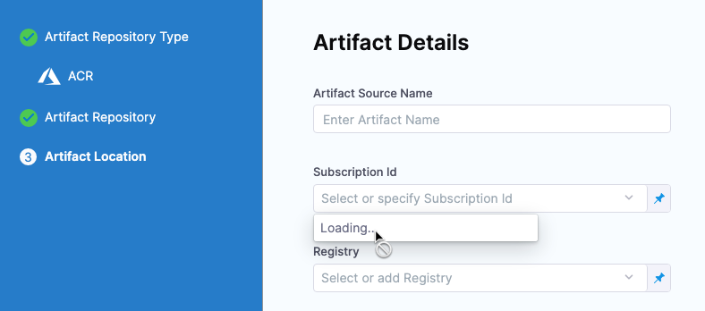

Harness Self-Managed Enterprise Edition is updated regularly in Harness SaaS. Review the notes below for details about recent changes.

:::note
The release notes below are only for Self-Managed Enterprise Edition. NextGen SaaS release notes are available [here](/release-notes/whats-new) and FirstGen SaaS release notes are available [here](/docs/first-gen/firstgen-release-notes/harness-saa-s-release-notes).
:::

## March 14, 2023, version 78426

This release includes the following Harness module and component versions.

| **Name** | **Version** |
| :-- | :--: |
| NG Manager | 78426 |
| CI Manager | 2804 |
| Pipeline Service | 1.21.13 |
| Platform Service | 78202 |
| Access Control Service | 78001 |
| Change Data Capture | 78426 |
| Test Intelligence Service | release-149 |
| NG UI | 0.339.19 |
| LE NG | 67500 |

### New features and enhancements

- The **kotsadmin minor version** is upgraded from 1.88.0 to 1.95.0. (SMP-835)

   To upgrade kots to 1.95.0, run:  

       curl https://kots.io/install/1.95.0 | bash

    If you get a `/usr/local/bin is not writable` error, run:

       sudo chown -R `whoami`:admin /usr/local/bin

    then proceed with the installation.

    To update the kots admin console, run:

       kubectl kots admin-console upgrade -n NAMESPACE --wait-duration 10m

    To check the version, run:  
       
       kubectl kots version

- The **mongoDB minor version** is upgraded from 4.2 to 4.4. (SMP-837)

  To upgrade to 4.4, do the following.

  1. Get the current featureCompatibiltyVersion. It should be 4.2 if it is using mongo 4.2:

          db.adminCommand( { getParameter: 1, featureCompatibilityVersion: 1 } )

  2. If the current version isn't 4.2, execute into Primary and run:

          db.adminCommand( { setFeatureCompatibilityVersion: "4.2" } )

  3. Determine if the pods are in sync. Make sure they're in sync before you upgrade (the maximum time lag is ~2sec). 

          rs.printsecondaryreplicationinfo()

   4. Proceed to upgrade mongo to 4.4. 

      After the update, continue to monitor the pods to ensure that they're in sync.

   5. Once you're upgraded, update the Feature Compatibility version so that it's used for future upgrades.

           db.adminCommand( { setFeatureCompatibilityVersion: "4.4" } )

  For more information, go to [Upgrade a Replica Set to 4.4](https://www.mongodb.com/docs/manual/release-notes/4.4-upgrade-replica-set/) in the MongoDB docs.

- The **TimescaleDb minor version** is upgraded from pg13-ts2.6 to pg13-ts2.9. There is no change in postgres version and no major changes for TimescaleDB. (SMP-838)

    1. Before the minor version upgrade, check the timescaledb extension version by executing into the pod and running:

         \dx timescaledb

     The version should be 2.6.1.

    2. Proceed to upgrade timescaleDB using the installation methods (KOTS/Helm).

    3. After the timescale pods are in steady state, run:

            ALTER EXTENSION timescaledb UPDATE;

    4. Validate the change by running:

          \dx timescaledb

    The version now should be 2.9.3.

  For more information, go to [Upgrading the TimescaleDB extension](https://docs.timescale.com/timescaledb/latest/how-to-guides/upgrades/minor-upgrade/#upgrading-the-timescaledb-extension) in the Timescale docs.

- From Self-Managed Enterprise Helm Chart version 0.4.xx and above, you will see a warning if any Self-Managed Enterprise release is skipped after upgrade. (SMP-811)
 
  You will see this warning:  

  `"# Info: Your current chart is xxx and app yyy. You seem to have skipped intermediate public releases. Starting chart 0.4.0 and app 784xx, upgrade policies are being formulated. Please upgrade the charts in consecutive minor versions for backward compatibility."`

- The Redisson client library has been upgraded to version 3.17.7 across all services for enhanced performance and bug resolution. This update will not affect any business operations. (PL-31136)
- The [Role Assignment](https://apidocs.harness.io/tag/Role-Assignments/#operation/getFilteredRoleAssignmentByScopeList) API now includes the principal's name and email address in the response. (PL-31064, ZD-36050)
- Harness now supports the integration of GCP Secrets Manager for all users. For more information, go to [Add a Google Cloud Secret Manager](https://developer.harness.io/docs/platform/Security/add-a-google-cloud-secret-manager). (PL-31051)
- The following role-assignments are removed for all the existing users across all the accounts:
  - Account Viewer - All Account Level Resources: This was a role-assignment within the account scope and has been removed for all the users. This does not apply in the following scenarios:
  - If an account has enabled the feature flag ACCOUNT_BASIC_ROLE_ONLY.
  - If an account does not have the Account Viewer - All Account Level Resources role-assignment for the default user group All Account Users.
  - Organization Viewer - All Organization Level Resources: This was a role-assignment within the organization scope and has been removed for all the users.
  - Project Viewer - All Project Level Resources: This was a role-assignment within the project scope and has been removed for all the users.
  
  For more information, go to [Default User Group](/docs/platform/role-based-access-control/harness-default-user-groups/). (PL-30916)

- In the SCIM API, the Groups endpoint returns all the user groups associated with an account. The ResourceTypes endpoint also returns incorrect information. A code enhancement has fixed this issue. The Groups endpoint returns only externally managed user groups and the ResourceTypes endpoint returns details as per the schema. (PL-30862)

- Migrated ng-manager and manager delegate request flows to v2. This fixes an issue where Kryo using CompatibleFieldSerializer along with references set to `true` did not behave correctly. This also fixes some backward-ompatibility issues faced in serialization/de-serialization if there is any change in object structure before and after. To avoid such issues, we are gradually migrating to all delegate request/response flows to use kryo references set to `false`. (PL-30632)

- You can now add policy sets under the **Advanced** section of each step. (PIE-7794)

  In this way, you can validate step outputs generated during pipeline execution without explicitly requesting a payload. Policy sets receive the steps and their outputs as payloads, with a pre-defined schema for every step.

- Users can now move Inline pipelines to Git. (PIE-7392)

- Updated the delegate-token and documentation URLs shown in the UI when setting up a new delegate. (DEL-5905)
  
  

  

- The UI and workflow for creating delegates has been updated and improved. (DEL-5551)	
  
- Added the `helm repo update` command to the delegate installer. The command is included in the instructions that apply the delegate manifest. This change reduces the chance of retrieving the wrong file from the repository. (DEL-5540)
  
- [Pipeline execution status links](/docs/continuous-integration/use-ci/view-your-builds/viewing-builds) in Git pull requests now direct you to the associated stage within the pipeline, rather than the pipeline as a whole. (CI-6813)


- This release includes two new CI steps for integrating your Harness CI pipelines with GitHub Actions and Bitrise. The following steps are available in Harness Cloud build infrastructures only.
   - An Actions step to run GitHub Actions.
   - A Bitrise step to run Bitrise steps and workflows. (CI-6479)
  
- CI now supports running pipelines in debug mode. Debug mode will be enabled when a Run step fails.	(CI-6350)	

- We now have Linux ARM build supported as part of Hosted CI offering.	(CI-5787)	

- We have added new Background step to defined the service dependency in CI. The previous stage settings of Service Dependency is now deprecated. The new Background step allows for better control and configuration of services.	(CI-5580)

- Windows support for Hosted is now launched.	(CI-5455)	

- Active Directory Federation Services (ADFS) is now supported for ServiceNow authentication. (CDS-49406)
  
  Any API call Harness makes to ServiceNow requires an authentication token. Previously, Harness supported username and password authentication only. Now we support ADFS authentication.

  

- Improving validations for pipeline templates. (CDS-48962)
  
  Previously, if a pipeline used a step or stage template and an input setting or reference in a template changed the pipeline YAML, the pipeline could not be deployed. 

    
  
  Now, the pipeline can be deployed and input validation is performed during execution.

- YAML schema validation for environments. (CDS-48947)
  
  We have added YAML schema validation to environment entities. Similar validation already exists for our pipeline YAML, but environments are separate entities.
  If you try to save invalid YAML you will get an error like this:
  ```bash
  Invalid yaml: $.environment.overrides.manifests[0].manifest.spec: is missing but it is required.
  ```

- Improved error message when API calls fail while listing Helm **Chart Version** in **Run Pipeline**. (CDS-48436)
  
  If **Chart Version** is a runtime input, when you run the pipeline you are required to select a version from the **Chart Version** dropdown. If the Harness API is unable to fetch any versions, an improved error message is displayed.

    
  
  Hover over the error message to see the full message.

- The **Referenced by** tab in the Connector UI now shows the environment name.	(CDS-45347)	

   

### Fixed issues

- Fixed an issue where users were unable to fetch Google Artifact Registry (GAR) artifacts with package names that use /. (CDS-53908)

- Fixed a back-end issue that could result in timeouts when a user tries to sign up for the Harness Community. (PLG-1860)
  
- Implemented a fix to ensure correct handling of horizontal scrolling in the side navigation. (PG-31140)

- Fixed an issue where a user account that is managed externally via SCIM can be deleted from a user group that is not managed externally.	(PL-31125, ZD-39358)	

- SCIM-managed users can now be removed from organisations and projects.	(PL-31104, ZD-39109, ZD-39110)	

- Fixed an issue with SCIM where user email was added in uppercase causing issues with SAML authentication. (PL-31038)

- Fixed an issue where a new user, on receiving an email invite and clicking on it, gets an INVALID_REQUEST error. Users should be able to complete their sign-ups with no errors.	(PL-30993, ZD-38937, ZD-39340, ZD-39510, ZD-39716)

- Fixed an issue where User Group details pages in Project and Organization scope weren't opening properly when opened using "Open In New Tab". This was due to loss of "parentScope" query Param. Adding the "parentScope" queryParam fixed the issue. (PL-30911)

- Fixed a UI issue in CCM that caused the message "We cannot perform your request at the moment. Please try again" to appear in the UI. (PL-30816)	

- Added missing audit entries for CRUD operations on the EnvironmentGroup resources. (PL-30779)

- The Harness APIs return a status code of HTTP 400 instead of HTTP 401 for an invalid or expired token. An enhancement to the code has fixed this issue. (PL-30757, ZD-38494, ZD-38547)

- Fixed a UI issue where the resource-group name and summary were collapsing in the Resource Group page. (PL-30691)

- The project selector component selects multiple projects with the same project name across different organization IDs. The project selection code has been enhanced to select projects corresponding to specific organization IDs. Updated error message in case there is a delete/update of externally managed user group from Harness. (PL-30663)

- When trying to delete or update an externally managed user group in Harness, the error message is unclear. It has been enhanced to "User is externally managed by your Identity Provider and cannot be deleted via UI / API. To delete the user from Harness, delete it from your Identity Provider." (PL-30641)
  
- OAuth can now be enabled when the account has SAML/LDAP settings present but not enabled. (PL-30617)

- Fixed a UI issue to ensure that, when you create two projects with the same name in separate organizations, the Resource Group selector shows only the project for that organization. (PL-30556)

- The email update for SCIM users does not work. A code enhancement to support user metadata updates has fixed this issue. (PL-30439)
  
- Force deletion of a secret used for the creation of a secrets manager throws an incorrect error. (PL-29983)

  This has been fixed by displaying the appropriate error message.

- The project selector component selects multiple projects with the same project name across different organization IDs. (PL-30663)
  
  The project selection code has been enhanced to select projects corresponding to specific organization IDs.

- The error message displayed when creating the GitHub connector and selecting **Harness Platform** as the connectivity option is not clear and informative. (PL-29953)
	
- Entities in Harness can now have `/` for the Name. (PL-29929)
  
- The default secret manager does not appear in the **Secrets Manager** list when there are more than 100 secret managers. A code enhancement has fixed this issue. The default secret manager is now displayed if you enter its name in the **Secrets Manager** field. (PL-29635)
  
- Deletion of vault connectors does not delete the corresponding perpetual tasks. A code enhancement has fixed this issue.  (PL-27621)
  
 - In pipeline execution, the YAML builder does not support read-only operations and throws an error. A code enhancement has fixed this issue. (PIE-8040)
  
 - The pipeline execution details page does not have a **View Compiled YAML** option. This option is now available on the execution page. (PIE-7967)
  
 - Creating an input set results in an error. A code enhancement has fixed this issue. (PIE-7849, ZD-39180, ZD-39240, ZD-39250)
  
  

- Pipelines with input sets and triggers chained together do not display input set fields correctly. An enhancement to the code has fixed this issue. (PIE-7681)
  
- If an execution has a matrix strategy, the text on the pipeline execution page overlaps. An adjustment to the height of the matrix wrapper has fixed this issue. (PIE-7429)
  
- API PUT operations for Bitbucket SaaS and on-prem connectors return an incorrect status code when there are no changes. A modification to the error message to display an appropriate explanation of the error has fixed this issue. (PIE-6230)
 
- Fixed an issue where uploading a CSV with a large number of targets could cause the dialog box to overflow. (FFM-6627)		

- Fixed an issue to ensure that the Feature Flags SDK metrics endpoint is configured. (FFM-6240)

- Persisted currently selected Feature Flags environment when navigating away from Feature Flags module.	(FFM-6221)

- The **Complete** button at the end of the feature flags onboarding flow was always enabled. Now it is disabled until the user receives a successful evaluation. (FFM-5987)
  
- Resolved a problem that caused SCM log information to be displayed in the Watcher. The information was redirected to the delegate `slf4j` stream for display in the delegate logs. (DEL-5744, ZD-36125)

- Added error checking to ensure that delegates immediately reject tasks that are not supported. (DEL-5602)

- With the feature flag `NEW_LEFT_NAV_BAR` enabled, you can view build details at the project level without drilling down into individual modules. When viewing build details from the project level, the **Commits** tab produced a `404` error. This is fixed. (CI-6817)

- The Harness UI now shows a detailed warning when a CI build uses unsupported versions of any CI build images. (CI-6721)
	
- Improved error message for git test connection. (CI-6689)

- Expressions used in pipeline codebase properties unexpectedly resolved to `null`, which caused builds to fail due to missing variable input. These expressions now resolve to their expected values. (CI-6679, ZD-38122, ZD-38241, ZD-38698, ZD-39088)

   

- Fixed an issue where the Commits tab would show a 404 error in the CD build UI. (CI-6632)

- The CI Getting Started workflow leads you through creating an SCM connector and a pipeline. Previously, exiting the Getting Started workflow before creating a pipeline resulted in incomplete connector configuration, and attempting to use the incomplete connector in a pipeline produced the following error: `Invalid argument(s): Both plain text and secret value cannot be null for the field`. If you encounter this error, replace the pipeline's SCM connector with a new one. (CI-6443)

- Implemented code changes to ensure correct behavior and fix the following issues:

  - RepoName will now be rendered in Manifest Details section while adding manifest itself irrespective of whether connector is expression or runtime. (CDS-53309, ZD-39859)

  - Configuring Bitbucket Connector as expression/runtime input should be an option to provide the repo name (CDS-51247, ZD-38985)

- The Azure connector was connecting to the US endpoint for Azure instead of the US Government Azure endpoint. (CDS-52251	ZD-39474, ZD-39791)

- The Kubernetes [Apply step](https://developer.harness.io/docs/continuous-delivery/cd-execution/kubernetes-executions/deploy-manifests-using-apply-step) does not work with inline values overrides.  Overriding inline values using the Harness file store was not working. We have incorporated a new method to handle this use case and it is working. (CDS-52167) 

- There is a [Shell Script step](https://developer.harness.io/docs/continuous-delivery/cd-execution/cd-general-steps/using-shell-scripts/) discrepancy when adding multiple steps. The template case was missing for calculating the step count using of the default step name. Now a template case for calculating correct step count of the default name is added. (CDS-52120)
  
- When special characters are used for a trigger **Name** field, the info message looks different than the actual name entered. This issue was happening because users were allowed to use restricted special characters for the trigger **Name** field. We have updated the validation for the **Name** field so now users will not be able to use restricted special characters. (CDS-52105)

- No pagination on the trigger listing page. Added pagination support on the trigger listing page. (CDS-52024)
  
- Going forward, we will allow secrets to be passed in helm command flags. We also ensured that these secrets are masked and never leaked.	(CDS-51833, ZD-39224)

- For org level environment CRUD, the resource group is not honored.  RBAC permissions specific to environment resource identifiers were not being honored. Harness was not calling the ACL when switching to the **Environments** tab in an org. This has been fixed and the RBAC is verified when the **Environments** tab is selected. (CDS-51824)

- In the **Delegates Setup** section of a GitLab connector, the delegate selection radio buttons were not working. (CDS-51793)
  
  Now users can select the option to use any available delegate or select a delegate using tags.

  

- The dashboard UI is cramped at the top. The environments header section was cramped when the environment request DTO had a description but there was no description in the environment YAML. This is now fixed.(CDS-51781)

- Users are unable to save the Verify step in a stage template. (CDS-51695, ZD-38467)
  
  In addition, the error message does not explain why users are unable to save the Verify step in a stage template.

- Deployed service logs don't show fetch details for a Jenkins artifact source.	(CDS-51566)

  The logs were missing this information but now Harness captures the type, job name, path, and build for Jenkins.

      

- Users cannot manually type if the Helm chart **Version** dropdown loading fails. (CDS-51559)
  
  Users can now manually enter a Helm chart version if Harness is unable to fetch versions from the chart repo.

- The Custom Approval step doesn't show logs and output variables. (CDS-51347, ZD-39060)

  Custom approvals did not show console logs for every shell script execution. This was happening due to closing the associated log stream when the shell script execution succeeds or fails. Hence, only the first trial was logged on the console.

  This issue has been resolved. Custom approvals now have shell script execution logs associated with each retry of execution made even when the custom approval is in a waiting state. This will help users to know the shell script output associated with each retry and understand why an approval is in a particular state.

- The [Email step](https://developer.harness.io/docs/continuous-delivery/cd-technical-reference/cd-gen-ref-category/email_step/) is sending an error even though the email is sent. (CDS-50952)

  In the **Email** step, when there is an invalid address in the **to** setting and a valid email in the **cc** setting, mail is sent to the cc address, but the step is marked as failed. This has been fixed. The Email step is marked as success if emails are sent to the cc address.

- The **Clear All** option in the filter on the **Deployments** page is not working for the **Deployment Type** option. (CDS-50924)
  
  Now the **Deployment Type** filter is cleared when selecting the **Clear All** button.

  

- ServiceNow [Import Set step](https://developer.harness.io/docs/continuous-delivery/cd-advanced/ticketing-systems-category/servicenow-import-set/) not showing error message when the staging list call fails. (CDS-50874)
  
  We now show a detailed error message when the API fails to select the ServiceNow connector.

- When an existing Azure Artifacts feed is updated to one that doesn’t contain any package type, the UI is not refreshing the **Package Type** field. (CDS-50708)

  We now refresh the **Package Type** field when a new type is selected and have added validation.

  

- Users are able to select the **Loading** option when using the Azure Container Registry as an artifact source. (CDS-50599)
  
  User were able to select the **Loading** option for the **Subscription Id** setting. This is now fixed and users can only select an actual Azure subscription Id. The **Loading** option cannot be selected.

  

- NPM/Maven/NuGet repository format support for Nexus artifacts with Tanzu Application Services (TAS). (CDS-50551)
  
  You can now use NPM/Maven/NuGet repository formats for Nexus artifacts in TAS Harness services.

  

- Iterator was leading to high CPU usage on the Harness manager. (CDS-50507)
  
  Unregisted the iterator handler. It no longer runs on the Harness manager.

- The warning message should be different when the pipeline executor is not allowed to approve/reject a pipeline. (CDS-50503)
  
  The error message is improved to explain why the user is not able to execute the pipeline.

    	

- Null pointer exception occurred when checking the secret file used by a secret in the Command step (in SSH deployments). (CDS-50388)

  We have added null pointer checks for the decrypted value secret.

- Implemented a fix to make instances sync possible for account-level agents.	(CDS-50346)	

- An incorrect error code is displayed when a template is not found. (CDS-50337)
  
  The templates REST GET call was throwing a 400 Bad Request with error code `INVALID_REQUEST`. We have updated this error code to `RESOURCE_NOT_FOUND_EXCEPTION`. This is in line with best practices.

- Added an **Anonymous** credential option in [OCI Helm Registry connector](https://developer.harness.io/docs/platform/connectors/connect-to-an-artifact-repo/). (CDS-50173, ZD-38625)
  
  The OCI Helm Registry connector supported anonymous credentials but there was no UI option. This issue has been resolved. The OCI Helm Registry now has an **Anonymous** option. This enables you to connect to public OCI registries from Azure, AWS, JFrog, etc., and deploy Helm charts from these registries.

- Unable to see the Harness file store at the projects level. (CDS-50139)

  The [Harness file store](https://developer.harness.io/docs/continuous-delivery/cd-services/cd-services-general/add-inline-manifests-using-file-store/) is a hierarchical file manager in Harness for managing configuration files used in pipelines.

  The file store was not showing up at the projects level. This has been fixed and now you can use the file store in your projects.

  

- Runtime **Tag** setting discrepancy when switching between YAML and Visual views. (CDS-50033, ZD-39719)
  
  When a user set the **Tag** setting in the Visual view and then switched to the YAML view, made an edit, and switched back, the value was not preserved. Now users can select tags or enter values from YAML without any discrepancies.

- **Environment** is not highlighted in the navigation when **Environment Groups** is selected. (CDS-49922)
  
  The route URLs for environments and environment groups under the CD module are updated. When you select **Environment Groups**, the navigation now highlights **Environments**.
  
  **User action:** If any bookmarks have been stored with the older URLs, they will need to be updated. Simply navigate to **Environment Groups** and bookmark the page.

- The PagerDuty notifications are not showing start and end dates for pipeline/stage execution. (CDS-49852)

  The PagerDuty template was using the wrong placeholder for [PagerDuty notifications](https://developer.harness.io/docs/continuous-delivery/cd-advanced/cd-notifications/notify-users-of-pipeline-events/#option-pagerduty-notifications). The template is now modified to use the correct placeholder name.
	
- The deployment freeze recurrence time should be greater than the start time. (CDS-49840)
  
  Harness was letting users set a recurrence time in the past. We have added a check to prevent users from creating a freeze window with a recurrence time that is before than the current time.

- Fixing a service referencing a template causes a save error. (CDS-49817)

  When making the service a runtime input within the template and providing this as a fixed value when using the template, it fails to save.

  The sources were being added as an empty string when no runtime inputs were present.

- RBAC for environment was not enforced. (CDS-49732, ZD-38326)
  
  When using stage templates in pipelines there was a case where the access check for the environment was skipped and users still need to have access to all the connectors/secrets used in the service and the infrastructure. 

  Now, Harness does not check nested permissions for templates. For example, if a template has a connector/service/environment inside it, Harness won’t check for their nested access permissions during pre-execution validation. Instead, we rely on individual steps to do the RBAC during actual execution.

- An empty trigger name is not disabling the **Continue** button. (CDS-49631)
  
  When the trigger **Name** was empty a validation error appeared but the **Continue** button could still be clicked.
  
  Now, when the trigger **Name** is empty a validation error appears and the **Continue** button is disabled.

- When using a Helm Chart from the Harness File Store and a values YAML file from a Git or custom provider, only 2 values are getting applied when more values files are passed. (CDS-49251)

  Resolved the problem where the user was unable to use specified values when defining a service of type:
    K8sManifest:
    spec:
    StoreType: Harness

    ValuesManifest:
    spec:
    StoreType: Git

    ValuesManifest:
    spec:
    StoreType: Custom
  All the value files were not being fetched. To prevent this, we have added a condition to address this use case.

  All the value files were not being fetched. To prevent this, we have added a condition to address this use case.
- OpenShift Parameters setting does not support Harness File Store. (CDS-49249)

  Enabled the Harness File Store for **OpenShift Parameters**.

- When creating an OpenShift template with the Harness File Store, a default param file with an empty string is created. (CDS-49248)
  
  We have now set the default value of param paths as an empty array that will ensure an empty value is not set for param paths if no value is provided.

- In the **Kustomize Folder Path**, the **Add** button is not required as there can be only one folder. (CDS-49245)

  The **Kustomize Folder Path** now only accepts one folder path. The **Add** button was removed.

- Different artifacts with the same build Id are not considered in services listed in the **Environments** dashboard. (CDS-49189)
  
  Earlier, only the build Id was used to group instances in the **Environments** dashboard. When a user deployed a service with the same build Id but different artifact paths, either of the artifact paths would be present in the hover over the build Id in **Artifacts**.

  Now we group services based on their display name (artifact path + build Id) so that there are different entries for different artifacts even if they have the same build Id.
  
  | First artifact  | Second artifact   |
  |-------------- | -------------- |
  |   |    |

- The Jira searchUser API call was failing with the error `INVALID_IDENTIFIER_REF`. (CDS-49181)

  Now Harness passes the connector reference in the payload when calling the searchUser API.
	
- The error message that appeared when Azure WebApps infrastructure connector as a runtime input is improved. (CDS-49026)
  
  The new error message is `Azure connector is required to fetch this field. Alternatively, you can make this field a runtime input`.

- Nexus3 artifact source using the Maven **Repository Format** cannot filter the builds by **Classifier** and **Extension**. (CDS-49020)
  
  In a Nexus Maven repository, users can now filter the builds by **Classifier** and **Extension**.

    

- The confirmation dialog for closing a pipeline has misleading **Discard** button. (CDS-49000, ZD-38518)
  
  The **Discard** button is removed and the text is now:
  - **Confirm** to leave the page.
  - **Cancel** to stay on the page.

- API calls fetching information about ACR repository if connectorRef is expression or runtime input. (CDS-48988)
  
  Harness was trying to fetch ACR repository information when the connector reference is an expression or runtime input. We have now removed the unnecessary API calls.

- The pipeline variable was not resolved in the **Image Path** setting for a Docker artifact source until the pipeline was saved. (CDS-48981)
  
  If you use a pipeline variable in the **Image Path** setting for a Docker artifact source, and then switch the setting to **Fixed Value**, Harness cannot resolve the artifact path until pipeline is saved.
  
  No code changes were made but an improved error message was added.

  

- Dangling service references prevented the deletion of other resources. (CDS-48890)
  
  When an org/project was deleted, the references to services within that org/project were not cleaned up. As a result, there were dangling references preventing the deletion of other resources.
  
  This is now fixed and the service references are cleaned up when you delete the org/project.
	
- Updating a Harness file store file does not take users to the file already selected. (CDS-48618)
  
  When you updated a selected file in the file store and clicked **Save**, Harness was not returning you to the file, but the full file list.
  This is now fixed and you are returned to the file.

- Deselecting a field sets **Tag** to **Regex** but **Value** is selected. (CDS-48576)
  
  Clearing the value of **Tag** changes the type from **Value** to **Regex** due to the form reinitializing when values changes. This is now fixed and the **Value** setting is maintained.

- The Kubernetes namespace in **Infrastructure** cannot contain capital letters, but they were allowed in Harness YAML. (CDS-48514)
  
  Added schema validation for Kubernetes infrastructure **Namespace** setting to match Kubernetes requirements (`[a-z0-9]([-a-z0-9]*[a-z0-9])`).
	
- Service Logs not showing fetch details for AWS Elastic Container Registry and Google Artifact Registry artifacts. (CDS-48483)
  
  Console logs were missing information about the image, artifactName, tag, artifactPath, and URL. This metadata is now shown on the console logs.
	
- Improve the error message for when regex is used for the Artifactory connector. (CDS-48340)
  
  We have enhanced error handling when fetching artifacts from Artifactory. Now we tell users to use **Runtime input**.
  
  

- Deployment freeze was missing a check on timezone and accepting the wrong value in YAML. (CDS-48311)
  
  Now there is a check to validate if the timezone entered in the freeze window is correct.

- After fixing runtime input settings in the pipeline **Run** form YAML, users cannot run the pipeline. (CDS-48009)
  
  The pipeline **Run** form accepts Visual and YAML entry. When you entered runtime input values in the YAML the **Run** button was disabled.
  
  Now you can submit runtime input values as Visual or YAML entries and run the pipeline.

- Settings in **Run Pipeline** were being reset when settings were selected for the second stage. (CDS-47362)
  
  The **Run Pipeline** settings were getting reset when a user selected a new environment in another stage. We were updating all the settings with older values for services or environments. This caused the completed settings values to be cleared. This has been fixed.

- Implemented fix to ensure correct regex validation when specifying multiple artifacts in a CD pipeline. (CDS-47263)

- Connector settings do not display in the **Run** pipeline form. (CDS-46632)
  
  When users selected an environment and infrastructure, cleared the selected environment, and then reselected the same environment and infrastructure, connector settings did not display in the **Run** pipeline form.
    
  Now, the connector settings appear when you reselect the environment and infrastructure.


- Account-level templates can be saved with org or project user group. (CDS-44557)
  
  The Harness Approval step did not validate the user group scope against the parent scope used to create the step.
  
  For example, a template containing Harness Approval steps with user groups at a project scope can be saved at an account level.
  
  Now it's invalid to have higher scope entities (for example, user groups at project level) referenced in lower scope entities (for example, a template at the account level).
  
  Validation has been added in Harness Approval steps to validate the scopes of the user groups against the scope in which the Approval step is created. The step is invalid if the user groups in the step have a higher scope than the scope where the Approval step is created.

- Approval step Slack and email notifications using identifiers instead of names. (CDS-29134)
  
  Harness Approval notifications using Slack and email were sending identifiers instead of readable names.
  
  For example, for the org, project, or triggered by information, identifiers are sent instead of names.
  
  This issue has been resolved. The notification now contains names, emails, etc., instead of identifiers. The email of the user triggering the Approval step displays and the org and project names display.

  Email example:
  
    

  Slack example:

  

- Hourly data on the **Perspectives** page showed an incorrect billing amount for multiple accounts. CloudFunction was unable to delete the existing records but continued ingesting a new entry in clusterDataHourly in BigQuery. (CCM-10711)

  This issue is fixed. Now, the Instance_Billing_Hourly job execution is limited to 5 times per minute to avoid CloudFunction failure.

- The total costs displayed on the **Overview** page and the **license-util** page (or API) were incorrect in accounts with at least one Azure connector. (CCM-10678, ZD-38694)

  A bug fix in the ingestion of aggregated costs for Azure resolved this issue. 	

- The cost details API was returning only the AWS account ID without the account name. Now, the API returns both account name and ID. (CCM-10573, ZD-38510)


## February 9, 2023, version 78109

This release includes the following Harness module and component versions.

| **Name** | **Version** |
| :-- | :--: |
| NG Manager | 78019 |
| CI Manager | 2303 |
| Pipeline Service | 1.19.3 |
| Platform Service | 77901 |
| Access Control Service | 77801 |
| Change Data Capture | 78109 |
| Test Intelligence Service | release-149 |
| NG UI | 0.336.3 |
| LE NG | 67300 |


### New features and enhancements

This release introduces the following features and enhancements.

- Introducing support to list the label keys that contain the string node-pool-name. (CCM-10203)
  
  While adding a node pool name, Harness CCM looked only for the exact match. Now, CCM has introduced support to check if the node label key contains the string node-pool-name. CCM falls back to _contains_ if an exact match is not found. See [Labels for node pool recommendations](https://developer.harness.io/docs/cloud-cost-management/use-cloud-cost-management/ccm-recommendations/node-pool-recommendations#prerequisites) for more information.

- The **Referenced By** tab was added to [Environments](/docs/continuous-delivery/onboard-cd/cd-concepts/services-and-environments-overview). (CDS-39989)

  You can see which pipeline uses any Environment in the Environment's **Referenced By** tab.

- Helm steady state checks with Kubernetes version >= 1.16 (CDS-40269)

  Harness will automatically perform steady state checks with Helm deployments using Kubernetes version >= 1.16.

  This feature was previously behind the `HELM_STEADY_STATE_CHECK_1_16` feature flag and is now GA.

- Schema validation was added for service entities. This includes field-level validation similar to that given to pipeline YAML files. (CDS-41332)

- Harness Serverless Lambda and ECS support now supports AWS S3 (CDS-46204, CDS-45642)

  You can now use AWS S3 for your Serverless YAML and ECS configuration files (Task Definition, Service Definition, Scaling Policy, and Scalable Target JSON/YAML files).
  
- ServiceNow Connector YAML has changed to include authentication details (CDS-46672, CDS-45969)

  The update is minor and requires no changes by users.
  
- Harness Serverless Lambda and ECS support now supports AWS S3 (CDS-46204, CDS-45642)

  You can now use AWS S3 for your Serverless YAML and ECS configuration files (Task Definition, Service Definition, Scaling Policy, and Scalable Target JSON/YAML files).

- Nexus 3 is now supported for Azure Web App artifacts (CDS-46372)

  For more information, see Azure Web Apps deployment tutorial.

  This functionality is behind a feature flag: `AZURE_WEB_APP_NG_NEXUS_PACKAGE`.

- ECS Run Task supports configuration of task definition using ARN. This allows for the creation of definitions for AWS ECS tasks using ARN or task definition in JSON/YAML. (CDS-47984)

- The [Deployment Templates](/docs/continuous-delivery/onboard-cd/cd-quickstarts/custom-deployment-tutorial) **Execution** tab now supports all steps in the Command category. (CDS-48030)

  Earlier, only the Utilities steps were supported. Now you can add any CD step.

- A [failure strategy](https://developer.harness.io/docs/platform/pipelines/w_pipeline-steps-reference/step-failure-strategy-settings/) is now mandatory for all Deploy stages. (CDS-48951)  
  
    

  A failure strategy is now a mandatory setting in the **Deploy** stage. Previously, a failure strategy was mandatory, but the check happened when the pipeline ran. 
  
  A failure strategy is also required for the **Deploy** stage in [stage templates](https://developer.harness.io/docs/platform/Templates/add-a-stage-template). With this release, all Deploy stages, including in stage templates, without failure strategies are considered invalid.

  No action required by users.
  
- Linux ARM is now supported in Harness Cloud build infrastructures. (CI-5787)

- The onboarding experience for new users has been enhanced. You can now create a sample "Hello world" pipeline even without a repository selected/created.  (CI-6348)

- Customers on the free plan can now run 5 stages per day on the CI hosted infrastructure. Contact Harness Sales to upgrade your plan. (CI-6430)

- You can now use the Git client to commit changes while creating or updating pipelines using Bitbucket on-prem as the Git provider. (PIE-6423)

  To do this, enable Use Git client for commits in the default settings at the account scope. Harness checks out the code on the delegate and uses the Git client to make the commits to your Git repository.

- The HTML parsing for pipeline logs takes longer than expected and delays the display of the logs. (PIE-6538)

  An enhancement in the parsing technique and the introduction of caching has fixed this issue.

- Direct use of email addresses in v2 APIs for creating and updating user groups. (PL-29018)

  You can now use email addresses in v2 APIs for creating or updating a user group. It is no longer required to first fetch the email addresses by using user IDs.
  
- Securing data through JSON Web Token (JWT) masking. (PL-29019, ZD-32004)

  Harness now masks all JWTs in pipelines and delegate logs. This change prevents data leakage risks for the applications running in Harness.

- API support for discovery of SCIM service provider features and schema. (PL-29069)
    
  Harness now supports the following three `HTTP GET` API endpoints to facilitate the discovery of SCIM service provider features and schema. These endpoints are defined in SCIM 2.0:

  -   `ServiceProviderConfig`
  -   `ResourceType`
  -   `Schemas`
 
- The [Role-Assignments](https://apidocs.harness.io/tag/Role-Assignments/#operation/getFilteredRoleAssignmentByScopeList) API now fetches role assignments by scope. (PL-29496, ZD-36050)

  This helps you keep a track of the role assignments within a specific scope.
  
- You can now refer to existing secrets of Azure Key Vault, AWS secret manager, and GCP secret manager. (PL-29915)

  With this enhancement, you need not create secrets in Harness. You can use expressions to reference the secrets already existing in the mentioned secrets managers. For more information, see [Reference Existing Secret Managers Secrets](https://developer.harness.io/docs/first-gen/firstgen-platform/security/secrets-management/reference-existing-secrets/).

- Continuous Verification (CV) fails if the data for configured deployment strategy is not available. (SRM-12731)

  Harness was automatically applying an alternate deployment strategy even if the required data for the deployment configured in the Verify step was not available.

  Now, Harness does not automatically apply an alternate deployment strategy if the required data is not available. Instead, Harness fails the CV. Harness automatically applies an alternate deployment strategy only if you choose the Auto option in the Continuous Verification Type dropdown list when configuring the Verify step.

  This feature is behind the feature flag `SRM_LOG_HOST_SAMPLING_ENABLE`. 

- Increased limit for number of PagerDuty services (SRM-13102)

  The PagerDuty Service dropdown list, which displayed up to 25 services, can now display up to 100 services.

### Issues fixed in this release

This release includes the following fixed issues.

- The messages in budget alert notification emails were misleading. Now, the emails convey more meaningful and dynamic messages. They provide the cost type and the period for which the alert is created. (CCM-9291)

- When you clicked **Explore all plans** on the Cloud Cost Management Getting Started page, you were directed to the old onboarding page instead of the new one. (CCM-9638)

  Now, this issue is fixed.
  
- Azure VM inventory dashboards showed duplicate cost entries because every API call to pull VM data inserted a new row in the dashboard if the time of creation (creationTime) was different from the existing row of that VM. (CCM-9842)

  Now, this issue is fixed.

- First-time users could not launch the Kubernetes cluster creation workflow by using the Quick Create option on the Cloud Integration page. (CCM-9953)

  Now, this issue is fixed.
  
- Remove **Skip Dry Run** from Kubernetes steps that are not using it. (CDS-17385)

  Removed **Skip Dry Run** from unnecessary steps.

- There was a rare care in which an exception was generated during data retrieval from timescale. Because of the absence of proper logging, we could not determine the origin of the exception. We have since increased logging to improve our understanding of this error. (CDS-36750)

- Getting NPE when using `useFromStage` in YAML. (CDS-41036)

  When there is `useFromStage` chaining in a pipeline (which is an unsupported use-case), an informative error message now appears instead of Null Pointer Exception.

- No error for an empty service name when the service is updated from inside a pipeline/stage template. (CDS-41510)

  Now the "service required" message appears when the service name is empty, and the user is not allowed to submit the form unless service name is added.

- Error improvement for Helm upgrade when there are no releases in a Deployed state. (CDS-41706)

  Going forward, when Helm upgrade or rollback fails with "No deployed releases", we offer a better hint and explanation on how to fix it.

- Resolved a problem that interfered with editing an existing SSH secret in the infrastructure definition. (CDS-43137)

- There is no YAML validation during the process of retrieving or importing remote templates. The YAML will be validated on the GET operation for the new GitX. (CDS-44812, ZD-36809)

- Service dashboard is not displaying instances in the instances section (CDS-46083)

  Service instances are not shown because of missing cluster, agent ID mapping, and an incorrect collection. After mapping the identifiers and changing the collection name, we are showing the service instances.

- Custom artifact trigger: secret support in script for cURL command. (CDS-46113, ZD-37343)

  Currently we don't support secrets in perpetual tasks, and triggers create a perpetual task. Because of the limitation, customers were unable to use secrets in a trigger. Added support to resolve the secrets for custom triggers.

- The `<+rollbackArtifact...>` expression is now available (CDS-46321)

  For example, if you used a publicly available Docker Hub NGINX image as the Artifact Source for a Service, then when the Service is rolled back, the <+rollbackArtifact.meta.image> expression output would be something like this: registry.hub.docker.com/library/nginx:stable-perl.

  The variables available in `rollbackArtifact` depends on the artifact and infrastructure type used in the deployment. They can be seen in Output tab of Infrastructure section of a CD stage.

- Docker expressions: The following expressions were not working. (CDS-46656) 

  Added expression support for the following:

  ```
  <+artifact.displayName>
  <+artifact.buildNo>
  <+artifact.metadata.image>
  <+artifact.metadata.tag>
  <+artifact.metadata.regisrtyUrl>
  <+artifact.metadata.repositoryName>
  ```

- Custom Artifact Source with no value in Timeout field caused nullpointerexception (CDS-46658) 

  Now Timeout default is 10m if Timeout is null.

  For more information, go to Add a Custom Artifact Source for CD.

- The approval stage is adding to the deployment count of services when it is added after the deployment stage. (CDS-46707)

  Deployments shown on the **Services** dashboard are fetched from `service_infra_info` table in `timescaleDB`. Since the dashboard shows the deployments for all services, we were not filtering based on service identifier, but that table contains approval and other data also. To allow only service deployments, we added a condition that `service_id` should not be null.

- Expressions from Git stored files are not resolved. (CDS-46726)

  A test was added to verify.

- Environment information is not available in MultiService MultiInfra (CDS-46794)

  The Executions view did not show the service and environment information in case of GitOps-enabled stages. This has now been resolved and we can now see service and environments (comma-separated) for GitOps enabled stages.

  For more information, see Use multiple Services and multiple Environments in a deployment and Harness GitOps ApplicationSet and PR Pipeline Tutorial.

- Improved error message for when Azure ACR Connector Subscription dropdown is set to Runtime Input (CDS-46815)

  Azure Artifacts sources use the term "SubscriptionId". The string when a Subscription Id is not provided is now changed to "Subscription Id is required" from "Invalid Request: envId must be provided".

- ACR connector: connector reference when passed as expression is not getting resolved (CDS-46816)

  Created new endpoints for fetching subscription Ids, registries, repositories for ACR artifacts. These new endpoints receive the pipeline Id and input YAML data, which allows for expression rendering for the ACR parameters using variables declared in the pipeline.

- Empty values for feed and package can be given in YAML (CDS-46878)

  Checks for Empty Feed and Package from YAML side have been added.

- Save as Template in Pipeline Studio not working (CDS-46884)

  Fixed an issue with saving the step as a template in pipeline studio.

- Github Packages: YAML validations for empty `connectorRef` and `PackageName` (CDS-46898)

  Check for Empty Package and `ConnnectorRef` has been added for the YAML validations side.

- Fetching Artifact path is failing in case of SSH deployments when repository is passed as expression (CDS-46930)

  We now evaluate the repository field and fetch artifact path when repository field is passed as a expression.

- Need padding added between the Run Pipeline heading’s tooltip and the All Stages dropdown (CDS-46954)

  Added left margin to tooltip.
  
- Small cosmetic changes were implemented for the pipeline UI. (CDS-46974)

- Github Package: package dropdown and version dropdown failing at project level stage template (CDS-46982)

  Pipeline Identifier was not null annotated before. So, at the time of template creation, the API call failed. This is now fixed.

- Rename "Active Service Instances" on Service Dashboard to "Running Service Instances (Current)" (CDS-47074)

  We have changed the title of these cards from "Active Service Instances" and "Active Deployments" to "Running Service Instances (Current)" and "Recent Deployments" respectively, as the previous ones were creating confusion.

- "YAML paths could not be parsed" error on running pipelines (CDS-47244)

  A single Service (Multi Service toggle not enabled) deploying to multiple Environments (Deploy to Multi Environment toggle not enabled) was giving an exception during pipeline execution. We have fixed the bug in the code and added automation test cases to prevent in the future.

- A default failure strategy is not added for the Deploy stage in a pipeline when an execution strategy is not selected. (CDS-47310)

  The call to fetch the default failure strategies for a Deploy stage was happening after 20 seconds of clicking the **New Stage** button. This timeout has now been removed and the call is made immediately after clicking the **New Stage** button. This fills in the default failure strategies for the stage immediately as well.

- Service logs didn't show fetch details for GCR artifacts (CDS-47319)

  The logs on the service step was did not show additional information such as image path and tag. The logs now capture the Type, Image Path and Tag information for GCR.

- Runtime inputs for Artifactory Artifact are not resolved. (CDS-47344)

  When a repository is configured as runtime for Artifactory, the repository format is set as empty, which causes the issue. We have added the check that if the repository format is empty then we will read it from `serviceRef`.

- Unable to create new Secret Manager Connector in Terraform Plan step (CDS-47367)

  Now you can add a new Harness Secret Manager Connector when configuring your Terraform Plan step.

  For more information, go to Plan Terraform Provisioning with the Terraform Plan Step.

- Azure Repos Connector cannot enable API access for Azure Repos Connector (CDS-47385)

  Customer had a custom domain URL and the Connector was failing when parsing this case. This is now fixed and custom domain URLs are parsed correctly.

- Kubernetes and Native Helm service Helm command flags: `-version` flag is missing from the dropdown. (CDS-47388)

  Added the version command flag.

- Error when using Template API. (CDS-47488)

  An HTTP 500 internal server error occurred when git details details are passed as empty while creating a template at the project level with the new API. This is fixed.

- Run pipeline YAML retaining the values of previously selected service (CDS-47675)

  Now the YAML is updated after changing the service. If the selected service has some Runtime Inputs, the `serviceInputs` field is set properly, and if the selected service does not have any runtime inputs, the `serviceInputs` field in the YAML is removed.

- Incorrect field label and tooltip.	(CDS-47758)

  When creating a reference secret using `AzureKeyVault` secret manager, the field label and the tooltip were incorrect. This label and tooltip have been corrected. 

- Fix popup issues in execution strategy. (CDS-47792)

  Fixed an issue with display popovers on the execution strategy for SSH/WinRM deployment types.

- **Ne* dropdown is hidden under the modal for the file store. (CDS-47817)

  Now when the browser zooms to 100%, the **New** button in the file store displays the options list.

- Input sets do not respect environment variable overrides. (CDS-47879, ZD-37675, ZD-38078)

  Service override input values were being cleared on the loading of the input set or when applied in a pipeline. This has been fixed now and the user can now run the pipeline with the input set directly from the **Input Set** page.

- A subtask can't be created in JIRA. The parent key or ID is missing. (CDS-47905, ZD-37640)

  The Harness Jira integration didn't support adding or updating the parent of Jira issues. Due to this, the creation of a subtask was not possible since we require a parent for creating a Jira subtask. This is because the parent's field type "issuelink" was not supported.
  
  Resolution:

    * The **issuelin** field type is supported now.
    * The Jira Create step can now be used to create issues with existing issues as their parent.
    * The Jira Update step can be used to update the parent of a specific issue.
    * A subtask can be created using a Jira Create step.
    * A parent can be provided by simply typing the parent issue key, such as "TJI-47890", in the Parent field.

- When a user defines 1 artifact source and fixes the values, we still prompt for an artifact source in the pipeline run form. (CDS-47908)

  Now the primary artifact is preselected when a single artifact source is added.

- GCR Artifact throws a null pointer on a tag when the image path is wrong. (CDS-47980)

  An NPE was fixed when the imagePath is incorrect and the tags dropdown is called. 

- Filtering infrastructures does not work with a **MatchAll** selection. (CDS-47981)

  The filtering infra feature did not match all the infrastructures as expected. The matching logic had an issue. The issue has been resolved. The feature now matches entities when `all` tags are selected.

- The **Infrastructure** field in **Input Sets** shows [object object]. (CDS-47992)

  Marking an infrastructure runtime in an input set implies that the infrastructure is an execution-time input and that is not supported currently. This option was removed from the UI.

- Creating a Shell Script next to another Shell Script overwrites the first script. (CDS-48044)

  The default name and ID are longer provided. Therefore, duplicate IDs are not allowed for steps. This solves this issue.

- Unable to select a Primary Artifact in the pipeline input form. (CDS-48065)
  
  Multiple Artifact Source is only available with [service V2](/docs/continuous-delivery/onboard-cd/cd-concepts/services-and-environments-overview). With this fix, the UI only allows the multiple artifact option with service V2. As this UI check was not present earlier, some users had multiple artifact sources with service V1. Users with existing configurations must fix this.
  
- Google Artifact Registry Artifacts: Better error message when the connector does not have access to a project. (CDS-48102)

  Error message was improved when the project and connector are incorrectly provided. The execution fails with the appropriate error message.

- Custom Artifact Trigger not working. (CDS-48134)

  We were not configuring the timeout field and timeout value was set as null from the UI, which was causing the issue. Added the check for the timeout value and set the default as 10 minutes.

- Tempaltes Inline/Remote cropped in the UI. (CDS-48153)

  The Template modal functions fine now.

- The **Jira Description** field doesn't scale for long text. (CDS-48228)
  
  The description field now uses a text area component to provide a better user experience.
  
- Service Logs don't show fetch details for a Docker artifact. (CDS-48358)
  
  Console logs from the service step were missing information about the `tag`, `imagePath`, and other metadata fields. These fields are now shown in the console logs.
  
- Terraform Apply **Delegate Selector** selection does not retain its value. (CDS-48375)
  
  Users can see existing [delegate selectors](https://developer.harness.io/docs/first-gen/firstgen-platform/account/manage-delegates/select-delegates-for-specific-tasks-with-selectors/) in the step's **Advanced** section in case of [Terraform Apply](/docs/continuous-delivery/cd-advanced/terraform-category/run-a-terraform-plan-with-the-terraform-apply-step) and [Terraform Rollback](/docs/continuous-delivery/cd-advanced/terraform-category/rollback-provisioned-infra-with-the-terraform-rollback-step).

- Improve error messaging in case of Terraform plugin error. (CDS-48414)

  Improved the error summary formatting.

- Template always shows an unsaved changes message even after repeated save attempts. (CDS-48422)
  
  Now you can save a [stage template](https://developer.harness.io/docs/platform/templates/add-a-stage-template/) with service and environments as runtime inputs and can eventually update them to [multi-services and multi-environments](/docs/continuous-delivery/cd-deployments-category/multiserv-multienv) as well.

    

- [Input sets](https://developer.harness.io/docs/platform/pipelines/run-pipelines-using-input-sets-and-overlays/) not working with a stage template. (CDS-48475)
  
  This was an issue with running pipelines using input sets specifically containing artifact sources with no runtime inputs. In this case, users were seeing the error message "Exception in resolving template refs". When run manually without input sets the executions went through fine. This was happening because an extra field was being set in the input set. Now we have added handling for that field and executions work as expected.

- When a user configures a manifest detail and adds a file, they cannot delete that file. They can only move things around. (CDS-48591)
  
  Removed the validation from values.yaml as it is an optional field.

    

- Error when adding a template to a pipeline. (CDS-48924)
  
  Harness Manager used to show an error when `*` was used as the default value in the **Configure Options** modal for any setting. The component has been updated to support `*` as a value to resolve the issue.
  
- Unable to change the branch for a remote template in the template studio. (CDS-49159)
  
  Harness was not allowing a branch change for read only mode in the template studio. You can now switch branches in the template studio.

    

- The [OpenShift](/docs/continuous-delivery/cd-technical-reference/cd-k8s-ref/using-open-shift-with-harness-kubernetes) template path on the runtime screen is populated as a string instead of a list. (CDS-49256)

  The text was updated to list component so that the path is stored in the form of an array.

- Previously, users were unable to apply changes after updating the Language field in the Configure Run Tests Step because the Build Tool and Arguments fields were required. The Build Tool and Arguments can now be set dynamically using inputs, allowing users to add and edit the Configure Run Tests Step and save it as a template. (CI-4868)
 
- Looping strategy will now be applicable between stages. Where first stage generates an output, which can further be used by the second stage as part of looping strategies. (CI-5919, ZD-35820, ZD-36710)

- An unnecessary view appeared momentarily in the new CI Get Started flow. This issue has been fixed. (CI-6103)

- Added a log entry when a CI step skips a directory when uploading to an S3 bucket. (CI-6205)

- Fixed an issue where a build did not run when a user selected **Run** in the **Pipeline Editor** UI. To run the build, the user needed to go to the YAML editor, save, and then run. (CI-6239)

- Recently, Harness added a new background step to allow CI users to easily set service dependencies instead of using the stage setting for service dependencies. However, since the feature flag stage still relies on the stage service dependencies, this capability was added back to the UI with this fix. (CI-6308)

- Fixed an issue in the onboarding UI where the **Select Your Repository** progress bar was incorrect. (CI-6335)

- Fixed an issue where CI reported an upload to an S3 as successful even if the upload failed. (CI-6420, ZD-37931)

- Fixed an issue that prevented Azure connectors from connecting to repos with URLs that contained spaces or `%20`. (CI-6465)

(CI-6476, ZD-38122, ZD-38241)

- Fixed an issue in the onboarding UI. In some cases, the web UI did not connect with the specified git account immediately after OAuth setup. (CI-6518)

- The automatically gernerated delegate name was shortened to eliminate problems due to length. (DEL-5259)

-  Changed how the Docker delegate is identified in the NextGen delegate section log. The Docker delegate is now identified by the delegate ID, which is the concatenation of `delegateName` and `delegateHostName`. This replaces the use of the delegate name (`delegateHostName`), which was usually the `containerId` value. (DEL-5280) 

-   Changed how the delegate handles secrets. Multiline secrets are now detected and masked appropriately. (DEL-5510)

-   Changed the display of delegate version information in Harness Manager to exclude minimum version information for delegates that are not connected. (DEL-5523)

- Changed the behavior of the delegate dropdown menu. The UI core library was updated to add a parameter that prevents the reset of expanded states when new data loads in a table. This resolved an issue with the dropdown menu collapsing automatically. (DEL-5541)

- Fixed a problem that was causing the `kryo` component to fail. The problem was caused when nested `java.lang.RuntimeException` errors occurred during manager response. (DEL-5609)

- Resolved a minor UI bug that caused the empty state image in the Feature Flags landing page to be incorrectly aligned. (FFM-3839)

- Fixed a bug where scrollbars were unnecessarily displayed in the target groups section of the targets page during loading. (FFM-4053)

- Fixed a minor UI bug where the back and next buttons during the Get Started flow were pushed out of the browser view. (FFM-5086)

- Resolved an issue that caused you to scroll unnecessarily when you expanded the target attribute or operator dropdown menus when creating a target. (FFM-5187)

- Fixed a bug that caused flag pipeline stages to continue to run even if previous stages had failed. (FFM-5289)


- Fixed a UI bug where the dialog box during the flag creation was shorter in length than it should be. (FFM-5509)

- Fixed a bug where target names were labelled "UNDEFINED" on the Harness UI if the name contained spaces. (FFM-5866)

- Resolved an issue that caused the edit section of a pipeline not to load on the Feature Flag module. (FFM-5948)

- Fixed an error that caused the Complete button at the end of the Get Started flow to link to the beginning of the flow instead of linking to the expected Feature Flag list page. (FFM-5988)

- Fixed a bug that prevented a completion tick from appearing in the UI after an evaluation had successfully passed. (FFM-6127)

- When running a preflight check with an empty field in input sets, the error message displays incorrectly. (PIE-5788)

  A correction to the error message has fixed this issue.
  
- When creating a pipeline, stage, or step, you are allowed to use the $ sign in the name or identifier even though the $ sign is invalid in those strings. (PIE-6078)

  A modification to the regex to remove the support for the $ sign has fixed this issue.

- If the environment details are blank in the deploy stage settings, clicking the Service tab throws an error. (PIE-6240)
    
  Adding backward compatibility for the tabs has fixed this issue.

- Clicking All Events when creating a notification for a pipeline does not select all the events. (PIE-6524)

  Selecting all the pipeline events on clicking All Events has fixed this issue. Now the All Events field also has an additional state indeterminate associated with it. The state indicates if all the pipeline events are neither included nor excluded for notifications.

- The authorization header in the log streaming request is missing Bearer before the token. This issue causes log streaming to fail. (PIE-6554)

  Changing the signature of the authorization header to Authorization: Bearer `<token>` has fixed this issue.


## December 21, 2022, version 77622

### New features and enhancements

This release introduces the following features and enhancements.

| **Feature or enhancement** | **Description** |
| --- | --- | 
| CDS-38870 | Users can copy the fqns for service and environment variables now . The service variables will be by the default name of `<+serviceVariables.variableName>` and environment by the name of `<env.variables.variableName>` |
| CDS-39012 | **Terraform Backend Configuration file path in the Terraform Apply and Plan steps now supports remote file repos**. Terraform Backend Configuration now can be specified in the remote file repository. For more details, go to Provision with the Terraform Apply Step. This functionality is behind feature flag `TERRAFORM_REMOTE_BACKEND_CONFIG`. |
| CDS-40390 | **Set Helm Chart Version as Runtime Input and fetch from source on Run Pipeline**. Now you can set Helm Chart Version using a Runtime Input when using HTTP Helm, AWS S3, and Google GCS stores. You can view the list of chart versions available at runtime in Run Pipeline, and select the required one. |
| CDS-44054 | **Improve Azure Web App properties**. Previously, if Application Settings or Connection Strings were removed from Harness Service then they wouldn’t be removed from the deployed Azure Web App. Now Harness keeps track of Harness-added settings and will remove these settings from slot configuration when they are deleted from the Harness Service configuration. |
| CDS-45189 | **Support for the Command step is added Deployment Template deployment types**. Now you can use the Command step in a Deployment Template pipeline. Using this step you can download/copy the artifact, copy the config files, or run scripts on the instances output by the Fetch Instances step. The Command step will always run on the Delegate, hence you need to enable the Run On Delegate option. The Command step should always be run after the the Fetch Instances step. See Use the Command step to download, copy, or run scripts. |
| CDS-45655 | Increase polling interval in executions to 20s from 5s to avoid reaching database limit |
| CDS-45662 | **Fetch Instance output now available as file**. Fetch instance output for Deployment Templates in NG is now available as a file instead of the environment variable. The script in your Deployment Template queries the server and receives a JSON array containing the target hosts. Previously, it saved in the environment variable $INSTANCE_OUTPUT_PATH. Now, it is saved as a file like this `> $INSTANCE_OUTPUT_PATH: /opt/harness-delegate/client-tools/kubectl/v1.19.2/kubectl get pods --namespace=harness-delegate-ng -o json > $INSTANCE_OUTPUT_PATH`. For more information, go to Custom deployments using Deployment Templates tutorial. |
| CI-5580 | **New background step to define the service dependency**. A new background step has been added to define the service dependency in CI. The previous stage settings of service dependency are now deprecated. The new background step allows for better control and configuration of services. |
| CI-5665 | **AWS Code Commit**. The AWS Code Commit Git connector has been deprecated. Going forward, use the generic Git connector to integrate with AWS Code Commit. |
| CI-5666 | The Custom Git Connector now supports connection via the Harness Platform, in addition to the ability to connect through the Harness Delegate. Connecting through Harness Secrets Manager is required to use the generic git connector on the Harness Cloud build infrastructure hosted by Harness. |
| CI-5816 | Test Intelligence now supports Scala and Kotlin programming languages. You can use it to optimise the Test run time in your scala/kotlin projects. |
| CI-6032 | **New Subscription ID field**. An Azure subscription ID is now required in the Build and Push ACR step to enable the display of artifacts uploaded by the steps on the Artifacts tab. |
| CI-6045 | Improved installation of Self-Managed Enterprise Edition using a Helm-based installation script that supports self-signed certificates. |
| DEL-4328 | The method that the log streaming task client uses to create threadpools was modified. Threadpools are now created one time in the client's lifetime instead of being created for each task the delegate receives. |
| FFM-3176 | Added validation messages to Flag pipelines to ensure you know which fields must be completed for your pipeline to run successfully. |
| FFM-4557 | When submitting an invalid YAML file for Feature Flag steps in a Pipeline, you now receive an error describing why the YAML is invalid. Previously the incorrect YAML was accepted and only showed a general error during pipeline execution. |
| PIE-4613 | **Harness service variables now support dots (.).** This is helpful when you have JSON/YAML files where you want to update the keys with some values. You can define variables for those keys in harness with (.) to access the keys. The expression to access a key would be: `<+variables.get("example.key")>` |
| PL-27160 | The option to disable Harness Secret Manager is now a part of the core settings in Account Default Settings. |
| PL-28597 | You can now import Templates from your Git repo. See Import a Template From Git. |
| PL-28978 | You can now create secrets using the Google Cloud Secret Manager in Harness. For more information, see Add a Google Cloud Secret Manager. |
| PL-29067 | SCIM defined three endpoints to facilitate discovery of SCIM service provider features and schema that MAY be retrieved using `HTTP GET:` Reference: https://www.rfc-editor.org/rfc/rfc7644.html#section-4 |
|          | With this change, Harness supports the following new endpoints per SCIM 2.0 protocol: |
|          | `/ServiceProviderConfig`, Reference: https://www.rfc-editor.org/rfc/rfc7643#section-5 |
|          | `/ResourceType`, Reference: https://www.rfc-editor.org/rfc/rfc7643#section-6 |
|          | `/Schemas`, Reference: https://www.rfc-editor.org/rfc/rfc7643#section-7 |
| PL-29896 | When provisioning users through SCIM, users receive two emails: one from FirstGen and the other from NextGen. |
| SRM-12386 | The user interface no longer allows you to configure invalid metric thresholds. |
|           | On the Customize Health Source tab, the following changes are made to the Advanced (Optional) configuration section: |
|           | -   Under the Ignore Thresholds settings, only the Less than option is available for the Percentage Deviation criteria. The Greater than option is removed. |
|           | -   Under the Fail-Fast Thresholds settings, only the Greater than option is available for the Percentage Deviation criteria. The Less than option is removed.


### Issues fixed in this release

This release introduces the following fixes.

| **Issue** | **Description** |
| --- | --- | 
| CDB-415 | Users previously were only able to clone Dashboards either from the "Out Of The Box" Dashboards or from folders where they had an EDIT permission assigned. Now, if the user has any folder in which they have the EDIT permission assigned, they can clone any (available) Dashboard into that folder. |
| CDB-434, ZD-35773 | Dashboard alerts and schedules will now run at the specified time in the user local time zone. |
| CDS-25476 | **Approvals: JEXL expression doesn't support pipeline variables and expressions**. With this ticket, pipeline expressions (<+pipeline...) as well as other common expressions are now supported for Approvals in JEXL criteria. Previously users could give expressions related to the ticket only. |
| CDS-41699 | **When number of Approvers in Harness Approval are given an expression it fails with Not able to detect Int**. Bug resolved by converting the values (in the format 1.0, 2.0, etc.) received from parameter framework in case of expressions to integer. If we get double values like 23.4, they are still rejected. Now, we can give expressions evaluating to integers as input to minCount field in Harness Approval. |
| CDS-41700 | Harness approval step will fail if no valid user group is provided in the input. Additionally, console logs are enhanced with a warning related to invalid user groups given as input. Finally, valid user groups found in the input is added to Harness approval details. |
| CDS-42609 | **Cleanup step is not getting executed for Kerberos**. Status logging is added to Cleanup step for WinRM deployments. Now the output in UI marks the step as completed properly. |
| CDS-43144 | **Instance sync does not work with Jenkins artifacts when a service is updated**. Previously, from the delegate task, the last successful build was fetched, but the build was not verified. The build is now verified, which resolves this issue. |
| CDS-43179 | **Clear tags on AWS/Azure Infrastructure if dependent fields are changed**. Cleaned tags when dependency fields have been updated. |
| CDS-43200, ZD-34500 | **Pipeline variables are not being translated in HTTP step assertions and output variables**. Previously, only HTTP response expressions could be used in an HTTP step assertion. Now, users can use pipeline and other expressions in assertions and use them with HTTP response expressions. |
| CDS-43673 | **A drop-down selector for the image path in an ECR artifact source is not available**. A drop-down selector is available now. |
| CDS-43675 | **Implement dropdown for Artifact Path in Amazon S3 Artifact Source**. We have made the changes to fetch S3 filePaths in the dropdown while creating the artifact source. |
| CDS-43863 | **The `<artifact.metadata.url>` is null for the Nexus3 artifact Docker repository format.** The URL was added to the metadata so it can now be accessed using `<artifact.metadata.url>`. |
| CDS-43869 | Made minor changes in style to infra definition section. |
| CDS-43874 | **When editing a secret, the Verify Connection screen closes prematurely**. This issue has been fixed. |
| CDS-44196 | **The ECS Harness file store console view does not show fetch manifests**. This issue has been fixed. |
| CDS-44495 | **When you give incorrect region, the list bucket call fails**. The message that we threw has been handled and appropriate message is thrown. |
| CDS-44561 | **Reference by section while linking an account level template does not show up appropriately**. References were not getting displayed for Org and Account level templates when viewed inside pipeline studio. This issue has been resolved now. |
|CDS-44598 | **The UI crashes when the artifact name is null**. The validation of the artifact name was missing, which allowed the user to submit the artifact without a name. This caused the null checks to fail and the UI to crash. Validations for the artifact name and an extra null check were added to prevent this issue. |
| CDS-44660 | When creating an S3 artifact, a null pointer exception indicates that both the bucket name and the file path are empty. An appropriate error now appears in this situation. |
| CDS-44746 | **Docker Registry Connector fails connection test on Harbor with Delegate version 77021**. We have updated the Docker Registry Connector validation check APIs. For connectivity checks for Docker connectors hosted on Harbor, we use the ping ALI and for all other Docker registries we will continue to use /v2 endpoint as per Docker Registry API specification. |
| CDS-44834 | When using multiple GitOps clusters, variables are not being populated for all of the clusters. This issue has been resolved. |
| CDS-44883 | **A new artifact trigger cannot be created because an input set is required**. To resolve this issue, the Git Sync condition was updated to the new URL-based parameter along with the backward-compatible condition. |
| CDS-44950 | **The Nexus fields do not render when the Nexus artifact source is selected as the primary artifact.** This issue has been resolved. |
| CDS-44970 | **Service V2: when a user adds duplicate variables by mistake and saves the object saves but the page crashes**. Null check is added to prevent page crash. |
| CDS-44984 | After this change, expected description should appear on hover of the step name or step icon. |
| CDS-45003 | **The items on the Template > Step Template page are overlapping**. This issue has been resolved. |
| CDS-45009 | **Artifact triggers need to be updated if a change is made in the relevant repository**. Corrected the polling framework for trigger updates. Updating the trigger now updates the polling info. |
| CDS-45010 | Split the OR query into 2. |
| CDS-45086 | Added scroll functionality so as to see all command types |
| CDS-45131 | **Azure Connector test always passing with incorrect credentials**. Fixed the test connection API call for the Azure artifacts Connector. |
| CDS-45156 | **The environment name doesn't resolve if all clusters are selected in a pipeline**. This issue has been resolved. |
| CDS-45199 | Earlier, the auto suggestions for expressions would not work properly if `environmentGroup` was selected in the pipeline. Now this is fixed and users will be able to see auto suggestions for variables in their pipelines |
| CDS-45259 | Added github in the serviceV2 with a feature flag `GITHUB_PACKAGES`|
| CDS-45262 | Primary Artifact reference setting wrong runtime value in Run Pipeline form |
| CDS-45391 | Service step logs had inconsistent data. It is now fixed and can be seen after the pipeline execution. |
| CDS-45397 | **Intermittent failures in GitOps Merge PR step**. MergePR Github API was throwing an error: "Base branch was modified. Review and try the merge again". But our API was returning the error as a key not found in JSON object. This change is to fix that and return the appropriate error to the user. |
| CDS-45402 | Jira Create issue call not working with user type fields for Jira server. Creating an issue on Jira server with user type fields was creating an error. |
| CDS-45433 | Initially we were fetching all the builds without filtering. We now support filtering via versionRegex. |
| CDS-45465 | Improved the console logs for the Harness approval step by including details of approval and rejection activity. |
| CDS-45471 | **Template Library not taking Service Variables as input in the expression**. With new service entity, if the manifest property was made a runtime input and its value was provided when running a pipeline in the form of an expression like `<+serviceVariables.variableName>`, the property would resolve to "null". However, if the manifest property was set to the same expression, directly in the service configuration, it would work as expected. This issue has been resolved now, with variable resolving in both cases. |
| CDS-45492 | **<+infra.name> not resolving in V2 Service and Environment**. <+infra.name> expression is now supported. |
| CDS-45677, ZD-36222 | **Secret referencing failing in Custom Artifact Source**. Secrets were not resolving in case of Service V2 because ExpressionFunctorToken was not set in Delegate request. |
| CDS-45741 | **GitOps Service is not publishing the Agent pods/instances to Harness Manager**. We were not passing the Agent Id while publishing the instances. After passing the Agent Id, the Harness Manager shows the Agent instances. |
| CDS-45764 | **References for Account/Org templates are not deleting when the Org/Proj are deleted**. This happened when an Org level template was referring to an Account level template; for example, an Org level stage template using an Account level step template. The deletion of the org results in deletion of the template but did not properly cleanup references, so the account level template would still contain the org level template as a reference. This has been fixed now. |
| CDS-45805, ZD-35971, ZD-36091, ZD-36592 | **Input Sets with Infrastructure Definitions in Service and Environment V2 not working**. There was a bug where input sets with Infrastructure Definition could not be saved properly because the Infrastructure Definition was removed after save. This is fixed and users can create Input Sets with Environment and Infrastructure Definition. |
| CDS-45819, ZD-36496 | Deletion of Infrastructure setup usages (referenced) when its parent environment or project is deleted. |
| CDS-45827 | **Service and Environment V2 variables created inline can't be referenced without a page refresh**. Fixed by refetching variables API call on inline edit of Service, Infrastructure, and Environments in pipeline studio. |
| CDS-45828, ZD-36339 | **The Jenkins Step's Treat unstable Job status as success is not behaving as expected**. We were not honoring Treat unstable Job status as success. We have corrected the behavior and the fix is available with the latest Delegate. |
| CDS-46047 | **No option is available to add namespace in Infrastructure Definition on Input Set**. The Environment and Infrastructure inputs only supported Fixed Value type in the form. There was no support for Expression or Runtime Input support. This functionality has now been added. |
| CDS-46135 | **Creating step template out of ECS Blue Green Create Service step crashes the page**. This issue is resolved and now you can create a step template out of the ECS Blue Green Create Service step. You will be asked to provide field values manually because, when creating the step template, stage data and infrastructure data is not present. |
| CDS-46185, ZD-36476 | **Infrastructure section step no longer shows detailed output in console logs**. Part of the logs of the infrastructure step were not visible on the UI for certain types of infrastructures including Kubernetes. The issue has been resolved now and logs are visible. |
| CDS-46190 | **Inconsistent checkmark icon styling in the Pipeline studio**. Changed the icon of execution to simple tick if step is completed for custom stage and approval stage. |
| CDS-46281 | Improved Jenkins artifact log message in service step |
| CDS-46322 | **Custom Artifact is not listing the version when trying to run a pipeline**. We now list the versions to select from a dropdown for Services using a Custom Artifact Source in the pipeline deployment form. |
| CDS-46324 | In a Service v2 pipeline, when clicking Rerun for a failed execution, we are not remembering the artifact selection of the previous run. |
| CDS-46388 | The section was zoomed in while toggling to the grid view due to container width overflowing the screen introducing a horizontal scroll, and making buttons hide alongside the scroll. The issue has been resolved by limiting the container width and letting cards be wrapped around. |
| CDS-46440 | **Cannot start pipeline when Service Primary Artifact is set to be selected during runtime as a Runtime Input**. Fixed the issue when running deployment pipelines with Primary Artifact source as Fixed Value and not containing any Runtime Inputs. Pipeline can now be started. |
| CDS-46451 | **Scrollbar isn't working when Service variable list exceeds 10**. User can now scroll the variable list menu to see all the newly added variables. You can also search the variable from the search box above the menu list. |
| CDS-46460 | **Usung cluster Id if name doesn't exist in GitOps Environments list**. Fixed Cluster setting in GitOps Environments list to use name instead of cluster ID. |
| CDS-46473 | **Allowed values with value true or false was not being rendered in the drop-downs**. Users can now utilize true/false boolean values as string variables while adding stage/pipeline variables. |
| CDS-46585 | **Multi Service Deployment is failing with manifest not found error**. Now manifests are found and we are be able to deploy with deployment freeze enabled. |
| CI-5622 | **Intermittent issue in which a hosted build cannot fetch a code repo due to an internal exception**. This issue has been fixed. |
| CI-5693 | Improved the validation error message that appears when a user tries to include an unsupported character in a step name. |
| CI-5727, ZD-37429 | Fixed an issue where images push to Azure Container Registry (ACR) did not appear on the artifacts tab of builds. |
| CI-5869 | **Unable to run the Google Cloud Function Drone plugin**. The issue occurs because unexpected `_uuid` elements were being added to the settings. To resolve this issue, the `_uuid` attribute was removed from the nested setting attribute in the CI plugin step type. |
| CI-5872 | **A file artifact URL does not show for artifact type File**. | A colon (:) appears instead of the file artifact URL. This issue has been fixed. |
| CI-5879 | **Empty trigger data for non-CI pipelines does not show a message**. A static message now appears for CD manual executions. |
| CI-5960 | **When creating a connector for an API authentication Personal Access Token, the All tab does not display**. This issue has been fixed. |
| CI-5961 | **Windows PowerShell commands do not start on a new line**. Commands now start on a new line. |
| CI-5974 | **Retrying a failed pipeline crashes for PR codebase type**. This issue has been fixed. |
| DEL-5096 | The display of detail information for immutable delegates version 76300 and earlier was changed to indicate that autoUpgrade is OFF. These delegate versions do not include the autoUpgrade feature. |
| FFM-4581 | Added a warning that Flag Variation names cannot contain only numerical characters. |
| FFM-4740 | On the Harness Platform, any Get Started with Feature Flag buttons will now take you directly to the first stage of the Get Started flow, instead of the Overview page. |
| FFM-4844 | Fixed a bug that was causing some failure strategies not to show on Feature Flag Pipeline stages. |
| FFM-5203 | Fixed issue whereby inaccurate FF setup instructions could be displayed. |
| FFM-5336 | The action buttons in the Flag Creation wizard were half pushed out of viewThe set height on the element that caused this has been removed. |
| PIE-4428 | **When clicking outside the step settings, there is no option to apply changes or cancel**. This issue has now been fixed. |
| PIE-5117 | **Selecting an event as Merge Request, the default selection for Build Type is not correct for GitLab webhook triggers**. This has now been fixed by changing the default selection for Build Type to Git Pull Request for the Merge Request event. |
| PIE-5708 | **The Save as New Input Set settings does not close after you save the details**. This issue occurs when you run a pipeline that requires runtime input sets. This has now been fixed and the Save as New Input Set settings close after you save the details. |
| PIE-5712 | **The conditional skip option in the Pipeline Studio was not displayed consistently across various browsers**. This is fixed. |
| PIE-5737, ZD-35537 | **In Pipeline Triggers, deleting variables from the YAML caused inconsistent behavior**. This has now been fixed to enable the deletion of variables from the YAML by fetching the base values from the templates. |
| PIE-5872 | **The Infrastructure field was not getting updated when we are setting Env as runtime**. This is happening because here, infrastructure values are not getting changed/emptied when we make Env runtime. Now we have corrected this behavior and we are getting infra values getting updated accordingly as soon as we change the Env field. |
| PIE-5879, ZD-35813 | **In a Pipeline with input sets, the specified delegates were ignored while merging the input sets**. This has now been fixed to pick the delegates corresponding to the delegate selectors. |
| PIE-5998 | The **Run pipeline** YAML with Kubernetes **Apply** step was incorrect when the input set data was undefined. This has now been fixed to pick the input set data from the parent component. Also, all fields path are now updated at runtime. |
| PIE-6017 | **In the Pipelines, when the commit message was left blank, the Pipeline Execution History threw an exception**. This has now been fixed so that the Pipeline Execution History displays execution details. |
| PIE-6084, ZD-37220 | **When running the pipeline, the primary artifact source is not auto-selected and tags and buckets are not fetched**. This issue has now been fixed. |
| PIE-6134 | **Re-run Pipeline is not working as expected**. This issue has now been fixed by checking if the values of the variables are missing from the variables map. |
| PIE-6151 | **The frequency of polling to fetch the pipeline execution list is 20 seconds. Such a long polling interval means that the data fetched by one poll goes stale before the next poll.**  This has now been fixed by increasing the polling frequency to every 5 seconds. |
| PIE-6155, ZD-36720 | **Service V2 does not resolve the infrastructure definition parameters passed from the triggers**. When a trigger invokes a pipeline, the YAML definition of the trigger and the corresponding pipeline with runtime inputs are merged. In YAML files with a single node element, the infrastructure definition is not processed on the triggers and is not passed as a runtime value. This has now been fixed. The YAML processing on triggers now takes care of processing the single node elements and propagates the value to the respective pipeline. |
| PIE-6264 | **Clicking Run in pipeline studio navigates to the input sets section in Run Pipeline window. This happens even when you have no runtime inputs for a Pipeline**. This has now been fixed. If a pipeline does not need any runtime inputs, clicking on Run starts the pipeline execution. |

## October 31, 2022, version 77117

### New features and enhancements

This release introduces the following features and enhancements.

- You can now optionally configure Rolling, Rolling Rollback, and Blue/Green deployments. This option can be implemented in YAML. (CDS-40386)

- You can now use an ECS Run Task step from an ECS swimlane. (CDS-4313)

- The UI was changed to support the selection of build tools based on Scala and Kotlin. The selection of Kotlin allows the use of `maven`, `gradle` and `bazel` build tools. The selection of Scala allows for the use of `maven`, `gradle`, `bazel` and `sbt`. (CI-5653)

- Added a Docker infrastructure option to CI . The functionality is hidden behind a feature flag. (CI-568)

- The Infrastructure tab in Build steps has been updated to show only supported options when a Hosted build infrastructure is selected. (CI-5737)

- Changed the UI to support the option for Harness Delegate to run as root. By default, the `runAsRoot` option is set to `true`. (DEL-4836)

- The functionality of the delegate auto-upgrade components was enhanced. On installation, the AutoUpgrade feature displays a status message of Synchronizing. If the component does not receive an API call from the upgrader within 90 minutes, the status message changes to OFF. This affects delegates that are installed with upgrader components. (DEL-4840)

- The RGB colors that are used in the console were updated to conform with accessibility standards. The specifications for orange, yellow and red were changed for contrast and readability. (PIE-4369)

- You can now use a read-only vault as your default Secrets Manager. This applies to Hashicorp Vault. (PL-24491)

- Support was added to allow pre-existing secrets in Vault to be referenced with an expression that contains a fully qualified path. (PL-28352) 

  For example:

  `<scope_of_secret_manager_connector>`.hashicorpvault://`<secret_manager_connector_identifier>`/path/to/secret#keye.g.: org.hashicorpvault://myVault/harness/testpath/test#key

- Feature flag `NG_TEMPLATE_GITX_ACCOUNT_ORG` was removed to decrease complexity. This means that the functionality used to create templates on `gitx` primarily depends on the `NG_TEMPLATE_GITX` feature flag. (PL-28573)

### Fixed issues

This release introduces the following fixes.

- Resolved a feature flag issue that interfered with the behavior of certain dashboard that were incorrectly hidden or displayed. (CDB-390)

- Improving the error message that is shown when imagepath is a null value. (CDS-42637)

- The API (https://apidocs.harness.io/tag/Approvals#operation/addHarnessApprovalActivity ) did not provide details of Json Processing errors. Also with incorrect value of Harness Approval Action (https://apidocs.harness.io/tag/Approvals#operation/addHarnessApprovalActivity!ct=application/json&path=action&t=request ) appropriate details were not showing. This has been because of inappropriate error handling for enum and also error details not bubbling up correctly for `JsonProcessingException`. (CDS-46662)

  This issue has been resolved. The error details are shown up correctly.

- Updated the UI to hide the count of template input values. (CDS-43002)

- The template list screen did not display the account level templates created inline when git experience is enabled.There was a criteria in the query which was filtering out inline templates.This issue has been resolved. The template list screen now displays the account level templates created inline when git experience is enabled.

- The old connector’s delegate selector has a delegate that is no longer available. Hence it would never delete the old instances.Once the connector is deleted, we have written a migration to cleanup all instances of deleted connectors. This would cleanup instances for old connector and prevent it from looking for running instances (as it still points to same cluster/namespace). (CDS-43350, ZD-34558)

- Clarified the error message that is sent when delegate execution halts unexpectedly. (CDS-43430, ZD-34745)

- Corrected an issue that interfered with the update of the secrets variable in the shell script. it was not added in the map of variables so i added it in the map to generate autosuggestion. (CDS-43714)

- Expression to get the connector name is available now. Please use "<+infra.connector.name>" in the pipeline. (CDS-43757)

- To support backward compatibility for Nexus docker yaml, we didn't remove the older field "artifactPath" but didn't marked the field as not mandatory which was root cause of the issue.Removing the annotation `NotNull` from field resolved the issue. (CDS-43778)

- Fixed an issue with the `GET approvals`/{`approvalID`} API not updating Window `spec` details. This occurred because wrapper classes that return the persistent entity were omitted. (CDS-43787)

- Added some extra checks to insure custom deployment event listener does not affect the updation other than templates. (CDS-43802)

- Changed code to add validation for an empty string. This fixed a null pointer exception that occurred on creation of a delegate task. Before empty string validation was added, the validation was checked for a null script for purposes of backward compatibility. (CDS-43841)

- Fixed the display of PDC connection details. Host information was difficult to read. (CDS-43891)

- Fixed the inconsistent layout of WinRM credentials. (CDS-43892)

- Added APIs for repository and artifact path information. (CDS-43898)

- Added a button to clear the status field. (CDS-43935)

- Changed code to check for support for an earlier spec version. (CDS-43970)

- Changed code to obtain the default value from the service manifest. This corrected an issue that occurred based on a default value that was an empty string. (CDS-44008)

- Released the `NG_CUSTOM_REMOTE_MANIFEST` feature flag. (CDS-44058)

- Added a fix to add or update template variables from variable panels. (CDS-44066, ZD-34808)

- After this change, we will stop making bucket list API call, if `region` or `connectorRef` are runtime inputs. (CDS-44067)

- Changed code to forbid bucketName being an empty string. (CDS-44071)

- Fixed the NPE. If bucketName or filePath/Regex is null or empty, the pipeline will throw appropriate exception. (CDS-44072)

- Added additional criteria to return files with undefined file usage. (CDS-44146)

- Added support for an "infrastructure" key in the pipeline YAML expansion for OPA policies. This affects new services and environments that the pipeline references. (CDS-44213)

- This issue was happening in edit flow as "EventConditions" were getting added to "Pipeline" artifact and manifest data.This issue has been resolved. The edit flow of "Artifact" and "Manifest" in triggers now works as expected. (CDS-44233)

- Earlier `<service.name>` and similar service expressions were not resolved when fetching tags for artifact. (CDS-44246)

  This is now fixed

- Rolled back the changes related to the recaster alias to avoid the creation of a hard dependency between services. (CDS-44346)

- Added support for Service V2. (CDS-44362)

- Fetched task definition instead of service definition for the harness file storeSingle line change fix. (CDS-44427)

- The link updated the component only on permission change whereas it should have updated on account, org, project change as well. This happened because of the dependencies for the link not updating. This has been resolved now. (CDS-44518)

- Resolved an issue with a type mismatch that occurred during pipeline execution in CI Manager. The expected type was OSType; the type received was String. (CI-4634)

- Fixed an issue in which tags for a Build and Push Artifact step would resolve to NULL because the tag string had a dash (-) rather than an underscore (\_). (CI-5305, ZD-33652)

- Fixed an issue where the PR build status was not consistently updated in GitHub. (CI-5411, ZD-33910, ZD-34304, ZD-34547, ZD-35359)

- Fixed the UI by changing the width of the Repository Name field in the Build Stage setup wizard. (CI-5509)

- Run as user, Privileged, Resource Limits do not show for Service Dependency when Cloud or AWS VMs infra. (CI-5628)

- Earlier we added the Actor UUID in Sender for PR Comment webhook event for Bitbucket. We're extending this info in the other webhooks events as well. Now that the UUID is added, CI Manager can make use of this. (CI-5657)

- Fixed an issue that could cause CI builds to stall if the build process could not access the binary /usr/local/bin/split_tests. (CI-5664)

- Reverted a previous code change to ensure that a build on a VM infrastructures deletes the VM if the build gets aborted. (CI-5691)

- Fixed losing onFocus in setting env variables in input set page. (CI-5722)

- Fixed an issue where artifacts would not get listed in the Artifacts tab. (CI-5736)

- Corrected a problem that caused the incorrect rendering of the repository name width when used as a runtime input. (CI-5744)

- Introduced a new way for the Docker delegate to provide a proxy configuration. (DEL-4813)

- Fixed the UI to make use of correct API. (DEL-4833)

- Extra navigation configuration added to links to FF module. (FFM-4672)

- Fixed the parallel nodes data construct in case of looping strategies for stages and updated the UI for looping strategy nodes to a more readable format. (PIE-5188)

- Previously, step connectors/lines were not rendered for the currently running parallel steps.This issue has been resolved. Now the left connectors/lines will render for the currently running parallel steps and both (left and right) connectors/lines will render when parallel steps are no longer in progress and when there's a node next to them. (PIE-5398)

- Fixed an issue with race conditions developing when template and formik paths were not in sync. (PIE-5617)

- Added edit functionality for a barrier name in the pipeline's flow control section. (PIE-5621)

- We will not store any dummy secret from now on in case of vault approle if feature flag `DO_NOT_RENEW_APPROLE_TOKEN` is enabled. (PL-26764, ZD-32596)

- While update/editing a resource group on its details page; the resource scope dropdown at time would reset back to previously selected scope when it was changed from _Account Only_ to _All_ and vice versa. It usually took two attempts to get it right. (PL-27364, ZD-35444)

  With this change, this bug has been fixed and resource scope dropdown works as user expect it while making selection. 

- PPT for readOnly vaults will return success without trying to create a dummy secret in remote vault. (PL-27555)

- Updated the exceptions for account/org/project name fetch APIs. (PL-27587, ZD-33846)

- Previously when switching the auth mechanism from LDAP to username/password, the confirmation modal would show the wrong type of current auth mechanism as SAML. It is fixed now to show the correct auth mechanism type. (PL-27887)

- SMTP config of NG and CG is now independent of each other. (PL-28208, ZD-34454)

- The hard delete for environment was not working as expected as it was still getting soft deleted and recreation of entity was failing which has now been fixed. (PL-28403, ZD-34883, ZD-35135)

- Fixed File URL in git experience when user uses account level Bitbucket server connector to manage files on git. (PL-28533)

- `NgEncrypted` Record data for the corresponding secrets will also be deleted from now on. (PL-28613)

- Add a check to ensure that if `authMechanism=UsernamePassword`,that takes precedence on FF `PL_NO_EMAIL_FOR_SAML_ACCOUNT_INVITES=ON`. (PL-28739)

## October 7, 2022, version 76918

### New features and enhancements

This release introduces the following features and enhancements.

CDS-39619

Audit Trails support for service override and Infra Def.

CDS-40803

You can now migrate GCP connector from CG to NG.

CDS-41507

We have added the functionality to retain fixed values provided for template inputs when a new version of the template is linked

CDS-42951

After this change, user can use ECS Blue Green related steps while working with ECS swim-lane.

CDS-43077

Earlier deployments having InfrastructureIdentifier as null were not considered for getActiveServiceDeployments API.

Now Deployment with Infrastructure Identifier as null will appear if there is no other deployment using same Environment having not null Infrastructure details.

CDS-43785

Users/Customers now have an option of ignoring failures in helm history command o/p and continue with installing/upgrading.

DEL-4328

The method that the log streaming task client uses to create threadpools was modified. Threadpools are now created one time in the client's lifetime instead of being created for each task the Delegate receives.

DEL-4338

The versioning scheme for the Immutable Delegate was changed from 1.0.`<build_number>` to year.month.`<buildNumber>`.

DEL-4377

Expiration was added for Immutable Delegate images. These images will now expire after three months.

PIE-5281

Add ability to see unsaved changes as a diff by clicking on "unsaved changes" text in pipeline studio

PL-26145

We are removing following Role Bindings directly assigned to user when adding to any scope for accounts having ACCOUNT_BASIC_ROLE turned ON.

At Account Scope, Account Basic/Account Viewer -All Account Resources.

At Organization scope, Organization Viewer - All Organization Resources.

At Project Scope, Project Viewer - All Project Resources.

PL-27167

The Feature Flag: GIT_SYNC_PROJECT_CLEANUP has been removed, without this FF, upon deletion of git sync project, all the git entities will be deleted.

PL-27954

When NG LDAP authorization is 'disabled', all LDAP SSO linked Harness User Group will not be synced in NG. They will be synced with users from LDAP when the LDAP settings have authorization enabled.

PL-28048

As part of this story we have changed the label for the audits for NG Auth Settings from Login Settings to Authentication Settings, for better visibility for the customer.

PL-28284

he migration will run to remove following Role Bindings directly assigned to users for accounts having ACCOUNT_BASIC_ROLE turned ON.

At Account Scope, Account Basic/Account Viewer -All Account Resources.

At Organization scope, Organization Viewer - All Organization Resources.

At Project Scope, Project Viewer - All Project Resources.

### Fixed issues

This release introduces the following fixes.

CDB-359

Applied fix for dashboards that fail to load.

CDS-36661

Updated the provisioner ID to conform to other steps.

CDS-40897 A

dded serviceHeader API refresh on save and update activity.

CDS-41461

Changed UI label text and made cosmetic changes to the layout of CD edit screens.

CDS-41492 A

dded caching to the API call to list repositories in Artifactory.

CDS-41532, ZD-3324

The issueType in approval was always optional and was only needed to bring the dropdown values in UI. It was not stored in YAML and was not validated it. Because this can be confusing for customers, we changed the behavior. Now we store it as part of YAML and validate the issue type provided by customers.

Please note issueType is still an optional field and older approvals without it will continue to work as it is.

CDS-41810

Added runtime and studio formik validation.

CDS-4194

Test connection issue with custom port.

CDS-42007

Fixed a problem that disabled a Copy button for ServiceV2 and the copying of a path from the serviceV1 variable when disabled.

CDS-42172

Added artifact details i.e. artifact path and tag/version on hover of the existing artifact versions.

CDS-42253

Multiple small fixes made for AWS and testing as part of an AWS code review.

CDS-42313

Error thrown if matrix or parallelism strategy used for for command step or step group which has a command step.

CDS-42396

Uploading PDC connectorJSON issue fix.

CDS-42410, ZD-33295

For the capability check for the Docker registry connector, we use endpoint `/v2` endpoint to validate.

Per the Docker documentations, /v2 is the only endpoint to validate the accessibility for Docker registry version 2.

To handle the scenario we are appending /v2 to connector URL if it doesn't exist.

CDS-42445

YAML path for templates was not handled.

CDS-42448

Unselecting infra as a runtime wasn't handled when infra have runtime inputs

CDS-42458

Fixed an issue that prevented a selected secret from showing in the WinRM connector edit flow.

CDS-42639

Fixed an issue that prevented iteration through all the configuration files during the step in which the configuration is copied.

CDS-42707

Any change in step group in rollback view was not persisting and UI was not saving those changes to the BE.

After the fix, step group in rollback view should work as expected.

CDS-42709

Added additional execution logs.

CDS-42756

Improved execution logs and exception handling.

CDS-42769

In the past month, we noted the entitySetupUsages redis topic being accumulated and consumers unable to consume references at the rate of production.

On debugging we found that on each execution related to a service step, we were producing unnecessary setup usages. This was causing redis stream to accumulate.

We fixed this by not producing setup usages on service step execution.

CDS-42790, ZD-34237

Fixed a scoping problem that resulted from the incorrect mapping of NextGen clusters to gitops clusters.

CDS-42875

Tested the PDC hosts error message.

CDS-42886

Added regions API.

CDS-42891

AWS tags component implementation.

CDS-42922

Copy command for Jenkins artifact had issues with Kerberos authentication. This is now resolved.

CDS-42924

Added new capability check which includes credentials when making connection with WinRM machine.

CDS-42988

Fixed NPE for Kerberos no TGT.

CDS-43082

ZD-34448, ZD-34525

The user was unable to create a template when the scope was ORG/ACCOUNT. This was happening because an incorrect validation function was preventing the form from submitting. This issue was fixed by conditionally running that validation.

CDS-43107

This fix Improves error messaging and provides information when a shell script executing on a remote host encounters FileNotFoundException.

CDS-43180

Fixed an issue that prevented the proper behavior of the version dropdown in the template selector.

CDS-43195

Connector ref visible in artifact summary.

CDS-43254

Services in the older pipeline were being identified as new services if they were being propagated. This was fixed by correctly identifying the older services.

CDS-43266

Fixed a problem that caused the option to select other file types besides secrets when username/sshKey is selected.

CDS-43268

Delete Resource step is getting failed even the resource is present, fixed that by reverting the changes

CDS-43293

We were not adding the metadata to artifact outcome and few customer use <+artifact.url> for deployment.To address the issue, we have added the URL to outcome and can be fetch using <+artifact.metadata.url> .

CDS-43301

hostConnectionType added to Azure/AWS infrastructure.

CDS-43471

Upon clicking Save button, we did not see the loading icon for INLINE templates.It was happening due to the new git flow, since a check for determining whether the template was INLINE/REMOTE/OLD_GIT_SYNC was obsolete. Updated the condition for the scenario.Now the user is able to see the Loading icon

CDS-43493

ZD-34752

Users/Customers now have an option of ignoring failures in helm history command o/p and continue with installing/upgrading.

CDS-43500

Small bugs found in testing.

CDS-43527

The validation for name did not prevent submit as the validation promise resolved instead of rejecting. This has been temporarily fixed by handling this resolution in case of the name id form, thereby resolving the issue.

CDS-43606

We had a 10kB limit on exported environment variable length in case of execute on host kind of shell scripts. We have now increased the limit to 200kB.

CI-4518

Fixed a UI issue to ensure that a hint appears in a Git Clone step if there is a connectivity issue with the Delegate.

CI-4581

ZD-34734

Fixed an issue in the Run Tests step that could cause a manual build to fail if a Git branch was not specified.

CI-4705

Improved the error message that appears when a connection test fails because an account-level resource is trying to use a project-level secret.

CI-4788

Fixed a back-end pipeline issue in which the namespace field that was undefined in an infrastructure definition might be undetected and result in a Null Pointer Exception.

CI-4884

Added logic to prevent a Null Pointer Exception if a user adds a AWS_ACCESS_KEY_ID variable with no value to a pipeline.

CI-5251

Improved handling of GitHub registration requests and responses, which prevents trigger webhook creation failures in hosted build infrastructures.

CI-5305

ZD-33652

Fixed an issue in which tags for a Build and Push Artifact step would resolve to NULL because the tag string had a dash (-) rather than an underscore (\_).

CI-5315

Added a validation to ensure that a user provides a repo name when setting up a trigger with an account-level Git connector. Without this validation, the UI would allow users to click Save without a repo name but the trigger would not get created.

CI-5323

Changed the “exit x” button that appears when creating a connector to make it more visible.

CI-5377

Added a force-kill flag to ensure that CI pods are deleted during a build cleanup. This ensures that pods get cleaned up even if they are in an Unknown or Not-Ready state.

CI-5411

ZD-33910, ZD-34304, ZD-34547, ZD-35359

Added execution capability in CI send status task.

CI=5463

Added UI validation to ensure the Limit Memory and Limit CPU fields have the required formats. Previously, incorrect values for these fields were flagged during a build, which would cause the build to fail.

CI-5467

We have now start consuming date from webhook data for gitlab.

CI-5473

Git clone will be done using branch refs rather than pull-request refs.

CI-5504

ZD-34241

Added back-end validation to ensure that a user cannot create a Bitbucket connector with different usernames for standard and API Authentication access.

CI-5523

During save/update of CI steps, strategy section of the step yaml was getting removed, hence it was not rendering it on the UI.

CI-5556

Fixed an issue in which CRUD events were not getting processed and acknowledged.

CI-5579

Fixed a UI issue when adding a new build stage to a new pipeline: when the user enters a name in the Repository Name field, the UI should show the repo URL getting generated under the field.

DEL-4826

Updated UI after feedback.

DEL-4898

ZD-34654

if a user runs `set -e` in init script it can change the behavior of harness script steps. This change resets the behavior change.

FFM-4481

When users are making a patch request to add/remove Targets to a Target Group or add/remove a rule within Target Groups, they will now see a user-friendly version of that log within the Activity tab.

PIE-4981

When we click on “Run” button in pipeline studio, if the pipeline has runtime inputs, we have the option to create an input set on the fly while running the pipeline. Currently, a user can save the input set into a separate branch from the pipeline. This creates a bad UX in that while running the pipeline, if input set is in a different branch, it’ll fail.- To resolve this issue, we have decided to disable “Commit to a new branch” for input sets.Note: This is only from the “Run Pipeline” dialog and not the “Input Sets” tab at the header. From there, user can commit in any branch they like.

PIE-5018

ZD-33844

Loading of parallel stages and expanding/collapsing of parallel stages gets triggered on zoom actions and drag events, enabling to load all the parallel steps without moving execution pane.

PIE-5242

The pipeline variables were being added to the runtime variables and were having their value reset. This has been fixed by filtering out the fixed pipeline variables.

PIE-5266

ZD-34311

Updated the documentation links for looping strategies.

PIE-5285

ZD-34331

Observer disabled for stepsGraph.

PIE-5292

Git management tab was not coming for FF module.This was because it was using another project level flag and in the recent template gitx parity, we had replaced all the project level flags.The issue has been resolved by using the previous flag and the tab is now visible in the FF module.

PIE-5320

Restricted visible "SELECTIVE STAGE EXECUTION" names to 3 currently rest will be shown in a popover.

PIE-5434

The error experience should never have been there in the first place. Ideally, after successful clone, the new pipeline should have been opened. This has been fixed and we show the newly cloned pipeline from now on.

PL-20197

Added Cancel button to Create Via Yaml Builder page in Connectors.

PL-22435

ZD-26366

Added a check on whether the user is part of the NG user list.

PL-27065

Code fix.

PL-27952

Changed the handling of soft-deleted vaults; they are no longer subject to renewal.

## September 15, 2022, version 76620

### New Features and Enhancements

This release introduces the following features and enhancements.

CDS-40812

Serverless Expression Change for Sidecars (CDS-40812). For information on serverless, see Serverless Tutorial.

You can select multiple artifacts for serverless. Previously, you could only select a single artifact for a sidecar.

CDS-40921

Changes were made to require the specification of a connector and namespace when creating a Kubernetes service and environment. Valid entries are now required before the configuration can be saved.

CDS-42106

Azure Connector, ACR Artifact and Microsoft Azure Infrastructure are now enabled by default. The functionality no longer requires you to enable the NG_AZURE feature flag.

CI-4692

Added support to save a pipeline by using Git clone functionality.

CI-4828

You can now use a hosted delegate for Docker, Artifactory, AWS, GCP, and Azure connectors.

CI-4980

Made changes to support connection tests via Harness Manager for cloud platforms including AWS, GCP, and Azure. By default, theexecuteOnDelegate value is set to true for existing connectors and will remain backward compatible.

DEL-4632

Added version and expiration for Immutable Delegate at Delegate and group level.

PIE-4903

Changes were made to add sort capabilities to certain table columns in Pipeline view.

PL-25545

Support was added for a Custom Secret Manager behind the feature flag CUSTOM_SECRET_MANAGER_NG. This feature enables users to onboard any secret manager with Harness and reference their secrets in Harness using APIs in a shell script.

PL-25663

Support was added for Simplified Git Experience behind the feature flag: GIT_SIMPLIFICATION.

PL-26339

We have added support for Simplified Git Experience behind the feature flag: GIT_SIMPLIFICATION.

PL-27237

Removed the feature flags CUSTOM_RESOURCEGROUP_SCOPE and INHERITED_USER_GROUP.

### Fixed issues

CDS-35685

Updated to ignore the leading slash in application manifests.

CDS-38676

ZD-30391, ZD-31418

Changes were made to ensure that instances are deleted with their environment.

CDS-38940

Fixed a problem that led to successful executions appearing with IGNOREFAILED status in Harness Manager.

CDS-39968

Added artifact_path to the response of getActiveServiceDeployments and getActiveServiceInstances API.

CDS-40114

ZD-32183

Once the delegate task completes we are explicitly pushing all logs to be captured as they were earlier being pushed in a fixed interval. We have added a small delay on our end before we close the log stream to provide enough time for the delegate to push all the relevant logs from Delegate.

CDS-40643

Support was added to accept Jenkins job parameters as run-time values and allow JobName to be set to an empty string. This resolves an issue with failures of pipelines for which no job name was specified.

CDS-40870

Updated GIT SYNC DISABLED tests to display the status messages that are returned by the pipelineSave API.

CDS-41000

Added aborted and expired counts to the pipelineExecution API. These had been included in failure counts.

CDS-41322

ZD-33057

Changes were made to ensure that templates for which references exist cannot be deleted.

CDS-41367

ZD-31794

Modified the handling of date-time information to calculate the data in UTC. Earlier there was a mismatch between the epoch value sent from BE, which pointed to the start of the day in UTC, and the date as calculated in the user time zone.

CDS-41374

Fix merged to develop. Will be available in QA post next deployment.This was happening because UI was returning null, if no services were present.

CDS-41392

Mouse-up on left side of clone pipeline popup edit box closes window and puts you in edit.

CDS-41491

Added support to specify an artifact directory as a dot (".").

CDS-41532

ZD-33249

Behavior was changed to store and validate the issueType field in YAML. The issueType field remains optional, however; older approvals that lack the field will continue to work in the same manner.

CDS-41572

Updated the observer for resizing to group node to be triggered on scale change as well, letting the nodes be collapsed on zoom actions.

CDS-41607

Made a change to allow the template step to be displayed in full width on the screen.

CDS-41650

Fixed UI issues affecting field errors including (1) the misalignment of text box and delete icon, (2) column titles, and (3) field error text.

CDS-41685

Corrected YAML snippets generated for rolling and canary builds during pipeline creation. These snippets now include the maxConcurrency field with the value set to 1.

CDS-41701

Made the customize YAML path optional.

CDS-41714

A change was made to the Terraform Apply operation to use the commitID instead of the branch when the commitID is inherited from a Terraform Plan step.

CDS-41725

Added module filter for Help panels. This makes panels that have the 'cd' module for stages visible.

CDS-41738

Changed behavior to gracefully handle the case in which an active service that is eligible for license usage calculation was recently deleted.

CDS-41742

Added support for "IN" and 'Not IN" options providing approval and rejection criteria for snow and Jira steps. This issue was fixed in development.

CDS-41785

Added conditional rendering of preview host button based on the required input field. This works in and out of run time.

CDS-41790

Corrected the full-width rendering of the steps in templates on the screen.

CDS-41819

Changed the validation process used for the PDC connector connectivity. The earlier process used the default port 22 and did not work for WinRM.

CDS-41820

Resolved a problem that occurred because there was no check for a null value.

CDS-41821

Infrastructure mapping is made unique per account, organization, and project.

CDS-41870

Fixed an issue with invalid YAML structure in the runtime flow.

CDS-41895

Coding issue, exception handling now done properly.

CDS-41907

Support has been added to restrict lengthy label text and show it on hover.

CDS-41920

Allowed skipped test with error messages to be clickable.

CDS-41963

ZD-33624, ZD-34370

Corrected an issue with a null pointer that occurred when a shell script was executed on a remote host using username and password. The issue was specific to this authentication type.

CDS-41988

Made a change to ensure the proper YAML is visible; when selecting on the Delegate, the executionTarget field should not be present.

CDS-42009

Modified looping behavior to prevent changes from the default selected Repeat strategy to any other looping strategy.

CDS-42128

ZD-33782

A change was made to remove the requirement for Orgidentifier and Projectidentifier in the API. For the Account template, the project and organization identifiers are not provided. .This change eliminates a validation error.

CDS-42133

Added handling for combined parallel and series stages for EXPORT_TF_PLAN_JSON_NG.

CDS-42175

NPE was seen in UI when looping strategy input is invalid. This is now handled on the BE side and is previewed as an error with an explanation.

CDS-42189

Added a run-time check on tooltips.

CDS-42226

Terraform Var File File Path inputs did not allow selecting the content of the input field and instead started dragging the input field upon trying to select the content. The content could be selected only by double clicking on it.The issue has been resolved and content of the input field can be selected without causing the element to start dragging upon selecting the content of the input field.

CDS-42233

This was not a genuine exception. We use this exception to decide whether to delete an entity or not. Updated it to a warning log.

CDS-42234

This was a problem with the spring-data-mongodb:2.2.7.RELEASE library being used. When creating query with multiple ‘and’ operators, it interprets the constructed as invalid.

CDS-42258

Updated the function to handle nested stepGroup data parsing recursively to render the graph.

CDS-42291

We did not support expressions for environment and infrastructure at project level. This has now been removed from org and account as well.

CDS-42338

Copy Artifact command unit assumed that artifact is copied into the same folder as the folder of the artifact from the Artifactory, keeping the folder structure from the Artifactory. This lead to error in case no such folder is created in advance on the target. Now, this is not the case any more, the file is copied into the folder specified by target directory.

CDS-42344

Changed behavior to ensure the Tags API call is made if imagePath is an expression. This means that every time the value of the expression changes, new tags are fetched based on the value in the run pipeline form.

CDS-42394

Clarified an error message received by the validateHosts method.

CDS-42410

ZD-33295

For the Capability check for docker registry connector, we use endpoint `/v2` endpoint to validate.As per the Docker documentation, /v2 is the only endpoint to validate the accessibility for Docker registry version 2.To handle the scenario we are appending /v2 to connector URL if it doesn't exist.

CDS-42420

ZD-33839, ZD-33986

Changed code to fix a null pointer exception that occurred when a pipeline was run.

CDS-42481

Logging command units request by pipeline service and response from delegate is now improved.

CDS-42634

Fixed an issue that exposed WinRM credentials in YAML.

CDS-42643

Added a check which checks for old git sync and if old gitsync is enabled git details will be shown on the pipeline list. This is completely a new change and doesn’t affect any existing flows

CI-5235

Added validation to ensure that the Bitbucket Account URL has the correct syntax when setting up a connector.

CI-5242

Fixed an issue that could result in an NPE when fetching trigger status and updating webhook registration status when processing older triggers.

CI-5258

Made a change to allow Clone Codebase Depth to accept a value of 0.

CI-5298

Fixed an issue Restore from GCS didn't work if a step was in a step group.

CI-5309

Fixed an issue where some users did not see existing Git connectors when setting up a pipeline in a hosted build infrastructure.

CI-5319

ZD-33837

Changed behavior to initiate PR triggers in the correct conditions.

CI-5322

Fixed the Overview page refresh rate to ensure that the page fully loads with each refresh.

CI-5324

Added the feature flag CI_TI_DASHBOARDS_ENABLED back after it was deleted previously.

PIE-4727

The resource constraint endpoint returns an empty response when the pipeline service throws an exception. Now the case is handled and the response is returned as expected.

PIE-4757

Fixed issue with Help panel width for git connectors.

PIE-4827

ZD-33190

Fixed eventing for BitBucket push webhooks.

PIE-4829

Loading indicator is not shown when filters are applied. This is fixed.

PIE-4855

Changed a label from "Save as Input Set" to "Save as New Input Set" to indicate the correct behavior.

PIE-4880

Corrected a problem that affected the function of the discard button.

PIE-4905

Corrected a problem that caused some Pipeline values to be discarded on error.

PIE-5008

Corrected a problem that caused the `Add Stage/Step` button to be hidden for read-only permissions.

PIE-5019

Multiple error toasts occurred when there was network failure because the error toast condition was at the component level, hence getting re-rendered every time. Moved it to an useEffect instead

PIE-5108

Corrected a layout problem that caused the Edit YAML button to overlap with the Invalid tag when viewing pipeline YAML.

PL-26169 Issue was with common component which displays name, desc,tags used across many places in UI, this component was getting the edited data when pressed back button, to correct this did a code fix to supply the newly edited data when a back button is pressed.

PL-26288 Changed the behavior used to assign account admin to a project to implicitly assign view permissions based on the scope when a resource group selects any resource inside that scope.

PL-26457, ZD-32444 Support was added to allow Scim group names to contain the hyphen ("-." ) character.

PL-27086 Fixed a typographical error in the labeling of the ABAC for Environment resource type. The label was corrected from "Non-Production" to "Pre-Production".

PL-27363 Fixed the formatting used to display an error message.

PL-27383 Fixed vault connector creation in the presence of namespaces.

PL-27395 Fixed the mongo update method call used to create lastUpdatedTemplate.

## September 6, 2022

### What's New

You can now install and maintain Continuous Delivery, Continuous Integration and Security Testing Orchestration using Helm package manager in a self-managed environment.

For more information, see Install Self-Managed Enterprise Edition Using Helm.

## August 31, 2022, minor release 76324

Delegate version 76324

### New Features and Enhancements

This release introduces the following features and enhancements.

CCM-7649 Harness API now includes a REST method you can use to list the BI dashboards specific to CCM.

CDS-39449 A feature was added for deployments of type ServerlessAwsLambda to allow the addition of Amazon S3 as a primary artifact or a sidecar. You can also add both as Amazon S3 artifacts. (CDS-39449)

CDS-40651 Entry of the Kustomize YAML Folder path that is used to fetch the Kustomize manifest has been simplified. Enable the NG_OPTIMIZE_FETCH_FILES_KUSTOMIZE feature flag to reveal a checkbox (Optimized Kustomize Manifest Collection) in the Advanced section of Manifest details. Select the checkbox to render the input required for the Kustomize YAML Folder path.

CDS-41025 There were changes to the YAML specified in the Kustomize application manifest for the Harness file store. These include the following:

The base path must be configured inside the store element, as follows:

Example store

```
    store:
    type: Harness
    spec:
      files:
          -account:/kustomize
```

The relative Kustomization YAML path must be configured as part of the spec:

Example spec

```
spec:
    overlayConfiguration:
        kustomizeYamlFolderPath: multipleEnv/environments/production
```

PL-21667 Accounts list with greater speed during transitions from one to another.

### Fixed issues

- The RDS inventory dashboards did not reflect the updated DBInstanceClass when RDS instance class was updated. The RDS Inventory dashboard now displays the updated instance-class as expected. A data discrepancy that occurred because of an error in the join condition of the looker query was fixed. (CCM-8484, ZD-33142)

- The Perspective Preview section was changed to ensure that the correct table is queried. A check was added, on whether it's a cluster perspective, before the query is issued. (CCM-8484)

- Code was changed to add a check for a null value when converting conditions values to filter values. This resolves an issue in which 'label.key IN {""]' -> Empty Array is set to null. (CCM-8558)

- The Select Manifest modal now has the same width when moving from Select a Manifest Reference to Configure Manifest Runtime Inputs. (CDS-37913)

- Fixed the start and end time for Approval steps. (CDS-38899)

- Added scope information to allow for the comparison of the YAML in an updated template. (CDS-38936)

- Fixed step iteration logic for update/save step based on `Steps/RollbackSteps` state allowing same identifiers. (CDS-39753)

- Infrastructure was not getting updated on change of environment. This was because the environment value was not discarded and dependencies were not updated. (CDS-39946)

- Added validation to run-time input when executing a pipeline. (CDS-40040)

- Earlier different versions of template were allowed to be on different template types and child types. For example, t1, v1 template could be a stage template while t1, v2 could be a step template. This scenario should no longer occur. (CDS-40077)

- Corrected the deployment type for the Apply step values.yaml file. (CDS-40140)

- Fixed the incorrect specification of a variable name. Changed the type for "Canary Deployment." (CDS-40177)

- Infrastructure as runtime was not being honored when the environment was runtime (CDS-401188)

- Fixed a path error that affected the workload field in the Scale step. (CDS-40198)

- Improved the user experience for long cluster names. (CDS-40393)

- Resolved a problem with missing environment group access permissions. There was an RBAC issue that did not allow users to execute a pipeline with environment groups. (CDS-40440)

- Modified error messages to provide better information in cases where an artifact cannot be selected in the trigger creation screen. (CDS-40499)

- Removed an old condition in the code for `Execution` tab check because this is being checked by !serviceDefinition check and no longer prevents pipeline templates strategies. (CDS-40559)

- The default deployment type for Azure Web Apps has been set to canary. (CDS-40560)

- Set the pipeline executionId to be the same as the ID of previous instances instead of being set to AUTO_SCALED. (CDS-40562)

- Corrected an issue to ensure counting approval rejected pipeline execution as failed. (CDS-40563)

- Added a delay on API response. (CDS-40858)

- The infrastructure tab now shows the correct Help panel and provides information. (CDS-40879)

- You can now save WinRm Credentials without adding a port; it saves to default NTLM, Kerberos port. (CDS-40955)

- Additional Safety checks added if someone still reaches on the triggers page in service v2 . (CDS-41133)

- Fixed stage selection pop-up for pipeline templates. (CDS-41193)

- When stages are in parallel, and imagePath is an expression, tags were not coming up. This issue is fixed. (CDS-41612)

- Added a minor text change on the get started with CIE page. (CI-4748)

- On NG task failures, if descriptions are available for the errors that are generated, the appropriate description is displayed instead of a generic message. It's usually set when there are no eligible delegates to execute task. (DEL-3933)

- INSTALL_CLIENT_TOOLS_IN_BACKGROUND environment variable was preventing from client tools to be detected when their download is disabled. This is now fixed. (DEL-4246)

- Fixed an issue with the upgrader not running because of missing permissions. Also corrected an issue that caused the upgrader to fetch latest mutable delegate version when ran, this latest mutable version replaced immutable delegate running installed using Helm. No changes should be required on the user side since the Helm Delegate was not yet released. (DEL-4472)

- Any Feature Flag saved within a pipeline step should now be selected and available in the list of available flags, including if the flag is not located in the first 15 flags retrieved from the server. (FFM-3716)

- Fixed a line-break issue. Long nonbreaking strings will now break onto a new line instead of overflowing in the flag variation value. (FFM-4010)

- Fixed an issue that caused the display of a no-environment tool tip. (FFM-4094)

- The user should no longer be able to name and/or describe a ff stage when creating a template. This should only happen when they create a pipeline stage using the template. (FFM-4098)

- The timeout field did not fill with a default value when it is left empty when a fixed value is not set during design time. (PIE-3687)

- Updated tabs retention condition based on user selected tab information stored in query params (PIE-3977)

- Padding of the listed sections was nested one level under the root which should not have been the case. The padding has now been updated. (PIE-4588)

- Environment templates did not read the right values in the run pipeline form / input set views. (PIE-4596)

- Fixed issue with Gitlab connectors not being able to be used within the yaml as they had a casing issue. Gitlab changed to GitLab. (PIE-4618, ZD-32734)

\*Unsaved changes warning will not appear after this change. Save button will not be enabled if no changes are made to ShellScript step fields. (PIE-4623)

- Formik values is wrapped with pipeline key for Tags api call. (PIE-4631)

- Removed the even propagation stop and updated the dimensions function (PIE-4644)

- Fixed polling on execution of the list view. (PIE-4751)

- Fixed a typographic error. Changed the first letter of the error message to be capitalized. (PL-21354)

- Layout component was implemented incorrectly. Fixed by updating the height calculation.Now the pages will take their min-height from the larger of two values: the height of the nav and the height of the screen. (PL-24388)

- Added error handling with more verbose statements when any CRUD operation fails in AWS secret manager. (PL-24942)

- Bug was arising since the latest status was not being considered by the component and showing default red status (PL-25666)

- Sometimes user was redirected back to login page after a successful login. This used to happen when the user got logged out due to an expired token.This issue is fixed now, and login should work in one go, no matter how you got logged out. (PL-26302)

- The additional field "K8s Auth endpoint" was coming in all types of vault and this issue is resolved in this ticket .The problem was we added this field and set the default value as a constant. When we were mapping the Vault object to DTO, we missed an if condition to specify that this field should appear only in case of k8s auth.This issue has been resolved. Now we will not see this field in other auth methods of vault. (PL-26600, ZD-32625)

- TooltipProp which is present is removed and a new HarnessDocTooltip is passed which makes the Alignment proper. And also the information icon is aligned centre. (PL-26644)

- The Input set error experience did not show the error response that we received from the BE. We were not sending error prop to the error page. Simply passing that prop resolved the issue. (PL-26686)

- Repo details is showing in background ,when run pipeline using inputset selection (PL-26706)

- We were not sending the namespace as header when we are trying to login using the k8s Auth. Added this field in as a header when calling vault. (PL-26919, ZD-32763)

- Corrected code to ensure that a green container registry connector remained green when selected in the pipeline. (PL-26951)

- Fixed Vault connector creation at the organization level when no account level delegate are present. (PL-27140, ZD-32981)

- For existing Vault Sm's, the field useK8sAuth will not be present. Issue occurred here when we are using this field directly rather than using a getter function to handle that null check. Modified the use case and used the getter function there. Also added a UT to handle this case when this field is having null. (PL-27259)

- The sequence in which services are deleted when project is deleted was incorrect.Now while deleting the project we can see both Monitored service and SLO audits. (SRM-11140)

- The request body for custom log source was not getting serialised properly due to the treatment of numbers in Gson library which we use. By upgrading the version of the library, we now have support to customise this behaviour. Now we have defined how a number will be deserialised. This issue is now resolved. (SRM-11217)
