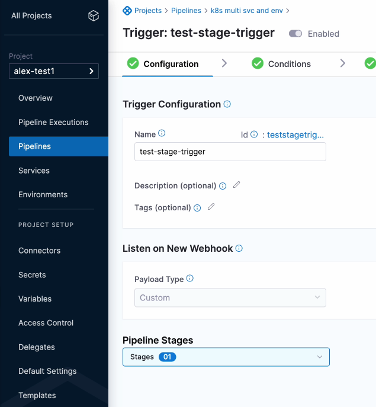
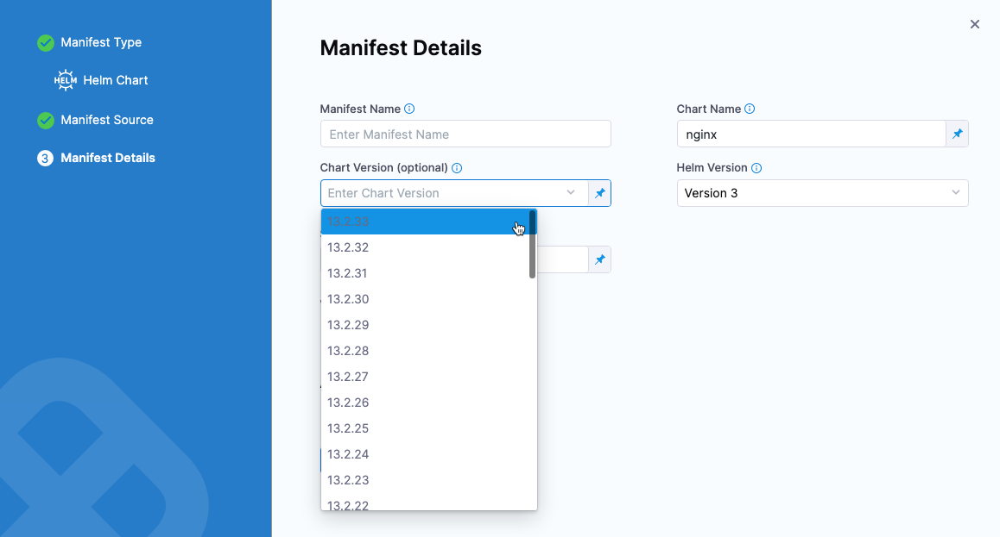
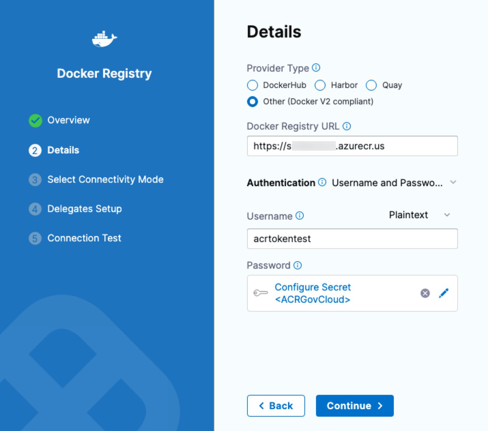
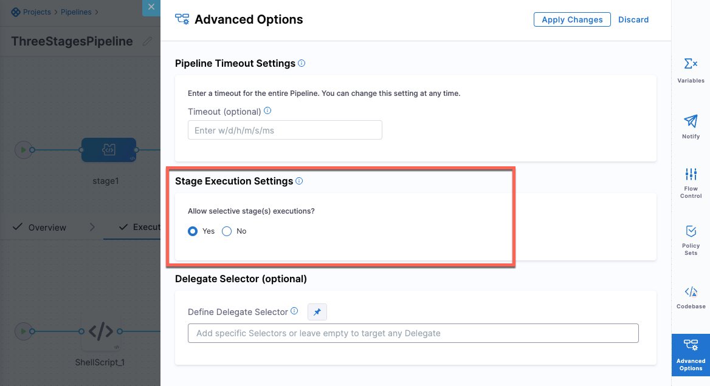
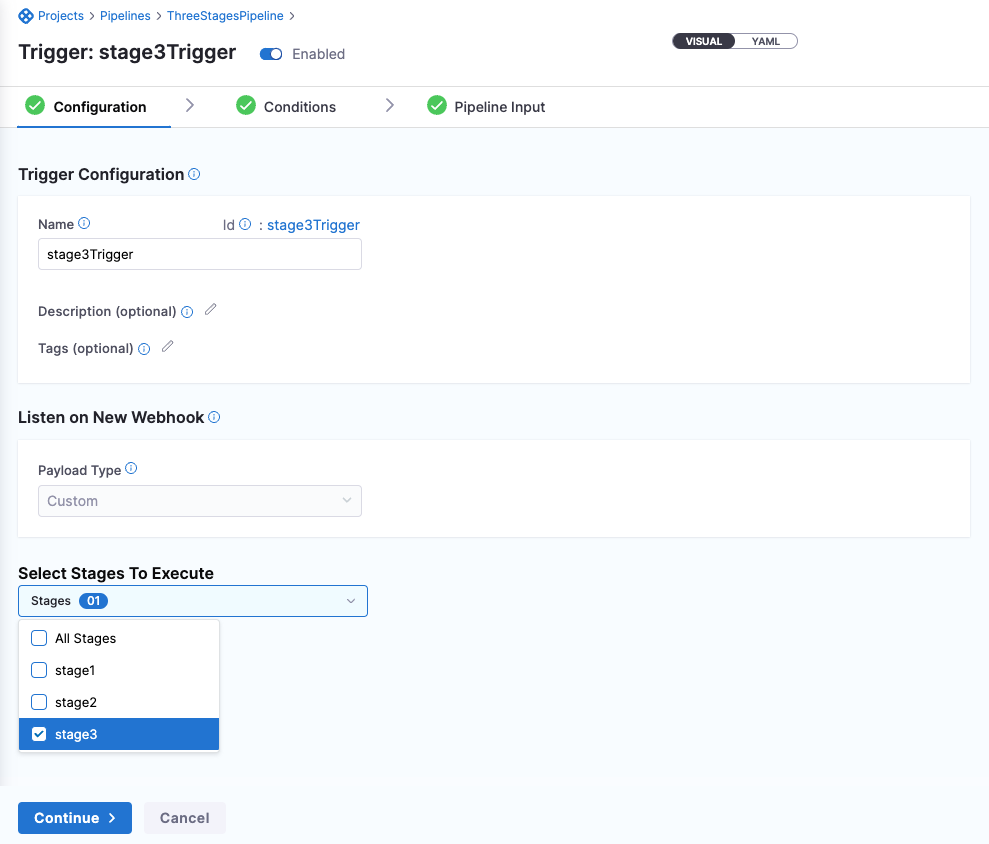
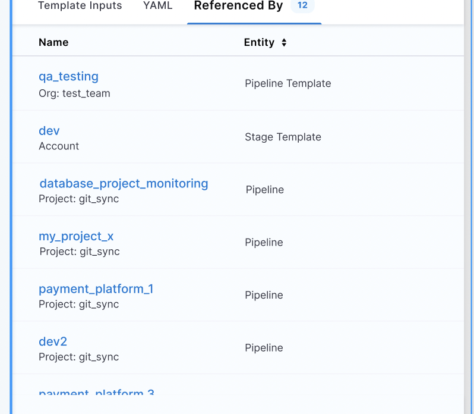
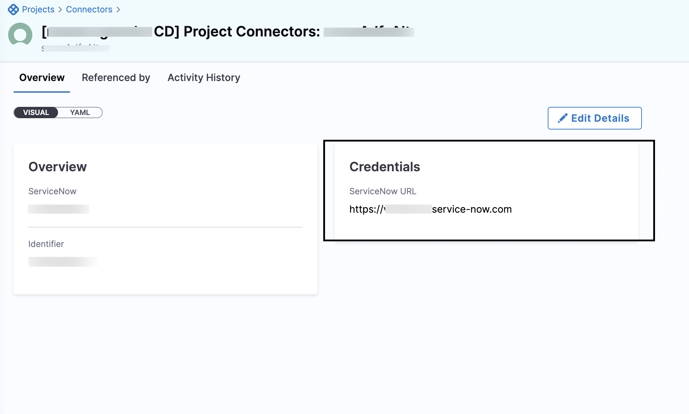
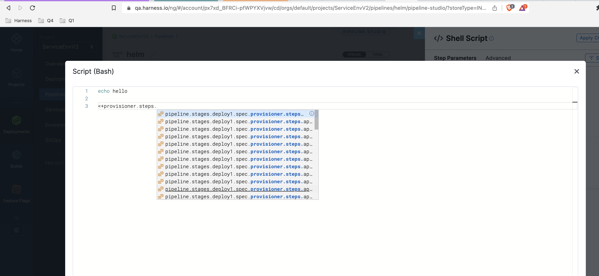
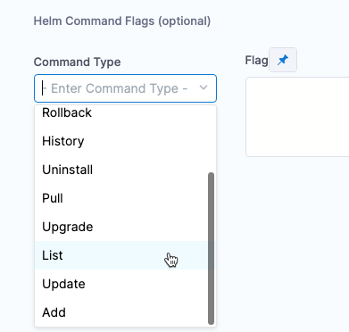
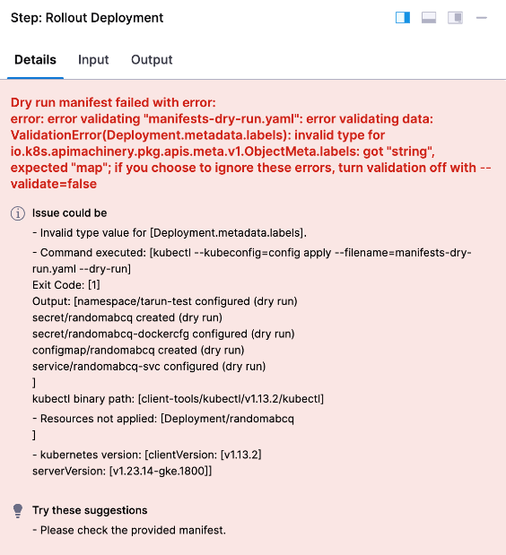

```mdx-code-block
import Tabs from '@theme/Tabs';
import TabItem from '@theme/TabItem';
```
```mdx-code-block
import delete_project from './static/delete-project.png'
```

<DocsButton icon = "fa-solid fa-square-rss" text="Subscribe via RSS" link="/release-notes/self-managed-enterprise-edition/rss.xml" />

Review the notes below for details about recent changes to Harness Self-Managed Enterprise Edition, NextGen. For release notes for FirstGen Self-Managed Enterprise Edition, go to [Self-Managed Enterprise Edition release notes (FirstGen)](/docs/first-gen/firstgen-release-notes/harness-on-prem-release-notes). Additionally, Harness publishes security advisories for every release. Go to the [Harness Trust Center](https://trust.harness.io/?itemUid=c41ff7d5-98e7-4d79-9594-fd8ef93a2838&source=documents_card) to request access to the security advisories.

## Latest - July 31, 2023, version 79819

#### Known issues

-  Terraform-based pipeline automation does not function correctly in Istio environments. UI operations are not affected. (PL-39776)

- The `log-service` created separate Redis streams and set the expiration of all keys. Harness temporarily does not support high availability configuration for the `log-service` until this issue is resolved. (CI-9000)

```mdx-code-block
<Tabs>
  <TabItem value="What's new">
```

This release includes the following Harness module and component versions.

| **Name** | **Version** |
| :-- | :--: |
| Helm Chart | [0.8.0](https://github.com/harness/helm-charts/releases/tag/harness-0.8.0) |
| Air Gap Bundle | [0.8.0](https://console.cloud.google.com/storage/browser/smp-airgap-bundles/harness-0.8.0) |
| NG Manager | 79819 |
| CI Manager | 4902 |
| Pipeline Service | 1.37.12 |
| Platform Service | 79601 |
| Access Control Service | 79400 |
| Change Data Capture | 79819 |
| Test Intelligence Service | release-177 |
| NG UI | 0.353.10 |
| LE NG | 68004 |

#### Self-Managed Enterprise Edition

- Harness now supports external self-managed databases for high availability. (SMP-1577, SMP-1617, SMP-1645, SMP-1646)

  To learn how to configure an external self-managed database, go to the following tutorials.

  - [MongoDB](/tutorials/self-managed-enterprise-edition/use-an-external-self-managed-mongodb/)
  - [PostgreSQL](/tutorials/self-managed-enterprise-edition/use-an-external-postgres-database/)
  - [Redis](/tutorials/self-managed-enterprise-edition/use-an-external-redis-database/)
  - [TimescaleDB](/tutorials/self-managed-enterprise-edition/use-an-external-sm-timescaledb/)

#### Continuous Delivery & GitOps

- Send emails to non-Harness users. (CDS-58625, ZD-42496)
  
  To send emails to non-Harness users, you must configure your own SMTP server and enable the **Enable Emails to be sent to non-Harness Users** default setting. This setting is available at Account, Org, and Project levels.

  For more information on how to send emails to non-Harness users, go to [Email step reference](https://developer.harness.io/docs/continuous-delivery/x-platform-cd-features/cd-steps/utilities/email_step/).

  Harness Delegate version 79503 is required for this feature.

- Edit Git details for pipelines stored using Harness Git Experience. (CDS-69130)
  
  You can now edit the Git metadata in the pipelines and input sets you use in your Git-synced Harness pipelines.

  You can edit the Harness Git connector, repository, and path to the YAML file.

  To edit the Git details, select **Edit Git Metadata** in the pipelines and input sets listing pages. 

  <docimage path={require('./static/d3ae175d36c932027045989f3c6d5b8b35ff3f50d7dec64195f1e1a264b4f577.png')} width="60%" height="60%" title="Click to view full size image" />  

  <docimage path={require('./static/87cae6dd20947c866629d225293d41ad83be7848061537e28efd2def8e14ea48.png')} width="60%" height="60%" title="Click to view full size image" />

- If any entities referenced in a pipeline are updated, a warning now appears in Pipeline Studio saying that reconciliation is needed. Previously, this warning appeared only when you manually tried to reconcile. (CDS-69672)

- Harness variables now have a **Required** setting. (CDS-69710)
  
  A **Required** setting is now added to both the API, Harness Manager, and YAML variable settings. 

  <docimage path={require('./static/0bf162c7149b298e69fb52a15588e994357d3b0cf283c9146b6a0f0dac0deccd.png')} width="60%" height="60%" title="Click to view full size image" />  

  When enabled, a variable with no value returns an error at pipeline runtime.  

  <docimage path={require('./static/153beccc9216340c35b3e2ca53ad81a35ec15e8b4621cd0402f0adc8372acc45.png')} width="60%" height="60%" title="Click to view full size image" />
  
  The **Required** option is also enforced when the variable is defined in a template and the template is included in a pipeline. 
  
  This feature is supported for pipeline, stage, service, and environment variables.

- JSON support for expressions. (CDS-73057)
  
  Harness has introduced support for writing expressions by using any JSON parser tool. You can now obtain an execution JSON for all stages or individual steps of your pipeline.
  
  To access the JSON, you must enable the **Enable JSON Support for expressions** setting first. Go to **Account Settings > Account Resources > Pipeline > Enable JSON Support for expressions**, and then set the value to `true`. Enabling this setting allows you to reference JSON parsers within expressions. This setting is turned off by default.

  For more details, go to [Writing expressions using any JSON parser tool](/docs/platform/variables-and-expressions/expression-v2/).

#### Continuous Error Tracking

- Harness deprecated the `global.srm.enabled` field. Use the `global.cet.enabled` field to enable Continuous Error Tracking for general availability. Harness also deprecated the Service Reliability Management object in the `values.yaml` file. Use the Continuous Error Tracking object in the `values.yaml` file for general availability. (CES-1354)

- You can now conveniently access a comprehensive list of all active agents running across your entire account directly from the subscription page. (CET-1225)

- With introduction of new CET module, access to ET event list from CI pipeline, no longer depends on a feature flag being turned on. Instead, the event list is automatically available to users licensed for CET. (CET-1330)

#### Continuous Integration

The Harness Cloud Linux amd64 image has new major and minor versions for multiple components. Major version upgrades are described below. For a complete list of component versions, go to the [Harness Cloud image specifications](/docs/continuous-integration/use-ci/set-up-build-infrastructure/use-harness-cloud-build-infrastructure/#platforms-and-image-specifications). (CI-7537)

:::caution
If you have pipelines running on Harness Cloud that rely on specific component versions, you might need to [lock versions or install additional tools](https://developer.harness.io/docs/continuous-integration/use-ci/set-up-build-infrastructure/use-harness-cloud-build-infrastructure/#lock-versions-or-install-additional-tools) to prevent your pipeline from failing due to image changes.
:::

#### Feature Flags

- In the onboarding flow, we added a new button and text box for a new project when there are no environments created. (FFM-7393)

- On the **Feature Flags** page, when viewing the state of flags across all environments, the flag status column now scrolls all the rows as one. This makes it easier to view flag and environment states on one screen. (FFM-7643)

#### Harness Delegate

- The List Tokens API now supports listing all the personal access tokens or service account tokens in the account. The API has been enhanced as follows:
   1. If you have user management permissions, you can list all the Personal Access Tokens in your account. You can also filter tokens belonging to a user or filter only active tokens.
   2. If you have service account management permissions, you can list all the service account tokens in your account. You can also filter tokens for a service account or filter only active tokens. (PL-31870, ZD-40110)

#### Harness Platform

- You can now sort pipelines in the pipelines list by selecting the sortable column headers or the sort dropdown. (PL-31527)

- When creating Azure Key Vault, you can now manually enter the vault name. (PL-32773, ZD-44045)

- You can now see disconnected delegate details in selection logs and error messages when there are no eligible delegates in an active state to execute tasks. (PL-37900)

- You can now use the legacy UI to create delegates. (PL-38937)

   This item is available with Harness Platform version 79411 and does not require a new delegate version. For information about Harness Delegate features that require a specific delegate version, go to the [Delegate release notes](/release-notes/delegate).

- You can now delete externally managed users from the Harness UI. (PL-38974)

   Harness recommends using this action with caution since it may result in data inconsistencies between Harness and the identity provider.

- There is now an additional tab on the **Create or Select Existing Connector** dialog called `All` that lists connectors from all scopes (project, organization, and account). (PL-39029)

- When configuring SMTP, you can now select specific delegates in **Delegates Setup**. (PL-39288)

- There is now a limit of 100 API Tokens per free and community account. (PL-39337)

#### Service Reliability Management

- `SocketTimedOut` error messages were not displayed in the call log. (OIP-537)

   This issue has been fixed. The call log now shows `SocketTimedOut` error messages.

- When configuring a health source, you were unable to input zero (0) in the **Lesser Than** and **Greater Than** fields. (SRM-14936)

   This issue has been fixed. You can now input zero (0) in both the fields.

```mdx-code-block
  </TabItem>
  <TabItem value="Early access">
```

#### Continuous Delivery & GitOps

- Kubernetes deployments support `HorizontalPodAutoscaler` and `PodDisruptionBudget` for Blue Green and Canary execution strategies. (CDS-59011)

  This functionality is behind a feature flag, `CDS_SUPPORT_HPA_AND_PDB_NG`. 
  
  Harness Delegate version 79503 is required for this feature.

- Added a new field in the release history for Blue Green deployments to differentiate between environments. (CDS-69961)
  
  Enable the feature flag, `CDS_BG_STAGE_SCALE_DOWN_STEP_NG` to leverage this feature. 

  This is an enhancement to the Kubernetes Blue Green Stage Scale Down step. You can now scale down your last successful stage environment only if the primary resources exist. This enhancement helps you efficiently manage your resources, and prevent deleting the important resources.

  Make sure that the infrastructure definition of these resources and the Blue Green service are the same. This is necessary as Harness identifies resources from the release history, which is mapped to a release name. If you configure a different infrastructure definition, it might lead to scaling down important resources.

  This item requires Harness Delegate version 79707. For information about features that require a specific delegate version, go to [Delegate release notes](/release-notes/delegate).

#### Continuous Integration

- **Remote debugging enhancements (CI-8135, CI-8048)**
  * **Re-run in Debug Mode** now supports Python and PowerShell Core (`pwsh`). You can also now use debug mode for local runner build infrastructures. The remote debugging functionality is behind a feature flag, `CI_REMOTE_DEBUG`. For more information, go to [Debug with SSH](/docs/continuous-integration/use-ci/debug-mode).

#### Harness Delegate

- Harness added the ability to acquire only the configured maximum number of tasks. This allows Harness Manager to use the task capacity to determine whether to assign a task to the delegate or queue it. You can configure the maximum number of tasks using the Env variable `DELEGATE_TASK_CAPACITY`. For example, if you set `DELEGATE_TASK_CAPACITY` to a value of 2 and execute 6 tasks in parallel, Harness Manager executes only 2 tasks at a time. If you don't configure `DELEGATE_TASK_CAPACITY`, Harness Manager executes all 6 tasks in parallel. (PL-39351)

   This functionality is behind a feature flag, `DELEGATE_TASK_CAPACITY_CHECK`. When the feature flag is enabled, the task is broadcast every minute in Harness Manager until it expires.


```mdx-code-block
  </TabItem>
  <TabItem value="Fixed issues">
```

#### Self-Managed Enterprise Edition

- Postgres prod was deployed in external self-managed database setup. Prior to this release, `global.postgres.enabled` controlled the deployment of postgres in the `override.yaml` file. (SMP-1697)

   This issue is fixed by using `global.database.postgres.installed` to control the deployment of Postgres in the `override.yaml` file. 

#### Continuous Delivery & GitOps

- SSH pipelines with GCR artifacts ran without populating the required runtime inputs. (CDS-55689)
  
  Fixed this issue by adding proper validations to GCR artifacts used for SSH pipelines.

- Fixed an issue where optional fields in a JIRA Update step were saved as key-value pairs. (CDS-58174)

- When a delegate selector was added at the step, stage, or pipeline level in a Jenkins step, it did not override the delegate selectors from the Jenkins connector. (CDS-68312, ZD-43710)

   This issue is fixed. Any selector at a step, stage, or pipeline level overrides the selectors from the Jenkins connector.

- Fixed an issue where the SSH and WinRM rollback were not skipped even if there were no successful previous deployments. (CDS-68583)

- Fixed an issue where the expression, `<+lastPublished.tag>.regex()` was not resolved properly when used as runtime input for artifacts. (CDS-68810)

- The expression, `<+artifacts.primary.identifier>` was not working properly for Google Cloud Storage deployments. (CDS-68993, ZD-44217)
  
  This issue is fixed. You can now see the identifier of the source selected as primary when using the expression `<+artifacts.primary.identifier>`. This functionality is behind the feature flag, `CDS_ARTIFACTS_PRIMARY_IDENTIFIER`.

- Fixed an issue where strings were interpreted as scientific notations. (CDS-69063, ZD-44206)

- Input values needed in steps or stages for execution failed with the error: `Cannot update execution status for the PlanExecution [execution Id] with RUNNING`. (CDS-69342, ZD-44344)
  
  This error occurred when converting YAML to JSON. A code enhancement fixed this issue. With this enhancement, quotes inside the field YAML are escaped, resulting in valid YAML.

- Fixed an issue where deployment freeze notifications were not being sent when a freeze window was activated. (CDS-69455)

- The pipeline execution error message for YAML related errors was unclear. (CDS-69576)
  
  Improved error message handling for YAML processing failures. The error message now display files that contain errors and points to the problematic part of the file.

- Improved the error message for pipeline execution failures when running a pipeline that has nested [chained pipelines](/docs/platform/pipelines/pipeline-chaining/). (CDS-69578, ZD-44443)

- Fixed an issue preventing pipelines from running due to YAML updates made when moving step groups in Pipeline Studio. (CDS-69622, ZD-44481)

- When Git-backend entities are referenced in a trigger, the inputs are validated before firing the trigger. (CDS-69727, ZD-44713)

- Support has been added to poll the get approval API to fetch and update the ticket status field for JIRA and ServiceNow approvals. (CDS-69770)

- The `lastYamlToMerge` parameter in the [pipeline execution with input set API](https://apidocs.harness.io/tag/Pipeline-Execute#operation/postPipelineExecuteWithInputSetList) didn't display any values. (CDS-70048, ZD-44855)
  
  To execute a pipeline with Input Set references, there is an optional field, `lastYamlToMerge` in the API request body. The values set for the `lastYamlToMerge` field were not acknowledged.

  This issue is fixed by acknowledging and properly overriding the `lastYamlToMerge` value. For more details, go to [Execute a pipeline with input set references](https://apidocs.harness.io/tag/Pipeline-Execute#operation/postPipelineExecuteWithInputSetList).

- Fixed an issue where a Jenkins step would mark voluntary settings as mandatory. (CDS-70071, ZD-44924)
  
  Users could not save empty values for job parameters in the Jenkins step due to validations present in the UI. This has been fixed now and the incorrect validations have been removed.

- Fixed an issue to honor default values in runtime inputs when trying to reconcile. (CDS-70075, ZD-44892)

- Unable to trigger pipelines using custom webhook triggers because the latest enhancement to custom webhook triggers requires a unique token for authentication. (CDS-70320, ZD-45022)
  
  This issue was caused by introducing a new API for custom webhook triggers, `/v3`, that generates a token for authenticating webhook triggers. You can see the token when you copy the trigger cURL command in Harness. This issue is fixed by allowing users to continue to use the previous API, `v2`, when the feature flag `SPG_DISABLE_CUSTOM_WEBHOOK_V3_URL` is enabled.

- Improved usability by adding an underline on the **Save Changes** button. (CDS-70328)
  
  The button now has an underline to help users know it is clickable.

- Certificate issues in Harness Delegate version 23.05.79307. (CDS-70410, ZD-45105, ZD-45110, ZD-45128)
  
  The HTTP step was failing due to absence of the `certificate` value in the step. In previous delegate versions, the delegate would bypass the absence of this field. However, in delegate version 23.05.79307, this field was incorrectly set as mandatory for HTTP step execution for validations against servers that had self-signed certificates. This issue is fixed.

- Selecting stages for trigger execution shows all stages. (CDS-70419)
  
  When setting up triggers for selective stage execution, the trigger displayed all of the stages, and not just the selected stages. This issue has now been fixed.

- Tag value did not clear when the **Regex** option is selected in the artifact details. (CDS-70487)
  
  When setting up artifact repositories, artifacts can be specified by name or regex. The **Tag** setting was not being cleared when this selection changed from **Name** to **Regex** or vice versa. This bug has now been fixed.

- Pipeline execution triggered using a webhook trigger failed with the error, `Error while retrieving template with identifier [%s] and versionLabel [%s]"", templateIdentifier, versionLabel`. (CDS-70552, ZD-45178)

   This issue is fixed. The error message has been improved to display the cause of pipeline execution failure.

- Fixed an issue where the `eventPayload` expressions were not resolving when rerunning a failed pipeline that was previously fired by using a trigger. (CDS-70559)

- Links to org or account level service or environment in a pipeline were redirecting to the project level entities. (CDS-70607)
  
  This issue is fixed by adding correct links to org and account level services and environments in the pipeline Deployments page.

- Unable to save a pipeline that uses a step group template. (CDS-70762)
  
  There was an error that prevented the saving of pipelines that used a step group template. This error has been fixed.

- Running a [Terraform Plan](/docs/continuous-delivery/cd-infrastructure/terraform-infra/run-a-terraform-plan-with-the-terraform-plan-step/) step created a plan secret in Vault, but didn't delete the secret. (CDS-70770, ZD-45312)
  
  Clearing secrets from Vault was dependent on exporting the JsonPlan or human-readable options. 
  
  This issue is fixed. Now, the encrypted plan stored on Vault is cleared regardless of the export options.

- The execution view displayed host name instead of step name when the **Run on Delegate** option in [Repeat looping strategy](/docs/platform/Pipelines/looping-strategies-matrix-repeat-and-parallelism) was enabled for a Command step for SSH or WinRM deployment. (CDS-70780)
  
  This issue is fixed as part of a code enhancement. Harness does not allow saving, creating, or editing Command steps with Repeat looping strategy when the **Run on Delegate** option is selected, and displays an error message: `Command Step contains a combination of looping strategy and run on delegate options enabled, please select only one.`

- The **Repository Name** setting in the pipeline list page filter was not working properly. (CDS-70784, ZD-45350)
  
  This issue is fixed. If there are any saved filters that use **Repository Name**, you must delete and create the filter again.

- Pipeline shows success, but many stages haven't started running. (CDS-70850, ZD-45392)
  
  Previously, when you attempted to rerun the execution of the aborted stage that used a matrix looping strategy, the aborted matrix stages would execute, but all subsequent stages would be skipped. This resulted in the pipeline execution being finished without running all stages.
  
  Now, when resuming execution from an aborted matrix stage, the stages after the aborted stage are executed correctly.

- Rollback steps were not running on Approval step rejection. (CDS-71032, ZD-45472)
  
  When **Rollback** was selected as the failure strategy for an Approval step, the steps in the stage **Rollback** section were not running.
  
  Rollback steps are now correctly supported.

- Fixed an issue where a change in the Artifact Details **Image Path** did not trigger a corresponding change in the **Tag** setting. (CDS-71215)

- Unable to view the account-level deployment stage templates. (CDS-71230, ZD-45557)
  
  Previously, when you provided incomplete YAML during template creation, the templates got saved without proper stage types. The templates were filtered out and were not visible in the API response when used during pipeline creation.

  Harness has implemented changes to restrict the creation of templates with incomplete YAML, ensuring that templates are saved with the necessary stage types. You are now required to provide complete YAML during template creation to ensure proper visibility and usage.

- Creating a launch template for an AWS Auto Scale Group (ASG) deployment resulted in a null pointer exception. (CDS-71235)

  This issue is fixed by adding proper validation for the ASG launch template manifest content.

- A deleted template in the template library cannot be recreated. (CDS-71335, ZD-45591)
  
  The template list page was not showing the last template. Trying to create a new template with the same identifier and version label resulted in an error saying that the template already existed.
  
  The issue is now fixed.

- Pipeline execution failed when a variable whose required field is set to `TRUE` is passed as an expression. (CDS-71357, ZD-45615)

  Harness checks for the value of the variable whose required field is set to `TRUE`, and the pipeline failed if the value was empty. This issue occurred when Harness checked for the value of variables that were passed as expressions. The value of expressions cannot be resolved during pipeline creation. 

  This issue is fixed by ignoring the check for variables passed as an expression. 

- Fixed an issue where the applications created outside Harness were deleted during rollback if a Tanzu Application Services (TAS) Rolling deployment failed the first time. (CDS-71397)
  
  This item requires Harness Delegate version 79707. For information about features that require a specific delegate version, go to [Delegate release notes](/release-notes/delegate).

- The expressions corresponding to objects like list, maps, and so on were incorrectly converted to string type using the Java `String.valueOf` method resulting in incorrect formatting. (CDS-71619)
  
  For example, the expression `<+pipeline.variables>` corresponding to the following object types are incorrectly converted to:
  * Map: `{key1=val1, key2=val2}`
  * List: `["a", "b", "c"]` (with spaces)
  
  This issue is fixed and the output values for expressions are returned as JSON objects. Now, the expression in the above example for a map object returns `{"key1":"val1","key2": "val2"}`, and a list object returns `["a","b","c"]` (without spaces).

- Unable to choose stages during pipeline execution. (CDS-71712, ZD-45762)
  
  This issue is fixed by adding an error icon that will be displayed when the stage selection dropdown is disabled due to an API error. Error details will be available if you hover over the error icon.

- Fixed an issue where a multi-environment deploy stage was not executing while propagating from a previous stage when using the **Deploy to Filtered List** option with the `<service.tags>` parameter. (CDS-71887)

- A project-level template crashed when opened. (CDS-71980, ZD-45950)

  The three hyphens, `---` used in the YAML as YAML document separator was being replaced by `---\n` with an empty string due to a logic in the code. This logic made the YAML invalid. 

  This issue is fixed by disabling `YAMLGenerator.Feature.WRITE_DOC_START_MARKER` in the YamlUtils to stop the YAML document separator `---` from being added to the YAML.

- The pipeline build failed due to reformatting of the script. (CDS-72093, ZD-45874)

  The three hyphens (`---`) used as a YAML document separator were replaced by `---\n`. This formatting made the YAML invalid.

  Harness no longer adds the new line in the YAML, and honors the separator when processing the YAML.

- Fixed an issue where Harness asked users to enter SSH credentials in the **SSH Connection Attribute** field in the **Run Pipeline** page for a template created to capture WinRM credentials. (CDS-72071, ZD-45926)

- When a pipeline is retried from a stage, and there's a step that passed after multiple retries, Harness was not copying the status of the step correctly in the retries. Instead, the first try for step that failed was copied. This made the stage appear as failed in retry. (CDS-72101, ZD-46049)

   This issue is fixed, and all the retries for the step are now copied correctly in the status.

- Fixed an issue where the Container step was failing when emptyDir volume was being used. (CDS-72119, ZD-45892)

- Step templates within step groups created under stage templates were not executing properly. (CDS-72124, ZD-45924, ZD-46151)
  
  A code enhancement fixed this issue.

- Harness has added an access control check to the `/v2/{planExecutionId}` API to prevent users from anonymously accessing the plan execution Id using the API. (CDS-72155)

- An error occurred when running a Terragrunt pipeline: `Invalid request: Oops, something went wrong on our end. Please contact Harness Support`. (CDS-72226, ZD-46120)
  
  The Terraform and Terragrunt steps' **Secret Manager** settings were listing all available connectors instead of listing supported connectors. 

  This issue is fixed. The **Secret Manager** setting lists only supported connectors now.

- Fixed environment links to properly redirect to the **Summary** or **Configuration** page. (CDS-72463, ZD-46260)

- Fixed an issue where pipeline YAMLs didn't get updated when the optional fields in a step were removed. (CDS-72807)

#### Continuous Integration

- When creating a step template, the labels for **Configure Run Tests step** and **Configure Run step** have been shorted to **Run Tests** and **Run** respectively. This change follows labeling conventions used elsewhere in Harness CI. (CI-4771)

- When configuring a [Background step](/docs/continuous-integration/use-ci/manage-dependencies/background-step-settings), the **Entry Point** field is now located under **Additional Configuration** if the stage uses the Harness Cloud, local runner, or self-hosted VM build infrastructure. (CI-6993)

- Fixed an issue related to logs for Background steps. (CI-7615, ZD-44501)

- Improved error messages for [Run steps](/docs/continuous-integration/use-ci/run-ci-scripts/run-step-settings) using [AWS connectors](/docs/platform/Connectors/Cloud-providers/add-aws-connector) with invalid credentials in [VM build infrastructures](/docs/category/set-up-vm-build-infrastructures). (CI-7942, ZD-44039)

- Artifacts produced by **Build and push** steps inside a [matrix looping strategy](/docs/platform/pipelines/looping-strategies-matrix-repeat-and-parallelism/) now appear on the **Artifacts** tab on the [Build details page](/docs/continuous-integration/use-ci/viewing-builds). (CI-7970)

- Fixed an issue where the active developer count was not reported for builds triggered manually. (CI-8025)

- BitBucket Cloud limits the key size for sending status updates to PRs, and this can cause incorrect status updates in PRs due to some statuses failing to send. If you encounter this issue with BitBucket Cloud, contact [Harness Support](mailto:support@harness.io) to troubleshoot this issue by enabling a feature flag, `CI_BITBUCKET_STATUS_KEY_HASH`. (CI-8302, ZD-45441)

- Fixed an issue where Artifactory connector credentials weren't correctly passed to [Upload Artifacts to JFrog Artifactory steps](/docs/continuous-integration/use-ci/build-and-upload-artifacts/upload-artifacts-to-jfrog) in nested [step groups](/docs/continuous-integration/use-ci/optimize-and-more/group-ci-steps-using-step-groups). (CI-8351, ZD-45611)

- Applied scrolling to long remediation messages when [troubleshooting with AIDA](/docs/continuous-integration/troubleshoot-ci/aida). (CI-8599)

#### Feature Flags

- The view in the modal screen for setting up GitEx was not wide enough to show appropriate errors. This issue has been fixed. (FFM-7311)

- There was an issue where toggling between the Targets and Target Groups pages caused the new page to re-render. This issue has been fixed. (FFM-7965)

- Previously, there was an edge case where an extremely large number of pages in a UI listing could cause performance degradation. This issue has been fixed, and page numbering is now disabled if the page count exceeds 1000 pages. (FFM-7993)

- Previously, a user could select Feature Flags in Harness without having a license, and would then get a 404 error. Now, users only see the FF module if they have an active license (including a free license). (FFM-8002)

- The **Create a new flag** button did not behave as expected on the onboarding screen if there were existing flags. This issue has been fixed. (FFM-8019)

#### Harness Delegate

- The account-level **Session Timeout (in minutes)** allowed values greater than the 4320 minute maximum. (PL-32498)

   This issue has been resolved by adding a code validation. The field no longer accepts values above 4320 minutes.

   This item requires Harness Delegate version 79707. For information about features that require a specific delegate version, go to the [Delegate release notes](/release-notes/delegate).

- Enhanced handling and logging for the `No enum constant io.harness.delegate.message.MessengerType.WATCHEIN` exception to enable the actual malformed message. This error indicates that a message is malformed and only occurs when there is a write error such as out of disk, process killed, etc. (PL-38245)

- Deployments consistently failed during the same stage. (PL-38247, ZD-42721)

   This issue was fixed by updating the delegate YAML. Delegate startup now fails when you use a legacy delegate image with an immutable delegate.

- The delegate token list result from the `DelegateTokenStatus` API endpoint displayed all values as `null`. (PL-39440)

   A code enhancement for the `DelegateTokenStatus` endpoint to return token values even when token details are not fetched by token name fixed this issue. Token values only populate when the user has edit delegate permission. If the user doesn't have edit delegate permission, the value remains `null`.
  
- It was possible to edit project identifiers. (PL-39609)

  A code enhancement has fixed this issue.

#### Harness Platform

- When SMTP was not configured, password reset did not throw an error. (PL-24542)
  
  A code enhancement fixed this issue.

- SAML provider **Name** and **Friendly Name** fields allowed special characters. (PL-39070)

    This issue is fixed by `displayName` and `logoutURL` field validations. The `displayName` only allows alphanumeric characters, `_`, `-`, `.`, and spaces. The `logoutURL` must be a valid HTTPS URL format.

- Deletion of vault connectors does not delete the corresponding perpetual tasks. (PL-27621)
  
  A code enhancement has fixed this issue.

- In earlier releases, the button for managing role bindings for users, user groups, and service accounts was named +Role. However, given that you can also remove role bindings in the Manage Role Bindings dialog, the button has been renamed to Manage Roles. (PL-28484)

- An attempt to edit a secret sent repeated requests to the backend if the secret was not found. (PL-32313)
 
  A code enhancement fixed this issue.

- When **ALL** scope was selected on the **Role binding** page for a specific user, incorrect data was displayed. (PL-38426, ZD-43503)

  A code enhancement has fixed this issue.

- Account-level connectors with resource groups set to **Specified** were not available at the project-level. (PL-38828, ZD-44474). 

  This issue is now fixed. The connectors list shows the connectors for which users have resource group permissions set.

  This item requires Harness Delegate version 79904. For information about features that require a specific delegate version, go to the [Delegate release notes](/release-notes/delegate).

- SCIM PATCH requests for deleting a Harness user return a “user does not exist” message in a successful delete operation. (PL-38868, ZD-44150)

  This issue has been resolved by returning a NULL response in the Patch operation to delete a user.

- When creating a service account with the same name in a different scope, an error was thrown. (PL-38885)

  A code enhancement has fixed this issue.

- It was mandatory to enter email addresses even if **Send email to all users in a user group** was checked in **Notification Preferences**. (PL-38910)

  A code enhancement fixed this issue.

- The user invite API returned an HTTP status code of 200 if the invited user had an invalid TLD. (PL-38938)

  This has been fixed, and the API now returns a status code of 400.

- In earlier releases, users were allowed to include the following special characters in the user name field in their profile: colon (`:`), slash (`/`), less than sign (`<`), greater than sign (`>`), equal sign (`=`), and parentheses (`(` and `)`). Support for these special characters allowed malicious users to inject HTML and JavaScript code into deployment-related emails such as approval emails. (PL-39099)

  For enhanced security, Harness no longer allows a user to include these special characters in their name. If an existing user name has any of these special characters, Harness does not include the special characters when adding the name to emails.

- The AWS connector widget's prefix field did not accept prefixes starting with a slash. Such slashes were stripped off, and this led to undesired behavior. (PL-39194, ZD-45104)

  Prefixes that begin with a slash are now supported. 

  This item requires Harness Delegate version 79904. For information about features that require a specific delegate version, go to the [Delegate release notes](/release-notes/delegate).

- Improved randomness when there are multiple eligible delegates with no tasks running to avoid selecting the same delegate each time. (PL-39219)

  This item is available with Harness Platform version 79606 and does not require a new delegate version. For information about Harness Delegate features that require a specific delegate version, go to the [Delegate release notes](/release-notes/delegate).

- Certain users see the following message when they select the Connectors page for their project: "You are not authorized to view default settings.
You are missing the following permission: "View default settings" in Account scope." (PL-39221, ZD-45360)

  This issue has been fixed by the removal of an account-level permission check that has been deemed unnecessary.

#### Service Reliability Management

- There was an error collecting metric data when encountering  `null` values returned by metric queries. (OIP-551)

   This issue has been resolved by ignoring null data points and using valid data points in the window.

- When configuring a Deploy stage and selecting a value in the **Propagate from** field to propagate a service from the previous parallel stage, an error would occur when attempting to create a monitored service. (SRM-12454)  
  
  This issue has been resolved. You can now successfully create a monitored service even when selecting a value in the **Propagate from** field to propagate a service from the previous parallel stage.

- Unable to select multiple environments when creating a monitored service for infrastructure. (SRM-14794, SRM-14862)  
  
  This issue has been resolved. You can now select multiple environments when creating a monitored service for infrastructure.

- The Monitored Service Listing page was not displaying the latest updated monitored service first. (SRM-14845)  
  
  This issue has been resolved. Now, the monitored service list is sorted in the following order:

  - A monitored service with the most recent update will be displayed at the top of the list.

  - If a monitored service has been updated with new analysis data, it is given higher priority and displayed before other services on the list.

- SLOs were getting stuck in the recalculation state even after the recalculation process was complete. (SRM-14849)  
  
  This issue has been resolved. Now, the SLOs transition to the appropriate state once the recalculation has finished successfully.

- When using a template that has a service and an environment as input values to create a monitored service in a Verify step, you were unable to select the environment and service at the account, organization, or project levels. (SRM-14944)

  This issue has been resolved, and you can now select the desired environment and service in these cases as expected.

- During monitored service creation, when adding a health source that supported metrics, both **Errors** and **Performance** metric packs were automatically selected as default options. However, if the user chose to select only one of the options, when the monitored service was reopened, both metric options remained selected. (SRM-14998)
  
  This issue has been resolved. The selected metric pack option during monitored service creation will now be correctly reflected upon opening the monitored service.

```mdx-code-block
  </TabItem>
</Tabs>
```

## Previous releases

<details>
<summary>2023 releases</summary>

#### July 12, 2023, patch release for version 79421

Patch releases for Harness Self-Managed Enterprise Edition include minor new features, bug fixes, and updates to address potential security vulnerabilities.

This release includes the following Harness module and component versions.

| **Name** | **Version** |
| :-- | :--: |
| Helm Chart | [0.7.2](https://github.com/harness/helm-charts/releases/tag/harness-0.7.2) |
| Air Gap Bundle | [0.7.2](https://console.cloud.google.com/storage/browser/smp-airgap-bundles/harness-0.7.2) |
| NG Manager | 79422 |
| CI Manager | 3907 |
| Pipeline Service | 1.33.8 |
| Platform Service | 79202 |
| Access Control Service | 79004 |
| Change Data Capture | 79422 |
| Test Intelligence Service | release-177 |
| NG UI | 0.349.16 |
| LE NG | 67902 |

#### What's new

This release does not include new features.

#### Early access

This release does not include any early access features.

#### Fixed issues

- For installations with custom dashboards enabled, the Harness Helm chart version 0.7.1 included entries that caused installation issues during upgrade. Custom dashboards were not available with the 0.7.1 patch release for Harness Self-Managed Enterprise Edition. (CDB-981)

   This issue is fixed. The Harness Helm chart entries are corrected, and Helm installations succeed as expected. Custom dashboards are available if enabled.


#### July 7, 2023, patch release for version 79421

Patch releases for Harness Self-Managed Enterprise Edition include minor new features, bug fixes, and updates to address potential security vulnerabilities.

This release includes the following Harness module and component versions.

| **Name** | **Version** |
| :-- | :--: |
| Helm Chart | [0.7.1](https://github.com/harness/helm-charts/releases/tag/harness-0.7.1) |
| Air Gap Bundle | [0.7.1](https://console.cloud.google.com/storage/browser/smp-airgap-bundles/harness-0.7.1) |
| NG Manager | 79422 |
| CI Manager | 3907 |
| Pipeline Service | 1.33.8 |
| Platform Service | 79202 |
| Access Control Service | 79004 |
| Change Data Capture | 79422 |
| Test Intelligence Service | release-177 |
| NG UI | 0.349.16 |
| LE NG | 67902 |

#### What's new

- Send emails to non-Harness users. (CDS-69561, CDS-58625, ZD-42496)
  
  To send emails to non-Harness users, you must configure your own SMTP server and enable the **Enable Emails to be sent to non-Harness Users** default setting. This setting is available at Account, Org, and Project levels.

  For more information on how to send emails to non-Harness users, go to [Email step reference](https://developer.harness.io/docs/continuous-delivery/x-platform-cd-features/cd-steps/utilities/email_step/).

  Harness Delegate version 79503 is required for this feature.

- The [Harness Helm charts](https://github.com/harness/helm-charts) `values.yaml` file is updated to include Error Tracking images. (SMP-1615)

#### Early access

This release does not include any early access features.

#### Fixed issues

- SAML SSO sign-in attempts failed after upgrading from 0.6.0 to 0.7.0.  (PL-39850, SMP-1583)

   This issue is fixed. SAML SSO sign-ins no longer fail after an upgrade.

#### June 30, 2023, version 79421

This release includes the following Harness module and component versions.

| **Name** | **Version** |
| :-- | :--: |
| Helm Chart | [0.7.0](https://github.com/harness/helm-charts/releases/tag/harness-0.7.0) |
| Air Gap Bundle | [0.7.0](https://console.cloud.google.com/storage/browser/smp-airgap-bundles/harness-0.7.0;tab=objects?prefix=&forceOnObjectsSortingFiltering=false) |
| NG Manager | 79421 |
| CI Manager | 3907 |
| Pipeline Service | 1.33.8 |
| Platform Service | 79202 |
| Access Control Service | 79004 |
| Change Data Capture | 79421 |
| Test Intelligence Service | release-177 |
| NG UI | 0.349.16 |
| LE NG | 67902 |

#### What's new

#### Continuous Integration

- The **Get Started** button on the Harness CD start page resulted in an error, preventing Harness CD from opening. (CDS-70665, PLG-2570)

   This issue is fixed. Harness CD now starts as expected.

- You can now reference [output variables produced by Plugin steps](/docs/continuous-integration/use-ci/use-drone-plugins/plugin-step-settings-reference#output-variables) in pipelines that use Kubernetes cluster build infrastructures. This is an addition to previously-existing support for Harness Cloud and self-hosted Cloud provider VM build infrastructures. (CI-7491)

#### Continuous Delivery & GitOps

- You can now merge templates with identical identifiers. (CDS-47301)
  
  A warning pops up when you create a new template with already existing identifiers in the same scope. You can choose to merge the new template with the existing template by selecting the **Save as new version of existing template** button in the warning.

- Trigger artifact and manifest expressions (`<+trigger.artifact.build>` or `<+trigger.manifest.version>`) are now resolved when you rerun a pipeline that was activated by a trigger. (CDS-58192, CDS-50585)
  
  Here is a sample resolved YAML: 

  ```
  {
    "status": "SUCCESS",
    "data": {
        "planExecutionId": "PimcPiwlQ56A2AhWogEM7A",
        "executionYaml": "pipeline:\n  identifier: \"asda\"\n  name: \"asda\"\n  projectIdentifier: \"test\"\n  orgIdentifier: \"default\"\n  tags: {}\n  stages:\n  - stage:\n      identifier: \"sda\"\n      type: \"Deployment\"\n      name: \"sda\"\n      description: \"\"\n      spec:\n        serviceConfig:\n          serviceRef: \"ads\"\n          serviceDefinition:\n            type: \"Kubernetes\"\n            spec:\n              variables: []\n              artifacts:\n                primary:\n                  type: \"DockerRegistry\"\n                  spec:\n                    connectorRef: \"Test\"\n                    imagePath: \"library/nginx\"\n                    tag: \"<+trigger.artifact.build>\"\n              manifests: []\n        infrastructure:\n          environmentRef: \"wew\"\n          infrastructureDefinition:\n            type: \"KubernetesDirect\"\n            spec:\n              connectorRef: \"ad\"\n              namespace: \"asd\"\n              releaseName: \"release-<+INFRA_KEY>\"\n          allowSimultaneousDeployments: false\n        execution:\n          steps:\n          - step:\n              identifier: \"sad\"\n              type: \"ShellScript\"\n              name: \"sad\"\n              spec:\n                shell: \"Bash\"\n                onDelegate: true\n                source:\n                  type: \"Inline\"\n                  spec:\n                    script: \"echo \\\"test\\\"\"\n                environmentVariables: []\n                outputVariables: []\n                executionTarget: {}\n              timeout: \"10m\"\n          rollbackSteps: []\n      tags: {}\n      failureStrategies:\n      - onFailure:\n          errors:\n          - \"AllErrors\"\n          action:\n            type: \"StageRollback\"\n",
        "inputYaml": "pipeline:\n  identifier: \"asda\"\n  stages:\n  - stage:\n      identifier: \"sda\"\n      type: \"Deployment\"\n      spec:\n        serviceConfig:\n          serviceDefinition:\n            type: \"Kubernetes\"\n            spec:\n              artifacts:\n                primary:\n                  type: \"DockerRegistry\"\n                  spec:\n                    tag: \"<+trigger.artifact.build>\"\n",
        "resolvedYaml" "pipeline:\n  identifier: \"asda\"\n  stages:\n  - stage:\n      identifier: \"sda\"\n      type: \"Deployment\"\n      spec:\n        serviceConfig:\n          serviceDefinition:\n            type: \"Kubernetes\"\n            spec:\n              artifacts:\n                primary:\n                  type: \"DockerRegistry\"\n                  spec:\n                    tag: \"1.23-perl"\n",
        "triggerPayload": {
            "type": "ARTIFACT",
            "headers": {},
            "sourcetype": "CUSTOM_REPO",
            "artifactdata": {
                "build": "1.23-perl"
            },
            "version": 0
        }
    },
    "metaData": null,
    "correlationId": "1ad40479-c6ff-47e4-9722-db11c0a3ab06"
  }
  ```

- You can add metadata or [JEXL conditions](/docs/platform/pipelines/w_pipeline-steps-reference/triggers-reference/#jexl-conditions) on artifact triggers just like custom triggers. (CDS-51928)

- Added support for accessing connector attributes for Deployment Templates. (CDS-54247)
  
  The Harness Delegate version 79307 is required for this feature.
  
  The connector attributes for Secret Manager connectors can be accessed in Deployment Templates using the following expressions. 
  
  * [AWS KMS](/docs/platform/Secrets/Secrets-Management/add-an-aws-kms-secrets-manager): `<+infra.variables.AwsKms.spec.credential.type>`
  * [AWS Secrets Manager](/docs/platform/Secrets/Secrets-Management/add-an-aws-secret-manager): `<+infra.variables.AwsSecretsManager.spec.region>`
  * [Azure Key Vault](/docs/platform/Secrets/Secrets-Management/azure-key-vault): `<+infra.variables.AzureKeyVault.spec.vaultName>`
  * [Google KMS](/docs/platform/Secrets/Secrets-Management/add-google-kms-secrets-manager): `<+infra.variables.GcpKms.spec.keyName>`
  * [Google Cloud secret manager](/docs/platform/Secrets/Secrets-Management/add-a-google-cloud-secret-manager): `<+infra.variables.GcpSecMan.spec.credentialsRef.identifier>`
  * [Custom secret manager](/docs/platform/Secrets/Secrets-Management/custom-secret-manager): `<+infra.variables.CustomSecMan.spec.isDefault>`
  * [HashiCorp Vault](/docs/platform/Secrets/Secrets-Management/add-hashicorp-vault): `<+infra.variables.HashiCorp.spec.vaultUrl>`

- The option to **Auto-Reject previous deployments paused in this step on approval** is added to the Approval step. (CDS-58063)
  
  With this option, you can now reject old executions waiting for approval when a latest step is approved. For more information, go to [Manual Approval steps in CD stages](/docs/continuous-delivery/x-platform-cd-features/cd-steps/approvals/using-harness-approval-steps-in-cd-stages).

- Users can now add input variables of all types when adding an HTTP step from the Harness UI. (CDS-58376)
  
  For more information, go to [Input variables](/docs/continuous-delivery/x-platform-cd-features/cd-steps/utilities/http-step/#input-variables).

- Removed support for creating or updating a variable of type `secret` in the Update Release Repo step. (CDS-58530)
  
  For example, adding a variable of the type `secret` in an environment will no longer create any entry in the `config.js` file via the Update Repo Step. 
  
  All such cases are now ignored by Harness.

- Added support to provide quartz cron expressions for scheduled triggers. (CDS-59261, CDS-59260)
  
  The Harness Delegate version 79307 is required for this feature. 
  
  For more information, go to [Schedule pipeline using triggers](/docs/platform/triggers/schedule-pipelines-using-cron-triggers/).

- Added support for the **Enforce Git experience for pipelines and templates** Git experience. (CDS-67885)
  
  A new Git experience is introduced, **Enforce git experience for pipelines and templates**. Enabling this setting lets you create only remote pipelines and templates. If this setting is enabled, then the `InputSet` is out of scope as it is controlled by the pipelines.

#### Harness Delegate

- Converted Harness CD from an explicit to an implicit change source for Service Reliability Management. (SRM-14724)

#### Harness Platform

- You can now see the total number of secrets in the secrets list and sort them by various columns. (PL-31528)

   This item is available with Harness Platform version 79411 and does not require a new delegate version. For information about Harness Delegate features that require a specific delegate version, go to the [Delegate release notes](/release-notes/delegate).

- AuthZ now considers the SAML setting that the user logged into when multiple SAML settings are present and the user belongs to more than one of them. The user is removed from any other SAML settings that the same user might have been part of, and synced with Harness through previous SAML logins. (PL-32484)

- The **Connector Details** page now shows whether a connector is connected via a delegate or via Harness Platform. (PL-32673)

- The Azure Key Vault secret manager now supports creating secrets with expiration dates. Select **Expires On** to set a secret expiration date. The Harness Delegate version 79307 is required for this feature. (PL-32708, PL-38465, ZD-42524)

#### Service Reliability Management

- New errors are introduced to provide a comprehensive insight into SLO's performance. (SRM-14549) 
  
  Now, errors are displayed in the following scenarios:
  
  - Ongoing Problem: Errors are displayed when an SLO experiences an ongoing problem, such as an issue with the health of a connector.
  
  - Missing Data: Errors are shown when there is missing data in an SLO, even if there is no current error. This helps identify any gaps in historical SLO records.
  
  - Contributing SLO Issues: Errors in contributing SLOs are now reflected in the composite SLO, ensuring a complete picture of performance when individual components encounter problems.

- You can now configure your monitored service to trigger notifications whenever there are updates or changes related to chaos experiments or feature flags. (SRM-14553)

- In the event of an SLO encountering an error, it is now displayed in the respective Simple and Composite SLOs. Additionally, when the underlying issue causing data collection failures is resolved, the missed data that couldn't be collected during the error period will be restored. However, there is a 24-hour time limit for data restoration. For example, if the issue is resolved within 48 hours, only the last 24 hours of data is restored. (SRM-14672)

- Selecting a Prometheus metrics entry in the Service Health page of a monitored service directly navigates you to the Prometheus metrics dashboard. (SRM-14699)

- The Monitored Service listing page now displays a summary of changes related to the number of feature flags and chaos experiments, along with the other custom change sources. (SRM-14742)

#### Early access

#### Continuous Integration

- **Re-run in Debug Mode** now supports Python and PowerShell Core (`pwsh`). You can also now use debug mode for local runner build infrastructures. (CI-8135, CI-8048)

   The remote debugging functionality is behind a feature flag, `CI_REMOTE_DEBUG`. For more information, go to [Debug with SSH](/docs/continuous-integration/use-ci/debug-mode).

#### Continuous Delivery & GitOps

- Trigger all artifacts and manifests using **On New Artifact** and **On New Manifest** triggers respectively. (CDS-68262, ZD-43588, ZD-43726)
  
  This functionality is behind a feature flag, `TRIGGER_FOR_ALL_ARTIFACTS`. 

  Earlier, you could trigger only the last pushed artifact or manifest using triggers. You can now trigger all collected artifacts and manifests of perpetual tasks in one single execution using the **On New Artifact** or **On New Manifest** trigger options. 

- Config files can now be pulled from Github. (CDS-56652, CDS-68530)
  
  This functionality is behind a feature flag, `CDS_GIT_CONFIG_FILES`.

  For Harness services using the Tanzu deployment type, config files can be configured using Github, in addition to the Harness file store. Support for other deployment types in coming soon.

#### Harness Delegate

- New delegate metrics are available. This functionality is behind a feature flag, `DELEGATE_ENABLE_DYNAMIC_HANDLING_OF_REQUEST`. (PL-37908, PL-38538)

   Harness captures delegate agent metrics for delegates shipped on immutable image types. The following new delegate agent metrics are available with the feature flag:
  
   | **Metric name** | **Description** |
   | :-- | :-- |
   | `task_completed` | The number of tasks completed. |
   | `task_failed` | The number of failed tasks. |
   | `task_rejected` | The number of tasks rejected because of a high load on the delegate. |
   | `delegate_connected` | Indicates whether the delegate is connected. Values are 0 (disconnected) and 1 (connected). |
   | `resource_consumption_above_threshold` | Delegate CPU/memory is above a threshold (defaults to 80%). Provide `DELEGATE_RESOURCE_THRESHOLD` as the env variable in the delegate YAML to configure the threshold. |

   Enable the feature flag, `DELEGATE_ENABLE_DYNAMIC_HANDLING_OF_REQUEST` to use the new delegate agent metrics. When this feature flag is enabled, Harness will capture the metrics. For more information, go to [Configure delegate metrics](/docs/platform/delegates/manage-delegates/delegate-metrics/).

#### Fixed issues

#### Continuous Integration

- When manually running a pipeline, you can choose to run specific stages, rather than the entire pipeline. Previously, if you chose to run only stages with **Clone Codebase** disabled, you were blocked by a field validation error requiring you to populate the **Git Branch** and **Repository** fields, which weren't visible. This has been fixed so that you are only asked to provide codebase information if **Clone Codebase** is enabled for at least one of the selected stages. (CI-7559, CI-7934 ZD-41974, ZD-43980, ZD-44041)

- If you run a pipeline that uses a Kubernetes cluster build infrastructure and step templates with empty `connectorRef` and `image` values, the resulting error message is more accurate and informative. (CI-7785)

- Previously, test splitting didn't work with step-level parallelism on a Kubernetes cluster build infrastructure due to the way certain environment variables were read. This is fixed. (CI-7800, CI-7803, ZD-43259, ZD-43272)

- In step templates for **Run**, **Run Tests**, and **Background** steps, the `connectorRef` and `image` settings are now optional because these settings are not required for all build infrastructures. Validations are triggered when you use these templates in a pipeline that requires these settings. (CI-7845)

- [Cache Intelligence](/docs/continuous-integration/use-ci/caching-ci-data/cache-intelligence) now supports caching subdirectory builds. (CI-7853)

- Fixed an issue where passing an empty runtime input value for the **Dockerfile** setting in a [Build and Push an image to Docker Registry](/docs/continuous-integration/use-ci/build-and-upload-artifacts/build-and-push-to-docker-hub-step-settings) step didn't resolve properly. (CI-7912, ZD-43490)

- Fixed an issue where running multiple [Build and Push an image to Docker Registry](/docs/continuous-integration/use-ci/build-and-upload-artifacts/build-and-push-to-docker-hub-step-settings) steps [in parallel](/docs/platform/Pipelines/looping-strategies-matrix-repeat-and-parallelism) could result in multiple copies of the same image being pushed to the Docker repository. While the image names were different, the underlying image was the same. (CI-8039)

- Previously, in situations where a build pod wasn't created, an error occurred when the cleanup event couldn't find details of a pod to cleanup. Now, handling has been added to avoid this error. (CI-8065)

- Fixed an issue where Git status updates failed if the Azure repository/project name had white space. Harness now decodes white spaces in URLs so the Git status update request can succeed. The [Harness Delegate version 79503 or later](/release-notes/delegate) is required for this fix. (CI-8105, ZD-44679)

#### Continuous Delivery & GitOps

- Spot Elastigroup deployments failed to fetch instance health and expired. (CDS-56451, ZD-41436)
  
  Harness improved the handling mechanism for the Spot `instanceHealthiness` API to fix this issue.

- Fixed an issue by adding support for retrying `sockettimeoutExceptions` as they can occur due to intermittent issues during a Kubernetes deployment. (CDS-57688)

- Fixed an issue where the delegate select field is empty in the UI even if a delegate is present in the YAML. (CDS-58188)

- Rollback step logs were empty when the ASG deployment is rolled back due to errors. (CDS-59152)
  
  This issue is fixed by adding descriptive error messages for the ASG Blue Green deployment Rollback step.

- Harness displays an error message when the ASG configuration or ASG launch template is missing from the ASG deployment config file. (CDS-59154)

- The **Save** button greyed out when variables were added or updated in a service template. (CDS-59320, ZD-43110)
  
  Users can now use the **Save** button when variables are added or updated in a service template.

- The Harness UI hid the **Interrupts** button for chained pipelines for multi-service and multi-environment cases. (CDS-59374)
  
  Previously, the parent pipeline's **planExecutionId**, **projectId**, and **orgId** were passed in the child pipeline, and hence, the interrupt functionality for chained pipeline was not working. This issue is fixed by passing the the correct **planExecutionId**, **projectId**, and **orgId** for the child pipeline. There is no need to hide these buttons anymore.

- Fixed an issue in the the Harness Delegate version 79307 by eliminating NPE during ASG pipeline execution. (CDS-59383)

- Instance sync was not implemented for Azure Kubernetes Service (AKS). (CDS-59544)
  
  Performance improvements on AKS infrastructure type instance sync improved. The service instance data from the cluster now appears on the service dashboard faster.

- Fixed the following issues in the Sync step. (CDS-59624)
  
  * Sync step error for account level agents.
  * Unable to close log streams.
  * Random values in the expressions are considered as false values.

- The error message displayed when the getTemplate or merge API call failed was unclear. (CDS-67500)
  
  The error message now displays **Pipeline Run Failed For Repo: xx, And Branch: xx**.

- Improved the **Run Pipeline** page error message by adding FQN expressions to suggest the variable name whenever the evaluation fails. (CDS-67559)

- Adding a pipeline tag to a branch affects all branches. (CDS-67983, ZD-43144)
  
  Pipeline tags are now picked from the pipeline data in Harness whenever available. This prevents tags from changing branches if pipelines are saved remotely.

- Pipelines with multi-level templates displayed Java errors because a secret was referenced by another secret. (CDS-68094)
  
  This issue is fixed in the Harness Delegate version 79307 by improving the error messages.

- Fixed an issue where tabular data was not showing up properly in service dashboards for empty artifacts. (CDS-68100)

- Unable to create a Physical Data Center (PDC) connector if the hostname definitions has more than 1000 characters. (CDS-68136)
  
  Extended character length support is now provided for the PDC connector hostname definitions to accommodate lengthy host and connector names.

- The Terraform Plan step failed when an account-level secret manager was selected and the feature flag, `CDS_NOT_ALLOW_READ_ONLY_SECRET_MANAGER_TERRAFORM_TERRAGRUNT_PLAN` was enabled. (CDS-68140)

  This issue is now fixed.

- The access denied exception was saving the OAuth secret in the Harness Source Code Manager (SCM) user profile. (CDS-68144)
  
  This issue is fixed in the Harness Delegate version 79307 by passing the context correctly from the SCM service to the Git service. 

- Made code enhancements to prevent disabling triggers if validation fails during runtime. (CDS-68168, ZD-43588)
  
  Triggers were automatically disabled if Harness failed to fetch templates when validating a pipeline trigger. This was the expected behavior as Harness disables the trigger if pipeline validation fails. 
  
  Triggers are not disabled now even if pipeline validation fails.

- Helm charts were not being listed in a Helm service. (CDS-68193, ZD-43655)
  
  This issue is fixed by adding a Helm version query parameter in the API call to fetch charts dependent on the user's Helm version.

- Executions were failing with the error message `Canary failed: [Canary Deployment failed - NoSuchMethodError: org.yaml.snakeyaml.constructor.SafeConstructor: method 'void <init>()' not found ]`. (CDS-68293, ZD-43753, ZD-43769)
  
  The Fabric8 library used by Harness is upgraded from version 5.x to 6.x. Harness was explicitly using snake.yaml version 2.x due to vulnerabilities present in the 1.x version.
  
  Harness' usages of Fabric8 library were throwing the above mentioned because Fabric8 library version 5.12.1 uses the old snake.yaml library version 1.x.

  Customers who were using the following were affected:
    - FirstGen Kubernetes deployments that contain Istio's VirtualService/DestinationRule objects.
    - FirstGen Traffic Split step.
    - FirstGen Native Helm deployments with Kubernetes cluster version 1.16 or earlier.
    - NextGen Kubernetes deployments that contain Istio's VirtualService/DestinationRule objects.
    - NextGen Native Helm deployments with Kubernetes cluster version 1.16 or earlier.

  This issue is fixed in the Harness Delegate version 79307. This change does not create any behavioral changes.

- The Harness UI displayed incorrect default value for conditional execution. (CDS-68600)
  
  Previously, when you created a new pipeline, if you didn't have any default value for conditional execution, the Harness UI showed that the **Execute this step if the stage execution is successful thus far** was selected, but the YAML view didn't reflect the same.

  This issue is fixed. If no options are selected, then the default strategy will be applied from the backend at runtime.

- Encrypted config file opens secret text instead of secret file. (CDS-68601)
  
  Config files should only support encrypted files, so we removed encrypted text for config files in the Harness store.

- A force delete option appeared when deleting a template referenced by another template. This deleted the referenced template, but the remaining versions were no longer visible on the UI. (CDS-68683)
  
  Added additional test coverage for some workflows to resolve this issue.

- Fixed an issue where the expressions of tags were not rendered properly. This issue is fixed in the Harness Delegate version 79307. (CDS-68703, ZD-43797)

- Fixed an issue where error logs were removed to stop error flooding into GCP logs when Git authentication fails. (CDS-68760)

- Multi-service stage templates could not be saved with fixed values. (CDS-68848, ZD-44569)
  
  Users were unable to save multi-service pipelines when changing the type from **Runtime** to **Fixed Value**.
  
  This is now fixed and you can save multiple services as fixed values in stage templates.

- Deployment template connector variable expressions were not resolving. (CDS-68880)
  
  You can access information about the connectors used in a deployment template using connector variable expressions (for example, `<+stage.spec.infrastructure.output.variable.[name]>`). 
  
  <docimage path={require('./static/0e40fbf0db025ce3330a7b4e7352a8203acb51d5a06653b1b010a279e2f42cc5.png')} width="60%" height="60%" title="Click to view full size image" />
  
  This issue is fixed.

- CD license utilization data was not reported for some accounts. (CDS-69101)
  
  [License usage](https://developer.harness.io/docs/continuous-delivery/get-started/service-licensing-for-cd/) was not retrieving the required information because the query to retrieve the license usage exceeded the connection timeout.

  This issue has been resolved. The license usage now retrieves the required information in batches to avoid read timeout.

- Pipelines services listing was limited to 100. (CDS-69273)
  
  Now the services list is paginated and all services can be viewed.

- The getTriggerDetails API was returning incorrect code (CDS-69329, ZD-44372)
  
  The [getTriggerDetails](https://apidocs.harness.io/tag/Triggers/#operation/getTriggerDetails) API was returning a 200 status code when it was not able to find a Trigger. Now it returns a 404 status code and appropriate error message.

- Infrastructure provisioning steps were missing for Google Function and AWS Lambda	Serverless	deployment types. (CDS-69595)
  
  Now both deployment types include [infrastructure provisioning steps](https://developer.harness.io/docs/category/provision-infrastructure).

- Bamboo triggers were not working properly. (CDS-69605)
  
  Adding the Bamboo build to the delegate response resolved this issue. 

- Selecting stages in Triggers was resetting to all stages in the YAML editor. (CDS-69725)
  
  Now Harness avoids sending multiple API calls for merge, and selecting stages works as intended.

  

#### Harness Platform

- The secrets list API return a status code of `200` when permissions are missing. (PL-26474)

  The API now returns a status code of `403` when permissions are missing on secrets.

- The error message displayed when permissions are missing during pipeline execution does not mention the corresponding resource Id. (PL-31350)

  A code enhancement to display the resource ID in the error message fixed this issue.

- Invites to users fail with an unauthorized error while RBAC setup is still in progress. (PL-32117)

  A polling system ensures that RBAC setup has been completed. The Harness Delegate version 79307 is required for this fix.

- The comparison of email addresses during sign-in is case-sensitive. (PL-32198)

  A code enhancement has fixed this issue.

- Custom Secret Manager creation does not consider the delegate selector. (PL-32260)

  In Custom SM configuration, decrypting secrets using the SSH connection to validate delegate selection fixed this issue.
  The Harness Delegate version 79307 is required for this fix.

- The creation of SSH or WinRM secrets in a project or organization after disabling Harness' built-in secret manager is not supported. (PL-32562)
  
  A code enhancement has fixed this issue.

- The **LAST ACTIVITY** column in the **Connector List** page is not updated. (PL-32582, ZD-42966)
  
  This column has been removed, and the UI no longer displays this.

- The error message displayed during pipeline execution when connector permissions are missing is unclear. (PL-32662)

  A code enhancement to display an appropriate error message fixed this issue.

- The email step in the pipeline succeeds and is not marked as failed, even if email delivery fails. (PL-38440, ZD-43831)
  
  A code enhancement fixed this issue.

- The email address is displayed instead of the display name for users created through Okta. (PL-38479, ZD-43201)
  
  A code enhancement to populate name with the display name fixed the issue.

- The SSH secret reference gets created even if secret creation fails due to a validation error. (PL-38549, ZD-44073)

  Reference creation now only occurs if the SSH secret is created.

- Delegate instances that do not shut down gracefully and do not come back online are removed from the UI after three hours. (PL-38755)

   This item is available with Harness Platform version 79411 and does not require a new delegate version. For information about Harness Delegate features that require a specific delegate version, go to the [Delegate release notes](/release-notes/delegate).

#### Feature Flags

- The Target and Target Group pages reported successful save and edit operations before the operations completed. This issue has been fixed. (FFM-7609)

- The toggle for turning Git Sync on and off was causing the branch settings menu to disappear and display the **Set Up Git Sync** button incorrectly. This issue has been fixed. (FFM-7786)

- Previously, display of the FF module depended on an internal Harness feature flag. Now, display of the FF module is instead based on having an active license (including 'free'). (FFM-7866)

#### Service Reliability Management

- The last updated date and time of monitored services and SLOs are changing automatically even when no configuration changes were made. (SRM-14543)  

  - This issue has been resolved. Now, the last updated date and time will change only when modifications are made to the configuration of the monitored services and SLOs.

- Error budget burn rate notifications are not being sent for composite SLOs. (SRM-14658)  

    This issue has been resolved, and error budget burn rate notifications are now being sent for composite SLOs.

- Unable to create SLO using SignalFX metrics. (OIP-406)  

  This issue has been resolved. Now, SignalFX's health source supports SLI functionality, and you can create SLOs using SignalFX metrics.

- On the Composite SLO Details page, the environment links under the monitored services were broken. (SRM-14645)  
  
  This issue has been resolved. Now, clicking on the environment link correctly displays the SLOs page for the respective monitored service.

- Missing data in SLOs was not considered in error budget burn rate notifications. (SRM-14682)  

  - This issue has been resolved. Now the missing data is treated according to user preference (GOOD, BAD, or IGNORE), contributes to error budget burn rate, and is included in notifications.

- Encountering an error when configuring monitored services using the Harness Terraform provider. (SRM-14684)  
  
  The Harness Terraform provider was sending the Terraform resource incorrectly, resulting in the error. This issue has been resolved.

- The ErrorBudgetReset API is incorrectly accepting Rolling type SLOs along with Calendar type SLOs. (SRM-14692)  

  This issue has been resolved. Now, the ErrorBudgetReset API only accepts Calendar type SLOs.

- Error budget burn rate notifications are not being sent for Request Based SLO. (SRM-14705).  
  
    This issue has been resolved, and error budget burn rate notifications are now being sent for Request Based SLO also.


#### June 14, 2023, version 79230

This release includes the following Harness module and component versions.

| **Name** | **Version** |
| :-- | :--: |
| Helm Chart | [0.6.0](https://github.com/harness/helm-charts/releases/tag/harness-0.6.0) |
| NG Manager | 79230 |
| CI Manager | 3621 |
| Pipeline Service | 1.26.10 |
| Platform Service | 78903 |
| Access Control Service | 78705 |
| Change Data Capture | 79230 |
| Test Intelligence Service | release-172 |
| NG UI | 0.347.19 |
| LE NG | 67808 |

#### What's new

#### Self-Managed Enterprise Edition

- Harness updated the following images to use versioned tags: (SMP-1347)

   - docker.io/harness/sto-plugin:1.12.0
   - docker.io/curlimages/curl:8.1.1

- The `PRUNE_KUBERNETES_RESOURCES` feature flag is now disabled by default. (SMP-1359)

- Redis images and the GitOps Redis agent are upgraded to 6.2.12-alpine. (SMP-1402)

#### Continuous Delivery & GitOps

- You can now trigger a pipeline when there are changes to an artifact in Bamboo. (CDS-51742)
  
  [On new artifact](https://developer.harness.io/docs/platform/triggers/trigger-on-a-new-artifact/) triggers are a simple way to automate deployments for new builds. On new artifact triggers simply listen to a Bamboo registry where one or more artifacts in your pipeline are hosted. Every time a new image is pushed to your Bamboo account, a CD pipeline is triggered that deploys the image automatically.

  <docimage path={require('./static/6a9869b8714c6ef7316fcdc98fd5bda65f0758f5ed84a4991c4d7f3007dc5372.png')} width="60%" height="60%" title="Click to view full size image" />

- SHA support for Artifactory (CDS-58629), ECR (CDS-58304), GCR	(CDS-56531), Nexus 3 Docker (CDS-56530), ACR (CDS-56529), Github Packages	(CDS-41930), GAR (CDS-41929)

   SHA values and labels for the artifact are now visible in the Harness service **Output** section of a pipeline execution.

  <docimage path={require('./static/726cd79347c2dabba5bd47f2264f91b0b2618f872663c90048453719e87ff634.png')} width="60%" height="60%" title="Click to view full size image" />

  
  Labels are visible if the artifact manifest supports `schemaVersion1`.
  
  Labels can be referenced using the expression: `<+pipeline.stages.[stage Id].spec.artifacts.primary.label.get("labelKey")>`.
  
  Since manifests can support two schema versions, `schemaVersion1` and `schemaVersion2`, there could be SHA values for each schema version.
  
  Here are the expressions for referencing each version:
  - SHA value of `schemaVersion1`: `<+pipeline.stages.[stage Id].spec.artifacts.primary.metadata.SHA>`.
  - SHA value of `schemaVersion2`: `<+pipeline.stages.[stage Id].spec.artifacts.primary.metadata.SHAV2>`.

- Harness recommends that you use the `kubelogin` auth plugin to authenticate the Google Kubernetes Engine cluster with Kubernetes version 1.22 or later. (CDS-52514)
  
  The open source community requires that all provider-specific codes that currently exist in the OSS codebase must be removed starting from version 1.26. You can now use client-go credential plugins to authenticate Kubernetes cluster logins. Auth Provider is deprecated for Kubernetes version 1.22 or later, and completely unsupported for versions 1.26 or later. For Harness Azure cloud providers connecting to AKS with Kubernetes version 1.22 or later, we recommend using the `kubelogin` auth plugin for authentication.

  The Harness Google Cloud cloud provider (connecting to GKE) supports two authentication types. For each authentication type, the following dependencies must be installed on your Harness delegate. It they are missing, Harness will follow the old auth provider format.

  * `SERVICE_PRINCIPAL_SECRET`: Add `kubelogin` binary.
  * `SERVICE_PRINCIPAL_CERT`: Requires additional dependency on Azure CLI. Therefore, we use the old auth provider to authenticate AKS cloud provider. 

- Helm Chart Version fetch is added to **Manifest Details** form. (CDS-53220)
  
  You can now select the Helm Chart name in the **Manifest Details** form of the service and get the list of chart versions.
  
  

  This only works for HTTP Helm or Git-based Helm Charts.

- You can now see which deployment freeze failed a pipeline in the pipeline's execution history. (CDS-53781)
  
  We have added support to identify the associated freeze window that failed a pipeline execution. You can hover over the status of the pipeline in its execution history and the associated freeze window details are shown.

  <docimage path={require('./static/eca1e7dd02fa705e9158c78f44ab49676270e4a477cc260e817c06da91bdf631.png')} width="60%" height="60%" title="Click to view full size image" />

- The **Retry** timeout failure strategy is now supported in [TAS steps](https://developer.harness.io/docs/continuous-delivery/onboard-cd/cd-quickstarts/tanzu-app-services-quickstart) App Setup, App Resize, and Swap Routes. (CDS-55117)
  
  If you set the [failure strategy](https://developer.harness.io/docs/platform/pipelines/define-a-failure-strategy-on-stages-and-steps/) on these Tanzu Application Services (TAS) steps, you can now select **Retry** for **Timeout Failures**.

  <docimage path={require('./static/e467e7de04d6d257e1871fad7181b65a39b7712b68826b84b7c79d849b411f04.png')} width="60%" height="60%" title="Click to view full size image" />

- The [Shell Script step](https://developer.harness.io/docs/continuous-delivery/cd-execution/cd-general-steps/using-shell-scripts) input and output variables are now optional. (CDS-57766, CDS-56448)
  
  Input and output variables were mandatory, but now you can choose whether to fill in values. This allows you more flexibility when modeling your pipeline.
  Here's an example where the script declares two variables but one is set as a runtime input and one is empty.

  

- You can now use any path to [Helm charts within the Helm repository](/docs/category/helm/). (CDS-57667, ZD-41758)

  <docimage path={require('./static/70e9b1aa646408c07a6fef1ca8b6e0dfa2eef53e5f7eea3e88ac28b5a4d3e1c4.png')} width="60%" height="60%" title="Click to view full size image" />

  When you deploy, the logs will include all subcharts, like this:

  ```sh
  Successfully fetched following files:
  - Chart.yaml
  - values.yaml
  - charts/first-child/Chart.yaml
  - charts/first-child/values.yaml
  - charts/first-child/templates/deployment.yaml
  - charts/shared-lib/Chart.yaml
  - charts/shared-lib/templates/_service.yaml
  - charts/shared-lib/templates/_helpers.tpl
  - charts/shared-lib/templates/_deployment.yaml
  - templates/_helpers.tpl
  - README.md
  ```
  
  **Important:** This change impacts existing Helm services in Harness. To use this feature, you will need to update the path to your subordinate chart(s) using `charts/`.

- Tanzu Application Services (TAS) deployments now support additional artifact sources: Azure Artifacts, Bamboo, and GCS. (CDS-57681)
  
  TAS deployments now support Artifactory, Nexus, Bamboo, Amazon S3, Google Container Registry (GCR), Google Cloud Storage (GCS), Google Artifact Registry, AWS Elastic Container Registry (ECR), Azure Container Registry (ACR), Azure Artifacts, GitHub Package Registry, custom registries, and any Docker Registry such as DockerHub.

  

- ACR in Azure GovCloud is supported in the Docker Registry connector. (CDS-57777)
  
  You can now use `.io` and `.us` domains.

  

- Deployment freeze supports quarterly recurrence. (CDS-57792)
  
  You can now configure a deployment freeze with a recurrence of `n` months, where `n` can be between `2` to `11`.

- New Harness expression for revision number. (CDS-57826)
  
  You can now use the expression `<+kubernetes.release.revision>` in values.yaml, OpenShift Params, and Kustomize Patches. This will help you to:
    - Reference the current Harness release number as part of your manifest.
    - Reference versioned ConfigMaps and Secrets in custom resources and fields unknown by Harness.
  
  **Important:** Users must update their delegate to version 1.0.79100 to use this expression.

- The **Manage Services** tab has been removed from the services dashboard page. (CDS-57974)
  
  Harness has consolidated the **Dashboard** and **Manage Services** tabs into one **Services** page. Now, service [CRUD operations](https://developer.harness.io/docs/platform/role-based-access-control/add-manage-roles/) apply to a single Services page only.

- Git polling tasks for triggers are executed on the same delegate selector used in the Git connector. (CDS-58115)
  
  Previously, triggers used the round robin algorithm to select any available delegate within a project or account. Now, the delegate-based trigger polling selects the same delegate you used in the connectors for triggers. 

  The Harness Delegate version 79307 is required for this feature.

- Trigger artifact and manifest expressions (`<+trigger.artifact.build>` or `<+trigger.manifest.version>`) are now resolved when you rerun a pipeline that was activated by a trigger. (CDS-58192, CDS-50585)
  
  Here is a sample resolved YAML: 

  ```
  {
    "status": "SUCCESS",
    "data": {
        "planExecutionId": "PimcPiwlQ56A2AhWogEM7A",
        "executionYaml": "pipeline:\n  identifier: \"asda\"\n  name: \"asda\"\n  projectIdentifier: \"test\"\n  orgIdentifier: \"default\"\n  tags: {}\n  stages:\n  - stage:\n      identifier: \"sda\"\n      type: \"Deployment\"\n      name: \"sda\"\n      description: \"\"\n      spec:\n        serviceConfig:\n          serviceRef: \"ads\"\n          serviceDefinition:\n            type: \"Kubernetes\"\n            spec:\n              variables: []\n              artifacts:\n                primary:\n                  type: \"DockerRegistry\"\n                  spec:\n                    connectorRef: \"Test\"\n                    imagePath: \"library/nginx\"\n                    tag: \"<+trigger.artifact.build>\"\n              manifests: []\n        infrastructure:\n          environmentRef: \"wew\"\n          infrastructureDefinition:\n            type: \"KubernetesDirect\"\n            spec:\n              connectorRef: \"ad\"\n              namespace: \"asd\"\n              releaseName: \"release-<+INFRA_KEY>\"\n          allowSimultaneousDeployments: false\n        execution:\n          steps:\n          - step:\n              identifier: \"sad\"\n              type: \"ShellScript\"\n              name: \"sad\"\n              spec:\n                shell: \"Bash\"\n                onDelegate: true\n                source:\n                  type: \"Inline\"\n                  spec:\n                    script: \"echo \\\"test\\\"\"\n                environmentVariables: []\n                outputVariables: []\n                executionTarget: {}\n              timeout: \"10m\"\n          rollbackSteps: []\n      tags: {}\n      failureStrategies:\n      - onFailure:\n          errors:\n          - \"AllErrors\"\n          action:\n            type: \"StageRollback\"\n",
        "inputYaml": "pipeline:\n  identifier: \"asda\"\n  stages:\n  - stage:\n      identifier: \"sda\"\n      type: \"Deployment\"\n      spec:\n        serviceConfig:\n          serviceDefinition:\n            type: \"Kubernetes\"\n            spec:\n              artifacts:\n                primary:\n                  type: \"DockerRegistry\"\n                  spec:\n                    tag: \"<+trigger.artifact.build>\"\n",
        "resolvedYaml" "pipeline:\n  identifier: \"asda\"\n  stages:\n  - stage:\n      identifier: \"sda\"\n      type: \"Deployment\"\n      spec:\n        serviceConfig:\n          serviceDefinition:\n            type: \"Kubernetes\"\n            spec:\n              artifacts:\n                primary:\n                  type: \"DockerRegistry\"\n                  spec:\n                    tag: \"1.23-perl"\n",
        "triggerPayload": {
            "type": "ARTIFACT",
            "headers": {},
            "sourcetype": "CUSTOM_REPO",
            "artifactdata": {
                "build": "1.23-perl"
            },
            "version": 0
        }
    },
    "metaData": null,
    "correlationId": "1ad40479-c6ff-47e4-9722-db11c0a3ab06"
  }
  ```

- When you abort a pipeline execution, you will now see a helpful warning text that explains the impact to the state of your service. (CDS-67000)
  
  `Warning: Abort command will not clean up any resources created during execution so far. Please mark the stage as failed if you would like to clean up and revert back to the old state.`

#### Continuous Integration

- The following features are now generally available. These were enabled by default for all users, but they were behind features flags until they were deemed stable. (CI-6537)
  - `CI_LE_STATUS_REST_ENABLED`: All CI steps send status updates to the [Harness Manager](/docs/getting-started/harness-platform-architecture#harness-platform-components) directly by HTTP rather than through a Delegate.
  - `CI_DISABLE_GIT_SAFEDIR`: To facilitate `git config` operations, [Run](/docs/continuous-integration/use-ci/run-ci-scripts/run-step-settings) and [Run Tests](/docs/continuous-integration/use-ci/set-up-test-intelligence/#add-the-run-tests-step) steps automatically run a [Git safe.directory](https://git-scm.com/docs/git-config#Documentation/git-config.txt-safedirectory) script.

- [Cache Intelligence](/docs/continuous-integration/use-ci/caching-ci-data/cache-intelligence) is now generally available. With Cache Intelligence, Harness automatically caches and restores common dependencies. You don't need to bring your own storage because Harness stores the cache in the Harness-hosted environment, Harness Cloud. (CI-7127)

- Added validations for pipelines that use the [Harness Cloud](/docs/continuous-integration/use-ci/set-up-build-infrastructure/use-harness-cloud-build-infrastructure) macOS build infrastructure, which doesn't support containerized steps. The new validations produce an error message if any applicable steps, such as [Run steps](/docs/continuous-integration/use-ci/run-ci-scripts/run-step-settings), have the **Image** and either **Container Registry** or **Connector** fields populated. (CI-7221)

- The **Run as User** setting is now available for [Run steps](/docs/continuous-integration/use-ci/run-ci-scripts/run-step-settings), [Run Tests steps](/docs/continuous-integration/use-ci/set-up-test-intelligence/#add-the-run-tests-step), and [Plugin steps](/docs/continuous-integration/use-ci/use-drone-plugins/plugin-step-settings-reference) in stages that use [Harness Cloud build infrastructure](/docs/continuous-integration/use-ci/set-up-build-infrastructure/use-harness-cloud-build-infrastructure). This setting allows you to specify a user ID to use for processes running in containerized steps. (CI-7493)

- The CI Getting Started workflow now saves the pipeline remotely (in your Git repository) by default. Previously, the pipeline was stored inline (in Harness) unless you manually selected remote storage. The Getting Started workflow also automatically creates two [input sets](/docs/platform/pipelines/input-sets/) for [Git event triggers](/docs/platform/Triggers/triggering-pipelines): one for a PR trigger and one for a Push trigger. (CI-7602)

- The CI Getting Started workflow leads you through creating an SCM connector and a pipeline. This workflow has been improved to generate a pipeline based on the repository you select. (CI-7603)

#### Harness Platform

- You can now configure session time-out in the UI. (PL-32258)
  In case of inactivity, Harness logs users out of their accounts after the configured session timeout.

- Added a CORS filter for NG Manager, pipeline, and template services. (PL-32604)

- The Bitnami PostgreSQL image is upgraded to 14.7.0-debian-11-r28 for Helm installations. (PL-32690)

#### Harness Delegate

- Added APIs to enable auto upgrading with custom delegate images. (PL-37871, DEL-6183)

   `SupportedDelegateVersion` returns the maximum delegate version number to install.

   `overrideDelegateImageTag` changes the tag the upgrader uses to upgrade delegates when auto upgrade is on.

- Removed the legacy delegate installation UI. (PL-37882, DEL-6300)

#### Service Reliability Management

- Filters applied to the monitored services list on the **Monitored Services** page will get reset when you switch to a different project. (SRM-14383)

- Removed the mandatory check for the presence of Tier in the AppDynamics complete metric path. (SRM-14463)

- Added new advanced fields for consecutive error budgets in SLO. These fields are optional. (SRM-14507)

- An icon appears on the SLO performance trend chart timeline to indicate when the error budget was reset and the amount of budget that was added. (SRM-14550)

#### Early access

##### Harness Delegate

- Added the ability to use delegate credentials to access the Google Cloud Platform Secret Manager. (PL-31248)

   This functionality is behind a feature flag, `PL_USE_CREDENTIALS_FROM_DELEGATE_FOR_GCP_SM`.

#### Continuous Delivery & GitOps

- ServiceNow custom table support. (CDS-55046)
  
  This functionality is behind a feature flag, `CDS_SERVICENOW_TICKET_TYPE_V2`.
  
  Custom table support is now available in Harness' ServiceNow integration. 
  
  Harness recommends that you only use a table extending task, or extend tables that indirectly extend the task. You can specify any custom table in Harness.

  <details>
  <summary>What is a table extending task?</summary>
  
  In ServiceNow, a table extending task is a task that involves creating a new table by extending an existing table. When a table is extended, a new child table is created that inherits all the fields, relationships, and other attributes of the parent table. The child table can then be customized further to meet the specific needs of the organization.
  
  </details>
  
  Itil roles are not mandatory for using these steps. When using the normal flow for custom tables, you should have sufficient permissions on the custom table, such as basic CRUD permissions, permissions to update desired fields, etc.
  
  When using template flow, your user role is required along with cross scope privileges to the custom table. 
  
  The store app is only certified to be used with Incident, Problem, Change Request, and Change Task tables by the ServiceNow certification team.
  
  The custom table being used should allow access to this table via web services.

- You can add Tanzu Application Service (TAS) [config files](/docs/continuous-delivery/deploy-srv-diff-platforms/tanzu/add-config-files) from GitHub. (CDS-56452)

  This feature is currently behind the feature flag, `CDS_GIT_CONFIG_FILES`. For TAS deployment types, you can reference service config files from GitHub.

- Config files can now be pulled from Github. (CDS-56652, CDS-68530)
  
  This functionality is behind a feature flag, `CDS_GIT_CONFIG_FILES`.

  For Harness services using the Tanzu deployment type, config files can be configured using Github, in addition to the Harness file store. Support for other deployment types in coming soon.

- You can set webhook triggers to run specific pipeline stages using the [Allow selective stage(s) executions?](https://developer.harness.io/docs/platform/pipelines/run-specific-stage-in-pipeline/) option. (CDS-56775, CDS-56774)

  This functionality is behind the feature flag, `CDS_NG_TRIGGER_SELECTIVE_STAGE_EXECUTION`. 
  
  To run a particular stage of the pipeline: 
  1. Select the stage, then select **Advanced Options**.
  2. In **Stage Execution Settings>** **Allow selective stages(s) executions?**, select **Yes**. This setting is selected by default.
     
     
  3. When you create a trigger, in **Configuration**, select the stages you want to execute.
     
     
  
  Here is a sample trigger YAML: 
  
  ```
  trigger:
  name: stage3Trigger
  identifier: stage3Trigger
  enabled: true
  description: ""
  tags: {}
  stagesToExecute:
    - stage3
  orgIdentifier: NgTriggersOrg
  projectIdentifier: viniciusTest
  pipelineIdentifier: ThreeStagesPipeline
  source:
    type: Webhook
    spec:
      type: Custom
      spec:
        payloadConditions: []
        headerConditions: []
  inputYaml: |
    pipeline:
      identifier: ThreeStagesPipeline
      stages:
        - stage:
            identifier: stage3
            type: Custom
            variables:
              - name: stage3var
                type: String
                value: stage3Var

  ```

- Harness will remove comments when evaluating commented lines in manifests to avoid rendering failures. (CDS-57721, ZD-41676)
  
  This functionality is behind a feature flag, `CDS_REMOVE_COMMENTS_FROM_VALUES_YAML`.
  
  Expressions in comments were causing issues for some customers as Harness was trying to evaluate the expressions and this was causing failures.
  
  Harness will remove comments from values.yaml files to prevent expressions in comments from being evaluated and causing failures.

- Harness now supports variable expressions in plain text config files. (CDS-58399)
  
  This functionality is behind a feature flag, `CDS_NG_CONFIG_FILE_EXPRESSION`.
  
  Variable expression support includes service, environment, pipeline, and stage variables. Any Harness expression is supported.
  
  Variable expressions are not supported for encrypted text config files because expressions impact the encoded secret.

#### Fixed issues

#### Self-Managed Enterprise Edition

- Sign up URL attempts failed for DoD IL5 installations. (SMP-1186)

    This issue is fixed by using in-cluster DNS to route from container to container. You can now use LoadBalancer to reroute traffic from your Harness gateway pod to other pods, or you can use an Nginx/Istio gateway.

   ```yaml
   global:
     ingress:
       enabled: true/false
       ingressGatewayServiceUrl:
       <internal-nginx-controller-service-url>
       hosts:
       - <harness-domain-name>
       - <ingressGatewayServiceUrl>
     istio:
       enabled: false/true
       istioGatewayServiceUrl: <internal-istio-gateway-service-url>
       virtualService:
         hosts:
           - <harness-domain-name>
           - <istioGatewayServiceUrl>
         hosts:
           - <harness-domain-name>
           - <istioGatewayServiceUrl>
   ```

- The `global.imagePullSecrets` field in the Harness `overrides.yaml` file was not used against the `StatefulSet` object. (SMP-1255)

   This issue if fixed with a code enhancement. TimescaleDB now pulls private images using the field `global.imagePullSecrets`.
  
- Helm delegate installations failed. (SMP-1368)

   This issue is fixed with a code enhancement. The delegate installation command now includes an override `--set deployMode="KUBERNETES_ONPREM"`.

#### Continuous Integration

- Fixed a minor UI issue where selecting the **Commits** tab on the [Build details page](/docs/continuous-integration/use-ci/viewing-builds) caused the navigation menu to expand. (CI-6274)

- You can now successfully use [references to secrets in non-Harness Secret Managers](/docs/platform/Secrets/Secrets-Management/reference-existing-secret-manager-secrets) in CI pipelines. Previously, these references failed because CI handles secrets as environment variables and some characters in these types of secret references aren't supported for environment variables. Now, CI automatically replaces unsupported characters with supported ones so it can process these references as environment variables. (CI-7443, ZD-41124)

- Fixed an issue where looping strategies were not working for some steps. (CI-7499, ZD-41659)

- When creating a [stage template](/docs/platform/templates/add-a-stage-template), the UI no longer crashes if you select the [expression input type](/docs/platform/references/runtime-inputs) for the **Shell** field in a **Run** step. (CI-7510)

- Fixed an issue where [GCP connectors](/docs/platform/connectors/cloud-providers/connect-to-google-cloud-platform-gcp/) that inherit credentials from a Delegate were erroneously reporting failed connection tests. (CI-7538)

- Build statuses are now updated as expected in BitBucket if the [BitBucket connector's Authentication settings](/docs/platform/connectors/code-repositories/ref-source-repo-provider/bitbucket-connector-settings-reference/#authentication) use a text secret for the **Username**. (CI-7576, ZD-41969)

- Fixed an issue where the [SSL Verify setting](/docs/continuous-integration/use-ci/codebase-configuration/clone-and-process-multiple-codebases-in-the-same-pipeline#ssl-verify) in the **Git Clone** step always treated the value as false. (CI-7721, ZD-42483)

#### Continuous Delivery & GitOps

- Selecting the edit button on the YAML section of the **Triggers** page took users back to the visual section of the page. (CDS-50426)

- Harness manager Pipeline Studio was showing all infrastructures when **Runtime input** was selected. (CDS-51784)

- Incorrect error message when environment is set as an expression but no expression is provided. (CDS-53491)
  
  We have added schema validation for empty identifiers for envGroupRef, environmentRef, and infrastructure identifiers. Now the correct error messages will appear.

- The error message for webhook trigger registration failure was unclear. (CDS-53600)

  This issue is fixed by improving the error handling for webhook trigger registration. The error message now conveys a proper error summary.

- Users were unable to create or edit the runtime input default values when configuring services, environments, templates, and pipelines. (CDS-53919, ZD-39998, ZD-40031, ZD-41197, ZD-41889)

- Fixed minor bugs to improve consistency between connection test and steps when using a Kubernetes connector with client-key authentication. (CDS-54137)

- Data was not cleared in ACR artifact source template. (CDS-54212)
  
  In the ACR artifact source template, the form details were not getting cleared when the connector was changed. This issue has been fixed now.

- In the Jenkins step, the **Job Parameter** setting was disappearing when selecting the **Expression** type for the setting. (CDS-54325)
  
  You can now only select **Fixed values** or **Runtime input** in **Job Parameter** in the Jenkins step.

- Pipeline name edits were lost when a template input was changed in a pipeline template. (CDS-54332)
  
  Pipeline template inputs such as pipeline name, if changed, are no longer getting reset when changing template inputs.

- Infrastructure runtime input was not visible in template inputs section. (CDS-54511)
  
  Support has been added to make the resolved pipeline YAML available to template inputs so that dependent fields can be rendered.

- Editing SSH credentials in the Infrastructure Definition was failing. (CDS-54519)
  
  This is fixed. Editing the SSH Credentials is now working as expected.

- Docker artifact label expressions were not resolved in SSH or WinRm Command step scripts. (CDS-54744)
  
  You can now copy custom artifact output labels which have a '.' or a '-' in the output label and use that in an expression without encountering any errors during expression evaluation.

- Expressions for stage templates were showing FQN (stage.spec.serviceVariables.var1) instead of local name (serviceVariables.var1). (CDS-54791)
  
  This minor bug fix enforces the use of the local value.

- Pipeline links in templates were opening pipeline with unsaved changes. (CDS-55066)
  
  Entity link references were opening up in the same tab. With this fix, links now open in new tabs.

- Improve Infrastructure API Design. (CDS-55827)
  
  Perviously, our infrastructure APIs (create/update) required YAML as input, but the API also accepted some of the fields as part of request body directly (name/identifier/envRef etc.). Harness expected some of the fields to be present in both places (YAML as well as the request body).
  
  Now Harness accepts everything as part of the YAML, making the YAML sufficient to create an infrastructure. Harness now reads all the required fields from the YAML or, if missing, reads them from the request body.
  
  :::info note
  The API will still fail if fields have different values in the YAML and request body.
  :::

- Schema validation for step group templates was not working.	(CDS-56492)
  
  Validation is now working. The entityType in template schema needed to be passed.

- Nexus 3 artifact **Tag** and **Repository** values were not updated when switching the repository type. (CDS-56640)
  
  When switching the repository format from Raw to Docker or any other supported formats, the **Tag** and **Repository** input fields were not cleared. This is fixed and the fields are cleared.

- Incorrect FQN paths were used in dropdowns for multi service deployments. (CDS-56752, ZD-40553)
  
  When listing values in the pipeline run form when using multi services, the incorrect FQNs were used. This is now fixed the correct FQNs are used.

- Read-only Secret Manager was allowed for TerraForm plans. (CDS-57772, ZD-40401)
  
  Harness stores TerraForm plans in secrets in the Secret Manager you have set up in your Harness account. Now Harness won't allow the use of a secret manager for a Terraform plan if the secret manager is read-only.

- Missing task type support resulted in com.esotericsoftware.kryo.KryoException: Encountered unregistered class ID: 873575 error. (CDS-57912)
  Harness has added the unsupported task type.

- Users were unable to delete a [V1 environments](/docs/continuous-delivery/get-started/upgrading/upgrade-cd-v2). (CDS-57943, ZD-41828)
  
  User can now delete V2 and V1 environments.

- The Services dashboard was displaying deleted instances for project-level agents. (CDS-58041)
  
  The instance deletion did not happen due to an incorrect condition. This condition now picks up the instances for deletion.

- The GitOps Clusters step was missing null checks. (CDS-58049)
  
  The Gitops Clusters step is added automatically during pipeline runtime when the stage **GitOps** option is selected. For example, in [PR pipeline](https://developer.harness.io/docs/continuous-delivery/cd-gitops/harness-git-ops-application-set-tutorial).
  
  <docimage path={require('./static/73cdc440ba09f067a25838780163b73f1afb34dc16e3fb4c625b6a84d0c295cf.png')} width="60%" height="60%" title="Click to view full size image" />

  DeployToAll is a Boolean field in the step that can have true, false, or null values. The DeployToAll value was not set correctly when re-running pipelines because null checks were not present in all places where DeployToAll was referred to. This is now fixed.

- The [Deployment Template](https://developer.harness.io/docs/continuous-delivery/onboard-cd/cd-quickstarts/custom-deployment-tutorial/)'s **Referenced By** setting was throwing an error. (CDS-58073)
  
  The search filters in the template is fixed now. The **Referenced By** setting now shows the pipelines that are using the template. 

- The GitOps Fetch Linked Apps step was returning a null value. (CDS-58150)
  
  The GitOps Fetch Linked Apps step output was not set correctly, leading to a null value for the step. This has been fixed and the step now returns the linked apps correctly.

- When using the Fetch Linked Apps step with the sync option unselected, the configs were not cleared from the YAML. (CDS-58151)
  
  Minor bug fix with resolving inputs in Fetch Linked Apps step.

- The Jenkins step was not exporting `GIT_SHA` variable as an output. (CDS-58256, ZD-42196)
  
  The Jenkins was only exporting the following five variables, which you could select in the step's **Output** tab:
  
    

  Now the Jenkins step will also export the `GIT_SHA` expression.

- The wrong Command step is being deleted. (CDS-58311)
  
  This is fixed and now the correct Command steps are always deleted.

- Harness was evaluating commented lines in manifests causing rendering failures for OpenShift Params, Kustomize patches, etc. (CDS-58445)
  
  Expressions in comments were causing rendering of manifests failures. Harness now can retain their comments and Harness will evaluate the values.yaml as-is.

- ECR artifact source deployment was failing in Tanzu. (CDS-58459)
  
  This is fixed and now Tanzu Application Service deployments using ECR as the artifact source are working as expected.

- Webhook triggers were not working for GitLab connectors with SSH auth type and API tokens. (CDS-58471)
  
  Added support for SSH URL in triggers.

- Users were able to edit the **Freeze Windows>** **Schedule** tab when a freeze window was active. (CDS-58507)
  
  The **Schedule** tab is not editable anymore when a freeze window is active. It is also uneditable for users with read-only permissions.

- Unable to resolve number variables in a service, environment, or an Update step of a GitOps pipeline. (CDS-58531)
  
  This issue is fixed.

- Not clear that file store UI has more content at the bottom of the file. (CDS-58551)
  
  This has been fixed.

- For declarative rollback, the manifest outcome was not being passed in the Kubernetes Delete step. (CDS-58591)
  
  We have improved the behavior of declarative rollback with the Kubernetes Delete step and the manifest outcome is now passed to the step.

- White spaces and special characters (except for `_` and `$`) were causing errors in the **Artifact** and **Manifest Name** identifiers. (CDS-58678, ZD-42015)
  
  **Important:** white spaces and special characters (except for `_` and `$`) are prevented automatically in **Artifact** and **Manifest Name** identifiers. If you are using **Artifact** and **Manifest Name** identifiers with white spaces and special characters, you will need to update them.

- Unable to fetch the bucket list for the Helm chart manifest type using a Google Cloud Storage (GCS) connector if set as a runtime input. (CDS-58722)

  This issue is fixed.

- Template inputs was throwing a 400 error.	(CDS-58726)
  
  Template inputs are now refreshed consistently to avoid this error.

- Resolved an issue where the Jira Create and Jira Update steps were failing when multi-select fields were added. (CDS-58928, ZD-42795)

- Resolved an issue where users were not able to save the updated CloudFormation create stack step template. (CDS-59018)

- The **Allow simultaneous deployments on the same infrastructure** setting was not being preserved when switching to YAML view for Azure deployment types. (CDS-59044)
  
  The setting is now preserved when switching modeling methods.

- Tanzu rolling rollback was deleting the application instead of rolling back to previous state. (CDS-59089)
  
  The Rolling Rollback step in a Tanzu rolling deployment strategy was deleting the Tanzu application instead of rolling back to the previous version.
  
  We now provide more coverage to ensure multiple failure scenarios are covered in application failure and rollback for Tanzu rolling deployments.

- Repository format is now supported for Artifactory artifact source templates. (CDS-59092)

  <docimage path={require('./static/61a6e0b480e05303bfc5926bec326c1555eff5ae087014c0b6a7e00a1fa94ec2.png')} width="60%" height="60%" title="Click to view full size image" />

- The **Verify Connection** error message for WinRM credential connection test was unclear. (CDS-59108)
  
  The error handling is now improved to provide a more meaningful error message when the connection to the target host fails. 

- Usernames that were provided as secrets were not being decrypted for Github packages artifacts. (CDS-59187)
  
  When a Github connector was created with a username and password/token, if the username was a secret then its value was not decrypted.
  
  We now decrypt the username when provided as a secret.

- The Security Testing Orchestration (STO) module was present in the Harness CD Community Edition (CE). (CDS-59269)
  
  Added support to hide the STO module from CE.

- Unable to save pipeline input sets even if the user had the Pipeline Editor permission. (CDS-67985)
  
  Users with Pipeline Editor permission can now save input sets.

- Resolved an issue that converted runtime fields with default values to fixed values when viewing the template-linked parts of a pipeline like steps, stage, and so on. (CDS-67999, ZD-42765)

#### Harness Platform

- It is possible to delete an encrypted text or file secret, even if it is referenced by another secret. (PL-31037)
  
  A code enhancement fixed this issue.

- JWT log sanitizer throws a null pointer exception when it receives null log messages. (PL-32136)

  A code enhancement to add an empty check before sanitizing a log line for secret and JWT masking has fixed this issue.

- Role assignments by **Scope** filter do not populate usernames or email addresses for existing users. (PL-32206)
  
  A code enhancement fixed this issue.

- The tooltip for **Optional Configuration** in **Run Step** flashes in and out in a loop, making it difficult to read the text.(PL-32462, ZD-42201)
  
  A code enhancement fixed this issue.

- Pagination does not work correctly in the **Group memberships** page.(PL-32551, ZD-42803)
  
  A code enhancement fixed this issue.

- In **Group Memberships**, the selected scope value does not match the scope of the displayed user groups. (PL-32552)
  
  A code enhancement to fetch data corresponding to the selected scope has fixed the issue.

- The option to remove a secret is hidden when it has a long name. (PL-32571)
  
  A code enhancement fixed this issue.

#### Feature Flags

- Fixed an issue where the metrics loading spinner was hanging indefinitely. (FFM-6735)

- The UI now provides improved RBAC messaging when trying to toggle or edit a flag in an environment without the correct permissions. (FFM-7234)

- Updated the field validation for the **YAML path** field in the Git connection form to prevent entering invalid path names beginning with `./`. (FFM-7448)

* Fixed an issue in the onboarding flow where the flag validation did not work as expected. (FFM-7534)

#### Security Testing Orchestration

- Fixed a UI issue to ensure that all input fields related to STO security steps appear the Template Studio view. (STO-5746, ZD-42167)

#### Service Reliability Management

- When switched to a different project while a template was open, the health sources from the previous template would remain visible in the template, even though they were not part of the new project. (SRM-12236)  
  
  This issue has been resolved. Now, when you switch to a different project while a template is open, you will be redirected to the templates listing page.

- Unable to create notifications while configuring composite SLO at account level. (SRM-14474)

   This issue has been resolved. Now, you can create notifications for composite SLOs at the account level.

- The **Error Budget Burn Rate is above** SLO notification setting was not triggering notifications, even when the condition was met. (SRM-14613)  
  
  This issue has been resolved and notifications are being triggered when the **Error Budget Burn Rate is above** condition is met.

#### May 30, 2023, patch release for version 78926

Patch releases for Harness Self-Managed Enterprise Edition include minor new features, bug fixes, and updates to address potential security vulnerabilities.

This release includes the following Harness module and component versions.

| **Name** | **Version** |
| :-- | :--: |
| Helm Chart | [0.5.5](https://github.com/harness/helm-charts/releases/tag/harness-0.5.5) |
| NG Manager | 78929 |
| CI Manager | 3304 |
| Pipeline Service | 1.26.9 |
| Platform Service | 78602 |
| Access Control Service | 78405 |
| Change Data Capture | 78929 |
| Test Intelligence Service | release-167 |
| NG UI | 0.344.13 |
| LE NG | 67708 |

#### What's new

- You can now use an external database with your installation. For more information, go to [Use an external database](/docs/self-managed-enterprise-edition/back-up-and-recover/use-an-external-database). (SMP-545)

#### Fixed issues

- You can now deploy the delegate-minimal image in an air-gapped environment using `useMinimalDelegate` in your `overrides.yaml` file. For more information, got to [Install in an air-gapped environment](/docs/self-managed-enterprise-edition/self-managed-helm-based-install/install-in-an-air-gapped-environment/). (SMP-1130)

- The `nodeSelector` in Harness services failed for Redis and was missing in other services. (SMP-1180)

   This issue is fixed. To use Redis `nodeSelector`, update the `overrides.yaml` file.

   ```yaml
   platform:  
   redis:
    affinity: {}
    nodeSelector: {}
    tolerations: []
      Mongo Arbiter:
      
   platform:
     mongodb:
       affinity: {}
       nodeSelector: {}
       tolerations: []
       arbiter:
         affinity: {}
         nodeSelector: {}
         tolerations: []
   ```

#### May 12, 2023, patch release for version 78926

Patch releases for Harness Self-Managed Enterprise Edition include minor new features, bug fixes, and updates to address potential security vulnerabilities.

This release includes the following Harness module and component versions.

| **Name** | **Version** |
| :-- | :--: |
| Helm Chart | [0.5.4](https://github.com/harness/helm-charts/releases/tag/harness-0.5.4) |
| NG Manager | 78926 |
| CI Manager | 3303 |
| Pipeline Service | 1.26.9 |
| Platform Service | 78602 |
| Access Control Service | 78405 |
| Change Data Capture | 78926 |
| Test Intelligence Service | release-167 |
| NG UI | 0.344.13 |
| LE NG | 67708 |

#### Fixed issues

- The FirstGen to NextGen migrator disabled initialization for some feature flags. (SMP-1294)

   This issue is fixed. The migrator is now only enabled when `global.migrator.enabled` is set to `true`.

- The legacy delegate is no longer the default delegate type. The default value of `useImmutableDelegate` is now set to `true`. (SMP-1280)

#### April 26, 2023, version 78926

This release includes the following Harness module and component versions.

#### Helm Chart Version 0.5.0 

https://github.com/harness/helm-charts/releases/tag/harness-0.5.0

| **Name** | **Version** |
| :-- | :--: |
| NG Manager | 78926 |
| CI Manager | 3303 |
| Pipeline Service | 1.26.9 |
| Platform Service | 78602 |
| Access Control Service | 78405 |
| Change Data Capture | 78926 |
| Test Intelligence Service | release-167 |
| NG UI | 0.344.13 |
| LE NG | 67708 |


#### What's new

#### Self-Managed Enterprise Edition
- Beginning with v0.5.0, Harness will no longer publish `harness-prod` or `harness-demo` Helm charts. Harness will publish the `harness` base chart only. If you currently use the `harness-prod` or `harness-demo` Helm chart, you must download your `custom-override.yaml` file from [the helm-charts repository](https://github.com/harness/helm-charts/tree/main/src) and use the following commands to upgrade:
  
  **Harness chart**

  Run the following to update the Harness chart repo:
  ```
  helm repo update harness
  ```

  **Demo chart**

  Run the following to upgrade the demo chart:
  ```
  helm upgrade <release-name> harness/harness -f override-demo.yaml -f <custom-override>.yaml
  ```
  **Production chart**
  
  Run the following up upgrade the production chart:
  ```
  helm upgrade <release-name> harness/harness -f override-prod.yaml -f <custom-override>.yaml
  ```
- You now have the option to use Helm to install the Harness Self-Managed Enterprise Edition in an air-gapped environment. This process ensures secure and seamless deployment of the Harness Self-Managed Platform in restricted, offline environments. (SMP-1201, SMP-1147, SMP-1146, SMP-1142, SMP-1100)

  For more information, go to [Install in an air-gapped environment](/docs/self-managed-enterprise-edition/self-managed-helm-based-install/install-in-an-air-gapped-environment/).
- You can now disable Postgres installations. (SMP-1196)

  To disable Postgres installations, use the following configuration:

  ```
  global:
      postgres:
        enabled: false
  ```
- Upgraded MongoDB to 4.4.19. Changes are not required if you upgrade from 4.4.15. However, if you directly upgrade Helm charts from MongoDB 4.2, go to the following [instructions](https://developer.harness.io/release-notes/self-managed-enterprise-edition/#march-14-2023-version-78426). (SMP-1095)
- You can now configure MongoDB to not install within the cluster and use an external database. (SMP-936)

  Use the following settings in your `override.yaml` file:
  ```
  global:
  database:
    mongo:
      ## - installed = true if installed within cluster
      installed: true
      ## - protocol to use for connection     
      protocol: mongodb
      ## - array of external Mongo hostnames 
      hosts: []
      ## - secret name containing external values
      secretName: ""
      ## - key within secret containing username
      userKey: ""
      ## - key within secret containing password
      passwordKey: ""
      ## - extra arguments set to connection string
      extraArgs: ""
  ```
- A Pre-Flight Validation Plugin is now available to perform pre-install, pre-upgrade, post-install, and post-upgrade checks on your setup. This optional plugin assists with installations and upgrades for the Harness Self-Managed Enterprise Edition. You can use the plugin to identify potential issues during deployment and ensure that all requirements are met before the deployment process begins. Suggestions are provided if the requirements are not met and the validation checks fail. (SMP-911)
- You can now migrate from KOTS-based installations to Helm-based installations. (SMP-769)
- Backup and restore for Helm-based installations is now supported using Velero. (SMP-767)
 
  For more information, go to [Back up and restore](/docs/self-managed-enterprise-edition/back-up-and-recover/back-up-and-restore-helm).
- You can now monitor the infrastructure components of your Harness Self-Managed Enterprise Edition installation by bringing your own open-source monitoring system, such as Prometheus, and eventually integrate with observability tools, such as Grafana. (SMP-766)

  For more information, go to [Monitoring](/docs/self-managed-enterprise-edition/monitor-harness-on-prem). 
- Deployments load static files from the application server and no longer attempt to connect to static.harness.io. (SMP-851)
#### Continuous Integration
- When you [use a GitHub App in a GitHub connector](/docs/platform/Connectors/Code-Repositories/git-hub-app-support#step-5-use-github-app-and-secret-in-harness-github-connector), you can now use encrypted text secrets for the **Installation ID** and **Application ID**. (CI-7380)
#### Continuous Delivery & GitOps
- You can no longer delete an infrastructure used in a pipeline or template. (CDS-42182)

  This check ensures that you do not remove an entity you are using in your delivery.
- You can now see what pipelines are using an Infrastructure Definition. (CDS-46777)
  
  The **Referenced By** tab in the **Environments** page now includes the pipelines that are using the infrastructure definitions in the environment. **Referenced By** now shows all pipelines that use the environment and each infrastructure definition individually.
  
  
- You can now provide an already created task definition ARN during ECS service configuration in Harness. (CDS-50112)
  
  The task definition ARN points to an existing task created and available in the AWS cluster with the required definition. The task definition will be fetched using the task ARN provided and added to the ECS service configuration provided in the Harness ECS service **Service Definition**.
  
  During deployment, the required task is deployed with the desired count provided in the **Service Definition**.

  Go to [ECS deployment tutorial](https://developer.harness.io/docs/continuous-delivery/onboard-cd/cd-quickstarts/ecs-deployment-tutorial) for more information.
- A **RouteMapping** step is enabled for [Tanzu Application Services (TAS) deployments](https://developer.harness.io/docs/continuous-delivery/deploy-srv-diff-platforms/tanzu/tanzu-app-services-quickstart/) to enable map and unmap routes. (CDS-50535)

  In the **Execution** tab of the TAS pipeline, you can now add a **Route Mapping** step for any execution strategy to configure route mapping or unmapping.

  

  The parameters of the **Route Mapping** step are: 
    * **Name** - Deployment step name. For example, Map Route or Unmap Route.
    * **Timeout** - How long you want the Harness delegate to wait for the TAS cloud to respond to API requests before timing out and initiating the failure strategy.
    * **Mapping Type** - Select **Map Route** or **UnMap Route** to map or unmap routes respectively. 
    * **App Name** - Enter the application name.
    * **Routes** - Enter the routes you want to map or unmap to this deployment. 
     
  
- The **Infrastructure Section** step is renamed **Infrastructure**. (CDS-52440)
- Harness recommends that you use the `kubelogin` auth plugin to authenticate the Azure Kubernetes Service (AKS) cluster with Kubernetes version 1.22 or later. (CDS-52513)
  
  The open source community requires that all provider-specific codes that currently exist in the OSS codebase must be removed starting from version 1.26. You can now use client-go credential plugins to authenticate Kubernetes cluster logins. Auth Provider is deprecated for Kubernetes version 1.22 or later, and completely unsupported for versions 1.26 or later. For Harness Azure cloud providers connecting to AKS with Kubernetes version 1.22 or later, we recommend using the `kubelogin` auth plugin for authentication.

  The Harness Azure cloud provider (connecting to AKS) supports four authentication types. For each authentication type, the following dependencies must be installed on your Harness delegate. It they are missing, Harness will follow the old auth provider format.

  * `SERVICE_PRINCIPAL_SECRET`: Add `kubelogin` binary.
  * `SERVICE_PRINCIPAL_CERT`: Requires additional dependency on Azure CLI. Therefore, we use the old auth provider to authenticate AKS cloud provider. 
  * `MANAGED_IDENTITY_SYSTEM_ASSIGNED`: No need to add any dependency.
  * `MANAGED_IDENTITY_USER_ASSIGNED`: No need to add any dependency.
- The `FF: OPTIMIZED_GIT_FETCH_FILES` lets you use the Azure Repo Store for Kubernetes and native Helm deployments. (CDS-53176, CDS-53850)
  This enhancement helps you leverage the Drone SCM service to fetch manifest files from Azure DevOps Repositories.
- Manifests now default to Helm version 3. (CDS-52961)
- You can now use a Personal Access Token (PAT) in a Jira connector. (CDS-52847)

  A Jira connector connects Harness with your Jira account for creating and updating issues during a pipeline execution.

  Along with the username and password for authentication, the Jira connector now supports a PAT.

  The PAT is added to Harness as a Harness secret, and selected in the Jira connector.
- Harness supports filtering Docker artifact tags based on regex. (CDS-53644)
  
  You can now filter Docker artifact tags based on regex when using runtime inputs during pipeline execution. 

  
- You can now select specific services and environments at an account or organization level when creating a deployment freeze window. (CDS-54222, CDS-53783)

  When creating a deployment freeze window, select specific services and environments at an account or organization level using the **Add Rule** option in the **Coverage** tab. 

  
- The [Jira Update](https://developer.harness.io/docs/continuous-delivery/x-platform-cd-features/cd-steps/ticketing-systems/create-jira-issues-in-cd-stages/) step now supports updating the issue type. (CDS-53876)

  When you update a Jira issue using the Jira Update step, you can now update the issue type. For example, if the issue you are updating is a Story, you can update it to a Task.

  To update an issue type, add a new field named `Issue Type` and mention the new type in its **Value**.
- The [Jira Update](https://developer.harness.io/docs/continuous-delivery/x-platform-cd-features/cd-steps/ticketing-systems/create-jira-issues-in-cd-stages/) step now supports modifying the issue type. (CDS-54027)

  When you update a Jira issue using the Jira Update step, you can now modify the issue type by selecting the desired one from the drop-down list. For example, you can change a Story issue type to a Task. 

  

  The Issue Key is used to automatically fetch additional (optional) fields in the Jira Update step.
  
  
- Harness supports manually adding service or environment [runtime inputs](https://developer.harness.io/docs/platform/references/runtime-inputs/) in the pipeline YAML. (CDS-54249)

  You can now manually add service or environment runtime input expressions in the pipeline YAML. The values added to the YAML are reflected on the Harness UI. 
  
  Here's an example of the YAML:

  ```yaml
  ...
           service:
            serviceRef: CDS54249
            serviceInputs:
              serviceDefinition:
                type: Kubernetes
                spec:
                  manifests:
                    - manifest:
                        identifier: foo
                        type: K8sManifest
                        spec:
                          store:
                            type: Github
                            spec:
                              connectorRef: <+input>
                              repoName: <+input>
                              branch: <+input>
                  artifacts:
                    primary:
                      primaryArtifactRef: <+input>
                      sources: <+input>
- [Azure Repo](https://developer.harness.io/docs/platform/Connectors/Code-Repositories/connect-to-a-azure-repo) is now supported as a manifest repo for Amazon Elastic Container Service (ECS) and Serverless.com Framework Lambda deployments. (CDS-54961)

  When creating Amazon ECS or Serverless.com Framework Lambda deployment pipelines, you can now use Azure Repo as a manifest repo in the service definition.
- You can now manually add input values to the yaml when service/environment is an expression. Values you add are retained when a pipeline with a linked template is displayed. (CDS-58404)
- You can now view the ServiceNow Active Directory Federation Services (ADFS) and Jira Personal Access Token (PAT) in the **Credentials** section of the **Connectors** page. (CDS-55670)
  
  
- Harness now supports template input APIs. (CDS-55694)
  
  You can now use the `/templateInputs/[templateIdentifier]` API to get template inputs using the `getTemplateInputSetYaml` query parameter when creating a [pipeline template](https://developer.harness.io/docs/platform/Templates/create-pipeline-template).
  
  Here is a sample template: 
  
  ```yaml
  template:
  name: my_template
  identifier: eqweqw
  versionLabel: v1
  type: StepGroup
  projectIdentifier: projtest
  orgIdentifier: default
  tags: {}
  spec:
    stageType: Deployment
    steps:
      - step:
          name: my_template
          identifier: my_template
          template:
            templateRef: account.same_name
            versionLabel: v1
    delegateSelectors: <+input>
#### Cloud Cost Management
- Introducing support for adding more than one CCM GCP connector when you have two or more billing export tables with different billing account IDs in the same dataset. (CCM-11244)
- Enabled audit trail for budget groups. (CCM-11387)

  With this enhancement, you can track all CRUD operations such as Create, Delete, and Update related to budget groups.
#### Service Reliability Management
- Added the ability to create a notification trigger when an error tracking event defined as critical is detected. (CET-1005)

  You can set Slack or email message notification methods.
- When you try editing an existing SLO, you will see the **Tags (optional)** field autopopulated even if no value was entered while creating the SLO. Harness uses the selected SLI type as value to autopopulate the **Tags (optional)** field. (SRM-14121)
- There is a new user interface (UI) for Elasticsearch health source configuration. This update is designed to improve the overall user experience and make it easier to configure Elasticsearch health sources. (SRM-14180)
#### Harness Platform
- The feature flag `FF_ALLOW_OPTIONAL_VARIABLE` now lets you make runtime variables optional in pipelines and stages. (PIE-8209)
- Template expressions now support `when` conditions. (PIE-8762)
- You can now access your account immediately after resetting your password. (PL-30878)

#### Important announcement

- The following API endpoints have been deprecated:
  - https://apidocs.harness.io/tag/Harness-Resource-Group#operation/createResourceGroup
  - https://apidocs.harness.io/tag/Harness-Resource-Group#operation/deleteResourceGroup
  - https://apidocs.harness.io/tag/Harness-Resource-Group#operation/getResourceGroup
  - https://apidocs.harness.io/tag/Harness-Resource-Group#operation/getResourceGroupList
  - https://apidocs.harness.io/tag/Harness-Resource-Group#operation/getFilterResourceGroupList
  - https://apidocs.harness.io/tag/Harness-Resource-Group#operation/updateResourceGroup

  The following API endpoints must be used: 
  - https://apidocs.harness.io/tag/Harness-Resource-Group#operation/createResourceGroupV2
  - https://apidocs.harness.io/tag/Harness-Resource-Group#operation/deleteResourceGroupV2
  - https://apidocs.harness.io/tag/Harness-Resource-Group#operation/getResourceGroupV2
  - https://apidocs.harness.io/tag/Harness-Resource-Group#operation/getResourceGroupListV2
  - https://apidocs.harness.io/tag/Harness-Resource-Group#operation/getFilterResourceGroupListV2
  - https://apidocs.harness.io/tag/Harness-Resource-Group#operation/updateResourceGroupV2 (PL-31211, ZD-37398)
- The entities reference page has been improved to provide detailed information about each reference. (PL-31247)

  The following details were added to the existing reference pages:

  - Date or timestamp 
  - Name and type of entity
  - Scope of reference

  These enhancements provide comprehensive information about each reference.
- A warning message now appears in the UI when you delete a project or organization. Deletions require confirmation from the user. (PL-31292)
  
  ```mdx-code-block
  </img>
  ```

  This enhancement prevents the accidental deletion of important projects or organizations and provides an extra layer of caution for users.
- The new delegate installation wizard is now generally available. (PL-31305)
  
  You also have the option to revert to the previous installation method if desired.
- The [List Role Assignments by scope filter](https://apidocs.harness.io/tag/Role-Assignments/#operation/getFilteredRoleAssignmentByScopeList) API now supports the following filters:

  - Principal Type Filter: Filters role assignments based on principal type.

  - Harness Managed Filter: Filters role assignments based on roles managed by Harness. For example, an Account Administrator. 

  - Disabled Filter: Filters disabled role assignments. (PL-31352)
- The [List User Groups API](https://apidocs.harness.io/tag/User-Group/#operation/getUserGroupList) now supports `INCLUDE_CHILD_SCOPE_GROUPS` as an additional filter type value. (PL-31353)
  
  This filter allows API responses to include child-scoped user groups.
- By enabling the feature flag, `PL_NEW_SCIM_STANDARDS`, any CRUD operation on a user now returns the details of the user groups that the user is part of. (PL-31496)

  You can use this to verify what groups a given user belongs to.
- The response of a CRUD operation on a user or user group now contains the following meta fields as per the SCIM 2.0 standards:

  - createdAt

  - lastUpdated

  - version

  - resourceType (PL-31497)
  
    This is behind the feature flag `PL_NEW_SCIM_STANDARDS`.
- Harness now populates `givenName` and `familyName` for users via SCIM and returns the same when a GET, CREATE, or UPDATE request is made. (PL-31498)

  This is behind the feature flag `PL_NEW_SCIM_STANDARDS`.
- Sorting functionality is available on the triggers listing page. (PL-31530)
  
  You can sort triggers according to the following: 
  - Name
  - Creation date

- You can now migrate only the admin users of FirstGen to NextGen by enabling the feature flag `PL_DO_NOT_MIGRATE_NON_ADMIN_CG_USERS_TO_NG`. Previously, all FirstGen users were migrated to NextGen along with the admins. (PL-31648)

- A failed decryption of secrets managed by the Harness Secret Manager causes the secret value inside values.yaml to be resolved as null. (PL-32043)
  
  The pipeline execution now fails with an exception if there is a failure in decrypting secrets.
#### Delegate
- Set an expiry for delegate tokens. (DEL-5652)

  When you create a delegate token through APIs, you can provide an optional parameter `revokeAfter`. This is the epoch time in milliseconds after which the token is marked as revoked. There can be a delay of up to one hour from when the epoch value is provided to when the token is revoked.
- The secrets manager cache was moved from Redis to the Harness Manager's local pod. (DEL-5884)

   This move further enhances security because the secrets manager configuration no longer goes outside of the Harness Manager's pod.
- Integrated **Logs** API in the **Executed Details** page where the delegate task ID is available. (DEL-6035)

  You can now view logs for delegate tasks for pipeline steps that are running or finished. This can help with debugging issues.

#### Fixed issues

#### Self-Managed Enterprise Edition
- Data synchronization did not occur and dashboards displayed incorrect detail. (SMP-1178)

  This issue is fixed. Updated the manifest to use `TIMESCALE_PASSWORD` instead of `TIMESCALEDB_PASSWORD` for some services.
- The `timescale-db` was logging an error of not being able to access the services. No effect was seen on the functioning of the `timescale-db`, except for continuous error logging. (SMP-1163)

  This was due to an underlying bug in the patroni library used by timescale-db.

  This issue is fixed. Added the `create` permission in the `timescale-db` RBAC as a workaround.
- Changed the `global.storageClassName` variable to `global.storageClass`. This update requires changes to the override file. (SMP-1091)
- Moved MongoDB `wiredTigerCacheSizeGB` under extraFlags. Before this update, it was included under arguments. (SMP-1034)
#### Continuous Integration
- Fixed an issue related to secrets resolution in the [GitHub Action plugin step](/docs/continuous-integration/use-ci/use-drone-plugins/ci-github-action-step/). (CI-6969, CI-7300)
- The [Base Image Connector setting](/docs/continuous-integration/use-ci/build-and-upload-artifacts/build-and-push-to-ecr-step-settings/#base-image-connector) for the **Build and Push to ECR** step now supports all Docker-compliant registries. Previously, this setting only supported Docker Hub registries. (CI-7153, CI-7091, ZD-40319)
- Builds no longer fail if steps in different step groups have the same `identifier`. Additionally, to prevent steps in step groups from producing artifacts with identical artifact IDs, when steps in step groups produce artifacts, the resulting artifact IDs now use a unique identifier that reflects the step's presence in a step group. (CI-7115)
- When configuring [local build infrastructure](/docs/continuous-integration/use-ci/set-up-build-infrastructure/define-a-docker-build-infrastructure), it was not possible to select the Windows operating system. This issue has been resolved and the Windows OS is available again. (CI-7111, ZD-40311)
- An `unsupported image` warning banner incorrectly appeared for builds that did not use Kubernetes build infrastructure. (CI-7098, ZD-40428)
- The `unsupported image` warning banner no longer pushes the bottom of the log region outside the scrollable area. (CI-7098, ZD-40428)
- When configuring [SCM connectors](/docs/category/code-repo-connectors):
  - Failed connection tests now return more detailed error messages. (CI-7089)
  - The placeholder text in the **Repository URL** field shows a complete repo URL example. (CI-5750)
- If a pipeline's [codebase clone depth](/docs/continuous-integration/use-ci/codebase-configuration/create-and-configure-a-codebase) was set to `0`, manually triggered builds would override this setting and clone at a depth of 50 instead. This issue did not occur for depth settings other than `0`, and it did not occur for non-manual triggers. Now, manually triggered builds won't override the depth setting when it is set to `0`. (CI-7083, ZD-40306)
- You can now use [variable expressions](/docs/platform/references/runtime-inputs) for the **Shell** and **Image Pull Policy** settings. Previously, selecting the **Expression** input type for **Shell** caused a UI-breaking error, and providing an expression for **Image Pull Policy** caused a field validation error. (CI-7071, ZD-40277)
- Fixed an issue where builds triggered by issue comments had the incorrect PR status or link for some SCM providers. (CI-6978)
- Fixed several issues related to error messages on the [Build details page](/docs/continuous-integration/use-ci/viewing-builds#build-details):
  - If the Docker runner was down for a build using local build infrastructure, the error message now contains the correct wording corresponding with the local build infrastructure, rather than wording relevant to a Kubernetes build infrastructure. (CI-6854)
  - Unresolved stage-level and pipeline-level environment variables generated exception errors in cases where those variables were expected to receive a value at a later point in the pipeline. These variables now supplement a default (`null`) value if no initial value is available. (CI-7125)
- When manually triggering a build, the default repository is populated for on-prem Git connectors. (CI-6814)
- Modifying a step template's **Step Parameters** no longer removes failure strategies from the template's **Advanced** settings. (CI-6801, ZD-39108)
- If a CI pipeline fails at the **Initialize** step due to an [Azure Repos connector](/docs/platform/Connectors/Code-Repositories/connect-to-a-azure-repo) having an on-premises **Azure Repos Project URL**, the error message clearly describes the root cause. This failure occurs because CI doesn't support Azure DevOps Server Repositories (also known as _on-premises Azure Repos_). (CI-6322)
- If you change a stage's build infrastructure after adding steps to the stage, field validations for step settings are now triggered as expected when building and saving pipelines. This is important for settings that are unavailable or optional with some build infrastructures but required for others. (CI-6209)
- Documentation does not open as expected for the GitHub Connector Connection Test.(CI-5696)

  This issue is fixed.
- If you configure a [code repo connector](/docs/category/code-repo-connectors) where the **URL Type** is **Account**, the **Connection Test** now shows the full test repo URL, which is the URL used to test the connection, rather than the account URL. (CI-4398)
#### Continous Delivery & GitOps
- You could not save a service with a linked artifact source in the Self-Managed Enterprise Edition. (CDS-59049)

  This issue is fixed. Self-Managed Enterprise Helm charts are updated.
- Read-only Secret Manager was allowed for TerraForm plans. (CDS-57772, ZD-40401)
  
  Harness stores TerraForm plans in secrets in the Secret Manager you have set up in your Harness account. Now Harness won't allow the use of a secret manager for a Terraform plan if the secret manager is read-only.
- The **Jira Create** step failed with an error when **Description** was added for unsupported fields. (CDS-57662)

  This issue is fixed by removing the **Description** field for unsupported fields.
- When creating a template with container steps, the template YAML placed the `connectorRef` at an incorrect path resulting in an error when running the pipeline. (CDS-56526)
  
  This issue is fixed. The template YAML now places the `connectorRef` at the correct path, and the pipeline runs successfully.
- Harness was unable to propagate the output variables of parallel container steps. (CDS-56421)
  
  This issue is fixed now.
- Pipeline execution failed with a forbidden error when waiting for steady state. (CDS-55096, ZD-40763)

  This issue is fixed by updating the Kubernetes API usage. The `readNamespacedJob` API operation that is used by `kubectl` to read namespace Jobs is now used to check the steady state of jobs. The check determines if the Job has reached its desired state, meaning all the pods associated with the Job have completed successfully or have failed the maximum number of times specified in the Job's configuration. This provides consistency across the permissions that are required to check the job status.
- The Google Artifact Image **Version** drop-down options were not visible in the **Google Artifact Registry Repository** template dialog. (CDS-55094)

  This issue is fixed. Google Artifact Image version options are now visible for Google Artifact Registry (GAR) artifact source template.
- The API call to create a global freeze window succeeded but the UI did not reflect the change. (CDS-55092)

  If a global freeze window was inactive during the API call, it was updated and marked as disabled.
  
  This issue is fixed. Changes are made to check the current or upcoming window to mark them as disabled during the API call.
- Docker triggers were not working properly when regex support for tags were enabled. (CDS-54993)
  
  The support for filtering Docker artifact tags based on regex caused a problem for Docker triggers when the regex was set to `\*`. The Docker triggers were not firing because `\*` is a wrong regex value and will not filter any builds. 

  This issue is now fixed by ignoring the regex value, `\*` in triggers.
- Helm deployment failed if there was no Helm chart values.yaml file in the root `charts/` directory. (CDS-54930, ZD-39802)

  Harness failed to fetch files with a no file found error when deploying Helm charts without any default values.yaml file. This issue is fixed. 
- The Google Container Registry (GCR) fetch API failed with with a `404` or `400` error. (CDS-54925)
  
  Running a cURL command for the API returned an error due to the presence of an OCI image header. This issue is fixed. The fetch APIs for Docker labels and manifest APIs on GCR now support OCI headers.
- The **Job/Folder Name** selection field in the Jenkins connector displayed an additional drop-down list along with the first drop-down list if the jobs had child jobs associated with them. (CDS-54882, ZD-41097)

  This issue is fixed. Now, when you select a job that has child jobs, the child job options with input fields appear below the parent job. 
- When saving a template in template studio, unsaved changes were displayed even though the template had been saved. (CDS-54842)
  
  A force page reload did not occur during the template update. This issue is fixed. Now a force reload occurs, and only the saved changes appear in the page.
- Harness was unable to resolve any settings using expressions in the Jenkins artifact resource. (CDS-54670)
  
  [Harness integrates with Jenkins](https://developer.harness.io/docs/continuous-delivery/cd-execution/cd-general-steps/run-jenkins-jobs-in-cd-pipelines/) to run Jenkins jobs and dynamically capture inputs and outputs from the jobs. 

  When an expression was used in the Jenkins connector, Harness was unable to resolve the expression because the frontend was not sending the pipeline Id to the runtime API call in the backend correctly.

  This issue is fixed and expression can be resolve correctly.
- Trying to save a project-level Git template using a project-level Git connector at an account or organization-level returned the wrong error message: `OrgIdentifier cannot be empty for ORG scope`. (CDS-54668, ZD-40660)
  
  The error message is now updated to convey the error properly.
- Harness verified if an image existed in Artifactory when fetching tags or versions of the image. (CDS-54644, ZD-40769)
  
  This verification is no longer needed because image verification is done automatically when fetching tags.
- The default **Timeout** value for certain steps is too long and can lead to failure identification taking too long. (CDS-54607)

  The default **Timeout** value was 1 day (`1D`) for certain steps. It has now been changed to 10 minutes (`10m`).
  
  This impacts the following step types:

  - ServiceNow Create
  - ServiceNow Update
  - ServiceNow Import Set
  - Jira Create
  - Jira Update
  - Email
- Variables of type Number were not supporting expressions when set as runtime inputs.	(CDS-54554)
  
  Harness was not accepting expressions in Number type variables when they were used as runtime inputs. 
  
  You can now use expressions for Number variables without any issue.
- Expressions used in runtime inputs for the Jenkins connector were not getting resolved. (CDS-54523)
  
  Jenkins artifacts were not working with the Jenkins connector when the connector name was set as a runtime input.
  
  Now the connector Identifier is resolved correctly for runtime inputs, and the correct settings such as artifact path, can be fetched.
- Expressions used in runtime inputs for the AWS connector with ECR artifacts were not getting resolved. (CDS-54520)
  
  ECR artifacts were not working with the AWS connector when the connector name was set as a runtime input.
  
  Now the connector Identifier is resolved correctly for runtime inputs, and the correct settings such as artifact path, can be fetched.
- When creating triggers, automatic suggestions did not appear for the expressions field in the **Pipeline Input** tab. (CDS-54500)

  This issue is fixed.
- The CD Container step was not working because Harness added an invalid character in the default step name. (CDS-54733, CDS-54386, ZD-40724, ZD-40938, ZD-41170)
  The [Container step](https://developer.harness.io/docs/continuous-delivery/cd-execution/cd-general-steps/container-step/) lets you run any Docker container in your Kubernetes cluster as part of your continuous deployment (CD) stage. Harness orchestrates the container in your cluster as part of your Harness deployment.
  When creating a Container step, Harness appended the step name with an `_` character. This led to an invalid container name because the step name is used to name the container.
  Now, the `_` is no longer added to the container name.
- An image location dropdown is not available for the ECR artifact source. (CDS-5445)

  This issue is fixed. A region dropdown is now available. 
- Dragging and dropping the steps of one stage to another stage generated a service propagation modal. (CDS-54340)
  
   This issue is fixed.
- Service inputs were retained when the service was set as an expression. (CDS-54336)
  
  When a setting is set as an expression, any fixed value inputs should be replaced with `<+input>`. This replacement was not happening. This issue is now fixed.
- The **File Path** setting in the AWS S3 artifact source were showing artifacts in reverse historical order (oldest to latest). (CDS-54267)
  
  The file paths were being sorted in ascending order of last modified.

  The file paths are now sorted in descending order of last modified. The **File Path** setting in the AWS S3 artifact source now displays artifacts from latest to oldest.
- Automatic suggestions did not appear for the expressions during infra provisioning in Pipeline Studio. (CDS-54266)
  
  

  This issue is fixed. Automatic suggestions now appear and you can use them when creating pipelines and templates.
- The error message displayed for the version dropdown when parent fields were empty was unclear. (CDS-54204)

  This issue is fixed. The error message now displays a proper error summary.
- Removal of the **Project Overview** page introduced user workflow confusion. (CDS-54123)

  This issue is fixed. The **Project Overview** page now displays when you open a CD module.
- The artifactory **Artifact Details** settings were not updated when a new repository was selected. (CDS-54087)
  
  When you select a new repository, the settings are now cleared, and you can select new values for the new repository.
- Harness was unable to fetch Docker images even if the service account had proper permissions. (CDS-54085, ZD-39980, ZD-40582)
  
  The tag list is limited to 1000 tags causing tag fetch failure if the tag provided was unavailable in the list. This issue is fixed now by using manifest APIs. These APIs help fetch Docker tags. 
- The **Apply** step for a Helm manifest type returned an error if the file path started with a forward slash. (CDS-54073)

  This issue is now fixed by supporting file paths with or without forward slashes as a leading character.
- The OCI Helm connector connection test failed for the Helm repository URL with port number `public.ecr.aws:443` and anonymous credentials. (CDS-54066)

  This issue is fixed. We now support the following URL types for the OCI Helm connector.

  * URL without the `oci://` prefix. For example, `public.ecr.aws`.
  * URL with the `oci://` prefix. For example, `oci://public.ecr.aws`.
  * URL with port number. For example, `public.ecr.aws:443`.
  * URL with the `oci://` prefix and port number. For example, `oci://public.ecr.aws:443`.
- Nexus3 Artifacts provided by Nexus APIs are now sorted by versions in descending order. (CDS-54056)
- The error message displayed for a failed OpenShift CLI (OC) process was unclear. (CDS-54052)

  This issue is fixed. The error messages for OpenShift deployments now displays proper error summary.
- The pipeline execution for a Helm subchart failed and displayed an unclear error message if the subchart in a Helm chart manifest had an invalid value (for example, a whitespace) in its name. (CDS-54040)
  
  The error message displayed during pipeline execution failure now conveys a proper error summary.
- The Artifactory **Artifact Details** settings had the **Repository** URL as mandatory, but it was optional in the pipeline **Service** tab. (CDS-54025)

  Now the **Repository** URL can be set as a fixed value or runtime input in the **Service** tab and it is treated as mandatory when you run the pipeline.
- (**Customer impact**) The decalarative rollback feature in Kubernetes deployments with canary or blue green deployment strategies could share the same ConfigMap or Secret. (CDS-54023)
  
  If the declarative rollback feature was enabled, Harness did not do resource versioning for the ConfigMap and Secret because the main purpose of the versioning in Harness was to be able to do `kubectl` rollout for a managed workload to a previous version that would point to a different version of the resource. Harness was re-applying the full manifest of the previous version. Hence, all resource including the ConfigMap and Secret were reverted to a previous version. With canary and blue green deployment strategies, each canary workload or workload of different colors must point to a different version of the ConfigMap or Secret. Without versioning, it will point to the same resource revision.

  This issue is fixed now. The declarative rollback feature now creates a copy of the ConfigMap and Secret resources for canary deployment, and a copy of these resources for each color for blue green deployments.
- The **Default Settings** category is selected when a user selects the **GitOps** category. (CDS-53975)

  The **Default Settings** and **GitOps** categories should not both be selected when the **GitOps** category is selected.
  
  The UI is now fixed so that only the **GitOps** category is selected.
- Users were able to save a [Kubernetes Apply step](/docs/continuous-delivery/deploy-srv-diff-platforms/kubernetes/cd-k8s-ref/kubernetes-apply-step) template with empty manifest file paths. (CDS-53961)

  This issue is fixed. You can no longer configure empty file paths in the Apply step template.
- Unable to deploy workloads when using Harness local store for native Helm deployments. (CDS-53937)
  
  This issue is fixed by adding support for using Harness local store with native Helm deployments.
- When selecting a **Custom Remote** source for a Helm chart, the Helm command **Pull**, **Fetch**, **Add**, and **Update** flags were shown. (CDS-53927)
  
  Harness does not support these flags when Custom Remote Store is used. 

  They are removed from the **Custom Remote** source for a Helm chart (Kubernetes and Native Helm).

  | Before  | Now   |
    |-------------- | -------------- |
    |  |  |
- Users are unable to fetch Google Artifact Registry (GAR) artifacts with package names that use `/`.	(CDS-53908)
  
  We now support GAR artifact sources that use package names containing `/`.
- When updating a trigger that uses Nexus 3 artifact types NuGet and Maven, the older YAML were retained. (CDS-53893)
  
  Now when switching from NuGet and Maven, the updated values are used.
- Helm steady state check for Kubernetes version 1.16+ was not working properly with manifests fetched using a Custom Remote store. (CDS-53867)
  
  Harness uses Helm steady state check (`helm status`) to verify that a deployment is successful. This check was not working with Kubernetes version 1.16+ for manifests fetched via the Custom Remote store because we were not supporting the Custom Remote store.

  We have now added the Custom Remote and Harness File Store stores to the Helm supported store types list.
- The tooltip for the Nexus 2 and Nexus 3 artifact **Tag** setting wasn't clear. (CDS-53865)
  
  It wasn't clear that the **Tag** setting referred to the tag for the package selected in **Package**. The tooltip has been updated to clarify.
- The [HTTP step](https://developer.harness.io/docs/continuous-delivery/cd-execution/cd-general-steps/using-http-requests-in-cd-pipelines/) isn't sending the request body.	(CDS-53792, ZD-40378)
  
  When the HTTP request body contained unresolved expressions (both invalid expressions and runtime inputs), the HTTP step was not sending the request body.
  The HTTP step now supports sending unresolved Harness expressions in the request body.
- The inline and remote options for the Create Template modal were not visible because of page length. (CDS-53779)
  
  The page length was obscuring the remote and inline options and users had to scroll to view the two options.
  
  The height of the modal is adjusted, and the options are now visible without scrolling.
- The Harness Approval step was not splitting expression values when commas were used.	(CDS-53778)
  
  For example, in the Harness Approval step, the **User Groups** setting can be defined as a expression of two pipeline variables:

  ```
  (<+pipeline.variables.group1> + "," + <+pipeline.variables.group2>).split(",")
  ```
  

  In this example, `group1` has the value `_project_all_users,testUserGroup`
  and `group2` has the value `org._organization_all_users,account._account_all_users`
  referring to various user groups identifiers.

  When using the `split(",")` method, commas were not supported. Now commas are supported.
  
  :::note
  
  Ensure that no spaces are used in the variable values.
  
  :::
- Unable to delete a Kustomize patch entry once it was added. (CDS-53749)
  
  A delete button is now added to allow users to delete values YAML, OpenShift parameters, and Kustomize patches that are no longer needed. File paths are validated to ensure that paths with empty strings are not saved.
 The **Environments** section under the **Template Inputs** tab appeared empty if infrastructure inputs were not required when deploying to all infrastructures. (CDS-53712)

  If infrastructure inputs are not required when deploying to all infrastructure in an environment, the message is now displayed under the **Environments** section.
- (CDS-53715)
- YAML validation succeeded even when whitespaces were added in the command flags of a Helm chart. (CDS-53708)

  This issue is fixed. Command flags no longer accept empty values.
- Empty Kubernetes [values YAML](https://developer.harness.io/docs/continuous-delivery/cd-advanced/cd-kubernetes-category/add-and-override-values-yaml-files/) file paths are displayed. (CDS-53623)
  
  When you add a Kubernetes manifest you have the option to add a values YAML file. In cases where users did not add a values YAML file, the Harness UI was showing an empty path. 
  
  Now, if there are empty values for values YAML **File Path**, these values YAML settings are omitted from the service UI.
- An `IllegalArgumentException` appeared when service variable expressions were references in environments. (CDS-53490)

  You should not reference environment variables in service settings because the environment settings are resolved after the service settings during pipeline execution. Harness has now improved the error handling mechanism for such scenarios.
- The **Manual Intervention** tab was not displayed for the ServiceNow Create or Update steps. (CDS-53467, ZD-38687)
  
  The **Manual Intervention** tab is used to select a failure strategy when the acceptance criteria in a ServiceNow [Create](/docs/continuous-delivery/x-platform-cd-features/cd-steps/ticketing-systems/create-service-now-tickets-in-cd-stages) or [Update](/docs/continuous-delivery/x-platform-cd-features/cd-steps/ticketing-systems/update-service-now-tickets-in-cd-stages) step is not met. 
  
  The **Manual Intervention** tab was not visible, but this has been fixed and the tab now displays during pipeline execution.

  
- The error message for unsupported connector types in the Kubernetes **Infrastructure Definition** was not clear. (CDS-53458)

  The **Infrastructure Definition** in Kubernetes deployments must use a connector that supports Kubernetes. 
  
  When a user selected an incorrect Harness connector type, the error message was not clear why.

  Now the error message has been improved.

  
- The Kubernetes [Scale step](https://developer.harness.io/docs/continuous-delivery/cd-execution/kubernetes-executions/scale-kubernetes-replicas/) fails when the Kubernetes resource `kind` starts with lowercase. (CDS-53382)
  
  The Scale step wasn't properly handling the case of the Kubernetes resources declared in the manifest. For example, `Deployment` was treated as a valid input but `deployment` was not.
  
  The steady state check performed by Harness is based on the resource `kind`. The resource `kind` is used to detect if a resource is a managed workload and a steady state check can be performed. Harness was using a hard match for the resource `kind` that required the `kind` to be input in the exact same case as defined in the code.
  
  This issue has been resolved. You can now input the resource `kind` in lowercase  in the Scale step (for example, `deployment` or `statefulSet`).
- Error messages for Kubernetes dry run failures needed improvement. (CDS-53379)
  
  By default, Harness Kubernetes deployment steps perform a dry run. The error messages for related failures are improved to detect what resource failed and what binary version was used.

  
- Helm commmand flags are not available on the **Manifest Details** when you select the Harness File Store. (CDS-53377)

  This issue is fixed. Helm commmand flags are now available when you select the Harness File Store.
- The environment's **Service Overrides** were not operating additively. (CDS-53373)
  
  You can override specific service options using the [Service Overrides settings](https://developer.harness.io/docs/continuous-delivery/onboard-cd/cd-concepts/services-and-environments-overview#service-overrides) in an environment. Whenever a specific service is used with the environment, the environment's **Service Overrides** settings override the service's setting.

  

  For values YAML files, the override operation is additive. If the **Service Overrides** settings contain values YAML settings that are not in the service, then they are added to the service values YAML file.
  
  The override was not operating additively. It was completely overriding the service settings. This has been fixed. The override operation is now performing additively.

  :::note
  
  Config files are a black box that can contain multiple formats and content, such as YAML, JSON, plain text, etc. Consequently, they cannot be overridden like Values YAML files. Variables cannot be partially overridden either. They are completely replaced.
  
  :::
- The HTTP response codes and body details were not being displayed in the [HTTP step](https://developer.harness.io/docs/continuous-delivery/cd-execution/cd-general-steps/using-http-requests-in-cd-pipelines/) execution. (CDS-53363)
  
  When an HTTP step was executed with authentication or authorization errors, the HTTP response codes (401, 403) were not displayed in the execution details.
  
  Now the HTTP response codes for authentication or authorization errors are displayed.
- The Tanzu Application Service (TAS) App Resize step needs to show a warning when configured with **Desired Instances Old Version** equal to `0`. (CDS-53361)

  
  
  The App Resize step is used in Blue Green deployments. When the **Desired Instances - Old Version** setting is set to `0`, it can cause downtime issues because the old instances are downsized before the new instances are scaled up. 
  
  A warning message will now appear when the value of **Desired Instances - Old Version** is set to `0`. The message highlights the impact. The value `0` can still be set as it is a valid scenario.
- The [deployment freeze](https://developer.harness.io/docs/continuous-delivery/cd-deployments-category/deployment-freeze/) time range validation was throwing a 500 error. (CDS-53359)

  Time range validation was performed only when the status of freeze window was enabled. This was causing an error because disabled freeze windows were allowed invalid duration settings.
  
  Now Harness validates for both enabled and disabled freeze windows.
- The service information of a stage disappeared when swapping two stages if the stage was propagated from the other stage. (CDS-53331)

  The service details of stages appear properly now when you swap service propagated stages.

- Files created with the [File Store](/docs/continuous-delivery/x-platform-cd-features/services/add-inline-manifests-using-file-store) do not save consistently witht the correct file type. (CDS-53329)

  A code enhancement has fixed this issue.

- The Nexus version selected for an artifact source can be overridden in the artifact connector. (CDS-53308)
  
  When you create the artifact source for a service, you could choose Nexus 3 or 2, but when you create the Harness connector you could also select Nexus 3 or 2. Consequently, you could create a Nexus 2 artifact source with a Nexus 3 connector.

  Now the **Nexus Version** setting in the connector is automatically populated with the Nexus version selected for the artifact source. Also, the **Nexus Version** is disabled so a conflicting version cannot be selected.
- The Harness UI does not support 128 character variable names as expected.	(CDS-53174)
  
  Harness has added support for 128-character variable names.
- Harness was inconsistent when displaying manifest files stored in the Harness File Store. (CDS-53118)
  
  Harness was filtering [File Store](/docs/continuous-delivery/x-platform-cd-features/services/add-inline-manifests-using-file-store) files based on the manifest type for some types (Kubernetes values YAML, Helm chart, etc.), but for other types Harness was showing all files.
  
  Now Harness is showing the correct file types for the manifest type selected by users. For example, in Kubernetes values YAML, Helm chart values YAML, Kustomize files, Kustomize patches files, OpenShift params files, OpenShift template files.
- A reused [webhook trigger](https://developer.harness.io/docs/platform/triggers/trigger-deployments-using-custom-triggers/) identifier results in a reused last activation time. (CDS-53107)
  
  When a webhook trigger is deleted and then a new trigger is created with same identifier, the last activation time displayed for the new trigger is incorrect.
  
  The trigger event history for the first trigger was not deleted. This resulted in showing the stale information when a new trigger with the same identifier was used.
  
  Now, once a trigger delete succeeds, the event history for the trigger is deleted as well. This cleans up all the information related to the deleted trigger.
- The Trigger list has overlapping columns. (CDS-53106)

  A code enhancement has fixed this issue.
- Empty string inputs caused errors when a runtime input was expecting an object. (CDS-53078)
  
  Now Harness allows empty strings in this case. This applies to inputs in services, environments, service overrides, and infrastructures.
- The Azure connector **Test** page was missing a **Back** button. (CDS-53014)

  A **Back** button has been added so users can go back and make any changes.
- Invalid characters in [Shell Script step](https://developer.harness.io/docs/continuous-delivery/cd-execution/cd-general-steps/using-shell-scripts/) output variables were allowed. (CDS-52946, ZD-39734)
  
  Harness now shows a warning when executing the Shell Script step that tells users if any exported variables are using invalid characters or empty values. For example, bash does not support hyphenated variables but users might add hyphens to their exported variables.
  
  
  
  The error message also adds warnings for variables that resolve to empty values.
- Prevent errors by making **Infrastructure Type** immutable. (CDS-52937)
  
  The **Infrastructure Type** settings could be changed in a saved environment infrastructure. Changing the type can cause misconfiguration or misalignment when the infrastructure is used in a pipeline.
  
  The **Infrastructure Type** is now immutable once the **Infrastructure Definition** is saved. When a user tries to change it, an error message appears.

  
- Child elements overlapped with tabs when you scroll the template inputs section in the template details right drawer. (CDS-52933)

  This issue is fixed.
- ECR artifact **Tag** setting is not sorting artifacts by most recent version. (CDS-52878, ZD-39709)
  
  Harness was fetching build metadata for ECR using the AWS `listImages` API (SDK). That API returns the artifacts in no particular order.
  
  Now, to get the changes in a sorted order, Harness uses the AWS API `describeImages`. This API lists the build metadata along with the timestamp. Harness then uses the timestamp to sort based on latest tag pushed to ECR.
- The HTTP step error message needed improvement. (CDS-52537)
  
  Previously only assertion logs were present. Now all logs are added on the Harness delegate.
  
  The error message for the step is now improved with more comprehensive logs.
- Trigger name and identifier validation is in UI but not YAML.	(CDS-52175)
  
  Now the trigger YAML name value is validated with the pattern `^[a-zA-Z_][-0-9a-zA-Z_\\s]{0,127}$` and the identifier is validated the pattern `^[a-zA-Z_][0-9a-zA-Z_]{0,127}$`.
- When trying to authenticate triggers, the error message is unclear.

  The message has been enhanced for clarity. (CDS-51560)
- A NullPointerException appears when the temporary file (`tmp`) cannot be created during Shell Script step execution. (CDS-51521)
  
  The Shell Script step creates a `tmp` file when running its script. If the `tmp` file cannot be created, Harness needs to log the cause returned by the host.
  
  Exception handling has been improved to correctly display the cause of this issue in execution logs.
- Missing support for expressions with single environment and single infrastructure in **Run Pipeline**. (CDS-51145, ZD-37561)
  
  Now expressions are supported for the single environment and single infrastructure use case in **Run Pipeline**. You can now use expressions to pass in values at pipeline runtime.
- When the Service Now stage fails with a `SocketTimeoutException`, the error message is unclear.

  The message has been enhanced for clarity. (CDS-50877)
- Trigger **Payload Conditions** do not have a **Does Not Contain** operator. (CDS-50427)
  
  Triggers now have an option to filter conditions using a **Does Not Contain** operator.
- Harness should not allow a minimum interval less than 5 minutes for [cron triggers](https://developer.harness.io/docs/platform/triggers/schedule-pipelines-using-cron-triggers/). (CDS-50422)
   
   A cron trigger interval less than 5 minutes can interfere with pipeline processing.

   Harness now enforces a minimum interval of 5 minutes for the cron trigger **Run every** setting. This is enforced in the Pipeline Studio, YAML, and API.

    

  
  **User action required:** Any existing cron triggers with a **Run every** interval less than 5 minutes must be updated with an interval that is greater than or equal to 5 mins. Cron triggers with a **Run every** interval less than 5 minutes will receive a warning message and cannot be saved.
- Triggers are throwing errors when the pipeline YAML changes. (CDS-50144)
  
  When a user changed a pipeline setting from a fixed value to a runtime input, the pipeline was failing with the error `Invalid request: IllegalArgumentException: Cannot create enum from <+input> value`.
  
  This scenario was the result of a lack of YAML validation.
  
  Now, the trigger YAML is validated to see whether the required runtime inputs are passed.
- Kubernetes API calls were ignoring the proxy username and password. (CDS-48646)
  
  You can access Kubernetes in proxy mode by providing the location and credentials directly to the HTTP client.
  
  Harness was not handling the proxy use case.
  
  Now Harness handles the use case by adding the username and password to the HTTP client.
- Approval steps are missing the execution history data when using the [Include stage execution details in approval](https://developer.harness.io/docs/platform/approvals/adding-harness-approval-stages/#option-include-stage-execution-details-in-approval) option. (CDS-47455)
  
  The **Include stage execution details in approval** option provides approvers with the execution history for the pipeline. This can help approvers make their decision.
  
  The execution history was not being displayed when the **Include stage execution details in approval** option was enabled.

  This issue has been fixed and now the execution history is displayed when the **Include stage execution details in approval** option is enabled.
- The **Update All** button on the pipeline YAML reconcile screen was adding unnecessary changes to the YAML of each field.	(CDS-46496, ZD-38974)
  
  The Git diff in the YAML reconcile screen was performing unnecessary changes like adding quotes to each string value, shifting YAML indentation, converting multiline strings to single line using the newline character, etc.
  
  Now you can see the correct Git diff in the Harness YAML. The diff consist of necessary changes only, such as the addition and removal of fields.
#### Cloud Cost Management
- The ECS service billing data was missing in the Perspectives. (CCM-11464)

   This issue has been fixed, and all data is now accurately reflected on the **Perspectives** page without any errors.
- The `ANOMALY_DETECTION_CLOUD` job responsible for displaying cloud anomalies was not being executed in accounts without a cluster connector.  (CCM-11228, CCM-11798)
  
   This issue has been fixed, and anomalies are now computed even in the absence of a cluster connector.
- Previously, even when the **Cascading** option was turned off, the budget amount was being equally divided among all the budgets in the group.  (CCM-10950)

  This issue is fixed now. The budget amount is no longer being distributed among individual budgets, ensuring that the budget amount of each budget remains unchanged.
- Previously, deleting a cost category caused the perspectives that utilized the cost category in their rule or GroupBy to crash. (CCM-9902)

  This issue has been fixed. Now, before the cost category is deleted, you will receive a prompt to perform one of the following actions:
   - Delete any perspectives that depend on the cost category.
   - Remove the cost category from the perspective's rule or GroupBy.
#### Feature Flags
- Onboarding examples displayed a flag name instead of the required flag identifier.   
  This issue is now fixed. (FFM-6921)
#### Service Reliability Management
- Monitored service creation fails when using a monitored service template that has Org or Account level service and environment. (SRM-14291)
  
  This restriction is removed. Now, you can create a monitored service using a monitored service template with Org or Account level service and environment.
- On the Monitored Services list page, a help panel appears for every monitored service listed. This is resulting in an overwhelming number of help panels that need to be closed individually. (SRM-14266)
  
  This issue has been resolved. Now, only one help panel appears for all monitored services listed on the page.
- Error encountered when setting up monitored service in verify step with Org or Account level service and environment. (SRM-14191)  
  
  This restriction is removed. You can create a monitored service in the verify step even if the service and environments are at the Org or Account level.
- Continuous Verification (CV) fails due to timestamp format difference. (SRM-14167)  
  
  This issue is fixed by updating the timestamp format in the API request.
- Long Prometheus metric links overflow outside the **METRIC NAME** column and obstruct adjacent column values in the console view during pipeline runs. (SRM-14107)  
  
  This issue is fixed and the long Prometheus metric links are now contained within the **METRIC NAME** column, preventing them from obstructing values in the adjacent column.
- After saving and reopening a monitored service template, the **Save** button remained enabled even if no changes are made. (SRM-14085)  

  This issue is fixed, and the **Save** button is now enabled only if changes are made to the monitored service template. Additionally, an unsaved changes alert now appears next to the **Save** button when changes are made to the template values.
- The Time Window in the Service Health tab does not display the information for an event by default when accessed using the link in the event notification. Users had to manually search for the information by moving the Time Window to the event's date and time. (SRM-14071)  
   
  This issue has been resolved. The Time Window now displays the event information automatically when accessed using the link in the notification. Users no longer need to manually search for the information by moving the Time Window to the event's date and time.
- The verify step fails when a monitored service is deleted and recreated within two hours with a different connector ID. (SRM-14021)  
  
  This issue has been resolved, and now the Verify step does not fail if the health source is deleted and recreated within 2 hours with a different connector ID.
- SLO error budget notifications are being triggered even when the notification rule is disabled. (SRM-13997)
  
  This issue has been resolved. Now, SLO error budget notifications are not triggered if the notification rule is disabled.
- Unable to set the duration in the Verify step as an expression or use a value from other fields or variables. (SRM-13981)  
  
  This restriction has been removed. You can now set the Verify step duration using an expression or a value from other fields or variables.
- If there is no data received from one of the metric packs while configuring AppDynamics as a health source, the validation fails.(SRM-13597)  
  
  This issue has been resolved. Now, the validation passes if there is incoming data from any one of the metric packs.
#### Harness Platform
- The template service APIs do not have trace filters. (PL-31829)

  Template service now includes an open telemetry trace filter and the responses have `X-Harness-Trace-ID` in the header.
- Your selected sorting method now persists on all supported pages. (PL-31816)
- When an author's GitLab profile does not include a public email, the email attribute in the webhook payload appears as `REDACTED`. (PL-31795)

  A code enhancement has fixed this issue.
- The sorting of updated projects fails since the **CreatedAt** field is null when updates are saved. (PL-31794, ZD-40783)
  
  A code enhancement has fixed this issue. You can fix this issue in older projects by making a dummy update like adding a comment.
- SMTP configurations with special characters in the SMTP configuration name throw an `Invalid request` error. This happens because the SMTP configuration name is used to construct the secret name, and secret names should not have any special characters. (PL-31774, ZD-40679)

  This issue has been fixed by replacing special characters in SMTP configuration names with `-` before creating secrets.
- When creating a Service Account through the Harness UI, emails were auto-generated and a user couldn't edit it. Now, a user can edit email when creating a Service Account. (PL-31769)
- The encryption type for GCP Secrets Manager in the Terraform plan step is incorrect. (PL-31684,ZD-40381)
  
  The encryption type is correct now.
- The execution of a chained pipeline with triggers fails with the error "User is not authorized". (PL-31594,ZD-39808,39954,40294,40337,40662)
  
  A code enhancement has fixed this issue.
- The Terraform user resource included multiple schemas with the same name. (PL-31626)

  This issue has been fixed by renaming schemas to use unique names.
- The SCIM `getGroups` call now passes null references as an empty string. (PL-31593)
- The enterprise HashiCorp vault's namespace feature does not delete secrets. (PL-31456, ZD-39470)
  
  A code enhancement has fixed this issue.
- A Harness account link that doesn't contain `#` but includes an account Id without any routing Id details crashes the gateway with `HTTPHeader too long exception`. This results in an `HTTP 413` response code. (PL-31154)
 
  Addition of a cluster URL for remote entry files has fixed this issue.
- User alerts are enabled even when notification preferences are disabled. (PL-31144)
  
  A code enhancement has fixed this issue.
- Permission warnings do not display properly on the **Org** page. (PL-31278)

  A code enhancement has fixed this issue.
- Migrated all secrets encrypted using `encryptedRecords` to GCP_KMS and deprecated local encryption in SaaS. (PL-30979)
- When creating Azure Key Vault and HashiCorp Vault connectors, selecting invalid delegate selectors displays an "UNKNOWN ERROR". (PL-30660)

  A code enhancement to display appropriate error message has fixed this issue. 
- Recently added roles are not displayed in the manage role assignment settings. (PL-30560)
  
  A code enhancement has fixed this issue.
- The UI does not display an error message when the referred connector in infra does not exist.(PL-30130)
  
  An enhancement to the error-handling system enables an error message to appear when the connector API fails.
- Secrets and connectors have different YAML views. (PL-27721)

  UI enhancements have fixed this issue.
- Connectors are not sorted alphabetically on the **Connectors** page. (PL-27510)

  A code enhancement has fixed this issue.
- When using Firefox, the YAML Difference is not displayed in the audit trail summary. (PL-25659)

  

  A change in the configuration to load the web workers fixed this issue.
- Clicking **Retry** does not display the list of pipelines in the **Pipelines** page.  (PIE-8874)

  A code enhancement has fixed this issue.
- A chained pipeline fails to run because the user cannot enter the codebase branch. (PIE-8720, ZD-40821)
  
  A code enhancement has fixed this issue.
- A pipeline becomes unresponsive when invalid YAML is pasted in the run pipeline form. (PIE-8668)
  
  The issue has been fixed by adding a check for invalid pipeline YAML when pipeline is added via the YAML pipeline studio.
- The table view on the pipelines list page is reset to page 1 when a pipeline is deleted. (PIE-8572)
  
  A code enhancement has fixed this issue.
- During search, an incorrect message is displayed in the pipeline chaining selection window if no pipeline matches the selection criteria. (PIE-8526)
  
  The message now includes information about the scope and repository.
- Pre-flight check does not work with selective stage execution and pipeline YAML validation fails. (PIE-8476)

  Users can now skip or select pre-flight checks and the pipeline runs successfully.
- On the **Input Sets** page, the **Clone** option is disabled. (PIE-8373)
  
  The option has been removed.
- After pipeline failure, the console view does not show error details. (PIE-8229)
  
  A code enhancement has fixed this issue.
- When the pipeline is not saved in the default branch in Git, the retry pipeline does not work. (PIE-8132)
  
  A code enhancement has fixed this issue.
- Removing the default value from a variable in a service results in the addition of `.nan` as the default value in the YAML. (PIE-8129)
  
  In the absence of a value, the default value is now removed from the YAML.
- The API to retrieve filtered pipeline executions does not return executions that are successful in the UI, but failed in the backend. (PIE-8042)

  A code enhancement has fixed this issue.
#### Delegate
- Minor fixes to the delegate installation wizard. (DEL-6073)
  
  Previously, Helm was not pre-selected when you switched from Docker to Kubernetes. This has been fixed. Additionally, values that need to be copied in the Kubernetes manifest were moved into a copy block.
- Changed **Synchronizing** status to **Detecting** on the Delegate list page. (DEL-6067)
- A pipeline stalled with only one ServiceNow task running. (DEL-6042)

  This issue was fixed with the following updates:

  - Tasks that were never assigned to a delegate explicitly fail after 4 successful broadcast attempts per delegate, to all eligible delegates in the account. 
  - Fail one minute after the last rebroadcast attempt.
- The new delegate installation wizard is now available in all delegate installation worfklows. (DEL-5989)
- Fixed an issue that interfered with the delegate installation process. Delegate API requests did not include the context that was required; organization and project ID information was not being sent with requests. The required context is now included. (DEL-5951)


#### March 14, 2023, version 78426

This release includes the following Harness module and component versions.

| **Name** | **Version** |
| :-- | :--: |
| NG Manager | 78426 |
| CI Manager | 2804 |
| Pipeline Service | 1.21.13 |
| Platform Service | 78202 |
| Access Control Service | 78001 |
| Change Data Capture | 78426 |
| Test Intelligence Service | release-149 |
| NG UI | 0.339.19 |
| LE NG | 67500 |

#### What's new

- The kotsadmin minor version is upgraded from 1.88.0 to 1.95.0. (SMP-835)

   To upgrade kots to 1.95.0, run:  

       curl https://kots.io/install/1.95.0 | bash

    If you get a `/usr/local/bin is not writable` error, run:

       sudo chown -R `whoami`:admin /usr/local/bin

    then proceed with the installation.

    To update the kots admin console, run:

       kubectl kots admin-console upgrade -n NAMESPACE --wait-duration 10m

    To check the version, run:  
       
       kubectl kots version

- The mongoDB minor version is upgraded from 4.2 to 4.4. (SMP-837)

  To upgrade to 4.4, do the following.

  1. Get the current featureCompatibiltyVersion. It should be 4.2 if it is using mongo 4.2:

          db.adminCommand( { getParameter: 1, featureCompatibilityVersion: 1 } )

  2. If the current version isn't 4.2, execute into Primary and run:

          db.adminCommand( { setFeatureCompatibilityVersion: "4.2" } )

  3. Determine if the pods are in sync. Make sure they're in sync before you upgrade (the maximum time lag is ~2sec). 

          rs.printsecondaryreplicationinfo()

   4. Proceed to upgrade mongo to 4.4. 

      After the update, continue to monitor the pods to ensure that they're in sync.

   5. Once you're upgraded, update the Feature Compatibility version so that it's used for future upgrades.

           db.adminCommand( { setFeatureCompatibilityVersion: "4.4" } )

  For more information, go to [Upgrade a Replica Set to 4.4](https://www.mongodb.com/docs/manual/release-notes/4.4-upgrade-replica-set/) in the MongoDB docs.

- The **TimescaleDb minor version** is upgraded from pg13-ts2.6 to pg13-ts2.9. There is no change in postgres version and no major changes for TimescaleDB. (SMP-838)

    1. Before the minor version upgrade, check the timescaledb extension version by executing into the pod and running:

         \dx timescaledb

     The version should be 2.6.1.

    2. Proceed to upgrade timescaleDB using the installation methods (KOTS/Helm).

    3. After the timescale pods are in steady state, run:

            ALTER EXTENSION timescaledb UPDATE;

    4. Validate the change by running:

          \dx timescaledb

    The version now should be 2.9.3.

  For more information, go to [Upgrading the TimescaleDB extension](https://docs.timescale.com/timescaledb/latest/how-to-guides/upgrades/minor-upgrade/#upgrading-the-timescaledb-extension) in the Timescale docs.

- From Self-Managed Enterprise Helm Chart version 0.4.xx and above, you will see a warning if any Self-Managed Enterprise release is skipped after upgrade. (SMP-811)
 
  You will see this warning:  

  `"# Info: Your current chart is xxx and app yyy. You seem to have skipped intermediate public releases. Starting chart 0.4.0 and app 784xx, upgrade policies are being formulated. Please upgrade the charts in consecutive minor versions for backward compatibility."`

- The Redisson client library has been upgraded to version 3.17.7 across all services for enhanced performance and bug resolution. This update will not affect any business operations. (PL-31136)
- The [Role Assignment](https://apidocs.harness.io/tag/Role-Assignments/#operation/getFilteredRoleAssignmentByScopeList) API now includes the principal's name and email address in the response. (PL-31064, ZD-36050)
- Harness now supports the integration of GCP Secrets Manager for all users. For more information, go to [Add a Google Cloud Secret Manager](https://developer.harness.io/docs/platform/Security/add-a-google-cloud-secret-manager). (PL-31051)
- The following role-assignments are removed for all the existing users across all the accounts:
  - Account Viewer - All Account Level Resources: This was a role-assignment within the account scope and has been removed for all the users. This does not apply in the following scenarios:
  - If an account has enabled the feature flag ACCOUNT_BASIC_ROLE_ONLY.
  - If an account does not have the Account Viewer - All Account Level Resources role-assignment for the default user group All Account Users.
  - Organization Viewer - All Organization Level Resources: This was a role-assignment within the organization scope and has been removed for all the users.
  - Project Viewer - All Project Level Resources: This was a role-assignment within the project scope and has been removed for all the users.
  
  For more information, go to [Default User Group](/docs/platform/User-Management/harness-default-user-groups). (PL-30916)

- In the SCIM API, the Groups endpoint returns all the user groups associated with an account. The ResourceTypes endpoint also returns incorrect information. A code enhancement has fixed this issue. The Groups endpoint returns only externally managed user groups and the ResourceTypes endpoint returns details as per the schema. (PL-30862)

- Migrated ng-manager and manager delegate request flows to v2. This fixes an issue where Kryo using CompatibleFieldSerializer along with references set to `true` did not behave correctly. This also fixes some backward-ompatibility issues faced in serialization/de-serialization if there is any change in object structure before and after. To avoid such issues, we are gradually migrating to all delegate request/response flows to use kryo references set to `false`. (PL-30632)

- You can now add policy sets under the **Advanced** section of each step. (PIE-7794)

  In this way, you can validate step outputs generated during pipeline execution without explicitly requesting a payload. Policy sets receive the steps and their outputs as payloads, with a pre-defined schema for every step.

- Users can now move Inline pipelines to Git. (PIE-7392)

- Updated the delegate-token and documentation URLs shown in the UI when setting up a new delegate. (DEL-5905)
  
  

  

- The UI and workflow for creating delegates has been updated and improved. (DEL-5551)	
  
- Added the `helm repo update` command to the delegate installer. The command is included in the instructions that apply the delegate manifest. This change reduces the chance of retrieving the wrong file from the repository. (DEL-5540)
  
- [Pipeline execution status links](/docs/continuous-integration/use-ci/viewing-builds) in Git pull requests now direct you to the associated stage within the pipeline, rather than the pipeline as a whole. (CI-6813)


- This release includes two new CI steps for integrating your Harness CI pipelines with GitHub Actions and Bitrise. The following steps are available in Harness Cloud build infrastructures only.
   - An Actions step to run GitHub Actions.
   - A Bitrise step to run Bitrise steps and workflows. (CI-6479)
  
- CI now supports running pipelines in debug mode. Debug mode will be enabled when a Run step fails.	(CI-6350)	

- We now have Linux ARM build supported as part of Hosted CI offering.	(CI-5787)	

- We have added new Background step to defined the service dependency in CI. The previous stage settings of Service Dependency is now deprecated. The new Background step allows for better control and configuration of services.	(CI-5580)

- Windows support for Hosted is now launched.	(CI-5455)	

- Active Directory Federation Services (ADFS) is now supported for ServiceNow authentication. (CDS-49406)
  
  Any API call Harness makes to ServiceNow requires an authentication token. Previously, Harness supported username and password authentication only. Now we support ADFS authentication.

  

- Improving validations for pipeline templates. (CDS-48962)
  
  Previously, if a pipeline used a step or stage template and an input setting or reference in a template changed the pipeline YAML, the pipeline could not be deployed. 

    
  
  Now, the pipeline can be deployed and input validation is performed during execution.

- YAML schema validation for environments. (CDS-48947)
  
  We have added YAML schema validation to environment entities. Similar validation already exists for our pipeline YAML, but environments are separate entities.
  If you try to save invalid YAML you will get an error like this:
  ```bash
  Invalid yaml: $.environment.overrides.manifests[0].manifest.spec: is missing but it is required.
  ```

- Improved error message when API calls fail while listing Helm **Chart Version** in **Run Pipeline**. (CDS-48436)
  
  If **Chart Version** is a runtime input, when you run the pipeline you are required to select a version from the **Chart Version** dropdown. If the Harness API is unable to fetch any versions, an improved error message is displayed.

    
  
  Hover over the error message to see the full message.

- The **Referenced by** tab in the Connector UI now shows the environment name.	(CDS-45347)	

   

#### Fixed issues

- Fixed an issue where users were unable to fetch Google Artifact Registry (GAR) artifacts with package names that use /. (CDS-53908)

- Fixed a back-end issue that could result in timeouts when a user tries to sign up for the Harness Community. (PLG-1860)
  
- Implemented a fix to ensure correct handling of horizontal scrolling in the side navigation. (PG-31140)

- Fixed an issue where a user account that is managed externally via SCIM can be deleted from a user group that is not managed externally.	(PL-31125, ZD-39358)	

- SCIM-managed users can now be removed from organisations and projects.	(PL-31104, ZD-39109, ZD-39110)	

- Fixed an issue with SCIM where user email was added in uppercase causing issues with SAML authentication. (PL-31038)

- Fixed an issue where a new user, on receiving an email invite and clicking on it, gets an INVALID_REQUEST error. Users should be able to complete their sign-ups with no errors.	(PL-30993, ZD-38937, ZD-39340, ZD-39510, ZD-39716)

- Fixed an issue where User Group details pages in Project and Organization scope weren't opening properly when opened using "Open In New Tab". This was due to loss of "parentScope" query Param. Adding the "parentScope" queryParam fixed the issue. (PL-30911)

- Fixed a UI issue in CCM that caused the message "We cannot perform your request at the moment. Please try again" to appear in the UI. (PL-30816)	

- Added missing audit entries for CRUD operations on the EnvironmentGroup resources. (PL-30779)

- The Harness APIs return a status code of HTTP 400 instead of HTTP 401 for an invalid or expired token. An enhancement to the code has fixed this issue. (PL-30757, ZD-38494, ZD-38547)

- Fixed a UI issue where the resource-group name and summary were collapsing in the Resource Group page. (PL-30691)

- The project selector component selects multiple projects with the same project name across different organization IDs. The project selection code has been enhanced to select projects corresponding to specific organization IDs. Updated error message in case there is a delete/update of externally managed user group from Harness. (PL-30663)

- When trying to delete or update an externally managed user group in Harness, the error message is unclear. It has been enhanced to "User is externally managed by your Identity Provider and cannot be deleted via UI / API. To delete the user from Harness, delete it from your Identity Provider." (PL-30641)
  
- OAuth can now be enabled when the account has SAML/LDAP settings present but not enabled. (PL-30617)

- Fixed a UI issue to ensure that, when you create two projects with the same name in separate organizations, the Resource Group selector shows only the project for that organization. (PL-30556)

- The email update for SCIM users does not work. A code enhancement to support user metadata updates has fixed this issue. (PL-30439)
  
- Force deletion of a secret used for the creation of a secrets manager throws an incorrect error. (PL-29983)

  This has been fixed by displaying the appropriate error message.

- The project selector component selects multiple projects with the same project name across different organization IDs. (PL-30663)
  
  The project selection code has been enhanced to select projects corresponding to specific organization IDs.

- The error message displayed when creating the GitHub connector and selecting **Harness Platform** as the connectivity option is not clear and informative. (PL-29953)
	
- Entities in Harness can now have `/` for the Name. (PL-29929)
  
- The default secret manager does not appear in the **Secrets Manager** list when there are more than 100 secret managers. A code enhancement has fixed this issue. The default secret manager is now displayed if you enter its name in the **Secrets Manager** field. (PL-29635)
  
- Deletion of vault connectors does not delete the corresponding perpetual tasks. A code enhancement has fixed this issue.  (PL-27621)
  
 - In pipeline execution, the YAML builder does not support read-only operations and throws an error. A code enhancement has fixed this issue. (PIE-8040)
  
 - The pipeline execution details page does not have a **View Compiled YAML** option. This option is now available on the execution page. (PIE-7967)
  
 - Creating an input set results in an error. A code enhancement has fixed this issue. (PIE-7849, ZD-39180, ZD-39240, ZD-39250)
  
  

- Pipelines with input sets and triggers chained together do not display input set fields correctly. An enhancement to the code has fixed this issue. (PIE-7681)
  
- If an execution has a matrix strategy, the text on the pipeline execution page overlaps. An adjustment to the height of the matrix wrapper has fixed this issue. (PIE-7429)
  
- API PUT operations for Bitbucket SaaS and on-prem connectors return an incorrect status code when there are no changes. A modification to the error message to display an appropriate explanation of the error has fixed this issue. (PIE-6230)
 
- Fixed an issue where uploading a CSV with a large number of targets could cause the dialog box to overflow. (FFM-6627)		

- Fixed an issue to ensure that the Feature Flags SDK metrics endpoint is configured. (FFM-6240)

- Persisted currently selected Feature Flags environment when navigating away from Feature Flags module.	(FFM-6221)

- The **Complete** button at the end of the feature flags onboarding flow was always enabled. Now it is disabled until the user receives a successful evaluation. (FFM-5987)
  
- Resolved a problem that caused SCM log information to be displayed in the Watcher. The information was redirected to the delegate `slf4j` stream for display in the delegate logs. (DEL-5744, ZD-36125)

- Added error checking to ensure that delegates immediately reject tasks that are not supported. (DEL-5602)

- With the feature flag `NEW_LEFT_NAV_BAR` enabled, you can view build details at the project level without drilling down into individual modules. When viewing build details from the project level, the **Commits** tab produced a `404` error. This is fixed. (CI-6817)

- The Harness UI now shows a detailed warning when a CI build uses unsupported versions of any CI build images. (CI-6721)
	
- Improved error message for git test connection. (CI-6689)

- Expressions used in pipeline codebase properties unexpectedly resolved to `null`, which caused builds to fail due to missing variable input. These expressions now resolve to their expected values. (CI-6679, ZD-38122, ZD-38241, ZD-38698, ZD-39088)

   

- Fixed an issue where the Commits tab would show a 404 error in the CD build UI. (CI-6632)

- The CI Getting Started workflow leads you through creating an SCM connector and a pipeline. Previously, exiting the Getting Started workflow before creating a pipeline resulted in incomplete connector configuration, and attempting to use the incomplete connector in a pipeline produced the following error: `Invalid argument(s): Both plain text and secret value cannot be null for the field`. If you encounter this error, replace the pipeline's SCM connector with a new one. (CI-6443)

- Implemented code changes to ensure correct behavior and fix the following issues:

  - RepoName will now be rendered in Manifest Details section while adding manifest itself irrespective of whether connector is expression or runtime. (CDS-53309, ZD-39859)

  - Configuring Bitbucket Connector as expression/runtime input should be an option to provide the repo name (CDS-51247, ZD-38985)

- The Azure connector was connecting to the US endpoint for Azure instead of the US Government Azure endpoint. (CDS-52251	ZD-39474, ZD-39791)

- The Kubernetes [Apply step](https://developer.harness.io/docs/continuous-delivery/cd-execution/kubernetes-executions/deploy-manifests-using-apply-step) does not work with inline values overrides.  Overriding inline values using the Harness file store was not working. We have incorporated a new method to handle this use case and it is working. (CDS-52167) 

- There is a [Shell Script step](https://developer.harness.io/docs/continuous-delivery/cd-execution/cd-general-steps/using-shell-scripts/) discrepancy when adding multiple steps. The template case was missing for calculating the step count using of the default step name. Now a template case for calculating correct step count of the default name is added. (CDS-52120)
  
- When special characters are used for a trigger **Name** field, the info message looks different than the actual name entered. This issue was happening because users were allowed to use restricted special characters for the trigger **Name** field. We have updated the validation for the **Name** field so now users will not be able to use restricted special characters. (CDS-52105)

- No pagination on the trigger listing page. Added pagination support on the trigger listing page. (CDS-52024)
  
- Going forward, we will allow secrets to be passed in helm command flags. We also ensured that these secrets are masked and never leaked.	(CDS-51833, ZD-39224)

- For org level environment CRUD, the resource group is not honored.  RBAC permissions specific to environment resource identifiers were not being honored. Harness was not calling the ACL when switching to the **Environments** tab in an org. This has been fixed and the RBAC is verified when the **Environments** tab is selected. (CDS-51824)

- In the **Delegates Setup** section of a GitLab connector, the delegate selection radio buttons were not working. (CDS-51793)
  
  Now users can select the option to use any available delegate or select a delegate using tags.

  

- The dashboard UI is cramped at the top. The environments header section was cramped when the environment request DTO had a description but there was no description in the environment YAML. This is now fixed.(CDS-51781)

- Users are unable to save the Verify step in a stage template. (CDS-51695, ZD-38467)
  
  In addition, the error message does not explain why users are unable to save the Verify step in a stage template.

- Deployed service logs don't show fetch details for a Jenkins artifact source.	(CDS-51566)

  The logs were missing this information but now Harness captures the type, job name, path, and build for Jenkins.

      

- Users cannot manually type if the Helm chart **Version** dropdown loading fails. (CDS-51559)
  
  Users can now manually enter a Helm chart version if Harness is unable to fetch versions from the chart repo.

- The Custom Approval step doesn't show logs and output variables. (CDS-51347, ZD-39060)

  Custom approvals did not show console logs for every shell script execution. This was happening due to closing the associated log stream when the shell script execution succeeds or fails. Hence, only the first trial was logged on the console.

  This issue has been resolved. Custom approvals now have shell script execution logs associated with each retry of execution made even when the custom approval is in a waiting state. This will help users to know the shell script output associated with each retry and understand why an approval is in a particular state.

- The [Email step](https://developer.harness.io/docs/continuous-delivery/cd-technical-reference/cd-gen-ref-category/email_step/) is sending an error even though the email is sent. (CDS-50952)

  In the **Email** step, when there is an invalid address in the **to** setting and a valid email in the **cc** setting, mail is sent to the cc address, but the step is marked as failed. This has been fixed. The Email step is marked as success if emails are sent to the cc address.

- The **Clear All** option in the filter on the **Deployments** page is not working for the **Deployment Type** option. (CDS-50924)
  
  Now the **Deployment Type** filter is cleared when selecting the **Clear All** button.

  

- ServiceNow [Import Set step](https://developer.harness.io/docs/continuous-delivery/cd-advanced/ticketing-systems-category/servicenow-import-set/) not showing error message when the staging list call fails. (CDS-50874)
  
  We now show a detailed error message when the API fails to select the ServiceNow connector.

- When an existing Azure Artifacts feed is updated to one that doesn’t contain any package type, the UI is not refreshing the **Package Type** field. (CDS-50708)

  We now refresh the **Package Type** field when a new type is selected and have added validation.

  

- Users are able to select the **Loading** option when using the Azure Container Registry as an artifact source. (CDS-50599)
  
  User were able to select the **Loading** option for the **Subscription Id** setting. This is now fixed and users can only select an actual Azure subscription Id. The **Loading** option cannot be selected.

  

- NPM/Maven/NuGet repository format support for Nexus artifacts with Tanzu Application Services (TAS). (CDS-50551)
  
  You can now use NPM/Maven/NuGet repository formats for Nexus artifacts in TAS Harness services.

  

- Iterator was leading to high CPU usage on the Harness manager. (CDS-50507)
  
  Unregisted the iterator handler. It no longer runs on the Harness manager.

- The warning message should be different when the pipeline executor is not allowed to approve/reject a pipeline. (CDS-50503)
  
  The error message is improved to explain why the user is not able to execute the pipeline.

    	

- Null pointer exception occurred when checking the secret file used by a secret in the Command step (in SSH deployments). (CDS-50388)

  We have added null pointer checks for the decrypted value secret.

- Implemented a fix to make instances sync possible for account-level agents.	(CDS-50346)	

- An incorrect error code is displayed when a template is not found. (CDS-50337)
  
  The templates REST GET call was throwing a 400 Bad Request with error code `INVALID_REQUEST`. We have updated this error code to `RESOURCE_NOT_FOUND_EXCEPTION`. This is in line with best practices.

- Added an **Anonymous** credential option in [OCI Helm Registry connector](https://developer.harness.io/docs/platform/Connectors/Artifact-Repositories/connect-to-an-artifact-repo/). (CDS-50173, ZD-38625)
  
  The OCI Helm Registry connector supported anonymous credentials but there was no UI option. This issue has been resolved. The OCI Helm Registry now has an **Anonymous** option. This enables you to connect to public OCI registries from Azure, AWS, JFrog, etc., and deploy Helm charts from these registries.

- Unable to see the Harness file store at the projects level. (CDS-50139)

  The [Harness file store](/docs/continuous-delivery/x-platform-cd-features/services/add-inline-manifests-using-file-store) is a hierarchical file manager in Harness for managing configuration files used in pipelines.

  The file store was not showing up at the projects level. This has been fixed and now you can use the file store in your projects.

  

- Runtime **Tag** setting discrepancy when switching between YAML and Visual views. (CDS-50033, ZD-39719)
  
  When a user set the **Tag** setting in the Visual view and then switched to the YAML view, made an edit, and switched back, the value was not preserved. Now users can select tags or enter values from YAML without any discrepancies.

- **Environment** is not highlighted in the navigation when **Environment Groups** is selected. (CDS-49922)
  
  The route URLs for environments and environment groups under the CD module are updated. When you select **Environment Groups**, the navigation now highlights **Environments**.
  
  **User action:** If any bookmarks have been stored with the older URLs, they will need to be updated. Simply navigate to **Environment Groups** and bookmark the page.

- The PagerDuty notifications are not showing start and end dates for pipeline/stage execution. (CDS-49852)

  The PagerDuty template was using the wrong placeholder for [PagerDuty notifications](https://developer.harness.io/docs/continuous-delivery/cd-advanced/cd-notifications/notify-users-of-pipeline-events/#option-pagerduty-notifications). The template is now modified to use the correct placeholder name.
	
- The deployment freeze recurrence time should be greater than the start time. (CDS-49840)
  
  Harness was letting users set a recurrence time in the past. We have added a check to prevent users from creating a freeze window with a recurrence time that is before than the current time.

- Fixing a service referencing a template causes a save error. (CDS-49817)

  When making the service a runtime input within the template and providing this as a fixed value when using the template, it fails to save.

  The sources were being added as an empty string when no runtime inputs were present.

- RBAC for environment was not enforced. (CDS-49732, ZD-38326)
  
  When using stage templates in pipelines there was a case where the access check for the environment was skipped and users still need to have access to all the connectors/secrets used in the service and the infrastructure. 

  Now, Harness does not check nested permissions for templates. For example, if a template has a connector/service/environment inside it, Harness won’t check for their nested access permissions during pre-execution validation. Instead, we rely on individual steps to do the RBAC during actual execution.

- An empty trigger name is not disabling the **Continue** button. (CDS-49631)
  
  When the trigger **Name** was empty a validation error appeared but the **Continue** button could still be clicked.
  
  Now, when the trigger **Name** is empty a validation error appears and the **Continue** button is disabled.

- When using a Helm Chart from the Harness File Store and a values YAML file from a Git or custom provider, only 2 values are getting applied when more values files are passed. (CDS-49251)

  Resolved the problem where the user was unable to use specified values when defining a service of type:
    K8sManifest:
    spec:
    StoreType: Harness

    ValuesManifest:
    spec:
    StoreType: Git

    ValuesManifest:
    spec:
    StoreType: Custom
  All the value files were not being fetched. To prevent this, we have added a condition to address this use case.

  All the value files were not being fetched. To prevent this, we have added a condition to address this use case.
- OpenShift Parameters setting does not support Harness File Store. (CDS-49249)

  Enabled the Harness File Store for **OpenShift Parameters**.

- When creating an OpenShift template with the Harness File Store, a default param file with an empty string is created. (CDS-49248)
  
  We have now set the default value of param paths as an empty array that will ensure an empty value is not set for param paths if no value is provided.

- In the **Kustomize Folder Path**, the **Add** button is not required as there can be only one folder. (CDS-49245)

  The **Kustomize Folder Path** now only accepts one folder path. The **Add** button was removed.

- Different artifacts with the same build Id are not considered in services listed in the **Environments** dashboard. (CDS-49189)
  
  Earlier, only the build Id was used to group instances in the **Environments** dashboard. When a user deployed a service with the same build Id but different artifact paths, either of the artifact paths would be present in the hover over the build Id in **Artifacts**.

  Now we group services based on their display name (artifact path + build Id) so that there are different entries for different artifacts even if they have the same build Id.
  
  | First artifact  | Second artifact   |
  |-------------- | -------------- |
  |   |    |

- The Jira searchUser API call was failing with the error `INVALID_IDENTIFIER_REF`. (CDS-49181)

  Now Harness passes the connector reference in the payload when calling the searchUser API.
	
- The error message that appeared when Azure WebApps infrastructure connector as a runtime input is improved. (CDS-49026)
  
  The new error message is `Azure connector is required to fetch this field. Alternatively, you can make this field a runtime input`.

- Nexus3 artifact source using the Maven **Repository Format** cannot filter the builds by **Classifier** and **Extension**. (CDS-49020)
  
  In a Nexus Maven repository, users can now filter the builds by **Classifier** and **Extension**.

    

- The confirmation dialog for closing a pipeline has misleading **Discard** button. (CDS-49000, ZD-38518)
  
  The **Discard** button is removed and the text is now:
  - **Confirm** to leave the page.
  - **Cancel** to stay on the page.

- API calls fetching information about ACR repository if connectorRef is expression or runtime input. (CDS-48988)
  
  Harness was trying to fetch ACR repository information when the connector reference is an expression or runtime input. We have now removed the unnecessary API calls.

- The pipeline variable was not resolved in the **Image Path** setting for a Docker artifact source until the pipeline was saved. (CDS-48981)
  
  If you use a pipeline variable in the **Image Path** setting for a Docker artifact source, and then switch the setting to **Fixed Value**, Harness cannot resolve the artifact path until pipeline is saved.
  
  No code changes were made but an improved error message was added.

  

- Dangling service references prevented the deletion of other resources. (CDS-48890)
  
  When an org/project was deleted, the references to services within that org/project were not cleaned up. As a result, there were dangling references preventing the deletion of other resources.
  
  This is now fixed and the service references are cleaned up when you delete the org/project.
	
- Updating a Harness file store file does not take users to the file already selected. (CDS-48618)
  
  When you updated a selected file in the file store and clicked **Save**, Harness was not returning you to the file, but the full file list.
  This is now fixed and you are returned to the file.

- Deselecting a field sets **Tag** to **Regex** but **Value** is selected. (CDS-48576)
  
  Clearing the value of **Tag** changes the type from **Value** to **Regex** due to the form reinitializing when values changes. This is now fixed and the **Value** setting is maintained.

- The Kubernetes namespace in **Infrastructure** cannot contain capital letters, but they were allowed in Harness YAML. (CDS-48514)
  
  Added schema validation for Kubernetes infrastructure **Namespace** setting to match Kubernetes requirements (`[a-z0-9]([-a-z0-9]*[a-z0-9])`).
	
- Service Logs not showing fetch details for AWS Elastic Container Registry and Google Artifact Registry artifacts. (CDS-48483)
  
  Console logs were missing information about the image, artifactName, tag, artifactPath, and URL. This metadata is now shown on the console logs.
	
- Improve the error message for when regex is used for the Artifactory connector. (CDS-48340)
  
  We have enhanced error handling when fetching artifacts from Artifactory. Now we tell users to use **Runtime input**.
  
  

- Deployment freeze was missing a check on timezone and accepting the wrong value in YAML. (CDS-48311)
  
  Now there is a check to validate if the timezone entered in the freeze window is correct.

- After fixing runtime input settings in the pipeline **Run** form YAML, users cannot run the pipeline. (CDS-48009)
  
  The pipeline **Run** form accepts Visual and YAML entry. When you entered runtime input values in the YAML the **Run** button was disabled.
  
  Now you can submit runtime input values as Visual or YAML entries and run the pipeline.

- Settings in **Run Pipeline** were being reset when settings were selected for the second stage. (CDS-47362)
  
  The **Run Pipeline** settings were getting reset when a user selected a new environment in another stage. We were updating all the settings with older values for services or environments. This caused the completed settings values to be cleared. This has been fixed.

- Implemented fix to ensure correct regex validation when specifying multiple artifacts in a CD pipeline. (CDS-47263)

- Connector settings do not display in the **Run** pipeline form. (CDS-46632)
  
  When users selected an environment and infrastructure, cleared the selected environment, and then reselected the same environment and infrastructure, connector settings did not display in the **Run** pipeline form.
    
  Now, the connector settings appear when you reselect the environment and infrastructure.


- Account-level templates can be saved with org or project user group. (CDS-44557)
  
  The Harness Approval step did not validate the user group scope against the parent scope used to create the step.
  
  For example, a template containing Harness Approval steps with user groups at a project scope can be saved at an account level.
  
  Now it's invalid to have higher scope entities (for example, user groups at project level) referenced in lower scope entities (for example, a template at the account level).
  
  Validation has been added in Harness Approval steps to validate the scopes of the user groups against the scope in which the Approval step is created. The step is invalid if the user groups in the step have a higher scope than the scope where the Approval step is created.

- Approval step Slack and email notifications using identifiers instead of names. (CDS-29134)
  
  Harness Approval notifications using Slack and email were sending identifiers instead of readable names.
  
  For example, for the org, project, or triggered by information, identifiers are sent instead of names.
  
  This issue has been resolved. The notification now contains names, emails, etc., instead of identifiers. The email of the user triggering the Approval step displays and the org and project names display.

  Email example:
  
    

  Slack example:

  

- Hourly data on the **Perspectives** page showed an incorrect billing amount for multiple accounts. CloudFunction was unable to delete the existing records but continued ingesting a new entry in clusterDataHourly in BigQuery. (CCM-10711)

  This issue is fixed. Now, the Instance_Billing_Hourly job execution is limited to 5 times per minute to avoid CloudFunction failure.

- The total costs displayed on the **Overview** page and the **license-util** page (or API) were incorrect in accounts with at least one Azure connector. (CCM-10678, ZD-38694)

  A bug fix in the ingestion of aggregated costs for Azure resolved this issue. 	

- The cost details API was returning only the AWS account ID without the account name. Now, the API returns both account name and ID. (CCM-10573, ZD-38510)

#### February 9, 2023, version 78109

This release includes the following Harness module and component versions.

| **Name** | **Version** |
| :-- | :--: |
| NG Manager | 78019 |
| CI Manager | 2303 |
| Pipeline Service | 1.19.3 |
| Platform Service | 77901 |
| Access Control Service | 77801 |
| Change Data Capture | 78109 |
| Test Intelligence Service | release-149 |
| NG UI | 0.336.3 |
| LE NG | 67300 |


##### What's new

This release introduces the following features and enhancements.

- Introducing support to list the label keys that contain the string node-pool-name. (CCM-10203)
  
  While adding a node pool name, Harness CCM looked only for the exact match. Now, CCM has introduced support to check if the node label key contains the string node-pool-name. CCM falls back to _contains_ if an exact match is not found. See [Labels for node pool recommendations](https://developer.harness.io/docs/cloud-cost-management/use-cloud-cost-management/ccm-recommendations/node-pool-recommendations#prerequisites) for more information.

- The **Referenced By** tab was added to [Environments](/docs/continuous-delivery/get-started/services-and-environments-overview). (CDS-39989)

  You can see which pipeline uses any Environment in the Environment's **Referenced By** tab.

- Helm steady state checks with Kubernetes version >= 1.16 (CDS-40269)

  Harness will automatically perform steady state checks with Helm deployments using Kubernetes version >= 1.16.

  This feature was previously behind the `HELM_STEADY_STATE_CHECK_1_16` feature flag and is now GA.

- Schema validation was added for service entities. This includes field-level validation similar to that given to pipeline YAML files. (CDS-41332)

- Harness Serverless Lambda and ECS support now supports AWS S3 (CDS-46204, CDS-45642)

  You can now use AWS S3 for your Serverless YAML and ECS configuration files (Task Definition, Service Definition, Scaling Policy, and Scalable Target JSON/YAML files).
  
- ServiceNow Connector YAML has changed to include authentication details (CDS-46672, CDS-45969)

  The update is minor and requires no changes by users.
  
- Harness Serverless Lambda and ECS support now supports AWS S3 (CDS-46204, CDS-45642)

  You can now use AWS S3 for your Serverless YAML and ECS configuration files (Task Definition, Service Definition, Scaling Policy, and Scalable Target JSON/YAML files).

- Nexus 3 is now supported for Azure Web App artifacts (CDS-46372)

  For more information, see Azure Web Apps deployment tutorial.

  This functionality is behind a feature flag: `AZURE_WEB_APP_NG_NEXUS_PACKAGE`.

- ECS Run Task supports configuration of task definition using ARN. This allows for the creation of definitions for AWS ECS tasks using ARN or task definition in JSON/YAML. (CDS-47984)

- The [Deployment Templates](/docs/continuous-delivery/deploy-srv-diff-platforms/custom-deployment-tutorial) **Execution** tab now supports all steps in the Command category. (CDS-48030)

  Earlier, only the Utilities steps were supported. Now you can add any CD step.

- A [failure strategy](https://developer.harness.io/docs/platform/pipelines/w_pipeline-steps-reference/step-failure-strategy-settings/) is now mandatory for all Deploy stages. (CDS-48951)  
  
    

  A failure strategy is now a mandatory setting in the **Deploy** stage. Previously, a failure strategy was mandatory, but the check happened when the pipeline ran. 
  
  A failure strategy is also required for the **Deploy** stage in [stage templates](https://developer.harness.io/docs/platform/Templates/add-a-stage-template). With this release, all Deploy stages, including in stage templates, without failure strategies are considered invalid.

  No action required by users.
  
- Linux ARM is now supported in Harness Cloud build infrastructures. (CI-5787)

- The onboarding experience for new users has been enhanced. You can now create a sample "Hello world" pipeline even without a repository selected/created.  (CI-6348)

- Customers on the free plan can now run 5 stages per day on the CI hosted infrastructure. Contact Harness Sales to upgrade your plan. (CI-6430)

- You can now use the Git client to commit changes while creating or updating pipelines using Bitbucket on-prem as the Git provider. (PIE-6423)

  To do this, enable Use Git client for commits in the default settings at the account scope. Harness checks out the code on the delegate and uses the Git client to make the commits to your Git repository.

- The HTML parsing for pipeline logs takes longer than expected and delays the display of the logs. (PIE-6538)

  An enhancement in the parsing technique and the introduction of caching has fixed this issue.

- Direct use of email addresses in v2 APIs for creating and updating user groups. (PL-29018)

  You can now use email addresses in v2 APIs for creating or updating a user group. It is no longer required to first fetch the email addresses by using user IDs.
  
- Securing data through JSON Web Token (JWT) masking. (PL-29019, ZD-32004)

  Harness now masks all JWTs in pipelines and delegate logs. This change prevents data leakage risks for the applications running in Harness.

- API support for discovery of SCIM service provider features and schema. (PL-29069)
    
  Harness now supports the following three `HTTP GET` API endpoints to facilitate the discovery of SCIM service provider features and schema. These endpoints are defined in SCIM 2.0:

  -   `ServiceProviderConfig`
  -   `ResourceType`
  -   `Schemas`
 
- The [Role-Assignments](https://apidocs.harness.io/tag/Role-Assignments/#operation/getFilteredRoleAssignmentByScopeList) API now fetches role assignments by scope. (PL-29496, ZD-36050)

  This helps you keep a track of the role assignments within a specific scope.
  
- You can now refer to existing secrets of Azure Key Vault, AWS secret manager, and GCP secret manager. (PL-29915)

  With this enhancement, you need not create secrets in Harness. You can use expressions to reference the secrets already existing in the mentioned secrets managers. For more information, see [Reference Existing Secret Managers Secrets](https://developer.harness.io/docs/first-gen/firstgen-platform/security/secrets-management/reference-existing-secrets/).

- Continuous Verification (CV) fails if the data for configured deployment strategy is not available. (SRM-12731)

  Harness was automatically applying an alternate deployment strategy even if the required data for the deployment configured in the Verify step was not available.

  Now, Harness does not automatically apply an alternate deployment strategy if the required data is not available. Instead, Harness fails the CV. Harness automatically applies an alternate deployment strategy only if you choose the Auto option in the Continuous Verification Type dropdown list when configuring the Verify step.

  This feature is behind the feature flag `SRM_LOG_HOST_SAMPLING_ENABLE`. 

- Increased limit for number of PagerDuty services (SRM-13102)

  The PagerDuty Service dropdown list, which displayed up to 25 services, can now display up to 100 services.

##### Fixed issues

This release includes the following fixed issues.

- The messages in budget alert notification emails were misleading. Now, the emails convey more meaningful and dynamic messages. They provide the cost type and the period for which the alert is created. (CCM-9291)

- When you clicked **Explore all plans** on the Cloud Cost Management Getting Started page, you were directed to the old onboarding page instead of the new one. (CCM-9638)

  Now, this issue is fixed.
  
- Azure VM inventory dashboards showed duplicate cost entries because every API call to pull VM data inserted a new row in the dashboard if the time of creation (creationTime) was different from the existing row of that VM. (CCM-9842)

  Now, this issue is fixed.

- First-time users could not launch the Kubernetes cluster creation workflow by using the Quick Create option on the Cloud Integration page. (CCM-9953)

  Now, this issue is fixed.
  
- Remove **Skip Dry Run** from Kubernetes steps that are not using it. (CDS-17385)

  Removed **Skip Dry Run** from unnecessary steps.

- There was a rare care in which an exception was generated during data retrieval from timescale. Because of the absence of proper logging, we could not determine the origin of the exception. We have since increased logging to improve our understanding of this error. (CDS-36750)

- Getting NPE when using `useFromStage` in YAML. (CDS-41036)

  When there is `useFromStage` chaining in a pipeline (which is an unsupported use-case), an informative error message now appears instead of Null Pointer Exception.

- No error for an empty service name when the service is updated from inside a pipeline/stage template. (CDS-41510)

  Now the "service required" message appears when the service name is empty, and the user is not allowed to submit the form unless service name is added.

- Error improvement for Helm upgrade when there are no releases in a Deployed state. (CDS-41706)

  Going forward, when Helm upgrade or rollback fails with "No deployed releases", we offer a better hint and explanation on how to fix it.

- Resolved a problem that interfered with editing an existing SSH secret in the infrastructure definition. (CDS-43137)

- There is no YAML validation during the process of retrieving or importing remote templates. The YAML will be validated on the GET operation for the new GitX. (CDS-44812, ZD-36809)

- Service dashboard is not displaying instances in the instances section (CDS-46083)

  Service instances are not shown because of missing cluster, agent ID mapping, and an incorrect collection. After mapping the identifiers and changing the collection name, we are showing the service instances.

- Custom artifact trigger: secret support in script for cURL command. (CDS-46113, ZD-37343)

  Currently we don't support secrets in perpetual tasks, and triggers create a perpetual task. Because of the limitation, customers were unable to use secrets in a trigger. Added support to resolve the secrets for custom triggers.

- The `<+rollbackArtifact...>` expression is now available (CDS-46321)

  For example, if you used a publicly available Docker Hub NGINX image as the Artifact Source for a Service, then when the Service is rolled back, the <+rollbackArtifact.meta.image> expression output would be something like this: registry.hub.docker.com/library/nginx:stable-perl.

  The variables available in `rollbackArtifact` depends on the artifact and infrastructure type used in the deployment. They can be seen in Output tab of Infrastructure section of a CD stage.

- Docker expressions: The following expressions were not working. (CDS-46656) 

  Added expression support for the following:

  ```
  <+artifact.displayName>
  <+artifact.buildNo>
  <+artifact.metadata.image>
  <+artifact.metadata.tag>
  <+artifact.metadata.regisrtyUrl>
  <+artifact.metadata.repositoryName>
  ```

- Custom Artifact Source with no value in Timeout field caused nullpointerexception (CDS-46658) 

  Now Timeout default is 10m if Timeout is null.

  For more information, go to Add a Custom Artifact Source for CD.

- The approval stage is adding to the deployment count of services when it is added after the deployment stage. (CDS-46707)

  Deployments shown on the **Services** dashboard are fetched from `service_infra_info` table in `timescaleDB`. Since the dashboard shows the deployments for all services, we were not filtering based on service identifier, but that table contains approval and other data also. To allow only service deployments, we added a condition that `service_id` should not be null.

- Expressions from Git stored files are not resolved. (CDS-46726)

  A test was added to verify.

- Environment information is not available in MultiService MultiInfra (CDS-46794)

  The Executions view did not show the service and environment information in case of GitOps-enabled stages. This has now been resolved and we can now see service and environments (comma-separated) for GitOps enabled stages.

  For more information, see Use multiple Services and multiple Environments in a deployment and Harness GitOps ApplicationSet and PR Pipeline Tutorial.

- Improved error message for when Azure ACR Connector Subscription dropdown is set to Runtime Input (CDS-46815)

  Azure Artifacts sources use the term "SubscriptionId". The string when a Subscription Id is not provided is now changed to "Subscription Id is required" from "Invalid Request: envId must be provided".

- ACR connector: connector reference when passed as expression is not getting resolved (CDS-46816)

  Created new endpoints for fetching subscription Ids, registries, repositories for ACR artifacts. These new endpoints receive the pipeline Id and input YAML data, which allows for expression rendering for the ACR parameters using variables declared in the pipeline.

- Empty values for feed and package can be given in YAML (CDS-46878)

  Checks for Empty Feed and Package from YAML side have been added.

- Save as Template in Pipeline Studio not working (CDS-46884)

  Fixed an issue with saving the step as a template in pipeline studio.

- Github Packages: YAML validations for empty `connectorRef` and `PackageName` (CDS-46898)

  Check for Empty Package and `ConnnectorRef` has been added for the YAML validations side.

- Fetching Artifact path is failing in case of SSH deployments when repository is passed as expression (CDS-46930)

  We now evaluate the repository field and fetch artifact path when repository field is passed as a expression.

- Need padding added between the Run Pipeline heading’s tooltip and the All Stages dropdown (CDS-46954)

  Added left margin to tooltip.
  
- Small cosmetic changes were implemented for the pipeline UI. (CDS-46974)

- Github Package: package dropdown and version dropdown failing at project level stage template (CDS-46982)

  Pipeline Identifier was not null annotated before. So, at the time of template creation, the API call failed. This is now fixed.

- Rename "Active Service Instances" on Service Dashboard to "Running Service Instances (Current)" (CDS-47074)

  We have changed the title of these cards from "Active Service Instances" and "Active Deployments" to "Running Service Instances (Current)" and "Recent Deployments" respectively, as the previous ones were creating confusion.

- "YAML paths could not be parsed" error on running pipelines (CDS-47244)

  A single Service (Multi Service toggle not enabled) deploying to multiple Environments (Deploy to Multi Environment toggle not enabled) was giving an exception during pipeline execution. We have fixed the bug in the code and added automation test cases to prevent in the future.

- A default failure strategy is not added for the Deploy stage in a pipeline when an execution strategy is not selected. (CDS-47310)

  The call to fetch the default failure strategies for a Deploy stage was happening after 20 seconds of clicking the **New Stage** button. This timeout has now been removed and the call is made immediately after clicking the **New Stage** button. This fills in the default failure strategies for the stage immediately as well.

- Service logs didn't show fetch details for GCR artifacts (CDS-47319)

  The logs on the service step was did not show additional information such as image path and tag. The logs now capture the Type, Image Path and Tag information for GCR.

- Runtime inputs for Artifactory Artifact are not resolved. (CDS-47344)

  When a repository is configured as runtime for Artifactory, the repository format is set as empty, which causes the issue. We have added the check that if the repository format is empty then we will read it from `serviceRef`.

- Unable to create new Secret Manager Connector in Terraform Plan step (CDS-47367)

  Now you can add a new Harness Secret Manager Connector when configuring your Terraform Plan step.

  For more information, go to Plan Terraform Provisioning with the Terraform Plan Step.

- Azure Repos Connector cannot enable API access for Azure Repos Connector (CDS-47385)

  Customer had a custom domain URL and the Connector was failing when parsing this case. This is now fixed and custom domain URLs are parsed correctly.

- Kubernetes and Native Helm service Helm command flags: `-version` flag is missing from the dropdown. (CDS-47388)

  Added the version command flag.

- Error when using Template API. (CDS-47488)

  An HTTP 500 internal server error occurred when git details details are passed as empty while creating a template at the project level with the new API. This is fixed.

- Run pipeline YAML retaining the values of previously selected service (CDS-47675)

  Now the YAML is updated after changing the service. If the selected service has some Runtime Inputs, the `serviceInputs` field is set properly, and if the selected service does not have any runtime inputs, the `serviceInputs` field in the YAML is removed.

- Incorrect field label and tooltip.	(CDS-47758)

  When creating a reference secret using `AzureKeyVault` secret manager, the field label and the tooltip were incorrect. This label and tooltip have been corrected. 

- Fix popup issues in execution strategy. (CDS-47792)

  Fixed an issue with display popovers on the execution strategy for SSH/WinRM deployment types.

- **Ne* dropdown is hidden under the modal for the file store. (CDS-47817)

  Now when the browser zooms to 100%, the **New** button in the file store displays the options list.

- Input sets do not respect environment variable overrides. (CDS-47879, ZD-37675, ZD-38078)

  Service override input values were being cleared on the loading of the input set or when applied in a pipeline. This has been fixed now and the user can now run the pipeline with the input set directly from the **Input Set** page.

- A subtask can't be created in JIRA. The parent key or ID is missing. (CDS-47905, ZD-37640)

  The Harness Jira integration didn't support adding or updating the parent of Jira issues. Due to this, the creation of a subtask was not possible since we require a parent for creating a Jira subtask. This is because the parent's field type "issuelink" was not supported.
  
  Resolution:

    * The **issuelin** field type is supported now.
    * The Jira Create step can now be used to create issues with existing issues as their parent.
    * The Jira Update step can be used to update the parent of a specific issue.
    * A subtask can be created using a Jira Create step.
    * A parent can be provided by simply typing the parent issue key, such as "TJI-47890", in the Parent field.

- When a user defines 1 artifact source and fixes the values, we still prompt for an artifact source in the pipeline run form. (CDS-47908)

  Now the primary artifact is preselected when a single artifact source is added.

- GCR Artifact throws a null pointer on a tag when the image path is wrong. (CDS-47980)

  An NPE was fixed when the imagePath is incorrect and the tags dropdown is called. 

- Filtering infrastructures does not work with a **MatchAll** selection. (CDS-47981)

  The filtering infra feature did not match all the infrastructures as expected. The matching logic had an issue. The issue has been resolved. The feature now matches entities when `all` tags are selected.

- The **Infrastructure** field in **Input Sets** shows [object object]. (CDS-47992)

  Marking an infrastructure runtime in an input set implies that the infrastructure is an execution-time input and that is not supported currently. This option was removed from the UI.

- Creating a Shell Script next to another Shell Script overwrites the first script. (CDS-48044)

  The default name and ID are longer provided. Therefore, duplicate IDs are not allowed for steps. This solves this issue.

- Unable to select a Primary Artifact in the pipeline input form. (CDS-48065)
  
  Multiple Artifact Source is only available with [service V2](/docs/continuous-delivery/get-started/services-and-environments-overview). With this fix, the UI only allows the multiple artifact option with service V2. As this UI check was not present earlier, some users had multiple artifact sources with service V1. Users with existing configurations must fix this.
  
- Google Artifact Registry Artifacts: Better error message when the connector does not have access to a project. (CDS-48102)

  Error message was improved when the project and connector are incorrectly provided. The execution fails with the appropriate error message.

- Custom Artifact Trigger not working. (CDS-48134)

  We were not configuring the timeout field and timeout value was set as null from the UI, which was causing the issue. Added the check for the timeout value and set the default as 10 minutes.

- Tempaltes Inline/Remote cropped in the UI. (CDS-48153)

  The Template modal functions fine now.

- The **Jira Description** field doesn't scale for long text. (CDS-48228)
  
  The description field now uses a text area component to provide a better user experience.
  
- Service Logs don't show fetch details for a Docker artifact. (CDS-48358)
  
  Console logs from the service step were missing information about the `tag`, `imagePath`, and other metadata fields. These fields are now shown in the console logs.
  
- Terraform Apply **Delegate Selector** selection does not retain its value. (CDS-48375)
  
  Users can see existing [delegate selectors](https://developer.harness.io/docs/first-gen/firstgen-platform/account/manage-delegates/select-delegates-for-specific-tasks-with-selectors/) in the step's **Advanced** section in case of [Terraform Apply](/docs/continuous-delivery/cd-infrastructure/terraform-infra/run-a-terraform-plan-with-the-terraform-apply-step) and [Terraform Rollback](/docs/continuous-delivery/cd-infrastructure/terraform-infra/rollback-provisioned-infra-with-the-terraform-rollback-step).

- Improve error messaging in case of Terraform plugin error. (CDS-48414)

  Improved the error summary formatting.

- Template always shows an unsaved changes message even after repeated save attempts. (CDS-48422)
  
  Now you can save a [stage template](https://developer.harness.io/docs/platform/templates/add-a-stage-template/) with service and environments as runtime inputs and can eventually update them to [multi-services and multi-environments](/docs/continuous-delivery/x-platform-cd-features/advanced/multiserv-multienv) as well.

    

- [Input sets](https://developer.harness.io/docs/platform/pipelines/run-pipelines-using-input-sets-and-overlays/) not working with a stage template. (CDS-48475)
  
  This was an issue with running pipelines using input sets specifically containing artifact sources with no runtime inputs. In this case, users were seeing the error message "Exception in resolving template refs". When run manually without input sets the executions went through fine. This was happening because an extra field was being set in the input set. Now we have added handling for that field and executions work as expected.

- When a user configures a manifest detail and adds a file, they cannot delete that file. They can only move things around. (CDS-48591)
  
  Removed the validation from values.yaml as it is an optional field.

    

- Error when adding a template to a pipeline. (CDS-48924)
  
  Harness Manager used to show an error when `*` was used as the default value in the **Configure Options** modal for any setting. The component has been updated to support `*` as a value to resolve the issue.
  
- Unable to change the branch for a remote template in the template studio. (CDS-49159)
  
  Harness was not allowing a branch change for read only mode in the template studio. You can now switch branches in the template studio.

    

- The [OpenShift](/docs/continuous-delivery/deploy-srv-diff-platforms/kubernetes/cd-k8s-ref/using-open-shift-with-harness-kubernetes) template path on the runtime screen is populated as a string instead of a list. (CDS-49256)

  The text was updated to list component so that the path is stored in the form of an array.

- Previously, users were unable to apply changes after updating the Language field in the Configure Run Tests Step because the Build Tool and Arguments fields were required. The Build Tool and Arguments can now be set dynamically using inputs, allowing users to add and edit the Configure Run Tests Step and save it as a template. (CI-4868)
 
- Looping strategy will now be applicable between stages. Where first stage generates an output, which can further be used by the second stage as part of looping strategies. (CI-5919, ZD-35820, ZD-36710)

- An unnecessary view appeared momentarily in the new CI Get Started flow. This issue has been fixed. (CI-6103)

- Added a log entry when a CI step skips a directory when uploading to an S3 bucket. (CI-6205)

- Fixed an issue where a build did not run when a user selected **Run** in the **Pipeline Editor** UI. To run the build, the user needed to go to the YAML editor, save, and then run. (CI-6239)

- Recently, Harness added a new background step to allow CI users to easily set service dependencies instead of using the stage setting for service dependencies. However, since the feature flag stage still relies on the stage service dependencies, this capability was added back to the UI with this fix. (CI-6308)

- Fixed an issue in the onboarding UI where the **Select Your Repository** progress bar was incorrect. (CI-6335)

- Fixed an issue where CI reported an upload to an S3 as successful even if the upload failed. (CI-6420, ZD-37931)

- Fixed an issue that prevented Azure connectors from connecting to repos with URLs that contained spaces or `%20`. (CI-6465)

(CI-6476, ZD-38122, ZD-38241)

- Fixed an issue in the onboarding UI. In some cases, the web UI did not connect with the specified git account immediately after OAuth setup. (CI-6518)

- The automatically gernerated delegate name was shortened to eliminate problems due to length. (DEL-5259)

-  Changed how the Docker delegate is identified in the NextGen delegate section log. The Docker delegate is now identified by the delegate ID, which is the concatenation of `delegateName` and `delegateHostName`. This replaces the use of the delegate name (`delegateHostName`), which was usually the `containerId` value. (DEL-5280) 

-   Changed how the delegate handles secrets. Multiline secrets are now detected and masked appropriately. (DEL-5510)

-   Changed the display of delegate version information in Harness Manager to exclude minimum version information for delegates that are not connected. (DEL-5523)

- Changed the behavior of the delegate dropdown menu. The UI core library was updated to add a parameter that prevents the reset of expanded states when new data loads in a table. This resolved an issue with the dropdown menu collapsing automatically. (DEL-5541)

- Fixed a problem that was causing the `kryo` component to fail. The problem was caused when nested `java.lang.RuntimeException` errors occurred during manager response. (DEL-5609)

- Resolved a minor UI bug that caused the empty state image in the Feature Flags landing page to be incorrectly aligned. (FFM-3839)

- Fixed a bug where scrollbars were unnecessarily displayed in the target groups section of the targets page during loading. (FFM-4053)

- Fixed a minor UI bug where the back and next buttons during the Get Started flow were pushed out of the browser view. (FFM-5086)

- Resolved an issue that caused you to scroll unnecessarily when you expanded the target attribute or operator dropdown menus when creating a target. (FFM-5187)

- Fixed a bug that caused flag pipeline stages to continue to run even if previous stages had failed. (FFM-5289)


- Fixed a UI bug where the dialog box during the flag creation was shorter in length than it should be. (FFM-5509)

- Fixed a bug where target names were labelled "UNDEFINED" on the Harness UI if the name contained spaces. (FFM-5866)

- Resolved an issue that caused the edit section of a pipeline not to load on the Feature Flag module. (FFM-5948)

- Fixed an error that caused the Complete button at the end of the Get Started flow to link to the beginning of the flow instead of linking to the expected Feature Flag list page. (FFM-5988)

- Fixed a bug that prevented a completion tick from appearing in the UI after an evaluation had successfully passed. (FFM-6127)

- When running a preflight check with an empty field in input sets, the error message displays incorrectly. (PIE-5788)

  A correction to the error message has fixed this issue.
  
- When creating a pipeline, stage, or step, you are allowed to use the $ sign in the name or identifier even though the $ sign is invalid in those strings. (PIE-6078)

  A modification to the regex to remove the support for the $ sign has fixed this issue.

- If the environment details are blank in the deploy stage settings, clicking the Service tab throws an error. (PIE-6240)
    
  Adding backward compatibility for the tabs has fixed this issue.

- Clicking All Events when creating a notification for a pipeline does not select all the events. (PIE-6524)

  Selecting all the pipeline events on clicking All Events has fixed this issue. Now the All Events field also has an additional state indeterminate associated with it. The state indicates if all the pipeline events are neither included nor excluded for notifications.

- The authorization header in the log streaming request is missing Bearer before the token. This issue causes log streaming to fail. (PIE-6554)

  Changing the signature of the authorization header to Authorization: Bearer `<token>` has fixed this issue.

</details>


<details>
<summary>2022 releases</summary>


#### December 21, 2022, version 77622

##### What's new

This release introduces the following features and enhancements.

| **Feature or enhancement** | **Description** |
| --- | --- | 
| CDS-38870 | Users can copy the fqns for service and environment variables now . The service variables will be by the default name of `<+serviceVariables.variableName>` and environment by the name of `<env.variables.variableName>` |
| CDS-39012 | **Terraform Backend Configuration file path in the Terraform Apply and Plan steps now supports remote file repos**. Terraform Backend Configuration now can be specified in the remote file repository. For more details, go to Provision with the Terraform Apply Step. This functionality is behind feature flag `TERRAFORM_REMOTE_BACKEND_CONFIG`. |
| CDS-40390 | **Set Helm Chart Version as Runtime Input and fetch from source on Run Pipeline**. Now you can set Helm Chart Version using a Runtime Input when using HTTP Helm, AWS S3, and Google GCS stores. You can view the list of chart versions available at runtime in Run Pipeline, and select the required one. |
| CDS-44054 | **Improve Azure Web App properties**. Previously, if Application Settings or Connection Strings were removed from Harness Service then they wouldn’t be removed from the deployed Azure Web App. Now Harness keeps track of Harness-added settings and will remove these settings from slot configuration when they are deleted from the Harness Service configuration. |
| CDS-45189 | **Support for the Command step is added Deployment Template deployment types**. Now you can use the Command step in a Deployment Template pipeline. Using this step you can download/copy the artifact, copy the config files, or run scripts on the instances output by the Fetch Instances step. The Command step will always run on the Delegate, hence you need to enable the Run On Delegate option. The Command step should always be run after the the Fetch Instances step. See Use the Command step to download, copy, or run scripts. |
| CDS-45655 | Increase polling interval in executions to 20s from 5s to avoid reaching database limit |
| CDS-45662 | **Fetch Instance output now available as file**. Fetch instance output for Deployment Templates in NG is now available as a file instead of the environment variable. The script in your Deployment Template queries the server and receives a JSON array containing the target hosts. Previously, it saved in the environment variable $INSTANCE_OUTPUT_PATH. Now, it is saved as a file like this `> $INSTANCE_OUTPUT_PATH: /opt/harness-delegate/client-tools/kubectl/v1.19.2/kubectl get pods --namespace=harness-delegate-ng -o json > $INSTANCE_OUTPUT_PATH`. For more information, go to Custom deployments using Deployment Templates tutorial. |
| CI-5580 | **New background step to define the service dependency**. A new background step has been added to define the service dependency in CI. The previous stage settings of service dependency are now deprecated. The new background step allows for better control and configuration of services. |
| CI-5665 | **AWS Code Commit**. The AWS Code Commit Git connector has been deprecated. Going forward, use the generic Git connector to integrate with AWS Code Commit. |
| CI-5666 | The Custom Git Connector now supports connection via the Harness Platform, in addition to the ability to connect through the Harness Delegate. Connecting through Harness Secrets Manager is required to use the generic git connector on the Harness Cloud build infrastructure hosted by Harness. |
| CI-5816 | Test Intelligence now supports Scala and Kotlin programming languages. You can use it to optimise the Test run time in your scala/kotlin projects. |
| CI-6032 | **New Subscription ID field**. An Azure subscription ID is now required in the Build and Push ACR step to enable the display of artifacts uploaded by the steps on the Artifacts tab. |
| CI-6045 | Improved installation of Self-Managed Enterprise Edition using a Helm-based installation script that supports self-signed certificates. |
| DEL-4328 | The method that the log streaming task client uses to create threadpools was modified. Threadpools are now created one time in the client's lifetime instead of being created for each task the delegate receives. |
| FFM-3176 | Added validation messages to Flag pipelines to ensure you know which fields must be completed for your pipeline to run successfully. |
| FFM-4557 | When submitting an invalid YAML file for Feature Flag steps in a Pipeline, you now receive an error describing why the YAML is invalid. Previously the incorrect YAML was accepted and only showed a general error during pipeline execution. |
| PIE-4613 | **Harness service variables now support dots (.).** This is helpful when you have JSON/YAML files where you want to update the keys with some values. You can define variables for those keys in harness with (.) to access the keys. The expression to access a key would be: `<+variables.get("example.key")>` |
| PL-27160 | The option to disable Harness Secret Manager is now a part of the core settings in Account Default Settings. |
| PL-28597 | You can now import Templates from your Git repo. See Import a Template From Git. |
| PL-28978 | You can now create secrets using the Google Cloud Secret Manager in Harness. For more information, see Add a Google Cloud Secret Manager. |
| PL-29067 | SCIM defined three endpoints to facilitate discovery of SCIM service provider features and schema that MAY be retrieved using `HTTP GET:` Reference: https://www.rfc-editor.org/rfc/rfc7644.html#section-4 |
|          | With this change, Harness supports the following new endpoints per SCIM 2.0 protocol: |
|          | `/ServiceProviderConfig`, Reference: https://www.rfc-editor.org/rfc/rfc7643#section-5 |
|          | `/ResourceType`, Reference: https://www.rfc-editor.org/rfc/rfc7643#section-6 |
|          | `/Schemas`, Reference: https://www.rfc-editor.org/rfc/rfc7643#section-7 |
| PL-29896 | When provisioning users through SCIM, users receive two emails: one from FirstGen and the other from NextGen. |
| SRM-12386 | The user interface no longer allows you to configure invalid metric thresholds. |
|           | On the Customize Health Source tab, the following changes are made to the Advanced (Optional) configuration section: |
|           | -   Under the Ignore Thresholds settings, only the Less than option is available for the Percentage Deviation criteria. The Greater than option is removed. |
|           | -   Under the Fail-Fast Thresholds settings, only the Greater than option is available for the Percentage Deviation criteria. The Less than option is removed.


##### Fixed issues

This release introduces the following fixes.

| **Issue** | **Description** |
| --- | --- | 
| CDB-415 | Users previously were only able to clone Dashboards either from the "Out Of The Box" Dashboards or from folders where they had an EDIT permission assigned. Now, if the user has any folder in which they have the EDIT permission assigned, they can clone any (available) Dashboard into that folder. |
| CDB-434, ZD-35773 | Dashboard alerts and schedules will now run at the specified time in the user local time zone. |
| CDS-25476 | **Approvals: JEXL expression doesn't support pipeline variables and expressions**. With this ticket, pipeline expressions (<+pipeline...) as well as other common expressions are now supported for Approvals in JEXL criteria. Previously users could give expressions related to the ticket only. |
| CDS-41699 | **When number of Approvers in Harness Approval are given an expression it fails with Not able to detect Int**. Bug resolved by converting the values (in the format 1.0, 2.0, etc.) received from parameter framework in case of expressions to integer. If we get double values like 23.4, they are still rejected. Now, we can give expressions evaluating to integers as input to minCount field in Harness Approval. |
| CDS-41700 | Harness approval step will fail if no valid user group is provided in the input. Additionally, console logs are enhanced with a warning related to invalid user groups given as input. Finally, valid user groups found in the input is added to Harness approval details. |
| CDS-42609 | **Cleanup step is not getting executed for Kerberos**. Status logging is added to Cleanup step for WinRM deployments. Now the output in UI marks the step as completed properly. |
| CDS-43144 | **Instance sync does not work with Jenkins artifacts when a service is updated**. Previously, from the delegate task, the last successful build was fetched, but the build was not verified. The build is now verified, which resolves this issue. |
| CDS-43179 | **Clear tags on AWS/Azure Infrastructure if dependent fields are changed**. Cleaned tags when dependency fields have been updated. |
| CDS-43200, ZD-34500 | **Pipeline variables are not being translated in HTTP step assertions and output variables**. Previously, only HTTP response expressions could be used in an HTTP step assertion. Now, users can use pipeline and other expressions in assertions and use them with HTTP response expressions. |
| CDS-43673 | **A drop-down selector for the image path in an ECR artifact source is not available**. A drop-down selector is available now. |
| CDS-43675 | **Implement dropdown for Artifact Path in Amazon S3 Artifact Source**. We have made the changes to fetch S3 filePaths in the dropdown while creating the artifact source. |
| CDS-43863 | **The `<artifact.metadata.url>` is null for the Nexus3 artifact Docker repository format.** The URL was added to the metadata so it can now be accessed using `<artifact.metadata.url>`. |
| CDS-43869 | Made minor changes in style to infra definition section. |
| CDS-43874 | **When editing a secret, the Verify Connection screen closes prematurely**. This issue has been fixed. |
| CDS-44196 | **The ECS Harness file store console view does not show fetch manifests**. This issue has been fixed. |
| CDS-44495 | **When you give incorrect region, the list bucket call fails**. The message that we threw has been handled and appropriate message is thrown. |
| CDS-44561 | **Reference by section while linking an account level template does not show up appropriately**. References were not getting displayed for Org and Account level templates when viewed inside pipeline studio. This issue has been resolved now. |
|CDS-44598 | **The UI crashes when the artifact name is null**. The validation of the artifact name was missing, which allowed the user to submit the artifact without a name. This caused the null checks to fail and the UI to crash. Validations for the artifact name and an extra null check were added to prevent this issue. |
| CDS-44660 | When creating an S3 artifact, a null pointer exception indicates that both the bucket name and the file path are empty. An appropriate error now appears in this situation. |
| CDS-44746 | **Docker Registry Connector fails connection test on Harbor with Delegate version 77021**. We have updated the Docker Registry Connector validation check APIs. For connectivity checks for Docker connectors hosted on Harbor, we use the ping ALI and for all other Docker registries we will continue to use /v2 endpoint as per Docker Registry API specification. |
| CDS-44834 | When using multiple GitOps clusters, variables are not being populated for all of the clusters. This issue has been resolved. |
| CDS-44883 | **A new artifact trigger cannot be created because an input set is required**. To resolve this issue, the Git Sync condition was updated to the new URL-based parameter along with the backward-compatible condition. |
| CDS-44950 | **The Nexus fields do not render when the Nexus artifact source is selected as the primary artifact.** This issue has been resolved. |
| CDS-44970 | **Service V2: when a user adds duplicate variables by mistake and saves the object saves but the page crashes**. Null check is added to prevent page crash. |
| CDS-44984 | After this change, expected description should appear on hover of the step name or step icon. |
| CDS-45003 | **The items on the Template > Step Template page are overlapping**. This issue has been resolved. |
| CDS-45009 | **Artifact triggers need to be updated if a change is made in the relevant repository**. Corrected the polling framework for trigger updates. Updating the trigger now updates the polling info. |
| CDS-45010 | Split the OR query into 2. |
| CDS-45086 | Added scroll functionality so as to see all command types |
| CDS-45131 | **Azure Connector test always passing with incorrect credentials**. Fixed the test connection API call for the Azure artifacts Connector. |
| CDS-45156 | **The environment name doesn't resolve if all clusters are selected in a pipeline**. This issue has been resolved. |
| CDS-45199 | Earlier, the auto suggestions for expressions would not work properly if `environmentGroup` was selected in the pipeline. Now this is fixed and users will be able to see auto suggestions for variables in their pipelines |
| CDS-45259 | Added github in the serviceV2 with a feature flag `GITHUB_PACKAGES`|
| CDS-45262 | Primary Artifact reference setting wrong runtime value in Run Pipeline form |
| CDS-45391 | Service step logs had inconsistent data. It is now fixed and can be seen after the pipeline execution. |
| CDS-45397 | **Intermittent failures in GitOps Merge PR step**. MergePR Github API was throwing an error: "Base branch was modified. Review and try the merge again". But our API was returning the error as a key not found in JSON object. This change is to fix that and return the appropriate error to the user. |
| CDS-45402 | Jira Create issue call not working with user type fields for Jira server. Creating an issue on Jira server with user type fields was creating an error. |
| CDS-45433 | Initially we were fetching all the builds without filtering. We now support filtering via versionRegex. |
| CDS-45465 | Improved the console logs for the Harness approval step by including details of approval and rejection activity. |
| CDS-45471 | **Template Library not taking Service Variables as input in the expression**. With new service entity, if the manifest property was made a runtime input and its value was provided when running a pipeline in the form of an expression like `<+serviceVariables.variableName>`, the property would resolve to "null". However, if the manifest property was set to the same expression, directly in the service configuration, it would work as expected. This issue has been resolved now, with variable resolving in both cases. |
| CDS-45492 | **<+infra.name> not resolving in V2 Service and Environment**. <+infra.name> expression is now supported. |
| CDS-45677, ZD-36222 | **Secret referencing failing in Custom Artifact Source**. Secrets were not resolving in case of Service V2 because ExpressionFunctorToken was not set in Delegate request. |
| CDS-45741 | **GitOps Service is not publishing the Agent pods/instances to Harness Manager**. We were not passing the Agent Id while publishing the instances. After passing the Agent Id, the Harness Manager shows the Agent instances. |
| CDS-45764 | **References for Account/Org templates are not deleting when the Org/Proj are deleted**. This happened when an Org level template was referring to an Account level template; for example, an Org level stage template using an Account level step template. The deletion of the org results in deletion of the template but did not properly cleanup references, so the account level template would still contain the org level template as a reference. This has been fixed now. |
| CDS-45805, ZD-35971, ZD-36091, ZD-36592 | **Input Sets with Infrastructure Definitions in Service and Environment V2 not working**. There was a bug where input sets with Infrastructure Definition could not be saved properly because the Infrastructure Definition was removed after save. This is fixed and users can create Input Sets with Environment and Infrastructure Definition. |
| CDS-45819, ZD-36496 | Deletion of Infrastructure setup usages (referenced) when its parent environment or project is deleted. |
| CDS-45827 | **Service and Environment V2 variables created inline can't be referenced without a page refresh**. Fixed by refetching variables API call on inline edit of Service, Infrastructure, and Environments in pipeline studio. |
| CDS-45828, ZD-36339 | **The Jenkins Step's Treat unstable Job status as success is not behaving as expected**. We were not honoring Treat unstable Job status as success. We have corrected the behavior and the fix is available with the latest Delegate. |
| CDS-46047 | **No option is available to add namespace in Infrastructure Definition on Input Set**. The Environment and Infrastructure inputs only supported Fixed Value type in the form. There was no support for Expression or Runtime Input support. This functionality has now been added. |
| CDS-46135 | **Creating step template out of ECS Blue Green Create Service step crashes the page**. This issue is resolved and now you can create a step template out of the ECS Blue Green Create Service step. You will be asked to provide field values manually because, when creating the step template, stage data and infrastructure data is not present. |
| CDS-46185, ZD-36476 | **Infrastructure section step no longer shows detailed output in console logs**. Part of the logs of the infrastructure step were not visible on the UI for certain types of infrastructures including Kubernetes. The issue has been resolved now and logs are visible. |
| CDS-46190 | **Inconsistent checkmark icon styling in the Pipeline studio**. Changed the icon of execution to simple tick if step is completed for custom stage and approval stage. |
| CDS-46281 | Improved Jenkins artifact log message in service step |
| CDS-46322 | **Custom Artifact is not listing the version when trying to run a pipeline**. We now list the versions to select from a dropdown for Services using a Custom Artifact Source in the pipeline deployment form. |
| CDS-46324 | In a Service v2 pipeline, when clicking Rerun for a failed execution, we are not remembering the artifact selection of the previous run. |
| CDS-46388 | The section was zoomed in while toggling to the grid view due to container width overflowing the screen introducing a horizontal scroll, and making buttons hide alongside the scroll. The issue has been resolved by limiting the container width and letting cards be wrapped around. |
| CDS-46440 | **Cannot start pipeline when Service Primary Artifact is set to be selected during runtime as a Runtime Input**. Fixed the issue when running deployment pipelines with Primary Artifact source as Fixed Value and not containing any Runtime Inputs. Pipeline can now be started. |
| CDS-46451 | **Scrollbar isn't working when Service variable list exceeds 10**. User can now scroll the variable list menu to see all the newly added variables. You can also search the variable from the search box above the menu list. |
| CDS-46460 | **Usung cluster Id if name doesn't exist in GitOps Environments list**. Fixed Cluster setting in GitOps Environments list to use name instead of cluster ID. |
| CDS-46473 | **Allowed values with value true or false was not being rendered in the drop-downs**. Users can now utilize true/false boolean values as string variables while adding stage/pipeline variables. |
| CDS-46585 | **Multi Service Deployment is failing with manifest not found error**. Now manifests are found and we are be able to deploy with deployment freeze enabled. |
| CI-5622 | **Intermittent issue in which a hosted build cannot fetch a code repo due to an internal exception**. This issue has been fixed. |
| CI-5693 | Improved the validation error message that appears when a user tries to include an unsupported character in a step name. |
| CI-5727, ZD-37429 | Fixed an issue where images push to Azure Container Registry (ACR) did not appear on the artifacts tab of builds. |
| CI-5869 | **Unable to run the Google Cloud Function Drone plugin**. The issue occurs because unexpected `_uuid` elements were being added to the settings. To resolve this issue, the `_uuid` attribute was removed from the nested setting attribute in the CI plugin step type. |
| CI-5872 | **A file artifact URL does not show for artifact type File**. | A colon (:) appears instead of the file artifact URL. This issue has been fixed. |
| CI-5879 | **Empty trigger data for non-CI pipelines does not show a message**. A static message now appears for CD manual executions. |
| CI-5960 | **When creating a connector for an API authentication Personal Access Token, the All tab does not display**. This issue has been fixed. |
| CI-5961 | **Windows PowerShell commands do not start on a new line**. Commands now start on a new line. |
| CI-5974 | **Retrying a failed pipeline crashes for PR codebase type**. This issue has been fixed. |
| DEL-5096 | The display of detail information for immutable delegates version 76300 and earlier was changed to indicate that autoUpgrade is OFF. These delegate versions do not include the autoUpgrade feature. |
| FFM-4581 | Added a warning that Flag Variation names cannot contain only numerical characters. |
| FFM-4740 | On the Harness Platform, any Get Started with Feature Flag buttons will now take you directly to the first stage of the Get Started flow, instead of the Overview page. |
| FFM-4844 | Fixed a bug that was causing some failure strategies not to show on Feature Flag Pipeline stages. |
| FFM-5203 | Fixed issue whereby inaccurate FF setup instructions could be displayed. |
| FFM-5336 | The action buttons in the Flag Creation wizard were half pushed out of viewThe set height on the element that caused this has been removed. |
| PIE-4428 | **When clicking outside the step settings, there is no option to apply changes or cancel**. This issue has now been fixed. |
| PIE-5117 | **Selecting an event as Merge Request, the default selection for Build Type is not correct for GitLab webhook triggers**. This has now been fixed by changing the default selection for Build Type to Git Pull Request for the Merge Request event. |
| PIE-5708 | **The Save as New Input Set settings does not close after you save the details**. This issue occurs when you run a pipeline that requires runtime input sets. This has now been fixed and the Save as New Input Set settings close after you save the details. |
| PIE-5712 | **The conditional skip option in the Pipeline Studio was not displayed consistently across various browsers**. This is fixed. |
| PIE-5737, ZD-35537 | **In Pipeline Triggers, deleting variables from the YAML caused inconsistent behavior**. This has now been fixed to enable the deletion of variables from the YAML by fetching the base values from the templates. |
| PIE-5872 | **The Infrastructure field was not getting updated when we are setting Env as runtime**. This is happening because here, infrastructure values are not getting changed/emptied when we make Env runtime. Now we have corrected this behavior and we are getting infra values getting updated accordingly as soon as we change the Env field. |
| PIE-5879, ZD-35813 | **In a Pipeline with input sets, the specified delegates were ignored while merging the input sets**. This has now been fixed to pick the delegates corresponding to the delegate selectors. |
| PIE-5998 | The **Run pipeline** YAML with Kubernetes **Apply** step was incorrect when the input set data was undefined. This has now been fixed to pick the input set data from the parent component. Also, all fields path are now updated at runtime. |
| PIE-6017 | **In the Pipelines, when the commit message was left blank, the Pipeline Execution History threw an exception**. This has now been fixed so that the Pipeline Execution History displays execution details. |
| PIE-6084, ZD-37220 | **When running the pipeline, the primary artifact source is not auto-selected and tags and buckets are not fetched**. This issue has now been fixed. |
| PIE-6134 | **Re-run Pipeline is not working as expected**. This issue has now been fixed by checking if the values of the variables are missing from the variables map. |
| PIE-6151 | **The frequency of polling to fetch the pipeline execution list is 20 seconds. Such a long polling interval means that the data fetched by one poll goes stale before the next poll.**  This has now been fixed by increasing the polling frequency to every 5 seconds. |
| PIE-6155, ZD-36720 | **Service V2 does not resolve the infrastructure definition parameters passed from the triggers**. When a trigger invokes a pipeline, the YAML definition of the trigger and the corresponding pipeline with runtime inputs are merged. In YAML files with a single node element, the infrastructure definition is not processed on the triggers and is not passed as a runtime value. This has now been fixed. The YAML processing on triggers now takes care of processing the single node elements and propagates the value to the respective pipeline. |
| PIE-6264 | **Clicking Run in pipeline studio navigates to the input sets section in Run Pipeline window. This happens even when you have no runtime inputs for a Pipeline**. This has now been fixed. If a pipeline does not need any runtime inputs, clicking on Run starts the pipeline execution. |

#### October 31, 2022, version 77117

##### What's new

This release introduces the following features and enhancements.

- You can now optionally configure Rolling, Rolling Rollback, and Blue/Green deployments. This option can be implemented in YAML. (CDS-40386)

- You can now use an ECS Run Task step from an ECS swimlane. (CDS-4313)

- The UI was changed to support the selection of build tools based on Scala and Kotlin. The selection of Kotlin allows the use of `maven`, `gradle` and `bazel` build tools. The selection of Scala allows for the use of `maven`, `gradle`, `bazel` and `sbt`. (CI-5653)

- Added a Docker infrastructure option to CI . The functionality is hidden behind a feature flag. (CI-568)

- The Infrastructure tab in Build steps has been updated to show only supported options when a Hosted build infrastructure is selected. (CI-5737)

- Changed the UI to support the option for Harness Delegate to run as root. By default, the `runAsRoot` option is set to `true`. (DEL-4836)

- The functionality of the delegate auto-upgrade components was enhanced. On installation, the AutoUpgrade feature displays a status message of Synchronizing. If the component does not receive an API call from the upgrader within 90 minutes, the status message changes to OFF. This affects delegates that are installed with upgrader components. (DEL-4840)

- The RGB colors that are used in the console were updated to conform with accessibility standards. The specifications for orange, yellow and red were changed for contrast and readability. (PIE-4369)

- You can now use a read-only vault as your default Secrets Manager. This applies to Hashicorp Vault. (PL-24491)

- Support was added to allow pre-existing secrets in Vault to be referenced with an expression that contains a fully qualified path. (PL-28352) 

  For example:

  `<scope_of_secret_manager_connector>`.hashicorpvault://`<secret_manager_connector_identifier>`/path/to/secret#keye.g.: org.hashicorpvault://myVault/harness/testpath/test#key

- Feature flag `NG_TEMPLATE_GITX_ACCOUNT_ORG` was removed to decrease complexity. This means that the functionality used to create templates on `gitx` primarily depends on the `NG_TEMPLATE_GITX` feature flag. (PL-28573)

##### Fixed issues

This release introduces the following fixes.

- Resolved a feature flag issue that interfered with the behavior of certain dashboard that were incorrectly hidden or displayed. (CDB-390)

- Improving the error message that is shown when imagepath is a null value. (CDS-42637)

- The API (https://apidocs.harness.io/tag/Approvals#operation/addHarnessApprovalActivity ) did not provide details of Json Processing errors. Also with incorrect value of Harness Approval Action (https://apidocs.harness.io/tag/Approvals#operation/addHarnessApprovalActivity!ct=application/json&path=action&t=request ) appropriate details were not showing. This has been because of inappropriate error handling for enum and also error details not bubbling up correctly for `JsonProcessingException`. (CDS-46662)

  This issue has been resolved. The error details are shown up correctly.

- Updated the UI to hide the count of template input values. (CDS-43002)

- The template list screen did not display the account level templates created inline when git experience is enabled.There was a criteria in the query which was filtering out inline templates.This issue has been resolved. The template list screen now displays the account level templates created inline when git experience is enabled.

- The old connector’s delegate selector has a delegate that is no longer available. Hence it would never delete the old instances.Once the connector is deleted, we have written a migration to cleanup all instances of deleted connectors. This would cleanup instances for old connector and prevent it from looking for running instances (as it still points to same cluster/namespace). (CDS-43350, ZD-34558)

- Clarified the error message that is sent when delegate execution halts unexpectedly. (CDS-43430, ZD-34745)

- Corrected an issue that interfered with the update of the secrets variable in the shell script. it was not added in the map of variables so i added it in the map to generate autosuggestion. (CDS-43714)

- Expression to get the connector name is available now. Please use "<+infra.connector.name>" in the pipeline. (CDS-43757)

- To support backward compatibility for Nexus docker yaml, we didn't remove the older field "artifactPath" but didn't marked the field as not mandatory which was root cause of the issue.Removing the annotation `NotNull` from field resolved the issue. (CDS-43778)

- Fixed an issue with the `GET approvals`/{`approvalID`} API not updating Window `spec` details. This occurred because wrapper classes that return the persistent entity were omitted. (CDS-43787)

- Added some extra checks to insure custom deployment event listener does not affect the updation other than templates. (CDS-43802)

- Changed code to add validation for an empty string. This fixed a null pointer exception that occurred on creation of a delegate task. Before empty string validation was added, the validation was checked for a null script for purposes of backward compatibility. (CDS-43841)

- Fixed the display of PDC connection details. Host information was difficult to read. (CDS-43891)

- Fixed the inconsistent layout of WinRM credentials. (CDS-43892)

- Added APIs for repository and artifact path information. (CDS-43898)

- Added a button to clear the status field. (CDS-43935)

- Changed code to check for support for an earlier spec version. (CDS-43970)

- Changed code to obtain the default value from the service manifest. This corrected an issue that occurred based on a default value that was an empty string. (CDS-44008)

- Released the `NG_CUSTOM_REMOTE_MANIFEST` feature flag. (CDS-44058)

- Added a fix to add or update template variables from variable panels. (CDS-44066, ZD-34808)

- After this change, we will stop making bucket list API call, if `region` or `connectorRef` are runtime inputs. (CDS-44067)

- Changed code to forbid bucketName being an empty string. (CDS-44071)

- Fixed the NPE. If bucketName or filePath/Regex is null or empty, the pipeline will throw appropriate exception. (CDS-44072)

- Added additional criteria to return files with undefined file usage. (CDS-44146)

- Added support for an "infrastructure" key in the pipeline YAML expansion for OPA policies. This affects new services and environments that the pipeline references. (CDS-44213)

- This issue was happening in edit flow as "EventConditions" were getting added to "Pipeline" artifact and manifest data.This issue has been resolved. The edit flow of "Artifact" and "Manifest" in triggers now works as expected. (CDS-44233)

- Earlier `<service.name>` and similar service expressions were not resolved when fetching tags for artifact. (CDS-44246)

  This is now fixed

- Rolled back the changes related to the recaster alias to avoid the creation of a hard dependency between services. (CDS-44346)

- Added support for Service V2. (CDS-44362)

- Fetched task definition instead of service definition for the harness file storeSingle line change fix. (CDS-44427)

- The link updated the component only on permission change whereas it should have updated on account, org, project change as well. This happened because of the dependencies for the link not updating. This has been resolved now. (CDS-44518)

- Resolved an issue with a type mismatch that occurred during pipeline execution in CI Manager. The expected type was OSType; the type received was String. (CI-4634)

- Fixed an issue in which tags for a Build and Push Artifact step would resolve to NULL because the tag string had a dash (-) rather than an underscore (\_). (CI-5305, ZD-33652)

- Fixed an issue where the PR build status was not consistently updated in GitHub. (CI-5411, ZD-33910, ZD-34304, ZD-34547, ZD-35359)

- Fixed the UI by changing the width of the Repository Name field in the Build Stage setup wizard. (CI-5509)

- Run as user, Privileged, Resource Limits do not show for Service Dependency when Cloud or AWS VMs infra. (CI-5628)

- Earlier we added the Actor UUID in Sender for PR Comment webhook event for Bitbucket. We're extending this info in the other webhooks events as well. Now that the UUID is added, CI Manager can make use of this. (CI-5657)

- Fixed an issue that could cause CI builds to stall if the build process could not access the binary /usr/local/bin/split_tests. (CI-5664)

- Reverted a previous code change to ensure that a build on a VM infrastructures deletes the VM if the build gets aborted. (CI-5691)

- Fixed losing onFocus in setting env variables in input set page. (CI-5722)

- Fixed an issue where artifacts would not get listed in the Artifacts tab. (CI-5736)

- Corrected a problem that caused the incorrect rendering of the repository name width when used as a runtime input. (CI-5744)

- Introduced a new way for the Docker delegate to provide a proxy configuration. (DEL-4813)

- Fixed the UI to make use of correct API. (DEL-4833)

- Extra navigation configuration added to links to FF module. (FFM-4672)

- Fixed the parallel nodes data construct in case of looping strategies for stages and updated the UI for looping strategy nodes to a more readable format. (PIE-5188)

- Previously, step connectors/lines were not rendered for the currently running parallel steps.This issue has been resolved. Now the left connectors/lines will render for the currently running parallel steps and both (left and right) connectors/lines will render when parallel steps are no longer in progress and when there's a node next to them. (PIE-5398)

- Fixed an issue with race conditions developing when template and formik paths were not in sync. (PIE-5617)

- Added edit functionality for a barrier name in the pipeline's flow control section. (PIE-5621)

- We will not store any dummy secret from now on in case of vault approle if feature flag `DO_NOT_RENEW_APPROLE_TOKEN` is enabled. (PL-26764, ZD-32596)

- While update/editing a resource group on its details page; the resource scope dropdown at time would reset back to previously selected scope when it was changed from _Account Only_ to _All_ and vice versa. It usually took two attempts to get it right. (PL-27364, ZD-35444)

  With this change, this bug has been fixed and resource scope dropdown works as user expect it while making selection. 

- PPT for readOnly vaults will return success without trying to create a dummy secret in remote vault. (PL-27555)

- Updated the exceptions for account/org/project name fetch APIs. (PL-27587, ZD-33846)

- Previously when switching the auth mechanism from LDAP to username/password, the confirmation modal would show the wrong type of current auth mechanism as SAML. It is fixed now to show the correct auth mechanism type. (PL-27887)

- SMTP config of NG and CG is now independent of each other. (PL-28208, ZD-34454)

- The hard delete for environment was not working as expected as it was still getting soft deleted and recreation of entity was failing which has now been fixed. (PL-28403, ZD-34883, ZD-35135)

- Fixed File URL in git experience when user uses account level Bitbucket server connector to manage files on git. (PL-28533)

- `NgEncrypted` Record data for the corresponding secrets will also be deleted from now on. (PL-28613)

- Add a check to ensure that if `authMechanism=UsernamePassword`,that takes precedence on FF `PL_NO_EMAIL_FOR_SAML_ACCOUNT_INVITES=ON`. (PL-28739)

#### October 7, 2022, version 76918

##### What's new

This release introduces the following features and enhancements.

CDS-39619

Audit Trails support for service override and Infra Def.

CDS-40803

You can now migrate GCP connector from CG to NG.

CDS-41507

We have added the functionality to retain fixed values provided for template inputs when a new version of the template is linked

CDS-42951

After this change, user can use ECS Blue Green related steps while working with ECS swim-lane.

CDS-43077

Earlier deployments having InfrastructureIdentifier as null were not considered for getActiveServiceDeployments API.

Now Deployment with Infrastructure Identifier as null will appear if there is no other deployment using same Environment having not null Infrastructure details.

CDS-43785

Users/Customers now have an option of ignoring failures in helm history command o/p and continue with installing/upgrading.

DEL-4328

The method that the log streaming task client uses to create threadpools was modified. Threadpools are now created one time in the client's lifetime instead of being created for each task the Delegate receives.

DEL-4338

The versioning scheme for the Immutable Delegate was changed from 1.0.`<build_number>` to year.month.`<buildNumber>`.

DEL-4377

Expiration was added for Immutable Delegate images. These images will now expire after three months.

PIE-5281

Add ability to see unsaved changes as a diff by clicking on "unsaved changes" text in pipeline studio

PL-26145

We are removing following Role Bindings directly assigned to user when adding to any scope for accounts having ACCOUNT_BASIC_ROLE turned ON.

At Account Scope, Account Basic/Account Viewer -All Account Resources.

At Organization scope, Organization Viewer - All Organization Resources.

At Project Scope, Project Viewer - All Project Resources.

PL-27167

The Feature Flag: GIT_SYNC_PROJECT_CLEANUP has been removed, without this FF, upon deletion of git sync project, all the git entities will be deleted.

PL-27954

When NG LDAP authorization is 'disabled', all LDAP SSO linked Harness User Group will not be synced in NG. They will be synced with users from LDAP when the LDAP settings have authorization enabled.

PL-28048

As part of this story we have changed the label for the audits for NG Auth Settings from Login Settings to Authentication Settings, for better visibility for the customer.

PL-28284

he migration will run to remove following Role Bindings directly assigned to users for accounts having ACCOUNT_BASIC_ROLE turned ON.

At Account Scope, Account Basic/Account Viewer -All Account Resources.

At Organization scope, Organization Viewer - All Organization Resources.

At Project Scope, Project Viewer - All Project Resources.

##### Fixed issues

This release introduces the following fixes.

CDB-359

Applied fix for dashboards that fail to load.

CDS-36661

Updated the provisioner ID to conform to other steps.

CDS-40897 A

dded serviceHeader API refresh on save and update activity.

CDS-41461

Changed UI label text and made cosmetic changes to the layout of CD edit screens.

CDS-41492 A

dded caching to the API call to list repositories in Artifactory.

CDS-41532, ZD-3324

The issueType in approval was always optional and was only needed to bring the dropdown values in UI. It was not stored in YAML and was not validated it. Because this can be confusing for customers, we changed the behavior. Now we store it as part of YAML and validate the issue type provided by customers.

Please note issueType is still an optional field and older approvals without it will continue to work as it is.

CDS-41810

Added runtime and studio formik validation.

CDS-4194

Test connection issue with custom port.

CDS-42007

Fixed a problem that disabled a Copy button for ServiceV2 and the copying of a path from the serviceV1 variable when disabled.

CDS-42172

Added artifact details i.e. artifact path and tag/version on hover of the existing artifact versions.

CDS-42253

Multiple small fixes made for AWS and testing as part of an AWS code review.

CDS-42313

Error thrown if matrix or parallelism strategy used for for command step or step group which has a command step.

CDS-42396

Uploading PDC connectorJSON issue fix.

CDS-42410, ZD-33295

For the capability check for the Docker registry connector, we use endpoint `/v2` endpoint to validate.

Per the Docker documentations, /v2 is the only endpoint to validate the accessibility for Docker registry version 2.

To handle the scenario we are appending /v2 to connector URL if it doesn't exist.

CDS-42445

YAML path for templates was not handled.

CDS-42448

Unselecting infra as a runtime wasn't handled when infra have runtime inputs

CDS-42458

Fixed an issue that prevented a selected secret from showing in the WinRM connector edit flow.

CDS-42639

Fixed an issue that prevented iteration through all the configuration files during the step in which the configuration is copied.

CDS-42707

Any change in step group in rollback view was not persisting and UI was not saving those changes to the BE.

After the fix, step group in rollback view should work as expected.

CDS-42709

Added additional execution logs.

CDS-42756

Improved execution logs and exception handling.

CDS-42769

In the past month, we noted the entitySetupUsages redis topic being accumulated and consumers unable to consume references at the rate of production.

On debugging we found that on each execution related to a service step, we were producing unnecessary setup usages. This was causing redis stream to accumulate.

We fixed this by not producing setup usages on service step execution.

CDS-42790, ZD-34237

Fixed a scoping problem that resulted from the incorrect mapping of NextGen clusters to gitops clusters.

CDS-42875

Tested the PDC hosts error message.

CDS-42886

Added regions API.

CDS-42891

AWS tags component implementation.

CDS-42922

Copy command for Jenkins artifact had issues with Kerberos authentication. This is now resolved.

CDS-42924

Added new capability check which includes credentials when making connection with WinRM machine.

CDS-42988

Fixed NPE for Kerberos no TGT.

CDS-43082

ZD-34448, ZD-34525

The user was unable to create a template when the scope was ORG/ACCOUNT. This was happening because an incorrect validation function was preventing the form from submitting. This issue was fixed by conditionally running that validation.

CDS-43107

This fix Improves error messaging and provides information when a shell script executing on a remote host encounters FileNotFoundException.

CDS-43180

Fixed an issue that prevented the proper behavior of the version dropdown in the template selector.

CDS-43195

Connector ref visible in artifact summary.

CDS-43254

Services in the older pipeline were being identified as new services if they were being propagated. This was fixed by correctly identifying the older services.

CDS-43266

Fixed a problem that caused the option to select other file types besides secrets when username/sshKey is selected.

CDS-43268

Delete Resource step is getting failed even the resource is present, fixed that by reverting the changes

CDS-43293

We were not adding the metadata to artifact outcome and few customer use <+artifact.url> for deployment.To address the issue, we have added the URL to outcome and can be fetch using <+artifact.metadata.url> .

CDS-43301

hostConnectionType added to Azure/AWS infrastructure.

CDS-43471

Upon clicking Save button, we did not see the loading icon for INLINE templates.It was happening due to the new git flow, since a check for determining whether the template was INLINE/REMOTE/OLD_GIT_SYNC was obsolete. Updated the condition for the scenario.Now the user is able to see the Loading icon

CDS-43493

ZD-34752

Users/Customers now have an option of ignoring failures in helm history command o/p and continue with installing/upgrading.

CDS-43500

Small bugs found in testing.

CDS-43527

The validation for name did not prevent submit as the validation promise resolved instead of rejecting. This has been temporarily fixed by handling this resolution in case of the name id form, thereby resolving the issue.

CDS-43606

We had a 10kB limit on exported environment variable length in case of execute on host kind of shell scripts. We have now increased the limit to 200kB.

CI-4518

Fixed a UI issue to ensure that a hint appears in a Git Clone step if there is a connectivity issue with the Delegate.

CI-4581

ZD-34734

Fixed an issue in the Run Tests step that could cause a manual build to fail if a Git branch was not specified.

CI-4705

Improved the error message that appears when a connection test fails because an account-level resource is trying to use a project-level secret.

CI-4788

Fixed a back-end pipeline issue in which the namespace field that was undefined in an infrastructure definition might be undetected and result in a Null Pointer Exception.

CI-4884

Added logic to prevent a Null Pointer Exception if a user adds a AWS_ACCESS_KEY_ID variable with no value to a pipeline.

CI-5251

Improved handling of GitHub registration requests and responses, which prevents trigger webhook creation failures in hosted build infrastructures.

CI-5305

ZD-33652

Fixed an issue in which tags for a Build and Push Artifact step would resolve to NULL because the tag string had a dash (-) rather than an underscore (\_).

CI-5315

Added a validation to ensure that a user provides a repo name when setting up a trigger with an account-level Git connector. Without this validation, the UI would allow users to click Save without a repo name but the trigger would not get created.

CI-5323

Changed the “exit x” button that appears when creating a connector to make it more visible.

CI-5377

Added a force-kill flag to ensure that CI pods are deleted during a build cleanup. This ensures that pods get cleaned up even if they are in an Unknown or Not-Ready state.

CI-5411

ZD-33910, ZD-34304, ZD-34547, ZD-35359

Added execution capability in CI send status task.

CI=5463

Added UI validation to ensure the Limit Memory and Limit CPU fields have the required formats. Previously, incorrect values for these fields were flagged during a build, which would cause the build to fail.

CI-5467

We have now start consuming date from webhook data for gitlab.

CI-5473

Git clone will be done using branch refs rather than pull-request refs.

CI-5504

ZD-34241

Added back-end validation to ensure that a user cannot create a Bitbucket connector with different usernames for standard and API Authentication access.

CI-5523

During save/update of CI steps, strategy section of the step yaml was getting removed, hence it was not rendering it on the UI.

CI-5556

Fixed an issue in which CRUD events were not getting processed and acknowledged.

CI-5579

Fixed a UI issue when adding a new build stage to a new pipeline: when the user enters a name in the Repository Name field, the UI should show the repo URL getting generated under the field.

DEL-4826

Updated UI after feedback.

DEL-4898

ZD-34654

if a user runs `set -e` in init script it can change the behavior of harness script steps. This change resets the behavior change.

FFM-4481

When users are making a patch request to add/remove Targets to a Target Group or add/remove a rule within Target Groups, they will now see a user-friendly version of that log within the Activity tab.

PIE-4981

When we click on “Run” button in pipeline studio, if the pipeline has runtime inputs, we have the option to create an input set on the fly while running the pipeline. Currently, a user can save the input set into a separate branch from the pipeline. This creates a bad UX in that while running the pipeline, if input set is in a different branch, it’ll fail.- To resolve this issue, we have decided to disable “Commit to a new branch” for input sets.Note: This is only from the “Run Pipeline” dialog and not the “Input Sets” tab at the header. From there, user can commit in any branch they like.

PIE-5018

ZD-33844

Loading of parallel stages and expanding/collapsing of parallel stages gets triggered on zoom actions and drag events, enabling to load all the parallel steps without moving execution pane.

PIE-5242

The pipeline variables were being added to the runtime variables and were having their value reset. This has been fixed by filtering out the fixed pipeline variables.

PIE-5266

ZD-34311

Updated the documentation links for looping strategies.

PIE-5285

ZD-34331

Observer disabled for stepsGraph.

PIE-5292

Git management tab was not coming for FF module.This was because it was using another project level flag and in the recent template gitx parity, we had replaced all the project level flags.The issue has been resolved by using the previous flag and the tab is now visible in the FF module.

PIE-5320

Restricted visible "SELECTIVE STAGE EXECUTION" names to 3 currently rest will be shown in a popover.

PIE-5434

The error experience should never have been there in the first place. Ideally, after successful clone, the new pipeline should have been opened. This has been fixed and we show the newly cloned pipeline from now on.

PL-20197

Added Cancel button to Create Via Yaml Builder page in Connectors.

PL-22435

ZD-26366

Added a check on whether the user is part of the NG user list.

PL-27065

Code fix.

PL-27952

Changed the handling of soft-deleted vaults; they are no longer subject to renewal.

#### September 15, 2022, version 76620

##### What's new

This release introduces the following features and enhancements.

CDS-40812

Serverless Expression Change for Sidecars (CDS-40812). For information on serverless, see Serverless Tutorial.

You can select multiple artifacts for serverless. Previously, you could only select a single artifact for a sidecar.

CDS-40921

Changes were made to require the specification of a connector and namespace when creating a Kubernetes service and environment. Valid entries are now required before the configuration can be saved.

CDS-42106

Azure Connector, ACR Artifact and Microsoft Azure Infrastructure are now enabled by default. The functionality no longer requires you to enable the NG_AZURE feature flag.

CI-4692

Added support to save a pipeline by using Git clone functionality.

CI-4828

You can now use a hosted delegate for Docker, Artifactory, AWS, GCP, and Azure connectors.

CI-4980

Made changes to support connection tests via Harness Manager for cloud platforms including AWS, GCP, and Azure. By default, theexecuteOnDelegate value is set to true for existing connectors and will remain backward compatible.

DEL-4632

Added version and expiration for Immutable Delegate at Delegate and group level.

PIE-4903

Changes were made to add sort capabilities to certain table columns in Pipeline view.

PL-25545

Support was added for a Custom Secret Manager behind the feature flag CUSTOM_SECRET_MANAGER_NG. This feature enables users to onboard any secret manager with Harness and reference their secrets in Harness using APIs in a shell script.

PL-25663

Support was added for Simplified Git Experience behind the feature flag: GIT_SIMPLIFICATION.

PL-26339

We have added support for Simplified Git Experience behind the feature flag: GIT_SIMPLIFICATION.

PL-27237

Removed the feature flags CUSTOM_RESOURCEGROUP_SCOPE and INHERITED_USER_GROUP.

##### Fixed issues

CDS-35685

Updated to ignore the leading slash in application manifests.

CDS-38676

ZD-30391, ZD-31418

Changes were made to ensure that instances are deleted with their environment.

CDS-38940

Fixed a problem that led to successful executions appearing with IGNOREFAILED status in Harness Manager.

CDS-39968

Added artifact_path to the response of getActiveServiceDeployments and getActiveServiceInstances API.

CDS-40114

ZD-32183

Once the delegate task completes we are explicitly pushing all logs to be captured as they were earlier being pushed in a fixed interval. We have added a small delay on our end before we close the log stream to provide enough time for the delegate to push all the relevant logs from Delegate.

CDS-40643

Support was added to accept Jenkins job parameters as run-time values and allow JobName to be set to an empty string. This resolves an issue with failures of pipelines for which no job name was specified.

CDS-40870

Updated GIT SYNC DISABLED tests to display the status messages that are returned by the pipelineSave API.

CDS-41000

Added aborted and expired counts to the pipelineExecution API. These had been included in failure counts.

CDS-41322

ZD-33057

Changes were made to ensure that templates for which references exist cannot be deleted.

CDS-41367

ZD-31794

Modified the handling of date-time information to calculate the data in UTC. Earlier there was a mismatch between the epoch value sent from BE, which pointed to the start of the day in UTC, and the date as calculated in the user time zone.

CDS-41374

Fix merged to develop. Will be available in QA post next deployment.This was happening because UI was returning null, if no services were present.

CDS-41392

Mouse-up on left side of clone pipeline popup edit box closes window and puts you in edit.

CDS-41491

Added support to specify an artifact directory as a dot (".").

CDS-41532

ZD-33249

Behavior was changed to store and validate the issueType field in YAML. The issueType field remains optional, however; older approvals that lack the field will continue to work in the same manner.

CDS-41572

Updated the observer for resizing to group node to be triggered on scale change as well, letting the nodes be collapsed on zoom actions.

CDS-41607

Made a change to allow the template step to be displayed in full width on the screen.

CDS-41650

Fixed UI issues affecting field errors including (1) the misalignment of text box and delete icon, (2) column titles, and (3) field error text.

CDS-41685

Corrected YAML snippets generated for rolling and canary builds during pipeline creation. These snippets now include the maxConcurrency field with the value set to 1.

CDS-41701

Made the customize YAML path optional.

CDS-41714

A change was made to the Terraform Apply operation to use the commitID instead of the branch when the commitID is inherited from a Terraform Plan step.

CDS-41725

Added module filter for Help panels. This makes panels that have the 'cd' module for stages visible.

CDS-41738

Changed behavior to gracefully handle the case in which an active service that is eligible for license usage calculation was recently deleted.

CDS-41742

Added support for "IN" and 'Not IN" options providing approval and rejection criteria for snow and Jira steps. This issue was fixed in development.

CDS-41785

Added conditional rendering of preview host button based on the required input field. This works in and out of run time.

CDS-41790

Corrected the full-width rendering of the steps in templates on the screen.

CDS-41819

Changed the validation process used for the PDC connector connectivity. The earlier process used the default port 22 and did not work for WinRM.

CDS-41820

Resolved a problem that occurred because there was no check for a null value.

CDS-41821

Infrastructure mapping is made unique per account, organization, and project.

CDS-41870

Fixed an issue with invalid YAML structure in the runtime flow.

CDS-41895

Coding issue, exception handling now done properly.

CDS-41907

Support has been added to restrict lengthy label text and show it on hover.

CDS-41920

Allowed skipped test with error messages to be clickable.

CDS-41963

ZD-33624, ZD-34370

Corrected an issue with a null pointer that occurred when a shell script was executed on a remote host using username and password. The issue was specific to this authentication type.

CDS-41988

Made a change to ensure the proper YAML is visible; when selecting on the Delegate, the executionTarget field should not be present.

CDS-42009

Modified looping behavior to prevent changes from the default selected Repeat strategy to any other looping strategy.

CDS-42128

ZD-33782

A change was made to remove the requirement for Orgidentifier and Projectidentifier in the API. For the Account template, the project and organization identifiers are not provided. .This change eliminates a validation error.

CDS-42133

Added handling for combined parallel and series stages for EXPORT_TF_PLAN_JSON_NG.

CDS-42175

NPE was seen in UI when looping strategy input is invalid. This is now handled on the BE side and is previewed as an error with an explanation.

CDS-42189

Added a run-time check on tooltips.

CDS-42226

Terraform Var File File Path inputs did not allow selecting the content of the input field and instead started dragging the input field upon trying to select the content. The content could be selected only by double clicking on it.The issue has been resolved and content of the input field can be selected without causing the element to start dragging upon selecting the content of the input field.

CDS-42233

This was not a genuine exception. We use this exception to decide whether to delete an entity or not. Updated it to a warning log.

CDS-42234

This was a problem with the spring-data-mongodb:2.2.7.RELEASE library being used. When creating query with multiple ‘and’ operators, it interprets the constructed as invalid.

CDS-42258

Updated the function to handle nested stepGroup data parsing recursively to render the graph.

CDS-42291

We did not support expressions for environment and infrastructure at project level. This has now been removed from org and account as well.

CDS-42338

Copy Artifact command unit assumed that artifact is copied into the same folder as the folder of the artifact from the Artifactory, keeping the folder structure from the Artifactory. This lead to error in case no such folder is created in advance on the target. Now, this is not the case any more, the file is copied into the folder specified by target directory.

CDS-42344

Changed behavior to ensure the Tags API call is made if imagePath is an expression. This means that every time the value of the expression changes, new tags are fetched based on the value in the run pipeline form.

CDS-42394

Clarified an error message received by the validateHosts method.

CDS-42410

ZD-33295

For the Capability check for docker registry connector, we use endpoint `/v2` endpoint to validate.As per the Docker documentation, /v2 is the only endpoint to validate the accessibility for Docker registry version 2.To handle the scenario we are appending /v2 to connector URL if it doesn't exist.

CDS-42420

ZD-33839, ZD-33986

Changed code to fix a null pointer exception that occurred when a pipeline was run.

CDS-42481

Logging command units request by pipeline service and response from delegate is now improved.

CDS-42634

Fixed an issue that exposed WinRM credentials in YAML.

CDS-42643

Added a check which checks for old git sync and if old gitsync is enabled git details will be shown on the pipeline list. This is completely a new change and doesn’t affect any existing flows

CI-5235

Added validation to ensure that the Bitbucket Account URL has the correct syntax when setting up a connector.

CI-5242

Fixed an issue that could result in an NPE when fetching trigger status and updating webhook registration status when processing older triggers.

CI-5258

Made a change to allow Clone Codebase Depth to accept a value of 0.

CI-5298

Fixed an issue Restore from GCS didn't work if a step was in a step group.

CI-5309

Fixed an issue where some users did not see existing Git connectors when setting up a pipeline in a hosted build infrastructure.

CI-5319

ZD-33837

Changed behavior to initiate PR triggers in the correct conditions.

CI-5322

Fixed the Overview page refresh rate to ensure that the page fully loads with each refresh.

CI-5324

Added the feature flag CI_TI_DASHBOARDS_ENABLED back after it was deleted previously.

PIE-4727

The resource constraint endpoint returns an empty response when the pipeline service throws an exception. Now the case is handled and the response is returned as expected.

PIE-4757

Fixed issue with Help panel width for git connectors.

PIE-4827

ZD-33190

Fixed eventing for BitBucket push webhooks.

PIE-4829

Loading indicator is not shown when filters are applied. This is fixed.

PIE-4855

Changed a label from "Save as Input Set" to "Save as New Input Set" to indicate the correct behavior.

PIE-4880

Corrected a problem that affected the function of the discard button.

PIE-4905

Corrected a problem that caused some Pipeline values to be discarded on error.

PIE-5008

Corrected a problem that caused the `Add Stage/Step` button to be hidden for read-only permissions.

PIE-5019

Multiple error toasts occurred when there was network failure because the error toast condition was at the component level, hence getting re-rendered every time. Moved it to an useEffect instead

PIE-5108

Corrected a layout problem that caused the Edit YAML button to overlap with the Invalid tag when viewing pipeline YAML.

PL-26169 Issue was with common component which displays name, desc,tags used across many places in UI, this component was getting the edited data when pressed back button, to correct this did a code fix to supply the newly edited data when a back button is pressed.

PL-26288 Changed the behavior used to assign account admin to a project to implicitly assign view permissions based on the scope when a resource group selects any resource inside that scope.

PL-26457, ZD-32444 Support was added to allow Scim group names to contain the hyphen ("-." ) character.

PL-27086 Fixed a typographical error in the labeling of the ABAC for Environment resource type. The label was corrected from "Non-Production" to "Pre-Production".

PL-27363 Fixed the formatting used to display an error message.

PL-27383 Fixed vault connector creation in the presence of namespaces.

PL-27395 Fixed the mongo update method call used to create lastUpdatedTemplate.

#### September 6, 2022

##### What's New

You can now install and maintain Continuous Delivery, Continuous Integration and Security Testing Orchestration using Helm package manager in a self-managed environment.

For more information, see Install Self-Managed Enterprise Edition Using Helm.

#### August 31, 2022, minor release 76324

Delegate version 76324

##### What's new

This release introduces the following features and enhancements.

CCM-7649 Harness API now includes a REST method you can use to list the BI dashboards specific to CCM.

CDS-39449 A feature was added for deployments of type ServerlessAwsLambda to allow the addition of Amazon S3 as a primary artifact or a sidecar. You can also add both as Amazon S3 artifacts. (CDS-39449)

CDS-40651 Entry of the Kustomize YAML Folder path that is used to fetch the Kustomize manifest has been simplified. Enable the NG_OPTIMIZE_FETCH_FILES_KUSTOMIZE feature flag to reveal a checkbox (Optimized Kustomize Manifest Collection) in the Advanced section of Manifest details. Select the checkbox to render the input required for the Kustomize YAML Folder path.

CDS-41025 There were changes to the YAML specified in the Kustomize application manifest for the Harness file store. These include the following:

The base path must be configured inside the store element, as follows:

Example store

```
    store:
    type: Harness
    spec:
      files:
          -account:/kustomize
```

The relative Kustomization YAML path must be configured as part of the spec:

Example spec

```
spec:
    overlayConfiguration:
        kustomizeYamlFolderPath: multipleEnv/environments/production
```

PL-21667 Accounts list with greater speed during transitions from one to another.

##### Fixed issues

- The RDS inventory dashboards did not reflect the updated DBInstanceClass when RDS instance class was updated. The RDS Inventory dashboard now displays the updated instance-class as expected. A data discrepancy that occurred because of an error in the join condition of the looker query was fixed. (CCM-8484, ZD-33142)

- The Perspective Preview section was changed to ensure that the correct table is queried. A check was added, on whether it's a cluster perspective, before the query is issued. (CCM-8484)

- Code was changed to add a check for a null value when converting conditions values to filter values. This resolves an issue in which 'label.key IN {""]' -> Empty Array is set to null. (CCM-8558)

- The Select Manifest modal now has the same width when moving from Select a Manifest Reference to Configure Manifest Runtime Inputs. (CDS-37913)

- Fixed the start and end time for Approval steps. (CDS-38899)

- Added scope information to allow for the comparison of the YAML in an updated template. (CDS-38936)

- Fixed step iteration logic for update/save step based on `Steps/RollbackSteps` state allowing same identifiers. (CDS-39753)

- Infrastructure was not getting updated on change of environment. This was because the environment value was not discarded and dependencies were not updated. (CDS-39946)

- Added validation to run-time input when executing a pipeline. (CDS-40040)

- Earlier different versions of template were allowed to be on different template types and child types. For example, t1, v1 template could be a stage template while t1, v2 could be a step template. This scenario should no longer occur. (CDS-40077)

- Corrected the deployment type for the Apply step values.yaml file. (CDS-40140)

- Fixed the incorrect specification of a variable name. Changed the type for "Canary Deployment." (CDS-40177)

- Infrastructure as runtime was not being honored when the environment was runtime (CDS-401188)

- Fixed a path error that affected the workload field in the Scale step. (CDS-40198)

- Improved the user experience for long cluster names. (CDS-40393)

- Resolved a problem with missing environment group access permissions. There was an RBAC issue that did not allow users to execute a pipeline with environment groups. (CDS-40440)

- Modified error messages to provide better information in cases where an artifact cannot be selected in the trigger creation screen. (CDS-40499)

- Removed an old condition in the code for `Execution` tab check because this is being checked by !serviceDefinition check and no longer prevents pipeline templates strategies. (CDS-40559)

- The default deployment type for Azure Web Apps has been set to canary. (CDS-40560)

- Set the pipeline executionId to be the same as the ID of previous instances instead of being set to AUTO_SCALED. (CDS-40562)

- Corrected an issue to ensure counting approval rejected pipeline execution as failed. (CDS-40563)

- Added a delay on API response. (CDS-40858)

- The infrastructure tab now shows the correct Help panel and provides information. (CDS-40879)

- You can now save WinRm Credentials without adding a port; it saves to default NTLM, Kerberos port. (CDS-40955)

- Additional Safety checks added if someone still reaches on the triggers page in service v2 . (CDS-41133)

- Fixed stage selection pop-up for pipeline templates. (CDS-41193)

- When stages are in parallel, and imagePath is an expression, tags were not coming up. This issue is fixed. (CDS-41612)

- Added a minor text change on the get started with CIE page. (CI-4748)

- On NG task failures, if descriptions are available for the errors that are generated, the appropriate description is displayed instead of a generic message. It's usually set when there are no eligible delegates to execute task. (DEL-3933)

- INSTALL_CLIENT_TOOLS_IN_BACKGROUND environment variable was preventing from client tools to be detected when their download is disabled. This is now fixed. (DEL-4246)

- Fixed an issue with the upgrader not running because of missing permissions. Also corrected an issue that caused the upgrader to fetch latest mutable delegate version when ran, this latest mutable version replaced immutable delegate running installed using Helm. No changes should be required on the user side since the Helm Delegate was not yet released. (DEL-4472)

- Any Feature Flag saved within a pipeline step should now be selected and available in the list of available flags, including if the flag is not located in the first 15 flags retrieved from the server. (FFM-3716)

- Fixed a line-break issue. Long nonbreaking strings will now break onto a new line instead of overflowing in the flag variation value. (FFM-4010)

- Fixed an issue that caused the display of a no-environment tool tip. (FFM-4094)

- The user should no longer be able to name and/or describe a ff stage when creating a template. This should only happen when they create a pipeline stage using the template. (FFM-4098)

- The timeout field did not fill with a default value when it is left empty when a fixed value is not set during design time. (PIE-3687)

- Updated tabs retention condition based on user selected tab information stored in query params (PIE-3977)

- Padding of the listed sections was nested one level under the root which should not have been the case. The padding has now been updated. (PIE-4588)

- Environment templates did not read the right values in the run pipeline form / input set views. (PIE-4596)

- Fixed issue with Gitlab connectors not being able to be used within the yaml as they had a casing issue. Gitlab changed to GitLab. (PIE-4618, ZD-32734)

\*Unsaved changes warning will not appear after this change. Save button will not be enabled if no changes are made to ShellScript step fields. (PIE-4623)

- Formik values is wrapped with pipeline key for Tags api call. (PIE-4631)

- Removed the even propagation stop and updated the dimensions function (PIE-4644)

- Fixed polling on execution of the list view. (PIE-4751)

- Fixed a typographic error. Changed the first letter of the error message to be capitalized. (PL-21354)

- Layout component was implemented incorrectly. Fixed by updating the height calculation.Now the pages will take their min-height from the larger of two values: the height of the nav and the height of the screen. (PL-24388)

- Added error handling with more verbose statements when any CRUD operation fails in AWS secret manager. (PL-24942)

- Bug was arising since the latest status was not being considered by the component and showing default red status (PL-25666)

- Sometimes user was redirected back to login page after a successful login. This used to happen when the user got logged out due to an expired token.This issue is fixed now, and login should work in one go, no matter how you got logged out. (PL-26302)

- The additional field "K8s Auth endpoint" was coming in all types of vault and this issue is resolved in this ticket .The problem was we added this field and set the default value as a constant. When we were mapping the Vault object to DTO, we missed an if condition to specify that this field should appear only in case of k8s auth.This issue has been resolved. Now we will not see this field in other auth methods of vault. (PL-26600, ZD-32625)

- TooltipProp which is present is removed and a new HarnessDocTooltip is passed which makes the Alignment proper. And also the information icon is aligned centre. (PL-26644)

- The Input set error experience did not show the error response that we received from the BE. We were not sending error prop to the error page. Simply passing that prop resolved the issue. (PL-26686)

- Repo details is showing in background ,when run pipeline using inputset selection (PL-26706)

- We were not sending the namespace as header when we are trying to login using the k8s Auth. Added this field in as a header when calling vault. (PL-26919, ZD-32763)

- Corrected code to ensure that a green container registry connector remained green when selected in the pipeline. (PL-26951)

- Fixed Vault connector creation at the organization level when no account level delegate are present. (PL-27140, ZD-32981)

- For existing Vault Sm's, the field useK8sAuth will not be present. Issue occurred here when we are using this field directly rather than using a getter function to handle that null check. Modified the use case and used the getter function there. Also added a UT to handle this case when this field is having null. (PL-27259)

- The sequence in which services are deleted when project is deleted was incorrect.Now while deleting the project we can see both Monitored service and SLO audits. (SRM-11140)

- The request body for custom log source was not getting serialised properly due to the treatment of numbers in Gson library which we use. By upgrading the version of the library, we now have support to customise this behaviour. Now we have defined how a number will be deserialised. This issue is now resolved. (SRM-11217)

</details>
