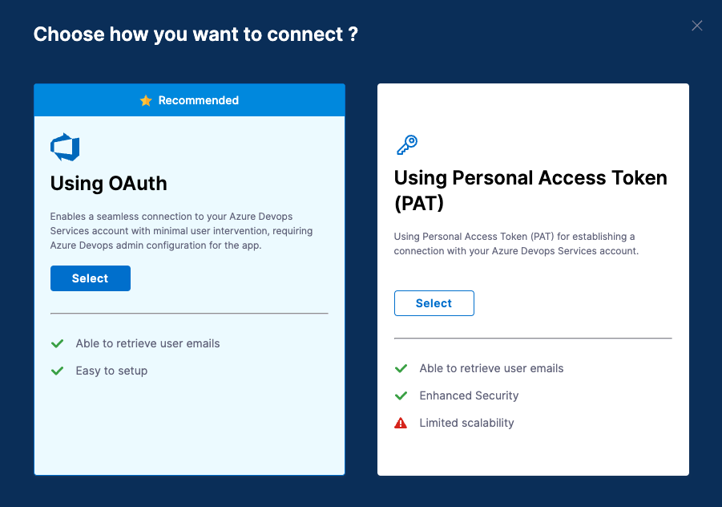
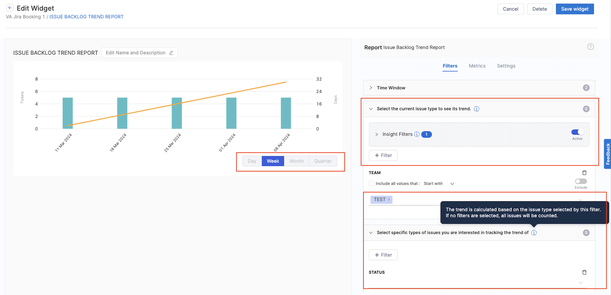

import Tabs from '@theme/Tabs';
import TabItem from '@theme/TabItem';

<DocsButton icon = "fa-solid fa-square-rss" text="Subscribe via RSS" link="https://developer.harness.io/release-notes/software-engineering-insights/rss.xml" />

These release notes describe recent changes to Harness Software Engineering Insights.

:::info About Harness Release Notes

* **Progressive deployment:** Harness deploys changes to Harness SaaS clusters on a progressive basis. This means that the features described in these release notes may not be immediately available in your cluster. To identify the cluster that hosts your account, go to your **Account Overview** page in Harness. In the new UI, go to **Account Settings**, **Account Details**, **General**, **Account Details**, and then **Platform Service Versions**.
* **Security advisories:** Harness publishes security advisories for every release. Go to the [Harness Trust Center](https://trust.harness.io/?itemUid=c41ff7d5-98e7-4d79-9594-fd8ef93a2838&source=documents_card) to request access to the security advisories.
* **More release notes:** Go to [Harness Release Notes](/release-notes) to explore all Harness release notes, including module, delegate, Self-Managed Enterprise Edition, and FirstGen release notes.

:::

## October 2024

### Version 202410.1

<!-- October 16, 2024 -->

#### Early access features

This release does not include any early access features.

#### New features and enhancements

* The **BitBucket integration** now supports reauthentication, enabling you to reconnect to the BitBucket application if OAuth fails or the access token expires. (SEI-7957)
* The calculation method for measuring the time spent on a status in the **Issue Time Across Stages report** and **Lead Time by Time Spent in Stages report** has been improved. Now, the report accurately tracks the duration by calculating the time between when a ticket first enters a specific status and when it exits that status. This ensures a more accurate measurement of how long an issue or work item remains in each stage. (SEI-8667) (SEI-8803)
* The **Jenkins integration** is now upgraded to the new integration framework. This improves the overall user experience for configuring the Jenkins integration. (SEI-8750)
* Fixed a bug in the Jira integration configuration where selecting the timezone field resulted in multiple values being selected. (SEI-8748)

#### Fixed issues

* Fixed the bug where when selecting the timezone field in the **Jira integration** configuration multiple values were getting selected. (SEI-8748)

## September 2024

### Version 202409.2

<!-- October 01, 2024 -->

In this release we have added adoption and scalability features like improvements to the SEI integrations framework to enhance the self-service onboarding.&#x20;

<DocVideo src="https://www.youtube.com/embed/_CC1yiTDE7U?si=lR0PRFQx4SRmmQev" />

#### Early access features

This release does not include any early access features.

#### New features and enhancements

* Added support for the `allow_unsafe_ssl` metadata flag in the satellite configuration for the [SonarQube integration](/docs/software-engineering-insights/sei-integrations/automated-integrations/sei-integration-sonarqube), allowing users to bypass SSL verification for custom certificates authorized by the SonarQube server. (SEI-8309)

* We have improved the user experience for configuring the [CircleCI integration](/docs/software-engineering-insights/sei-integrations/automated-integrations/sei-integration-circleci) and [DroneCI integration](/docs/software-engineering-insights/sei-integrations/automated-integrations/sei-integration-droneci) focused on simplifying and streamlining the user journey. This includes support for authentication across both **Cloud** and **On-prem setups**, as well as reauthentication for expired access tokens. (SEI-8515)

* Added support to display the collection name and selected Insight time range in PDFs exported from an Insight (SEI-8646)

#### Fixed issues

* Resolved a bug where PRs from the [Harness Code repository](/docs/software-engineering-insights/sei-integrations/automated-integrations/sei-integration-harness-code) were not getting displayed in the **Trellis contributor profile**. (SEI-8038)

* Fixed the issue causing the application window to freeze when configuring stages in the [Workflow profile](/docs/software-engineering-insights/sei-profiles/workflow-profile) settings. (SEI-8347)

* Fixed the issue where widget configuration wasn’t updating to the **Default Business Alignment profile** when a previously selected BA profile was deleted. (SEI-8539)

### Version 202409.1

<!-- September 17, 2024 -->

This release introduces several exciting updates, including the General Availability of Business Alignment on the Harness platform and enhancements across various integrations. We've also made key improvements to navigation and onboarding experiences within the SEI module, ensuring a more streamlined user journey. Additionally, important deprecations have been announced as part of our platform evolution.

Check out the release notes below for complete details and refer to the documentation for more information.

#### Generally Available

We're excited to announce that Business Alignment is now Generally Available on the Harness platform. For more information, please refer to our documentation on:

* [Business Alignment Profile](/docs/software-engineering-insights/sei-profiles/business-alignment-profile)
* [Business Alignment Report](/docs/software-engineering-insights/sei-metrics-and-reports/planning/sei-business-alignment-reports)

#### Deprecation Notice

As part of our platform evolution, the following resources are being deprecated on Harness SEI:

* Investment profile
* Effort Investment by Engineer report
* Effort Investment Single Stat report
* Effort Investment Trend report
* Effort Alignment report

**Important Note**

We have deprecated the support for **Investment Profile categories** in the **Trellis Profile configuration**. For questions or assistance with these change, please contact [Harness Support](mailto:support@harness.io).

#### Early access features

* We have improved the navigation experience in the Harness SEI module to simplify your workflow and help you manage resources more effectively. (SEI-7679)     Key enhancements include:
  * Focused views per project
  * Easier navigation between **Account** and **Project** level scopes
  * Comprehensive **All projects** view in the account scope. 
  * This feature is currently in BETA and requires the SEI_SIMPLIFIED_NAV feature flag. Please contact [Harness Support](mailto:support@harness.io) to enable this feature.

* We have enhanced the user experience for configuring the **GitHub Actions integration** across both **Cloud** and **On-prem setups**. This update includes **reauthentication** functionality for scenarios where the access token has expired. This feature is currently in BETA and requires the SEI_GITHUB_ACTIONS_NEW_ONBOARDING_FLOW_ENABLED feature flag. Please contact [Harness Support](mailto:support@harness.io) to enable this feature. (SEI-7671)

#### New features and enhancements

* Improved the correlation between **versions** and **issues** in the **Jira platform**. Now, renaming a version maintains the linkage between the version and its associated issues. (SEI-7986)

* Added support for configuring filters using the **Found in Build** and **Integration Build** custom fields in **Azure Boards**. (SEI-7992) (ZD-68580)

* We have improved the onboarding experience in the SEI module by introducing automated help documentation panels in the UI. This improves explainability and supports self-service onboarding within the product. (SEI-8134)

* We have improved the user experience for configuring the **Harness Code integration** and **Harness NG integration** focused on simplifying and streamlining the user journey. This includes support for authentication across both **Cloud** and **On-prem setups**, as well as reauthentication for expired access tokens. (SEI-7671)

* Added support for mapping custom fields of the types `decimal`, `integer`, and `float` to **story points** in **Azure Boards**. (SEI-8415) (ZD-68500)

#### Fixed issues

* Resolved a bug in the **Sprints Metric Trend report** where tickets completed on the last day of the sprint were incorrectly categorized as being outside the sprint. (SEI-7794)

* Fixed an issue that caused data for some sprints to be missing from Sprint Metric reports. (SEI-8065) (ZD-68918)

* Fixed the bug that resulted in missing pipeline data for the **HarnessNG integration**. (SEI-8221)

* Fixed an issue where the Insight export option was not functioning properly. (SEI-8225)

* Resolved an issue in the workflow settings where the **Custom CI/CD integration** was incorrectly labeled as **Jenkins integration**. Now in the workflow profile settings, the **Jenkins CI** label has been renamed to **Custom CI/CD** and the info icon next to the integration option clarifies that Jenkins is part of the **Other CI/CD tools category**. (SEI-8273) (ZD-69428)

* Fixed a bug where integrations configured using the **Ingestion Satellite** were failing. (SEI-8305) (ZD-69585) (ZD-69491)

### Version 202408.2.2

<!-- September 05, 2024 -->

#### Hotfixes

* Added support for configuring stage parameters as filters in **DORA workflow profile** settings for **Deployment Frequency** and **Change Failure Rate** metrics when using the **Harness NG integration**. (SEI-7791)

* Fixed the bug in the **HarnessNG integration** where historical data for the pipeline executions were missing from the platform. (SEI-8221)

### Version 202408.2.1

<!-- September 02, 2024 -->

#### Hotfixes

* We have improved the calculation for the sprint metrics across all SEI reports. Sprints with no planned, delivered, or spillover Jira tickets will no longer contribute to the overall sprint metric calculations. (SEI-7186) (ZD-65265)

* Fixed the bug where reauthenticating an existing **GitHub Cloud App** integration would incorrectly create a new integration. (SEI-8224)

## August 2024

### Version 202408.2

<!-- August 30, 2024 -->

This release brings several new features and enhancements, including the ability to map custom fields to story points in Azure DevOps, an improved user experience for configuring GitLab integrations, and a better user experience for the management of Contributor records.

#### Early access features

* We have improved the user experience for configuring the **GitLab integration** focused on simplifying and streamlining the user journey. This includes support for authentication using **Personal Access Tokens (PAT)** and **OAuth** for **GitLab Cloud**, and **PAT-based authentication** for **GitLab On-Prem** setups. This feature is currently in **BETA** and requires the `SEI_GITLAB_NEW_ONBOARDING_FLOW_ENABLED` feature flag. Please contact [Harness Support](mailto:support@harness.io) to enable this feature. (SEI-7671)

#### New features and enhancements

* Added support for mapping custom fields to story points within the **Azure DevOps integration** configuration. This allows you to measure metrics using story points based on the specific custom fields. (SEI-7651)

* Improved the user experience for managing **Contributor** records. The system now automatically switches to the latest version upon uploading new Contributor data. (SEI-8073)

#### Fixed issues

* Resolved an issue where the search functionality was not working in the **Trellis profile configuration** for development stages. (SEI-6569)

* Fixed a bug that caused the application window to freeze when uploading contributor data in an incorrect CSV format. (SEI-7681)

* Fixed a bug on the **SCM PR details page** where incorrect information was displayed for the user who merged the PR. (SEI-7745)

* Fixed an issue where the option to clone a workflow profile was not functioning correctly. (SEI-7850)

### Version 202408.1.1

<!-- August 22, 2024 -->

#### Hotfixes

* The **Harness SEI Jenkins plugin** now support **Jenkins Configuration as Code (JCasC)**. This allows administrators to define the plugin’s configurations as YAML in code and use CI/CD processes to deploy the configuration. (SEI-7028)

* The **Bitbucket Cloud** integration now supports multiple **Personal Access Token (PAT) based authentication**. This will help you resolve rate limiting issues while fetching data from Bitbucket Cloud. (SEI-7696)

### Version 202408.1

<!-- August 14, 2024 -->

This release introduces enhanced SEI Diagnostics for monitoring SCM integration statuses, Custom fields support in the Business Alignment report, and many more. Watch the [release demo](https://youtu.be/Z\_RDkXFxvK4) to see the key changes in action.

<DocVideo src="https://www.youtube.com/embed/Z_RDkXFxvK4?si=1K_aFQvEoQJX7DYe" />

**New Docs:** [SEI Diagnostics](/docs/software-engineering-insights/sei-diagnostics), [SEI API Guide](/docs/software-engineering-insights/sei-technical-reference/sei-api-reference/sei-api-guide), [Subscriptions and Licenses](/docs/software-engineering-insights/get-started/sei-subscription-and-licensing)

#### Generally Available

The new experience for the [Azure Devops integration](/docs/software-engineering-insights/sei-integrations/automated-integrations/sei-integration-azure-devops) is now **Generally Available**! Find the step-by-step instructions for configuring the integration on the [Azure Devops integration topic](/docs/software-engineering-insights/sei-integrations/automated-integrations/sei-integration-azure-devops).

#### Early access features

* You can now add filters using custom fields from **Azure Devops** and **Jira** in the **Business Alignment report**. This feature is currently in **BETA** and requires the `SEI_NEW_BA_COMBINED_WIDGET` feature flag. Please contact [Harness Support](mailto:support@harness.io) to enable this feature. (SEI-7622)

* You can now use the **Configuration Item** field from **ServiceNow** as a filter across the application. This feature is currently in **BETA** and requires the `SEI_SERVICE_NOW` feature flag. Please contact [Harness Support](mailto:support@harness.io) to enable this feature. (SEI-7827)

#### New features and enhancements

* In the **SEI Diagnostics** added support for monitoring integration statuses across the **SCM integrations**. To learn more, go to [SEI Diagnostics](/docs/software-engineering-insights/sei-diagnostics). (SEI-7749)

* In the **SCM Rework report**, clicking on the commit message now redirects you to the corresponding **SCM commit**, making it easier to validate data across the SCM tool and SEI. (SEI-7840)

#### Fixed issues

* Fixed the bug for the **Harness SEI Jenkins Plugin** that caused the integration to return errors due to the **BlueOcean** dependency. (SEI-7025)

* Resolved the issue that caused a few of the single stat reports to display no values. (SEI-7772)

### Version 202407.2.2

<!-- August 09, 2024 -->

#### Hotfixes

* Added support for configuring the **Bitbucket Cloud** integration using multiple usernames and passwords. (SEI-7491)

* Resolved the issue where PR links in the drilldown view for SCM reports were redirecting incorrectly. (SEI-7804)

* You can now use the **Configuration Item** field from **ServiceNow** as a filter across the application. (SEI-782

### Version 202407.2.1

<!-- August 09, 2024 -->

#### Hotfixes

* Added support for using both the Contains filter and the Exclude toggle option together in Sprint reports. (SEI-6349)

* Resolved the issue where the quick link was broken for **Azure Board** tickets in the drill down. (SEI-7490)

* Fixed the bug that caused the sorting functionality in the drill-down view to not work properly for the **Lead Time** column. (SEI-7490)

## July 2024

### Version 202407.2

<!-- July 25, 2024 -->

This release includes several new enhancements such as the improved SEI Diagnostics for faster Jira and SEI data validation, a simplified contributor data management experience, and various other enhancements. Watch the [release demo](https://youtu.be/F1E-Kfp\_nok) to see the key changes in action.

<DocVideo src="https://www.youtube.com/embed/F1E-Kfp_nok?si=FwXusmx1IEWT8KL4" />

 

#### Early access features

* We now support using **GitHub Topics** as filters in **Collection** definitions for the **GitHub integration**. This filtering option is only available at the Collection level. This feature is currently in BETA and requires the `SEI_ENABLE_TOPICS_SUPPORT_FOR_GITHUB` feature flag. Please contact [Harness Support](mailto:support@harness.io) to enable this feature (SEI-6863) (ZD-61715)

* In the **Business Alignment report**, users can now switch between profiles configured with different Issue Management Systems directly in the report settings. This feature is currently in `BETA` and requires the `SEI_NEW_BA_COMBINED_WIDGET` feature flag. Please contact [Harness Support](mailto:support@harness.io) to enable this feature. (SEI-7501)

#### New features and enhancements

* We've significantly improved the user experience for uploading and updating contributor data. (SEI-7414) (SEI-7365) (ZD-66033)
  * Added a confirmation step before starting the upload.
  * Added a progress bar to track the upload status.
  * Other contributor actions will now be temporarily disabled during the update to prevent conflicts.
  * The contributor data will now switch to the newer version automatically if all users are uploaded successfully.

* **Activity Logs** can now track **Collection** activities in detail. This allows users to view records of when Collections are created or modified. (SEI-4238)

* The ability to add **Additional Done Statuses** is now available in the report settings for all sprint metric reports when using **Azure DevOps integration**. (SEI-7489)

* We've significantly improved the **Integration Status** page in **SEI Diagnostics** with the following updates. (SEI-7364)
  * Added more granular filtering options and sorting capabilities for the integrations list.
  * Implemented a search feature to quickly find specific integration information.
  * Improved the view for the **Jira integration** to provide more detailed insights on **Jira tickets** across **sprints** and **projects**.
  * The **Run Spot Check** feature now allows you to search for specific Jira ticket keys and retrieve detailed information for cross-platform validation.&#x20;

:::info
Note that the Integration Status page update is currently available only for the Jira integration.
:::

#### Fixed issues

* Fixed the bug in the `satellite.yml` file for the **GitLab integration**. Now the access token is added correctly instead of the string `apikey`. (SEI-6518)

* Jira ticket links now work correctly in SEI report drilldowns when using the Jira Connect App. (SEI-7414)

* Fixed a bug that was displaying `null` for **GitHub** users in all **SCM reports**. (SEI-7248)

* Resolved an issue where some **Azure pipeline stages** were not being ingested into the system (SEI-7361) (ZD-65982)

* Fixed the issue that caused inconsistency across the data displayed in the **Trellis Score report** and the **Trellis Scorecard**. (SEI-7592)

### Version 202407.1

<!-- July 15, 2024 -->

Welcome to the first release of July 2024, and in this release we bring you features like the ability to select your Issue Management system while configuring a new Business alignment profile, improved RBAC capabilities, UI support for deleting integrations, and more. Watch the [release demo](https://youtu.be/RaXZhASFCu4) to see the key changes in action.

<DocVideo src="https://www.youtube.com/embed/RaXZhASFCu4?si=lXEAzg5x32f1OlWp" />

 

We have added new and improved API documentation for the SEI services now available at [apidocs.harness.io](http://apidocs.harness.io/) - Check it out here.

* [Collection categories](https://apidocs.harness.io/tag/Collection-categories/)
* [Collections](https://apidocs.harness.io/tag/Collections)
* [Contributors](https://apidocs.harness.io/tag/Contributors)
* [DORA](https://apidocs.harness.io/tag/DORA)

Over the coming weeks, we will be moving away from the current static API documentation and referring to the new site ([apidocs.harness.io](https://apidocs.harness.io)). As always let us know any feedback you might have.

* **Blogs:** [Announcing the ServiceNow integration for Harness SEI](https://www.harness.io/blog/announcing-the-servicenow-integration-for-harness-sei), [Engineering Metrics That Matter to Your Bottom Line](https://www.harness.io/blog/engineering-metrics-that-matter-to-your-bottom-line)
* **New Docs:** [Delete an integration](/docs/software-engineering-insights/sei-integrations/sei-integrations-overview#delete-an-integration), [Configure a DORA profile using the ServiceNow integration](/docs/software-engineering-insights/early-access/metrics-reports/mttr-incident-recovery#define-the-dora-profile-for-measuring-incident-recovery-time), [SEI API Reference Overview](/docs/software-engineering-insights/sei-technical-reference/sei-api-reference/sei-api-guide)

#### Early access features

* Users can now select **Jira** or **Azure DevOp**s as the issue management platform when configuring a **Business Alignment profile**. The custom fields for configuring filters will dynamically change based on the selected platform. This feature is currently in BETA and requires the `SEI_NEW_BA_COMBINED_WIDGET` feature flag. Please contact [Harness Support](mailto:support@harness.io) to enable this feature.(SEI-7234)

* We have now added support for configuring filters using custom fields that are specific to change requests or incidents in the collection definition and profile settings for the **ServiceNow integration**. When configuring the filters, the custom fields available will dynamically change based on the selected ticket type. This feature is currently in BETA and requires the `SEI_SERVICE_NOW` feature flag. Please contact [Harness Support](mailto:support@harness.io) to enable this feature.(SEI-7301)

* The **ServiceNow integration** is now available for **on-prem accounts**. You can use the ingestion satellite to configure the integration. Find the step-by-step instructions on the [ServiceNow integration document](/docs/software-engineering-insights/early-access/integrations/sei-integration-servicenow#servicenow-on-prem).

* A new instruction page has been added, with a step-by-step guide on setting up Azure DevOps integration using OAuth in the updated integration flow for Azure DevOps. This feature is currently in BETA and requires the `SEI_IS_AZURE_NEW_ONB_ENABLED` feature flag. Contact [Harness Support](mailto:support@harness.io) to enable it. (SEI-7471)

#### New features and enhancements

* Added support for deleting existing configured integrations from the UI. For more information, see [Delete an integration](/docs/software-engineering-insights/sei-integrations/sei-integrations-overview#delete-an-integration). (SEI-6257)

* The label **Number of Tickets** has been updated to **Number of Applicable Tickets** in the **Issue Resolution Time report**. Note that tickets with zero resolution time are not included in this report. (SEI-6642)

* In the **SCM PRs report** the label that sets the criteria for measuring comment density is now called **PR Comment Density** in the report settings. (SEI-7317)

* The new PR details page is now available for all the SCM PR related reports. (SEI-7340)

* The PR details page now has a new column **Pipeline Name** that displays the associated CI/CD pipeline or workflow name if any. (SEI-7449)

#### Fixed issues

* Fixed the bug that caused committers data to be displayed in the reviewers column in some cases in the drill down. (SEI-6785)

## June 2024

### Version 202406.2

<!-- June 27, 2024 -->

In our continued effort to improve the user experience, this release introduces new features that simplify self-service onboarding and improve overall adoption rates. Watch the [release demo](https://www.youtube.com/embed/KMufOcfrNeQ?si=0wfq15tEWdguJjHC) to see the key changes in action.

<DocVideo src="https://www.youtube.com/embed/KMufOcfrNeQ?si=0wfq15tEWdguJjHC" />

* **New Docs and Tutorials:** New Interactive Guides now complement our Step-by-step instructions in the documentation. These guides let you follow the user journey directly in the product while referencing the documentation. Try this out here: [SEI ServiceNow integration](/docs/software-engineering-insights/early-access/integrations/sei-integration-servicenow#create-a-client-id-and-client-secret-in-servicenow).

#### Early access features

* We've introduced a new onboarding experience for the **Azure DevOps integration**, with **Personal Access Token (PAT)** authentication alongside the existing OAuth-based method. For step-by-step setup instructions, please refer to the [SEI Azure DevOps integration guide](/docs/software-engineering-insights/sei-integrations/automated-integrations/sei-integration-azure-devops). This feature is currently in BETA and requires the `<SEI_IS_AZURE_NEW_ONB_ENABLED>` Feature Flag. Contact [Harness Support](mailto:support@harness.io) to enable it. (SEI-6221) (ZD-62211)

* Added support for configuring filters using **ServiceNow** fields in the reports and the collection definition. To learn more, go to [ServiceNow integration](/docs/software-engineering-insights/early-access/integrations/sei-integration-servicenow). This integration is in BETA and requires the `<SEI_SERVICE_NOW>` entitlement. Contact [Harness Support](mailto:support@harness.io) to enable it. (SEI-7169)

#### New features and enhancements

* We have added a new **PR details view** as part of **SCM Diagnostics**. This helps you view a granular level breakdown of the PR activity including event history, commits, cycle time breakdown, code changes, CI pipelines, and PR information such as source branch and author. You can access this feature in the **SCM PR Lead Time by Stage report**, **SCM PR Lead Time by Trend report**, and the **Issues report (via the issue details page)**. (SEI-6734)

* In the **Individual Raw Stats report** the column name for `PRs` has been renamed to `PRs Merged` for better clarity of the metric value displayed. (SEI-7177)

#### Fixed issues

* Fixed an issue where **Sprint Metric Single Stat** reports failed to update data when switching between **Collections**. (SEI-7250)

* Resolved an issue in the **Business Alignment** report where the **Pie Chart** displayed data outside the selected time period. (SEI-7233)

### Version 202406.1

<!-- June 14, 2024 -->

<DocVideo src="https://www.youtube.com/embed/n0o7hRpmf-k?si=iMilox7t5d3GhfgU" />

#### New features and enhancements

* The column names in the **Raw Stats** **report** is now updated to include `(avg)` for improved clarity regarding the displayed metric as the report shows the average values for different metrics that make up the Trellis Scores for each collection. (SEI-2665)

* The calculation for the **Median Lead Time metric** has been updated. Rather than calculating the median using averaged lead times, it now takes into account the total lead time for each individual ticket and then calculates the median value across all tickets. (SEI-6883)

* In the Lead Time widgets, the stages that are configured to be excluded in the widget will no longer impact the overall **Lead Time** metric calculation. (SEI-6923)

* The **SEI Diagnostics** tab now provides support for monitoring and configuring alerts for **SCM activity** related to the **SEI GitHub integration**. (SEI-7044)

#### Early access features

* Added support to calculate alignment metrics for tickets in the **In Progress** status category and those that have been resolved (i.e., **Done** status category) within a specific duration of time. This allows you to measure the actual effort invested for the selected period. The new **Status** column in the drill down now shows the current status of each issue. To learn more, go to [Business Alignment report use cases](/docs/software-engineering-insights/sei-metrics-and-reports/planning/sei-business-alignment-reports). (SEI-6833)  This feature is currently in **BETA** is accessible behind the Feature Flag `<SEI_NEW_BA_COMBINED_WIDGET>` and `<SEI_BA_INCLUDE_UNRESOLVED_ISSUES>`. Please contact [Harness Support](mailto:support@harness.io) to enable this feature.

* Added support for **OAuth-based** authentication for the **ServiceNow integration**. To learn more, go to [ServiceNow integration](/docs/software-engineering-insights/early-access/integrations/sei-integration-servicenow). This feature is currently in **BETA** is accessible behind the Feature Flag `<SEI_SERVICE_NOW>`. Please contact [Harness Support](mailto:support@harness.io) to enable this feature. (SEI-6847)

* The **DORA Mean Time to Restore** report can now be used to measure the incident recovery time of incidents from the **ServiceNow platform**.  This feature is currently in **BETA** is accessible behind the Feature Flag `<SEI_SERVICE_NOW>`. Please contact [Harness Support](mailto:support@harness.io) to enable this feature. (SEI-6849)

#### Fixed issues

* Fixed the bug in the **SCM Review Collaboration report** that caused the Committer to be displayed also as the PR reviewer. (SEI-6785)

* Resolved the issue that was causing the `Starts with` and `Contains` filters to not function as expected for SCM repositories in the **Collection** definintion. (SEI-6977)

* Resolved the bug that was causing the CSV download of drilldown to omit the ticket summary and ticket count value for the **Business Alignment report**. (SEI-6985)

* The issue that caused instances to not be listed properly for the **Jenkins integration** has been resolved. The integration page now displays a maximum of 300 Jenkins instances. (SEI-7099)

## May 2024

### Version 202405.2

<!-- May 24, 2024 -->

<DocVideo src="https://www.youtube.com/embed/re7ZcOkXHD4?si=ZGnnl-PQcqF6Hojv" />

#### New features and enhancements

* We have added improvements to the **Collection** definition settings. (SEI-5363)
  * When adding an integration filter for **GitHub**, **Bitbucket**, and **Gitlab** you can now use the `"Equals"` or `"Does not equal"` operators in the filter to fetch all repositories for which data is ingested in the integration, regardless of activity in the repository.
  * When using `"Starts with"` or `"Contains"` the filter will apply to all repositories ingested according to the integration configuration.

* Added support for color customization in the **Line Graph** visualizations for **Custom Table Report** widgets. (SEI-6677)

#### Early access features

* Added improvements to the **Drilldown** view in the **Business Alignment report.**
  * In the report drilldown, the selected **BA** **Category** is now highlighted, and the ticket count will be displayed only for the selected category. (SEI-6818)
  * Added support to display the list of all assignees for a given ticket under the `Assignee` column in the **Drilldown by Tickets** view.(SEI-6859)   This feature is currently in `BETA` is accessible behind the entitlement `<SEI_NEW_BA_COMBINED_WIDGET>`. Please contact [Harness Support](mailto:support@harness.io) to enable this feature.

* The **DORA Lead Time for Change** widget now loads faster than ever before. We have optimized the lead time calculation, significantly reducing the time required to process this metric. This feature is behind the Feature Flag `<VELOCITY_OPTIMIZE_JOINS_FOR_TENANTS>`. Contact [Harness Support](mailto:support@harness.io) for more information. (SEI-6830)

* The **DORA Lead Time for Changes** is now more accurately calculated for the **Median** calculation. The overall median is now computed as the median of the total lead time for individual tickets. This feature is behind the Feature Flag `<AGGREGATE_TOTAL_LEAD_TIME_TENANTS>`. Contact [Harness Support](mailto:support@harness.io) for more information. (SEI-6845)

#### Fixed issues

* Resolved an issue where the number of tickets worked on by the assignee was incorrect in the **Drilldown by Contributors** view of the **Business Alignment report** when configured with **Effort Attribution** as the **Current Assignee**. (SEI-6723)

* Fixed an issue where clicking `View Tickets` in the **Drilldown by Contributors** view of the **Business Alignment report** did not display any data. (SEI-6853)

* Fixed the bug where the **Add Integration** button was not working in the **Collection** **Definition** settings. (SEI-6926)

* Resolved the issue that caused duplicate records to appear on the Diagnostic page when multiple integrations were configured for the same tool. (SEI-6910)

* Fixed an issue where configuring the integration filter with both **Azure DevOps** and any another **SCM** tool in the **Collection** Definition settings caused SCM reports to display incorrect or missing data. (SEI-6722)

* In the **Drilldown by Contributors** view, clicking the `View Tickets` option under the **Number of Tickets Worked On** column will now open a new view with tickets filtered by the selected assignee. (SEI-6720)

* Resolved an issue where the extended view for the **Issue Progress report** displayed inaccurate data. (SEI-6870)

### Version 202405.1

<!-- May 13, 2024 -->

<DocVideo src="https://www.youtube.com/embed/Q252RnmT7cA?si=BXrqizJnXE7krb78" />

#### New features and enhancements

* The hygiene labels in the **Issue Hygiene report** have been relocated to the top left corner of the Circle Chart (formerly at the top right corner)(SEI-4646)

* Added support for the `Delivered Tickets STDEV` metric to calculate the standard deviation based on delivered tickets in a Sprint, representing the variability in a team's productivity over multiple sprints. (SEI-5303)

* The pipeline link in the drill-down for any **Custom CICD integration** will now redirect you to the actual URL of the corresponding pipeline execution for DORA Deployment Frequency, Change Failure Rate, and other CI/CD reports. (SEI-5614)

* Added support for three new columns in the **Issue Hygiene report** drill-down for the **Azure DevOps** integration. (SEI-6120)
  * **Current Sprint:** This column in the drill down will show the current sprint to which the ticket is assigned.
  * **Previous Sprints:** This column will display the names of all previous sprints to which the ticket was assigned.
  * **Sprint Hops:** This column will indicate how many times the ticket has been moved across sprints.

* Added support for drill down in the **Multi-Time Series report**. Please note that you can add up to a maximum of 5 line charts.(SEI-6314)

* Add support for a new `Exclude time from Status Category` filter in **Issue Resolution Time Report**. (SEI-6479)

* The **Sprints Metric** widgets now includes the capability to choose the calculation unit as either **Story Points** or **Tickets**. The available metrics during widget configuration will vary based on the selected calculation unit (SEI-6672).

* In the **Issue Lead Time by Stage report**, when the **Include the associated Pull Requests and Commits** option is selected, the widget will only consider the tickets that have had their PRs merged and are associated with a commit. (SEI-6685)

* Improved the logic for calculating the **Hygiene Score** in the **Issue Hygiene** report. The final hygiene score now is calculated as the sum of the scores for each ticket category (like no assignee, idle), where each score depends on the percentage of tickets in that category. (SEI-6688)

* The **Ticket Details** page now includes support for displaying details related to the associated Pull Requests and Commits. (SEI-6715)

* Added support for configuring the fully qualified projects as the filter when setting up the Bitbucket integration. (SEI-6735)

#### Early access features

* Added support for configuring new sprint metrics in the **Sprint Metrics Percentage Trend** report for the **Azure DevOps integration**. This feature is currently in **BETA** and is behind the **Entitlement** `<SHOW_ALL_METRICS>`. Contact [Harness Support](mailto:support@harness.io) to enable this feature. (SEI-6482) The list of all the new **Sprint Metrics** is provided below.

List of Supported New Sprint Metrics

**Metrics allowed for both Story Point and Ticket views:**

1. `Delivered to Commit Ratio STDEV`
2. `Commit Done Ratio STDEV`
3. `Creep to Commit Ratio STDEV`

**Metrics allowed only for Story Point view:**

1. `Velocity Points`
2. `Velocity Points STDEV`
3. `Creep Point`
4. `Creep Done Points`
5. `Creep Missed Points`
6. `Commit Points`
7. `Commit Done Points`
8. `Commit Missed Points`
9. `Missed Points`

**Metrics allowed only for Ticket view:**

1. `Creep Tickets`
2. `Creep Done Tickets`
3. `Creep Missed Tickets`
4. `Commit Tickets`
5. `Commit Done Tickets`
6. `Commit Missed Tickets`
7. `Done Tickets`
8. `Missed Tickets`

* In the **DORA MTTR report** drill-down, clicking on the `Incident ID` will now redirect you to the actual URL of the corresponding PagerDuty incidents page. (SEI-6603)

* Added support for automatically sending alerts via **Slack** notifications and **Email** when the **Ingestion Satellite** status is `UNHEALTHY`. (SEI-6610)

* The release includes a new integration for the **ServiceNow Platform**.  **ServiceNow** is used to set up systems that define, manage, automate and structure IT services for companies.   You can use the **SEI ServiceNow integration** to integrate SEI with **ServiceNow Cloud** and **ServiceNow On-Prem** accounts. To learn more, go to [ServiceNow integration](/docs/software-engineering-insights/early-access/integrations/sei-integration-servicenow)  This feature is currently in `BETA` is accessible behind the Feature Flag `<SEI_SERVICE_NOW>`. Please contact [Harness Support](mailto:support@harness.io) to enable this feature.

#### Fixed issues

* The issue causing inaccurate data to be displayed in the widgets for the resolved issues from **Jira** has been fixed. (SEI-6630)

* The bug causing the tooltip data to be uncovered within the widget has been resolved. (SEI-6660)

* The issue causing the **Jira Releases report** to not display any data has been resolved. (SEI-6692)

## April 2024

### Version 202404.1

#### New features and enhancements

* Added support configuring the **Jira** and **GitHub** integration to ingest data from **Jira Data Center** and **Github Enterprise** without using the **Ingestion Satellite**. To learn more, Contact [Harness Support](mailto:support@harness.io). (SEI-5361)
* Added performance enhancements to the DORA profile configuration for setting up filters of integrations with large volumes of data. (SEI-6220) (ZD-59940)
* The **Jira integration** now supports displaying **Story Points** as decimal values, rounded up to two decimal places across all reports and drill-downs. (SEI-6244)
* The label size in the X-axis of the bar chart has been set to 11 characters across all widgets. (SEI-6346)
* The **Include only associated PR’s** option under the widget settings in the Issue Lead Time by Stage report has been renamed to **Include the associated Pull Requests and Commits**. (SEI-6372)
* Added support for configuring the **Themes filter** for **PagerDuty**, **CI/CD**, and all **SCM integrations**. This filter can now be configured in the **Collection Definition** as a checkbox tree, with search functionality. When you add a **Themes filter** for the selected integration in the **Collection Definition**, the relevant widgets will only display data for the selected themes. (SEI-6056) (SEI-6054)

#### Early access features

* Added support for a new filter **Include CFR status** for all **CICD integrations** under the **Deployment Frequency** and **Change Failure Rate** settings of the DORA profile. (SEI-6442)   You can now configure the DORA profile to establish a theme-based correlation between Pull Requests and Deployments. This feature is currently in **BETA** and is behind the Feature Flag `<SEI_THEME_BASED_DORA>`. Contact [Harness Support](mailto:support@harness.io) to enable this feature.
* The terminology for the **GitHub Enterprise** integration type has been renamed to **GitHub Enterprise Server**. The new experience for the GitHub and Jira integration is currently in BETA and is behind the Feature Flag `<SEI_EASY_ONBOARDING_GITHUB>` and `<SEI_EASY_ONBOARDING_GITHUB>`. Please contact [Harness Support](mailto:support@harness.io) to enable this feature. (SEI-6139)
* Added the following improvements to the **Issue Backlog Trend report.** (SEI-6369)
  * You can now configure the report to display historical data for the current issues, allowing you to analyze trends over time.
  * Now you can define the settings for the current issue type using the existing filters and set preferences for tracking trends related to specific issue types using historical data filters i.e. **Status** & **Category**
  * A new time interval option **Daily** has been added into the widget settings. Now you can choose between the **Day**, **Week**, **Month** and **Quarter** time intervals directly within the widget.   To learn more, go to [Issue Backlog Trend Report](/docs/software-engineering-insights/early-access/metrics-reports/issue-backlog-trend-report). This feature is currently in **BETA** and is behind the Feature Flag `<SEI_SHOW_HISTORICAL_FILTERS>`. Contact [Harness Support](mailto:support@harness.io) to enable this feature.

  

#### Fixed issues

* Fixed the bug that was causing the **PAGE NOT FOUND** error on the expanded view of widgets drill down page. (SEI-5926)
* The issue causing the new **Business Alignment report** drill down to crash for Azure DevOps integration has been resolved. (SEI-6409) (SEI-6455)
* The issue with the Drilldown displaying all deployments for the **Github Actions** integration due to **Collection filters** not working has been resolved. (SEI-6423) (ZD-60997)

## March 2024

### Version 202403.2.1

<!-- Mar 30, 2024 -->

#### Hotfix

* Added support for a new column **Time Spent In Stage** in the **Issue Time Across Stages report** drill-down. This field now displays the specific amount of time spent in each stage as selected in the Bar Chart widget. (SEI-6202)

### Version 202403.2

<!-- Mar 29, 2024 -->

#### New features and enhancements

* Added support for displaying the decimal Story Points as the nearest integer value in all the reports and drill-down for the Jira integration. (SEI-5758)
* Added support for three new columns in the **Issue Hygiene report** drill-down. (SEI-5137) (SEI-6259)
  * **Current Sprint:** This column in the drill down will show the current sprint to which the ticket is assigned.
  * **Previous Sprints:** This column will display the names of all previous sprints to which the ticket was assigned.
  * **Sprint Hops:** This column will indicate how many times the ticket has been moved across sprints.
* Added support to allow users to share an Insight with other contributors and display data for the selected time interval under the Insight settings. (SEI-6173)
* The **Multi-Series Report**, when configured using the **Issues Report**, now includes support for the **Line Chart** as a visualization type. (SEI-6177)

* Added support for a new Propel node **List GitHub Team**s to retrieve the complete list of team names within a specific organization. (SEI-6047)
* The **Trend Line** in the **Issue Backlog Trend Report** is now set to be dynamic with the selected stacks and labels in the widget. (SEI-5843)

#### Deprecation notice

* The option to download the Triage data using the Download button has now been deprecated. You will be impacted by this if you have enabled Triage rules under your SEI project for the Jenkins integration. Contact [Harness Support](mailto:support@harness.io) for assistance.
* The option to configure the Github Actions integration using Webhook has been deprecated. (SEI-5739)

#### Early access features

* Improved the **Diagnostic Tab** with the following enhancements.
  * Support for displaying **Project & Sprint** details has been added to the **Integration Status** section.
  * Now, clicking on the associated Project name will open the Project details page, displaying all the Issues, Status, and their associated details.
  * Clicking on the associated Sprint name will now open the Sprint details page, displaying all the Issues included as part of the selected Sprint.
  * Selecting the issue key under the Sprints or Project tab will now automatically redirect you to the details page of the selected issue.     This new Diagnostics page feature is currently in **BETA** and is behind the Feature Flag `<SEI_SHOW_DIAGNOSTIC_TILE>`. Contact [Harness Support](mailto:support@harness.io) to enable this feature.
  
* Added support to measure the incident recovery time using the **DORA MTTR report** for the **PagerDuty integration**. PagerDuty is a cloud-based incident response platform that integrates with various monitoring tools to alert the appropriate teams when an issue occurs with their systems or services. To use this functionality, ensure that you configure the DORA profile to measure the MTTR metric using the PagerDuty integration.    Find the resource below to get started with using this feature.
  * [Configure the Pagerduty integration](/docs/software-engineering-insights/sei-integrations/other-integrations/sei-integration-pagerduty)
  * [Measure incident recovery time using the DORA Mean Time to Restore report.](/docs/software-engineering-insights/early-access/metrics-reports/mttr-incident-recovery)    
  
  This feature is currently in **BETA** and is accessible behind the Feature Flag `<SEI_MTTR_PAGERDUTY_ENABLED>`. Please contact [Harness Support](mailto:support@harness.io) to enable this feature.
  

<DocVideo src="https://www.youtube.com/embed/cKZF4SFxgIE?si=9U7SuECmWTVxxTqz" />

* The **SEI Rally integration** is now supported for the following widgets: **DORA Lead Time for Changes report** & **DORA MTTR report**. This feature is currently in **BETA** is accessible behind the Feature Flag `<RALLY>`. Please contact [Harness Support](mailto:support@harness.io) to enable this feature.

#### Fixed issues

* Improved the error messaging associated with the issue where users were unable to update the contributor data by uploading a CSV file due to incorrect headers in the CSV file. (SEI-5785)
* Fixed the bug on the **Issue Hops report** where the **Total Tickets** field was displayed as zero for the Rally integration. (SEI-6279)
* The issue that caused the hygiene filters from being applied to the **Issue Hygiene report** has been resolved.
* The **DORA Deployment Frequency** and **Change Failure Rate report** was not displaying data correctly when configured with certain **Filters** such as `components`, `labels`, `fix_versions`, `versions`, and `Starts with` and `Contains` **Filter Settings** under the **DORA profile** definition. This issue has been resolved. Note that if you have these Filters configured in your DORA settings, you will need to delete and re-configure the profile settings. (SEI-6164)

### Version 202403.1.1

#### Hotfix

* Sprint reports and drill-down reports inaccurately included certain issues resolved outside their designated sprint time. This has been fixed to accurately display relevant issues resolved within the sprint period by considering the **Issue Resolved In** field for each item. Tickets falling on the **Outside of Sprint** category are not included in the velocity calculation, as they represent work completed before the start of the sprint. (SEI-6170)
* Added support to retrieve and display up to 999 active versions for the **Contributor** list. (SEI-5908)
* The repository selection dropdown was not displaying data in the Collection definition for the Bitbucket integration. This issue has been fixed. (SEI-6245)

### Version 202403.1

#### New features and enhancements

* Added support for displaying the latest pipeline execution link for the **CICD Job Count Report**, **CICD Pipeline Jobs Duration Trend Report**, **CICD Job Duration Report**, **CICD Pipeline Jobs Count Trend Report**, **CICD Pipeline Jobs Duration Report**, **DORA Deployment Frequency & Change Failure Rate** reports.    
You can now view the latest pipeline execution link as a column in the drill-down view of the reports. By clicking on the link, you will be redirected to the corresponding **GitLab** pipeline execution tab. Please note that this feature is only available for reports generated using a [GitLab Cloud integration](/docs/software-engineering-insights/sei-integrations/automated-integrations/sei-integration-gitlab) and will be available for newer or updated pipelines. To receive older pipeline data, please contact [Harness Support](mailto:support@harness.io). (SEI-2683) (SEI-3546) (SEI-5825)
* In the **Activity Logs** tab we have added the support for adding `Type` as a **Filter**. This allows you to filter the activity logs using filters such as Action, Email, and more. (SEI-5157) (SEI-5343)
* Users on the SEI Harness Platform will now have an improved navigation experience, eliminating the need to select **Collection Category** and **Collections** to access **Insights**. 
  * Now, when users create a new **Project**, they will be directed to a landing page where they can choose to create a new **Insight**. 
  * After logging in, users will be automatically directed to the **first Collection** and **Insight**. 
  * For existing logged-in users, the application will maintain their latest state and navigate them to the recently viewed Collection and Insight, ensuring a seamless continuation of their workflow. (SEI-5203) (SEI-5690)
* Improved the user experience on the Insights tab by enabling users to redirect to the **Integration Configuration** page when they click on the **Integrations Monitoring** icon. Additionally, renamed the `Last updated at` field to `Last ingested at` in the **Integration Monitoring** tab. (SEI-5342)
* Added support for configuring the **Deployment Frequency** and **Change Failure Rate** using the `Issue Created` event in the DORA profile definition. This will enable users to define the settings when utilizing any **Issue Management** tool as a medium to calculate Deployment Frequency or Change Failure Rate. (SEI-5422) (SEI-5931) (SEI-5933)
* Activity Logs data can now be exported by clicking the Export button located in the Activity Logs tab of the SEI application. (SEI-5449)
* The default time range for all the Sprint Metric reports has been updated from 2 weeks to 30 days. (SEI-5787)
* Added the ability to display the `Custom Field Key ID` from **Azure Boards** while configuring the **Filters** on the **Report**, **Collection** and **Profile** settings. Now, when configuring custom field Filters, the Custom Field Key ID associated with the field is displayed for clarity. (SEI-5799) (SEI-5800) (SEI-5801)
* Added performance enhancements for the SCM metrics and reports. The following reports do not have the support for this enhancement: SCM PR Activity report, SCM PR Lead Time by Stage report, SCM PR Lead Time Trend report, Issue Hotspots report.
* The **Median** field in SEI all reports and metrics will now be calculated by determining the normal median using the 50th percentile. 
* The **Timezone**  field will now use **UTC (Universal Time Coordinated)** as the default timezone across the platform to maintain a standardized format for enhanced clarity and consistency.

#### Early access features

* A new **Diagnostics** page has been added to the application, which includes a system status section. Users can now access this page by selecting the Diagnostics tile in the Settings page. This new tab comprises of two sections: **Jobs status** and **Satellite status**, providing users with the most up-to-date health status information for both Jobs and Ingestion Satellite. (SEI-5818)    This new Diagnostics page feature is currently in `BETA` and is behind the Feature Flag `<SHOW_DIAGNOSTIC_TILE>`. Contact [Harness Support](mailto:support@harness.io) to enable this feature.

#### Fixed issues

* There was an issue which was causing the ingestion to fail for the **Jira** integration. This issue has been resolved now. (SEI-5213)
* In the **Activity Logs**, the `Email` data field is now case-insensitive. This means that records will show up when searched, regardless of the case used. (SEI-5872)
* Copying the widget to another Insights was not functioning properly, causing the application to freeze. This issue has now been fixed. (SEI-5879) (SEI ON HARNESS)
* The bug in the **Issue Hotspot Report**, which caused the drilldown to not display any value when the widget was configured with `Issue Type` as a **Filter**, has been resolved. (SEI-5906)
* The issue where **Jira's priority field** values were not appearing in the drill down when defined differently from P0, P1, etc., has been resolved to include various definitions of priority. (SEI-5949)
* The issue of making changes to the **Collection** definition and saving them not working as intended has been resolved. Now, when you save any new changes, an alert dialog will be displayed. Upon clicking on the save button, the changes will be saved successfully. (SEI-5983)
* In the **Collection** definition, when applying **Filters**, the expectation was for the **Azure Repos** and **Bitbucket** repository name to start with an uppercase letter. This issue has been fixed to ensure that the repository list no longer requires the first letter to be capitalized. This resolves the case sensitivity filter problem. (SEI-6018)
* The bug in the **Collection** definition that was causing a limitation on filtering repositories beyond the first 1000 has been resolved. This fix enables users to search for and select repositories from all available options when filtering the results. (SEI-6046)
* On SEI Harness Platform, the addition of notes on **Insights** was throwing an error. This has been resolved. (SEI-5880)

## February 2024

### Version 202402.2

#### New features and enhancements

* Added the ability to display the `Custom Field Key ID` from **Jira** while configuring the **Filters** on the **Report**, **Collection** and **Profile** settings. Now, when configuring custom field **Filters**, the `Custom Field Key ID` associated with the field is displayed for clarity. (SEI-5184) (SEI-5609)
* Added support to view files based on page size selection in the **Issue Hotspot** report and **Support Hotspot** report. (SEI-5546)
* In the **Sprint Reports**, support has been added to include all tickets that were initially committed at the beginning of the sprint irrespective of their final status in the sprint as part of the metric calculation. (SEI-5736)

#### Early access features
  
* Improved the ingestion logic to fetch information for the **Pull Request** related to the **Development Field** in the work item in **Azure Boards** for the **Azure DevOps** integration. Please note that this feature is currently in `BETA`. Contact [Harness Support](mailto:support@harness.io) to enable this feature. (SEI-2265) (SEI-5064) (SEI-5065)
* The release includes a new integration for the **Rally Software**.
  Rally is a web-based platform for managing and tracking the entire application development lifecycle, including project management, release planning, iteration planning, and defect tracking. (ECOE-3)    
  To learn more, go to [Rally integration](/docs/software-engineering-insights/early-access/integrations/sei-integration-rally).    
  This feature is currently in `BETA` is accessible behind the Feature Flag  `<RALLY>`. Please contact [Harness Support](mailto:support@harness.io) to enable this feature.

#### Fixed issues

* In the **Collection** definition, when applying **Filters**, the expectation was for the repository name to start with an uppercase letter. This issue has been fixed to ensure that the repository list no longer requires the first letter to be capitalized. This resolves the case sensitivity filter problem. (SEI-5804)

### Version 202402.1.1

#### Hotfix

* In the **Issues Report**, there was an existing bug where the `Worktype Exclude` filter was not allowing the addition of multiple values for a given custom field. This has been fixed and now the filter functions correctly. (SEI-5225)
* Renamed the label in the **Integration Monitoring** tab from `FAILED` to `WARNING` for ingestion jobs that have failed due to some reason in the past 7 days. (SEI-5415)
* There was an existing issue in the **Sprint Metric Single Stat** reports where clicking on `commit tickets` was causing the app to crash. This has been resolved now. (SEI-5372)
* Support has been added for displaying only items with an associated **Pull Request** in the **Issue Lead Time by Stage** report, **DORA Lead Time, and Mean Time** reports for the Jira integration. The **Ticket Details** page now displays a table of **Associated PRs**. This feature is currently supported only for Jira. (SEI-5604)(SEI-5667)
* Added the capability to ingest all types of pipeline data, including pipelines with the status `WAITING`, from **Azure Pipelines** for the **Azure DevOps** integration. (SEI-5378)
* Improved the ingestion logic for `commits` related to a **Pull Request** for the **GitHub** and **GitLab** integration. The maximum number of commits fetched for a pull request is now limited to 250. (SEI-5858)

### Version 202402.1

#### New features and enhancements

* Added the support to enable the addition of stages based on **Jira Status** categories as a filter in the **Velocity Lead Time type Workflow profile** setting. As a result, all the statuses that fall under each category will belong to a particular stage. This feature can be linked to the [Lead Time in Stages report](/docs/software-engineering-insights/sei-metrics-and-reports/velocity-metrics-reports/lead-time-reports#lead-time-by-time-spent-in-stages-report) and the [Jira releases report](/docs/software-engineering-insights/sei-metrics-and-reports/velocity-metrics-reports/issues-reports#configure-the-jira-releases-report). (SEI-5040) (SEI-5108)
* Improved the calculation logic for the average field across various **Single Stat reports**. Now the field is calculated based on the configured/selected calendar date. (SEI-5072)
* In the **SCM PRs Single Stat report**, we have added the support to select any time range by using the calendar component to view the PRs based on the selected metric. (SEI-5073)
* Added the support for a **New Propel node** that gets the data for a GitHub team (repositories and its members) from GitHub. (SEI-5136)
* In the **SCM Files report** we have added the ability to view the files as per the configured page size selection in the report settings. (SEI-5158)
* Added the capability for users to select only those items that have **Associated Pull Requests (PRs)** in the widget-level settings of the following reports - **Issue Lead Time by Stage report**, **DORA Lead Time** and **DORA Mean Time report**. This improvement will enable the calculation of the lead time metric for only those tickets that have associated PRs. (SEI-5424)
* Improved the UX on the Collections definition page by allowing for better visibility of the integration name. (SEI-5298)
* Improved the user experience on the Insights page. Now if a user clicks on the integration, it will redirect to its integration configuration page. The terminology for `Last Updated At` is changed to `Last Ingested At`. (SEI-5342)

#### Early access features

* Added the support for re-authentication for [Jira](/docs/software-engineering-insights/sei-integrations/automated-integrations/sei-jira-integration) and [GitHub](/docs/software-engineering-insights/sei-integrations/automated-integrations/sei-github-integration) integrations. The new experience for the re-authentication flow for the Jira and GitHub integration is accessible behind the Feature Flag `<SHOULD_ENABLE_REAUTH>`. Please contact [Harness Support](mailto:support@harness.io) to enable this feature. (SEI-5188)

#### Fixed issues

* In the **Issue Backlog Trend Report**, there was a bug where the `Ticket Lifetime` field appeared the same for all tickets. This has been fixed and now the field has been replaced with the `Resolution Time` column. (SEI-1999)
* There was an existing bug in the **Issue Hygiene Report** where removing the criteria did not update the hygiene score in the widget. This has been resolved and now the data is displayed correctly in the report. (SEI-4645)
* There was some inconsistency in the data displayed on the **Sprint Metrics Trend Report** when using [Azure DevOps](/docs/software-engineering-insights/sei-integrations/automated-integrations/sei-integration-azure-devops) as the integration for the **Issue Management Tool**. This has been fixed now. (SEI-4690)
* In the **Lead time by Time Spent in Stages report** there was an issue where in the extended drill-down view the data was displayed incorrectly. This has been resolved now. (SEI-4753)
* In the [Jira](/docs/software-engineering-insights/sei-integrations/automated-integrations/sei-jira-integration) integration, there was a bug where the **Custom Hygienes** were displayed as blank and were only showing story points as the criteria to define the hygiene misses. This has been fixed now. (SEI-5076)
* There was a bug where integrations created using the [GitHub App](/docs/software-engineering-insights/sei-integrations/automated-integrations/sei-github-integration#configure-the-integration-using-the-github-app) were not ingesting data due to repositories not being selected during the integration creation. This has been fixed and now the ingestion should start automatically as the integration is created. (SEI-5223)
* In the **Issue Backlog Trend report** and the **SCM Issues Resolution Time Report** drill-down, there was an issue where the `Ticket Lifetime (Resolution Time)` column data was not visible in the downloaded CSV file. This issue has been resolved now. (SEI-5237) (SEI-5269)
* There were two known issues in the **Sprint Metrics Report** related to how certain Jira tasks/items were being counted.
  * Some Jira tasks were still appearing in the report even after they had been removed during the middle of the sprint. This happened because these tasks were included when generating metrics for the report. This has been fixed and now any tasks which are deleted mid-sprint will not appear in the Report. (SEI-5259)
  * The report incorrectly identified some tasks as falling outside of their designated sprint period. This has been resolved to identify issues added in the sprint based on the `Start Date` and `End Date` of the sprint. (SEI-5406)

### Version 202401.2.1

#### Hotfix

* In the **Issues Report**, there was an existing bug where the `Worktype Exclude` filter was not allowing the addition of multiple values for a given custom field. This has been fixed and now the filter functions correctly. (SEI-5225)
* Renamed the label terminology in the **Integration Monitoring** tab from `FAILED` to `WARNING` for ingestion jobs that have failed due to some reason in the past 7 days. (SEI-5415)
* There was an existing issue in the **Sprint Metric Single Stat reports** where clicking on commit tickets was causing the app to crash. This has been resolved now. (SEI-5372)

## January 2024

### Version 202401.2

#### New features and enhancements

* Added the support for partial match functionality to the Code Area filter at the widget-level and collection-level settings. Now, you can apply the filter and select repositories using the `Starts With` and `Contains` conditions. (SEI-4812) (SEI-4873)
* Added exclude support for the code area filter to all widgets. (SEI-4943)
* Improved tooltip messaging for the configuration settings on the Code Area filter. (SEI-5006)
* In the Lead Time in Stages report, the filter name `'RELEASE DATE IN'` has been renamed to `'Jira Release Date In'` (SEI-4947) (SEI-5156).

#### Early access features

* The release includes a new user onboarding flow for the Jira and GitHub integration, focused on simplifying and streamlining the user journey (SEI-3727). The following support has been added as part of this change:
  * Added support for configuring the Jira Cloud integration using the new Jira Connect App.
  * Added support for configuring the GitHub Cloud integration using the new GitHub App.
  * Improved the user experience for configuring the Jira integration on Cloud and Jira Data Centers.
  * Enhanced the user experience for configuring the GitHub integration on Cloud and Enterprise.
  
  
  The new experience for the Jira integration is accessible behind the Feature Flag `<SEI_EASY_ONBOARDING_JIRA>`, and the new experience for the GitHub integration is available behind the Feature Flag `<SEI_EASY_ONBOARDING_GITHUB>`. Please contact Harness Support to enable this feature.

#### Fixed issues

* The bug in the Trellis score by Collections report, where the scorecard hyperlink for the collection was broken, has now been fixed. (SEI-5019)
* There was an existing issue where the report was showing as not being supported when more than one Trend Report was added to the Insight. This has been resolved. Now, you can add multiple trend reports to the Insight (SEI-5128)
* In the Jira integration settings there was a bug where users were unable to save custom hygiene fields. This has been fixed now. (SEI-5152)

### Version 202401.1

#### New features and enhancements

* Added correlation support for mapping Jenkins CI artifacts with Harness CD. Now when configuring stages for a workflow profile, selecting Jenkins as the CI provider now allows you to define Harness CD in the subsequent stage for mapping artifact data. (SEI-2848) (SEI-4623) (SEI-4624) (SEI-4625) (SEI-4626)
* Optimized the [Sprint Metrics Trend Report](/docs/category/sprint-metrics) to update the extended view and display data only when a new filter is applied. (SEI-4739) (SEI-4702) (SEI-4876)
* Added the support for configuring stages and steps as a filter for Azure DevOps pipelines in the Deployment Frequency and Change Failure Rate report settings. (SEI-4814)
* Improved the ingestion logic for the [HarnessNG Integration](/docs/software-engineering-insights/sei-integrations/automated-integrations/sei-integration-harnessng) to support data retrieval for non-container type artifact deployments. (SEI-4912)
* Enhanced the Lead Time by Time Spent in Stages report to make `ISSUE RESOLVED IN` a mandatory filter when the associated profile in the report settings has a Jira Release stage configured. (SEI-4668)

#### Fixed issues

* There was a bug associated with the Azure DevOps integration that caused incorrect redirection for commit links in the reports. This issue has been resolved now. (SEI-4768)

## December 2023

Software Engineering Insights documentation is live on the Harness Developer Hub. Check back soon for module release notes.
