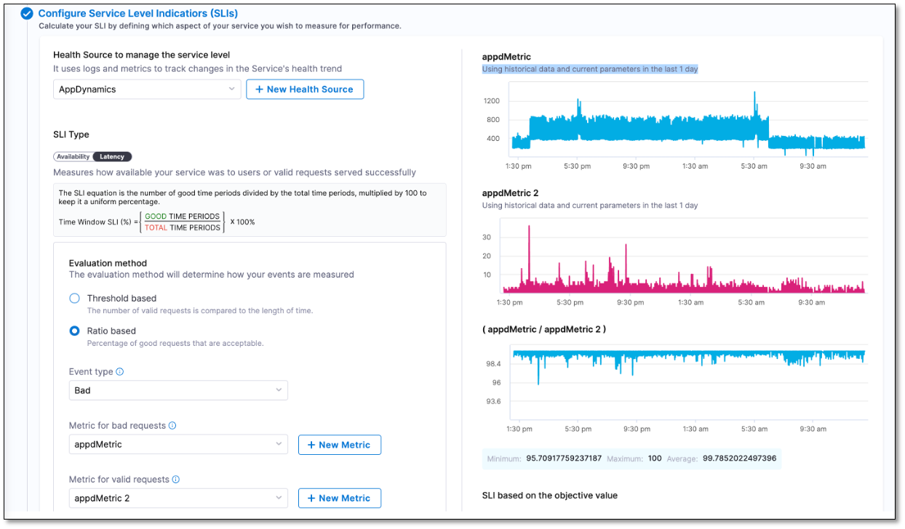
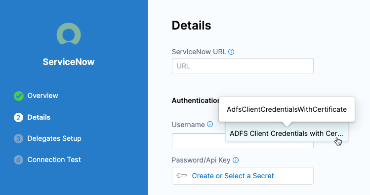

```mdx-code-block
import delete_project from './static/delete-project.png'
```

Learn about the new features that are Generally Available (GA) in Harness SaaS across all Harness modules and the Harness Platform.

:::note
Harness deploys updates progressively to different Harness SaaS clusters. You can identify the cluster hosting your account in your Account Overview page. The features and fixes in the release notes may not be available in your cluster immediately.

Additionally, the release notes below are only for NextGen SaaS. FirstGen SaaS release notes are available [here](/docs/first-gen/firstgen-release-notes/harness-saa-s-release-notes) and Self-Managed Enterprise Edition release notes are available [here](/release-notes/self-managed-enterprise-edition).
:::

## March 24, 2023, version 78817

### Continuous Integration

* [Cache Intelligence](/docs/continuous-integration/use-ci/caching-ci-data/cache-intelligence/) is now generally available. With Cache Intelligence, Harness automatically caches and restores common dependencies. You don't need to bring your own storage because Harness stores the cache in the Harness-hosted environment, Harness Cloud. (CI-7127)
* [Harness Cloud](/docs/continuous-integration/use-ci/set-up-build-infrastructure/use-harness-cloud-build-infrastructure) build infrastructure now supports **Run as User** for [Plugin](/docs/continuous-integration/ci-technical-reference/plugin-step-settings-reference) and [Run](/docs/continuous-integration/ci-technical-reference/run-step-settings) steps that are running on containers. (CI-7320)

### Service Reliability Management

- When you try editing an existing SLO, you will see the **Tags (optional)** field autopopulated even if no value was entered while creating the SLO. Harness uses the selected SLI type as value to autopopulate the **Tags (optional)** field. (SRM-14121)
  
- There is a new user interface (UI) for Elasticsearch health source configuration. This update is designed to improve the overall user experience and make it easier to configure Elasticsearch health sources. (SRM-14180)

### Harness Platform

- You can now add specific service accounts to your resource group. (PL-31867)
  
  By doing this, you can prevent accidental or deliberate misuse of API keys by restricting who can generate them from which service accounts.

- You can now enter usernames as a comma separated string while adding users in **Users(name or email)**. (PL-29630)
  
## March 21, 2023, version 78903

### Cloud Cost Management

Enabled audit trail for budget groups. (CCM-11387)

  With this enhancement, you can track all CRUD operations such as Create, Delete, and Update related to budget groups.

* Display the AWS account ID and name on the **Recommendations** page. (CCM-11666)

  The AWS Account ID has been added to the ECS Services on the Recommendations list page.

* Cost category enhancement (CCM-10580)

  Introduced support to allocate the cost of shared cost buckets by a fixed percentage among each cost bucket. A new user interface has been developed. 
  
    

  
  For more information, go to [Use Cost Categories](https://developer.harness.io/docs/cloud-cost-management/use-cloud-cost-management/ccm-cost-categories/use-ccm-cost-categories).

## March 15, 2023, version 78712

### Harness Delegate

- Integrated **Logs** API in the **Executed Details** page where the delegate task ID is available. (DEL-6035)

  You can now view logs for delegate tasks for pipeline steps that are running or finished. This can help with debugging issues. 

- Set an expiry for delegate tokens. (DEL-5652)

  When you create a delegate token through APIs, you can provide an optional parameter `revokeAfter`. This is the epoch time in milliseconds after which the token is marked as revoked. There can be a delay of up to one hour from when the epoch value is provided to when the token is revoked. 

### Continuous Integration

* The [Base Image Connector setting](/docs/continuous-integration/ci-technical-reference/build-and-push-to-ecr-step-settings#base-image-connector) for the **Build and Push to ECR** step now supports all Docker-compliant registries. Previously, this setting only supported DockerHub registries. (CI-7153, CI-7091, ZD-40319)
* You can now call pipeline-level variables in steps as environment variables. This is an extension of existing functionality that allows you to call stage-level variables in steps as environment variables. (CI-6709, ZD-39203)
* When configuring [SCM connectors](/docs/category/code-repo-connectors):
  * Failed connection tests now return more detailed error messages. (CI-7089)
  * The placeholder text in the **Repository URL** field shows a complete repo URL example. (CI-5750)

### Continuous Delivery

- The [Jira Update](https://developer.harness.io/docs/continuous-delivery/cd-advanced/ticketing-systems-category/update-jira-issues-in-cd-stages) step now supports updating the issue type. (CDS-53876)

  When you update a Jira issue using the Jira Update step, you can now update the issue type. For example, if the issue you are updating is a Story, you can update it to a Task.

  To update an issue type, add a new field named `Issue Type` and mention the new type in its **Value**.

```mdx-code-block
import Tabs from '@theme/Tabs';
import TabItem from '@theme/TabItem';
```
```mdx-code-block
<Tabs>
  <TabItem value="YAML" label="YAML" default>
```

```yaml
              - step:
                type: JiraUpdate
                name: Jira Update_1
                identifier: JiraUpdate_1
                spec:
                  connectorRef: fcdx
                  issueKey: <+execution.steps.JiraCreate_1.issue.key>
                  transitionTo:
                    transitionName: ""
                    status: Done
                  fields:
                    - name: Description
                      value: Improve feature X.
                    - name: Issue Type
                      value: Task
```


```mdx-code-block
  </TabItem>
  <TabItem value="Pipeline Studio" label="Pipeline Studio">
```

  


```mdx-code-block
  </TabItem>
</Tabs>
```
### Harness Platform

- The Harness UI now supports editing the email domain when creating a Service Account. Previously, the email domain was auto-generated and there was no option to edit it. (PL-31769)
  
- You can now migrate only the admin users of FirstGen to NextGen by enabling the feature flag `PL_DO_NOT_MIGRATE_NON_ADMIN_CG_USERS_TO_NG`. Previously, all FirstGen users were migrated to NextGen along with the admins. (PL-31648)
  
- The [List Role Assignments by scope filter](https://apidocs.harness.io/tag/Role-Assignments/#operation/getFilteredRoleAssignmentByScopeList) API now supports the following filters:

  - Principal Type Filter: Filters role assignments based on principal type.

  - Harness Managed Filter: Filters role assignments based on roles managed by Harness. For example, an Account Administrator. 

  - Disabled Filter: Filters disabled role assignments. (PL-31352)

- Filters for audit trails are now listed alphabetically. (PL-31204)

- Template expressions now support `when` conditions. (PIE-8762)

### Service Reliability Management

- Metrics graphs are now added to the **Create SLO** screen. (SRM-14025)  
    
  When configuring Service Level Indicators (SLIs) in the **Create SLO** screen, you will now see a metric graph based on the last 24 hours of data received from your health monitoring tool. Additionally, the recommended minimum, maximum, and average values specific to the SLI parameter that you are configuring will be displayed.  
  
  This feature eliminates the need for switching between the Harness **Create SLO** screen and your health monitoring tool dashboard to determine the most appropriate value for the SLI parameter you are configuring. For instance, if you opt for the ratio-based evaluation method while configuring your SLI, you can refer to the metric graphs and accompanying suggested values to determine the ideal percentage of valid requests to be considered for your SLI.  
  
  

## March 14, 2023

### Security Testing Orchestration

This release includes a set of new scanner-specific steps (step palettes) for Aqua Trivy, Bandit, SonarQube, and other popular scanners. These steps greatly simplify the process of setting up scans in your pipelines. Previously, the workflow for all scanners was to enter a set of hard-coded key and value strings in a Security step. These new steps have simplified user-friendly UIs that include only the options relevant to the specific scanner, mode, and target.

The following security steps are now generally available:

* [Aqua Trivy](/docs/security-testing-orchestration/sto-techref-category/aqua-trivy-scanner-reference) (STO-5393)
* [Bandit](/docs/security-testing-orchestration/sto-techref-category/bandit-scanner-reference) (STO-5050)
* [Black Duck Hub](/docs/security-testing-orchestration/sto-techref-category/black-duck-hub-scanner-reference) (STO-5052)
* [Checkmarx](/docs/security-testing-orchestration/sto-techref-category/checkmarx-scanner-reference) (STO-5073)
* [Grype](/docs/security-testing-orchestration/sto-techref-category/grype-scanner-reference) (STO-5394)
* [Mend (formerly Whitesource)](/docs/security-testing-orchestration/sto-techref-category/mend-scanner-reference) (STO-5392)
* [Prisma Cloud (formerly Twistlock)](/docs/security-testing-orchestration/sto-techref-category/prisma-cloud-scanner-reference) (STO-5055)
* [Snyk](/docs/security-testing-orchestration/sto-techref-category/snyk-scanner-reference) (STO-5053)
* [SonarQube](/docs/security-testing-orchestration/sto-techref-category/sonarqube-sonar-scanner-reference) (STO-5051)
* [Zed Attack Proxy (ZAP)](/docs/security-testing-orchestration/sto-techref-category/zap-scanner-reference) (STO-5058)


## March 13, 2023

### Cloud Cost Management

  Cost Category enhancements (CCM-10280)
  
  - When calculating the cost for `Unattributed`, the rules present in the shared cost bucket are not considered to eliminate duplicate costs.
  - If **Cost Category** is `NOT NULL` in a perspective, it means all cost buckets are considered. `Unattributed` is not taken into account.
  - If the **Cost Category** is `NULL`, it indicates that the cost buckets are not considered in the perspective. `Unattributed` is taken into account.
  - Previously, all shared cost buckets were displayed as `No Groupby`. Now, when you apply a GroupBy option other than the cost category, the cost of the rules present in the shared cost bucket are displayed in a separate entity based on the GroupBy selection you have made. However, it is important to note that this change will be effective only if you have incorporated cost category with shared buckets in perspective rules.

## March 9, 2023

### Security Testing Orchestration

* The new [Jira integration](/docs/security-testing-orchestration/use-sto/jira-integrations) has been enhanced. If an issue has an associated Jira ticket, the Issue Details pane now shows the ticket status along with the number. (STO-5491)

## March 8, 2023, version 78619

### Continuous Delivery

- The YAML schema for the Jira connector has been migrated to a new version that encapsulates the authentication details in a new `auth` object with type `UsernamePassword`. This migration enables Harness to support different authentication types in the Jira connector. 

The first of the following two YAML snippets shows the new `auth` object and the new `username` and `passwordRef` fields nested within it. The second YAML snippet shows you the previous YAML specification for purposes of comparison.
```
connector:
  name: jira
  identifier: jira
  description: ""
  orgIdentifier: default
  projectIdentifier: <pid>
  type: Jira
  spec:
    serviceNowUrl: https://jiraUrl.atlassian.net/
    username: harnessqa
    passwordRef: HarnessQA
    auth:
      type: UsernamePassword
      spec:
        username: harnessqa
        passwordRef: HarnessQA
    delegateSelectors:
      - harnessci-platform-ng-prod
```
```
connector:
  name: jira
  identifier: jira
  description: ""
  orgIdentifier: default
  projectIdentifier: <pid>
  type: Jira
  spec:
    serviceNowUrl: https://jiraUrl.atlassian.net/
    username: harnessqa
    passwordRef: HarnessQA
    delegateSelectors:
      - harnessci-platform-ng-prod
```

Any new Jira connectors that you create must include the new `auth` object, and you must use its nested `username` and `passwordRef` fields for authentication. 

The new fields override the previously used `username` and `passwordRef` authentication fields. The older fields are now deprecated.
 
These changes are backward incompatible. Therefore, you must also update the Terraform provider for creating a Jira connector to the latest version (version 0.14.12) so that these new fields are provided. You also need to provide these new fields in API calls that create or update a Jira connector.

### Harness Platform

- Sorting functionality is available on the triggers listing page. (PL-31530)

  You can sort triggers according to the following: 
  - Name
  - Creation date
  
- The [List User Groups API](https://apidocs.harness.io/tag/User-Group/#operation/getUserGroupList) now supports `INCLUDE_CHILD_SCOPE_GROUPS` as an additional filter type value. (PL-31353)
  
  This filter allows API responses to include child-scoped user groups. 
  
- You can now access your account immediately after resetting your password. (PL-30878)

- You can configure the HashiCorp Vault connector to use AWS Auth authentication without providing `X-Vault-AWS-IAM-Server-ID`. (PL-30628, ZD-36826,39745)
  
  It is now an optional field. 
  
- In the execution view, failed stages are now sorted before success stages when parallel stages are used. (PIE-2518)
  
  This makes it easier to choose failed stages.
  
- The feature flag `FF_ALLOW_OPTIONAL_VARIABLE` now lets you make runtime variables optional in pipelines and stages. (PIE-8209)

### Harness Delegate

- The delegate installation UI experience is now updated with a new installation method: the Terraform Helm provider. Also, the installation experience has been enhanced for the existing methods (Helm chart, Kubernetes manifest, and Docker). This new experience is more developer friendly. For example, it enables cutting and pasting of relevant commands. You can also automate the commands and use new values when necessary. 

  Additionally, the following new features are available:
    - The **Terraform Helm Provider** method is based on the open source [Terraform Harness Delegate module](https://registry.terraform.io/modules/harness/harness-delegate/kubernetes/latest) and the open source [Harness Delegate Helm chart](https://github.com/harness/delegate-helm-chart). Auto upgrade is set to `OFF` with an option to enable it in the command.
    - The updated method for **Helm Chart** is also based on the same open source [Harness Delegate Helm chart](https://github.com/harness/delegate-helm-chart) as the Terraform Helm provider. Auto upgrade is set to OFF with an option to enable it in the command. You can also download the [default values.yaml](https://github.com/harness/delegate-helm-chart/blob/main/harness-delegate-ng/values.yaml) for the Helm option and edit that to set your own long-lived configuration values.
    - The updated flow for **Kubernetes Manifest** has the following options for creating a manifest YAML file specific to your Harness account.          
      - **Basic**: Provides a **Download YAML** option. The downloaded YAML has all the configuration variables set to values that are specific to your Harness account. 
      - **Custom** - Create your own YAML from a [Kubernetes manifest template](https://github.com/harness/delegate-kubernetes-manifest/blob/main/harness-delegate.yaml) by replacing the placeholders with the values provided in the method.
      Given the need to have a fully qualified YAML, the auto upgrade configuration is set to ON in both the above options. Consequently, the delegate version that is installed always remains in sync with the version available on Harness Manager.
    - The **Docker** delegate installation method has now been simplified to a copy-and-paste action on the `docker run` command, with the option to modify the preset values. The auto upgrade is set to OFF for this method, with an option to enable it in the command. (DEL-6037)

- The secrets manager cache was moved from Redis to the Harness Manager's local pod. (DEL-5884)

 This move further enhances security because the secrets manager configuration no longer goes outside of the Harness Manager's pod.
 
## March 2, 2023

### Security Testing Orchestration

- The Twistlock integration has been upgraded to use version 22.12.582. (STO-5575)
- The Brakeman, Nikto, and Nmap scanner integrations now enable you to customize scans by passing CLI arguments to the scanner via the `tool_args` setting. (STO-5465)
- The Bandit scanner integration now enables you to customize scans by passing CLI arguments to the scanner via the `tool_args` setting. (STO-5415)
- The Mend integration now supports SCA scans. (STO-5242)
- Bandit scan results have been enhanced. When you open the Details pane for a detected issue, the Raw Details JSON now includes links to further information under `_rawIssueCwe : link` and `_rawMoreInfo`. (STO-5422)
- The Security Testing Dashboard includes a new set of filters for drilling down into specific issues by project, creation date, scanner, target, pipeline, severity, and so on. You can drill down to a set of relevant issues and then click on a pie slice, chart element, or other UI element to view details on the relevant issues. (STO-5329)
  
  Note the following:

  - The Security Testing Dashboard requires an Enterprise account.
  - You must click the **Refresh** button (top right) to apply the filter after you configure it.
  - The **Created Date** menu has several non-working options: `is null`, `is not null`, and `matches a user attribute`. This is a known issue that Harness is working to address.


## March 1, 2023

### Cloud Cost Management

* AutoStopping Proxy for HTTPS and TCP connections.

 Harness CCM introduces **AutoStopping Proxy** to support AutoStopping for HTTPS and TCP connections. For more information, go to [Add load balancers](https://developer.harness.io/docs/category/add-load-balancer-for-autostopping-rules) and [Create AutoStopping rules](https://developer.harness.io/docs/category/create-autostopping-rules).

* Introducing support for adding more than one CCM GCP connector when you have two or more billing export tables with different billing account IDs in the same dataset. (CCM-11244)
* Introducing support for assigning a custom static port as the source port in the port configuration of the TCP traffic-based AutoStopping rule. (CCM-11264)

## February 23, 2023, version 78507

### Harness Platform

- The new delegate installation wizard is now generally available. (PL-31305)
  
  You also have the option to revert to the previous installation method if desired.


-  A warning message now appears in the UI when you delete a project or organization. Deletions require confirmation from the user. (PL-31292)
  
  ```mdx-code-block
  </img>
  ```

  This enhancement prevents the accidental deletion of important projects or organizations and provides an extra layer of caution for users.

- The reference page for entities is improved to provide detailed information about each reference. (PL-31247)

  The following details are added to the existing reference pages:

  - Date or timestamp 
  - Name and type of entity
  - Scope of reference

  These enhancements provide comprehensive information about each reference.

- Sorting functionality is available on the project listing page and the project selector dropdown. (PL-27493)
  With this enhancement, you can easily sort and find projects you need and organize them according to your preferences.

- You can now change stages without losing the values you enter in the **Run Pipeline** form. (PIE-4663)

### Continuous Integration

In addition to fixed values and runtime inputs, you can now use [expressions](/docs/platform/References/runtime-inputs#expressions) for the **Repository Name** in your pipelines' input sets, triggers, and codebase configuration settings. This is useful for pipelines that you use with multiple repositories. (CI-6657, ZD-38657)


## February 15, 2023, version 78421

### Continuous Integration

* Microsoft Windows (amd64) is now a supported [Harness Cloud](/docs/continuous-integration/ci-quickstarts/hosted-builds-on-virtual-machines-quickstart) build infrastructure option. (CI-5455)
* **Python** is now available as a built-in **Shell** option for [Run steps](/docs/continuous-integration/ci-technical-reference/run-step-settings). (CI-6692)
* [Run steps](/docs/continuous-integration/ci-technical-reference/run-step-settings) can now reference images in GCR through [GCP connectors](/docs/platform/Connectors/connect-to-google-cloud-platform-gcp) that use inherited credentials. (CI-5758, ZD-38986)
  * GCP connectors are authenticated through either a GCP service account key or by inheriting credentials from the Harness delegate running in GCP. This change improves how you can use GCP connectors with inherited credentials in your pipelines.
  * Previously, if you wanted a Run step to call an image in GRC, the GCP connector attached to your Run step had to use service account key authentication. Now, the GCP connector can use either authentication method.
* Use [Background steps](/docs/continuous-integration/ci-technical-reference/background-step-settings) to configure service dependencies. (CI-5580)
  * The Background step allows for better control and configuration of services than the now-deprecated Configure Service Dependency step.
  * Pipelines with Configure Service Dependency steps remain backwards compatible, but this step is not available for new pipelines.
  * Replace Configure Service Dependency steps with Background steps to take advantage of the more robust control and configuration option.
* [Pipeline execution status links](/docs/continuous-integration/use-ci/view-your-builds/viewing-builds) in Git pull requests now direct you to the associated stage within the pipeline, rather than the pipeline as a whole. (CI-6813)
* Improved handling of Azure repo URLs in [Git webhook pipeline triggers](/docs/platform/triggers/triggering-pipelines). (CI-5720)

### Delegate version 78306

This release introduces the following new features and enhancements:

- Added the `helm repo update` command to the delegate installer. The command is included in the instructions that apply the delegate manifest. This change reduces the chance of retrieving the wrong file from the repository. (DEL-5540)

### Harness Platform

- The Redisson client library has been upgraded to version 3.17.7 across all services for enhanced performance and bug resolution. (PL-31136)
  This update will not affect any business operations.

- The [Role Assignment](https://apidocs.harness.io/tag/Role-Assignments/#operation/getFilteredRoleAssignmentByScopeList) API now includes the principal's name and email address in the response.(PL-31064, ZD-36050)

- Harness now supports the integration of GCP Secrets Manager for all users. (PL-31051)
  
  For more information, see [Add a Google Cloud Secret Manager](https://developer.harness.io/docs/platform/Security/add-a-google-cloud-secret-manager)

- There is a limit on the number of entities that can be created for **FREE** and **COMMUNITY** users in Harness. (PL-30838)
  
  Following are the entity creation limits: 

  - Project - 100
  - Secrets - 100
  - Variables - 100
  - User groups -100
  - Service accounts - 100

- You can now add policy sets under the **Advanced** section of each step. (PIE-7794)

  In this way, you can validate step outputs generated during pipeline execution without explicitly requesting a payload. Policy sets receive the steps and their outputs as payloads, with a pre-defined schema for every step.

- Accessing the CD module redirects you to one of the following: 

  - Get Started: If you don't have any pipelines in your project.

  - Deployment list page: This is the default selection page. (PIE-7625)

## February 6, 2023, version 78321

### Continuous Delivery

- Active Directory Federation Services (ADFS) is now supported for ServiceNow authentication. (CDS-49406, CDS-49229)
  
  Any API call Harness makes to ServiceNow requires an authentication token. Previously, Harness supported username and password authentication only. Now we support ADFS authentication.

  

### Continuous Integration

- Linux ARM is now supported in [Harness Cloud](/docs/continuous-integration/ci-quickstarts/hosted-builds-on-virtual-machines-quickstart) build infrastructures. (CI-5787)
- The Harness UI now shows a detailed warning when a CI build uses unsupported versions of any CI build images. (CI-6721)

### Harness Platform

- The pages in app.harness.io autofocus the search input box by default. (PL-30656)
  
  This results in a seamless search experience.

- Entity names can now include the `/` character. (PL-29929)
- [Looping strategies](https://developer.harness.io/docs/platform/pipelines/looping-strategies-matrix-repeat-and-parallelism/), including matrix and parallelism strategies, are no longer behind a feature flag. (PIE-5010)

### Security Testing Orchestration

* You can now ingest results from a specific Checkmarx scan. This option is useful for ensuring that a pipeline ingests the scan triggered by a specific event. Add the setting `product_scan_id` = `MY_SCAN_ID` to the Checkmarx step. This overrides the default behavior, which is to ingest results for the most recent scan. (STO-5424)	

* You can now enable debug-level logging for Snyk and Aqua Trivy scans. To do this, add this setting to the scan step: `log_level` = `debug`. (STO-5405)

* Grype scans now support a `tool_args` field. You can use this field to run the plugin with specific command-line arguments. To scan all layers in an image, for example, add this setting to the Grype scan step: `tool_args` = `--scope all-layers`. (STO-5400)

* To make the Issue Details pane easier to navigate, Raw Details JSON data is now collapsed by default. (STO-5398)	

## February 3, 2023

### Security Testing Orchestration

* The Issue Details pane now shows the message “No recommendations are available at this time” when the scan tool doesn't return remediation steps for a specific issue. (STO-5380)

## January 29, 2023

### Continuous Integration

- CI pipelines now support workflows that can run with some runtime inputs undefined. Previously a pipeline would fail if any runtime input was undefined for any field such as an environment variable, label, build argument, or port binding. (CI-5116 , ZD-33893, ZD-34255)


## January 17, 2023

### Continuous Delivery

- YAML schema validation for environments. (CDS-48947)
  
  We have added YAML schema validation to environment entities. Similar validation already exists for our pipeline YAML, but environments are separate entities.
  If you try to save invalid YAML you will get an error like this:
  ```bash
  Invalid yaml: $.environment.overrides.manifests[0].manifest.spec: is missing but it is required.
  ```
- Improved error message when API calls fail while listing Helm **Chart Version** in **Run Pipeline**. (CDS-48436)
  
  If **Chart Version** is a runtime input, when you run the pipeline you are required to select a version from the **Chart Version** dropdown. If the Harness API is unable to fetch any versions, an improved error message is displayed.

    
  
  Hover over the error message to see the full message.

### Continuous Integration

* This release includes two new CI steps for integrating your Harness CI pipelines with GitHub Actions and Bitrise. The following steps are available in Harness Cloud build infrastructures only. 
   - An Actions step to run GitHub Actions.
   - A Bitrise step to run Bitrise steps and workflows. (CI-6479)
* Harness CI now supports remote debugging of remote builds in Harness Cloud, Kubernetes, and VMs in AWS, Azure, and other cloud platforms. If a build fails at a Run step, you can rerun the build in debug mode. This option is available in the **Builds**, **Execution**, and **Execution History** pages of the Harness UI. (CI-6350) 
   
   

* You can now specify hostnames instead of IPs in Kubernetes build infrastructures. This enables your pipelines to communicate with external services using hostnames. The following Harness YAML snippet shows how to set up aliases for your cluster in the CI stage **Infrastructure** section. (CI-5996, ZD-36578)

``` yaml 
infrastructure:
    type: KubernetesDirect
    spec:
      connectorRef: account.test
      namespace: harness-delegate
    hostNames:
      - abc.com
      - xyz.com
```
  
### Harness Platform

- A dedicated release notes page was introduced for Harness Delegate. You can find the delegate release notes at [Delegate](/release-notes/delegate).

## January 15, 2023		

### Security Testing Orchestration

* Aqua Trivy scans now support a `tool_args` field. You can use this field to run the plugin with specific command-line arguments. To run an offline scan, for example, `specify tool_args` = `---offline-scan`. (STO-5388)	


## January 10, 2023, version 78105

### Continuous Delivery

- A [failure strategy](https://developer.harness.io/docs/platform/pipelines/w_pipeline-steps-reference/step-failure-strategy-settings/) is now mandatory for all Deploy stages. (CDS-48951)  
  
  

  A failure strategy is now a mandatory setting in the **Deploy** stage. Previously, a failure strategy was mandatory, but the check happened when the pipeline ran. 
  
  A failure strategy is also required for the **Deploy** stage in [stage templates](https://developer.harness.io/docs/platform/templates/add-a-stage-template/). With this release, all Deploy stages, including in stage templates, without failure strategies are considered invalid.

  No action required by users.
- UI enhancements for remote templates created in non-default or feature branches. (CDS-48308)
  
  If a remote template is created in a non-default or feature branch, Harness fetches the template details from the created branch and displays them on the template studio/listing page. You no longer need to manually select the correct branch.

  No action required by users.
- Absolute paths for Native Helm charts [Custom Remote Manifest](/docs/continuous-delivery/cd-advanced/cd-kubernetes-category/add-a-custom-remote-script-and-manifests) are now supported. (CDS-47647, RN-37501)
  
  Previously, Harness CD looked for a path relative to the Harness working directory, which is a temporary directory that Harness creates. Now, you can specify an absolute path in **Extracted Manifest File Location** by starting with a forward slash `/`. For example: `/tmp/myChart1/custom-remote-test-repo/helm/todolist/`.

  

  No action required by users.

### Harness Platform

- Secrets and connectors now have a character limit of 128 for the **Name** and **ID** fields. (PL-29887)
  
- The [Role-Assignments](https://apidocs.harness.io/tag/Role-Assignments/#operation/getFilteredRoleAssignmentByScopeList) API now fetches role assignments by scope. (PL-29496, ZD-36050)

  This helps you keep a track of the role assignments within a specific scope.
  
- The repository location of the Helm chart for the NextGen delegate is changing. (DEL-5576) 

  The repository is being deprecated. Updates to the chart will not be made to [https://app.harness.io/storage/harness-download/delegate-helm-chart/](https://app.harness.io/storage/harness-download/delegate-helm-chart/) and will not be available from that location. To ensure retrieval of the most recent Helm chart, update your repository references to [https://app.harness.io/storage/harness-download/harness-helm-charts/](https://app.harness.io/storage/harness-download/harness-helm-charts/).
  
## January 8, 2023		

### Security Testing Orchestration

* Checkmarx scans now support a `tool_args` field. You can use this field to run the Checkmarx plugin with specific command-line arguments. To run an incremental scan, for example, `specify tool_args` = `-incremental`. (STO-5041)	

* STO now supports orchestrated scans using [Grype](/docs/security-testing-orchestration/sto-techref-category/grype-scanner-reference). (STO-5161)	

## January 1, 2023	

### Security Testing Orchestration

* The Issues Details pane has been revised to make it easier to navigate. Raw JSON data now appears at the bottom of each occurrence and is collapsed by default. (STO-4839)	


## December 22, 2022, version 77908

### Harness Platform

-   You can now get the service provider configuration, schema, and a list of all the supported resource types corresponding to SCIM applications through API. (PL-29069)

    To facilitate the discovery of SCIM service provider features and schema, SCIM defines the following three HTTP GET endpoints:

    -   ServiceProviderConfig

    -   ResourceType

    -   Schemas

    Harness now supports these three API endpoints.

### Continuous Delivery

- [Deployment Templates](/docs/continuous-delivery/onboard-cd/cd-quickstarts/custom-deployment-tutorial) **Execution** tab now supports all steps in Command category (CDS-48030)
  - Earlier, only the Utilities steps were supported.
  - Now you can add any CD step.
+ Support for absolute paths in [Custom Remote Manifest](/docs/continuous-delivery/cd-advanced/cd-kubernetes-category/add-a-custom-remote-script-and-manifests/) for Helm Charts (CDS-47647, ZD-37501) 
  - Previously, we were only looking for a path relative to Harness working directory (a temporary directory created by Harness).
  - Now, you can specify an absolute path in **Extracted Manifest File Location** by starting with a forward slash `/`.
  - Example: `/tmp/myChart1/custom-remote-test-repo/helm/todolist/`.
- **Referenced By** tab added to [Environments](/docs/continuous-delivery/onboard-cd/cd-concepts/services-and-environments-overview) (CDS-39989)
  - You can see which pipeline use any Environment in the Environment's **Referenced By** tab.

- The [Deployment Templates](/docs/continuous-delivery/onboard-cd/cd-quickstarts/custom-deployment-tutorial) **Execution** tab now supports all steps in the Command category. (CDS-48030)

  Earlier, only the Utilities steps were supported. Now you can add any CD step.

- Support for absolute paths in a [Custom Remote Manifest](/docs/continuous-delivery/cd-advanced/cd-kubernetes-category/add-a-custom-remote-script-and-manifests/) for Helm Charts. (CDS-47647, ZD-37501) 

  Previously, we were only looking for a path relative to the Harness working directory (a temporary directory created by Harness). Now, you can specify an absolute path in **Extracted Manifest File Location** by starting with a forward slash `/`.

  Example: `/tmp/myChart1/custom-remote-test-repo/helm/todolist/`.

- The **Referenced By** tab was added to [Environments](/docs/continuous-delivery/onboard-cd/cd-concepts/services-and-environments-overview). (CDS-39989)

  You can see which pipeline uses any Environment in the Environment's **Referenced By** tab.

### Continuous Integration

* Customers on the free plan can now run 5 stages per day on the CI hosted infrastructure. Contact Harness Sales to upgrade your plan. (CI-6430)

* The onboarding workflow now caters to customers who do not have a codebase with which to connect. (CI-6348)

## December 18, 2022			

### Security Testing Orchestration

* Remediated issues are no longer included in the issue counts logged near the end of a Security Step run and provided as output variables. (STO-5304)	

*  With this release, you can run a SonarQube scan and specify a collection of SSL certificates rather than a single certificate. This option is useful when you don't know which specific certificate in a collection is required by the server. (STO-5243)	

## December 13, 2022, version 77808

### Continuous Delivery

- ServiceNow Connector YAML has changed to include authentication details. (CDS-46672, CDS-45969)

  **The update is minor and requires no changes by users.**

- Harness Serverless Lambda and ECS support now supports AWS S3 (CDS-46204, CDS-45642)

  You can now use AWS S3 for your Serverless YAML and ECS configuration files (Task Definition, Service Definition, Scaling Policy, and Scalable Target JSON/YAML files).

- The <+rollbackArtifact...> expression is now available (CDS-46321)

  For example, if you used a publicly available Docker Hub NGINX image as the Artifact Source for a Service, then when the Service is rolled back, the <+rollbackArtifact.meta.image> expression output would be something like this: registry.hub.docker.com/library/nginx:stable-perl.

  The variables available in rollbackArtifact depends on the artifact and infrastructure type used in the deployment. They can be seen in Output tab of Infrastructure section of a CD stage.

  There are many different available, demonstrated in this script:

        echo <+rollbackArtifact.bucketName>

        echo <+rollbackArtifact.buildNo>

        echo <+rollbackArtifact.buildFullDisplayName>

        echo <+rollbackArtifact.ArtifactPath>

        echo <+rollbackArtifact.description>

        echo <+rollbackArtifact.displayName>

        echo <+rollbackArtifact.fileName>

        echo <+rollbackArtifact.key>

        echo <+rollbackArtifact.metadata.image>

        echo <+rollbackArtifact.metadata.tag>

        echo <+rollbackArtifact.source.registryUrl>

        echo <+rollbackArtifact.url>

### Harness Platform

- You can now refer to existing secrets of Azure Key Vault, AWS secret manager, and GCP secret manager. (PL-29915)

  With this enhancement, you need not create secrets in Harness. You can use expressions to reference the secrets already existing in the mentioned secrets managers. For more information, see [Reference Existing Secret Managers Secrets](https://developer.harness.iohttps://developer.harness.io/docs/platform/security/reference-existing-secret-manager-secrets/).

- You can now use the Git client to commit changes while creating or updating pipelines using Bitbucket on-prem as the Git provider. (PIE-6423)

  To do this, enable Use Git client for commits in the default settings at the account scope. Harness checks out the code on the delegate and uses the Git client to make the commits to your Git repository.

## December 11, 2023			

### Security Testing Orchestration
	
* STO is now supported on Linux (amd64 and arm64 platforms) in Harness Cloud. (STO-5314)	

* Instead of using Service Dependencies for Docker-in-Docker configuration, users should use new Background steps. (STO-5268)


## December 7, 2022, version 77716

### Continuous Delivery

Helm steady state checks with Kubernetes version >= 1.16 (CDS-40269)

Harness will automatically perform steady state checks with Helm deployments using Kubernetes version >= 1.16.
This feature was previously behind the HELM_STEADY_STATE_CHECK_1_16 feature flag and is now GA.

### Harness Platform

Securing data through JSON Web Token (JWT) masking. (PL-29019, ZD-32004)

Harness now masks all JWTs in pipelines and delegate logs. This change prevents data leakage risks for the applications running in Harness.

## December 2, 2022, version 0.4.2

### Chaos Engineering

- Update feature for chaos hub enables users to update details such as `Git Connector`, `Repository Name`, `Branch Name` and `Name` for an already connected chaos hub.

- Adds CDN Support for Chaos module static artifacts thereby loading the UI with reduced latency on client devices.

- Adds version information in the ChaosDriver and ChaosManager. Hence, the versions are available over endpoints `/chaos/driver/api/version` and `/chaos/manager/api/version` for ChaosDriver and ChaosManager, respectively.

- Adds a range filter dropdown in the `Experiment Runs` bar graph under `Experiment overview` allowing you to set the range on the last runs shown in the graph.

- Adds support for all fault statuses in the `Experiment Runs` graph. Apart from `Failed` and `Passed` states being shown, faults in `Awaited`, `Stopped` and `N/A` states are also available under the `Experiment Runs` graph.

- Adds manifest download button in the UI for Chaos Infrastructures that enables you to have a seamless upgrade.

- Adds consistent loaders for all components and screens in the UI.

## November 29, 2022

### Harness Platform

- Fix to help you identify Harness in your two-factor authentication app. (PL-29563)

  The default name of the entry for Harness in two-factor authentication (2FA) apps such as Google Authenticator now begins with Harness\_. This change enables you to identify the correct entry, and to therefore use the correct code, for authenticating to Harness. If you configured 2FA for Harness before this change, remove the existing entry and reconfigure 2FA to see the new name.

- Direct use of email addresses in v2 APIs for creating and updating user groups. (PL-29018)

  You can now use email addresses in v2 APIs for creating or updating a user group. It is no longer required to first fetch the email addresses by using user IDs

- You can now create user groups inline when setting up the Approval stage in a pipeline. (PL-28022)

  This is helpful when the user group that needs to be sent notifications does not already exist. The scope of the user group is within the project corresponding to the pipeline.

  The Harness UI now lists the versions of services in your account settings. To see the versions, go to Account Settings > Overview, and then expand Platform Service Versions. (PL-26581)

- Approval messages in Harness approvals can now have expressions in multiple lines. (PIE-6238, ZD-36667,37069)

- Harness service variables now support dots (.). (PIE-4613)

  This is helpful when you have JSON/YAML files where you want to update the keys with some values. You can define variables for those keys in harness with (.) to access the keys. The expression to access a key would be:

  <+variables.get("example.key")>

- You can now drag the step details section and move it to the desired location. (PIE-3890)

- You need not enter the Tags or Description while importing an entity from Git. (PIE-6171)

  The corresponding information for these fields are fetched from Git.

### Continuous Integration

- New Subscription ID field. (CI-6032)
  An Azure subscription ID is now required in the Build and Push ACR step to enable the display of artifacts uploaded by the steps on the Artifacts tab.

- New background step to define the service dependency. (CI-5580)
  A new background step has been added to define the service dependency in CI. The previous stage settings of service dependency are now deprecated. The new background step allows for better control and configuration of services.

## November 21, 2022

### Continuous Delivery

- Fetch Helm Chart Versions from Source on Run Pipeline UI (CDS-40390)

  Now you can set Helm Chart version using a runtime input (when using HTTP Helm, S3, and GCS stores), view the list of chart versions available at runtime, and select the required one.

  For Helm deployment information, go to [Helm Chart deployment tutorial](https://developer.harness.io/docs/continuous-delivery/onboard-cd/cd-quickstarts/helm-cd-quickstart/).

- Copy of Service and Environment variables (CDS-38870, ZD-37291)

  You can now copy the FQNs for Service and Environment variables. The Service variables use the format <+serviceVariables.[variable name]> and Environment variables use the format `<env.variables.[variable name]>`.

### Feature Flags

A new React Client SDK has been released for Feature Flags as version 1.0.0. For more information about this SDK and how to integrate with it, go to the [React Client Reference Guide](https://developer.harness.io/docs/category/client-sdk-guides/) and the [React Client GitHub repository](https://github.com/harness/ff-react-client-sdk).

## November 11, 2022

### Continuous Delivery

- Helm steady state checks with Kubernetes version >= 1.16 (CDS-40269)

  Harness will automatically perform steady state checks with Helm deployments using Kubernetes version >= 1.16.

  This feature was previously behind the HELM_STEADY_STATE_CHECK_1_16 feature flag and is now GA.

- Support for the Command step is added Deployment Template deployment types (CDS-45189)

  Now you can use the Command step in a Deployment Template pipeline. Using this step you can download/copy the artifact, copy the config files, or run scripts on the instances output by the Fetch Instances step.

  The Command step will always run on the Delegate, hence you need to enable the Run On Delegate option.

  The Command step should always be run after the the Fetch Instances step.

  See [Use the Command step to download, copy, or run scripts](https://developer.harness.io/docs/continuous-delivery/cd-execution/cd-general-steps/download-and-copy-artifacts-using-the-command-step).

### Harness Platform

- You can now send email notifications to all the members of a user group by selecting the Send email to all users part of the user group option.(PL-29434, ZD-32444)

  For existing user groups, this is the default option.

- The organization filter selection on the project listing page will now persist across user sessions and page navigations.(PL-29292)

  You can now see the versions of the services in Account Overview in Platform Service Versions.(PL-26581)

## November 6, 2022

### Harness Platform

The option to disable Harness Secret Manager is now a part of the core settings in Account Default Settings. (PL-27160)

### Continuous Integration

The Custom Git Connector now supports connection via the Harness Platform, in addition to the ability to connect through the Harness Delegate. Connecting through Harness Secrets Manager is required to use the generic git connector on the Harness Cloud build infrastructure hosted by Harness. (CI-5666)

### Security Testing Orchestration

* You can now include Run steps in Security Test stages. You can also include Security Tests stages in STO pipelines without a CI license. (STO-5208)

* You can now configure a pipeline to ingest Snyk data from multiple files and paths. For an example of how to set this up, go to [Ingest Scan Results from Snyk](/docs/security-testing-orchestration/use-sto/snyk-scans). (STO-4958)	


## October 31, 2022

### Security Testing Orchestration

- New output variables – This release includes a new set of output variables you can use to determine the next stage of your pipeline. These variables show the number of new issues detected in the current scan compared to the last scan. If this is the first scan for the target, these variables reflect new issues compared to the baseline. You can use these variables to determine the next stage of your pipeline:

  - NEW_CRITICAL
  - NEW_HIGH
  - NEW_MEDIUM
  - NEW_LOW
  - NEW_UNASSIGNED (Reserved for future use)
  - NEW_TOTAL (STO-4866)

- STO Overview – The [STO Overview](https://developer.harness.io/docs/continuous-delivery/cd-execution/cd-general-steps/download-and-copy-artifacts-using-the-command-step) provides a single, interactive view of all baseline issues detected by all scans in your project. A time series chart shows the daily distribution of issues by severity over the past 30 or 90 days. A daily snapshot shows the sum of all baseline issues based on the latest scan of each baseline. You can also drill down into active, failed, and in-progress baseline scans. (STO-3629)

- STO scans on VMs using Docker delegates – You can now run builds with STO scans using Docker delegates running on Linux VMs in AWS and other cloud platforms. This extends the support for STO scans with Kubernetes delegates.

  For information about setting up a VM build infrastructure, see [Set Up Build Infrastructure](https://developer.harness.io/docs/category/set-up-build-infrastructure/) in the CI docs. (STO-4639)

- Two-step Exemption and Security Review – This release enhances support for a two-step process for requesting and approving security exemptions:

  - Developers can request (but not approve) exemptions to unblock pipeline builds for specific issues.
  - Only SecOps users can approve exemption requests and choose to mute or ignore specific issues. (STO-4479)

- AWS Security Hub – STO now supports scans in AWS Security Hub. (STO-4873)

- AWS ECR – STO now supports scans on AWS Elastic Container Registry (ECR). (STO-4969)

## October 21, 2022

### Cloud Cost Management

You can now add labels to enable node pool recommendations. kops cluster node label is added for node pool recommendations. See [Labels for node pool recommendations](https://developer.harness.io/docs/cloud-cost-management/use-cloud-cost-management/ccm-recommendations/node-pool-recommendations/) for more information. (CCM-9309)

### Harness Platform

You can now import Templates from your Git repo. (PL-28597)

See [Import a Template From Git](https://developer.harness.io/docs/platform/git-experience/import-a-template-from-git/).

## October 18, 2022

### Continuous Delivery

You can now send Approval Step notifications to multiple Users as part of the User Group (CDS-43667, ZD-32444)
Manual Approval email notifications configured for a User Group now send the approval emails to all Users of the User Group without having the need to specify a group email.

### Continuous Integration

The Infrastructure tab in Build steps has been updated to show only supported options when a Hosted build infrastructure is selected. (CI-5737)

## Harness Platform

- The functionality of the delegate auto-upgrade components was enhanced. On installation, the AutoUpgrade feature displays a status message of Synchronizing. If the component does not receive an API call from the upgrader within 90 minutes, the status message changes to OFF. This affects delegates that are installed with upgrader components.

  For more information about delegate auto-upgrade, see [Delegate Auto-Update](https://developer.harness.io/docs/platform/delegates/delegate-guide/delegate-auto-update/).

- A loader is now displayed on click of Run Pipeline to indicate that the Pipeline is running. (PIE-5396)

### Feature Flags

You can now add a default pipeline to your Feature Flags that will be applied when you add targeting rules, or when you enable or disable a Flag. This means that you can ensure your Flag changes go through the process you want them to, allowing for better security and more consistent operations. For example, you can add an approval step so all your production Flag changes must be approved before they are executed, or you can send a Slack notification every time a Flag changes.

For more information about how to use a default pipeline for your Flags, go to [Add a Default Pipeline for Flag Changes](https://developer.harness.io/docs/feature-flags/ff-using-flags/ff-build-pipeline/default-pipeline-ff/).

## October 7, 2022

### Harness Platform

You can now use a readOnly vault as a default SM. (PL-24491)

### Continuous Delivery

- ECS deployments: deploy artifacts to your Amazon Elastic Container Service (ECS) clusters using a Rolling, Canary, and Blue Green strategies.

  For more information, go to: [ECS deployment tutorial](https://developer.harness.io/docs/continuous-delivery/onboard-cd/cd-quickstarts/ecs-deployment-tutorial/).

- Traditional deployments using SSH or WinRM: deploy your artifacts to hosts located in Microsoft Azure, AWS, or any platform-agnostic Physical Data Center (PDC).

  These deployments are called Traditional because they use Secure Shell and PowerShell scripts and a traditional runtime environment as opposed to containers and orchestration mechanisms, like Kubernetes.

  For more information, go to:

  [Secure Shell (SSH) deployment tutorial](https://developer.harness.io/docs/continuous-delivery/onboard-cd/cd-quickstarts/ssh-ng/)

  [WinRM deployment tutorial](https://developer.harness.io/docs/continuous-delivery/onboard-cd/cd-quickstarts/win-rm-tutorial)

- Custom deployments using Deployment templates: In some cases, you might be using a platform that does not have first class support in Harness, such as OpenStack, WebLogic, WebSphere, Google Cloud functions, etc. We call these non-native deployments. For non-native deployments, Harness provides a custom deployment option using Deployment Templates.

  For more information, go to: [Custom deployments using Deployment Templates tutorial](https://developer.harness.io/docs/continuous-delivery/onboard-cd/cd-quickstarts/custom-deployment-tutorial).

- The ability to provision resources in a CD stage's deployment infrastructure using the CloudFormation Create Stack step is now GA. Previously, it was behind the CLOUDFORMATION_NG feature flag.

### Continuous Integration

- You can now select Kotlin and Scala as languages in the Run Tests step when setting up Test Intelligence. You can also select sbt as a build tool for Scala. (CI-5653, CI-3333)

- Run Step logs now show the commands that the step will run before it runs them. This functionality is limited to Kubernetes build infrastructures. (CI-5557)

## September 29, 2022

### Continuous Delivery

For [Native Helm deployments](https://developer.harness.io/docs/category/native-helm-deployments/), you can enable the new Ignore Release History Failed Status option to have Harness ignore when the Helm release is in a failed state. (CDS-43785)

By default, if the latest Helm release failed, Harness does not proceed with the install/upgrade and throws an error. Enable the Ignore Release History Failed Status option to have Harness ignore these errors and proceed with install/upgrade.

### Cloud Cost Management

- First-class Support for Istio is released with version 1.0.8 of autostopping-controller.​ (CCM-8386)

  You can now onboard Istio virtualservices-based workloads to AutoStopping without editing the virtualservice manually.​

- Now, you can sort perspective filters while creating cost categories, perspectives, etc. You can search for a filter quickly and apply it easily.​ (CCM-8597)​

### Continuous Integration

CI pipelines now support workflows that can run with some runtime inputs undefined. Previously a pipeline would fail if any runtime input was undefined for any field such as an environment variable, label, build argument, or port binding. (CI-5116, ZD-33893)

### Harness Platform

- The method that the log streaming task client uses to create thread pools was modified. Thread pools are now created one time in the client's lifetime instead of being created for each task the Delegate receives. (DEL-4328)

- When NG LDAP authorization is 'disabled', all LDAP SSO-linked Harness User Groups don't sync in NG. They sync with the users from LDAP when the LDAP settings have authorization enabled.​ (PL-27954)​​

## September 26, 2022

### Feature Flags

For self-serve customers, you can now create and upgrade a Feature Flags subscription directly through the Harness Platform instead of contacting our Sales team, meaning you can manage your subscription quickly, securely, and at any time.

For information about the current plans you can subscribe to, go to [Pricing & Plans](https://harness.io/pricing?module=ff#). For more information about how to use subscriptions, go to [Subscribe to Feature Flags](https://developer.harness.io/docs/category/subscribe-to-feature-flags/).

## September 22, 2022

### Harness Platform

- Harness Manager was changed to remove the edit and details UI for Immutable Delegates. These Delegates cannot be changed. (DEL-4756)

- Harness Manager UI was updated to ensure that Delegate version and associated information clarifies the difference between older immutable and legacy Delegates. (DEL-4826)

- A migration will run to remove the following Role Bindings directly assigned to users for accounts having ACCOUNT_BASIC_ROLE turned ON (PL-28284):​

  - At Account Scope, Account Basic/Account Viewer - All Account Resources​.​
  - At Organization scope, Organization Viewer - All Organization Resources.​​
  - At Project Scope, Project Viewer - All Project Resources.​​

- Harness now has a default User Group at each scope. ​These groups have all the users at the respective scope as their members. As a part of this change, Harness will stop assigning any roles to the User Groups by default.​ Users can assign roles to the default User Group at a specific scope, which becomes the default role for all the users in that group. (PL-26145)

  See [Harness Default User Groups](https://developer.harness.io/docs/platform/role-based-access-control/harness-default-user-groups/).

## September 14, 2022

### Continuous Delivery

- Shell Script Output Variables now allow the Secret type (CDS-41263, ZD-33761)

  You can select String or Secret for your output variable.

  When you select Secret and reference the output variable later in the Pipeline, Harness will automatically sanitize the resolved secret value in the logs.

  See [Using Shell Scripts in CD Stages](https://developer.harness.io/docs/continuous-delivery/cd-execution/cd-general-steps/using-shell-scripts/).

### Harness Platform

- The versioning scheme for the Immutable Delegate was changed from 1.0.`<build_number>` to year.month.`<buildNumber>`. (DEL-4338)

- Expiration was added for Immutable Delegate images. These images will now expire after three months. (DEL-4377)

- Fixed the display of an error message in the UI. The error message was not properly displayed when a pipeline selector was added using invalid characters. (DEL-4755)

- Login Settings is now renamed to Authentication Settings in Audit Trail. (PL-28048)

- You can now view your unsaved changes in the Pipeline Studio by clicking on Unsaved Changes. (PIE-5281)

- You can now use forecasting on your dashboards to help you create data predictions. (CDB-351)

## September 9, 2022

### Continuous Delivery

- Support for Gov Cloud for AWS Connectors in NG (CDS-42414).

  AWS Government Cloud is now supported.

- Support Jira 'user assignment' fields when using Jira integration (CDS-37792).

  Fields that manage users and issue links are now supported by Harness.

### Feature Flags

The Feature Flag PHP SDK has been released. This means you can now connect an application that uses PHP when using Harness Feature Flags.

For more information about the PHP SDK, go to the [PHP Reference Guide](https://developer.harness.io/docs/feature-flags/ff-sdks/server-sdks/php-sdk-reference/) or for general information about Feature Flag SDKs, go to our [SDK Overview](https://developer.harness.io/docs/category/sdks-overview).

To get the PHP SDK, go to our [PHP Git Repository](https://github.com/harness/ff-php-server-sdk).

## September 7, 2022

### Harness Platform

You can now inherit User Groups created at a higher scope by using Assign Roles.

See [Assign Roles](https://developer.harness.io/docs/platform/Role-Based-Access-Control/add-user-groups#step-assign-roles).

## August 31, 2022

### Harness Platform

- Git Experience in Next Gen is now enhanced and simplified.

  See [Git Experience](https://developer.harness.io/docs/category/git-experience/).

- You can now switch branches directly from the Pipeline execution history. This will make it easier to switch branches straight from execution history rather than going to the Pipeline studio first and then returning to execution history. (PIE-4985)

- You can now view the past 10 executions of the Pipelines and sort them from the table. You can also go to a specific execution by clicking on it. (PIE-4903)

## August 25, 2022

### Feature Flags

You can now configure the Relay Proxy for Feature Flags to load and use configuration data that is stored offline. This means in case of an outage, you can still use the Proxy with the configuration you set. To use this feature, you need to generate the offline configuration and then run the Proxy in offline mode. For more information about how to do this, go to the [Relay Proxy overview](https://developer.harness.io/docs/category/git-experience/) and [Run the Proxy in offline mode](https://developer.harness.io/docs/feature-flags/ff-using-flags/relay-proxy/deploy-relay-proxy#run-the-relay-proxy-in-offline-mode).

The Feature Flag Relay Proxy has been updated to version 0.9.7.

### Continuous Integration

- This release includes a new Git Clone step that clones a repo separate from the repo specified in the Codebase object. This step supports all the config options supported for Codebase objects. (CI-4692)

- You can now use a hosted delegate for Docker, Artifactory, AWS, GCP, BitBucket, GitLab, and Azure connectors. (CI-4828, CI-5241)

### Harness Platform

- Now you can add up to 50,000 users in the Harness Non-Community Edition. (PL-27300)

  See [Add and Manage Users](https://developer.harness.io/docs/platform/Role-Based-Access-Control/add-users).

- You can now use an enhanced Git Experience. (PL-26339)

  See [Harness Git Experience Overview](https://developer.harness.io/docs/platform/git-experience/git-experience-overview/).

Harness will continue to support users who have been using the old Git Experience.

## August 18, 2022

### Continuous Integration

You can now run connection tests for AWS, GCP, and Azure connectors. By default, executeOnDelegate field is true so that existing connectors remain backward-compatible. (CI-4980)

## August 8, 2022

### Continuous Integration

This release introduces validations for Custom Webhook events. The event handler now provides appropriate error messages if an event has incorrect values. (CI-4300, ZD-30121)

## August 2, 2022

### Security Testing Orchestration

The STO module launches its first GA product with the following capabilities:

- Pipeline-Driven STO:

  - Standalone STO:
    - Provision to create standalone STO Stages and secure Pipelines (Ex: Pipelines initiated via Gitlab or Github).
  - Orchestrate scanners inside Harness CI Pipeline:
    - Run scanners as an additional stage or steps within a Harness CI Pipeline.
  - Orchestrate scanners inside Harness CD Pipeline:
    - Run scanners as an additional Stage or Steps within a Harness CD Pipeline.

- Developer-first Remediation: Security testing results normalized, deduplicated, and prioritized across all scanners.

- Dedicated Security Exemptions Section: Ability to grant and manage security exemptions by SecOps owners on identified vulnerabilities or issues during security testing. Exemptions can also be made in the STO Pipeline against specific issues.

- Custom Dashboards & Reports: Ability to create custom visualizations and reports based on attributes related to STO and secure pipeline creation (40+ attributes).

- OPA based Governance Policies: Support for crafting governance policies for STO specific Pipelines and workflows.

- Platform Integration: Audit trails and other Enterprise Platform features like RBAC, Notifications, Pipeline Config-as-Code

  - Default RBAC roles for STO Developer & STO SecOps Personas
  - Notification Channels:
    - Email, Slack, PagerDuty, Microsoft Teams

- Self-Managed Platform (On-premise software)
  - Helm Chart package with bundled Harness CI and CD modules

See [Security Testing Orchestration Basics](https://developer.harness.io/docs/security-testing-orchestration/onboard-sto/security-testing-orchestration-basics).

### Continuous Integration

Users can now use Azure Repos connectors in pipeline codebase configuration and triggers. (CI-4825)

### Harness Platform

Role-based Access Control has been added to Custom Dashboards. To access Dashboards, users now must have the View Dashboards permissions.

## July 11, 2022

### Continuous Delivery

- AWS Connector Assume IAM Role on Delegate and Use IRSA credentials support for Serverless Lambda (CDS-38924)

  You can now use the Assume IAM Role on Delegate and Use IRSA credentials options when setting up an AWS Connector for Serverless Lambda deployments.

  For more information, refer to [AWS Connector Settings Reference](https://developer.harness.io/docs/platform/connectors/ref-cloud-providers/aws-connector-settings-reference/).

- Allow AWS ECR artifact for Serverless Lambda (CDS-38857)

  You can now use artifacts from an AWS ECR registry for Serverless Lambda deployments.

  For more information, refer to [Serverless Lambda Deployment Tutorial](https://developer.harness.io/docs/continuous-delivery/onboard-cd/cd-quickstarts/serverless-lambda-cd-quickstart/).

### Continuous Integration

The Build UI now shows a new VM icon. (CI-4630)

### Cloud Cost Management

- Resource names display enhancement (CCM-8079)

  Resource names were truncating values in a column. Resources name are now shown in full if possible.

- ECS recommendations enhancement (CCM-8009)

  We were showing $0.00 recommendation savings for ECS. Now only recommendations with minimum savings amount > $1 are shown on the list page.

  For more information, refer to [Optimize AWS ECS Costs with Recommendations](https://developer.harness.io/docs/cloud-cost-management/use-cloud-cost-management/ccm-recommendations/ecs-recommendations/).

- Perspectives CSV download improvement (CCM-7908)

  Perspectives CSV was downloading 2 times on first download.

  For more information, refer to [Create Cost Perspectives](https://developer.harness.io/docs/cloud-cost-management/use-cloud-cost-management/ccm-perspectives/create-cost-perspectives/).

- More descriptive browser tab titles were added (CCM-7869)

- Slack notifications for Budgets (CCM-7816)

  You can now set the notification channel to Slack and add multiple webhook URLs when creating a budget.

  For more information, refer to [Create a Budget](https://developer.harness.io/docs/cloud-cost-management/use-cloud-cost-management/ccm-budgets/create-a-budget/).

### Harness Platform

- Support for the use of secrets for notifications to be sent via the Delegate (PL-22129)

  You can now add your notification webhook URLs as Encrypted Texts in Harness and reference them for the following notification methods:

        * Slack Notifications
        * PagerDuty Notifications
        * Microsoft Teams Notifications

  For more information, refer to [Manage Notifications](https://developer.harness.io/docs/category/notifications-1/), [Add a Pipeline Notification Strategy](https://developer.harness.io/docs/continuous-delivery/cd-advanced/cd-notifications/notify-users-of-pipeline-events/).

- Improved error messages in the console view for Pipeline execution.​ (PIE-3915, ZD-31031)

- Improved console view for stages. (PIE-3886)

- Improved NextGen secret cache to store encryption Details​ (DEL-4288)

  The Secret cache in NextGen has been revamped to store Encryption details. These details are being fetched from NextGen manager via rest API calls from the FirstGen manager, which increases latency during task queuing. With this cache, we will substantially reduce this latency.​

- Hard Delete Delegates and linked entities when their parent Project or Organization is deleted​ (DEL-4202)

  Delegate entities will be hard deleted on deleting parent Org/Project. Users will be able to recreate these entities with the same identifier.​

- Remove OVERRIDE_CONNECTOR_SELECTOR​ (DEL-4159)

  Added support for scoping a single Delegate to an Environment, Pipeline, or Stage. For CD pipelines, the option to add Delegate selectors at Pipeline, Stage, and Step group levels is introduced along with the existing Step level and Connector level.

- Improved the logic of Delegate token validation to make it more performant​. (DEL-3998)

- Removed the io_netty_netty dependency from delegates​. (DEL-3798)
