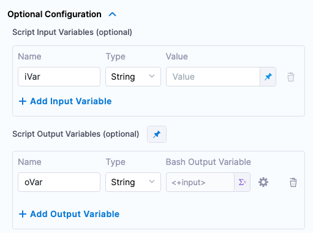
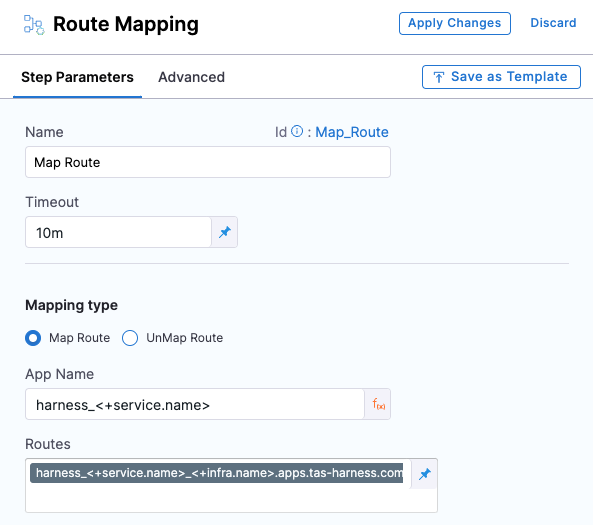
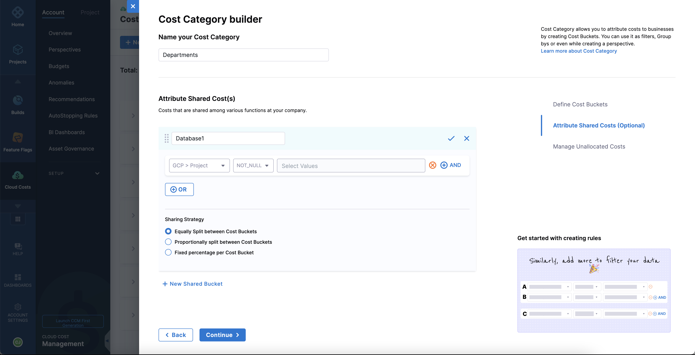

```mdx-code-block
import Tabs from '@theme/Tabs';
import TabItem from '@theme/TabItem';
```
```mdx-code-block
import delete_project from './static/delete-project.png'
```

<DocsButton icon = "fa-solid fa-square-rss" text="Subscribe via RSS" link="/release-notes/whats-new/rss.xml" />

Review the notes below to learn about the new features that are Generally Available (GA) across all Harness modules and the Harness Platform. For FirstGen release notes, go to [Harness SaaS Release Notes (FirstGen)](/docs/first-gen/firstgen-release-notes/harness-saa-s-release-notes). Additionally, Harness publishes security advisories for every release. Go to the [Harness Trust Center](https://trust.harness.io/?itemUid=c41ff7d5-98e7-4d79-9594-fd8ef93a2838&source=documents_card) to request access to the security advisories.

:::info note
Harness deploys changes to Harness SaaS clusters on a progressive basis. This means that the features described in these release notes may not be immediately available in your cluster. To identify the cluster that hosts your account, go to the **Account Overview** page.
:::
## Latest - August 02, 2023

### Cloud Cost Management

* AWS AutoStopping proxy enhancement (CCM-13497)

  You can now select the subnet ID from the dropdown list for AWS AutoStopping proxy creation. 

    <docimage path={require('./static/ccm-subnet-proxy.png')} width="60%" height="60%" title="Click to view full size image" />

* **Perspective Preferences** enhancement (CCM-11145)

  Perspective preferences provide you the flexibility to control which cost factors are considered in your billing and CUR (Cost and Usage Report) reports within your perspective. You can now include cost factors such as discounts, taxes, and refunds. For more information, go to [Perspective Preferences](../docs/cloud-cost-management/3-use-ccm-cost-reporting/1-ccm-perspectives/perspective-preferences.md).

 
:::important note
 The current configurations for **Show others** and **Show unallocated cost in clusters** are preserved. This means that though the default settings have these preferences set to false, any _existing perspective_ with these preferences set to true will retain their current state and not be overridden.
:::

* Improved UI handling during the AutoStopping rule creation process (CCM-13527)

  The page on which users select either a load balancer or an AutoStopping Proxy has been enhanced to include an additional API that retrieves information about proxies created previously in shared VPCs. Now users can use a proxy created in a shared VPC across projects and connectors.

* **Overview** page enhancements (CCM-13326)

  - The pie chart now shows a hover state. 
  - The forecast trend in the widget is removed.
  - Added forecast time period in the forecast cost widget.
  - Changed the heading of the cloud cost widget from `Top AWS accounts` to `Top 10 AWS accounts`.

    <docimage path={require('./static/ccm-overview-1.png')} width="60%" height="60%" title="Click to view full size image" />
    <docimage path={require('./static/ccm-overview-2.png')} width="60%" height="60%" title="Click to view full size image" />
    <docimage path={require('./static/ccm-overview-3.png')} width="60%" height="60%" title="Click to view full size image" />

## Previous releases

<details>
<summary>2023 releases</summary>

#### July 31, 2023

##### Self-Managed Enterprise Edition, version 79819

- Harness now supports external self-managed databases for high availability. (SMP-1577, SMP-1617, SMP-1645, SMP-1646)

  To learn how to configure an external self-managed database, go to the following tutorials.

  - [MongoDB](/tutorials/self-managed-enterprise-edition/use-an-external-self-managed-mongodb/)
  - [PostgreSQL](/tutorials/self-managed-enterprise-edition/use-an-external-postgres-database/)
  - [Redis](/tutorials/self-managed-enterprise-edition/use-an-external-redis-database/)
  - [TimescaleDB](/tutorials/self-managed-enterprise-edition/use-an-external-sm-timescaledb/)

#### July 28, 2023

##### Continuous Integration, version 5106

* **Eliminate unnecessary connection tests for GitHub connectors. (CI-7902, ZD-43391)**
   * Harness regularly runs automatic connection tests for your GitHub connectors. Previously, Harness would continue to run these tests even if the tests were failing repeatedly. Now, if the connection test fails due to an authorization issues with GitHub credentials, Harness stops checking the connector until you update the connectors's credentials. This eliminates unnecessary testing that could cause LDAP user accounts in AD to become locked, due to excessive failed access attempts, if a connector's personal access token was associated with an specific user's account.
   * To restart the connection tests, you must edit the [GitHub connector settings](/docs/platform/Connectors/Code-Repositories/ref-source-repo-provider/git-hub-connector-settings-reference) to add new credentials or trigger a connection test with existing, reinstated credentials. Updating the connector settings triggers a connection test, and, if this connection test succeeds, Harness resumes regular testing.
* **Build status links on Azure Repos PRs. (CI-8356, ZD-45085)**
   * Builds triggered by PRs in Azure Repos now include a **Details** link in the PR that you can follow to the [Build details page](/docs/continuous-integration/use-ci/viewing-builds#source-code-repository-links) in Harness.
* **Upload artifacts to Sonatype Nexus.**
   * You can use the **Nexus Publish** Drone plugin to [upload artifacts to Sonatype Nexus](/docs/continuous-integration/use-ci/build-and-upload-artifacts/upload-artifacts-to-sonatype-nexus).

#### July 27, 2023

##### Harness Platform, version 80022

- Earlier, when an administrator enabled the account-level two-factor authentication (2FA) setting, users were affected in the following way:
  1. Users who had elected to use that account as their default account received 2FA emails, and the user-level 2FA setting was enabled in all their profiles. The users were not allowed to disable the setting.
  2. Harness made the user-level setting available  only when an administrator disabled the account-level setting subsequently. Even then, the user-level 2FA setting remained enabled, and users continued to receive a 2FA challenge until they manually disabled the user-level setting in their profiles. (PL-39507, ZD-46268)

  This behavior has been remediated. When an administrator enables the account-level 2FA setting, Harness sends the users 2FA emails but does not enable the user-level 2FA settings. Users are free to enable or disable the user-level setting in their profiles. When a user attempts to log in to their Harness account, Harness presents them with a 2FA challenge only if one or both of the settings (the account-level setting and the user-level setting) are enabled. If both settings are disabled, Harness does not present a 2FA challenge.

- If you attempt to delete a project or organization that includes resources from other Harness modules, Harness first prompts you to confirm the delete action and then prompts you to enter the name of the project or organization. This two-step procedure gives you an opportunity to consider the impact that your action might have on other modules. (PL-32376, ZD-42691)

- Delegate selection logs now include the `DelegateId`, `DelegateName`, and `hostname`. (PL-37913)
  This item is available with Harness Platform version 80022 and does not require a new delegate version. For information about Harness Delegate features that require a specific delegate version, go to the [Delegate release notes](/release-notes/delegate).

- You can now configure the `create_namespace` Terraform parameter to disable default namespace creation. Set the parameter to `false` in the `main.tf` file to disable namespace creation. (PL-39822, ZD-47021)
  This item is available with Harness Platform version 80022 and does not require a new delegate version. For information about Harness Delegate features that require a specific delegate version, go to the [Delegate release notes](/release-notes/delegate).

##### Continuous Delivery, version 80022

- You can now edit Git details after the pipeline is configured and saved. This can be very useful in Git Experience workflows. For example, this enables you to move your YAML configs from one location to another in your Git configs repositories. (CDS-66621)

  The following Git settings can be modified through the Harness UI: 
  - Git connector
  - Repository
  - YAML path

##### Feature Flags

* When specifying percentages for a rollout, the UI now provides feedback while you edit to let you know the percentage that requires assignment. (FFM-8085)

#### July 18, 2023

##### Harness Platform, version 79916

- The Go library has been upgraded from 1.20.4 to 1.20.5. (PL-39700)

  The upgrade fixes the following CVEs:
  - [CVE-2023-29402](https://nvd.nist.gov/vuln/detail/CVE-2023-29402)
  - [CVE-2023-29403](https://nvd.nist.gov/vuln/detail/CVE-2023-29403)
  - [CVE-2023-29404](https://nvd.nist.gov/vuln/detail/CVE-2023-29404)
  - [CVE-2023-29405](https://nvd.nist.gov/vuln/detail/CVE-2023-29405)

- An AI-powered chatbot named Ask AIDA has been integrated to make searches within the Harness Docs. You can access the chatbot by clicking the icon located at the bottom-right corner of the screen. (PL-39613)

- You can now view delegate logs when validating a connector that uses a delegate to establish connections. (PL-37919)

- Previously, when password-based authentication was used with OAuth, the functionality of auto-accepting invites was not available. Now, when Oauth is enabled for an account, invites are automatically accepted. (PL-31936, ZD-40182)

- User names cannot exceed 256 chars. (PL-21254)
  
- The List Tokens API now supports listing all the personal access tokens or service account tokens in the account. The API has been enhanced as follows:
  
  If you have user management permissions, you can list all the personal access tokens in your account. You can also filter tokens belonging to a user or filter only active tokens.

  If you have service account management permissions, you can list all the service account tokens in your account. You can also filter tokens for a service account or filter only active tokens. (PL-31870, ZD-40110)

This item requires Harness Delegate version 79904. For information about features that require a specific delegate version, go to the [Delegate release notes](/release-notes/delegate).

##### Continuous Delivery, version 79916

- Custom webhook triggers using with the X-Api-Key header now follow role-based access control.  (CDS-73127)

  The trigger execution checks if the provided API key has the necessary permissions for accessing entities and orverriding deployment freeze.

  The expression `<+pipeline.triggeredBy.name>` has been fixed to contain the user name mapped to the API key.

- Retrieve the current status of the looping strategy for stages and steps during execution. (CDS-69780)
  
  New built-in Harness expressions provide the current execution status of the looping strategy for nodes (stages/steps) using a matrix or repeat strategy.
  
  The statuses of the nodes (stages/steps) using a looping strategy are `RUNNING`, `FAILED`, `SUCCESS`.

  The list of expressions include:
  
  - `<+strategy.currentstatus>`
  - `<+strategy.node.strategy_node_identifier.currentstatus>`
  - `<+strategy.node.get("strategy_node_identifier").currentstatus>`
  - `<+strategy.identifierpostfix>`
  - `<+step.identifierpostfix>`
  - `<+stage.identifierpostfix>`
  - `<+stepgroup.identifierpostfix>`
  - `<+strategy.node.strategy_node_identifier.identifierpostfix>`
  - `<+strategy.node.strategy_node_identifier.*>`

  For information on using the expressions, go to [Strategy](https://developer.harness.io/docs/platform/variables-and-expressions/harness-variables/#strategy).

- Support for expressions in remote Terraform Var files hosted on Github and S3. (CDS-68612, ZD-43917, ZD-45714)
  
  This feature requires the latest delegate version, 79904, to display console logs during execution correctly.

##### Harness Delegate, version 79904

- The Splunk connector has been enhanced to include support for Bearer Token. (OIP-598)

- The List Tokens API now supports listing all the personal access tokens or service account tokens in the account. The API has been enhanced as follows:
   1. If you have user management permissions, you can list all the Personal Access Tokens in your account. You can also filter tokens belonging to a user or filter only active tokens.
   2. If you have service account management permissions, you can list all the service account tokens in your account. You can also filter tokens for a service account or filter only active tokens. (PL-31870, ZD-40110)

#### July 13, 2023

##### Cloud Cost Management, version 80102

* Recommendations page UI enhancement (CCM-12693)

 The **Include** dropdown on the **Recommendations** page has been removed. Instead, the following toggle options have been added in the Filter panel as shown in the screenshots below: 

  - Show Recommendations on Parent resource
  - Show Recommendations on Child resource
  - Show Recommendations on resources added to the IgnoreList

By default, the first two options are enabled, and you can modify the toggles to customize the list filtering.

&nbsp <docimage path={require('./static/ccm-toggle-options-recommendations-filter.png')} width="40%" height="40%" title="Click to view full size image" />
   
  <docimage path={require('./static/ccm-tooltip-recommendations.png')} width="60%" height="60%" title="Click to view full size image" />

#### July 07, 2023

##### Cloud Cost Management, version 80002

* Azure VM recommendations (CCM-13142)

  Now, the recommendations are computed based on both **Memory Utilization** data and the existing **CPU Utilization** tracking data.

* Budget Sorting Enhancement (CCM-10948)

  This enhancement allows you to conveniently sort budgets alphabetically in Harness CCM. You can now browse and navigate through budgets more efficiently.

* Recommendations enhancement (CCM-11665)

  You can now easily move recommendations from the **Applied** state back to the **Open** state. This enhancement allows you to easily rectify accidental closure of recommendations or marking Jira tickets as done by returning them to an actionable state.

#### July 06, 2023

##### Continuous Delivery, version 79811

- Template Library: Reference specific versions of a template on a different branch from the pipeline (CDS-69774)
  
  While using Harness Git Experience for pipelines and templates, you can now link templates from specific branches.
  
  Previously, templates were picked either from the same branch as the pipeline, if both pipelines and templates were present in the same repository, or from the default branch of the repository, if templates were stored in a different repository than the pipeline.
  
  The default logic will continue to be used if no branch is specified when selecting the template, but if a specific branch is picked while selecting the template then templates are always picked from the specified branch only.

##### Harness Platform, version 79811

- Harness now allows special characters in usernames. (PL-39564, ZD-46487)
- You can now view delegate logs when validating a connector that uses delegates to establish connections. (PL-37919)
- When creating Azure Key Vault, you can now manually enter the vault name. (PL-32773, ZD-44045)

#### July 5, 2023

##### Security Testing Orchestration, version 1.60.0

You can now set up your STO scan images and pipelines to run scans as non-root and establish trust for your own proxies using self-signed certificates. This workflow supports any STO-compatible scanner that can run natively without root access. This workflow also supports build environments that use a self-signed proxy server between the Harness Delegate and the Harness Manager.

For information on how to set up this workflow, go to [Configure STO to Download Images from a Private Registry](/docs/security-testing-orchestration/use-sto/set-up-sto-pipelines/download-images-from-private-registry).

#### June 30, 2023

##### Cloud Cost Management

* Azure inventory management (CCM-12676)

  As part of the Azure inventory management, now you can monitor the **Memory Utilization** data for virtual machines (VMs) along with the existing **CPU Utilization** tracking data.

* Clone AutoStopping rules (CCM-12337)

  You can now clone an AutoStopping rule. To clone a rule, navigate to the rule you want to replicate and select the **Clone** option from the more options menu. After you choose the Clone option, you can update the instance details according to your requirements. This allows you to create a new rule based on the existing one, saving you time and effort in setting up similar rules for different instances.

* Budget alert enhancements

  - The cost alerts for daily budgets are now triggered on an hourly basis. Previously, cost alerts for daily budgets were triggered only at specific intervals, which could potentially result in delayed notifications if the threshold was crossed outside those intervals. However, with the increased frequency, you can now receive timely alerts as soon as the threshold is exceeded, regardless of the time of day. (CCM-12028)
  - Significant improvements have been made to the Slack budget alert messages for both budgets and budget groups. Now, when receiving a budget alert, you will find detailed information related to the perspective from which the budget was created, the allocated budget amount, the current spend, and the forecasted spend. (CCM-12647)

      <docimage path={require('./static/ccm-budget-slack-msg.png')} width="60%" height="60%" title="Click to view full size image" />

      <docimage path={require('./static/ccm-budget-grp-slack-msg.png')} width="60%" height="60%" title="Click to view full size image" />

#### June 28, 2023

##### Continuous Delivery, version 79714

- JSON support for expressions. (CDS-73057)
  
  Harness has introduced support for writing expressions by using any JSON parser tool. You can now obtain an execution JSON for all stages or individual steps of your pipeline.
  
  To access the JSON, you must enable the **Enable JSON Support for expressions** setting first. Go to **Account Settings > Account Resources > Pipeline > Enable JSON Support for expressions**, and then set the value to `true`. Enabling this setting allows you to reference JSON parsers within expressions. This setting is turned off by default.

  For more details, go to [Writing expressions using any JSON parser tool](/docs/platform/variables-and-expressions/expression-v2/).
- Added tooltip and banner to provide more information about webhook payloads. (CDS-53874)
  
  <docimage path={require('./static/payload-input.png')} width="60%" height="60%" title="Click to view full size image" />  

##### Harness Platform, version 79714

- There is now a limit of 100 API Tokens per free and community account. (PL-39337)

- When configuring SMTP, you can now select specific delegates in **Delegates Setup**. (PL-39288)

- You can now sort pipelines in the pipelines list by selecting the sortable column headers or the sort dropdown. (PL-31527)

##### Harness Delegate, version 79707

- You can now see disconnected delegate details in selection logs and error messages when there are no eligible delegates in an active state to execute tasks. (PL-37900)

- Upgraded the delegate JRE to 11.0.19_7. (PL-37994)

- When a delegate token is revoked, Harness now sends `SELF_DESTRUCT` to all delegates that are using the revoked token. (PL-38957)

#### June 21, 2023

##### Cloud Cost Management, version 79803

* Added a tooltip on the **Cloud Integration** page. (CCM-12559)

  In the **Cloud Integration** page, if the connector data is unavailable, the **View costs** link is disabled. However, as soon as the data becomes available, the link is enabled. Now, a tooltip providing a concise explanation as to why the link is disabled appears when you hover over the disabled link. 
  
* Asset Governance filter panel enhancement. (CCM-12854)

  Previously, in the **Asset Governance** > **Evaluations** page, only the target accounts with `execute` permissions were included in the **Target Accounts** field in the filter panel. Now, this functionality is enhanced so that all target accounts with `view` permissions are also included in the list. 

#### June 19, 2023

##### Continuous Integration, version 4204

The Harness Cloud Linux amd64 image has new major and minor versions for multiple components. Major version upgrades are described below. For a complete list of component versions, go to the [Harness Cloud image specifications](/docs/continuous-integration/use-ci/set-up-build-infrastructure/use-harness-cloud-build-infrastructure/#platforms-and-image-specifications). (CI-7537)

:::caution

If you have pipelines running on Harness Cloud that rely on specific component versions, you might need to [lock versions or install additional tools](https://developer.harness.io/docs/continuous-integration/use-ci/set-up-build-infrastructure/use-harness-cloud-build-infrastructure/#lock-versions-or-install-additional-tools) to prevent your pipeline from failing due to image changes.

:::

<details>
<summary>Major version upgrades for the Harness Cloud Linux amd64 image</summary>

| Component | Previous version | Current version |
| --------  | ---------------- | --------------- |
| Homebrew | 3.6.3 | 4.0.17 |
| Miniconda | 4.12.0 | 23.3.1 |
| Lerna | 5.5.2 | 6.6.2 |
| Bazel | 5.3.1 | 6.1.2 |
| Docker-Moby Client | 20.10.18 | 23.0.6 |
| Docker-Moby Server | 20.10.18 | 23.0.6 |
| Heroku | 7.63.4 | 8.1.3 |
| Kustomize | 4.5.7 | 5.0.2 |
| Google Cloud SDK | 403.0.0 | 428.0.0 |
| Netlify CLI | 12.0.0 | 15.0.2 |
| ORAS CLI | 0.15.0 | 1.0.0 |
| Vercel CLI | 28.4.4 | 29.1.1 |
| Google Chrome | 106.0.5249.61 | 113.0.5672.92 |
| ChromeDriver | 106.0.5249.21 | 113.0.5672.63 |
| Chromium | 106.0.5235.0 | 113.0.5672.0 |
| Microsoft Edge | 105.0.1343.53 | 113.0.1174.35 |
| Microsoft Edge WebDriver | 105.0.1343.53 | 113.0.1774.35 |
| Android Command Line Tools | 7.0 | 9.0 |
| Android Emulator | 31.3.11 | 32.1.12 |
| Android SDK Platform-Tools | 33.0.3 | 34.0.1 |

</details>

##### Continuous Delivery, version 79606

- Harness variables now have a **Required** setting. (CDS-69710)
  
  A **Required** setting is now added to both the API, Harness Manager, and YAML variable settings. 

  <docimage path={require('./static/0bf162c7149b298e69fb52a15588e994357d3b0cf283c9146b6a0f0dac0deccd.png')} width="60%" height="60%" title="Click to view full size image" />  

  When enabled, a variable with no value returns an error at pipeline runtime.  

  <docimage path={require('./static/153beccc9216340c35b3e2ca53ad81a35ec15e8b4621cd0402f0adc8372acc45.png')} width="60%" height="60%" title="Click to view full size image" />
  
  The **Required** options is also enforced when the variable is defined in a template and the template is included in a pipeline. 
  
  This feature is supported for pipeline, stage, service, and environment variables.
- Select a Git branch when executing a pipeline that uses Git Experience. (CDS-68007, ZD-42205, ZD-42453)
  
  For pipelines that use Harness Git Experience (also called **remote pipelines**), you can select what Git branch to use when running the pipeline.  

  <docimage path={require('./static/47ce888b8bd290e2d68db294eae373c08dc6185f1e66f6aad00b65f136dda1df.png')} width="60%" height="60%" title="Click to view full size image" />  

##### Harness Platform, version 79606

- In earlier releases, users were allowed to include the following special characters in the user name field in their profile: colon (`:`), slash (`/`), less than sign (`<`), greater than sign (`>`), equal sign (`=`), and parentheses (`(` and `)`). Support for these special characters allowed malicious users to inject HTML and JavaScript code into deployment-related emails such as approval emails. (PL-39099)

  For enhanced security, Harness no longer allows a user to include these special characters in their name. If an existing user name has any of these special characters, Harness does not include the special characters when adding the name to emails.

- Free and Community accounts are now limited to 100 connectors. (PL-32654)

- The dialog for adding an encrypted text secret now includes an option to test a referenced secret. (PL-31083) 

- The dialog that enables you to select a connector did not list connectors in any order. (PL-27568)

  This release adds a menu that you can use to sort the listed connectors in various ways (for example, by name or by date).

- In earlier releases, you could change the Git branch only in Pipeline Studio. (CDS-68007)

  Starting with this release, you can also change the branch in the dialog for running a pipeline. You can also run the pipeline from any branch directly from the pipeline listing page.

#### June 14, 2023

##### Self-Managed Enterprise Edition, version 79230

- Harness updated the following images to use versioned tags: (SMP-1347)

   - docker.io/harness/sto-plugin:1.12.0
   - docker.io/curlimages/curl:8.1.1

- The `PRUNE_KUBERNETES_RESOURCES` feature flag is now disabled by default. (SMP-1359)

- Redis images and the GitOps Redis agent are upgraded to 6.2.12-alpine. (SMP-1402)

#### June 09, 2023

##### Continuous Error Tracking, version et-service 5.23.0

- Now, when you create a Jira ticket for an event, CET prompts you to complete any mandatory fields that do not have a default value. (CET-1231)

- You can now conveniently access a comprehensive list of all active agents running across your entire account directly from the subscription page. (CET-1225)

##### Harness Platform, version 79516

- There is now an additional tab on the **Create or Select Existing Connector** dialog called `All` that lists connectors from all scopes (project, organization, and account). (PL-39029)

- The Go library has been upgraded from version 1.19.8 to 1.20.4. (PL-39026)

- You can now delete externally managed users from the Harness UI. (PL-38974)

  Harness recommends using this action with caution since it may result in data inconsistencies between Harness and the identity provider.

- The Go library for yq has been upgraded from version 1.19.8 to 1.20.4. (PL-38952)

- On your profile, you can now access projects by selecting project cards. (PL-38570)

- Secret references now have a validate button to verify if the path is valid. (PL-31083)

##### Continuous Delivery, version 79516

- Added expressions to retrieve the current execution status of the [looping strategy](https://developer.harness.io/docs/platform/pipelines/looping-strategies-matrix-repeat-and-parallelism/) for nodes (stages/steps) using a matrix or repeat strategy. (CDS-69780)
  
  The statuses of the nodes (stages/steps) using a looping strategy are `RUNNING`, `FAILED`, `SUCCESS`.
  
  Harness has introduced the following expressions to retrieve the current status of the node (stage/step) using a looping strategy: 
  * `<+strategy.currentStatus>`: Retrieves the current status of the node with the maximum depth.
  * `<+strategy.node.[strategyNodeIdentifier].currentStatus>`: Retrieves the current status of the node with a specific stage/step identifier, `strategyNodeIdentifier`. For example, `echo <+strategy.node.cs1.currentStatus>`.
  * `<+strategy.node.get("[strategyNodeIdentifier]").currentStatus>`: Retrieves the current status of the node with a specific stage/step identifier, `strategyNodeIdentifier`. For example, `echo <+strategy.node.get("ShellScript_1").currentStatus>`.
- If any entities referenced in a pipeline are updated, a warning now appears in Pipeline Studio saying that reconciliation is needed. Previously, this warning appeared only when you manually tried to reconcile. (CDS-69672)
- The Harness Approval step now supports scheduled automatic approvals. (CDS-69415)
  
  For more information, go to [Harness Approval steps in CD stages](https://developer.harness.io/docs/continuous-delivery/x-platform-cd-features/cd-steps/approvals/using-harness-approval-steps-in-cd-stages/).
- Edit Git details for pipelines stored using Harness Git Experience. (CDS-69130)
  
  You can now edit the Git metadata in the pipelines and input sets you use in your Git-synced Harness pipelines.

  You can edit the Harness Git connector, repository, and path to the YAML file.

  To edit the Git details, select **Edit Git Metadata** in the pipelines and input sets listing pages. 

  <docimage path={require('./static/d3ae175d36c932027045989f3c6d5b8b35ff3f50d7dec64195f1e1a264b4f577.png')} width="60%" height="60%" title="Click to view full size image" />  

  <docimage path={require('./static/87cae6dd20947c866629d225293d41ad83be7848061537e28efd2def8e14ea48.png')} width="60%" height="60%" title="Click to view full size image" />
- Support has been added to view long expressions in YAML view. (CDS-59017)
  
  Previously, in the YAML view, suggestions for long expressions ended with an ellipsis, and the entire expression didn't appear properly.
  
  The suggestions widget is now updated with a read more icon. You can select the icon or use Ctrl + Space to view the complete expression string. The read more icon appears only for the active suggestion item. You can use the Up and Down arrow keys to switch between different suggestion items.
- Send emails to non-Harness users. (CDS-58625, ZD-42496)
  
  To send emails to non-Harness users, you must configure your own SMTP server and enable the **Enable Emails to be sent to non-Harness Users** default setting. This setting is available at Account, Org, and Project levels.

  For more information on how to send emails to non-Harness users, go to [Email step reference](https://developer.harness.io/docs/continuous-delivery/x-platform-cd-features/cd-steps/utilities/email_step/).

  Harness Delegate version 79503 is required for this feature.
- Use labels for matrix naming strategy. (CDS-68030)
  
  To use the matrix labels naming strategy, do the following: 
  1. In Harness, select **Account Settings**.
  2. Select **Account Resources**, and then select **Pipeline**.
  3. Set **Enable Matrix Labels By Name** to `true`.
  4. Select **Save**.

  This option is available at the project, org, and account level.

##### Harness Delegate, version 79503

- Kubernetes deployments support horizontal pod autoscaling and pod disruption budget for Blue Green and Canary execution strategies. (CDS-59011)

- Converted Harness CD from an explicit to an implicit change source for Service Reliability Management. (SRM-14724)

##### Cloud Cost Management, version 79601

**Cost Category enhancement** (CCM-12585)

  When building a cost category, it is now possible to incorporate another cost category as a rule. However, there are important considerations to keep in mind when using a cost category within your rule. 
  
   * You cannot include a nested cost category as a rule within another cost category if either of these cost categories contains a shared bucket.
   * You cannot add the same cost category as a rule in the cost bucket.
   * You cannot create cyclic nested cost categories, where a cost category is nested within each other.
   * You can nest cost categories to a maximum of 20 levels.
  
#### June 08, 2023

##### Security Testing Orchestration, version 1.57.4

* Added the existing Typescript scanning library to Sonarqube scans so that Typescript is always supported. (STO-6007)
* Added a `product_zip_max_size` setting to Checkmarx scans that enable you to override the maximum size of ZIP files uploaded to the STO pipeline (the default size is 200 MB). To override this setting in a Checkmarx scan step, add the `product_zip_max_size` setting and value (in MB) under **Settings (*optional*)**. (STO-5991)

  

#### June 01, 2023

##### Service Reliability Management, version 79413

- Now a summary of changes related to the number of feature flags and chaos experiments is also displayed on the Monitored Service listing page, along with the other custom change sources. (SRM-14742)

##### Continuous Delivery, version 79411

- Edit Git details for pipelines stored using Harness Git Experience. (CDS-69130)
  
  You can now edit the Git metadata in the pipelines and input sets you use in your Git-synced Harness pipelines.

  You can edit the Harness Git connector, repository, and path to the YAML file.

  To edit the Git details, select **Edit Git Metadata** in the pipelines and input sets listing pages. 

  <docimage path={require('./static/d3ae175d36c932027045989f3c6d5b8b35ff3f50d7dec64195f1e1a264b4f577.png')} width="60%" height="60%" title="Click to view full size image" />  

  <docimage path={require('./static/87cae6dd20947c866629d225293d41ad83be7848061537e28efd2def8e14ea48.png')} width="60%" height="60%" title="Click to view full size image" />

- Step group templates can now be used in custom and deploy stages. (CDS-68210, ZD-43059)
  
  The same step group template can be used in a **Custom** or **Deploy** stage type.

  <docimage path={require('./static/64a3aee31250b15c98b4978994ca1ff14e720b2d739c8feec72fdee12d6220a7.png')} width="60%" height="60%" title="Click to view full size image" />

  The same step group template can be used in both **Custom** or **Deploy** stage types if the step group does not contain steps that are specific to the **Deploy** stage type.

- New default Git connector for Git Experience (CDS-66921)

  You can now set the default Git connector for Git Experience pipelines and input sets. The default Git connector will be selected whenever you create or import operations with the Git Experience entities. The default connector can be changed at any time and another connector can be used when needed.

  You can select the default connector in your project, org, or account **Default Settings**:

  <docimage path={require('./static/abb924b38a23ab57c26b3703d7c38e096eb60005625a6dfcd42793d503553a6e.png')} width="60%" height="60%" title="Click to view full size image" />

- Approval step notifications. (CDS-31886, ZD-43905)
  
  Notifications are sent once a Harness [Approval step](https://developer.harness.io/docs/category/approvals) is approved or rejected. Harness sends the approval details along with the status.

  Notifications are sent to the destinations set up in the user group(s) listed in the Approval step's **Approvers** setting. This includes email, Slack, PagerDuty, and MS Teams.

  <docimage path={require('./static/fa61423c00604c9a2d1dcf3cd2e8c040d71992791e34abf983eb5befe8640159.png')} width="60%" height="60%" title="Click to view full size image" />

  For information on setting up notifications for user groups, go to [Add and manage user groups](https://developer.harness.io/docs/platform/User-Management/add-user-groups).

##### Harness Platform, version 79411

- You can now fetch the list of delegates registered to an account using the Harness API. You can also filter these by scope, tags, status, and version. (PL-37981, ZD-40508,40688)

   This item is available with Harness Platform version 79411 and does not require a new delegate version. For information about Harness Delegate features that require a specific delegate version, go to the [Delegate release notes](/release-notes/delegate).

- You can now use the legacy UI to create delegates. (PL-38937)

   This item is available with Harness Platform version 79411 and does not require a new delegate version. For information about Harness Delegate features that require a specific delegate version, go to the [Delegate release notes](/release-notes/delegate).

- You can now see the total number of secrets in the secrets list and sort them by various columns. (PL-31528)

#### May 29, 2023, version 79505

##### Cloud Cost Management

**Azure VM recommendations**

  Introducing Azure VM recommendations that identifies idle or under utilized VMs, ensuring efficient resource allocation and significant cost savings. For more information, go to [Azure recommendations](https://developer.harness.io/docs/cloud-cost-management/use-ccm-cost-optimization/ccm-recommendations/azure-vm/).

#### May 25, 2023 

##### Security Testing Orchestration, version 1.54.1

* This release includes new scanner templates, with simplified UIs and workflows, for the following scanners. (STO-5990)

  * [AWS ECR](/docs/security-testing-orchestration/sto-techref-category/aws-ecr-scanner-reference)
  * [AWS Security Hub](/docs/security-testing-orchestration/sto-techref-category/aws-security-hub-scanner-reference)
  * [Brakeman](/docs/security-testing-orchestration/sto-techref-category/brakeman-scanner-reference)
  * [Custom Ingest](/docs/security-testing-orchestration/sto-techref-category/custom-ingest-reference)
  * [Nikto](/docs/security-testing-orchestration/sto-techref-category/nikto-scanner-reference)
  * [Nmap](/docs/security-testing-orchestration/sto-techref-category/nmap-scanner-reference)
  * [OWASP](/docs/security-testing-orchestration/sto-techref-category/owasp-scanner-reference)
  * [Prowler](/docs/security-testing-orchestration/sto-techref-category/prowler-scanner-reference)

* The **Account Settings** > **Subscriptions** page has a new **Activity & Usage** section that shows the number of security scans and user activity over the past 30 days. (STO-4942)

* This release includes a minor UI update. In **Security Tests** > **Details**, the **Exempt** button has been renamed to **Request Exemption** to make the button's purpose more clear. (STO-5928)

#### May 23, 2023, version 79307

##### Service Reliability Management

- Continuous Error Tracking (CET) is a separate module in Harness now and no longer available as a health source in SRM. To learn more about CET, go to the [Continuous Error Tracking Documentation](https://developer.harness.io/docs/continuous-error-tracking). (SRM-14701)

- Clicking on a Prometheus metrics entry in the Service Health page of a monitored service directly navigates you to the Prometheus metrics dashboard. (SRM-14699)

- In the event of an SLO encountering an error, it is now displayed in the respective Simple and Composite SLOs. Additionally, when the underlying issue causing data collection failures is resolved, the missed data that couldn't be collected during the error period will be restored. However, there is a time limit for data restoration, which is set at 24 hours. For example, if the issue is resolved within 48 hours, only the last 24 hours of data is restored. (SRM-14672)

- Verify step in CV has a new icon. (OIP-3)

- You can now configure your monitored service to trigger notifications whenever there are updates or changes related to chaos experiments or feature flags. (SRM-14553)

- New errors are introduced to provide a comprehensive insight into SLO's performance (SRM-14549).  
  
  Now, errors are displayed in the following scenarios:
  
  - Ongoing Problem: Errors are displayed when an SLO experiences an ongoing problem, such as an issue with the health of a connector.
  
  - Missing Data: Errors are shown when there is missing data in an SLO, even if there is no current error. This helps identify any gaps in historical SLO records.
  
  - Contributing SLO Issues: Errors in contributing SLOs are now reflected in the composite SLO, ensuring a complete picture of performance when individual components encounter problems.

#### May 23, 2023, version 79306

##### Continuous Integration

Added support for showing artifacts on the **Artifacts** tab in Harness Cloud and VMs. (CI-7218)

Previously, this was supported only for Kubernetes builds. The artifacts are visible on the execution **Artifact** tab and the artifact details are visible on the step output window. 

##### Harness Platform

* The **Connector Details** page now shows whether a connector is connected via a delegate or via Harness Platform. (PL-32673)

* When steps or stages fail with a **Ignore Failure** strategy, their status is displayed as **Success (Failure Ignored)** instead of **Failed**. (CDS-67670)

* You can now reject old executions waiting on approval when new ones are approved by using the **Auto-Reject previous deployments paused in this step on approval** option in the **Harness Approval** step. (CDS-58063)

* You can now view the most recent delegate task details and their corresponding selection logs for approvals.
The details of the latest delegate task are automatically updated. (CDS-57927)
  
  You can view task details for the following:
  - ServiceNow
  - Jira
  - Custom Approvals

* A warning now appears if you try to save a template with an existing identifier and an updated version label. This warns you that it will be merged with the existing template (upon confirmation). (CDS-47301)

* The Azure Key Vault secret manager now supports creating secrets with expiration dates. Select **Expires On** to set secret expiration date. The Harness Delegate version 79307 is required for this feature. (PL-32708, ZD-42524)

* AuthZ now considers the SAML setting that the user logged in to when multiple SAML settings are present and the user belongs to more than one of them. The user will be removed from any other SAML settings that the same user might have been part of and synced with Harness through previous SAML logins. (PL-32484) 

##### Continuous Delivery

- Support for the **Enforce Git experience for pipelines and templates** Git experience. (CDS-67885)
  
  A new Git experience is introduced, **Enforce git experience for pipelines and templates**. Enabling this setting will let you create only remote pipelines and templates. If this setting is enabled, then the `InputSet` will be out of scope as it is controlled by the pipelines. 
- Failed steps or stages with failure strategy set as **Ignore Failure** display the status as **Success**. (CDS-67670, ZD-40157)
  
  When you set the failure strategy to **Ignore Failure**, the failure of the steps or stages are ignored and marked as success instead of failed. 
- Added support to provide quartz cron expressions for scheduled triggers. (CDS-59261, CDS-59260)
  
  The Harness Delegate version 79307 is required for this feature. 
  
  For more information, go to [Schedule pipeline using triggers](/docs/platform/triggers/schedule-pipelines-using-cron-triggers/).
- Support for creating or updating a variable of type, secret in the Update Release Repo step is now removed. (CDS-58530)
  
  For example, adding a variable of the type, secret in an environment will no longer create any entry in the `config.js` file via the Update Repo Step. 
  
  Support for all such cases are now ignored by Harness. 
- Users can now add input variables of all types when adding an HTTP step from the Harness UI. (CDS-58376)
  
  For more information, go to [Input variables](/docs/continuous-delivery/x-platform-cd-features/cd-steps/utilities/http-step/#input-variables).
- The **Auto-Reject previous deployments paused in this step on approval** is added to the Approval step. (CDS-58063)
  
  With this option, you can now reject old executions waiting on approval when a latest step is approved. For more information, go to [Manual Approval steps in CD stages](/docs/continuous-delivery/x-platform-cd-features/cd-steps/approvals/using-harness-approval-steps-in-cd-stages).
- You can add metadata or [JEXL conditions](/docs/platform/pipelines/w_pipeline-steps-reference/triggers-reference/#jexl-conditions) on artifact triggers just like custom triggers. (CDS-51928)
- The `<+trigger.artifact.build>` expression now resolves with value when you rerun a failed pipeline. (CDS-50585, ZD-42193)
  
  A new API is now supported in the backend to fetch details from `planExecutionsMetadata` that has information about the tags that were used when a trigger fires a pipeline. 
- You can now use the expression, [`<+lastPublished.tag>`](https://developer.harness.io/docs/platform/triggers/trigger-on-a-new-artifact/#using-the-triggerartifactbuild-and-lastpublishedtag-expressions) if you want to deploy the last successfully published artifact version. (CDS-53512)
- Added support for accessing connector attributes for Deployment Templates. (CDS-54247)
  
  The Harness Delegate version 79307 is required for this feature.
  
  The connector attributes for Secret Manager connectors can be accessed in Deployment Templates using the following expressions. 
  
  * [AWS KMS](/docs/platform/Secrets/Secrets-Management/add-an-aws-kms-secrets-manager): `<+infra.variables.AwsKms.spec.credential.type>`
  * [AWS Secrets Manager](/docs/platform/Secrets/Secrets-Management/add-an-aws-secret-manager): `<+infra.variables.AwsSecretsManager.spec.region>`
  * [Azure Key Vault](/docs/platform/Secrets/Secrets-Management/azure-key-vault): `<+infra.variables.AzureKeyVault.spec.vaultName>`
  * [Google KMS](/docs/platform/Secrets/Secrets-Management/add-google-kms-secrets-manager): `<+infra.variables.GcpKms.spec.keyName>`
  * [Google Cloud secret manager](/docs/platform/Secrets/Secrets-Management/add-a-google-cloud-secret-manager): `<+infra.variables.GcpSecMan.spec.credentialsRef.identifier>`
  * [Custom secret manager](/docs/platform/Secrets/Secrets-Management/custom-secret-manager): `<+infra.variables.CustomSecMan.spec.isDefault>`
  * [HashiCorp Vault](/docs/platform/Secrets/Secrets-Management/add-hashicorp-vault): `<+infra.variables.HashiCorp.spec.vaultUrl>`
- A unique custom webhook token is added to the custom webhook URL when triggering a deployment using cURL. (CDS-59511, ZD-34797)
  
  Previously, custom webhook triggers used insecure URLs that can be formed as long as account, org, project, pipeline, and trigger IDs were known. Now, a unique custom webhook token is generated internally for all custom webhook triggers when they're created. This token cannot be changed. 
  
  Here's a sample cURL command with custom webhook token: 

  `curl -X POST -H 'content-type: application/json' -H 'X-Api-Key: sample_api_key' --url 'https://app.harness.io/gateway/pipeline/api/webhook/custom/{customWebhookToken}/v3?accountIdentifier=<your_account_Id>&orgIdentifier=default&projectIdentifier=CD_Docs&pipelineIdentifier=Custom&triggerIdentifier=Custom' -d '{"sample_key": "sample_value"}'`
- Git polling tasks for triggers are executed on the same delegate selector used in the Git connector. (CDS-58115)
  
  Previously, triggers used the round robin algorithm to select any available delegate within a project or account. Now, the delegate-based trigger polling selects the same delegate you used in the connectors for triggers. 

  The Harness Delegate version 79307 is required for this feature.
  

#### May 17, 2023, STO Core version 1.53.0

##### Security Testing Orchestration

* Code snippets in Security Issue details are now displayed in the UI with syntax highlighting. (STO-5959)

  

#### May 10, 2023, STO Core version 1.50.3

##### Security Testing Orchestration 

* You can now ingest ZAP scan results from both JSON and XML reports. For information about the ZAP XML report format, go to [Traditional XML Report](https://www.zaproxy.org/docs/desktop/addons/report-generation/report-traditional-xml/) in the ZAP documentation. (STO-5868)

* The Security Tests tab now renders tables from tool-provided descriptions in the **Issue Details** panel. (STO-5857)

* The UI now uses consistent terminology when referring to exemptions. All references to *ignore* and *ignored* have been updated to *exempt* and *exempted*. (STO-5749)

* The Security Testing Dashboard  includes a new **Target Type** filter. (STO-5732)

  

* The Security Tests tab now paginates results for scans that detect a lot of issues. You can set the pagination to 20, 50, or 100 issues per page. (STO-5211)

* STO now supports [looping strategies](/docs/platform/pipelines/looping-strategies-matrix-repeat-and-parallelism/) for Security Tests stages. (STO-5726)

* You can now select a high-level reason when you [request an exemption](/docs/security-testing-orchestration/use-sto/stop-builds-based-on-scan-results/exemption-workflows) for a detected issue. The **Request Exemption for Issue** dialog box includes a new **Reason** pull-down menu with a set of common reasons for exempting an issue. (STO-5730)

   

#### May 04, 2023, version 79214

##### Harness Platform

- You will now receive an alert on the default settings page when there are unsaved changes and you leave the page. (PL-32354)

##### Service Reliability Management

- An icon appears on the SLO performance trend chart timeline to indicate when the error budget was reset and the amount of budget that was added. (SRM-14550)

##### Continuous Delivery

- Trigger artifact and manifest expressions (`<+trigger.artifact.build>` or `<+trigger.manifest.version>`) are now resolved when you rerun a pipeline that was activated by a trigger. (CDS-58192, CDS-50585)
  
  Here is a sample resolved YAML: 

  ```
  {
    "status": "SUCCESS",
    "data": {
        "planExecutionId": "PimcPiwlQ56A2AhWogEM7A",
        "executionYaml": "pipeline:\n  identifier: \"asda\"\n  name: \"asda\"\n  projectIdentifier: \"test\"\n  orgIdentifier: \"default\"\n  tags: {}\n  stages:\n  - stage:\n      identifier: \"sda\"\n      type: \"Deployment\"\n      name: \"sda\"\n      description: \"\"\n      spec:\n        serviceConfig:\n          serviceRef: \"ads\"\n          serviceDefinition:\n            type: \"Kubernetes\"\n            spec:\n              variables: []\n              artifacts:\n                primary:\n                  type: \"DockerRegistry\"\n                  spec:\n                    connectorRef: \"Test\"\n                    imagePath: \"library/nginx\"\n                    tag: \"<+trigger.artifact.build>\"\n              manifests: []\n        infrastructure:\n          environmentRef: \"wew\"\n          infrastructureDefinition:\n            type: \"KubernetesDirect\"\n            spec:\n              connectorRef: \"ad\"\n              namespace: \"asd\"\n              releaseName: \"release-<+INFRA_KEY>\"\n          allowSimultaneousDeployments: false\n        execution:\n          steps:\n          - step:\n              identifier: \"sad\"\n              type: \"ShellScript\"\n              name: \"sad\"\n              spec:\n                shell: \"Bash\"\n                onDelegate: true\n                source:\n                  type: \"Inline\"\n                  spec:\n                    script: \"echo \\\"test\\\"\"\n                environmentVariables: []\n                outputVariables: []\n                executionTarget: {}\n              timeout: \"10m\"\n          rollbackSteps: []\n      tags: {}\n      failureStrategies:\n      - onFailure:\n          errors:\n          - \"AllErrors\"\n          action:\n            type: \"StageRollback\"\n",
        "inputYaml": "pipeline:\n  identifier: \"asda\"\n  stages:\n  - stage:\n      identifier: \"sda\"\n      type: \"Deployment\"\n      spec:\n        serviceConfig:\n          serviceDefinition:\n            type: \"Kubernetes\"\n            spec:\n              artifacts:\n                primary:\n                  type: \"DockerRegistry\"\n                  spec:\n                    tag: \"<+trigger.artifact.build>\"\n",
        "resolvedYaml" "pipeline:\n  identifier: \"asda\"\n  stages:\n  - stage:\n      identifier: \"sda\"\n      type: \"Deployment\"\n      spec:\n        serviceConfig:\n          serviceDefinition:\n            type: \"Kubernetes\"\n            spec:\n              artifacts:\n                primary:\n                  type: \"DockerRegistry\"\n                  spec:\n                    tag: \"1.23-perl"\n",
        "triggerPayload": {
            "type": "ARTIFACT",
            "headers": {},
            "sourcetype": "CUSTOM_REPO",
            "artifactdata": {
                "build": "1.23-perl"
            },
            "version": 0
        }
    },
    "metaData": null,
    "correlationId": "1ad40479-c6ff-47e4-9722-db11c0a3ab06"
  }
  ```
- When you abort a pipeline execution, you will now see a helpful warning text that explains the impact to the state of your service. (CDS-67000)
  
  `Warning: Abort command will not clean up any resources created during execution so far. Please mark the stage as failed if you would like to clean up and revert back to the old state.`
- You can now merge templates with identical identifiers. (CDS-47301)
  
  A warning pops up when you create a new template with already existing identifiers in the same scope. You can choose to merge the new template with the existing template by selecting the **Save as new version of existing template** button in the warning.
- When you run a pipeline, you can leave the pipeline, stage, service, and environment variable values empty in the  **Run Pipeline** form. These fields are not validated in the UI any longer. (CDS-64656, ZD-43232)
  
  

##### Continuous Integration

* The CI Getting Started workflow now saves the pipeline remotely (in your Git repository) by default. Previously, the pipeline was stored inline (in Harness) unless you manually selected remote storage. The Getting Started workflow also automatically creates two [input sets](/docs/platform/pipelines/input-sets/) for [Git event triggers](/docs/platform/Triggers/triggering-pipelines): one for a PR trigger and one for a Push trigger. (CI-7602)
* You can now reference [output variables produced by Plugin steps](/docs/continuous-integration/use-ci/use-drone-plugins/plugin-step-settings-reference#output-variables) in pipelines that use Kubernetes cluster build infrastructures. This is an addition to previously-existing support for Harness Cloud and self-hosted Cloud provider VM build infrastructures. (CI-7491)
* [Local runner](/docs/continuous-integration/use-ci/set-up-build-infrastructure/define-a-docker-build-infrastructure) and [Kubernetes cluster](/docs/continuous-integration/use-ci/set-up-build-infrastructure/k8s-build-infrastructure/set-up-a-kubernetes-cluster-build-infrastructure) build infrastructures now support pipeline- and stage-level [delegate selectors](/docs/platform/Delegates/manage-delegates/select-delegates-with-selectors). You can use pipeline and stage-level delegate selectors to override the platform or connector delegate. These selections are not supported for Harness Cloud or self-hosted Cloud provider VM build infrastructures. (CI-6237)


#### April 22, 2023, version 79111

##### Harness Platform

- You can now configure session time-out in the UI. (PL-32258)
  In case of inactivity, Harness logs users out of their accounts after the configured session timeout.

- You can now add descriptions to pipeline and stage variables. (PIE-3336)

##### Continuous Delivery

- SHA support for Artifactory (CDS-58629), ECR (CDS-58304), GCR	(CDS-56531), Nexus 3 Docker (CDS-56530), ACR (CDS-56529), Github Packages	(CDS-41930)
  
  SHA values and labels for the artifact are now visible in the Harness service **Output** section of a pipeline execution.

  <docimage path={require('./static/726cd79347c2dabba5bd47f2264f91b0b2618f872663c90048453719e87ff634.png')} width="60%" height="60%" title="Click to view full size image" />

  
  Labels are visible if the artifact manifest supports `schemaVersion1`.
  
  Labels can be referenced using the expression: `<+pipeline.stages.[stage Id].spec.artifacts.primary.label.get("labelKey")>`.
  
  Since manifests can support 2 schema versions, `schemaVersion1` and `schemaVersion2`, there could be SHA values for each schema version.
  
  Here are the expressions for referencing each version:
  - SHA value of `schemaVersion1`: `<+pipeline.stages.[stage Id].spec.artifacts.primary.metadata.SHA>`.
  - SHA value of `schemaVersion2`: `<+pipeline.stages.[stage Id].spec.artifacts.primary.metadata.SHAV2>`.
- New Harness expression for revision number. (CDS-57826)
  
  You can now use the expression `<+kubernetes.release.revision>` in values.yaml, OpenShift Params, and Kustomize Patches. This will help you to:
    - Reference the current Harness release number as part of your manifest.
    - Reference versioned ConfigMaps and Secrets in custom resources and fields unknown by Harness.
  
  **Important:** Users must update their delegate to version 1.0.79100 to use the expression.
- Deployment freeze supports quarterly recurrence.	(CDS-57792)
  
  You can now configure a deployment freeze with a recurrence of `n` months, where `n` can be between `2` to `11`.
- Use any path to [Helm charts within the Helm repository](/docs/continuous-delivery/deploy-srv-diff-platforms/helm/deploy-helm-charts). (CDS-57667, ZD-41758)
  
  You can now specify a path to Helm charts within the Helm repository and Harness will fetch the Helm chart and its subordinate charts within that folder.

  <docimage path={require('./static/70e9b1aa646408c07a6fef1ca8b6e0dfa2eef53e5f7eea3e88ac28b5a4d3e1c4.png')} width="60%" height="60%" title="Click to view full size image" />

  When you deploy, the logs will include all subcharts, like this:

  ```sh
  Successfully fetched following files:
  - Chart.yaml
  - values.yaml
  - charts/first-child/Chart.yaml
  - charts/first-child/values.yaml
  - charts/first-child/templates/deployment.yaml
  - charts/shared-lib/Chart.yaml
  - charts/shared-lib/templates/_service.yaml
  - charts/shared-lib/templates/_helpers.tpl
  - charts/shared-lib/templates/_deployment.yaml
  - templates/_helpers.tpl
  - README.md
  ```
  
  **Important:** This change impacts existing Helm services in Harness. To use this feature, you will need to update the path to your subordinate chart(s) using `charts/`.
- You can now see what deployment freeze failed a pipeline in the pipeline's execution history. (CDS-53781)
  
  We have added support to identify the associated freeze window that failed a pipeline execution. You can hover over the status of the pipeline in its execution history and the associated freeze window details are shown.

  <docimage path={require('./static/eca1e7dd02fa705e9158c78f44ab49676270e4a477cc260e817c06da91bdf631.png')} width="60%" height="60%" title="Click to view full size image" />
- Bamboo is now supported in On Artifact triggers. (CDS-51742)
  
  You can now use artifacts in Bamboo to initiate Triggers for your pipelines.

  <docimage path={require('./static/d5512549a2cb085680c609e42aef000fec60a5dc8ac6f20ee48ec31282f6f61e.png')} width="30%" height="30%" title="Click to view full size image" />
- Repository format is now supported for Artifactory artifact source templates. (CDS-59092)

  <docimage path={require('./static/61a6e0b480e05303bfc5926bec326c1555eff5ae087014c0b6a7e00a1fa94ec2.png')} width="60%" height="60%" title="Click to view full size image" />

##### Continuous Integration

* The CI Getting Started workflow leads you through creating an SCM connector and a pipeline. This workflow has been improved to generate a pipeline based on the repository you select. (CI-7603)
* The **Run as User** setting is now available for [Run steps](/docs/continuous-integration/use-ci/run-ci-scripts/run-step-settings), [Run Tests steps](/docs/continuous-integration/use-ci/set-up-test-intelligence/#add-the-run-tests-step), and [Plugin steps](/docs/continuous-integration/use-ci/use-drone-plugins/plugin-step-settings-reference) in stages that use [Harness Cloud build infrastructure](/docs/continuous-integration/use-ci/set-up-build-infrastructure/use-harness-cloud-build-infrastructure). This setting allows you to specify a user ID to use for processes running in containerized steps. (CI-7493)
* Added validations for pipelines that use the [Harness Cloud](/docs/continuous-integration/use-ci/set-up-build-infrastructure/use-harness-cloud-build-infrastructure) macOS build infrastructure, which doesn't support containerized steps. The new validations produce an error message if any applicable steps, such as [Run steps](/docs/continuous-integration/use-ci/run-ci-scripts/run-step-settings), have the **Image** and either **Container Registry** or **Connector** fields populated. (CI-7221)

##### Service Reliability Management

- Added new advanced fields for consecutive error budges in SLO. These fields are optional. (SRM-14507)

- Removed the mandatory check for the presence of Tier in the AppDynamics complete metric path. (SRM-14463)

##### Harness Delegate 

- Added the following metrics for immutable delegates that you can scrape via Prometheus: (DEL-5363)

    - io_harness_delegate_connected
    - io_harness_delegate_disconnected 

- Upgraded the following libraries: (DEL-6069)

    - org.yaml:snakeyaml from 1.33 -> 2.0
    - com.fasterxml.jackson.core:jackson-annotations from 2.13.4 -> 2.14.2
    - com.fasterxml.jackson.core:jackson-core from 2.13.4 -> 2.14.2
    - com.fasterxml.jackson.dataformat:jackson-dataformat-cbor from 2.13.4 -> 2.14.2
    - com.fasterxml.jackson.dataformat:jackson-dataformat-smile from 2.13.4 -> 2.14.2
    - com.fasterxml.jackson.dataformat:jackson-dataformat-xml from 2.13.4 -> 2.14.2
    - com.fasterxml.jackson.dataformat:jackson-dataformat-yaml from 2.13.4 -> 2.14.2
    - com.fasterxml.jackson.datatype:jackson-datatype-guava from 2.13.4 -> 2.14.2
    - com.fasterxml.jackson.datatype:jackson-datatype-jdk8 from 2.13.4 -> 2.14.2
    - com.fasterxml.jackson.datatype:jackson-datatype-joda from 2.13.4 -> 2.14.2
    - com.fasterxml.jackson.datatype:jackson-datatype-jsr310 from 2.13.4 -> 2.14.2
    - com.fasterxml.jackson.jaxrs:jackson-jaxrs-base from 2.13.4 -> 2.14.2
    - com.fasterxml.jackson.jaxrs:jackson-jaxrs-json-provider from 2.13.4 -> 2.14.2
    - com.fasterxml.jackson.jaxrs:jackson-jaxrs-yaml-provider from 2.13.4 -> 2.14.2
    - com.fasterxml.jackson.module:jackson-module-afterburner from 2.13.4 -> 2.14.2
    - com.fasterxml.jackson.module:jackson-module-jaxb-annotations from 2.13.4 -> 2.14.2
    - com.fasterxml.jackson.module:jackson-module-jsonSchema from 2.13.4 -> 2.14.2
    - com.fasterxml.jackson.module:jackson-module-parameter-names from 2.13.4 -> 2.14.2
    - io.kubernetes:client-java-api from 16.0.0 -> 18.0.0
    - io.kubernetes:client-java-extended from 16.0.0 -> 18.0.0
    - io.kubernetes:client-java-proto from 16.0.0 -> 18.0.0
    - io.kubernetes:client-java from 16.0.0 -> 18.0.0
    - io.kubernetes:client-java-api-fluent from 16.0.0 -> 18.0.0
    - org.springframework.boot:spring-boot-autoconfigure from 2.1.6.RELEASE -> 2.7.10
    - org.springframework.boot:spring-boot-loader from 2.4.5 -> 2.7.10
    - org.springframework.boot:spring-boot-starter-batch from 2.1.6.RELEASE -> 2.7.10
    - org.springframework.boot:spring-boot from 2.3.2.RELEASE -> 2.7.10

- Added APIs to enable auto upgrading with custom delegate images. (DEL-6183)

    - `SupportedDelegateVersion` returns the maximum delegate version number to install.
    - `overrideDelegateImageTag` changes the tag the upgrader uses to upgrade delegates when auto upgrade is on.

- Upgraded the following libraries: (DEL-6198)

    - org.springframework:spring-aop from 5.3.23 -> 5.3.26
    - org.springframework:spring-beans from 5.3.25 -> 5.3.26
    - org.springframework:spring-context from 5.3.25 -> 5.3.26
    - org.springframework:spring-core from 5.3.25 -> 5.3.26
    - org.springframework:spring-expression from 5.3.25 -> 5.3.26
    - org.springframework:spring-jcl from 5.3.25 -> 5.3.26
    - org.springframework:spring-messaging from 5.3.25 -> 5.3.26
    - org.springframework:spring-test from 5.3.25 -> 5.3.26
    - org.springframework:spring-tx from 5.3.25 -> 5.3.26
    - org.springframework:spring-web from 5.3.25 -> 5.3.26

#### April 19, 2023, version 79104

##### Cloud Cost Management

- Recommendations enhancement (CCM-11769)

  A new filter has been added to recommendations, which allows the selection of the age of the recommendations. This filter allows you to specify how many days old recommendations should be included in the results. 

#### April 10, 2023, version 79015

##### Feature Flags

* The UI now provides improved RBAC messaging when trying to toggle or edit a flag in an environment without the correct permissions. (FFM-7234)

##### Harness Platform

- You can now navigate to the parent organization by clicking its name on a project details page. (PL-32182, ZD-41785)

- Harness Git Experience now supports GitLab as a code repository. You can now select a Harness connector with any of the following Git providers to save entities in a repository: (PIE-9139)
  * Github
  * Bitbucket
  * AzureRepo 
  * Gitlab 

- You can now open the modal in the template studio to see all applicable metadata such as a description, tags, connector, and repository name. (PIE-8692)

##### Continuous Integration

* Your CI pipelines can automatically update Jira issues when builds and deployments occur. For more information, go to [Explore plugins](/docs/continuous-integration/use-ci/use-drone-plugins/explore-ci-plugins). (CI-7222)
* The following features are now generally available. These were enabled by default for all users, but they were behind features flags until they were deemed stable. (CI-6537)
  * `CI_LE_STATUS_REST_ENABLED`: All CI steps send status updates to the [Harness Manager](/docs/getting-started/harness-platform-architecture#harness-platform-components) directly by HTTP rather than through a Delegate.
  * `CI_DISABLE_GIT_SAFEDIR`: To facilitate `git config` operations, [Run](/docs/continuous-integration/use-ci/run-ci-scripts/run-step-settings) and [Run Tests](/docs/continuous-integration/use-ci/set-up-test-intelligence/#add-the-run-tests-step) steps automatically run a [Git safe.directory](https://git-scm.com/docs/git-config#Documentation/git-config.txt-safedirectory) script.

##### Service Reliability Management

* Filters applied to the monitored services list on the **Monitored Services** page will get reset when you switch to a different project. (SRM-14383)

##### Continuous Delivery

- The **Manage Services** tab has been removed from the services dashboard page. (CDS-57974)
  
  Harness has consolidated the **Dashboard** and **Manage Services** tabs into one **Services** page. Now, service [CRUD operations](https://developer.harness.io/docs/platform/role-based-access-control/add-manage-roles/) apply to a single Services page only.
- The [Shell Script step](https://developer.harness.io/docs/continuous-delivery/cd-execution/cd-general-steps/using-shell-scripts) input and output variables are now optional. (CDS-57766, CDS-56448)
  
  Input and output variables were mandatory, but now you can choose whether to fill in values. This allows you more flexibility when modeling your pipeline.
  Here's an example where the script declares two variables but one is set as a runtime input and one is empty.

  
- Tanzu Application Services (TAS) deployments now support additional artifact sources: Azure Artifacts, Bamboo, and GCS. (CDS-57681)
  
  TAS deployments now support Artifactory, Nexus, Bamboo, Amazon S3, Google Container Registry (GCR), Google Cloud Storage (GCS), Google Artifact Registry, AWS Elastic Container Registry (ECR), Azure Container Registry (ACR), Azure Artifacts, GitHub Package Registry, custom registries, and any Docker Registry such as Docker Hub.

  
- The **Retry** timeout failure strategy is now supported in [TAS steps](/docs/continuous-delivery/deploy-srv-diff-platforms/tanzu/tanzu-app-services-quickstart) App Setup, App Resize, and Swap Routes. (CDS-55117)
  
  If you set the [failure strategy](https://developer.harness.io/docs/platform/pipelines/define-a-failure-strategy-on-stages-and-steps/) on these Tanzu Application Services (TAS) steps, you can now select **Retry** for **Timeout Failures**.

  <docimage path={require('./static/e467e7de04d6d257e1871fad7181b65a39b7712b68826b84b7c79d849b411f04.png')} width="60%" height="60%" title="Click to view full size image" />

- View the freeze windows that impact a pipeline from the **Pipeline Executions** page. (CDS-53781)
  
  You can now select **Associated Freeze Window Details** from the more options setting () on the **Pipeline Executions** page. Selecting this option will take you to the related freeze windows that apply to the pipeline execution.
- Helm Chart Version fetch is added to **Manifest Details** form. (CDS-53220)
  
  You can now select the Helm Chart name in the **Manifest Details** form of the service and get the list of chart versions.
  
  

  This only works for HTTP Helm or Git-based Helm Charts.
- Harness recommends that you use the `kubelogin` auth plugin to authenticate the Google Kubernetes Engine cluster with Kubernetes version 1.22 or later. (CDS-52514)
  
  The open source community requires that all provider-specific codes that currently exist in the OSS codebase must be removed starting from version 1.26. You can now use client-go credential plugins to authenticate Kubernetes cluster logins. Auth Provider is deprecated for Kubernetes version 1.22 or later, and completely unsupported for versions 1.26 or later. For Harness Azure cloud providers connecting to AKS with Kubernetes version 1.22 or later, we recommend using the `kubelogin` auth plugin for authentication.

  The Harness Google Cloud cloud provider (connecting to GKE) supports two authentication types. For each authentication type, the following dependencies must be installed on your Harness delegate. It they are missing, Harness will follow the old auth provider format.

  * `SERVICE_PRINCIPAL_SECRET`: Add `kubelogin` binary.
  * `SERVICE_PRINCIPAL_CERT`: Requires additional dependency on Azure CLI. Therefore, we use the old auth provider to authenticate AKS cloud provider. 
- You can now trigger a pipeline when there are changes to an artifact in Bamboo. (CDS-51742)
  
  [On new artifact](https://developer.harness.io/docs/platform/triggers/trigger-on-a-new-artifact/) triggers are a simple way to automate deployments for new builds. On new artifact triggers simply listen to a Bamboo registry where one or more artifacts in your pipeline are hosted. Every time a new image is pushed to your Bamboo account, a CD pipeline is triggered that deploys the image automatically.

  <docimage path={require('./static/6a9869b8714c6ef7316fcdc98fd5bda65f0758f5ed84a4991c4d7f3007dc5372.png')} width="60%" height="60%" title="Click to view full size image" />
- ACR in Azure GovCloud is supported in the Docker Registry connector. (CDS-57777)
  
  You can now use `.io` and `.us` domains.

  

#### April 05, 2023, version 79001

##### Cloud Cost Management

* Workload recommendations enhancement. (CCM-9161)(Zendesk Ticket ID 34658)

  Introduced support for 100th percentile in workload recommendations.  Recommendations will be displayed for 100% usage of workloads.

#### March 31, 2023, version 78914

##### Continuous Integration

* When you [use a GitHub App in a GitHub connector](/docs/platform/Connectors/Code-Repositories/git-hub-app-support), you can now use encrypted text secrets for the **Installation ID** and **Application ID**. (CI-7380)
* Added a [codebase expression](/docs/continuous-integration/use-ci/codebase-configuration/built-in-cie-codebase-variables-reference) for commit messages: `<+codebase.commitMessage>`. (CI-7222)

##### Harness Platform

- The favicon now dynamically changes based on pipeline execution status on the dashboard's execution view. (PL-31520)

##### Continuous Delivery

- Harness supports manually adding service or environment [runtime inputs](https://developer.harness.io/docs/platform/references/runtime-inputs/) in the pipeline YAML. (CDS-54249)

  You can now manually add service or environment runtime input expressions in the pipeline YAML. The values added to the YAML are reflected on the Harness UI. 
  
  Here's an example of the YAML:

  ```yaml
  ...
           service:
            serviceRef: CDS54249
            serviceInputs:
              serviceDefinition:
                type: Kubernetes
                spec:
                  manifests:
                    - manifest:
                        identifier: foo
                        type: K8sManifest
                        spec:
                          store:
                            type: Github
                            spec:
                              connectorRef: <+input>
                              repoName: <+input>
                              branch: <+input>
                  artifacts:
                    primary:
                      primaryArtifactRef: <+input>
                      sources: <+input>

- The [Jira Update](/docs/continuous-delivery/x-platform-cd-features/cd-steps/ticketing-systems/update-jira-issues-in-cd-stages) step now supports modifying the issue type. (CDS-54027)

  When you update a Jira issue using the Jira Update step, you can now modify the issue type by selecting the desired one from the drop-down list. For example, you can change a Story issue type to a Task. 

  

  The Issue Key is used to automatically fetch additional (optional) fields in the Jira Update step.
  
  
  
- You can now select specific services and environments at an account or organization level when creating a deployment freeze window. (CDS-54222, CDS-53783)

  When creating a deployment freeze window, select specific services and environments at an account or organization level using the **Add Rule** option in the **Coverage** tab. 

  

  * At the account level freeze window, you can access account level services and environments only.
  * At the organization level freeze window, you can access account and organization level services and environments.
  * At the project level freeze window, you can access account, organization, and project level services and environments.
  
  For more information, go to [freeze deployments](/docs/continuous-delivery/manage-deployments/deployment-freeze).
- Harness recommends that you use the `kubelogin` auth plugin to authenticate the Azure Kubernetes Service (AKS) cluster with Kubernetes version 1.22 or later. (CDS-52513)
  
  The open source community requires that all provider-specific codes that currently exist in the OSS codebase must be removed starting from version 1.26. You can now use client-go credential plugins to authenticate Kubernetes cluster logins. Auth Provider is deprecated for Kubernetes version 1.22 or later, and completely unsupported for versions 1.26 or later. For Harness Azure cloud providers connecting to AKS with Kubernetes version 1.22 or later, we recommend using the `kubelogin` auth plugin for authentication.

  The Harness Azure cloud provider (connecting to AKS) supports four authentication types. For each authentication type, the following dependencies must be installed on your Harness delegate. It they are missing, Harness will follow the old auth provider format.

  * `SERVICE_PRINCIPAL_SECRET`: Add `kubelogin` binary.
  * `SERVICE_PRINCIPAL_CERT`: Requires additional dependency on Azure CLI. Therefore, we use the old auth provider to authenticate AKS cloud provider. 
  * `MANAGED_IDENTITY_SYSTEM_ASSIGNED`: No need to add any dependency.
  * `MANAGED_IDENTITY_USER_ASSIGNED`: No need to add any dependency.
- A **RouteMapping** step is enabled for [Tanzu Application Services (TAS) deployments](/docs/continuous-delivery/deploy-srv-diff-platforms/tanzu/tanzu-app-services-quickstart) to enable map and unmap routes. (CDS-50535)

  In the **Execution** tab of the TAS pipeline, you can now add a **Route Mapping** step for any execution strategy to configure route mapping or unmapping. 

  

  The parameters of the **Route Mapping** step are: 
    * **Name** - Deployment step name. For example, Map Route or Unmap Route.
    * **Timeout** - How long you want the Harness delegate to wait for the TAS cloud to respond to API requests before timing out and initiating the failure strategy.
    * **Mapping Type** - Select **Map Route** or **UnMap Route** to map or unmap routes respectively. 
    * **App Name** - Enter the application name.
    * **Routes** - Enter the routes you want to map or unmap to this deployment. 
     
  

- You can now see what pipelines are using an Infrastructure Definition. (CDS-46777)
  
  The **Referenced By** tab in the **Environments** page now includes the pipelines that are using the infrastructure definitions in the environment. **Referenced By** now shows all pipelines that use the environment and each infrastructure definition individually.
  
  

#### March 30, 2023

##### Security Testing Orchestration, version 1.40.2

* The Snyk integration has been updated. Orchestrated Snyk scans now upload results to the external Snyk portal by default. (STO-5607)

* This release includes the following enhancements to the [Jira integration](/docs/security-testing-orchestration/use-sto/view-and-troubleshoot-vulnerabilities/jira-integrations):
   * After you create a new ticket, **Issue Details** replaces the **Create Ticket** button with a link to the new ticket and the ticket status. (STO-5518)

     Before:

     

     After:

     

   * The External Tickets page now automatically populates the **Default Project Name** and **Default Project Type** menus based on the selected ticket-provider connector. (STO-5492)


#### March 24, 2023, version 78817

##### Continuous Integration

* [Cache Intelligence](/docs/continuous-integration/use-ci/caching-ci-data/cache-intelligence) is now generally available. With Cache Intelligence, Harness automatically caches and restores common dependencies. You don't need to bring your own storage because Harness stores the cache in the Harness-hosted environment, Harness Cloud. (CI-7127)
* [Harness Cloud](/docs/continuous-integration/use-ci/set-up-build-infrastructure/use-harness-cloud-build-infrastructure) build infrastructure now supports **Run as User** for [Plugin](/docs/continuous-integration/use-ci/use-drone-plugins/plugin-step-settings-reference) and [Run](/docs/continuous-integration/use-ci/run-ci-scripts/run-step-settings) steps that are running on containers. (CI-7320)

##### Service Reliability Management

- When you try editing an existing SLO, you will see the **Tags (optional)** field autopopulated even if no value was entered while creating the SLO. Harness uses the selected SLI type as value to autopopulate the **Tags (optional)** field. (SRM-14121)
  
- There is a new user interface (UI) for Elasticsearch health source configuration. This update is designed to improve the overall user experience and make it easier to configure Elasticsearch health sources. (SRM-14180)

##### Harness Platform

- You can now add specific service accounts to your resource group. (PL-31867)
  
  By doing this, you can prevent accidental or deliberate misuse of API keys by restricting who can generate them from which service accounts.

- You can now enter usernames as a comma separated string while adding users in **Users(name or email)**. (PL-29630)

##### Continuous Delivery

- [Azure Repo](https://developer.harness.io/docs/platform/Connectors/Code-Repositories/connect-to-a-azure-repo) is now supported as a manifest repo for Amazon Elastic Container Service (ECS) and Serverless.com Framework Lambda deployments. (CDS-54961)

  When creating Amazon ECS or Serverless.com Framework Lambda deployment pipelines, you can now use Azure Repo as a manifest repo in the service definition.
  
- Harness now supports template input APIs. (CDS-55694)
  
  You can now use the `/templateInputs/[templateIdentifier]` API to get template inputs using the `getTemplateInputSetYaml` query parameter when creating a [pipeline template](https://developer.harness.io/docs/platform/Templates/create-pipeline-template).
  
  Here is a sample template: 
  
  ```yaml
  template:
  name: my_template
  identifier: eqweqw
  versionLabel: v1
  type: StepGroup
  projectIdentifier: projtest
  orgIdentifier: default
  tags: {}
  spec:
    stageType: Deployment
    steps:
      - step:
          name: my_template
          identifier: my_template
          template:
            templateRef: account.same_name
            versionLabel: v1
    delegateSelectors: <+input>

- Harness supports filtering Docker artifact tags based on regex. (CDS-53644)
  
  You can now filter Docker artifact tags based on regex when using runtime inputs during pipeline execution. 

  

- You can now provide an already created task definition ARN during ECS service configuration in Harness. (CDS-50112)
  
  The task definition ARN points to an existing task created and available in the AWS cluster with the required definition. The task definition will be fetched using the task ARN provided and added to the ECS service configuration provided in the Harness ECS service **Service Definition**.
  
  During deployment, the required task is deployed with the desired count provided in the **Service Definition**. 

  Go to [ECS deployment tutorial](https://developer.harness.io/docs/continuous-delivery/onboard-cd/cd-quickstarts/ecs-deployment-tutorial) for more information.

- You can now view the ServiceNow Active Directory Federation Services (ADFS) and Jira Personal Access Token (PAT) in the **Credentials** section of the **Connectors** page. (CDS-55670)
  
  
  
#### March 21, 2023, version 78903

##### Cloud Cost Management

Enabled audit trail for budget groups. (CCM-11387)

  With this enhancement, you can track all CRUD operations such as Create, Delete, and Update related to budget groups.

* Display the AWS account ID and name on the **Recommendations** page. (CCM-11666)

  The AWS Account ID has been added to the ECS Services on the Recommendations list page.

* Cost category enhancement (CCM-10580)

  Introduced support to allocate the cost of shared cost buckets by a fixed percentage among each cost bucket. A new user interface has been developed. 
  
    

  
  For more information, go to [Use Cost Categories](https://developer.harness.io/docs/cloud-cost-management/use-cloud-cost-management/ccm-cost-categories/use-ccm-cost-categories).

#### March 15, 2023, version 78712

##### Harness Delegate

- Integrated **Logs** API in the **Executed Details** page where the delegate task ID is available. (DEL-6035)

  You can now view logs for delegate tasks for pipeline steps that are running or finished. This can help with debugging issues. 

- Set an expiry for delegate tokens. (DEL-5652)

  When you create a delegate token through APIs, you can provide an optional parameter `revokeAfter`. This is the epoch time in milliseconds after which the token is marked as revoked. There can be a delay of up to one hour from when the epoch value is provided to when the token is revoked. 

##### Continuous Integration

* The [Base Image Connector setting](/docs/continuous-integration/use-ci/build-and-upload-artifacts/build-and-push-to-ecr-step-settings#base-image-connector) for the **Build and Push to ECR** step now supports all Docker-compliant registries. Previously, this setting only supported Docker Hub registries. (CI-7153, CI-7091, ZD-40319)
* You can now call pipeline-level variables in steps as environment variables. This is an extension of existing functionality that allows you to call stage-level variables in steps as environment variables. (CI-6709, ZD-39203)
* When configuring [SCM connectors](/docs/category/code-repo-connectors):
  * Failed connection tests now return more detailed error messages. (CI-7089)
  * The placeholder text in the **Repository URL** field shows a complete repo URL example. (CI-5750)

##### Continuous Delivery

- The [Jira Update](/docs/continuous-delivery/x-platform-cd-features/cd-steps/ticketing-systems/update-jira-issues-in-cd-stages) step now supports updating the issue type. (CDS-53876)

  When you update a Jira issue using the Jira Update step, you can now update the issue type. For example, if the issue you are updating is a Story, you can update it to a Task.

  To update an issue type, add a new field named `Issue Type` and mention the new type in its **Value**.

```mdx-code-block
<Tabs>
  <TabItem value="YAML" label="YAML" default>
```

```yaml
              - step:
                type: JiraUpdate
                name: Jira Update_1
                identifier: JiraUpdate_1
                spec:
                  connectorRef: fcdx
                  issueKey: <+execution.steps.JiraCreate_1.issue.key>
                  transitionTo:
                    transitionName: ""
                    status: Done
                  fields:
                    - name: Description
                      value: Improve feature X.
                    - name: Issue Type
                      value: Task
```


```mdx-code-block
  </TabItem>
  <TabItem value="Pipeline Studio" label="Pipeline Studio">
```

  


```mdx-code-block
  </TabItem>
</Tabs>
```

- The **Resize Strategy** field in the **Canary App Setup** step of a [Tanzu Application Services (TAS, formerly PCF) deployment](/docs/continuous-delivery/deploy-srv-diff-platforms/tanzu/tanzu-app-services-quickstart) can be added as runtime input when using the canary deployment strategy. (CDS-53201)
  
  

##### Harness Platform

- The Harness UI now supports editing the email domain when creating a Service Account. Previously, the email domain was auto-generated and there was no option to edit it. (PL-31769)
  
- You can now migrate only the admin users of FirstGen to NextGen by enabling the feature flag `PL_DO_NOT_MIGRATE_NON_ADMIN_CG_USERS_TO_NG`. Previously, all FirstGen users were migrated to NextGen along with the admins. (PL-31648)
  
- The [List Role Assignments by scope filter](https://apidocs.harness.io/tag/Role-Assignments/#operation/getFilteredRoleAssignmentByScopeList) API now supports the following filters:

  - Principal Type Filter: Filters role assignments based on principal type.

  - Harness Managed Filter: Filters role assignments based on roles managed by Harness. For example, an Account Administrator. 

  - Disabled Filter: Filters disabled role assignments. (PL-31352)

- Filters for audit trails are now listed alphabetically. (PL-31204)

- Template expressions now support `when` conditions. (PIE-8762)

##### Service Reliability Management

- Metrics graphs are now added to the **Create SLO** screen. (SRM-14025)  
    
  When configuring Service Level Indicators (SLIs) in the **Create SLO** screen, you will now see a metric graph based on the last 24 hours of data received from your health monitoring tool. Additionally, the recommended minimum, maximum, and average values specific to the SLI parameter that you are configuring will be displayed.  
  
  This feature eliminates the need for switching between the Harness **Create SLO** screen and your health monitoring tool dashboard to determine the most appropriate value for the SLI parameter you are configuring. For instance, if you opt for the ratio-based evaluation method while configuring your SLI, you can refer to the metric graphs and accompanying suggested values to determine the ideal percentage of valid requests to be considered for your SLI.  
  
  

#### March 14, 2023

##### Security Testing Orchestration

This release includes a set of new scanner-specific steps (step palettes) for Aqua Trivy, Bandit, SonarQube, and other popular scanners. These steps greatly simplify the process of setting up scans in your pipelines. Previously, the workflow for all scanners was to enter a set of hard-coded key and value strings in a Security step. These new steps have simplified user-friendly UIs that include only the options relevant to the specific scanner, mode, and target.

The following security steps are now generally available:

* [Aqua Trivy](/docs/security-testing-orchestration/sto-techref-category/aqua-trivy-scanner-reference) (STO-5393)
* [Bandit](/docs/security-testing-orchestration/sto-techref-category/bandit-scanner-reference) (STO-5050)
* [Black Duck Hub](/docs/security-testing-orchestration/sto-techref-category/black-duck-hub-scanner-reference) (STO-5052)
* [Checkmarx](/docs/security-testing-orchestration/sto-techref-category/checkmarx-scanner-reference) (STO-5073)
* [Grype](/docs/security-testing-orchestration/sto-techref-category/grype-scanner-reference) (STO-5394)
* [Mend (formerly Whitesource)](/docs/security-testing-orchestration/sto-techref-category/mend-scanner-reference) (STO-5392)
* [Prisma Cloud (formerly Twistlock)](/docs/security-testing-orchestration/sto-techref-category/prisma-cloud-scanner-reference) (STO-5055)
* [Snyk](/docs/security-testing-orchestration/sto-techref-category/snyk-scanner-reference) (STO-5053)
* [SonarQube](/docs/security-testing-orchestration/sto-techref-category/sonarqube-sonar-scanner-reference) (STO-5051)
* [Zed Attack Proxy (ZAP)](/docs/security-testing-orchestration/sto-techref-category/zap-scanner-reference) (STO-5058)


#### March 13, 2023

##### Cloud Cost Management

  Cost Category enhancements (CCM-10280)
  
  - When calculating the cost for `Unattributed`, the rules present in the shared cost bucket are not considered to eliminate duplicate costs.
  - If **Cost Category** is `NOT NULL` in a perspective, it means all cost buckets are considered. `Unattributed` is not taken into account.
  - If the **Cost Category** is `NULL`, it indicates that the cost buckets are not considered in the perspective. `Unattributed` is taken into account.
  - Previously, all shared cost buckets were displayed as `No Groupby`. Now, when you apply a GroupBy option other than the cost category, the cost of the rules present in the shared cost bucket are displayed in a separate entity based on the GroupBy selection you have made. However, it is important to note that this change will be effective only if you have incorporated cost category with shared buckets in perspective rules.

#### March 9, 2023

##### Security Testing Orchestration

* The new [Jira integration](/docs/security-testing-orchestration/use-sto/view-and-troubleshoot-vulnerabilities/jira-integrations) has been enhanced. If an issue has an associated Jira ticket, the Issue Details pane now shows the ticket status along with the number. (STO-5491)

#### March 8, 2023, version 78619

##### Continuous Delivery

- The YAML schema for the Jira connector has been migrated to a new version that encapsulates the authentication details in a new `auth` object with type `UsernamePassword`. This migration enables Harness to support different authentication types in the Jira connector. 

The first of the following two YAML snippets shows the new `auth` object and the new `username` and `passwordRef` fields nested within it. The second YAML snippet shows you the previous YAML specification for purposes of comparison.
```
connector:
  name: jira
  identifier: jira
  description: ""
  orgIdentifier: default
  projectIdentifier: <pid>
  type: Jira
  spec:
    serviceNowUrl: https://jiraUrl.atlassian.net/
    username: harnessqa
    passwordRef: HarnessQA
    auth:
      type: UsernamePassword
      spec:
        username: harnessqa
        passwordRef: HarnessQA
    delegateSelectors:
      - harnessci-platform-ng-prod
```
```
connector:
  name: jira
  identifier: jira
  description: ""
  orgIdentifier: default
  projectIdentifier: <pid>
  type: Jira
  spec:
    serviceNowUrl: https://jiraUrl.atlassian.net/
    username: harnessqa
    passwordRef: HarnessQA
    delegateSelectors:
      - harnessci-platform-ng-prod
```

Any new Jira connectors that you create must include the new `auth` object, and you must use its nested `username` and `passwordRef` fields for authentication. 

The new fields override the previously used `username` and `passwordRef` authentication fields. The older fields are now deprecated.
 
These changes are backward incompatible. Therefore, you must also update the Terraform provider for creating a Jira connector to the latest version (version 0.14.12) so that these new fields are provided. You also need to provide these new fields in API calls that create or update a Jira connector.

##### Harness Platform

- Sorting functionality is available on the triggers listing page. (PL-31530)

  You can sort triggers according to the following: 
  - Name
  - Creation date
  
- The [List User Groups API](https://apidocs.harness.io/tag/User-Group/#operation/getUserGroupList) now supports `INCLUDE_CHILD_SCOPE_GROUPS` as an additional filter type value. (PL-31353)
  
  This filter allows API responses to include child-scoped user groups. 
  
- You can now access your account immediately after resetting your password. (PL-30878)

- You can configure the HashiCorp Vault connector to use AWS Auth authentication without providing `X-Vault-AWS-IAM-Server-ID`. (PL-30628, ZD-36826,39745)
  
  It is now an optional field. 
  
- In the execution view, failed stages are now sorted before success stages when parallel stages are used. (PIE-2518)
  
  This makes it easier to choose failed stages.
  
- The feature flag `FF_ALLOW_OPTIONAL_VARIABLE` now lets you make runtime variables optional in pipelines and stages. (PIE-8209)

##### Harness Delegate

- The delegate installation UI experience is now updated with a new installation method: the Terraform Helm provider. Also, the installation experience has been enhanced for the existing methods (Helm chart, Kubernetes manifest, and Docker). This new experience is more developer friendly. For example, it enables cutting and pasting of relevant commands. You can also automate the commands and use new values when necessary. 

  Additionally, the following new features are available:
    - The **Terraform Helm Provider** method is based on the open source [Terraform Harness Delegate module](https://registry.terraform.io/modules/harness/harness-delegate/kubernetes/latest) and the open source [Harness Delegate Helm chart](https://github.com/harness/delegate-helm-chart). Auto upgrade is set to `OFF` with an option to enable it in the command.
    - The updated method for **Helm Chart** is also based on the same open source [Harness Delegate Helm chart](https://github.com/harness/delegate-helm-chart) as the Terraform Helm provider. Auto upgrade is set to OFF with an option to enable it in the command. You can also download the [default values.yaml](https://github.com/harness/delegate-helm-chart/blob/main/harness-delegate-ng/values.yaml) for the Helm option and edit that to set your own long-lived configuration values.
    - The updated flow for **Kubernetes Manifest** has the following options for creating a manifest YAML file specific to your Harness account.          
      - **Basic**: Provides a **Download YAML** option. The downloaded YAML has all the configuration variables set to values that are specific to your Harness account. 
      - **Custom** - Create your own YAML from a [Kubernetes manifest template](https://github.com/harness/delegate-kubernetes-manifest/blob/main/harness-delegate.yaml) by replacing the placeholders with the values provided in the method.
      Given the need to have a fully qualified YAML, the auto upgrade configuration is set to ON in both the above options. Consequently, the delegate version that is installed always remains in sync with the version available on Harness Manager.
    - The **Docker** delegate installation method has now been simplified to a copy-and-paste action on the `docker run` command, with the option to modify the preset values. The auto upgrade is set to OFF for this method, with an option to enable it in the command. (DEL-6037)

- The secrets manager cache was moved from Redis to the Harness Manager's local pod. (DEL-5884)

 This move further enhances security because the secrets manager configuration no longer goes outside of the Harness Manager's pod.
 
#### March 2, 2023

##### Security Testing Orchestration

- The Twistlock integration has been upgraded to use version 22.12.582. (STO-5575)
- The Brakeman, Nikto, and Nmap scanner integrations now enable you to customize scans by passing CLI arguments to the scanner via the `tool_args` setting. (STO-5465)
- The Bandit scanner integration now enables you to customize scans by passing CLI arguments to the scanner via the `tool_args` setting. (STO-5415)
- The Mend integration now supports SCA scans. (STO-5242)
- Bandit scan results have been enhanced. When you open the Details pane for a detected issue, the Raw Details JSON now includes links to further information under `_rawIssueCwe : link` and `_rawMoreInfo`. (STO-5422)
- The Security Testing Dashboard includes a new set of filters for drilling down into specific issues by project, creation date, scanner, target, pipeline, severity, and so on. You can drill down to a set of relevant issues and then click on a pie slice, chart element, or other UI element to view details on the relevant issues. (STO-5329)
  
  Note the following:

  - The Security Testing Dashboard requires an Enterprise account.
  - You must click the **Refresh** button (top right) to apply the filter after you configure it.
  - The **Created Date** menu has several non-working options: `is null`, `is not null`, and `matches a user attribute`. This is a known issue that Harness is working to address.


#### March 1, 2023

##### Cloud Cost Management

* AutoStopping Proxy for HTTPS and TCP connections.

 Harness CCM introduces **AutoStopping Proxy** to support AutoStopping for HTTPS and TCP connections. For more information, go to [Add load balancers](https://developer.harness.io/docs/category/add-load-balancers-for-autostopping-rules) and [Create AutoStopping rules](https://developer.harness.io/docs/category/create-autostopping-rules).

* Introducing support for adding more than one CCM GCP connector when you have two or more billing export tables with different billing account IDs in the same dataset. (CCM-11244)
* Introducing support for assigning a custom static port as the source port in the port configuration of the TCP traffic-based AutoStopping rule. (CCM-11264)

#### February 23, 2023, version 78507

##### Harness Platform

- The new delegate installation wizard is now generally available. (PL-31305)
  
  You also have the option to revert to the previous installation method if desired.


-  A warning message now appears in the UI when you delete a project or organization. Deletions require confirmation from the user. (PL-31292)
  
  ```mdx-code-block
  </img>
  ```

  This enhancement prevents the accidental deletion of important projects or organizations and provides an extra layer of caution for users.

- The reference page for entities is improved to provide detailed information about each reference. (PL-31247)

  The following details are added to the existing reference pages:

  - Date or timestamp 
  - Name and type of entity
  - Scope of reference

  These enhancements provide comprehensive information about each reference.

- Sorting functionality is available on the project listing page and the project selector dropdown. (PL-27493)
  With this enhancement, you can easily sort and find projects you need and organize them according to your preferences.

- You can now change stages without losing the values you enter in the **Run Pipeline** form. (PIE-4663)

##### Continuous Integration

In addition to fixed values and runtime inputs, you can now use [expressions](/docs/platform/references/runtime-inputs) for the **Repository Name** in your pipelines' input sets, triggers, and codebase configuration settings. This is useful for pipelines that you use with multiple repositories. (CI-6657, ZD-38657)


#### February 15, 2023, version 78421

##### Continuous Integration

* Microsoft Windows (amd64) is now a supported [Harness Cloud](/docs/continuous-integration/use-ci/set-up-build-infrastructure/use-harness-cloud-build-infrastructure) build infrastructure option. (CI-5455)
* **Python** is now available as a built-in **Shell** option for [Run steps](/docs/continuous-integration/use-ci/run-ci-scripts/run-step-settings). (CI-6692)
* [Run steps](/docs/continuous-integration/use-ci/run-ci-scripts/run-step-settings) can now reference images in GCR through [GCP connectors](/docs/platform/Connectors/Cloud-providers/connect-to-google-cloud-platform-gcp) that use inherited credentials. (CI-5758, ZD-38986)
  * GCP connectors are authenticated through either a GCP service account key or by inheriting credentials from the Harness delegate running in GCP. This change improves how you can use GCP connectors with inherited credentials in your pipelines.
  * Previously, if you wanted a Run step to call an image in GRC, the GCP connector attached to your Run step had to use service account key authentication. Now, the GCP connector can use either authentication method.
* Use [Background steps](/docs/continuous-integration/use-ci/manage-dependencies/background-step-settings) to configure service dependencies. (CI-5580)
  * The Background step allows for better control and configuration of services than the now-deprecated Configure Service Dependency step.
  * Pipelines with Configure Service Dependency steps remain backwards compatible, but this step is not available for new pipelines.
  * Replace Configure Service Dependency steps with Background steps to take advantage of the more robust control and configuration option.
* [Pipeline execution status links](/docs/continuous-integration/use-ci/viewing-builds) in Git pull requests now direct you to the associated stage within the pipeline, rather than the pipeline as a whole. (CI-6813)
* Improved handling of Azure repo URLs in [Git webhook pipeline triggers](/docs/platform/triggers/triggering-pipelines). (CI-5720)

##### Delegate version 78306

This release introduces the following new features and enhancements:

- Added the `helm repo update` command to the delegate installer. The command is included in the instructions that apply the delegate manifest. This change reduces the chance of retrieving the wrong file from the repository. (DEL-5540)

##### Harness Platform

- The Redisson client library has been upgraded to version 3.17.7 across all services for enhanced performance and bug resolution. (PL-31136)
  This update will not affect any business operations.

- The [Role Assignment](https://apidocs.harness.io/tag/Role-Assignments/#operation/getFilteredRoleAssignmentByScopeList) API now includes the principal's name and email address in the response.(PL-31064, ZD-36050)

- Harness now supports the integration of GCP Secrets Manager for all users. (PL-31051)
  
  For more information, see [Add a Google Cloud Secret Manager](https://developer.harness.io/docs/platform/Security/add-a-google-cloud-secret-manager)

- There is a limit on the number of entities that can be created for **FREE** and **COMMUNITY** users in Harness. (PL-30838)
  
  Following are the entity creation limits: 

  - Project - 100
  - Secrets - 100
  - Variables - 100
  - User groups -100
  - Service accounts - 100

- You can now add policy sets under the **Advanced** section of each step. (PIE-7794)

  In this way, you can validate step outputs generated during pipeline execution without explicitly requesting a payload. Policy sets receive the steps and their outputs as payloads, with a pre-defined schema for every step.

- Accessing the CD module redirects you to one of the following: 

  - Get Started: If you don't have any pipelines in your project.

  - Deployment list page: This is the default selection page. (PIE-7625)

#### February 6, 2023, version 78321

##### Continuous Delivery

- Active Directory Federation Services (ADFS) is now supported for ServiceNow authentication. (CDS-49406, CDS-49229)
  
  Any API call Harness makes to ServiceNow requires an authentication token. Previously, Harness supported username and password authentication only. Now we support ADFS authentication.

  

##### Continuous Integration

- Linux ARM is now supported in [Harness Cloud](/docs/continuous-integration/use-ci/set-up-build-infrastructure/use-harness-cloud-build-infrastructure) build infrastructures. (CI-5787)
- The Harness UI now shows a detailed warning when a CI build uses unsupported versions of any CI build images. (CI-6721)

##### Harness Platform

- The pages in app.harness.io autofocus the search input box by default. (PL-30656)
  
  This results in a seamless search experience.

- Entity names can now include the `/` character. (PL-29929)
- [Looping strategies](https://developer.harness.io/docs/platform/pipelines/looping-strategies-matrix-repeat-and-parallelism/), including matrix and parallelism strategies, are no longer behind a feature flag. (PIE-5010)

##### Security Testing Orchestration

* You can now ingest results from a specific Checkmarx scan. This option is useful for ensuring that a pipeline ingests the scan triggered by a specific event. Add the setting `product_scan_id` = `MY_SCAN_ID` to the Checkmarx step. This overrides the default behavior, which is to ingest results for the most recent scan. (STO-5424)	

* You can now enable debug-level logging for Snyk and Aqua Trivy scans. To do this, add this setting to the scan step: `log_level` = `debug`. (STO-5405)

* Grype scans now support a `tool_args` field. You can use this field to run the plugin with specific command-line arguments. To scan all layers in an image, for example, add this setting to the Grype scan step: `tool_args` = `--scope all-layers`. (STO-5400)

* To make the Issue Details pane easier to navigate, Raw Details JSON data is now collapsed by default. (STO-5398)	

#### February 3, 2023

##### Security Testing Orchestration

* The Issue Details pane now shows the message No recommendations are available at this time when the scan tool doesn't return remediation steps for a specific issue. (STO-5380)

#### January 29, 2023

##### Continuous Integration

- CI pipelines now support workflows that can run with some runtime inputs undefined. Previously a pipeline would fail if any runtime input was undefined for any field such as an environment variable, label, build argument, or port binding. (CI-5116 , ZD-33893, ZD-34255)


#### January 17, 2023

##### Continuous Delivery

- YAML schema validation for environments. (CDS-48947)
  
  We have added YAML schema validation to environment entities. Similar validation already exists for our pipeline YAML, but environments are separate entities.
  If you try to save invalid YAML you will get an error like this:
  ```bash
  Invalid yaml: $.environment.overrides.manifests[0].manifest.spec: is missing but it is required.
  ```
- Improved error message when API calls fail while listing Helm **Chart Version** in **Run Pipeline**. (CDS-48436)
  
  If **Chart Version** is a runtime input, when you run the pipeline you are required to select a version from the **Chart Version** dropdown. If the Harness API is unable to fetch any versions, an improved error message is displayed.

    
  
  Hover over the error message to see the full message.

##### Continuous Integration

* This release includes two new CI steps for integrating your Harness CI pipelines with GitHub Actions and Bitrise. The following steps are available in Harness Cloud build infrastructures only. 
   - An Actions step to run GitHub Actions.
   - A Bitrise step to run Bitrise steps and workflows. (CI-6479)

* *The remote debugging feature announced in this release was reverted due to a security concern.* (CI-6350)

* Harness CI now supports remote debugging of remote builds in Harness Cloud, Kubernetes, and VMs in AWS, Azure, and other cloud platforms. If a build fails at a Run step, you can rerun the build in debug mode. This option is available in the **Builds**, **Execution**, and **Execution History** pages of the Harness UI. (CI-6350)  *This feature was removed in a later release due to a vulnerability.*

* You can now specify hostnames instead of IPs in Kubernetes build infrastructures. This enables your pipelines to communicate with external services using hostnames. The following Harness YAML snippet shows how to set up aliases for your cluster in the CI stage **Infrastructure** section. (CI-5996, ZD-36578)

``` yaml 
infrastructure:
    type: KubernetesDirect
    spec:
      connectorRef: account.test
      namespace: harness-delegate
    hostNames:
      - abc.com
      - xyz.com
```
  
##### Harness Platform

- A dedicated release notes page was introduced for Harness Delegate. You can find the delegate release notes at [Delegate](/release-notes/delegate).

#### January 15, 2023		

##### Security Testing Orchestration

* Aqua Trivy scans now support a `tool_args` field. You can use this field to run the plugin with specific command-line arguments. To run an offline scan, for example, `specify tool_args` = `---offline-scan`. (STO-5388)	


#### January 10, 2023, version 78105

##### Continuous Delivery

- A [failure strategy](https://developer.harness.io/docs/platform/pipelines/w_pipeline-steps-reference/step-failure-strategy-settings/) is now mandatory for all Deploy stages. (CDS-48951)  
  
  

  A failure strategy is now a mandatory setting in the **Deploy** stage. Previously, a failure strategy was mandatory, but the check happened when the pipeline ran. 
  
  A failure strategy is also required for the **Deploy** stage in [stage templates](https://developer.harness.io/docs/platform/templates/add-a-stage-template/). With this release, all Deploy stages, including in stage templates, without failure strategies are considered invalid.

  No action required by users.
- UI enhancements for remote templates created in non-default or feature branches. (CDS-48308)
  
  If a remote template is created in a non-default or feature branch, Harness fetches the template details from the created branch and displays them on the template studio/listing page. You no longer need to manually select the correct branch.

  No action required by users.
- Absolute paths for Native Helm charts [Custom Remote Manifest](/docs/continuous-delivery/deploy-srv-diff-platforms/kubernetes/cd-kubernetes-category/add-a-custom-remote-script-and-manifests) are now supported. (CDS-47647, RN-37501)
  
  Previously, Harness CD looked for a path relative to the Harness working directory, which is a temporary directory that Harness creates. Now, you can specify an absolute path in **Extracted Manifest File Location** by starting with a forward slash `/`. For example: `/tmp/myChart1/custom-remote-test-repo/helm/todolist/`.

  

  No action required by users.

##### Harness Platform

- Secrets and connectors now have a character limit of 128 for the **Name** and **ID** fields. (PL-29887)
  
- The [Role-Assignments](https://apidocs.harness.io/tag/Role-Assignments/#operation/getFilteredRoleAssignmentByScopeList) API now fetches role assignments by scope. (PL-29496, ZD-36050)

  This helps you keep a track of the role assignments within a specific scope.
  
- The repository location of the Helm chart for the NextGen delegate is changing. (DEL-5576) 

  The repository is being deprecated. Updates to the chart will not be made to [https://app.harness.io/storage/harness-download/delegate-helm-chart/](https://app.harness.io/storage/harness-download/delegate-helm-chart/) and will not be available from that location. To ensure retrieval of the most recent Helm chart, update your repository references to [https://app.harness.io/storage/harness-download/harness-helm-charts/](https://app.harness.io/storage/harness-download/harness-helm-charts/).
  
#### January 8, 2023		

##### Security Testing Orchestration

* Checkmarx scans now support a `tool_args` field. You can use this field to run the Checkmarx plugin with specific command-line arguments. To run an incremental scan, for example, `specify tool_args` = `-incremental`. (STO-5041)	

* STO now supports orchestrated scans using [Grype](/docs/security-testing-orchestration/sto-techref-category/grype-scanner-reference). (STO-5161)	

#### January 1, 2023	

##### Security Testing Orchestration

* The Issues Details pane has been revised to make it easier to navigate. Raw JSON data now appears at the bottom of each occurrence and is collapsed by default. (STO-4839)	

</details>

<details>
<summary>2022 releases</summary>

#### December 22, 2022, version 77908

##### Harness Platform

-   You can now get the service provider configuration, schema, and a list of all the supported resource types corresponding to SCIM applications through API. (PL-29069)

    To facilitate the discovery of SCIM service provider features and schema, SCIM defines the following three HTTP GET endpoints:

    -   ServiceProviderConfig

    -   ResourceType

    -   Schemas

Harness now supports these three API endpoints.

##### Continuous Delivery

- [Deployment Templates](/docs/continuous-delivery/deploy-srv-diff-platforms/custom-deployment-tutorial) **Execution** tab now supports all steps in Command category (CDS-48030)
  - Earlier, only the Utilities steps were supported.
  - Now you can add any CD step.
+ Support for absolute paths in [Custom Remote Manifest](/docs/continuous-delivery/deploy-srv-diff-platforms/kubernetes/cd-kubernetes-category/add-a-custom-remote-script-and-manifests) for Helm Charts (CDS-47647, ZD-37501) 
  - Previously, we were only looking for a path relative to Harness working directory (a temporary directory created by Harness).
  - Now, you can specify an absolute path in **Extracted Manifest File Location** by starting with a forward slash `/`.
  - Example: `/tmp/myChart1/custom-remote-test-repo/helm/todolist/`.
- **Referenced By** tab added to [Environments](/docs/continuous-delivery/get-started/services-and-environments-overview) (CDS-39989)
  - You can see which pipeline use any Environment in the Environment's **Referenced By** tab.

- The [Deployment Templates](/docs/continuous-delivery/deploy-srv-diff-platforms/custom-deployment-tutorial) **Execution** tab now supports all steps in the Command category. (CDS-48030)

  Earlier, only the Utilities steps were supported. Now you can add any CD step.

- Support for absolute paths in a [Custom Remote Manifest](/docs/continuous-delivery/deploy-srv-diff-platforms/kubernetes/cd-kubernetes-category/add-a-custom-remote-script-and-manifests) for Helm Charts. (CDS-47647, ZD-37501) 

  Previously, we were only looking for a path relative to the Harness working directory (a temporary directory created by Harness). Now, you can specify an absolute path in **Extracted Manifest File Location** by starting with a forward slash `/`.

  Example: `/tmp/myChart1/custom-remote-test-repo/helm/todolist/`.

- The **Referenced By** tab was added to [Environments](/docs/continuous-delivery/get-started/services-and-environments-overview). (CDS-39989)

  You can see which pipeline uses any Environment in the Environment's **Referenced By** tab.

##### Continuous Integration

* Customers on the free plan can now run 5 stages per day on the CI hosted infrastructure. Contact Harness Sales to upgrade your plan. (CI-6430)

* The onboarding workflow now caters to customers who do not have a codebase with which to connect. (CI-6348)

#### December 18, 2022			

##### Security Testing Orchestration

* Remediated issues are no longer included in the issue counts logged near the end of a Security Step run and provided as output variables. (STO-5304)	

*  With this release, you can run a SonarQube scan and specify a collection of SSL certificates rather than a single certificate. This option is useful when you don't know which specific certificate in a collection is required by the server. (STO-5243)	

#### December 13, 2022, version 77808

##### Continuous Delivery

- ServiceNow Connector YAML has changed to include authentication details. (CDS-46672, CDS-45969)

  **The update is minor and requires no changes by users.**

- Harness Serverless Lambda and ECS support now supports AWS S3 (CDS-46204, CDS-45642)

  You can now use AWS S3 for your Serverless YAML and ECS configuration files (Task Definition, Service Definition, Scaling Policy, and Scalable Target JSON/YAML files).

- The <+rollbackArtifact...> expression is now available (CDS-46321)

  For example, if you used a publicly available Docker Hub NGINX image as the Artifact Source for a Service, then when the Service is rolled back, the <+rollbackArtifact.meta.image> expression output would be something like this: registry.hub.docker.com/library/nginx:stable-perl.

  The variables available in rollbackArtifact depends on the artifact and infrastructure type used in the deployment. They can be seen in Output tab of Infrastructure section of a CD stage.

  There are many different available, demonstrated in this script:

        echo <+rollbackArtifact.bucketName>

        echo <+rollbackArtifact.buildNo>

        echo <+rollbackArtifact.buildFullDisplayName>

        echo <+rollbackArtifact.ArtifactPath>

        echo <+rollbackArtifact.description>

        echo <+rollbackArtifact.displayName>

        echo <+rollbackArtifact.fileName>

        echo <+rollbackArtifact.key>

        echo <+rollbackArtifact.metadata.image>

        echo <+rollbackArtifact.metadata.tag>

        echo <+rollbackArtifact.source.registryUrl>

        echo <+rollbackArtifact.url>

##### Harness Platform

- You can now refer to existing secrets of Azure Key Vault, AWS secret manager, and GCP secret manager. (PL-29915)

  With this enhancement, you need not create secrets in Harness. You can use expressions to reference the secrets already existing in the mentioned secrets managers. For more information, see [Reference Existing Secret Managers Secrets](https://developer.harness.io/docs/platform/Secrets/Secrets-Management/reference-existing-secret-manager-secrets).

- You can now use the Git client to commit changes while creating or updating pipelines using Bitbucket on-prem as the Git provider. (PIE-6423)

  To do this, enable Use Git client for commits in the default settings at the account scope. Harness checks out the code on the delegate and uses the Git client to make the commits to your Git repository.

#### December 11, 2023			

##### Security Testing Orchestration
	
* STO is now supported on Linux (amd64 and arm64 platforms) in Harness Cloud. (STO-5314)	

* Instead of using Service Dependencies for Docker-in-Docker configuration, users should use new Background steps. (STO-5268)


#### December 7, 2022, version 77716

##### Continuous Delivery

Helm steady state checks with Kubernetes version >= 1.16 (CDS-40269)

Harness will automatically perform steady state checks with Helm deployments using Kubernetes version >= 1.16.
This feature was previously behind the HELM_STEADY_STATE_CHECK_1_16 feature flag and is now GA.

##### Harness Platform

Securing data through JSON Web Token (JWT) masking. (PL-29019, ZD-32004)

Harness now masks all JWTs in pipelines and delegate logs. This change prevents data leakage risks for the applications running in Harness.

#### December 2, 2022, version 0.4.2

####3 Chaos Engineering

- Update feature for chaos hub enables users to update details such as `Git Connector`, `Repository Name`, `Branch Name` and `Name` for an already connected chaos hub.

- Adds CDN Support for Chaos module static artifacts thereby loading the UI with reduced latency on client devices.

- Adds version information in the ChaosDriver and ChaosManager. Hence, the versions are available over endpoints `/chaos/driver/api/version` and `/chaos/manager/api/version` for ChaosDriver and ChaosManager, respectively.

- Adds a range filter dropdown in the `Experiment Runs` bar graph under `Experiment overview` allowing you to set the range on the last runs shown in the graph.

- Adds support for all fault statuses in the `Experiment Runs` graph. Apart from `Failed` and `Passed` states being shown, faults in `Awaited`, `Stopped` and `N/A` states are also available under the `Experiment Runs` graph.

- Adds manifest download button in the UI for Chaos Infrastructures that enables you to have a seamless upgrade.

- Adds consistent loaders for all components and screens in the UI.

#### November 29, 2022

##### Harness Platform

- Fix to help you identify Harness in your two-factor authentication app. (PL-29563)

  The default name of the entry for Harness in two-factor authentication (2FA) apps such as Google Authenticator now begins with Harness\_. This change enables you to identify the correct entry, and to therefore use the correct code, for authenticating to Harness. If you configured 2FA for Harness before this change, remove the existing entry and reconfigure 2FA to see the new name.

- Direct use of email addresses in v2 APIs for creating and updating user groups. (PL-29018)

  You can now use email addresses in v2 APIs for creating or updating a user group. It is no longer required to first fetch the email addresses by using user IDs

- You can now create user groups inline when setting up the Approval stage in a pipeline. (PL-28022)

  This is helpful when the user group that needs to be sent notifications does not already exist. The scope of the user group is within the project corresponding to the pipeline.

  The Harness UI now lists the versions of services in your account settings. To see the versions, go to Account Settings > Overview, and then expand Platform Service Versions. (PL-26581)

- Approval messages in Harness approvals can now have expressions in multiple lines. (PIE-6238, ZD-36667,37069)

- Harness service variables now support dots (.). (PIE-4613)

  This is helpful when you have JSON/YAML files where you want to update the keys with some values. You can define variables for those keys in harness with (.) to access the keys. The expression to access a key would be:

  <+variables.get("example.key")>

- You can now drag the step details section and move it to the desired location. (PIE-3890)

- You need not enter the Tags or Description while importing an entity from Git. (PIE-6171)

  The corresponding information for these fields are fetched from Git.

##### Continuous Integration

- New Subscription ID field. (CI-6032)
  An Azure subscription ID is now required in the Build and Push ACR step to enable the display of artifacts uploaded by the steps on the Artifacts tab.

- New background step to define the service dependency. (CI-5580)
  A new background step has been added to define the service dependency in CI. The previous stage settings of service dependency are now deprecated. The new background step allows for better control and configuration of services.

#### November 21, 2022

##### Continuous Delivery

- Fetch Helm Chart Versions from Source on Run Pipeline UI (CDS-40390)

  Now you can set Helm Chart version using a runtime input (when using HTTP Helm, S3, and GCS stores), view the list of chart versions available at runtime, and select the required one.

  For Helm deployment information, go to [Helm Chart deployment tutorial](/docs/continuous-delivery/deploy-srv-diff-platforms/helm/helm-cd-quickstart).

- Copy of Service and Environment variables (CDS-38870, ZD-37291)

  You can now copy the FQNs for Service and Environment variables. The Service variables use the format <+serviceVariables.[variable name]> and Environment variables use the format `<env.variables.[variable name]>`.

##### Feature Flags

A new React Client SDK has been released for Feature Flags as version 1.0.0. For more information about this SDK and how to integrate with it, go to the [React Client Reference Guide](https://developer.harness.io/docs/category/client-sdk-guides/) and the [React Client GitHub repository](https://github.com/harness/ff-react-client-sdk).

#### November 11, 2022

##### Continuous Delivery

- Helm steady state checks with Kubernetes version >= 1.16 (CDS-40269)

  Harness will automatically perform steady state checks with Helm deployments using Kubernetes version >= 1.16.

  This feature was previously behind the HELM_STEADY_STATE_CHECK_1_16 feature flag and is now GA.

- Support for the Command step is added Deployment Template deployment types (CDS-45189)

  Now you can use the Command step in a Deployment Template pipeline. Using this step you can download/copy the artifact, copy the config files, or run scripts on the instances output by the Fetch Instances step.

  The Command step will always run on the Delegate, hence you need to enable the Run On Delegate option.

  The Command step should always be run after the the Fetch Instances step.

  See [Use the Command step to download, copy, or run scripts](https://developer.harness.io/docs/continuous-delivery/cd-execution/cd-general-steps/download-and-copy-artifacts-using-the-command-step).

##### Harness Platform

- You can now send email notifications to all the members of a user group by selecting the Send email to all users part of the user group option.(PL-29434, ZD-32444)

  For existing user groups, this is the default option.

- The organization filter selection on the project listing page will now persist across user sessions and page navigations.(PL-29292)

  You can now see the versions of the services in Account Overview in Platform Service Versions.(PL-26581)

#### November 6, 2022

##### Harness Platform

The option to disable Harness Secret Manager is now a part of the core settings in Account Default Settings. (PL-27160)

##### Continuous Integration

The Custom Git Connector now supports connection via the Harness Platform, in addition to the ability to connect through the Harness Delegate. Connecting through Harness Secrets Manager is required to use the generic git connector on the Harness Cloud build infrastructure hosted by Harness. (CI-5666)

##### Security Testing Orchestration

* You can now include Run steps in Security Test stages. You can also include Security Tests stages in STO pipelines without a CI license. (STO-5208)

* You can now configure a pipeline to ingest Snyk data from multiple files and paths. For an example of how to set this up, go to [Ingest Scan Results from Snyk](/docs/security-testing-orchestration/use-sto/orchestrate-and-ingest/snyk-scans). (STO-4958)	


#### October 31, 2022

##### Security Testing Orchestration

- New output variables  This release includes a new set of output variables you can use to determine the next stage of your pipeline. These variables show the number of new issues detected in the current scan compared to the last scan. If this is the first scan for the target, these variables reflect new issues compared to the baseline. You can use these variables to determine the next stage of your pipeline:

  - NEW_CRITICAL
  - NEW_HIGH
  - NEW_MEDIUM
  - NEW_LOW
  - NEW_UNASSIGNED (Reserved for future use)
  - NEW_TOTAL (STO-4866)

- STO Overview  The [STO Overview](https://developer.harness.io/docs/continuous-delivery/cd-execution/cd-general-steps/download-and-copy-artifacts-using-the-command-step) provides a single, interactive view of all baseline issues detected by all scans in your project. A time series chart shows the daily distribution of issues by severity over the past 30 or 90 days. A daily snapshot shows the sum of all baseline issues based on the latest scan of each baseline. You can also drill down into active, failed, and in-progress baseline scans. (STO-3629)

- STO scans on VMs using Docker delegates  You can now run builds with STO scans using Docker delegates running on Linux VMs in AWS and other cloud platforms. This extends the support for STO scans with Kubernetes delegates.

  For information about setting up a VM build infrastructure, see [Set Up Build Infrastructure](https://developer.harness.io/docs/category/set-up-build-infrastructure/) in the CI docs. (STO-4639)

- Two-step Exemption and Security Review  This release enhances support for a two-step process for requesting and approving security exemptions:

  - Developers can request (but not approve) exemptions to unblock pipeline builds for specific issues.
  - Only SecOps users can approve exemption requests and choose to mute or ignore specific issues. (STO-4479)

- AWS Security Hub  STO now supports scans in AWS Security Hub. (STO-4873)

- AWS ECR  STO now supports scans on AWS Elastic Container Registry (ECR). (STO-4969)

#### October 21, 2022

####3 Cloud Cost Management

You can now add labels to enable node pool recommendations. kops cluster node label is added for node pool recommendations. See [Labels for node pool recommendations](https://developer.harness.io/docs/cloud-cost-management/use-cloud-cost-management/ccm-recommendations/node-pool-recommendations/) for more information. (CCM-9309)

##### Harness Platform

You can now import Templates from your Git repo. (PL-28597)

See [Import a Template From Git](https://developer.harness.io/docs/platform/git-experience/import-a-template-from-git/).

#### October 18, 2022

##### Continuous Delivery

You can now send Approval Step notifications to multiple Users as part of the User Group (CDS-43667, ZD-32444)
Manual Approval email notifications configured for a User Group now send the approval emails to all Users of the User Group without having the need to specify a group email.

##### Continuous Integration

The Infrastructure tab in Build steps has been updated to show only supported options when a Hosted build infrastructure is selected. (CI-5737)

#### Harness Platform

- The functionality of the delegate auto-upgrade components was enhanced. On installation, the AutoUpgrade feature displays a status message of Synchronizing. If the component does not receive an API call from the upgrader within 90 minutes, the status message changes to OFF. This affects delegates that are installed with upgrader components.

  For more information about delegate auto-upgrade, see [Delegate Auto-Update](https://developer.harness.io/docs/platform/delegates/delegate-guide/delegate-auto-update/).

- A loader is now displayed on click of Run Pipeline to indicate that the Pipeline is running. (PIE-5396)

##### Feature Flags

You can now add a default pipeline to your Feature Flags that will be applied when you add targeting rules, or when you enable or disable a Flag. This means that you can ensure your Flag changes go through the process you want them to, allowing for better security and more consistent operations. For example, you can add an approval step so all your production Flag changes must be approved before they are executed, or you can send a Slack notification every time a Flag changes.

For more information about how to use a default pipeline for your Flags, go to [Add a Default Pipeline for Flag Changes](https://developer.harness.io/docs/feature-flags/ff-using-flags/ff-build-pipeline/default-pipeline-ff/).

#### October 7, 2022

##### Harness Platform

You can now use a readOnly vault as a default SM. (PL-24491)

#### Continuous Delivery

- ECS deployments: deploy artifacts to your Amazon Elastic Container Service (ECS) clusters using a Rolling, Canary, and Blue Green strategies.

  For more information, go to: [ECS deployment tutorial](https://developer.harness.io/docs/continuous-delivery/onboard-cd/cd-quickstarts/ecs-deployment-tutorial/).

- Traditional deployments using SSH or WinRM: deploy your artifacts to hosts located in Microsoft Azure, AWS, or any platform-agnostic Physical Data Center (PDC).

  These deployments are called Traditional because they use Secure Shell and PowerShell scripts and a traditional runtime environment as opposed to containers and orchestration mechanisms, like Kubernetes.

  For more information, go to:

  [Secure Shell (SSH) deployment tutorial](/docs/continuous-delivery/deploy-srv-diff-platforms/traditional/ssh-ng)

  [WinRM deployment tutorial](/docs/continuous-delivery/deploy-srv-diff-platforms/traditional/win-rm-tutorial)

- Custom deployments using Deployment templates: In some cases, you might be using a platform that does not have first class support in Harness, such as OpenStack, WebLogic, WebSphere, Google Cloud functions, etc. We call these non-native deployments. For non-native deployments, Harness provides a custom deployment option using Deployment Templates.

  For more information, go to: [Custom deployments using Deployment Templates tutorial](/docs/continuous-delivery/deploy-srv-diff-platforms/custom-deployment-tutorial).

- The ability to provision resources in a CD stage's deployment infrastructure using the CloudFormation Create Stack step is now GA. Previously, it was behind the CLOUDFORMATION_NG feature flag.

##### Continuous Integration

- You can now select Kotlin and Scala as languages in the Run Tests step when setting up Test Intelligence. You can also select sbt as a build tool for Scala. (CI-5653, CI-3333)

- Run Step logs now show the commands that the step will run before it runs them. This functionality is limited to Kubernetes build infrastructures. (CI-5557)

#### September 29, 2022

##### Continuous Delivery

For [Native Helm deployments](https://developer.harness.io/docs/category/native-helm-deployments/), you can enable the new Ignore Release History Failed Status option to have Harness ignore when the Helm release is in a failed state. (CDS-43785)

By default, if the latest Helm release failed, Harness does not proceed with the install/upgrade and throws an error. Enable the Ignore Release History Failed Status option to have Harness ignore these errors and proceed with install/upgrade.

##### Cloud Cost Management

- First-class Support for Istio is released with version 1.0.8 of autostopping-controller. (CCM-8386)

  You can now onboard Istio virtualservices-based workloads to AutoStopping without editing the virtualservice manually.

- Now, you can sort perspective filters while creating cost categories, perspectives, etc. You can search for a filter quickly and apply it easily. (CCM-8597)

##### Continuous Integration

CI pipelines now support workflows that can run with some runtime inputs undefined. Previously a pipeline would fail if any runtime input was undefined for any field such as an environment variable, label, build argument, or port binding. (CI-5116, ZD-33893)

##### Harness Platform

- The method that the log streaming task client uses to create thread pools was modified. Thread pools are now created one time in the client's lifetime instead of being created for each task the Delegate receives. (DEL-4328)

- When NG LDAP authorization is 'disabled', all LDAP SSO-linked Harness User Groups don't sync in NG. They sync with the users from LDAP when the LDAP settings have authorization enabled. (PL-27954)

#### September 26, 2022

##### Feature Flags

For self-serve customers, you can now create and upgrade a Feature Flags subscription directly through the Harness Platform instead of contacting our Sales team, meaning you can manage your subscription quickly, securely, and at any time.

For information about the current plans you can subscribe to, go to [Pricing & Plans](https://harness.io/pricing?module=ff#). For more information about how to use subscriptions, go to [Subscribe to Feature Flags](https://developer.harness.io/docs/category/subscribe-to-feature-flags/).

#### September 22, 2022

##### Harness Platform

- Harness Manager was changed to remove the edit and details UI for Immutable Delegates. These Delegates cannot be changed. (DEL-4756)

- Harness Manager UI was updated to ensure that Delegate version and associated information clarifies the difference between older immutable and legacy Delegates. (DEL-4826)

- A migration will run to remove the following Role Bindings directly assigned to users for accounts having ACCOUNT_BASIC_ROLE turned ON (PL-28284):

  - At Account Scope, Account Basic/Account Viewer - All Account Resources.
  - At Organization scope, Organization Viewer - All Organization Resources.
  - At Project Scope, Project Viewer - All Project Resources.

- Harness now has a default User Group at each scope. These groups have all the users at the respective scope as their members. As a part of this change, Harness will stop assigning any roles to the User Groups by default. Users can assign roles to the default User Group at a specific scope, which becomes the default role for all the users in that group. (PL-26145)

  See [Harness Default User Groups](/docs/platform/User-Management/harness-default-user-groups).

#### September 14, 2022

##### Continuous Delivery

- Shell Script Output Variables now allow the Secret type (CDS-41263, ZD-33761)

  You can select String or Secret for your output variable.

  When you select Secret and reference the output variable later in the Pipeline, Harness will automatically sanitize the resolved secret value in the logs.

  See [Using Shell Scripts in CD Stages](https://developer.harness.io/docs/continuous-delivery/cd-execution/cd-general-steps/using-shell-scripts/).

##### Harness Platform

- The versioning scheme for the Immutable Delegate was changed from 1.0.`<build_number>` to year.month.`<buildNumber>`. (DEL-4338)

- Expiration was added for Immutable Delegate images. These images will now expire after three months. (DEL-4377)

- Fixed the display of an error message in the UI. The error message was not properly displayed when a pipeline selector was added using invalid characters. (DEL-4755)

- Login Settings is now renamed to Authentication Settings in Audit Trail. (PL-28048)

- You can now view your unsaved changes in the Pipeline Studio by clicking on Unsaved Changes. (PIE-5281)

- You can now use forecasting on your dashboards to help you create data predictions. (CDB-351)

#### September 9, 2022

##### Continuous Delivery

- Support for Gov Cloud for AWS Connectors in NG (CDS-42414).

  AWS Government Cloud is now supported.

- Support Jira 'user assignment' fields when using Jira integration (CDS-37792).

  Fields that manage users and issue links are now supported by Harness.

##### Feature Flags

The Feature Flag PHP SDK has been released. This means you can now connect an application that uses PHP when using Harness Feature Flags.

For more information about the PHP SDK, go to the [PHP Reference Guide](https://developer.harness.io/docs/feature-flags/ff-sdks/server-sdks/php-sdk-reference/) or for general information about Feature Flag SDKs, go to our [SDK Overview](https://developer.harness.io/docs/category/sdks-overview).

To get the PHP SDK, go to our [PHP Git Repository](https://github.com/harness/ff-php-server-sdk).

#### September 7, 2022

##### Harness Platform

You can now inherit User Groups created at a higher scope by using Assign Roles.

See [Assign Roles](https://developer.harness.io/docs/platform/User-Management/add-user-groups#step-assign-roles).

#### August 31, 2022

##### Harness Platform

- Git Experience in Next Gen is now enhanced and simplified.

  See [Git Experience](https://developer.harness.io/docs/category/git-experience/).

- You can now switch branches directly from the Pipeline execution history. This will make it easier to switch branches straight from execution history rather than going to the Pipeline studio first and then returning to execution history. (PIE-4985)

- You can now view the past 10 executions of the Pipelines and sort them from the table. You can also go to a specific execution by clicking on it. (PIE-4903)

#### August 25, 2022

##### Feature Flags

You can now configure the Relay Proxy for Feature Flags to load and use configuration data that is stored offline. This means in case of an outage, you can still use the Proxy with the configuration you set. To use this feature, you need to generate the offline configuration and then run the Proxy in offline mode. For more information about how to do this, go to the [Relay Proxy overview](https://developer.harness.io/docs/category/git-experience/) and [Run the Proxy in offline mode](https://developer.harness.io/docs/feature-flags/ff-using-flags/relay-proxy/deploy-relay-proxy#run-the-relay-proxy-in-offline-mode).

The Feature Flag Relay Proxy has been updated to version 0.9.7.

##### Continuous Integration

- This release includes a new Git Clone step that clones a repo separate from the repo specified in the Codebase object. This step supports all the config options supported for Codebase objects. (CI-4692)

- You can now use a hosted delegate for Docker, Artifactory, AWS, GCP, BitBucket, GitLab, and Azure connectors. (CI-4828, CI-5241)

##### Harness Platform

- Now you can add up to 50,000 users in the Harness Non-Community Edition. (PL-27300)

  See [Add and Manage Users](/docs/platform/User-Management/add-users).

- You can now use an enhanced Git Experience. (PL-26339)

  See [Harness Git Experience Overview](https://developer.harness.io/docs/platform/git-experience/git-experience-overview/).

Harness will continue to support users who have been using the old Git Experience.

#### August 18, 2022

##### Continuous Integration

You can now run connection tests for AWS, GCP, and Azure connectors. By default, executeOnDelegate field is true so that existing connectors remain backward-compatible. (CI-4980)

#### August 8, 2022

##### Continuous Integration

This release introduces validations for Custom Webhook events. The event handler now provides appropriate error messages if an event has incorrect values. (CI-4300, ZD-30121)

#### August 2, 2022

##### Security Testing Orchestration

The STO module launches its first GA product with the following capabilities:

- Pipeline-Driven STO:

  - Standalone STO:
    - Provision to create standalone STO Stages and secure Pipelines (Ex: Pipelines initiated via Gitlab or Github).
  - Orchestrate scanners inside Harness CI Pipeline:
    - Run scanners as an additional stage or steps within a Harness CI Pipeline.
  - Orchestrate scanners inside Harness CD Pipeline:
    - Run scanners as an additional Stage or Steps within a Harness CD Pipeline.

- Developer-first Remediation: Security testing results normalized, deduplicated, and prioritized across all scanners.

- Dedicated Security Exemptions Section: Ability to grant and manage security exemptions by SecOps owners on identified vulnerabilities or issues during security testing. Exemptions can also be made in the STO Pipeline against specific issues.

- Custom Dashboards & Reports: Ability to create custom visualizations and reports based on attributes related to STO and secure pipeline creation (40+ attributes).

- OPA based Governance Policies: Support for crafting governance policies for STO specific Pipelines and workflows.

- Platform Integration: Audit trails and other Enterprise Platform features like RBAC, Notifications, Pipeline Config-as-Code

  - Default RBAC roles for STO Developer & STO SecOps Personas
  - Notification Channels:
    - Email, Slack, PagerDuty, Microsoft Teams

- Self-Managed Platform (On-premise software)
  - Helm Chart package with bundled Harness CI and CD modules

See [Security Testing Orchestration Basics](https://developer.harness.io/docs/security-testing-orchestration/onboard-sto/security-testing-orchestration-basics).

##### Continuous Integration

Users can now use Azure Repos connectors in pipeline codebase configuration and triggers. (CI-4825)

##### Harness Platform

Role-based Access Control has been added to Custom Dashboards. To access Dashboards, users now must have the View Dashboards permissions.

#### July 11, 2022

##### Continuous Delivery

- AWS Connector Assume IAM Role on Delegate and Use IRSA credentials support for Serverless Lambda (CDS-38924)

  You can now use the Assume IAM Role on Delegate and Use IRSA credentials options when setting up an AWS Connector for Serverless Lambda deployments.

  For more information, refer to [AWS Connector Settings Reference](https://developer.harness.io/docs/platform/Connectors/Cloud-providers/ref-cloud-providers/aws-connector-settings-reference/).

- Allow AWS ECR artifact for Serverless Lambda (CDS-38857)

  You can now use artifacts from an AWS ECR registry for Serverless Lambda deployments.

  For more information, refer to [Serverless Lambda Deployment Tutorial](/docs/continuous-delivery/deploy-srv-diff-platforms/serverless-lambda-cd-quickstart).

##### Continuous Integration

The Build UI now shows a new VM icon. (CI-4630)

##### Cloud Cost Management

- Resource names display enhancement (CCM-8079)

  Resource names were truncating values in a column. Resources name are now shown in full if possible.

- ECS recommendations enhancement (CCM-8009)

  We were showing $0.00 recommendation savings for ECS. Now only recommendations with minimum savings amount > $1 are shown on the list page.

  For more information, refer to [Optimize AWS ECS Costs with Recommendations](https://developer.harness.io/docs/cloud-cost-management/use-cloud-cost-management/ccm-recommendations/ecs-recommendations/).

- Perspectives CSV download improvement (CCM-7908)

  Perspectives CSV was downloading 2 times on first download.

  For more information, refer to [Create Cost Perspectives](https://developer.harness.io/docs/cloud-cost-management/use-cloud-cost-management/ccm-perspectives/create-cost-perspectives/).

- More descriptive browser tab titles were added (CCM-7869)

- Slack notifications for Budgets (CCM-7816)

  You can now set the notification channel to Slack and add multiple webhook URLs when creating a budget.

  For more information, refer to [Create a Budget](https://developer.harness.io/docs/cloud-cost-management/use-ccm-cost-governance/ccm-budgets/create-a-budget/).

##### Harness Platform

- Support for the use of secrets for notifications to be sent via the Delegate (PL-22129)

  You can now add your notification webhook URLs as Encrypted Texts in Harness and reference them for the following notification methods:

        * Slack Notifications
        * PagerDuty Notifications
        * Microsoft Teams Notifications

  For more information, refer to [Manage Notifications](https://developer.harness.io/docs/category/notifications), [Add a Pipeline Notification Strategy](https://developer.harness.io/docs/continuous-delivery/cd-advanced/cd-notifications/notify-users-of-pipeline-events/).

- Improved error messages in the console view for Pipeline execution. (PIE-3915, ZD-31031)

- Improved console view for stages. (PIE-3886)

- Improved NextGen secret cache to store encryption Details (DEL-4288)

  The Secret cache in NextGen has been revamped to store Encryption details. These details are being fetched from NextGen manager via rest API calls from the FirstGen manager, which increases latency during task queuing. With this cache, we will substantially reduce this latency.

- Hard Delete Delegates and linked entities when their parent Project or Organization is deleted (DEL-4202)

  Delegate entities will be hard deleted on deleting parent Org/Project. Users will be able to recreate these entities with the same identifier.

- Remove OVERRIDE_CONNECTOR_SELECTOR (DEL-4159)

  Added support for scoping a single Delegate to an Environment, Pipeline, or Stage. For CD pipelines, the option to add Delegate selectors at Pipeline, Stage, and Step group levels is introduced along with the existing Step level and Connector level.

- Improved the logic of Delegate token validation to make it more performant. (DEL-3998)

- Removed the io_netty_netty dependency from delegates. (DEL-3798)

</details>
