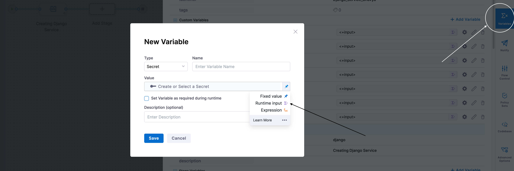
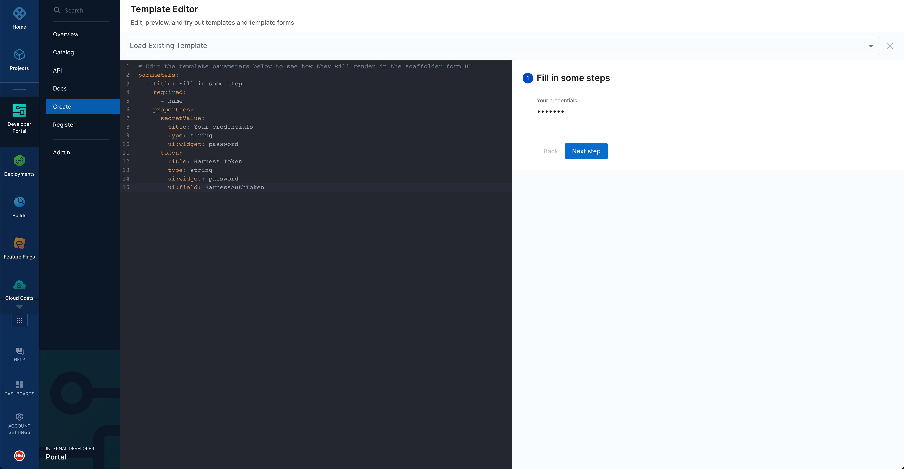

Sometimes, as a platform engineer, you might want your developers to enter their credentials when using a software template in IDP. This is useful when, for example, you want to use developers' GitHub credentials in a pipeline and create a repository on their behalf. This is a good approach because it ensures that developers create repositories that they can access and that you do not have to provide a superuser token for such tasks. This tutorial explains how you can configure such a software template and the corresponding pipeline.

## Prerequisites

* Make sure that you have created a [basic service onboarding pipeline](./service-onboarding-pipeline.md). 
* All account users who want to trigger pipelines and create secrets should have access to the project that contains the service onboarding pipeline.

## Pipeline changes

In your Harness pipeline, create a variable. Set its type to **Secret** and its value to **Runtime input**, as shown in the following figure:



## Template changes

Use the following workflow to update the `template.yaml` file that you registered with IDP. The sections that follow include detailed instructions for each of these steps:

1. Receive a secret input through the UI.
2. Create a Harness secret by using an action.
3. Use the secret ID to trigger the Harness pipeline.
4. Delete the secret after the pipeline is triggered.

### 1. Create an input field in the template

Inside the `spec.parameters[0].properties` field of your `template.yaml` file, add the following property. This property generates the input field in which users can enter their credentials:

```yaml {5-8}
spec:
  parameters:
    - title: Details
      properties:
        secretValue:
          title: Your credentials
          type: string
          ui:widget: password
```



### 2. Add a step to create the secret

Use the `harness:create-secret` action in a step in the `template.yaml` file to create a Harness secret from the developer's input. The following step creates a secret in the specified project, so make sure that the project contains the service onboarding pipeline in which you plan to reference the secret:

```yaml
spec:
  # ...
  steps:
    - id: createsecret
      name: Create Harness secret
      action: harness:create-secret
      input:
        projectId: "<your-harness-project-id>"
        orgId: "<your-harness-org-id>"
        secretValue: ${{ parameters.secretValue }}
        apikey: ${{ parameters.token }}
```

The output of this action includes a field named `secretId`. This field stores the generated secret's ID. You will use the secret ID in subsequent steps.

### 3. Use the secret as a runtime input in the pipeline

Use the `steps.createsecret.output.secretId` action to supply the secret ID as an input to the service onboarding pipeline that you want to trigger:

```yaml
spec:
  # ...
  steps:
    # - id: createsecret
    # ...
    - id: trigger
      name: Creating your new service
      action: trigger:harness-custom-pipeline
      input:
        url: "<link-to-your-Harness-pipeline>"
        inputset:
          input1: ${{ parameters.input1 }}
          # ...
          secret: ${{ steps.createsecret.output.secretId }}
        apikey: ${{ parameters.token }}
```

### 4. Delete secret after the job is done

Use the `harness:delete-secret` action to remove the secret from the project as you will no longer need it.

```yaml
spec:
  # ...
  steps:
    # - id: createsecret
    # ...
    # - id: trigger
    # ...
    - id: deletesecret
      name: Delete the Harness secret
      action: harness:delete-secret
      input:
        projectId: "your-harness-project-id"
        orgId: "your-harness-org-id"
        secretId: ${{ steps.createsecret.output.secretId }}
        apikey: ${{ parameters.token }}
```

:::info note

If the pipeline step fails, the secret is not removed from the project. We are exploring various approaches for automatic cleanup. Until this issue is resolved, identify the secrets that this action creates and then delete them manually. These secrets are of the form `idp_template_tempsecret_{uniqueID}`.

:::
