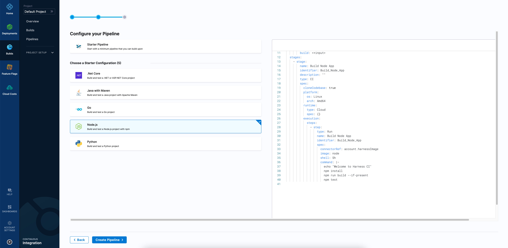

# Build your applications fast

## Harness CI Overview

Harness CI is a modern Continuous Integration solution that empowers busy teams to automate their build, test, and release workflows using a powerful, cloud-native pipeline engine. 

Developers are frustrated with the time it takes to ship code. 


Harness CI is built on Drone and over the last 10 years have been focussing on solving the developer frustration on the time it took to ship code with existing CI tools. Harness CI’s vision is to create a CI tool that is fast, simple, open, and secure.

Harness CI comes with optimized defaults with hosted builds so you don’t have to set up and manage infrastructure or optimize caching and other technologies to improve build times.

You can get started quickly with any language in Harness CI, within 60 seconds with out-of-the-box starter templates and code-first development. You can connect to any Source Code Management (SCM) system, build any app for any platform, and host it anywhere.



## Create your pipeline​

```mdx-code-block
import Tabs from '@theme/Tabs';
import TabItem from '@theme/TabItem';
```

1. Fork the repository [https://github.com/rustd/jhttp](https://github.com/rustd/jhttp) into your GitHub account.
2. Follow the **Get Started** wizard in Harness CI.

```mdx-code-block
<Tabs>
<TabItem value="newaccount" label="New account" default>
```
[Sign up](https://app.harness.io/auth/#/signup/?module=ci&?utm_source=website&utm_medium=harness-developer-hub&utm_campaign=ci-plg&utm_content=get-started) for a new Harness account. Select the **Continuous Integration** module after your initial sign in. This brings you to the **Get Started** wizard.
```mdx-code-block
</TabItem>
<TabItem value="existingaccount" label="Existing account">
```
[Log in](https://app.harness.io/auth/#/signin) to your Harness account. You can either create a new project or select an existing project, and then select the **Continuous Integration** module. In the **Project** pane, expand the **Project Setup** menu, and then select **Get Started**.
```mdx-code-block
</TabItem>
</Tabs>
```

3. In the **Which code repository do you use** step, select GitHub and then select either the **OAuth** or the **Access Token** as the authentication method that Harness CI will use to connect to your GitHub account. Verify that the authentication is setup correctly using the **Test Connection** button.
4. When you are prompted to select a repository, search for jhttp, select the repository that you forked in the earlier step, and then select **Configure Pipeline**.
5. Select **Starter Pipeline**, and then select **Create Pipeline**.
6. From the left pane, select **Pipelines**, and then select your jhttp pipeline from the list.
7. Switch from the **Visual** view to the **YAML** view, and then select **Edit YAML**.
8. A starter pipeline is created with a single stage.
9. Replace the sample step section with the following:
```
              - step:
                  type: Run
                  name: Build Java App
                  identifier: Build_Java_App
                  spec:
                    shell: Sh
                    command: |-
                      echo "Welcome to Harness CI"
                      mvn -B package --file pom.xml
```
10. In the YAML editor, select **Save**.


## Run your pipeline​

1. In the **Pipeline Studio**, select **Run**.​
2. In the **Build Type** field, select **Git Branch**, and then enter **main** in the **Branch Name** field.
3. Select **Run Pipeline**.
4. You can see the pipeline execute the steps in the Execution View and see that the build artifact is available on the **Artifacts** tab.

## Next steps
### Build & test Apache Kafka 4x faster on Harness CI 

Learn how you can build and test Apache Kafka four times faster on Harness CI. 
Read more about the performance data here [https://harness.io/blog/fastest-ci-tool](https://harness.io/blog/fastest-ci-tool) and follow the instructions of [this sample](https://github.com/harness-community/kafka/blob/trunk/.harness/README.md) to reproduce the results and see for yourself. 

