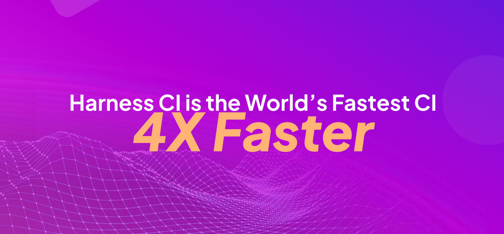
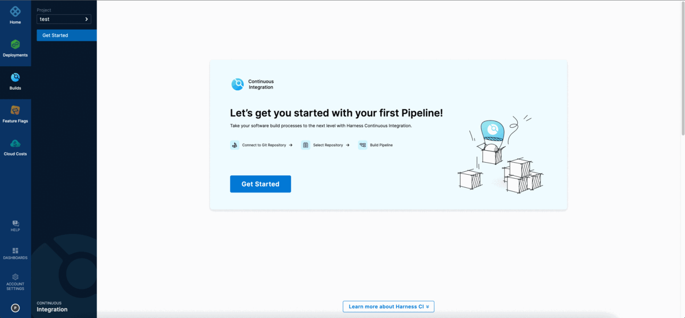
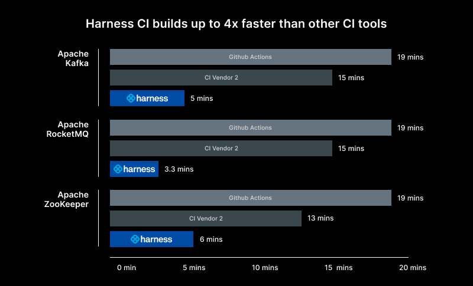
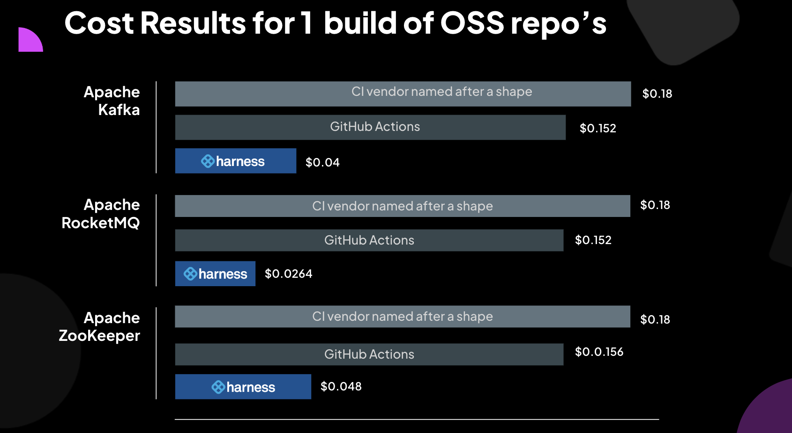

# Get started for free with the fastest CI on the planet 
:::info

[Sign up for free to try the world's fastest CI](https://app.harness.io/auth/#/signup/?module=ci&utm_source=Website&utm_medium=&utm_campaign=CI-Product-Page-Hero-PLG)

:::

## Harness CI

Harness CI is a modern Continuous Integration platform that empowers busy teams to automate their build, test, and release workflows using a powerful, cloud-native pipeline engine.



Developers are frustrated with the time it takes to ship code and often end up wasting their precious time waiting for the builds to complete.


With Harness CI, you can build faster and be more productive. Harness CI's pricing is competitive to other leading CI providers, which gives you more cost savings with the speed benefit.
Harness CI is built on Drone, and over the last 10 years we have been focusing on solving the developer's frustration with the time it took to ship code with existing CI tools. Harness CI’s vision is to create a CI tool that is fast, simple, open, and secure.

### Build pipelines 4 times faster than GitHub Actions
Harness CI is 4 times faster due to optimized defaults with hosted builds so you don’t have to set up and manage infrastructure or optimize caching and other technologies to improve build times. Cache Intelligence dramatically reduces pipeline execution time by automatically caching well-known directories for Java, Node package managers, and more. Test Intelligence
can build cycles by up to 90% with machine learning (ML) that runs only the necessary tests relevant to code changes. Once tests are identified, speed up test cycles even more by splitting and running tests concurrently.

In this demo, Harness goes head to head with GitHub Actions. You can follow [these instructions](https://github.com/harness-community/kafka/blob/trunk/.harness/README.md) to reproduce the results and see for yourself. 
<!-- Video:
https://harness-1.wistia.com/medias/rpv5vwzpxz-->
<docvideo src="https://www.youtube.com/watch?v=ECF1BDlzb-I" />

### Get started in 5 easy steps
Developer productivity is a core pillar for us. We didn't want to build a CI tool that was fast and complex to use. You can get started rapidly with any language in Harness CI, with out-of-the-box starter templates and code-first development. You can connect to any Source Code manager (SCM) system, build any apps for any lanugage, platform, and host it anywhere.



### Create & Share Open Source Plugins
Harness uses containers to drop pre‑configured steps into your pipeline. Choose from thousands of existing plugins, or create your own and run it on a container or the host Virtual machine.

## Create a pipeline​ for your favorite language
Build, test, and deploy applications in Node.js, Python, Java, Ruby, PHP, Go, Rust, .NET, and more. Use VMs or containers for Linux, Windows, Mac operating systems.
```mdx-code-block
import Tabs from '@theme/Tabs';
import TabItem from '@theme/TabItem';
```


```mdx-code-block
<Tabs>
<TabItem value="Go" label="Go" default>
```
* [Signup](https://app.harness.io/auth/#/signup/?module=ci&utm_source=Website&utm_medium=&utm_campaign=CI-Product-Page-Hero-PLG) for a free account 
* Follow the **Get Started** wizard in Harness CI.
* Fork the repository [https://github.com/rustd/gosample](https://github.com/rustd/gosample) into your GitHub account.
* In the **Which code repository do you use** step, select GitHub and then select either the **OAuth** or the **Access Token** as the authentication method that Harness CI will use to connect to your GitHub account.
* When you are prompted to select a repository, select the repository that you forked in the earlier step, and then select **Configure Pipeline**.
* Select **Starter Pipeline**, and then select **Create Pipeline**.
* Switch from the **Visual** view to the **YAML** view, and then select **Edit YAML**.
* Replace the sample step section with the following and **Save** the pipeline.
```
              - step:
                  type: Run
                  name: Build Go App
                  identifier: Build_Go_App
                  spec:
                    shell: Sh
                    command: |-
                      echo "Welcome to Harness CI"
                      go build                              
                      go test
```
```mdx-code-block
</TabItem>
<TabItem value="Java" label="Java">
```
* [Signup](https://app.harness.io/auth/#/signup/?module=ci&utm_source=Website&utm_medium=&utm_campaign=CI-Product-Page-Hero-PLG) for a free account 
* Follow the **Get Started** wizard in Harness CI.
* Fork the repository [https://github.com/rustd/jhttp](https://github.com/rustd/jhttp) into your GitHub account.
* In the **Which code repository do you use** step, select GitHub and then select either the **OAuth** or the **Access Token** as the authentication method that Harness CI will use to connect to your GitHub account. Verify that the authentication is setup correctly using the **Test Connection** button.
* When you are prompted to select a repository, select the repository that you forked in the earlier step, and then select **Configure Pipeline**.
* Select **Starter Pipeline**, and then select **Create Pipeline**.
* Switch from the **Visual** view to the **YAML** view, and then select **Edit YAML**.
* Replace the sample step section with the following and **Save** the pipeline.
```
              - step:
                  type: Run
                  name: Build Java App
                  identifier: Build_Java_App
                  spec:
                    shell: Sh
                    command: |-
                      echo "Welcome to Harness CI"
                      mvn -B package --file pom.xml
```

```mdx-code-block
</TabItem>
<TabItem value="JavaScript" label="JavaScript">
```
* [Signup](https://app.harness.io/auth/#/signup/?module=ci&utm_source=Website&utm_medium=&utm_campaign=CI-Product-Page-Hero-PLG) for a free account 
* Follow the **Get Started** wizard in Harness CI.
* Fork the repository [https://github.com/rustd/reactcalculator](https://github.com/rustd/reactcalculator) into your GitHub account.
* In the **Which code repository do you use** step, select GitHub and then select either the **OAuth** or the **Access Token** as the authentication method that Harness CI will use to connect to your GitHub account. Verify that the authentication is setup correctly using the **Test Connection** button.
* When you are prompted to select a repository, select the repository that you forked in the earlier step, and then select **Configure Pipeline**.
* Select **Starter Pipeline**, and then select **Create Pipeline**.
* Switch from the **Visual** view to the **YAML** view, and then select **Edit YAML**.
* Replace the sample step section with the following and **Save** the pipeline.
```
              - step:
                  type: Run
                  name: Build JavaScript App
                  identifier: Build_JavaScript_App
                  spec:
                    shell: Sh
                    command: |-
                      echo "Welcome to Harness CI"
                      node --version
                      npm install
                      npm run build --if-present
                      npm test
```
```mdx-code-block
</TabItem>
<TabItem value=".NET" label=".NET">
```
* [Signup](https://app.harness.io/auth/#/signup/?module=ci&utm_source=Website&utm_medium=&utm_campaign=CI-Product-Page-Hero-PLG) for a free account 
* Follow the **Get Started** wizard in Harness CI.
* Fork the repository [https://github.com/rustd/hello-dotnet-core](https://github.com/rustd/hello-dotnet-core) into your GitHub account.
* In the **Which code repository do you use** step, select GitHub and then select either the **OAuth** or the **Access Token** as the authentication method that Harness CI will use to connect to your GitHub account. Verify that the authentication is setup correctly using the **Test Connection** button.
* When you are prompted to select a repository, select the repository that you forked in the earlier step, and then select **Configure Pipeline**.
* Select **Starter Pipeline**, and then select **Create Pipeline**.
* Switch from the **Visual** view to the **YAML** view, and then select **Edit YAML**.
* Replace the sample step section with the following and **Save** the pipeline.
```
              - step:
                  type: Run
                  name: Build DotNet App
                  identifier: Build_DotNet_App
                  spec:
                    shell: Sh
                    command: |-
                      echo "Welcome to Harness CI"
                      dotnet restore
                      dotnet build --no-restore
                      dotnet test --no-build --verbosity normal
```
```mdx-code-block
</TabItem>
<TabItem value="Python" label="Python">
```
* [Sign up](https://app.harness.io/auth/#/signup/?module=ci&utm_source=Website&utm_medium=&utm_campaign=CI-Product-Page-Hero-PLG) for a free account 
* Follow the **Get Started** wizard in Harness CI.
* Fork the repository [https://github.com/rustd/python](https://github.com/rustd/python) into your GitHub account.
* In the **Which code repository do you use** step, select GitHub, and then select either the **OAuth** or the **Access Token** as the authentication method that Harness CI will use to connect to your GitHub account. Verify that the authentication is set up correctly using the **Test Connection** button.
* When you are prompted to select a repository, select the repository that you forked in the earlier step, and then select **Configure Pipeline**.
* Select **Starter Pipeline**, and then select **Create Pipeline**.
* Switch from the **Visual** view to the **YAML** view, and then select **Edit YAML**.
* Replace the sample step section with the following and **Save** the pipeline.
```
              - step:
                  type: Run
                  name: Build Python App
                  identifier: Build_Python_App
                  spec:
                    shell: Sh
                    command: |-
                      echo "Welcome to Harness CI"
                      python -m pip install --upgrade pip
                      pip install  pytest
                      if [ -f requirements.txt ]; then pip install -r requirements.txt; fi
```
```mdx-code-block
</TabItem>
</Tabs>
```

## Run your pipeline​

* In the **Pipeline Studio**, select **Run**.​
* In the **Build Type** field, select **Git Branch**, and then enter **main** in the **Branch Name** field.
* Select **Run Pipeline**.
* You can see the pipeline execute the steps in the Execution View.

## Build and test Apache Kafka 4 times faster on Harness CI 
Congratulations on building your first pipeline. You can build even faster with Harness CI.
Learn how you can build and test Apache Kafka four times faster on Harness CI. 
Read more about the performance data here [https://harness.io/blog/fastest-ci-tool](https://harness.io/blog/fastest-ci-tool) and follow the instructions of [this sample](https://github.com/harness-community/kafka/blob/trunk/.harness/README.md) to reproduce the results and see for yourself. 



This is the cost of running a single build on Apache Kafka, RocketMQ and Zookeeper.




## Get started for free 
[Signup](https://app.harness.io/auth/#/signup/?module=ci&utm_source=Website&utm_medium=&utm_campaign=CI-Product-Page-Hero-PLG) for a free Harness CI account and run your pipelines fastest on Harness CI.