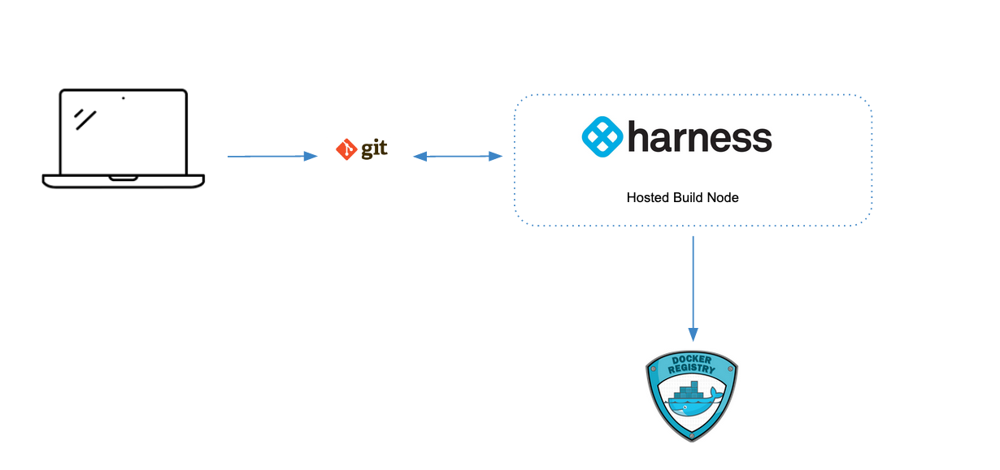
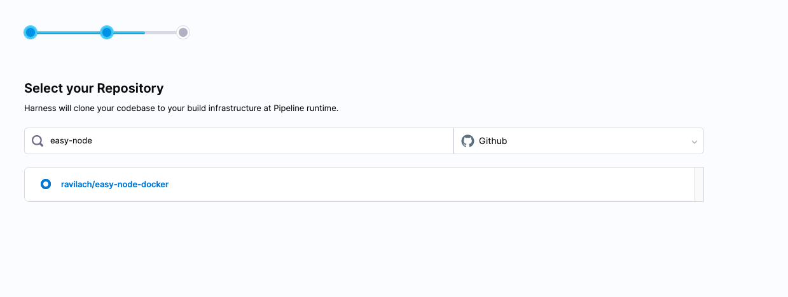
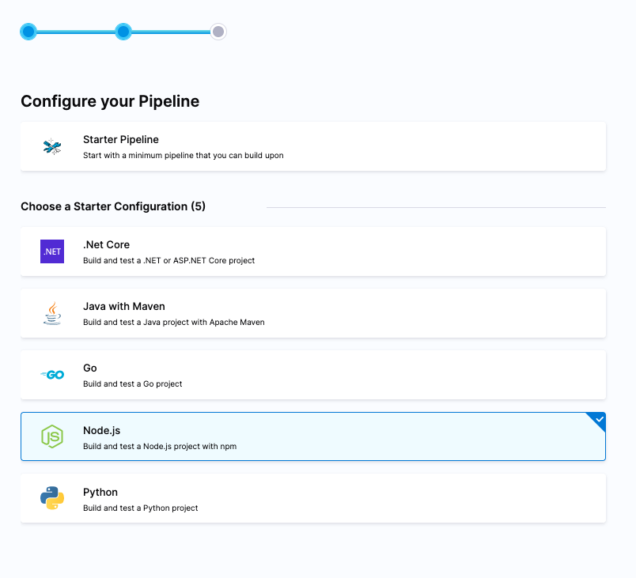
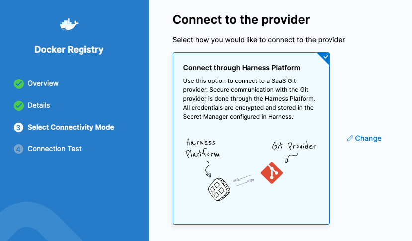
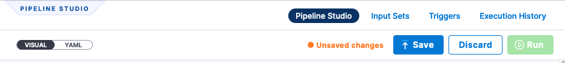
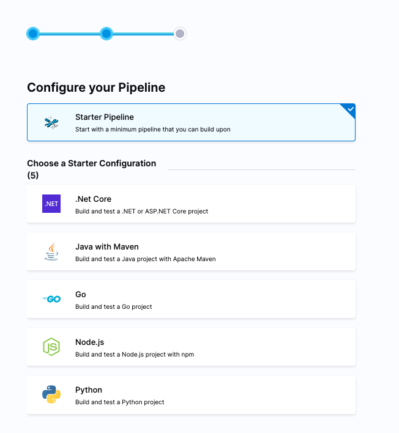
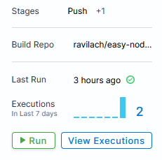

# Build Docker image of a NodeJS app

```mdx-code-block
import Tabs from '@theme/Tabs';
import TabItem from '@theme/TabItem';
```

## Background on Continuous Integration

Continuous Integration is automated builds that can be triggered by some sort of event, such as a code check-in, merge, or on a regular schedule. The end goal of a build is to be deployed somewhere, and the main goal of [Continuous Integration](https://harness.io/blog/continuous-integration/what-is-continuous-integration/) is to build and publish that deployable unit.

However, more than the compiled source code can go into a build. The end product for Continuous Integration is a release candidate. A release candidate is the final form of an artifact to be deployed. There could be quality steps taken to produce the artifact, such as finding bugs, and identifying their fix. Packaging, distribution, and configuration all go into a release candidate.

According to [Paul Duvall](https://www.oreilly.com/library/view/continuous-integration-improving/9780321336385/), co-author of Continuous Integration, in a nutshell, CI will improve quality and reduce risk. Having a Continuous Integration approach frees teams from the burden of manual builds and also makes builds more repeatable, consistent, and available. If you are unfamiliar with CI, this guide will get you started on your first automated build.

## Your Local Build - Onramp to Continuous Integration

To create a build, you need to have something that can be built, which means source code. The steps you take to build and package your application or service need to be represented in a CI tool or platform for automation. CI platforms will need to connect to source code management e.g SCM to start the build process. This can be as simple as connecting your public GitHub Repository for something that needs to be built.


### How to Build an App Locally?

Languages and package formats have build specific tools. As an example, here is a simplistic NodeJS Application that can be built into a Docker Image; the Dockerfile has specifics on how to build and package the app.

Sample App Repo:
[https://github.com/harness-apps/easy-node-docker](https://github.com/harness-apps/easy-node-docker)

To execute the local build, the first step if using the sample application is to download/clone the repository to your local machine. For the later automated build steps, [Fork](https://docs.github.com/en/get-started/quickstart/fork-a-repo) the [sample repository](https://github.com/harness-apps/easy-node-docker). 


Building and packaging this sample application locally requires a few pieces, NPM and Docker.
If you don’t have those runtimes, on a Windows Machine, you can use [Chocolatey](https://chocolatey.org/install) to install, or if using a Mac, [Homebrew](https://brew.sh/).

```
NPM:
choco install nodejs
brew install node

Docker:
choco install docker
brew install docker
```

Once you build your application, you will need to store the binaries somewhere, in this case, the Docker Image. The next step, Docker Build, will call the underlying NPM Install to start the build process.

### Creating and Storing Your Image

Like any file you want to share with the world, storing them in an external spot makes them more accessible. A big benefit of using Docker as a packaging format is the ecosystem of Docker Registries out there. Your firm might have a registry provider. A good free registry for yourself is [Docker Hub](https://hub.docker.com/). If you do not have a registry available to you, you can create a Docker Hub account and create a registry, e.g “samplejs”.


With those pieces, you can build and push your image to the registry.

```
docker build --tag your_user/repo:tag .
docker push your_user/repo:tag
```

E.g in my case, at the root of the project:

```
docker build --tag rlachhman/samplejs:1.0.4 .
docker push rlachhman/samplejs:1.0.4
```


Can validate that this has been placed into the Docker Registry.


Simple enough locally to get your local build and packaging in. The next step is now to externalize this, which is exactly what creating a Continuous Integration Pipeline is all about.

## Your First Continuous Integration Pipeline

If you took a closer look at what your machine was doing during those local builds, the machine was bogged down for a few moments. For yourself, that is fine, but imagine having to support 10’s or 100’s or even 1000’s of engineers, this process can be taxing on systems. Luckily, modern Continuous Integration Platforms are designed to scale with distributed nodes. Harness Continuous Integration is designed to scale and simplify getting your local steps externalized; this is the Continuous Integration Pipeline. Let’s enable Harness Continuous Integration to mimic your local steps and create your first CI Pipeline. Once you are done, you will have a repeatable, consistent, and distributed build process. 

There are a few Harness Objects to create along the way, which this guide will walk through step-by-step.There are two paths to take. One path is to have Harness host all of the needed infrastructure for a distributed build. The second is to bring your own infrastructure for the distributed build. 

Hosted Infrastructure:



Bring Your Own Infrastructure:


### Starting off with Harness

Harness is a Platform, but we will focus on the Continuous Integration module. First, sign up for a [Harness account to get started](https://app.harness.io/auth/#/signup/?module=ci&?utm_source=website&utm_medium=harness-developer-hub&utm_campaign=ci-plg&utm_content=get-started).


### Access To Your Sourcecode

Assuming you are leveraging GitHub, Harness will need access to the repository. For the example, providing a Personal Access Token that is scooped to “repo” will allow for connectivity. If you are leveraging the [sample repository](https://github.com/harness-apps/easy-node-docker), make sure to Fork
the sample repository. 

If you have not created a Personal Access Token before.

- GitHub -> Settings -> Developer Settings -> Personal Access Tokens
- Name: harness
- Scopes: repo
- Expiration: 30 days

Make sure to jot down the token as the token will only be displayed once.


Now you are ready to wire in the pieces to Harness Continuous Integration.

## Create Your First Pipeline

In the Build Module [Harness Continuous Integration], walking through the wizard is the fastest path to get your build running. Click Get Started. This will create a basic Pipeline for you.


Once you click Get Started, select GitHub as the repository you use, and then you can enter your GitHub Access Token that was created or being leveraged for the example.


Click Continue. Then click Select Repository to select the Repository that you want to build [the sample is called *easy-node-docker*].



Select the repository, then click Create Pipeline. The next step to focus on will be where you want to run the build by configuring the Pipeline. 

```mdx-code-block
<Tabs>
<TabItem value="Harness Hosted Build Infrastructure">
```
Can leverage one of the Starter Configs or create a Starter Pipeline. In this case if leveraging the example app which is NodeJS based, leveraging the Node.js Starter Configuration works fine. 



Click Continue to define what infrastructure to run the build on. To run on Harness Hosted Infrastructure, first change the Infrastructure to “Cloud”.


The scaffolding will take care of the NPM install for you. End goal would be to have a published Docker Image of your artifact. Can add an additional Step to take care of the Docker Push. 


Select “Build and Push” image to Docker Registry.


Next, create a new Docker Connector by clicking on + New Connector. 

* Name: `my_docker_hub_account`


Next fill out the details of your account credentials for a Docker Push. 


* Registry URL: https://index.docker.io/v2/
* Authentication: Username and Password
* Provider Type: DockerHub
* Username: `your_docker_hub_user`
* Password: `your_docker_hub_pw`


For sensitive items such as your Docker Hub password, these can be stored as a Harness Secret. 


Click Save and Continue. You can run this connection directly from the Harness Platform. 



Once selected, you can run a connectivity test and you are ready to provide the registry details. 

* Name: docker_build_and_push
* Docker Connector: `my_docker_hub_account`
* Docker Repository: `<your_user>/<your_repository>`
* Tags: cibuilt


Click Apply Changes then Save. 



Now you are ready to run once saved. 

```mdx-code-block
</TabItem>
<TabItem value="Self-Managed Build Infrastructure">
```

If you want to use your own self-managed build infrastructure, then you should install the [Kubernetes Delegate](../platform/install-delegate) in the Kubernetes cluster of your choice. 

For the self-managed infrastructure, can leverage one of the Starter Configs or create a Starter Pipeline. In this case, can run the Starter Pipeline. 



Click Continue to start to build out the Pipeline. 


Click Continue to define what infrastructure to run the build on.

First change the infrastructure to “Kubernetes”.


Then select the drop-down “Select Kubernetes Cluster”. Then + New Connector.


In the wizard, name the Kubernetes connection “myfirstcinode”.


Click continue. With Harness, you can use the same cluster the Harness Delegate is running on by selecting “Use Credentials of a specific Harness Delegate”. The Harness Delegate will facilitate all needed work on the Kubernetes cluster.


Click continue. Now select the Harness Delegate that corresponds to your Kubernetes cluster.


Click “Save and Continue” and the connection will be validated.
Back in the Pipeline Builder, “myfirstcinode” will be listed.

Provide a Namespace and OS to run.

- Namespace: default
- OS: Linux [if using Windows WSL, Linux is the correct setting].


After the Build Infrastructure is set, now time to set up the Push step to push the artifact to a Docker Registry. In the Pipeline View, click + Add Stage and create a Staged called “Push”.Then click on “Set Up Stage”.


Click on “Set Up Stage”.


In the setup of the Stage, can leverage the infrastructure that the previous artifact build was run on by selecting “Propagate from an existing stage”.


Click Continue now, you can add a Step to represent the Docker Push. Click “Add Step”.


Select “Build and Push” image to Docker Registry.


Can create a new Push connector.

Name: pushtodockerhub


Next, set up the Docker Connector by clicking on the dropdown for Docker Connector.
Then create a new connector.


Can name the new docker registry connector “dockerhub”.


Click continue and can enter your credentials to Docker Hub.

- Provider Type: Docker Hub
- Docker Registry URL: https://registry.hub.docker.com/v2/
- Authentication: your_user
- Password: your_password [Will be saved as a Harness Secret]


Click Continue and select the Harness Delegate to execute on. This will be your Kubernetes infrastructure.


Click Save and Continue, and the connection will validate.
Then click Finish. Lastly, enter your Docker Repository and Tag information.

- Docker Repository: `your_account/your_registry`
- Tags: cibuilt


Then click “Apply Changes” and Save the Changes.


With those changes saved, you are ready to execute your first CI Pipeline.

```mdx-code-block
</TabItem>
</Tabs>
```
## Running Your First CI Pipeline

Executing is simple. Head back to your pipeline and click on “Run”. Unlike your local machine, where you had to wire in NPM and Docker dependencies, Harness CI will resolve these by convention.



Then you can select a branch to run off of and execute a step.
Branch Name: main [if using the example repo]


Now you are ready to execute. Click “Run Pipeline”.


Once a successful run, head back to Docker Hub, and `cibuilt` is there!


This is just the start of your Continuous Integration journey. It might seem like multiple steps to get your local build in the platform, but it unlocks the world of possibilities.

## Continuing on Your Continuous Integration Journey

You can now execute your builds whenever you want in a consistent fashion. Can modify the trigger to watch for SCM events so upon commit, for example, the Pipeline gets kicked off automatically. All of the objects you create are available for you to re-use. One part we did not touch upon in this example is executing your [test suites](https://docs.harness.io/article/x0d77ktjw8-ci-pipeline-quickstart#step_4_build_and_run_unit_tests) in a similar format. Lastly, you can even save your backing work / have it as part of your source code. Everything that you do in Harness is represented by YAML; feel free to store it as part of your project.


After you have built your artifact, the next step is to deploy your artifact. This is where Continuous Delivery steps in and make sure to check out some other [CD Tutorials](/tutorials/deploy-services#all-tutorials).
