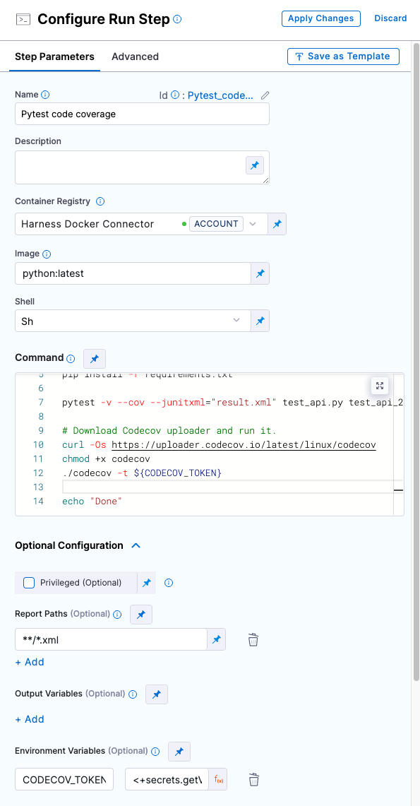
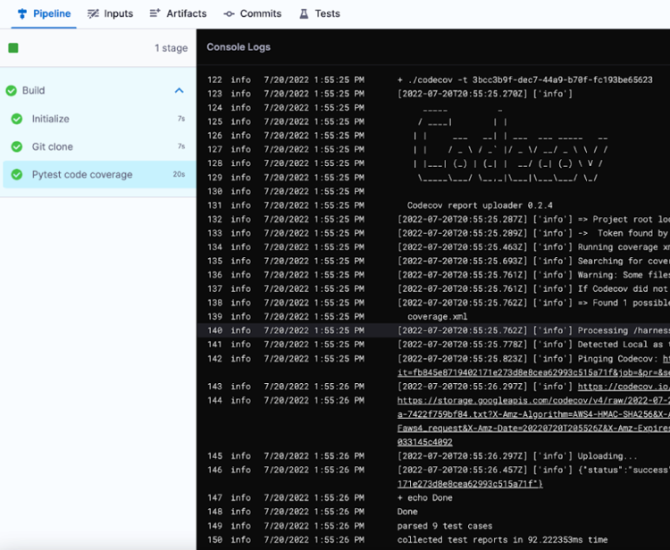

# Code coverage with CodeCov in Harness CI

This tutorial shows how you can use a [Run step](/docs/continuous-integration/use-ci/run-ci-scripts/run-a-script-in-a-ci-stage) to include [CodeCov code coverage](https://docs.codecov.com/docs/about-code-coverage#top-5-codecov-features) in a Harness CI pipeline.

## Prerequisites

For this tutorial, you need the following:

* A CodeCov account with code coverage enabled on a code repo and a CodeCov Upload Token. For instructions, go to [CodeCov Quick Start](https://docs.codecov.com/docs/quick-start).
* An understanding of test tools, scripts, and related commands.
* A Harness account.
* A CI pipeline. If you haven't created a pipeline before, try one of the following tutorials:
  * [Get started for free with the fastest CI on the planet](/tutorials/build-code/fastest-ci)
  * [Build and test on a Kubernetes cluster build infrastructure](/tutorials/build-code/ci-tutorial-kubernetes-cluster-build-infra)

```mdx-code-block
import CISignupTip from '/tutorials/shared/ci-signup-tip.md';
```

<CISignupTip />

## Add the Run step

To include CodeCov code coverage in a Harness CI pipeline, add a **Run** step that does the following:

* Runs tests and produces coverage reports.
* Declares or ingests a `CODECOV_TOKEN` environment variable, which represents a [CodeCov Upload Token](https://docs.codecov.com/docs/codecov-uploader#upload-token).
* Downloads and runs the [CodeCov Uploader](https://docs.codecov.com/docs/codecov-uploader) tool.

```mdx-code-block
import Tabs from '@theme/Tabs';
import TabItem from '@theme/TabItem';
```
```mdx-code-block
<Tabs>
  <TabItem value="Visual" label="Visual" default>
```

1. In Harness, go to the pipeline where you want to include CodeCov.
2. Add a [Run step](/docs/continuous-integration/ci-technical-reference/run-step-settings.md).
3. Enter a **Name** for the step.
4. For **Container Registry**, select your preferred Docker connector or use the Harness default Docker connector
5. For **Image**, enter the Docker image needed to run your tests, such as `python:latest`.
6. In the **Command** field, include all commands necessary to prepare the test environment, run tests with code coverage, declare or ingest the `CODECOV_TOKEN` environment variable, and download and run the CodeCov Uploader tool. For example:

   ```sh
   echo "Welcome to Harness CI"
   uname -a
   pip install pytest
   pip install pytest-cov
   pip install -r requirements.txt

   pytest -v --cov --junitxml="result.xml" test_api.py test_api_2.py test_api_3.py

   #Declare Codecov Upload Token
   # ff3e...d6a4
   CODECOV_TOKEN=3bcc...65623

   # Download Codecov uploader and run it.
   curl -Os https://uploader.codecov.io/latest/linux/codecov
   chmod +x codecov
   ./codecov -t ${CODECOV_TOKEN}

   echo "Done"
   ```

7. Under **Optional Configuration** add one or more **Report Paths**, such as `**/*.xml`.
8. Select **Apply Changes** to save the step, and then select **Save** to save the pipeline.

<details>
<summary>Use a text secret for the CodeCov Upload Token</summary>

For the `CODECOV_TOKEN` environment variable, you can either declare the token directly in the **Command** or store and reference the token as a [text secret](/docs/platform/Security/add-use-text-secrets).

If you choose to use a text secret, under **Optional Configuration** add the following **Environment Variable**:

* Key: `CODECOV_TOKEN`
* Value: An expression calling your text secret, based on the scope where it was declared and the secret's ID, such as `<+secrets.getValue("my_codecov_upload_token")>`. For syntax examples, go to [Add and reference text secrets](/docs/platform/Security/add-use-text-secrets).

Then, call the environment variable in the **Command**, for example:

```sh
echo "Welcome to Harness CI"
uname -a
pip install pytest
pip install pytest-cov
pip install -r requirements.txt

pytest -v --cov --junitxml="result.xml" test_api.py test_api_2.py test_api_3.py

# Download Codecov uploader and run it.
curl -Os https://uploader.codecov.io/latest/linux/codecov
chmod +x codecov
./codecov -t ${CODECOV_TOKEN}

echo "Done"
```

</details>

<!--  -->

<docimage path={require('./static/ci-tutorial-codecov-test/run-step-with-codecov-visual.png')} />

For more information about **Run** step settings, go to the [Run step settings reference](/docs/continuous-integration/ci-technical-reference/run-step-settings.md) and [Run a script in a CI stage](/docs/continuous-integration/use-ci/run-ci-scripts/run-a-script-in-a-ci-stage).

```mdx-code-block
  </TabItem>
  <TabItem value="YAML" label="YAML">
```

In Harness, go to the pipeline where you want to include CodeCov, and add a [Run step](/docs/continuous-integration/ci-technical-reference/run-step-settings.md) configured as follows:

```yaml
              - step:
                  type: Run
                  name: # Specify a name for the step
                  identifier: # Step ID, usually based on the name
                  spec:
                    connectorRef: # Your preferred Docker connector or the Harness default Docker connector: account.harnessImage.
                    image: # The Docker image needed to run your tests, such as python.latest.
                    shell: Sh
                    command: |-
                      # Include all commands necessary to:
                      # Prepare the test environment.
                      # Run tests with code coverage.
                      # Declare or ingest the CODECOV_TOKEN environment variable.
                      # Download and run the CodeCov Uploader tool.
                    reports:
                      type: JUnit
                      spec:
                        paths:
                          - "**/*.xml"
```

<details>
<summary>YAML example</summary>

Here is an example of a **Run** step with CodeCov that uses `pytest`. Note that this example declares the `CODECOV_TOKEN` environment variable directly in the step's `command`; however, you can also store and reference this token as a [text secret](/docs/platform/Security/add-use-text-secrets).

```yaml
              - step:
                  type: Run
                  name: Pytest code coverage
                  identifier: Run
                  spec:
                    connectorRef: account.harnessImage
                    image: python:latest
                    shell: Sh
                    command: |-
                      echo "Welcome to Harness CI"
                      uname -a
                      pip install pytest
                      pip install pytest-cov
                      pip install -r requirements.txt

                      pytest -v --cov --junitxml="result.xml" test_api.py test_api_2.py test_api_3.py

                      #Declare Codecov Upload Token
                      # ff3e6...6a4
                      CODECOV_TOKEN=3bcc...5623

                      # Download Codecov uploader and run it.
                      curl -Os https://uploader.codecov.io/latest/linux/codecov
                      chmod +x codecov
                      ./codecov -t ${CODECOV_TOKEN}

                      echo "Done"
                    reports:
                      type: JUnit
                      spec:
                        paths:
                          - "**/*.xml"
```

Here is the same **Run** step within the context of a **Build** stage:

```yaml
  stages:
    - stage:
        name: Build
        identifier: Build
        type: CI
        spec:
          cloneCodebase: true
          infrastructure:
            type: KubernetesHosted
            spec:
              identifier: k8s-hosted-infra
          execution:
            steps:
              - step:
                  type: Run
                  name: Pytest code coverage
                  identifier: Run
                  spec:
                    connectorRef: account.harnessImage
                    image: python:latest
                    shell: Sh
                    command: |-
                      echo "Welcome to Harness CI" 
                      uname -a
                      pip install pytest
                      pip install pytest-cov
                      pip install -r requirements.txt

                      pytest -v --cov --junitxml="result.xml" test_api.py test_api_2.py test_api_3.py

                      #Codecov Token (inject as an ENV variable)
                      # ff3e6f68-2f61-4996-afa3-9308a638d6a4
                      CODECOV_TOKEN=3bcc3b9f-dec7-44a9-b70f-fc193be65623

                      # Download Codecov uploader and run it.
                      curl -Os https://uploader.codecov.io/latest/linux/codecov
                      chmod +x codecov
                      ./codecov -t ${CODECOV_TOKEN}

                      echo "Done"
                    reports:
                      type: JUnit
                      spec:
                        paths:
                          - "**/*.xml"
```

</details>

<details>
<summary>Use a text secret for the CodeCov Upload Token</summary>

For the `CODECOV_TOKEN` environment variable, you can either declare the token directly in the `command` or store and reference the token as a [text secret](/docs/platform/Security/add-use-text-secrets).

If you choose to use a text secret, declare `CODECOV_TOKEN` in `step: spec: envVariables`. Set the value to an expression calling your text secret, based on the scope where it was declared and the secret's ID, such as `<+secrets.getValue("my_codecov_upload_token")>`. For syntax examples, go to [Add and reference text secrets](/docs/platform/Security/add-use-text-secrets).

Here is a YAML example of a step that calls a `CODECOV_TOKEN` that is stored as a secret. Notice that the `command` does not include an explicit declaration of the Upload Token; it only references the `CODECOV_TOKEN` variable in `./codecov -t ${CODECOV_TOKEN}`.

```yaml
              - step:
                  type: Run
                  name: Pytest code coverage
                  identifier: Pytest_code_coverage
                  spec:
                    connectorRef: account.harnessImage
                    image: python:latest
                    shell: Sh
                    command: |-
                      echo "Welcome to Harness CI"
                      uname -a
                      pip install pytest
                      pip install pytest-cov
                      pip install -r requirements.txt

                      pytest -v --cov --junitxml="result.xml" test_api.py test_api_2.py test_api_3.py

                      # Download Codecov uploader and run it.
                      curl -Os https://uploader.codecov.io/latest/linux/codecov
                      chmod +x codecov
                      ./codecov -t ${CODECOV_TOKEN}

                      echo "Done"
                    reports:
                      type: JUnit
                      spec:
                        paths:
                          - "**/*.xml"
                    envVariables:
                      CODECOV_TOKEN: <+secrets.getValue("my_codecov_upload_token")>
```

</details>

For more information about **Run** step settings, go to the [Run step settings reference](/docs/continuous-integration/ci-technical-reference/run-step-settings.md) and [Run a script in a CI stage](/docs/continuous-integration/use-ci/run-ci-scripts/run-a-script-in-a-ci-stage).

```mdx-code-block
  </TabItem>
</Tabs>
```

## Run the pipeline

After adding the **Run** step, run your pipeline.

On the [Build details page](/docs/continuous-integration/use-ci/view-your-builds/viewing-builds.md), you can review CodeCov information in the **Run** step's logs. If the results were successfully uploaded to CodeCov, the logs include a `resultURL` that you can follow to view the code coverage output in your CodeCov account, such as:

```
...
145  info  [date] [time]    [timestamp] [`info`] Uploading...
146  info  [date] [time]    [timestamp] [`info`] {"status":"success","resultURL":"https://codecov.io..."}
147  info  [date] [time]    + echo Done
...
```

<!--  -->

<docimage path={require('./static/ci-tutorial-codecov-test/build-logs-with-codecov.png')} />
