# Build and sign application containers

At the end of this tutorial you will learn how to sign a container image without using a [cosign](https://sigstore.dev).

## Prerequisites

Before you get started with the tutorial make sure you have completed the
[Build Go Application Containers CI Pipeline](./ci-tutorial-go-containers.md).

Ensure the following tools are installed locally:

* [Crane](https://github.com/google/go-containerregistry/tree/main/cmd/crane)
* [Cosign](https://docs.sigstore.dev/cosign/installation/)

## Overview

As part of the [Build Go Application Containers CI Pipeline](./ci-tutorial-go-containers.md) tutorial we saw how to build a Go application container image using a CI pipeline. In this tutorial we improve the pipeline to sign the container image and ensure its authenticity. Please read [History and Research](https://docs.sigstore.dev/history#relevant-research) to learn why we need to secure the software supply chain.

## Generate signing keys

1. Assuming you have the fork of <https://github.com/harness-apps/go-fruits-api>, navigate to the folder where it was cloned. Refer to this folder as `$TUTORIAL_HOME`.

```shell
cd $TUTORIAL_HOME
```

2. Generate a random password and store it in a variable called `$COSIGN_PASSWORD`,

```shell
export COSIGN_PASSWORD=$(openssl rand -hex 16)
```

:::tip
Make sure to note down the `$COSIGN_PASSWORD` as it might be needed later.

```shell
echo $COSIGN_PASSWORD
```

:::

3. Once you have generated the password, generate the key pair that we will use to sign.

```shell
cosign generate-key-pair
```

The command generates the `cosign.key` and `cosign.pub` under `$TUTORIAL_HOME`.

:::important

Make sure the `cosign.key`, `cosign.pub` are excluded from your SCM. In other words, add them to `.gitignore`

:::

### Create signing secrets

1. Navigate to __Project Setup__, and then select  __Secrets__.

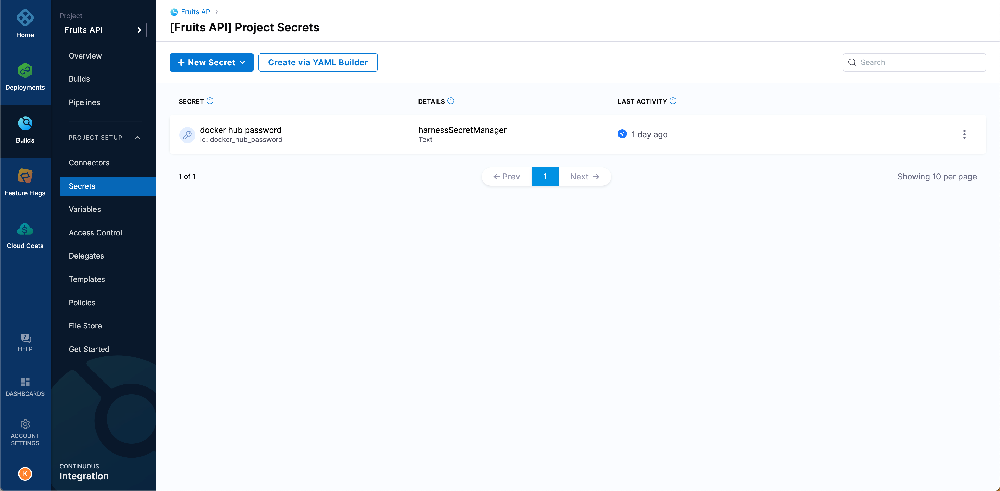

2. Select __+ New Secret__ , and then select __Text__.

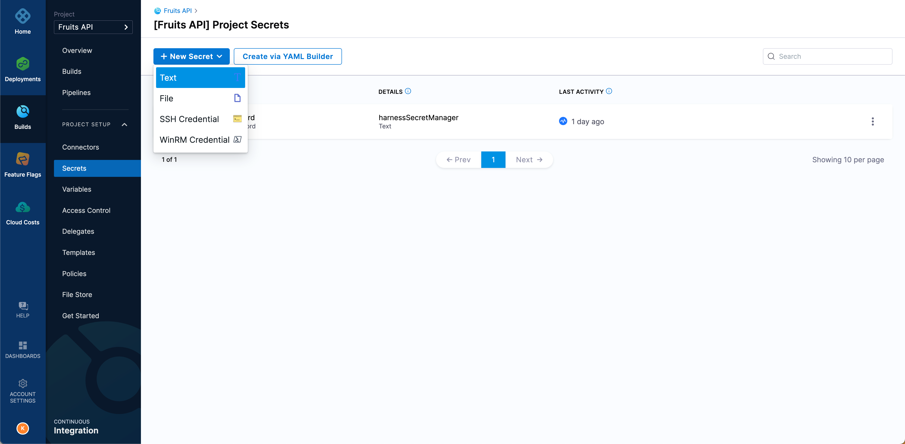

3. Set the __Secret Name__ to be `cosign_password`, and then fill your cosign private key password `$COSIGN_PASSSWORD` as __Secret Value__.

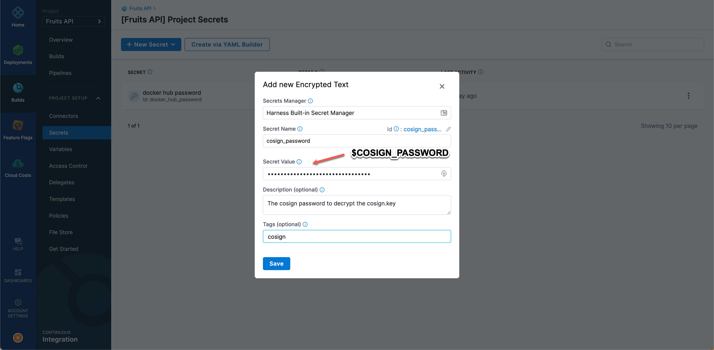

4. Select __+ New Secret__, and then select __File__.

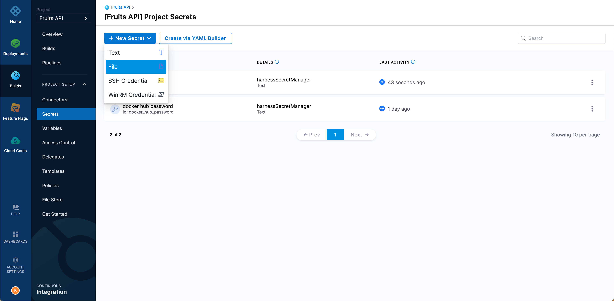

5. Fill the details for the secret `cosign_private_key` as shown.

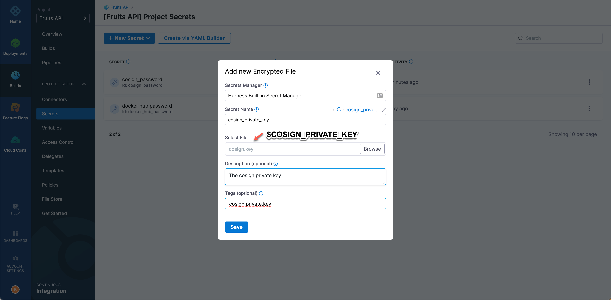

6. For the __Select File__, browse and pick the `cosign.key` from the `$TUTORIAL_HOME`.

7. Repeat the same process of creating another `__File__` secret to store the cosign public key, this time using the file `cosign.pub` from the `$TUTORIAL_HOME`.

8. Fill the details for the secret `cosign_public_key` as shown.

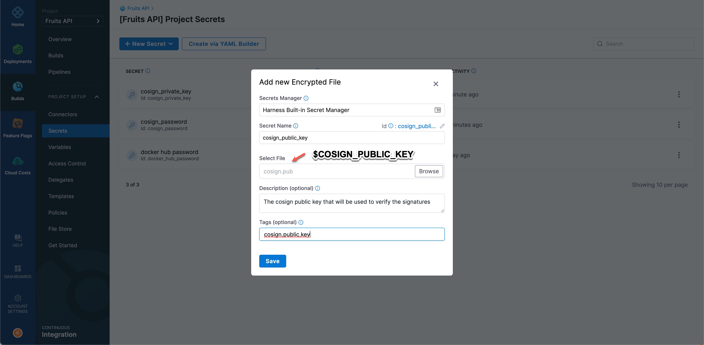

With this we now have four secrets in our project:

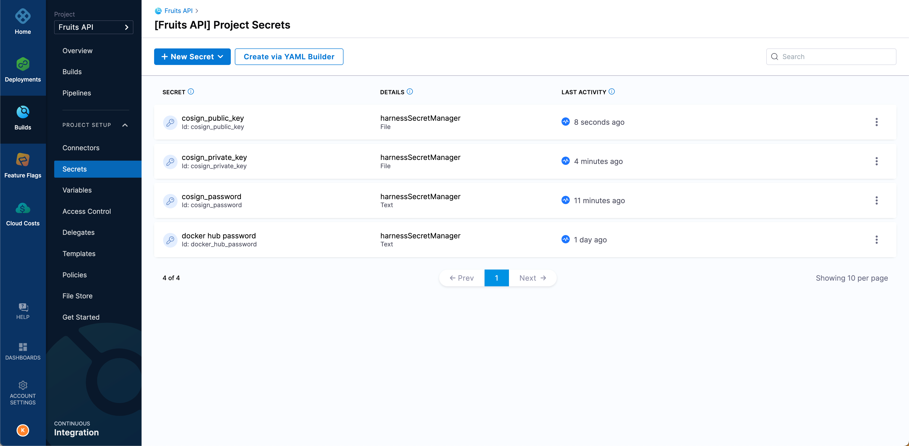

## Update the pipeline to sign the container Image

We now have all of the required resources: __cosign_password__, __cosign_private_key__ and __cosign_public_key__ to sign the container image using _cosign_.

Now, update the existing __build and push__ step of our `Build Go` pipeline to sign the `fruits-api` container image.

1. Navigate to __Projects__, and then  __Pipelines__.

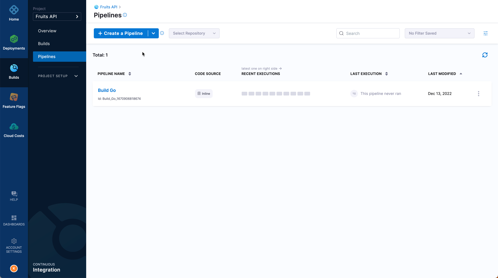

2. Select __Build Go__ pipeline to open the pipeline editor.

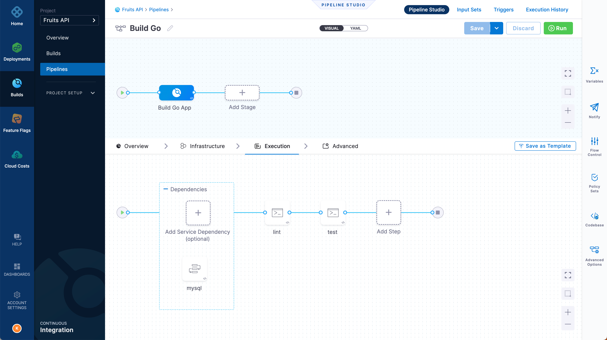

3. Select the step __build and push__ and update the __Command__ to be as shown:

__Command__:

```shell
echo -n "$DOCKER_HUB_PASSWORD" | ko auth login docker.io -u "$DOCKER_HUB_USERNAME" --password-stdin
IMAGE_REF=$(ko build --bare --platform linux/amd64 --platform linux/arm64 .)
cosign sign --key env://COSIGN_PRIVATE_KEY $IMAGE_REF
```

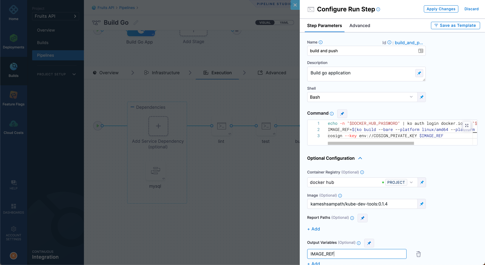

We also need to configure few environment variables that are required by `ko` and `cosign` to build and push the signed image to `fruits-api` container repository.

4. Update the __Environment Variables__ section with following values:

```shell
DOCKER_HUB_USERNAME: $DOCKER_HUB_USERNAME
DOCKER_HUB_PASSWORD: <+secrets.getValue("docker_hub_password")>
KO_DOCKER_REPO: docker.io/$DOCKER_HUB_USERNAME/fruits-api
COSIGN_PRIVATE_KEY: <+secrets.getValue("cosign_private_key")>
COSIGN_PASSWORD: <+secrets.getValue("cosign_password")>
```

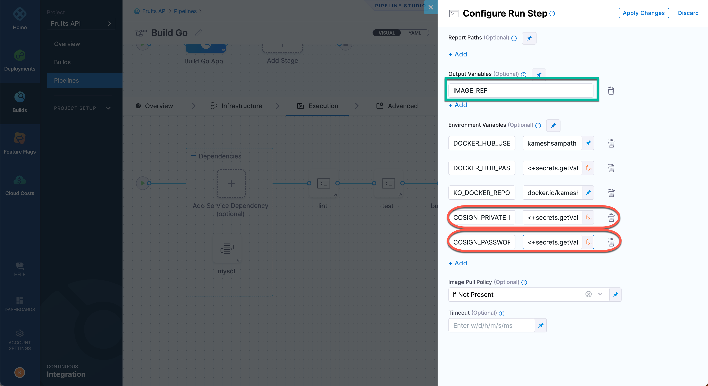

The step also exposes an [output variable](https://developer.harness.io/docs/continuous-delivery/cd-execution/cd-general-steps/download-and-copy-artifacts-using-the-command-step) called `IMAGE_REF` which could be used by other steps, for example to verify the signature by using pipeline expression `<+steps.build_and_push.output.outputVariables.IMAGE_REF>`.

:::note 

- As marked, ensure the `DOCKER_HUB_PASSWORD`,`COSIGN_PRIVATE_KEY` and `COSIGN_PASSWORD` are of the __Expression__ type.
- `secrets.getValue` is an expression that allows you to get the value from the secret `docker_hub_password` that was created earlier in the tutorial. Check the [docs](https://developer.harness.io/docs/platform/security/add-use-text-secrets/#step-3-reference-the-encrypted-text-by-identifier) for more information. 
- All `$DOCKER_HUB_USERNAME` references should your Docker Hub Username.
:::

5. Select __Apply Changes__ to save the step, and then select __Save__ to save the pipeline.

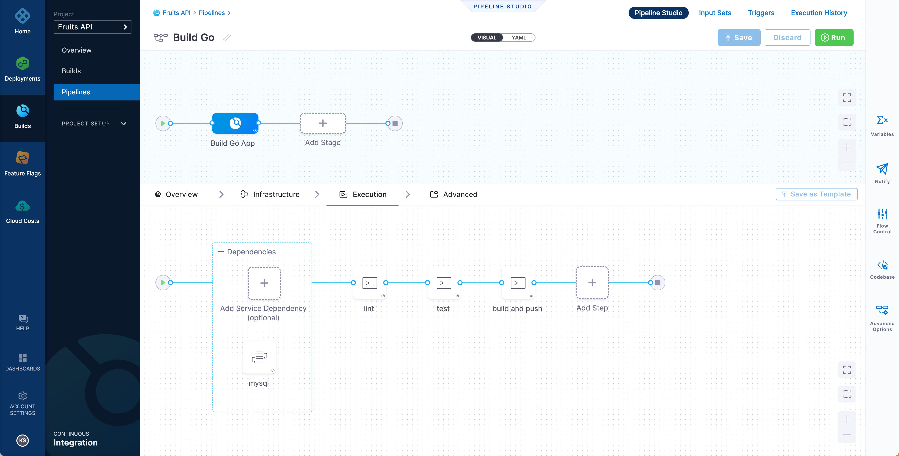

With those changes saved, you are ready to lint, test, build and push your __go__ application to container registry(DockerHub).

## Run the CI pipeline

1. As you did earlier, select __Run__ from the pipeline editor window.

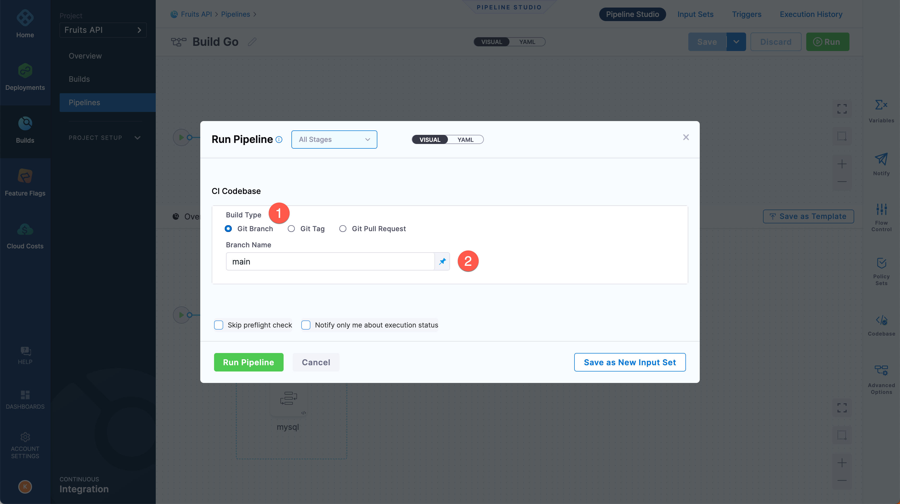

2. Leaving all the default entries in place, namely __Git Branch__ and __Branch Name__ to be _main_, select __Run Pipeline__ to start the pipeline run.

3. Now you are ready to execute. Select **Run Pipeline**.

4. After the pipeline runs successfully, head back to Docker Hub to check the image references.

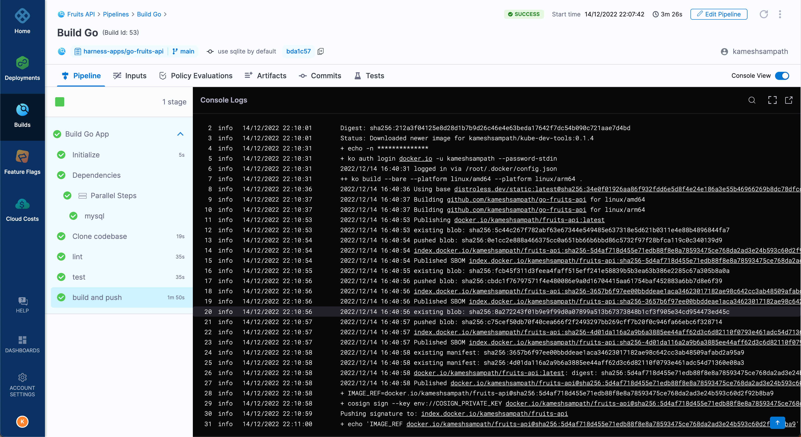

As you see the logs the container was built and the image reference is signed using our `$COSIGN_PRIVATE_KEY`.

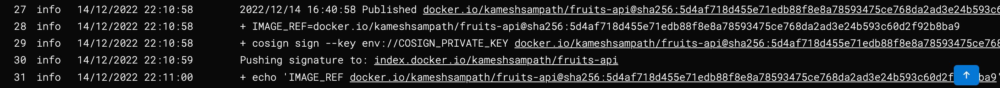

## Verify the signed image

To verify the image signature, use the public key `$COSIGN_PUBLIC_KEY` against the image `sha256` digest.

To get the digest of an image you can use [crane](https://github.com/google/go-containerregistry/blob/main/cmd/crane/doc/crane.md).

```shell
export IMAGE_REF=$(crane digest docker.io/$DOCKER_USERNAME/fruits-api:latest)
```

Run the following command to verify the signature using our cosign public key,

```shell
cosign verify --key "$TUTORIAL_HOME/cosign.pub" \
  "docker.io/$DOCKER_USERNAME/fruits-api@$IMAGE_REF"
```

The command should show an output as shown if the signature is valid, with `$DOCKER_USERNAME` and `$IMAGE_REF` replacing your Docker Hub username and image digest from the previous step.

```text
Verification for index.docker.io/$DOCKER_USERNAME/fruits-api@$IMAGE_REF --
The following checks were performed on each of these signatures:
  - The cosign claims were validated
  - The signatures were verified against the specified public key

[{"critical":{"identity":{"docker-reference":"index.docker.io/$DOCKER_USERNAME/fruits-api"},"image":{"docker-manifest-digest":"$IMAGE_REF"},"type":"cosign container image signature"},"optional":null}]
```

In an ideal scenario the verification is done by governance tools like [OPA](https://www.openpolicyagent.org/docs/latest/) or [kyverno](https://kyverno.io/). The integration with those tools can be done using Harness Platform with Harness Continuous Delivery.

:::note Exercise

Can you update the pipeline to a sign verification step?

__Clue__: Use `$IMAGE_REF` from __build and push__ step output variables.

:::

## Continuing on your continuous integration journey

You can now execute your builds whenever you want in a consistent fashion. You can modify the trigger to watch for SCM events so upon commit, for example, the pipeline is kicked off automatically. All of the objects you create are available for you to reuse. Lastly, you can even save your backing work / have it as part of your source code. Everything that you do in Harness is represented by YAML; feel free to store it as part of your project.

After you have built your artifact, the next step is to deploy your artifact. This is where Continuous Delivery steps in. Make sure to check out some other [CD Tutorials](/tutorials/deploy-services#all-tutorials).
