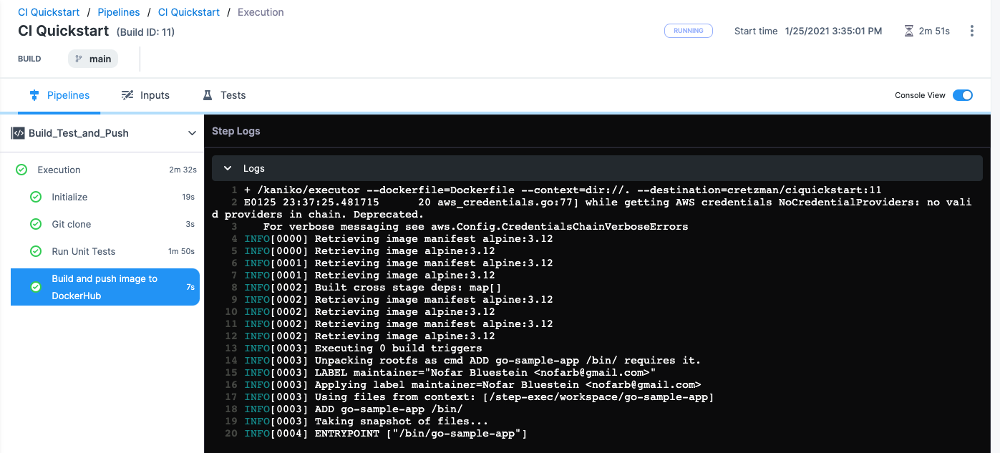

# Build and test on a Kubernetes cluster build infrastructure

This tutorial shows you how to create a two-stage Harness CI pipeline that uses a Kubernetes cluster build infrastructure. The pipeline builds and runs a unit test on a codebase, uploads the artifact to Docker Hub, and then runs integration tests. This tutorial uses publicly-available code, images, and your Github and Docker Hub accounts.

You'll learn how to create a CI pipeline that does the following:

1. Clones the code repo for an app.
2. Uses a Kubernetes cluster build infrastructure.
3. Builds the app code and runs unit tests.
4. Packages the app as a Docker image, and uploads it to Docker Hub.
5. Pulls the uploaded image into the build infrastructure as a service dependency.
6. Runs an integration test against the app.

<details>
<summary>Architecture diagram</summary>

The following diagram shows the architecture of a kubernetes cluster build infrastructure. You interact with the Harness Platform through your browser. The Harness Delegate, which is installed in your Kubernetes cluster, manages communication between the Harness Platform and the Kubernetes pod where the pipeline's build farm is running. While the pipeline runs, the build farm communicates with your codebase, such as GitHub, and container registry, such as Docker Hub.


You must install the Harness Delegate in the same cluster you use for the build farm. The Delegate creates the namespace `harness-delegate`, and you use that namespace for both the Delegate and build farm. You can change the namespace name if you like.

</details>

<details>
<summary>Video summary</summary>

This video describes a pipeline similar to the one built in this tutorial. Note that this video uses the **Service Dependency** step, which is deprecated in favor of the **Background** step.

<!-- Video:
https://harness-1.wistia.com/medias/rpv5vwzpxz-->
<docvideo src="https://harness-1.wistia.com/medias/fsc2b05uxz" />


<!-- div class="hd--embed" data-provider="Wistia" data-thumbnail="">
   <iframe src="//fast.wistia.net/embed/iframe/fsc2b05uxz" allowtransparency="true" frameborder="0" scrolling="no" class="wistia_embed" name="wistia_embed" allowfullscreen="" mozallowfullscreen="" webkitallowfullscreen="" oallowfullscreen="" msallowfullscreen="" width="620" height="349"></iframe><script src="//fast.wistia.net/assets/external/E-v1.js" async=""></script>
</div -->

</details>

## Prerequisites

This tutorial assumes you have experience with Kubernetes, such as setting up service accounts and clusters.

In addition to a Harness account, you need the following accounts and tools:

* A **GitHub account** where you can fork the tutorial repo.
* A **Docker Hub account and repo** where the pipeline can push and pull app images.
* A **Kubernetes cluster** where you'll install the [Harness Delegate](/docs/platform/Delegates/get-started-with-delegates/delegates-overview) and run the build farm. The cluster needs the following minimum specifications:
  * Pods: 3 (two for the Delegate and one for the build farm)
  * Machine type: 4vCPU
  * Memory: 16GB RAM
  * Networking: Outbound HTTPS for the Harness and Docker Hub connections. Allow port 22 for SSH.
  * Namespace: During the tutorial, when you install the Harness Delegate, the `harness-delegate-ng` namespace is created. You'll use the same namespace for the build infrastructure.
* A **Kubernetes service account** with permission to create entities in the target namespace. The set of permissions should include `list`, `get`, `create`, and `delete` permissions. Usually, the `cluster-admin` permission or `namespace admin` permission is sufficient. For more information, go to the Kubernetes documentation on [User-Facing Roles](https://kubernetes.io/docs/reference/access-authn-authz/rbac/#user-facing-roles).

:::caution

Google Kubernetes Engine (GKE) [Autopilot](https://cloud.google.com/kubernetes-engine/docs/concepts/autopilot-overview) is not recommended. For more information, go to [Set up a Kubernetes cluster build infrastructure](/docs/continuous-integration/use-ci/set-up-build-infrastructure/set-up-a-kubernetes-cluster-build-infrastructure).

:::

```mdx-code-block
import CISignupTip from '/tutorials/shared/ci-signup-tip.md';
```

<CISignupTip />

## Prepare the codebase

1. Fork the tutorial repo [keen-software/goHelloWorldServer](https://github.com/keen-software/goHelloWorldServer) to your GitHub account. Alternately, you can use your own code repo. This tutorial works for any Git repo that you can access.
2. Create a GitHub personal access token with the `repo`, `admin:repo_hook`, and `user` scopes. For instructions, go to the GitHub documentation on [creating a personal access token](https://docs.github.com/en/authentication/keeping-your-account-and-data-secure/creating-a-personal-access-token). For information about the token's purpose in Harness, go to the **Authentication** section of the [GitHub connector settings reference](/docs/platform/Connectors/ref-source-repo-provider/git-hub-connector-settings-reference#authentication).
3. Make note of the token; you'll need it later in the tutorial.
4. In Harness, switch to the **Project** you want to use for this tutorial, or create a project.

<details>
<summary>Create a project</summary>

Use these steps to create a project in your Harness account.

1. Select **Projects**, select **All Projects**, and then select **New Project**.
2. Enter a **Name**, such as `CI kubernetes tutorial`.
3. Leave the **Organization** as **default**.
4. Select **Save and Continue**.
5. On **Invite Collaborators**, you can add others to your project, if desired. You don't need to add yourself.
6. Select **Save and Continue**.
7. On the Modules page, select **Continuous Integration**, and then select **Go to Module**.

If this is your first project with CI, the CI pipeline wizard starts after you select **Go to Module**. You'll need to exit the wizard to create the GitHub connector if you don't already have a GitHub connector for the account where you forked the tutorial repo.

</details>

Next, you'll create a _connector_ that allows Harness to connect to your Git codebase, and you'll install a Harness Delegate in your Kubernetes cluster. A connector is a configurable object that connects to an external resource automatically while the pipeline runs. For detailed instructions on creating GitHub connectors, go to [Add a GitHub connector](/docs/platform/Connectors/add-a-git-hub-connector). For details about GitHub connector settings, go to the [GitHub connector settings reference](/docs/platform/Connectors/ref-source-repo-provider/git-hub-connector-settings-reference).

1. Under **Project Setup**, select **Connectors**.
2. Select **New Connector**, and then select **GitHub** under **Code Repositories**.
3. Enter a recognizable name, such as `CI kubernetes tutorial connector`, and select **Continue**.
4. Configure the **Details** as follows, and then select **Continue**:

   * **URL Type:** Select **Repository**.
   * **Connection Type:** Select **HTTP**.
   * **GitHub Repository URL:** Enter the URL to your fork of the tutorial repo, such as `https://github.com/keen-software/goHelloWorldServer.git`.

   

5. Configure the **Credentials** as follows, and then select **Continue**:

   * **Username:** Enter the username for the GitHub account where you forked the tutorial repo.
   * **Personal Access Token:** Create a secret for the personal access token you created earlier. Harness secrets are safe; they're stored in the [Harness Secret Manager](/docs/platform/Security/harness-secret-manager-overview). You can also use your own Secret Manager with Harness.
   * **Enable API access:** Select this option and select the same personal access token secret.

   

6. For **Select Connectivity Mode**, select **Connect through a Harness Delegate**, and then select **Continue**.

   :::info

   You can choose to establish connections directly from your Harness platform or through a Delegate service running within your corporate firewall. The Harness Delegate is a local service that connects your infrastructure, collaboration, verification, and other providers with your Harness platform. For this tutorial, you'll install a Delegate in your Kubernetes cluster.

   :::

   

7. On **Delegates Setup**, select **Only use Delegates with all of the following tags**, and then select **Install new Delegate**.
8. Select **Kubernetes Manifest** and follow the instructions given on the **New Delegate** page to install the Delegate on a pod in your Kubernetes cluster.

   :::info

   You can use a Helm Chart, Terraform, or Kubernetes Manifest to install Kubernetes delegates. For this tutorial, select **Kubernetes Manifest**. For information about the other options and detailed instructions, go to [Install a delegate](/docs/platform/Delegates/install-delegates/install-a-delegate).

   If delegate installation succeeds, the `kubectl apply` command should produce output similar to the following:

   ```
   namespace/harness-delegate-ng created  
   clusterrolebinding.rbac.authorization.k8s.io/harness-delegate-ng-cluster-admin created  
   secret/ci-quickstart created  
   statefulset.apps/ci-quickstart created  
   service/delegate-service created
   ```

   :::

9. In Harness, select **Verify** to test the connection. It might take a few minutes to verify the Delegate. Once it is verified, exit delegate creation and return to connector setup.
10. Back in the connector's **Delegates Setup**, select your new delegate, and then select **Save and Continue**.
11. Wait while Harness tests the connection, and then select **Finish**.

## Create a pipeline and add a Build stage

Pipelines are comprised of one or more stages. Each stage has one or more steps that manage and automate builds, tests, deployments, and other important build and release tasks. To learn more about pipeline components, go to [CI pipeline components](/docs/continuous-integration/ci-quickstarts/ci-pipeline-basics).

For most CI pipelines, Build stages do most of the heavy lifting. Build stages are where you specify the end-to-end workflow for your pipeline: the codebase to build, the build infrastructure to use, where to push the finished artifact, and any additional tasks (such as automated tests or validations).

1. Select **Pipelines**, and then select **Create a Pipeline**.
2. Enter a **Name** for the pipeline. Harness automatically creates a pipeline ID based on the name. Once the pipeline is created, you can't change the ID. You can use the ID to reference subordinate elements of a pipeline, such as the names of variables within the pipeline.
3. Select **Start**. You're taken to the Pipeline Studio where you can configure pipeline settings and add stages and steps to your pipeline.
4. In the Pipeline Studio, select **Add Stage** and select **Build**.
5. For the **Stage Name**, enter `Build Test and Push`.
6. For **Connector**, select the GitHub connector you created earlier in [Prepare the codebase](#prepare-the-codebase).

   

7. Select **Set Up Stage**. The Build stage is added to the pipeline.

Next, you need to define the build infrastructure. Harness offers several [build infrastructure options](/docs/continuous-integration/use-ci/set-up-build-infrastructure/which-build-infrastructure-is-right-for-me), and this tutorial uses a [Kubernetes cluster build infrastructure](/docs/continuous-integration/use-ci/set-up-build-infrastructure/set-up-a-kubernetes-cluster-build-infrastructure).

1. Select the **Infrastructure** tab for your Build stage.
2. Under **Infrastructure**, select **Kubernetes**.
3. Under **Platform**, select the **Kubernetes Cluster** field to open the **Create or Select an Existing Connector** window.
4. Select **New Connector**, and configure the connector as follows. For detailed instructions and information about these settings, go to [Add a Kubernetes cluster connector](/docs/platform/connectors/add-a-kubernetes-cluster-connector/).

   * **Name:** Enter `ci-delegate`
   * **Details:** Select **Use the credentials of a specific Harness Delegate**.
   * **Delegates Setup:** Select the Kubernetes Delegate you installed earlier in [Prepare the codebase](#prepare-the-codebase).
   * **Connection Test:** Wait for the test to finish and then click **Finish**.

5. In **Namespace**, enter `harness-delegate-ng`, and then select **Continue**.
## Add a build and test step

Now that the pipeline has a stage with a defined codebase and build infrastructure, you are ready to add steps to build the codebase and run unit tests.

You can use either a [Run step](/docs/continuous-integration/ci-technical-reference/run-step-settings) or a [Run Tests step](/docs/continuous-integration/ci-technical-reference/configure-run-tests-step-settings) to run unit tests in a CI pipeline. With the **Run Tests** step, you can leverage [Test Intelligence](/docs/continuous-integration/use-ci/set-up-test-intelligence/).


<!-- Step 4 build and run unit tests: Delete echo welcome message step. The instruction for the name field is given twice. Missing instruction to select “Connect thru a harness delegate >only use delegates w following tags” after setting up the secret. Report paths are under optional config (have to expand). -->

You should now be in the Execution tab. Click **Add step** and then select **Run** (under Build).

The Run step executes one or more commands on a container image. Configure the step as follows:

* **Name:** Run Unit Tests
* **Container Registry:** Click **Select** and then **+New Connector**.
* **Select your Connector Type:** Docker Registry

<details>
<summary>Create a Docker connector</summary>

You will now create a new Connector to your DockerHub account as follows.

### Docker Connector Overview

* **Name:** Docker Quickstart

### Docker Connector Details

* **Docker Registry URL:** `https://index.docker.io/v1/`
* **Provider Type:** Docker Hub
* **Username:** The username for your Docker Hub account
* **Password:** Create a Harness Secret for the Personal Access Token you use with your Docker Hub account. You can also use your own Secret Manager.


### Delegates Setup

* **Delegates Setup:** Select the new Delegate you installed previously using its Tags.
* Wait for the Connector test to complete and then click **Finish**.

</details>

* You should now be in the Configure Run Step pane, with the new Connector in the Container Registry setting. Configure the step as follows:
	+ **Name:** Run Unit Tests
	+ **Container Registry:** This should show the Docker Hub Connector you just created.
	+ **Image:** `golang:1.15`
	+ **Command:**
	```
	go get gotest.tools/gotestsum  
	gotestsum --format=standard-verbose --junitfile unit-tests.xml || true  
	CGO_ENABLED=0 GOOS=linux GOARCH=amd64 go build -a -tags netgo
	```
	The last line contains the `go build` command to compile the package, along with its dependencies.
	+ **Report Paths (Optional Configuration):** `*.xml`
	+ Click **Apply Changes**.
	+ In the Pipeline Studio, click **Save**.

This **Run** step will intentionally fail the test. This will be useful to see how a test failure is recorded in Harness.

## Add the build and push step

<!-- Step 5 build and push image to docker hub: use <docker_username> instead of <your_repo>. -->

Next, you'll add a step to build your container and push it to your Docker Hub repo. You'll need a repo in your Docker Hub account to receive the artifact.

* You should be in the Execution tab of the Built Test and Push Stage. Click **Add step**, then click **Build and Push an Image to Docker Registry**.
* Configure the step as follows:
	+ **Name:** Build and push an image to Docker Registry
	+ **Docker Connector:** Select the Docker Hub Connector you set up previously.
	+ **Docker Repository:**
		- Create a `ciquickstart`repository in your Docker Hub account.
		- Then enter`<your_repo>/ciquickstart`where *`<your_repo>`* is your Docker Hub username.
	+ **Tags:** `<+pipeline.sequenceId>`  
	This tag is a built-in Harness variable that represents the Build ID number, for example `Build ID: 9`. The pipeline uses the Build ID to tag the image that it pushes in stage 1 and pulls in stage 2. You will see the Build ID when you run the pipeline. You will also use this variable to identify the image location when you set up the [Configure Service Dependency](/docs/continuous-integration/ci-technical-reference/configure-service-dependency-step-settings) step in the next stage.
    
	+ Click **Apply Changes** to return to the Pipeline Studio.
* Click **Save** to save the Pipeline. You can run the Pipeline now, or you can continue and add the Integration Test stage.

## Add an integration tests stage

<!-- Step 6 create the integration test stage: “click infrastructure” should be “select Infrastructure tab”. The button is “Continue” not “Next”. The “image” instruction is wrong - <your repo> is your username, not the docks hub repo name. Also, “Service Dependency” is deprecated, no longer available in the UI but backwards compatible in YAML. This tutorial needs to use “Background step” instead of “Service Dependency”. -->

Now you have a Stage to clone, build, containerize, and then push your image to Docker Hub. In this step you'll add a Stage to pull that image, run it in a container, and run integration tests on it.

* Click **Add Stage**, and select **Build**.
* Enter the name **Run Integration Test**, disable **Clone Codebase**, and then click **Set Up Stage**.

<!-- I think disabling clone codebase caused an error: -->
<!-- Can’t find git repo error: Click “Codebase” pipeline editor page (far right). Input specific branch name so the full URL resolves. Save > Save. -->
<!-- The tutorial has a problem that the unit test step fails because it cant find where to write the reports. The fix for this was that Clone Codebase should NOT be disabled. I also think it might be relevant for the GitHub connector to be a GitHub repo instead of a GitHub account. -->


### Reuse build infra

Here you configure the stage to use the same infrastructure as the previous stage:

* Click **Infrastructure**.
* Select **Propagate from an existing stage**.
* Select the previous stage. This will use the same Kubernetes cluster and namespace as the first stage.
* Click **Next**.

### Add Built Image from Stage 1 as a Service Dependency

In the Build Test and Push stage, you built your code and pushed your built image to Docker Hub. Now, in Run Integration Test, you will identify the image as a Service Dependency for your test stage. Harness will pull the image onto the container in your infrastructure. Next, it will start the Hello World Server in the image.

* In the Run Integration Test stage > Execution tab, click **Add Service Dependency**.
* Configure the dependency:
	+ **Dependency Name:** Run Hello World Server
	+ **Container Registry:** The same Docker Hub Connector you used in the Build Test and Push stage.
	+ I**mage:** `<your_repo>/ciquickstart:<+pipeline.sequenceId>`  
	Replace `<your_repo>` with the name of the Docker Hub repo you are using for this tutorial.
* Click **Apply Changes**.

Notice that the Image field uses the same variable `<+pipeline.sequenceId>` for the Image that you used in the previous stage. This tells Harness to pull the image with the same tag as the image pushed previously. Here's an example:

| Build and Test and Push (stage 1) Build and Push to Docker Hub step | Run Integration Test (stage 2) Configure Service Dependency step |
| - | - |
|  |  |

### Add Integration Test Step

Next, we can run an integration test. We'll simply test the connection to the server.

* Click **Add Step**, and then click **Run**.
* Configure the step as follows:
	+ **Name:** test connection to server
	+ **Container Registry:** The Docker Hub Connector you've been using.
	+ **Image:** `curlimages/curl:7.73.0`
	+ **Command:**
	```
	sleep 10  
	curl localhost:8080  
	curl localhost:8080?Hello!_I_am_a_nice_demo!
	```
	+ Select **Apply Changes** to save the step.
	+ Select **Save** to save the pipeline.

## Run the pipeline

Now run the pipeline.

1. Select **Run**.
2. For the **Pipeline Inputs**, select **Git branch** and enter the target branch in the code repo, such as `main`.
3. Select **Run Pipeline**.

On the [Build details page](/docs/continuous-integration/use-ci/view-your-builds/viewing-builds) you can observe the pipeline while it run. Select a stage to examine the steps in that stage. Select a step to view the step's logs. Select the **Tests** tab to [view test results](/docs/continuous-integration/use-ci/view-your-builds/viewing-tests).


You can switch to **Console view** for a focused view of the logs.



For this pipeline, note the following log details:

* In the logs for the **Build and push image to Docker Hub** step, you can see that the build number, such as `11`, is used as an image tag, for example:

   ```
   --destination=myrepo/ciquickstart:11
   ```

* In the **Initialize** step of the **Run Integration Test** stage, you can see the image with the same tag is pulled from your Docker Hub repo:

   ```
      Pulling image "myrepo/ciquickstart:11"
      Successfully pulled image "myrepo/ciquickstart:11" in 1.878887425s
   ```

* You can find the pushed image and the associated tag in your Docker Hub repo.

   

## Continue your Continuous Integration journey

Congratulations! You have created a CI pipeline that builds and tests your code.

With CI pipelines you can consistently execute your builds at any time. For example, you can try adding a commit trigger to the pipeline that listens for commits against the codebase and automatically kicks off the pipeline. All objects you create are available to reuse in your pipelines.

You can also save your build pipelines as part of your source code. Everything that you do in Harness is represented by YAML; you can store it all alongside your project files. For example, here is a YAML example of the pipeline created in this tutorial.

<details>
<summary>Pipeline YAML example</summary>

```yaml
pipeline:  
    name: CI Pipeline  
    identifier: CI_Pipeline  
    allowStageExecutions: false  
    projectIdentifier: CI_QuickStart_20220401  
    orgIdentifier: default  
    tags: {}  
    properties:  
        ci:  
            codebase:  
                connectorRef: CI_QuickStart  
                build: <+input>  
    stages:  
        - stage:  
              name: Build Test and Push  
              identifier: Build_Test_and_Push  
              type: CI  
              spec:  
                  cloneCodebase: true  
                  infrastructure:  
                      type: KubernetesDirect  
                      spec:  
                          connectorRef: cidelegate  
                          namespace: harness-delegate-ng  
                  execution:  
                      steps:  
                          - step:  
                                type: Run  
                                name: Run Unit Tests  
                                identifier: Run_Unit_Tests  
                                spec:  
                                    connectorRef: Docker_Quickstart  
                                    image: golang:1.15  
                                    command: |-  
                                        go get gotest.tools/gotestsum  
                                        gotestsum --format=standard-verbose --junitfile unit-tests.xml || true  
                                        CGO_ENABLED=0 GOOS=linux GOARCH=amd64 go build -a -tags netgo  
                                    privileged: false  
                                    reports:  
                                        type: JUnit  
                                        spec:  
                                            paths:  
                                                - "*.xml"  
                          - step:  
                                type: BuildAndPushDockerRegistry  
                                name: Build and push image to Docker Hub  
                                identifier: Build_and_push_image_to_Docker_Hub  
                                spec:  
                                    connectorRef: Docker_Quickstart  
                                    repo: dockerhubuser/ciquickstart  
                                    tags:  
                                        - <+pipeline.sequenceId>  
        - stage:  
              name: Run Integration Test  
              identifier: Run_Integration_Test  
              type: CI  
              spec:  
                  cloneCodebase: false  
                  infrastructure:  
                      useFromStage: Build_Test_and_Push  
                  serviceDependencies:  
                      - identifier: Run_Hello_World_Server  
                        name: Run Hello World Server  
                        type: Service  
                        spec:  
                            connectorRef: Docker_Quickstart  
                            image: dockerhubuser/ciquickstart:<+pipeline.sequenceId>  
                  execution:  
                      steps:  
                          - step:  
                                type: Run  
                                name: test connection to server  
                                identifier: test_connection_to_server  
                                spec:  
                                    connectorRef: Docker_Quickstart  
                                    image: curlimages/curl:7.73.0  
                                    command: |-  
                                        sleep 10  
                                        curl localhost:8080  
                                        curl localhost:8080?Hello!_I_am_a_nice_demo!  
```

</details>

After you build an artifact, you can use the Harness Continuous Delivery (CD) module to deploy your artifact. If you're ready to try CD, check out the [CD Tutorials](/tutorials/deploy-services#all-tutorials).