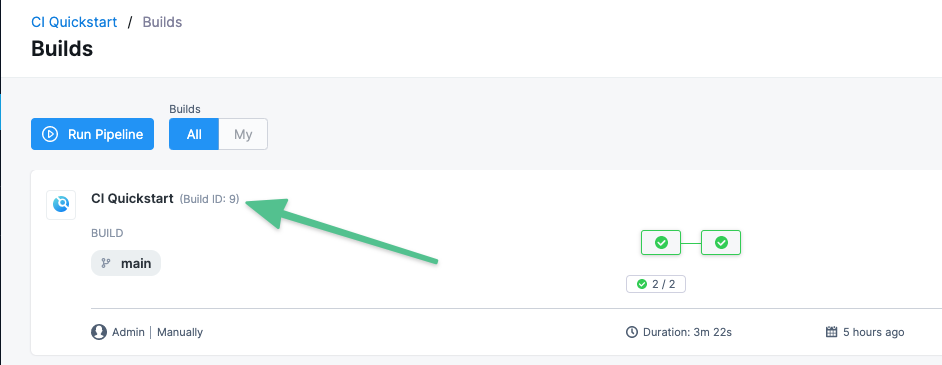

# Build and test on a Kubernetes cluster build infrastructure

This tutorial shows you how to create a two-stage Harness CI pipeline that uses a Kubernetes cluster build infrastructure. The pipeline builds and runs a unit test on a codebase, uploads the artifact to Docker Hub, and then runs integration tests. This tutorial uses publicly-available code, images, and your Github and Docker Hub accounts.

You'll learn how to create a CI pipeline that does the following:

1. Clones the code repo for an app.
2. Uses a Kubernetes cluster build infrastructure.
3. Builds the app code and runs unit tests.
4. Packages the app as a Docker image, and uploads it to Docker Hub.
5. Pulls the uploaded image into the build infrastructure as a service dependency.
6. Runs an integration test against the app.

## Prerequisites

<!-- entire topic: Steps are structured as ul or subsections instead of ol. Use of click v select. Capitalization issues. Some UI labels lacking bold style. We vs you. -->
This tutorial assumes you have experience with Kubernetes, such as setting up service accounts and clusters.

In addition to a Harness account, you need the following accounts and tools:

<!-- revise these -->

* **Github account:** This tutorial clones a codebase from a Github repo. You will need a Github account so Harness can connect to Github.
* **Docker Hub account and repo:** You will need to push and pull the image you build to Docker Hub. You can use any repo you want, or create a new one for this tutorial.
* **Kubernetes cluster for Harness Delegate and build farm:**
	+ You'll need a Kubernetes cluster for Harness to use for the Harness Delegate and as a build farm. Ensure you have a cluster that meets the following requirements:
		- **Number of pods:** 3 (two pods for the Harness Delegate, the remaining pod for the build farm).
		- **Machine type:** 4vCPU
		- **Memory:** 16GB RAM. The build farm and Delegate requirements are low but the remaining memory is for Kubernetes, the Docker container, and other default services.
		- **Networking:** Outbound HTTPS for the Harness connection, and to connect to Docker Hub. Allow TCP port 22 for SSH.
		- **Namespace:** When you install the Harness Delegate, it will create the `harness-delegate` namespace. You'll use the same namespace for the build farm.
* A **Kubernetes service account** with permission to create entities in the target namespace is required. The set of permissions should include `list`, `get`, `create`, and `delete` permissions. In general, the cluster-admin permission or namespace admin permission is enough.

For more information, go to the Kubernetes documentation on [User-Facing Roles](https://kubernetes.io/docs/reference/access-authn-authz/rbac/#user-facing-roles).

:::caution
Google Kubernetes Engine (GKE) [Autopilot](https://cloud.google.com/kubernetes-engine/docs/concepts/autopilot-overview) is not recommended. For more information, go to [Set up a Kubernetes cluster build infrastructure](/docs/continuous-integration/use-ci/set-up-build-infrastructure/set-up-a-kubernetes-cluster-build-infrastructure).
:::

```mdx-code-block
import CISignupTip from '/tutorials/shared/ci-signup-tip.md';
```

<CISignupTip />

## Visual Summary

Here's an architecture diagram of a basic setup for Harness CI:


You must install the Harness Delegate in the same cluster you use for the build farm. The Delegate creates the namespace `harness-delegate`, and you use that namespace for both the Delegate and build farm. You can change the namespace name if you like.

### Video Overview

Here's a quick video that provides an overview of Harness CI:

<!-- Video:
https://harness-1.wistia.com/medias/rpv5vwzpxz-->
<docvideo src="https://harness-1.wistia.com/medias/fsc2b05uxz" />


<!-- div class="hd--embed" data-provider="Wistia" data-thumbnail="">
   <iframe src="//fast.wistia.net/embed/iframe/fsc2b05uxz" allowtransparency="true" frameborder="0" scrolling="no" class="wistia_embed" name="wistia_embed" allowfullscreen="" mozallowfullscreen="" webkitallowfullscreen="" oallowfullscreen="" msallowfullscreen="" width="620" height="349"></iframe><script src="//fast.wistia.net/assets/external/E-v1.js" async=""></script>
</div -->

## Option: Use Your Own Code Repo

For this tutorial, we use a codebase located at: <!-- make this a link -->

`https://github.com/keen-software/goHelloWorldServer`

All steps in this tutorial work with any git repo, so you can use your own code repo instead.

## Step 1: Start a New Pipeline

<!-- Start a new pipeline: “Invite people to collaborate” is on a separate ui page from the other 2 options. After selecting the CI module, you need to select Go to Module. It then starts the pipeline wizard (“Get started” instead of pipelines > create a pipeline. Github connector and delegate steps are later in the tutorial than you need them. Maybe should be before you create the project?). The Flow is Create project > Set up GitHub connector > Config delegate > Then create pipeline (go to builds > get started > select your repo and select ”Next: Configure pipeline” > Select Starter pipeline and select “Create pipeline”. No option to name the pipeline ws given.) -->

Pipelines are a collection of one or more stages. They manage and automate builds, testing, deployments, and other important build and release stages.

1. In Harness, select **Projects** and create a new project with the following settings:
   * **Name:** CI Quickstart
   * **Organization:** default
   * **Invite People to Collaborate:** You don't need to add yourself.
2. In the Modules page, select **Continuous Integration**.
3. Select **Pipelines** and then **Create a Pipeline**.
4. Enter the name **CI Pipeline** and click **Start**.

As you enter a name for the Pipeline, the ID for the Pipeline is created. A Pipeline name can change, but an ID is permanent. The ID is how you can reference subordinate elements of a Pipeline, such as the names of variables within the Pipeline.

## Step 2: Set Up the Build Stage

<!-- Step 2 Set up the Build stage: By selecting the Starter Pipeline, you already have a Build stage. No need to add another one (but could use tabs to compare starter pipeline w regular pipeline). Click the Build stage to edit it. On Overview tab, change name. The repo was already connected in the wizard. -->

The "work horse" of most CI Pipelines is the Build Stage. This is where you specify the end-to-end workflow for your build: the codebase to build, the infrastructure to build it, where to post the finished artifact, and any additional tasks (such as automated tests or validations) you want the build to run.

To run a build, a Build Stage needs to connect to the codebase, the build infrastructure, and the artifact repository. A *Connector* is a configurable object that connects to an external resource automatically.

In this tutorial you'll create a Connector to a GitHub repo. You'll also create a *Delegate* service that handles communications between Harness and your build infrastructure. Later in this tutorial, you'll create a Connector to a Docker Hub repo so the Build Stage can post the resulting artifact.

### Create the Build stage

1. In Pipeline Studio, select **Add Stage** and select **Build**. The **About your Stage** screen appears.
2. In **Stage Name**, enter `Build Test and Push`.
3. Under **Configure Codebase**, select **Connector**.

   

4. In the **Create or Select an Existing Connector** window, select **New Connector**.
5. For the **Connector type**, select **GitHub Connector**.

### Create a Connector to your Codebase

<!-- link to GH connector instructions/step settings reference w/ specification for tutorial repo URL.  Field population instructions should be a series of steps as ol, instead of smaller headings. Under “connector credentials”, add a link to info about using your own secrets manager with Harness. OAuth is an option for github connectors now. -->

You'll now create a new Connector to the GitHub codebase. Set up the Connector as follows.

#### Connector Overview

* **Name:** CI QuickStart

#### Connector Details

You can create Connectors for GitHub accounts or specific repos. If you use an account Connector, you specify the repo when you run the build. In this case, we'll connect to a specific repo.

* **URL Type:** Repository
* **Connection Type:** HTTP
* **GitHub Repository URL:** `https://github.com/keen-software/goHelloWorldServer.git`


#### Connector Credentials

Now you need to specify the username and Personal Access Token for the Connector to use. Harness secrets are safe. They're stored in the [Harness Secret Manager](/docs/platform/Security/harness-secret-manager-overview). You can also use your own Secret Manager with Harness.

* **Username:** The username for your GitHub account.
* **Personal Access Token:** Create a Harness Secret for the Personal Access Token you use for your GitHub repo.
* Select **Enable API Access**.


#### Connector Connectivity Mode

You can choose to establish connections directly from your Harness platform or through a Delegate service running within your corporate firewall.

The Harness Delegate is a local service that connects your infrastructure, collaboration, verification, and other providers with your Harness platform. For this tutorial, you'll install a Delegate in your Kubernetes cluster.

* **Connect to the provider:** Connect through a Harness Delegate


#### Delegate Setup

<!-- this has changed for the new delegate flow. -->
<!--  Delegate setup: You must choose “connect only via delegates with specific tags” to show Install new delegate if there are already delegates available. On the page where you select delegate size and permissions, for K8s, you need to provide delegate tokens. Click +add to add token. On the YAML page, the button is “Download YAML file, not Download Script. The other button is Continue, not Next. I did not get the output described - some lines were present and some were not. -->

You should now be in the Delegates Setup screen of the GitHub Connector wizard. Click **Install new Delegate**.


1. You can use a Helm Chart, Terraform, or Kubernetes Manifest to install Kubernetes delegates. For this tutorial, select **Kubernetes Manifest**. For information about the other options, go to [Install a delegate](/docs/platform/Delegates/install-delegates/install-a-delegate).
2. Usually it makes sense to install and run the Delegate on a pod in your Kubernetes build infrastructure. In a terminal, login to your Kubernetes cluster, and use the `curl` command provided in the **New Delegate** setup to copy the Kubernetes YAML file to the pod where you want to install the Delegate.
3. Update the Kubernetes YAML file as instructed in the **New Delegate** setup. For details about these settings, refer to the **Kubernetes environment** section of [Install a delegate](/docs/platform/Delegates/install-delegates/install-a-delegate).
4. If necessary, specify the **Delegate Size** and **Delegate Permissions**. As a default, you can give the Delegate cluster-wide read/write access. In the future, you can add configurations to run scripts on your Delegates and scope them to different environments.
5. In your Kubernetes cluster, run the `kubectl apply` command to install the delegate, as provided in the **New Delegate** setup. You should get output similar to the following:

   ```
   % kubectl apply -f harness-delegate.yaml  
   namespace/harness-delegate-ng created  
   clusterrolebinding.rbac.authorization.k8s.io/harness-delegate-ng-cluster-admin created  
   secret/ci-quickstart created  
   statefulset.apps/ci-quickstart created  
   service/delegate-service created
   ```

6. Return to the Harness UI and select **Verify** to test the connection. It might take a few minutes to verify the Delegate. Once it is verified, exit delegate creation and return to connector setup.
7. In your codebase connector's **Delegates Setup**, select **Only use Delegates with all of the following tags**.
8. Select your new Kubernetes delegate, and then select **Save and Continue**. Select the new delegate in your Kubernetes.
9. Wait while Harness tests the connection, and then select **Finish**. Back in **About Your Stage**, the Connector and repo are displayed.

   

10. Click **Set Up Stage**. The new stage is added to the Pipeline.

## Step 3: Define the Build Farm Infrastructure

<!-- Step 3 Define build farm infra: continue to Infrastructure tab. Select K8s. Select K8s Cluster. Select New Connector. Follow steps to connect delegate and stuff. Click Continue to go to Execution tab. -->

Here you'll define the build farm infrastructure and the stage steps.

* Under Select a Kubernetes Cluster, click **Select**.

   

* Click **New Connector** and set up the new Connector as follows:
	+ **Name:** ci-delegate
	+ **Details:** Select **Use the credentials of a specific Harness Delegate**. You'll add this Delegate next.
	+ **Delegates Setup:** Select the Kubernetes Delegate you added earlier using its Tags.
	+ **Connection Test:** Wait for the test to finish and then click **Finish**. The new Connector is added to the Kubernetes Cluster field.
* In **Namespace**, enter the namespace `harness-delegate-ng`. Click **Next** to proceed to the Execution tab.

Now that the build farm infrastructure is set up, you can run unit tests against your code.

## Step 4: Build and Run Unit Tests

<!-- Step 4 build and run unit tests: Delete echo welcome message step. The instruction for the name field is given twice. Missing instruction to select “Connect thru a harness delegate >only use delegates w following tags” after setting up the secret. Report paths are under optional config (have to expand). -->

Next, we'll add a Run step to the stage that will build the code and run a unit test.

You should now be in the Execution tab. Click **Add step** and then select **Run** (under Build).

The Run step executes one or more commands on a container image. Configure the step as follows:

* **Name:** Run Unit Tests
* **Container Registry:** Click **Select** and then **+New Connector**.
* **Select your Connector Type:** Docker Registry

You will now create a new Connector to your DockerHub account as follows.

### Docker Connector Overview

* **Name:** Docker Quickstart

### Docker Connector Details

* **Docker Registry URL:** `https://index.docker.io/v1/`
* **Provider Type:** Docker Hub
* **Username:** The username for your Docker Hub account
* **Password:** Create a Harness Secret for the Personal Access Token you use with your Docker Hub account. You can also use your own Secret Manager.


### Delegates Setup

* **Delegates Setup:** Select the new Delegate you installed previously using its Tags.
* Wait for the Connector test to complete and then click **Finish**.
* You should now be in the Configure Run Step pane, with the new Connector in the Container Registry setting. Configure the step as follows:
	+ **Name:** Run Unit Tests
	+ **Container Registry:** This should show the Docker Hub Connector you just created.
	+ **Image:** `golang:1.15`
	+ **Command:**
	```
	go get gotest.tools/gotestsum  
	gotestsum --format=standard-verbose --junitfile unit-tests.xml || true  
	CGO_ENABLED=0 GOOS=linux GOARCH=amd64 go build -a -tags netgo
	```
	The last line contains the `go build` command to compile the package, along with its dependencies.
	+ **Report Paths (Optional Configuration):** `*.xml`
	+ Click **Apply Changes**.
	+ In the Pipeline Studio, click **Save**.

This **Run** step will intentionally fail the test. This will be useful to see how a test failure is recorded in Harness.

## Step 5: Build and Push Image to Docker Hub

<!-- Step 5 build and push image to docker hub: use <docker_username> instead of <your_repo>. -->

Next, you'll add a step to build your container and push it to your Docker Hub repo. You'll need a repo in your Docker Hub account to receive the artifact.

* You should be in the Execution tab of the Built Test and Push Stage. Click **Add step**, then click **Build and Push an Image to Docker Registry**.
* Configure the step as follows:
	+ **Name:** Build and push an image to Docker Registry
	+ **Docker Connector:** Select the Docker Hub Connector you set up previously.
	+ **Docker Repository:**
		- Create a `ciquickstart`repository in your Docker Hub account.
		- Then enter`<your_repo>/ciquickstart`where *`<your_repo>`* is your Docker Hub username.
	+ **Tags:** `<+pipeline.sequenceId>`  
	This tag is a built-in Harness variable that represents the Build ID number, for example `Build ID: 9`. The pipeline uses the Build ID to tag the image that it pushes in stage 1 and pulls in stage 2. You will see the Build ID when you run the pipeline. You will also use this variable to identify the image location when you set up the [Configure Service Dependency](/docs/continuous-integration/ci-technical-reference/configure-service-dependency-step-settings) step in the next stage.
    
	+ Click **Apply Changes** to return to the Pipeline Studio.
* Click **Save** to save the Pipeline. You can run the Pipeline now, or you can continue and add the Integration Test stage.

## Step 6: Create the Integration Test Stage

<!-- Step 6 create the integration test stage: “click infrastructure” should be “select Infrastructure tab”. The button is “Continue” not “Next”. The “image” instruction is wrong - <your repo> is your username, not the docks hub repo name. Also, “Service Dependency” is deprecated, no longer available in the UI but backwards compatible in YAML. This tutorial needs to use “Background step” instead of “Service Dependency”. -->

Now you have a Stage to clone, build, containerize, and then push your image to Docker Hub. In this step you'll add a Stage to pull that image, run it in a container, and run integration tests on it.

* Click **Add Stage**, and select **Build**.
* Enter the name **Run Integration Test**, disable **Clone Codebase**, and then click **Set Up Stage**.

<!-- I think disabling clone codebase caused an error: -->
<!-- Can’t find git repo error: Click “Codebase” pipeline editor page (far right). Input specific branch name so the full URL resolves. Save > Save. -->
<!-- The tutorial has a problem that the unit test step fails because it cant find where to write the reports. The fix for this was that Clone Codebase should NOT be disabled. I also think it might be relevant for the GitHub connector to be a GitHub repo instead of a GitHub account. -->


### Define Stage Infrastructure

Here you configure the stage to use the same infrastructure as the previous stage.

* Click **Infrastructure**.
* Select **Propagate from an existing stage**.
* Select the previous stage. This will use the same Kubernetes cluster and namespace as the first stage.
* Click **Next**.

### Add Built Image from Stage 1 as a Service Dependency

In the Build Test and Push stage, you built your code and pushed your built image to Docker Hub. Now, in Run Integration Test, you will identify the image as a Service Dependency for your test stage. Harness will pull the image onto the container in your infrastructure. Next, it will start the Hello World Server in the image.

* In the Run Integration Test stage > Execution tab, click **Add Service Dependency**.
* Configure the dependency:
	+ **Dependency Name:** Run Hello World Server
	+ **Container Registry:** The same Docker Hub Connector you used in the Build Test and Push stage.
	+ I**mage:** `<your_repo>/ciquickstart:<+pipeline.sequenceId>`  
	Replace `<your_repo>` with the name of the Docker Hub repo you are using for this tutorial.
* Click **Apply Changes**.

Notice that the Image field uses the same variable `<+pipeline.sequenceId>` for the Image that you used in the previous stage. This tells Harness to pull the image with the same tag as the image pushed previously. Here's an example:

| Build and Test and Push (stage 1) Build and Push to Docker Hub step | Run Integration Test (stage 2) Configure Service Dependency step |
| - | - |
|  |  |

### Add Integration Test Step

Next, we can run an integration test. We'll simply test the connection to the server.

* Click **Add Step**, and then click **Run**.
* Configure the step as follows:
	+ **Name:** test connection to server
	+ **Container Registry:** The Docker Hub Connector you've been using.
	+ **Image:** `curlimages/curl:7.73.0`
	+ **Command:**
	```
	sleep 10  
	curl localhost:8080  
	curl localhost:8080?Hello!_I_am_a_nice_demo!
	```
	+ Click **Apply Changes**. You are now back the Pipeline Studio.

## Step 7: Run the Pipeline

The Build Pipeline is complete. You can now run it.

* Click **Save**.
* Click **Run**. The Pipeline Inputs settings appear.
* Under CI Codebase, select **Git branch**.
* In Git Branch, enter the name of the branch where the codebase is, such as **main**.
* Click **Run Pipeline**.

## Step 8: View the Results

Click each stage's steps to see the logs in real time.


Click **Console View** to see more details.


You can see the build number in the **Build and push image to Docker Hub** step used as an image tag. For example, 11:


```
--destination=myrepo/ciquickstart:11
```
In the Initialize step of the **Run Integration Test** stage, you can see the image with the same tag pulled from your Docker Hub repo:


```
   8 Pulling image "myrepo/ciquickstart:11"  
   9 Successfully pulled image "myrepo/ciquickstart:11" in 1.878887425s
```
Now look in your Docker Hub repo. You can see the image and tag:


Click **Tests**. You can see the failed test from stage 1.


Click **Builds**. Your build appears.


Congratulations! You have created a CI pipeline that builds and tests your code.

## Using YAML

The entire Pipeline is available as YAML, also.

* In **Builds**, click more options (︙) and select **Edit Pipeline**.
* Click **YAML**.


You can see the entire Pipeline as YAML. You can edit anything in the Pipeline and run it again.

```yaml
pipeline:  
    name: CI Pipeline  
    identifier: CI_Pipeline  
    allowStageExecutions: false  
    projectIdentifier: CI_QuickStart_20220401  
    orgIdentifier: default  
    tags: {}  
    properties:  
        ci:  
            codebase:  
                connectorRef: CI_QuickStart  
                build: <+input>  
    stages:  
        - stage:  
              name: Build Test and Push  
              identifier: Build_Test_and_Push  
              type: CI  
              spec:  
                  cloneCodebase: true  
                  infrastructure:  
                      type: KubernetesDirect  
                      spec:  
                          connectorRef: cidelegate  
                          namespace: harness-delegate-ng  
                  execution:  
                      steps:  
                          - step:  
                                type: Run  
                                name: Run Unit Tests  
                                identifier: Run_Unit_Tests  
                                spec:  
                                    connectorRef: Docker_Quickstart  
                                    image: golang:1.15  
                                    command: |-  
                                        go get gotest.tools/gotestsum  
                                        gotestsum --format=standard-verbose --junitfile unit-tests.xml || true  
                                        CGO_ENABLED=0 GOOS=linux GOARCH=amd64 go build -a -tags netgo  
                                    privileged: false  
                                    reports:  
                                        type: JUnit  
                                        spec:  
                                            paths:  
                                                - "*.xml"  
                          - step:  
                                type: BuildAndPushDockerRegistry  
                                name: Build and push image to Docker Hub  
                                identifier: Build_and_push_image_to_Docker_Hub  
                                spec:  
                                    connectorRef: Docker_Quickstart  
                                    repo: dockerhubuser/ciquickstart  
                                    tags:  
                                        - <+pipeline.sequenceId>  
        - stage:  
              name: Run Integration Test  
              identifier: Run_Integration_Test  
              type: CI  
              spec:  
                  cloneCodebase: false  
                  infrastructure:  
                      useFromStage: Build_Test_and_Push  
                  serviceDependencies:  
                      - identifier: Run_Hello_World_Server  
                        name: Run Hello World Server  
                        type: Service  
                        spec:  
                            connectorRef: Docker_Quickstart  
                            image: dockerhubuser/ciquickstart:<+pipeline.sequenceId>  
                  execution:  
                      steps:  
                          - step:  
                                type: Run  
                                name: test connection to server  
                                identifier: test_connection_to_server  
                                spec:  
                                    connectorRef: Docker_Quickstart  
                                    image: curlimages/curl:7.73.0  
                                    command: |-  
                                        sleep 10  
                                        curl localhost:8080  
                                        curl localhost:8080?Hello!_I_am_a_nice_demo!  
```
