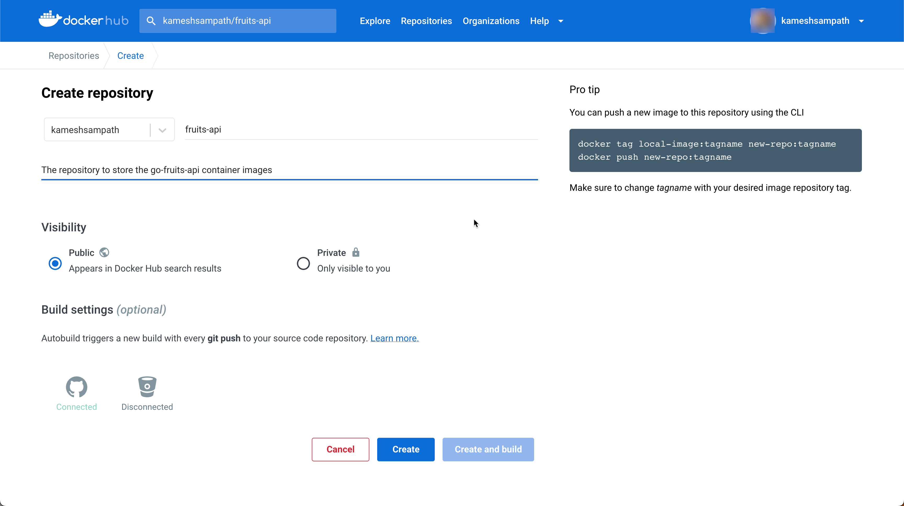
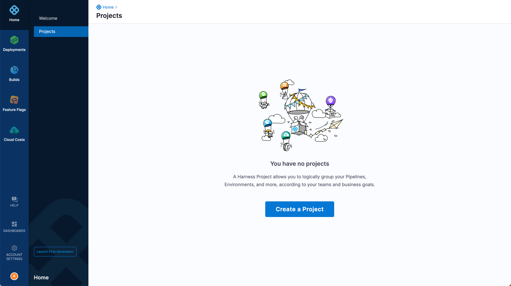
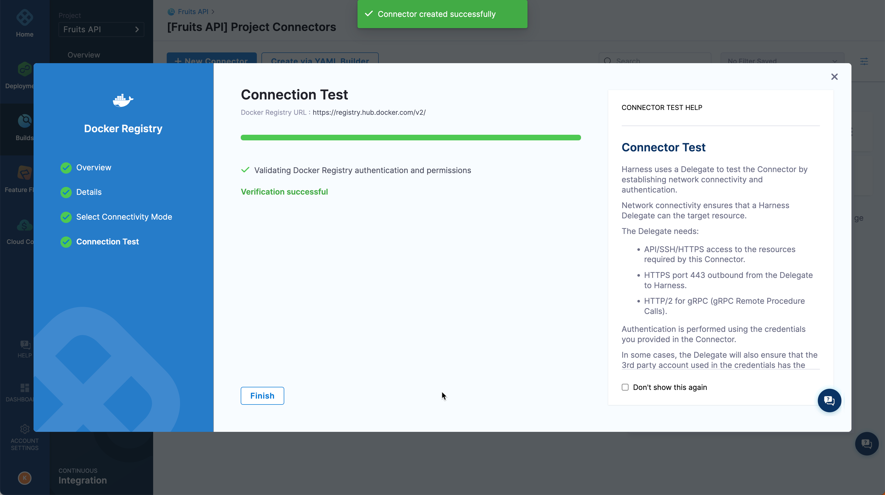

# Build Rust Application Containers

## Objectives

At the end of this tutorial you will learn,

- [x] How to register for a Harness Account and activate your Free Tier
- [x] What is a __Project__ and how to configure one on your Harness Account
- [x] What are [__Secrets__](https://docs.harness.io/article/hv2758ro4e-learn-harness-key-concepts#secrets_management) and how to add them to your Project
- [x] What are [__Connectors__](https://docs.harness.io/article/hv2758ro4e-learn-harness-key-concepts#connectors) and how to add a Docker Registry Connector to your Project
- [x] How to build multi architecture [rust](https://www.rust-lang.org/) application container image

## Pre-requisites

Before you get started with the tutorial make sure you have the following accounts,credentials and tools,

- A [GitHub](https://github.com) account, where you may need to fork the tutorial sources.
- A Docker Registry account, e.g [DockerHub](https://hub.docker.com), [Quay.io](https://quay.io)
- [Drone CLI](https://docs.drone.io/cli/install/) to build the application locally.
- [Docker Desktop](https://www.docker.com/products/docker-desktop/)

<CISignupTip />

## Overview

As part of this tutorial we will be building a simple REST API called `greeter-api` using [Rust](https://rust-lang.org).

## Tutorial Source

The complete demo source is available here <https://github.com/harness-apps/rust-greeter>, fork the repository on to your GitHub account. For rest of the tutorial we will refer to this repository as `$TUTORIAL_GIT_REPO`.

## Building Application Locally

Languages and package formats have build specific tools. One of the core problems that a developer might face is to install the right version of those tools on their local machines. This approach has potential pit falls and leads to __Works only on my machine__ scenarios.

Docker containers solved this problem and helped us to have clean environment that had right set of tools, encouraging the __DevOps__ best practices right from the start. This approach also helps to identify the potential issues with the application at development stage.

[Drone by Harness](https://drone.io) is an open source CI platform that can help building and testing on your local machines without the need of installing the tools as required by the programming languages.

But before we start to build the application, we need place to store the artifacts of the build i.e. container images. In container/Cloud Native world this is called a __Container Registry__ e.g Docker Hub, Quay.io, Harbor etc.,

## Configure Container Registry

Like any file you want to share with the world, storing them in an external spot makes them more accessible. A big benefit of using containers as a packaging format is the ecosystem of container registries out there. Your firm might have a registry provider such as Docker Hub, Quay.io, Harbor, Google Container Registry(GCR), Elastic Container Registry(ECR) etc.,

For this tutorial we will be using [Docker Hub](https://hub.docker.com/). If you do not have a registry available to you, you can create a [Docker Hub account](https://hub.docker.com/signup) and then create a repository `fruits-api`, where we will push our `fruits-api` application container image.



With us having created the `fruits-api` repository, lets test our repository by building and pushing the image to the registry,

Login to your Docker Hub Account,

```shell
echo -n "$DOCKER_HUB_PASSWORD" |\
  docker login -u `$DOCKER_HUB_USERNAME` --password-stdin
```

:::info

- `$DOCKER_HUB_USERNAME` - Docker Hub username, the one you used while registering the for the Docker Hub account or the one you wish to use if you already have an account with Docker Hub.
- `$DOCKER_HUB_PASSWORD` - Docker Hub user password

:::

Let us clone the tutorial application from <https://github.com/harness-apps/rust-greeter>,

```shell
#  clone rust-greeter repository
git clone https://github.com/harness-apps/rust-greeter.git \
  && cd "$(basename "$_" .git)"
# navigate to the clone repository folder
export TUTORIAL_HOME="$PWD"
```

:::tip

[GitHub Cli](https://cli.github.com/) is very handy tool to work with the GitHub repositories from the command line.

:::

Create your fork of the tutorial repository,

```shell
gh repo fork
```

:::note

You can also create your fork from the tutorial repository <https://github.com/harness-apps/rust-greeter> directly from GitHub.

:::

To make things simple let use [Drone by Harness](https://drone.io) to build and push the image from your laptops to the Docker Hub repository `fruits-api`,

Copy `$TUTORIAL_HOME/.env.example` to `$TUTORIAL_HOME/.env`,

```shell
cp $TUTORIAL_HOME/.env.example $TUTORIAL_HOME/.env
```

Edit the `$TUTORIAL_HOME/.env` and update it with following,

```properties
PLUGIN_REGISTRY=docker.io
PLUGIN_USERNAME=$DOCKER_HUB_USERNAME
PLUGIN_PASSWORD=$DOCKER_HUB_PASSWORD
PLUGIN_REPO=$DOCKER_HUB_USERNAME/rust-greeter
PLUGIN_TAG=0.0.1
```

:::note
Replace the `$DOCKER_HUB_USERNAME`, `DOCKER_HUB_PASSWORD` with your docker hub username and password values.
:::

```shell
drone exec --trusted --env-file=.env
```

:::note
It will take few mins for the build and push to complete as Drone will try to pull the container images if not exists.
:::

If all went well your command line output(trimmed for brevity) should like,

```text
...
[push:350] The push refers to repository [docker.io/$DOCKER_HUB_USERNAME/rust-greeter:0.0.1]
[push:351] 639e874c7280: Preparing
[push:352] 96e320b34b54: Preparing
[push:353] c306578afebb: Preparing
[push:354] 96e320b34b54: Layer already exists
[push:355] c306578afebb: Pushed
[push:356] 639e874c7280: Pushed
...
```

You can check the pushed image at <https://hub.docker.com/repository/docker/$DOCKER_HUB_USERNAME/rust-greeter>.

Simple enough locally to get your local build and packaging in. Our process to build and push the __go__ application looks like,


These sequence of steps is referred to as a __Pipeline__ in Continuous Integration(CI) world.

The drone pipeline `push` step uses [drone-docker-buildx](https://drone-plugin-index.geekdocs.de/plugins/drone-docker-buildx/) which can build multi architecture container images. In this tutorial we will be build `linux/arm64` and `linux/amd64` images.

The `drone exec` that we did earlier is OK as long you are playing/learning a technology in other words laptop use cases, when you are working on a team to deliver some enterprise application then it becomes super critical that this process be centralized and automated. [Harness Platform](https://harness.io/) helps you do exactly that and much more.

The next sections this tutorial helps you get started on the building your CI Pipeline using Harness platform.

## Your Continuous Integration Infrastructure

If you took a closer look at what your machine was doing during those local builds, the machine was bogged down for a few moments. For yourself, that is fine, but imagine having to support 10’s or 100’s or even 1000’s of engineers, this process can be taxing on systems. Luckily, modern Continuous Integration Platforms are designed to scale with distributed nodes. Harness Continuous Integration is designed to scale and simplify getting your local steps externalized; this is the Continuous Integration Pipeline. Let’s enable Harness Continuous Integration to mimic your local steps and create your first CI Pipeline. Once you are done, you will have a repeatable, consistent, and distributed build process.

There are a few Harness resources to create along the way, which this guide will walk through step-by-step.There are two paths to take. One path is to have Harness host all of the needed infrastructure for a distributed build. The second is to bring your own infrastructure for the distributed build.

__Hosted Infrastructure__:


__Bring Your Own Infrastructure__:


For this tutorial we will be using the __Hosted Infrastructure__ as thats the only infrastructure available for _Free Tier_.

### Starting off with Harness

Harness is a Platform which has lot of modules, but for this tutorial we will focus on the Continuous Integration(CI) module. 

First, sign up for a [Harness account to get started](https://app.harness.io/auth/#/signup/?module=ci&?utm_source=website&utm_medium=harness-developer-hub&utm_campaign=ci-plg&utm_content=get-started).


### GitHub Personal Access Token(PAT)

Assuming you are leveraging GitHub, Harness will need access to the repository. It is recommended to use GitHub [Personal Access Token(PAT)](https://docs.github.com/en/authentication/keeping-your-account-and-data-secure/creating-a-personal-access-token) as a mode of providing Github credentials.

If you have not created a PAT before, on your GitHub account navigate to __Settings__ -> __Developer Settings__ -> __Personal Access Tokens__.


:::important

- Make sure to jot down the __token__ as the token will only be displayed once. For rest of the tutorial we will refer to this token value as `$GITHUB_PAT`.
  
:::

If you plan to bring in your PAT then make sure it has the scopes `admin:repo_hook` and `user`.

### Create Project

Harness Platform organizes the resources like pipelines, secrets, connectors at various scopes such as Account, Organization and Project. For this tutorial we will create all our resources at Project scope.

Login to your Harness Account that you created earlier and create a new project,



On the new project page, click __Create Project__ to create a new project named _Greeter API_.


Leave other options to defaults and click __Save and Continue__. On the modules select _Continuous Integration_,


Now you are ready to wire in the pieces to Harness Continuous Integration.

## Create Your First Pipeline

In the Build Module [Harness Continuous Integration], walking through the wizard is the fastest path to get your build running. Click Get Started. This will create a basic Pipeline for you.


Click __Get Started__, select GitHub as the repository to use, and enter your GitHub Access Token `$GITHUB_PAT` and finally click __Test Connection__ to verify your credentials work,


Click __Continue__, click __Select Repository__ to select the Git Hub Repository that you want to build _harness-apps/rust-greeter_.


:::note
Please ensure the repository you select here is your fork of <https://github.com/harness-apps/rust-greeter>.
:::

Can leverage one of the Starter Configs or create a Starter Pipeline. In this case we will use the default __Starter Pipeline__


Click __Create Pipeline__ to start adding the pipeline steps.

There are two ways to add your pipeline steps, _visual_ or _YAML_. For rest of the tutorial we will use the _visual_ editor.


The scaffolding would have added a single step called _Echo Welcome Message_.

Before we get to adding other steps, we need some resources that the steps require namely secrets and connectors.

### Create Docker Hub Password Secret

Navigate to __Project Setup__ --> __Secrets__,


Click __+ New Secret__ and select __Text__,


Fill your Docker Hub password on the  __Add new Encrypted Text__ window,


### Create Docker Hub Registry Connector

Next let we need to add __Connector__ that allows us to connect and later push the image to our Docker Hub repository.

Navigate to __Project Setup__ --> __Connectors__,


Click __+ New Connector__ and select __Docker registry__,


On the new connector wizard __Overview__ screen, enter the name of the connector as `docker hub`,


Click __Continue__ to configure the credentials,


:::note

- Update the __Username__ with your `$DOCKER_HUB_USERNAME`
- For the __Password__ field click _Create or Select a Secret_ to select the secret _**docker hub password**_(Project Scope).

:::

Click __Continue__  and use the _Harness Platform_ as the connectivity mode option,


Click __Save and Continue__ to perform the connectivity test,



Click __Finish__ to complete the creation of Connector resource.


Now you are all set to add other steps to the __Build Go__ pipeline.

### Update Pipeline

Navigate to the __Projects__ --> __Pipelines__,


Click __Build__ pipeline,


Delete the existing __Echo Welcome Message__ step by clicking the `x` that appears when you hover over the step.

__How can the _test_ step connect to other dependent services ?__

Harness Pipelines support a concept called as __Service Dependency__, it is a detached service that's accessible to all Steps in a Stage. Service dependencies support workflows such as

- Integration testing: You can set up a service and then run tests against this service.

- Running Docker-in-Docker: You can set up a [dind service](https://ngdocs.harness.io/article/ajehk588p4) to process Docker commands in Run Steps.

In our tutorial we will use the _Integration testing_ workflow to make the __test__ step to connect to _rgreeter_ and run the integration test cases against it.

### Add the rgreeter Service Dependency

Click __Add Step__ to add a new step called __rgreeter__, from the _Step Library_ choose step type as __Background__ and configure the step with details:

__Name__:

```text
rgreeter
```

__Description__:

```text
runs the Greeter API Service
```

Select the __Shell__ to be `Bash`.

__Command__:

```shell
cargo run --target-dir=/tmp/build
```

Expand __Additional Configuration__ and select the __Container Registry__ to be `docker hub`.

__Image__:

```text
kameshsampath/rust-zig-builder:v0.1.0
```


Add environment variables to be used in the step,


Click __Apply Changes__ to save the step and click __Save__ to save the pipeline.

As  __rgreeter__ service takes few mins to come up, we need to wait before other steps start to use them,

Click __Add Step__ to add a new step called __wait for service__, from the _Step Library_ choose step type as __Run__ and configure the step with details:

Configure the wait  service with details:

__Name__:

```text
wait for service
```

__Description__:

```text
wait for the rgreeter service to be ready
```

Select the __Shell__ to be `Sh`.

__Command__:

```shell
apk add -U --no-cache curl
until curl --output /dev/null --silent --head --fail $SERVICE_URL ; do sleep 5; done;
```

Expand __Additional Configuration__ and select the __Container Registry__ to be `docker hub`.

__Image__:

```text
alpine
```


The wait service need to be configured with the url of the __Background__ service name, which is usually the service id and port, in this case it will be `http://rgreeter:8080`

```shell
SERVICE_URL: http://rgreeter:8080
```


Click __Apply Changes__ to save the step and then click __Save__ to save the pipeline.

As did earlier click __Add Step__ to add a new step called __test__, from the _Step Library_ choose step type as __Run__ and configure the step with details:

__Name__:

```text
test
```

__Description__:

```text
Run the unit and integration tests
```

Select the __Shell__ to be `Bash`.

__Command__:

```shell
cargo test --target-dir=/tmp/build
```

Expand __Additional Configuration__ and select the __Container Registry__ to be `docker hub`.

__Image__:

```text
kameshsampath/rust-zig-builder:v0.1.0
```


For the __test__ step to connect to the __rgreeter__ service add the following environment variables to the step configuration.

```shell
SERVICE_URL: http://rgreeter:8080
```

The _environment_ variables could be added by clicking __+ Add__ under __Environment Variables__ section of the step configuration,


Click __Apply Changes__ to save the step.

:::tip
You can awake step configuration screen by clicking the step on the visual editor.
:::

Click __Save__ to save the pipeline.

### Test the Application

Let us verify if were able to _**test**_ our rust application.

Click __Run__ from the pipeline editor page,


Leaving everything to defaults namely __Git Branch__ and __Branch Name__ to be _main_, click __Run Pipeline__ to start the pipeline run. If all ran well you should see a successful pipeline run as shown,


:::tip
You can click on each step to view the logs of the respective step
:::

Having tasted the success with our pipeline run, let us two more steps __build__ and __push__ that will build and push the rust application to the container registry.

### Build and Push Image to Container Registry

From execution window click __Edit Pipeline__ to get back the __Pipeline Studio__, click the __Build__ stage to open the pipeline editor,

#### Build the Application

As did earlier click __Add Step__ to add a new step called __build__, from the _Step Library_ choose step type as __Run__ and configure the step with details:

__Name__:

```text
build
```

__Description__:

```text
Build the application and cross compile the binary with architectures linux/arm64 and linux/amd64
```

Select the __Shell__ to be `Bash`.

__Command__:

```shell
task cross
```

:::tip

The command uses [Taskfile](https://taskfile.dev) -- Task is a task runner / build tool that aims to be simpler and easier to use than, for example, [GNU Make](https://www.gnu.org/software/make/) --

The `task cross` executes the <https://github.com/harness-apps/rust-greeter/blob/main/Taskfile.yaml#L95-L101> that does cross compilation.

:::

Expand __Additional Configuration__ and select the __Container Registry__ to be `docker hub`.

__Image__:

```text
kameshsampath/rust-zig-builder:v0.1.0
```


### Push Image to Container Registry

Click __Add Step__ to add a new step called __push__, from the _Step Library_ choose step type as __Run__ and configure the step with details,

__Name__:

```text
push
```

__Description__:

```text
Publish the multi architecture images to container registry
```

Choose __Bash__ to be the __Shell__

__Command__:

```shell
echo "$IMAGE_REGISTRY_PASSWORD" | \
docker login "$IMAGE_REGISTRY" -u "$IMAGE_REGISTRY_USER" --password-stdin
docker buildx inspect "buildx-multi-arch" ||\
  docker buildx create --name="buildx-multi-arch" --driver=docker-container --driver-opt=network=host
docker buildx build --builder="buildx-multi-arch" --push \
  --tag "$IMAGE_REGISTRY/$IMAGE_REPO:$IMAGE_TAG" \
  --tag "$IMAGE_REGISTRY/$IMAGE_REPO:latest" \
  --platform="linux/amd64" --platform="linux/arm64" \
  --file Dockerfile "$CONTEXT"
```


The shell command runs the `docker buildx build`, that will build a multi architecture image for platforms `linux/amd64` and `linux/arm64`. You also notice we are using a bunch of environment variables in the shell script.

Update the __Environment Variables__ section with values,

```shell
DOCKER_HUB_USERNAME: $DOCKER_HUB_USERNAME
DOCKER_HUB_PASSWORD: <+secrets.getValue("docker_hub_password")>
CONTEXT: /harness/target
IMAGE_REGISTRY: docker.io
IMAGE_REPO: $DOCKER_HUB_USERNAME/rust-greeter
IMAGE_TAG: <+codebase.shortCommitSha>
```

Expand the __Optional Configuration__ section and add the environment variables,


:::note

- As marked ensure the `DOCKER_HUB_PASSWORD`, `IMAGE_TAG` is of type __Expression__
- `secrets.getValue` is an expression that allows to get the value from the secret `docker_hub_password`, that was created earlier in the tutorial. Check the [docs](https://developer.harness.io/docs/platform/security/add-use-text-secrets/#step-3-reference-the-encrypted-text-by-identifier) for more info
- All `$DOCKER_HUB_USERNAME` references should your Docker Hub Username
- `codebase.shortCommitSha` allows you to get the short git commit SHA, you can check the  built-in [codebase variables](https://developer.harness.io/docs/continuous-integration/ci-technical-reference/built-in-cie-codebase-variables-reference/) for other variables that are available.

:::

Click __Apply Changes__ to save the step and click __Save__ to save the pipeline.


With those changes saved, you are ready to test, build and push your __rust__ application to container registry(DockerHub).

### Run CI Pipeline

As did earlier click __Run__ from the pipeline editor window,


Leaving everything to defaults namely __Git Branch__ and __Branch Name__ to be _main_, click __Run Pipeline__ to start the pipeline run.

Now you are ready to execute. Click "Run Pipeline".

Once a successful run, head back to Docker Hub, and tag `latest` and `last git commit sha` is there!


## Test Application

You can test the application using [Docker Compose](https://docs.docker.com/compose/) like,

```dockercompose
services:
  helloworld:
    image: "$DOCKER_HUB_USERNAME/rust-greeter"
    pull_policy: always
    environment:
      - RUST_LOG=info
      - PORT=8080
    ports:
      - "8080:8080"
```

You can then try the urls to verify the application,

- <http://localhost:8080/> - returns a plain text `Hello World!`
- <http://localhost:8080/> - returns a JSON like,
  ```json
  {
    "message": "Hello! Anonymous!"
  }
  ```
- <http://localhost:8080/?name=Jack> - returns a JSON like
 ```json
  {
    "message": "Hello! Jack!"
  }
  ```

## Making Builds Faster

As you have noticed that rust build downloads the need crates from the registry for each step `rgreeter`, `test` and `build`. Ideally these steps can reuse the cache by sharing them between steps. Check the [Share and Cache CI Data](https://developer.harness.io/docs/category/share-and-cache-ci-data) to learn more.

:::note Exercise

As an exercise add two additional steps that can cache and restore the rust crates.

__Clues__:

- You need to cache `/usr/local/cargo/registry` and make it available to all steps.
- Add one step before `rgreeter`, that restores or downloads cache.
- Add one step after `push`, that uploads the cache.
  
:::

## Continuing on Your Continuous Integration Journey

This is just the start of your Continuous Integration journey. It might seem like multiple steps to get your local build in the platform, but it unlocks the world of possibilities.

You can now execute your builds whenever you want in a consistent fashion. Can modify the trigger to watch for SCM events so upon commit, for example, the Pipeline gets kicked off automatically. All of the objects you create are available for you to re-use. Lastly, you can even save your backing work / have it as part of your source code. Everything that you do in Harness is represented by YAML; feel free to store it as part of your project.

After you have built your artifact, the next step is to deploy your artifact. This is where Continuous Delivery steps in and make sure to check out some other [CD Tutorials](/tutorials/deploy-services#all-tutorials).
