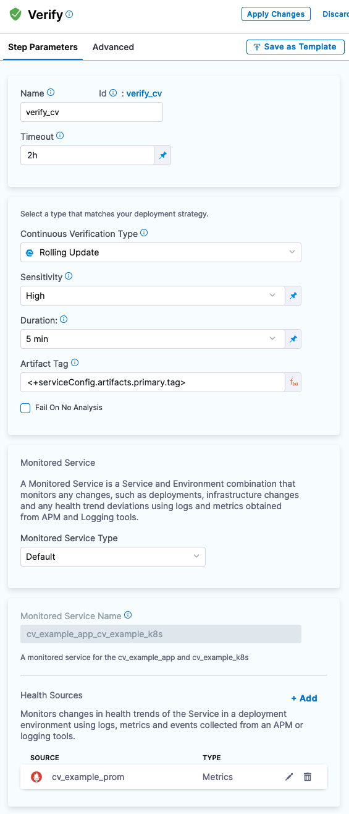
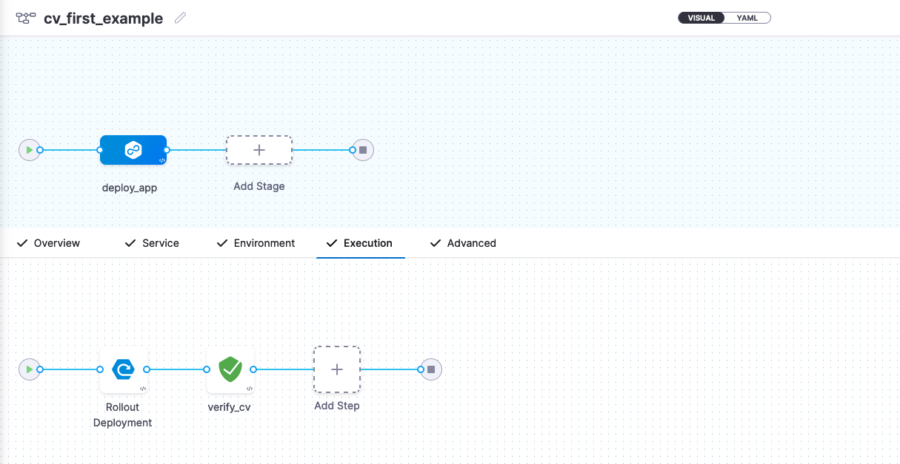
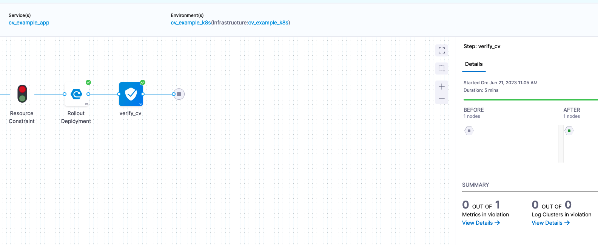
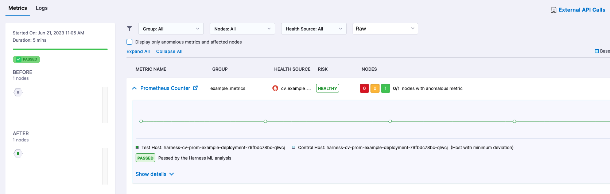

# Verify Kubernetes Deployment with Prometheus 

<ctabanner
  buttonText="Learn More"
  title="Continue your learning journey."
  tagline="Take a Continuous Delivery & GitOps Certification today!"
  link="/certifications/continuous-delivery"
  closable={true}
  target="_self"
/>

When validating a deployment, looking at external systems such as APM, logging, or monitoring solutions is an approach to validate deployments in a systematic manner. Harness Continuous Verification has the capability of querying these systems on your behalf to validate your deployments. Harness also has the ability to [apply AI/ML](https://developer.harness.io/docs/continuous-delivery/verify/cv-concepts/machine-learning) to watch markers that are trending towards failure or regression. 

In this tutorial, we will [deploy an application that writes to a Prometheus](https://github.com/harness-apps/cv-example-app) endpoint and is validated by Harness Continuous Verification. 


## Prerequisites 

To deploy to Kubernetes with Harness, you will need a manifest and access to a Kubernetes cluster. To deploy the Sample Application in an existing K8s cluster:

* A Harness Account ([Sign Up Here](https://app.harness.io/auth/#/signup/?module=cd&?utm_source=website&utm_medium=harness-developer-hub&utm_campaign=cd-plg&utm_content=get-started))
* Connectivity to [GitHub](https://developer.harness.io/docs/platform/Connectors/Code-Repositories/ref-source-repo-provider/git-hub-connector-settings-reference)
* Connectivity to [Docker Hub](https://developer.harness.io/docs/platform/connectors/artifact-repositories/connect-to-harness-container-image-registry-using-docker-connector/)
* A Prometheus Endpoint

If you do not have access to [Prometheus](https://prometheus.io/), can install the Prometheus on your Kubernetes cluster. 

### Installing Prometheus
Can install Prometheus with Helm. 

```
helm repo add prometheus-community https://prometheus-community.github.io/helm-charts

helm repo update

helm upgrade --install prometheus prometheus-community/prometheus \
--namespace prometheus --create-namespace
```

Next step would be to expose Prometheus via NodePort.

```
kubectl expose deployment -n prometheus prometheus-server --type=NodePort --name=prometheus-service
```

Then browse to `node_public_ip:nodeport`.

```
#Node External IP
kubectl get nodes -o wide

#NodePort for prometheus-service
kubectl get svc -n prometheus
```

With Prometheus installation out of the way, next is to validate your application writes to a Prometheus endpoint or can use the Sample Application. 

## How Applications Write to Prometheus
Prometheus is a [time series database](https://prometheus.io/docs/concepts/data_model/) where your metrics are stored. Writing to Prometheus entails providing a key/value pair of the metric and value. Depending on the language your application is using, there can be different Prometheus SDKs to take advantage of to facilitate the reading and writing of metrics.  

The [Spring Boot Sample Application](https://github.com/harness-apps/cv-example-app) is a good example of the underpinnings that are needed to write to Prometheus. In the [pom.xml](https://github.com/harness-apps/cv-example-app/blob/main/pom.xml) is the [Micrometer configuration](https://micrometer.io/docs/registry/prometheus) to get connection and auto-wire information on Prometheus. Then in the[ application code](https://github.com/harness-apps/cv-example-app/blob/main/src/main/java/io/harness/cv/example/app/GenerateStableMetrics.java), can leverage the JAVA SDK to write to the Prometheus primitives. The Sample Application has two versions of the application that can toggle between a `stable` and `unstable` mode which have separate images for deployment convenience. The `stable` and `unstable` versions have different classes that write varying metric values.  

By installing the Prometheus Helm Chart into your Kubernetes cluster, you also get a good set of Kubernetes-centric metrics that are scrapped and exported for your convenience. 

## Verifying a Deployment with Harness
There are a few objects to line up in Harness. Starting with the un-validated deployment itself. A deeper dive on deploying a manifest can be found in the [Kubernetes Manifest Tutorial](https://developer.harness.io/tutorials/cd-pipelines/kubernetes/manifest). Then wiring in the Verify Step to your Pipeline and configuring the Prometheus PromQL queries to validate the application against.

1. Create a new Harness Kubernetes Deployment.
2. In the Service Configuration, wire a Kubernetes Manifest to:
	1. [https://github.com/harness-apps/cv-example-app/blob/main/harness-cv-example-deployment.yaml](https://github.com/harness-apps/cv-example-app/blob/main/harness-cv-example-deployment.yaml)
3. In the Service Configuration, wire a Values YAML to:
	1.  [https://github.com/harness-apps/cv-example-app/blob/main/values.yaml](https://github.com/harness-apps/cv-example-app/blob/main/values.yaml)
4. In the Service Configuration, wire an Artifact to:
	1. `rlachhman/cv-example-app`


You can then pick your deployment strategy. For simplicity in the example, can execute on a Rolling Deployment strategy. Once the deployment step is set up, can add a Verify Step to your pipeline, which is the Continuous Verification Step. 

### Configuring Continuous Verification
The Continuous Verification configuration is currently represented by two concerns. The first is the Verify Step which is the “when” and “where” to run the verification. The next would be the Monitored Service which is the “what” and “how” to query against your Health Source, in this case Prometheus. The Harness UX will guide you through this setup. 

1. Add the Verify Step after your Rolling Deployment. 
2. Set Continuous Verification Type to “Rolling Update”.
3. Set [Sensitivity](https://developer.harness.io/docs/continuous-delivery/verify/cv-concepts/machine-learning#sensitivity) to “High”.
4. Set Duration to “5 min”
5. Leave the Artifact Tag to `<+serviceConfig.artifacts.primary.tag>`.

Next you will configure the Health Source [[Monitored Service](https://developer.harness.io/docs/service-reliability-management/monitored-service/create-monitored-service/)] for your application [e.g [Harness Service](https://developer.harness.io/docs/getting-started/learn-harness-key-concepts#services)]. 

1. When prompted to, add your [Prometheus Connection Details](https://developer.harness.io/docs/platform/Connectors/Monitoring-and-Logging-Systems/connect-to-monitoring-and-logging-systems#step-add-prometheus).
	1. If using NodePort, would `http://node_public_ip:nodeport`. 
2. The Sample Application writes to Prometheus Metrics  `CV_Counter_Example_total` and `CV_Gauge_Examplel`. Can query for the [Counter](https://prometheus.io/docs/concepts/metric_types/#counter). 
3. Define the Health Source Configuration to have a Metric called `Prometheus Counter`.
4. Query the Counter with PromQL:
```
max(
    CV_Counter_Example_total    {
   	 app="harness-cv-prom-example"
})
```
5. Assign to Continuous Verification. 
6. Set Risk Category to “Performance/Response Time”.
7. Set Deviation Compared to Baseline to “Higher value is higher risk”.
8. Set the Service Instance Identifier to “app”.  


<docimage path={require('../static/cv-prom/healthsource.png')} />

With the query configured, your Verify Step has all of the necessary pieces. 



You are now ready to run the pipeline. 



## Running Example Pipeline
Harness Continuous Verification works off the concept of baselines and the ability to perform a before and after analysis of what has been deployed. Deploying the `stable` tag of the Sample Application for the first time will generate a pass. 



Clicking View Details will allow you to see what values were used for the comparison(s).



Since Harness Continuous Verification uses AI/ML to help determine regressions, you can also wire in [static values](https://developer.harness.io/docs/continuous-delivery/verify/cv-concepts/machine-learning/#plain-threshold-based-verification) that are known failures such as long response times or deviations from a value. This example is just the start of what is possible with Continuous Verification.

## Next Steps with Verifying Your Deployments with Harness
There is a lot of possibility with validating your deployments with Harness. You can enact different [automatic or manual failure strategies](https://developer.harness.io/docs/platform/pipelines/w_pipeline-steps-reference/step-failure-strategy-settings/#failure-strategy-settings) in your pipeline. More complex deployments such as [Multi Service Deployments](https://developer.harness.io/kb/continuous-delivery/articles/cv-multi-service) can benefit from Harness Continuous Verification. With the [Sample Application](https://github.com/harness-apps/cv-example-app#modifying-application), feel free to modify/fork the application to come up with more different scenarios. 
