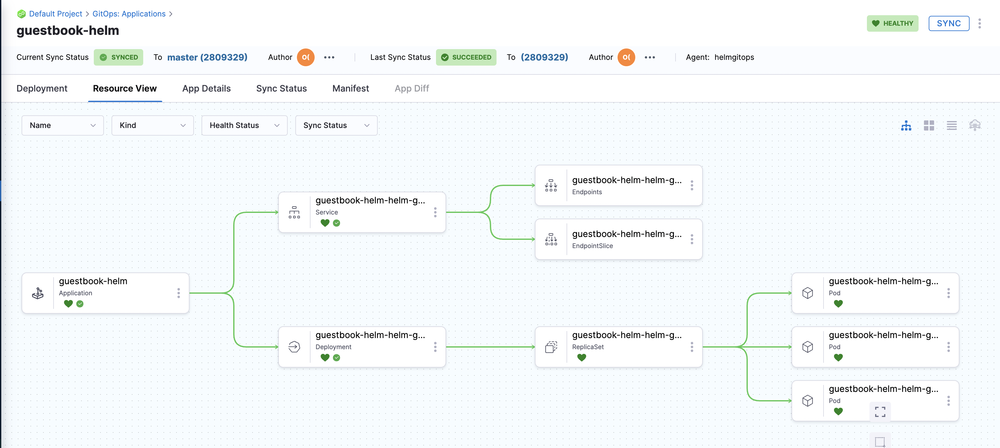

# Syn Using Helm Chart

<ctabanner
  buttonText="Learn More"
  title="Continue your learning journey."
  tagline="Take a Continuous Delivery & GitOps Certification today!"
  link="/certifications/continuous-delivery"
  closable={true}
  target="_self"
/>

```mdx-code-block
import Tabs from '@theme/Tabs';
import TabItem from '@theme/TabItem';
```

This tutorial is designed to help you get started with Harness GitOps. We will guide you through creating a GitOps for deploying a Guestbook application. This Guestbook application will use Helm Chart for deployment.

:::info
[Sign up today to unleash the potential of intelligent Harness CD](https://app.harness.io/auth/#/signup/).
:::

Whether you're new to GitOps or already have an Argo CD instance, this guide will assist you in getting started with Harness GitOps, both with and without Argo CD.

Harness also offers a Hosted GitOps solution. A tutorial for it will be available soon.

## Before you begin

Make sure that you have met the following requirements:

* You have set up a Kubernetes cluster. We recommend using [K3D](https://k3d.io/v5.5.1/) for installing Harness Delegates and deploying a sample application in a local development environment. For more information, go to [Delegate system and network requirements](/docs/platform/Delegates/delegate-concepts/delegate-requirements).
* You have forked the **[harnessed-example-apps](https://github.com/harness-community/harnesscd-example-apps/fork)** repository through the GitHub web interface. For more details, go to [Forking a GitHub repository](https://docs.github.com/en/get-started/quickstart/fork-a-repo#forking-a-repository).

## Deploy your applications using Harness GitOps

1. Log in to the [Harness App](https://app.harness.io/).

2. Select **Projects** in the top left corner of the UI, and then select **Default Project**.

3. In **Deployments**, select **GitOps**.

### Install a Harness GitOps Agent

<details open>
<summary>What is a GitOps Agent?</summary>
    
A Harness GitOps Agent is a worker process that runs in your environment, makes secure, outbound connections to Harness, and performs all the GitOps tasks you request in Harness.

</details>

1. Select **Settings** on the top right corner of the UI.
2. Select **GitOps Agents**, and then select **New GitOps Agent**.
3. In **Do you have any existing Argo CD instances?**, select **Yes** if you already have an Argo CD instance, else select **No** to install the Harness GitOps Agent.

```mdx-code-block
<Tabs>
<TabItem value="Harness GitOps Agent Fresh Install">
```

1. In **Do you have any existing Argo CD instances?**, select **No**, and then select **Start**.
2. In **Name**, enter the name for the new Agent.
3. In **Namespace**, enter the namespace where you want to install the Harness GitOps Agent. Typically, this is the target namespace for your deployment.
   For this tutorial, let's use the `default` namespace to install the Agent and deploy applications.
4. Select **Continue**. 
   The Review YAML settings appear. This is the manifest YAML for the Harness GitOps Agent. You can download this YAML file and run it in your Harness GitOps Agent cluster.
    ```yaml
    kubectl apply -f gitops-agent.yml -n default
    ```
5. Select **Continue** and verify that the Agent is successfully installed and can connect to Harness Manager.

```mdx-code-block
</TabItem>
<TabItem value="Harness GitOps Agent with Existing Argo CD Instance">
```

1. In **Do you have any existing Argo CD instances?**, select **Yes**, and then select **Start**.
2. In **Name**, enter the name of the existing Argo CD project.
3. In **Namespace**, enter the namespace where you want to install the Harness GitOps Agent. Typically, this is the target namespace for your deployment.
   For this tutorial, let's use the `default` namespace to install the Agent and deploy applications.
4. Select **Continue**. 
   The Review YAML settings appear. This is the manifest YAML for the Harness GitOps Agent. You can download this YAML file and run it in your Harness GitOps Agent cluster.
    ```yaml
    kubectl apply -f gitops-agent.yml -n default
    ```
5. Select **Continue** and verify that the Agent is successfully installed and can connect to Harness Manager.

Once you have installed the Agent, Harness will start importing all the entities from the existing Argo CD Project.

```mdx-code-block
</TabItem>
</Tabs>
```

```mdx-code-block
<Tabs>
<TabItem value="CLI">
```
1. Download and Configure Harness CLI.

    ```mdx-code-block
    <Tabs>
    <TabItem value="MacOS">
    ```

    ```bash
    curl -LO https://github.com/harness/harness-cli/releases/download/v0.0.13-alpha/harness-v0.0.13-alpha-darwin-amd64.tar.gz 
    tar -xvf harness-v0.0.13-alpha-darwin-amd64.tar.gz  
    echo 'export PATH="'$(pwd)':$PATH"' >> ~/.bash_profile
    source ~/.bash_profile
    ```

    ```mdx-code-block
    </TabItem>
    <TabItem value="Linux">
    ```

    ```mdx-code-block
    <Tabs>
    <TabItem value="ARM">
    ```

    ```bash
    curl -LO https://github.com/harness/harness-cli/releases/download/v0.0.13-alpha/harness-v0.0.13-alpha-linux-arm64.tar.gz 
    tar -xvf harness-v0.0.13-alpha-darwin-amd64.tar.gz 
    echo 'export PATH="'$(pwd)':$PATH"' >> ~/.bash_profile
    source ~/.bash_profile
    ```

    ```mdx-code-block
    </TabItem>
    <TabItem value="AMD">
    ```

    ```bash
    curl -LO https://github.com/harness/harness-cli/releases/download/v0.0.13-alpha/harness-v0.0.13-alpha-linux-amd64.tar.gz 
    tar -xvf harness-v0.0.13-alpha-darwin-amd64.tar.gz  
    echo 'export PATH="'$(pwd)':$PATH"' >> ~/.bash_profile
    source ~/.bash_profile
    ```

    ```mdx-code-block
    </TabItem>
    </Tabs>
    ```

    ```mdx-code-block
    </TabItem>
    <TabItem value="Windows">
    ```

    a. Open Windows Powershell and run the command below to download the Harness CLI.

    ```
    Invoke-WebRequest -Uri https://github.com/harness/harness-cli/releases/download/v0.0.13-alpha/harness-v0.0.13-alpha-windows-amd64.zip -OutFile ./harness.zip
    ```
        
    b. Extract the downloaded zip file and change directory to extracted file location.

    c. Follow the steps below to make it accessible via terminal.

    ```
    $currentPath = Get-Location 
    [Environment]::SetEnvironmentVariable("PATH", "$env:PATH;$currentPath", [EnvironmentVariableTarget]::Machine)
    ```

    d. Restart terminal.

    ```mdx-code-block
    </TabItem>
    </Tabs>
    ```

2. Clone the Forked **harnessed-example-apps** repo and change directory.
    ```bash
    git clone https://github.com/GITHUB_ACCOUNTNAME/harnesscd-example-apps.git
    cd harnesscd-example-apps
    ```
    :::note
    
    Replace `GITHUB_ACCOUNTNAME` with your GitHub Account name.

    :::

3. Log in to Harness from the CLI.
    ```bash
    harness login --api-key  --account-id HARNESS_API_TOKEN 
    ```
    :::note
    
    Replace `HARNESS_API_TOKEN` with Harness API Token that you obtained during the prerequisite section of this tutorial.

    :::

:::caution

For the pipeline to run successfully, please follow all of the following steps as they are, including the naming conventions.

:::

### Add a Harness GitOps repository

<details open>
<summary>What is a GitOps Repository?</summary>
    
A Harness GitOps Repository is a repository containing the declarative description of a desired state. The declarative description can be in Kubernetes manifests, Helm Chart, Kustomize manifests, etc.

</details>

Use the following command to add a Harness GitOps repository.

```
harness gitops-repository --file helm-guestbook/harness-gitops/repository.yml apply --agent-identifier $AGENT_NAME
```

### Add a Harness GitOps cluster

<details open>
<summary>What is a GitOps Cluster?</summary>
    
A Harness GitOps Cluster is the target deployment cluster that is compared to the desire state. Clusters are synced with the source manifests you add as GitOps Repositories.

</details>

Use the following command to add a Harness GitOps cluster.

```
harness gitops-cluster --file helm-guestbook/harness-gitops/cluster.yml apply --agent-identifier $AGENT_NAME
```

### Add a Harness GitOps application

<details open>
<summary>What is a GitOps Application?</summary>
    
GitOps Applications are how you manage GitOps operations for a given desired state and its live instantiation.
   
A GitOps Application collects the Repository (**what you want to deploy**), Cluster (**where you want to deploy**), and Agent (**how you want to deploy**). You select these entities when you set up your Application.

</details>

Use the following command to create a Gitops application

```
harness gitops-application --file helm-guestbook/harness-gitops/application.yml apply --agent-identifier $AGENT_NAME
```

```mdx-code-block
</TabItem>
<TabItem value="UI">
```

### Add a Harness GitOps repository

<details open>
<summary>What is a GitOps Repository?</summary>
    
A Harness GitOps Repository is a repository containing the declarative description of a desired state. The declarative description can be in Kubernetes manifests, Helm Chart, Kustomize manifests, etc.

</details>

1. Select **Settings** in the top right corner of the UI.
2. Select **Repositories**, and then select **New Repository**
3. Select **Git** and enter the following details:
   - In **Repository Name**, enter the Git repository name.
   - In **GitOps Agent**, choose the Agent that you installed in your cluster and select **Apply**.
   - In **Git Repository URL**, enter `https://github.com/GITHUB_USERNAME/harnesscd-example-apps.git` and replace **GITHUB_USERNAME** with your GitHub username.
4. Select **Continue** and choose **Specify Credentials For Repository**.
   - In **Connection Type**, select **HTTPS**.
   - In **Authentication**, select **Anonymous (no credentials required)**.
   - Select **Save & Continue** and wait for Harness to verify the conenction.
   - Select **Finish**.

### Add a Harness GitOps cluster

<details open>
<summary>What is a GitOps Cluster?</summary>
    
A Harness GitOps Cluster is the target deployment cluster that is compared to the desire state. Clusters are synced with the source manifests you add as GitOps Repositories.

</details>

1. Select **Settings** in the top right corner of the UI.
2. Select **Clusters**, and then select **New Cluster**.
3. In the cluster **Overview** dialog, enter a name for the cluster.
4. In **GitOps Agent**, select the Agent that you installed in your cluster and select **Apply**.
5. Select **Continue** and select **Use the credentials of a specific Harness GitOps Agent**.
6. Select **Save & Continue** and wait for Harness to verify the conenction.
7. Select **Finish**.

### Add a Harness GitOps application

<details open>
<summary>What is a GitOps Application?</summary>
    
GitOps Applications are how you manage GitOps operations for a given desired state and its live instantiation.
   
A GitOps Application collects the Repository (**what you want to deploy**), Cluster (**where you want to deploy**), and Agent (**how you want to deploy**). You select these entities when you set up your Application.

</details>

1. Select **Applications** on the top right corner of the UI.
2. Select **New Application**.
3. In **Application Name**, enter the name, `guestbook`.
4. In **GitOps Agent**, select the Agent that you installed in your cluster and select **Apply**.
5. Select **New Service** and toggle to the **YAML** view _(next to VISUAL)_.
6. Select **Edit YAML**, and then paste the following, and select **Save**.

   ```yaml
   service:
     name: gitopsguestbook
     identifier: gitopsguestbook
     serviceDefinition:
       type: Kubernetes
       spec: {}
     gitOpsEnabled: true 
   ```
7. Select **New Environment** and toggle to the **YAML** view _(next to VISUAL)_.
8. Select **Edit YAML**, and then paste the following, and select **Save**

   ```yaml
   environment:
     name: gitopsenv
     identifier: gitopsenv
     description: ""
     tags: {}
     type: PreProduction
     orgIdentifier: default
     projectIdentifier: default_project
     variables: []
   ```
9. Select **Continue**, keep the **Sync Policy** settings as is, and then select **Continue**.
10. In **Repository URL**, select the **Repository** you created earlier and select **Apply**. 
11. Select **master** as the **target Revision** and enter `kustomize-guestbook` in the **Path** and hit enter.
12. Select **Continue** to select the **Cluster** created in the above steps.
13. Enter the target **Namespace** for Harness GitOps to sync the application. Enter `default` and select **Finish**

```mdx-code-block
</TabItem>
</Tabs>
```

### Sync the application 

Finally, it's time to **Synchronize** the application state. 

1. Select **Sync** in the top right corner of the UI.
2. Check the application details, and then select **Synchronize** to initiate the deployment.
   - After a successful execution, you can check the deployment on your Kubernetes cluster using the following command:
   
     ```bash
     kubectl get pods -n default
     ```
   - To access the Guestbook application deployed via the Harness pipeline, port forward the service and access it at `http://localhost:8080`:
   
     ```bash
     kubectl port-forward svc/<service-name> 8080:80
     ```
On successful application sync, you'll see the status tree under **Resource View** as shown below:



## Congratulations!🎉

You've just learned how to use Harness CD to deploy application using a Helm Chart template.

## Next steps

- Keep learning about Harness CD. Add **Triggers** to your pipeline that'll respond to Git events. For more information, go to [Triggering pipelines](/docs/platform/Triggers/triggering-pipelines).
- Visit [Harness Developer Hub](https://developer.harness.io/) for more tutorials and resources.
