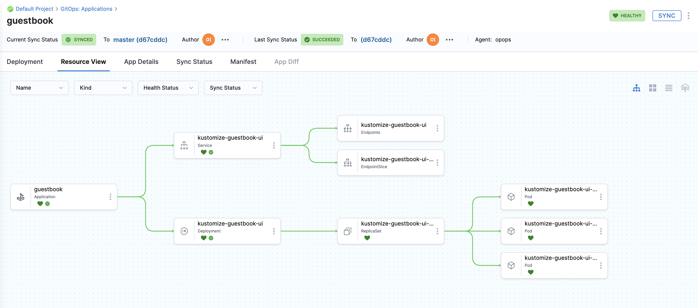

# Sync Using Kustomize

<ctabanner
  buttonText="Learn More"
  title="Continue your learning journey."
  tagline="Take a Continuous Delivery & GitOps Certification today!"
  link="/certifications/continuous-delivery"
  closable={true}
  target="_self"
/>

```mdx-code-block
import Tabs from '@theme/Tabs';
import TabItem from '@theme/TabItem';
```

:::info

[Sign up today to unleash the potential of intelligent Harness CD](https://app.harness.io/auth/#/signup/?module=cd&utm_source=website&utm_medium=harness-developer-hub&utm_campaign=cd-plg&utm_content=tutorials-cd-kubernetes-kustomize).

:::

This tutorial helps you get started with GitOps. We will guide you through creating a CD pipeline and deployment of a Guestbook application. This Guestbook application will use Kustomize for deployment.

Whether you're new to GitOps or have already used Argo CD, this guide will assist you in getting started with Harness GitOps, both with and without Argo CD.

Harness also offers a Hosted GitOps solution, and a tutorial for it will be available soon.

## Before you begin

Verify the following:

1. **A Kubernetes cluster**. We recommend [K3D](https://k3d.io/v5.5.1/) for installing the Harness GitOps Agent and deploying a sample application in a local development environment.
    - Check [Harness GitOps Agent Requirements](/docs/continuous-delivery/gitops/use-gitops/install-a-harness-git-ops-agent/#requirements).
2. Fork the [harnessed-example-apps](https://github.com/harness-community/harnesscd-example-apps/fork) repository through the GitHub web interface.
    - For details on Forking a GitHub repository, go to [GitHub docs](https://docs.github.com/en/get-started/quickstart/fork-a-repo#forking-a-repository).

## Getting Started with Harness GitOps
--------------------------------------

1. Log in to the [Harness App](https://app.harness.io/).

2. Select on **Projects** in the top left corner, choose **Default Project**.

3. Select **Deployments**, under **Default Project** select on **GitOps**.

### GitOps Agent

A Harness GitOps Agent is a worker process that runs in your environment, makes secure, outbound connections to Harness, and performs all the GitOps tasks you request in Harness.

4. Select **Settings**, and then select **GitOps Agents**.
- Select **New GitOps Agent**.
- When are prompted with **Do you have any existing Argo CD instances?**, select **Yes** if you already have a Argo CD Instance, or else choose **No** to install the Harness GitOps Agent.

```mdx-code-block
<Tabs>
<TabItem value="Harness GitOps Agent Fresh Install">
```

- Select **No**, and then select **Start**.
- In **Name**, enter the name for the new Agent.
- In **Namespace**, enter the namespace where you want to install the Harness GitOps Agent. Typically, this is the target namespace for your deployment.
    - For this tutorial, let's use the `default` namespace to install the Agent and deploy applications.
- Select **Continue**. The **Review YAML** settings appear.
- This is the manifest YAML for the Harness GitOps Agent. You will download this YAML file and run it in your Harness GitOps Agent cluster.  

    ```yaml
    kubectl apply -f gitops-agent.yml -n default
    ```
- Select **Continue** and verify the Agent is successfully installed and can connect to Harness.


```mdx-code-block
</TabItem>
<TabItem value="Harness GitOps Agent with Existing Argo CD instance">
```

- Select **Yes**, and then select **Start**.
- In **Name**, enter the name for the existing Agent CD Project.
- In **Namespace**, enter the namespace where you want to install the Harness GitOps Agent. Typically, this is the target namespace for your deployment.
- Select **Next**. The **Review YAML** settings appear.
- This is the manifest YAML for the Harness GitOps Agent. You will download this YAML file and run it in your Harness GitOps Agent cluster.  

    ```yaml
    kubectl apply -f gitops-agent.yml -n default
    ```
- Once you have installed the Agent, Harness will start importing all the entities from the existing Argo CD Project.

```mdx-code-block
</TabItem>
</Tabs>
```

### Repositories

A Harness GitOps Repository is a repo containing the declarative description of a desired state. The declarative description can be in Kubernetes manifests, Helm Chart, Kustomize manifests, etc.

5. Select **Settings**, and then select **Repositories**.
- Select **New Repository**.
- Choose **Git**.
    - Enter a name in **Repository**.
    - In **GitOps Agent**, choose the Agent that you installed in your cluster and select **Apply**.
    - In **Git Repository URL**, paste `https://github.com/GITHUB_USERNAME/harnesscd-example-apps.git` and replace **GITHUB_USERNAME** with your GitHub username.
    - Select **Continue**, and then choose **Specify Credentials For Repository**.
        - Choose **HTTPS** as the **Connection Type**.
        - Select **Anonymous (no credentials required)** as the **Authentication** method.
        - Select **Save & Continue** and wait for Harness to verify the connection.
        - Finally, select **Finish**.

### Clusters

A Harness GitOps Cluster is the target deployment cluster that is compared to the desire state. Clusters are synced with the source manifests you add as GitOps Repositories.

6. Select **Settings**, and then select **Clusters**.
- Select **New Cluster**.
    - In **Name**, enter a name for the cluster.
    - In **GitOps Agent**, choose the Agent that you installed in your cluster and select **Apply**.
    - Select **Continue** and use **Use the credentials of a specific Harness GitOps Agent**.
    - Select **Save & Continue** and wait for Harness to verify the connection.
    - Finally, select **Finish**.

### Applications

GitOps Applications are how you manage GitOps operations for a given desired state and its live instantiation.

A GitOps Application collects the Repository (**what you want to deploy**), Cluster (**where you want to deploy**), and Agent (**how you want to deploy**). You define these entities and then select them when you set up your Application.

7. Select **Applications**.
- Select **New Application**.
    - Enter the **Application Name** `guestbook`.
    - In the **GitOps Agent**, choose the Agent that you installed in your cluster and select **Apply**.
    - Select **New Service**, and then toggle to **YAML** for the YAML editor.
    - Select **Edit YAML**, paste the following YAML and select **Save**.  

    ```yaml
    service:
      name: gitopsguestbook
      identifier: gitopsguestbook
      serviceDefinition:
        type: Kubernetes
        spec: {}
      gitOpsEnabled: true
    ```
    - Select **New Environment**, and then toggle to **YAML** for the YAML editor.
    - Select **Edit YAML**, paste the following YAML and select **Save**.  

    ```yaml
    environment:
      name: gitopsenv
      identifier: gitopsenv
      description: ""
      tags: {}
      type: PreProduction
      orgIdentifier: default
      projectIdentifier: default_project
      variables: []
    ```
    - Select **Continue**, keep the **Sync Policy** settings as is, and then select **Continue**.
    - In **Repository URL**, choose the **Repository** you created earlier and select **Apply**.
    - Select **master** as the **Target Revision**, type `kustomize-guestbook` in the **Path**, and press **Enter**.
    - Select **Continue** to select the **Cluster** created in the above steps.
    - Enter the target **Namespace** for Harness GitOps to sync the application. Type `default` and select **Finish**.

8. Finally, it's time to **Synchronize** the Apllication state. Select **Sync**, check the Application details, and then select **Synchronize** to initiate the deployment.
    - After a successful execution, you can check the deployment on your Kubernetes cluster using the following command:  

        ```bash
        kubectl get pods -n default
        ```
    - To access the Guestbook application deployed via the Harness pipeline, port forward the service and access it at [http://localhost:8080](http://localhost:8080):  

        ```bash
        kubectl port-forward svc/kustomize-guestbook-ui 8080:80
        ```

On successful Application sync, you'll see the below status tree under **Resource View**.



### Congratulations!🎉
You've just learned how to use **Harness GitOps** to deploy an application using a Kustomize template.

#### What's Next?
- Keep learning about Harness GitOps. Create a GitOps ApplicationSet and PR Pipeline in Harness GitOps by following this [guide](/docs/continuous-delivery/gitops/applicationsets/harness-git-ops-application-set-tutorial).
- Visit the [Harness Developer Hub](https://developer.harness.io/) for more tutorials and resources.
