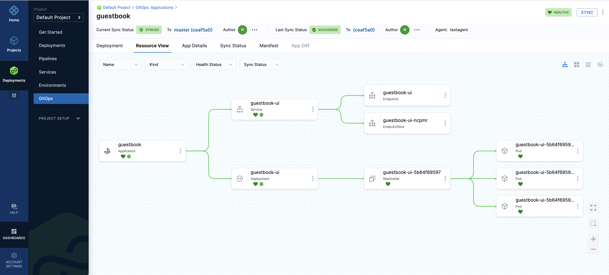

# Sync Using Kubernetes Manifest

<ctabanner
  buttonText="Learn More"
  title="Continue your learning journey."
  tagline="Take a Continuous Delivery & GitOps Certification today!"
  link="/certifications/continuous-delivery"
  closable={true}
  target="_self"
/>

```mdx-code-block
import Tabs from '@theme/Tabs';
import TabItem from '@theme/TabItem';
```

This tutorial will get you started with Harness GitOps. We will guide you through deploying a Guestbook application using Harness GitOps. This Guestbook application uses a publicly available Kubernetes manifest and Docker image.

:::info

[Sign up today to unleash the potential of intelligent Harness CD](https://app.harness.io/auth/#/signup/?module=cd&utm_source=website&utm_medium=harness-developer-hub&utm_campaign=cd-plg&utm_content=tutorials-cd-kubernetes-manifest).

:::

Harness GitOps (built on top of Argo CD) watches the state of your application as defined in a Git repo, and can pull (either automatically, or when instructed to do so) these changes into your Kubernetes cluster, leading to an application sync.
:::info

Whether you're new to GitOps or have already used Argo CD, this guide will assist you in getting started with Harness GitOps, both with and without Argo CD.

:::

## Before you begin

Verify that you have the following:

1. **A Kubernetes cluster**. We recommend [K3D](https://k3d.io/v5.5.1/) for installing the Harness GitOps Agent and deploying a sample application in a local development environment.
    - For requirements, go to [Harness GitOps Agent Requirements](/docs/continuous-delivery/gitops/use-gitops/install-a-harness-git-ops-agent/#requirements).
2. **Fork the [harnessed-example-apps](https://github.com/harness-community/harnesscd-example-apps/fork)** repository through the GitHub web interface.
    - For details on Forking a GitHub repository, go to [GitHub docs](https://docs.github.com/en/get-started/quickstart/fork-a-repo#forking-a-repository).

## Getting Started with Harness GitOps
--------------------------------------

```mdx-code-block
<Tabs>
<TabItem value="UI">
```

1. Login to [Harness](https://app.harness.io/).
2. Select **Projects**, and then select **Default Project**.
3. Select **Deployments**, and then select **GitOps**.

### GitOps Agent

<details open>
<summary>What is a GitOps Agent?</summary>
    
A Harness GitOps Agent is a worker process that runs in your environment, makes secure, outbound connections to Harness, and performs all the GitOps tasks you request in Harness.

</details>

1. Select **Settings**, and then select **GitOps Agents**.
   - Select **New GitOps Agent**.
   - When are prompted with **Do you have any existing Argo CD instances?**, select **Yes** if you already have a Argo CD Instance, or else choose **No** to install the **Harness GitOps Agent**.

```mdx-code-block
<Tabs>
<TabItem value="Harness GitOps Agent Fresh Install">
```

- Select **No**, and then select **Start**.
- In **Name**, enter the name for the new Agent.
- In **Namespace**, enter the namespace where you want to install the Harness GitOps Agent. Typically, this is the target namespace for your deployment.
  - For this tutorial, let's use the `default` namespace to install the Agent and deploy applications.
- Select **Continue**. The **Review YAML** settings appear.
- This is the manifest YAML for the Harness GitOps Agent. You will download this YAML file and run it in your Harness GitOps Agent cluster.  

    ```
    kubectl apply -f gitops-agent.yml -n default
    ```

 - Select **Continue** and verify the Agent is successfully installed and can connect to Harness Manager.


```mdx-code-block
</TabItem>
<TabItem value="Harness GitOps Agent with existing Argo CD instance">
```

- Select **Yes**, and then select **Start**.
- In **Name**, enter the name for the existing Argo CD project.
- In **Namespace**, enter the namespace where you want to install the Harness GitOps Agent. Typically, this is the target namespace for your deployment.
- Select **Next**. The **Review YAML** settings appear.
- This is the manifest YAML for the Harness GitOps Agent. You will download this YAML file and run it in your Harness GitOps Agent cluster.  
  
    ```yaml
    kubectl apply -f gitops-agent.yml -n default
    ```
- Once you have installed the Agent, Harness will start importing all the entities from the existing Argo CD Project.

```mdx-code-block
</TabItem>
</Tabs>
```

### Repositories

<details open>
<summary>What is a GitOps Repository?</summary>
    
A Harness GitOps Repository is a repo containing the declarative description of a desired state. The declarative description can be in Kubernetes manifests, Helm Chart, Kustomize manifests, etc.

</details>

1. Select **Settings**, and then select **Repositories**.
   - Select **New Repository**.
   - Choose **Git**.
       - Enter a name in **Repository**.
       - In **GitOps Agent**, select the Agent that you installed in your cluster and select **Apply**.
       - In **Git Repository URL**, paste `https://github.com/GITHUB_USERNAME/harnesscd-example-apps` and replace **GITHUB_USERNAME** with your GitHub username.
       - Select **Continue** and choose **Specify Credentials For Repository**.
           - Select **HTTPS** as the **Connection Type**.
           - Select **Anonymous (no credentials required)** as the **Authentication** method.
           - Select **Save & Continue** and wait for Harness to verify the connection.
           - Finally, select **Finish**.

### Clusters

<details open>
<summary>What is a GitOps Cluster?</summary>
    
A Harness GitOps Cluster is the target deployment cluster that is compared to the desire state. Clusters are synced with the source manifests you add as GitOps Repositories.

</details>


1. Select **Settings**, and then select **Clusters**.
   - Select **New Cluster**.
       - In **Name**, enter a name for the cluster.
       - In **GitOps Agent**, select the Agent you installed in your cluster, and then select **Apply**.
       - Select **Continue** and select **Use the credentials of a specific Harness GitOps Agent**.
       - Select **Save & Continue** and wait for the Harness to verify the connection.
       - Finally, select **Finish**.

### Applications

<details open>
<summary>What is a GitOps Application?</summary>
    
GitOps Applications are how you manage GitOps operations for a given desired state and its live instantiation.
A GitOps Application collects the Repository (**what you want to deploy**), Cluster (**where you want to deploy**), and Agent (**how you want to deploy**). You select these entities when you set up your Application.

</details>

1. Select **Applications**.
   - Select **New Application**.
       - Enter the **Application Name**: `guestbook`.
       - In **GitOps Agent**, select the Agent that you installed in your cluster and select **Apply**.
       - Select **New Service**, and then toggle to **YAML** to use the YAML editor.
       - Select **Edit YAML**, paste in the YAML below, and then select **Save**.  

       ```yaml
       service:
         name: gitopsguestbook
         identifier: gitopsguestbook
         serviceDefinition:
           type: Kubernetes
           spec: {}
         gitOpsEnabled: true
       ```

       - Select **New Environment**, and the toggle to **YAML** to use the YAML editor.
       - Select **Edit YAML**, paste in the YAML below, and then select **Save**.  
       
       ```yaml
       environment:
         name: gitopsenv
         identifier: gitopsenv
         description: ""
         tags: {}
         type: PreProduction
         orgIdentifier: default
         projectIdentifier: default_project
         variables: []
       ```
       - Next, select **Continue**, keep the **Sync Policy** settings as is, and select **Continue**.
       - In **Repository URL**, select the **Repository** you created earlier, and then select **Apply**.
       - Select **master** as the **Target Revision**, type `guestbook` in the **Path**, and then select **Enter**.
       - Select **Continue** and select the **Cluster** created in the above steps.
       - In **Namespace**, enter the target namespace for Harness GitOps to sync the application.
       - Enter `default` and select **Finish**.
2. Finally, it's time to **Synchronize** the GitOps Application state. Select **Sync**, check the Application details, and then select **Synchronize** to initiate the deployment.
   - After a successful execution, you can check the deployment on your Kubernetes cluster using the following command:  

    ```bash
    kubectl get pods -n default
    ```
   - To access the Guestbook application deployed via the Harness Pipeline, port forward the service and access it at [http://localhost:8080](http://localhost:8080):

    ```bash
    kubectl port-forward svc/guestbook-ui 8080:80
    ```

A successful Application sync will display the following status tree under **Resource View**.


```mdx-code-block
</TabItem>
<TabItem value="Terraform Provider">
```
Harness offers a [Terraform Provider](https://registry.terraform.io/providers/harness/harness/latest/docs) to help you declaratively manage Harness GitOps entities alongside your application and cluster resources. These steps walk through using Terraform to create and install the GitOps agent, define related Harness entities, and deploy a sample application to your cluster.

<docvideo src="https://www.youtube.com/watch?v=U_XkKcfg8ts" width="75%" />

<br/><br/>

Before proceeding:

1. Generate a [Harness API token](/docs/platform/automation/api/add-and-manage-api-keys/#create-personal-api-keys-and-tokens).
1. Make sure [Terraform](https://developer.hashicorp.com/terraform/tutorials/aws-get-started/install-cli) is installed on a computer that can connect to your cluster.

<br/>

### Harness Terraform Provider

1. Clone or download the Harness [gitops-terraform-onboarding](https://github.com/harness-community/gitops-terraform-onboarding) project.

```
git clone https://github.com/harness-community/gitops-terraform-onboarding.git
cd gitops-terraform-onboarding/
```

2. Initialize the Terraform configuration. This step will also install the Harness provider plugin.

```bash
terraform init
```
<details open>
<summary>What is a Terraform Provider?</summary>

A Terraform Provider is a plugin that allows Terraform to define and manage resources using a particular software API. In this tutorial these resources will be Harness entities.

</details>

<br/>

### Input variables

1. Open **terraform.tfvars**. This file contains example values for the Harness entities that will be created. 

```file
project_id            = "default_project"
org_id                = "default"
agent_identifier      = "testagent"
agent_name            = "testagent"
agent_namespace       = "default"
repo_identifier       = "testrepo"
repo_name             = "testrepo"
repo_url              = "https://github.com/harness-community/harnesscd-example-apps/"
cluster_identifier    = "testcluster"
cluster_name          = "testcluster"
env_name              = "testenv"
service_name          = "testservice"
```

2. In **terraform.tfvars**, change the value of **repo_url** to your *GitHub fork* of the harnesscd-example-apps repository.
  
    - You are welcome to keep the other variable values as they are or rename them to suit your environment.

3. Set **account_id** and **harness_api_token** as Terraform environment variables. Your Account ID can be found in the URL after account/ when you are logged into app.harness.io.

```
export TV_VAR_account_id="123abcXXXXXXXX"
export TV_VAR_harness_api_token="pat.abc123xxxxxxxxxx…"
```

:::caution

Never store your Harness API Key in a plain text configuration file or in version control. Use an environment variable or dedicated secrets manager.

:::

<br/>

### Terraform module

<details open>
<summary>What is a Terraform module?</summary>

A Terraform module is a collection of files that define the desired state to be enforced by Terraform. These files normally have the .tf extension.

</details>

<br/>

<docimage path={require('../static/k8s-manifest-tutorial/terraform_harness_resources.png')} width="50%" height="50%" title="Click to view full size image" />

<br/><br/>

1. Open **agent.tf**. This file defines the GitOps agent in Harness and then deploys the agent manifest to your cluster. The agent is created using the harness_gitops_platform_agent resource.

```json
resource "harness_platform_gitops_agent" "gitops_agent" {
  identifier = var.agent_identifier
  account_id = var.account_id
  project_id = var.project_id
  org_id     = var.org_id
  name       = var.agent_name
  type       = "MANAGED_ARGO_PROVIDER"
  metadata {
    namespace         = var.agent_namespace
    high_availability = false
  }
}
```

If you have an *existing* Argo CD instance, change the <strong>type</strong> argument to <strong>CONNECTED_ARGO_PROVIDER</strong>. Otherwise leave as is.

2. If you’ve made changes to any configuration files, verify the syntax is still valid. 

```bash
terraform validate
```

3. Preview the changes Terraform will make in Harness and your cluster.

```bash
terraform plan
```

4. Apply the Terraform configuration to create the Harness and cluster resources. Type **yes** to confirm when prompted.

```bash
terraform apply
```

Observe the output of `terraform apply` as your resources are created. It may take a few minutes for all the resources to be provisioned.

<br/>

### Verify GitOps deployment

1. Log into [https://app.harness.io](https://app.harness.io). Select **Deployments**, then **GitOps**.
    - Select **Settings**, and then select **GitOps Agents**
    - Verify your GitOps agent is listed and displays a HEALTHY health status.

2. Navigate back to **Settings**, and then select **Repositories**.
    - Verify your **harnesscd-example-apps** repo is listed with Active connectivity status.

3. Navigate back to **Settings**, and then select **Clusters**.
    - Verify you cluster with its associated GitOps agent is listed with Active connectivity status.

4. Select **Application** from the top right of the page.
    - Click into the **guestbook** application. This is the application your deployed from the **harnesscd-example-apps** repo.
    - Select **Resource View** to see the cluster resources that have been deployed. A successful Application sync will display the following status tree.



5. Return to a local command line. Confirm you can see the GitOps agent and guestbook application resources in your cluster.

```	
kubectl get deployment -n default
kubectl get svc -n default
kubectl get pods -n default
```

6. To access the Guestbook application deployed via the Harness Pipeline, port forward the service and access it at [http://localhost:8080](http://localhost:8080]:

```
kubectl port-forward svc/guestbook-ui 8080:80
```

<br/>

### Cleaning up

1. If you know longer need the resources created in this tutorial, run the following command to delete the GitOps agent and associated Harness entities.

```
terraform destroy
```

**Note:** Since deleting the Guestbook application in Harness does not delete the deployed cluster resources themselves, you’ll need to manually remove the Kubernetes deployment.


```
kubectl delete deployment guestbook-ui -n default
kubectl delete service guestbook-ui -n default
```


```mdx-code-block
</TabItem>
</Tabs>
```

<br/>

### Congratulations!🎉
You've just learned how to use **Harness GitOps** to deploy an application using a Kubernetes manifest.

#### What's Next?
- Keep learning about Harness GitOps. Create a GitOps ApplicationSet and PR Pipeline in Harness GitOps by following this [guide](/docs/continuous-delivery/gitops/applicationsets/harness-git-ops-application-set-tutorial).
- Visit the [Harness Developer Hub](https://developer.harness.io/) for more tutorials and resources.  


