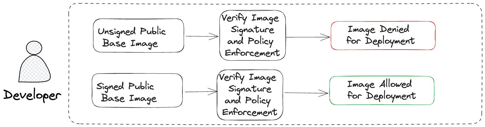
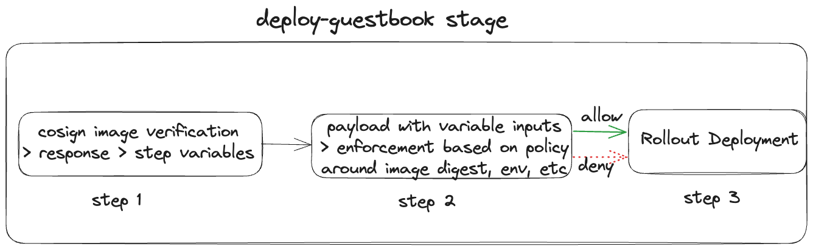

# Secure Container Image Signing with Cosign and OPA

<ctabanner
  buttonText="Learn More"
  title="Continue your learning journey."
  tagline="Take a Continuous Delivery & GitOps Certification today!"
  link="/certifications/continuous-delivery"
  closable={true}
  target="_self"
/>

In the [**Kubernetes Manifest tutorial**](../kubernetes/manifest.md), you deployed a container image for the guestbook application to a Kubernetes cluster. But how do you verify that the container image was safe to deploy? [Cosign](https://github.com/sigstore/cosign) is a tool for container image signing and verification. Open Policy Agent (OPA) is an open-source, general-purpose policy engine that enables policy-based control across various software stacks, including Kubernetes deployments. Harness Continuous Delivery & GitOps includes OPA to ensure compliance in your deployment pipelines. In this tutorial, we'll harness the combined power of Cosign and OPA to ensure the secure deployment of container images to your Kubernetes cluster.

## Before you begin

Verify that you have the following:

1. [You have signed up for a free account on the Harness platform](https://app.harness.io/auth/#/signup/?module=cd&utm_source=website&utm_medium=harness-developer-hub&utm_campaign=cd-plg&utm_content=tutorials-cd-kubernetes-cosign-opa).
2. You have completed the [**Kubernetes Manifest tutorial**](../kubernetes/manifest.md) (either GitOps Workflow or CD Pipeline). This is because the current tutorial is a continuation of that tutorial. You'll reuse the existing pipeline and other resources you created in that tutorial.
3. You are familiar with Harness [pipelines](https://developer.harness.io/docs/get-started/key-concepts#pipelines), [stages](https://developer.harness.io/docs/get-started/key-concepts#stages), and steps concepts.

## Architectural Diagrams

Without Cosign or OPA in place, you could have the CD pipeline pull an image and deploy to your Kubernetes cluster without verification. With Cosign and OPA in place, the flow (simplified version) looks something like this:



Let's dive into the project of secure image signing for your containerized applications.

## Image signing using Cosign
-----------------------------

Imagine that you’re the architect for this project and you’re tasked to create a secure base image using Cosign and use [a Cosign annotation](https://docs.sigstore.dev/signing/signing_with_containers/#add-annotations-with-a-signature) `env=uat` since this image will be used for the UAT environment. 

In this section, you’ll pull the public image for the guestbook application, tag it with a different image name and image tag, sign it using Cosign, and then push to an image registry. Cosign's keyless signing, authenticated through OIDC protocols with trusted providers like Google, GitHub, or Microsoft, offers a more convenient and secure alternative to traditional key-based signing methods.

Let’s use Docker Hub as an example for image registry.

1. Log in to Docker hub from the terminal (this is required for you to be able to push the image):

    ```bash
    docker login
    ```
2. Pull the public image for the guestbook app:

    ```bash
    docker pull gcr.io/heptio-images/ks-guestbook-demo:0.1
    ```
3. Tag the image with accordingly for your image registry name and image tag: 

    ```bash
    docker tag gcr.io/heptio-images/ks-guestbook-demo:0.1 YOUR_DOCKERHUB_USERNAME:guestbook:0.1
    ```

4. [Download and install Cosign](https://github.com/sigstore/cosign#installation).

5. 
    ```bash
    export IMAGE=YOUR_DOCKERHUB_USERNAME:guestbook:0.1
    ``` 

6. Sign the image using your choice of OIDC provider: 

    ```bash
    cosign sign -a env=uat $IMAGE
    ```
(a window will open for you to sign in to your OIDC provider)

7. 

    ```bash
    docker push $IMAGE
    ```

Check your image registry and you'll notice that your push resulted in two digests with different tags. When an image is signed using Cosign, it generates a detached signature for the image. This detached signature is a separate cryptographic file that verifies the authenticity and integrity of the container image. Both the image and its detached signature are pushed to the image registry, ensuring that the signed image and its associated signature are stored together and can be retrieved for verification. This dual-commit process helps maintain the security and trustworthiness of container images within a registry.

## Image verification using Cosign and OPA
------------------------------------------

Before your developers can deploy the image, add some required plumbing in place so that an image gets verified before deployment. From the [**Kubernetes Manifest tutorial**](../kubernetes/manifest.md), you have a stage **deploy-guestbook** within the deployment pipeline **harness_guestbook_pipeline** which has single step **Rollout Deployment**. Add two steps before the **Rollout Deployment** step for image verification using cosign and policy enforcement using open policy agent.



For the first step, add a [Shell Script step](https://developer.harness.io/docs/continuous-delivery/x-platform-cd-features/cd-steps/utilities/shell-script-step/). Let's call it **cosign_verify**. Keeping all other settings to default, add the following to the Script section. Replace `YOUR_DOCKERHUB_USERNAME`, `YOUR_OIDC_CERTIFICATE_IDENTITY` (could be your associated email), and `YOUR_OIDC_ISSUER` (google, microsoft, github, or gitlab) accordingly. The oidc-issuer for Google is `https://accounts.google.com`, Microsoft is `https://login.microsoftonline.com`, GitHub is `https://github.com/login/oauth`, and GitLab is `https://gitlab.com`. 

    ```bash
    curl -O -L "https://github.com/sigstore/cosign/releases/latest/download/cosign-linux-amd64"
    mv cosign-linux-amd64 /usr/local/bin/cosign
    chmod +x /usr/local/bin/cosign

    output=$(cosign verify YOUR_DOCKERHUB_USERNAME/guestbook:0.1 --certificate-identity=YOUR_OIDC_CERTIFICATE_IDENTITY --certificate-oidc-issuer=YOUR_OIDC_ISSUER)

    image_registry=$(echo "$output" | awk -F'"docker-reference":"' '{print $2}' | cut -d '"' -f 1)
    image_digest=$(echo "$output" | awk -F'"docker-manifest-digest":"' '{print $2}' | cut -d '"' -f 1)
    image_signed_string=$(echo "$output" | awk -F'"type":"' '{print $2}' | cut -d '"' -f 1)
    image_sign_issuer=$(echo "$output" | awk -F'"Issuer":"' '{print $2}' | cut -d '"' -f 1)
    image_env=$(echo "$output" | awk -F'"env":"' '{print $2}' | cut -d '"' -f 1)
    ```

The first part of this script downloads and installs the cosign tool, the second part stores the response from ‘cosign verify…’ command and the third part parses specific parts of the response as step variables. Define [script output variables](https://developer.harness.io/docs/continuous-delivery/x-platform-cd-features/cd-steps/utilities/shell-script-step/#script-output-variables) for all 5 output variables - `image_registry`, `image_digest`, `image_signed_string`, `image_sign_issuer`, and `image_env`. 
The first four variables are used to ensure that the correct image with the right digest is coming from an approved image registry vetted by an appropriate OIDC provider. The last variable is an annotation for the image tag for which environment the image is for.

Let's add a [policy step](https://developer.harness.io/docs/continuous-delivery/x-platform-cd-features/advanced/cd-governance/add-a-governance-policy-step-to-a-pipeline/) after the **cosign_verify** step (you can call this **opa_enforcement** step). You can define and store policies directly in the OPA service in Harness.

:::caution

Policy Based Governance is a paid feature on the Harness platform.

:::

From the **Project Setup**, go to **Policies** and create a new policy. Let's call this policy `Check Image Sign`. Policies are written in [Rego](https://www.openpolicyagent.org/docs/latest/policy-language/). Before you write a policy, run the following command and observe the response:

    ```bash
    cosign verify YOUR_DOCKERHUB_USERNAME/guestbook:0.1 --certificate-identity=YOUR_OIDC_CERTIFICATE_IDENTITY --certificate-oidc-issuer=YOUR_OIDC_ISSUER
    ```

The response will contain the image digest that you'll need to provide in the following policy:

    ```rego
    package main

    # Define a default decision
    default allow = false

    # If there's a signed image and the env is UAT, allow is true
    allow {
        input.registry == "index.docker.io/YOUR_DOCKERHUB_USERNAME/guestbook"
        input.digest == "sha256:..."
        input.signedMessage == "cosign container image signature"
        input.oidcIssuer == "YOUR_OIDC_ISSUER"
        input.env == "uat"
    }
    ```

Once you add the above to the policy, save this policy. In Harness, you add Rego policies to a Policy Set and when certain events happen (e.g. saving or running a Pipeline), Harness reaches out to the Harness OPA server to evaluate the action using the Policy Set. 

From the **Policies** navigation menu, click on **Policy Sets** and **+ New Policy Set**. Give this policy a name (e.g. `Check Image Sign Policy Set`), select  `harness_guestbook_pipeline` for **Entity Type that this policy set applies to**, and `On Run` for **On what event should the policy set be evaluated**. Click **Next**, select `Check Image Sign` policy, and click **Finish**.

Now, let's go back to the pipeline and click on the **opa_enforcement** step. With all the default settings, select `Check Image Sign Policy Set` for the policy set and add the following in the payload section:

    ```bash
    {
        "registry": "<+execution.steps.image_sign_verify.output.outputVariables.sov_image_registry>",
        "digest": "<+execution.steps.image_sign_verify.output.outputVariables.sov_image_digest>",
        "signedMessage": "<+execution.steps.image_sign_verify.output.outputVariables.sov_image_signed_string>",
        "oidcIssuer": "<+execution.steps.image_sign_verify.output.outputVariables.sov_image_sign_issuer>",
        "env": "<+execution.steps.image_sign_verify.output.outputVariables.sov_image_env>"
    }
    ```
### Congratulations!🎉
You've just learned how to use **Cosign** and **Open Policy Agent** to sign and verify container images before those are deployed.

#### What's Next?
- Keep learning about Harness GitOps. Create a GitOps ApplicationSet and PR Pipeline in Harness GitOps by following this [guide](/docs/continuous-delivery/gitops/applicationsets/harness-git-ops-application-set-tutorial).
- Visit the [Harness Developer Hub](https://developer.harness.io/) for more tutorials and resources.


