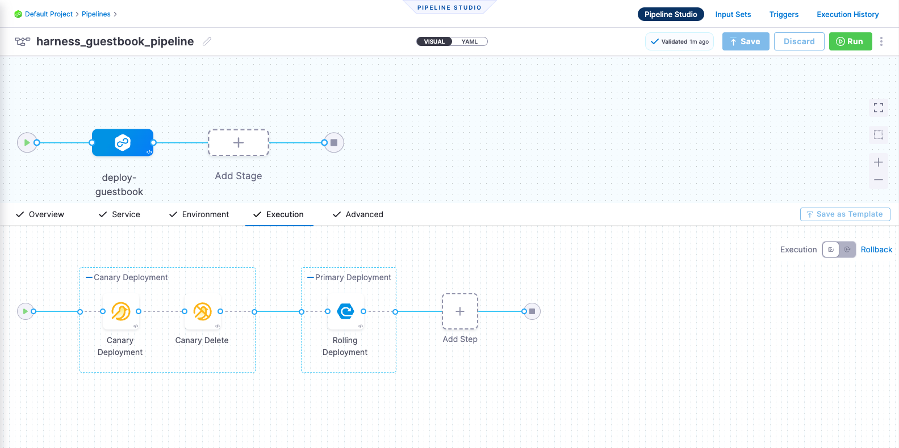
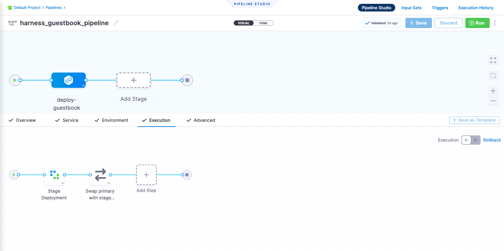
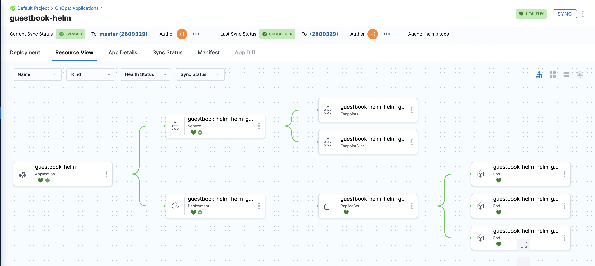

# Deploy using Helm Chart

<ctabanner
  buttonText="Learn More"
  title="Continue your learning journey."
  tagline="Take a Continuous Delivery & GitOps Certification today!"
  link="/certifications/continuous-delivery"
  closable={true}
  target="_self"
/>

```mdx-code-block
import Tabs from '@theme/Tabs';
import TabItem from '@theme/TabItem';
```

This tutorial is designed to help you get started with Harness Continuous Delivery (CD). We will guide you through creating a CD pipeline/GitOps for deploying a Guestbook application. This Guestbook application will use Helm Chart for deployment.

:::info
[Sign up today to unleash the potential of intelligent Harness CD](https://app.harness.io/auth/#/signup/).
:::

```mdx-code-block
<Tabs>
<TabItem value="CD Pipeline">
```

## Before you begin

Make sure that you have met the following requirements:

* You have a GitHub Personal Access Token (PAT) with proper repository permissions. For more information, go to [Managing your personal access token](https://help.github.com/en/github/authenticating-to-github/creating-a-personal-access-token-for-the-command-line).
* You have set up a Kubernetes cluster. You can use your own Kubernetes cluster or a [K3D](https://k3d.io/v5.5.1/) (recommended) for installing Harness Delegates and deploying a sample application in a local development environment. For more information, go to [Delegate system and network requirements](https://developer.harness.io/docs/platform/Delegates/delegate-concepts/delegate-requirements).
* You have installed [Helm CLI](https://helm.sh/docs/intro/install/).
* You have forked the **[harnessed-example-apps](https://github.com/harness-community/harnesscd-example-apps/fork)** repository through the GitHub web interface. For more details, go to [Forking a GitHub repository](https://docs.github.com/en/get-started/quickstart/fork-a-repo#forking-a-repository).

## Deploy your applications using a Helm template

1. Log in to the [Harness App](https://app.harness.io/).

2. Select **Projects** on the top left corner of the UI, and then select **Default Project**.

:::caution

Follow the below mentioned steps as they are, including the naming conventions, for the pipeline to run successfully.

:::

### Set up a delegate

<details open>
<summary>What is the Harness delegate?</summary>

The Harness delegate is a service that runs in your local network or VPC to establish connections between the Harness Manager and various providers such as artifacts registries, cloud platforms, etc. The delegate is installed in the target infrastructure, for example, a Kubernetes cluster, and performs operations including deployment and integration. Learn more about the delegate in the [Delegate Overview](https://developer.harness.io/docs/platform/delegates/delegate-concepts/delegate-overview/).

</details>

1. In **PROJECT SETUP**, select **Delegates**, and then Select **Delegates** on the top right corner of the UI.
   - Select **New Delegate**.
     For this tutorial, let's explore how to install the delegate using Helm.
   - In **Select where you want to install your Delegate**, select **Kubernetes**.
   - In **Install your Delegate**, select **Helm Chart**.
   - Add the Harness Helm Chart repository to your local helm registry using the following commands:
   
     ```bash
     helm repo add harness-delegate https://app.harness.io/storage/harness-download/delegate-helm-chart/
     ```
     ```bash
     helm repo update harness-delegate
     ```
     
    - Copy the following command from the Delegate Installation wizard.
    
      `DELEGATE_TOKEN`,`ACCOUNT_ID` and `MANAGER_ENDPOINT` are auto-populated values that you can obtain from the Delegate Installation wizard. 
    
      ```bash
      helm upgrade -i helm-delegate --namespace harness-delegate-ng --create-namespace \
      harness-delegate/harness-delegate-ng \
      --set delegateName=helm-delegate \
      --set accountId=ACCOUNT_ID \
      --set managerEndpoint=MANAGER_ENDPOINT \
      --set delegateDockerImage=harness/delegate:23.03.78904 \
      --set replicas=1 --set upgrader.enabled=false \
      --set delegateToken=DELEGATE_TOKEN
      ```
      
    - Verify that the delegate is installed successfully and can connect to the Harness Manager.
  
You can also [Install Harness Delegate on Kubernetes or Docker](https://developer.harness.io/tutorials/platform/install-delegate/) _Terraform Helm Provider_ or _Kubernetes Manifest_.

### Create a secret

<details open>
<summary>What are Harness secrets?</summary>

Harness offers built-in secret management for encrypted storage of sensitive information. Secrets are decrypted when needed, and only the private network-connected Harness delegate has access to the key management system. You can also integrate your own secret manager. To learn more about secrets in Harness, go to [Harness Secret Manager Overview](https://developer.harness.io/docs/platform/Secrets/Secrets-Management/harness-secret-manager-overview/).

</details>

1. In **PROJECT SETUP**, select **Secrets**.
2. Select **New Secret**, and then select **Text**.
3. In the **Add new Encrypted Text** dialog:
   - In **Secret Name**, enter `harness_gitpat`.
   - In **Secret Value**, enter your GitHub PAT.
4. Select **Save**.

### Create a connector

<details open>
<summary>What are connectors?</summary>

Connectors in Harness enable integration with 3rd party tools, providing authentication and operations during pipeline runtime. For instance, a GitHub connector facilitates authentication and fetching files from a GitHub repository within pipeline stages. Explore connector how-tos [here](https://developer.harness.io/docs/category/connectors).

</details>

1. Create a GitHub connector.
   1. In **PROJECT SETUP**, select **Connectors**, and then select **Create via YAML Builder**.
   2. Copy and paste the contents of [github-connector.yml](https://github.com/harness-community/harnesscd-example-apps/blob/master/helm-guestbook/harnesscd-pipeline/github-connector.yml).
   3. Replace **GITHUB_USERNAME** with your GitHub account username in the YAML wherever required.
      We assume that you have already forked the [harnessed-example-apps](https://github.com/harness-community/harnesscd-example-apps/fork) repository as mentioned in the [Before you begin](#before-you-begin) section.
   4. Select **Save Changes**, and verify that the new connector named _**harness_gitconnector**_ is successfully created.
   5. Select **Connection Test** under **Connectivity Status** to ensure that the connection is successful.
    
2. Create a Kubernetes connector.
   1. In **PROJECT SETUP**, select **Connectors**, and then select **Create via YAML Builder**.
   2. Copy and paste the contents of [kubernetes-connector.yml](https://github.com/harness-community/harnesscd-example-apps/blob/master/helm-guestbook/harnesscd-pipeline/kubernetes-connector.yml).
   3. Replace **DELEGATE_NAME** with the installed delegate name. To obtain the delegate name, navigate to **Default Project** > **PROJECT SETUP** > **Delegates**. 
   4. Select **Save Changes**, and verify that the new connector named _**harness_k8sconnector**_ is successfully created.
   5. Select **Connection Test** under **Connectivity Status** to ensure that the connection is successful.

### Deployment Strategies

Helm is primarily focused on managing the release and versioning of application packages. Helm supports rollback through its release management features. When you deploy an application using Helm, it creates a release that represents a specific version of the application with a unique release name.

<details open>
<summary>How Harness performs canary and blue-green deployments with Helm</summary>

- Harness integrates with Helm by utilizing Helm charts and releases. Helm charts define the application package and its dependencies, and Helm releases represent specific versions of the application.
- Harness allows you to define the application configuration, including Helm charts, values files, and any custom configurations required for your application.
- In Harness, You can specify the percentage of traffic to route to the new version in a canary deployment or define the conditions to switch traffic between the blue and green environments in a blue-green deployment.
- Harness orchestrates the deployment workflow, including the deployment of Helm charts, by interacting with the Helm API. It manages the release lifecycle, tracks revisions, and controls the rollout process based on the defined canary or blue-green strategy.

</details>

Harness adds an additional layer of functionality on top of Helm, providing a streamlined and automated approach to canary and blue-green deployments. By leveraging Helm's package management capabilities and integrating with its release management features, Harness extends Helm's capabilities to support canary and blue-green deployment strategies.

```mdx-code-block
<Tabs>
<TabItem value="Canary">
```

<details open>
<summary>What are Canary deployments?</summary>

A Canary deployment updates nodes in a single environment, gradually allowing you to use gates between increments. Canary deployments allow incremental updates and ensure a controlled rollout process. For more information, go to [When to use Canary deployments](https://developer.harness.io/docs/continuous-delivery/manage-deployments/deployment-concepts#when-to-use-canary-deployments).

</details>


### Create an environment

<details open>
<summary>What are Harness environments?</summary>

Environments define the deployment location, categorized as **Production** or **Pre-Production**. Each environment includes infrastructure definitions for VMs, Kubernetes clusters, or other target infrastructures. To learn more about environments, go to [Environments overview](https://developer.harness.io/docs/continuous-delivery/x-platform-cd-features/environments/environment-overview/).

</details>

1. In **Default Project**, select **Environments**.
2. Select **New Environment** and toggle to the **YAML** view _(next to VISUAL)_.
3. Copy the contents of [k8s-environment.yml](https://github.com/harness-community/harnesscd-example-apps/blob/master/helm-guestbook/harnesscd-pipeline/k8s-environment.yml) and paste it in the YAML editor, and then select **Save**.
4. In the **Infrastructure Definitions** tab, select **Infrastructure Definition**, and then select **Edit YAML**.
5. Copy the contents of [k8s-infrastructure-definition.yml](https://github.com/harness-community/harnesscd-example-apps/blob/master/helm-guestbook/harnesscd-pipeline/k8s-infrastructure-definition.yml) and paste it in the YAML editor.
6. Select **Save** and verify that the environment and infrastructure definition are created successfully.

### Create a service

<details open>
<summary>What are Harness services?</summary>

In Harness, services represent what you deploy to environments. You use services to configure variables, manifests, and artifacts. The **Services** dashboard provides service statistics like deployment frequency and failure rate. To learn more about services, go to [Services overview](https://developer.harness.io/docs/continuous-delivery/x-platform-cd-features/services/services-overview/).

</details>

1. In **Default Project**, select **Services**.
2. Select **New Service**, enter the name, `harnessguestbookdep`, and then select **Save**.
3. Toggle to the **YAML** view _(next to VISUAL)_ under the **Configuration** tab, and then select **Edit YAML**.
4. Copy the contents of [k8s-service.yml](https://github.com/harness-community/harnesscd-example-apps/blob/master/helm-guestbook/harnesscd-pipeline/k8s-service.yml) and paste it in the YAML editor.
5. Select **Save** and verify that the service, _**harness_guestbook**_ is successfully created.

### Create a pipeline

<details open>
<summary>What are Harness pipelines?</summary>

A pipeline is a comprehensive process encompassing integration, delivery, operations, testing, deployment, and monitoring. It can utilize CI for code building and testing, followed by CD for artifact deployment in production. A CD Pipeline is a series of stages where each stage deploys a service to an environment. To learn more about CD pipeline basics, go to [CD pipeline basics](https://developer.harness.io/docs/continuous-delivery/get-started/cd-pipeline-basics/).

</details>

- In **Default Project**, select **Pipelines**.
    - Select **New Pipeline**.
    - Enter the name `guestbook_canary_pipeline`.
    - Select **Inline** to store the pipeline in Harness.
    - Select **Start** and, in the Pipeline Studio, toggle to **YAML** to use the YAML editor.
    - Select **Edit YAML** to enable edit mode, and choose any of the following execution strategies. Paste the respective YAML based on your selection.

- Copy the contents of [k8s-canary-pipeline.yml](https://github.com/harness-community/harnesscd-example-apps/blob/master/helm-guestbook/harnesscd-pipeline/k8s-canary-pipeline.yml) and paste it in the YAML editor.
- Select **Save** to save the pipeline.
- You can switch to the **VISUAL** view, and verify that the pipeline stage and execution steps appear as shown below.



```mdx-code-block
</TabItem>
<TabItem value="Blue Green">
```

<details open>
<summary>What are Blue Green deployments?</summary>

Blue Green deployments involve running two identical environments (stage and prod) simultaneously with different service versions. QA and UAT are performed on a **new** service version in the stage environment first. Next, traffic is shifted from the prod environment to stage, and the previous service version running on prod is scaled down. Blue Green deployments are also referred to as red/black deployment by some vendors. For more information, go to [When to use Blue Green deployments](https://developer.harness.io/docs/continuous-delivery/manage-deployments/deployment-concepts#when-to-use-blue-green-deployments).

</details>


### Create an environment

<details open>
<summary>What are Harness environments?</summary>

Environments define the deployment location, categorized as **Production** or **Pre-Production**. Each environment includes infrastructure definitions for VMs, Kubernetes clusters, or other target infrastructures. To learn more about environments, go to [Environments overview](https://developer.harness.io/docs/continuous-delivery/x-platform-cd-features/environments/environment-overview/).

</details>

1. In **Default Project**, select **Environments**.
2. Select **New Environment** and toggle to the **YAML** view _(next to VISUAL)_.
3. Copy the contents of [k8s-environment.yml](https://github.com/harness-community/harnesscd-example-apps/blob/master/helm-guestbook/harnesscd-pipeline/k8s-environment.yml) and paste it in the YAML editor, and then select **Save**.
4. In the **Infrastructure Definitions** tab, select **Infrastructure Definition**, and then select **Edit YAML**.
5. Copy the contents of [k8s-infrastructure-definition.yml](https://github.com/harness-community/harnesscd-example-apps/blob/master/helm-guestbook/harnesscd-pipeline/k8s-infrastructure-definition.yml) and paste it in the YAML editor.
6. Select **Save** and verify that the environment and infrastructure definition are created successfully.

### Create a service

<details open>
<summary>What are Harness services?</summary>

In Harness, services represent what you deploy to environments. You use services to configure variables, manifests, and artifacts. The **Services** dashboard provides service statistics like deployment frequency and failure rate. To learn more about services, go to [Services overview](https://developer.harness.io/docs/continuous-delivery/x-platform-cd-features/services/services-overview/).

</details>


1. In **Default Project**, select **Services**.
2. Select **New Service**, enter the name, `harnessguestbookdep`, and then select **Save**.
3. Toggle to the **YAML** view _(next to VISUAL)_ under the **Configuration** tab, and then select **Edit YAML**.
4. Copy the contents of [k8s-service.yml](https://github.com/harness-community/harnesscd-example-apps/blob/master/helm-guestbook/harnesscd-pipeline/k8s-service.yml) and paste it in the YAML editor.
5. Select **Save** and verify that the service, _**harness_guestbook**_ is successfully created.

### Create a pipeline

<details open>
<summary>What are Harness pipelines?</summary>

A pipeline is a comprehensive process encompassing integration, delivery, operations, testing, deployment, and monitoring. It can utilize CI for code building and testing, followed by CD for artifact deployment in production. A CD pipeline is a series of stages where each stage deploys a service to an environment. To learn more about CD pipeline basics, go to [CD pipeline basics](https://developer.harness.io/docs/continuous-delivery/get-started/cd-pipeline-basics/).

</details>

- In **Default Project**, select **Pipelines**.
    - Select **New Pipeline**.
    - Enter the name `guestbook_bluegreen_pipeline`.
    - Select **Inline** to store the pipeline in Harness.
    - Select **Start** and, in the Pipeline Studio, toggle to **YAML** to use the YAML editor.
    - Select **Edit YAML** to enable edit mode, and choose any of the following execution strategies. Paste the respective YAML based on your selection.

- Copy the contents of [k8s-bluegreen-pipeline.yml](https://github.com/harness-community/harnesscd-example-apps/blob/master/helm-guestbook/harnesscd-pipeline/k8s-bluegreen-pipeline.yml) and paste it in the YAML editor.
- Select **Save** to save the pipeline.
- You can switch to the **VISUAL** view, and verify that the pipeline stage and execution steps appear as shown below.



```mdx-code-block
</TabItem>
<TabItem value="Rolling">
```

<details open>
<summary>What are Rolling deployments?</summary>

Rolling deployments incrementally add nodes in a single environment with a new service version, either one-by-one or in batches defined by a window size. Rolling deployments allow a controlled and gradual update process for the new service version. For more information, go to [When to use rolling deployments](https://developer.harness.io/docs/continuous-delivery/manage-deployments/deployment-concepts#when-to-use-rolling-deployments).

</details>


### Create an environment

<details open>
<summary>What are Harness environments?</summary>

Environments define the deployment location, categorized as **Production** or **Pre-Production**. Each environment includes infrastructure definitions for VMs, Kubernetes clusters, or other target infrastructures. To learn more about environments, go to [Environments overview](https://developer.harness.io/docs/continuous-delivery/x-platform-cd-features/environments/environment-overview/).

</details>

1. In **Default Project**, select **Environments**.
2. Select **New Environment** and toggle to the **YAML** view _(next to VISUAL)_.
3. Copy the contents of [nativehelm-environment.yml](https://github.com/harness-community/harnesscd-example-apps/blob/master/helm-guestbook/harnesscd-pipeline/nativehelm-environment.yml) and paste it in the YAML editor, and then select **Save**.
4. In the **Infrastructure Definitions** tab, select **Infrastructure Definition**, and then select **Edit YAML**.
5. Copy the contents of [nativehelm-infrastructure-definition.yml](https://github.com/harness-community/harnesscd-example-apps/blob/master/helm-guestbook/harnesscd-pipeline/nativehelm-infrastructure-definition.yml) and paste it in the YAML editor.
6. Select **Save** and verify that the environment and infrastructure definition are created successfully.

### Create a service

<details open>
<summary>What are Harness services?</summary>

In Harness, services represent what you deploy to environments. You use services to configure variables, manifests, and artifacts. The **Services** dashboard provides service statistics like deployment frequency and failure rate. To learn more about services, go to [Services overview](https://developer.harness.io/docs/continuous-delivery/x-platform-cd-features/services/services-overview/).

</details>

1. In **Default Project**, select **Services**.
2. Select **New Service**, enter the name, `harnessguestbook`, and then select **Save**.
3. Toggle to the **YAML** view _(next to VISUAL)_ under the **Configuration** tab, and then select **Edit YAML**.
4. Copy the contents of [nativehelm-service.yml](https://github.com/harness-community/harnesscd-example-apps/blob/master/helm-guestbook/harnesscd-pipeline/nativehelm-service.yml) and paste it in the YAML editor.
5. Select **Save** and verify that the service, _**harness_guestbook**_ is successfully created.

### Create a pipeline

<details open>
<summary>What are Harness pipelines?</summary>

A pipeline is a comprehensive process encompassing integration, delivery, operations, testing, deployment, and monitoring. It can utilize CI for code building and testing, followed by CD for artifact deployment in production. A CD pipeline is a series of stages where each stage deploys a service to an environment. To learn more about CD pipeline basics, go to [CD pipeline basics](https://developer.harness.io/docs/continuous-delivery/get-started/cd-pipeline-basics/).

</details>

- In **Default Project**, select **Pipelines**.
    - Select **New Pipeline**.
    - Enter the name `guestbook_rolling_pipeline`.
    - Select **Inline** to store the pipeline in Harness.
    - Select **Start** and, in the Pipeline Studio, toggle to **YAML** to use the YAML editor.
    - Select **Edit YAML** to enable edit mode, and choose any of the following execution strategies. Paste the respective YAML based on your selection.

- Copy the contents of [nativehelm-rolling-pipeline.yml](https://github.com/harness-community/harnesscd-example-apps/blob/master/helm-guestbook/harnesscd-pipeline/nativehelm-rolling-pipeline.yml) and paste it in the YAML editor.
- Select **Save** to save the pipeline.
- You can switch to the **VISUAL** view, and verify that the pipeline stage and execution steps appear as shown below.


```mdx-code-block
</TabItem>
</Tabs>
```

### Run the pipeline 

Finally, it's time to execute the pipeline. 

1. Select **Run**, and then select **Run Pipeline** to initiate the deployment.
2. Observe the execution logs as Harness deploys the workload and checks for steady state.
3. After a successful execution, you can check the deployment on your Kubernetes cluster using the following command:

   ```bash
   kubectl get pods -n default
   ```
 4. To access the Guestbook application deployed using the Harness pipeline, port forward the service and access it at `http://localhost:8080`:
 
    ```bash
    kubectl port-forward svc/<service-name> 8080:80
    ```

```mdx-code-block
</TabItem>
<TabItem value="GitOps Workflow">
```

:::info

Whether you're new to GitOps or already have an Argo CD instance, this guide will assist you in getting started with Harness GitOps, both with and without Argo CD.

Harness also offers a Hosted GitOps solution. A tutorial for it will be available soon.

:::

## Before you begin

Make sure that you have met the following requirements:

* You have set up a Kubernetes cluster. We recommend using [K3D](https://k3d.io/v5.5.1/) for installing Harness Delegates and deploying a sample application in a local development environment. For more information, go to [Delegate system and network requirements](https://developer.harness.io/docs/platform/Delegates/delegate-concepts/delegate-requirements).
* You have forked the **[harnessed-example-apps](https://github.com/harness-community/harnesscd-example-apps/fork)** repository through the GitHub web interface. For more details, go to [Forking a GitHub repository](https://docs.github.com/en/get-started/quickstart/fork-a-repo#forking-a-repository).

## Deploy your applications using Harness GitOps

1. Log in to the [Harness App](https://app.harness.io/).

2. Select **Projects** in the top left corner of the UI, and then select **Default Project**.

3. In **Deployments**, select **GitOps**.

### Install a Harness GitOps Agent

<details open>
<summary>What is a GitOps Agent?</summary>
    
A Harness GitOps Agent is a worker process that runs in your environment, makes secure, outbound connections to Harness, and performs all the GitOps tasks you request in Harness.

</details>

1. Select **Settings** on the top right corner of the UI.
2. Select **GitOps Agents**, and then select **New GitOps Agent**.
3. In **Do you have any existing Argo CD instances?**, select **Yes** if you already have an Argo CD instance, else select **No** to install the Harness GitOps Agent.

```mdx-code-block
<Tabs>
<TabItem value="Harness GitOps Agent Fresh Install">
```

1. In **Do you have any existing Argo CD instances?**, select **No**, and then select **Start**.
2. In **Name**, enter the name for the new Agent.
3. In **Namespace**, enter the namespace where you want to install the Harness GitOps Agent. Typically, this is the target namespace for your deployment.
   For this tutorial, let's use the `default` namespace to install the Agent and deploy applications.
4. Select **Continue**. 
   The Review YAML settings appear. This is the manifest YAML for the Harness GitOps Agent. You can download this YAML file and run it in your Harness GitOps Agent cluster.
    ```yaml
    kubectl apply -f gitops-agent.yml -n default
    ```
5. Select **Continue** and verify that the Agent is successfully installed and can connect to Harness Manager.

```mdx-code-block
</TabItem>
<TabItem value="Harness GitOps Agent with Existing Argo CD Instance">
```

1. In **Do you have any existing Argo CD instances?**, select **Yes**, and then select **Start**.
2. In **Name**, enter the name of the existing Argo CD project.
3. In **Namespace**, enter the namespace where you want to install the Harness GitOps Agent. Typically, this is the target namespace for your deployment.
   For this tutorial, let's use the `default` namespace to install the Agent and deploy applications.
4. Select **Continue**. 
   The Review YAML settings appear. This is the manifest YAML for the Harness GitOps Agent. You can download this YAML file and run it in your Harness GitOps Agent cluster.
    ```yaml
    kubectl apply -f gitops-agent.yml -n default
    ```
5. Select **Continue** and verify that the Agent is successfully installed and can connect to Harness Manager.

Once you have installed the Agent, Harness will start importing all the entities from the existing Argo CD Project.

```mdx-code-block
</TabItem>
</Tabs>
```

### Add a Harness GitOps repository

<details open>
<summary>What is a GitOps Repository?</summary>
    
A Harness GitOps Repository is a repository containing the declarative description of a desired state. The declarative description can be in Kubernetes manifests, Helm Chart, Kustomize manifests, etc.

</details>

1. Select **Settings** in the top right corner of the UI.
2. Select **Repositories**, and then select **New Repository**
3. Select **Git** and enter the following details:
   - In **Repository Name**, enter the Git repository name.
   - In **GitOps Agent**, choose the Agent that you installed in your cluster and select **Apply**.
   - In **Git Repository URL**, enter `https://github.com/GITHUB_USERNAME/harnesscd-example-apps.git` and replace **GITHUB_USERNAME** with your GitHub username.
4. Select **Continue** and choose **Specify Credentials For Repository**.
   - In **Connection Type**, select **HTTPS**.
   - In **Authentication**, select **Anonymous (no credentials required)**.
   - Select **Save & Continue** and wait for Harness to verify the conenction.
   - Select **Finish**.

### Add a Harness GitOps cluster

<details open>
<summary>What is a GitOps Cluster?</summary>
    
A Harness GitOps Cluster is the target deployment cluster that is compared to the desire state. Clusters are synced with the source manifests you add as GitOps Repositories.

</details>

1. Select **Settings** in the top right corner of the UI.
2. Select **Clusters**, and then select **New Cluster**.
3. In the cluster **Overview** dialog, enter a name for the cluster.
4. In **GitOps Agent**, select the Agent that you installed in your cluster and select **Apply**.
5. Select **Continue** and select **Use the credentials of a specific Harness GitOps Agent**.
6. Select **Save & Continue** and wait for Harness to verify the conenction.
7. Select **Finish**.

### Add a Harness GitOps application

<details open>
<summary>What is a GitOps Application?</summary>
    
GitOps Applications are how you manage GitOps operations for a given desired state and its live instantiation.
   
A GitOps Application collects the Repository (**what you want to deploy**), Cluster (**where you want to deploy**), and Agent (**how you want to deploy**). You select these entities when you set up your Application.

</details>

1. Select **Applications** on the top right corner of the UI.
2. Select **New Application**.
3. In **Application Name**, enter the name, `guestbook`.
4. In **GitOps Agent**, select the Agent that you installed in your cluster and select **Apply**.
5. Select **New Service** and toggle to the **YAML** view _(next to VISUAL)_.
6. Select **Edit YAML**, and then paste the following, and select **Save**.

   ```yaml
   service:
     name: gitopsguestbook
     identifier: gitopsguestbook
     serviceDefinition:
       type: Kubernetes
       spec: {}
     gitOpsEnabled: true 
   ```
7. Select **New Environment** and toggle to the **YAML** view _(next to VISUAL)_.
8. Select **Edit YAML**, and then paste the following, and select **Save**

   ```yaml
   environment:
     name: gitopsenv
     identifier: gitopsenv
     description: ""
     tags: {}
     type: PreProduction
     orgIdentifier: default
     projectIdentifier: default_project
     variables: []
   ```
9. Select **Continue**, keep the **Sync Policy** settings as is, and then select **Continue**.
10. In **Repository URL**, select the **Repository** you created earlier and select **Apply**. 
11. Select **master** as the **target Revision** and enter `kustomize-guestbook` in the **Path** and hit enter.
12. Select **Continue** to select the **Cluster** created in the above steps.
13. Enter the target **Namespace** for Harness GitOps to sync the application. Enter `default` and select **Finish**

### Sync the application 

Finally, it's time to **Synchronize** the application state. 

1. Select **Sync** in the top right corner of the UI.
2. Check the application details, and then select **Synchronize** to initiate the deployment.
   - After a successful execution, you can check the deployment on your Kubernetes cluster using the following command:
   
     ```bash
     kubectl get pods -n default
     ```
   - To access the Guestbook application deployed via the Harness pipeline, port forward the service and access it at `http://localhost:8080`:
   
     ```bash
     kubectl port-forward svc/<service-name> 8080:80
     ```
On successful application sync, you'll see the status tree under **Resource View** as shown below:



```mdx-code-block
</TabItem>
</Tabs>
```

## Congratulations!🎉

You've just learned how to use Harness CD to deploy application using a Helm Chart template.

## Next steps

- Keep learning about Harness CD. Add **Triggers** to your pipeline that'll respond to Git events. For more information, go to [Triggering pipelines](https://developer.harness.io/docs/platform/Triggers/triggering-pipelines).
- Visit [Harness Developer Hub](https://developer.harness.io/) for more tutorials and resources.
