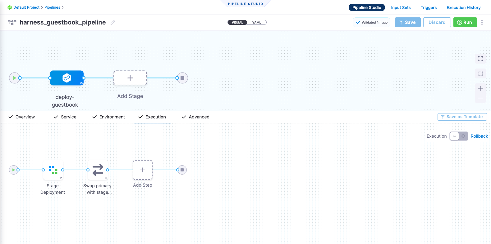

# Deploy using Kustomize

<ctabanner
  buttonText="Learn More"
  title="Continue your learning journey."
  tagline="Take a Continuous Delivery & GitOps Certification today!"
  link="/certifications/continuous-delivery"
  closable={true}
  target="_self"
/>

```mdx-code-block
import Tabs from '@theme/Tabs';
import TabItem from '@theme/TabItem';
```

This tutorial helps you get started with Harness GitOps. We will guide you through creating a CD pipeline and deployment of a Guestbook application. This Guestbook application will use Kustomize for deployment.

:::info

[Sign up today to unleash the potential of intelligent Harness CD](https://app.harness.io/auth/#/signup/?module=cd&utm_source=website&utm_medium=harness-developer-hub&utm_campaign=cd-plg&utm_content=tutorials-cd-kubernetes-kustomize).

:::

You can choose to proceed with the tutorial either by using the command-line interface (Harness CLI) or the user interface (Harness UI).

```mdx-code-block
<Tabs>
<TabItem value="CLI">
```

## Before you begin

Complete the following tasks:

1. **Obtain a Harness API Token**. For steps, go to the Harness documentation on [creating a personal API token](https://developer.harness.io/docs/platform/automation/api/add-and-manage-api-keys/).
2. **Obtain a GitHub personal access token (PAT) with repo permissions**. For steps, go to the GitHub documentation on [creating a personal access token](https://help.github.com/en/github/authenticating-to-github/creating-a-personal-access-token-for-the-command-line).
3. **Obtain a Kubernetes cluster**. Use your own Kubernetes cluster. If you do not have one, we recommend that you use [K3D](https://k3d.io/v5.5.1/) for installing Harness delegates and deploying a sample application in a local development environment.
    - Check [delegate System and network requirements](https://developer.harness.io/docs/platform/delegates/delegate-concepts/delegate-requirements).
4. **Install [Helm CLI](https://helm.sh/docs/intro/install/)**.
5. **Fork the [harnessed-example-apps](https://github.com/harness-community/harnesscd-example-apps/fork)** repository through the GitHub web interface.
    - For details on forking a GitHub repository, go to [GitHub docs](https://docs.github.com/en/get-started/quickstart/fork-a-repo#forking-a-repository).

## Getting Started with Harness CD
----------------------------------

1. Download and configure the Harness CLI.

```mdx-code-block
<Tabs>
<TabItem value="MacOS">
```

```bash
curl -LO https://github.com/harness/harness-cli/releases/download/v0.0.13-alpha/harness-v0.0.13-alpha-darwin-amd64.tar.gz 
tar -xvf harness-v0.0.13-alpha-darwin-amd64.tar.gz  
echo 'export PATH="'$(pwd)':$PATH"' >> ~/.bash_profile
source ~/.bash_profile
```

```mdx-code-block
</TabItem>
<TabItem value="Linux">
```

```mdx-code-block
<Tabs>
<TabItem value="ARM">
```

```bash
curl -LO https://github.com/harness/harness-cli/releases/download/v0.0.13-alpha/harness-v0.0.13-alpha-linux-arm64.tar.gz 
tar -xvf harness-v0.0.13-alpha-darwin-amd64.tar.gz 
echo 'export PATH="'$(pwd)':$PATH"' >> ~/.bash_profile
source ~/.bash_profile
```

```mdx-code-block
</TabItem>
<TabItem value="AMD">
```

```bash
curl -LO https://github.com/harness/harness-cli/releases/download/v0.0.13-alpha/harness-v0.0.13-alpha-linux-amd64.tar.gz 
tar -xvf harness-v0.0.13-alpha-darwin-amd64.tar.gz  
echo 'export PATH="'$(pwd)':$PATH"' >> ~/.bash_profile
source ~/.bash_profile
```

```mdx-code-block
</TabItem>
</Tabs>
```

```mdx-code-block
</TabItem>
<TabItem value="Windows">
```

a. Open Windows Powershell and run the following command to download the Harness CLI.

```
Invoke-WebRequest -Uri https://github.com/harness/harness-cli/releases/download/v0.0.13-alpha/harness-v0.0.13-alpha-windows-amd64.zip -OutFile ./harness.zip
```
    
b. Extract the downloaded Zip file and change the directory to the extracted file location.

c. Perform the following steps to make it accessible through a terminal.

```
$currentPath = Get-Location 
[Environment]::SetEnvironmentVariable("PATH", "$env:PATH;$currentPath", [EnvironmentVariableTarget]::Machine)
```

d. Restart the terminal.

```mdx-code-block
</TabItem>
</Tabs>
```

2. Clone the forked **harnessed-example-apps** repo and change the directory.
    ```bash
    git clone https://github.com/GITHUB_ACCOUNTNAME/harnesscd-example-apps.git
    cd harnesscd-example-apps 
    ```
    > Note: Replace `GITHUB_ACCOUNTNAME` with your GitHub account name.

3. Log in to Harness from the CLI.
    ```bash
    harness login --api-key  --account-id HARNESS_API_TOKEN 
    ```
    > Note: Replace `HARNESS_API_TOKEN` with the Harness API token that you obtained during the prerequisite section of this tutorial.

:::caution

For the pipeline to run successfully, perform all of the following steps as they are, including the naming conventions.

:::

### Delegate

The Harness Delegate is a service that runs in your local network or VPC to establish connections between the Harness Manager and various providers such as artifact registries, cloud platforms, etc. The delegate is installed in the target infrastructure (Kubernetes cluster) and performs operations including deployment and integration. To learn more about the delegate, go to [delegate overview](https://developer.harness.io/docs/platform/delegates/delegate-concepts/delegate-overview/).

4. Log in to the [Harness UI](https://app.harness.io/). In **Project Setup**, select **Delegates**.
    - Select **Delegates**.
        - Select **Install delegate**. For this tutorial, let's explore how to install the delegate by using Helm.
        - Add the Harness Helm chart repo to your local Helm registry.  

        ```bash
        helm repo add harness-delegate https://app.harness.io/storage/harness-download/delegate-helm-chart/
        ```  

        ```bash
        helm repo update harness-delegate
        ```
        -  Run the following command, replacing `ACCOUNT_ID`, `MANAGER_ENDPOINT`, and `DELEGATE_TOKEN` with the corresponding auto-populated values from the delegate installation wizard.  

            ```bash
            helm upgrade -i helm-delegate --namespace harness-delegate-ng --create-namespace \
            harness-delegate/harness-delegate-ng \
             --set delegateName=helm-delegate \
             --set accountId=ACCOUNT_ID \
             --set managerEndpoint=MANAGER_ENDPOINT \
             --set delegateDockerImage=harness/delegate:23.03.78904 \
             --set replicas=1 --set upgrader.enabled=false \
             --set delegateToken=DELEGATE_TOKEN
            ```
    - Verify that the delegate is installed successfully and can connect to Harness Manager.
    - You can also follow the [Install Harness delegate on Kubernetes or Docker](https://developer.harness.io/tutorials/platform/install-delegate/) tutorial to install the delegate using the Terraform Helm Provider or Kubernetes manifest.


### Secrets

Harness offers built-in secret management for encrypted storage of sensitive information. Secrets are decrypted when needed, and only the private network-connected Harness delegate has access to the key management system. You can also integrate your own secret management solution. To learn more about secrets in Harness, go to [Secrets Management](https://developer.harness.io/docs/platform/secrets/secrets-management/harness-secret-manager-overview/).

5. Create a secret to store the GitHub PAT. This will be used in the next step to create a GitHub connector.

    ```bash
    harness secret  --token GITHUB_PAT apply 
    ```
    > Note: Replace `GITHUB_PAT` with the GitHub PAT that you obtained during the prerequisite section of this tutorial.

### Connectors

Connectors in Harness enable integration with third-party tools, providing connection and authentication at deployment runtime. For example, a GitHub connector facilitates authentication and fetching files from a GitHub repository within pipeline stages. To learn more about connectors, go to [Connectors](https://developer.harness.io/docs/category/connectors).

6. Create a **GitHub connector**.
    ```bash
    harness connector --file kustomize-guestbook/harnesscd-pipeline/github-connector.yml apply --git-user GITHUB_ACCOUNTNAME
    ```

7. Create a **Kubernetes connector**.
    ```bash
    harness connector --file kustomize-guestbook/harnesscd-pipeline/kubernetes-connector.yml apply --delegate-name helm-delegate
    ```

### Environment

Environments determine the deployment location, categorized as **Production** and **Pre-Production**. Each environment includes infrastructure definitions for VMs, Kubernetes clusters, or target infrastructures. To learn more about environments, go to [Environment Overview](https://developer.harness.io/docs/continuous-delivery/x-platform-cd-features/environments/environment-overview/).

8. Create a **Environment**.
    ```bash
    harness environment --file kustomize-guestbook/harnesscd-pipeline/environment.yml apply
    ```

9. Create a **Infrastructure Definition**.
    ```bash
    harness infrastructure  --file kustomize-guestbook/harnesscd-pipeline/infrastructure-definition.yml apply
    ```

### Services

In Harness, services represent what you deploy to environments. You use services to configure variables, manifests, and artifacts. The Services dashboard provides service statistics like deployment frequency and failure rate. To learn more about services, go to [Services Overview](https://developer.harness.io/docs/continuous-delivery/x-platform-cd-features/services/services-overview/).

10. Create a **Service**.
    ```bash
    harness service --file kustomize-guestbook/harnesscd-pipeline/service.yml apply 
    ```

### Pipeline

A pipeline is a comprehensive process encompassing integration, delivery, operations, testing, deployment, and monitoring. It can utilize CI for code building and testing and follow that up with CD for artifact deployment in production. A CD pipeline is a series of stages where each stage deploys a service to an environment. To learn more about CD pipeline basics, go to [CD pipeline basics](https://developer.harness.io/docs/continuous-delivery/get-started/key-concepts/).


```mdx-code-block
<Tabs>
<TabItem value="Canary">
```

A canary deployment updates nodes in a single environment gradually, allowing you to use gates between increments. Canary deployments allow incremental updates and ensure a controlled rollout process. For more information, go to [When to use Canary deployments](https://developer.harness.io/docs/continuous-delivery/manage-deployments/deployment-concepts#when-to-use-canary-deployments).

```bash
harness pipeline --file kustomize-guestbook/harnesscd-pipeline/canary-pipeline.yml apply
```

- You can confirm the pipeline, stage, and execution steps are as shown below in the Harness UI.


```mdx-code-block
</TabItem>
<TabItem value="Blue Green">
```

Blue Green deployments involve running two identical environments (stage and prod) simultaneously with different service versions. QA and UAT are performed on a new service version in the stage environment first. Next, traffic is shifted from the prod environment to stage, and the previous service version running on prod is scaled down. Blue Green deployments are also referred to as red/black deployment by some vendors. For more information, go to [When to use Blue Green deployments](https://developer.harness.io/docs/continuous-delivery/manage-deployments/deployment-concepts#when-to-use-blue-green-deployments).

```bash
harness pipeline --file kustomize-guestbook/harnesscd-pipeline/bluegreen-pipeline.yml apply
```

- You can confirm the pipeline, stage, and execution steps are as shown below in the Harness UI.



```mdx-code-block
</TabItem>
<TabItem value="Rolling">
```

Rolling deployments incrementally add nodes in a single environment with a new service version, either one node at a time or in batches defined by a window size. Rolling deployments allow a controlled and gradual update process for the new service version. For more information, go to [When to use rolling deployments](https://developer.harness.io/docs/continuous-delivery/manage-deployments/deployment-concepts#when-to-use-rolling-deployments).

```bash
harness pipeline --file kustomize-guestbook/harnesscd-pipeline/rolling-pipeline.yml apply
```

- You can confirm the pipeline, stage, and execution steps are as shown below in the Harness UI.


```mdx-code-block
</TabItem>
</Tabs>
```

```mdx-code-block
</TabItem>
<TabItem value="UI">
```

## Before you begin

Verify the following:

1. **Obtain GitHub personal access token with repo permissions**. For steps, go to the GitHub documentation on [creating a personal access token](https://help.github.com/en/github/authenticating-to-github/creating-a-personal-access-token-for-the-command-line).
2. **A Kubernetes cluster**. Use your own Kubernetes cluster or we recommend using [K3D](https://k3d.io/v5.5.1/) for installing Harness delegates and deploying a sample application in a local development environment.
    - Check [delegate System and network requirements](/docs/platform/delegates/delegate-concepts/delegate-requirements).
3. **Install [Helm CLI](https://helm.sh/docs/intro/install/)**.
4. **Fork the [harnessed-example-apps](https://github.com/harness-community/harnesscd-example-apps/fork)** repository through the GitHub web interface.
    - For details on forking a GitHub repository, go to [GitHub docs](https://docs.github.com/en/get-started/quickstart/fork-a-repo#forking-a-repository).

## Getting Started with Harness CD
----------------------------------

1. Log into [Harness](https://app.harness.io/).

2. Select **Projects**, and then select **Default Project**.

:::caution

For the pipeline to run successfully, please follow all of the following steps as they are, including the naming conventions.

:::

### Delegate

The Harness Delegate is a service that runs in your local network or VPC to establish connections between the Harness Manager and various providers such as artifact registries, cloud platforms, etc. The delegate is installed in the target infrastructure (Kubernetes cluster) and performs operations including deployment and integration. To learn more about the delegate, go to [delegate Overview](/docs/platform/delegates/delegate-concepts/delegate-overview/).

3. In **Project Setup**, select **Delegates**.
    - Select **Tokens**.
        - Select **New Token**.
        - Enter the named `delegate_token`.
        - Select **Apply**.
        - Copy the token value by selecting the copy icon and store the token somewhere.
        - Select **Close**.
    - Select **Delegates**.
        - Select **Install delegate**. For this tutorial, let's explore how to install the delegate using Helm.
        - Add the Harness Helm chart repo to your local Helm registry.  

        ```bash
        helm repo add harness-delegate https://app.harness.io/storage/harness-download/delegate-helm-chart/
        ```  

        ```bash
        helm repo update harness-delegate
        ```
        -  In the command provided, `ACCOUNT_ID`, `MANAGER_ENDPOINT` and `DELEGATE_TOKEN` are auto-populated values that you can obtain from the delegate Installation wizard. 

            ```bash
            helm upgrade -i helm-delegate --namespace harness-delegate-ng --create-namespace \
            harness-delegate/harness-delegate-ng \
             --set delegateName=helm-delegate \
             --set accountId=ACCOUNT_ID \
             --set managerEndpoint=MANAGER_ENDPOINT \
             --set delegateDockerImage=harness/delegate:23.03.78904 \
             --set replicas=1 --set upgrader.enabled=false \
             --set delegateToken=DELEGATE_TOKEN
            ```
    - Verify that the delegate is installed successfully and can connect to the Harness Manager.
    - You can also follow the [Install Harness delegate on Kubernetes or Docker](/tutorials/platform/install-delegate/) tutorial to install the delegate using the Terraform Helm Provider or Kubernetes manifest.


### Secrets

Harness offers built-in secret management for encrypted storage of sensitive information. Secrets are decrypted when needed, and only the private network-connected Harness delegate has access to the key management system. You can also integrate your own secret management solution. To learn more about secrets in Harness, go to [Secrets Management](/docs/platform/secrets/secrets-management/harness-secret-manager-overview/).

4. In **Project Setup**, select **Secrets**.
    - Select **New Secret** > **Text**.
    - Enter the secret name `harness_gitpat`.
    - For the secret value, paste in the GitHub Personal Access Token.
    - Select **Save**.

### Connectors

Connectors in Harness enable integration with 3rd party tools, providing connection and authentication at deployment runtime. For example, a GitHub connector facilitates authentication and fetching files from a GitHub repository within pipeline stages. To learn more about connectors, go to [Connectors](/docs/category/connectors).

5. Create a **GitHub connector**.
    - Copy the contents of [github-connector.yml](https://github.com/harness-community/harnesscd-example-apps/blob/master/kustomize-guestbook/harnesscd-pipeline/github-connector.yml).
    - In Harness, in **Project Setup**, select **Connectors**.
    - Select **Create via YAML Builder** and paste the copied YAML.
    - Assuming you have already forked the [harnessed-example-apps](https://github.com/harness-community/harnesscd-example-apps/fork) repository as mentioned earlier, replace **GITHUB_USERNAME** with your GitHub account username in the YAML wherever required.
    - Select **Save Changes** and verify that the new connector named **harness_gitconnector** is successfully created.
    - Finally, select **Test** under **CONNECTIVITY STATUS** to ensure the connection is successful.

6. Create **Kubernetes connector**.
    - Copy the contents of [kubernetes-connector.yml](https://github.com/harness-community/harnesscd-example-apps/blob/master/kustomize-guestbook/harnesscd-pipeline/kubernetes-connector.yml).
    - In Harness, in **Project Setup**, select **Connectors**.
    - Select **Create via YAML Builder** and paste in the copied YAML.
    - In the YAML, replace **DELEGATE_NAME** with the installed delegate name. To obtain the delegate name, navigate to **Default Project** > **Project Setup** > **Delegates**. 
    - Select **Save Changes** and verify that the new connector named **harness_k8sconnector** is successfully created.
    - Finally, select **Test** under **CONNECTIVITY STATUS** to verify the connection is successful.

### Environment

Environments determine the deployment location, categorized as **Production** and **Pre-Production**. Each environment includes infrastructure definitions for VMs, Kubernetes clusters, or target infrastructures. To learn more about environments, go to [Environment Overview](/docs/continuous-delivery/x-platform-cd-features/environments/environment-overview/).

7. In **Default Project**, select **Environments**.
    - Select **New Environment** and toggle to **YAML** to use the YAML editor.
    - Copy the contents of [environment.yml](https://github.com/harness-community/harnesscd-example-apps/blob/master/kustomize-guestbook/harnesscd-pipeline/environment.yml) and paste it into the YAML editor and select **Save**.
    - In **Infrastructure Definitions**, select **Infrastructure Definition** and select **Edit YAML**.
    - Copy the contents of [infrastructure-definition.yml](https://github.com/harness-community/harnesscd-example-apps/blob/master/kustomize-guestbook/harnesscd-pipeline/infrastructure-definition.yml) and paste it into the YAML editor.
    - Select **Save** and verify that the environment and infrastructure definition is created successfully.

### Services

In Harness, services represent what you deploy to environments. You use services to configure variables, manifests, and artifacts. The Services dashboard provides service statistics like deployment frequency and failure rate. To learn more about services, go to [Services Overview](/docs/continuous-delivery/x-platform-cd-features/services/services-overview/).

8. In **Default Project**, select **Services**.
    - Select **New Service**.
    - Name the service `harnessguestbook`.
    - Select **Save**, and then in the **Configuration** tab, toggle to **YAML** to use the YAML editor.
    - Select **Edit YAML** and copy the contents of [service.yml](https://github.com/harness-community/harnesscd-example-apps/blob/master/kustomize-guestbook/harnesscd-pipeline/service.yml) and paste it into the YAML editor.
    - Select **Save** and verify that the Service **harness_guestbook** is successfully created.

### Pipeline

A pipeline is a comprehensive process encompassing integration, delivery, operations, testing, deployment, and monitoring. It can utilize CI for code building and testing, followed by CD for artifact deployment in production. A CD pipeline is a series of stages where each stage deploys a service to an environment. To learn more about CD pipeline basics, go to [CD pipeline basics](/docs/continuous-delivery/get-started/key-concepts/).


```mdx-code-block
<Tabs>
<TabItem value="Canary">
```

A canary deployment updates nodes in a single environment gradually, allowing you to use gates between increments. Canary deployments allow incremental updates and ensure a controlled rollout process. For more information, go to [When to use Canary deployments](/docs/continuous-delivery/manage-deployments/deployment-concepts#when-to-use-canary-deployments).

- In **Default Project**, select **Pipelines**.
    - Select **New Pipeline**.
    - Enter the name `guestbook_canary_pipeline`.
    - Select **Inline** to store the pipeline in Harness.
    - Select **Start** and, in the Pipeline Studio, toggle to **YAML** to use the YAML editor.
    - Select **Edit YAML** to enable edit mode, and choose any of the following execution strategies. Paste the respective YAML based on your selection.

- Copy the contents of [canary-pipeline.yml](https://github.com/harness-community/harnesscd-example-apps/blob/master/kustomize-guestbook/harnesscd-pipeline/canary-pipeline.yml) and paste it into the YAML editor.
- Select **Save**.
- You can switch to the **Visual** editor and confirm the pipeline, stage, and execution steps are as shown below.


```mdx-code-block
</TabItem>
<TabItem value="Blue Green">
```

Blue Green deployments involve running two identical environments (stage and prod) simultaneously with different service versions. QA and UAT are performed on a new service version in the stage environment first. Next, traffic is shifted from the prod environment to stage, and the previous service version running on prod is scaled down. Blue Green deployments are also referred to as red/black deployment by some vendors. For more information, go to [When to use Blue Green deployments](/docs/continuous-delivery/manage-deployments/deployment-concepts#when-to-use-blue-green-deployments).

- In **Default Project**, select **Pipelines**.
    - Select **New Pipeline**.
    - Enter the name `guestbook_bluegreen_pipeline`.
    - Select **Inline** to store the pipeline in Harness.
    - Select **Start** and, in the Pipeline Studio, toggle to **YAML** to use the YAML editor.
    - Select **Edit YAML** to enable edit mode, and choose any of the following execution strategies. Paste the respective YAML based on your selection.

- Copy the contents of [bluegreen-pipeline.yml](https://github.com/harness-community/harnesscd-example-apps/blob/master/kustomize-guestbook/harnesscd-pipeline/bluegreen-pipeline.yml) and paste it into the YAML editor.
- Select **Save**.
- You can switch to the **Visual** editor and confirm the pipeline, stage, and execution steps are as shown below.


```mdx-code-block
</TabItem>
<TabItem value="Rolling">
```

Rolling deployments incrementally add nodes in a single environment with a new service version, either one-by-one or in batches defined by a window size. Rolling deployments allow a controlled and gradual update process for the new service version. For more information, go to [When to use rolling deployments](/docs/continuous-delivery/manage-deployments/deployment-concepts#when-to-use-rolling-deployments).

- In **Default Project**, select **Pipelines**.
    - Select **New Pipeline**.
    - Enter the name `guestbook_rolling_pipeline`.
    - Select **Inline** to store the pipeline in Harness.
    - Select **Start** and, in the Pipeline Studio, toggle to **YAML** to use the YAML editor.
    - Select **Edit YAML** to enable edit mode, and choose any of the following execution strategies. Paste the respective YAML based on your selection.

- Copy the contents of [rolling-pipeline.yml](https://github.com/harness-community/harnesscd-example-apps/blob/master/kustomize-guestbook/harnesscd-pipeline/rolling-pipeline.yml) and paste it into the YAML editor.
- Select **Save**.
- You can switch to the **Visual** editor and confirm the pipeline, stage, and execution steps are as shown below.


```mdx-code-block
</TabItem>
</Tabs>
```

```mdx-code-block
</TabItem>
</Tabs>
```

-  Finally, it's time to execute the pipeline. Select **Run**, and then select **Run Pipeline** to initiate the deployment.

    - Observe the execution logs as Harness deploys the workload and checks for steady state.
    - After a successful execution, you can check the deployment in your Kubernetes cluster using the following command:  

    ```bash
    kubectl get pods -n default
    ```
    - To access the Guestbook application deployed via the Harness pipeline, port forward the service and access it at [http://localhost:8080](http://localhost:8080):  

    ```bash
    kubectl port-forward svc/kustomize-guestbook-ui 8080:80
    ```

### Congratulations!🎉
You've just learned how to use Harness CD to deploy an application using a Kustomize template.

#### What's Next?
- Keep learning about Harness CD. Add triggers to your pipeline that'll respond to Git events by following this [guide](/docs/platform/Triggers/triggering-pipelines).
- Visit the [Harness Developer Hub](https://developer.harness.io/) for more Tutorials and resources.

##### How to deploy your own app by using Harness

You can integrate your own microservice application into this tutorial by following the steps outlined below:

- Utilize the same delegate that you deployed as part of this tutorial. Alternatively, deploy a new delegate, but remember to use a newly created delegate identifier when creating connectors.

- If you intend to use a private Git repository that hosts your Kustomize files, create a Harness secret containing the Git personal access token (PAT). Subsequently, create a new Git connector using this secret.

- Create a Kubernetes connector if you plan to deploy your applications in a new Kubernetes environment. Make sure to update the infrastructure definition to reference this newly created Kubernetes connector.

- Once you complete all the aforementioned steps, create a new Harness service that leverages Kustomize for deploying applications.

- Lastly, establish a new deployment pipeline and select the newly created infrastructure definition and service. Choose a deployment strategy that aligns with your microservice application's deployment needs.

- Voila! You're now ready to deploy your own application using Harness.
