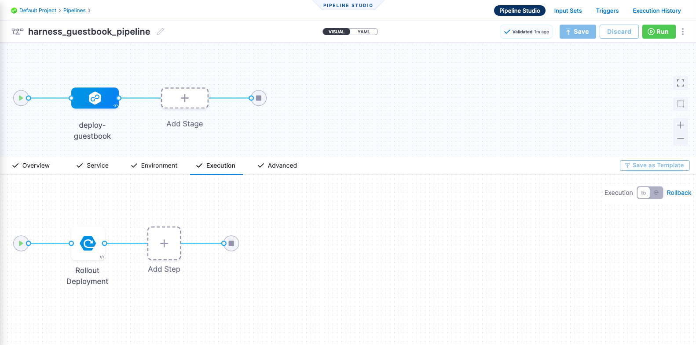

# Harness Deployment Pipeline Using Kustomize Template

```mdx-code-block
import Tabs from '@theme/Tabs';
import TabItem from '@theme/TabItem';
```

This tutorial is designed to help you get started with Harness Continuous Delivery (CD). We will guide you through creating a deployment pipeline for deploying a Guestbook application. It's important to note that this Guestbook application is based on a Kustomize template.

:::info

[Sign up today to unleash the potential of intelligent Harness CD](https://app.harness.io/auth/#/signup/?module=cd)

:::

```mdx-code-block
<Tabs>
<TabItem value="CD Pipeline">
```

## Before you begin

Verify the following:

1. **Obtain GitHub personal access token with repo permissions**. See the GitHub documentation on [creating a personal access token](https://help.github.com/en/github/authenticating-to-github/creating-a-personal-access-token-for-the-command-line).
2. **A Kubernetes cluster**. Use your own Kubernetes cluster or we recommend using [K3D](https://k3d.io/v5.5.1/), for installing Harness Delegates and deploying a sample application in a local development environment.
    - Check [Delegate System and network requirements](https://developer.harness.io/docs/platform/Delegates/delegate-concepts/delegate-requirements).
3. **Install [Helm CLI](https://helm.sh/docs/intro/install/)**.
4. **Fork the [harnessed-example-apps](https://github.com/harness-community/harnesscd-example-apps/fork)** repository through the GitHub web interface.
    - More details on Forking a GitHub repository [here](https://docs.github.com/en/get-started/quickstart/fork-a-repo#forking-a-repository)

## Getting Started with Harness CD
----------------------------------

1. Log in to the [Harness App](https://app.harness.io/)

2. Click on **Projects** in the top left corner and choose **Default Project**

:::caution

Going forward, follow all the steps as they are, including the naming conventions, for the pipeline to run successfully.

:::

<details>
<summary>Delegate</summary>

Harness Delegate is a service you run in your local network or VPC to connect your artifacts, infrastructure, collaboration, verification and other providers, with Harness Manager. The first time you connect Harness to a third-party resource, Harness Delegate is installed in your target infrastructure, for example, a Kubernetes cluster. After the delegate is installed, you connect to third-party resources. The delegate performs all operations, including deployment and integration.

See [Delegate Overview](https://developer.harness.io/docs/platform/delegates/delegate-concepts/delegate-overview/).

</details>

3. Under **Project Setup**, click on **Delegates**
    - On the top right corner, click **Tokens**
        - Click **New Token**
        - Enter name: `delegate_token`
        - Click **Apply**
        - Now, copy the token value by clicking on the copy icon and store it somewhere.
        - Click **close**
    - Now, click **Delegates** in the top right corner
        - Click **Install Delegate**
        - For this tutorial, let's explore how to install the Delegate using Helm.
        - Add Harness helm chart repo to your local helm registry
        ```bash
        helm repo add harness-delegate https://app.harness.io/storage/harness-download/delegate-helm-chart/
        ```
        ```bash
        helm repo update harness-delegate
        ```
        - Replace **DELEGATE_TOKEN** in the command below with the token that was copied earlier and proceed with installing Delegate.
        ```bash
        helm upgrade -i helm-delegate --namespace harness-delegate-ng --create-namespace \
          harness-delegate/harness-delegate-ng \
          --set delegateName=helm-delegate \
          --set accountId=Hdp26q9USBK_hrtf_PPC7A \
          --set managerEndpoint=https://app.harness.io/gratis \
          --set delegateDockerImage=harness/delegate:23.03.78904 \
          --set replicas=1 --set upgrader.enabled=false \
          --set delegateToken=DELEGATE_TOKEN
        ```       
    - Verify that the Delegate is installed successfully and can connect to the Harness Manager.
    - You can also follow the [Install Harness Delegate on Kubernetes or Docker](https://developer.harness.io/tutorials/platform/install-delegate/) tutorial to install Delegate using _Terraform Helm Provider_ or _Kubernetes Manifest_.


<details>
<summary>Secrets</summary>

Harness includes a built-in Secret Management feature that enables you to store encrypted secrets, such as access keys, and use them in your Harness account. Some key points about Secret Management:
- Secrets are always stored in encrypted form and decrypted when they are needed.
- Harness Manager does not have access to your key management system, and only the Harness Delegate, which sits in your private network, has access to it. Harness never makes secret management accessible publicly. This adds an important layer of security.

You can choose to use your own [secret management solution](https://developer.harness.io/docs/platform/Secrets/Secrets-Management/add-secrets-manager)

See [Secrets Overview](https://developer.harness.io/docs/platform/Secrets/Secrets-Management/harness-secret-manager-overview/)

</details>

4. Under **Project Setup**, click on **Secrets**
    - Click **New Secret** > **Text**
    - Enter the secret name: `harness_gitpat`
    - Secret Value: Paste the GitHub Personal Access Token to this field
    - Click **Save**

<details>
<summary>Connectors</summary>

Connectors contain the information necessary to integrate and work with 3rd party tools.

Harness uses connectors at pipeline runtime to authenticate and perform operations with a third-party tool.

For example, a GitHub connector authenticates with a GitHub account and repo and fetches files as part of a build or deploy stage in a pipeline.

See [Connectors How-tos](https://developer.harness.io/docs/category/connectors).

</details>

5. Create **GitHub Connector**
    - Under **Project Setup**, click on **Connectors**
    - Click **Create via YAML Builder** and paste the below:
    ```yaml
    connector:
      name: harness_gitconnector
      identifier: harnessgitconnector
      description: ""
      orgIdentifier: default
      projectIdentifier: default_project
      type: Github
      spec:
        url: https://github.com/GITHUB_USERNAME/harnesscd-example-apps
        authentication:
          type: Http
          spec:
            type: UsernameToken
            spec:
              username: GITHUB_USERNAME
              tokenRef: harness_gitpat
        apiAccess:
          type: Token
          spec:
            tokenRef: harness_gitpat
        executeOnDelegate: false
        type: Repo
    ```
  > ⚠️ NOTE: Assuming you have already forked the [harnessed-example-apps](https://github.com/harness-community/harnesscd-example-apps/fork) repository as mentioned at the start, please replace **GITHUB_USERNAME** with your GitHub account username in the above YAML.
    - Click **Save Changes** and verify that the new connector with the name _**harness_gitconnector**_ was created successfully.
    - Finally, click **Test** under **CONNECTIVITY STATUS** to verify the connection is successful.

6. Create **Kubernetes Connector**
    - Under **Project Setup**, click on **Connectors**
    - Click **Create via YAML Builder** and paste the below:
    ```yaml
    connector:
      name: harness_k8sconnector
      identifier: harnessk8sconnector
      description: ""
      orgIdentifier: default
      projectIdentifier: default_project
      type: K8sCluster
      spec:
        credential:
          type: InheritFromDelegate
        delegateSelectors:
          - DELEGATE_NAME
    ```
  > ⚠️ NOTE: In the above YAML, replace **DELEGATE_NAME** with the installed Delegate name. To obtain the Delegate name, navigate to Default Project > Project Setup > Delegates. 
    - Click **Save Changes** and verify that the new connector with the name _**harness_k8sconnector**_ was created successfully.
    - Finally, click **Test** under **CONNECTIVITY STATUS** to verify the connection is successful.

<details>
<summary>Environment</summary>

A Harness environment represents where you are deploying your application. You categorize each environment as prod or non-prod.

Each infrastructure definition in an environment defines the specific VM, Kubernetes cluster, or target infrastructure where you plan to deploy your application. An environment can contain multiple infrastructure definitions. When you select an environment in a pipeline, you can pick which infrastructure definition to use.

See [Environments overview](https://developer.harness.io/docs/continuous-delivery/x-platform-cd-features/environments/environment-overview/).

</details>

7. Under **Default Project** click on **Environments**
    - Click **New Environment** and toggle to **YAML** _(next to VISUAL)_
    - Paste the below into the YAML editor and click **Save**
    ```yaml
    environment:
      name: harness_dev_env
      identifier: harnessdevenv
      description: ""
      tags: {}
      type: PreProduction
      orgIdentifier: default
      projectIdentifier: default_project
      variables: []
    ```
    - Now, go to the **Infrastructure Definitions** tab
    - Click on **Infrastructure Definition** and click **Edit YAML** and paste the below:
    ```yaml
    infrastructureDefinition:
      name: harness_k8sinfra
      identifier: harnessk8sinfra
      description: ""
      tags: {}
      orgIdentifier: default
      projectIdentifier: default_project
      environmentRef: harnessdevenv
      deploymentType: Kubernetes
      type: KubernetesDirect
      spec:
        connectorRef: harnessk8sconnector
        namespace: default
        releaseName: release-<+INFRA_KEY>
      allowSimultaneousDeployments: false
    ```
    - Click **Save** and verify that the Environment and Infra definition was created successfully.

<details>
<summary>Services</summary>

A Harness service represents what you're deploying.

Harness services are deployed to Harness environments. Select Environments to see the environments in this project.

In Manage Services, you can create, update, and delete your services' settings. For example, a service's variables and its manifest and artifact details.

In Dashboard, you can view service statistics such as deployment frequency, failure rate, and so on.

See [Services overview](https://developer.harness.io/docs/continuous-delivery/x-platform-cd-features/services/services-overview/).

</details>

8. Under **Default Project** click on **Services**
    - Click **New Service**
    - Enter the name: `harnessguestbook`
    - click **Save** and toggle to **YAML** _(next to VISUAL)_ under **Configuration** tab.
    - Click **Edit YAML** and paste the below
    ```yaml
    service:
      name: harnessguestbook
      identifier: harnessguestbook
      serviceDefinition:
        type: Kubernetes
        spec:
          manifests:
            - manifest:
                identifier: guestbook
                type: Kustomize
                spec:
                  store:
                    type: Github
                    spec:
                      connectorRef: harnessgitconnector
                      gitFetchType: Branch
                      folderPath: kustomize-guestbook
                      branch: master
                  pluginPath: ""
                  skipResourceVersioning: false
                  enableDeclarativeRollback: false
      gitOpsEnabled: false
    ```
    - Click **Save** and verify that the Service _**harness_guestbook**_ was created successfully.

<details>
<summary>Pipeline</summary>

Typically, a pipeline is an end-to-end process that delivers a new version of your software. But a pipeline can be much more: a pipeline can be a cyclical process that includes integration, delivery, operations, testing, deployment, real-time changes, and monitoring.

For example, a pipeline can use the CI module to build, test, and push code, and then a CD module to deploy the artifact to your production infrastructure.

See [CD pipeline basics](https://developer.harness.io/docs/continuous-delivery/get-started/cd-pipeline-basics/).

</details>

9. Under **Default Project** click on **Pipelines**
- Click **New Pipeline** and enter the below details
- Enter the name: `harness_guestbook_pipeline`
- Choose **Inline** and the Pipeline will be stored in Harness
- Click **Start** and toggle to **YAML** _(next to VISUAL)_
- Now, click on **Edit YAML** to enable edit mode, and choose any of the following execution strategies. Paste the respective YAML based on your selection.

```mdx-code-block
<Tabs>
<TabItem value="Canary">
```

<details>
<summary>Understanding Canary Deployment</summary>

**Canary Deployment** updates nodes in a single environment gradually, with each phase requiring verification before proceeding to the next. It allows incremental updates and ensures a controlled rollout process.

See [When to use Canary deployments](https://developer.harness.io/docs/continuous-delivery/manage-deployments/deployment-concepts#when-to-use-canary-deployments)

</details>

```yaml
pipeline:
  name: harness_guestbook_pipeline
  identifier: harness_guestbook_pipeline
  projectIdentifier: default_project
  orgIdentifier: default
  tags: {}
  stages:
    - stage:
        name: deploy-guestbook
        identifier: deployguestbook
        description: ""
        type: Deployment
        spec:
          deploymentType: Kubernetes
          service:
            serviceRef: harnessguestbook
          environment:
            environmentRef: harnessdevenv
            deployToAll: false
            infrastructureDefinitions:
              - identifier: harnessk8sinfra
          execution:
            steps:
              - stepGroup:
                  name: Canary Deployment
                  identifier: canaryDepoyment
                  steps:
                    - step:
                        name: Canary Deployment
                        identifier: canaryDeployment
                        type: K8sCanaryDeploy
                        timeout: 10m
                        spec:
                          instanceSelection:
                            type: Count
                            spec:
                              count: 1
                          skipDryRun: false
                    - step:
                        name: Canary Delete
                        identifier: canaryDelete
                        type: K8sCanaryDelete
                        timeout: 10m
                        spec: {}
              - stepGroup:
                  name: Primary Deployment
                  identifier: primaryDepoyment
                  steps:
                    - step:
                        name: Rolling Deployment
                        identifier: rollingDeployment
                        type: K8sRollingDeploy
                        timeout: 10m
                        spec:
                          skipDryRun: false
            rollbackSteps:
              - step:
                  name: Canary Delete
                  identifier: rollbackCanaryDelete
                  type: K8sCanaryDelete
                  timeout: 10m
                  spec: {}
              - step:
                  name: Rolling Rollback
                  identifier: rollingRollback
                  type: K8sRollingRollback
                  timeout: 10m
                  spec: {}
        tags: {}
        failureStrategies:
          - onFailure:
              errors:
                - AllErrors
              action:
                type: StageRollback
```
- Finally, click on **Save** in the top right corner to save the Pipeline.
- Alternatively, you can switch to the **VISUAL** version and confirm the pipeline stage and execution steps as shown below.


```mdx-code-block
</TabItem>
<TabItem value="Blue Green">
```

<details>
<summary>Understanding Blue Green Deployment</summary>

**Blue-Green Deployment** involves running two identical environments (stage and prod) simultaneously with different service versions. QA and UAT are performed on stage before flipping the traffic from prod to stage, allowing decommissioning of the old environment post-successful deployment. It is also referred to as red/black deployment by some vendors.

See [When to use Blue Green deployments](https://developer.harness.io/docs/continuous-delivery/manage-deployments/deployment-concepts#when-to-use-blue-green-deployments)

</details>

```yaml
pipeline:
  name: harness_guestbook_pipeline
  identifier: harness_guestbook_pipeline
  projectIdentifier: default_project
  orgIdentifier: default
  tags: {}
  stages:
    - stage:
        name: deploy-guestbook
        identifier: deployguestbook
        description: ""
        type: Deployment
        spec:
          deploymentType: Kubernetes
          service:
            serviceRef: harnessguestbook
          environment:
            environmentRef: harnessdevenv
            deployToAll: false
            infrastructureDefinitions:
              - identifier: harnessk8sinfra
          execution:
            steps:
              - step:
                  name: Stage Deployment
                  identifier: stageDeployment
                  type: K8sBlueGreenDeploy
                  timeout: 10m
                  spec:
                    skipDryRun: false
                    pruningEnabled: false
              - step:
                  name: Swap primary with stage service
                  identifier: bgSwapServices
                  type: K8sBGSwapServices
                  timeout: 10m
                  spec:
                    skipDryRun: false
            rollbackSteps:
              - step:
                  name: Swap primary with stage service
                  identifier: rollbackBgSwapServices
                  type: K8sBGSwapServices
                  timeout: 10m
                  spec:
                    skipDryRun: false
        tags: {}
        failureStrategies:
          - onFailure:
              errors:
                - AllErrors
              action:
                type: StageRollback
```
- Finally, click on **Save** in the top right corner to save the Pipeline.
- Alternatively, you can switch to the **VISUAL** version and confirm the pipeline stage and execution steps as shown below.


```mdx-code-block
</TabItem>
<TabItem value="Rolling">
```

<details>
<summary>Understanding Rolling Deployment</summary>

**Rolling Deployment** incrementally adds nodes in a single environment with a new version, either one-by-one or in batches defined by a window size. It allows a controlled and gradual update process for the service/artifact.

See [When to use rolling deployments](https://developer.harness.io/docs/continuous-delivery/manage-deployments/deployment-concepts#when-to-use-rolling-deployments).

</details>

```yaml
pipeline:
  name: harness_guestbook_pipeline
  identifier: harness_guestbook_pipeline
  projectIdentifier: default_project
  orgIdentifier: default
  tags: {}
  stages:
    - stage:
        name: deploy-guestbook
        identifier: deployguestbook
        description: ""
        type: Deployment
        spec:
          deploymentType: Kubernetes
          service:
            serviceRef: harnessguestbook
          environment:
            environmentRef: harnessdevenv
            deployToAll: false
            infrastructureDefinitions:
              - identifier: harnessk8sinfra
          execution:
            steps:
              - step:
                  name: Rollout Deployment
                  identifier: rolloutDeployment
                  type: K8sRollingDeploy
                  timeout: 10m
                  spec:
                    skipDryRun: false
                    pruningEnabled: false
            rollbackSteps:
              - step:
                  name: Rollback Rollout Deployment
                  identifier: rollbackRolloutDeployment
                  type: K8sRollingRollback
                  timeout: 10m
                  spec:
                    pruningEnabled: false
        tags: {}
        failureStrategies:
          - onFailure:
              errors:
                - AllErrors
              action:
                type: StageRollback
```
- Finally, click on **Save** in the top right corner to save the Pipeline.
- Alternatively, you can switch to the **VISUAL** version and confirm the pipeline stage and execution steps as shown below.



```mdx-code-block
</TabItem>
</Tabs>
```

10. Finally, it's time to execute the Pipeline. Click on **Run**, and then click **Run Pipeline** to initiate the deployment.
    - Observe the execution logs as Harness deploys the workload and checks for steady state.
    - After a successful execution, you can check the deployment on your Kubernetes cluster using the following command:
        ```bash
        kubectl get pods -n default
        ```
    - To access the Guestbook application deployed via the Harness Pipeline, port forward the service and access it at [http://localhost:8080](http://localhost:8080)
        ```bash
        kubectl port-forward svc/kustomize-guestbook-ui 8080:80
        ```

Congratulations on successfully executing the Harness Kustomize Pipeline!🎉

```mdx-code-block
</TabItem>
<TabItem value="GitOps Workflow">
```

## Before you begin

Verify the following:

1. **Obtain GitHub personal access token with repo permissions**. See the GitHub documentation on [creating a personal access token](https://help.github.com/en/github/authenticating-to-github/creating-a-personal-access-token-for-the-command-line).
2. **A Kubernetes cluster**. We recommend [K3D](https://k3d.io/v5.5.1/) for installing Harness Delegates and deploying a sample application in a local development environment.
    - Check [Delegate System and network requirements](https://developer.harness.io/docs/platform/Delegates/delegate-concepts/delegate-requirements). 
3. **Fork the [harnessed-example-apps](https://github.com/harness-community/harnesscd-example-apps/fork)** repository through the GitHub web interface.
    - More details on Forking a GitHub repository [here](https://docs.github.com/en/get-started/quickstart/fork-a-repo#forking-a-repository)

## Getting Started with Harness GitOps
--------------------------------------

1. Log in to the [Harness App](https://app.harness.io/)

2. Click on **Projects** in the top left corner, choose **Default Project**

3. TODO: -|

```mdx-code-block
</TabItem>
</Tabs>
```