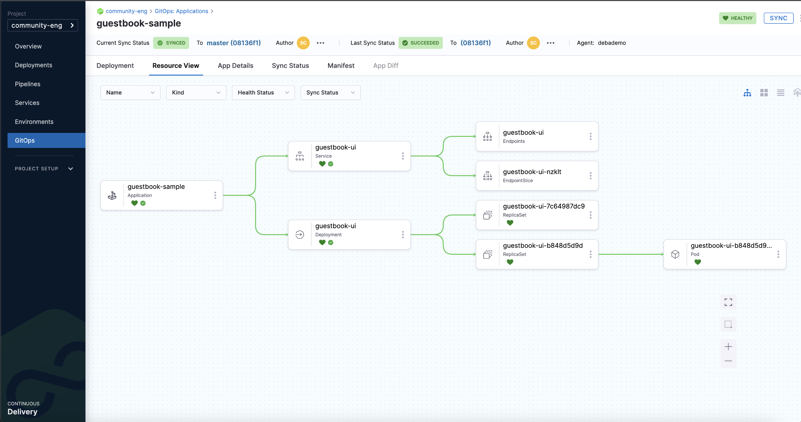

# Deploy using Kubernetes Manifest

<ctabanner
  buttonText="Learn More"
  title="Continue your learning journey."
  tagline="Take a Continuous Delivery & GitOps Certification today!"
  link="/certifications/continuous-delivery"
  closable={true}
  target="_self"
/>

```mdx-code-block
import Tabs from '@theme/Tabs';
import TabItem from '@theme/TabItem';
```

This tutorial will get you started with Harness Continuous Delivery (CD). We will guide you through deploying a Guestbook application using Harness CD pipeline and GitOps methods. This Guestbook application uses a publicly available Kubernetes manifest and Docker image.

:::info

[Sign up today to unleash the potential of intelligent Harness CD](https://app.harness.io/auth/#/signup/?module=cd&utm_source=website&utm_medium=harness-developer-hub&utm_campaign=cd-plg&utm_content=tutorials-cd-kubernetes-manifest).

:::

```mdx-code-block
<Tabs>
<TabItem value="CD pipeline">
```
Harness CD pipelines allow you to orchestrate and automate your deployment workflows, and push updated application images to your target Kubernetes cluster. Pipelines allow extensive control over how you want to progress artifacts through various dev / test / stage / prod clusters, while running a variety of scans & tests to ensure quality and stability standards you and team may have defined.
## Before you begin

Verify that you have the following:

1. **Obtain GitHub personal access token with the repo scope**. See the GitHub documentation on [creating a personal access token](https://help.github.com/en/github/authenticating-to-github/creating-a-personal-access-token-for-the-command-line).
2. **A Kubernetes cluster**. Use your own Kubernetes cluster or we recommend using [K3D](https://k3d.io/v5.5.1/) for installing Harness Delegates and deploying a sample application in a local development environment.
    - Check [Delegate system requirements](https://developer.harness.io/docs/platform/Delegates/delegate-concepts/delegate-requirements).
3. **Install the [Helm CLI](https://helm.sh/docs/intro/install/)** in order to install the Harness Helm delegate.
4. **Fork the [harnessed-example-apps](https://github.com/harness-community/harnesscd-example-apps/fork)** repository through the GitHub website.
    - For details on Forking a GitHub repository, go to [GitHub docs](https://docs.github.com/en/get-started/quickstart/fork-a-repo#forking-a-repository) for more information on forking a GitHub repository.

## Getting Started with Harness CD
----------------------------------

1. Login to [Harness](https://app.harness.io/).
2. Select **Projects**, and then select **Default Project**.

:::caution

For the pipeline to run successfully, please follow the remaining steps as they are, including the naming conventions.

:::

### Delegate

<details open>
<summary>What is the Harness delegate?</summary>

The Harness delegate is a service that runs in your local network or VPC to establish connections between the Harness Manager and various providers such as artifacts registries, cloud platforms, etc. The delegate is installed in the target infrastructure, for example, a Kubernetes cluster, and performs operations including deployment and integration. Learn more about the delegate in the [Delegate Overview](https://developer.harness.io/docs/platform/delegates/delegate-concepts/delegate-overview/).

</details>

1. Under **Project Setup**, select **Delegates**.
    - Select **New Delegate**.
          
          For this tutorial, let's explore how to install a delegate using Helm.

        - Add the Harness Helm chart repo to your local helm registry using the following commands.
        
        ```bash
        helm repo add harness-delegate https://app.harness.io/storage/harness-download/delegate-helm-chart/
        ```

        - Update the repo:

        ```bash
        helm repo update harness-delegate
        ```

        -  In the example command provided, `ACCOUNT_ID` and `MANAGER_ENDPOINT` are auto-populated values that you can obtain from the delegate installation wizard.
        - Copy the command as shown in the installation wizard, which is of the format of the example mentioned below and run in your terminal. 

         
        ```bash
        helm upgrade -i helm-delegate --namespace harness-delegate-ng --create-namespace \
        harness-delegate/harness-delegate-ng \
         --set delegateName=helm-delegate \
         --set accountId=ACCOUNT_ID \
         --set managerEndpoint=MANAGER_ENDPOINT \
         --set delegateDockerImage=harness/delegate:23.03.78904 \
         --set replicas=1 --set upgrader.enabled=false \
         --set delegateToken=DELEGATE_TOKEN
        ```
        - Select **Verify** to verify that the delegate is installed successfully and can connect to the Harness Manager.

:::note

You can also follow the [Install Harness Delegate on Kubernetes or Docker](https://developer.harness.io/tutorials/platform/install-delegate/) tutorial to install the delegate using the Harness Terraform Provider or a Kubernetes manifest.

:::


### Secrets

<details open>
<summary>What are Harness secrets?</summary>

Harness offers built-in secret management for encrypted storage of sensitive information. Secrets are decrypted when needed, and only the private network-connected Harness delegate has access to the key management system. You can also integrate your own secret manager. To learn more about secrets in Harness, go to [Harness Secret Manager Overview](https://developer.harness.io/docs/platform/Secrets/Secrets-Management/harness-secret-manager-overview/).

</details>

1. Under **Project Setup**, select **Secrets**.
    - Select **New Secret**, and then select **Text**.
    - Enter the secret name `harness_gitpat`.
    - For the secret value, paste the GitHub personal access token you saved earlier.
    - Select **Save**.

### Connectors

<details open>
<summary>What are connectors?</summary>

Connectors in Harness enable integration with 3rd party tools, providing authentication and operations during pipeline runtime. For instance, a GitHub connector facilitates authentication and fetching files from a GitHub repository within pipeline stages. Explore connector how-tos [here](https://developer.harness.io/docs/category/connectors).

</details>

1. Create the **GitHub connector**.
    - Copy the contents of [github-connector.yml](https://github.com/harness-community/harnesscd-example-apps/blob/master/guestbook/harnesscd-pipeline/github-connector.yml).
    - In your Harness project in the Harness Manager, under **Project Setup**, select **Connectors**.
    - Select **Create via YAML Builder** and paste the copied YAML.
    - Assuming you have already forked the [harnessed-example-apps](https://github.com/harness-community/harnesscd-example-apps/fork) repository mentioned earlier, replace **GITHUB_USERNAME** with your GitHub account username in the YAML.
    - In `projectIdentifier`, verify that the project identifier is correct. You can see the Id in the browser URL (after `account`). If it is incorrect, the Harness YAML editor will suggest the correct Id.
    - Select **Save Changes** and verify that the new connector named **harness_gitconnector** is successfully created.
    - Finally, select **Connection Test** under **Connectivity Status** to ensure the connection is successful.
2. Create the **Kubernetes connector**.
    - Copy the contents of [kubernetes-connector.yml](https://github.com/harness-community/harnesscd-example-apps/blob/master/guestbook/harnesscd-pipeline/kubernetes-connector.yml).
    - In your Harness project, under **Project Setup**, select **Connectors**.
    - Select **Create via YAML Builder** and and paste the copied YAML.
    - Replace **DELEGATE_NAME** with the installed Delegate name. To obtain the Delegate name, navigate to **Project Setup**, and then **Delegates**.
    - Select **Save Changes** and verify that the new connector named **harness_k8sconnector** is successfully created.
    - Finally, select **Connection Test** under **Connectivity Status** to verify the connection is successful.

### Environment

<details open>
<summary>What are Harness environments?</summary>

Environments define the deployment location, categorized as **Production** or **Pre-Production**. Each environment includes infrastructure definitions for VMs, Kubernetes clusters, or other target infrastructures. To learn more about environments, go to [Environments overview](https://developer.harness.io/docs/continuous-delivery/x-platform-cd-features/environments/environment-overview/).

</details>

1. In your Harness project, select **Environments**.
    - Select **New Environment**, and then select **YAML**.
    - Copy the contents of [environment.yml](https://github.com/harness-community/harnesscd-example-apps/blob/master/guestbook/harnesscd-pipeline/environment.yml), paste it into the YAML editor, and select **Save**.
    - In your new environment, select the **Infrastructure Definitions** tab.
    - Select **Infrastructure Definition**, and then select **YAML**.
    - Copy the contents of [infrastructure-definition.yml](https://github.com/harness-community/harnesscd-example-apps/blob/master/guestbook/harnesscd-pipeline/infrastructure-definition.yml) and paste it into the YAML editor.
    - Select **Save** and verify that the environment and infrastructure definition are created successfully.

### Services

<details open>
<summary>What are Harness services?</summary>

In Harness, services represent what you deploy to environments. You use services to configure variables, manifests, and artifacts. The **Services** dashboard provides service statistics like deployment frequency and failure rate. To learn more about services, go to [Services overview](https://developer.harness.io/docs/continuous-delivery/x-platform-cd-features/services/services-overview/).

</details>

1. In your Harness project, select **Services**.
    - Select **New Service**.
    - Enter the name `harnessguestbook`.
    - Select **Save**, and then **YAML** (on the **Configuration** tab).
    - Select **Edit YAML**, copy the contents of [service.yml](https://github.com/harness-community/harnesscd-example-apps/blob/master/guestbook/harnesscd-pipeline/service.yml), and paste it into the YAML editor.
    - Select **Save**, and verify that the service **harness_guestbook** is successfully created.

### Pipeline

<details open>
<summary>What are Harness pipelines?</summary>

A pipeline is a comprehensive process encompassing integration, delivery, operations, testing, deployment, and monitoring. It can utilize CI for code building and testing, followed by CD for artifact deployment in production. A CD Pipeline is a series of stages where each stage deploys a service to an environment. To learn more about CD pipeline basics, go to [CD pipeline basics](https://developer.harness.io/docs/continuous-delivery/get-started/cd-pipeline-basics/).

</details>

```mdx-code-block
<Tabs>
<TabItem value="Canary">
```

<details open>
<summary>What are Canary deployments?</summary>

A canary deployment updates nodes in a single environment gradually, allowing you to use gates between increments. Canary deployments allow incremental updates and ensure a controlled rollout process. For more information, go to [When to use Canary deployments](https://developer.harness.io/docs/continuous-delivery/manage-deployments/deployment-concepts#when-to-use-canary-deployments).

</details>

- In **Default Project**, select **Pipelines**.
    - Select **New Pipeline**.
    - Enter the name `guestbook_canary_pipeline`.
    - Select **Inline** to store the pipeline in Harness.
    - Select **Start** and, in the Pipeline Studio, toggle to **YAML** to use the YAML editor.
    - Select **Edit YAML** to enable edit mode, and choose any of the following execution strategies. Paste the respective YAML based on your selection.

1. Copy the contents of [canary-pipeline.yml](https://github.com/harness-community/harnesscd-example-apps/blob/master/guestbook/harnesscd-pipeline/canary-pipeline.yml).
2. In your Harness pipeline YAML editor, paste the YAML.
3. Select **Save**.
   
   You can switch to the **Visual** editor and confirm the pipeline stage and execution steps as shown below.

   <docimage path={require('../static/k8s-manifest-tutorial/canary.png')} width="60%" height="60%" title="Click to view full size image" />

```mdx-code-block
</TabItem>
<TabItem value="Blue Green">
```

<details open>
<summary>What are Blue Green deployments?</summary>

Blue Green deployments involve running two identical environments (stage and prod) simultaneously with different service versions. QA and UAT are performed on a **new** service version in the stage environment first. Next, traffic is shifted from the prod environment to stage, and the previous service version running on prod is scaled down. Blue Green deployments are also referred to as red/black deployment by some vendors. For more information, go to [When to use Blue Green deployments](https://developer.harness.io/docs/continuous-delivery/manage-deployments/deployment-concepts#when-to-use-blue-green-deployments).

</details>

- In **Default Project**, select **Pipelines**.
    - Select **New Pipeline**.
    - Enter the name `guestbook_bluegreen_pipeline`.
    - Select **Inline** to store the pipeline in Harness.
    - Select **Start** and, in the Pipeline Studio, toggle to **YAML** to use the YAML editor.
    - Select **Edit YAML** to enable edit mode, and choose any of the following execution strategies. Paste the respective YAML based on your selection.

1. Copy the contents of [bluegreen-pipeline.yml](https://github.com/harness-community/harnesscd-example-apps/blob/master/guestbook/harnesscd-pipeline/bluegreen-pipeline.yml).
2. In your Harness pipeline YAML editor, paste the YAML.
3. Select **Save**.
   
   You can switch to the **Visual** pipeline editor and confirm the pipeline stage and execution steps as shown below.

   <docimage path={require('../static/k8s-manifest-tutorial/bluegreen.png')} width="60%" height="60%" title="Click to view full size image" />


```mdx-code-block
</TabItem>
<TabItem value="Rolling">
```

<details open>
<summary>What are Rolling deployments?</summary>

Rolling deployments incrementally add nodes in a single environment with a new service version, either one-by-one or in batches defined by a window size. Rolling deployments allow a controlled and gradual update process for the new service version. For more information, go to [When to use rolling deployments](https://developer.harness.io/docs/continuous-delivery/manage-deployments/deployment-concepts#when-to-use-rolling-deployments).

</details>

- In **Default Project**, select **Pipelines**.
    - Select **New Pipeline**.
    - Enter the name `guestbook_rolling_pipeline`.
    - Select **Inline** to store the pipeline in Harness.
    - Select **Start** and, in the Pipeline Studio, toggle to **YAML** to use the YAML editor.
    - Select **Edit YAML** to enable edit mode, and choose any of the following execution strategies. Paste the respective YAML based on your selection.

1. Copy the contents of [rolling-pipeline.yml](https://github.com/harness-community/harnesscd-example-apps/blob/master/guestbook/harnesscd-pipeline/rolling-pipeline.yml).
2. In your Harness pipeline YAML editor, paste the YAML.
3. Select **Save**.
   
   You can switch to the **Visual** pipeline editor and confirm the pipeline stage and execution steps as shown below.

   <docimage path={require('../static/k8s-manifest-tutorial/rolling.png')} width="60%" height="60%" title="Click to view full size image" />

```mdx-code-block
</TabItem>
</Tabs>
```

Finally, it's time to execute your pipeline. 

1.   Select **Run**, and then select **Run Pipeline** to initiate the deployment.
     - Observe the execution logs as Harness deploys the workload and checks for steady state.
     - After a successful execution, you can check the deployment on your Kubernetes cluster using the following command:
             
         ```bash
         kubectl get pods -n default
         ```

     - To access the Guestbook application deployed by the Harness pipeline, port forward the service and access it at [http://localhost:8080](http://localhost:8080)
             
         ```bash
         kubectl port-forward svc/guestbook-ui 8080:80
         ```

### Congratulations!🎉

You've just learned how to use Harness CD to deploy an application using a Kubernetes manifest.

#### What's Next?

- Keep learning about Harness CD. For example, add [Triggers](https://developer.harness.io/docs/platform/Triggers/triggering-pipelines) to your pipeline that initiate pipeline deployments in response to Git events.
- Visit the [Harness Developer Hub](https://developer.harness.io/) for more tutorials and resources.

```mdx-code-block
</TabItem>
<TabItem value="GitOps workflow">
```
Harness GitOps (built on top of Argo CD) watches the state of your application as defined in a Git repo, and can pull (either automatically, or when instructed to do so) these changes into your Kubernetes cluster, leading to an application sync.
:::info

Whether you're new to GitOps or have already used Argo CD, this guide will assist you in getting started with Harness GitOps, both with and without Argo CD.

:::

## Before you begin

Verify that you have the following:

1. **A Kubernetes cluster**. We recommend [K3D](https://k3d.io/v5.5.1/) for installing the Harness GitOps Agent and deploying a sample application in a local development environment.
    - For requirements, go to [Harness GitOps Agent Requirements](https://developer.harness.io/docs/continuous-delivery/gitops/install-a-harness-git-ops-agent/#requirements).
2. **Fork the [harnessed-example-apps](https://github.com/harness-community/harnesscd-example-apps/fork)** repository through the GitHub web interface.
    - For details on Forking a GitHub repository, go to [GitHub docs](https://docs.github.com/en/get-started/quickstart/fork-a-repo#forking-a-repository).

## Getting Started with Harness GitOps
--------------------------------------

1. Login to [Harness](https://app.harness.io/).
2. Select **Projects**, and then select **Default Project**.
3. Select **Deployments**, and then select **GitOps**.

### GitOps Agent

<details open>
<summary>What is a GitOps Agent?</summary>
    
A Harness GitOps Agent is a worker process that runs in your environment, makes secure, outbound connections to Harness, and performs all the GitOps tasks you request in Harness.

</details>

1. Select **Settings**, and then select **GitOps Agents**.
   - Select **New GitOps Agent**.
   - When are prompted with **Do you have any existing Argo CD instances?**, select **Yes** if you already have a Argo CD Instance, or else choose **No** to install the **Harness GitOps Agent**.

```mdx-code-block
<Tabs>
<TabItem value="Harness GitOps Agent Fresh Install">
```

- Select **No**, and then select **Start**.
- In **Name**, enter the name for the new Agent.
- In **Namespace**, enter the namespace where you want to install the Harness GitOps Agent. Typically, this is the target namespace for your deployment.
  - For this tutorial, let's use the `default` namespace to install the Agent and deploy applications.
- Select **Continue**. The **Review YAML** settings appear.
- This is the manifest YAML for the Harness GitOps Agent. You will download this YAML file and run it in your Harness GitOps Agent cluster.  


     ```yaml
     kubectl apply -f gitops-agent.yml -n default
     ```
 - Select **Continue** and verify the Agent is successfully installed and can connect to Harness Manager.


```mdx-code-block
</TabItem>
<TabItem value="Harness GitOps Agent with existing Argo CD instance">
```

- Select **Yes**, and then select **Start**.
- In **Name**, enter the name for the existing Argo CD project.
- In **Namespace**, enter the namespace where you want to install the Harness GitOps Agent. Typically, this is the target namespace for your deployment.
- Select **Next**. The **Review YAML** settings appear.
- This is the manifest YAML for the Harness GitOps Agent. You will download this YAML file and run it in your Harness GitOps Agent cluster.  
  
    ```yaml
    kubectl apply -f gitops-agent.yml -n default
    ```
- Once you have installed the Agent, Harness will start importing all the entities from the existing Argo CD Project.

```mdx-code-block
</TabItem>
</Tabs>
```

### Repositories

<details open>
<summary>What is a GitOps Repository?</summary>
    
A Harness GitOps Repository is a repo containing the declarative description of a desired state. The declarative description can be in Kubernetes manifests, Helm Chart, Kustomize manifests, etc.

</details>

1. Select **Settings**, and then select **Repositories**.
   - Select **New Repository**.
   - Choose **Git**.
       - Enter a name in **Repository**.
       - In **GitOps Agent**, select the Agent that you installed in your cluster and select **Apply**.
       - In **Git Repository URL**, paste `https://github.com/GITHUB_USERNAME/harnesscd-example-apps` and replace **GITHUB_USERNAME** with your GitHub username.
       - Select **Continue** and choose **Specify Credentials For Repository**.
           - Select **HTTPS** as the **Connection Type**.
           - Select **Anonymous (no credentials required)** as the **Authentication** method.
           - Select **Save & Continue** and wait for Harness to verify the connection.
           - Finally, select **Finish**.

### Clusters

<details open>
<summary>What is a GitOps Cluster?</summary>
    
A Harness GitOps Cluster is the target deployment cluster that is compared to the desire state. Clusters are synced with the source manifests you add as GitOps Repositories.

</details>

1. Select **Settings**, and then select **Clusters**.
   - Select **New Cluster**.
       - In **Name**, enter a name for the cluster.
       - In **GitOps Agent**, select the Agent you installed in your cluster, and then select **Apply**.
       - Select **Continue** and select **Use the credentials of a specific Harness GitOps Agent**.
       - Select **Save & Continue** and wait for the Harness to verify the connection.
       - Finally, select **Finish**.

### Applications


<details open>
<summary>What is a GitOps Application?</summary>
    
GitOps Applications are how you manage GitOps operations for a given desired state and its live instantiation.
A GitOps Application collects the Repository (**what you want to deploy**), Cluster (**where you want to deploy**), and Agent (**how you want to deploy**). You select these entities when you set up your Application.

</details>

1. Select **Applications**.
   - Select **New Application**.
       - Enter the **Application Name**: `guestbook`.
       - In **GitOps Agent**, select the Agent that you installed in your cluster and select **Apply**.
       - Select **New Service**, and then toggle to **YAML** to use the YAML editor.
       - Select **Edit YAML**, paste in the YAML below, and then select **Save**.  

       ```yaml
       service:
         name: gitopsguestbook
         identifier: gitopsguestbook
         serviceDefinition:
           type: Kubernetes
           spec: {}
         gitOpsEnabled: true
       ```

       - Select **New Environment**, and the toggle to **YAML** to use the YAML editor.
       - Select **Edit YAML**, paste in the YAML below, and then select **Save**.  
       
       ```yaml
       environment:
         name: gitopsenv
         identifier: gitopsenv
         description: ""
         tags: {}
         type: PreProduction
         orgIdentifier: default
         projectIdentifier: default_project
         variables: []
       ```
       - Next, select **Continue**, keep the **Sync Policy** settings as is, and select **Continue**.
       - In **Repository URL**, select the **Repository** you created earlier, and then select **Apply**.
       - Select **master** as the **Target Revision**, type `guestbook` in the **Path**, and then select **Enter**.
       - Select **Continue** and select the **Cluster** created in the above steps.
       - In **Namespace**, enter the target namespace for Harness GitOps to sync the application.
       - Enter `default` and select **Finish**.
2. Finally, it's time to **Synchronize** the GitOps Application state. Select **Sync**, check the Application details, and then select **Synchronize** to initiate the deployment.
   - After a successful execution, you can check the deployment on your Kubernetes cluster using the following command:  

    ```bash
    kubectl get pods -n default
    ```
   - To access the Guestbook application deployed via the Harness Pipeline, port forward the service and access it at [http://localhost:8080](http://localhost:8080):

    ```bash
    kubectl port-forward svc/guestbook-ui 8080:80
    ```

A successful Application sync will display the following status tree under **Resource View**.



### Congratulations!🎉
You've just learned how to use **Harness GitOps** to deploy application using a Kubernetes manifest.

#### What's Next?
- Keep learning about Harness GitOps. Create a GitOps ApplicationSet and PR Pipeline in Harness GitOps by following this [guide](https://developer.harness.io/docs/continuous-delivery/gitops/harness-git-ops-application-set-tutorial).
- Visit the [Harness Developer Hub](https://developer.harness.io/) for more tutorials and resources.  

```mdx-code-block
</TabItem>
</Tabs>
```

