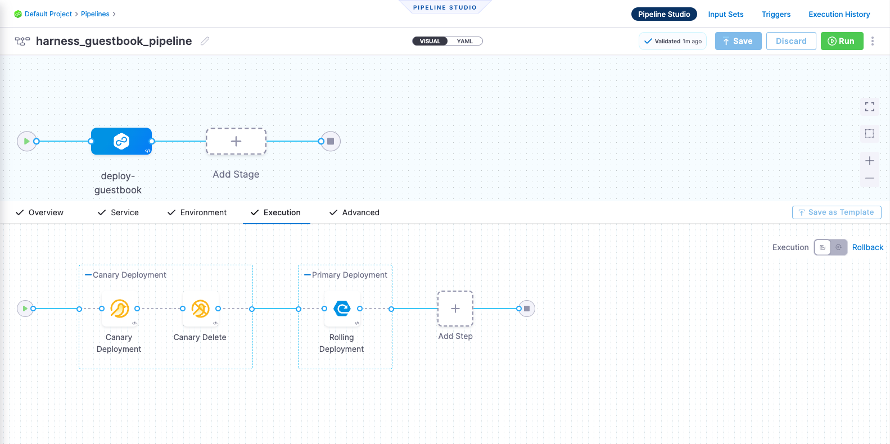
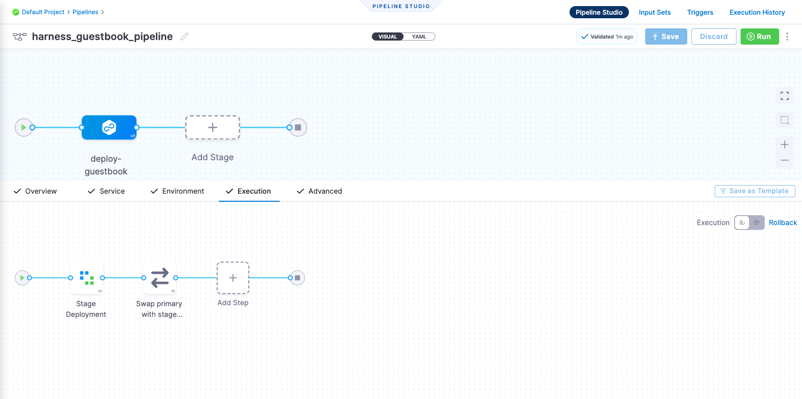
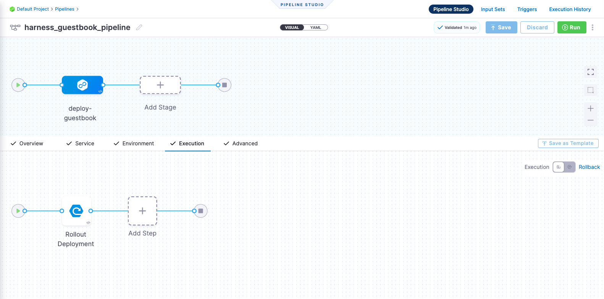

# Deploy a Kubernetes Manifest Template

```mdx-code-block
import Tabs from '@theme/Tabs';
import TabItem from '@theme/TabItem';
```

This tutorial is designed to help you get started with Harness Continuous Delivery (CD). We will guide you through creating a CD Pipeline/GitOps for deploying a Guestbook application. It's important to note that this Guestbook application is based on a Kubernetes Manifest.

:::info

[Sign up today to unleash the potential of intelligent Harness CD](https://app.harness.io/auth/#/signup/?module=cd)

:::

```mdx-code-block
<Tabs>
<TabItem value="CD Pipeline">
```

## Before you begin

Verify the following:

1. **Obtain GitHub personal access token with repo permissions**. See the GitHub documentation on [creating a personal access token](https://help.github.com/en/github/authenticating-to-github/creating-a-personal-access-token-for-the-command-line).
2. **A Kubernetes cluster**. Use your own Kubernetes cluster or we recommend using [K3D](https://k3d.io/v5.5.1/), for installing Harness Delegates and deploying a sample application in a local development environment.
    - Check [Delegate System and network requirements](https://developer.harness.io/docs/platform/Delegates/delegate-concepts/delegate-requirements).
3. **Install [Helm CLI](https://helm.sh/docs/intro/install/)**.
4. **Fork the [harnessed-example-apps](https://github.com/harness-community/harnesscd-example-apps/fork)** repository through the GitHub web interface.
    - More details on Forking a GitHub repository [here](https://docs.github.com/en/get-started/quickstart/fork-a-repo#forking-a-repository)

## Getting Started with Harness CD
----------------------------------

1. Log in to the [Harness App](https://app.harness.io/)

2. Click on **Projects** in the top left corner and choose **Default Project**

:::caution

Going forward, follow all the steps as they are, including the naming conventions, for the pipeline to run successfully.

:::

### Delegate

The Harness Delegate is a service that runs in your local network or VPC to establish connections between Harness Manager and various providers such as artifacts, infrastructure, etc. It is installed in the target infrastructure, for example, a Kubernetes cluster, and performs operations including deployment and integration. Learn more about the Delegate in the [Delegate Overview](https://developer.harness.io/docs/platform/delegates/delegate-concepts/delegate-overview/).

3. Under **Project Setup**, click on **Delegates**
    - On the top right corner, click **Tokens**
        - Click **New Token**
        - Enter name: `delegate_token`
        - Click **Apply**
        - Now, copy the token value by clicking on the copy icon and store it somewhere.
        - Click **close**
    - Now, click **Delegates** in the top right corner
        - Click **Install Delegate**
        - For this tutorial, let's explore how to install the Delegate using Helm.
        - Add Harness helm chart repo to your local helm registry
        ```bash
        helm repo add harness-delegate https://app.harness.io/storage/harness-download/delegate-helm-chart/
        ```
        ```bash
        helm repo update harness-delegate
        ```
        -  In the command provided, ACCOUNT_ID and MANAGER_ENDPOINT are auto-populated values that you can obtain from the Delegate Installation wizard. 
            You simply need to replace **DELEGATE_TOKEN** in the command with the token that was copied earlier and proceed with installing the Delegate.
            ```bash
            helm upgrade -i helm-delegate --namespace harness-delegate-ng --create-namespace \
            harness-delegate/harness-delegate-ng \
             --set delegateName=helm-delegate \
             --set accountId=ACCOUNT_ID \
             --set managerEndpoint=MANAGER_ENDPOINT \
             --set delegateDockerImage=harness/delegate:23.03.78904 \
             --set replicas=1 --set upgrader.enabled=false \
             --set delegateToken=DELEGATE_TOKEN
            ```
    - Verify that the Delegate is installed successfully and can connect to the Harness Manager.
    - You can also follow the [Install Harness Delegate on Kubernetes or Docker](https://developer.harness.io/tutorials/platform/install-delegate/) tutorial to install Delegate using _Terraform Helm Provider_ or _Kubernetes Manifest_.


### Secrets

Harness offers built-in Secret Management for encrypted storage of sensitive information. Secrets are decrypted when needed, and only the private network-connected Harness Delegate has access to the key management system. You can also integrate your own secret management solution. Learn more about Secrets in Harness [here](https://developer.harness.io/docs/platform/Secrets/Secrets-Management/harness-secret-manager-overview/).

4. Under **Project Setup**, click on **Secrets**
    - Click **New Secret** > **Text**
    - Enter the secret name: `harness_gitpat`
    - Secret Value: Paste the GitHub Personal Access Token to this field
    - Click **Save**

### Connectors

Connectors in Harness enable integration with 3rd party tools, providing authentication and operations during pipeline runtime. For instance, a GitHub connector facilitates authentication and fetching files from a GitHub repository within pipeline stages. Explore connector how-tos [here](https://developer.harness.io/docs/category/connectors).

5. Create **GitHub Connector**
    - Copy the contents of [1-github-connector.yml](https://github.com/harness-community/harnesscd-example-apps/blob/master/guestbook/harnesscd-pipeline/1-github-connector.yml)
    - In the Harness web console, under **Project Setup**, click **Connectors**.
    - Click **Create via YAML Builder** and paste the copied YAML contents.
    - Assuming you have already forked the [harnessed-example-apps](https://github.com/harness-community/harnesscd-example-apps/fork) repository as mentioned at the start, replace **GITHUB_USERNAME** with your GitHub account username in the YAML wherever required.
    - Click **Save Changes** and verify that the new connector named _**harness_gitconnector**_ is successfully created.
    - Finally, click **Test** under **CONNECTIVITY STATUS** to ensure the connection is successful.

6. Create **Kubernetes Connector**
    - Copy the contents of [2-kubernetes-connector.yml](https://github.com/harness-community/harnesscd-example-apps/blob/master/guestbook/harnesscd-pipeline/2-kubernetes-connector.yml)
    - In the Harness web console, under **Project Setup**, click **Connectors**.
    - Click **Create via YAML Builder** and and paste the copied YAML contents.
    - Now, replace **DELEGATE_NAME** with the installed Delegate name. To obtain the Delegate name, navigate to Default Project > Project Setup > Delegates. 
    - Click **Save Changes** and verify that the new connector named _**harness_k8sconnector**_ is successfully created.
    - Finally, click **Test** under **CONNECTIVITY STATUS** to verify the connection is successful.

### Environment

Environments determine the deployment location, categorized as prod or non-prod. Each environment includes infrastructure definitions for VMs, Kubernetes clusters, or target infrastructure. Learn more about environments [here](https://developer.harness.io/docs/continuous-delivery/x-platform-cd-features/environments/environment-overview/).

7. Under **Default Project** click on **Environments**
    - Click **New Environment** and toggle to **YAML** _(next to VISUAL)_.
    - Copy the contents of [3-environment.yml](https://github.com/harness-community/harnesscd-example-apps/blob/master/guestbook/harnesscd-pipeline/3-environment.yml) and paste it into the YAML editor and click **Save**
    - Now, go to the **Infrastructure Definitions** tab
    - Click on **Infrastructure Definition** and click **Edit YAML**.
    - Copy the contents of [4-infrastructure-definition.yml](https://github.com/harness-community/harnesscd-example-apps/blob/master/guestbook/harnesscd-pipeline/4-infrastructure-definition.yml) and paste it into the YAML editor.
    - Click **Save** and verify that the Environment and Infra definition is created successfully.

### Services

In Harness, services represent what you deploy and are managed within environments. Use Manage Services to configure variables, manifests, and artifacts. The Dashboard provides service statistics like deployment frequency and failure rate. Learn more about services [here](https://developer.harness.io/docs/continuous-delivery/x-platform-cd-features/services/services-overview/).

8. Under **Default Project** click on **Services**
    - Click **New Service**
    - Enter the name: `harnessguestbook`
    - click **Save** and toggle to **YAML** _(next to VISUAL)_ under **Configuration** tab.
    - Click **Edit YAML** and copy the contents of [5-service.yml](https://github.com/harness-community/harnesscd-example-apps/blob/master/guestbook/harnesscd-pipeline/5-service.yml) and paste it into the YAML editor.
    - Click **Save** and verify that the Service _**harness_guestbook**_ is successfully created.

### Pipeline

A pipeline is a comprehensive process encompassing integration, delivery, operations, testing, deployment, and monitoring. It can utilize CI for code building and testing, followed by CD for artifact deployment in production. Learn more about CD pipeline basics [here](https://developer.harness.io/docs/continuous-delivery/get-started/cd-pipeline-basics/).

9. Under **Default Project** click on **Pipelines**
    - Click **New Pipeline** and enter the below details
    - Enter the name: `harness_guestbook_pipeline`
    - Choose **Inline** and the Pipeline will be stored in Harness
    - Click **Start** and toggle to **YAML** _(next to VISUAL)_
    - Now, click on **Edit YAML** to enable edit mode, and choose any of the following execution strategies. Paste the respective YAML based on your selection.

```mdx-code-block
<Tabs>
<TabItem value="Canary">
```

**Canary Deployment** updates nodes in a single environment gradually, with each phase requiring verification before proceeding to the next. It allows incremental updates and ensures a controlled rollout process. See [When to use Canary deployments](https://developer.harness.io/docs/continuous-delivery/manage-deployments/deployment-concepts#when-to-use-canary-deployments)

- Copy the contents of [6-canary-deployment.yml](https://github.com/harness-community/harnesscd-example-apps/blob/master/guestbook/harnesscd-pipeline/6-canary-deployment.yml)
- Finally, click on **Save** in the top right corner to save the Pipeline.
- Alternatively, you can switch to the **VISUAL** version and confirm the pipeline stage and execution steps as shown below.



```mdx-code-block
</TabItem>
<TabItem value="Blue Green">
```

**Blue-Green Deployment** involves running two identical environments (stage and prod) simultaneously with different service versions. QA and UAT are performed on stage before flipping the traffic from prod to stage, allowing decommissioning of the old environment post-successful deployment. It is also referred to as red/black deployment by some vendors. See [When to use Blue Green deployments](https://developer.harness.io/docs/continuous-delivery/manage-deployments/deployment-concepts#when-to-use-blue-green-deployments)


- Copy the contents of [6-bluegreen-deployment.yml](https://github.com/harness-community/harnesscd-example-apps/blob/master/guestbook/harnesscd-pipeline/6-bluegreen-deployment.yml)
- Finally, click on **Save** in the top right corner to save the Pipeline.
- Alternatively, you can switch to the **VISUAL** version and confirm the pipeline stage and execution steps as shown below.



```mdx-code-block
</TabItem>
<TabItem value="Rolling">
```

**Rolling Deployment** incrementally adds nodes in a single environment with a new version, either one-by-one or in batches defined by a window size. It allows a controlled and gradual update process for the service/artifact. See [When to use rolling deployments](https://developer.harness.io/docs/continuous-delivery/manage-deployments/deployment-concepts#when-to-use-rolling-deployments).


- Copy the contents of [6-rolling-deployment.yml](https://github.com/harness-community/harnesscd-example-apps/blob/master/guestbook/harnesscd-pipeline/6-rolling-deployment.yml)
- Finally, click on **Save** in the top right corner to save the Pipeline.
- Alternatively, you can switch to the **VISUAL** version and confirm the pipeline stage and execution steps as shown below.



```mdx-code-block
</TabItem>
</Tabs>
```

10. Finally, it's time to execute the Pipeline. Click on **Run**, and then click **Run Pipeline** to initiate the deployment.
    - Observe the execution logs as Harness deploys the workload and checks for steady state.
    - After a successful execution, you can check the deployment on your Kubernetes cluster using the following command:
        ```bash
        kubectl get pods -n default
        ```
    - To access the Guestbook application deployed via the Harness Pipeline, port forward the service and access it at [http://localhost:8080](http://localhost:8080)
        ```bash
        kubectl port-forward svc/guestbook-ui 8080:80
        ```

### Congratulations!🎉
You've just learned how to use Harness CD to deploy application using Kubernetes Manifest.

#### What's Next?
- Keep learning about Harness CD. Add **Trigger** to your pipeline that'll respond to Git events by following this [doc](https://developer.harness.io/docs/platform/Triggers/triggering-pipelines).
- Visit the [Harness Developer Hub](https://developer.harness.io/) for more Tutorials and resources.

```mdx-code-block
</TabItem>
<TabItem value="GitOps Workflow">
```

:::info

Whether you're new to GitOps or already have an Argo CD instance, this guide will assist you in getting started with Harness GitOps, both with and without Argo CD.

Harness also offers a Hosted GitOps solution, and a tutorial for it will be available soon.

:::

## Before you begin

Verify the following:

1. **A Kubernetes cluster**. We recommend [K3D](https://k3d.io/v5.5.1/) for installing Harness GitOps Agent and deploying a sample application in a local development environment.
    - Check [Harness GitOps Agent Requirements](https://developer.harness.io/docs/continuous-delivery/gitops/install-a-harness-git-ops-agent/#requirements).
2. **Fork the [harnessed-example-apps](https://github.com/harness-community/harnesscd-example-apps/fork)** repository through the GitHub web interface.
    - More details on Forking a GitHub repository [here](https://docs.github.com/en/get-started/quickstart/fork-a-repo#forking-a-repository).

## Getting Started with Harness GitOps
--------------------------------------

1. Log in to the [Harness App](https://app.harness.io/).

2. Click on **Projects** in the top left corner, choose **Default Project**.

3. Click **Deployments**, under **Default Project** click on **GitOps**.

### GitOps Agent

A Harness GitOps Agent is a worker process that runs in your environment, makes secure, outbound connections to Harness SaaS, and performs all the GitOps tasks you request in Harness.

4. Click **Settings** in the top right corner and click **GitOps Agents**.
- Click **New GitOps Agent**
- Now, a propmts asking _Do you have any existing Argo CD instances?_, choose **Yes** if you already have a Argo CD Instance else choose **No** to install *Harness GitOps Agent*

```mdx-code-block
<Tabs>
<TabItem value="Harness GitOps Agent Fresh Install">
```

- Click **No**, and then click **Start**.
- In **Name**, enter the name for the new Agent.
- In **Namespace**, enter the namespace where you want to install the Harness GitOps Agent. Typically, this is the target namespace for your deployment.
    - For this tutorial, let's use `default` namespace to install the Agent and deploy Applications.
- Click **Continue**. The Review YAML settings appear.
- This is the manifest YAML for the Harness GitOps Agent. You will download this YAML file and run it in your Harness GitOps Agent cluster.
    ```yaml
    kubectl apply -f gitops-agent.yml -n default
    ```
- Click **Continue** and verify the Agent is successfully installed and can connect to Harness Manager.


```mdx-code-block
</TabItem>
<TabItem value="Harness GitOps Agent with Existing Argo CD Instance">
```

- Click **Yes**, and then click **Start**.
- In **Name**, enter the name for the existing Agent CD Project.
- In **Namespace**, enter the namespace where you want to install the Harness GitOps Agent. Typically, this is the target namespace for your deployment.
- Click **Next**. The Review YAML settings appear.
- This is the manifest YAML for the Harness GitOps Agent. You will download this YAML file and run it in your Harness GitOps Agent cluster.
    ```yaml
    kubectl apply -f gitops-agent.yml -n default
    ```
- Once you have installed the Agent, Harness will start importing all the entities from the existing Argo CD Project.

```mdx-code-block
</TabItem>
</Tabs>
```

### Repositories

A Harness GitOps Repository is a repo containing the declarative description of a desired state. The declarative description can be in Kubernetes manifests, Helm Chart, Kustomize manifests, etc.

5. Click **Settings** in the top right corner and click **Repositories**.
- Click **New Repository**
- Choose **Git**
    - Enter **Repository** name.
    - In the **GitOps Agent**, choose the Agent that you installed in your cluster and click **Apply**.
    - In **Git Repository URL**, paste [https://github.com/GITHUB_USERNAME/harnesscd-example-apps.git](https://github.com/GITHUB_USERNAME/harnesscd-example-apps.git) and replace **GITHUB_USERNAME** with your GitHub username.
    - Click **Continue** and choose **Specify Credentials For Repository**
        - Choose **HTTPS** as the **Connection Type**
        - Now, choose **Anonymous (no credentials required)** as the **Authentication** method.
        - Click **Save & Continue** and wait for the Harness to verify the conenction.
        - Finally, click **Finish**

### Clusters

A cluster is the target deployment cluster that is compared to the desire state. Clusters are synced with the source manifests you add as GitOps Repositories.

6. Click **Settings** in the top right corner and click **Clusters**.
- Click **New Cluster**
    - Enter the **Name**
    - In the **GitOps Agent**, choose the Agent that you installed in your cluster and click **Apply**.
    - Click **Continue** and choose **Use the credentials of a specific Harness GitOps Agent**
    - Click **Save & Continue** and wait for the Harness to verify the conenction.
    - Finally, click **Finish**

### Applications

GitOps Applications are how you manage GitOps operations for a given desired state and its live instantiation.

A GitOps Application collects the Repository (**what you want to deploy**), Cluster (**where you want to deploy**), and Agent (**how you want to deploy**). You define these entities and then select them when you set up your Application.

7. Click **Applications** in the top right corner.
- Click **New Application**
    - Enter the **Application Name**: `guestbook`
    - In the **GitOps Agent**, choose the Agent that you installed in your cluster and click **Apply**.
    - Then, click **New Service** and toggle to **YAML** _(next to VISUAL)_.
    - Click **Edit YAML**, paste the below and click **Save**
    ```yaml
    service:
      name: gitopsguestbook
      identifier: gitopsguestbook
      serviceDefinition:
        type: Kubernetes
        spec: {}
      gitOpsEnabled: true
    ```
    - Click **New Environment** and toggle to **YAML** _(next to VISUAL)_.
    - Click **Edit YAML**, paste the below and click **Save**
    ```yaml
    environment:
      name: gitopsenv
      identifier: gitopsenv
      description: ""
      tags: {}
      type: PreProduction
      orgIdentifier: default
      projectIdentifier: default_project
      variables: []
    ```
    - Finally, click **Continue** and keep the **Sync Policy** settings as is and click **Continue** again.
    - Now, in the **Repository URL**, choose the **Repository** you created earlier and click **Apply**.
    - Select **master** as the **target Revision** and type `guestbook` in the **Path** and hit **enter**
    - Click **Continue** to select the **Cluster** created in the above steps.
    - Enter the target **Namespace** for Harness GitOps to sync the application. Type `default` and click **Finish**

8. Finally, it's time to **Synchronize** the Apllication state. Click on **Sync** in the top right corner, check the Application details, and then click **Synchronize** to initiate the deployment.
    - After a successful execution, you can check the deployment on your Kubernetes cluster using the following command:
        ```bash
        kubectl get pods -n default
        ```
    - To access the Guestbook application deployed via the Harness Pipeline, port forward the service and access it at [http://localhost:8080](http://localhost:8080)
        ```bash
        kubectl port-forward svc/guestbook-ui 8080:80
        ```

On successful Application sync, you'll see the below status tree under **Resource View**.


### Congratulations!🎉
You've just learned how to use **Harness GitOps** to deploy application using Kubernetes Manifest.

#### What's Next?
- Keep learning about Harness GitOps. Create a GitOps ApplicationSet and PR Pipeline in Harness GitOps by following this [tutorial](https://developer.harness.io/docs/continuous-delivery/gitops/harness-git-ops-application-set-tutorial).
- Visit the [Harness Developer Hub](https://developer.harness.io/) for more Tutorials and resources.

```mdx-code-block
</TabItem>
</Tabs>
```

