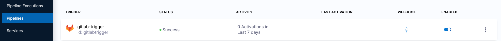

```mdx-code-block
import Tabs from '@theme/Tabs';
import TabItem from '@theme/TabItem';
```

# Trigger Pipeline

This tutorial will help you to get started with Triggers in Harness Pipelines.

## Why to use Triggers?

Triggers in a Harness Continuous Delivery (CD) pipeline are used to automatically initiate pipeline stages or actions based on specific events or conditions, such as Git events, new Helm Chart, new artifact, or specific time intervals. Triggers in Harness CD enable faster feedback cycles, enhanced efficiency, and decreased reliance on manual intervention during the deployment process.

```mdx-code-block
<Tabs>
<TabItem value="GitHub">
```

## Before You Begin

Verify the following:

- **Existing Harness CD Pipeline.** If you are a new user/haven't created a pipeline yet, then kindly check our [CD Tutorials](https://developer.harness.io/tutorials/cd-pipelines) to create one.
- **Existing GitHub Connector**.
    - If you are a new user/haven't created a Git Connector yet, **Fork the [harnesscd-example-apps](https://github.com/harness-community/harnesscd-example-apps/fork)** repository through the GitHub web interface, then kindly check [Git Connector](https://developer.harness.io/docs/platform/Connectors/Code-Repositories/connect-to-code-repo#connect-to-github) to create one and point the connector to the fork.

## Implement Trigger Using Git Events in Harness CD Pipeline
------------------------------------------------------------

1. Log into [Harness](https://app.harness.io/).

2. Select **Projects**, and then select **Default Project**.

:::caution

For the pipeline to run successfully, please follow all of the following steps as they are, including the naming conventions.

:::

3. In **Default Project**, select **Pipelines**.
    - Select an existing Pipeline or create a new Pipeline by following any of our CD Tutorials.

4. Once after choosing the pipeline, click on **Triggers**.
    - Select **New Trigger** and choose **GitHub** under _Webhook_.
    - Now, toggle to **YAML** to use the YAML editor.
    - Copy the contents of [github-trigger.yml](https://github.com/harness-community/harnesscd-example-apps/blob/master/harness-platform/triggers/github-trigger.yml) and paste it into the YAML editor.
    - In the YAML, replace **ORGANIZATION_ID**, **PROJECT_ID**, **PIPELINE_ID** and **GITHUB_CONNECTOR** with the Organization Identifier, Project Identifier, Pipeline Identifier and GitHub Connector Identifier respectively.
    - Finally, click **Create Trigger**.
    - You can also switch to the **Visual** editor and confirm the trigger steps.
    

5. Now, edit the README.md of the forked harnesscd-example-app repo and push the changes.

6. Finally, see the pipeline getting triggered and deploying the new changes.

```mdx-code-block
</TabItem>
<TabItem value="GitLab">
```

## Before You Begin

Verify the following:

- **Existing Harness CD Pipeline.** If you are a new user/haven't created a pipeline yet, then kindly check our [CD Tutorials](https://developer.harness.io/tutorials/cd-pipelines) to create one.
- **Existing GitLab Connector**.
    - If you are a new user/haven't created a GitLab Connector yet, then kindly check [GitLab Connector](https://developer.harness.io/docs/platform/connectors/code-repositories/connect-to-code-repo/#connect-to-gitlab) to create one and point the connector to the source repo.

## Implement Trigger Using GitLab Events in Harness CD Pipeline
------------------------------------------------------------

1. Log into [Harness](https://app.harness.io/).

2. Select **Projects**, and then select **Default Project**.

:::caution

For the pipeline to run successfully, please follow all of the following steps as they are, including the naming conventions.

:::

3. In **Default Project**, select **Pipelines**.
    - Select an existing Pipeline or create a new Pipeline by following any of our CD Tutorials.

4. Once after choosing the pipeline, click on **Triggers**.
    - Select **New Trigger** and choose **GitLab** under _Webhook_.
    - Now, toggle to **YAML** to use the YAML editor.
    - Copy the contents of [gitlab-trigger.yml](https://github.com/harness-community/harnesscd-example-apps/blob/master/harness-platform/triggers/gitlab-trigger.yml) and paste it into the YAML editor.
    - In the YAML, replace **ORGANIZATION_ID**, **PROJECT_ID**, **PIPELINE_ID** and **GITLAB_CONNECTOR** with the Organization Identifier, Project Identifier, Pipeline Identifier and GitLab Connector Identifier respectively.
    - Finally, click **Create Trigger**.
    - You can also switch to the **Visual** editor and confirm the trigger steps.
    

5. Now, edit the README.md of the repo hooked with the GitLab connector and push the changes.

6. Finally, see the pipeline getting triggered and deploying the new changes.

```mdx-code-block
</TabItem>
<TabItem value="Custom URL">
```

## Before You Begin

Verify the following:

- **Existing Harness CD Pipeline.** If you are a new user/haven't created a pipeline yet, then kindly check our [CD Tutorials](https://developer.harness.io/tutorials/cd-pipelines) to create one.

## Implement Trigger Using GitLab Events in Harness CD Pipeline
------------------------------------------------------------

1. Log into [Harness](https://app.harness.io/).

2. Select **Projects**, and then select **Default Project**.

:::caution

For the pipeline to run successfully, please follow all of the following steps as they are, including the naming conventions.

:::

3. In **Default Project**, select **Pipelines**.
    - Select an existing Pipeline or create a new Pipeline by following any of our CD Tutorials.

4. Once after choosing the pipeline, click on **Triggers**.
    - Select **New Trigger** and choose **Custom** under _Webhook_.
    - Now, toggle to **YAML** to use the YAML editor.
    - Copy the contents of [custom-trigger.yml](https://github.com/harness-community/harnesscd-example-apps/blob/master/harness-platform/triggers/custom-trigger.yml) and paste it into the YAML editor.
    - In the YAML, replace **ORGANIZATION_ID**, **PROJECT_ID**, and **PIPELINE_ID** with the Organization Identifier, Project Identifier, and Pipeline Identifier respectively.
    - Finally, click **Create Trigger**.
    - You can also switch to the **Visual** editor and confirm the trigger steps.
    

5. Now, On the **Triggers page**, in the **Webhook** column, select the link icon for your trigger and then select **Copy as cURL Command**. Example command would look like the below:
```bash
curl -X POST -H 'content-type: application/json' --url 'https://app.harness.io/gateway/pipeline/api/webhook/custom/v2?accountIdentifier=jkhbdfkhrebgkhjbekjrfhgbejkrg&orgIdentifier=Ansibler&projectIdentifier=trigger&pipelineIdentifier=hmcvhgm&triggerIdentifier=customtrigger' -d '{"sample_key": "sample_value"}'
```

6. Run the example command in a terminal to trigger a pipeline execution.

7. Finally, see the pipeline getting triggered and deploying the new changes.

```mdx-code-block
</TabItem>
</Tabs>
```

### Congratulations!🎉
You've just learned how to implement Triggers in Harness CD Pipeline.

#### What's Next?
- Keep learning about Harness CD.
- Visit the [Harness Developer Hub](https://developer.harness.io/) for more Tutorials and resources.
