# Build and Deploy a NodeJS App to Kubernetes

<ctabanner
  buttonText="Learn More"
  title="Continue your learning journey."
  tagline="Take a Continuous Delivery & GitOps Certification today!"
  link="/certifications/continuous-delivery"
  closable={true}
  target="_self"
/>

DevOps continues to grow in popularity among software development teams. It’s not surprising, given the benefits: a streamlined workflow leads to faster release frequency and deployment cycles, quicker bug detection, efficient rollback in case of any error, and a more productive team overall. DevOps engineers ensure that the processes and practices of code development, testing, and release are streamlined to reduce inefficiency, risk, and time to market. Coupled with continuous integration (CI) and continuous delivery (CD), DevOps helps IT organizations streamline their development process by automating manual tasks related to code deployment. Let’s explore how you can adopt CI/CD to improve your organization’s efficiency and delivery pipeline.

## Continuous integration
First, let’s take a look at what CI/CD is and what its benefits are. Although these two concepts are often discussed together, each has its own role in the software development process. 

Continuous integration is the process of automating the building and testing of code. It requires a SaaS build service, such as Harness Hosted Builds, or an on-premises build server responsible for taking code from a source control system (such as Git), compiling it, and testing it to ensure it’s error-free. This helps to keep software projects on track by ensuring that errors, mistakes, and bugs are spotted as soon as they occur. If a build is broken, it halts the rest of the process until it is fixed. As a result, the build process is much more streamlined.

## Continuous delivery and deployment
Continuous delivery automates the release process. It ensures that code is always in a releasable state. This process includes taking the code from the build system and routing it through a staging environment to ensure it’s suitable for release. The outcome is a fully automated deployment process, which can be controlled by the team or triggered by triggers outside the team (such as when a developer pushes or commits a code to the main branch). The key difference between CI and CD is that the former is focused on building code, while the latter focuses on releasing the final product.

The below diagram depicts the difference between continuous integration, continuous delivery, and continuous deployment.
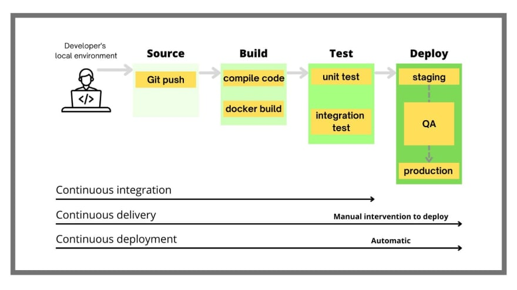

Continuous deployment is the final and most desired stage of the CI/CD process. It’s the point at which the team can deploy the code with zero-touch automation. This is the difference between continuous delivery and deployment. When the deployment of the code is done via manual intervention, it is delivery. However, if the code is deployed in an automated fashion without any manual intervention, it is called continuous deployment. 

## How to implement CI/CD in your organization
Before implementing CI/CD in your organization, you should know why you are implementing it, the goal, and which metric you would like to focus on. For example, DevOps teams usually focus on four key ([DORA](https://cloud.google.com/blog/products/devops-sre/using-the-four-keys-to-measure-your-devops-performance)) metrics: 
- Lead time for changes
- Change failure rate
- Deployment frequency
- Mean time to recovery
 
Your goal with CI/CD can also be as simple as moving away from traditional software delivery practices to cloud-native ones. This way, understanding the basics of DevOps concepts becomes very important. 

If you haven't already, you may need to adopt a version control system, implement a build system, and introduce staging environments. Once these basics are in place, you can begin the CI/CD process: 

1. First, you’ll start with CI. This process ensures the code is tested and is clean and ready to deploy. 
2. You can then move on to the CD part, where you’ll be able to deploy code to staging and have it ready for the team to review.
3. You can deploy the code to the production environment once everything is approved.

Next, you need to evaluate different CI/CD tools to understand which best suits your organization. Unfortunately, there are a plethora of tools that can be overwhelming to some of you. In this tutorial, we will use a prominent CI/CD tool, Harness, to explain how CI/CD works through a simple hello world application. A well-established CI/CD pipeline also makes it easier for your team to identify areas for improvement and take action to mitigate risks that may exist in your system. It also makes it easier to implement process changes as your team grows and changes over time.

### Harness CI/CD tutorial
We are focusing only on creating CI/CD pipelines with Harness in this tutorial. We are also a big fan of GitOps, and we have [GitOps-as-a-service](https://harness.io/blog/generally-available-harness-gitops-as-a-service) available at Harness to speed up your deployments. 

Software development teams that adopt a CI/CD pipeline see faster software deployments with more negligible risk and quicker bug identification and remediation. If you are new to CI/CD, it can seem like an overwhelming amount of new terms and processes to learn. But setting up a CI/CD pipeline is easier than you think. 

A CI/CD pipeline helps your team pinpoint where problems in your software are likely to occur – before they reach end users. Additionally, it allows you to release updates more frequently and spend less time testing individual components or modules before releasing them to users. Harness is a leader in CI/CD with impeccable features. Today, we will show you how to implement CI/CD in minutes with a simple setup. 
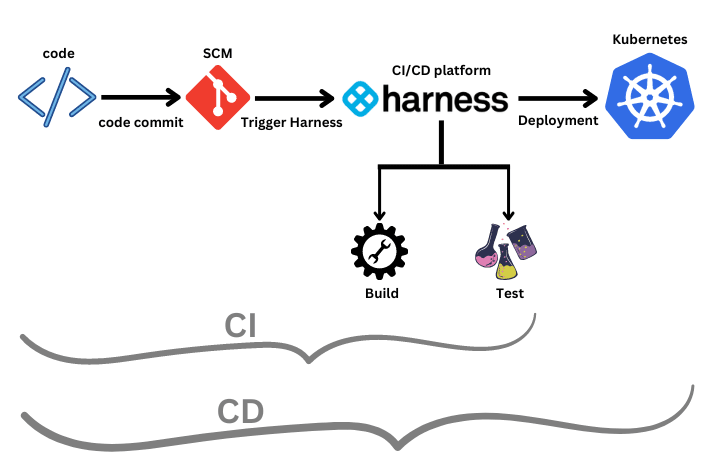

### Prerequisites
- Free [Harness](https://app.harness.io/auth/#/signup/?module=cd&?utm_source=website&utm_medium=harness-developer-hub&utm_campaign=cd-plg&utm_content=get-started) account to do CI/CD (on-premise)
- Kubernetes cluster access from any cloud provider to deploy our application (you can also use [Minikube](https://minikube.sigs.k8s.io/docs/start/) or [Kind](https://kind.sigs.k8s.io/docs/user/quick-start/) to create a single node cluster).
- Docker, preferably [Docker Desktop](https://www.docker.com/products/docker-desktop/).
- [Node.js](https://nodejs.org/en/download/)

First, we will create a simple “Hello World!” application in Node.js with a simple test case. I have already created this simple “Hello World!” application to make it easier and pushed it to GitHub. 

1. [Fork this](https://github.com/pavanbelagatti/harness-ci-example) repo to start working on it.

 The Dockerfile you see in the repo is used to build and push our application as an image to the Docker Hub. 

2. The next thing is to build the image and push it to the Docker Hub using the following command:

 `docker buildx build --platform=linux/arm64 --platform=linux/amd64  -t docker.io/<docker hub username>/<image name>:<tag> --push  -f ./Dockerfile .`

3. Once the build and push are successful, you can confirm it by going to your Docker Hub account.

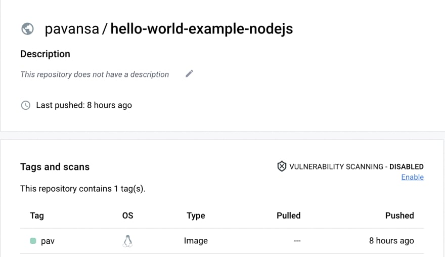

 You can see the `deployment.yaml` file in the forked repo, which defines the deployment yaml file to help us deploy the application to our Kubernetes      cluster. At this point, make sure your Kubernetes cluster is up and running.

 Once everything is set, it is time to set up a Harness account to do CI/CD. Create a free Harness account and your first project. Once you sign up at Harness, you are presented with the new CI/CD experience and capabilities.

4. Add the required connectors, GitHub repo, Docker Hub and secrets, if any. The Harness Delegate is a lightweight worker process that you need to install on the target cluster to connect your artifacts, infrastructure, collaboration, verification, and other providers with the Harness Manager. When you set up Harness for the first time, you install a Harness Delegate.

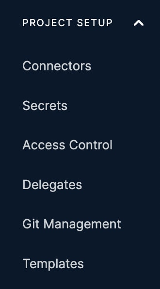

5. Select the Continuous Integration module, and then add the necessary stages and steps, as shown below.

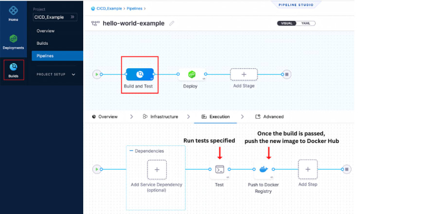

6. Set up the Test step as shown below.

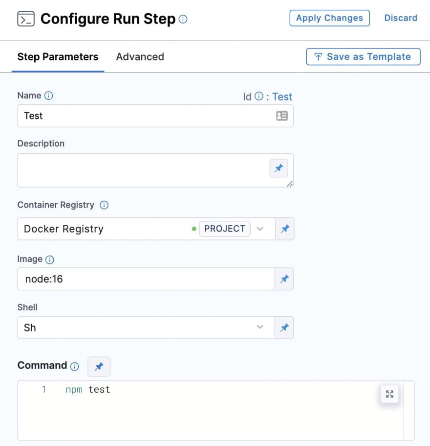

7. Set up the Push to Docker Registry step as shown below.

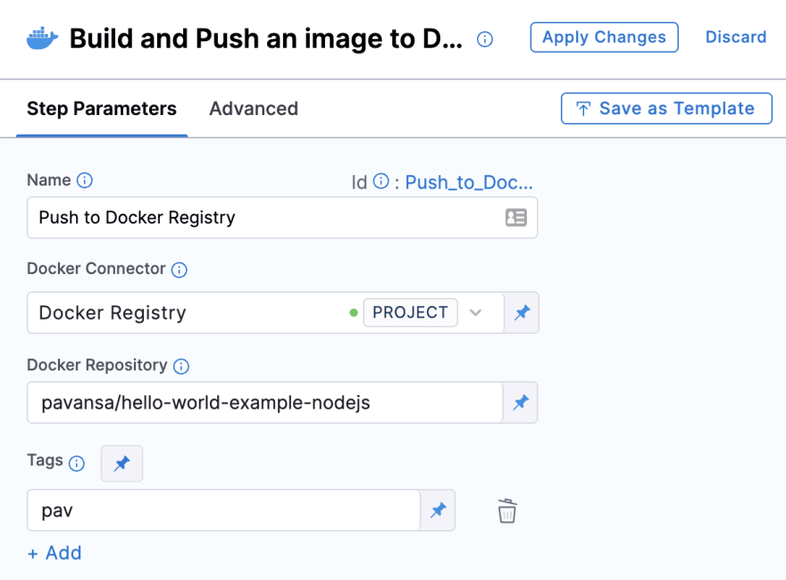

8. Next, set up a deployment pipeline.

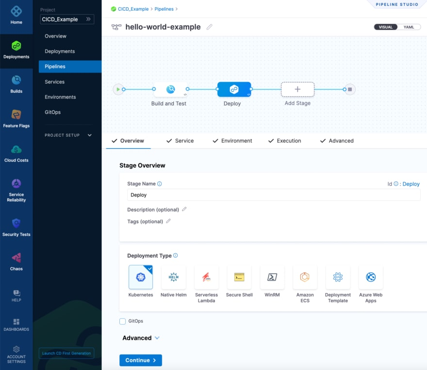

9. Add the required details on the **Service** tab.

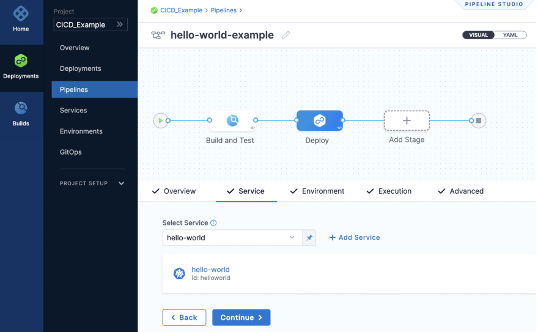

10. Define the environment type in the **Environment** tab.

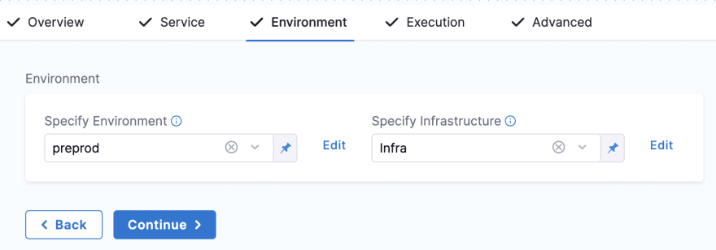

11. Strategize the execution by selecting the deployment you prefer.

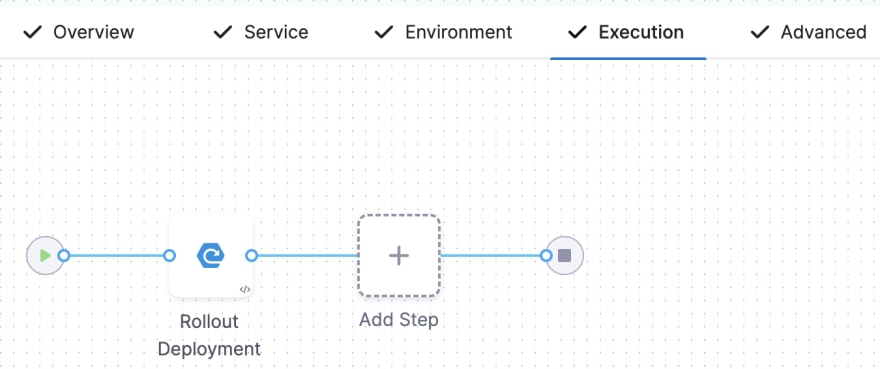

12. Save everything, and then run the pipeline.

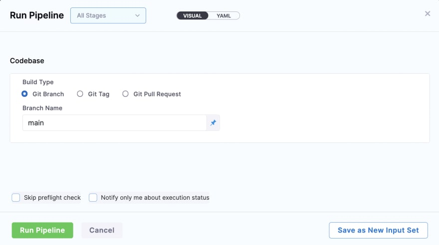

You can see both CI and CD being executed one by one with all the steps specified.

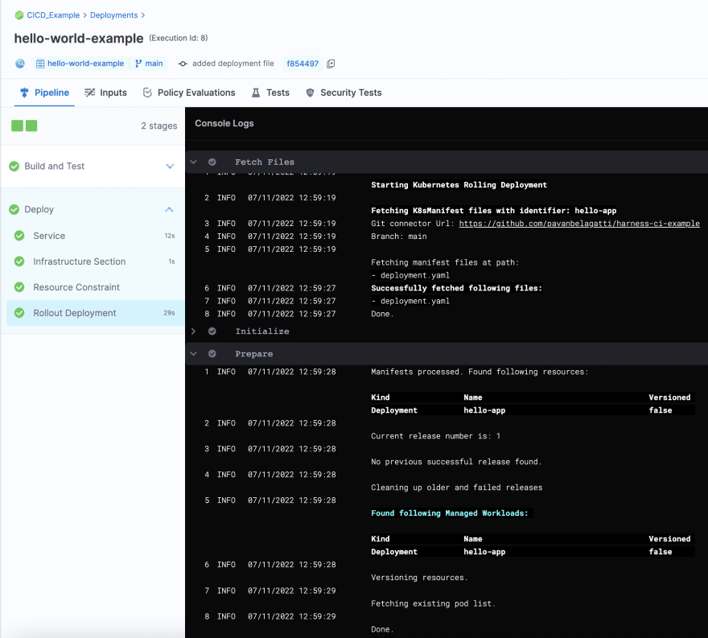

**Congratulations!** You successfully built and tested the application code and deployed it onto the Kubernetes cluster.

You can confirm this deployment by using the command `kubectl get pods`
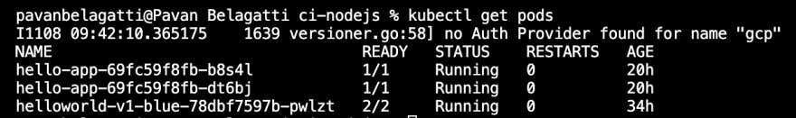

You can see two replicas running as per the specifications on the `deployment.yaml` file. Also, confirm the same by going to your Kubernetes dashboard. The following image shows two pods running on Google cloud (GCP).

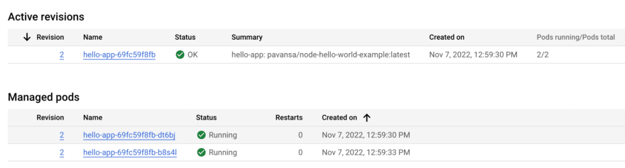

Harness platform makes it easy for developers to streamline their SDLC by leveraging the different modules available. Today we saw CI and CD modules, and Harness has a total of seven modules as of now.

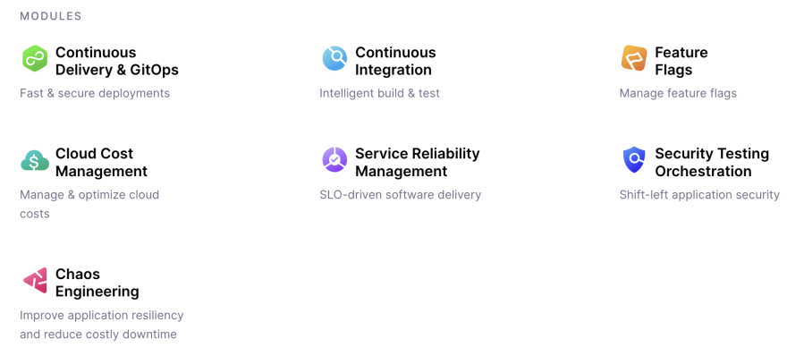

### CI/CD and DevOps

CI/CD is an essential part of any DevOps strategy. It helps to automate the code review and testing process, making it easier for teams to test and deploy software. It’s also a crucial part of creating a culture of continuous improvement. It is also important to remember that CI/CD is not a magic bullet. Laying the [DevOps culture](https://www.atlassian.com/team-playbook/examples/devops-culture) and methodologies are the initial steps. It is also important to remember that these processes and methodologies under DevOps are not static; they are ever-evolving and should be tweaked as needed to meet the team’s needs.

