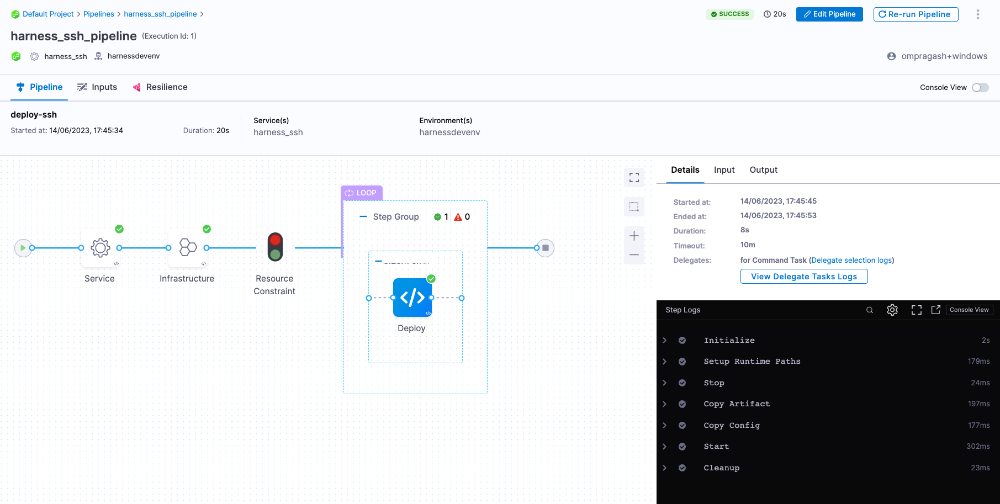
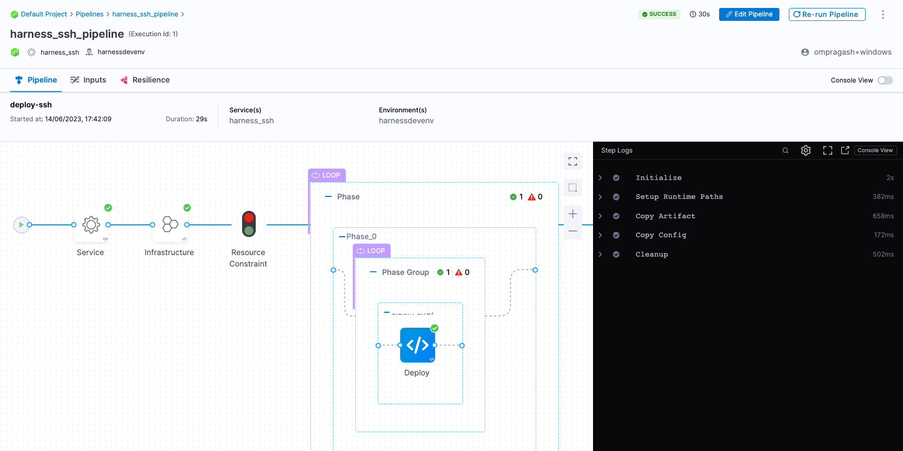
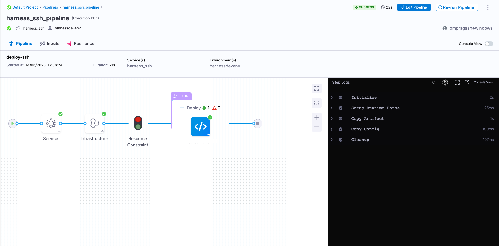
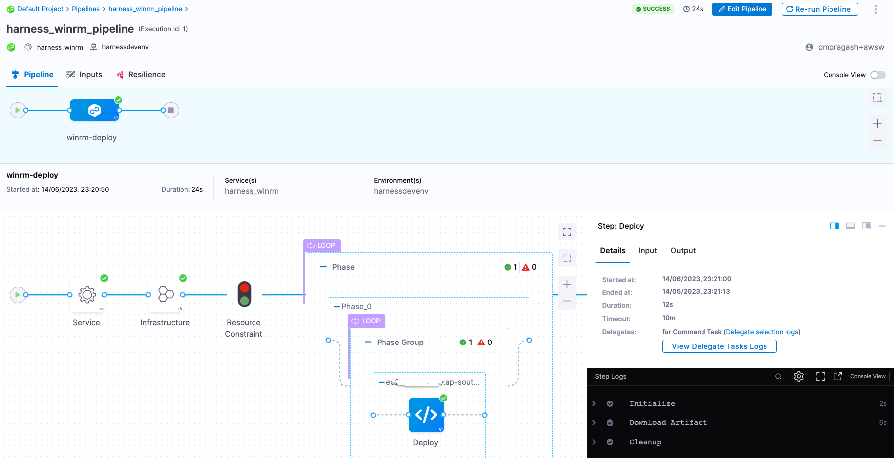
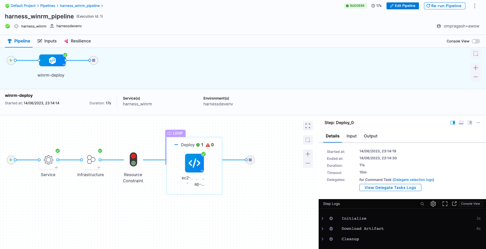

```mdx-code-block
import Tabs from '@theme/Tabs';
import TabItem from '@theme/TabItem';
```

This tutorial helps you get started with Harness Continuous Delivery (CD). We will guide you through creating a CD pipeline with deployment types **Secure Shell (SSH)** and **WinRM** to deploy applications to remote Linux and Windows servers.

:::info

[Sign up today to unleash the potential of intelligent Harness CD](https://app.harness.io/auth/#/signup/?module=cd&utm_source=website&utm_medium=harness-developer-hub&utm_campaign=cd-plg&utm_content=tutorials-cd-kubernetes-kustomize).

:::

```mdx-code-block
<Tabs>
<TabItem value="Secure Shell (SSH)">
```

## Before you begin

Verify the following:

1. **One or more Linux Instances on AWS**. Make sure port **22** is open on the security group.
2. **SSH private key (*.pem file) to authenticate with the remote instance(s).** To understand how SSH password-less authentication works, go to [Passwordless SSH using public-private key pairs](https://www.redhat.com/sysadmin/passwordless-ssh).
3. **[Docker](https://docs.docker.com/engine/install/)** to set up and start the Harness Docker delegate.
    - For more information, go to [Delegate system and network requirements](https://developer.harness.io/docs/platform/delegates/delegate-concepts/delegate-requirements).

## Getting started with Harness CD

1. Log into [Harness](https://app.harness.io/).
2. Select **Projects**, and then select **Default Project**.
   :::caution

   For the pipeline to run successfully, please follow all of the following steps as they are, including the naming conventions.

   :::

### Delegate

<details open>
<summary>What is the Harness delegate?</summary>

The Harness delegate is a service that runs in your local network or VPC to establish connections between the Harness Manager and various providers such as artifacts registries, cloud platforms, etc. The delegate is installed in the target infrastructure, for example, a Kubernetes cluster, and performs operations including deployment and integration. Learn more about the delegate in the [Delegate Overview](https://developer.harness.io/docs/platform/delegates/delegate-concepts/delegate-overview/).

</details>

1. In **Project Setup**, select **Delegates**.
    - Select **Delegates**.
        - Select **Install delegate**. For this tutorial, let's explore how to install the Docker Delegate.
        -  In the command provided, `ACCOUNT_ID`, `MANAGER_ENDPOINT` and `DELEGATE_TOKEN` are auto-populated values that you can obtain from the delegate installation wizard. 

            ```bash
            docker run --cpus=1 --memory=2g \
              -e DELEGATE_NAME=docker-delegate \
              -e NEXT_GEN="true" \
              -e DELEGATE_TYPE="DOCKER" \
              -e ACCOUNT_ID=ACCOUNT_ID \
              -e DELEGATE_TOKEN=DELEGATE_TOKEN \
              -e LOG_STREAMING_SERVICE_URL=https://app.harness.io/gratis/log-service/ \
              -e MANAGER_HOST_AND_PORT=MANAGER_ENDPOINT harness/delegate:23.05.79310
            ```
    - Verify that the delegate is installed successfully and can connect to the Harness Manager.

:::note

You can also follow the [Install Harness delegate on Kubernetes or Docker](https://developer.harness.io/tutorials/platform/install-delegate/) tutorial to install the Kubernetes Delegate using Helm, the Terraform Helm Provider, or a Kubernetes manifest.

:::

### Secrets

<details open>
<summary>What are Harness secrets?</summary>

Harness offers built-in secret management for encrypted storage of sensitive information. Secrets are decrypted when needed, and only the private network-connected Harness delegate has access to the key management system. You can also integrate your own secret manager. To learn more about secrets in Harness, go to [Harness Secret Manager Overview](https://developer.harness.io/docs/platform/Secrets/Secrets-Management/harness-secret-manager-overview/).

</details>

1. Create a secret of type **SSH Credential**. 
    - In **Project Setup**, select **Secrets**.
    - Select **New Secret**, and then select **SSH Credential**.
    - Enter the secret name `harness_sshprivatekey` and select **Continue**.
    - With **SSH Key** as the auth scheme, select **Username/SSH Key** as the authentication method.
    - In **Username**, enter the username for the user account on the remote server. For example, `ubuntu`.
    - Next, select **Create or Select a Secret** and select **New Secret File**.
    - Enter the secret name `ssh-private-key` and select **Browse** to upload the SSH private key to the Harness Secret Manager.
    - Select **Save** and, if needed, modify the SSH port number.
    - Finally, select **Save and Continue** and verify the connection to remote server is successful.
2. Create a secret to store the AWS secrete key.
    - In **Project Setup**, select **Secrets**.
    - , and then select **Text**.
    - Enter the secret name `harness_awssecretkey`.
    - For the secret value, paste in the AWS Secret Key.
    - Select **Save**.

### Connectors

<details open>
<summary>What are connectors?</summary>

Connectors in Harness enable integration with 3rd party tools, providing authentication and operations during pipeline runtime. For instance, a GitHub connector facilitates authentication and fetching files from a GitHub repository within pipeline stages. Explore connector how-tos [here](https://developer.harness.io/docs/category/connectors).

</details>

1. Create an **AWS connector**.
    - Copy the contents of [aws-connector.yml](https://github.com/harness-community/harnesscd-example-apps/blob/master/vm-aws/ssh/1-aws-connector.yml).
    - In Harness, in **Project Setup**, select **Connectors**.
    - Select **Create via YAML Builder** and paste the copied YAML.
    - In the YAML, replace **AWS_ACCESS_KEY_ID** with the AWS Access Key ID value.
    - Select **Save Changes** and verify that the new connector named **harness_awsconnector** is successfully created.
    - Finally, select **Test** under **Connectivity Status** to ensure the connection is successful.
2. Create a **Artifactory Connector**. For this tutorial, we'll use a publicly available ToDo List app artifact, todolist.war, available in a public Harness Artifactory repo.
    - Copy the contents of [artifactory-connector.yml](https://github.com/harness-community/harnesscd-example-apps/blob/master/vm-aws/ssh/2-artifactory-connector.yml).
    - In Harness, in **Project Setup**, select **Connectors**.
    - Select **Create via YAML Builder** and paste the copied YAML.
    - Select **Save Changes** and verify that the new connector named **harness_artifactrepo** is successfully created.
    - Finally, select **Test** under **Connectivity Status** to ensure the connection is successful.

### Environment

<details open>
<summary>What are Harness environments?</summary>

Environments define the deployment location, categorized as **Production** or **Pre-Production**. Each environment includes infrastructure definitions for VMs, Kubernetes clusters, or other target infrastructures. To learn more about environments, go to [Environments overview](https://developer.harness.io/docs/continuous-delivery/x-platform-cd-features/environments/environment-overview/).

</details>

1. In **Default Project**, select **Environments**.
    - Select **New Environment** and toggle to **YAML** to use the YAML editor.
    - Copy the contents of [environment.yml](https://github.com/harness-community/harnesscd-example-apps/blob/master/vm-aws/ssh/3-environment.yml) and paste it into the YAML editor and select **Save**.
    - In **Infrastructure Definitions**, select **Infrastructure Definition** and select **Edit YAML**.
    - Copy the contents of [infrastructure-definition.yml](https://github.com/harness-community/harnesscd-example-apps/blob/master/vm-aws/ssh/4-infrastructure-definition.yml) and paste it into the YAML editor.
    - In the Infra Definition YAML, replace **AWS_REGION** with the region where your instance is running and **INSTANCE_NAME** with the name of the instance.
    - Select **Save** and verify that the environment and infrastructure definition is created successfully.

### Services

<details open>
<summary>What are Harness services?</summary>

In Harness, services represent what you deploy to environments. You use services to configure variables, manifests, and artifacts. The **Services** dashboard provides service statistics like deployment frequency and failure rate. To learn more about services, go to [Services overview](https://developer.harness.io/docs/continuous-delivery/x-platform-cd-features/services/services-overview/).

</details>

1. In **Default Project**, select **Services**.
    - Select **New Service**.
    - Name the service `harness_ssh`.
    - Select **Save**, and then in the **Configuration** tab, toggle to **YAML** to use the YAML editor.
    - Select **Edit YAML** and copy the contents of [service.yml](https://github.com/harness-community/harnesscd-example-apps/blob/master/vm-aws/ssh/5-service.yml) and paste it into the YAML editor.
    - Select **Save** and verify that the service **harness_ssh** is successfully created.

### Pipeline

<details open>
<summary>What are Harness pipelines?</summary>

A pipeline is a comprehensive process encompassing integration, delivery, operations, testing, deployment, and monitoring. It can utilize CI for code building and testing, followed by CD for artifact deployment in production. A CD pipeline is a series of stages where each stage deploys a service to an environment. To learn more about CD pipeline basics, go to [CD pipeline basics](https://developer.harness.io/docs/continuous-delivery/get-started/cd-pipeline-basics/).

</details>

1. In **Default Project**, select **Pipelines**.
    - Select **New Pipeline**.
    - Enter the name `harness_ssh_pipeline`.
    - Select **Inline** to store the pipeline in Harness.
    - Select **Start** and, in the Pipeline Studio, toggle to **YAML** to use the YAML editor.
    - Select **Edit YAML** to enable edit mode, and choose any of the following execution strategies. Paste the respective YAML based on your selection.

```mdx-code-block
<Tabs>
<TabItem value="Canary">
```

<details open>
<summary>What are Canary deployments?</summary>

A canary deployment updates nodes in a single environment gradually, allowing you to use gates between increments. Canary deployments allow incremental updates and ensure a controlled rollout process. For more information, go to [When to use Canary deployments](https://developer.harness.io/docs/continuous-delivery/manage-deployments/deployment-concepts#when-to-use-canary-deployments).

</details>

- Copy the contents of [pipeline-ssh-canary.yml](https://github.com/harness-community/harnesscd-example-apps/blob/master/vm-aws/ssh/6-pipeline-ssh-canary.yml) and paste it into the YAML editor.
- Select **Save**.
- You can switch to the **Visual** editor and confirm the pipeline, stage, and execution steps are as shown below.



```mdx-code-block
</TabItem>
<TabItem value="Rolling">
```

<details open>
<summary>What are Rolling deployments?</summary>

Rolling deployments incrementally add nodes in a single environment with a new service version, either one-by-one or in batches defined by a window size. Rolling deployments allow a controlled and gradual update process for the new service version. For more information, go to [When to use rolling deployments](https://developer.harness.io/docs/continuous-delivery/manage-deployments/deployment-concepts#when-to-use-rolling-deployments).

</details>

- Copy the contents of [pipeline-ssh-rolling.yml](https://github.com/harness-community/harnesscd-example-apps/blob/master/vm-aws/ssh/6-pipeline-ssh-rolling.yml) and paste it into the YAML editor.
- Select **Save**.
- You can switch to the **Visual** editor and confirm the pipeline, stage, and execution steps are as shown below.



```mdx-code-block
</TabItem>
<TabItem value="Basic">
```

<details open>
<summary>What are Basic deployments?</summary>

With basic deployments, all nodes (pods, instances, etc) within a single environment are updated at the same time with a single new service/artifact version. For more information, go to [When to use basic deployments](https://developer.harness.io/docs/continuous-delivery/manage-deployments/deployment-concepts/#when-to-use-basic-deployments).

</details>

- Copy the contents of [pipeline-ssh-basic.yml](https://github.com/harness-community/harnesscd-example-apps/blob/master/vm-aws/ssh/6-pipeline-ssh-basic.yml) and paste it into the YAML editor.
- Select **Save**.
- You can switch to the **Visual** editor and confirm the pipeline, stage, and execution steps are as shown below.



```mdx-code-block
</TabItem>
</Tabs>
```

1. Finally, it's time to execute the pipeline. Select **Run**, and then select **Run Pipeline** to initiate the deployment.
    - Observe the execution logs as Harness copies the artifact from its source to the remote server.
    - After a successful execution, you can check the artifact in your remote server using the following command:  
      
      ```bash
      ls -l ~/harness_ssh/harnessdevenv/todolist.war
      ```

```mdx-code-block
</TabItem>
<TabItem value="WinRM">
```
## Before you begin

Verify the following:

1. **One or more Windows instances on AWS**. Make sure port **5985** is open on the security group.
    - Review Microsoft docs on [how to install and configure WinRM](https://learn.microsoft.com/en-us/windows/win32/winrm/installation-and-configuration-for-windows-remote-management)
2. **[Docker](https://docs.docker.com/engine/install/)** to set up and start the Harness Docker Delegate.
    - For more information, go to [delegate System and network requirements](https://developer.harness.io/docs/platform/delegates/delegate-concepts/delegate-requirements).

## Getting started with Harness CD

1. Log into [Harness](https://app.harness.io/).
2. Select **Projects**, and then select **Default Project**.

    :::caution

    For the pipeline to run successfully, please follow all of the following steps as they are, including the naming conventions.

    :::

### Delegate

<details open>
<summary>What is the Harness delegate?</summary>

The Harness delegate is a service that runs in your local network or VPC to establish connections between the Harness Manager and various providers such as artifacts registries, cloud platforms, etc. The delegate is installed in the target infrastructure, for example, a Kubernetes cluster, and performs operations including deployment and integration. Learn more about the delegate in the [Delegate Overview](https://developer.harness.io/docs/platform/delegates/delegate-concepts/delegate-overview/).

</details>

1. In **Project Setup**, select **Delegates**.
    - Select **Delegates**.
        - Select **Install delegate**. For this tutorial, let's explore how to install the Docker Delegate.
        -  In the command provided, `ACCOUNT_ID`, `MANAGER_ENDPOINT` and `DELEGATE_TOKEN` are auto-populated values that you can obtain from the delegate Installation wizard. 

            ```bash
            docker run --cpus=1 --memory=2g \
              -e DELEGATE_NAME=docker-delegate \
              -e NEXT_GEN="true" \
              -e DELEGATE_TYPE="DOCKER" \
              -e ACCOUNT_ID=ACCOUNT_ID \
              -e DELEGATE_TOKEN=DELEGATE_TOKEN \
              -e LOG_STREAMING_SERVICE_URL=MANAGER_ENDPOINT/log-service/ \
              -e MANAGER_HOST_AND_PORT=MANAGER_ENDPOINT harness/delegate:23.05.79310
            ```
    - Verify that the delegate is installed successfully and can connect to the Harness Manager.

:::note

You can also follow the [Install Harness delegate on Kubernetes or Docker](https://developer.harness.io/tutorials/platform/install-delegate/) tutorial to install the Kubernetes Delegate using Helm, the Terraform Helm Provider, or a Kubernetes manifest.

:::

### Secrets

<details open>
<summary>What are Harness secrets?</summary>

Harness offers built-in secret management for encrypted storage of sensitive information. Secrets are decrypted when needed, and only the private network-connected Harness delegate has access to the key management system. You can also integrate your own secret manager. To learn more about secrets in Harness, go to [Harness Secret Manager Overview](https://developer.harness.io/docs/platform/Secrets/Secrets-Management/harness-secret-manager-overview/).

</details>

1. Create a Secret of type **WinRM Crendential**. 
    - In **Project Setup**, select **Secrets**.
    - Select **New Secret**, and then select **WinRM Credential**.
    - Enter the secret name `harness_winrmpwd` and select **Continue**.
    - With **NTLM** as the auth scheme, and enter the domain name. This is the Active Directory domain name where the user account in the credentials is registered.
    - In **Username**, enter the username for the user account on the remote server. For example, `Administrator`.
    - Next, select **Create or Select a Secret** and select **New Secret Text**.
    - Enter the secret name `winrm_passwd` and enter the user password in the **Secret Value** field and select **Save**.
    - Finally, select **Save and Continue** and verify the connection to the remote Windows server is successful.
2. Create a secret to store the AWS secrete key.
    - In **Project Setup**, select **Secrets**.
    - Select **New Secret**, and then select **Text**.
    - Enter the secret name `harness_awssecretkey`.
    - For the secret value, paste in the AWS Secret Key.
    - Select **Save**.

### Connectors

<details open>
<summary>What are connectors?</summary>

Connectors in Harness enable integration with 3rd party tools, providing authentication and operations during pipeline runtime. For instance, a GitHub connector facilitates authentication and fetching files from a GitHub repository within pipeline stages. Explore connector how-tos [here](https://developer.harness.io/docs/category/connectors).

</details>

1. Create a **AWS connector**.
    - Copy the contents of [aws-connector.yml](https://github.com/harness-community/harnesscd-example-apps/blob/master/vm-aws/winrm/1-aws-connector.yml).
    - In Harness, in **Project Setup**, select **Connectors**.
    - Select **Create via YAML Builder** and paste the copied YAML.
    - In the YAML, replace **AWS_ACCESS_KEY_ID** with the AWS Access Key ID value.
    - Select **Save Changes** and verify that the new connector named **harness_awsconnector** is successfully created.
    - Finally, select **Test** under **Connectivity Status** to ensure the connection is successful.
2. Create a **Artifactory Connector**. For this tutorial, we'll use a publicly available ToDo List app artifact, todolist.war, available in a public Harness Artifactory repo.
    - Copy the contents of [artifactory-connector.yml](https://github.com/harness-community/harnesscd-example-apps/blob/master/vm-aws/winrm/2-artifactory-connector.yml).
    - In Harness, in **Project Setup**, select **Connectors**.
    - Select **Create via YAML Builder** and paste in the copied YAML.
    - Select **Save Changes** and verify that the new connector named **harness_artifactrepo** is successfully created.
    - Finally, select **Test** under **Connectivity Status** to ensure the connection is successful.

### Environment

<details open>
<summary>What are Harness environments?</summary>

Environments define the deployment location, categorized as **Production** or **Pre-Production**. Each environment includes infrastructure definitions for VMs, Kubernetes clusters, or other target infrastructures. To learn more about environments, go to [Environments overview](https://developer.harness.io/docs/continuous-delivery/x-platform-cd-features/environments/environment-overview/).

</details>

1. In **Default Project**, select **Environments**.
    - Select **New Environment** and toggle to **YAML** to use the YAML editor.
    - Copy the contents of [environment.yml](https://github.com/harness-community/harnesscd-example-apps/blob/master/vm-aws/winrm/3-environment.yml) and paste it into the YAML editor and select **Save**.
    - In **Infrastructure Definitions**, select **Infrastructure Definition**, and the select **Edit YAML**.
    - Copy the contents of [infrastructure-definition.yml](https://github.com/harness-community/harnesscd-example-apps/blob/master/vm-aws/winrm/4-infrastructure-definition.yml) and paste it into the YAML editor.
    - In the Infra Definition YAML, replace **AWS_REGION** with the region where your instance is running and **INSTANCE_NAME** with the name of the instance.
    - Select **Save** and verify that the environment and infrastructure definition is created successfully.

### Services

<details open>
<summary>What are Harness services?</summary>

In Harness, services represent what you deploy to environments. You use services to configure variables, manifests, and artifacts. The **Services** dashboard provides service statistics like deployment frequency and failure rate. To learn more about services, go to [Services overview](https://developer.harness.io/docs/continuous-delivery/x-platform-cd-features/services/services-overview/).

</details>

1. In **Default Project**, select **Services**.
    - Select **New Service**.
    - Name the service `harness_winrm`.
    - Select **Save**, and then in the **Configuration** tab, toggle to **YAML** to use the YAML editor.
    - Select **Edit YAML** and copy the contents of [service.yml](https://github.com/harness-community/harnesscd-example-apps/blob/master/vm-aws/winrm/5-service.yml) and paste it into the YAML editor.
    - Select **Save** and verify that the Service **harness_ssh** is successfully created.

### Pipeline

<details open>
<summary>What are Harness pipelines?</summary>

A pipeline is a comprehensive process encompassing integration, delivery, operations, testing, deployment, and monitoring. It can utilize CI for code building and testing, followed by CD for artifact deployment in production. A CD Pipeline is a series of stages where each stage deploys a service to an environment. To learn more about CD pipeline basics, go to [CD pipeline basics](https://developer.harness.io/docs/continuous-delivery/get-started/cd-pipeline-basics/).

</details>

1. In **Default Project**, select **Pipelines**.
    - Select **New Pipeline**.
    - Enter the name `harness_winrm_pipeline`.
    - Select **Inline** to store the pipeline in Harness.
    - Select **Start** and, in the Pipeline Studio, toggle to **YAML** to use the YAML editor.
    - Select **Edit YAML** to enable edit mode, and choose any of the following execution strategies. Paste the respective YAML based on your selection.

```mdx-code-block
<Tabs>
<TabItem value="Canary">
```

<details open>
<summary>What are Canary deployments?</summary>

A canary deployment updates nodes in a single environment gradually, allowing you to use gates between increments. Canary deployments allow incremental updates and ensure a controlled rollout process. For more information, go to [When to use Canary deployments](https://developer.harness.io/docs/continuous-delivery/manage-deployments/deployment-concepts#when-to-use-canary-deployments).

</details>

- Copy the contents of [pipeline-canary.yml](https://github.com/harness-community/harnesscd-example-apps/blob/master/vm-aws/winrm/6-pipeline-canary.yml) and paste it into the YAML editor.
- Select **Save**.
- You can switch to the **Visual** editor and confirm the pipeline, stage, and execution steps are as shown below.


```mdx-code-block
</TabItem>
<TabItem value="Rolling">
```

<details open>
<summary>What are Rolling deployments?</summary>

Rolling deployments incrementally add nodes in a single environment with a new service version, either one-by-one or in batches defined by a window size. Rolling deployments allow a controlled and gradual update process for the new service version. For more information, go to [When to use rolling deployments](https://developer.harness.io/docs/continuous-delivery/manage-deployments/deployment-concepts#when-to-use-rolling-deployments).

</details>

- Copy the contents of [pipeline-rolling.yml](https://github.com/harness-community/harnesscd-example-apps/blob/master/vm-aws/winrm/6-pipeline-rolling.yml) and paste it into the YAML editor.
- Select **Save**.
- You can switch to the **Visual** editor and confirm the pipeline, stage, and execution steps are as shown below.



```mdx-code-block
</TabItem>
<TabItem value="Basic">
```

<details open>
<summary>What are Basic deployments?</summary>

With basic deployments, all nodes (pods, instances, etc) within a single environment are updated at the same time with a single new service/artifact version. For more information, go to [When to use basic deployments](https://developer.harness.io/docs/continuous-delivery/manage-deployments/deployment-concepts/#when-to-use-basic-deployments).

</details>

- Copy the contents of [pipeline-basic.yml](https://github.com/harness-community/harnesscd-example-apps/blob/master/vm-aws/winrm/6-pipeline-basic.yml) and paste it into the YAML editor.
- Select **Save**.
- You can switch to the **Visual** editor and confirm the pipeline, stage, and execution steps are as shown below.



```mdx-code-block
</TabItem>
</Tabs>
```

1. Finally, it's time to execute the pipeline. Select **Run**, and then select **Run Pipeline** to initiate the deployment.
    - Observe the execution logs as Harness copy the artifact from source to the remote server.
    - After a successful execution, you can check the artifact in your remote server using the following command:  
    
      ```bash
      Get-ChildItem harness_winrm/harnessdevenv
      ```

```mdx-code-block
</TabItem>
</Tabs>
```

### Congratulations!🎉
You've just learned how to use Harness CD to copy an artifact to AWS instances.

#### What's Next?
- Keep learning about Harness CD. Add triggers to your pipeline that'll respond to Git events by following this [guide](https://developer.harness.io/docs/platform/Triggers/triggering-pipelines).
- Visit the [Harness Developer Hub](https://developer.harness.io/) for more tutorials and resources.