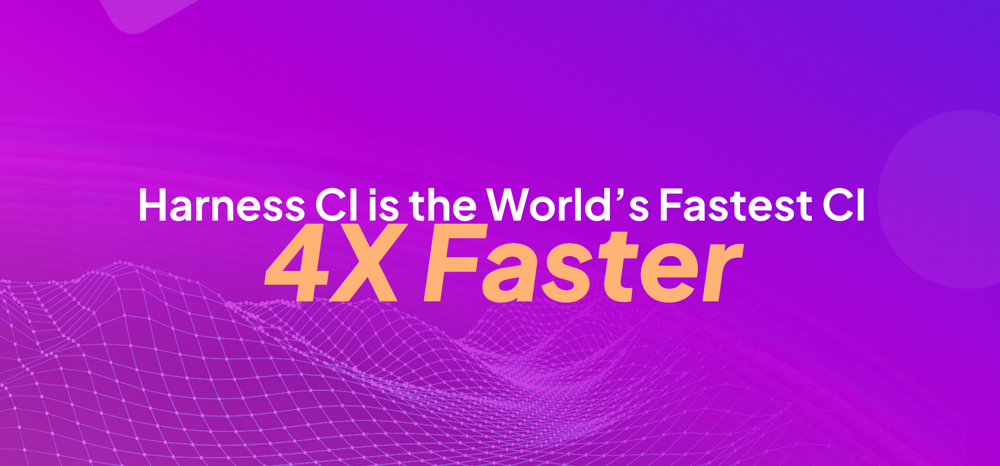
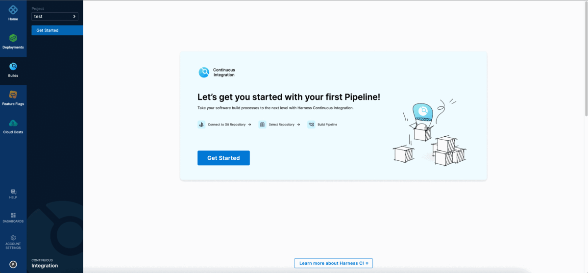
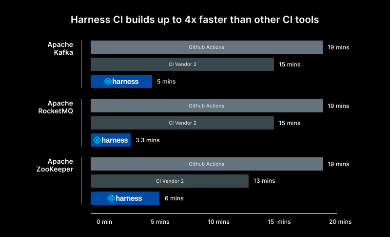
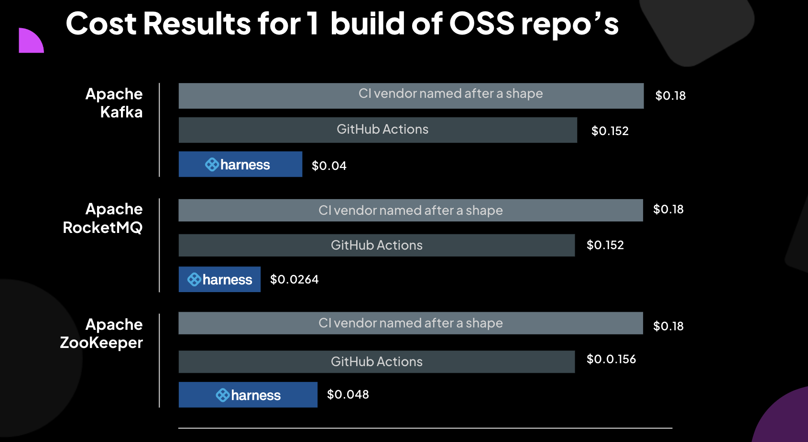

# Get started for free with the fastest CI on the planet

<ctabanner
  buttonText="Sign Up"
  title="THE WORLD'S FASTEST CI."
  tagline="Sign up today to get started for free!"
  link="https://app.harness.io/auth/#/signup/?module=ci&utm_source=HDH&utm_medium=&utm_campaign=Fastest-CI-HDH-Article&utm_term=sign-up&utm_content=CI-HDH-Top-Nav"
  closable={true}
  target="_blank"
/>

:::info

[Sign up for free to try the world's fastest CI](https://app.harness.io/auth/#/signup/?module=ci&utm_source=HDH&utm_medium=&utm_campaign=Fastest-CI-HDH-Article&utm_term=sign-up&utm_content=CI-HDH-Top-Banner)

:::

## Harness CI

Harness CI is a modern Continuous Integration platform that empowers busy teams to automate their build, test, and release workflows using a powerful, cloud-native pipeline engine.



Developers are frustrated with the time it takes to ship code and often end up wasting their precious time waiting for the builds to complete.


With Harness CI, you can build faster and be more productive. Harness CI's pricing is competitive to other leading CI providers, which gives you more cost savings with the speed benefit.
Harness CI is built on Drone, and over the last 10 years we have been focusing on solving the developer's frustration with the time it took to ship code with existing CI tools. Harness CI's vision is to create a CI tool that is fast, simple, open, and secure.

### Build pipelines 4 times faster than GitHub Actions

Harness CI is 4 times faster due to optimized defaults with hosted builds so you don't have to set up and manage infrastructure or optimize caching and other technologies to improve build times. Cache Intelligence dramatically reduces pipeline execution time by automatically caching well-known directories for Java, Node package managers, and more. Test Intelligence
can improve build cycles by up to 90% with machine learning (ML) that runs only the necessary tests relevant to code changes. Once tests are identified, speed up test cycles even more by splitting and running tests concurrently.

In this demo, Harness goes head-to-head with GitHub Actions. You can follow [these instructions](https://github.com/harness-community/kafka/blob/trunk/.harness/README.md) to reproduce the results and see for yourself.

<!-- Video:
https://harness-1.wistia.com/medias/rpv5vwzpxz-->
<docvideo src="https://www.youtube.com/watch?v=ECF1BDlzb-I" />

### Get started in 5 easy steps

Developer productivity is a core pillar for Harness. We didn't want to build a CI tool that was fast and complex to use. You can get started quickly with any language in Harness CI, with out-of-the-box starter templates and code-first development. You can connect to any Source Code Management (SCM) system, build any apps for any language or platform, and host it anywhere.



### Create and share open source plugins

Harness uses containers to drop pre‑configured steps into your pipeline. Choose from thousands of existing plugins, or create your own and run it on a container or the host virtual machine.

## Create a pipeline for your favorite language

Build, test, and deploy applications in Node.js, Python, Java, Ruby, PHP, Go, Rust, .NET, and more. Use VMs or containers for Linux, Windows, and Mac operating systems.

```mdx-code-block
import Tabs from '@theme/Tabs';
import TabItem from '@theme/TabItem';
```

```mdx-code-block
<Tabs>
<TabItem value="Go" label="Go" default>
```

1. [Signup](https://app.harness.io/auth/#/signup/?module=ci&utm_source=HDH&utm_medium=&utm_campaign=Fastest-CI-HDH-Article&utm_term=sign-up&utm_content=CI-HDH-Article) for a free account
2. Follow the **Get Started** wizard in Harness CI.
3. Fork the repository [https://github.com/rustd/gosample](https://github.com/rustd/gosample) into your GitHub account.
4. In the **Which code repository do you use** step, select GitHub and then select either the **OAuth** or the **Access Token** as the authentication method that Harness CI will use to connect to your GitHub account.
5. When you are prompted to select a repository, select the repository that you forked in the earlier step, and then select **Configure Pipeline**.
6. Select **Starter Pipeline**, and then select **Create Pipeline**.

```mdx-code-block
</TabItem>
<TabItem value="Java" label="Java">
```

1. [Signup](https://app.harness.io/auth/#/signup/?module=ci&utm_source=HDH&utm_medium=&utm_campaign=Fastest-CI-HDH-Article&utm_term=sign-up&utm_content=CI-HDH-Article) for a free account
2. Follow the **Get Started** wizard in Harness CI.
3. Fork the repository [https://github.com/rustd/jhttp](https://github.com/rustd/jhttp) into your GitHub account.
4. In the **Which code repository do you use** step, select GitHub and then select either the **OAuth** or the **Access Token** as the authentication method that Harness CI will use to connect to your GitHub account.
5. When you are prompted to select a repository, select the repository that you forked in the earlier step, and then select **Configure Pipeline**.
6. Select **Starter Pipeline**, and then select **Create Pipeline**.

```mdx-code-block
</TabItem>
<TabItem value="JavaScript" label="JavaScript">
```

1. [Signup](https://app.harness.io/auth/#/signup/?module=ci&utm_source=HDH&utm_medium=&utm_campaign=Fastest-CI-HDH-Article&utm_term=sign-up&utm_content=CI-HDH-Article) for a free account
2. Follow the **Get Started** wizard in Harness CI.
3. Fork the repository [https://github.com/rustd/reactcalculator](https://github.com/rustd/reactcalculator) into your GitHub account.
4. In the **Which code repository do you use** step, select GitHub and then select either the **OAuth** or the **Access Token** as the authentication method that Harness CI will use to connect to your GitHub account.
5. When you are prompted to select a repository, select the repository that you forked in the earlier step, and then select **Configure Pipeline**.
6. Select **Starter Pipeline**, and then select **Create Pipeline**.

```mdx-code-block
</TabItem>
<TabItem value=".NET" label=".NET">
```

1. [Signup](https://app.harness.io/auth/#/signup/?module=ci&utm_source=HDH&utm_medium=&utm_campaign=Fastest-CI-HDH-Article&utm_term=sign-up&utm_content=CI-HDH-Article) for a free account
2. Follow the **Get Started** wizard in Harness CI.
3. Fork the repository [https://github.com/rustd/hello-dotnet-core](https://github.com/rustd/hello-dotnet-core) into your GitHub account.
4. In the **Which code repository do you use** step, select GitHub and then select either the **OAuth** or the **Access Token** as the authentication method that Harness CI will use to connect to your GitHub account.
5. When you are prompted to select a repository, select the repository that you forked in the earlier step, and then select **Configure Pipeline**.
6. Select **Starter Pipeline**, and then select **Create Pipeline**.

```mdx-code-block
</TabItem>
<TabItem value="Python" label="Python">
```

1. [Signup](https://app.harness.io/auth/#/signup/?module=ci&utm_source=HDH&utm_medium=&utm_campaign=Fastest-CI-HDH-Article&utm_term=sign-up&utm_content=CI-HDH-Article) for a free account
2. Follow the **Get Started** wizard in Harness CI.
3. Fork the repository [https://github.com/rustd/python](https://github.com/rustd/python) into your GitHub account.
4. In the **Which code repository do you use** step, select GitHub and then select either the **OAuth** or the **Access Token** as the authentication method that Harness CI will use to connect to your GitHub account.
5. When you are prompted to select a repository, select the repository that you forked in the earlier step, and then select **Configure Pipeline**.
6. Select **Starter Pipeline**, and then select **Create Pipeline**.

```mdx-code-block
</TabItem>
</Tabs>
```

## Run your pipeline

1. In the **Pipeline Studio**, select **Run**.
2. In the **Build Type** field, select **Git Branch**, and then enter **master** or **main** in the **Branch Name** field, depending on the repo you forked.
3. Select **Run Pipeline**.
4. You can see the pipeline execute the steps in the Execution View.

## Build and test Apache Kafka 4 times faster on Harness CI

Congratulations on building your first pipeline. You can build even faster with Harness CI.
Learn how you can build and test Apache Kafka four times faster on Harness CI.
Read more about the performance data here [https://harness.io/blog/fastest-ci-tool](https://harness.io/blog/fastest-ci-tool) and follow the instructions of [this sample](https://github.com/harness-community/kafka/blob/trunk/.harness/README.md) to reproduce the results and see for yourself.



Harness CI gives you speed benefits at a much lower cost. We compared the cost of running a single build for Apache Kafka, RocketMQ and Zookeeper. GitHub Actions costs $0.008 per build minute, and CI Vendor 2 costs $0.0120 per build minute. Harness CI is competitively priced ($0.008 per build minute) relative to GitHub Actions and priced lower than CI Vendor 2. With the four times speed benefits, your builds will take less time and with the competitive pricing of $0.008 per build minute, your total cost could be 1/4th the cost of the other CI competitors. Learn more about our test methodology [here](https://harness.io/blog/fastest-ci-tool)



## Get started for free

[Sign up](https://app.harness.io/auth/#/signup/?module=ci&utm_source=HDH&utm_medium=&utm_campaign=Fastest-CI-HDH-Article&utm_term=sign-up&utm_content=CI-HDH-Get-Started-Free) for a free Harness CI account and run your pipelines faster on Harness CI.
