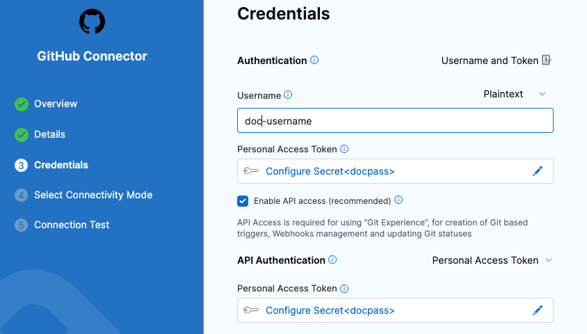
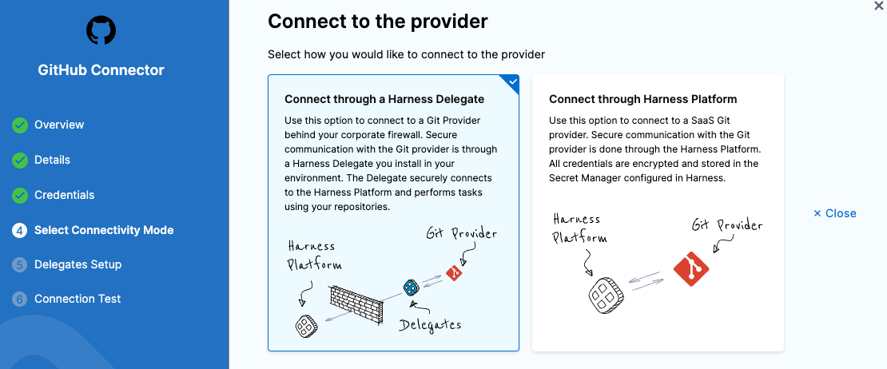
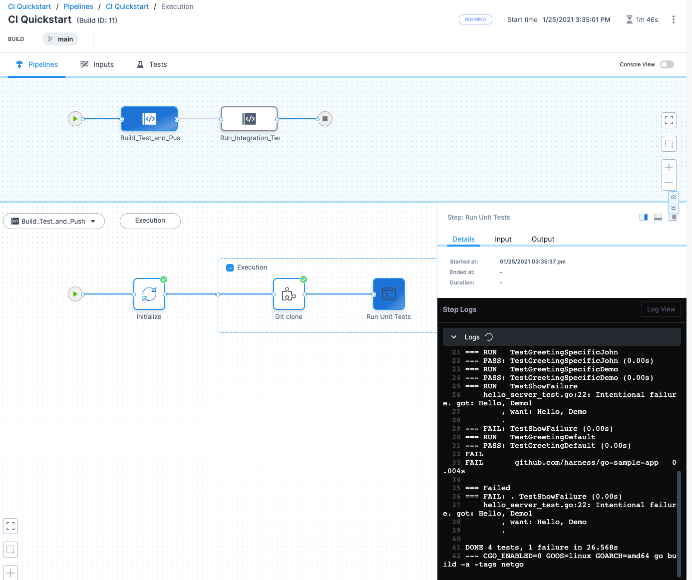

# Build and test on a Kubernetes cluster build infrastructure

<ctabanner
  buttonText="Learn More"
  title="Continue your learning journey."
  tagline="Take a Continuous Integration Certification today!"
  link="/certifications/continuous-integration"
  closable={true}
  target="_self"
/>

This tutorial shows you how to create a two-stage Harness CI pipeline that uses a Kubernetes cluster build infrastructure. The pipeline builds and runs a unit test on a codebase, uploads the artifact to Docker Hub, and then runs integration tests. This tutorial uses publicly-available code, images, and your Github and Docker Hub accounts.

You'll learn how to create a CI pipeline that does the following:

1. Clones the code repo for an app.
2. Uses a Kubernetes cluster build infrastructure.
3. Builds the app code and runs unit tests.
4. Packages the app as a Docker image, and uploads it to a Docker Hub repo.
5. Pulls the uploaded image into the build infrastructure as a dependency.
6. Runs an integration test against the app.

<details>
<summary>Architecture diagram</summary>

The following diagram shows the architecture of a kubernetes cluster build infrastructure. You interact with the Harness Platform through your browser. The Harness Delegate, which is installed in your Kubernetes cluster, manages communication between the Harness Platform and the Kubernetes pod where the pipeline's build farm is running. While the pipeline runs, the build farm communicates with your codebase, such as GitHub, and container registry, such as Docker Hub.


You must install the Harness Delegate in the same cluster you use for the build farm. The Delegate creates the namespace `harness-delegate`, and you use that namespace for both the Delegate and build farm. You can change the namespace name if you like.

</details>

<details>
<summary>Video summary</summary>

This video describes a pipeline similar to the one built in this tutorial. Note that this video uses the **Service Dependency** step, which is deprecated in favor of the **Background** step.

<!-- Video:
https://harness-1.wistia.com/medias/rpv5vwzpxz-->
<docvideo src="https://harness-1.wistia.com/medias/fsc2b05uxz" />


<!-- div class="hd--embed" data-provider="Wistia" data-thumbnail="">
   <iframe src="//fast.wistia.net/embed/iframe/fsc2b05uxz" allowtransparency="true" frameborder="0" scrolling="no" class="wistia_embed" name="wistia_embed" allowfullscreen="" mozallowfullscreen="" webkitallowfullscreen="" oallowfullscreen="" msallowfullscreen="" width="620" height="349"></iframe><script src="//fast.wistia.net/assets/external/E-v1.js" async=""></script>
</div -->

</details>

## Prerequisites

This tutorial assumes you have experience with Kubernetes, such as setting up service accounts and clusters.

In addition to a Harness account, you need the following accounts and tools:

* A **GitHub account** where you can fork the tutorial repo.
* A **Docker Hub account and repo** where the pipeline can push and pull app images.
* A **Kubernetes cluster** where you'll install the [Harness Delegate](/docs/platform/delegates/delegate-concepts/delegate-overview/) and run the build farm. The cluster needs the following minimum specifications:
  * Pods: 3 (two for the Delegate and one for the build farm)
  * Machine type: 4vCPU
  * Memory: 16GB RAM
  * Networking: Outbound HTTPS for the Harness and Docker Hub connections. Allow port 22 for SSH.
  * Namespace: During the tutorial, when you install the Harness Delegate, the `harness-delegate-ng` namespace is created. You'll use the same namespace for the build infrastructure.
* A **Kubernetes service account** with permission to create entities in the target namespace. The set of permissions should include `list`, `get`, `create`, and `delete` permissions. Usually, the `cluster-admin` permission or `namespace admin` permission is sufficient. For more information, go to the Kubernetes documentation on [User-Facing Roles](https://kubernetes.io/docs/reference/access-authn-authz/rbac/#user-facing-roles).

:::caution

Google Kubernetes Engine (GKE) [Autopilot](https://cloud.google.com/kubernetes-engine/docs/concepts/autopilot-overview) is not recommended. For more information, go to [Set up a Kubernetes cluster build infrastructure](/docs/continuous-integration/use-ci/set-up-build-infrastructure/k8s-build-infrastructure/set-up-a-kubernetes-cluster-build-infrastructure).

:::

```mdx-code-block
import CISignupTip from '/tutorials/shared/ci-signup-tip.md';
```

<CISignupTip />

## Prepare the codebase

1. Fork the tutorial repo [keen-software/goHelloWorldServer](https://github.com/keen-software/goHelloWorldServer) to your GitHub account. Alternately, you can use your own code repo. This tutorial works for any Git repo that you can access.
2. Create a GitHub personal access token with the `repo`, `admin:repo_hook`, and `user` scopes. For instructions, go to the GitHub documentation on [creating a personal access token](https://docs.github.com/en/authentication/keeping-your-account-and-data-secure/creating-a-personal-access-token). For information about the token's purpose in Harness, go to the **Authentication** section of the [GitHub connector settings reference](/docs/platform/Connectors/Code-Repositories/ref-source-repo-provider/git-hub-connector-settings-reference#authentication).
3. Make note of the token; you'll need it later in the tutorial.
4. In Harness, switch to the **Project** you want to use for this tutorial, or create a project.

<details>
<summary>Create a project</summary>

Use these steps to create a project in your Harness account.

1. Select **Projects**, select **All Projects**, and then select **New Project**.
2. Enter a **Name**, such as `CI kubernetes tutorial`.
3. Leave the **Organization** as **default**.
4. Select **Save and Continue**.
5. On **Invite Collaborators**, you can add others to your project, if desired. You don't need to add yourself.
6. Select **Save and Continue**.
7. On the Modules page, select **Continuous Integration**, and then select **Go to Module**.

If this is your first project with CI, the CI pipeline wizard starts after you select **Go to Module**. You'll need to exit the wizard to create the GitHub connector if you don't already have a GitHub connector for the account where you forked the tutorial repo.

</details>

### Create a GitHub connector

Next, you'll create a _connector_ that allows Harness to connect to your Git codebase, and you'll install a Harness Delegate in your Kubernetes cluster. A connector is a configurable object that connects to an external resource automatically while the pipeline runs. For more information, go to the [GitHub connector settings reference](/docs/platform/Connectors/Code-Repositories/ref-source-repo-provider/git-hub-connector-settings-reference).

1. Under **Project Setup**, select **Connectors**.
2. Select **New Connector**, and then select **GitHub** under **Code Repositories**.
3. Enter a recognizable name, such as `CI kubernetes tutorial connector`, and select **Continue**.
4. Configure the **Details** as follows, and then select **Continue**:

   * **URL Type:** Select **Repository**.
   * **Connection Type:** Select **HTTP**.
   * **GitHub Repository URL:** Enter the URL to your fork of the tutorial repo, such as `https://github.com/keen-software/goHelloWorldServer.git`.

   

5. Configure the **Credentials** as follows, and then select **Continue**:

   * **Username:** Enter the username for the GitHub account where you forked the tutorial repo.
   * **Personal Access Token:** Create a secret for the personal access token you created earlier. Harness secrets are safe; they're stored in the [Harness Secret Manager](/docs/platform/Secrets/Secrets-Management/harness-secret-manager-overview). You can also use your own Secret Manager with Harness.
   * **Enable API access:** Select this option and select the same personal access token secret.

   

6. For **Select Connectivity Mode**, select **Connect through a Harness Delegate**, and then select **Continue**.

   :::info

   You can choose to establish connections directly from your Harness platform or through a Delegate service running within your corporate firewall. The Harness Delegate is a local service that connects your infrastructure, collaboration, verification, and other providers with your Harness platform. For this tutorial, you'll install a Delegate in your Kubernetes cluster.

   :::

   

7. On **Delegates Setup**, select **Only use Delegates with all of the following tags**, and then select **Install new Delegate**.
8. Select **Kubernetes Manifest** and follow the instructions given on the **New Delegate** page to install the Delegate on a pod in your Kubernetes cluster.

   :::info

   You can use a Helm Chart, Terraform, or Kubernetes Manifest to install Kubernetes delegates. For this tutorial, select **Kubernetes Manifest**. For information about the other options and detailed instructions, go to [Delegate installation overview](/docs/platform/Delegates/install-delegates/overview).

   If delegate installation succeeds, the `kubectl apply` command should produce output similar to the following:

   ```
   namespace/harness-delegate-ng created  
   clusterrolebinding.rbac.authorization.k8s.io/harness-delegate-ng-cluster-admin created  
   secret/ci-quickstart created  
   statefulset.apps/ci-quickstart created  
   service/delegate-service created
   ```

   :::

9. In Harness, select **Verify** to test the connection. It might take a few minutes to verify the Delegate. Once it is verified, exit delegate creation and return to connector setup.
10. Back in the connector's **Delegates Setup**, select your new delegate, and then select **Save and Continue**.
11. Wait while Harness tests the connection, and then select **Finish**.

## Create a pipeline

Pipelines are comprised of one or more stages. Each stage has one or more steps that manage and automate builds, tests, deployments, and other important build and release tasks. To learn more about pipeline components, go to [CI pipeline components](/docs/continuous-integration/ci-quickstarts/ci-pipeline-basics).

1. Select **Pipelines**, and then select **Create a Pipeline**.
2. Enter a **Name** for the pipeline. Harness automatically creates a pipeline ID based on the name. Once the pipeline is created, you can't change the ID. You can use the ID to reference subordinate elements of a pipeline, such as the names of variables within the pipeline.
3. Select **Start**. You're taken to the Pipeline Studio where you can configure pipeline settings and add stages and steps to your pipeline.

### Add a Build stage

For most CI pipelines, Build stages do most of the heavy lifting. Build stages are where you specify the end-to-end workflow for your pipeline: the codebase to build, the build infrastructure to use, where to push the finished artifact, and any additional tasks (such as automated tests or validations).

1. In the Pipeline Studio, select **Add Stage** and select **Build**.
2. For the **Stage Name**, enter `Build Test and Push`.
3. For **Connector**, select the GitHub connector you created earlier in [Prepare the codebase](#prepare-the-codebase).

   

4. Select **Set Up Stage**. The Build stage is added to the pipeline.

### Define the build infrastructure

Next, you need to define the build infrastructure. Harness offers several [build infrastructure options](/docs/continuous-integration/use-ci/set-up-build-infrastructure/which-build-infrastructure-is-right-for-me), and this tutorial uses a [Kubernetes cluster build infrastructure](/docs/continuous-integration/use-ci/set-up-build-infrastructure/k8s-build-infrastructure/set-up-a-kubernetes-cluster-build-infrastructure).

1. Select the **Infrastructure** tab for your Build stage.
2. Under **Infrastructure**, select **Kubernetes**.
3. Under **Platform**, select the **Kubernetes Cluster** field to open the **Create or Select an Existing Connector** window.
4. Select **New Connector**, and configure the connector as follows. For detailed instructions and information about these settings, go to [Add a Kubernetes cluster connector](/docs/platform/Connectors/Cloud-providers/add-a-kubernetes-cluster-connector/).

   * **Name:** Enter `ci-delegate`
   * **Details:** Select **Use the credentials of a specific Harness Delegate**.
   * **Delegates Setup:** Select the Kubernetes Delegate you installed earlier in [Prepare the codebase](#prepare-the-codebase).
   * **Connection Test:** Wait for the test to finish and then click **Finish**.

5. In **Namespace**, enter `harness-delegate-ng`, and then select **Continue**.

## Build, test, and push an image

Now that the pipeline has a stage with a defined codebase and build infrastructure, you are ready to add steps to build the codebase, run unit tests, and push an artifact to Docker Hub. The first step will run unit tests and compile the codebase. The second step builds a container image and pushes it to a Docker Hub repo.

To run unit tests in a CI pipeline, you can use either a [Run step](/docs/continuous-integration/use-ci/run-ci-scripts/run-step-settings) or a [Run Tests step](/docs/continuous-integration/use-ci/set-up-test-intelligence/#add-the-run-tests-step). This tutorial uses a **Run** step. In addition to unit tests, the **Run** step can run any number of commands on a container image. **Run** steps are highly versatile and you'll use them often in your CI pipelines. While not used in this tutorial, with the **Run Tests** step, you can leverage [Test Intelligence](/docs/continuous-integration/use-ci/set-up-test-intelligence/).

1. On the **Execution** tab for your Build stage, select **Add Step**, select **Add Step** again, and then select the **Run** step from the Step Library.
2. For **Name**, enter `Run Unit Tests`.
3. Select the **Container Registry** field, select **New Connector**, and then select **Docker Registry**.
4. Create a Docker Registry connector to connect to your Docker Hub account.

   * **Name:** Enter a recognizable name for the connector.
   * **Provider Type:** Select **Docker Hub**.
   * **Docker Registry URL:** Enter `https://index.docker.io/v2/`.
   * **Username:** Enter the username for your Docker Hub account.
   * **Password:** Create a secret for a Personal Access Token that Harness can use to access your Docker Hub account.
   * **Select Connectivity Mode:** Select **Connect through a Harness Delegate**.
   * **Delegates Setup:** Select **Only use Delegates with all of the following tags**, and then select the Delegate you installed in your Kubernetes cluster.
   * Select **Save and Continue**, wait for the connectivity test to run, and then select **Finish**.

5. Back in the **Run** step settings, enter `golang:1.15` in the **Image** field.
6. Enter the following code in the **Command** field:

   ```
   go get gotest.tools/gotestsum
   gotestsum --format=standard-verbose --junitfile unit-tests.xml || true
   CGO_ENABLED=0 GOOS=linux GOARCH=amd64 go build -a -tags netgo
   ```

   The last line contains the `go build` command that compiles the package along with its dependencies.

   This **Run** step intentionally fails the tests so that you can see how Harness records test failures.

7. Under **Optional Configuration**, add a **Report Path** and enter `*.xml`.
8. Select **Apply Changes** to save the step.
9. Add a [Build and Push an Image to Docker Registry step](/docs/continuous-integration/use-ci/build-and-upload-artifacts/build-and-push-to-docker-hub-step-settings) to your Build stage, and configure it as follows:

   * **Name:** Enter a name, such as `Build and push image to Docker Registry`.
   * **Docker Connector:** Select the Docker Hub connector you created for the **Run** step.
   * **Docker Repository:** Enter your Docker Hub username and the destination repo name formatted as `[docker_username]/[repo_name]`. For example: `mydockerhub/ci_tutorial_repo`.
   * **Tags:** Add a tag and enter `<+pipeline.sequenceId>`.

10. Select **Apply Changes** to save the step, and then select **Save** to save the pipeline.

:::info

The tag `<+pipeline.sequenceId>` is a built-in Harness variable that represents the Build ID number, for example `9`. The pipeline uses the Build ID to tag the image that it pushes in the first stage and pulls in the second stage of this tutorial pipeline. You will see the Build ID when you run the pipeline. You will also use this variable to identify the image location when you set up the dependency (as a **Background** step) in the next stage.


:::

You can run the pipeline now if you like. Or continue the tutorial and add the integration tests before running the pipeline.

## Pull the image and run integration tests

The first stage in this pipeline builds, tests, containerizes, and then pushes an image to Docker Hub. Now, you'll add a stage that pulls the image, runs it in a container (using a **Background** step), and then run integration tests on it (using a **Run** step).

1. Select **Add Stage** (in the upper portion of the Pipeline Studio), and select **Build**.
2. Enter `Run integration test` for the **Name**, disable **Clone Codebase**, and then select **Set Up Stage**.

   

3. In the **Infrastructure** tab, select **Propagate from an existing stage**, and select the first **Build** stage in your pipeline. This configures the pipeline to use the same Kubernetes cluster and namespace for both stages.
4. Select **Continue**.
5. Add a **Background** step to this stage and configure it as follows. For more information, go to the [Background step settings reference](/docs/continuous-integration/use-ci/manage-dependencies/background-step-settings).

   * **Name:** Enter a recognizable name.
   * **Container Registry:** Select the Docker Hub connector you used for the steps in the previous stage.
   * **Image:** Enter `[docker_username]/[repo_name]:<+pipeline.sequenceId>`. Make sure the Docker Hub username and repo name are the same as you used for the **Build and Push an Image to Docker Registry** step. For example: `mydockerhub/ci_tutorial_repo:<+pipeline.sequenceId>`.

   :::info

   Notice that the **Image** field uses the same variable `<+pipeline.sequenceId>` that you used in the previous stage. This tells Harness to pull the image with the same tag as the image pushed previously in the pipeline.

   :::

6. Select **Apply Changes** to save the step.
7. Add a **Run** step to your `Run integration test` stage and configure it as follows:

   * **Name:** Enter a recognizable name, such as `Test server connection`.
   * **Container Registry:** Select the same Docker Connector as you have for the other steps.
   * **Image:** Enter `curlimages/curl:7.73.0`.
   * **Command:** Enter the following code, which runs a simple server connection test:

   ```
   sleep 10
   curl localhost:8080
   curl localhost:8080?Hello!_I_am_a_nice_demo!
   ```

12. Select **Apply Changes** to save the step, and then select **Save** to save the pipeline.

## Run the pipeline

1. Select **Run**.
2. For the **Pipeline Inputs**, select **Git branch** and enter the target branch in the code repo, such as `main`.
3. Select **Run Pipeline**.

On the [Build details page](/docs/continuous-integration/use-ci/viewing-builds) you can observe the pipeline while it runs. Select a stage to examine the steps in that stage. Select a step to view the step's logs. Select the **Tests** tab to [view test results](/docs/continuous-integration/use-ci/set-up-test-intelligence/viewing-tests).



You can switch to **Console view** for a focused view of the logs.


For this pipeline, note the following log details:

* In the logs for the **Build and push image to Docker Hub** step, you can see that the build number, such as `11`, is used as an image tag, for example:

   ```
   --destination=myrepo/ciquickstart:11
   ```

* In the **Initialize** step of the **Run Integration Test** stage, you can see the image with the same tag is pulled from your Docker Hub repo:

   ```
   Pulling image "myrepo/ciquickstart:11"
   Successfully pulled image "myrepo/ciquickstart:11" in 1.878887425s
   ```

* You can find the pushed image and the associated tag in your Docker Hub repo.

   

## Continue your Continuous Integration journey

Congratulations! You have created a CI pipeline that builds and tests your code.

With CI pipelines you can consistently execute your builds at any time. For example, you can try adding a commit trigger to the pipeline that listens for commits against the codebase and automatically kicks off the pipeline. All objects you create are available to reuse in your pipelines.

You can also save your build pipelines as part of your source code. Everything that you do in Harness is represented by YAML; you can store it all alongside your project files. For example, here is a YAML example of the pipeline created in this tutorial.

<details>
<summary>Pipeline YAML example</summary>

```yaml
pipeline:
  name: k8s tutorial example
  identifier: k8s_tutorial_example
  projectIdentifier: k8s_tutorial_project
  orgIdentifier: default
  tags: {}
  properties:
    ci:
      codebase:
        connectorRef: ghconnector
        build: <+input>
  stages:
    - stage:
        name: Build Test and Push
        identifier: Build_Test_and_Push
        description: ""
        type: CI
        spec:
          cloneCodebase: true
          infrastructure:
            type: KubernetesDirect
            spec:
              connectorRef: k8stutorial
              namespace: harness-delegate-ng
              automountServiceAccountToken: true
              nodeSelector: {}
              os: Linux
          execution:
            steps:
              - step:
                  type: Run
                  name: Run Unit Tests
                  identifier: Run_Unit_Tests
                  spec:
                    connectorRef: dockerhubconnector
                    image: golang:1.15
                    shell: Sh
                    command: |2-
                         go get gotest.tools/gotestsum
                         gotestsum --format=standard-verbose --junitfile unit-tests.xml || true
                         CGO_ENABLED=0 GOOS=linux GOARCH=amd64 go build -a -tags netgo
                    reports:
                      type: JUnit
                      spec:
                        paths:
                          - "*.xml"
              - step:
                  type: BuildAndPushDockerRegistry
                  name: BuildAndPushDockerRegistry_1
                  identifier: BuildAndPushDockerRegistry_1
                  spec:
                    connectorRef: dockerhubconnector
                    repo: mydockerhub/ci-tutorial-repo
                    tags:
                      - <+pipeline.sequenceId>
    - stage:
        name: n test
        identifier: n_test
        description: ""
        type: CI
        spec:
          cloneCodebase: false
          infrastructure:
            useFromStage: Build_Test_and_Push
          execution:
            steps:
              - step:
                  type: Background
                  name: Pull and host image
                  identifier: Pull_and_host_image
                  spec:
                    connectorRef: dockerhubconnector
                    image: mydockerhub/ci-tutorial-repo:<+pipeline.sequenceId>
                    shell: Sh
              - step:
                  type: Run
                  name: Test server connection
                  identifier: Test_server_connection
                  spec:
                    connectorRef: dockerhubconnector
                    image: curlimages/curl:7.73.0
                    shell: Sh
                    command: |-
                      sleep 10
                      curl localhost:8080
                      curl localhost:8080?Hello!_I_am_a_nice_demo!

```

</details>

After you build an artifact, you can use the Harness Continuous Delivery (CD) module to deploy your artifact. If you're ready to try CD, check out the [CD Tutorials](/tutorials/cd-pipelines#all-tutorials).
