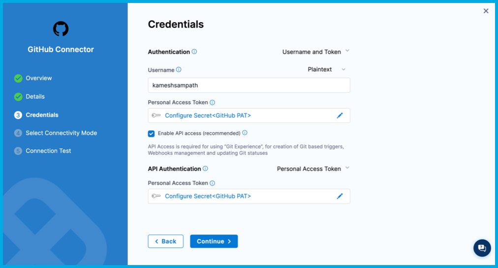
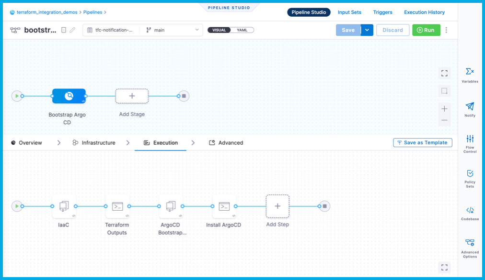
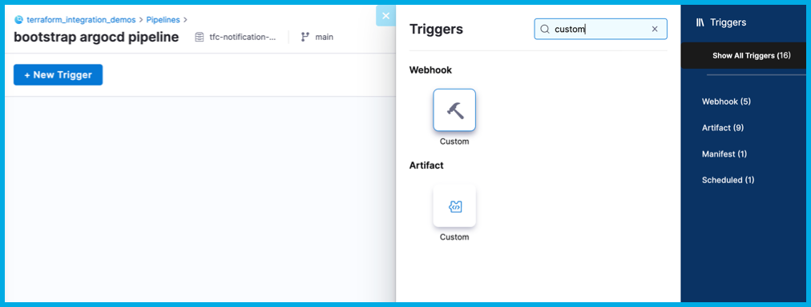
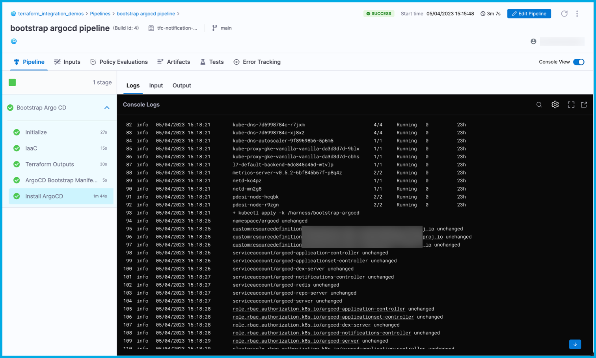

# Use Terraform Cloud notifications to trigger CI

<ctabanner
  buttonText="Learn More"
  title="Continue your learning journey."
  tagline="Take a Continuous Integration Certification today!"
  link="/certifications/continuous-integration"
  closable={true}
  target="_self"
/>

Continuous Integration (CI) pipelines deploy CI artifacts to a *target infrastructure*. Deployments handled by CI or Continuous Deployment (CD) pipelines. Modern day architecture uses automation tools, like [Terraform](https://terraform.io) or [Ansible](https://www.ansible.com/) to provision the target infrastructure. This type of provisioning is called [infrastructure-as-code (IaC)](https://en.wikipedia.org/wiki/Infrastructure_as_code).

Usually CI/CD and IaC don't run in tandem. Often, the CI pipeline is triggered only when the target infrastructure is ready to bootstrap with software components that are required by CI/CD pipelines.

This tutorial addresses the aforementioned problem with the following use case:

As CI/CD user, I want to provision a Kubernetes cluster on Google Cloud Platform (GKE) using Terraform. When the cluster is successfully provisioned, trigger a CI pipeline to start bootstrapping [ArgoCD](https://argo-cd.readthedocs.io/en/stable/) on to GKE.

<!--  -->

<docimage path={require('./static/ci-tfc-notif-trigger/tfc-trigger-arch.png')} />

## Prerequisites

In addition to a Harness account, you need the following accounts for this tutorial:

* A **GitHub account** where you can fork the tutorial repos.
* A [Terraform Cloud account](https://app.terraform.io/public/signup/account).
* A [Google Cloud account](https://cloud.google.com) where you can create a Google Kubernetes Engine (GKE) cluster.

```mdx-code-block
import CISignupTip from '/tutorials/shared/ci-signup-tip.md';
```

<CISignupTip />

## Clone code repositories

This tutorial uses the following Git repositories:

- IaC [vanilla-gke](https://github.com/harness-apps/vanilla-gke): The Terraform source repository that is used with Terraform Cloud to provision GKE.
- Kubernetes manifests [bootstrap-argocd](https://github.com/harness-apps/bootstrap-argocd): This repository holds Kubernetes manifests to bootstrap ArgoCD on to the GKE cluster.
- [tfc-notification-demo](https://github.com/harness-apps/tfc-notification-demo): Contains a sample pipeline for this tutorial.

Fork these repos, and then clone them to your local machine.

<details>
<summary>Fork and clone the tutorial repos</summary>

1. If you don't already have a Git command line tool on your machine, download the [GitHub CLI tool](https://cli.github.com/), and then add `gh` to your `$PATH`.
2. Create a directory for your tutorial repos, for example:

   ```shell
   mkdir -p "$HOME/tfc-notification-demo"
   cd "$HOME/tfc-notification-demo"
   export DEMO_HOME="$PWD"
   ```

3. Clone and fork the `vanilla-gke` repo, for example:

   ```shell
   gh repo clone harness-apps/vanilla-gke
   cd vanilla-gke
   gh repo fork
   export TFC_GKE_REPO="$PWD"
   ```

4. Clone and fork the `bootstrap-argocd` repo, for example:

   ```shell
   cd ..
   gh repo clone harness-apps/bootstrap-argocd
   cd bootstrap-argocd
   gh repo fork
   export ARGOCD_BOOTSTRAP_REPO="$PWD"
   ```

5. Clone and fork the `tfc-notification-demo` repo, for example:

   ```shell
   cd ..
   gh repo clone harness-apps/tfc-notification-demo
   cd tfc-notification-demo
   gh repo fork
   export TFC_NOTIFICATION_DEMO="$PWD"
   ```

</details>

Code samples in this tutorial will refer to these repos as follows:

* `vanilla-gke`: `$TFC_GKE_REPO`
* `bootstrap-argocd`: `$ARGOCD_BOOTSTRAP_REPO`
* `tfc-notification-demo`: `$TFC_NOTIFICATION_DEMO`

## Create a Harness project

In Harness, create a project named `terraform_integration_demos`, and then go to the **Continuous Integration** module.

<details>
<summary>Create a project</summary>

1. Select **Projects**, select **All Projects**, and then select **New Project**.
2. For **Name**, enter `terraform_integration_demos`.
3. Leave the **Organization** as **default**.
4. Select **Save and Continue**.
5. On **Invite Collaborators**, you can add others to your project, if desired. You don't need to add yourself.
6. Select **Save and Continue**.
7. On the Modules page, select **Continuous Integration**, and then select **Go to Module**.

If the CI pipeline wizard starts after you select **Go to Module**, you'll need to exit the wizard to complete the next step in this tutorial, creating the GitHub connector.

</details>

## Create a GitHub connector

Harness uses a *connector* to connect to your Git repositories.

1. In the GitHub account where you forked the tutorial repos, [create a GitHub personal access token](https://docs.github.com/en/authentication/keeping-your-account-and-data-secure/creating-a-personal-access-token) with the `repo`, `admin:repo_hook`, and `user` scopes.

   For information about the token's purpose in Harness, go to the **Authentication** section of the [GitHub connector settings reference](/docs/platform/Connectors/Code-Repositories/ref-source-repo-provider/git-hub-connector-settings-reference#authentication).

2. Save the token as a [Harness text secret](/docs/platform/Secrets/add-use-text-secrets/) named `GITHUB_PAT`.

3. In your Harness `terraform_integration_demos` project, under **Project Setup**, select **Connectors**, and create a new **GitHub** code repository connector.
4. Enter a **Name** and select **Continue**.
5. Configure the **Details** as follows, and then select **Continue**.

   * **URL Type:** Select **Account**.
   * **Connection Type:** Select **HTTP**.
   * **GitHub Account URL:** Enter the URL for the GitHub account where you forked the tutorial repos, such as `https://github.com/my-account`.
   * **Test Repository:** Enter the repo name for any repo in your GitHub account, such as `tfc-notification-demos`. This is only used to verify connectivity.

   <!--  -->

   <docimage path={require('./static/ci-tfc-notif-trigger/tfc-notif-trigger-1.png')} />

6. Configure the **Credentials** as follows, and then select **Continue**.

   * **Username:** Enter the username for the GitHub account where you forked the tutorial repos.
   * **Personal Access Token:** Select your `GITHUB_PAT` text secret.
   * **Enable API access:** Select this option and select the same personal access token secret.

   <!--  -->

   <docimage path={require('./static/ci-tfc-notif-trigger/tfc-notif-trigger-2.png')} />

7. For **Select Connectivity Mode**, select **Connect through the Harness Platform**, and then select **Save and Continue**.
8. Wait while Harness tests the connection, and then select **Finish**.

For more information about creating GitHub connectors go to the [GitHub connector settings reference](/docs/platform/Connectors/Code-Repositories/ref-source-repo-provider/git-hub-connector-settings-reference).

## Create a GSA key

You need Google Service Account (GSA) credentials (as a JSON key) to query your GKE cluster's details and create resources on it.

1. Set the environment.

   ```shell
   export GCP_PROJECT="the Google Cloud Project where Kubernetes Cluster is created"
   export GSA_KEY_FILE="path where to store the key file"
   ```

2. Create the service account.

   ```shell
   gcloud iam service-accounts create gke-user \
     --description "GKE User" \
     --display-name "gke-user"
   ```

3. Configure the IAM policy binding. The service account must be able to provision Kubernetes resources.

   ```shell
   gcloud projects add-iam-policy-binding $GCP_PROJECT \
     --member="serviceAccount:$GSA_NAME@$GCP_PROJECT.iam.gserviceaccount.com" \
     --role="roles/container.admin"
   ```

4. Download and save the GSA key. The Google Cloud user you are using must have the **Security Admin** role to generate GSA keys.

   ```shell
   gcloud iam service-accounts keys create "${GSA_KEY_FILE}" \
       --iam-account="gke-user@${GCP_PROJECT}.iam.gserviceaccount.com"
   ```

5. In your Harness project, save the GSA key as a [Harness file secret](/docs/platform/Secrets/add-file-secrets/).

## Create a Terraform workspace

1. On your Terraform Cloud account create a workspace called `vanilla-gke`.
2. Update the workspace settings to use Version Control and make it point to `$TFC_GKE_REPO`, which is the `vanilla-gke` [tutorial repo](#fork-and-clone-the-tutorial-repos).

   <!--  -->

   <docimage path={require('./static/ci-tfc-notif-trigger/tfc-notif-trigger-3.png')} />

3. Configure the workspace with the following variables:

   | Key | Value | Category |
   | --- | ----- | -------- |
   | `gcp_project`| Sensitive - write only | terraform |
   | `gcp_region` | Select a region | terraform |
   | `GOOGLE_CREDENTIALS` | Sensitive - write only | env |

   <!--  -->

   <docimage path={require('./static/ci-tfc-notif-trigger/tfc-notif-trigger-4.png')} />

   For more details on available variables, go to [Terraform Inputs](https://github.com/harness-apps/vanilla-gke#inputs) in the `vanilla-gke` tutorial repo documentation.

:::info

`GOOGLE_CREDENTIALS` is a Google Service Account JSON key with permissions to create GKE clusters. Terraform uses this key to create the GKE cluster. For required roles and permissions, go to [Prerequisites](https://github.com/harness-apps/vanilla-gke#pre-requisites) in the `vanilla-gke` tutorial repo documentation.

When you add the key to your Terraform variables, it must be base64 encoded. For example, the following command encodes `YOUR_GOOGLE_CREDENTIALS_KEY_FILE` in base64 format:

```shell
cat YOUR_GOOGLE_CREDENTIALS_KEY_FILE | tr -d \\n
```

:::

4. Create a variable called `$TF_WORKSPACE` and set the value to the name of your Terraform Cloud organization.

   <!--  -->

   <docimage path={require('./static/ci-tfc-notif-trigger/tfc-notif-trigger-5.png')} />

5. In your Terraform Cloud user settings, **Create an API token**. This token is used to pull outputs from Terraform runs.

   <!--  -->

   <docimage path={require('./static/ci-tfc-notif-trigger/tfc-notif-trigger-6.png')} />

6. Save the API token to a variable named `$TF_TOKEN_app_terraform_io`. You will refer to this token in your Harness CI pipeline later in this tutorial.

## Create the pipeline

Create a pipeline by importing a premade pipeline from one of the tutorial repos.

1. In Harness `terraform_integration_demos` project, select **Pipelines**.
2. Select **Create a Pipeline**, and then select **Import From Git**.
3. Configure the **Import Pipeline From Git** fields as follows:

   * **Name:** `bootstrap argocd pipeline`
   * **Git Connector:** Your GitHub connector
   * **Repository:** `tfc-notificaiton-demo`
   * **Git Branch:** `main`
   * **YAML Path:** `.harness/bootstrap_argocd_pipeline.yaml`

   <!--  -->

   <docimage path={require('./static/ci-tfc-notif-trigger/tfc-notif-trigger-7.png')} />

4. Select **Import**.

:::tip

This pipeline pulls public images from Docker Hub. If you do not want to use the default `account.harnessImage` connector, you can use a different Docker connector, as described in [Connect to Harness Container Image Registry using Docker Connector](/docs/platform/Connectors/Artifact-Repositories/connect-to-harness-container-image-registry-using-docker-connector).

:::

### Add remaining secrets

1. On the list of pipelines, select **bootstrap argocd pipeline**, and then select the **Bootstrap Argo CD** stage.

   <!--  -->

   <docimage path={require('./static/ci-tfc-notif-trigger/tfc-notif-trigger-8.png')} />

2. Select each step to examine its configuration. Notice that the pipeline uses the following secrets:

   - `google_application_credentials` - The GSA credentials to manipulate GKE.
   - `terraform_cloud_api_token` - The value of `$TF_TOKEN_app_terraform_io`.
   - `terraform_workspace` - The value `$TF_WORKSPACE`.
   - `terraform_cloud_organization` - The value `$TF_CLOUD_ORGANIZATION`.

3. Add [Harness text secrets](/docs/platform/Secrets/add-use-text-secrets/) for `terraform_cloud_api_token`, `terraform_workspace` and `terraform_cloud_organization`. You added the `google_application_credentials` secret earlier in the tutorial.

   <!--  -->

   <docimage path={require('./static/ci-tfc-notif-trigger/tfc-notif-trigger-9.png')} />

:::tip

Alternately, you can extract the values for `terraform_workspace` and `terraform_cloud_organization` from the webhook payload by replacing their `<+secret>` expressions with the expressions `<+trigger.payload.workspace_name>` and `<+trigger.payload.organization_name>` respectively.

:::

### Add the trigger

For the Harness CI pipeline to listen for Terraform Cloud events, you must [add a custom webhook trigger](/docs/platform/Triggers/trigger-deployments-using-custom-triggers).

1. In Harness, go to your **bootstrap argocd pipeline**, and then select **Triggers**.
2. Select **Add New Trigger**, and select the **Custom** trigger under **Webhook**.

   <!--  -->

   <docimage path={require('./static/ci-tfc-notif-trigger/tfc-notif-trigger-10.png')} />

3. For **Name**, enter `tfc notification`, and select **Continue**.

   <!--  -->

   <docimage path={require('./static/ci-tfc-notif-trigger/tfc-notif-trigger-11.png')} />

4. Do not change the **Conditions**. Select **Continue**.
5. For **Pipeline Input**, enter `main` for the **Pipeline Reference Branch**. Note that you must set this field, but it doesn't have any relevance in this tutorial, since this pipeline manually clones code repos.

   <!--  -->

   <docimage path={require('./static/ci-tfc-notif-trigger/tfc-notif-trigger-12.png')} />

6. Select **Create Trigger**.
7. On the list of triggers, select the icon in the **Webhook** column, and then select **Copy as Webhook URL**. This value will be referred to as `$TRIGGER_WEBHOOK_URL` in the rest of this tutorial.

   <!--  -->

   <docimage path={require('./static/ci-tfc-notif-trigger/tfc-notif-trigger-13.png')} />

8. Go to the notification settings for your Terraform Cloud workspace.

   <!--  -->

   <docimage path={require('./static/ci-tfc-notif-trigger/tfc-notif-trigger-14.png')} />

9. Select **Create Notification**, and select **Webhook** as the **Destination**.

   <!--  -->

   <docimage path={require('./static/ci-tfc-notif-trigger/tfc-notif-trigger-15.png')} />

10. For **Name**, enter `ArgoCD Bootstrap Notifier`, and enter your pipeline trigger webhook URL in **Webhook URL**.

   <!--  -->

   <docimage path={require('./static/ci-tfc-notif-trigger/tfc-notif-trigger-16.png')} />

11. For **Triggers**, select **Only certain events** and **Completed** to that the `bootstrap argo CD` pipeline only runs on create events.

   <!--  -->

   <docimage path={require('./static/ci-tfc-notif-trigger/tfc-notif-trigger-17.png')} />

12. Select **Create Notification**.

Creating the notification triggers a notification. If the cluster is not ready yet, the pipeline fails. You can select **Send a test** to reattempt the trigger.

<!--  -->

<docimage path={require('./static/ci-tfc-notif-trigger/tfc-notif-trigger-18.png')} />

## Summary

Now, your pipeline listens for notifications of IaC events from Terraform, and the pipeline only runs when it's necessary. Specifically in this pipeline, any changes to the `$TFC_GKE_REPO` trigger a *plan and apply* on Terraform Cloud. A **Completed** plan triggers the `bootstrap argocd pipline` to run and apply the manifests from `$BOOTSTRAP_ARGOCD_REPO` on the GKE cluster.

Here is an example of the logs from a successful run:

<!--  -->

<docimage path={require('./static/ci-tfc-notif-trigger/tfc-notif-trigger-19.png')} />
