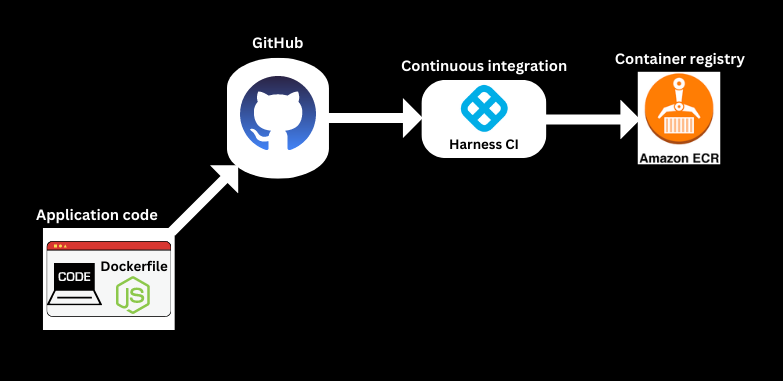
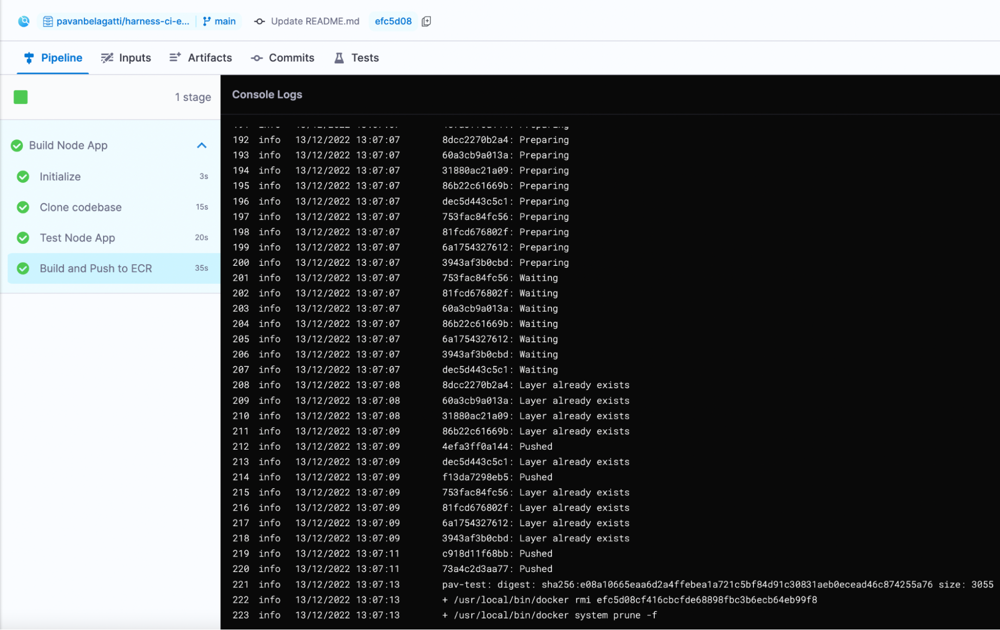
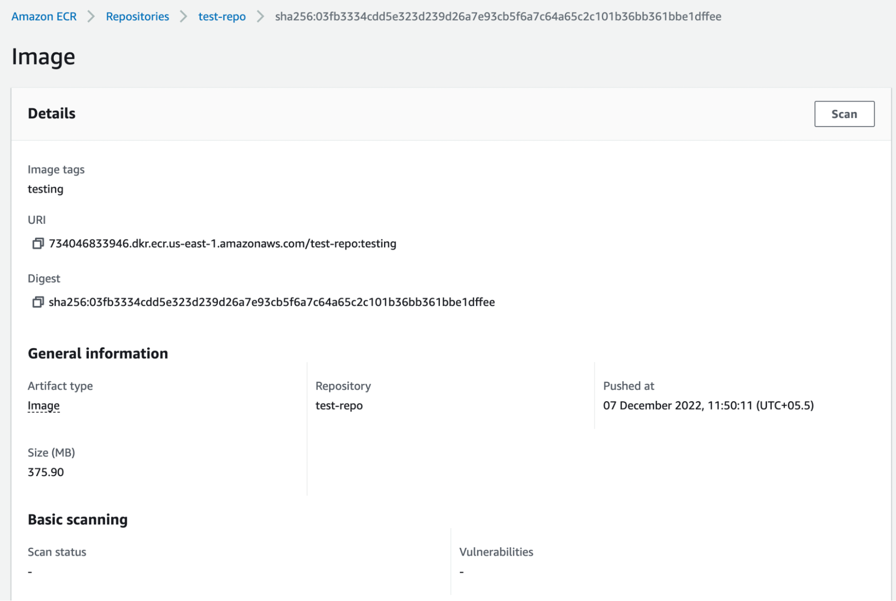

# Build and push a container image to Amazon ECR

<ctabanner
  buttonText="Learn More"
  title="Continue your learning journey."
  tagline="Take a Continuous Integration Certification today!"
  link="/certifications/continuous-integration"
  closable={true}
  target="_self"
/>

Docker made a revolution with containerization. It truly helped to bridge the gap between Dev and Ops teams. Similarly, the cloud providers introduced their own container registries to provide more security and governance. For example, Amazon has Elastic Container Registry (ECR), Microsoft has Azure Container Registry (ACR), and Google has a Google Container Registry (GCR). Container registries have become an integral part of any CI/CD pipeline to store images, metadata, and other important artifacts. In addition, they provide a secure way to store and share container images across a distributed system to help development teams build their software efficiently. In this article, we will explore the Amazon ECR container registry and see how to use it to push container images.

## Understanding container registries
As the name suggests, container registries are used to store some valuable data related to a pipeline. In particular, for storing and sharing container images securely and reliably in a central repository, which multiple users and systems can access. This makes managing and deploying container images easy across a distributed system. Container registries also provide the ability to store multiple versions of a single container image, which allows for version control and rollback if needed. In addition, container registries can store and share sensitive data, such as credentials and secrets, across the team.

## Overview of Amazon ECR
Amazon ECR is a fully managed service from Amazon Web Services (AWS). It is used to store and manage Docker images securely and reliably. In addition, Amazon ECR provides a simple web-based interface for creating, managing, and sharing Docker images and integrating them with other AWS services.

The following graphic shows how your container image is pushed to ECR from Harness CI:

## Requirements

Before you can push your container image to ECR from Harness, there are a few prerequisites:

* You must have an [AWS account](https://aws.amazon.com/resources/create-account/) and have created a repository in ECR.
* You must have a Docker image of your application ready to push to ECR - We have a [sample application](https://github.com/pavanbelagatti/harness-ci-example) with a Dockerfile. You can clone it and use it in this tutorial.
* You must have access to the AWS CLI or the AWS Management Console.
* To use [Harness CI](https://app.harness.io/auth/#/signup/?module=ci&?utm_source=website&utm_medium=harness-developer-hub&utm_campaign=ci-plg&utm_content=get-started), you must have an account on Harness (it is Free). Harness offers hosted virtual machines (VMs) to run your builds. With Harness Cloud, you can build your code worry-free on the infrastructure that Harness provides. You don't have to spend time and effort to maintain build infrastructure; you can focus on developing great software instead.
* This tutorial assumes you have a GitHub account.

## Use Harness CI to build and push to ECR

In this tutorial, you'll create a pipeline that uses a sample codebase, runs a simple `npm test` command, and then builds and pushes an image of the sample app to your ECR repo.

1. Fork the [tutorial repo](https://github.com/pavanbelagatti/harness-ci-example) into your GitHub account. This sample code repo has a Dockerfile with instructions to build our image. Assuming you have created an ECR repo on AWS, you can use Harness CI to build, test, and push an image to your ECR repo.
2. In Harness, [create a project](/docs/platform/organizations-and-projects/create-an-organization/#create-a-project) or select an existing project.
3. [Create a GitHub connector](/docs/platform/connectors/code-repositories/ref-source-repo-provider/git-hub-connector-settings-reference) to connect to the account where you forked the tutorial repo.
4. [Create an AWS Cloud Provider connector](/docs/platform/Connectors/Cloud-providers/add-aws-connector).

   * In **Credentials**, select **AWS Access Key** authentication.
   * In **Select Connectivity Mode**, select **Connect through Harness Platform**.

5. [Create a pipeline in Harness CI](/docs/continuous-integration/use-ci/prep-ci-pipeline-components) and add a **Build** stage.
6. Add a [Run step](/docs/continuous-integration/use-ci/run-ci-scripts/run-step-settings) that runs `npm test`.
7. Add a [Build and Push to ECR step](/docs/continuous-integration/use-ci/build-and-upload-artifacts/build-and-push-to-ecr-step-settings). Make sure the **Region**, **Account ID**, and **Image Name** are correct.
8. Save and run the pipeline.

You can monitor the build progress on the [Build details page](/docs/continuous-integration/use-ci/viewing-builds).

If the pipeline succeeds, you should be able to find your image in your ECR repo.

## Continue your Continuous Integration journey

With CI pipelines you can consistently execute your builds at any time. Try adding a pipeline trigger to watch for SCM events so that, for example, each commit automatically kicks off the pipeline. All objects you create are available to reuse in your pipelines.

You can also save your build pipelines as part of your source code. Everything that you do in Harness is represented by YAML; you can store it all alongside your project files.

After you build an artifact, you can use the Harness Continuous Delivery (CD) module to deploy your artifact. If you're ready to try CD, check out the [CD Tutorials](/tutorials/cd-pipelines#all-tutorials).
