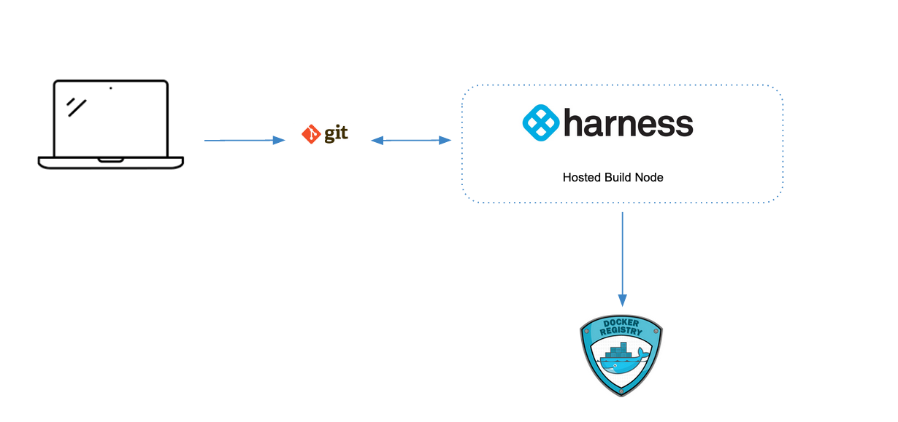
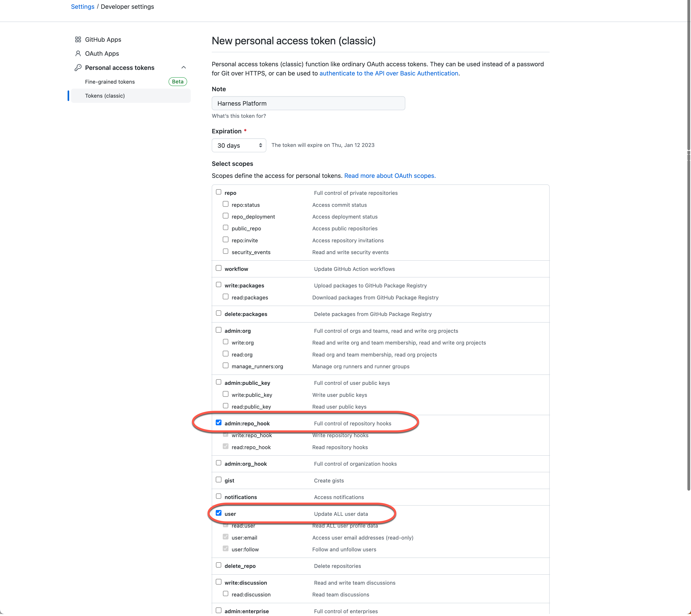
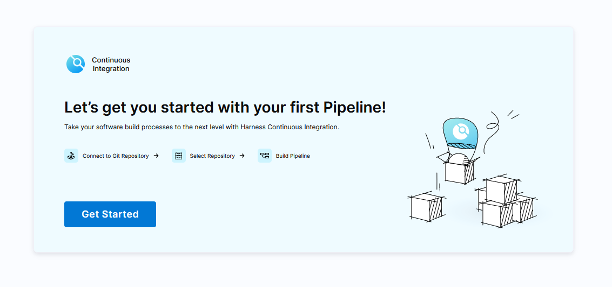
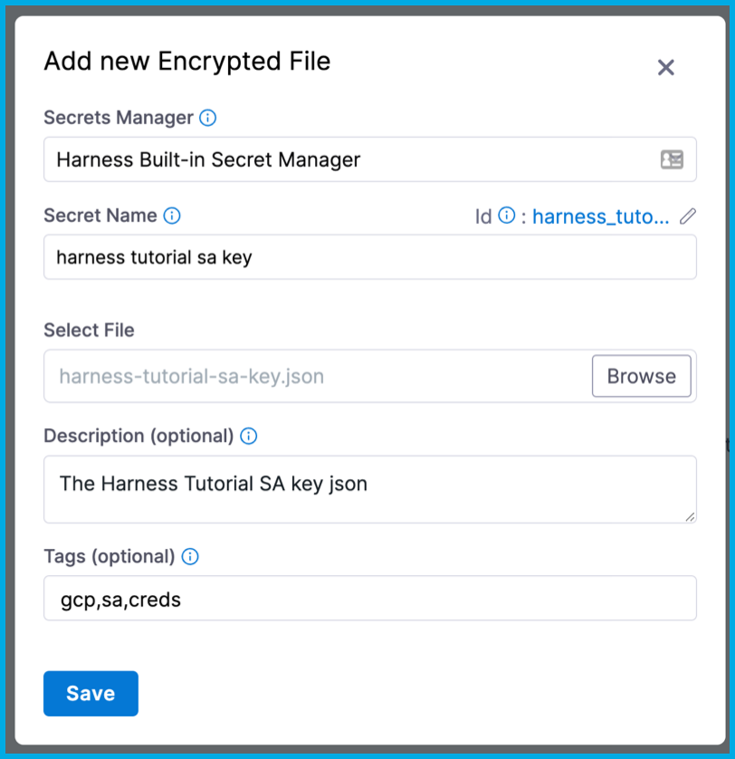
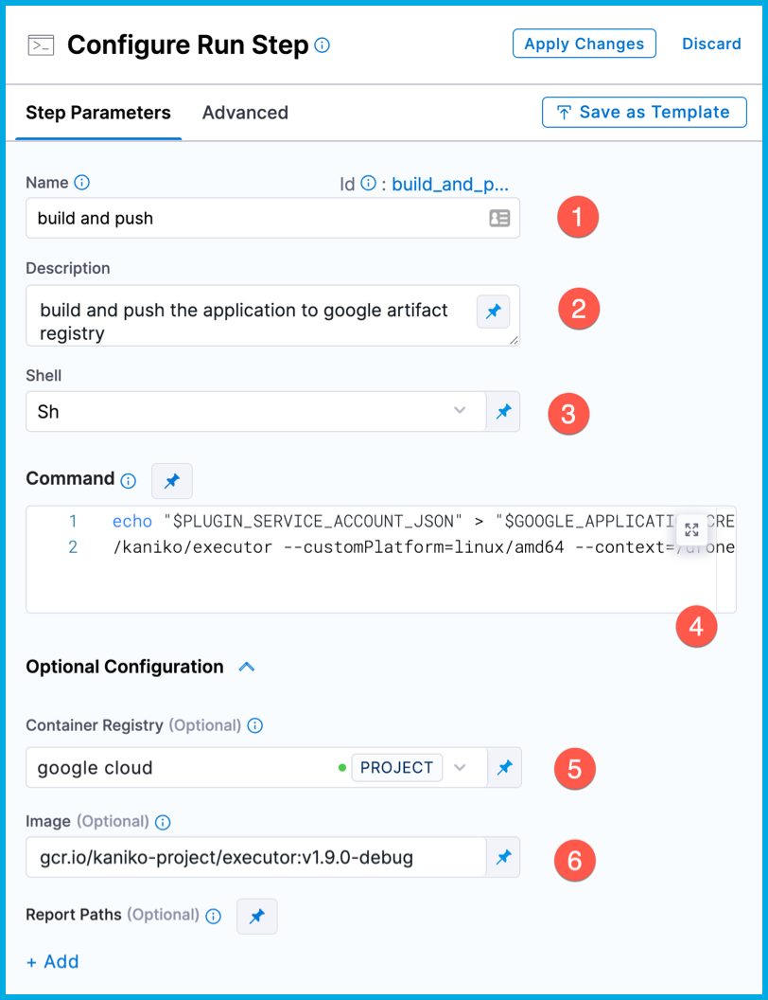
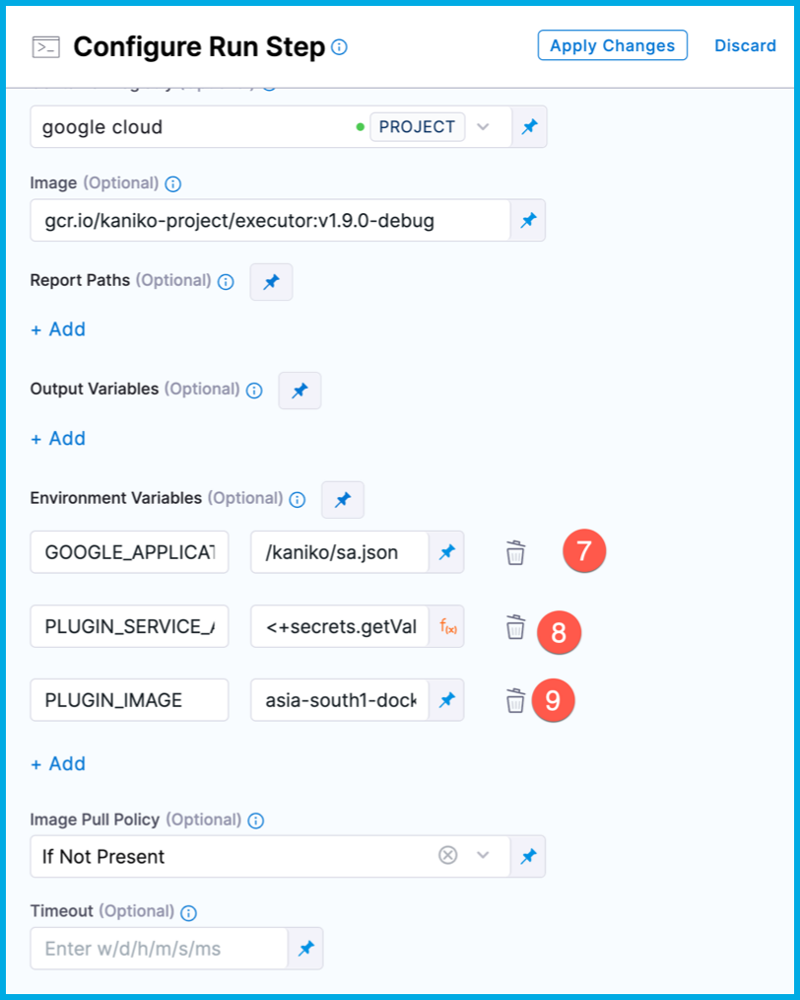

# Push application containers to Google Artifact Registry

<ctabanner
  buttonText="Learn More"
  title="Continue your learning journey."
  tagline="Take a Continuous Integration Certification today!"
  link="/certifications/continuous-integration"
  closable={true}
  target="_self"
/>

This tutorial shows how to use a Harness Continuous Integration (CI) pipeline to build and push application container images to Google Artifact Registry (GAR).

You'll learn how to:

- [x] Use [kaniko](https://github.com/GoogleContainerTools/kaniko) to build an application container image.
- [x] Create [__projects__](https://developer.harness.io/docs/getting-started/learn-harness-key-concepts/#organizations-and-projects) in your Harness account.
- [x] Add [__secrets__](https://developer.harness.io/docs/getting-started/learn-harness-key-concepts/#secrets-management) to projects.
- [x] Add a Google Cloud Platform (GCP) [__Connector__](https://developer.harness.io/docs/getting-started/learn-harness-key-concepts/#connectors) to a project.
- [x] Use a CI pipeline to build and push an application container image.

In this tutorial you'll build a simple __Go__  application that calls `https://httpbin.org/get` and returns a JSON response, such as:

```json
{
  "args": {},
  "headers": {
    "Accept-Encoding": "gzip, deflate, br",
    "Accept-Language": "en-GB,en-US;q=0.9,en;q=0.8",
    "Host": "httpbin.org",
    "Referer": "https://httpbin.org/",
    "User-Agent": "go-resty/2.7.0 (https://github.com/go-resty/resty)",
    "X-Amzn-Trace-Id": "Root=1-63bd82a6-48984f670886c5f55890feea",
    "X-My-Header": "harness-tutorial-demo"
  },
  "origin": "192.168.1.1",
  "url": "https://httpbin.org/get"
}
```

## Prerequisites

In addition to a Harness account, you need the following accounts and tools:

- [gcloud CLI](https://cloud.google.com/sdk/gcloud)
- [Drone CLI](https://docs.drone.io/cli/install/) to build the application locally
- [Docker Desktop](https://www.docker.com/products/docker-desktop/)
- [Terraform CLI](https://developer.hashicorp.com/terraform/downloads)
- A [GitHub](https://github.com) account where you can fork the tutorial repo
- A [Google Cloud account](https://cloud.google.com)

```mdx-code-block
import CISignupTip from '/tutorials/shared/ci-signup-tip.md';
```

<CISignupTip />

## Configure a container registry

To avoid scenarios where builds only work on specific machines, you can use Docker containers to provide clean environments that run specified toolsets. This is a __DevOps__ best practice that helps identify potential problems throughout development.

[Drone by Harness](https://drone.io) is an open source CI platform that helps developers build and test on local machines without manually installing different tools for each language.

Before building the application, you need a location to store build artifacts, which are also known as container images. Externally-hosted locations are ideal because they are more accessible. Container image storage spaces are called __Container Registries__. Examples of container registry providers include Docker Hub, Quay.io, Harbor, Google Artifact Registry (GAR), and Elastic Container Registry (ECR).

### Configure a Google Cloud service account

In this tutorial, you'll push an `httpbin-get` application container image to [Google Artifact Registry](https://cloud.google.com/artifact-registry/docs/overview). You'll also use [Terraform](htttps://terraform.io) scripts to provision Google Cloud resources that you need for this tutorial. To run the Terraform scripts you need to [create a Google Cloud service account](https://cloud.google.com/iam/docs/creating-managing-service-accounts) with the following roles:

- __Artifact Registry Administrator__: Allows the account to create and manage Docker artifact repositories.
- __Service Account Admin__: Allows the account to create other service accounts used in this tutorial.
- __Service Account Key Admin__: Allows the account to create service account keys used in this tutorial
- __Security Admin__: Allows the account to set service account IAM policies for a Google Cloud project.

After creating the service account, download the Service Account Key JSON. In this tutorial, refer to the service account as `$INFRA_SA` and refer to the Service Account Key JSON as `$GOOGLE_APPLICATION_CREDENTIALS`. [Activate your Service Account](https://cloud.google.com/sdk/gcloud/reference/auth/activate-service-account) using these references.

### Clone the tutorial repo

This tutorial uses a sample repo referred to as the tutorial repo or `$TUTORIAL_GIT_REPO`.

Clone the [tutorial repo](https://github.com/harness-apps/httpbin-get):

```shell
#  clone httpbin-get repository
git clone https://github.com/harness-apps/httpbin-get.git \
  && cd "$(basename "$_" .git)"
# navigate to the clone repository folder
export TUTORIAL_HOME="$PWD"
```

:::tip

[GitHub CLI](https://cli.github.com/) is useful for working with GitHub repositories on the command line.

:::

Fork the tutorial repository:

```shell
gh repo fork
```

:::note

You can also fork the [tutorial repo](https://github.com/harness-apps/httpbin-get) from the GitHub web UI.

:::

### Configure the Google Cloud infrastructure

The tutorial repo contains Terraform scripts that set up Google Cloud infrastructure. These scripts:

- [x] Create a Google Artifact Registry repository called `harness-tutorial`.
- [x] Create a Google service account called `harness-tutorial-sa` with permission to administer the `harness-tutorial` Google Artifact Registry repository and deploy services to Google Cloud Run

The `terraform.tfvars` file contains all default variables. Edit `project_id` and `region` to suit your Google Cloud settings.

Deploy the infrastructure:

```shell
make init apply
```

A successful run generates a service account key file at `$TUTORIAL_HOME/.keys/harness-tutorial-sa`.

### Verify the infrastructure

Run a simple Drone pipeline locally to verify your infrastructure. Verification ensures that you can build a container image and deploy it through a Google Cloud run.

The pipeline uses the following environment variables:

- `PLUGIN_IMAGE`: The name of the application container image.
- `PLUGIN_SERVICE_ACCOUNT_JSON`: The base64-encoded content of the Google Cloud service account key file.

Run the following script to generate a `$TUTORIAL_HOME/.env` file that contains the two environment variables:

```shell
$TUTORIAL_HOME/scripts/set-env.sh
```

:::tip

The `PLUGIN_` prefix allows variables to be implicitly passed as __parameters__, or __settings__, to [Drone plugins](https://plugins.drone.io).

You'll also refer to these variables later in this tutorial when building a Harness CI pipeline.

:::

Next, you need to build and push the __go__ application. This uses a simple two-step __pipeline__. The first step uses [kaniko](https://github.com/GoogleContainerTools/kaniko) to build an image. The second step pushes the image to the Google Artifact Registry called `harness-tutorial/httpbin-get`.


Run the following to build and push the image to the Google Artifact Registry:

```shell
drone exec --env-file=.env
```

:::info
This can take some time to build and push. Drone tries to pull container images if they don't already exist.
:::

A successful run produces output similar to the following:

```text
...
[build and push:41] INFO[0110] Taking snapshot of files...
[build and push:42] INFO[0110] EXPOSE 8080
[build and push:43] INFO[0110] Cmd: EXPOSE
[build and push:44] INFO[0110] Adding exposed port: 8080/tcp
[build and push:45] INFO[0110] CMD ["/app"]
[build and push:46] INFO[0110] Pushing image to <your gcp region>-docker.pkg.dev/<your google cloud project>/harness-tutorial/httpbin-get
[build and push:47] INFO[0113] Pushed <your gcp region>-docker.pkg.dev/<your google cloud project>/harness-tutorial/httpbin-get@sha256:67cca19fd29b9c49bb09e5cd2d50c4f447bdce874b11c87c8aae4c3171e659e4
...
```

To check the pushed image, navigate to `https://$PLUGIN_IMAGE`.

If you monitored your machine while running `drone exec`, you may have noticed a temporary slowdown. This might not be a problem for a single engineer, but scaling this process up to dozens, hundreds, or even thousands of engineers can strain system resources. Fortunately, modern continuous integration platforms use distributed nodes to support infrastructure at scale. [Harness CI](https://www.harness.io/products/continuous-integration) supports scaling and helps you externalize, centralize, and automate the build processes, as demonstrated in the next part of this tutorial.

## Build a Harness CI pipeline

The `drone exec` command you ran in the previous section is adequate while you're learning or building locally for yourself. However, when working on a team to deliver enterprise applications, you need to offload, centralize, and automate this process. With Harness CI, you can create pipelines that make your build processes repeatable, consistent, and distributed.

The rest of this tutorial shows how to create a Harness CI pipelines that mimics the local `drone exec` steps that build and push an application container image to Google Artifact Registry.

While the Harness platform has several modules, this tutorial focuses on the Continuous Integration (CI) module. If you don't already have a Harness account, [sign up for a Harness account](https://app.harness.io/auth/#/signup/?module=ci&?utm_source=website&utm_medium=harness-developer-hub&utm_campaign=ci-plg&utm_content=get-started).

### Build infrastructure hosting options

Pipelines require build infrastructure to run. When you create your own pipelines, you can use either Harness-hosted infrastructure or bring your own build infrastructure. This tutorial uses Harness-hosted infrastructure, also called Harness Cloud.

```mdx-code-block
<Tabs>
<TabItem value="cloud" label="Harness Cloud" default>
```

[Harness Cloud](/docs/continuous-integration/use-ci/set-up-build-infrastructure/use-harness-cloud-build-infrastructure) uses Harness-hosted machines to run builds. Harness maintains and upgrades these machines, which gives you more time to focus on development.



```mdx-code-block
</TabItem>
<TabItem value="self" label="Self-hosted infrastructure">
```

With self-hosted build hardware, your pipelines run on your local machines or your Kubernetes clusters. To learn about self-hosted options, go to [Set up build infrastructure](/docs/category/set-up-build-infrastructure).


```mdx-code-block
</TabItem>
</Tabs>
```

### GitHub personal access token

For this tutorial, Harness needs access to your fork of the tutorial repo on GitHub. GitHub personal access tokens are the preferred mode for providing Github credentials.

The GitHub documentation explains how to [Create a personal access token](https://docs.github.com/en/authentication/keeping-your-account-and-data-secure/creating-a-personal-access-token).

If you are using an existing personal access token, make sure it has the `admin:repo_hook` and `user` scopes.



:::important

The __token__ is only displayed once. Copy the token and save it to your password manager or another secure place. The rest of this tutorial refers to this token value as `$GITHUB_PAT`.

:::

### Create a project

In the Harness Platform, you declare and configure resources, such as pipelines, secrets, and connectors. The availability of these resources depends on the scope where the resource was declared. Resources can be available across an entire account, to an organization within an account, or limited to a single project. For this tutorial, you'll create all resources at the project scope.

1. In your Harness account, create a project called **Google Cloud Demos**.
2. Select the **Continuous Integration** module.

   

## Create a pipeline

The Harness CI pipeline wizard creates a basic pipeline for you.

1. Select __Get Started__ to begin.

   

2. Select __GitHub__ as the repository to use, select __Access token__ as the authentication method, input your GitHub personal access token (`$GITHUB_PAT`) in the __Access Token__ field, and select __Test Connection__ to verify your credentials.

   

3. Select __Next: Select Repository__, choose your fork of the tutorial repo `httpbin-get`, and then select __Configure Pipeline__.
4. Select **Generate my Pipeline configuration**, enter `main` for the branch name, and then select **Create Pipeline**.

Harness generates a pipeline for you that has a **Build** stage with an echo step. You'll modify this stage so that the pipeline builds and pushes an image to Google Artifact Registry. However, first you must configure additional resources that the steps require, namely secrets and connectors.

You can use either the visual or YAML editor to add pipeline steps. This tutorial uses the visual editor.

### Add a Google service account secret key

1. [Create a Harness encrypted file secret](/docs/platform/secrets/add-file-secrets/) with the following configuration:

   - __Secrets Manager__: __Harness Built-in Secret Manager__
   - __Secret Name__: Enter _harness tutorial sa key_. __Description__ and __Tags__ are optional.
   - __Select File__: Choose the `$TUTORIAL_HOME/.keys/harness-tutorial-sa-key.json` file

   

2. Note the secret's **Id**. You'll use this later to reference the secret in your pipeline.

   

### Create a Google Cloud Platform (GCP) connector

1. In your Harness project, go to **Connectors**, and [create a GCP connector](/docs/platform/connectors/cloud-providers/connect-to-google-cloud-platform-gcp/). Harness will use this connector to integrate with GCP.
2. Enter a **Name**, such as `google cloud`, and select **Continue**.
3. Select **Specify credentials here**, select your [GSA key file secret](#add-a-google-service-account-secret-key), and then select **Continue**.
4. Select __Connect through Harness Platform__, and select **Save and Continue**.
5. If the connection test succeeds, select __Finish__.

### Add a Run step

1. Go back to the pipeline you created earlier, and select the __Build__ stage.
2. Delete the __Echo__ step by selecting the **X** that appears when you hover over the step.
3. Select **Add Step** and add a **Run** step.
4. For the **Name**, enter `Build and push to GAR`. The **Description** is optional.
5. For **Shell**, select **Sh**.
6. In **Command**, enter the following script:

   ```shell
   echo "$PLUGIN_SERVICE_ACCOUNT_JSON" > "$GOOGLE_APPLICATION_CREDENTIALS"
   /kaniko/executor --customPlatform=linux/amd64 --context=/harness --destination=$PLUGIN_IMAGE
   ```
7. Under **Optional Configuration**, select your [GCP connector](#create-a-google-cloud-platform-gcp-connector) for **Container Registry**.
8. In **Image**, enter `cr.io/kaniko-project/executor:v1.9.0-debug`

   

9. Add the following **Environment Variables**. The are used to push the container image to Google Artifact Registry.

   | Variable Name | Value | Description |
   | - | - | - |
   | `PLUGIN_SERVICE_ACCOUNT_JSON` | `<+secrets.getValue("harness_tutorial_sa_key")>`| The Google service account secret key.<br/>The [input type](/docs/platform/references/runtime-inputs/) must be **Expression**. |
   | `GOOGLE_APPLICATION_CREDENTIALS` | `/kaniko/sa.json` | The json file where the service account key content will be written. |
   | `PLUGIN_IMAGE` | `$PLUGIN_IMAGE` | The container image name.<br/>The value for `$PLUGIN_IMAGE` comes from `$TUTORIAL_HOME/.env`. |

   

10. Select __Apply Changes__ to save the step, and then select __Save__ to save the pipeline.

### Run the pipeline

1. From the Pipeline Studio, select **Run**.
1. For **Build Type**, select **Git Branch**.
1. For **Branch Name**, enter `main`.
1. Select **Run Pipeline**.
1. While the pipeline runs, you can observe the logs on the [Build details page](/docs/continuous-integration/use-ci/viewing-builds).

   :::tip

   Select the Run step to view its logs.

   :::

If your build succeeded, try adding another step that uploads your artifact to a container registry.

## Continue your Continuous Integration journey

With CI pipelines you can consistently execute your builds at any time. Try adding a pipeline trigger to watch for SCM events so that, for example, each commit automatically kicks off the pipeline. All objects you create are available to reuse in your pipelines.

You can also save your build pipelines as part of your source code. Everything that you do in Harness is represented by YAML; you can store it all alongside your project files.

After you build an artifact, you can use the Harness Continuous Delivery (CD) module to deploy your artifact. If you're ready to try CD, check out the [CD Tutorials](/tutorials/cd-pipelines#all-tutorials).
