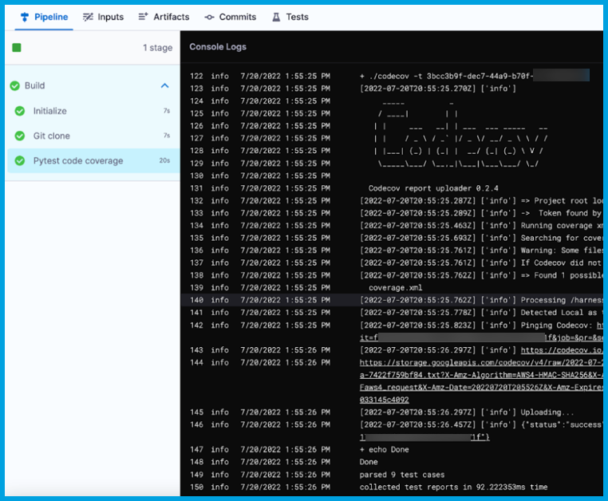

# Code coverage with CodeCov in Harness CI

<ctabanner
  buttonText="Learn More"
  title="Continue your learning journey."
  tagline="Take a Continuous Integration Certification today!"
  link="/certifications/continuous-integration"
  closable={true}
  target="_self"
/>

This tutorial shows how you can use a [Run step](/docs/continuous-integration/use-ci/run-ci-scripts/run-step-settings) to include [CodeCov code coverage](https://docs.codecov.com/docs/about-code-coverage#top-5-codecov-features) in a Harness CI pipeline.

## Prerequisites

In addition to a Harness account, this tutorial requires the following:

* A CodeCov account with code coverage enabled on a code repo and a CodeCov Upload Token. For instructions, go to [CodeCov Quick Start](https://docs.codecov.com/docs/quick-start).
* An understanding of test tools, scripts, and related commands.
* A CI pipeline. If you haven't created a pipeline before, try one of the following tutorials:
  * [Get started for free with the fastest CI on the planet](/tutorials/ci-pipelines/fastest-ci)
  * [Build and test on a Kubernetes cluster build infrastructure](/tutorials/ci-pipelines/kubernetes-build-farm)

```mdx-code-block
import CISignupTip from '/tutorials/shared/ci-signup-tip.md';
```

<CISignupTip />

## Add CodeCov Upload Token secret

Follow the steps in [Add and reference text secrets](/docs/platform/Secrets/add-use-text-secrets) to store your CodeCov Upload Token as a secret in Harness.

## Add the Run step

To include CodeCov code coverage in a Harness CI pipeline, add a **Run** step that does the following:

* Runs tests and produces coverage reports.
* Exports a `CODECOV_TOKEN` environment variable, which represents your [CodeCov Upload Token](https://docs.codecov.com/docs/codecov-uploader#upload-token).
* Downloads and runs the [CodeCov Uploader](https://docs.codecov.com/docs/codecov-uploader) tool.

```mdx-code-block
import Tabs from '@theme/Tabs';
import TabItem from '@theme/TabItem';
```
```mdx-code-block
<Tabs>
  <TabItem value="Visual" label="Visual" default>
```

1. In Harness, go to the **Build** stage in the pipeline where you want to include CodeCov.
2. Select **Add Step**, select **Add Step** again, and then select **Run** in the Step Library.
3. Enter a **Name** for the step.
4. Depending on the stage's build infrastructure, specify the **Container Registry** and **Image** containing the binaries that the step needs to run your script. For example, the command example below uses `pytest` and might require a pytest image, such as `pytest:latest`. For information about when these fields are required and how to specify images, go to [Use Run steps](/docs/continuous-integration/use-ci/run-ci-scripts/run-step-settings).
6. In the **Command** field, include all commands necessary to prepare the test environment, run tests with code coverage, and download and run the CodeCov Uploader tool. For example:

   ```sh
   echo "Welcome to Harness CI"
   uname -a
   pip install pytest
   pip install pytest-cov
   pip install -r requirements.txt

   pytest -v --cov --junitxml="result.xml" test_api.py test_api_2.py test_api_3.py

   # Download Codecov uploader and run it.
   curl -Os https://uploader.codecov.io/latest/linux/codecov
   chmod +x codecov
   ./codecov -t ${CODECOV_TOKEN}
   ```

7. Under **Optional Configuration**, add a `CODECOV_TOKEN` **Environment Variable**:

   * Key: `CODECOV_TOKEN`
   * Value: An expression calling your [CodeCov Upload Token secret](#add-codecov-upload-token-secret), based on the scope where it was declared and the secret's ID, such as `<+secrets.getValue("my_codecov_upload_token")>`. For syntax examples, go to [Add and reference text secrets](/docs/platform/Secrets/add-use-text-secrets).

8. Under **Optional Configuration**, add one or more **Report Paths**, such as `**/*.xml`.
9. Select **Apply Changes** to save the step, and then select **Save** to save the pipeline.

<!--  -->

<docimage path={require('../static/ci-tutorial-codecov-test/run-step-with-codecov-visual.png')} />

For more information about **Run** step settings, go to [Use Run steps](/docs/continuous-integration/use-ci/run-ci-scripts/run-step-settings).

```mdx-code-block
  </TabItem>
  <TabItem value="YAML" label="YAML">
```

In Harness, go to the pipeline where you want to include CodeCov, and add a `Run` step configured as follows:

   *  `type: Run`
   *  `name:` A name for the step.
   *  `identifier:` A unique step ID.
   *  `connectorRef` and `image`: Specify a container registry connector and image, if required by your build infrastructure or the commands you are running. These settings define a container registry connector and image containing the binaries that the step needs to run your script. For information about when these settings are required and how to specify images, go to [Use Run steps](/docs/continuous-integration/use-ci/run-ci-scripts/run-step-settings).
   *  `shell:` Shell type, such as `Sh`.
   *  `command:` Include all commands necessary to prepare the test environment, run tests with code coverage, and download and run the CodeCov Uploader tool.
   *  `reports:` Declare `type` and `paths`.
      *  `type: JUnit`
      *  `spec: paths:` List one or more report paths, such as `- "**/*.xml"`.
   *  `envVariables:` Declare your [CodeCov Upload Token secret](#add-codecov-upload-token-secret) as an environment variable.
      *  Key: `CODECOV_TOKEN`
      *  Value: An expression calling your CodeCov Upload Token secret, based on the scope where it was declared and the secret's ID, such as `<+secrets.getValue("my_codecov_upload_token")>`. For syntax examples, go to [Add and reference text secrets](/docs/platform/Secrets/add-use-text-secrets).

The following YAML example describes a `Run` step that uses `pytest` and the CodeCov Uploader Tool.

```yaml
              - step:
                  type: Run
                  name: Pytest code coverage # Specify a name for the step.
                  identifier: Run # A unique step ID.
                  spec:
                    connectorRef: account.harnessImage # Specify a container registry connector, if required. Omit if not required.
                    image: python:latest # Specify an image, if required. Omit if not required.
                    shell: Sh # Shell type.
                    command: |-
                      # Prepare test environment.
                      echo "Welcome to Harness CI"
                      uname -a
                      pip install pytest
                      pip install pytest-cov
                      pip install -r requirements.txt

                      # Run tests with code coverage.
                      pytest -v --cov --junitxml="result.xml" test_api.py test_api_2.py test_api_3.py

                      # Download Codecov uploader and run it. Uses CODECOV_TOKEN envVariable.
                      curl -Os https://uploader.codecov.io/latest/linux/codecov
                      chmod +x codecov
                      ./codecov -t ${CODECOV_TOKEN}
                    reports:
                      type: JUnit
                      spec:
                        paths:
                          - "**/*.xml" # Specify one or more report paths.
                    envVariables:
                      CODECOV_TOKEN: <+secrets.getValue("my_codecov_upload_token")> # CodeCov Upload Token secret as an environment variable.
```

For more information about **Run** step settings, go to [Use Run steps](/docs/continuous-integration/use-ci/run-ci-scripts/run-step-settings).

```mdx-code-block
  </TabItem>
</Tabs>
```

## Run the pipeline

After adding the **Run** step, run your pipeline.

On the [Build details page](/docs/continuous-integration/use-ci/viewing-builds), you can review CodeCov information in the **Run** step's logs. If the results were successfully uploaded to CodeCov, the logs include a `resultURL` that you can follow to view the code coverage output in your CodeCov account, such as:

```
...
145  info  [date] [time]    [timestamp] [`info`] Uploading...
146  info  [date] [time]    [timestamp] [`info`] {"status":"success","resultURL":"https://codecov.io..."}
...
```

<!--  -->

<docimage path={require('../static/ci-tutorial-codecov-test/build-logs-with-codecov.png')} />
