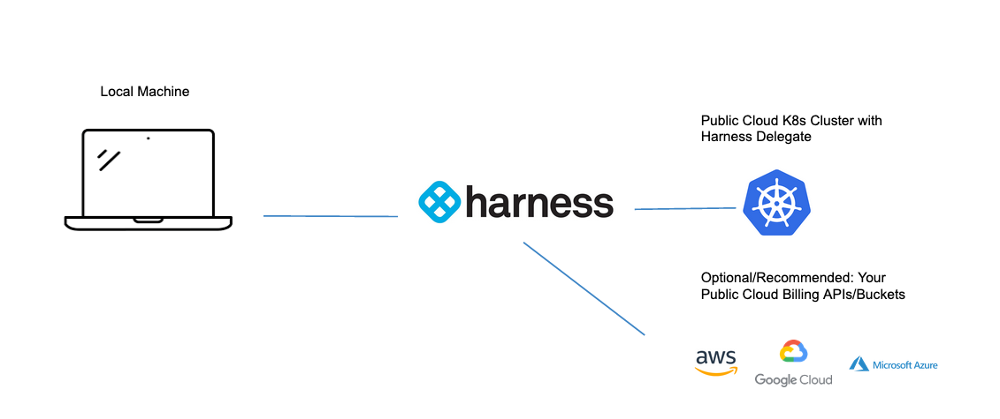
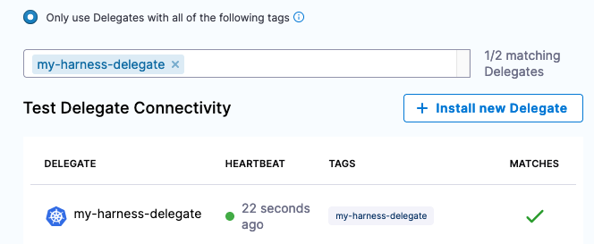
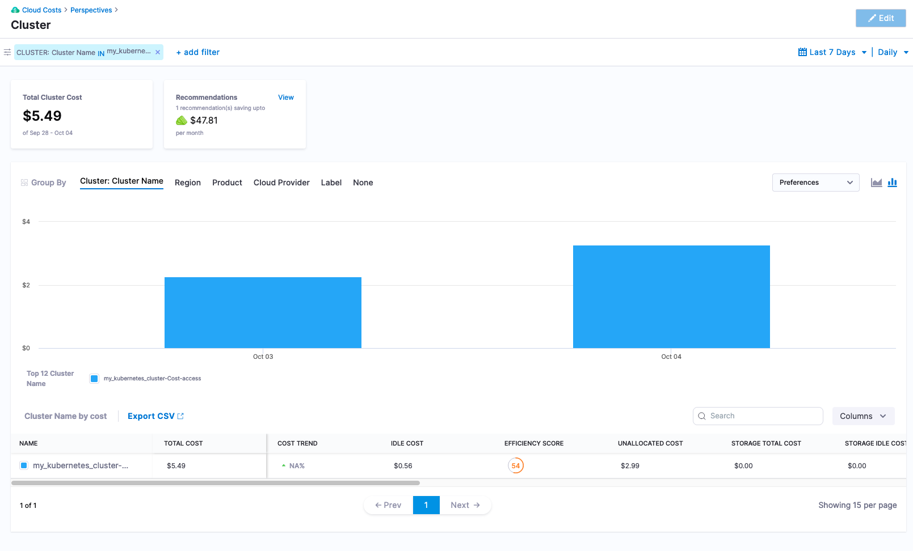
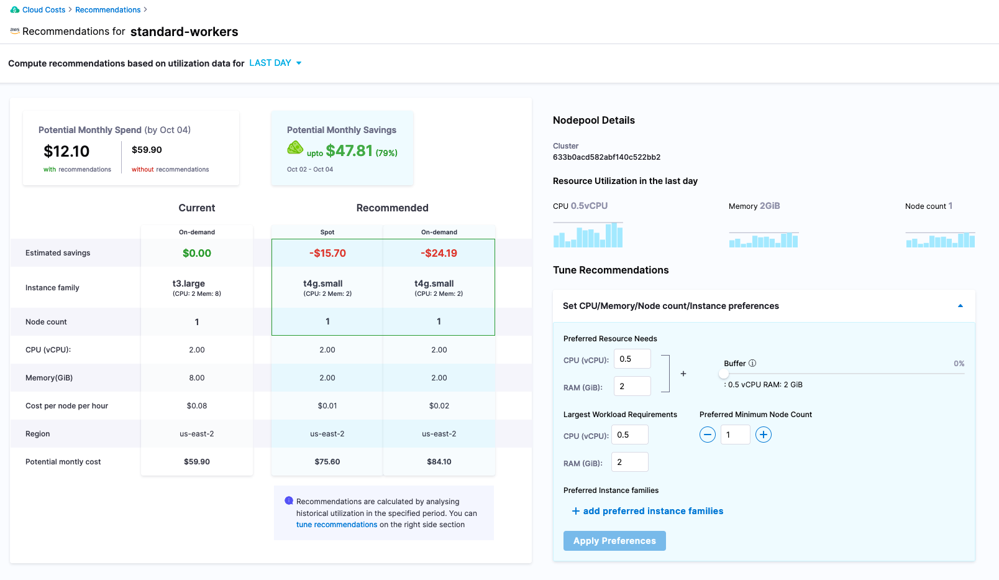

# Optimize Cloud Costs for ECS

```mdx-code-block
import DelegateInstall from '/tutorials/platform/install-delegate.md';
```

## Background on Cloud Costs

As engineers, we are natural optimizers. Responding to users in more expeditious and efficient ways are core to optimizations. There are always tradeoffs between architecture and costs. With the rise of public cloud consumption with on the surface “nearly infinite” resources, this unlocks the next generation of distributed architecture. Though this is not without cost. From an engineering perspective, cost/billing data from the public cloud vendors depending on your organization might not be available to you or can take multiple billing cycles to be disseminated.

Resources on the public cloud are certainly not free. Public cloud vendors not only bill for the core infrastructure but also depending on the services leveraged could be billing dimensions for the control/management planes and non-obvious dimensions such as network/data transmissions. When capacity planning for infrastructure, a natural inclination is to err on the side of caution and provision extra capacity in case of a spike.

Optimizing costs focuses on right sizing resource usage to match workload actuals. Coupled with finding more emphermial infrastructure e.g spot instances can reduce costs. Monitoring solutions typically monitor for when usage exceeds a certain threshold, but the inverse if usage is under utilized, traditional monitoring solutions might not alert on that. Harness Cloud Cost Management, or CCM, can help unlock insights based on usage in how to optimize costs. This example will connect Kubernetes workload(s) on a public cloud vendor to Harness CCM to start getting cost insights and recommendations.

## Get Started with Optimizing Your Kubernetes Cloud Costs

By connecting your public cloud Kubernetes cluster to Harness, you can start to get recommendations on right-sizing the workloads that are running. This example is assuming there are some workloads running in the Kubernetes cluster.



To get actual costing data from your public cloud vendor, it is recommended to [connect your public cloud billing API](https://docs.harness.io/article/80vbt5jv0q-set-up-cost-visibility-for-aws) [usage report, billing export, etc] to Harness CCM. This is not a requirement. Harness CCM will poll usage data from the [Kubernetes Metric Server](https://github.com/kubernetes-sigs/metrics-server) which comes installed by default with GKE and AKS. If using EKS, [installing the Kubernetes Metric Server](https://docs.aws.amazon.com/eks/latest/userguide/metrics-server.html) is needed.

## Prepare Your Kubernetes Cluster for Optimization Recommendations

If you have not already, make sure to sign up for a [Harness CCM Account](https://app.harness.io/auth/#/signup/?module=ce&?utm_source=website&utm_medium=harness-developer-hub&utm_campaign=ccm-plg&utm_content=get-started). Once signed up, to start receiving optimizations for your cluster, you will need to install a [Harness Delegate](https://docs.harness.io/article/2k7lnc7lvl-delegate-overview), e.g the Harness worker node, into your cluster.

### Install Delegate

You will also need to wire in a [Kubernetes Delegate](../platform/install-delegate) if you have not done so already.

<details>
<summary>Install Delegate</summary>
<DelegateInstall />
</details>

### Pointing Harness CCM to Your Cluster

With the Harness Delegate running, the next step is to create a Cloud Integration which will represent your Kubernetes cluster.

Harness Platform -> Cloud Costs -> Setup -> Cloud Integration + New Cluster/Cloud Account

Select Kubernetes.


Once Kubernetes is selected, now we can configure the Kubernetes Cluster connector.

Name: `my_kubernetes_cluster`

Click Continue then in the Details section, leverage the Harness Delegate to connect to the Kubernetes cluster.


Click Continue, then select the Harness Delegate that is running inside your cluster.



### Enabling Cloud Costs

Click Save and Continue and a connection test will occur and validate connectivity. With the Kubernetes cluster wired in, you can enable the wirings for the reporting.

Under the “Features Enabled” column, click Enable Cloud Costs.


In the click-through, validation will occur and then click Finish. If additional permissions are needed, the wizard will guide you through enabling them.


Once you click Finish, Harness will start to analyze data around workload usage.


Note, that initial recommendation and costing data can take up to 24 hours to start being reported/calculated.

After a few hours, cost information will start to be imported. Since in this example we did not connect a public cloud billing bucket, list pricing will be used in cost calculation.

Harness -> Cloud Costs -> Setup -> Cloud Integration -> `my_kubernetes_cluster` -> View Costs


After about a day, more usage data will be captured and recommendations will start to appear.



Digging into the savings recommendation, Harness CCM will provide recommendations off of the usage data captured.

## Looking at Your First Cost Optimizations

Digging into the recommendations list, looking at a recommendation that corresponds to the Kubernetes cluster, can see that the cluster is sized much larger than the resources that are being consumed.

Harness -> Cloud Costs -> Recommendations -> Your Resource



Per this recommendation, resizing the worker node machine size is a prudent move. Taking a look at the back work for the recommendation, can take a look at the actual usage back in the previous perspective. Actions to be taken to reduce costs would be to right size the nodes and if not already, can place resource requests and limits onto the Kubernetes workloads based on what Harness CCM is reporting. This is just the start of the capabilities with Harness CCM, which can also provide additional rules and capabilities around auto-stopping of workloads and give additional infrastructure and workload recommendations. If additional changes are needed, can leverage the Harness Platform to [experiment](https://developer.harness.io/docs/feature-flags) and [make](https://developer.harness.io/docs/continuous-delivery) those changes. 
