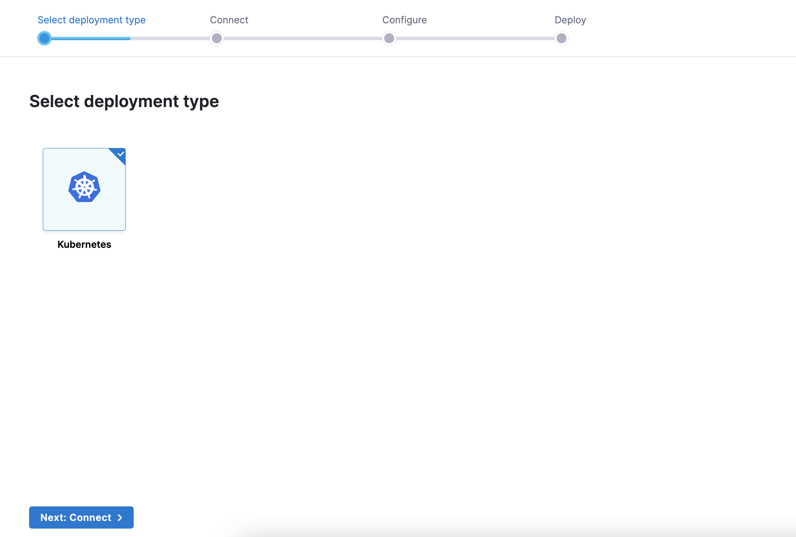
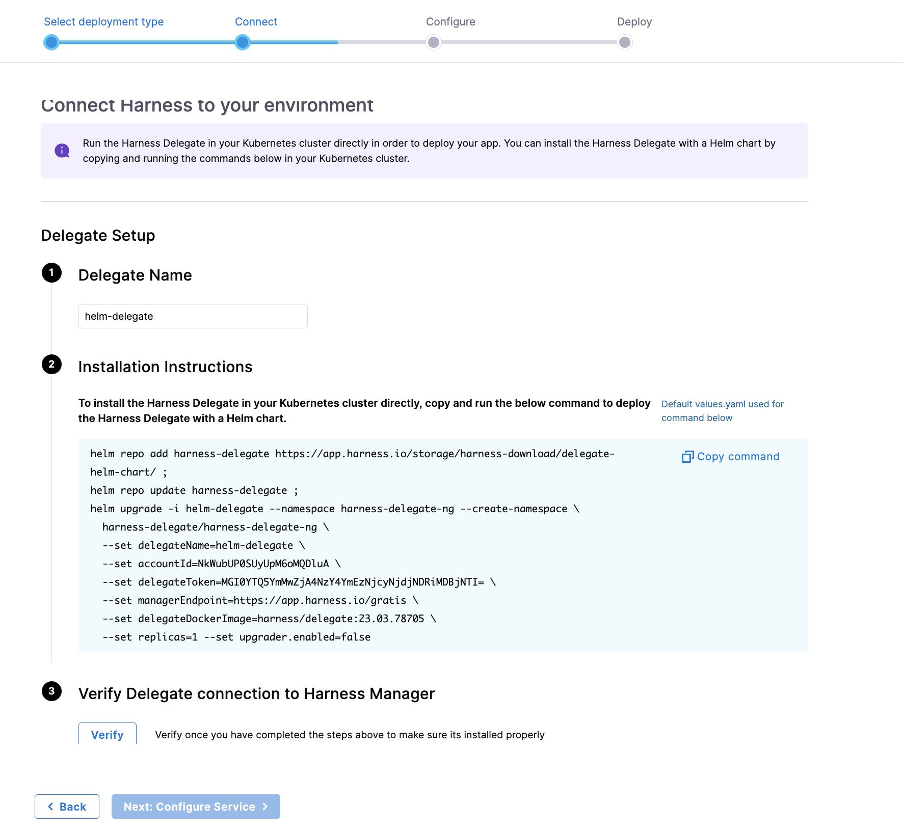
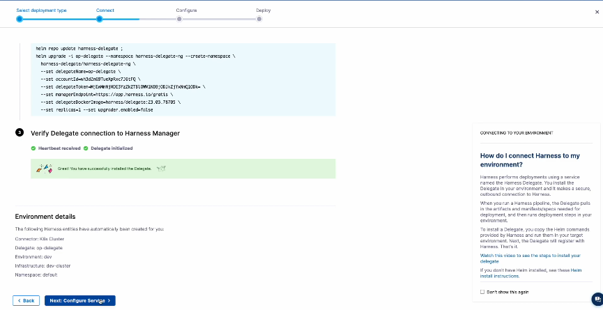
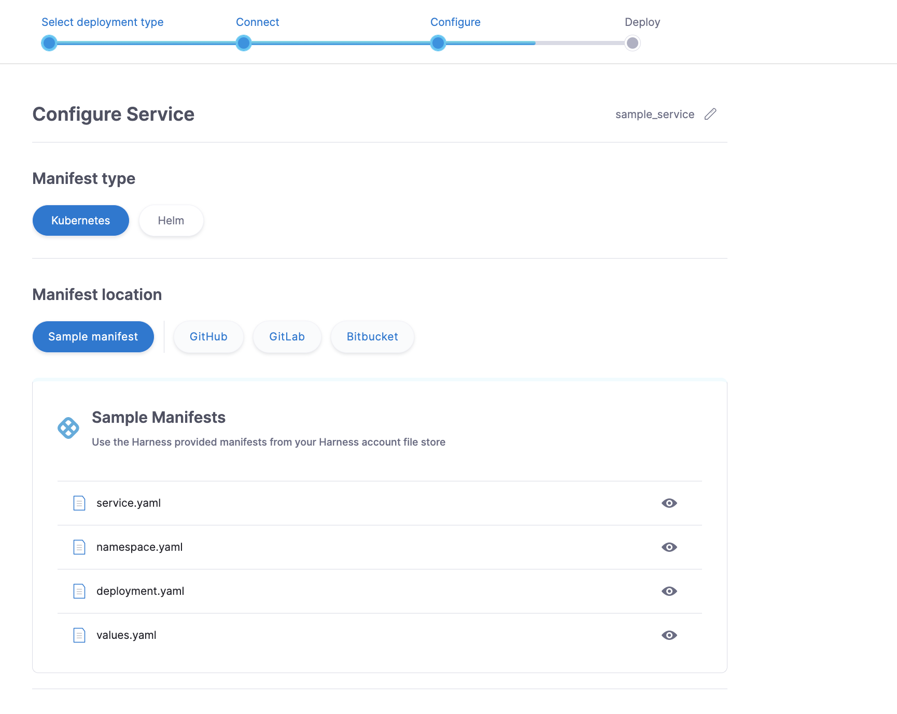
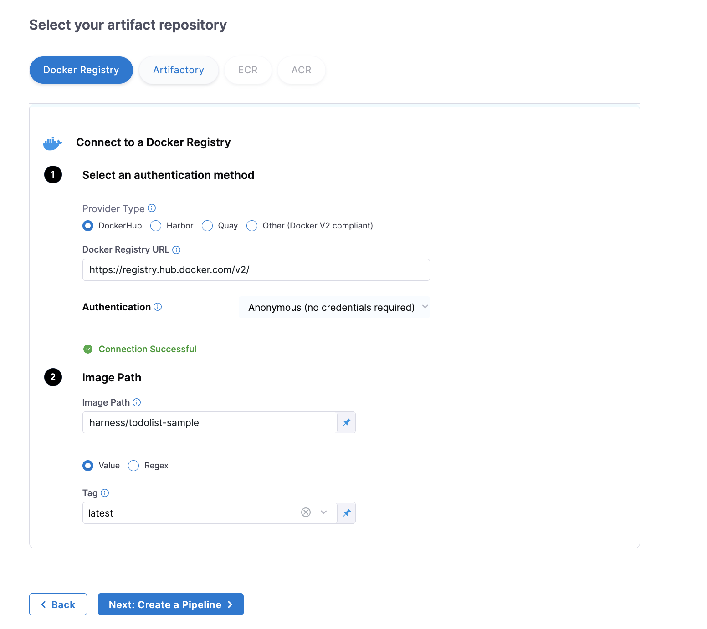
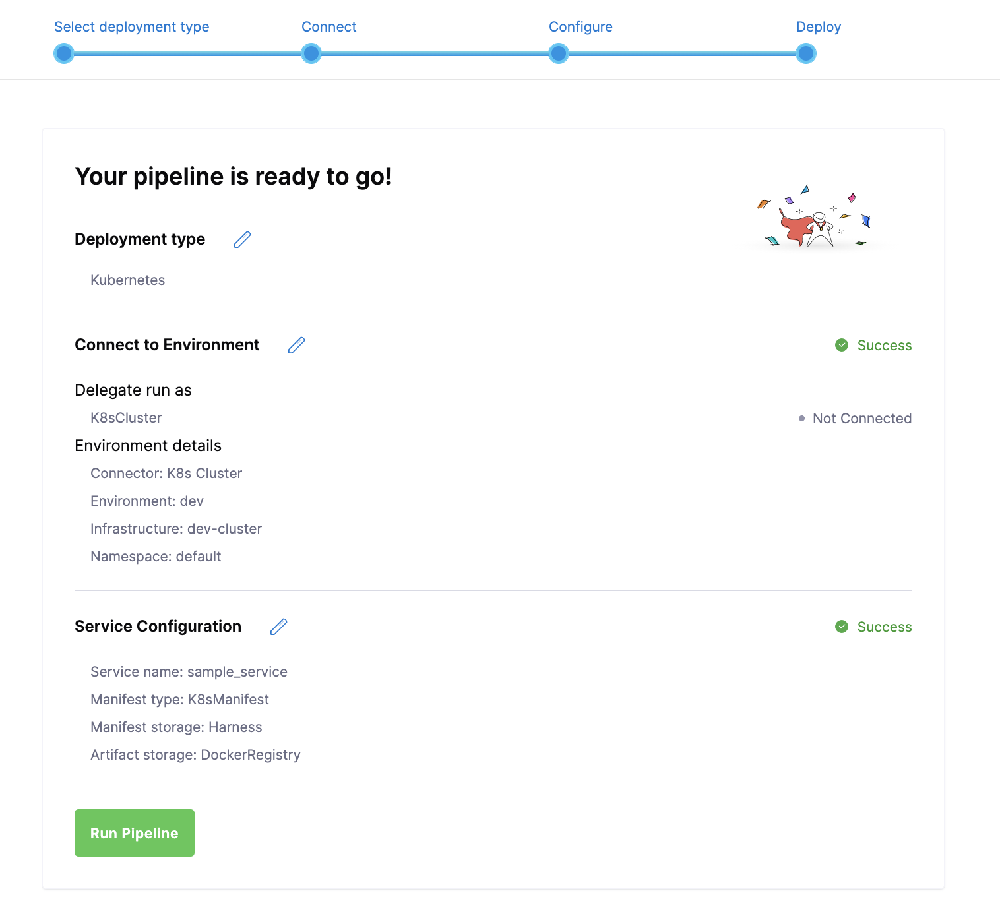

# Get Started with Harness CD 
<ctabanner
  buttonText="Sign Up"
  title="Deliver software faster"
  tagline="Sign up today to get started for free!"
  link="https://app.harness.io/auth/#/signup/?module=cd"
  closable={true}
/>

:::info

[**Sign up for Harness CD**
](https://app.harness.io/auth/#/signup/?module=cd)

:::

## What is Continuous Delivery

Continuous delivery automates the process of delivering changes into production in a predictable and reliable way.  This is achieved by ensuring the code is always in a deployable state.
  
While Continuous Integration automates building and testing code, resulting in a deployable Artifact, Continuous Delivery pickup from that point and takes that artifact through the process of deploying to production.  

This process- or CD pipeline - first takes the changes through staging or testing environments to ensure it’s ready for release.  Once it is validated, the change is deploye dto production. The outcome is a fully automated deployment process, that can be run on demand by the team or triggered by external processes - like when a developer commits a change to the main branch.   

With this process in place, teams will always have a deployment-ready build artifact that has been validated with a standardized test process. 

## Harness CD

With Harness CD, create automated pipelines for your entire software delivery processes, empowering teams to deliver software faster, with security and centralized visibility.

Eliminate scripting and manual deployments, leveraging powerful CD pipelines that integrate your entire stack and software delivery processes in one pipeline:  with infrastructure provisioning, native canary and blue/green deployments strategies, AI/ML driven advanced verification, intelligent rollback and more.

With Harness you can automate any deployment with native support for Kubernetes, Helm, ECS, Tanzu, Serverless, WinRM, Azure WebApps and more

Scale your pipelines across your organization without compromising security.  Harness provides enterprise-grade security at every step with advanced RBAC, audit trails, and granular governance and control powered by Open Policy Agent.

With a focus on developer experience, it is easy to get started with your deployments in Harness CD.   The pipeline studio makes it easy to quickly set up your deployment process in the visual editor, or switch to YAML and manage your pipelines as code with Git as the backing store.

## Get started with your first deployment in Harness CD

You can start deploying your services with Harness CD in minutes.  Our Get Started wizard walks you through the process of setting up a Kubernetes deployment pipeline in a few simple steps.   The pipeline will have a single deployment stage that performs a canary deployment of a service into your Kubernetes cluster.

:::info
Before you get started, you will need a Kubernetes cluster where you will deploy the service.  [See instructions for setting up a cluster here](https://developer.harness.io/docs/plg/cd-getting-started-env/)
:::

**Check out this video walkthrough of the wizard:**
<docvideo src="https://www.youtube.com/watch?v=vybcppS6MCw" />

Sign up for a free Harness CD account, and you will see the be directed to the Deployment Wizard, or you can click Get Started to open the wizard

### Select your Deployment type.  
The first step is to select your deployment type.  
Harness supports all major deployment types and strategies.   In this wizard, we quickly get you started with the most common, Kubernetes.  

If you have another deployment type you would like to get started with, [you can see the full documentation here](https://developer.harness.io/docs/category/cd-tutorials)

### Connect to your environment
Connect to your target cluster where it will be deployed.  You can use an existing Kubernetes cluster or create a new one where you will deploy your service.  [See instructions here for creating and connecting to a Kubernetes cluster.](https://developer.harness.io/docs/plg/cd-getting-started-env/)

Harness performs deployments using a service called the Harness Delegate.  In this step, you will install the delegate in your target cluster.  The delegate will make a secure outbound connection to Harness.  [Learn more about the Harness Delegate.](https://developer.harness.io/docs/platform/Delegates/get-started-with-delegates/delegates-overview)

When you run the deployment pipeline, the delegate will retrieve the artifacts and manifest files needed, and then perform the deployment.

To install the delegate, copy and run the Helm command provided in your target infrastructure.  [If you don’t have Helm installed, check out instructions.](https://v3.helm.sh/docs/intro/install/)  

Once you run the Helm command, click **Verify**.  The delegate will be installed and register with Harness, showing a successful connection.

With a successful connection you can click next to set up your service.  If your delegate is not installed, Harness will not be able to connect to your cluster the deployment will fail

### Configure your service
Now let’s configure your service.  

**The first step is to select your manifest files**  
A Kubernetes manifest is YAML code that describes the deployment.  

* If you have a manifest file for your deployment, you can connect to your Git repository to retrieve it.   Provide the repository details, authentication.
* If you do not have a manifest file, Harness includes sample manifests and a values YAML file that will work with any artifact.

**Now you have the option to supply artifacts**

* If your manifest files have the artifact details hardcoded in them, you do not need to provide artifacts. 

* If you are using the Harness sample manifest, the artifact details are supplied separately.  
	* You can connect to your Docker registry or Artifact repository to retrieve your own service.  
	* If you do not have an artifact to deploy, use the sample ToDo  List application already supplied.

	

### Run your Pipeline
With that your pipeline is ready to go!  As part of this wizard, we have automatically created all of the Harness entities needed to deploy your service.   We have created a pipeline that runs a canary deployment of your service to your Kubernetes cluster.  Click "Run Pipeline" to start your pipeline execution.

### **Pipeline Execution**

Watch your pipeline exeuction in progress!  The pipeline has a single deployment stage that performs a rolling deployment of the service to your Kubernetes cluster.  See the active status of each step of the pipeline, with live logs providing the details of what has executed.

## Get started for free

[**Sign up for a free Harness CD account**](https://app.harness.io/auth/#/signup/?module=cd) and start deploying fast, with security, visibility and control.
