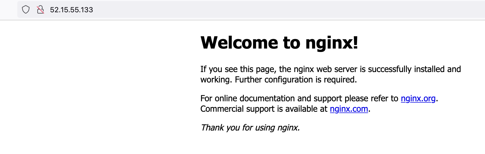

# Deploy a Docker Image to Amazon ECS 

```mdx-code-block
import DelegateInstall from '/tutorials/platform/install-delegate.md';
```

## Amazon ECS Deployment Pipeline Basics

[Amazon Elastic Container Service](https://aws.amazon.com/ecs/) is an AWS offering for those looking to run containerized workloads. Define an ECS [Task Definition](https://docs.aws.amazon.com/AmazonECS/latest/developerguide/task_definitions.html) describing your workload and a [Service Definition](https://docs.aws.amazon.com/AmazonECS/latest/developerguide/service_definition_parameters.html) where you want to run your workload and you are all set.  A Continuous Delivery Pipeline is an excellent spot to orchestrate a deployment to Amazon ECS. In this example, we will go through deploying an image with Amazon ECS inside a Harness Continuous Delivery Pipeline. 


There are a few AWS Items to setup, such as the ECS Cluster itself, which we will go through configuring. If you have not signed up for Harness CD, sign up now before diving in. 


## Create Your First Amazon ECS Cluster

 You need access to an [AWS Account](https://aws.amazon.com/console/) to create an ECS cluster. After that there are a few items to create ahead of ECS Cluster Creation or can leverage the AWS ECS Cluster Creation Wizard to create. Amazon ECS creates EC2 instances on your behalf to run your workloads. So if you have used EC2 in the past, some of these items will not be too foreign. 

### Create/Validate Ahead of Time
#### ECS Instance Role - IAM

The ECS Instance Role will allow the running containers to call underlying ECS API commands. If you do not have an “ecsInstanceRole”, AWS Provides [documentation to create one](https://docs.aws.amazon.com/batch/latest/userguide/instance_IAM_role.html). Make sure to set up the “Trust relationships” per the AWS documentation so your user can eventually assume the Role. 


#### ECS Managed Policy - IAM

The next is to choose or set up a Managed Policy which will allow Harness to call ECS. Just as an example to not set up a more specific [Harness Centric Managed Policy](https://docs.harness.io/article/vytf6s0kwc-ecs-deployment-tutorial#set_up_aws_iam), you can use the generic [AmazonECS_FullAccess](https://docs.aws.amazon.com/AmazonECS/latest/userguide/security-iam-awsmanpol.html) [not recommended in production].


#### Attach the Managed Policy to your IAM User

Lastly, the ECS Managed Policy will need to be attached [Add permission] to your user that you will have Harness connect to AWS with. 


#### VPC/Subnet(s)/Security Group

If this is your first time using ECS or have an account that is a sandbox environment, leveraging the AWS Default VPC and subsequent subnets [e.g one each for each availability zone in a Region] is fine. Depending on your traffic, you would want to create a [Security Group](https://docs.aws.amazon.com/vpc/latest/userguide/VPC_SecurityGroups.html) to allow that traffic in. In this example, we will be handling traffic over TCP port 80 with an example image. For the future steps of wiring in the ECS Service Definition, make sure to have the subnet and Security Group IDs handy. 

#### Creating an ECS Cluster
With the above items created/validated, you are now ready to create an ECS Cluster. You can pick your flavor of ECS. In this example we will deploy to EC2 Linux + Networking. 

AWS Console -> ECS -> Clusters -> Create Cluster


When filling out the wizard, here are a few prudent details:

* Cluster Name: harness-ecs
* Instance Type: A medium instance type e.g m5-medium
* VPC: existing VPC, e.g your default.
* Subnets: select the subnets in your VPC. Note: Regions can sometimes have networking exhaustion, for the example better to select multiple subnets that represent each availability zone. 
* Security Group: Security Group that was created before / one that can handle inbound TCP 80. Will need to reference the Security Group ID later, so creating one ahead of time allows the ID to be visible via the UI to reference. 

Once set up, you will have an ECS Cluster that is ready to accept workload. 


Now you are ready to wire Harness to deploy on your behalf. 

## Initial Harness Setup

If you do not have a Harness Account, [sign up for a Harness Account](https://app.harness.io/auth/#/signup/?module=cd&?utm_source=website&utm_medium=harness-developer-hub&utm_campaign=cd-plg&utm_content=get-started) for access to the Continuous Delivery Module.  a default [Harness Project](https://docs.harness.io/article/7fibxie636-projects-and-organizations) will be created for you automatically. Projects are logical groupings of resources. The generated default project is perfect for the first time deployment. 

When navigating back to Deployments, can set the project context to the Default Project by clicking on the blue chevrons >> and selecting Default Project. 


With the Default Project selected, clicking on Overview will bring up a wizard to create your first Pipeline/Deployment.


There are a few Harness entities that will need to be created in Harness. The needed objects are a Harness Delegate and an AWS Connector for your user credentials. 

### Install a Delegate
If you do not have a Delegate installed, follow [these steps](../platform/install-delegate/) to get one installed either in Docker or Kubernetes. 

<details>
<summary>Install Delegate</summary>
<DelegateInstall />
</details>

## Wiring Your AWS Credentials and Docker Endpoint to Harness 

Especially with a private registry/repository, credentials for the repository are usually scattered around a few scripts or prompted by a system to enter before deployment. Harness has a concept of a Cloud Connector so this will manage the persistence of your cloud provider credentials and use them on your behalf. 

To get started with creating an AWS Cloud Provider connector, head to Account Settings -> Account Resources -> Connectors + New Connector -> AWS

Name: `my_aws_connector`


Click Continue and pick your authentication mechanism. If you have an AWS Access Key and Secret, can enter those as encrypted credentials which gets stored in the Harness Secrets Manager. 

For example, you can create “`my_aws_access`” for your Access Key and “`my_aws_secret`” for the Secret.  


Click continue and select how you will like to connect. You can leverage the Harness Platform or a Delegate to connect. In this example, connecting through Harness is fine. 


Click Save and Continue and your credentials will be tested. Once successful, you can modify one last item so you can pull images from public Docker Hub in the example.

### Wiring Harness Docker Connector

By default, Harness is wired to the public Docker Hub. Though depending on the image, the API endpoint can be different.  The endpoint for us to hit in this example is “https://registry.hub.docker.com/v2/” 

Harness -> Account Settings -> Account Connectors -> Harness Docker Connector then Edit.


Modify the endpoint if not already to “https://registry.hub.docker.com/v2/”.


Click Continue to save. Running this Connector through the Harness Platform is fine. Then when saved and validated, you will be wired to that API Endpoint. 


With those wirings out of the way, you are now ready to create an ECS Pipeline. To expedite the creation, we can wire in a pair of configuration files. 

## Creating Harness Hosted Configuration Files 
Harness will execute your configuration files for you. For this example, we will wire two configuration files, an ECS Task Definition JSON and an ECS Service Definition JSON. These manifests can be linked to source control or stored in Harness itself. For ease of use, you can wire and modify these files to fit your ECS Role and Security Group/subnet items inside Harness. 

ECS Task JSON: 
[https://github.com/harness-apps/developer-hub-apps/blob/main/applications/first-ecs-example/ecs_task.json](https://github.com/harness-apps/developer-hub-apps/blob/main/applications/first-ecs-example/ecs_task.json)

Service Definition JSON:
[https://github.com/harness-apps/developer-hub-apps/blob/main/applications/first-ecs-example/service_definition.json](https://github.com/harness-apps/developer-hub-apps/blob/main/applications/first-ecs-example/service_definition.json)

To Create a manifest hosted by Harness, can add these at the Account Level.

Harness -> Account Settings -> Account Resources -> File Store + New.

Can create two new files, one called “`ecs_task.json`” and one called “`service_definition.json`” based on the above files in [GitHub](https://github.com/harness-apps/developer-hub-apps/tree/main/applications/first-ecs-example). Copy and paste the contents into each respective file and save each. 


[ECS Task](https://github.com/harness-apps/developer-hub-apps/blob/main/applications/first-ecs-example/ecs_task.jso) JSON:
On lines 3 and 53, replace the value of the “executionRoleArn” with your ecsInstanceRole.

[Service Definition](https://github.com/harness-apps/developer-hub-apps/blob/main/applications/first-ecs-example/service_definition.jso) JSON:
On line 8, replace the Security Group with your applicable Security Group. On lines 11, 12, and 13 replace the subnets with your subnet IDs for the availability zones selected when the ECS Cluster was created. You can add or subtract items in the subnet array depending on the number of subnets you have. 

With those manifests out of the way, creating the ECS Pipeline will be very speedy. 

## Creating an ECS Harness Pipeline
With the Delegate, ECS Cluster, and manifests created, creating a Harness Pipeline is simple. Leveraging the Default Harness Project is fine for the example. 

* Deployments -> Pipelines + Create new Pipeline
* Name: my-first-ecs-pipeline
* Setup: in-line


Once you click Start, you can add an ECS Deployment Stage. 
Click in + Add Stage then Deployment and select Amazon ECS. 

Stage Name: deploy-to-ecs


Then click Setup Stage. The next step is to create a Harness Service which will represent the ECS Configurations and Artifact that need to be deployed. 

In the Service Configuration, click + New Service. 


In the New Service UI, name the new service “sample-container” and add get ready to add the Task and Service Definitions. 


To add the Task Definition, click + Add Task Definition. Select Harness as the Task Definition Store. 


Select and name the ecs_task.json that was created before. 

Manifest Name: Task Def


Repeat the same process for the Service Definition once saved.  + Add Service Definition.

Name: Service Def


Now both are wired. The next step would be to wire in an artifact/image that you want to deploy. 


Lastly will wire an artifact to deploy. In the Task Definition, we have added a variable [if you copied from source control] to take in an input from Harness on an image to deploy. 


We can specify that image via the Harness by adding an Artifact Source. + Add Artifact Source. 

Select Docker Registry, we will select the Public Docker Hub Connector we re-wired before. 


Click Continue. Nginx can be used as an example to start. 

* Artifact Source Name: nginx 
* Image Path: library/nginx


Click Submit and the Artifact will be wired in. Then click Save. 


Click Continue to point Harness to your ECS Cluster. 


## Pointing Harness to ECS
Harness has a concept of Environments which is the target infrastructure where you want to deploy. In this case, we will be deploying to the ECS Cluster that was created. 


Click + New Environment 

* Name: my-aws-environment
* Environment Type: Pre-Production


Click Save and next you will point to your specific ECS Cluster by adding that as a piece of Infrastructure. + New Infrastructure


* Name: my-ecs-instance
* Connector: Your AWS Connector
* Region: Your AWS Region where the ECS Cluster lives
* Cluster: harness-ecs


Click Save then Continue to define the Execution Strategy. 


In the Execution Strategy, there are several options on how to deploy to ECS. For the example we will leverage a Rolling Deploying strategy. 


Once selected, click Use Strategy. Your Pipeline is now ready to be saved. Click on the Save button in the top right. 


Now you are ready to execute. 

## Running Your First Harness ECS Deployment
Selecting your Pipeline from Deployments -> Pipelines, can click on the Run Button to execute. 

* Primary Artifact: nginx
* Tag: stable


Click Run Pipeline and your Pipeline will be executed.

After a few moments, your Pipeline will be successfully deployed to ECS. 


To see your workload in action, head back to the AWS Console and dive into the Task for the public IP.

AWS Console -> ECS -> Clusters -> harness-ecs -> Tasks -> Task UID -> Public IP


Head to the Public IP e.g 52.15.55.133 and you will see a welcome message. 



Congratulations on your ECS deployment! This was a vanilla deployment to ECS. Harness has the ability to orchestrate confidence building steps. We used a pre-packaged image but [Harness CI](/tutorials/build-code/ci-node-docker-quickstart) can execute a Docker Build for you and create a custom image which you can then deploy with similar into Amazon ECS. 
