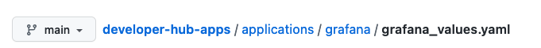
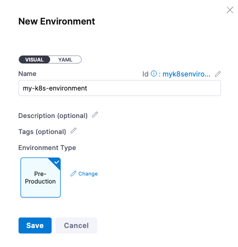

# Deploy a Private Image in Amazon ECR to Kubernetes using a CD Pipeline

```mdx-code-block
import GitHubPAT from '/tutorials/shared/github-wiring-includes.md';
import DelegateInstall from '/tutorials/platform/install-delegate.md';
```

## Background on Private Registries

Artifact repositories are the home for the application binaries that need to be deployed. Artifact repositories can also house the building blocks that applications need e.g the dependencies that a final build will bundle up as a deployable artifact. The Docker Ecosystem has a concept of [Docker Registries](https://docs.docker.com/registry/). These registries are designed to store and distribute Docker images. 

There are a multitude of choices when picking a Docker Registry; from Docker Hub itself to cloud vendors to artifact repository vendors all having Docker Registry solutions. Sometimes what you are working on is internal to your organization or adding a layer of security that the public can not pick up the docker distribution of your application/service. Thus having a private Docker Registry is a prudent move. Deploying an image from a private Registry is similar to a public one, though there are authentication step(s) that are needed depending on the provider. In this example, we will deploy an image from a private Amazon Elastic Container Registry ([ECR](https://aws.amazon.com/ecr/)) to a Kubernetes cluster. 


You can leverage the example image and manifests in this tutorial or bring your own. The first step is to access your private registry. 

## Accessing Your Private Docker Registry - Amazon ECR
Head to the AWS Console and then to the ECR module. You can either create a [new private ECR Repository](https://docs.aws.amazon.com/AmazonECR/latest/userguide/repository-create.html) or leverage an existing one.  Once you have access to a private ECR Repository, they will be listed under Repositories on the Private tab. In this example, a private ECR Repository called “my-private-repo” has been created. 


Amazon does list out authentication commands by clicking into the Repository and clicking “View push commands”. This will require the [AWS CLI](https://docs.aws.amazon.com/cli/latest/userguide/getting-started-install.html) and [Docker](https://docs.docker.com/engine/install/) on your machine.  

Execute the authentication command to run on your local machine. If you have a private image and corresponding manifest to deploy, you can skip to the [deployment section](/tutorials/deploy-services/ecr-private-repo-deployment#deploying-a-private-image-with-harness). If you do not, can use the below section to seed your private registry. 

### Seeding Your Private Registry 
If you do not have an image that you want to deploy in your private registry, you can take an image that is publicly accessible that you want to deploy and push that into your private ECR Repository. 

Let’s say you want to deploy [Grafana](https://grafana.com/docs/grafana/latest/setup-grafana/installation/kubernetes/) as an example which will require an image. You can locally pull the image down then re-tag and push the image to match your ECR format. 

```
docker pull grafana/grafana
docker tag grafana/grafana <ecr-id>.dkr.ecr.<region>.amazonaws.com/my-private-repo:latest
docker push <ecr-id>.dkr.ecr.<region>.amazonaws.com/my-private-repo:latest
```


With the push out of the way, you will see your newly seeded image in the ECR Registry. 


With an artifact in your private ECR Repository, you are now ready to deploy this with Harness. 

## Deploying a Private Image with Harness

If you do not have a Harness Account, [sign up for a Harness Account](https://app.harness.io/auth/#/signup/?module=cd&?utm_source=website&utm_medium=harness-developer-hub&utm_campaign=cd-plg&utm_content=get-started) for access to the Continuous Delivery Module. A default [Harness Project](https://docs.harness.io/article/7fibxie636-projects-and-organizations) will be created for you automatically. Projects are logical groupings of resources. The generated default project is perfect for the first time deployment. 

When navigating back to Deployments, can set the project context to the Default Project by clicking on the blue chevrons >> and selecting Default Project. 


With the Default Project selected, clicking on Overview will bring up a wizard to create your first Pipeline/Deployment. There are a few Harness entities that will need to be created in Harness. The needed objects are wirings to Amazon ECR for private  image access and GitHub for the manifests. 

## Install Delegate

<details>
<summary>Install Delegate</summary>
<DelegateInstall />
</details>

With the delegate installation out of th way, now you can wire your AWS Credentials to Harness. 

## Wiring Your AWS Credentials to Harness 
Especially with a private registry/repository, credentials for the repository are usually scattered around a few scripts or prompted by a system to enter before deployment. Harness has a concept of a Cloud Connector so this will manage the persistence of your cloud provider credentials and use them on your behalf. 

To get started with creating an AWS Cloud Provider connector, head to Account Settings -> Account Resources -> Connectors + New Connector -> AWS

Name: `my_aws_connector`


Click Continue and pick your authentication mechanism. If you have an AWS Access Key and Secret, can enter those as encrypted credentials which gets stored in the Harness Secrets Manager. 

For example, you can create “`my_aws_access`” for your Access Key and “`my_aws_secret`” for the Secret.  


Click continue and select how you will like to connect. Connecting through the Harness Delegate that was created in the above steps works fine. Select the Harness Delegate you created or let Harness select the best available delegate [though if you have only one, this is the same operation]. Then once selected, test the credentials. 


With your credentials wired, you are now ready to create a Pipeline to deploy your private image. 

## Creating a Harness CD Pipeline For Your Private Image

With the Delegate and AWS credentials out of the way, you are now ready to create your first Pipeline. You will be deploying a Docker Image with a Kubernetes Manifest coming from Docker Hub and GitHub respectively. The following steps will walk you through how to create a Pipeline with those resources.

* Deployments -> Pipelines + Create new Pipeline
* Name: my-first-pipeline
* Setup: in-line


Click Start and add a Pipeline Stage by clicking the +Add Stage icon.


Select Deploy as the Stage. Next, name the stage “Deploy Grafana” as a type Service.


Then click Set Up Stage.

The first step is to define the Service by clicking on + New Service


Can name the Service “my-grafana-instance”.


Once Saved, the next step is to point to a Grafana Kubernetes Manifest. In the Service Definition section, select Kubernetes as the Deployment Type. Then you can add a Manifest from GitHub.


By selecting +Add Manifest, in the Manifest Wizard, select K8s Manifest.


Click continue and select GitHub as the Manifest Source/Store.


Now you are ready to create a GitHub Connector. GitHub does require Personal Access Tokens [PATs] to access git operations. See below if you do not have one setup.

### Wiring GitHub into Harness

```mdx-code-block
<GitHubPAT />
```

Next, you will need to wire in the Manifest Details which are being pulled from [https://github.com/harness-apps/developer-hub-apps/tree/main/applications/grafana](https://github.com/harness-apps/developer-hub-apps/tree/main/applications/grafana).

Looking at the GitHub structure there are two files to leverage, the deployment manifest and a *values.yaml*:




Can wire those two manifests into Harness.

* Manifest Name: grafana
* Branch: main
* File/Folder Path: /applications/grafana/grafana.yaml
* Values.yaml: /applications/grafana/grafana_values.yaml

Harness has the ability to read in input variables in your Pipeline. In a deployment manifest, can wire in variables to be picked up by Harness. Later when executing the Pipeline, Harness can prompt you for which tag of the image to deploy with {{.Values.image}}.


Click Submit, and now your Grafana Manifests will be wired to the Pipeline.


Now you are ready to wire in the private artifact. 

## Wiring In Private Registry / Artifact
In the Artifacts section, click + Add Primary Artifact.  Select ECR is the Artifact Repository Type. 


Click continue and select the AWS Connector you set up before as the credentials to connect with. For the next step, you will need to know the AWS Region your ECR instance is running. 

* Region: Your ECR Region
* Image Path:  my-private-repo [if using the example ECR repo]


Click Submit and your private image will be wired to the Pipeline. 


Click Continue, and now you are ready to wire in where and how you want to deploy.

## Where Your Pipeline Deploys To
The next step is to define the infrastructure or where your Pipeline will deploy to. The first step is to define the “where” as a [Harness Environment](https://docs.harness.io/article/n39w05njjv-environment-configuration).


A Harness Environment is your deployment target. You can create a new Harness Environment via the wizard by clicking on + New Environment.

* Name: my-k8s-environment
* Environment Type: Pre-Production



Click Save and now you are ready to wire in your Kubernetes cluster. Since your Delegate should be running in a Kubernetes cluster, you can create a reference to this cluster with a Cluster Connector.

Select “Direct Connection” Kubernetes then can fill out the Cluster Details with a New Connector by clicking on the drop down.


Click on Select Connector and then + New Connector


Once clicked on + New Connector, can give a name to your Kubernetes cluster.

* Name: my-k8s-cluster


Click Continue and select “Use the credentials of a specific Harness Delegate” to connect.


Click Continue and select the Harness Delegate you installed into your Kubernetes Cluster e.g *my-harness-delegate*.


Click Finish and you can enter a namespace that is available on the Kubernetes cluster.

* Namespace: default


Click Continue and now you are ready to configure how you want your deployment to execute.

## How Your Pipeline Deploys

Clicking Continue, you are now ready to configure the Execution Strategy or the “how” your Pipeline executes. Harness can guide you through several deployment strategies such as a [Rolling Deployment](https://kubernetes.io/tutorials/tutorials/kubernetes-basics/update/update-intro/) or a [Canary Deployment](https://www.infoworld.com/article/3644449/how-canary-releases-enable-continuous-deployment.html). For the example, a Rolling Deployment is simplest.


Select “Rolling Kubernetes” then click on Use Strategy. Now you are ready to save this Pipeline and execute the Pipeline to create a deployment.


## Running Your Harness Pipeline
After the setup steps, you are on your way to a repeatable deployment process. Click run in the Pipeline Window.


Here you will see only one tag [or the private tags you have available for your image(s)]. Select “*latest*” if leveraging the example pushed image and click Run Pipeline. 


After a few moments, your deployment is complete!


Head back to your terminal and run a kubectl command to get the address [External IP] of what you just deployed. If you are using minikube, to expose a Kubernetes Service, you might have to run `minikube tunnel`.

```
kubectl get services -A
```


Head to the External-IP over port 3000 to see Grafana. E.g http://34.132.72.143:3000/login By default, the Grafana user and password is admin/admin.


Congratulations on deploying a private image in a Continuous Delivery Pipeline! 