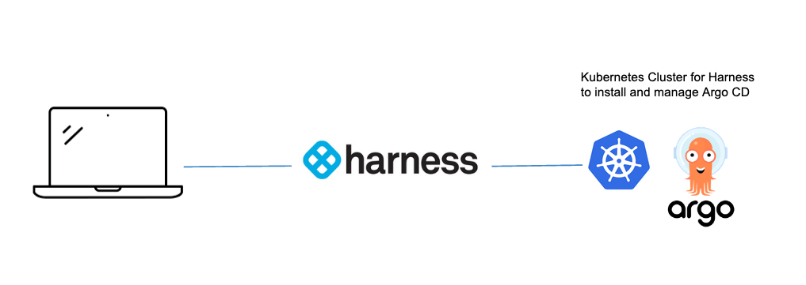
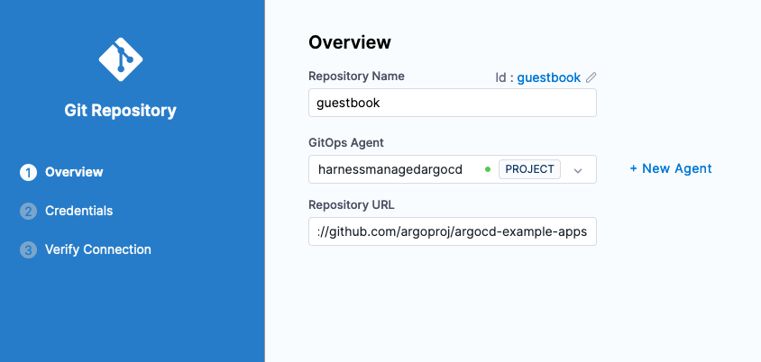
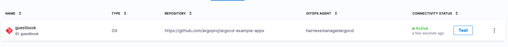

# Deploy a Helm Chart using Harness GitOps for Argo CD

## GitOps Basics

GitOps extends practices of Source Code Management into infrastructure and deployment of applications. [Argo CD](https://argoproj.github.io/cd/) is the most popular project in this space. Even if you are new to GitOps and/or Argo CD, you have nothing to worry since Harness makes it really easy to get started. First you will need to [sign up for a Harness Account](https://app.harness.io/auth/#/signup/?module=cd&?utm_source=website&utm_medium=harness-developer-hub&utm_campaign=cd-plg&utm_content=get-started). Harness works on a concept of Projects. The default project created when signing up for Harness is fine for the example. 



Harness will install Argo CD on your behalf and connect that Argo CD instance to Harness. All you need is a Kubernetes cluster.

Navigate to Deployments -> GitOps  -> Settings -> GitOps Agents


Then + New GitOps Agent. Select “No” for an existing Argo CD instance then click Start.


Click Start. Can name and provide an existing Namespace on the cluster for the installation. 

* Name: harness-managed-argocd
* Namespace: default


Hit continue and download the provided YAML and apply the YAML into the Kubernetes cluster where you would like Argo CD to be running. 

```
kubectl apply -f gitops-agent.yaml -n default
```


After a few moments, the Verification steps will run and you can click Finish. 
The next step is to deploy an application with Harness GitOps. 

## Deploying Via Harness GitOps 
If you are familiar with Argo CD, these steps will be very familiar. If you have not, no worries these steps are straightforward.  Will be needing to define a what [repository], where [target], and when [synch policy] to deploy Kubernetes resources. 

### What to Deploy

The Argo CD project has a sample Guestbook application that is deployed via Helm. This is located at:
`https://github.com/argoproj/argocd-example-apps/tree/master/helm-guestbook`

First will need to connect the repository to Harness. 

Deployments -> GitOps -> Settings -> Repositories + New Repository 


Select Git as the repository type to connect to. Fill in a few prudent details.

* Repository Name: guestbook
* GitOps Agent: A GitOps Agent You Installed
* Repository URL: https://github.com/argoproj/argocd-example-apps



Click Next and specify credentials for the repository. Since this is a public repository, anonymous access is fine. 


Click save and continue and a Verification will run. Click Finish and the Repository will be wired. 



The next step is the where portion, or where the application will be deployed. 

### Where To Deploy - Kubernetes Target
Defining where to deploy is a simple process especially with a Harness GitOps Agent. 

Deployments -> GitOps -> Settings -> Clusters + New Cluster

* Name: myk8scluster
* GitOps Agent: Your GitOps Agent Name


Click Continue. You can leverage the credentials of the Harness GitOps Agent to deploy on your behalf. Select that as the connection methodology. 


Click Finish and your Cluster will be ready to be connected into an Application, a combination of the “what” and the “where”.

### Creating an Application

Creating an Application, combining the what and where to deploy covered in this step. 

Deployments -> GitOps -> Applications + New Application

* Name: guestbook
* GitOps Agent: Your GitOps Agent Name
* Service: A Service is a logical grouping of configurations. Can click + New Service if you do not already have a Service and create a Service Name such as “guestbook”.
* Environment: An Environment is a logical grouping of infrastructure. Can click + New Environment and create an Environment Name such as “guestbook_env”.


Click Next and you can choose how the repository sync occurs. Automatic will look for changes in the repository. Though since this is an example repository and you might not have publish access to the repository [you can always Fork and check out in your own repository], Manual Sync is appropriate. 


Click Continue to connect the Repository to the Application. 

* Repository URL: Repo URL that was just connected [https://github.com/argoproj/argocd-example-apps]
* Revision Type: Branch
* Target Revision: master
* Path: helm-guestbook
* Value Files: values.yaml 


Click Continue and connect in the Cluster and Namespace Details. 

* Cluster: Select the Cluster that was connected in before [default.svc is fine]. 
* Namespace: Define an existing Namespace, e.g default. 


Click Finish and you are now ready to deploy e.g Sync. 

## Deploying Your Application, the GitOps Way
Now you are ready to deploy. Since the sample application is not on your cluster, your Kubernetes resources are out of synch based on the current Kubernetes cluster state and what is in the repository. 


You can deploy e.g Sync the manifest(s) with the Kubernetes cluster by clicking SYNC in the top right corner. 


Click Synchronize and your deployment will start.


After the synchronization, your Harness GitOps deployment is complete. 

To check out Guesbook, you can expose via a Kubernetes Load Balancer and navigate to the External-IP.

```
kubectl patch svc guestbook-helm-guestbook -n default -p '{"spec": {"type": "LoadBalancer"}}'

kubectl get services -n default
```


If using a local Kubernetes cluster like minikube, you might have to run `minikube tunnel` to expose. 

E.g http://35.192.51.53


Congratulations on your GitOps deployment. The GitOps paradigm offers a lot of capabilities for Kubernetes based workloads. Harness aims to make Argo CD experience better by leveraging Argo CD as an engine and layer that with the ease of use and management capabilities that Harness provides. 