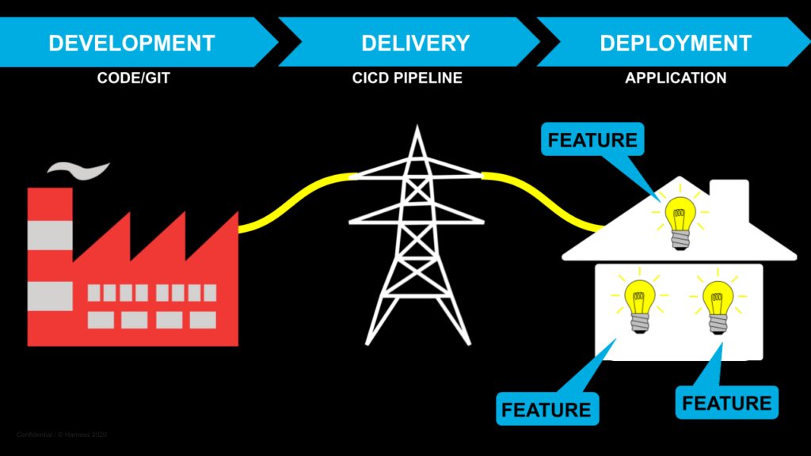
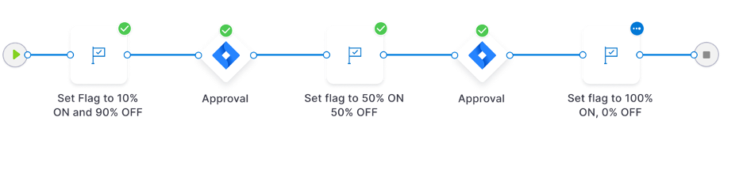

# Feature Flags best practices

As teams adopt Feature Flags, or consider adopting the practice, they often wonder what problems they should conider early on to set them up for success.

The tips in this tutorial to help your software teams use feature flagging to get more control, whether you’re implementing feature toggling, trying to expand your feature testing, hoping to control system behavior to control access - or even just trying to roll a new feature out to your entire user base.

## Quick feature flag refresher

Let’s start by making sure we’re all on the same page about feature flags, before we dive into feature flags best practices.

### What is a feature flag?

Feature flags are a way that developers can conditionally turn certain sections of their code (or code paths) on or off. You can think of feature flags as an extension of Continuous Delivery - a way to put changes into production behind a flag and turn them on in a controlled way later (or hide and remove them in the same way). They form the basis of feature flag management.

Not sure if you’re using feature flags, or doing feature flagging? Some other common terms are feature toggle, release toggle, experiment toggle, and in some situations, ops toggle.  And for those who aren’t using a formal feature flagging solution (whether built or bought), you may see feature flags represented as variables in a config file.

Whatever version of a feature flag or feature toggle you’re using, you ultimately want to derive the benefits of using the feature flagging approach.

### Benefits in production

In general, teams adopt feature flags because they want to increase their delivery velocity while further reducing the risk of doing so. Putting different features behind flags allows teams to deploy code in smaller chunks and more often, creating multiple “save points” and allowing different features to go to production even when they’re not ready. The feature flag becomes the control point for teams once changes are deployed to production.

When you use feature flags, you’ll see a few things on the engineering side almost immediately:

- Velocity will increase because you can merge feature branches sooner, and deploy more often, without worrying about isolating incomplete features.

- It’s easier to control the state of changes across environments when you use a feature flag, instead of custom scripting or other secret admin commands.

- You can hand a feature flag over to your PM, manager, or other stakeholders and let them decide when to turn things on so you don’t have to be interrupted.

And across the rest of the organization, you’ll see benefits as well:

- You can serve your customers faster by letting anyone use a feature flag for experimental or beta features, without having to wait for engineering availability or responsiveness.

- Release coordination is greatly simplified because PMs and marketing teams can own releases fully, without needing expensive and time-consuming launch coordination with engineering.

- Everyone has more visibility into what’s available and where, because feature flags provide a common UI for important new feature configuration.

## Recommended best practices

### Give flags human-readable names

Feature flags bring many advantages, but often teams don’t think of how they want to manage feature flags until they are further along and have many old flags, some sitting on top of stable code that is no longer being toggled. This leads to production becoming incredibly untidy as organizations scale, and erodes the value of using a feature flag system. If the idea of feature flags is to speed up development and reduce risk, doesn’t bloating the system run counter to that?

Even in scenarios where teams know what they want to clean up, they often find that they can have trouble knowing what a particular feature flag does. This is because oftentimes, the names are engineering-focused (something like _NEXT_OLD_GEO3_). We recommend giving feature flags human-readable names to help make feature flag management easier over time. While this won’t solve the potential problem of bloat all by itself, having easy-to-locate feature flags is a step forward in making timely cleanup or lifecycle management possible.

As one example, if flags are for user-facing new features, give flags a name that less technical users from the company would identify with the feature. Remember, it won’t always be engineers working with feature flags. In the example above, let’s say that _NEXT_OLD_GEO3_ refers to a region-bound target group on a feature flag, and that flipping the flag will turn on a set of feature flags for users in Europe. Teams are working towards a new set of privacy or GDPR-compliant features, and they want to test them with real production data for the European user base. 

However, over time, you’ll want to phase out this flag as the features become permanent in production. This one flag alone might flip fifty others all on its own! You can imagine how it would be hard to find this flag to flip the features on, and then to clean it up. Here, it might make more sense to call the flag _Privacy_Features_Europe_. 

In the end, the point is to make individual feature flags easier to find, especially so if non-engineering users will be making use of them. With Harness, you can even enforce naming conventions with the use of [global governance policies for feature flags](https://developer.harness.io/docs/feature-flags/harness-policy-engine/).

### Avoid tech debt hell

Another feature flag management oversight that many teams make is not having a clear internal process or agreement around who owns removing stale flags. Or how often they want that process to happen. This can often lead to teams feeling there are too many feature flags or that they’re stuck in feature flag hell. That’s not where you want to be if you want to reap the benefits and continue to create more feature flags, especially in a production environment.

One of the benefits of flagging is allowing teams all across the company to use flags for a wide variety of different scenarios such as experiment toggles to test user behavior, ops toggles, or using backend flags to modify system behavior. 

The downside is, with many new features and anyone having access to implement feature flags, you will find that your application code can have feature flags all over the place. In addition to having feature flags spread across the code base, the feature flag management system will also grow as each one of these new feature flags is established in the code. In other words, as use of feature flags grows within the organization, these are two places where hygiene needs to be maintained.

We don’t believe there is any such thing as too many feature flags, but you want to make sure that you are removing stale, unnecessary, or out-of-date feature flags as you launch new flags for each new feature. This will make it a lot simpler to avoid the downsides that come with bloated feature flag systems and keep reaping the benefits.

Have conversations up front. How often will you remove stale flags? Who is responsible? Are there different owners for different types of flags? Which are permanent feature flags that should never be removed? It's worth knowing that [Harness even brings to your attention the number of stale flags in your system](https://developer.harness.io/docs/feature-flags/ff-creating-flag/filtering-flags-by-state/).

Some of the largest enterprises, such as Facebook, Pinterest, and Netflix, regularly make use of feature flags to collect data and deliver the best experience for their user base. These organizations have thousands of flags, and it’s imperative that hygiene is appropriately handled to ensure operability at scale.

The thing is, feature flag hell can tend to creep up on teams as they blaze through their backlogs and start to speed up their software delivery processes. While it’s important to think about how flags will be managed once at scale, it pays dividends to plan for this in advance.

### Use flags on every change
“Feature flagging sounds great, but how do we get started?”

This is a question we get all the time, and it makes sense. But our answer is always the same: any code change you’re making, put it behind a feature flag!

Instead of waiting for the right use case where you know exactly how you want to use flags for a given feature, or exactly what you might want to control, think of feature flags a little bit more like a Continuous Delivery pipeline in the sense that if you’re making a change, it should go through CD. Likewise, if you’re making a change, you should put it behind a flag. 

Feature flags should be a core part of your testing process going forward, and the more of your changes are behind flags, the more optionality you will have in the future. If a change causes a system outage, you can turn it off if it’s behind a flag - even if you never anticipated that use case ahead of time. 

Similarly, being able to test a change in any given environment and collect data could always be useful, even if you’re not planning on it right now. Because many feature flags encompass discrete functionality, even in cases of multiple feature toggle configurations you can easily turn off combinations of feature flags.

### Consider trunk-based development

Trunk-based development will help your teams move faster and pull complexity and risk out of your code deployment and feature release process. By having fewer long-lived branches and code paths, and more feature flags keeping changes dark even in your production environment, you will be able to merge more, deploy more, and ultimately reduce risk substantially. [Read more on trunk-based development.](https://developer.harness.io/tutorials/feature-flags/trunk-based)

### Think about operational toggles (not just a release toggle)

Given that it’s right there in the name, feature flags are most often implemented as a way to do a release toggle, or an experiment toggle. But, there are different toggles that you may find useful! Critically, feature flagging to create operational toggles (or ops toggles) is a great, underutilized way to use feature flags.

Putting flags around certain code paths that control key configuration settings, rather than around features, leaves you prepared to respond instantly to any type of production failure, bringing your mean time to resolution (MTTR) down, and reducing the difficulty in responding to stressful system outages.

### One flag does not rule them all

Let’s say we’re rolling out a new feature to all of our premium users, and this feature requires both a frontend and a backend change. This is common. Most of your user-facing features will have multiple associated changes. It can seem like it makes sense to put all of these changes behind a single toggle.

In practice, though, it is better to have a smaller toggle scope, with smaller feature flags linked together. When everything is behind one flag, it can be hard to know which code paths specifically caused a problem. Additionally, it can be difficult to test more discrete changes along the way as you iterate on the feature. 

### Leverage feature flags as the first line of defense

Feature flags move the lowest layer of control to the feature level, or the release level. By separating deployment from release, engineering teams are able to empower other teams to engage with feature flags for their own purposes, such as product management, sales, marketing, or customer support.

The first thing that this allows is for better incident management, or what might be referred to as mean time to resolution (MTTR). In the case of an issue, anyone with access to the appropriate feature flag can simply toggle the flag off for the affected users or targets. Instead of having to wait for a formal escalation response from engineering, the feature can be toggled off to minimize the blast radius while engineering figures out the problem without the looming pressure of customer impact.

You might have caught a second benefit in there: resolving issues without initiating a rollback or roll forward procedure. Imagine a scenario where a single deployment has dozens or hundreds of changes, and because of individual errors, having to roll back the entire deployment - including all of the good features. This adds immense stress and pressure to the deployment phase of the software delivery process. In a feature flags world, there are no rollbacks - just turn it off.

In turn, this begins to alleviate the problem of deployments becoming bigger over time, which inherently are slower and more risky to deploy. Teams have to spend longer verifying every detail to ensure that no incidents occur and no war rooms or rollbacks have to be initiated. By moving this pressure to the feature level, deployments can suddenly start to be smaller, backed by the promise of changes wrapped behind flags, adding a second layer of defense.

### Test in production with live data

Testing in production is not quite what it sounds like. While we do not advocate that features should be pushed to production without going through the proper CI/CD process, we do believe that teams should be testing features in real-world situations instead of just on test data.

Teams can put feature flags in production that are ready for a live run, and collect data to understand how well it’s behaving. Is it causing issues? Is it solving the customer’s problem? Is it driving the right metrics? Based on this data, teams are able to iterate faster on their changes or other features, and to deliver higher-quality end results.

Another application of this is trying out multiple solutions with real customers. Instead of having to make the risky decision behind closed doors and hoping for the best, teams are enabled to put multiple MVPs into production to see what best meets the customer’s needs. In the end, customers get more of what they want, and internal teams reduce their stress and risk factor. It’s a win-win.

It’s important to remember here that in order to test in production effectively, you need to ensure that you’re able to capture the evaluation data from the test and apply that to the appropriate context. If you’re putting feature flags out there and you’re not able to collect data, how will you do the analysis that testing in production enables? 

This can be difficult to build, and even more so to map that data to the appropriate business context, such as impact on revenue, reduction in downtime, or customer satisfaction. You’ll want to make sure that you can capture evaluation data and apply it in the way that’s needed.

### Create enforceable governance processes

One way to avoid feature flag hell is to have good governance processes. What we mean by governance is essentially creating scalable processes to ensure procedures and best practices are followed and enforced.

These governance steps can include things such as going through a set of approvals, only committing to releases when certain triggers are met, or verifying against performance metrics. The point here is that before a feature is released (not deployed, but released) it needs to go through some checks and balances to ensure that things are being done the right way to avoid issues in the first place.

The other side of this is that issues do occur, so what do you do about them? As part of the governance process, it’s important to ensure that teams are able to properly audit the goings-on. Especially for something like feature flags, which breaks out each individual change into its own control point, it’s critical to be able to understand what’s going on and what has gone on while triaging the issue. Ensuring that audit logs are readily available is one part of the puzzle, but having a solid governance process whose steps, as taken, end up in the audit log, is probably the bigger piece of the puzzle.

Obviously, it would be really nice if this could be automated in any way. You might realize that you have a consistent set of steps and only a few variations over time, so it’s worth thinking through, too, how you can templatize and eventually automate the process.

## Conclusion

Feature flagging can and will speed up your team, reduce the volume and severity of incidents, and make it easier than ever before to be reactive to your customers and to be a learning-focused organization. 

By implementing the right tools, practices, and processes at your organization, you’ll find that you’re able to go the full mile with feature flags and really ensure that you’re getting the most value out of them. Hopefully, with these feature flags best practices you will see smooth sailing and find more ways to use flags.

If you’re looking for a way to implement these best practices and ensure that you have a solution that supports your ability to do so, and even have some best practices baked in, it’s well worth your time to check out Harness Feature Flags. When you’re ready, you’re welcome to sign up for a demo or a free trial! Happy coding.
